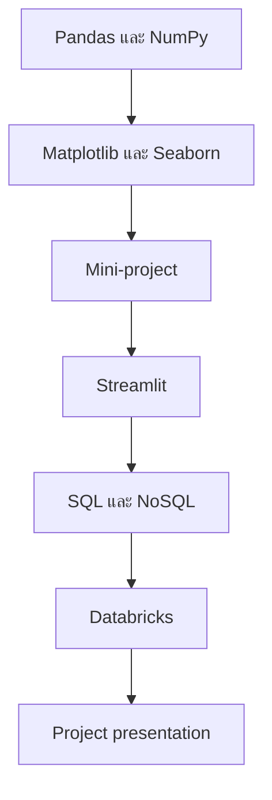

# DADS5001 Course Syllabus: แผนการเรียนรู้และกลยุทธ์การเรียนตลอดรายวิชา

> **รหัสวิชา:** วขวข 5001 (DADS 5001)  
> **ชื่อวิชา:** เครื่องมือและการเขียนโปรแกรมสำหรับการวิเคราะห์ข้อมูลและวิทยาการข้อมูล  
> **English title:** Data Analytics and Data Science Tools and Programming  
> **เอกสารต้นทาง:** `dads5001_course_syllabus.pdf` จำนวน 4 หน้า  
> **ภาคการศึกษา:** 1/2569  
> **วันที่ปรับปรุงเอกสาร:** 7 สิงหาคม 2569  
> **รูปแบบบันทึก:** Course Roadmap & Exam-Ready Master Note

## 1. Executive Summary

DADS5001 เป็นวิชาพื้นฐาน 3 หน่วยกิตของหลักสูตรวิทยาศาสตรมหาบัณฑิต สาขาการวิเคราะห์ข้อมูลและวิทยาการข้อมูล เป้าหมายไม่ใช่เพียงให้รู้จักเครื่องมือหลายตัว แต่ให้นักศึกษาสามารถ **เขียนโปรแกรม เลือกเครื่องมือให้เหมาะกับสถานการณ์ และนำเครื่องมือหลายประเภทมาพัฒนาระบบวิเคราะห์ข้อมูลเบื้องต้นได้**

โครงสร้างรายวิชาเดินจากงานวิเคราะห์ข้อมูลในหน่วยความจำ ไปสู่การสื่อสารผล การสร้างแอป ฐานข้อมูล และแพลตฟอร์มข้อมูล:



รายวิชามีเวลาเรียนรวม 45 ชั่วโมง แบ่งเป็น 15 คาบ คาบละ 3 ชั่วโมง และระบุชัดว่า **ไม่มีการสอบกลางภาคและไม่มีการสอบปลายภาค** การประเมินแบ่งครึ่งเทอมแรก 50% และครึ่งเทอมหลัง 50% จึงควรให้ความสำคัญกับการฝึกปฏิบัติ Mini-project, Project และความสามารถอธิบาย development journey มากกว่าการอ่านเพื่อจำเพียงอย่างเดียว

## 2. ข้อมูลทั่วไปของรายวิชา

| รายการ | รายละเอียด |
|---|---|
| รหัสวิชา | วขวข 5001 (DADS 5001) |
| ชื่อภาษาไทย | เครื่องมือและการเขียนโปรแกรมสำหรับการวิเคราะห์ข้อมูลและวิทยาการข้อมูล |
| ชื่อภาษาอังกฤษ | Data Analytics and Data Science Tools and Programming |
| จำนวนหน่วยกิต | 3 หน่วยกิต |
| ประเภทรายวิชา | วิชาพื้นฐาน (Basic Course) |
| หลักสูตร | วท.ม. การวิเคราะห์ข้อมูลและวิทยาการข้อมูล หลักสูตรปรับปรุง พ.ศ. 2564 |
| ชั้นปี | ปีที่ 1 |
| ภาคการศึกษา | 1/2569 |
| Prerequisite | ไม่มี |
| Co-requisite | ไม่มี |
| เวลาเรียน | วันอาทิตย์ 13.00–16.00 น. หรือตามที่ตกลง |
| จำนวนคาบ | 15 คาบ |
| ชั่วโมงรวม | 45 ชั่วโมง |
| รูปแบบเรียน | ที่ NIDA และออนไลน์ผ่าน Microsoft Teams |

แม้เอกสารระบุว่าไม่มี prerequisite แต่การมีพื้นฐาน Python เช่น variable, collection, condition, loop และ function จะช่วยลด cognitive load เพราะเนื้อหาเน้นการใช้ programming tools จริง ไม่ได้เป็นวิชาสอน Python syntax ตั้งแต่ศูนย์

## 3. ผู้สอนและช่องทางติดต่อ

| ผู้สอน | ส่วนเนื้อหาหลักตามแผน |
|---|---|
| รองศาสตราจารย์ ดร.ฐิติรัตน์ ศิริบวรรัตนกุล | Pandas, Matplotlib, Seaborn, NumPy และ Mini-project |
| ผู้ช่วยศาสตราจารย์ ดร.เอกรัฐ รัฐกาญจน์ | Streamlit, SQL, NoSQL, Databricks และ Project |

ช่องทางขอคำปรึกษา:

- Microsoft Teams ของรายวิชา
- `thitirat@as.nida.ac.th`
- `ekarat@as.nida.ac.th`

เอกสารไม่ได้กำหนด office hours แบบเวลาตายตัว นักศึกษาจึงควรนัดหมายล่วงหน้าและส่งคำถามพร้อม context เช่น code, error message, expected result และสิ่งที่ทดลองแล้ว

## 4. Course Goal และ Course Objectives

### 4.1 Course Goal

> **จากเอกสาร หน้า 2:** เพื่อให้นักศึกษารู้จักและสามารถเขียนโปรแกรมคอมพิวเตอร์เพื่อใช้งานเครื่องมือต่าง ๆ สำหรับการทำงานด้านการวิเคราะห์ข้อมูลและวิทยาการข้อมูลได้อย่างเหมาะสม

คำว่า “อย่างเหมาะสม” เป็นแกนสำคัญ เพราะรายวิชาไม่ได้วัดเพียงว่าเรียก function ได้หรือไม่ แต่ต้องตอบได้ว่า:

- ทำไมเลือก Pandas แทน Excel/NumPy/SQL
- เมื่อใดควรใช้ relational database หรือ document database
- เมื่อใด notebook analysis ควรถูกนำไปทำเป็น Streamlit app
- เมื่อใดข้อมูลหรือ workload เหมาะกับ Databricks

### 4.2 Course Objectives

เมื่อจบรายวิชา นักศึกษาควร:

1. รู้จักเครื่องมือและไลบรารีพื้นฐานสำหรับ Data Analytics และ Data Science
2. เลือกใช้เครื่องมือและไลบรารีจัดการข้อมูลได้เหมาะกับสถานการณ์
3. พัฒนาระบบวิเคราะห์ข้อมูลและวิทยาการข้อมูลเบื้องต้นได้

วัตถุประสงค์ทั้งสามมีลำดับการเรียนรู้:

```text
รู้จักเครื่องมือ → เลือกเครื่องมือ → บูรณาการเป็นระบบ
```

การเรียนให้บรรลุเป้าหมายจึงต้องทำมากกว่าดูตัวอย่าง ต้องทดลองแก้โจทย์ใหม่ อธิบายข้อจำกัด และเชื่อม output ของเครื่องมือหนึ่งเป็น input ของอีกเครื่องมือหนึ่ง

## 5. Course Description: สิ่งที่วิชาต้องการให้ทำได้จริง

คำอธิบายรายวิชาระบุการศึกษาและฝึกปฏิบัติ:

- แนวคิด วิธีการ และเทคนิคการเขียนโปรแกรมหลายรูปแบบ
- การทำให้โปรแกรมทำงานอย่างมีประสิทธิภาพ
- การใช้เครื่องมือพื้นฐานสำหรับ Data Analytics และ Data Science

จึงมีผลต่อวิธีเรียน 3 ประการ:

1. **Concept:** เข้าใจ mental model เช่น labeled data, vectorization, relational model และ distributed processing
2. **Code:** เขียนและแก้ code ได้ ไม่ใช่เพียงอ่านแล้วเข้าใจ
3. **Efficiency:** เลือก dtype, operation, data structure และ platform ให้เหมาะกับขนาดและลักษณะงาน

## 6. Weekly Learning Roadmap

### 6.1 ครึ่งเทอมแรก: Data Analysis Foundation

| ลำดับการเรียนตามเนื้อหา | หัวข้อ | ชั่วโมง | สิ่งที่ควรทำได้หลังเรียน |
|---:|---|---:|---|
| 1 | Introduction, Pandas 1 | 3 | เข้าใจ EDA, Series/DataFrame, I/O, index และการเลือกข้อมูล |
| 2 | Pandas 2 | 3 | กรองตามเงื่อนไข จัดการ missing และ duplicated data |
| 3 | Pandas 3 | 3 | Aggregate, transform และ group data |
| 4 | Pandas 4 | 3 | Combine, reshape และ style ตาราง |
| 5 | Matplotlib and Seaborn 1 | 3 | เข้าใจโครงสร้างกราฟและสร้าง visualization พื้นฐาน |
| 6 | Matplotlib and Seaborn 2 | 3 | เลือกกราฟให้เหมาะกับตัวแปรและคำถาม |
| 7 | Matplotlib and Seaborn 3, NumPy | 3 | ปรับแต่ง visualization และใช้ numerical array |
| 8 | Mini-project presentation | 3 | สื่อสารคำถาม วิธีเตรียมข้อมูล EDA และ insight |

ครึ่งแรกสร้าง data-analysis pipeline:

```text
Load → Inspect → Clean → Transform → Aggregate → Visualize → Explain
```

### 6.2 ครึ่งเทอมหลัง: Application, Database และ Data Platform

| ลำดับการเรียนตามเนื้อหา | หัวข้อ | ชั่วโมง | สิ่งที่ควรทำได้หลังเรียน |
|---:|---|---:|---|
| 9 | Streamlit 1 | 3 | เปลี่ยน Python analysis เป็น interactive interface |
| 10 | Streamlit 2 | 3 | จัด state, input/output และโครงสร้าง data app |
| 11 | SQL (Supabase) | 3 | สืบค้นและจัดการ relational data ผ่าน SQL/cloud database |
| 12 | NoSQL (MongoDB) | 3 | ทำงานกับ document-oriented data และเข้าใจ use case |
| 13 | Databricks 1 | 3 | เข้าใจ workspace และ data/compute workflow |
| 14 | Databricks 2 | 3 | ประยุกต์ pipeline/analytics บนแพลตฟอร์ม |
| 15 | Project presentation | 3 | บูรณาการเครื่องมือและนำเสนอระบบ/ผลการวิเคราะห์ |

ครึ่งหลังขยายจาก notebook ของนักวิเคราะห์ไปสู่ระบบที่ผู้อื่นใช้งานหรือเข้าถึงข้อมูลได้:

```text
Notebook → Data App → Database → Data Platform → Integrated Project
```

## 7. การตีความบทบาทของแต่ละเครื่องมือ

| เครื่องมือ | ปัญหาหลักที่แก้ | จุดเด่น | ไม่ควรใช้แทนอะไรโดยไม่จำเป็น |
|---|---|---|---|
| Pandas | จัดการข้อมูลตารางใน Python | Cleaning, transformation, grouping, joining | ฐานข้อมูลสำหรับ concurrent users หรือข้อมูลเกิน RAM มาก |
| NumPy | คำนวณ numerical arrays | Vectorization และ matrix operations | labeled heterogeneous table ที่ Pandasเหมาะกว่า |
| Matplotlib | ควบคุมองค์ประกอบกราฟละเอียด | ยืดหยุ่นและเป็นฐาน visualization | interactive BI platform โดยตรง |
| Seaborn | Statistical visualization | syntax กระชับและ default สวย | การคำนวณสถิติที่ต้องควบคุมแบบจำลองอย่างละเอียด |
| Streamlit | สร้าง data app จาก Python | เร็วสำหรับ prototype/internal app | ระบบ enterprise ที่ต้องการ architecture ซับซ้อนโดยอัตโนมัติ |
| SQL/Supabase | relational storage และ query | schema, relationship, transaction และ SQL | document ที่ schema แปรผันมากในทุกกรณี |
| MongoDB | document-oriented storage | flexible nested documents | relational workload ที่ join/constraint เป็นแกนหลักเสมอ |
| Databricks | data engineering/analytics platform | scalable compute และ collaborative workflow | local notebook สำหรับข้อมูลเล็กทุกงาน |

**คำอธิบายเพิ่มเติม:** Course objective เรื่อง “เลือกใช้เครื่องมือให้เหมาะสม” หมายถึงการอธิบาย trade-off ได้ ไม่ใช่ประกาศว่าเครื่องมือใดดีที่สุดแบบสากล

## 8. การเรียนการสอน

### ครึ่งเทอมแรก

- บรรยายและอภิปราย
- ยกตัวอย่างผ่านการรันโปรแกรมจริง
- ปิดช่วงด้วย Mini-project presentation

### ครึ่งเทอมหลัง

- บรรยายและอภิปราย
- ฝึกเขียนโปรแกรมจริงบนเครื่องคอมพิวเตอร์
- ปิดช่วงด้วย Project presentation

รูปแบบนี้ทำให้การมาเรียนและรัน code ตามมีความสำคัญ เพราะ Notebook อาจเป็น reference ที่มีหลายวิธี แต่ key takeaway และเหตุผลในการเลือกวิธีเกิดจากการอธิบายในชั้นเรียน

## 9. Assessment Structure

### 9.1 ข้อมูลที่ระบุชัดใน Syllabus

| ส่วนประเมิน | สัดส่วน |
|---|---:|
| ครึ่งเทอมแรก | 50% |
| ครึ่งเทอมหลัง | 50% |
| รวม | 100% |

และระบุว่า:

- ไม่มีสอบกลางภาค
- ไม่มีสอบปลายภาค

### 9.2 สิ่งที่ Syllabus ยังไม่ได้แจกแจง

เอกสารไม่ได้ระบุคะแนนย่อยว่า 50% แต่ละครึ่งประกอบด้วย:

- Mini-project/Project กี่เปอร์เซ็นต์
- Assignment/Lab กี่เปอร์เซ็นต์
- Participation/Comment กี่เปอร์เซ็นต์
- เกณฑ์ rubric ของการนำเสนอ

ดังนั้นไม่ควรเดาสัดส่วนคะแนนจาก Course Syllabus นี้เพียงอย่างเดียว ต้องตรวจ announcement, class material หรือคำชี้แจงของผู้สอนล่าสุด

## 10. จุดไม่สอดคล้องในเอกสารที่ควรยืนยัน

### 10.1 เลขคาบใน Weekly Contents

ตารางหน้า 2–3 แสดงเนื้อหาครึ่งแรกเป็นคาบ 1–8 แล้วเว้นคาบ 9–10 เพื่อระบุว่าไม่มีสอบกลางภาค จากนั้น Streamlit เริ่มที่หมายเลข 11 และ Project presentation อยู่ที่ 17 ก่อนเว้น 18–19 เพื่อระบุว่าไม่มีสอบปลายภาค

แต่ในหัวข้อ Semester Hours ระบุว่ามี **15 คาบ** และตาราง Evaluation ระบุครึ่งเทอมหลังเป็น **คาบ 9–15**

การตีความที่สอดคล้องกับ 15 คาบคือมีเนื้อหา 8 คาบแรก + 7 คาบหลัง รวม 15 คาบ ส่วนหมายเลข 11–17 ในตารางน่าจะนับรวมช่องสอบที่ไม่มีการจัดสอบ อย่างไรก็ตามนี่เป็นเพียงการอนุมานจากโครงสร้างเอกสาร ต้องยืนยันกับ class schedule ล่าสุด

### 10.2 ช่วงเวลาประเมิน

Evaluation ระบุครึ่งเทอมแรกคาบ 1–8 และครึ่งเทอมหลังคาบ 9–15 ซึ่งสอดคล้องกับ 15 teaching sessions มากกว่าเลข 11–17 ใน Weekly Contents

### 10.3 ชื่อ DataBricks

เอกสารใช้ `DataBricks` แต่ชื่อผลิตภัณฑ์อย่างเป็นทางการเขียนว่า `Databricks` ใน Master Note นี้ใช้ Databricks เมื่ออธิบายเครื่องมือ แต่คงความหมายว่ามาจากหัวข้อเดียวกัน

## 11. กลยุทธ์การเรียนสำหรับรายวิชานี้

### 11.1 หลังเรียนแต่ละคาบ

ควรทำ 4 อย่าง:

1. รันทุก code cell และบันทึก environment/version
2. แก้ตัวอย่างอย่างน้อยหนึ่งเงื่อนไขเพื่อทดสอบความเข้าใจ
3. เขียน “why this method” ไม่ใช่บันทึก syntax อย่างเดียว
4. เก็บ error ที่พบ พร้อม cause และ fix

### 11.2 โครงสร้าง Repository ที่เหมาะสม

```text
dads5001-data-tools/
├── week_01/
│   ├── pandas1.ipynb
│   └── pandas1.md
├── week_02/
│   ├── pandas2.ipynb
│   └── pandas2.md
├── mini-project/
│   ├── data/
│   ├── notebooks/
│   ├── src/
│   └── README.md
└── final-project/
```

ไม่ควรใส่ lecturer-provided PDF ลง public repository หากไม่ได้รับอนุญาต ให้เก็บเฉพาะ Master Notes, code, exercise และผลงานที่สร้างเอง

### 11.3 Checklist ก่อน Mini-project

- คำถามชัดและตอบได้ด้วยข้อมูล
- ดาวน์โหลดข้อมูลได้จริงและ metadata พอ
- ระบุ grain และ key
- มี cleaning/transformation ที่ตรวจสอบได้
- ใช้ Pandas และ visualization อย่างมีสาระ
- Insight ทุกข้อมี code/table/chart รองรับ
- README อธิบาย development journey
- ลิงก์และ code รันซ้ำได้
- ไม่มี AI trace หรือข้อสรุปที่ข้อมูลไม่รองรับ

### 11.4 Checklist ก่อน Final Project

- อธิบาย architecture และบทบาทของแต่ละเครื่องมือ
- แยก data layer, processing layer และ presentation layer
- เลือก SQL/NoSQL จากโครงสร้างและ access pattern
- Streamlit app ใช้งานได้และจัดการ error/input
- Databricks/แพลตฟอร์มถูกใช้เพราะตอบโจทย์ ไม่ใช่เพียงให้มีชื่อเครื่องมือ
- มี validation และ reproducibility
- สามารถ demo และตอบคำถาม trade-off ได้

## 12. Likely Assessment Focus

> หัวข้อนี้เป็นการอนุมานจาก Course Objectives, ลำดับเนื้อหา และรูปแบบ presentation ไม่ใช่ข้อมูลเกณฑ์คะแนนจริง

### ความรู้ที่ควรอธิบายได้

- บทบาทของเครื่องมือแต่ละตัว
- ความต่างระหว่าง Pandas, NumPy, SQL, MongoDB และ Databricks
- เหตุผลในการเลือก data structure/database/platform
- workflow จาก raw data ไปสู่ insight หรือ data app

### ทักษะที่ควรทำได้

- โหลด ตรวจ ทำความสะอาด และแปลงข้อมูล
- สร้าง visualization ที่ตอบคำถาม
- เขียน code ที่อ่านได้และรันซ้ำได้
- สร้าง interactive application เบื้องต้น
- query relational/document data
- อธิบาย development journey และข้อจำกัด

### สิ่งที่ presentation น่าจะต้องแสดง

- Problem/question
- Data source และข้อจำกัด
- Method/workflow
- Demonstration หรือ visualization
- Evidence-supported insight
- Tool-selection rationale
- Limitations และ next steps

## 13. Practice Questions

### Recall

**Q1.** DADS5001 เป็นรายวิชาประเภทใด กี่หน่วยกิต และกี่ชั่วโมง?  
**Q2.** รายวิชานี้มีสอบกลางภาคหรือปลายภาคหรือไม่?  
**Q3.** Course Objectives สามข้อคืออะไร?  
**Q4.** เครื่องมือหลักในครึ่งเทอมแรกและครึ่งเทอมหลังมีอะไรบ้าง?

### Explain

**Q5.** อธิบายลำดับ “รู้จัก → เลือก → บูรณาการ” จาก Course Objectives  
**Q6.** ทำไมวิชานี้ต้องเรียน Pandas/Visualization ก่อน Streamlit/Database/Databricks?  
**Q7.** เพราะเหตุใดการไม่มีข้อสอบไม่ได้หมายความว่าไม่ต้องเตรียมความรู้เชิงแนวคิด?

### Compare

**Q8.** เปรียบเทียบ Pandas กับ SQL ในด้านประเภทงานและข้อจำกัด  
**Q9.** เปรียบเทียบ Supabase/relational database กับ MongoDB/document database  
**Q10.** Mini-project และ Final Project ควรสะท้อนระดับการบูรณาการต่างกันอย่างไร?

### Apply and Analyze

**Q11.** หากข้อมูลเป็น CSV 50,000 แถวและต้องทำ EDA ควรเริ่มด้วยเครื่องมือใด เพราะเหตุใด?  
**Q12.** หากต้องสร้างระบบให้ผู้ใช้หลายคนค้นข้อมูล transaction พร้อมกัน ควรใช้ Pandas file อย่างเดียวหรือฐานข้อมูล?  
**Q13.** พบว่า Weekly Contents ใช้คาบ 11–17 แต่ Evaluation ใช้ 9–15 ควรปฏิบัติอย่างไร?  
**Q14.** เสนอ architecture ขั้นต้นที่เชื่อม Database, Python processing และ Streamlit

## 14. Model Answers with Reasoning

**A1.** เป็นวิชาพื้นฐาน 3 หน่วยกิต รวม 45 ชั่วโมง 15 คาบ คาบละ 3 ชั่วโมง

**A2.** Syllabus ระบุว่าไม่มีทั้งสอบกลางภาคและสอบปลายภาค

**A3.** รู้จักเครื่องมือพื้นฐาน เลือกใช้เครื่องมือจัดการข้อมูลตามสถานการณ์ และพัฒนาระบบวิเคราะห์เบื้องต้น

**A4.** ครึ่งแรก: Pandas, Matplotlib, Seaborn, NumPy และ Mini-project; ครึ่งหลัง: Streamlit, SQL/Supabase, MongoDB, Databricks และ Project

**A5.** ต้องมี vocabulary และ mental model ของเครื่องมือก่อนจึงเปรียบเทียบความเหมาะสมได้ จากนั้นจึงเชื่อมหลายเครื่องมือเป็น workflow หรือระบบ

**A6.** ต้องจัดการและเข้าใจข้อมูลก่อนสื่อสารผลหรือสร้าง application; database/platform เป็นชั้นจัดเก็บและประมวลผลที่ขยายจาก local analysis

**A7.** การประเมินผ่าน project/presentation ยังต้องอธิบายเหตุผล วิธีทำ และ trade-off ความเข้าใจเชิงแนวคิดจึงจำเป็นต่อการเขียน code และตอบคำถาม

**A8.** Pandas เหมาะกับ in-memory analysis ใน Python; SQL เหมาะกับ persistent relational data, query และ multi-user access ทั้งสองใช้ร่วมกันได้โดย SQL ลดข้อมูลก่อนส่งให้ Pandas วิเคราะห์

**A9.** Relational database ใช้ schema/relationship/constraint ชัดและ SQL; document database เหมาะกับ nested documents และ schema ยืดหยุ่น การเลือกขึ้นกับ data model และ query pattern

**A10.** Mini-project ควรแสดง data cleaning, EDA และ visualization อย่างลึก ส่วน Final Project ควรเพิ่ม application/database/platform และ integration

**A11.** เริ่มด้วย Pandas เพราะขนาดมักจัดการในหน่วยความจำได้และเหมาะกับ inspect/clean/EDA แต่ต้องตรวจ RAM และ dtype จริง

**A12.** ควรใช้ฐานข้อมูลเป็น persistent multi-user layer แล้วให้ Pandas query subset สำหรับ analysis; file อย่างเดียวมีข้อจำกัดด้าน concurrency, governance และ query efficiency

**A13.** ไม่เดาเอง ให้ยึด announcement/class schedule ล่าสุดและสอบถามผู้สอน เพราะ Course Syllabus มีเลขคาบไม่สอดคล้องกัน

**A14.** Database เก็บข้อมูล → Python/Pandas query และแปลง → Streamlit รับ input และแสดง result โดยแยก credentials/config ออกจาก code และ validate user input

## 15. Key Takeaways

1. DADS5001 มุ่งให้ใช้และเลือกเครื่องมืออย่างเหมาะสม ไม่ใช่จำ syntax แยกส่วน
2. รายวิชาเดินจาก tabular analysis และ visualization ไปสู่ app, database และ data platform
3. มี 15 คาบ 45 ชั่วโมง และไม่มีสอบกลางภาค/ปลายภาค
4. การประเมินแบ่งครึ่งแรก 50% และครึ่งหลัง 50% แต่คะแนนย่อยต้องตรวจจากประกาศล่าสุด
5. Mini-project เป็นจุดรวมทักษะ analysis/visualization ส่วน Final Project เน้น integration มากขึ้น
6. การเรียนให้ได้ผลต้องรัน code ดัดแปลงตัวอย่าง อธิบายเหตุผล และบันทึก error/fix
7. มีความไม่สอดคล้องของเลขคาบระหว่าง Weekly Contents กับ Evaluation จึงต้องยืนยัน class schedule
8. Repository ควรเก็บงานที่สร้างเองและ development journey โดยไม่เผยแพร่เอกสารผู้สอนหากไม่ได้รับอนุญาต

## 16. Glossary

| Term | ความหมายในบริบทรายวิชา |
|---|---|
| Basic Course | วิชาพื้นฐานที่สร้างความพร้อมสำหรับวิชาหรือโครงการขั้นสูง |
| Data Analytics | การตรวจ แปลง วิเคราะห์ และสื่อสารข้อมูลเพื่อสร้าง insight |
| Data Science | การใช้ programming, statistics และ domain knowledge เพื่อเรียนรู้จากข้อมูล |
| Data App | Application ที่รับ input ประมวลผลข้อมูล และนำเสนอผลให้ผู้ใช้ |
| Relational Database | ฐานข้อมูลที่จัดข้อมูลเป็นตารางและความสัมพันธ์ภายใต้ schema |
| NoSQL | กลุ่มฐานข้อมูลที่ไม่ยึด relational model แบบเดียว เช่น document database |
| Reproducibility | ความสามารถในการรันกระบวนการซ้ำแล้วได้ผลตามที่คาดภายใต้ environment ที่ระบุ |
| Development Journey | บันทึกเส้นทางตั้งแต่คำถาม การหา/ทำความสะอาดข้อมูล การลองผิด ไปจนถึงผลลัพธ์ |
| Tool Selection | การเลือกเครื่องมือจาก requirement, data structure, scale และ trade-off |

## 17. References

- สถาบันบัณฑิตพัฒนบริหารศาสตร์ คณะสถิติประยุกต์. *รายละเอียดของรายวิชา DADS 5001: Data Analytics and Data Science Tools and Programming*, ปรับปรุง 7 สิงหาคม 2569, 4 หน้า.

