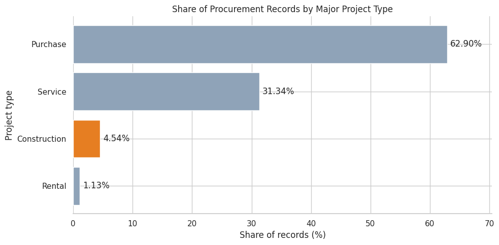
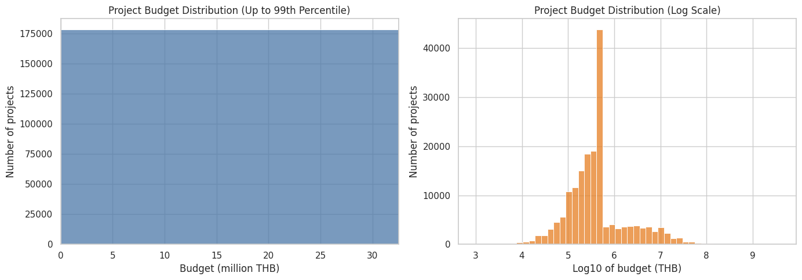
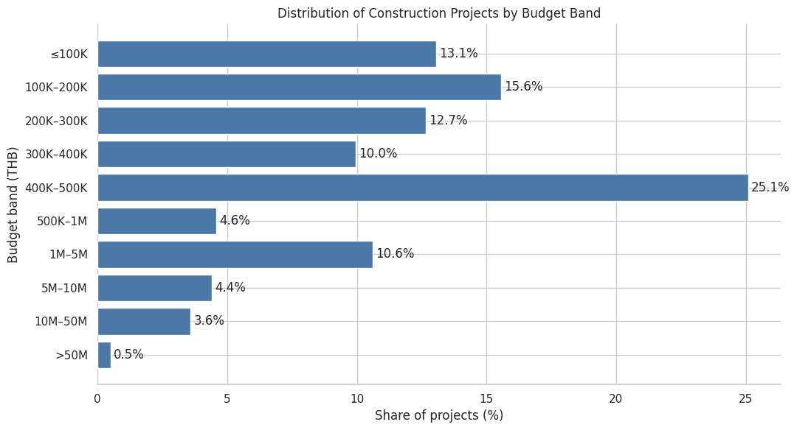
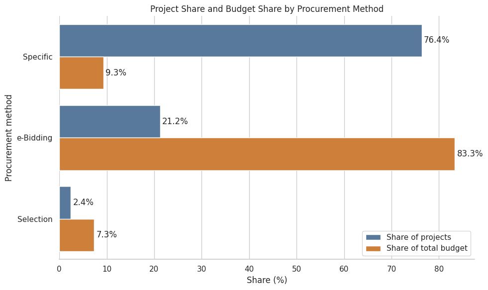
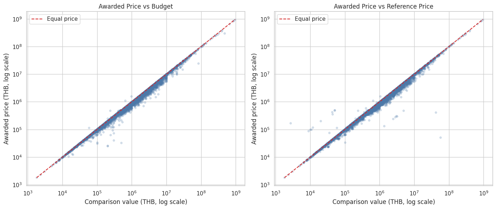
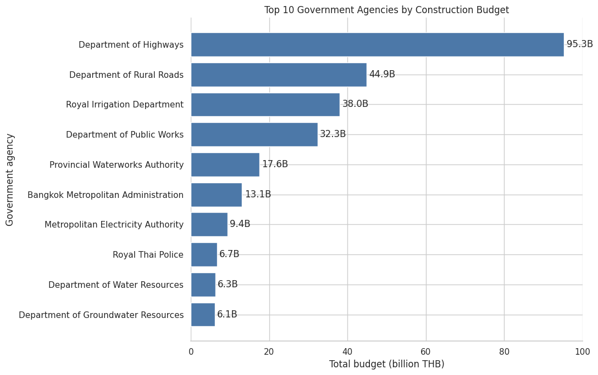
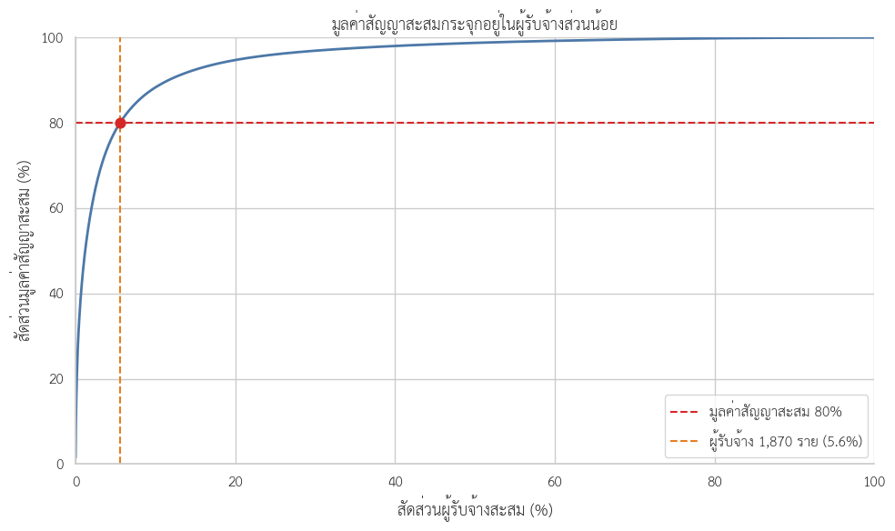
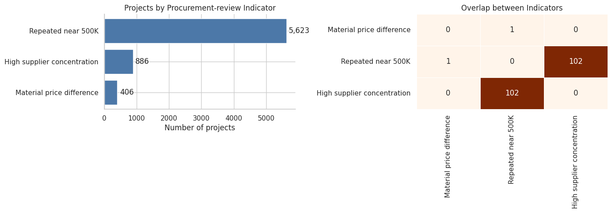

# จากข้อมูลจัดซื้อจัดจ้างเกือบ 4 ล้านรายการ สู่โครงการก่อสร้างที่ควรตรวจสอบก่อน

> DADS5001 Data Tools and Programming — Mini Project  
> README ฉบับนี้นำเสนอเฉพาะการวิเคราะห์โครงการจ้างก่อสร้างปีงบประมาณ 2569 ส่วนภาพรวมสัญญาทุกประเภทปี 2567–2569 จะเชื่อมเข้ามาภายหลัง

ข้อมูลจัดซื้อจัดจ้างภาครัฐมีโครงการจำนวนมากเกินกว่าจะตรวจเอกสารทุกโครงการพร้อมกัน งานนี้จึงตั้งคำถามว่า:

> **ในโครงการจ้างก่อสร้างเกือบ 180,000 โครงการ มีรูปแบบใดที่ช่วยคัดกรองโครงการซึ่งควรเปิดเอกสารตรวจสอบก่อน?**

การวิเคราะห์ไม่ได้สร้าง “คะแนนทุจริต” แต่ใช้ข้อมูลเพื่อหาเบาะแสที่อธิบายได้ กำหนดเกณฑ์อย่างโปร่งใส และลดขอบเขตการตรวจสอบให้แคบลง

## คำตอบโดยสรุป

| คำถาม | สิ่งที่พบ |
|---|---|
| โครงการมีขนาดอย่างไร | 76.34% มีงบประมาณไม่เกิน 500,000 บาท และการกระจายเบ้ขวาอย่างมาก |
| วิธีจัดซื้อแตกต่างกันอย่างไร | วิธีเฉพาะเจาะจงมี 76.35% ของจำนวนโครงการ แต่คิดเป็น 9.33% ของวงเงิน ขณะที่ e-bidding มี 21.22% ของโครงการและ 83.34% ของวงเงิน |
| ราคาที่ตกลงสัมพันธ์กับกรอบราคาอย่างไร | ส่วนใหญ่อยู่ไม่เกินงบประมาณหรือราคากลาง แต่พบ 406 โครงการที่สูงกว่าอย่างมีสาระสำคัญ |
| ผู้รับจ้างกระจุกตัวหรือไม่ | ระดับประเทศไม่มีรายเดียวครองมูลค่าสูงมาก แต่พบ 55 ความสัมพันธ์ระดับหน่วยงานย่อย–ผู้รับจ้างที่กระจุกตัวสูง ครอบคลุม 886 โครงการ |
| ควรตรวจอะไรเป็นลำดับแรก | 103 โครงการพบตัวชี้วัดพร้อมกัน 2 มิติ จึงถูกจัดเป็น High priority |

## 1. จากข้อมูล e-GP สู่ขอบเขตงานก่อสร้าง

ข้อมูล e-GP ในโครงการนี้ประกอบด้วยไฟล์ CSV ปีงบประมาณ 2569 จำนวน 8 ไฟล์ รวม 3,964,924 แถว ครอบคลุมข้อมูลโครงการ หน่วยงาน วิธีจัดซื้อ งบประมาณ ราคากลาง ราคาที่ตกลง ผู้ชนะ และรายละเอียดสัญญา

เมื่อจำแนกตามประเภท พบรายการ `จ้างก่อสร้าง` 180,079 แถว หรือ 4.54% ของจำนวนแถวทั้งหมด แม้สัดส่วนต่ำกว่าประเภทซื้อและจ้างบริการ แต่มีข้อมูลมากพอสำหรับศึกษาความแตกต่างของขนาดโครงการ ราคา วิธีจัดซื้อ และผู้รับจ้าง

  

  <em>รูปที่ 1: สัดส่วนจำนวนรายการจัดซื้อจัดจ้างประเภทหลักในปีงบประมาณ 2569</em>

ตัวเลข 4.54% เป็นสัดส่วนของ **จำนวนแถว** ไม่ใช่สัดส่วนมูลค่า และหนึ่งโครงการอาจมีหลายแถว จึงต้องกำหนดหน่วยวิเคราะห์ก่อนเริ่ม EDA

## 2. หนึ่งแถวไม่เท่ากับหนึ่งโครงการ

| คำ | ความหมายในการวิเคราะห์นี้ |
|---|---|
| รายการหรือแถว | ระเบียนหนึ่งแถวในไฟล์ อาจซ้ำรหัสโครงการเมื่อมีหลายสัญญาหรือหลายคู่สัญญา |
| โครงการ | หน่วยวิเคราะห์หลัก ระบุด้วย `รหัสโครงการ` |
| สัญญา | ข้อตกลงภายใต้โครงการ โดยโครงการหนึ่งอาจมีหลายสัญญา |
| ผู้รับจ้าง | ผู้ชนะการเสนอราคาหรือคู่สัญญา |
| วงเงินงบประมาณ | กรอบงบประมาณของโครงการ |
| ราคากลาง | ราคาอ้างอิงของโครงการ |
| ราคาที่ตกลง | ราคาที่ตกลงรวมทุกสัญญาในโครงการ |

หลังจัดข้อมูลด้วย `รหัสโครงการ` เหลือ 178,978 โครงการไม่ซ้ำจากข้อมูลก่อสร้าง 180,079 แถว พบ 524 โครงการที่มีมากกว่าหนึ่งแถว ซึ่งอาจเกิดจากหลายสัญญา หลายผู้รับจ้าง หรือโครงสร้างกิจการร่วมค้า แถวเหล่านี้จึงไม่ถูกลบทิ้ง แต่ใช้ต่างวัตถุประสงค์กัน:

- วิเคราะห์ขนาด ราคา วิธีจัดซื้อ หน่วยงาน และพื้นที่ในระดับโครงการ
- วิเคราะห์สัญญา ผู้รับจ้าง และกิจการร่วมค้าจากข้อมูลครบทุกแถว

## 3. เบาะแสแรก: สามในสี่ของโครงการมีงบไม่เกิน 500,000 บาท

วงเงินงบประมาณมีค่ามัธยฐาน 395,000 บาท แต่ค่าเฉลี่ยประมาณ 2.66 ล้านบาท เพราะมีโครงการมูลค่าสูงจำนวนน้อยดึงค่าเฉลี่ยขึ้น จากรูปที่ 2 กราฟด้านซ้ายแสดง 99% แรกของข้อมูล ส่วนกราฟด้านขวาใช้สเกลลอการิทึมเพื่อให้เห็นโครงการทั้งขนาดเล็กและใหญ่ โดยไม่ได้ตัดโครงการมูลค่าสูงออกจากการคำนวณ

  

  <em>รูปที่ 2: การกระจายวงเงินงบประมาณของโครงการจ้างก่อสร้างในสเกลปกติและสเกลลอการิทึม</em>

เมื่อแบ่งช่วงงบประมาณ พบว่า 76.34% ของโครงการมีงบไม่เกิน 500,000 บาท โดยช่วง 400,000–500,000 บาทมีสัดส่วนสูงที่สุด 25.09% ขณะที่โครงการเกิน 50 ล้านบาทมีเพียง 0.49%

  

  <em>รูปที่ 3: สัดส่วนโครงการจ้างก่อสร้างจำแนกตามช่วงวงเงินงบประมาณ</em>

วงเงินที่พบบ่อยที่สุดคือ 500,000 บาท จำนวน 6,523 โครงการ และยังพบจำนวนมากที่ 499,000, 498,000, 497,000, 496,000, 495,000 และ 490,000 บาท จุดกระจุกตัวนี้ยังไม่ใช่ความผิดปกติ แต่ทำให้เกิดคำถามต่อว่าเกี่ยวข้องกับวิธีจัดซื้อประเภทใด

## 4. จำนวนโครงการมาก ไม่ได้หมายถึงวงเงินรวมมาก

จากรูปที่ 4 วิธีเฉพาะเจาะจงมีจำนวนมากที่สุด 76.35% แต่คิดเป็นวงเงินเพียง 9.33% และมีงบมัธยฐาน 283,000 บาท ตรงกันข้ามกับ e-bidding ซึ่งมี 21.22% ของจำนวนโครงการ แต่ครองวงเงิน 83.34% และมีงบมัธยฐานประมาณ 3.10 ล้านบาท

  

  <em>รูปที่ 4: เปรียบเทียบสัดส่วนจำนวนโครงการและวงเงินรวมตามวิธีจัดซื้อจัดจ้าง</em>

เมื่อเจาะเฉพาะวิธีเฉพาะเจาะจง พบว่า 99.57% มีงบไม่เกิน 500,000 บาท และ 19.14% อยู่ในช่วง 490,000–500,000 บาท จึงนำไปสู่สมมติฐานว่าโครงการใกล้ 500,000 บาทบางส่วนอาจเกิดซ้ำภายใต้หน่วยงานและผู้รับจ้างเดียวกัน

## 5. ราคาส่วนใหญ่เคลื่อนไหวตามกรอบ แต่มีค่าที่ต้องแยกตรวจ

ราคาที่ตกลงส่วนใหญ่อยู่ใกล้หรือต่ำกว่างบประมาณและราคากลาง ดังเห็นจากจุดที่เรียงใกล้หรือใต้เส้นราคาเท่ากันในรูปที่ 5 กราฟใช้ตัวอย่าง 10,000 โครงการเพื่อการแสดงผล ส่วนจำนวนและสถิติคำนวณจากข้อมูลทั้งหมด

  

  <em>รูปที่ 5: ความสัมพันธ์ระหว่างราคาที่ตกลงกับวงเงินงบประมาณและราคากลาง</em>

67.42% ของโครงการมีราคาตกลงต่ำกว่างบประมาณ และ 77.81% ต่ำกว่าราคากลาง อย่างไรก็ตาม ราคากลางบางรายการต่ำหรือสูงผิดสังเกตจนทำให้ค่าร้อยละรุนแรง จึงต้องตรวจคุณภาพราคากลางก่อนพิจารณาส่วนต่างราคาเป็นตัวชี้วัด

## 6. หน่วยงานและผู้รับจ้างต้องดูทั้งจำนวนและมูลค่า

กรมทางหลวงมีวงเงินก่อสร้างรวมสูงที่สุดประมาณ 95.33 พันล้านบาท หรือ 20.03% ของวงเงินทั้งหมด จาก 5,774 โครงการ รองลงมาคือกรมทางหลวงชนบทและกรมชลประทาน ส่วนกรมโยธาธิการและผังเมืองมีเพียง 780 โครงการ แต่มีงบมัธยฐาน 20 ล้านบาท สะท้อนว่าแต่ละหน่วยงานมีโครงสร้างขนาดโครงการต่างกัน

  

  <em>รูปที่ 6: หน่วยงานภาครัฐ 10 อันดับแรกตามวงเงินโครงการจ้างก่อสร้างรวม</em>

ก่อนรวมมูลค่าผู้รับจ้าง ต้องจัดการโครงสร้างกิจการร่วมค้าเพื่อไม่ให้นับทั้งมูลค่าของกิจการร่วมค้าและส่วนแบ่งของสมาชิกซ้ำ หลังปรับแล้วพบ Supplier Entity 33,570 ราย

ผู้รับจ้างรายใหญ่ที่สุดครองมูลค่า 1.51% ผู้รับจ้าง 10 อันดับแรกครอง 7.42% และ 100 อันดับแรกครอง 27.83% ขณะที่ผู้รับจ้าง 1,870 ราย หรือ 5.57% ครองมูลค่าสะสม 80%

  

  <em>รูปที่ 7: มูลค่าสัญญาสะสมเทียบกับสัดส่วนผู้รับจ้างสะสม</em>

รูปที่ 7 แสดงการกระจุกตัวเชิง Pareto แต่ไม่ได้หมายความว่ามีผู้รับจ้างรายเดียวครองตลาด คำถามที่เหมาะสมกว่าคือ ภายในหน่วยงานย่อยแต่ละแห่งมีผู้รับจ้างรายใดครองทั้งจำนวนโครงการและมูลค่าสูงหรือไม่

## 7. จากเบาะแสสู่ตัวชี้วัดที่ตรวจสอบได้

ก่อนสร้างตัวชี้วัดด้านการจัดซื้อ พบ 822 โครงการที่มีประเด็นคุณภาพข้อมูลอย่างน้อยหนึ่งข้อ ได้แก่ ราคากลางสูญหายหรือมีสัดส่วนผิดสังเกต และยอด Supplier Entity ไม่ตรงกับยอดระดับโครงการ

ในขั้นแรกมี 362 โครงการที่ผลรวมระดับสัญญาไม่ตรงกับยอดระดับโครงการ เมื่อตรวจพบแถวสมาชิกกิจการร่วมค้า 710 แถวและไม่นับมูลค่าซ้ำ เหลือยอดไม่ตรงกันเพียง 11 โครงการ ปัญหาคุณภาพข้อมูลทั้งหมดถูกติดตามแยกและไม่เพิ่มระดับความสำคัญของโครงการ

ตัวชี้วัดด้านการจัดซื้อกำหนดไว้ 3 มิติ:

| ตัวชี้วัด | เกณฑ์ | ผลที่พบ |
|---|---|---:|
| ส่วนต่างราคาอย่างมีสาระสำคัญ | ราคาตกลงสูงกว่างบประมาณหรือราคากลางที่ใช้งานได้ มากกว่า 10,000 บาทและมากกว่า 1% | 406 โครงการ |
| รูปแบบใกล้ 500,000 บาทที่เกิดซ้ำ | วิธีเฉพาะเจาะจง งบ 490,000–500,000 บาท และมีอย่างน้อย 3 โครงการที่หน่วยงานย่อย ผู้รับจ้าง และวันที่เกิดรายการตรงกัน | 5,623 โครงการ |
| การกระจุกตัวสูงของผู้รับจ้าง | ผู้รับจ้างได้อย่างน้อย 10 โครงการ และครองอย่างน้อย 75% ทั้งจำนวนและมูลค่าในหน่วยงานย่อย | 886 โครงการ |

ตัวชี้วัดราคา 406 โครงการเกิดจาก 220 โครงการที่สูงกว่างบประมาณ และ 281 โครงการที่สูงกว่าราคากลาง โดยมี 95 โครงการซ้อนทับกัน การรวมสองเงื่อนไขเป็นมิติเดียวช่วยไม่ให้โครงการเดียวถูกนับคะแนนซ้ำจากแนวคิดเรื่องราคา

  

  <em>รูปที่ 8: จำนวนโครงการที่ผ่านตัวชี้วัดแต่ละมิติและการซ้อนทับระหว่างตัวชี้วัด</em>

## 8. จาก 178,978 โครงการ เหลือ 103 โครงการสำหรับตรวจลำดับแรก

| ระดับ | เงื่อนไข | จำนวนโครงการ | สัดส่วน | ราคาตกลงรวม |
|---|---|---:|---:|---:|
| High priority | พบตัวชี้วัด 2 มิติ | 103 | 0.06% | 0.05 พันล้านบาท |
| Standard review | พบตัวชี้วัด 1 มิติ | 6,709 | 3.75% | 4.40 พันล้านบาท |
| No indicator | ไม่พบตัวชี้วัด | 172,166 | 96.19% | 446.22 พันล้านบาท |

ไม่พบโครงการที่ผ่านครบทั้ง 3 มิติ ในกลุ่ม High priority มี 102 โครงการที่พบทั้งรูปแบบใกล้ 500,000 บาทและการกระจุกตัวของผู้รับจ้าง ส่วนอีก 1 โครงการพบทั้งรูปแบบใกล้ 500,000 บาทและส่วนต่างราคา

ระดับ High priority หมายถึงควรเปิดเอกสารตรวจสอบก่อน ไม่ได้หมายความว่าโครงการมีการทุจริต

## 9. สองกรณีศึกษาที่แสดงว่าควรตรวจอะไรต่อ

### กรณีที่ 1: โครงการเดียวมีสัญญา 2 ฉบับ

โครงการ `69049225316` มีงบประมาณและราคากลาง 491,000 บาท แต่ราคาตกลงรวม 980,000 บาท ข้อมูลระดับสัญญาพบสัญญา 2 ฉบับกับผู้รับจ้างรายเดียวกัน ฉบับละ 490,000 บาท

ยอดสัญญารวมตรงกับยอดระดับโครงการ จึงไม่ใช่ความผิดพลาดจากการรวมข้อมูล แต่ข้อมูลยังไม่บอกเหตุผลของสัญญาฉบับที่สอง สิ่งที่ควรตรวจต่อคือขอบเขตงานของแต่ละสัญญา การอนุมัติงบประมาณเพิ่มเติม และประวัติการแก้ไขโครงการ

### กรณีที่ 2: โครงการลักษณะคล้ายกัน 65 โครงการในวันเดียวกัน

กลุ่มใหญ่ที่สุดอยู่ภายใต้สำนักงานทรัพยากรธรรมชาติและสิ่งแวดล้อมจังหวัดมุกดาหาร มีบริษัท บ้านบุ่ง วิศวกรรม จำกัด เป็นผู้รับจ้าง พบ 65 โครงการในวันที่ 29 ธันวาคม 2568 งบประมาณส่วนใหญ่ 498,000 บาท และราคาตกลงส่วนใหญ่ 489,900 บาท งบรวมประมาณ 32.37 ล้านบาท

แต่ละโครงการอยู่ต่างหมู่บ้านและตำบล จึงอาจมีเหตุผลด้านพื้นที่หรือแผนงานที่ต้องจัดซื้อแยกกัน สิ่งที่ควรตรวจต่อคือแผนจัดซื้อ ขอบเขตงาน แหล่งงบประมาณ ผู้เสนอราคารายอื่น และเหตุผลในการแบ่งโครงการ

## 10. สิ่งที่ข้อมูลยังตอบไม่ได้

- ข้อมูลมีเฉพาะผู้ชนะ ไม่มีรายชื่อผู้เสนอราคาทั้งหมดและราคาที่เสนอ จึงประเมินการแข่งขันโดยตรงไม่ได้
- โครงการเฉพาะเจาะจงไม่มีวันที่ประกาศ จึงใช้วันที่เกิดรายการแทน ซึ่งอาจไม่ใช่วันที่ตัดสินใจจัดซื้อหรือลงนาม
- การกระจุกตัวอาจเกิดจากความเชี่ยวชาญ ทำเล หรือจำนวนผู้ประกอบการในพื้นที่
- ส่วนต่างราคาอาจเกิดจากการเปลี่ยนขอบเขต สัญญาเพิ่มเติม หรือการบันทึกข้อมูล
- ข้อมูลครอบคลุมเพียงปีงบประมาณ 2569 จึงยังบอกไม่ได้ว่ารูปแบบเกิดซ้ำข้ามปีหรือไม่
- ชุดข้อมูลควรระบุวันที่ดาวน์โหลดหรือวันที่ snapshot ในฉบับส่งงาน เพื่อให้ทราบขอบเขตเวลาที่แน่นอน

## 11. สรุป

คำตอบของคำถามกลางไม่ใช่รายชื่อโครงการที่ “ผิด” แต่เป็นกระบวนการลดขอบเขตอย่างมีเหตุผล:

1. เริ่มจาก 178,978 โครงการ
2. พบ 6,812 โครงการที่มีตัวชี้วัดอย่างน้อยหนึ่งมิติ
3. เหลือ 103 โครงการที่พบตัวชี้วัดพร้อมกันสองมิติ
4. เปิดเอกสารต้นทางและบริบทของโครงการเพื่อตรวจหาสาเหตุ

คุณค่าของการวิเคราะห์จึงอยู่ที่การเปลี่ยนข้อมูลจำนวนมากให้เป็นลำดับการตรวจสอบที่อธิบายและทำซ้ำได้ โดยยังรักษาข้อจำกัดในการตีความอย่างชัดเจน

## 12. Notebook และการทำซ้ำ

| Notebook | หน้าที่ |
|---|---|
| [02_construction_data_preparation_2569.ipynb](02_construction_data_preparation_2569.ipynb) | อ่านข้อมูลขนาดใหญ่และสกัดงานก่อสร้าง |
| [03_construction_eda_2569.ipynb](03_construction_eda_2569.ipynb) | สำรวจขนาด ราคา วิธีจัดซื้อ หน่วยงาน พื้นที่ และผู้รับจ้าง |
| [04_construction_review_indicators_2569.ipynb](04_construction_review_indicators_2569.ipynb) | ตรวจคุณภาพข้อมูล สร้างตัวชี้วัด และจัดลำดับการตรวจสอบ |

รัน Notebook ตามลำดับ `02 → 03 → 04` บน Google Colab ข้อมูลขนาดใหญ่และไฟล์ผลลัพธ์ไม่จัดเก็บใน GitHub แต่รูปที่ใช้รายงานอยู่ใน [figure/](figure/)
