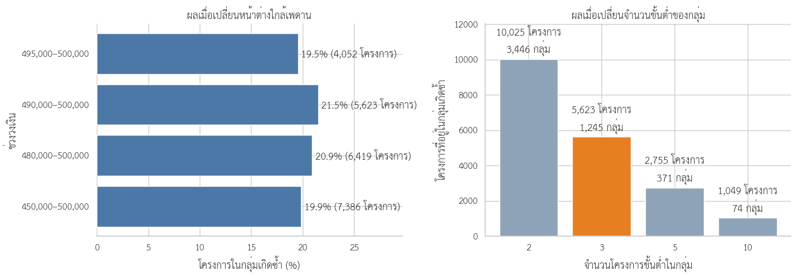
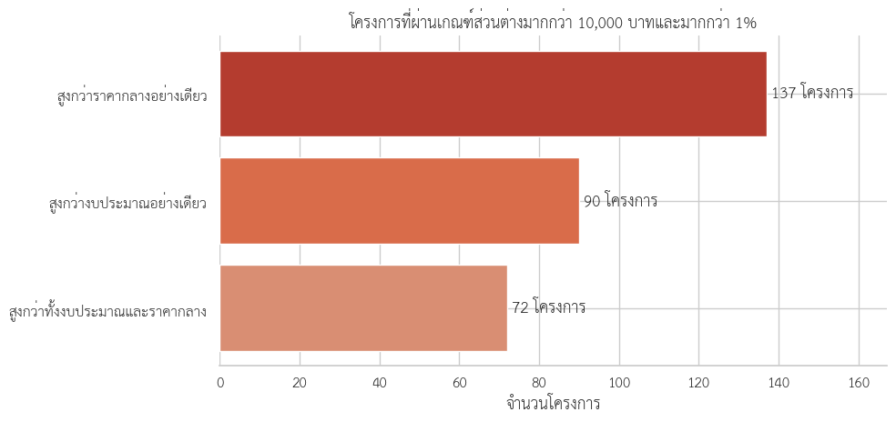
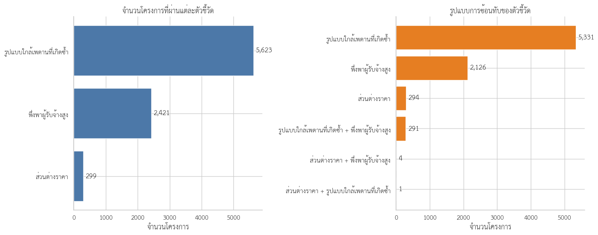

# การใช้ข้อมูล e-GP เพื่อจัดลำดับการตรวจสอบโครงการจ้างก่อสร้างวงเงินไม่เกิน 500,000 บาท

> DADS5001 Data Tools and Programming — Mini Project  
> ข้อมูลปีงบประมาณ 2569 สะสมถึงวันที่ 30 กรกฎาคม 2569

## ที่มาและคำถามของโครงการ

ข้อมูลจัดซื้อจัดจ้างภาครัฐมีโครงการจำนวนมาก ขณะที่การเปิดเอกสารตรวจสอบทุกโครงการต้องใช้เวลาและทรัพยากรสูง โครงการนี้จึงศึกษาว่าข้อมูล e-GP ที่เปิดเผยต่อสาธารณะสามารถช่วยคัดกรองและจัดลำดับโครงการที่ควรเปิดเอกสารตรวจก่อนได้หรือไม่

คำถามหลักคือ:

> **ในโครงการจ้างก่อสร้างที่ใช้วิธีเฉพาะเจาะจงและมีวงเงินไม่เกิน 500,000 บาท มีรูปแบบใดที่ควรได้รับการตรวจสอบเอกสารก่อน?**

การวิเคราะห์ไม่ได้สร้าง “คะแนนทุจริต” และไม่ใช้ตัวชี้วัดใดเป็นหลักฐานว่ามีการกระทำผิด แต่เปลี่ยนข้อมูลจำนวนมากให้เป็นกระบวนการคัดกรองที่อธิบายและทำซ้ำได้

## บริบททางกฎหมาย

พระราชบัญญัติการจัดซื้อจัดจ้างและการบริหารพัสดุภาครัฐ พ.ศ. 2560 วางหลักให้การจัดซื้อจัดจ้างคำนึงถึงความคุ้มค่า ความโปร่งใส ประสิทธิภาพ ประสิทธิผล และการตรวจสอบได้ตามมาตรา 8 และแบ่งวิธีจัดซื้อจัดจ้างหลักไว้ในมาตรา 55

มาตรา 56 วรรคหนึ่ง (2)(ข) เปิดให้ใช้วิธีเฉพาะเจาะจงกับพัสดุที่มีการผลิต จำหน่าย ก่อสร้าง หรือให้บริการทั่วไป เมื่อวงเงินในการจัดซื้อจัดจ้างครั้งหนึ่งไม่เกินวงเงินที่กฎกระทรวงกำหนด ข้อ 1 ของกฎกระทรวงกำหนดวงเงินดังกล่าวไว้ที่ **ไม่เกิน 500,000 บาท**

ดังนั้น การใช้วิธีเฉพาะเจาะจงในวงเงินไม่เกิน 500,000 บาทเป็นรูปแบบที่กฎหมายรองรับและไม่ใช่ความผิดปกติในตัวเอง สิ่งที่การศึกษานี้ค้นหาคือรูปแบบเพิ่มเติมที่เกิดซ้ำหรือซ้อนทับกันจนควรตรวจเอกสารต่อ

| เกณฑ์ | ที่มา |
|---|---|
| วิธีเฉพาะเจาะจงและวงเงินไม่เกิน 500,000 บาท | ขอบเขตที่เชื่อมโยงกับมาตรา 56 (2)(ข) และกฎกระทรวงข้อ 1 |
| ช่วง 490,000–500,000 บาท | หน้าต่างสำรวจใกล้เพดานที่ทีมกำหนด |
| เกิดซ้ำอย่างน้อย 3 โครงการในหน่วยงานย่อย–ผู้รับจ้าง–วันเดียวกัน | เกณฑ์คัดกรองของการศึกษา |
| ผู้รับจ้างได้อย่างน้อย 10 โครงการและครองอย่างน้อย 75% ทั้งจำนวนและมูลค่า | เกณฑ์คัดกรองของการศึกษา |
| ส่วนต่างราคามากกว่า 10,000 บาทและมากกว่า 1% | เกณฑ์คัดกรองของการศึกษา |

ช่วง 490,000–500,000 บาท รวมถึงเกณฑ์ 3 โครงการ, 10 โครงการ, 75%, 10,000 บาท และ 1% **ไม่ใช่เกณฑ์ที่กฎหมายกำหนด**

## ขอบเขตและหน่วยวิเคราะห์

ข้อมูลประกอบด้วยไฟล์ CSV จำนวน 8 ไฟล์ รวม 3,964,924 แถว โดยมีรายการประเภทจ้างก่อสร้าง 180,079 แถว หรือ 4.54% ของข้อมูลทั้งหมด

  

  <em>รูปที่ 1 สัดส่วนรายการจัดซื้อจัดจ้างจำแนกตามประเภทโครงการ</em>

หนึ่งแถวไม่จำเป็นต้องเท่ากับหนึ่งโครงการ เพราะโครงการเดียวอาจมีหลายสัญญา หลายผู้รับจ้าง หรือมีผู้รับจ้างแบบ Joint Venture (JV) ซึ่งผู้ประกอบการหลายรายร่วมกันรับงานภายใต้โครงการหรือสัญญาเดียวกัน

| ระดับข้อมูล | จำนวน | ใช้ตอบคำถาม |
|---|---:|---|
| รายการก่อสร้าง | 180,079 แถว | ตรวจรายละเอียดสัญญาและผู้รับจ้าง |
| โครงการก่อสร้างไม่ซ้ำ | 178,978 โครงการ | สำรวจงบประมาณ วิธีจัดซื้อ และราคา |
| กลุ่มศึกษาหลัก | 136,070 โครงการ | สร้างตัวชี้วัดเพื่อจัดลำดับการตรวจสอบ |
| ผู้รับจ้างหรือกลุ่มผู้รับจ้างหลังจัดการ JV | 33,570 ราย | วิเคราะห์การพึ่งพาผู้รับจ้าง |

กลุ่มศึกษาหลักประกอบด้วยโครงการวิธีเฉพาะเจาะจงที่มีวงเงินไม่เกิน 500,000 บาท คิดเป็น 76.03% ของโครงการก่อสร้างทั้งหมด

ในการตรวจมูลค่าระดับสัญญา พบแถวสมาชิก JV 710 แถวใน 362 โครงการ หลังไม่นับแถวสมาชิกซ้ำ ยอดระดับสัญญาตรงกับยอดระดับโครงการ 178,967 จาก 178,978 โครงการ หรือ 99.99% ส่วน 11 โครงการที่ยังไม่ตรงกันถูกเก็บเป็นประเด็นคุณภาพข้อมูล ไม่ใช้เป็นตัวชี้วัดความผิดโดยอัตโนมัติ

## ลำดับคำถามของการวิเคราะห์

1. ข้อมูลหนึ่งแถวแทนอะไร และต้องแก้ปัญหาการนับซ้ำอย่างไร
2. โครงการก่อสร้างมีโครงสร้างด้านขนาดและวิธีจัดซื้ออย่างไร
3. ขนาดโครงการสัมพันธ์กับเพดาน 500,000 บาทตามกฎหมายอย่างไร
4. โครงการใกล้เพดานเกิดซ้ำภายใต้หน่วยงานย่อย ผู้รับจ้าง และวันเดียวกันหรือไม่
5. หน่วยงานย่อยใดพึ่งพาผู้รับจ้างรายเดียวสูงทั้งด้านจำนวนและมูลค่า
6. ราคาที่ตกลงสูงกว่างบประมาณหรือราคากลางอย่างมีสาระสำคัญหรือไม่
7. เมื่อใช้ตัวชี้วัดร่วมกัน โครงการใดควรเปิดเอกสารตรวจก่อน

## 1. โครงสร้างงบประมาณนำไปสู่เพดาน 500,000 บาท

วงเงินงบประมาณของโครงการก่อสร้างมีค่ามัธยฐาน 395,000 บาท แต่มีค่าเฉลี่ยประมาณ 2.66 ล้านบาท ความแตกต่างนี้เกิดจากโครงการมูลค่าสูงจำนวนน้อยดึงค่าเฉลี่ยขึ้น จึงใช้ค่ามัธยฐานอธิบายขนาดของโครงการทั่วไป และพิจารณาสัดส่วนจำนวนโครงการควบคู่กับสัดส่วนวงเงินรวม

โครงการที่มีงบไม่เกิน 500,000 บาทคิดเป็น 76.34% ของจำนวนโครงการ แต่ใช้วงเงินรวมเพียง 8.23% ตรงกันข้าม โครงการที่มีงบมากกว่า 10 ล้านบาทมีเพียง 4.08% แต่ใช้วงเงินรวม 67.31%

  

  <em>รูปที่ 2 สัดส่วนจำนวนโครงการและวงเงินรวมจำแนกตามช่วงงบประมาณ</em>

ผลนี้บอกว่า “โครงการส่วนใหญ่” กับ “เงินส่วนใหญ่” อยู่คนละกลุ่ม และทำให้ต้องพิจารณาวิธีจัดซื้อร่วมกับขนาดโครงการ

## 2. วิธีเฉพาะเจาะจงครองจำนวน ส่วน e-bidding ครองมูลค่า

วิธีเฉพาะเจาะจงมี 136,651 โครงการ หรือ 76.35% ของโครงการก่อสร้าง แต่คิดเป็น 9.33% ของวงเงินรวม ขณะที่ e-bidding มีเพียง 21.22% ของจำนวนโครงการ แต่คิดเป็น 83.34% ของวงเงินรวม

  

  <em>รูปที่ 3 สัดส่วนจำนวนโครงการและวงเงินรวมจำแนกตามวิธีจัดซื้อจัดจ้าง</em>

วิธีเฉพาะเจาะจงจึงเป็นกลไกหลักของโครงการขนาดเล็ก ส่วน e-bidding รองรับมูลค่าการก่อสร้างส่วนใหญ่ การพบโครงการจำนวนมากใต้เพดาน 500,000 บาทสอดคล้องกับโครงสร้างวิธีจัดซื้อและบริบทกฎหมาย จึงยังไม่ใช่เหตุให้ตั้งข้อสงสัยเป็นรายโครงการ

จากผลนี้จึงลดขอบเขตอย่างเป็นลำดับ โดยยังใช้หน่วย “โครงการ” เหมือนกันทุกขั้น: โครงการก่อสร้างทั้งหมด → โครงการวงเงินไม่เกิน 500,000 บาท → โครงการวิธีเฉพาะเจาะจงที่มีวงเงินไม่เกิน 500,000 บาท

  

  <em>รูปที่ 4 การลดขอบเขตจากโครงการก่อสร้างทั้งหมด 178,978 โครงการสู่กลุ่มศึกษาหลัก 136,070 โครงการ</em>

## 3. จากเส้นกฎหมายสู่หน้าต่างสำรวจใกล้เพดาน

ในกลุ่มศึกษาหลักมี 26,154 โครงการอยู่ช่วง 490,000–500,000 บาท คิดเป็น 19.22% ของกลุ่มศึกษา การเลือกช่วงนี้เป็นหน้าต่างสำรวจ 10,000 บาทใต้เพดาน ไม่ใช่เส้นแบ่งจากกฎหมาย

  

  <em>รูปที่ 5 การกระจายวงเงินของโครงการวิธีเฉพาะเจาะจงรอบเพดาน 500,000 บาท</em>

ภาพแสดงว่าค่าที่ปรากฏบ่อยหลายค่าอยู่ก่อนถึงเพดาน เช่น 490,000, 495,000, 498,000, 499,000 และ 500,000 บาท แต่การเห็นยอดนิยมจากภาพยังไม่เพียงพอที่จะเลือก 490,000 บาทเป็นขอบล่าง จึงทดสอบหน้าต่าง 450,000–500,000, 480,000–500,000, 490,000–500,000 และ 495,000–500,000 บาท

การอยู่ใกล้เพดานโครงการเดียวอธิบายอะไรไม่ได้ จึงนิยามกลุ่มเกิดซ้ำด้วยหน่วยงานย่อย ผู้รับจ้าง และวันที่เกิดรายการเดียวกัน แล้วทดลองจำนวนขั้นต่ำ 2, 3, 5 และ 10 โครงการ

  

  <em>รูปที่ 6 ผลเมื่อเปลี่ยนหน้าต่างใกล้เพดานและจำนวนโครงการขั้นต่ำในกลุ่มเกิดซ้ำ</em>

ทุกหน้าต่างยังพบโครงการในกลุ่มเกิดซ้ำประมาณ 19.5–21.5% ของโครงการในช่วงนั้น จึงเลือก 490,000–500,000 บาท เพราะแคบพอที่จะเน้นบริเวณก่อนถึงเพดานและยังมีข้อมูลเพียงพอ ส่วนขั้นต่ำ 3 โครงการใช้เป็นจุดเริ่มของ “รูปแบบเกิดซ้ำ” มากกว่าเหตุการณ์เดี่ยวหรือคู่ ผลคือ 1,245 กลุ่ม ครอบคลุม 5,623 โครงการ

## 4. จากส่วนต่างราคาเล็กน้อยสู่เกณฑ์ที่ใช้ตรวจต่อ

วงเงินงบประมาณคือกรอบทรัพยากร ราคากลางคือราคาอ้างอิง และราคาที่ตกลงคือผลของการจัดซื้อจริง ในกลุ่มศึกษาหลักพบราคาที่ตกลงสูงกว่างบประมาณ 256 โครงการ และสูงกว่าราคากลางที่ใช้งานได้ 550 โครงการ แต่จำนวนนี้ยังรวมส่วนต่างเล็กน้อย

ก่อนเปรียบเทียบราคากลาง ตรวจพบราคากลางต่ำกว่า 50% ของงบประมาณ 426 โครงการ สูงกว่า 150% จำนวน 280 โครงการ และขาดข้อมูล 105 โครงการ จึงใช้เฉพาะราคากลางที่อยู่ในช่วงคุณภาพข้อมูลที่กำหนด

จึงทดลองส่วนต่างขั้นต่ำ 5,000, 10,000, 25,000 และ 50,000 บาท ร่วมกับ 0.5%, 1% และ 5% โดยต้องผ่านทั้งจำนวนเงินและร้อยละ

  

  <em>รูปที่ 7 จำนวนโครงการที่เหลือเมื่อเปลี่ยนเกณฑ์ส่วนต่างราคา</em>

เกณฑ์ 5,000 บาทยังไวต่อส่วนต่างขนาดเล็ก ขณะที่ 25,000–50,000 บาทตัดกรณีออกมาก จึงเลือก **มากกว่า 10,000 บาทและมากกว่า 1%** เป็น operational threshold ของการศึกษา ไม่ใช่ materiality ตามกฎหมายหรือมาตรฐานการตรวจสอบ

  

  <em>รูปที่ 8 ผลของเกณฑ์ส่วนต่างมากกว่า 10,000 บาทและมากกว่า 1%</em>

พบ 299 โครงการไม่ซ้ำ ได้แก่ สูงกว่าราคากลางอย่างเดียว 137 โครงการ สูงกว่างบประมาณอย่างเดียว 90 โครงการ และสูงกว่าทั้งสองค่า 72 โครงการ

## 5. การพึ่งพาผู้รับจ้างต้องดูภายในหน่วยงานย่อย

สัดส่วนระดับประเทศไม่บอกว่าหน่วยงานหนึ่งพึ่งพาผู้รับจ้างรายใดมากเพียงใด จึงคำนวณสัดส่วนจำนวนโครงการและมูลค่าที่ผู้รับจ้างได้รับภายในหน่วยงานย่อยแต่ละแห่ง

เกณฑ์ถูกทดสอบจากจำนวนขั้นต่ำ 5, 10 และ 20 โครงการ ร่วมกับสัดส่วน 50%, 75% และ 90% ก่อนเลือกอย่างน้อย 10 โครงการและอย่างน้อย 75% ทั้งด้านจำนวนและมูลค่า เพื่อคัดความสัมพันธ์ที่มีทั้งปริมาณงานเพียงพอและการพึ่งพาสูง โดยไม่เข้มจนเหลือกรณีน้อยเกินไป

  

  <em>รูปที่ 9 จำนวนความสัมพันธ์ที่ผ่านเกณฑ์เมื่อเปลี่ยนจำนวนโครงการขั้นต่ำและสัดส่วนการพึ่งพา</em>

พบ 142 ความสัมพันธ์ ระหว่าง 142 หน่วยงานย่อยกับผู้รับจ้าง 130 ราย ครอบคลุม 2,421 โครงการ การพึ่งพาสูงอาจเกิดจากความเชี่ยวชาญ ทำเล หรือจำนวนผู้ประกอบการในพื้นที่ จึงเป็นเหตุให้ตรวจบริบทการแข่งขันต่อ ไม่ใช่หลักฐานว่าการแข่งขันถูกจำกัด

## 6. รวมตัวชี้วัดเพื่อจัดลำดับตรวจสอบ

| ตัวชี้วัด | จำนวนโครงการ |
|---|---:|
| ส่วนต่างราคา | 299 |
| รูปแบบใกล้เพดานที่เกิดซ้ำ | 5,623 |
| พึ่งพาผู้รับจ้างสูง | 2,421 |

  

  <em>รูปที่ 10 จำนวนโครงการในแต่ละตัวชี้วัดและการซ้อนทับระหว่างตัวชี้วัด</em>

มีโครงการซ้อนทับระหว่างรูปแบบใกล้เพดานที่เกิดซ้ำกับการพึ่งพาผู้รับจ้างสูง 291 โครงการ ระหว่างส่วนต่างราคากับการพึ่งพาผู้รับจ้างสูง 4 โครงการ และระหว่างส่วนต่างราคากับรูปแบบเกิดซ้ำ 1 โครงการ ไม่พบโครงการที่ผ่านครบทั้งสามตัวชี้วัด

กำหนดให้โครงการที่พบ 1 ตัวชี้วัดเป็น “ตรวจสอบตามปกติ” และโครงการที่พบ 2 ตัวชี้วัดเป็น “ตรวจสอบลำดับแรก”

| ลำดับการตรวจสอบ | จำนวน | สัดส่วนของกลุ่มศึกษา | ราคาที่ตกลงรวม |
|---|---:|---:|---:|
| ไม่พบตัวชี้วัด | 128,023 | 94.09% | 34,809.17 ล้านบาท |
| ตรวจสอบตามปกติ | 7,751 | 5.70% | 3,291.11 ล้านบาท |
| ตรวจสอบลำดับแรก | 296 | 0.22% | 145.43 ล้านบาท |

  

  <em>รูปที่ 11 ผลการคัดกรองจาก 136,070 โครงการในกลุ่มศึกษาสู่ 296 โครงการตรวจสอบลำดับแรก</em>

กระบวนการนี้ลดขอบเขตการเปิดเอกสารจาก 136,070 โครงการเหลือ 296 โครงการ หรือ 0.22% ของกลุ่มศึกษา โดยไม่กล่าวว่าโครงการเหล่านี้มีการทุจริต

## 7. กรณีศึกษา: ตัวชี้วัดบอกให้ตรวจอะไรต่อ

### กรณี A — ส่วนต่างราคาและรายละเอียดสัญญา

โครงการ `69049225316` มีวงเงินงบประมาณและราคากลาง 491,000 บาท แต่ราคาที่ตกลงรวม 980,000 บาท เมื่อย้อนดูระดับสัญญาพบสัญญา 2 ฉบับกับผู้รับจ้างรายเดียวกัน ฉบับละ 490,000 บาท ยอดสัญญารวมตรงกับยอดระดับโครงการ

ข้อมูลบอกได้ว่าราคาที่ตกลงรวมสูงกว่ากรอบราคาและมีหลายสัญญา แต่ยังไม่บอกเหตุผล สิ่งที่ต้องตรวจต่อคือขอบเขตของแต่ละสัญญา การอนุมัติงบเพิ่มเติม และประวัติการแก้ไขโครงการ

### กรณี B — รูปแบบใกล้เพดานที่เกิดซ้ำ

กลุ่มที่ใหญ่ที่สุดอยู่ภายใต้สำนักงานทรัพยากรธรรมชาติและสิ่งแวดล้อมจังหวัดมุกดาหาร มีบริษัท บ้านบุ่ง วิศวกรรม จำกัด เป็นผู้รับจ้าง พบ 65 โครงการในวันที่ 29 ธันวาคม 2568 งบรวม 32.37 ล้านบาท

โครงการตั้งอยู่ต่างหมู่บ้านและตำบล จึงอาจเป็นงานที่แยกจากกันโดยสมเหตุผล สิ่งที่ต้องตรวจคือแผนจัดซื้อ ขอบเขตและความต่อเนื่องของงาน แหล่งงบประมาณ ผู้เสนอราคารายอื่น และเหตุผลในการจัดทำเป็นหลายโครงการ

### กรณี C — การพึ่งพาผู้รับจ้างสูง

เทศบาลตำบลบ้านโปร่งมีโครงการในกลุ่มศึกษา 73 โครงการ และผู้รับจ้างรหัส `0413555002704` ได้รับทั้ง 73 โครงการ คิดเป็น 100% ของจำนวนและมูลค่า รวมราคาที่ตกลงประมาณ 7.97 ล้านบาท

รูปแบบนี้บอกถึงการพึ่งพาผู้รับจ้างรายเดียวสูง แต่ยังไม่บอกระดับการแข่งขัน สิ่งที่ต้องตรวจต่อคือจำนวนผู้ประกอบการในพื้นที่ วิธีสืบราคา ประวัติผู้เสนอราคา คุณสมบัติเฉพาะ และเหตุผลที่เลือกผู้รับจ้างรายเดิม

## คำตอบและ Insight

ข้อมูล e-GP ช่วยสร้างกระบวนการจัดลำดับตรวจสอบที่โปร่งใสและทำซ้ำได้ โดยคัดจากโครงการก่อสร้าง 178,978 โครงการ มาสู่กลุ่มศึกษาที่เชื่อมโยงกับเพดานกฎหมาย 136,070 โครงการ และเหลือ 296 โครงการที่พบรูปแบบซ้อนทับสองมิติ

Insight หลักไม่ใช่ “มีโครงการจำนวนมากใกล้ 500,000 บาท” เพราะการใช้วิธีเฉพาะเจาะจงไม่เกินวงเงินดังกล่าวเป็นรูปแบบที่กฎหมายรองรับ แต่คือ:

> **เมื่อรูปแบบใกล้เพดานเกิดซ้ำภายใต้หน่วยงานย่อย–ผู้รับจ้าง–วันเดียวกัน และซ้อนทับกับการพึ่งพาผู้รับจ้างรายเดียวสูง ข้อมูลสามารถชี้เป้าโครงการที่ควรเปิดเอกสารตรวจสอบก่อนได้**

โครงการตรวจสอบลำดับแรก 291 จาก 296 โครงการ หรือ 98.31% มาจากการซ้อนทับระหว่างรูปแบบเกิดซ้ำกับการพึ่งพาผู้รับจ้างสูง ส่วนตัวชี้วัดราคาช่วยเปิดเส้นทางตรวจสอบอีกด้าน แต่ซ้อนทับกับตัวชี้วัดอื่นเพียง 5 โครงการ

## ข้อจำกัดและสิ่งที่ยังตอบไม่ได้

- ข้อมูลเป็นข้อมูลสะสมถึงวันที่ 30 กรกฎาคม 2569 ไม่ใช่ข้อมูลเต็มปี
- ข้อมูลมีเฉพาะผู้ชนะ ไม่มีรายชื่อผู้เสนอราคาและราคาที่เสนอทั้งหมด
- โครงการเฉพาะเจาะจงไม่มีวันที่ประกาศ จึงใช้วันที่เกิดรายการแทน
- ข้อมูลยังไม่อธิบายเหตุผลของการแยกโครงการ การทำหลายสัญญา หรือการแก้ไขงบ
- เกณฑ์ 490,000–500,000 บาท, 3 โครงการ, 10 โครงการ, 75%, 10,000 บาท และ 1% เป็นเกณฑ์คัดกรองของการศึกษา ไม่ใช่มาตรฐานยืนยันความผิด
- การเกิดซ้ำหรือพึ่งพาผู้รับจ้างสูงอาจมีคำอธิบายจากพื้นที่ ความเชี่ยวชาญ หรือสภาพตลาด
- ไม่สามารถสรุปว่าเป็นการแบ่งซื้อแบ่งจ้าง จำกัดการแข่งขัน หรือทุจริตได้โดยไม่ตรวจเอกสารและข้อมูลการเสนอราคาเพิ่มเติม

## เอกสารที่ควรตรวจต่อ

1. แผนจัดซื้อจัดจ้างและแหล่งงบประมาณ
2. ขอบเขตงานและความเชื่อมโยงระหว่างโครงการหรือสัญญา
3. เอกสารอนุมัติและประวัติการแก้ไขโครงการ
4. รายชื่อผู้เสนอราคาและราคาที่เสนอทั้งหมด
5. วิธีสืบราคาและคุณสมบัติเฉพาะ
6. เหตุผลของการเลือกผู้รับจ้างและการจัดทำหลายโครงการหรือหลายสัญญา

## Notebook และการทำซ้ำ

| Notebook | หน้าที่ |
|---|---|
| [02_construction_data_preparation_2569.ipynb](02_construction_data_preparation_2569.ipynb) | อ่านไฟล์ต้นทาง สกัดข้อมูลจ้างก่อสร้าง และตรวจ grain เบื้องต้น |
| [03_construction_eda_2569.ipynb](03_construction_eda_2569.ipynb) | สำรวจงบประมาณ วิธีจัดซื้อ ราคา หน่วยงาน และผู้รับจ้าง |
| [04_construction_review_indicators_2569.ipynb](04_construction_review_indicators_2569.ipynb) | ตรวจคุณภาพข้อมูล ทดสอบความไวของเกณฑ์ สร้างตัวชี้วัด และจัดลำดับโครงการ |

รันตามลำดับ `02 → 03 → 04` บน Google Colab ไฟล์ข้อมูลขนาดใหญ่ไม่จัดเก็บใน GitHub รูปจาก output ที่ใช้ในรายงานอยู่ใน [figure/](figure/)

กราฟอันดับหน่วยงานและการกระจายมูลค่าสัญญาระดับประเทศถูกเก็บไว้ใน notebook เพื่อใช้เป็นบริบท แต่ไม่อยู่ในเรื่องหลัก เพราะไม่ได้ใช้สร้างตัวชี้วัดโดยตรง
