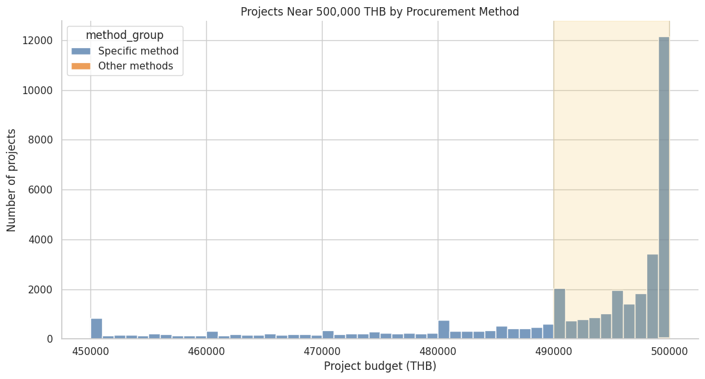
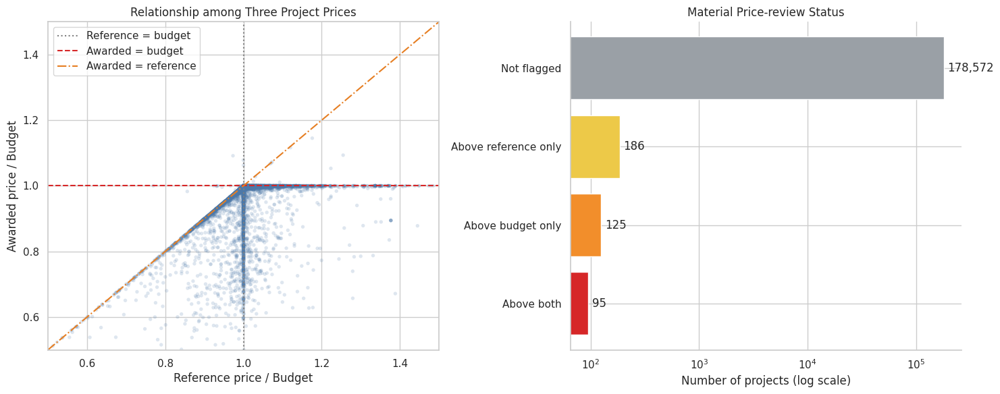
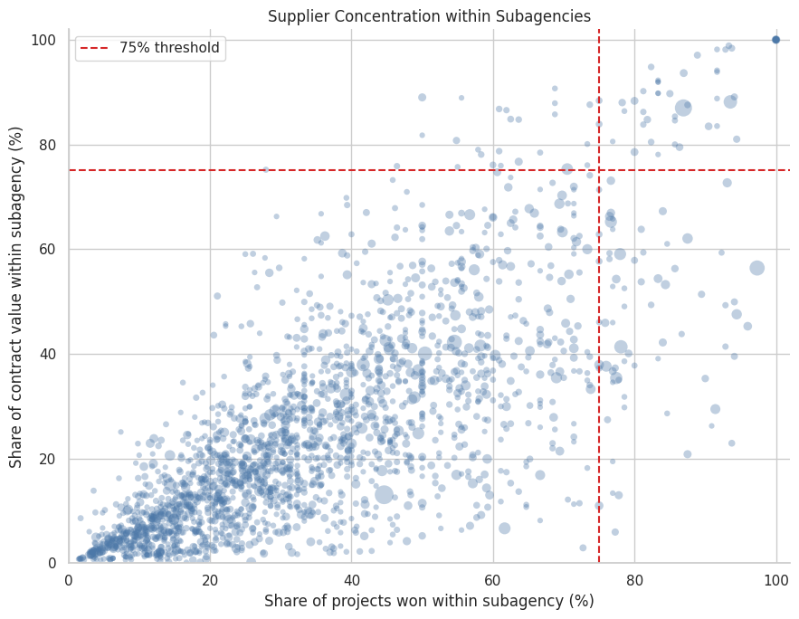
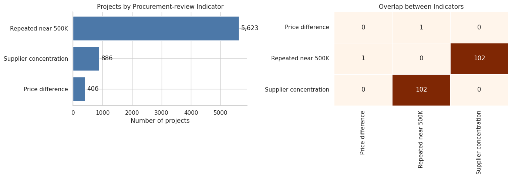
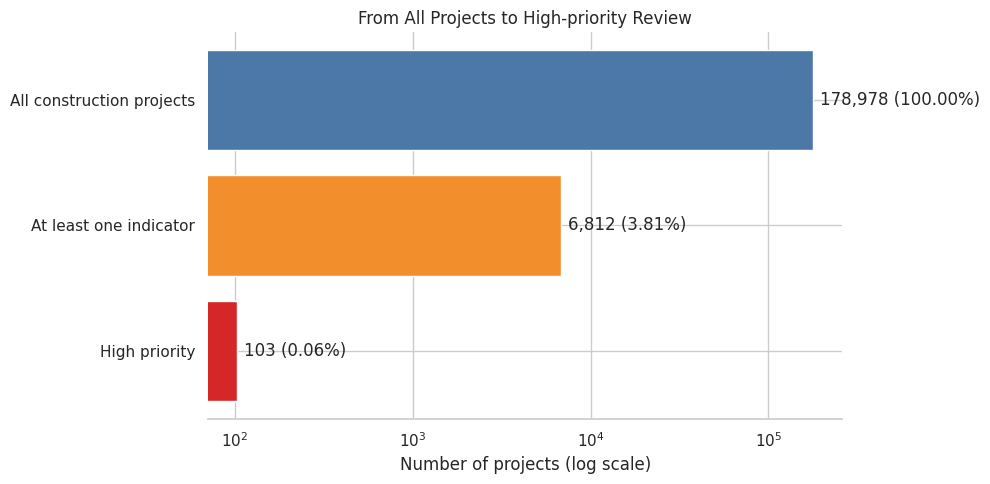

# การใช้ข้อมูล e-GP เพื่อจัดลำดับการตรวจสอบโครงการจ้างก่อสร้าง

> DADS5001 Data Tools and Programming — Mini Project  
> กรณีศึกษาปีงบประมาณ 2569 สะสมถึงวันที่ 30 กรกฎาคม 2569

## ที่มาและความสำคัญ

ข้อมูลจัดซื้อจัดจ้างภาครัฐมีโครงการจำนวนมาก ขณะที่การเปิดเอกสาร
ตรวจสอบทุกโครงการต้องใช้เวลาและทรัพยากรสูง โครงการนี้จึงศึกษาว่า
ข้อมูล e-GP ที่เปิดเผยต่อสาธารณะสามารถช่วยตอบคำถามต่อไปนี้ได้หรือไม่:

> **ในโครงการจ้างก่อสร้าง 178,978 โครงการ มีรูปแบบใดที่ช่วยจัดลำดับว่าโครงการใดควรเปิดเอกสารตรวจสอบก่อน?**

เป้าหมายไม่ใช่การสร้าง “คะแนนทุจริต” แต่เป็นการเปลี่ยนข้อมูลหลายล้าน
รายการให้เป็นเกณฑ์คัดกรองที่โปร่งใส อธิบายได้ และทำซ้ำได้

## ขอบเขตข้อมูล

ข้อมูลเป็นรายการ e-GP ปีงบประมาณ 2569 **สะสมถึงวันที่ 30 กรกฎาคม 2569**
จึงไม่ใช่ข้อมูลเต็มปี และไม่ควรนำจำนวนหรือมูลค่าไปเปรียบเทียบโดยตรง
กับข้อมูลเต็มปีของปีอื่น

| รายการ | จำนวน |
|---|---:|
| ไฟล์ CSV ต้นทาง | 8 ไฟล์ |
| รายการจัดซื้อจัดจ้างทั้งหมด | 3,964,924 แถว |
| รายการประเภทจ้างก่อสร้าง | 180,079 แถว |
| โครงการจ้างก่อสร้างไม่ซ้ำ | 178,978 โครงการ |
| ตัวแปรในข้อมูลก่อสร้าง | 29 คอลัมน์ |

### หน่วยวิเคราะห์

หนึ่งแถวในข้อมูลไม่จำเป็นต้องเท่ากับหนึ่งโครงการ เพราะโครงการเดียว
อาจมีหลายสัญญา หลายผู้รับจ้าง หรือเป็นกลุ่มผู้รับจ้างแบบ
**Joint Venture (JV)** ซึ่งผู้ประกอบการหลายรายร่วมกันรับงาน
ภายใต้โครงการหรือสัญญาเดียวกัน

การวิเคราะห์จึงใช้:

- **ระดับโครงการ** สำหรับงบประมาณ ราคากลาง ราคาที่ตกลง วิธีจัดซื้อ และหน่วยงาน
- **ระดับสัญญาและผู้รับจ้าง** สำหรับรายละเอียดสัญญาและการกระจุกตัวของผู้รับจ้าง

บางโครงการมีทั้งแถวของกลุ่ม JV ซึ่งบันทึกมูลค่าทั้งสัญญา และแถวสมาชิก
ซึ่งบันทึกส่วนแบ่งของแต่ละราย หากรวมทุกแถวจะเกิดการนับมูลค่าซ้ำ
หลังไม่นับแถวสมาชิก JV ซ้ำ พบผู้รับจ้างหรือกลุ่มผู้รับจ้าง 33,570 ราย
และยอดระดับสัญญาตรงกับยอดระดับโครงการ 178,967 จาก 178,978 โครงการ

## กรวยคำถามของการวิเคราะห์

การวิเคราะห์ค่อย ๆ ลดขอบเขตผ่านคำถามต่อเนื่อง:

1. โครงการก่อสร้างส่วนใหญ่มีขนาดเท่าใด
2. ขนาดโครงการสัมพันธ์กับวิธีจัดซื้ออย่างไร
3. จุดกระจุกใกล้ 500,000 บาทเกิดในวิธีใด
4. โครงการใกล้ 500,000 บาทเกิดซ้ำภายใต้หน่วยงานย่อย ผู้รับจ้าง และวันเดียวกันหรือไม่
5. ผู้รับจ้างรายเดียวครองทั้งจำนวนและมูลค่าในหน่วยงานย่อยสูงหรือไม่
6. ราคาที่ตกลงสูงกว่างบประมาณหรือราคากลางอย่างมีสาระสำคัญหรือไม่
7. เมื่อใช้ตัวชี้วัดหลายมิติร่วมกัน เหลือโครงการที่ควรตรวจสอบก่อนกี่โครงการ

## 1. โครงการส่วนใหญ่มีขนาดเล็ก

วงเงินงบประมาณมีค่ามัธยฐาน 395,000 บาท ขณะที่ค่าเฉลี่ยประมาณ
2.66 ล้านบาท แสดงว่าการกระจายเบ้ขวาจากโครงการมูลค่าสูงจำนวนน้อย

เมื่อแบ่งช่วงงบประมาณ พบว่า 76.34% ของโครงการมีงบไม่เกิน
500,000 บาท และช่วง 400,000–500,000 บาทมีสัดส่วนสูงสุด 25.09%

  

  <em>รูปที่ 1: สัดส่วนโครงการจ้างก่อสร้างจำแนกตามช่วงวงเงินงบประมาณ</em>

ผลนี้ทำให้เกิดคำถามว่า จุดกระจุกใกล้ 500,000 บาทสัมพันธ์กับ
วิธีจัดซื้อประเภทใด ไม่ควรตีความจากวงเงินเพียงอย่างเดียว

## 2. วิธีเฉพาะเจาะจงครองจำนวน แต่ e-bidding ครองมูลค่า

วิธีเฉพาะเจาะจงมี 136,651 โครงการ หรือ 76.35% ของทั้งหมด
แต่คิดเป็น 9.33% ของวงเงินรวม ขณะที่ e-bidding มี 21.22%
ของโครงการ แต่คิดเป็น 83.34% ของวงเงินรวม

  

  <em>รูปที่ 2: เปรียบเทียบสัดส่วนจำนวนโครงการและวงเงินรวมตามวิธีจัดซื้อจัดจ้าง</em>

จำนวนโครงการกับมูลค่าจึงให้ภาพต่างกัน วิธีเฉพาะเจาะจงเป็นกลไกหลัก
ของโครงการขนาดเล็ก ส่วน e-bidding รองรับมูลค่าส่วนใหญ่

## 3. เหตุใดจึงเจาะช่วง 490,000–500,000 บาท

โครงการเฉพาะเจาะจง 99.57% มีงบไม่เกิน 500,000 บาท และ 26,154
โครงการอยู่ในช่วง 490,000–500,000 บาท คิดเป็น 19.14% ของโครงการ
เฉพาะเจาะจง หรือ 14.61% ของโครงการก่อสร้างทั้งหมด

  

  <em>รูปที่ 3: การกระจุกตัวของวงเงินใกล้ 500,000 บาทจำแนกตามวิธีจัดซื้อจัดจ้าง</em>

การอยู่ใกล้ 500,000 บาทเพียงอย่างเดียวยังไม่ใช่ตัวชี้วัด เพราะเป็น
รูปแบบที่สัมพันธ์อย่างมากกับวิธีเฉพาะเจาะจงในข้อมูล จึงต้องเพิ่มเงื่อนไขว่า
โครงการลักษณะดังกล่าวเกิดซ้ำภายใต้หน่วยงานย่อย ผู้รับจ้าง และวันเดียวกันหรือไม่

## 4. งบประมาณ ราคากลาง และราคาที่ตกลง

ราคาทั้งสามมีบทบาทต่างกัน:

| ราคา | ความหมาย |
|---|---|
| วงเงินงบประมาณ | กรอบทรัพยากรของโครงการ |
| ราคากลาง | ราคาอ้างอิง |
| ราคาที่ตกลง | ผลลัพธ์ราคาที่เกิดขึ้นจริง |

รูปที่ 4 เปรียบเทียบราคาทั้งสามในกรอบเดียว โดยแกนนอนเป็น
ราคากลางเทียบงบประมาณ และแกนตั้งเป็นราคาที่ตกลงเทียบงบประมาณ
เส้นตั้งแสดงราคากลางเท่ากับงบ เส้นนอนแสดงราคาตกลงเท่ากับงบ
และเส้นทแยงแสดงราคาตกลงเท่ากับราคากลาง

  

  <em>รูปที่ 4: ความสัมพันธ์ของวงเงินงบประมาณ ราคากลาง และราคาที่ตกลง พร้อมจำนวนโครงการตามสถานะส่วนต่างราคา</em>

เมื่อกำหนดส่วนต่างที่มีสาระสำคัญเป็นมากกว่า 10,000 บาท
**และ** มากกว่า 1% พบว่า:

| สถานะ | จำนวนโครงการ |
|---|---:|
| ไม่เข้าเกณฑ์ | 178,572 |
| สูงกว่าราคากลางอย่างเดียว | 186 |
| สูงกว่างบประมาณอย่างเดียว | 125 |
| สูงกว่าทั้งงบประมาณและราคากลาง | 95 |

รวมเป็น 406 โครงการไม่ซ้ำที่ผ่านตัวชี้วัดราคา การเทียบราคากลาง
ใช้เฉพาะ 178,167 โครงการที่ราคากลางผ่านเกณฑ์คุณภาพข้อมูล

## 5. การกระจุกตัวต้องตรวจในระดับหน่วยงานย่อย

ภาพรวมระดับประเทศไม่พบผู้รับจ้างรายเดียวครองมูลค่าสูงมาก
แต่การแข่งขันเกิดในบริบทของแต่ละหน่วยงาน จึงวิเคราะห์ความสัมพันธ์
ระหว่างหน่วยงานย่อยกับผู้รับจ้าง โดยกำหนดเกณฑ์ว่า:

- ผู้รับจ้างได้รับอย่างน้อย 10 โครงการ
- ครองอย่างน้อย 75% ของจำนวนโครงการในหน่วยงานย่อย
- ครองอย่างน้อย 75% ของมูลค่าสัญญาในหน่วยงานย่อย

  

  <em>รูปที่ 5: สัดส่วนจำนวนโครงการและมูลค่าสัญญาที่ผู้รับจ้างได้รับภายในหน่วยงานย่อย</em>

พบ 55 ความสัมพันธ์ ครอบคลุม 886 โครงการ หรือ 0.50% ของโครงการ
ทั้งหมด และมีราคาที่ตกลงรวมประมาณ 352.34 ล้านบาท

การกระจุกตัวอาจเกิดจากความเชี่ยวชาญ ทำเล หรือจำนวนผู้ประกอบการในพื้นที่
จึงเป็นเหตุผลสำหรับตรวจเอกสารเพิ่มเติม ไม่ใช่หลักฐานว่าการแข่งขันถูกจำกัด

## 6. ตัวชี้วัดเพื่อจัดลำดับการตรวจสอบ

| มิติ | เกณฑ์ | จำนวนโครงการ |
|---|---|---:|
| ส่วนต่างราคา | ราคาตกลงสูงกว่างบหรือราคากลางที่ใช้งานได้ มากกว่า 10,000 บาทและมากกว่า 1% | 406 |
| รูปแบบใกล้ 500,000 บาทที่เกิดซ้ำ | วิธีเฉพาะเจาะจง งบ 490,000–500,000 บาท และมีอย่างน้อย 3 โครงการที่หน่วยงานย่อย ผู้รับจ้าง และวันที่เกิดรายการตรงกัน | 5,623 |
| การกระจุกตัวของผู้รับจ้าง | ได้อย่างน้อย 10 โครงการ และครองอย่างน้อย 75% ทั้งจำนวนและมูลค่าในหน่วยงานย่อย | 886 |

  

  <em>รูปที่ 6: จำนวนโครงการที่ผ่านตัวชี้วัดแต่ละมิติและการซ้อนทับระหว่างตัวชี้วัด</em>

มี 102 โครงการซ้อนทับระหว่างรูปแบบใกล้ 500,000 บาทที่เกิดซ้ำ
กับการกระจุกตัวของผู้รับจ้าง และมี 1 โครงการซ้อนทับระหว่าง
รูปแบบเกิดซ้ำกับส่วนต่างราคา ไม่พบโครงการที่ผ่านครบทั้งสามมิติ

## 7. จาก 178,978 โครงการ เหลือ 103 โครงการ

| ระดับ | เงื่อนไข | จำนวน | สัดส่วน |
|---|---|---:|---:|
| No indicator | ไม่พบตัวชี้วัด | 172,166 | 96.19% |
| Standard review | พบ 1 มิติ | 6,709 | 3.75% |
| High priority | พบอย่างน้อย 2 มิติ | 103 | 0.06% |

  

  <em>รูปที่ 7: การลดขอบเขตจากโครงการก่อสร้างทั้งหมดสู่โครงการ High priority</em>

High priority หมายถึงควรเปิดเอกสารตรวจสอบก่อน ไม่ได้หมายความว่า
โครงการมีการทุจริต

## 8. กรณีศึกษา

### กรณีที่ 1: โครงการเดียวมีสัญญา 2 ฉบับ

โครงการ `69049225316` มีงบประมาณและราคากลาง 491,000 บาท
แต่ราคาที่ตกลงรวม 980,000 บาท ข้อมูลระดับสัญญาพบสัญญา 2 ฉบับ
กับผู้รับจ้างรายเดียวกัน ฉบับละ 490,000 บาท

ยอดสัญญารวมตรงกับยอดระดับโครงการ สิ่งที่ควรตรวจต่อคือขอบเขตงาน
ของแต่ละสัญญา การอนุมัติงบเพิ่มเติม และประวัติการแก้ไขโครงการ

### กรณีที่ 2: โครงการลักษณะคล้ายกัน 65 โครงการในวันเดียวกัน

กลุ่มใหญ่ที่สุดอยู่ภายใต้สำนักงานทรัพยากรธรรมชาติและสิ่งแวดล้อม
จังหวัดมุกดาหาร มีบริษัท บ้านบุ่ง วิศวกรรม จำกัด เป็นผู้รับจ้าง
พบ 65 โครงการในวันที่ 29 ธันวาคม 2568 งบส่วนใหญ่ 498,000 บาท
และราคาตกลงส่วนใหญ่ 489,900 บาท งบรวมประมาณ 32.37 ล้านบาท

โครงการอยู่ต่างหมู่บ้านและตำบล จึงอาจมีเหตุผลที่ต้องแยกกัน
สิ่งที่ควรตรวจคือแผนจัดซื้อ ขอบเขตงาน แหล่งงบประมาณ
ผู้เสนอราคารายอื่น และเหตุผลในการแบ่งโครงการ

## 9. คำตอบและ Insight

ข้อมูล e-GP สามารถใช้สร้างกระบวนการจัดลำดับการตรวจสอบที่โปร่งใส
และทำซ้ำได้ โดยลดขอบเขตจาก 178,978 โครงการ เหลือ 103 โครงการ
ที่พบรูปแบบซ้อนทับอย่างน้อยสองมิติ

Insight หลักไม่ใช่เพียงการพบโครงการใกล้ 500,000 บาท แต่คือ:

> **โครงการใกล้ 500,000 บาทเกิดซ้ำในรูปแบบเดียวกัน และสัมพันธ์กับผู้รับจ้างที่ครองงานของหน่วยงานย่อยหรือไม่**

High priority 102 จาก 103 โครงการมาจากการซ้อนทับระหว่างรูปแบบ
ใกล้ 500,000 บาทที่เกิดซ้ำกับการกระจุกตัวของผู้รับจ้าง
ส่วนตัวชี้วัดราคามีประโยชน์เป็นเส้นทางตรวจสอบอีกด้าน แต่มีเพียง
1 โครงการที่ซ้อนทับกับตัวชี้วัดอื่นจนอยู่ใน High priority

## 10. ข้อจำกัด

- ข้อมูลเป็นข้อมูลสะสมถึงวันที่ 30 กรกฎาคม 2569 ไม่ใช่ข้อมูลเต็มปี
- มีข้อมูลเฉพาะผู้ชนะ ไม่มีผู้เสนอราคาและราคาที่เสนอทั้งหมด
- โครงการเฉพาะเจาะจงไม่มีวันที่ประกาศ จึงใช้วันที่เกิดรายการแทน
- ข้อมูลยังไม่อธิบายเหตุผลของการแบ่งโครงการหรือสัญญาเพิ่มเติม
- การกระจุกตัวอาจเกิดจากความเชี่ยวชาญ ทำเล หรือจำนวนผู้ประกอบการ
- ตัวชี้วัดใช้จัดลำดับตรวจเอกสาร ไม่สามารถยืนยันการกระทำผิดได้

## 11. สิ่งที่ควรตรวจต่อ

สำหรับ 103 โครงการ High priority ควรเปิดตรวจ:

1. แผนจัดซื้อจัดจ้างและแหล่งงบประมาณ
2. ขอบเขตงานของแต่ละโครงการและความเป็นอิสระของพื้นที่
3. เอกสารอนุมัติและประวัติการแก้ไขโครงการ
4. รายชื่อผู้เสนอราคาและราคาที่เสนอทั้งหมด
5. เหตุผลของสัญญาเพิ่มเติมหรือการแยกสัญญา

## 12. Notebook และการทำซ้ำ

| Notebook | หน้าที่ |
|---|---|
| [02_construction_data_preparation_2569.ipynb](02_construction_data_preparation_2569.ipynb) | อ่านไฟล์ขนาดใหญ่และสกัดข้อมูลจ้างก่อสร้าง |
| [03_construction_eda_2569.ipynb](03_construction_eda_2569.ipynb) | สำรวจขนาด วิธีจัดซื้อ ราคา และผู้รับจ้าง |
| [04_construction_review_indicators_2569.ipynb](04_construction_review_indicators_2569.ipynb) | ตรวจคุณภาพข้อมูล สร้างตัวชี้วัด และจัดลำดับโครงการ |

รันตามลำดับ `02 → 03 → 04` บน Google Colab ไฟล์ข้อมูลขนาดใหญ่
ไม่จัดเก็บใน GitHub ส่วนรูปที่ใช้ในรายงานอยู่ใน [figure/](figure/)
