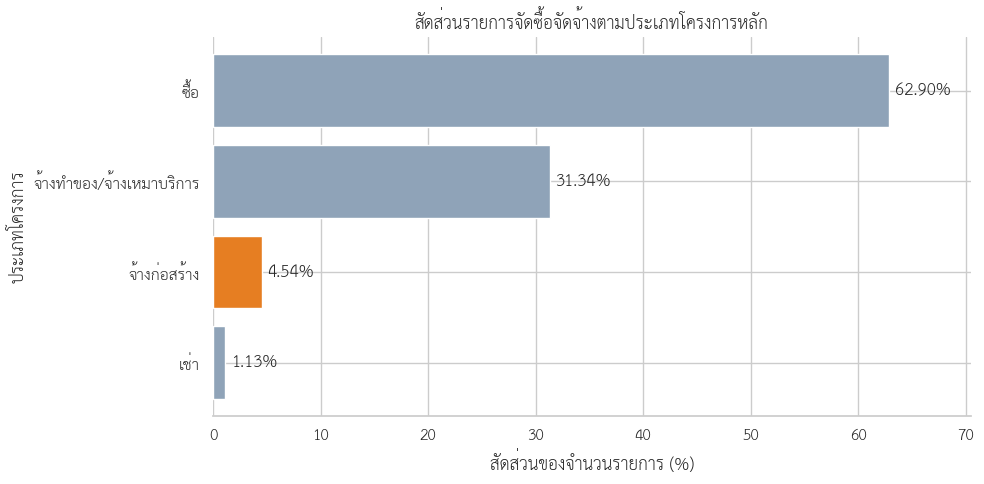
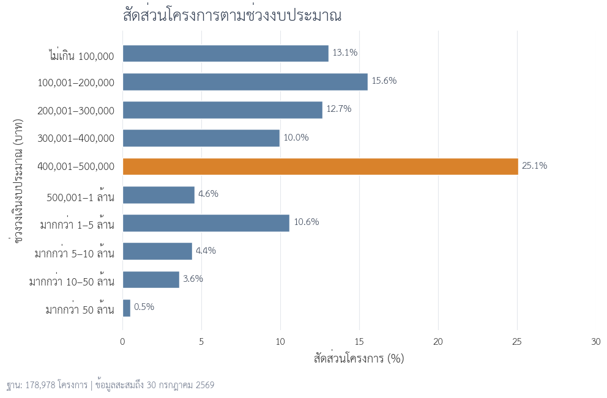
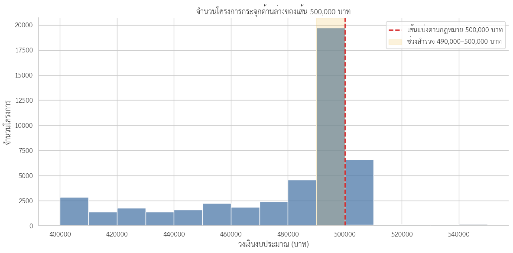

# จากเพดานวงเงินสู่การจัดลำดับตรวจสอบโครงการจ้างก่อสร้าง

> DADS5001 Data Tools and Programming — Mini Project  
> ข้อมูล e-GP ปีงบประมาณ 2569 สะสมถึงวันที่ 30 กรกฎาคม 2569 ไม่ใช่ข้อมูลเต็มปี

## ที่มาของโครงการ

ข้อมูลจัดซื้อจัดจ้างภาครัฐมีทั้งโครงการขนาดเล็กและขนาดใหญ่ หลายวิธีจัดซื้อ หลายหน่วยงาน และผู้รับจ้างจำนวนมาก การเริ่มต้นจากคำว่า “ค้นหาทุจริต” จึงกว้างเกินกว่าข้อมูลจะตอบได้ และอาจทำให้ตีความรูปแบบตามกฎหมายเป็นความผิดปกติ

โครงการนี้เริ่มจากคำถามที่แคบกว่า:

> **เมื่อสำรวจโครงการจ้างก่อสร้าง เราพบการกระจุกของวงเงินบริเวณใด การกระจุกนั้นสัมพันธ์กับวิธีจัดซื้ออย่างไร และภายใต้บริบทเดียวกันมีคู่หน่วยงาน–ผู้รับจ้างใดที่ควรเปิดเอกสารตรวจเป็นลำดับแรก?**

การวิเคราะห์จึงเดินตามลำดับของสิ่งที่ข้อมูลเปิดเผย:

```text
ข้อมูลจัดซื้อจัดจ้างทั้งหมด
→ แยกโครงการจ้างก่อสร้าง
→ สำรวจการกระจายของวงเงิน
→ พบการกระจุกใกล้ 500,000 บาท
→ เปรียบเทียบวิธีจัดซื้อ
→ ใช้กฎหมายอธิบายรูปแบบที่พบ
→ ตรวจการเกิดซ้ำและการพึ่งพาผู้รับจ้าง
→ ซ้อนทับเงื่อนไขเพื่อจัดลำดับการตรวจ
```

ผลลัพธ์เป็น **รายการสำหรับตรวจสอบต่อ** ไม่ใช่คะแนนทุจริตหรือข้อสรุปว่ามีการกระทำผิด

## 1. จากข้อมูลทั้งหมดสู่งานจ้างก่อสร้าง

ข้อมูลต้นทางประกอบด้วย CSV 8 ไฟล์ รวม 3,964,924 รายการ ขั้นแรกจึงนับรายการตามประเภทโครงการก่อนเลือกขอบเขตการศึกษา

<p align="center"></p>
<p align="center"><em>รูปที่ 1 จำนวนรายการจัดซื้อจัดจ้างตามประเภทโครงการ</em></p>

พบรายการประเภทจ้างก่อสร้าง 180,079 รายการ หรือ 4.54% ของข้อมูลทั้งหมด แต่หนึ่งรายการไม่ได้หมายถึงหนึ่งโครงการเสมอไป เพราะโครงการเดียวอาจปรากฏหลายแถวจากหลายสัญญาหรือหลายผู้รับจ้าง

ก่อนวิเคราะห์จึงดำเนินการดังนี้:

1. เลือกเฉพาะรายการประเภท `จ้างก่อสร้าง`
2. ตัดแถวผู้ร่วมกิจการค้าที่มีรหัสผู้รับจ้างขึ้นต้นด้วย `D` จำนวน 363 แถว
3. ตรวจแถวซ้ำด้วย `รหัสโครงการ + เลขที่สัญญา + เลขประจำตัวนิติบุคคล`
4. แยกข้อมูลระดับรายการสำหรับดูสัญญาออกจากข้อมูลระดับโครงการสำหรับ EDA

หลังเตรียมข้อมูล เหลือรายการจ้างก่อสร้าง 179,716 แถว และโครงการก่อสร้างไม่ซ้ำ 178,978 โครงการ

## 2. โครงการก่อสร้างส่วนใหญ่อยู่ช่วงใด

เมื่อนำข้อมูลให้อยู่ในระดับหนึ่งแถวต่อโครงการ วงเงินงบประมาณมีค่ามัธยฐาน 395,000 บาท แต่ค่าเฉลี่ยอยู่ที่ประมาณ 2.66 ล้านบาท ความต่างนี้แสดงว่ามีโครงการมูลค่าสูงจำนวนน้อยดึงค่าเฉลี่ยขึ้น

การแบ่งช่วงวงเงินช่วยแยกสองมุมมองที่ไม่เหมือนกัน คือ “โครงการส่วนใหญ่อยู่ที่ใด” และ “งบประมาณส่วนใหญ่อยู่ที่ใด”

<p align="center"></p>
<p align="center"><em>รูปที่ 2 จำนวนโครงการและวงเงินรวมตามช่วงงบประมาณ</em></p>

โครงการวงเงินไม่เกิน 500,000 บาทมี 136,623 โครงการ คิดเป็น 76.34% ของจำนวนโครงการ แต่คิดเป็นเพียง 8.23% ของวงเงินรวม ในทางกลับกัน โครงการมากกว่า 10 ล้านบาทมีเพียง 4.08% แต่ครองวงเงินรวม 67.31%

ดังนั้น โครงการขนาดเล็กเป็นกลุ่มที่พบ **บ่อย** ส่วนโครงการขนาดใหญ่เป็นกลุ่มที่มีน้ำหนักด้าน **มูลค่า** การวิเคราะห์ครั้งนี้สนใจความถี่และการเกิดรูปแบบซ้ำ จึงเจาะต่อในกลุ่มโครงการขนาดเล็ก

## 3. การกระจุกใกล้ 500,000 บาท

เมื่อขยายดูช่วง 400,000–550,000 บาท พบความต่างชัดเจนระหว่างสองด้านของ 500,000 บาท ช่วง 490,000–500,000 บาทมี 26,240 โครงการ ขณะที่ช่วงถัดจากเพดานมีจำนวนลดลงมาก

<p align="center"></p>
<p align="center"><em>รูปที่ 3 จำนวนโครงการตามช่วงวงเงินรอบ 500,000 บาท</em></p>

ค่า 500,000 บาทเป็นวงเงินที่ปรากฏบ่อยที่สุด รองลงมาคือ 499,000 และ 498,000 บาท การกระจุกนี้ทำให้เกิดคำถามต่อว่าเป็นลักษณะของวิธีจัดซื้อใด

## 4. วิธีจัดซื้อที่อยู่เบื้องหลังการกระจุก

จาก 26,240 โครงการในช่วง 490,000–500,000 บาท มี 26,154 โครงการ หรือ 99.67% ใช้วิธีเฉพาะเจาะจง ส่วน e-bidding มี 81 โครงการ และวิธีคัดเลือกมี 5 โครงการ

เมื่อพบความสัมพันธ์นี้แล้วจึงย้อนกลับไปดูข้อกำหนดทางกฎหมาย พระราชบัญญัติการจัดซื้อจัดจ้างและการบริหารพัสดุภาครัฐ พ.ศ. 2560 มาตรา 55 กำหนดวิธีจัดซื้อจัดจ้างหลัก และมาตรา 56 วรรคหนึ่ง (2)(ข) รองรับการใช้วิธีเฉพาะเจาะจงในกรณีที่วงเงินไม่เกินวงเงินตามกฎกระทรวง ซึ่งกำหนดไว้ไม่เกิน 500,000 บาท

กฎหมายจึงอธิบายได้ว่าทำไมโครงการวิธีเฉพาะเจาะจงจึงกระจุกอยู่ใต้เพดานนี้ การอยู่ใกล้ 500,000 บาทเพียงอย่างเดียวจึงยังไม่ใช่ความผิดปกติ

## 5. จากรูปแบบตามกฎหมายสู่คำถามที่ต้องตรวจต่อ

เพื่อให้โครงการที่นำมาเปรียบเทียบอยู่ภายใต้บริบทเดียวกัน จึงกำหนดกลุ่มศึกษาเป็น:

- ประเภทโครงการ: จ้างก่อสร้าง
- วิธีจัดซื้อจัดจ้าง: เฉพาะเจาะจง
- วงเงินงบประมาณ: ไม่เกิน 500,000 บาท

จากโครงการก่อสร้าง 178,978 โครงการ เหลือกลุ่มศึกษา 136,070 โครงการ หรือ 76.03%

<p align="center"></p>
<p align="center"><em>รูปที่ 4 จำนวนโครงการในแต่ละขั้นของการกำหนดกลุ่มศึกษา</em></p>

กฎหมายอธิบายการกระจุกใต้เพดานได้ แต่ยังไม่ตอบว่า:

- เหตุใดหน่วยงานและผู้รับจ้างคู่เดิมจึงมีโครงการใกล้เพดานเกิดซ้ำหลายโครงการ
- หน่วยงานบางแห่งพึ่งพาผู้รับจ้างรายเดียวมากเพียงใด
- รูปแบบดังกล่าวยังปรากฏเมื่อเปลี่ยนระดับการวิเคราะห์จากชื่อหน่วยงาน เป็นชื่อหน่วยงานย่อย และจังหวัดหรือไม่

จึงสร้างตัวชี้วัด 4 Pattern โดยใช้ทั้งจำนวนโครงการและวงเงินรวมในการพิจารณา

## 6. Pattern 1 — โครงการใกล้เพดานที่เกิดซ้ำ

Pattern 1 ตรวจโครงการวงเงิน 490,000–500,000 บาท ซึ่งอยู่ในคู่ **ชื่อหน่วยงานย่อย–ผู้รับจ้าง** เดียวกันอย่างน้อย 3 โครงการ

วันที่เกิดรายการไม่ถูกใช้เป็นเงื่อนไข เพราะวันที่คลาดกันเพียงหนึ่งวันอาจทำให้โครงการที่มีบริบทเดียวกันหลุดออกจากกลุ่ม วันที่จึงเก็บไว้สำหรับค้นเอกสารภายหลังเท่านั้น

ผลพบ 2,341 คู่ชื่อหน่วยงานย่อย–ผู้รับจ้าง ครอบคลุม 12,763 โครงการ หรือ 9.38% ของกลุ่มศึกษา การพบ Pattern นี้ยังไม่บอกว่าเหตุใดโครงการจึงแยกจากกัน แต่ช่วยระบุว่าควรเปิดดู TOR/BOQ สถานที่ และความเชื่อมโยงของโครงการใดพร้อมกัน

## 7. Pattern 2 — การพึ่งพาผู้รับจ้างในชื่อหน่วยงาน

Pattern 2 เปลี่ยนมุมมองจากการเกิดซ้ำใกล้เพดาน มาเป็นการวัดว่าผู้รับจ้างรายหนึ่งได้รับงานมากเพียงใดภายในคอลัมน์ `ชื่อหน่วยงาน`

คู่ชื่อหน่วยงาน–ผู้รับจ้างจะผ่านเกณฑ์เมื่อ:

- ผู้รับจ้างได้รับอย่างน้อย 10 โครงการ
- คิดเป็นอย่างน้อย 75% ของจำนวนโครงการในชื่อหน่วยงาน
- คิดเป็นอย่างน้อย 75% ของวงเงินรวมในชื่อหน่วยงาน

การใช้สัดส่วนช่วยไม่ให้หน่วยงานขนาดใหญ่ขึ้นมาอยู่ลำดับต้นเพียงเพราะมีโครงการหรืองบประมาณมาก ผลพบ 115 คู่ชื่อหน่วยงาน–ผู้รับจ้าง ครอบคลุม 1,915 โครงการ

## 8. Pattern 3 — การพึ่งพาผู้รับจ้างในชื่อหน่วยงานย่อย

Pattern 3 ใช้เกณฑ์เดียวกับ Pattern 2 แต่เปลี่ยนตัวหารเป็นคอลัมน์ `ชื่อหน่วยงานย่อย` เพื่อดูความสัมพันธ์ในระดับที่ละเอียดขึ้น

ผลพบ 142 คู่ชื่อหน่วยงานย่อย–ผู้รับจ้าง ครอบคลุม 2,421 โครงการ การเปรียบเทียบสองระดับมีความสำคัญ เพราะผู้รับจ้างอาจมีสัดส่วนสูงมากในหน่วยงานย่อยหนึ่งแห่ง แต่เมื่อรวมเป็นชื่อหน่วยงานแล้ว สัดส่วนอาจลดลง

## 9. Pattern 4 — การพึ่งพาผู้รับจ้างในจังหวัด

Pattern 4 ขยายตัวหารเป็นระดับจังหวัด เพื่อทดสอบว่าความสัมพันธ์ที่เห็นในระดับหน่วยงานขยายเป็นการครองงานเชิงพื้นที่หรือไม่

เกณฑ์กำหนดให้จังหวัดมีอย่างน้อย 20 โครงการ ผู้รับจ้างได้รับอย่างน้อย 5 โครงการ และมีส่วนแบ่งอย่างน้อย 50% ทั้งด้านจำนวนโครงการและวงเงิน

ผลไม่พบคู่จังหวัด–ผู้รับจ้างที่ผ่านเกณฑ์ ส่วนแบ่งจำนวนโครงการสูงสุดอยู่ที่ 14.45% และส่วนแบ่งวงเงินสูงสุดอยู่ที่ 15.12% จึงไม่นำ Pattern 4 ไปใช้คัดโครงการตรวจสอบลำดับแรก

ผลที่ไม่พบความสัมพันธ์มีความหมายเช่นกัน เพราะแสดงว่าระดับจังหวัดกว้างเกินไปสำหรับอธิบายการพึ่งพาผู้รับจ้างในข้อมูลชุดนี้

## 10. จากหลาย Pattern สู่โครงการตรวจสอบลำดับแรก

Pattern เดียวอาจเกิดจากเหตุผลปกติได้หลายแบบ จึงไม่ใช้การเข้าเงื่อนไขเพียงข้อเดียวเป็นลำดับตรวจสอบสูงสุด

การคัดเลือกขั้นสุดท้ายกำหนดเป็น:

```text
Pattern 1
และ
(Pattern 2 หรือ Pattern 3)
```

กล่าวคือ โครงการต้องอยู่ในกลุ่มใกล้เพดานที่เกิดซ้ำกับคู่หน่วยงานย่อย–ผู้รับจ้างเดิม และหน่วยงานระดับใดระดับหนึ่งต้องพึ่งพาผู้รับจ้างรายนั้นสูงด้วย

| เงื่อนไข | จำนวนโครงการ |
|---|---:|
| Pattern 1 — เกิดซ้ำใกล้เพดาน | 12,763 |
| Pattern 2 — พึ่งพาในชื่อหน่วยงาน | 1,915 |
| Pattern 3 — พึ่งพาในชื่อหน่วยงานย่อย | 2,421 |
| Pattern 4 — พึ่งพาในจังหวัด | 0 |
| โครงการตรวจสอบลำดับแรก | 548 |

ผลสุดท้ายเหลือโครงการไม่ซ้ำ 548 โครงการ สำหรับเริ่มเปิดเอกสารตรวจ โดยจัดลำดับคู่หน่วยงาน–ผู้รับจ้างตามสัดส่วนจำนวนโครงการจากมากไปน้อย

โครงการหนึ่งอาจปรากฏในตารางรายละเอียดมากกว่าหนึ่งแถว หากผ่านทั้ง Pattern 2 และ Pattern 3 แต่จำนวน 548 นับจากรหัสโครงการไม่ซ้ำ

## 11. ควรตรวจอะไรต่อ

Pattern ช่วยตอบว่า “ควรเริ่มจากที่ใด” แต่ยังตอบไม่ได้ว่า “เกิดขึ้นเพราะเหตุใด” การตรวจต่อควรทำเป็นกลุ่มของคู่หน่วยงาน–ผู้รับจ้าง ไม่ควรแยกดูทีละโครงการ

เอกสารที่ควรตรวจประกอบด้วย:

1. แผนจัดซื้อจัดจ้างและแหล่งงบประมาณ
2. TOR/BOQ สถานที่ และความต่อเนื่องของงาน
3. เอกสารอนุมัติและประวัติการแก้ไขโครงการหรือสัญญา
4. รายชื่อผู้เสนอราคาและราคาที่เสนอทั้งหมด
5. วิธีสืบราคาและเงื่อนไขการเชิญผู้ประกอบการ
6. เหตุผลของการเลือกผู้รับจ้างและการจัดทำหลายโครงการ

## 12. ข้อจำกัดในการตีความ

ข้อมูลชุดนี้ไม่สามารถใช้ยืนยัน:

- เจตนาหลีกเลี่ยงวิธีแข่งขันหรือแบ่งซื้อแบ่งจ้าง
- การฮั้วหรือการจำกัดการแข่งขัน
- ความสัมพันธ์ส่วนบุคคลหรืออิทธิพลของผู้รับจ้าง
- ความผิดทางกฎหมายหรือการทุจริต

ข้อมูลมีเฉพาะผู้ชนะ ไม่ได้มีผู้เสนอราคาและราคาที่เสนอทั้งหมด อีกทั้ง threshold ของ Pattern เป็นเกณฑ์สำหรับจัดลำดับการตรวจ ไม่ใช่ข้อกำหนดทางกฎหมาย

## Notebook และการทำซ้ำ

| Notebook | หน้าที่ |
|---|---|
| [02_construction_data_preparation_2569.ipynb](02_construction_data_preparation_2569.ipynb) | รวมไฟล์ สกัดงานจ้างก่อสร้าง และเตรียมข้อมูลระดับรายการกับระดับโครงการ |
| [03_construction_eda_2569.ipynb](03_construction_eda_2569.ipynb) | สำรวจวงเงิน พบการกระจุก เปรียบเทียบวิธีจัดซื้อ และกำหนดกลุ่มศึกษา |
| [04_construction_review_indicators_2569.ipynb](04_construction_review_indicators_2569.ipynb) | ตรวจ Pattern 1–4 และจัดลำดับโครงการสำหรับเปิดเอกสาร |

รันตามลำดับ `02 → 03 → 04` บน Google Colab ไฟล์ข้อมูลขนาดใหญ่และ CSV ผลลัพธ์ไม่ได้จัดเก็บใน GitHub ส่วนรูปประกอบอยู่ใน [figure/](figure/)
