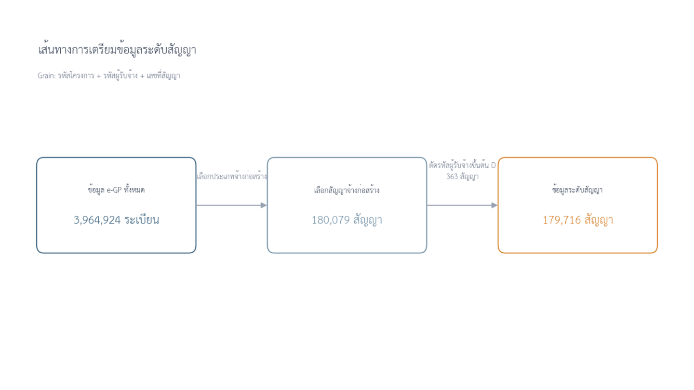
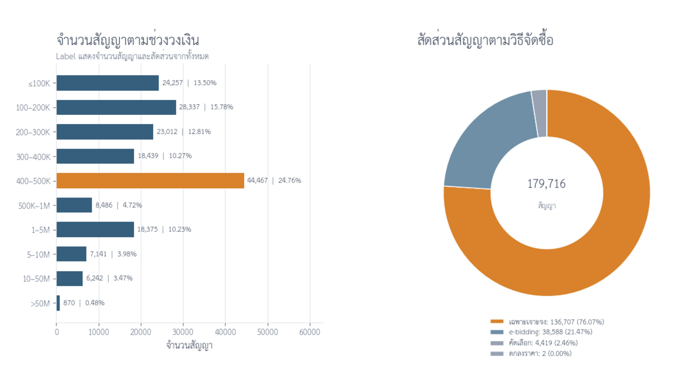
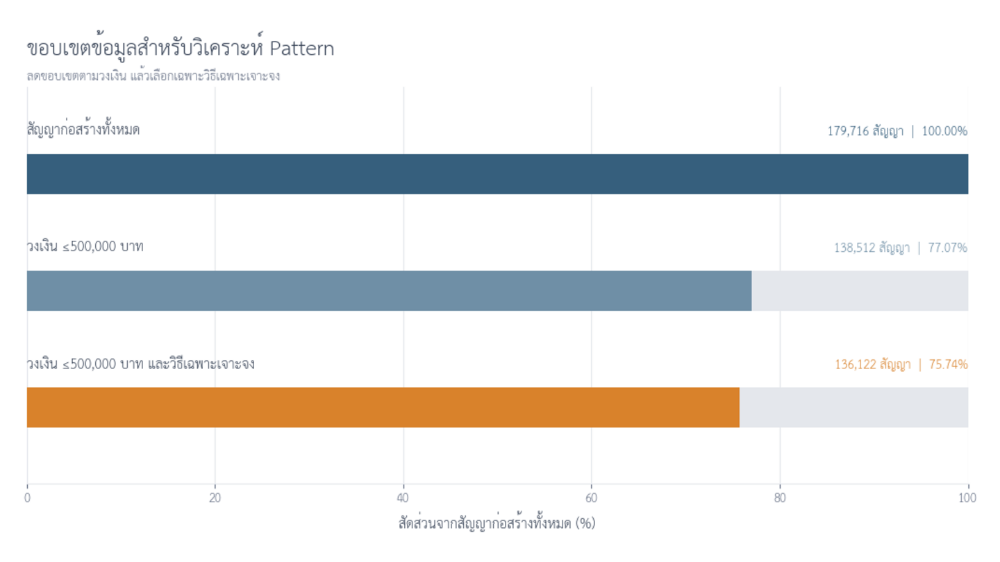
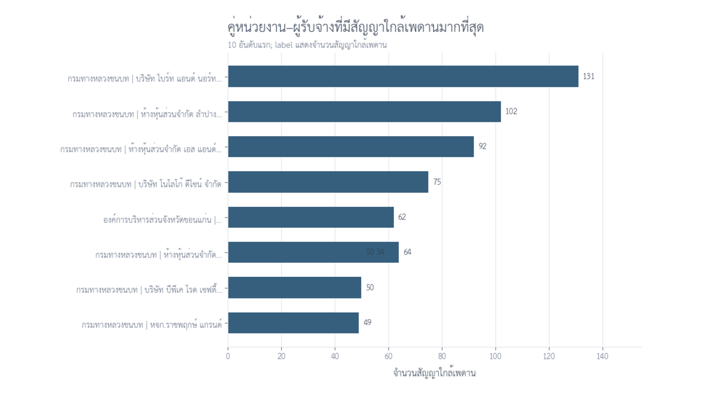
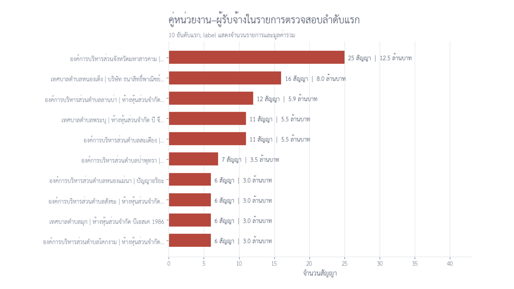

# การสำรวจรูปแบบสัญญาจ้างก่อสร้างจากข้อมูล e-GP ปีงบประมาณ 2569

โครงการนี้เป็นส่วนหนึ่งของรายวิชา DADS5001 Data Tools มีวัตถุประสงค์เพื่อทดลองใช้การสำรวจข้อมูล หรือ Exploratory Data Analysis (EDA) กับข้อมูลจัดซื้อจัดจ้างภาครัฐ โดยมุ่งศึกษาสัญญาจ้างก่อสร้างที่ใช้วิธีเฉพาะเจาะจงและมีวงเงินไม่เกิน 500,000 บาท

สิ่งที่เราต้องการตอบไม่ใช่ว่า “สัญญาใดทุจริต” แต่คือ เมื่อมีสัญญาจำนวนมากจนไม่สามารถตรวจเอกสารได้ทั้งหมด เราจะใช้ข้อมูลช่วยค้นหารูปแบบที่เกิดซ้ำ และลดขอบเขตให้เหลือกลุ่มที่ควรตรวจสอบก่อนอย่างมีเหตุผลได้อย่างไร

ผลลัพธ์ของโครงการจึงเป็น **สัญญาณสำหรับจัดลำดับการตรวจสอบ** ไม่ใช่ข้อสรุปเรื่องการทุจริต การแบ่งซื้อแบ่งจ้าง หรือความผิดทางกฎหมาย

## บทคัดย่อ

การศึกษานี้ใช้ข้อมูล e-GP ปีงบประมาณ 2569 เพื่อสำรวจรูปแบบของสัญญาจ้างก่อสร้าง โดยเริ่มจากข้อมูลต้นทาง 3,964,924 ระเบียน และเตรียมข้อมูลให้อยู่ในระดับสัญญา จนเหลือสัญญาจ้างก่อสร้างสำหรับวิเคราะห์ 179,716 สัญญา การสำรวจเบื้องต้นพบว่าสัญญากระจุกตัวในช่วงวงเงิน 400,000–500,000 บาท และสัญญาส่วนใหญ่บริเวณดังกล่าวใช้วิธีเฉพาะเจาะจง จึงกำหนดประชากรศึกษาหลักเป็นสัญญาจ้างก่อสร้างที่ใช้วิธีเฉพาะเจาะจงและมีวงเงินไม่เกิน 500,000 บาท จำนวน 136,122 สัญญา

จากนั้นศึกษารูปแบบสองด้านในระดับคู่หน่วยงาน–ผู้รับจ้าง ด้านแรกคือการเกิดสัญญาวงเงิน 490,000–500,000 บาทซ้ำอย่างน้อย 3 สัญญา และด้านที่สองคือการที่ผู้รับจ้างรายเดิมมีอย่างน้อย 10 สัญญา พร้อมครองทั้งจำนวนและมูลค่าสัญญาของหน่วยงานตั้งแต่ 80% ขึ้นไป ผลการวิเคราะห์พบ Pattern 1 จำนวน 9,413 สัญญาใน 1,580 คู่ และ Pattern 2 จำนวน 1,343 สัญญาใน 79 คู่ เมื่อพิจารณาจุดร่วมของสอง Pattern เหลือ 161 สัญญาสำหรับจัดลำดับการตรวจเอกสาร

ผลการศึกษาชี้ว่า EDA สามารถเปลี่ยนข้อมูลธุรกรรมจำนวนมากให้เป็นคำถามเชิงตรวจสอบที่เฉพาะเจาะจงขึ้นได้ แต่ผลลัพธ์ยังไม่สามารถพิสูจน์เจตนา การแบ่งซื้อแบ่งจ้าง หรือการทุจริต จำเป็นต้องตรวจ TOR ใบเสนอราคา ผู้เสนอราคา สถานที่ก่อสร้าง ลำดับเวลา และความเชื่อมโยงของเนื้องานร่วมด้วย

## ที่มาและคำถามของการศึกษา

ข้อมูลจัดซื้อจัดจ้างภาครัฐมีทั้งโครงการหลายประเภท วิธีจัดซื้อหลายรูปแบบ และวงเงินตั้งแต่หลักพันไปจนถึงหลายล้านบาท หากเริ่มวิเคราะห์จากข้อสงสัยที่กำหนดไว้ล่วงหน้า เราอาจเลือกมองเฉพาะสิ่งที่ตรงกับสมมติฐานของเรา โครงการนี้จึงเริ่มจากการสำรวจข้อมูลทั้งหมดก่อน แล้วค่อยกำหนดขอบเขตตามสิ่งที่พบ

คำถามหลักของการศึกษาคือ:

> ภายในสัญญาจ้างก่อสร้าง มีรูปแบบใดเกิดขึ้นซ้ำในระดับหน่วยงานและผู้รับจ้าง จนสามารถนำมาใช้จัดลำดับสัญญาที่ควรเปิดเอกสารตรวจสอบก่อนได้บ้าง

เพื่อให้ตอบคำถามนี้ได้ เราแบ่งการศึกษาออกเป็นสามช่วง ได้แก่ การเตรียมข้อมูลให้อยู่ในหน่วยวิเคราะห์ที่ชัดเจน การสำรวจการกระจายของวงเงินและวิธีจัดซื้อ และการค้นหารูปแบบความสัมพันธ์ระหว่างหน่วยงานกับผู้รับจ้าง

## กรอบแนวคิดและวิธีการศึกษา

การศึกษานี้เป็นการวิเคราะห์เชิงสำรวจ ไม่ใช่การทดสอบสมมติฐานเชิงสาเหตุ และไม่ใช่แบบจำลองทำนายการทุจริต กระบวนการวิเคราะห์แบ่งเป็นสี่ขั้นตอนหลัก

1. **กำหนดหน่วยวิเคราะห์** เพื่อป้องกันการนับแถวข้อมูลซ้ำเป็นหลายสัญญา
2. **สำรวจการกระจายโดยไม่ตั้งธงล่วงหน้า** พิจารณาทั้งวงเงินและวิธีจัดซื้อจากสัญญาก่อสร้างทั้งหมด
3. **กำหนด Study Scope จากข้อค้นพบ** เพื่อให้สัญญาที่นำมาเปรียบเทียบอยู่ภายใต้เงื่อนไขพื้นฐานเดียวกัน
4. **สร้างตัวชี้วัดระดับความสัมพันธ์** สรุปข้อมูลจากระดับสัญญาไปยังคู่หน่วยงาน–ผู้รับจ้าง แล้วหาจุดร่วมของสอง Pattern

คำถามย่อยที่ใช้พาการวิเคราะห์ไปทีละขั้น ได้แก่ ข้อมูลทั้งหมดมีสัญญาก่อสร้างกี่สัญญา สัญญากระจายตามวงเงินและวิธีจัดซื้ออย่างไร เหตุใดบริเวณ 500,000 บาทจึงควรถูกขยายดู คู่ใดมีสัญญาใกล้เพดานเกิดซ้ำ คู่ใดมีการพึ่งพาผู้รับจ้างสูง และจุดร่วมของสองรูปแบบลดภาระการตรวจเอกสารได้มากเพียงใด

ตัวแปรหลักประกอบด้วยรหัสโครงการ รหัสผู้รับจ้าง เลขที่สัญญา ชื่อหน่วยงาน จังหวัด วิธีจัดซื้อ และวงเงินงบประมาณในสัญญา จังหวัดใช้เป็นบริบทสำหรับอธิบายและเรียงลำดับผลลัพธ์ แต่ไม่ใช้เป็นเกณฑ์คัดกรอง ส่วนหน่วยงานย่อยไม่ถูกใช้เป็น grain หรือ criteria เนื่องจากส่วนใหญ่ให้ข้อมูลซ้ำกับระดับหน่วยงาน

ลำดับนี้ช่วยยืนยันว่าเราไม่ได้เริ่มจากสัญญา 161 สัญญาแล้วหาคำอธิบายย้อนหลัง แต่เริ่มจากประชากรทั้งหมด สำรวจสิ่งที่เกิดขึ้นจริง และค่อยลดขอบเขตด้วยเกณฑ์ที่ประกาศไว้อย่างชัดเจน

## ข้อมูลและหน่วยวิเคราะห์

ข้อมูลต้นทางเป็นข้อมูล e-GP ปีงบประมาณ 2569 จำนวน 3,964,924 ระเบียน เมื่อตรวจประเภทโครงการและเลือกเฉพาะสัญญาจ้างก่อสร้าง เหลือ 180,079 สัญญา จากนั้นตัดข้อมูลที่รหัสผู้รับจ้างขึ้นต้นด้วย `D` จำนวน 363 สัญญาออกตามเงื่อนไขการเตรียมข้อมูล จึงเหลือข้อมูลสำหรับวิเคราะห์ 179,716 สัญญา

ในการศึกษานี้ หนึ่งสัญญากำหนดจากชุดคีย์:

`รหัสโครงการ + รหัสผู้รับจ้าง + เลขที่สัญญา`

การกำหนด grain ก่อนวิเคราะห์มีความสำคัญ เพราะหนึ่งโครงการอาจปรากฏได้มากกว่าหนึ่งแถวหรือมีผู้รับจ้างมากกว่าหนึ่งราย หากนับจากจำนวนแถวโดยตรง ตัวเลขอาจไม่สะท้อนจำนวนสัญญาที่แท้จริง

ภาพข้างต้นสรุปว่า ข้อมูล 3.96 ล้านระเบียนไม่ได้ถูกนำมาเปรียบเทียบกันทั้งหมด แต่ถูกคัดเลือกและจัดโครงสร้างจนได้ชุดข้อมูลระดับสัญญาจ้างก่อสร้าง 179,716 สัญญา ซึ่งเป็นฐานสำหรับการวิเคราะห์ในขั้นถัดไป

ตัวเลข 180,079 และ 179,716 มีความหมายต่างกัน ตัวเลขแรกคือจำนวนสัญญาก่อสร้างก่อนใช้เงื่อนไขกับรหัสผู้รับจ้าง ส่วนตัวเลขหลังคือจำนวนสัญญาที่ผ่านการเตรียมข้อมูลและใช้เป็นฐานวิเคราะห์จริง ความแตกต่าง 363 สัญญาจึงเกิดจากกติกาการจัดการรหัสผู้รับจ้าง ไม่ใช่การลบข้อมูลโดยไม่มีคำอธิบาย

การแสดงเส้นทางนี้ตั้งแต่ต้นช่วยป้องกันความสับสนระหว่าง “จำนวนระเบียนต้นทาง” “จำนวนโครงการ” และ “จำนวนสัญญา” ซึ่งเป็นหน่วยนับคนละระดับกัน และทำให้ผู้อ่านสามารถตรวจสอบย้อนกลับได้ว่าประชากรที่ใช้วิเคราะห์เกิดขึ้นอย่างไร

## การสำรวจภาพรวมของสัญญาจ้างก่อสร้าง

ก่อนกำหนดเกณฑ์หรือ Pattern เราสำรวจสัญญาก่อสร้างทั้ง 179,716 สัญญา เพื่อดูว่าสัญญากระจายอยู่ในช่วงวงเงินใด และใช้วิธีจัดซื้อแบบใด

จากภาพซ้าย พบว่าสัญญาในช่วง 400,000–500,000 บาทมีจำนวนมากกว่าช่วงวงเงินอื่นอย่างเห็นได้ชัด ขณะที่ภาพขวาแสดงว่าวิธีเฉพาะเจาะจงเป็นวิธีจัดซื้อหลักของสัญญาก่อสร้างในชุดข้อมูลนี้

ข้อค้นพบดังกล่าวยังไม่เพียงพอที่จะบอกว่ามีความผิดปกติ เพราะจำนวนสัญญาที่สูงอาจเกิดจากโครงสร้างของกฎเกณฑ์ กระบวนการจัดซื้อ หรือธรรมชาติของงานก่อสร้าง อย่างไรก็ตาม รูปทรงของข้อมูลทำให้เกิดคำถามต่อว่า การกระจุกตัวบริเวณ 500,000 บาทมีลักษณะอย่างไร และสัมพันธ์กับวิธีจัดซื้อประเภทใด

การอ่านภาพรวมควรอ่านกราฟสองส่วนร่วมกัน หากดูเฉพาะช่วงวงเงิน เราจะรู้ว่าช่วง 400,000–500,000 บาทมีความหนาแน่นสูง แต่ยังไม่รู้ว่าความหนาแน่นนั้นสัมพันธ์กับกระบวนการจัดซื้อแบบใด หากดูเฉพาะสัดส่วนวิธีจัดซื้อ เราจะรู้ว่าวิธีเฉพาะเจาะจงมีจำนวนมาก แต่ยังไม่เห็นตำแหน่งของวงเงินที่กระจุกตัว การวางสองภาพไว้คู่กันจึงทำให้เกิดคำถามเชื่อมโยงที่เหมาะสมสำหรับการวิเคราะห์ขั้นต่อไป

นี่คือบทบาทสำคัญของ EDA: ภาพแรกไม่จำเป็นต้องให้คำตอบสุดท้าย แต่อาจช่วยชี้ว่าควรถามอะไรต่อ ควรขยายดูช่วงใด และตัวแปรใดควรถูกนำมาพิจารณาร่วมกัน

## การกระจายของสัญญาบริเวณ 500,000 บาท

เพื่อให้เห็นรายละเอียดที่ถูกบดบังในภาพรวม เราจึงขยายช่วงวงเงินเป็น 400,000–550,000 บาท และแยกองค์ประกอบของแต่ละช่วงตามวิธีจัดซื้อ

ภาพแสดงยอดกระจุกตัวทันทีใต้ 500,000 บาทอย่างชัดเจน และองค์ประกอบส่วนใหญ่เป็นวิธีเฉพาะเจาะจง สิ่งที่ภาพนี้บอกเราได้คือ บริเวณดังกล่าวมีความหนาแน่นของสัญญาสูงและควรศึกษาเพิ่มเติม แต่ยังไม่สามารถบอกสาเหตุหรือเจตนาของการเกิดสัญญาได้

ด้วยเหตุนี้ เราจึงใช้ข้อค้นพบจากการสำรวจเป็นเหตุผลในการกำหนดประชากรสำหรับการวิเคราะห์ Pattern แทนการใช้ “สัญญาใกล้เพดาน” เป็นข้อกล่าวหาหรือข้อสรุปล่วงหน้า

## การกำหนดขอบเขตการศึกษา

ขอบเขตของการวิเคราะห์ถูกลดลงอย่างเป็นลำดับ เริ่มจากสัญญาก่อสร้างทั้งหมด 179,716 สัญญา เลือกสัญญาที่มีวงเงินไม่เกิน 500,000 บาท เหลือ 138,512 สัญญา และเลือกเฉพาะวิธีเฉพาะเจาะจง เหลือ 136,122 สัญญา

ดังนั้น **Study Scope ของโครงการคือสัญญาจ้างก่อสร้างที่ใช้วิธีเฉพาะเจาะจงและมีวงเงินไม่เกิน 500,000 บาท จำนวน 136,122 สัญญา**

ในขั้นนี้ เรายังไม่ได้กำหนดว่าสัญญาจะต้องอยู่ใกล้เพดาน 500,000 บาท เพราะเงื่อนไขดังกล่าวเป็นส่วนหนึ่งของ Pattern 1 ไม่ใช่นิยามของประชากรศึกษา การแยกสองส่วนนี้ช่วยให้ขอบเขตข้อมูลและเกณฑ์คัดกรองไม่ปะปนกัน

การลดขอบเขตไม่ควรถูกอ่านว่าเป็น funnel ของ “ความผิดปกติ” เพราะขั้นตอนนี้ยังไม่ได้ตัดสินว่าสัญญาใดมีปัญหา ขั้นแรกเพียงเลือกวงเงินที่สอดคล้องกับบริเวณที่ต้องการศึกษา และขั้นที่สองควบคุมวิธีจัดซื้อให้สัญญาอยู่ภายใต้บริบทใกล้เคียงกัน เราจึงเรียกผลลัพธ์ 136,122 สัญญาว่า Study Scope ไม่ใช่กลุ่มเสี่ยง

การกำหนดประชากรให้ชัดก่อนสร้าง Pattern ยังทำให้ตัวหารของสัดส่วนมีความหมายเหมือนกัน ตัวอย่างเช่น เมื่อวัดว่าผู้รับจ้างรายหนึ่งครองงานของหน่วยงานกี่เปอร์เซ็นต์ เรากำลังเปรียบเทียบภายในสัญญาเฉพาะเจาะจงไม่เกิน 500,000 บาท ไม่ได้อ้างว่าเป็นสัดส่วนจากงานจัดซื้อทุกประเภทของหน่วยงานนั้น

## การเกิดสัญญาใกล้เพดานซ้ำกับคู่เดิม

Pattern 1 ศึกษาว่า ภายใน Study Scope มีคู่ **ชื่อหน่วยงาน + ผู้รับจ้าง** คู่ใดที่มีสัญญาวงเงิน 490,000–500,000 บาทเกิดขึ้นซ้ำอย่างน้อย 3 สัญญา

คำถามนี้ไม่ได้พิจารณาเฉพาะว่าสัญญาหนึ่งอยู่ใกล้ 500,000 บาทหรือไม่ แต่พิจารณาการเกิดซ้ำในความสัมพันธ์เดิม เพราะการเกิดซ้ำช่วยแยกกรณีรายสัญญาออกจากรูปแบบที่ควรศึกษาในระดับกลุ่ม

จากเกณฑ์ดังกล่าว พบสัญญาที่เข้า Pattern 1 จำนวน 9,413 สัญญา ครอบคลุม 1,580 คู่หน่วยงาน–ผู้รับจ้าง กราฟจัดอันดับด้วยจำนวนสัญญาใกล้เพดาน เพื่อแสดงขนาดของการเกิดซ้ำ ไม่ใช่ระดับความรุนแรงหรือโอกาสทุจริต

ผลลัพธ์ของ Pattern 1 มีจำนวนค่อนข้างมาก จึงยังมีลักษณะเป็นการคัดกรองแบบกว้าง และไม่เหมาะที่จะใช้เป็นรายการตรวจสอบสุดท้ายเพียงเงื่อนไขเดียว

เหตุผลที่พิจารณาเป็น “คู่” แทนการจัดอันดับหน่วยงานหรือผู้รับจ้างแยกจากกัน คือ จำนวนสัญญาสูงของหน่วยงานขนาดใหญ่อาจเป็นผลจากภารกิจตามปกติ และผู้รับจ้างรายใหญ่อาจรับงานจากหลายหน่วยงาน แต่เมื่อหน่วยงานและผู้รับจ้างคู่เดิมมีสัญญาใกล้เพดานเกิดซ้ำ ความสัมพันธ์นั้นจะกลายเป็นหน่วยที่สามารถเปิดเอกสารเพื่อทำความเข้าใจได้ชัดเจนกว่า

เกณฑ์อย่างน้อย 3 สัญญาใช้เพื่อแยกเหตุการณ์เดี่ยวออกจากการเกิดซ้ำ แต่เป็น threshold ที่ผู้วิเคราะห์กำหนด ไม่ได้หมายความว่าการมี 2 สัญญาปกติ ส่วน 3 สัญญาผิดปกติทันที ผลลัพธ์จึงควรถูกเปรียบเทียบกับ threshold อื่นใน sensitivity analysis ก่อนนำไปใช้จริง

## การพึ่งพาผู้รับจ้างรายเดิมภายในหน่วยงาน

Pattern 2 มองความสัมพันธ์อีกด้านหนึ่ง โดยถามว่า ภายในหน่วยงานหนึ่ง มีผู้รับจ้างรายใดได้รับสัญญาเป็นสัดส่วนสูงทั้งด้านจำนวนและมูลค่าหรือไม่

เกณฑ์ที่ใช้คือ คู่หน่วยงาน–ผู้รับจ้างต้องมีอย่างน้อย 10 สัญญา และผู้รับจ้างรายนั้นต้องครองทั้งจำนวนสัญญาและมูลค่าสัญญาภายในหน่วยงานตั้งแต่ 80% ขึ้นไป

Pattern 2 พบ 1,343 สัญญา ครอบคลุม 79 คู่หน่วยงาน–ผู้รับจ้าง กราฟใช้จำนวนสัญญาเป็นตัวจัดอันดับ เพราะหลายคู่มีสัดส่วนการครองงาน 100% เหมือนกัน การแสดงจำนวนสัญญาจึงช่วยให้เห็นขนาดของความสัมพันธ์แตกต่างกันชัดกว่าเปอร์เซ็นต์

การพึ่งพาผู้รับจ้างรายเดิมสูงอาจมีคำอธิบายที่สมเหตุสมผล เช่น จำนวนผู้ประกอบการในพื้นที่ ความเชี่ยวชาญเฉพาะงาน หรือความต่อเนื่องของโครงการ ดังนั้น Pattern 2 จึงเป็นเพียงเหตุผลให้ตรวจบริบทเพิ่มเติม ไม่ใช่ข้อสรุปว่าความสัมพันธ์นั้นไม่เหมาะสม

Pattern 2 ใช้ทั้งสัดส่วนจำนวนและสัดส่วนมูลค่าร่วมกัน เพราะการใช้เพียงมิติเดียวอาจทำให้ตีความคลาดเคลื่อน ผู้รับจ้างอาจได้รับสัญญาจำนวนมากแต่มูลค่าต่ำ หรือได้รับสัญญาไม่กี่ฉบับแต่มูลค่าสูง การกำหนดให้ผ่านทั้งสองมิติจึงสะท้อนความต่อเนื่องของความสัมพันธ์ทั้งด้านความถี่และขนาดทางการเงิน

เงื่อนไขขั้นต่ำ 10 สัญญาช่วยลดกรณีที่เปอร์เซ็นต์สูงเพราะฐานมีขนาดเล็ก เช่น หน่วยงานที่มีเพียงหนึ่งสัญญาและผู้รับจ้างหนึ่งรายย่อมมีสัดส่วน 100% แต่ยังไม่ควรถูกตีความว่าเป็นการพึ่งพาในระยะยาว ส่วนเกณฑ์ 80% ใช้แทนแนวคิด “ส่วนใหญ่ที่เด่นชัด” ในการคัดกรอง ไม่ใช่เส้นแบ่งตามกฎหมาย

## การหาจุดร่วมของสอง Pattern

Pattern 1 และ Pattern 2 ตอบคนละคำถาม จึงถูกคำนวณแยกจากกัน Pattern 1 มองการเกิดสัญญาใกล้เพดานซ้ำ ส่วน Pattern 2 มองการพึ่งพาผู้รับจ้างรายเดิมภายในหน่วยงาน

หลังจากนั้น เราจึงหาจุดร่วมของสองเงื่อนไข เพื่อเลือกสัญญาที่มีทั้งลักษณะเกิดใกล้เพดานซ้ำและอยู่ในความสัมพันธ์ที่มีการพึ่งพาผู้รับจ้างสูง

จากสัญญาก่อสร้าง 179,716 สัญญา ลดเหลือ Study Scope 136,122 สัญญา และเมื่อเลือกจุดร่วมของ Pattern 1 กับ Pattern 2 เหลือ **161 สัญญา**

จำนวน 161 สัญญาเป็นผลลัพธ์สำคัญในเชิงการจัดการงาน เพราะช่วยลดขอบเขตจากข้อมูลจำนวนมากให้เหลือกลุ่มที่สามารถเปิดเอกสารประกอบเพื่อตรวจสอบต่อได้จริง อย่างไรก็ตาม การเข้าเกณฑ์ทั้งสองยังไม่ใช่หลักฐานว่ามีการกระทำผิด

ภาพเส้นทางไม่ได้หมายความว่า Pattern 2 เป็นขั้นต่อจาก Pattern 1 ในทางตรรกะ Pattern ทั้งสองถูกสร้างแบบคู่ขนานจาก Study Scope เดียวกัน แล้วจึงนำ flag มาหาจุดร่วม การแสดงเป็นสองเส้นทางที่มาบรรจบกันจึงตรงกับกระบวนการวิเคราะห์มากกว่า funnel ต่อเนื่อง

การใช้จุดร่วมช่วยเพิ่มความเฉพาะเจาะจงของรายการตรวจสอบ แต่มี trade-off เพราะสัญญาที่เข้าเพียง Pattern เดียวอาจยังมีประเด็นน่าสนใจ เพียงแต่ไม่ได้ถูกจัดอยู่ในคิวแรกของการศึกษานี้ ดังนั้น 161 สัญญาคือ “ลำดับแรก” ไม่ใช่ขอบเขตทั้งหมดของสัญญาที่อาจต้องศึกษา

## รายการสำหรับการตรวจสอบในลำดับแรก

ขั้นสุดท้าย เราสรุป 161 สัญญากลับเป็นคู่หน่วยงาน–ผู้รับจ้าง และจัดอันดับตามจำนวนสัญญาของแต่ละคู่ เพื่อสร้างรายการสำหรับกำหนดลำดับการเปิดเอกสาร

Top 10 ในภาพไม่ได้หมายถึงคู่ที่ “มีความผิดมากที่สุด” แต่หมายถึงคู่ที่มีจำนวนสัญญาเข้าเงื่อนไขร่วมมากที่สุด หากมีเวลาและทรัพยากรจำกัด รายการนี้ช่วยบอกว่าควรเริ่มตรวจจากที่ใดก่อน

เอกสารและข้อมูลที่ควรตรวจเพิ่มเติม ได้แก่ TOR หรือขอบเขตงาน ใบเสนอราคา จำนวนและรายชื่อผู้เสนอราคา วันที่ดำเนินการ สถานที่ก่อสร้าง แหล่งงบประมาณ และความเชื่อมโยงของเนื้องานระหว่างสัญญา ข้อมูลเหล่านี้จะช่วยแยกกรณีที่มีคำอธิบายตามปกติออกจากกรณีที่ควรตรวจสอบเชิงลึก

วิธีใช้ Top 10 ที่เหมาะสมคือ เริ่มจากคู่ที่มีจำนวนสัญญามาก ตรวจว่าสัญญาเป็นงานประเภทเดียวกันหรือคนละประเภท อยู่ในพื้นที่เดียวกันหรือหลายพื้นที่ เกิดในช่วงเวลาเดียวกันหรือกระจายตลอดปี และมีผู้ประกอบการรายอื่นเสนอราคาหรือไม่ จากนั้นจึงบันทึกคำอธิบายของแต่ละกรณีอย่างเป็นระบบ

หากพบว่างานมีลักษณะซ้ำแต่แยกพื้นที่อย่างมีเหตุผล หรือมีข้อจำกัดด้านผู้ประกอบการในท้องถิ่น Pattern อาจได้รับคำอธิบายโดยไม่จำเป็นต้องขยายการตรวจสอบ แต่หากพบขอบเขตงานต่อเนื่องกัน วงเงินใกล้เคียงกัน เกิดในช่วงเวลาเดียวกัน และมีการแข่งขันจำกัด กรณีนั้นจึงควรถูกส่งต่อเพื่อทบทวนเอกสารโดยละเอียด

## สรุปผลการศึกษา

การสำรวจเริ่มจากข้อมูล e-GP 3.96 ล้านระเบียน และไม่ได้กำหนดกลุ่มใกล้ 500,000 บาทเป็นเป้าหมายตั้งแต่ต้น เมื่อพิจารณาเฉพาะสัญญาจ้างก่อสร้าง เราพบการกระจุกตัวในช่วง 400,000–500,000 บาท และพบว่าส่วนใหญ่สัมพันธ์กับวิธีเฉพาะเจาะจง ข้อค้นพบนี้จึงนำไปสู่การกำหนด Study Scope จำนวน 136,122 สัญญา

ภายในขอบเขตดังกล่าว Pattern 1 พบการเกิดสัญญาใกล้เพดานซ้ำ 9,413 สัญญา ขณะที่ Pattern 2 พบสัญญาในความสัมพันธ์ที่ผู้รับจ้างครองงานสูง 1,343 สัญญา เมื่อนำทั้งสอง Pattern มาพิจารณาร่วมกัน เหลือ 161 สัญญาที่ควรเปิดเอกสารก่อน

สาระสำคัญของโครงการจึงไม่ใช่การบอกว่า “สัญญาใกล้ 500,000 บาทผิดปกติ” แต่เป็นการแสดงว่า EDA สามารถพาเราจากข้อสังเกตในข้อมูล ไปสู่คำถามที่เฉพาะเจาะจง และช่วยลดขอบเขตการตรวจสอบอย่างเป็นระบบได้อย่างไร

เมื่อพิจารณาในมุมงานวิจัย โครงการนี้ให้ผลสองระดับ ระดับแรกคือผลเชิงพรรณนา ซึ่งอธิบายการกระจายของสัญญาก่อสร้างตามวงเงินและวิธีจัดซื้อ ระดับที่สองคือผลเชิงปฏิบัติ ซึ่งสร้างกระบวนการคัดกรองจาก 179,716 สัญญาให้เหลือ work queue 161 สัญญา ผลระดับที่สองมีประโยชน์ต่อการจัดสรรทรัพยากรตรวจสอบ แต่ยังต้องยืนยันด้วยข้อมูลเอกสาร

สิ่งที่การศึกษาตอบได้คือ สัญญาใดเข้าเงื่อนไขที่กำหนด คู่ใดมีรูปแบบเกิดซ้ำ และการซ้อนทับของ Pattern ลดขอบเขตได้เท่าใด ส่วนสิ่งที่ยังตอบไม่ได้คือ เหตุใดหน่วยงานจึงเลือกผู้รับจ้างรายนั้น เหตุใดวงเงินจึงอยู่ในระดับดังกล่าว และมีเจตนาหลีกเลี่ยงการแข่งขันหรือไม่ คำถามเหล่านี้อยู่นอกขอบเขตข้อมูลธุรกรรมและต้องอาศัยหลักฐานประเภทอื่น

## นิยามและเกณฑ์ที่ใช้

| องค์ประกอบ | นิยามในการศึกษานี้ |
|---|---|
| หน่วยวิเคราะห์ | หนึ่งสัญญา = `รหัสโครงการ + รหัสผู้รับจ้าง + เลขที่สัญญา` |
| Study Scope | งานก่อสร้าง + วิธีเฉพาะเจาะจง + วงเงินไม่เกิน 500,000 บาท |
| Pattern 1 | คู่ชื่อหน่วยงาน–ผู้รับจ้างเดียวกัน มีสัญญา 490,000–500,000 บาทอย่างน้อย 3 สัญญา |
| Pattern 2 | คู่เดียวกันมีอย่างน้อย 10 สัญญา และครองทั้งจำนวนและมูลค่าสัญญาในหน่วยงานตั้งแต่ 80% |
| Priority Review | สัญญาที่เข้า Pattern 1 และ Pattern 2 พร้อมกัน |
| จังหวัด | ใช้เป็นข้อมูลบริบทและการเรียงลำดับ แต่ไม่ใช้เป็นเกณฑ์ |
| หน่วยงานย่อย | ไม่นำมาใช้เป็น grain หรือเกณฑ์ |

เกณฑ์ 3 สัญญา 10 สัญญา และ 80% เป็นเกณฑ์คัดกรองที่ผู้วิเคราะห์กำหนดขึ้นเพื่อการศึกษา ไม่ใช่เกณฑ์ตามกฎหมาย ก่อนนำไปใช้จริงควรทำ sensitivity analysis เพื่อดูว่าผลลัพธ์เปลี่ยนแปลงมากเพียงใดเมื่อปรับ threshold

## ข้อจำกัดของการศึกษา

- ข้อมูลที่ใช้เป็นข้อมูลเชิงธุรกรรม จึงอธิบายรูปแบบที่เกิดขึ้นได้ แต่ไม่สามารถบอกเจตนาของผู้เกี่ยวข้อง
- การใช้ชื่อหน่วยงานและข้อมูลผู้รับจ้างขึ้นอยู่กับคุณภาพและความสม่ำเสมอของการบันทึกข้อมูล
- การวิเคราะห์ยังไม่ได้อ่านรายละเอียด TOR ขอบเขตงาน ใบเสนอราคา หรือเหตุผลในการเลือกผู้รับจ้าง
- เกณฑ์ของ Pattern เป็นเกณฑ์เชิงสำรวจและยังไม่ได้ผ่านการทดสอบความไวอย่างเป็นระบบ
- การกระจุกตัวบริเวณเพดานวงเงินอาจเกิดจากกฎระเบียบและกระบวนการจัดซื้อ จึงไม่ควรตีความเป็นความผิดปกติโดยอัตโนมัติ
- กราฟที่แบ่งวงเงินเป็นช่วงใช้เพื่อแสดงรูปทรงของข้อมูล เมื่อต้องการจำนวนแบบเจาะจงควรใช้ผลจากเงื่อนไขกรองโดยตรง ไม่อ่านจำนวนจากความสูงของแท่งเพียงอย่างเดียว

## ข้อเสนอแนะจากการศึกษา

หากนำแนวทางนี้ไปใช้ต่อ ควรแยกกระบวนการออกเป็นสองชั้น ชั้นแรกคือระบบคัดกรองจากข้อมูล ซึ่งใช้เกณฑ์ที่ตรวจสอบย้อนกลับได้และสร้าง work queue อย่างสม่ำเสมอ ชั้นที่สองคือการทบทวนโดยผู้มีความรู้ด้านจัดซื้อและงานก่อสร้าง ซึ่งพิจารณาเอกสารและบริบทที่ข้อมูล e-GP ไม่ได้บันทึกไว้ การมีมนุษย์อยู่ในกระบวนการช่วยป้องกันการใช้ flag เป็นคำตัดสินอัตโนมัติ

ในการรายงานผล ควรแสดงทั้งจำนวนที่เข้าเกณฑ์และจำนวนประชากรฐานเสมอ เพราะตัวเลขจำนวนมากอาจดูรุนแรงหากไม่มีตัวหารประกอบ นอกจากนี้ ควรใช้คำว่า “สัญญาณ” “รูปแบบ” “รายการตรวจสอบ” หรือ “การพึ่งพาผู้รับจ้างสูง” แทนคำที่สื่อว่าพิสูจน์ความผิดแล้ว

## แนวทางศึกษาต่อ

การศึกษารอบถัดไปควรทดสอบความไวของเกณฑ์ เช่น เปรียบเทียบ Pattern 1 ที่จำนวนซ้ำ 2, 3 และ 5 สัญญา รวมทั้งเปรียบเทียบ Pattern 2 ที่สัดส่วน 75%, 80% และ 90% นอกจากนี้ ควรสุ่มตรวจเอกสารของคู่ใน Top 10 เพื่อประเมินว่า Pattern ที่ค้นพบช่วยระบุกรณีที่มีสาระสำคัญต่อการตรวจสอบได้จริงหรือไม่

หากมีข้อมูลเพิ่มเติม การวิเคราะห์สามารถขยายไปสู่มิติของเวลา ความคล้ายคลึงของชื่อหรือขอบเขตโครงการ จำนวนผู้เสนอราคา และความสัมพันธ์ระหว่างผู้รับจ้างข้ามหน่วยงานได้

## โครงสร้างการวิเคราะห์และวิธีรัน

Notebook ควรรันตามลำดับดังนี้:

1. `02_construction_data_preparation_2569.ipynb` — เตรียมข้อมูลและกำหนด grain ระดับสัญญา
2. `03_construction_eda_2569.ipynb` — สำรวจการกระจายของวงเงิน วิธีจัดซื้อ และบริบทของข้อมูล
3. `04_construction_review_indicators_2569.ipynb` — สร้าง Pattern และ flag สำหรับการตรวจสอบ
4. `05_construction_storytelling_visuals_2569.ipynb` — สร้างภาพและเรียบเรียงผลการศึกษา

Notebook 05 เป็นชั้นสำหรับการนำเสนอ โดยอ่านผลลัพธ์และนิยามจาก Notebook 02–04 เพื่อให้ตัวเลข เกณฑ์ และภาพที่ใช้ใน README สอดคล้องกัน
