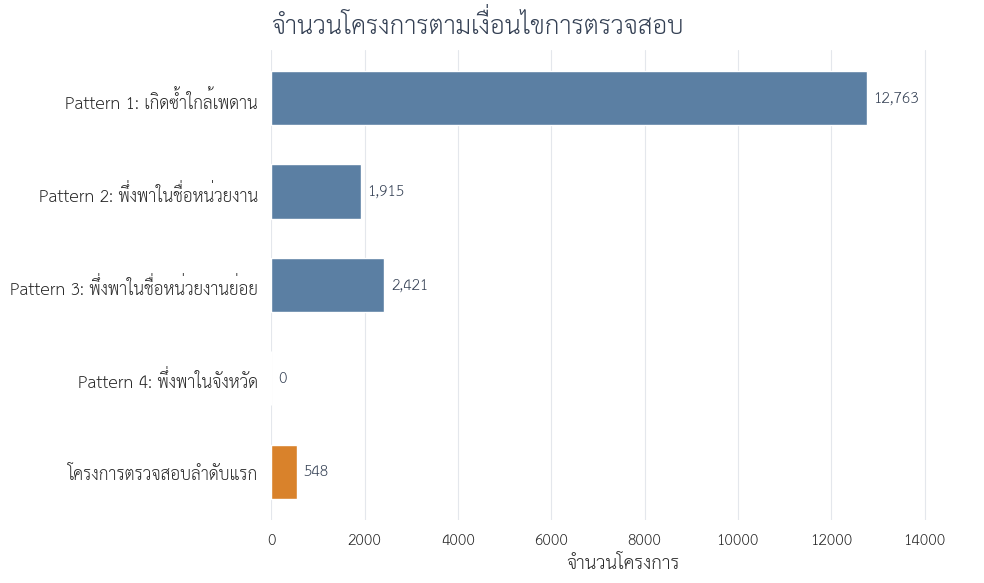

# จากเพดานวงเงินสู่การจัดลำดับตรวจสอบโครงการจ้างก่อสร้าง

> DADS5001 Data Tools and Programming — Mini Project  
> ข้อมูล e-GP ปีงบประมาณ 2569 สะสมถึงวันที่ 30 กรกฎาคม 2569 ไม่ใช่ข้อมูลเต็มปี

## คำถามของโครงการ

โครงการนี้ไม่ได้เริ่มจากการกำหนดว่าโครงการใด “ผิดปกติ” แต่เริ่มจากการสำรวจข้อมูลเพื่อหาว่าควรถามอะไรต่อ

เมื่อพบว่าโครงการจ้างก่อสร้างจำนวนมากอยู่ใกล้เพดานวงเงินของวิธีเฉพาะเจาะจง คำถามหลักจึงเป็น:

> **ภายใต้โครงการจ้างก่อสร้างที่ใช้วิธีเฉพาะเจาะจงและมีวงเงินไม่เกิน 500,000 บาท มีกลุ่มโครงการใกล้เพดานที่เกิดซ้ำกับคู่หน่วยงานย่อย–ผู้รับจ้างเดิมหรือไม่ และกลุ่มเหล่านั้นซ้อนทับกับการพึ่งพาผู้รับจ้างสูงในระดับชื่อหน่วยงานหรือชื่อหน่วยงานย่อยเพียงใด?**

การวิเคราะห์แบ่งเป็นสามช่วง:

1. เตรียมข้อมูลและกำหนดหน่วยวิเคราะห์
2. สำรวจวงเงิน วิธีจัดซื้อ และบริบททางกฎหมาย
3. ตรวจรูปแบบซ้ำและซ้อนทับเงื่อนไขเพื่อจัดลำดับการเปิดเอกสาร

ผลลัพธ์เป็นรายการสำหรับตรวจสอบต่อ ไม่ใช่คะแนนทุจริตหรือหลักฐานว่ามีการกระทำผิด

## 1. เตรียมข้อมูลก่อนตั้งคำถามเชิง Pattern

ข้อมูลต้นทางประกอบด้วย CSV 8 ไฟล์ รวม 3,964,924 รายการ ขั้นแรกจึงนับรายการตามประเภทโครงการ ก่อนเลือกเฉพาะรายการประเภท `จ้างก่อสร้าง`

<p align="center"></p>
<p align="center"><em>รูปที่ 1 จำนวนรายการจัดซื้อจัดจ้างตามประเภทโครงการ</em></p>

พบรายการจ้างก่อสร้าง 180,079 รายการ หรือ 4.54% ของข้อมูลทั้งหมด แต่หนึ่งรายการไม่จำเป็นต้องเท่ากับหนึ่งโครงการ เพราะโครงการเดียวอาจมีหลายสัญญาหรือหลายผู้รับจ้าง

การเตรียมข้อมูลจึงประกอบด้วย:

- เลือกเฉพาะรายการประเภทจ้างก่อสร้าง
- ตัดแถวผู้ร่วมกิจการค้าที่มีรหัสผู้รับจ้างขึ้นต้นด้วย `D` จำนวน 363 แถว
- ตรวจแถวซ้ำด้วย `รหัสโครงการ + เลขที่สัญญา + เลขประจำตัวนิติบุคคล`
- เก็บข้อมูลระดับรายการสำหรับตรวจสัญญา
- สร้างข้อมูลหนึ่งแถวต่อโครงการสำหรับ EDA

หลังเตรียมข้อมูล เหลือรายการจ้างก่อสร้าง 179,716 แถว และโครงการก่อสร้างไม่ซ้ำ 178,978 โครงการ

## 2. โครงการก่อสร้างส่วนใหญ่อยู่ช่วงใด

วงเงินงบประมาณของโครงการก่อสร้างมีค่ามัธยฐาน 395,000 บาท แต่ค่าเฉลี่ยอยู่ที่ประมาณ 2.66 ล้านบาท แสดงว่ามีโครงการมูลค่าสูงจำนวนน้อยดึงค่าเฉลี่ยขึ้น

เพื่อไม่ให้ค่าเฉลี่ยเพียงค่าเดียวบดบังโครงสร้างของข้อมูล จึงแบ่งโครงการออกเป็นช่วงวงเงินและเปรียบเทียบทั้งสัดส่วนจำนวนโครงการกับสัดส่วนวงเงินรวม

<p align="center"></p>
<p align="center"><em>รูปที่ 2 จำนวนโครงการและวงเงินรวมตามช่วงงบประมาณ</em></p>

โครงการวงเงินไม่เกิน 500,000 บาทมี 136,623 โครงการ คิดเป็น 76.34% ของจำนวนโครงการ แต่คิดเป็นเพียง 8.23% ของวงเงินรวม ในทางกลับกัน โครงการมากกว่า 10 ล้านบาทมีเพียง 4.08% แต่ครองวงเงินรวม 67.31%

ข้อมูลจึงมีสองเรื่องที่ต่างกัน: โครงการขนาดเล็กครองจำนวน ขณะที่โครงการขนาดใหญ่ครองมูลค่า การศึกษานี้สนใจรูปแบบที่เกิดซ้ำ จึงเจาะต่อในกลุ่มโครงการขนาดเล็ก

## 3. เมื่อขยายดูบริเวณ 500,000 บาท

การแบ่งช่วงวงเงินให้ละเอียดขึ้นระหว่าง 400,000–550,000 บาท ทำให้เห็นความต่างระหว่างช่วงก่อนและหลัง 500,000 บาท

<p align="center"></p>
<p align="center"><em>รูปที่ 3 จำนวนโครงการตามช่วงวงเงินรอบ 500,000 บาท</em></p>

ช่วง 490,000–500,000 บาทมี 26,240 โครงการ ขณะที่ช่วงถัดจาก 500,000 บาทมีจำนวนลดลงมาก และวงเงิน 500,000 บาทเป็นค่าที่พบมากที่สุด ตามด้วย 499,000 และ 498,000 บาท

ข้อสังเกตนี้ยังไม่เพียงพอที่จะเรียกว่า anomaly เพราะต้องดูก่อนว่าการกระจุกสัมพันธ์กับวิธีจัดซื้อใด

## 4. การกระจุกสัมพันธ์กับวิธีจัดซื้อใด

เมื่อนำโครงการช่วง 490,000–500,000 บาทมาแยกตามวิธีจัดซื้อ พบว่าวิธีเฉพาะเจาะจงเป็นวิธีหลักอย่างชัดเจน

<p align="center"></p>
<p align="center"><em>รูปที่ 4 วิธีจัดซื้อของโครงการช่วง 490,000–500,000 บาท</em></p>

จาก 26,240 โครงการในช่วงนี้ มี 26,154 โครงการ หรือ 99.67% ใช้วิธีเฉพาะเจาะจง ส่วน e-bidding มี 81 โครงการ และวิธีคัดเลือกมี 5 โครงการ

เมื่อพบความสัมพันธ์จากข้อมูลแล้วจึงนำข้อกำหนดทางกฎหมายมาอธิบาย พระราชบัญญัติการจัดซื้อจัดจ้างและการบริหารพัสดุภาครัฐ พ.ศ. 2560 มาตรา 55 กำหนดวิธีจัดซื้อจัดจ้างหลัก และมาตรา 56 วรรคหนึ่ง (2)(ข) รองรับการใช้วิธีเฉพาะเจาะจงในกรณีวงเงินไม่เกินวงเงินตามกฎกระทรวง ซึ่งกำหนดไว้ไม่เกิน 500,000 บาท

ดังนั้น การมีโครงการจำนวนมากอยู่ใต้ 500,000 บาทเป็นรูปแบบเชิงโครงสร้างที่กฎหมายอธิบายได้ การอยู่ใกล้เพดานเพียงอย่างเดียวจึงไม่ใช่เหตุผลเพียงพอสำหรับจัดลำดับตรวจสอบ

## 5. กำหนดกลุ่มศึกษาภายใต้บริบทเดียวกัน

เพื่อเปรียบเทียบโครงการที่อยู่ภายใต้เงื่อนไขเดียวกัน กลุ่มศึกษาจึงกำหนดเป็น:

- ประเภทโครงการ: จ้างก่อสร้าง
- วิธีจัดซื้อจัดจ้าง: เฉพาะเจาะจง
- วงเงินงบประมาณ: ไม่เกิน 500,000 บาท

จากโครงการก่อสร้าง 178,978 โครงการ เหลือกลุ่มศึกษา 136,070 โครงการ หรือ 76.03%

กฎหมายอธิบายได้ว่าเหตุใดโครงการจึงกระจุกใต้เพดาน แต่ยังไม่อธิบายว่าเหตุใดบางคู่หน่วยงาน–ผู้รับจ้างจึงมีโครงการใกล้เพดานเกิดซ้ำ หรือเหตุใดบางหน่วยงานจึงพึ่งพาผู้รับจ้างรายเดียวสูง จึงตรวจต่อด้วย 4 Pattern

## 6. นิยาม Pattern สำหรับตรวจสอบ

### Pattern 1 — โครงการใกล้เพดานที่เกิดซ้ำ

ตรวจโครงการวงเงิน 490,000–500,000 บาท ซึ่งอยู่ในคู่ **ชื่อหน่วยงานย่อย–ผู้รับจ้าง** เดียวกันอย่างน้อย 3 โครงการ

วันที่เกิดรายการไม่ใช้เป็นเงื่อนไข เพราะการคลาดกันเพียงหนึ่งวันอาจทำให้โครงการที่มีบริบทเดียวกันหลุดจาก Pattern วันที่เก็บไว้เพื่อค้นเอกสารภายหลังเท่านั้น

### Pattern 2 — การพึ่งพาผู้รับจ้างในชื่อหน่วยงาน

ตรวจคู่ `ชื่อหน่วยงาน–ผู้รับจ้าง` โดยผู้รับจ้างต้อง:

- ได้รับอย่างน้อย 10 โครงการ
- คิดเป็นอย่างน้อย 75% ของจำนวนโครงการในชื่อหน่วยงาน
- คิดเป็นอย่างน้อย 75% ของวงเงินรวมในชื่อหน่วยงาน

### Pattern 3 — การพึ่งพาผู้รับจ้างในชื่อหน่วยงานย่อย

ใช้เกณฑ์เดียวกับ Pattern 2 แต่เปลี่ยนตัวหารเป็นคอลัมน์ `ชื่อหน่วยงานย่อย` เพื่อดูความสัมพันธ์ในระดับที่ละเอียดขึ้น

การใช้สัดส่วนทั้งจำนวนโครงการและวงเงินช่วยไม่ให้หน่วยงานขนาดใหญ่ขึ้นมาอยู่ลำดับต้นเพียงเพราะมีโครงการหรืองบประมาณมาก

### Pattern 4 — การพึ่งพาผู้รับจ้างในจังหวัด

ขยายตัวหารเป็นระดับจังหวัดเพื่อทดสอบว่าความสัมพันธ์ที่พบในระดับหน่วยงานขยายเป็นการครองงานเชิงพื้นที่หรือไม่ โดยกำหนดให้:

- จังหวัดมีอย่างน้อย 20 โครงการ
- ผู้รับจ้างได้รับอย่างน้อย 5 โครงการ
- ผู้รับจ้างมีสัดส่วนอย่างน้อย 50% ทั้งจำนวนโครงการและวงเงิน

Pattern 4 ใช้ทดสอบขอบเขตของสมมติฐาน ไม่ได้นำไปรวมในรายการตรวจสอบลำดับแรก

## 7. คำตอบของโครงการ

ผลจาก Pattern ทั้งสี่และการซ้อนทับแสดงในภาพเดียวกัน

<p align="center"></p>
<p align="center"><em>รูปที่ 5 จำนวนโครงการตามเงื่อนไขการตรวจสอบ</em></p>

| เงื่อนไข | จำนวนความสัมพันธ์ | จำนวนโครงการ |
|---|---:|---:|
| Pattern 1 — คู่ชื่อหน่วยงานย่อย–ผู้รับจ้างที่เกิดซ้ำใกล้เพดาน | 2,341 คู่ | 12,763 |
| Pattern 2 — การพึ่งพาในชื่อหน่วยงาน | 115 คู่ | 1,915 |
| Pattern 3 — การพึ่งพาในชื่อหน่วยงานย่อย | 142 คู่ | 2,421 |
| Pattern 4 — การพึ่งพาในจังหวัด | 0 คู่ | 0 |

คำตอบต่อคำถามหลักคือ **พบ** กลุ่มโครงการใกล้เพดานที่เกิดซ้ำกับคู่หน่วยงานย่อย–ผู้รับจ้างเดิม และบางส่วนซ้อนทับกับการพึ่งพาผู้รับจ้างสูงในระดับชื่อหน่วยงานหรือชื่อหน่วยงานย่อย

การคัดเลือกโครงการตรวจสอบลำดับแรกกำหนดเป็น:

```text
Pattern 1 และ (Pattern 2 หรือ Pattern 3)
```

ผลเหลือ **548 โครงการไม่ซ้ำ** คิดเป็น 4.29% ของโครงการใน Pattern 1 และ 0.40% ของกลุ่มศึกษา 136,070 โครงการ

โครงการหนึ่งอาจเข้า Pattern 2 และ Pattern 3 พร้อมกัน จึงอาจปรากฏมากกว่าหนึ่งแถวในตารางรายละเอียด แต่จำนวน 548 นับจากรหัสโครงการไม่ซ้ำ

การไม่พบ Pattern 4 ช่วยจำกัดข้อสรุปว่า รูปแบบการพึ่งพาที่พบเกิดในระดับหน่วยงาน ไม่ได้ขยายเป็นการครองงานทั้งจังหวัดภายใต้เกณฑ์ที่ใช้

## 8. จากรายการคัดกรองสู่การตรวจเอกสาร

548 โครงการไม่ใช่ 548 โครงการทุจริต แต่เป็นขอบเขตที่แคบลงสำหรับเริ่มตรวจเอกสาร โดยควรตรวจเป็นกลุ่มตามคู่หน่วยงาน–ผู้รับจ้าง ไม่ควรแยกดูทีละโครงการ

เอกสารที่ควรตรวจประกอบด้วย:

1. แผนจัดซื้อจัดจ้างและแหล่งงบประมาณ
2. TOR/BOQ สถานที่ และความต่อเนื่องของงาน
3. เอกสารอนุมัติและประวัติการแก้ไขโครงการหรือสัญญา
4. รายชื่อผู้เสนอราคาและราคาที่เสนอทั้งหมด
5. วิธีสืบราคาและเงื่อนไขการเชิญผู้ประกอบการ
6. เหตุผลของการเลือกผู้รับจ้างและการจัดทำหลายโครงการ

## 9. ข้อจำกัดในการตีความ

ข้อมูลชุดนี้ไม่สามารถใช้ยืนยัน:

- เจตนาหลีกเลี่ยงวิธีแข่งขันหรือแบ่งซื้อแบ่งจ้าง
- การฮั้วหรือการจำกัดการแข่งขัน
- ความสัมพันธ์ส่วนบุคคลหรืออิทธิพลของผู้รับจ้าง
- ความผิดทางกฎหมายหรือการทุจริต

ข้อมูลมีเฉพาะผู้ชนะ ไม่มีรายชื่อผู้เสนอราคาและราคาที่เสนอทั้งหมด อีกทั้ง threshold ของ Pattern เป็นเกณฑ์สำหรับจัดลำดับการตรวจ ไม่ใช่ข้อกำหนดทางกฎหมาย

## Notebook และการทำซ้ำ

| Notebook | หน้าที่ |
|---|---|
| [02_construction_data_preparation_2569.ipynb](02_construction_data_preparation_2569.ipynb) | รวมไฟล์ สกัดงานจ้างก่อสร้าง และเตรียมข้อมูลระดับรายการกับระดับโครงการ |
| [03_construction_eda_2569.ipynb](03_construction_eda_2569.ipynb) | สำรวจวงเงิน เจาะบริเวณ 500,000 บาท เปรียบเทียบวิธีจัดซื้อ และกำหนดกลุ่มศึกษา |
| [04_construction_review_indicators_2569.ipynb](04_construction_review_indicators_2569.ipynb) | ตรวจ Pattern 1–4 และจัดลำดับโครงการสำหรับเปิดเอกสาร |

รันตามลำดับ `02 → 03 → 04` บน Google Colab ไฟล์ข้อมูลขนาดใหญ่และ CSV ผลลัพธ์ไม่ได้จัดเก็บใน GitHub ส่วนรูปใน [figure/](figure/) สร้างจาก output ล่าสุดของ notebook ทั้งสามไฟล์
