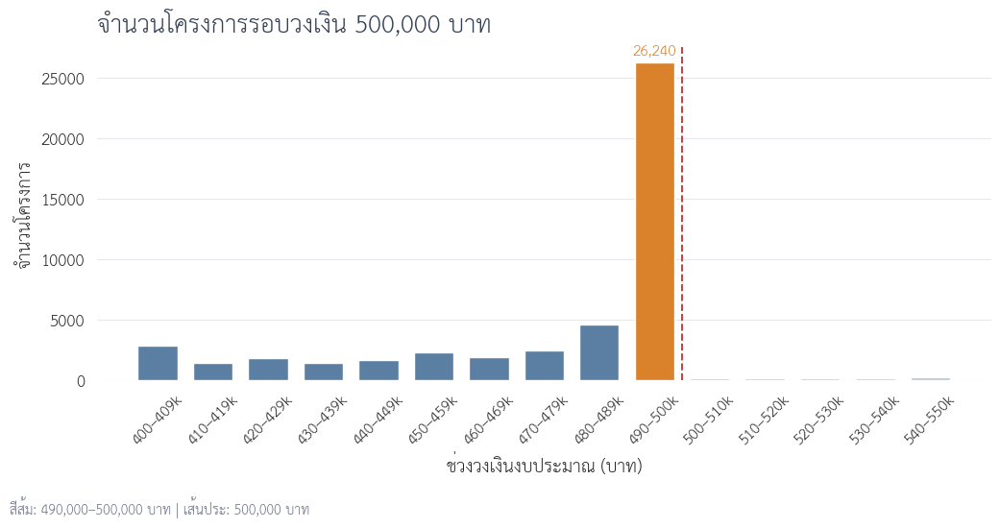
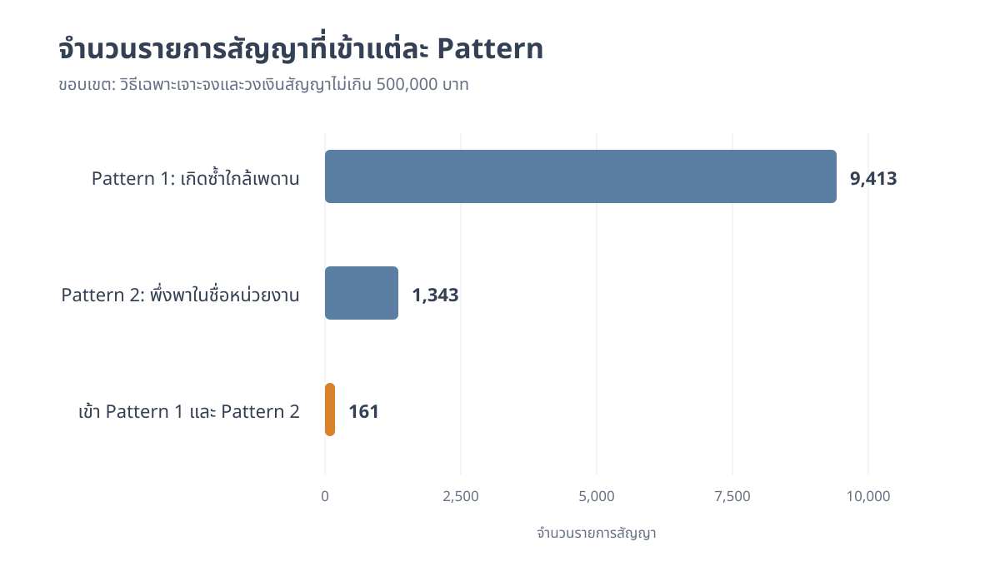

# จากเพดานวงเงินสู่การจัดลำดับตรวจสอบโครงการจ้างก่อสร้าง

> DADS5001 Data Tools and Programming — Mini Project  
> ข้อมูล e-GP ปีงบประมาณ 2569 สะสมถึงวันที่ 30 กรกฎาคม 2569 ไม่ใช่ข้อมูลเต็มปี

## คำถามของโครงการ

โครงการนี้ไม่ได้เริ่มจากการกำหนดว่าโครงการใด “ผิดปกติ” แต่เริ่มจากการสำรวจข้อมูลเพื่อหาว่าควรถามอะไรต่อ

เมื่อพบว่าโครงการจ้างก่อสร้างจำนวนมากอยู่ใกล้เพดานวงเงินของวิธีเฉพาะเจาะจง คำถามหลักจึงเป็น:

> **ภายใต้รายการสัญญาจ้างก่อสร้างที่ใช้วิธีเฉพาะเจาะจงและมีวงเงินไม่เกิน 500,000 บาท มีคู่ชื่อหน่วยงาน–ผู้รับจ้างที่ทำสัญญาใกล้เพดานซ้ำหรือไม่ และรายการเหล่านั้นซ้อนทับกับการพึ่งพาผู้รับจ้างสูงในระดับชื่อหน่วยงานเพียงใด?**

การวิเคราะห์แบ่งเป็นสามช่วง:

1. เตรียมข้อมูลและกำหนดหน่วยวิเคราะห์
2. สำรวจวงเงิน วิธีจัดซื้อ และบริบททางกฎหมาย
3. ตรวจรูปแบบระดับรายการสัญญาและซ้อนทับเงื่อนไขเพื่อจัดลำดับการเปิดเอกสาร

ผลลัพธ์เป็นรายการสำหรับตรวจสอบต่อ ไม่ใช่คะแนนทุจริตหรือหลักฐานว่ามีการกระทำผิด

## 1. เตรียมข้อมูลก่อนตั้งคำถามเชิง Pattern

ข้อมูลต้นทางประกอบด้วย CSV 8 ไฟล์ รวม 3,964,924 รายการ ขั้นแรกจึงนับรายการตามประเภทโครงการ ก่อนเลือกเฉพาะรายการประเภท `จ้างก่อสร้าง`

<p align="center"></p>
<p align="center"><em>รูปที่ 1 จำนวนรายการจัดซื้อจัดจ้างตามประเภทโครงการ</em></p>

พบรายการจ้างก่อสร้าง 180,079 รายการ หรือ 4.54% ของข้อมูลทั้งหมด แต่หนึ่งรายการไม่จำเป็นต้องเท่ากับหนึ่งโครงการ เพราะโครงการเดียวอาจมีหลายสัญญาหรือหลายผู้รับจ้าง

การเตรียมข้อมูลจึงประกอบด้วย:

- เลือกเฉพาะรายการประเภทจ้างก่อสร้าง
- ตัดแถวผู้ร่วมกิจการค้าที่มีรหัสผู้รับจ้างขึ้นต้นด้วย `D` จำนวน 363 แถว
- ตรวจแถวซ้ำด้วย `รหัสโครงการ + เลขที่สัญญา + เลขประจำตัวนิติบุคคล`
- เก็บข้อมูลระดับรายการสำหรับตรวจสัญญา
- สร้างข้อมูลหนึ่งแถวต่อโครงการสำหรับ EDA

หลังเตรียมข้อมูล เหลือรายการจ้างก่อสร้าง 179,716 แถว และโครงการก่อสร้างไม่ซ้ำ 178,978 โครงการ

## 2. โครงการก่อสร้างส่วนใหญ่อยู่ช่วงใด

วงเงินงบประมาณของโครงการก่อสร้างมีค่ามัธยฐาน 395,000 บาท แต่ค่าเฉลี่ยอยู่ที่ประมาณ 2.66 ล้านบาท แสดงว่ามีโครงการมูลค่าสูงจำนวนน้อยดึงค่าเฉลี่ยขึ้น

เพื่อไม่ให้ค่าเฉลี่ยเพียงค่าเดียวบดบังโครงสร้างของข้อมูล จึงแบ่งโครงการออกเป็นช่วงวงเงินและเปรียบเทียบทั้งสัดส่วนจำนวนโครงการกับสัดส่วนวงเงินรวม

<p align="center"></p>
<p align="center"><em>รูปที่ 2 จำนวนโครงการและวงเงินรวมตามช่วงงบประมาณ</em></p>

โครงการวงเงินไม่เกิน 500,000 บาทมี 136,623 โครงการ คิดเป็น 76.34% ของจำนวนโครงการ แต่คิดเป็นเพียง 8.23% ของวงเงินรวม ในทางกลับกัน โครงการมากกว่า 10 ล้านบาทมีเพียง 4.08% แต่ครองวงเงินรวม 67.31%

ข้อมูลจึงมีสองเรื่องที่ต่างกัน: โครงการขนาดเล็กครองจำนวน ขณะที่โครงการขนาดใหญ่ครองมูลค่า การศึกษานี้สนใจรูปแบบที่เกิดซ้ำ จึงเจาะต่อในกลุ่มโครงการขนาดเล็ก

## 3. เมื่อขยายดูบริเวณ 500,000 บาท

การแบ่งช่วงวงเงินให้ละเอียดขึ้นระหว่าง 400,000–550,000 บาท ทำให้เห็นความต่างระหว่างช่วงก่อนและหลัง 500,000 บาท

<p align="center"></p>
<p align="center"><em>รูปที่ 3 จำนวนโครงการตามช่วงวงเงินรอบ 500,000 บาท</em></p>

ช่วง 490,000–500,000 บาทมี 26,240 โครงการ ขณะที่ช่วงถัดจาก 500,000 บาทมีจำนวนลดลงมาก และวงเงิน 500,000 บาทเป็นค่าที่พบมากที่สุด ตามด้วย 499,000 และ 498,000 บาท

ข้อสังเกตนี้ยังไม่เพียงพอที่จะเรียกว่า anomaly เพราะต้องดูก่อนว่าการกระจุกสัมพันธ์กับวิธีจัดซื้อใด

## 4. การกระจุกสัมพันธ์กับวิธีจัดซื้อใด

เมื่อนำโครงการช่วง 490,000–500,000 บาทมาแยกตามวิธีจัดซื้อ พบว่าวิธีเฉพาะเจาะจงเป็นวิธีหลักอย่างชัดเจน

<p align="center"></p>
<p align="center"><em>รูปที่ 4 วิธีจัดซื้อของโครงการช่วง 490,000–500,000 บาท</em></p>

จาก 26,240 โครงการในช่วงนี้ มี 26,154 โครงการ หรือ 99.67% ใช้วิธีเฉพาะเจาะจง ส่วน e-bidding มี 81 โครงการ และวิธีคัดเลือกมี 5 โครงการ

เมื่อพบความสัมพันธ์จากข้อมูลแล้วจึงนำข้อกำหนดทางกฎหมายมาอธิบาย พระราชบัญญัติการจัดซื้อจัดจ้างและการบริหารพัสดุภาครัฐ พ.ศ. 2560 มาตรา 55 กำหนดวิธีจัดซื้อจัดจ้างหลัก และมาตรา 56 วรรคหนึ่ง (2)(ข) รองรับการใช้วิธีเฉพาะเจาะจงในกรณีวงเงินไม่เกินวงเงินตามกฎกระทรวง ซึ่งกำหนดไว้ไม่เกิน 500,000 บาท

ดังนั้น การมีโครงการจำนวนมากอยู่ใต้ 500,000 บาทเป็นรูปแบบเชิงโครงสร้างที่กฎหมายอธิบายได้ การอยู่ใกล้เพดานเพียงอย่างเดียวจึงไม่ใช่เหตุผลเพียงพอสำหรับจัดลำดับตรวจสอบ

## 5. กำหนดกลุ่มศึกษาภายใต้บริบทเดียวกัน

Notebook 04 เปลี่ยนหน่วยวิเคราะห์จากระดับโครงการเป็นระดับรายการสัญญา โดยหนึ่งรายการกำหนดด้วย `รหัสโครงการ + เลขประจำตัวนิติบุคคล 13 หลัก + เลขที่สัญญา`

กลุ่มศึกษากำหนดเป็น:

- ประเภทโครงการ: จ้างก่อสร้าง
- วิธีจัดซื้อจัดจ้าง: เฉพาะเจาะจง
- วงเงินงบประมาณในสัญญา: ไม่เกิน 500,000 บาท

จากรายการสัญญาก่อสร้าง 179,716 รายการ เหลือกลุ่มศึกษา 136,122 รายการ หรือ 75.74%

ชื่อหน่วยงานใช้ค่าจากข้อมูลสัญญาโดยตรง ไม่ mapping กับ master หน่วยงานย่อย และไม่ใช้ชื่อหน่วยงานย่อยเป็น grain ในการตั้ง criteria

## 6. นิยาม Pattern สำหรับจัดลำดับตรวจสอบ

### Pattern 1 — รายการสัญญาใกล้เพดานที่เกิดซ้ำ

เริ่มจากรายการสัญญาวงเงิน 490,000–500,000 บาท และสรุป 3 มุม:

1. ชื่อหน่วยงาน
2. ผู้รับจ้าง
3. ชื่อหน่วยงาน + ผู้รับจ้าง

แต่ละตารางเปรียบเทียบจำนวนและมูลค่าของรายการใกล้เพดานกับรายการทั้งหมดภายใน grain เดียวกัน

`flag_pattern_1` เป็น `True` เมื่อคู่ `ชื่อหน่วยงาน + ผู้รับจ้าง` เดียวกันมีรายการสัญญาใกล้เพดานอย่างน้อย 3 รายการ เกณฑ์ 3 รายการเป็น analytical screening threshold ไม่ใช่ข้อกำหนดทางกฎหมาย

### Pattern 2 — การพึ่งพาผู้รับจ้างในชื่อหน่วยงาน

ตรวจคู่ `ชื่อหน่วยงาน + ผู้รับจ้าง` โดยผู้รับจ้างต้องผ่านครบทุกเงื่อนไข:

- ได้รับอย่างน้อย 10 รายการสัญญา
- ครองจำนวนรายการอย่างน้อย 80% ภายในชื่อหน่วยงาน
- ครองมูลค่าอย่างน้อย 80% ภายในชื่อหน่วยงาน

`flag_pattern_2` เป็น `True` สำหรับรายการสัญญาของคู่หน่วยงาน–ผู้รับจ้างที่ผ่านเกณฑ์ข้างต้น เลข 10 และ 80% เป็นเกณฑ์คัดกรองเชิงวิเคราะห์ ไม่ใช่ข้อสรุปว่ามีการพึ่งพาที่ไม่เหมาะสมหรือมีการทุจริต

### มุมมองประกอบ — จังหวัด + ผู้รับจ้าง

ตารางระดับจังหวัดเปรียบเทียบผู้รับจ้างหนึ่งรายกับผู้รับจ้างทั้งหมดภายในจังหวัดเดียวกัน และเรียงตามสัดส่วนจำนวนรายการจากมากไปน้อย

ผลระดับจังหวัดใช้เป็นข้อมูลประกอบเท่านั้น ไม่กำหนด criteria และไม่เข้า `priority_review` ดังนั้น `flag_province_criteria` เป็น `False` ทุกแถว

## 7. คำตอบของโครงการ

<p align="center"></p>
<p align="center"><em>รูปที่ 5 จำนวนรายการสัญญาที่เข้าแต่ละ Pattern</em></p>

| ผลลัพธ์ | จำนวน |
|---|---:|
| รายการสัญญาใกล้เพดานทั้งหมด | 20,200 รายการ |
| คู่หน่วยงาน–ผู้รับจ้างที่มีรายการใกล้เพดานอย่างน้อย 3 รายการ | 1,580 คู่ |
| `flag_pattern_1 = True` | 9,413 รายการ |
| `flag_pattern_2 = True` | 1,343 รายการ |
| `priority_review = True` | 161 รายการ |

รายการตรวจสอบลำดับแรกกำหนดเป็น:

```text
priority_review = flag_pattern_1 AND flag_pattern_2
```

จึงเหลือ 161 รายการที่พบพร้อมกันว่าอยู่ในคู่หน่วยงาน–ผู้รับจ้างซึ่งมีสัญญาใกล้เพดานเกิดซ้ำ และหน่วยงานนั้นพึ่งพาผู้รับจ้างรายดังกล่าวตามเกณฑ์ที่กำหนด

Pattern 1 เพียงลำพังยังครอบคลุม 9,413 รายการ หรือ 46.60% ของรายการใกล้เพดานทั้งหมด จึงควรตีความเป็น exposure indicator ที่ใช้ร่วมกับ Pattern 2 ไม่ควรใช้กล่าวหาหรือสรุปความผิดจาก Pattern 1 เพียงเงื่อนไขเดียว

## 8. จากรายการคัดกรองสู่การตรวจเอกสาร

161 รายการไม่ใช่ 161 รายการทุจริต แต่เป็นขอบเขตที่แคบลงสำหรับเริ่มตรวจเอกสาร โดยควรตรวจเป็นกลุ่มตามคู่หน่วยงาน–ผู้รับจ้าง

เอกสารที่ควรตรวจประกอบด้วย:

1. แผนจัดซื้อจัดจ้างและแหล่งงบประมาณ
2. TOR/BOQ สถานที่ และความต่อเนื่องของงาน
3. เอกสารอนุมัติและประวัติการแก้ไขโครงการหรือสัญญา
4. รายชื่อผู้เสนอราคาและราคาที่เสนอทั้งหมด
5. วิธีสืบราคาและเงื่อนไขการเชิญผู้ประกอบการ
6. เหตุผลของการเลือกผู้รับจ้างและการจัดทำหลายสัญญา

## 9. ข้อจำกัดในการตีความ

ข้อมูลชุดนี้ไม่สามารถใช้ยืนยัน:

- เจตนาหลีกเลี่ยงวิธีแข่งขันหรือแบ่งซื้อแบ่งจ้าง
- การฮั้วหรือการจำกัดการแข่งขัน
- ความสัมพันธ์ส่วนบุคคลหรืออิทธิพลของผู้รับจ้าง
- ความผิดทางกฎหมายหรือการทุจริต

ข้อมูลมีเฉพาะผู้ชนะ ไม่มีรายชื่อผู้เสนอราคาและราคาที่เสนอทั้งหมด อีกทั้ง threshold ของ Pattern เป็นเกณฑ์สำหรับจัดลำดับการตรวจ ไม่ใช่ข้อกำหนดทางกฎหมาย

Pattern 1 ยังมีจำนวนรายการค่อนข้างมาก การวิเคราะห์ระยะถัดไปอาจเพิ่มมิติเวลา ลักษณะงาน หรือพื้นที่ เพื่อแยกกลุ่มสัญญาที่มีโอกาสเกี่ยวข้องกันออกจากการซื้อซ้ำตามปกติ

## Notebook และการทำซ้ำ

| Notebook | หน้าที่ |
|---|---|
| [02_construction_data_preparation_2569.ipynb](02_construction_data_preparation_2569.ipynb) | รวมไฟล์ สกัดงานจ้างก่อสร้าง ลบแถวที่ไม่อยู่ใน grain และสร้างข้อมูลระดับรายการสัญญา |
| [03_construction_eda_2569.ipynb](03_construction_eda_2569.ipynb) | สำรวจวงเงิน เจาะบริเวณ 500,000 บาท เปรียบเทียบวิธีจัดซื้อ และกำหนดขอบเขตศึกษา |
| [04_construction_review_indicators_2569.ipynb](04_construction_review_indicators_2569.ipynb) | วิเคราะห์รายการใกล้เพดาน การพึ่งพาผู้รับจ้าง และจัดลำดับรายการสัญญาสำหรับเปิดเอกสาร |

รันตามลำดับ `02 → 03 → 04` บน Google Colab ไฟล์ข้อมูลขนาดใหญ่และ CSV ผลลัพธ์ไม่ได้จัดเก็บใน GitHub ส่วนรูปใน [figure/](figure/) สร้างจาก output ล่าสุดของ notebook ทั้งสามไฟล์
