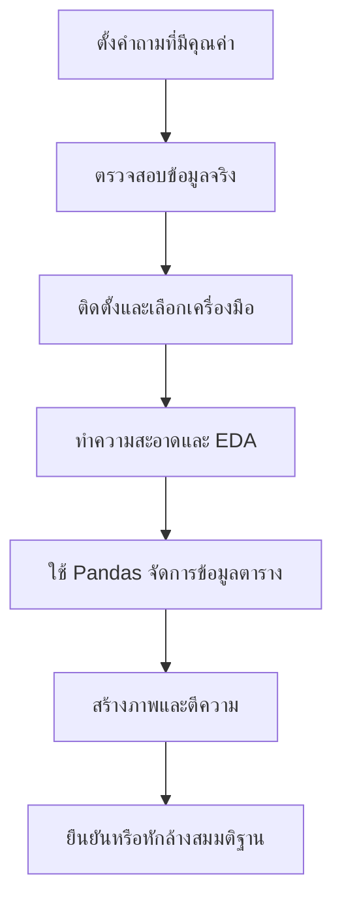

# DADS5001 Week 01: Introduction, EDA และ Pandas 1

> **รายวิชา:** DADS5001 Data Analytics and Data Science Tools and Programming  
> **ผู้สอน:** Assoc. Prof. Thitirat Siriborvornratanakul, Ph.D.  
> **เอกสารต้นทาง:** `dads5001_week1_intro_pandas1.pdf` จำนวน 24 หน้า (47 สไลด์) และ `pandas1.ipynb` จำนวน 118 cells  
> **ขอบเขต:** Course introduction, mini-project, package installation, Exploratory Data Analysis, data preprocessing, Python List vs. NumPy vs. Pandas, Pandas 2.0, Series, DataFrame และ axis  
> **รูปแบบบันทึก:** Deep Learning & Exam-Ready Master Notes

## 1. ภาพรวมของบทเรียน

Week 1 วางรากฐานให้เห็นเส้นทางจาก “คำถาม” ไปสู่ “ข้อค้นพบที่มีหลักฐานรองรับ” ก่อนเริ่มเรียนคำสั่ง Pandas โดยละเอียด แนวคิดหลักเชื่อมกันดังนี้



หัวใจของบทนี้จึงไม่ใช่การจำ syntax เพียงอย่างเดียว แต่คือการเข้าใจว่าเครื่องมือแต่ละตัวอยู่ตรงไหนในกระบวนการวิเคราะห์ และผลลัพธ์ที่ดีต้องเริ่มจากคำถามที่ดี ข้อมูลที่เหมาะสม และการสำรวจข้อมูลอย่างมีวินัย

## 2. Learning Objectives

เมื่อจบบทนี้ควรสามารถ:

1. อธิบายภาพรวมรายวิชาและความคาดหวังของ mini-project ได้
2. แยกบทบาทของ Python List, NumPy array, Pandas Series/DataFrame และ Excel ได้
3. อธิบายว่า EDA คืออะไร ทำไปทำไม และวนซ้ำอย่างไร
4. ระบุปัญหาคุณภาพข้อมูลพื้นฐานและเลือกวิธี preprocessing ที่เหมาะสมได้
5. อธิบายโครงสร้าง `Series`, `DataFrame`, `index`, `columns` และ `axis` ได้
6. เลือกใช้ `.loc`, `.iloc`, `.at` และ `.iat` ตามชนิดการอ้างอิงข้อมูลได้
7. อ่านและบันทึกข้อมูลด้วย Pandas ในรูปแบบพื้นฐานได้
8. ระบุข้อจำกัดของ Pandas และความหมายของ PyArrow backend ได้อย่างถูกต้อง

## 3. ความรู้พื้นฐานที่ควรมีก่อน

- Python syntax: ตัวแปร, list, dictionary, function และการ import package
- แนวคิด row, column, table และ data type
- สถิติเบื้องต้น: mean, median, standard deviation, distribution และ outlier
- ความแตกต่างระหว่าง observation, variable และ dataset
- การใช้ Jupyter Notebook หรือ Google Colab เบื้องต้น

## 4. โครงสร้างรายวิชาและตำแหน่งของ Pandas

### 4.1 ลำดับการเรียน

จากเอกสาร รายวิชาช่วงสัปดาห์ 1-8 ครอบคลุม Pandas, Matplotlib, Seaborn และ NumPy ก่อนนำเสนอ mini-project และสอบกลางภาค ส่วนครึ่งหลังเชื่อมไปยัง Streamlit, SQL, NoSQL และ Databricks (สไลด์ 5-7)

ลำดับนี้สะท้อน workflow จริง:

1. **Pandas** ใช้โหลด ตรวจ ทำความสะอาด แปลง และสรุปข้อมูลตาราง
2. **Matplotlib/Seaborn** ใช้สร้างภาพเพื่อสำรวจและสื่อสารผล
3. **NumPy** รองรับการคำนวณเชิงตัวเลขและเป็นฐานให้หลายไลบรารี
4. **Streamlit** เปลี่ยนงานวิเคราะห์เป็น interactive data application
5. **SQL/NoSQL** ใช้เข้าถึงและจัดการข้อมูลในระบบฐานข้อมูล
6. **Databricks** รองรับ data engineering และ analytics ในสภาพแวดล้อมแบบกระจาย/คลาวด์

### 4.2 Programming sequence ใน DADS

เอกสารแสดง Python และ SQL เป็นรากฐาน จากนั้นจึงไปสู่ tools, machine learning, deep learning และข้อมูลชนิดเฉพาะ เช่น text, image และ real-time data (สไลด์ 7)

**คำอธิบายเพิ่มเติม:** การเรียน Pandas จึงไม่ใช่ปลายทาง แต่เป็น “ภาษากลางของงานข้อมูลแบบตาราง” ก่อนต่อยอดไปสถิติ, machine learning, dashboard หรือ data engineering

## 5. Mini-project: จากคำถามไปสู่หลักฐาน

### 5.1 หลักการของงาน

จากเอกสาร แนวทาง mini-project มี 4 ขั้นหลัก (สไลด์ 11-13):

1. เริ่มจากคำถามหรือข้อสันนิษฐานที่ดี
2. ตรวจสอบว่ามีข้อมูลที่เข้าถึงได้จริง โดยควรเป็นข้อมูลจริงที่ยังต้องเตรียม ไม่ใช่ neat dataset ที่มี tutorial สำเร็จรูปจำนวนมาก
3. ใช้ data analytics/data science เพื่อพิสูจน์หรือหักล้างข้อสันนิษฐาน โดยต้องใช้ programming และ static visualization อย่างมีนัยสำคัญ
4. ส่ง public GitHub link ระดับกลุ่ม พร้อม code และ development journey

### 5.2 หลักคิดที่สำคัญ

> “คำถามมาก่อนเครื่องมือ” แต่คำถามต้องปรับตามสิ่งที่ข้อมูลรองรับจริง

การเริ่มจากหัวข้อกว้าง เช่น “EV batteries” ยังไม่ใช่คำถามวิเคราะห์ที่สมบูรณ์ ต้องแปลงเป็นคำถามที่มีหน่วยวิเคราะห์ ตัวแปร ช่วงเวลา และผลลัพธ์ที่ตรวจสอบได้ เช่น “อุณหภูมิและจำนวนรอบชาร์จสัมพันธ์กับการสูญเสียความจุของเซลล์แบตเตอรี่อย่างไร”

### 5.3 Dataset-first หรือ question-first?

แนวทางที่สมดุลคือ **question-guided, data-validated**:

- มีประเด็นหรือสมมติฐานตั้งต้นเพื่อกำหนดทิศทาง
- ตรวจ feasibility ของข้อมูลทันที
- ปรับคำถามเมื่อพบว่า grain, coverage หรือ definition ไม่รองรับ
- ห้ามสรุปเกินขอบเขตของข้อมูล

### 5.4 คุณภาพงานในยุค Agentic AI

เอกสารเตือนร่องรอยการใช้ AI ที่ลดคุณภาพงาน (สไลด์ 16-18):

- ภาษาดู polished แต่เนื้อหาไม่มีหลักฐาน
- ข้อความยืดเยื้อเกินจำเป็น
- conclusion ไม่รองรับด้วยข้อมูลต้นทางหรือการวิเคราะห์
- มีร่องรอยภาษาสนทนาของ AI ในรายงาน

สิ่งที่ควรทำคือรักษา traceability: ทุก insight ต้องย้อนกลับไปยัง dataset, transformation, calculation หรือ visualization ที่ตรวจสอบได้

## 6. Package และ Environment

### 6.1 Package คืออะไร

Package คือชุด code ที่ผู้อื่นพัฒนาไว้ให้เรียกใช้ซ้ำ เช่น `pandas`, `numpy`, `matplotlib` และ `seaborn` การติดตั้ง package คือการนำ package และ dependency เข้าสู่ Python environment ส่วน `import` คือการโหลด package ที่ติดตั้งแล้วมาใช้ใน session

```python
import pandas as pd
import numpy as np
```

### 6.2 `pip install` กับ `conda install`

| ประเด็น | `pip` | `conda` |
|---|---|---|
| แหล่ง package หลัก | Python Package Index (PyPI) | Conda channels เช่น defaults/conda-forge |
| ขอบเขต | เน้น Python packages | จัดการได้ทั้ง Python และ non-Python dependencies |
| Environment | ใช้ร่วมกับ `venv` หรือ environment อื่น | มี environment manager ในตัว |
| เหมาะเมื่อ | ใช้ Python ecosystem ทั่วไป | งาน data science ที่มี binary/native dependencies |

จากเอกสารใช้คำสั่งตัวอย่าง (สไลด์ 20-21):

```bash
conda install jupyter
conda install pandas numpy matplotlib seaborn
```

**คำอธิบายเพิ่มเติม:** ไม่ควรติดตั้ง package ทุกอย่างลง base environment โดยไม่จำเป็น ควรแยก environment ต่อโครงการเพื่อลด version conflict

```bash
conda create -n dads5001 python=3.12 pandas numpy matplotlib seaborn jupyter
conda activate dads5001
```

หากใช้ `pip`:

```bash
python -m venv .venv
# activate environment แล้วจึงติดตั้ง
python -m pip install pandas numpy matplotlib seaborn jupyter
```

การใช้ `python -m pip` ช่วยให้เห็นชัดว่า pip ผูกกับ Python interpreter ตัวใด

## 7. Exploratory Data Analysis (EDA)

### 7.1 EDA คืออะไร

EDA คือกระบวนการสำรวจ ตรวจสอบ และสรุปลักษณะสำคัญของ dataset โดยมักใช้ทั้ง descriptive statistics และ visualization แนวคิดนี้ได้รับการผลักดันโดย John Tukey ตั้งแต่ทศวรรษ 1970 (สไลด์ 23-25)

EDA ไม่ใช่การสร้างกราฟแบบสุ่มจำนวนมาก แต่เป็นการสนทนากับข้อมูล:

1. ตั้งคำถาม
2. ตรวจโครงสร้างและคุณภาพข้อมูล
3. สรุปหรือสร้างภาพ
4. พบ pattern/error/anomaly
5. ตั้งคำถามใหม่หรือย้อนกลับไปแก้ข้อมูล
6. ทำซ้ำจนเข้าใจข้อมูลเพียงพอ

### 7.2 ทำไมต้องทำ EDA ก่อนตั้งสมมติฐานแข็งตัว

จุดประสงค์หลักจากเอกสารคือ “ดูข้อมูลก่อนสร้าง assumption” (สไลด์ 24) เพราะ:

- ชื่อคอลัมน์อาจไม่ตรงกับความหมายจริง
- grain อาจละเอียดหรือหยาบกว่าที่คิด
- missing values อาจกระจุกตัวในบางกลุ่ม
- outlier อาจเป็นทั้ง error และเหตุการณ์สำคัญ
- distribution อาจไม่สอดคล้องกับสมมติฐานของวิธีสถิติ
- ความสัมพันธ์รวมอาจกลับทิศเมื่อแยกตามกลุ่ม

### 7.3 คำถาม EDA ขั้นพื้นฐาน

| มิติ | คำถาม |
|---|---|
| Structure | มีกี่แถว กี่คอลัมน์ grain คืออะไร key คืออะไร |
| Type | ชนิดข้อมูลถูกต้องหรือไม่ วันที่ถูกอ่านเป็นข้อความหรือไม่ |
| Completeness | ค่าว่างอยู่ตรงไหน มากเพียงใด และมี pattern หรือไม่ |
| Uniqueness | มี duplicate จริงหรือเป็นรายการซ้ำที่ถูกต้องตาม grain |
| Distribution | ค่ากลาง การกระจาย skewness และช่วงค่ามีลักษณะอย่างไร |
| Validity | ค่าอยู่นอก domain หรือ business rule หรือไม่ |
| Relationship | ตัวแปรสัมพันธ์กันอย่างไร และสัมพันธ์อาจเกิดจาก confounder หรือไม่ |
| Time | มี trend, seasonality, break หรือช่วงข้อมูลขาดหายหรือไม่ |

### 7.4 EDA กับ Confirmatory Analysis

| EDA | Confirmatory Analysis |
|---|---|
| ใช้ค้นหา pattern และตั้งคำถาม | ใช้ทดสอบสมมติฐานที่ระบุไว้ชัดเจน |
| ยืดหยุ่นและวนซ้ำ | มี procedure และ decision rule ล่วงหน้า |
| สร้าง hypothesis | ประเมินหลักฐานต่อ hypothesis |
| เสี่ยง data dredging หากตีความเป็นข้อยืนยัน | ลดความยืดหยุ่นเพื่อควบคุม false positive |

ผลจาก EDA ควรเรียกว่า “ข้อค้นพบเชิงสำรวจ” จนกว่าจะมีการตรวจสอบยืนยันกับข้อมูลใหม่หรือวิธีที่เหมาะสม

## 8. Data Preprocessing

เอกสารเตือนว่าการข้าม data wrangling แล้วเข้าสู่ model ทันทีมักทำให้โมเดลมีคุณภาพต่ำ (สไลด์ 27-28) ขั้นตอนหลักมีดังนี้

### 8.1 Remove duplicates

Duplicate คือแถวที่ซ้ำตามนิยามของ observation ไม่ใช่เพียงแถวที่หน้าตาเหมือนกัน ต้องระบุ subset ของคอลัมน์ที่ควรเป็น key

```python
df.duplicated(subset=["order_id", "line_no"]).sum()
df = df.drop_duplicates(subset=["order_id", "line_no"], keep="last")
```

**ข้อควรระวัง:** ธุรกรรมสองรายการที่มีวัน สินค้า และยอดเท่ากันอาจเป็นคนละ transaction การลบทันทีโดยไม่เข้าใจ grain ทำให้ข้อมูลสูญหาย

### 8.2 Fix structural errors

Structural errors ได้แก่ spelling, whitespace, case หรือ code ที่แทนความหมายเดียวกันหลายแบบ

```python
df["province"] = (
    df["province"]
      .str.strip()
      .str.replace("กทม.", "กรุงเทพมหานคร")
)

df["province"].value_counts(dropna=False)
```

การตรวจ `unique()` หรือ `value_counts()` ช่วยเห็น category ที่ไม่สม่ำเสมอ

### 8.3 Detect and handle outliers

Outlier คือค่าที่แตกต่างจากข้อมูลส่วนใหญ่อย่างมาก แต่ไม่เท่ากับ error เสมอไป

- **Error:** อายุ = 999 เพราะกรอกผิด ควรแก้หรือกำหนด missing
- **Valid extreme:** ยอดขายช่วงแคมเปญสูงผิดปกติ เป็นเหตุการณ์จริงที่ควรศึกษา
- **Influential observation:** จุดที่ส่งผลต่อค่าเฉลี่ยหรือโมเดลมาก แม้ไม่ผิด

เครื่องมือตรวจ:

```python
df["amount"].describe()
df["amount"].plot.box()

q1 = df["amount"].quantile(0.25)
q3 = df["amount"].quantile(0.75)
iqr = q3 - q1
outlier_mask = (df["amount"] < q1 - 1.5 * iqr) | (df["amount"] > q3 + 1.5 * iqr)
```

เอกสารยก z-score และหลักประมาณ 99.7% ภายใน ±3 standard deviations แต่กฎนี้อิง distribution ที่ใกล้ normal จึงไม่ควรใช้กับข้อมูล skewed โดยอัตโนมัติ

### 8.4 Type conversion

Data type ที่ผิดทำให้คำนวณ เปรียบเทียบ หรือ sort ผิด เช่นวันที่เป็น string และตัวเลขที่มี comma เป็นข้อความ

```python
df["date"] = pd.to_datetime(df["date"], errors="coerce")
df["amount"] = pd.to_numeric(df["amount"].str.replace(",", ""), errors="coerce")
df["category"] = df["category"].astype("category")
```

`errors="coerce"` เปลี่ยนค่าที่แปลงไม่ได้เป็น missing value จึงต้องตรวจจำนวนที่ถูก coerce เสมอ

### 8.5 Missing values

ทางเลือกหลัก:

- drop row/column เมื่อการหายมีน้อยและไม่ทำให้ sample bias
- impute ด้วย mean/median/mode เมื่อสมเหตุสมผล
- forward/backward fill สำหรับข้อมูลตามลำดับเวลาเมื่อความหมายรองรับ
- สร้าง missing indicator หาก “การหาย” มีสารสนเทศ
- เก็บเป็น missing และใช้วิธีวิเคราะห์ที่รองรับ

```python
df.isna().sum()
df["income_missing"] = df["income"].isna()
df["income"] = df["income"].fillna(df["income"].median())
```

ไม่ควรเติม mean ทุกคอลัมน์โดยอัตโนมัติ เพราะทำให้ variance ลดและอาจบิดเบือนความสัมพันธ์

### 8.6 Feature scaling

ทำให้ตัวแปรตัวเลขอยู่ในสเกลที่เทียบเคียงกัน เช่น standardization หรือ min-max scaling มีความสำคัญกับ distance-based algorithms และโมเดลที่มี regularization แต่ tree-based models มักไม่จำเป็นต้อง scale

### 8.7 Data encoding

เปลี่ยน categorical variables เป็นรูปแบบตัวเลข เช่น one-hot encoding ต้องระวังไม่ใส่ ordinal meaning ให้ nominal category โดยไม่ตั้งใจ

## 9. Python List, NumPy, Pandas และ Excel

### 9.1 Python List

Python List เก็บ reference ไปยัง object จึงรองรับค่าหลายชนิดใน list เดียวได้ มีความยืดหยุ่นสูง แต่ไม่เหมาะกับงานคำนวณข้อมูลหลายมิติขนาดใหญ่ (สไลด์ 31-34)

```python
mixed = [1, "January", 1564.0, True]
```

Nested list ใช้แทนตารางได้ แต่ไม่มีชื่อคอลัมน์, index alignment, missing-data semantics หรือ vectorized table operations ที่สะดวก

### 9.2 NumPy array

NumPy `ndarray` เหมาะกับข้อมูล homogeneous และการคำนวณเชิงตัวเลขแบบ vectorized เช่น signal, image, matrix และ numerical computing

```python
import numpy as np

x = np.array([1, 2, 3, 4])
x * 10
```

การคูณ list ด้วย 10 หมายถึงทำซ้ำ list แต่การคูณ NumPy array ด้วย 10 คือ element-wise multiplication นี่คือความต่างด้าน semantics ที่มักออกสอบ

### 9.3 Pandas

Pandas เพิ่ม labels, heterogeneous columns, missing-data handling, database-like operations และ time-series tools บนโครงสร้างที่เชื่อมกับ NumPy/extension arrays จึงเหมาะกับ CSV, Excel, SQL และข้อมูลตาราง (สไลด์ 35-36)

### 9.4 Excel

Excel เหมาะกับการตรวจข้อมูลด้วยตา การคำนวณขนาดเล็ก และงานที่ผู้ใช้ธุรกิจต้องโต้ตอบ แต่มีข้อจำกัดต่อ worksheet 1,048,576 แถว × 16,384 คอลัมน์ และขั้นตอน manual อาจทำซ้ำ/ตรวจสอบย้อนหลังได้ยาก (สไลด์ 35)

### 9.5 ตารางเลือกเครื่องมือ

| เครื่องมือ | จุดแข็ง | จุดจำกัด | ใช้เมื่อ |
|---|---|---|---|
| Python List | ยืดหยุ่น ใช้ง่าย | ช้า/ไม่สะดวกสำหรับตารางใหญ่ | เก็บข้อมูลทั่วไปขนาดเล็ก |
| NumPy | numerical vectorization เร็ว | labels และ mixed-type tables ไม่เด่น | matrix, signal, image, numerical algorithms |
| Pandas | labeled tabular data, cleaning, join, group, time series | in-memory และมี overhead | EDA และ data wrangling |
| Excel | visual/manual interaction ดี | row limit, reproducibility และ scale | ตรวจ/สื่อสารข้อมูลขนาดเล็ก |

**แก้ความเข้าใจจากสไลด์:** คำว่า Pandas “no limits to the size of data” ไม่ได้หมายถึงไม่จำกัดจริง Pandas ทำงานแบบ in-memory; dataset ที่ใหญ่กว่าหรือเข้าใกล้ RAM อาจทำงานยากเพราะบาง operation สร้าง intermediate copies ควรโหลดเฉพาะคอลัมน์ ใช้ dtype ที่เหมาะสม อ่านแบบ chunks หรือเปลี่ยนไปใช้เครื่องมือ distributed/out-of-core เมื่อจำเป็น

## 10. Pandas, PyArrow และความเปลี่ยนแปลงหลัง Pandas 2.0

### 10.1 สิ่งที่ Pandas 2.0 นำเสนอ

จากเอกสาร Pandas 2.0 เพิ่มการรองรับ PyArrow backend เพื่อประสิทธิภาพ หน่วยความจำ และชนิดข้อมูลที่จัดการ missing values ได้ดีขึ้น พร้อม `dtype_backend="pyarrow"` ใน I/O บางชนิด (สไลด์ 37-40)

```python
df = pd.read_csv("sales.csv", dtype_backend="pyarrow")

s1 = pd.Series([1, 2, None], dtype="int64[pyarrow]")
s2 = pd.Series(["foo", "bar", None], dtype="string[pyarrow]")
```

### 10.2 PyArrow backend คืออะไร

Apache Arrow เป็นมาตรฐาน columnar memory format ที่ช่วยให้ระบบข้อมูลหลายภาษาแลกเปลี่ยนข้อมูลได้มีประสิทธิภาพ ใน Pandas คอลัมน์บางชนิดสามารถใช้ Arrow-backed arrays แทน NumPy-backed arrays ได้

ประโยชน์ที่เป็นไปได้:

- ชนิดข้อมูลกว้างขึ้น
- missing values ที่สม่ำเสมอกว่าในหลาย dtype
- I/O บางประเภทมีประสิทธิภาพขึ้น
- interoperability กับ ecosystem ที่ใช้ Arrow

แต่ไม่ใช่ว่าทุก operation จะเร็วขึ้นเสมอ ต้อง benchmark กับ workload จริง

### 10.3 `np.nan`, `None`, `pd.NaT` และ `pd.NA`

| ค่า | การใช้โดยทั่วไป |
|---|---|
| `np.nan` | missing ในข้อมูลตัวเลขแบบ floating-point และกรณีอื่นตาม dtype |
| `None` | Python object absence; มักพบใน object-like data |
| `pd.NaT` | missing สำหรับ datetime/timedelta |
| `pd.NA` | scalar missing แบบ nullable ของ Pandas extension dtypes |

ไม่ควรตรวจ missing ด้วย `== np.nan` เพราะ `NaN` ไม่เท่ากับตัวเอง ให้ใช้ `pd.isna()` หรือ `.isna()`

### 10.4 หมายเหตุเวอร์ชันปัจจุบัน

**คำอธิบายเพิ่มเติม (ตรวจเมื่อ 16 สิงหาคม 2026):** เอกสารทางการบนเว็บอยู่ที่ Pandas 3.0.x แล้ว จึงมี behavior บางอย่างเปลี่ยนจากสไลด์ Pandas 2.0 โดยเฉพาะ string dtype และ Copy-on-Write ในการทำแบบฝึกหัดต้องตรวจเวอร์ชันด้วย

```python
pd.__version__
```

## 11. Series และ DataFrame

### 11.1 Series

`Series` คือ one-dimensional labeled array ประกอบด้วยสองส่วนหลัก:

- **values:** ข้อมูล
- **index:** label ที่ระบุตำแหน่งเชิงความหมาย

```python
sales = pd.Series(
    [1564, 1275, 1800],
    index=["January", "February", "March"],
    name="revenue",
)
```

Series ไม่ใช่แค่ list เพราะ label ถูกใช้ในการเลือกข้อมูลและจัดแนวข้อมูล (alignment)

### 11.2 DataFrame

`DataFrame` คือ two-dimensional labeled data structure ที่มองได้ว่าเป็นชุดของ Series หลายคอลัมน์ซึ่งใช้ row index ร่วมกัน แต่ละคอลัมน์มี dtype ต่างกันได้

```python
df = pd.DataFrame({
    "units": [250, 200, 350],
    "revenue": [1564, 1275, 1800],
    "cost": [1020, 875, 1275],
}, index=["January", "February", "March"])
```

องค์ประกอบสำคัญ:

- `df.index` — labels ของแถว
- `df.columns` — labels ของคอลัมน์
- `df.dtypes` — dtype รายคอลัมน์
- `df.shape` — `(จำนวนแถว, จำนวนคอลัมน์)`
- `df.ndim` — จำนวนมิติ ซึ่งเป็น 2 สำหรับ DataFrame

### 11.3 Automatic alignment

Pandas จัดแนวข้อมูลตาม label ไม่ใช่ตำแหน่งเพียงอย่างเดียว

```python
a = pd.Series([10, 20], index=["A", "B"])
b = pd.Series([1, 2], index=["B", "A"])
a + b
```

ผลคือ `A = 12`, `B = 21` เพราะ Pandas จับคู่ label การไม่เข้าใจ alignment อาจทำให้เกิด missing values เมื่อ index ไม่ตรงกัน

## 12. Axis: จุดที่มักสับสน

Series มีหนึ่ง axis คือ index ส่วน DataFrame มีสอง axis (สไลด์ 44):

| Axis | ความหมายเชิงโครงสร้าง | operation เคลื่อนผ่านอะไร | ผลที่เหลือ |
|---|---|---|---|
| `axis=0` / `index` | แกนแถว | ลงตามแถวในแต่ละคอลัมน์ | ผลต่อคอลัมน์ |
| `axis=1` / `columns` | แกนคอลัมน์ | ข้ามคอลัมน์ในแต่ละแถว | ผลต่อแถว |

```python
df.sum(axis=0)  # รวมลงตามแถว ได้ผลรวมรายคอลัมน์
df.sum(axis=1)  # รวมข้ามคอลัมน์ ได้ผลรวมรายแถว
```

วิธีจำที่แม่นกว่า “0 คือแถว 1 คือคอลัมน์” คือถามว่า **เรากำลังยุบแกนใด** หาก `sum(axis=0)` แกนแถวถูกยุบ จึงเหลือผลตามคอลัมน์

## 13. Pandas 1: คำสั่งพื้นฐานที่ควรรู้

สไลด์ 45-46 ชี้ว่า code โดยละเอียดอยู่ใน `Pandas1.ipynb` เนื้อหาหลักประกอบด้วยการแสดงผล ชนิดข้อมูล I/O การตรวจ เลือก แก้ sort และบันทึกข้อมูล

### 13.1 สร้างและโหลดข้อมูล

```python
df_csv = pd.read_csv("sales.csv")
df_excel = pd.read_excel("sales.xlsx", sheet_name="Sheet1")

df_csv.to_csv("sales_clean.csv", index=False)
df_excel.to_excel("sales_clean.xlsx", index=False)
```

ตัวเลือกที่ควรรู้:

```python
df = pd.read_csv(
    "sales.csv",
    usecols=["date", "product", "amount"],
    parse_dates=["date"],
    dtype={"product": "string"},
)
```

การกำหนด `usecols`, `dtype` และ `parse_dates` ตั้งแต่โหลดช่วยลดหน่วยความจำและลดงานแก้ type ภายหลัง

### 13.2 ตรวจข้อมูล

```python
df.head()
df.tail()
df.sample(5, random_state=42)
df.shape
df.columns
df.dtypes
df.info()
df.describe(include="all")
```

- `head()`/`tail()` ตรวจตัวอย่างต้นและท้าย แต่ไม่รับประกันว่าเห็นปัญหาทั้งชุด
- `info()` เหมาะตรวจ dtype และ non-null count
- `describe()` สรุปเชิงสถิติ แต่ต้องตีความตามชนิดและ distribution
- `sample()` ช่วยลด bias จากการดูเฉพาะแถวต้นไฟล์

### 13.3 เลือกข้อมูล: `.loc`, `.iloc`, `.at`, `.iat`

| Accessor | อ้างอิงด้วย | เหมาะกับ | ตัวอย่าง |
|---|---|---|---|
| `.loc` | label | หลายแถว/คอลัมน์ หรือ boolean mask | `df.loc["January":"March", ["revenue", "cost"]]` |
| `.iloc` | integer position | เลือกตามตำแหน่ง | `df.iloc[0:3, 1:3]` |
| `.at` | label | scalar เดียว | `df.at["January", "revenue"]` |
| `.iat` | integer position | scalar เดียว | `df.iat[0, 1]` |

ข้อแตกต่างที่สำคัญ:

```python
df.loc["January":"March"]  # label slice รวมปลายทาง หาก label มีอยู่
df.iloc[0:3]                 # position slice ไม่รวมตำแหน่ง 3
```

ถ้า index เป็นเลข `5`, `.loc[5]` หมายถึง label 5 ไม่ใช่แถวลำดับที่ 6

### 13.4 แก้ไขข้อมูลอย่างชัดเจน

```python
df.loc[df["revenue"] < 0, "revenue"] = pd.NA
```

ควรใช้ `.loc[row_condition, column]` เพื่อหลีกเลี่ยง chained assignment ที่กำกวม

### 13.5 Sort

```python
df.sort_values(["revenue", "cost"], ascending=[False, True])
df.sort_index()
```

- `sort_values()` เรียงตามค่าข้อมูล
- `sort_index()` เรียงตาม label ของ index

ทั้งสองคำสั่งคืน object ใหม่โดย default ถ้าต้องการเก็บผลให้ assign กลับ

### 13.6 การตรวจเวอร์ชันและ Rich Display ใน Notebook

Notebook เริ่มจากการ import library และพิมพ์เวอร์ชันของ environment:

```python
import sys
import pandas as pd
import numpy as np
import IPython
from IPython.display import (
    display, Markdown, Latex, HTML, IFrame, JSON,
    Code, Image, YouTubeVideo, clear_output,
)

print(f"Python {sys.version}")
print(f"Pandas {pd.__version__}")
print(f"NumPy {np.__version__}")
print(f"IPython {IPython.__version__}")
```

**ทำไมต้องตรวจเวอร์ชัน:** code เดียวกันอาจให้ผลต่างกันหรือ error เมื่อเปลี่ยนเวอร์ชัน เช่น การบังคับข้อมูลทศนิยมเป็น integer และ default string dtype ใน Pandas รุ่นใหม่ การบันทึกเวอร์ชันจึงทำให้ผลการทดลอง reproducible และช่วยวิเคราะห์สาเหตุเมื่อ code ใช้ไม่ได้

#### `print()` กับ `display()` ต่างกันอย่างไร

- `print()` แปลง object เป็นข้อความธรรมดาแล้วส่งออกทาง standard output
- `display()` ขอ rich representation จาก object เช่น ตาราง HTML ของ DataFrame, รูป, Markdown หรือสมการ
- การพิมพ์ชื่อตัวแปรเป็นบรรทัดสุดท้ายของ cell เป็นพฤติกรรมของ IPython/Jupyter ไม่ใช่ Python script ปกติ

```python
print(df)     # plain-text representation
display(df)   # rich HTML table ใน Notebook
```

Notebook แสดงว่า `display()` รองรับหลายชนิด:

```python
display(Markdown("# Heading\n- item"))
display(Latex(r"x^n + y^n = z^n"))
display(Code("print('Hello')"))
display(HTML("<strong>Hello</strong>"))
display(IFrame("https://as.nida.ac.th/", width=700, height=600))
```

**ข้อควรระวัง:** `HTML()` และ `IFrame()` สามารถ render เนื้อหาภายนอกได้ จึงไม่ควรแสดง HTML ที่ไม่เชื่อถือใน environment ที่มีข้อมูลสำคัญ ส่วน magic command `%%html` เป็นคำสั่งเฉพาะ IPython/Jupyter และใช้ใน Python script ปกติไม่ได้

#### `clear_output()`

ตัวอย่างใน Notebook พิมพ์เลข 1-25 และถามทุก 5 รอบว่าต้องการล้าง output หรือไม่:

```python
for i in range(1, 26):
    print(f"{i=} Hello")
    if i % 5 == 0:
        if input("Clear current display (y/n)? ").strip() in ["y", "Y"]:
            clear_output()
            print("Previous outputs were cleared.")
```

`i % 5 == 0` ตรวจว่า `i` หาร 5 ลงตัว ส่วน `clear_output()` ล้างเฉพาะ output ที่แสดงของ cell ไม่ได้ล้างตัวแปรหรือหยุด kernel เหมาะกับ progress display หรือ animation แบบง่าย

### 13.7 การสร้าง Series: dtype inference และ dtype ที่กำหนดเอง

```python
sr = pd.Series([10, 20.5, 30.6, 100, 1000])

print(type(sr))   # pandas.Series
print(sr.shape)   # (5,)
print(sr.dtype)   # dtype ที่ Pandas infer
```

เพราะมีค่าทศนิยมอยู่ในชุดเดียวกัน Pandas ต้องเลือก dtype หนึ่งชนิดที่เก็บทุกค่าได้ จึงมัก infer เป็น floating-point ไม่ได้เก็บ integer และ float แยก dtype กันภายใน Series เดียว

สามารถกำหนด dtype เองได้:

```python
sr = pd.Series([10, 20.5, 30.6, 100, 1000], dtype=np.float32)
```

`float32` ใช้หน่วยความจำน้อยกว่า `float64` แต่มี precision ต่ำกว่า จึงไม่ควรเลือกเพียงเพราะไฟล์เล็กลง ต้องพิจารณาช่วงค่าและความละเอียดที่ต้องการ

#### เหตุใดการ cast float เป็น integer จึง error

Notebook ตั้งใจให้ตัวอย่างต่อไปนี้เกิด `ValueError` ใน Pandas รุ่นใหม่:

```python
pd.Series([10, 20.5, 30.6, 100, 1000], dtype=np.int32)
```

สาเหตุคือ `20.5` และ `30.6` ไม่สามารถแปลงเป็น integer แบบ lossless ได้ หากยอมรับการตัดทศนิยมจริง ต้องระบุกระบวนการให้ชัด เช่น round/floor/ceil ก่อน cast:

```python
sr = pd.Series([10, 20.5, 30.6, 100, 1000])
sr_int = sr.round().astype("int32")
```

แต่การ `round()` เป็น business rule ไม่ใช่วิธีแก้เชิงเทคนิคที่ใช้ได้ทุกกรณี

#### NumPy-backed กับ Arrow-backed dtype

```python
sr_numpy = pd.Series([10, 20.5], dtype="float64")
sr_arrow = pd.Series([10, 20.5], dtype="float64[pyarrow]")
```

ค่าที่เห็นอาจเหมือนกัน แต่ storage backend และ missing-value behavior ต่างกัน การเติม `[pyarrow]` ต้องมี package `pyarrow` ใน environment

### 13.8 String, `object` และ mixed types

Notebook เปรียบเทียบสามรูปแบบ:

```python
sr_object = pd.Series(["hello", "good", "morning"])
sr_string = pd.Series(["hello", "good", "morning"], dtype="string")
sr_arrow = pd.Series(["hello", "good", "morning"], dtype="string[pyarrow]")
```

- `object` เป็นกล่องเก็บ Python objects จึงอาจมีทั้ง string และชนิดอื่นปนกัน
- `string` เป็น Pandas extension dtype ที่สื่อเจตนาว่าคอลัมน์นี้เป็นข้อความ
- `string[pyarrow]` ใช้ Arrow-backed storage

```python
mixed = pd.Series(["hello", 1, 2, 10.0, True])
```

แม้สร้างได้ แต่ mixed-type Series มักทำให้ operation ช้าและตีความยากกว่า ควรตรวจว่าข้อมูลปนชนิดเพราะธรรมชาติของข้อมูลหรือเพราะ data-quality problem

**หมายเหตุเวอร์ชัน:** ข้อความใน Notebook ที่ว่า string ถูก infer เป็น `object` สอดคล้องกับ Pandas รุ่นที่ใช้สร้างบทเรียน แต่ Pandas 3 เปลี่ยน default string inference บางส่วนแล้ว ดังนั้นให้ตรวจ `pd.__version__` และ `sr.dtype` จาก environment จริงแทนการจำผลลัพธ์ตายตัว

### 13.9 Missing values กับการเปลี่ยน dtype

```python
pd.Series([10, 20, 30, None])
```

ใน NumPy-backed integer แบบดั้งเดิมไม่มี sentinel สำหรับ missing integer จึงอาจถูก upcast เป็น float และแทน `None` ด้วย `NaN` ทำให้ค่าที่ดูเป็นจำนวนเต็มกลายเป็น `10.0`, `20.0`, `30.0`

```python
pd.Series(["car", "ant", "zebra", None])
```

ถ้าเป็น `object` ค่า missing อาจคงเป็น Python `None` แต่เมื่อกำหนด `dtype="string"` Pandas ใช้ nullable string semantics และแสดง `<NA>`

```python
pd.Series([10, 20, 30, None], dtype="int64[pyarrow]")
pd.Series(["car", "ant", "zebra", None], dtype="string[pyarrow]")
```

Arrow-backed dtype รองรับ missing โดยไม่ต้องเปลี่ยน integer เป็น float ประเด็นสำคัญไม่ใช่เพียงหน้าตาของ `NaN`, `None` หรือ `<NA>` แต่คือ dtype กำหนดว่า operation ใดทำได้และผลลัพธ์ propagate missing อย่างไร

### 13.10 การสร้าง DataFrame และจัดการ Index

#### สร้างจาก list of lists

```python
rows = [
    ["Mary", 50000.00],
    ["John", 35000],
    ["George", 25333.33],
    [np.nan, np.nan],
    ["Jane", None],
]

df = pd.DataFrame(rows, columns=["Name", "Salary"])
```

แต่ละ inner list เป็นหนึ่งแถว ความยาวควรสอดคล้องกับจำนวนชื่อคอลัมน์ หากไม่กำหนด `columns` Pandas ใช้ `RangeIndex` คือ `0, 1, ...` เป็นชื่อคอลัมน์

#### สร้างจาก dict of lists

```python
df = pd.DataFrame({
    "Name": ["Mary", "John", "George", np.nan, "Jane"],
    "Salary": [50000.00, 35000, 25333.33, np.nan, None],
})
```

dictionary keys กลายเป็นชื่อคอลัมน์ วิธีนี้อ่านง่ายเมื่อคิดข้อมูลแบบ column-oriented และ list ทุกคอลัมน์ต้องมีความยาวเท่ากัน

#### Custom row index และ `reset_index()`

```python
df.index = ["no1", "no2", "no3", "no4", "no5"]

df.reset_index()             # เก็บ index เก่าเป็นคอลัมน์ชื่อ index
df.reset_index(drop=True)    # ทิ้ง index เก่า
df = df.reset_index(drop=True)
```

คำสั่งส่วนใหญ่คืน DataFrame ใหม่เพราะ `inplace=False` เป็นค่าเริ่มต้น ถ้าไม่ assign กลับ `df` เดิมจะไม่เปลี่ยน

```python
df.reset_index(drop=True, inplace=True)
```

บรรทัดนี้แก้ object เดิมและคืน `None` โดยทั่วไปการ assign ผลกลับอ่าน workflow ได้ชัดและเขียน method chaining ได้ง่ายกว่า

### 13.11 Loading และ Inspecting Pokémon Dataset

Notebook ใช้ Pokémon dataset เป็นกรณีศึกษาหลัก:

```python
df_pokemon = pd.read_csv(
    "https://raw.githubusercontent.com/mdanmek/nida-dads-notes/refs/heads/main/"
    "dads5001-data-tools/week_01/pokemon.csv"
)
df = df_pokemon
```

การเขียน `df = df_pokemon` ไม่ได้สร้าง deep copy โดยอัตโนมัติ ทั้งสองชื่ออาจอ้างถึง object เดียวกัน หากต้องการสำเนาอิสระให้ใช้:

```python
df = df_pokemon.copy()
```

#### การดูตัวอย่างข้อมูล

```python
df.head(3)                 # 3 แถวแรก
df.tail(10)                # 10 แถวท้าย
df.sample(4, random_state=42)
```

`sample()` เหมาะกับการดูแถวที่ไม่กระจุกอยู่ต้น/ท้ายไฟล์ การใส่ `random_state` ทำให้สุ่มซ้ำได้ผลเดิม

#### `index`, `columns`, `info()` และ `describe()`

```python
print(df.index)
print(df.columns)
df.info()
df.describe()
df.describe(include="all")
```

`info()` ช่วยตอบว่า:

- มีกี่ rows/columns
- column names คืออะไร
- non-null count เท่าใด
- dtype ของแต่ละคอลัมน์คืออะไร
- ใช้หน่วยความจำโดยประมาณเท่าใด

`describe()` default สรุป numeric columns ด้วย `count`, `mean`, `std`, `min`, quartiles และ `max` ส่วน `describe(include="all")` รวมคอลัมน์ประเภทอื่น ซึ่งอาจแสดง `unique`, `top`, `freq`

```python
df.describe(include=object)
df.describe(include=[object, np.int64])
df.describe(exclude="float64")
```

`include` และ `exclude` เป็นการเลือกคอลัมน์ตาม dtype ไม่ใช่เลือกตามชื่อ ต้องระวังว่า dtype ที่ infer ในแต่ละเวอร์ชันหรือ backend อาจต่างกัน

#### การอ่านไฟล์ขนาดใหญ่แบบ chunks

```python
for chunk in pd.read_csv("large.csv", chunksize=100_000):
    # ประมวลผลทีละ 100,000 แถว
    process(chunk)
```

`chunksize` ไม่ได้สร้าง DataFrame ใหญ่ทั้งชุด แต่คืน iterator ของ DataFrame ย่อย อย่างไรก็ตาม algorithm ต้องออกแบบให้รวมผลทีละ chunk ได้ เช่น sum/count หาก operation ต้องเห็นทั้งชุดพร้อมกัน อาจต้องใช้ฐานข้อมูลหรือเครื่องมือ out-of-core แทน

### 13.12 Indexing แบบละเอียด: Scalar, Row, Column และ Subtable

Notebook เน้นความต่างระหว่าง label-based และ position-based indexing:

| เป้าหมาย | Position-based | Label-based |
|---|---|---|
| Scalar | `df.iat[3, 0]` | `df.at[3, "abilities"]` |
| Row เป็น Series | `df.iloc[3]` | `df.loc[3]` |
| Row เป็น DataFrame | `df.iloc[[3]]` | `df.loc[[3]]` |
| Subtable | `df.iloc[2:5, 29:32]` | `df.loc[[2, 5, 10], "name":]` |

#### ทำไม `[3]` กับ `[[3]]` คืนชนิดต่างกัน

```python
df.iloc[3]     # ลดมิติ: Series
df.iloc[[3]]   # คง 2 มิติ: DataFrame หนึ่งแถว
```

หลักเดียวกันใช้กับคอลัมน์:

```python
df["name"]       # Series
df[["name"]]     # DataFrame หนึ่งคอลัมน์
```

ชนิดผลลัพธ์มีผลต่อ method ที่เรียกต่อและ shape ที่โมเดลหรือ function คาดหวัง

#### List selection, slicing และ step

```python
df.iloc[[29, 0, 30]]  # เลือกตามลำดับที่ระบุ
df.iloc[2:10]         # ตำแหน่ง 2 ถึง 9; stop ไม่รวม
df.iloc[2:10:2]       # ตำแหน่ง 2, 4, 6, 8
```

สำหรับ label slice:

```python
df.loc[:, "hp":"pokedex_number"]
```

ปลายทางรวมอยู่ด้วยถ้า labels อยู่ใน index และสามารถ slice ได้ จึงต่างจาก Python/`.iloc` slicing ที่ไม่รวม stop

#### รูปแบบที่ Notebook ตั้งใจให้ error

```python
df[2]                         # KeyError หากไม่มีคอลัมน์ label 2
df.iloc[, 30]                 # SyntaxError เพราะเว้น row selector ไม่ได้
df["hp":"pokedex_number"]   # ไม่ใช่วิธี slice columns
```

รูปที่ถูกต้องคือ:

```python
df.iloc[:, 30]
df.iloc[..., 30]              # Ellipsis แทนทุกตำแหน่งในแกนก่อนหน้า
df.loc[:, "hp":"pokedex_number"]
```

#### Dot notation

```python
df.japanese_name
```

เขียนสั้นแต่มีข้อจำกัด: ใช้ไม่ได้เมื่อชื่อคอลัมน์มี space/special character, ชื่อไม่ใช่ valid Python identifier หรือชนกับ attribute/method ของ DataFrame เช่น `size` จึงควรใช้ `df["column"]` หรือ `.loc` ใน code ที่ต้องการความชัดเจน

#### เลือกทั้ง rows และ columns

```python
df.iloc[[10, 20, 30], 30:33]
df.iloc[2:5, 29:32]
df.loc[[2, 5, 10], "name":]
df.loc[[2, 5, 10], "name"::2]
```

syntax ภายใน `.loc[]`/`.iloc[]` คือ `[row_selector, column_selector]` เสมอ เครื่องหมาย colon เปล่าหมายถึงเลือกทั้งหมดในแกนนั้น

### 13.13 การแก้ไข DataFrame: Rename, Index, Vectorization และ Drop

#### Rename และ set index

```python
df2 = df.rename(columns={
    "abilities": "skill",
    "pokedex_number": "pokedex_no",
})

df2 = df.set_index("name")
```

`rename()` เปลี่ยน label ไม่ได้เปลี่ยนค่าข้อมูล ส่วน `set_index("name")` ย้ายคอลัมน์ `name` ไปเป็น row index โดย default คอลัมน์เดิมจะไม่อยู่ใน columns แล้ว เหมาะเมื่อชื่อ Pokémon เป็น label ที่ต้องการใช้อ้างอิง แต่ต้องตรวจ uniqueness หาก index ถูกคาดหวังให้เป็น key

#### Vectorization และ broadcasting

```python
df["dummy"] = (df["against_bug"] + df["against_dark"]) / 2
```

เกิดสามขั้น:

1. เลือกสองคอลัมน์เป็น Series
2. บวกแบบ element-wise โดยจัดแนวตาม index
3. หารทุกค่าด้วย scalar `2` ผ่าน broadcasting แล้ว assign เป็นคอลัมน์ใหม่

Vectorization มักเร็วและอ่านง่ายกว่า Python loop แต่ต้องระวัง index alignment หาก Series มาจากคนละตาราง

#### เพิ่มแถวด้วย `.loc`

```python
df.loc[1000] = pd.NA
```

เมื่อ label `1000` ยังไม่มี Pandas จะเพิ่มแถวใหม่และเติม missing ทุกคอลัมน์ วิธีนี้สะดวกสำหรับตัวอย่าง แต่การต่อแถวจำนวนมากทีละแถวไม่มีประสิทธิภาพ ควรสะสม rows แล้วสร้าง DataFrame/`concat()` ครั้งเดียว

#### ลบด้วย slicing และ `drop()`

```python
df = df.iloc[3:]                 # ตัด 3 แถวแรกออก
df = df.iloc[:-3]                # ตัด 3 แถวท้ายออก
df = df.drop(columns=["dummy"])
df = df.drop(index=df.index[3:6])
df.reset_index(drop=True, inplace=True)
```

- slicing เลือกส่วนที่ต้องการ “เก็บ”
- `drop()` ระบุ labels ที่ต้องการ “ลบ”
- หลังลบ row labels อาจไม่ต่อเนื่อง การ `reset_index(drop=True)` สร้าง `RangeIndex` ใหม่

### 13.14 Sorting และการ Export/Render

#### Sort label กับ sort value

```python
df.sort_index(ascending=False)       # เรียง row labels
df.sort_index(axis=1)                # เรียง column labels
df.sort_values(by="hp", ascending=False)
df.sort_values(
    by=["hp", "attack"],
    ascending=[False, True],
)
```

กรณีหลายคอลัมน์ จะเรียง `hp` จากมากไปน้อยก่อน และเมื่อ `hp` เท่ากันจึงเรียง `attack` จากน้อยไปมาก ลำดับใน `by` จึงเป็น priority ของ sorting key

#### CSV และ Excel

```python
df.to_csv("pokemon_subset.csv", index=False)
df.to_excel("pokemon_subset.xlsx", index=False)
```

Notebook ไม่ได้ใส่ `index=False` จึงบันทึก row index ลงไฟล์ด้วย สำหรับกรณี index เป็นเพียง `RangeIndex` ที่ไม่ได้มีความหมาย การใส่ `index=False` มักเหมาะกว่า มิฉะนั้นเมื่อนำกลับมาอ่านอาจเกิดคอลัมน์ `Unnamed: 0`

#### HTML และ LaTeX

```python
html_text = df.head().to_html()
display(HTML(html_text))

latex_text = df.head().to_latex()
print(latex_text)
```

`to_html()` และ `to_latex()` คืน **string ที่เป็น source code** ไม่ใช่เขียนไฟล์โดยอัตโนมัติ `IPython.display.Latex` เหมาะกับสมการมากกว่าตาราง LaTeX; หากต้องการเอกสารจริงต้องนำ source ไป compile ใน LaTeX environment

#### JSON string กับ Python object

```python
import json

json_text = df.head().to_json()
json_obj = json.loads(json_text)

print(json.dumps(json_obj, indent=2))
display(JSON(json_obj))
```

- `to_json()` คืน JSON-formatted string
- `json.loads()` parse string เป็น Python object เช่น dictionary
- `json.dumps()` ทำกลับกัน คือ serialize Python object เป็น string
- JSON orientation default ของ Pandas อาจไม่เหมาะกับทุก API ควรเลือก `orient` ให้ตรงผู้รับ เช่น `records`

```python
df.head().to_json(orient="records")
```

### 13.15 Mental Model: อ่านคำสั่ง Pandas จากซ้ายไปขวา

เมื่อเจอ code ยาว ให้แยกเป็น 4 คำถาม:

1. **Object:** กำลังทำกับ DataFrame หรือ Series ใด
2. **Selector:** เลือก rows/columns ใด และอ้างด้วย label หรือ position
3. **Operation:** คำนวณ เปลี่ยน label เรียง หรือลบอะไร
4. **Persistence:** คืน object ใหม่, assign กลับ หรือแก้ด้วย `inplace=True`

ตัวอย่าง:

```python
df.loc[:, ["against_bug", "against_dark"]].mean(axis=1)
```

- Object = `df`
- Selector = ทุกแถวและสองคอลัมน์ตาม label
- Operation = mean ข้าม columns ในแต่ละ row (`axis=1`)
- Persistence = คืน Series ใหม่ ยังไม่แก้ `df` จนกว่าจะ assign

## 14. Roadmap ของ Pandas 1-4

จากเอกสาร:

| Notebook | เนื้อหา |
|---|---|
| Pandas1 | display, Series/DataFrame, I/O, inspect, access, change, sort, save |
| Pandas2 | boolean indexing, `query`, `filter`, `select_dtypes`, missing และ duplicates |
| Pandas3 | aggregation, `apply`, `transform`, `groupby` |
| Pandas4 | `merge`, `join`, `compare`, `concat`, reshape และ styling |

อาจารย์ระบุว่า notebook เป็น reference guide ที่รวมตัวอย่างหลายวิธี ไม่ได้ออกแบบให้เป็น lecture summary จึงควรแยกการเรียนเป็นสองชั้น:

1. เข้าใจ core concept และ key takeaway จากชั้นเรียน
2. ใช้ notebook เป็นคู่มือค้น syntax และทดลอง code

## 15. Worked Example: EDA ยอดขายรายเดือน

```python
import pandas as pd

df = pd.DataFrame({
    "month": ["2026-01", "2026-02", "2026-03", "2026-03"],
    "units": [250, 200, 350, 350],
    "revenue": [1564, 1275, 1800, 1800],
    "cost": [1020, 875, 1275, 1275],
})

# 1) ตรวจโครงสร้าง
df.info()
df.describe()

# 2) แปลงชนิดข้อมูล
df["month"] = pd.to_datetime(df["month"], format="%Y-%m")

# 3) ตรวจ duplicate โดยอิง grain ที่ควรเป็น 1 row ต่อเดือน
duplicate_mask = df.duplicated(subset=["month"], keep=False)
print(df.loc[duplicate_mask])

# 4) ลบ duplicate เมื่อยืนยันแล้วว่าเป็นรายการซ้ำจริง
df = df.drop_duplicates(subset=["month"], keep="first")

# 5) สร้างตัวแปรใหม่
df["gross_profit"] = df["revenue"] - df["cost"]
df["gross_margin_pct"] = df["gross_profit"] / df["revenue"] * 100

# 6) เรียงตามเวลาและตรวจผล
df = df.sort_values("month")
print(df)
```

การอธิบายผลที่ถูกต้องควรกล่าวว่า “ในข้อมูลตัวอย่าง” gross profit และ margin เปลี่ยนอย่างไร ไม่ควรสรุปเชิงสาเหตุว่าเกิดจากราคา ต้นทุน หรือพฤติกรรมลูกค้า หากไม่มีตัวแปรรองรับ

## 16. Common Misconceptions

### 16.1 “EDA คือการทำกราฟ”

ไม่ครบถ้วน EDA รวมการตรวจ grain, type, missing, duplicate, validity, distribution และ relationship ภาพเป็นเพียงหนึ่งเครื่องมือ

### 16.2 “Outlier ต้องลบทิ้ง”

ผิด Outlier อาจเป็น error หรือเหตุการณ์จริง ต้องตรวจสาเหตุและผลต่อ analysis ก่อนตัดสินใจ

### 16.3 “Duplicate ทุกแถวทำให้โมเดล overfit จึงต้องลบ”

กว้างเกินไป ต้องนิยาม grain และ business key ก่อน รายการที่ค่าซ้ำกันอาจเป็น observation จริงคนละรายการ

### 16.4 “เติม mean แก้ missing ได้เสมอ”

ผิด เพราะอาจลด variance สร้างค่าที่ไม่สมเหตุผล และทำให้ความสัมพันธ์บิดเบือน ต้องพิจารณากลไกการหายและบริบท

### 16.5 “Pandas รองรับข้อมูลไม่จำกัดขนาด”

ผิดในทางปฏิบัติ Pandas ส่วนใหญ่ทำงานในหน่วยความจำและบาง operation สร้างสำเนาชั่วคราว

### 16.6 “DataFrame เป็น 2D NumPy array เท่านั้น”

ไม่ครบ DataFrame มี labeled axes, heterogeneous columns, alignment และ missing-data semantics ซึ่งเป็นพฤติกรรมสำคัญ

### 16.7 “`axis=0` แปลว่าคำนวณรายแถว”

มักทำให้สับสน `axis=0` หมายถึง operation ยุบ/เคลื่อนตามแกนแถว จึงมักได้ผลรายคอลัมน์

### 16.8 “`.loc[0]` และ `.iloc[0]` เหมือนกัน”

เหมือนกันเฉพาะเมื่อ label แถวแรกเป็น 0 เท่านั้น `.loc` ใช้ label ส่วน `.iloc` ใช้ตำแหน่ง

### 16.9 “PyArrow backend ทำให้ทุกงานเร็วขึ้น”

ไม่จริง ประสิทธิภาพขึ้นกับ dtype, operation, I/O และ ecosystem ต้องทดสอบกับงานจริง

## 17. Likely Exam Focus

> หัวข้อต่อไปนี้เป็นการอนุมานจากนิยาม การเปรียบเทียบ กระบวนการ และ code ที่เอกสารเน้น ไม่ใช่ข้อมูลข้อสอบจริง

### Definitions to remember

- EDA และวัตถุประสงค์
- data preprocessing
- Series, DataFrame, index, columns และ axis
- outlier, duplicate, missing value และ data type
- PyArrow backend และ nullable dtype

### Processes to explain

- ขั้นตอน question → data feasibility → preprocessing/EDA → visualization → conclusion
- วิธีตรวจและจัดการ duplicate, structural error, outlier, type และ missing
- เหตุผลที่ต้อง EDA ก่อน modeling

### Concepts to compare

- Python List vs. NumPy vs. Pandas vs. Excel
- EDA vs. confirmatory analysis
- `.loc` vs. `.iloc`; `.at` vs. `.iat`
- `axis=0` vs. `axis=1`
- `sort_values()` vs. `sort_index()`
- `pip` vs. `conda`

### Code to perform

- สร้าง Series/DataFrame
- โหลด/บันทึก CSV และ Excel
- ตรวจ `shape`, `dtypes`, `info`, `describe`
- เลือกข้อมูลตาม label/position
- sort และแก้ไขค่าด้วย `.loc`
- ตรวจ missing และ duplicate เบื้องต้น
- อธิบายชนิดผลลัพธ์ของ `df["col"]` เทียบกับ `df[["col"]]`
- สร้าง/รีเซ็ต index และอธิบาย `drop=True`
- สร้างคอลัมน์ด้วย vectorization และ broadcasting
- export CSV/Excel โดยตัดสินใจว่าจะเก็บ index หรือไม่

### Scenario-based decisions

- ค่า extreme ควรลบหรือเก็บ
- missing แบบใดควร drop/impute/fill
- งานชนิดใดควรใช้ List, NumPy, Pandas หรือ Excel
- dataset ใหญ่เกิน RAM ควรปรับวิธีโหลดหรือเปลี่ยนเครื่องมืออย่างไร

## 18. Practice Questions

### ระดับ Recall

**Q1.** EDA ย่อมาจากอะไร และมีวัตถุประสงค์หลักอย่างไร?  
**Q2.** `Series` และ `DataFrame` ต่างกันด้านมิติอย่างไร?  
**Q3.** `axis=0` และ `axis=1` ใน DataFrame หมายถึงอะไร?  
**Q4.** Accessor ใดใช้ label และ accessor ใดใช้ integer position?

### ระดับ Explain

**Q5.** เพราะเหตุใดจึงไม่ควรเข้าสู่ model-building ก่อน data preprocessing และ EDA?  
**Q6.** อธิบายว่าเหตุใด outlier จึงไม่ควรถูกลบโดยอัตโนมัติ  
**Q7.** Automatic alignment ของ Pandas มีประโยชน์และความเสี่ยงอย่างไร?

### ระดับ Compare

**Q8.** เปรียบเทียบ Python List, NumPy array และ Pandas DataFrame  
**Q9.** เปรียบเทียบ `.loc`, `.iloc`, `.at`, `.iat`  
**Q10.** EDA ต่างจาก confirmatory analysis อย่างไร?

### ระดับ Apply

**Q11.** ต้องการเลือกแถว label `January` ถึง `March` และคอลัมน์ `revenue`, `cost` ควรเขียนอย่างไร?  
**Q12.** ต้องการรวมค่าทุกคอลัมน์ภายในแต่ละแถว ควรใช้ `axis` ใด?  
**Q13.** คอลัมน์ `date` ถูกอ่านเป็น object และค่าบางรายการผิดรูปแบบ จงเขียน code แปลงเป็น datetime โดยให้ค่าที่ผิดกลายเป็น missing  
**Q14.** Dataset มีหลายล้านแถวแต่ใช้เพียง 5 จาก 100 คอลัมน์ ควรปรับ `read_csv()` อย่างไรเป็นอันดับแรก?

### ระดับ Analyze

**Q15.** พบ transaction สองแถวมีวัน สินค้า และยอดเท่ากัน ควรลบ duplicate หรือไม่? อธิบายขั้นตอนตัดสินใจ  
**Q16.** หลังบวก Series สองตัวพบ `NaN` ทั้งที่ต้นทางไม่มี missing อธิบายสาเหตุที่เป็นไปได้  
**Q17.** นักวิเคราะห์สรุปว่า “แคมเปญทำให้ยอดขายเพิ่ม” จากกราฟยอดขายที่สูงขึ้นในเดือนเดียว ข้อสรุปนี้มีปัญหาอย่างไร?

**Q18.** เพราะเหตุใด `df.iloc[3]` จึงคืน Series แต่ `df.iloc[[3]]` คืน DataFrame?  
**Q19.** อธิบายผลของ `df.sort_values(by=["hp", "attack"], ascending=[False, True])`  
**Q20.** เพราะเหตุใดการบันทึก `to_csv()` โดยไม่กำหนด `index=False` อาจทำให้เกิดคอลัมน์ `Unnamed: 0` เมื่ออ่านกลับ?  
**Q21.** `df = df_pokemon` ต่างจาก `df = df_pokemon.copy()` อย่างไร?  
**Q22.** อธิบายแต่ละขั้นของ `(df["against_bug"] + df["against_dark"]) / 2`

## 19. Model Answers พร้อมเหตุผล

**A1.** Exploratory Data Analysis คือการสำรวจ ตรวจ และสรุปลักษณะสำคัญของข้อมูล เพื่อเข้าใจ structure, quality, distribution, pattern และ relationship ก่อนตัดสินใจใช้วิธีวิเคราะห์หรือโมเดล

**A2.** Series เป็น 1D labeled array ส่วน DataFrame เป็น 2D labeled structure ที่ประกอบด้วยหลาย Series เป็นคอลัมน์

**A3.** `axis=0` คือแกนแถว ส่วน `axis=1` คือแกนคอลัมน์ ใน aggregation ให้คิดว่าแกนที่ระบุเป็นแกนที่ถูกยุบ

**A4.** `.loc` และ `.at` ใช้ label; `.iloc` และ `.iat` ใช้ integer position โดย `.at`/`.iat` เหมาะกับ scalar เดียว

**A5.** เพราะข้อมูลอาจมี type ผิด missing duplicate error หรือ distribution ที่ไม่ตรง assumption ทำให้โมเดลเรียนรู้ noise/bias และประเมินผลผิด

**A6.** Outlier อาจเป็นข้อมูลผิด เหตุการณ์จริง หรือ observation ที่มีอิทธิพล การลบโดยไม่ตรวจ domain และสาเหตุทำให้สูญเสียสารสนเทศหรือสร้าง bias

**A7.** Alignment ทำให้คำนวณตาม label ได้ถูกความหมายแม้ลำดับต่างกัน แต่หาก labels ไม่ตรงจะเกิด missing และอาจเงียบกว่าความผิดพลาดแบบ positional

**A8.** List ยืดหยุ่นและเก็บ object หลายชนิด; NumPy เหมาะกับ homogeneous numerical arrays และ vectorization; DataFrame เหมาะกับ labeled heterogeneous tabular data พร้อม cleaning/join/grouping

**A9.** `.loc` เลือกหลายค่าตาม label, `.iloc` ตามตำแหน่ง, `.at` scalar ตาม label และ `.iat` scalar ตามตำแหน่ง

**A10.** EDA ใช้ค้น pattern และสร้างสมมติฐาน ส่วน confirmatory analysis ใช้ทดสอบสมมติฐานที่กำหนด procedure ไว้ล่วงหน้า

**A11.**

```python
df.loc["January":"March", ["revenue", "cost"]]
```

label slice ของ `.loc` รวมปลายทางเมื่อ label มีอยู่

**A12.** `axis=1` เพราะต้องรวมข้ามคอลัมน์ภายในแต่ละแถว

```python
df.sum(axis=1)
```

**A13.**

```python
df["date"] = pd.to_datetime(df["date"], errors="coerce")
```

แล้วตรวจจำนวน `NaT` ที่เกิดขึ้นเพื่อไม่ให้ error ถูกซ่อน

**A14.** ใช้ `usecols` โหลดเฉพาะ 5 คอลัมน์ และกำหนด `dtype`/`parse_dates` ให้เหมาะสม เพราะลดทั้ง memory และ parsing work

**A15.** ยังลบไม่ได้ ต้องรู้ business key/grain เช่น transaction ID และ line number ก่อน หากเป็นคนละ transaction แม้ค่าอื่นเหมือนกันถือว่าไม่ซ้ำ หาก key ซ้ำจึงตรวจ timestamp/source/load logic แล้วเลือกกฎ keep ที่อธิบายได้

**A16.** Index labels ของ Series อาจไม่ตรงกัน Pandas จัดแนวตาม label ก่อนคำนวณ label ที่ไม่มีคู่จึงได้ missing

**A17.** เป็นเพียง association ใน time series หนึ่งช่วง ยังไม่ควบคุม seasonality, trend, price, stock availability หรือเหตุการณ์อื่น และไม่มี counterfactual จึงยังสรุป causation ไม่ได้

**A18.** Scalar row selector ลดมิติหนึ่งแกนจึงเหลือ Series ส่วน list-like selector ยังคงแกน row ไว้ แม้มี label เดียวจึงเป็น DataFrame ขนาดหนึ่งแถว

**A19.** เรียง `hp` จากมากไปน้อยเป็นกุญแจหลัก และเฉพาะแถวที่ `hp` เท่ากันจึงเรียง `attack` จากน้อยไปมากเป็นกุญแจรอง

**A20.** ค่า default คือบันทึก row index ด้วย เมื่อ index ไม่มีชื่อและอ่าน CSV กลับ คอลัมน์ดังกล่าวอาจถูกตีความเป็นคอลัมน์ข้อมูลชื่อ `Unnamed: 0` การใช้ `index=False` ป้องกันได้เมื่อ index ไม่มีความหมายทางธุรกิจ

**A21.** Assignment อาจทำให้สองตัวแปรอ้าง object เดียวกัน การแก้แบบ in-place ผ่านชื่อหนึ่งจึงอาจเห็นผลผ่านอีกชื่อ ส่วน `.copy()` สร้าง DataFrame แยกสำหรับการทดลองโดยไม่ตั้งใจแก้ต้นฉบับ

**A22.** เลือกสองคอลัมน์เป็น Series จัดแนวและบวกแบบ element-wise จากนั้น broadcast scalar 2 เพื่อหารทุกค่า ผลลัพธ์เป็น Series ตาม row index เดิม

## 20. Key Takeaways

1. งานวิเคราะห์ที่ดีเริ่มจากคำถาม แต่ต้องตรวจ data feasibility และยอมปรับคำถามตามข้อมูลจริง
2. EDA เป็นกระบวนการวนซ้ำเพื่อเข้าใจข้อมูล ไม่ใช่เพียงสร้างกราฟ
3. Data preprocessing ต้องยึด grain, domain และผลต่อการวิเคราะห์ ไม่ใช้สูตรเดียวกับทุกกรณี
4. List, NumPy, Pandas และ Excel มีจุดแข็งต่างกัน เครื่องมือที่ดีที่สุดขึ้นกับโครงสร้าง ขนาด และงานที่จะทำ
5. Series และ DataFrame โดดเด่นด้วย labeled axes และ automatic alignment
6. ให้จำ axis จาก “แกนที่ operation ยุบ” และจำ `.loc` = label, `.iloc` = position
7. Pandas 2.0 เพิ่มทางเลือก PyArrow backend แต่ไม่ใช่ปุ่มเร่งความเร็วทุก workload
8. Pandas ไม่ได้รองรับข้อมูลไม่จำกัด เพราะเป็น in-memory analytics เป็นหลัก
9. Notebook เป็น reference สำหรับทดลอง code ส่วน master note ใช้รักษา mental model และเหตุผลเบื้องหลัง
10. Insight และ conclusion ทุกข้อใน mini-project ต้อง trace กลับไปยังข้อมูลและการวิเคราะห์ได้
11. การอ่าน code ให้ถามเสมอว่าเลือกด้วย label หรือ position และผลลัพธ์ลดมิติเป็น Series หรือยังคงเป็น DataFrame
12. คำสั่งส่วนใหญ่ไม่แก้ object เดิมจนกว่าจะ assign ผลกลับหรือใช้ `inplace=True`
13. Vectorization และ broadcasting ทำให้คำนวณทั้งคอลัมน์ได้โดยไม่เขียน loop แต่ automatic alignment ตาม index ยังต้องได้รับการตรวจสอบ
14. การ export ต้องตัดสินใจเรื่อง index และรูปแบบ JSON/HTML/LaTeX ตามระบบปลายทาง

## 21. Glossary

| คำศัพท์ | ความหมาย |
|---|---|
| Axis | แกนของโครงสร้างข้อมูล; DataFrame มี index axis และ columns axis |
| DataFrame | โครงสร้างข้อมูลตาราง 2 มิติที่มี label |
| Data preprocessing | การเตรียมและแก้คุณภาพข้อมูลก่อนวิเคราะห์/สร้างโมเดล |
| Data wrangling | กระบวนการแปลงข้อมูลดิบให้อยู่ในรูปที่ใช้วิเคราะห์ได้ |
| Dtype | ชนิดข้อมูลของ array/column |
| EDA | การสำรวจและสรุปลักษณะข้อมูลเพื่อสร้างความเข้าใจ |
| Feature | ตัวแปรที่ใช้เป็นข้อมูลนำเข้าในการวิเคราะห์หรือโมเดล |
| Grain | ความหมายของหนึ่งแถวหรือระดับรายละเอียดของตาราง |
| Imputation | การแทนค่าข้อมูลที่หายด้วยวิธีที่กำหนด |
| Index | labels ของแกนแถวใน Series/DataFrame |
| Outlier | observation ที่แตกต่างจากข้อมูลส่วนใหญ่อย่างมาก |
| PyArrow | implementation/ecosystem ของ Apache Arrow columnar memory format |
| Series | one-dimensional labeled array |
| Vectorization | การทำ operation กับ array/column โดยไม่วน Python loop ทีละค่า |
| Broadcasting | การขยาย operand ขนาดเล็ก เช่น scalar ให้ทำงานร่วมกับ array/Series ได้โดยไม่สร้างค่าซ้ำด้วยตนเอง |
| Rich display | การแสดง object ในรูปแบบ HTML, Markdown, ภาพ หรือสื่ออื่นแทนข้อความธรรมดา |
| RangeIndex | Index จำนวนเต็มต่อเนื่องที่ Pandas สร้างให้โดย default |

## 22. References

### เอกสารรายวิชา

- Thitirat Siriborvornratanakul. *DADS5001: Introduction & Pandas 1*, Week 1, 47 slides.
- Thitirat Siriborvornratanakul. `Pandas1.ipynb`, 118 cells: IPython display, data creation, loading, inspection, indexing, transformation, sorting and output rendering.

### เอกสารทางการสำหรับคำอธิบายเพิ่มเติม

- [pandas: 10 minutes to pandas](https://pandas.pydata.org/docs/user_guide/10min.html)
- [pandas: Intro to data structures](https://pandas.pydata.org/docs/user_guide/dsintro.html)
- [pandas: Indexing and selecting data](https://pandas.pydata.org/docs/user_guide/indexing.html)
- [pandas: Working with missing data](https://pandas.pydata.org/docs/user_guide/missing_data.html)
- [pandas: PyArrow functionality](https://pandas.pydata.org/docs/user_guide/pyarrow.html)
- [pandas: Scaling to large datasets](https://pandas.pydata.org/docs/user_guide/scale.html)
- [pandas: IO tools](https://pandas.pydata.org/docs/user_guide/io.html)
- [Python: Virtual environments and packages](https://docs.python.org/3/tutorial/venv.html)
