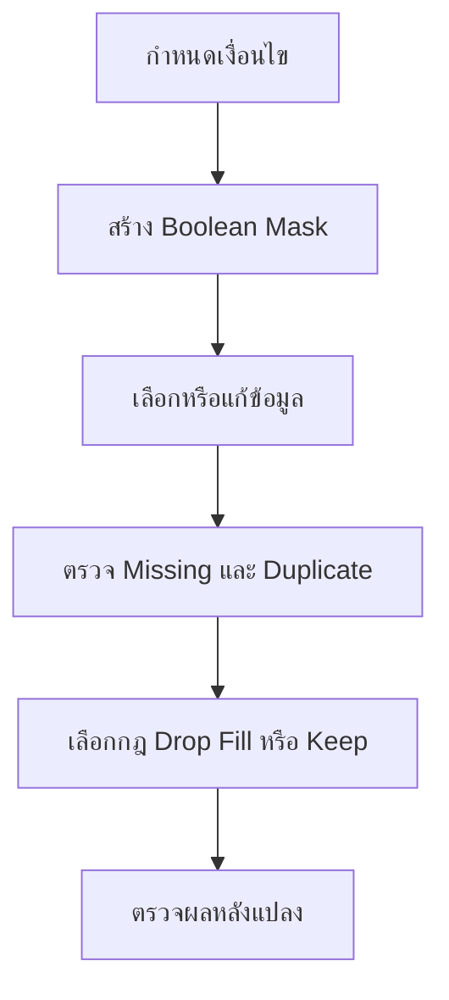

# DADS5001 Week 02: Pandas 2 - Conditional Filtering, Missing Data และ Duplicates

> **รายวิชา:** DADS5001 Data Analytics and Data Science Tools and Programming  
> **เอกสารต้นทาง:** `pandas2.ipynb` จำนวน 81 cells (Code 57, Markdown 24)  
> **Dataset:** Complete Pokémon Dataset จำนวน 801 แถว 41 คอลัมน์  
> **ขอบเขต:** Boolean indexing, `query()`, string/regex filtering, datetime filtering, conditional assignment, column filtering, missing data และ duplicated data  
> **รูปแบบบันทึก:** Deep Learning & Exam-Ready Master Notes

## 1. Chapter Overview

Pandas 1 สอนว่า “จะเลือกข้อมูลที่ตำแหน่งใด” ด้วย `.loc`, `.iloc`, `.at` และ `.iat` ส่วน Pandas 2 ขยับไปสู่คำถามที่ใช้จริงมากกว่า คือ “จะเลือกข้อมูลที่มีคุณสมบัติตรงตามเงื่อนไขใด” และ “จะจัดการข้อมูลที่ไม่สมบูรณ์หรือซ้ำอย่างไร”



หัวใจของบทนี้คือ **mask → select/change → validate** กล่าวคือ:

1. สร้างชุดค่า `True`/`False` ที่ยาวเท่ากับแกนที่จะกรอง
2. ใช้ mask เลือกหรือแก้เฉพาะส่วนที่เป็น `True`
3. ตรวจจำนวนแถว ชนิดข้อมูล และผลลัพธ์หลังดำเนินการเสมอ

## 2. Learning Objectives

เมื่อจบบทนี้ควรสามารถ:

1. สร้าง Boolean mask จากเงื่อนไขเดี่ยวและเงื่อนไขผสมได้
2. เลือกใช้ Boolean indexing และ `DataFrame.query()` ได้เหมาะสม
3. ใช้ `.isin()`, `.str.contains()` และ Regular Expression กรองข้อความได้
4. แปลงข้อความเป็น datetime และใช้ `.dt` accessor ได้
5. แก้ค่าเฉพาะแถว/คอลัมน์ด้วย `.loc` โดยไม่เกิด chained assignment
6. แยกความต่างระหว่างการกรอง “ค่าข้อมูล” กับการกรอง “labels” ด้วย `filter()` ได้
7. เลือกคอลัมน์ตาม dtype ด้วย `select_dtypes()` ได้
8. ตรวจ กรอง ลบ และเติม missing values โดยเข้าใจผลต่อข้อมูลได้
9. นิยาม duplicate ตาม grain/business key และใช้ `duplicated()`/`drop_duplicates()` ได้
10. แก้โจทย์ filtering แบบหลายเงื่อนไขและอธิบายเหตุผลของ code ได้

## 3. Prerequisite Knowledge

- `Series`, `DataFrame`, row index และ column labels
- `.loc[row_selector, column_selector]` และ `.iloc[]`
- dtype เช่น integer, float, string/object และ datetime
- operator เปรียบเทียบ `==`, `!=`, `>`, `>=`, `<`, `<=`
- แนวคิด grain: หนึ่งแถวแทนอะไร
- Missing value เช่น `NaN`, `None`, `pd.NA`, `NaT`

## 4. Environment และ Dataset

### 4.1 การตั้ง Timezone ใน Google Colab

Notebook ใช้ shell commands:

```python
!rm /etc/localtime
!ln -s /usr/share/zoneinfo/Asia/Bangkok /etc/localtime
!date
```

เครื่องหมาย `!` หมายถึงให้ IPython ส่งคำสั่งไปยัง shell ไม่ใช่ Python syntax ปกติ คำสั่งนี้แก้ system timezone ของ Colab runtime เป็น Asia/Bangkok

**ข้อควรระวัง:**

- ใช้ได้ใน notebook environment ที่มีสิทธิ์แก้ `/etc/localtime` แต่ไม่ใช่วิธี portable สำหรับทุกระบบ
- Runtime ใหม่อาจกลับเป็นค่าเดิม
- งานวิเคราะห์เวลาไม่ควรพึ่ง system timezone เพียงอย่างเดียว ควรใช้ timezone-aware timestamp เมื่อข้อมูลมาจากหลายเขตเวลา

ตัวอย่างที่ควบคุม timezone ในระดับข้อมูล:

```python
now_bangkok = pd.Timestamp.now(tz="Asia/Bangkok")
```

### 4.2 ตรวจเวอร์ชันก่อนทำงาน

```python
import sys
import pandas as pd
import numpy as np
import IPython

print(sys.version)
print(pd.__version__)
print(np.__version__)
print(IPython.__version__)
```

เวอร์ชันมีผลต่อ dtype inference, missing-data behavior, `query()` engine และ API ที่เลิกใช้แล้ว จึงควรบันทึกไว้เพื่อ reproducibility

### 4.3 Pokémon Dataset

```python
df_pokemon = pd.read_csv("pokemon.csv")
df_pokemon.info()
df = df_pokemon.copy()
```

Dataset ที่ใช้มี 801 แถว 41 คอลัมน์ ครอบคลุมข้อมูล เช่น:

- `pokedex_number`, `name`, `japanese_name`
- `type1`, `type2`, `abilities`
- `hp`, `attack`, `defense`
- `height_m`, `weight_kg`
- `capture_rate`, `generation`, `is_legendary`

การใช้ `.copy()` ป้องกันการแก้ `df_pokemon` ต้นฉบับโดยไม่ตั้งใจระหว่างทดลอง

## 5. Boolean-Based Indexing

### 5.1 Boolean Mask คืออะไร

Boolean mask คือ Series/array ของค่า `True` และ `False` ที่สอดคล้องกับ labels ของแกนที่กรอง:

```python
mask = df["type1"] == "grass"
```

ผลลัพธ์ไม่ใช่แถว Pokémon แต่เป็น `Series[bool]`:

```text
0     True/False
1     True/False
...
```

- `True` = เก็บแถวนั้น
- `False` = ไม่เลือกแถวนั้น

จากนั้นนำ mask ไปใช้:

```python
result = df.loc[mask, ["name", "japanese_name", "type1", "type2"]]
```

**Mental model:** เงื่อนไขสร้างคำตอบรายแถวก่อน แล้ว `.loc` ใช้คำตอบนั้นเป็นตะแกรงกรองข้อมูล

### 5.2 รูปแบบที่ควรใช้

Notebook แสดงหลาย style ที่ให้ผลเท่ากัน แต่รูปแบบที่ชัดที่สุดคือ:

```python
df.loc[
    df["type1"].eq("grass"),
    ["name", "japanese_name", "type1", "type2"],
]
```

เหตุผลที่แนะนำรูปนี้:

- row condition และ columns อยู่ใน `.loc[]` ครั้งเดียว
- ลด chained indexing เช่น `df[mask][columns]`
- ใช้รูปเดียวกันต่อยอดเป็น conditional assignment ได้

### 5.3 Comparison Methods

Pandas รองรับทั้ง operator และ method:

| Operator | Method | ความหมาย |
|---|---|---|
| `==` | `.eq()` | เท่ากับ |
| `!=` | `.ne()` | ไม่เท่ากับ |
| `>` | `.gt()` | มากกว่า |
| `>=` | `.ge()` | มากกว่าหรือเท่ากับ |
| `<` | `.lt()` | น้อยกว่า |
| `<=` | `.le()` | น้อยกว่าหรือเท่ากับ |

```python
df["attack"].gt(2 * df["defense"])
```

เท่ากับ:

```python
df["attack"] > 2 * df["defense"]
```

### 5.4 Membership ด้วย `.isin()`

ถ้าต้องการหลายค่าที่เป็นทางเลือกเดียวกัน ไม่ควรเขียน `==` ต่อกันยาว ๆ:

```python
targets = ["dragon", "fairy"]

result = df.loc[
    df["type1"].isin(targets),
    ["name", "abilities", "type1", "type2"],
]
```

`.isin()` ทำงานแบบ SQL `IN` และคืน Boolean Series

ตรงข้ามกับ membership ใช้ `~`:

```python
df.loc[~df["type1"].isin(targets)]
```

## 6. Compound Conditions

### 6.1 Operators ที่ใช้กับ Series

| ความหมาย | Pandas Boolean Operator | ห้ามใช้แทนด้วย |
|---|---|---|
| AND | `&` | `and` นอก `query()` |
| OR | `|` | `or` นอก `query()` |
| NOT | `~` | `not` นอก `query()` |

```python
mask = (
    df["type1"].eq("grass")
    & df["type2"].ne("poison")
)

result = df.loc[mask, ["name", "type1", "type2"]]
```

### 6.2 ทำไมต้องใส่วงเล็บ

Comparison แต่ละส่วนต้องอยู่ในวงเล็บ เพราะ precedence ของ `&`/`|` กับ comparison ไม่ตรงกับความหมายที่มนุษย์อ่านตามธรรมชาติ

ผิด:

```python
df["type1"] == "grass" & df["type2"] != "poison"
```

ถูก:

```python
(df["type1"] == "grass") & (df["type2"] != "poison")
```

### 6.3 นับจำนวนแถวที่ตรงเงื่อนไข

```python
mask.sum()
```

เพราะ Python/Pandas ตีความ `True = 1`, `False = 0` การ sum mask จึงเป็นจำนวนแถวที่ผ่านเงื่อนไข อีกวิธีคือ:

```python
df.loc[mask].shape[0]
```

## 7. `DataFrame.query()`

### 7.1 What และ When to Use

`query()` ใช้กรองแถวด้วย expression ที่เขียนเป็น string:

```python
df.query("type1 == 'grass'")
df.query("attack > 2 * defense")
```

ข้อดีคือ expression สั้นและอ่านคล้าย SQL โดยอ้างชื่อคอลัมน์ตรง ๆ ข้อเสียคือ code อยู่ใน string ทำให้ IDE/type checker ช่วยได้น้อยลง และ debugging อาจยากกว่า Boolean indexing

### 7.2 อ้างตัวแปรภายนอกด้วย `@`

```python
target_type = "grass"
targets = ["dragon", "fairy"]

df.query("type1 == @target_type")
df.query("type1 in @targets")
```

`@` บอกว่าให้ดึงค่าจาก Python environment ไม่ใช่ชื่อคอลัมน์

### 7.3 ชื่อคอลัมน์ที่ไม่ใช่ Python Identifier

หากชื่อมีช่องว่างหรืออักขระพิเศษ ใช้ backticks:

```python
df.query("`capture rate` > 90")
```

### 7.4 เงื่อนไขผสม

ภายใน `query()` ใช้ได้ทั้ง `&`/`|` และ `and`/`or` ตาม parser ของ Pandas:

```python
df.query("type1 == 'grass' and type2 != 'poison'")
```

### 7.5 Performance และ Security

Notebook กล่าวถึงโอกาสที่ `query()` จะเร็วขึ้นบน DataFrame ขนาดใหญ่ แต่ไม่ควรถือว่าเร็วกว่าเสมอ ประสิทธิภาพขึ้นกับขนาด expression, dtype, engine และ environment ต้อง benchmark กับงานจริง

**คำอธิบายเพิ่มเติม:** เอกสารทางการเตือนว่า `query()` สามารถรัน code ผ่าน expression ได้ จึงห้ามนำข้อความจากผู้ใช้ภายนอกมาต่อเป็น query string โดยไม่ควบคุม เพราะเสี่ยง code injection

### 7.6 เลือก Boolean Indexing หรือ `query()`

| สถานการณ์ | แนะนำ |
|---|---|
| ต้องแก้ค่าด้วย conditional assignment | `.loc[mask, columns]` |
| ต้องใช้ method/String accessor ซับซ้อน | Boolean indexing |
| Expression สั้นและชื่อคอลัมน์อ่านง่าย | `query()` |
| ต้องใช้ตัวแปรภายนอก | ทั้งคู่; `query()` ใช้ `@var` |
| Expression มาจาก user input | หลีกเลี่ยง `query()` |

## 8. Filtering Text Data

### 8.1 Equality ของ String

```python
target = "['Blaze', 'Solar Power']"
df.loc[df["abilities"].eq(target)]
```

ใน dataset นี้ `abilities` ดูเหมือน list แต่ถูกเก็บเป็น **string representation of list** ไม่ใช่ Python list จริง ดังนั้น equality ตรวจข้อความทั้งก้อน รวมวงเล็บ quote ลำดับ และช่องว่าง

หากต้องวิเคราะห์ abilities เป็นสมาชิกจริง ควร parse เป็น structured data อย่างปลอดภัย เช่น `ast.literal_eval()` แล้ว normalize/explode ในขั้นต่อไป ไม่ควรใช้ `eval()` กับข้อความที่ไม่เชื่อถือ

### 8.2 `.str.contains()`

```python
mask = df["abilities"].str.contains(
    "blaze",
    case=False,
    na=False,
)
```

Parameters สำคัญ:

- `case=False` ไม่แยกตัวพิมพ์ใหญ่–เล็ก
- `regex=True` ตีความ pattern เป็น Regular Expression ซึ่งเป็น default
- `na=False` ให้ missing values กลายเป็น `False` เพื่อให้ mask ใช้กรองได้แน่นอน

Notebook ไม่ใส่ `na=False` เพราะคอลัมน์ตัวอย่างอาจไม่มี NA แต่ในงานจริงควรพิจารณาเสมอ

### 8.3 Regular Expression

```python
mask = df["name"].str.contains(
    r"^char|bug$",
    case=False,
    regex=True,
    na=False,
)
```

ความหมาย:

- `^char` = ขึ้นต้นด้วย `char`
- `bug$` = ลงท้ายด้วย `bug`
- `|` = หรือ

ดังนั้น pattern หมายถึง “ชื่อขึ้นต้นด้วย char **หรือ** ลงท้ายด้วย bug”

### 8.4 เงื่อนไข Text แบบซับซ้อน

โจทย์: type1 หรือ type2 เป็น dragon แต่ชื่อไม่ขึ้นต้นด้วย drag

```python
is_dragon = df["type1"].eq("dragon") | df["type2"].eq("dragon")
name_starts_drag = df["name"].str.contains(
    r"^drag", case=False, regex=True, na=False
)

result = df.loc[
    is_dragon & ~name_starts_drag,
    ["pokedex_number", "name", "abilities", "type1", "type2"],
]
```

การแยก mask เป็นตัวแปรช่วยให้ตรวจทีละเงื่อนไขได้ง่ายกว่าการรวม expression ยาวหนึ่งบรรทัด

### 8.5 Regex vs Literal Search

ถ้าค้นข้อความธรรมดาที่มีอักขระ regex เช่น `.`, `(`, `+`, `?` ควรใช้:

```python
df["name"].str.contains("Mr. Mime", regex=False, na=False)
```

หรือ escape pattern ด้วย `re.escape()` เมื่อจำเป็น

## 9. Datetime Filtering

### 9.1 ทำไม `.dt` ใช้กับ String ไม่ได้

Notebook สร้างวันที่เป็นข้อความ:

```python
df_dt = pd.DataFrame({
    "name": ["A", "B", "C", "D"],
    "date1": ["2000-12-31", "2005-4-15", "2020-7-9", "2022-2-28"],
    "date2": [
        "2000-12-31 23:55", "2005-4-15 1:15",
        "2020-7-9 0:45", "2022-2-28 12:30",
    ],
})
```

คำสั่งนี้ error:

```python
df_dt["date2"].dt.month_name()
```

เพราะ `date2` ยังเป็น string/object ต้องแปลงก่อน:

```python
df_dt["date1"] = pd.to_datetime(df_dt["date1"], errors="coerce")
df_dt["date2"] = pd.to_datetime(df_dt["date2"], errors="coerce")
```

`errors="coerce"` เปลี่ยนค่าที่ parse ไม่ได้เป็น `NaT` จึงต้องตรวจ `isna().sum()` หลังแปลง

### 9.2 Datetime Accessor

```python
df_dt["date2"].dt.date
df_dt["date2"].dt.month_name()
df_dt["date2"].dt.day_name()

df_dt["year"] = df_dt["date2"].dt.year
df_dt["month"] = df_dt["date2"].dt.month
df_dt["day"] = df_dt["date2"].dt.day
df_dt["hour"] = df_dt["date2"].dt.hour
df_dt["minute"] = df_dt["date2"].dt.minute
df_dt["second"] = df_dt["date2"].dt.second
```

`.dt` เป็น accessor ที่เปิด vectorized datetime properties ให้ Series

### 9.3 Current Time และการคำนวณอายุ

```python
today = pd.Timestamp.now(tz="Asia/Bangkok")
```

Notebook คำนวณ:

```python
df_dt["age_y"] = today.year - df_dt["date2"].dt.year
df_dt["age_s"] = (today.tz_localize(None) - df_dt["date2"]).dt.total_seconds()
```

`age_y` เป็นเพียงส่วนต่างของปีปฏิทิน ไม่ใช่อายุเต็มปี เพราะยังไม่ตรวจว่าถึงวันเกิดในปีนี้หรือยัง ส่วน `age_s` เป็น elapsed seconds ระหว่าง timestamps

### 9.4 ทำไม Chained Comparison ใช้กับ Series ไม่ได้

คำสั่งนี้ error:

```python
2010 <= df_dt["date2"].dt.year <= 2022
```

Python พยายามประเมินค่าความจริงของ Series ทั้งชุด ซึ่งกำกวม ต้องเขียนเป็นสอง masks:

```python
mask = (
    df_dt["date2"].dt.year.ge(2010)
    & df_dt["date2"].dt.year.le(2022)
)
df_dt.loc[mask].sort_values("date2", ascending=False)
```

หรือใช้ `.between()` ซึ่งอ่านง่ายกว่า:

```python
mask = df_dt["date2"].dt.year.between(2010, 2022, inclusive="both")
```

### 9.5 Date Boundary ที่แม่นกว่า

ถ้าโจทย์กำหนดช่วงวันจริง ควรเทียบ Timestamp โดยตรง ไม่ดึงเฉพาะปี:

```python
mask = df_dt["date2"].between(
    pd.Timestamp("2010-01-01"),
    pd.Timestamp("2022-12-31 23:59:59.999999999"),
)
```

หรือใช้ขอบบนแบบไม่รวม ซึ่งลดปัญหา precision:

```python
mask = (
    df_dt["date2"].ge("2010-01-01")
    & df_dt["date2"].lt("2023-01-01")
)
```

## 10. Conditional Change

### 10.1 Pattern ที่ปลอดภัย

```python
df.loc[df["type1"].eq("dark"), "type1"] = "black"
```

syntax คือ:

```text
df.loc[row_condition, target_columns] = new_value
```

`.loc` ช่วยให้ Pandas รู้ชัดว่าต้องแก้ object ใด ลดปัญหา chained assignment

### 10.2 รูปแบบที่ผิด

```python
df[df["type1"] == "dark", "type1"] = "black"
```

วงเล็บ `[]` ของ DataFrame ถูกตีความว่ารับ column key หนึ่งตัว แต่ code ส่ง tuple ที่มี Series อยู่ข้างใน จึงเกิด `TypeError: unhashable type: 'Series'`

### 10.3 เพิ่มคอลัมน์ด้วย Scalar Broadcasting

```python
df["type3"] = ""
```

Pandas broadcast string ว่างไปทุกแถว และสร้างคอลัมน์ใหม่เมื่อ label ยังไม่มี

รูปแบบอื่น:

```python
df = df.assign(type3="")
```

`.assign()` คืน DataFrame ใหม่และเหมาะกับ method chaining

### 10.4 แก้หลายคอลัมน์พร้อมกัน

```python
mask = df["type1"].eq("black")
df.loc[mask, ["type1", "type3"]] = ["dark", "very dark"]
```

ค่าด้านขวามีสองค่าและถูกจับคู่ตามลำดับคอลัมน์ด้านซ้าย:

- `type1` ← `dark`
- `type3` ← `very dark`

ต้องตรวจจำนวนและลำดับของ values ให้ตรงกับ target columns

## 11. Filtering Columns

### 11.1 Boolean Mask บน Column Axis

ต้องสร้าง mask ที่ยาวเท่ากับจำนวนคอลัมน์:

```python
column_mask = [i % 4 == 0 for i in range(len(df.columns))]
df.loc[:, column_mask]
```

`:` หมายถึงทุกแถว ส่วน mask หลัง comma ใช้กรองคอลัมน์

ตัวอย่างตัดคอลัมน์ที่ชื่อมี `against_`:

```python
column_mask = ~df.columns.str.contains("against_", regex=False)
df.loc[:, column_mask]
```

การใช้ vectorized string method บน `Index` อ่านง่ายกว่า list comprehension

### 11.2 ทำไม `query()` กรองคอลัมน์ไม่ได้

`query()` ประเมิน expression จากค่าคอลัมน์เพื่อคืน row mask จึงออกแบบมาสำหรับกรองแถว ไม่ใช่เลือก column labels

## 12. `DataFrame.filter()` - กรอง Labels ไม่ใช่ Values

### 12.1 Mental Model

ชื่อ `filter()` ชวนให้คิดว่ากรองค่าภายในตาราง แต่จริง ๆ ใช้กรอง **axis labels** เท่านั้น สำหรับ DataFrame ค่า default คือ `axis=1` หรือ columns

### 12.2 `items`

```python
df.filter(items=["pokedex_number", "name", "japanese_name", "is_legendary"])
df.filter(items=[0, 10, 20, 30, 40], axis=0)
```

`items` ระบุ labels แบบ exact match ที่ต้องเก็บ

### 12.3 `like`

```python
df.filter(like="against")
df.filter(like="97", axis=0)
```

`like` เก็บ label ที่มี substring กำหนด เมื่อใช้กับ numeric row index Pandas จะพิจารณา string representation ของ label

### 12.4 `regex`

```python
df.filter(regex=r"fairy|name$")
df.filter(regex=r"^[5-7]97$", axis=0)
```

ตัวอย่างแรกเลือก column labels ที่มี `fairy` หรือจบด้วย `name`

Notebook ใช้ pattern `[5-7]97` ซึ่ง match labels ที่มี `597`, `697`, `797` อยู่ภายใน หากต้องการทั้ง label เท่านั้นควรใส่ anchors `^...$`

### 12.5 Mutually Exclusive Arguments

`items`, `like`, `regex` ใช้พร้อมกันไม่ได้ ต้องเลือกอย่างใดอย่างหนึ่ง

## 13. Selecting Columns by Dtype

```python
numeric_df = df.select_dtypes(include="number")
non_numeric_df = df.select_dtypes(exclude="number")
```

Notebook ใช้:

```python
df.select_dtypes(include=["int"])
df.select_dtypes(exclude=["int"])
```

แต่การระบุ `"number"` มักแข็งแรงกว่าเมื่อต้องการทุก numeric dtype เพราะข้อมูลอาจเป็น `int32`, `int64`, nullable integer หรือ float

ใช้เมื่อ:

- คำนวณสถิติเฉพาะตัวเลข
- แยก categorical/text columns
- เตรียม feature groups ก่อน preprocessing

```python
text_columns = df.select_dtypes(include=["string", "object"]).columns
```

## 14. Missing Data: Concept ก่อน Syntax

### 14.1 Missing Value คืออะไร

Missing ไม่ได้มีความหมายเดียว:

- ไม่เคยเก็บข้อมูล
- ไม่เกี่ยวข้องกับ observation นี้
- ผู้ตอบปฏิเสธ
- ระบบดึงข้อมูลล้มเหลว
- ค่าไม่ผ่าน validation แล้วถูกแปลงเป็น missing

ดังนั้นคำถามไม่ใช่เพียง “จะลบหรือเติมอะไร” แต่ต้องถามว่า **ทำไมมันหาย และการหายสัมพันธ์กับตัวแปรอื่นหรือไม่**

### 14.2 Missing Sentinels

Pandas อาจแสดง missing ต่างกันตาม dtype/backend:

| Sentinel | พบบ่อยใน |
|---|---|
| `np.nan` | floating-point/NumPy-backed data |
| `None` | Python object |
| `pd.NA` | nullable extension dtype |
| `pd.NaT` | datetime/timedelta |

ห้ามตรวจด้วย `x == np.nan` เพราะ `NaN` ไม่เท่ากับตัวเอง ให้ใช้ `isna()`/`notna()`

### 14.3 Infinity ไม่เท่ากับ Missing

`np.inf` และ `-np.inf` หมายถึงอนันต์ ไม่ใช่ missing โดยธรรมชาติ หากเป็นผลจาก division by zero ต้องตัดสินใจตาม domain ว่าจะเก็บ แทน หรือตั้งเป็น missing

Notebook กล่าวถึง option `use_inf_as_na` แต่ใน Pandas รุ่นใหม่ option นี้ถูกเลิกใช้แล้ว แนวทางที่ชัดกว่าคือ:

```python
df = df.replace([np.inf, -np.inf], pd.NA)
```

## 15. Detect และ Count Missing Values

### 15.1 Series

```python
df["type2"].count()       # จำนวน non-NA
df["type2"].isna()        # Boolean mask ของ NA
df["type2"].notna()       # Boolean mask ของ non-NA
df["type2"].isna().sum()  # จำนวน NA
```

`count()` ไม่เท่ากับจำนวน rows เพราะไม่นับ missing หากต้องการจำนวนสมาชิกทั้งหมดใช้ `len(series)` หรือ `series.size`

### 15.2 DataFrame และ Axis

```python
df.count()           # non-NA ต่อคอลัมน์, axis=0
df.count(axis=1)     # non-NA ต่อแถว
df.isna()            # DataFrame ของ bool ขนาดเท่าเดิม
df.isna().sum()      # จำนวน NA ต่อคอลัมน์
```

อัตรา missing ต่อคอลัมน์:

```python
missing_profile = (
    df.isna()
      .agg(["sum", "mean"])
      .T
      .rename(columns={"sum": "missing_count", "mean": "missing_rate"})
)
```

## 16. Filter Rows by Missing Status

### 16.1 Missing ในคอลัมน์ใดคอลัมน์หนึ่ง

```python
mask = df["weight_kg"].isna() | df["height_m"].isna()
df.loc[mask]
```

### 16.2 Non-Missing

```python
df.loc[df["type2"].notna()]
```

### 16.3 อย่างน้อยหนึ่งค่าในแถวเป็น Missing

`df.isna()` คืนตาราง Boolean 2 มิติ แต่ row selector ต้องการ Boolean 1 มิติ จึงต้อง reduce column axis:

```python
row_has_na = df.isna().any(axis=1)
df.loc[row_has_na]
```

### 16.4 ทุกค่าในแถวเป็น Missing

```python
row_all_na = df.isna().all(axis=1)
df.loc[row_all_na]
```

ตารางจำง่าย:

| ต้องการ | Expression |
|---|---|
| มี NA อย่างน้อยหนึ่งคอลัมน์ | `df.isna().any(axis=1)` |
| ทุกคอลัมน์เป็น NA | `df.isna().all(axis=1)` |
| ไม่มี NA เลย | `df.notna().all(axis=1)` |
| มี non-NA อย่างน้อยหนึ่งค่า | `df.notna().any(axis=1)` |

## 17. Drop Missing Data

### 17.1 Series

```python
weight = df["weight_kg"].dropna()
```

ผลลัพธ์คง index เดิม หากต้องการ 0-based index ใหม่:

```python
weight = weight.reset_index(drop=True)
```

### 17.2 DataFrame

```python
df.dropna()                    # ลบแถวที่มี NA อย่างน้อยหนึ่งค่า
df.dropna(axis=1)              # ลบคอลัมน์ที่มี NA อย่างน้อยหนึ่งค่า
df.dropna(how="all")          # ลบแถวเมื่อทุกค่าคือ NA
df.dropna(subset=["type1"])   # พิจารณาเฉพาะคอลัมน์สำคัญ
df.dropna(thresh=5)            # เก็บแถวที่มี non-NA อย่างน้อย 5 ค่า
```

### 17.3 ทำไมไม่ควร `dropna()` โดยไม่คิด

ถ้าตารางมี 41 คอลัมน์ เพียงคอลัมน์หนึ่งมี NA ก็ลบทั้งแถว การเรียก `df.dropna()` อาจทิ้ง observation จำนวนมากและทำให้ sample bias

แนวทางที่ดีกว่า:

1. วัดจำนวน/สัดส่วน missing
2. ระบุคอลัมน์ที่จำเป็นต่อ analysis
3. ตรวจ pattern ว่าหายกระจุกในบางกลุ่มหรือไม่
4. ใช้ `subset`/`thresh` หรือ imputation ตามเหตุผล
5. เปรียบเทียบจำนวนแถวก่อนและหลัง

## 18. Fill Missing Data

Notebook ใช้:

```python
df2 = df.fillna("empty value")
```

แม้ `count()` จะเพิ่มจนดูเหมือนไม่มี missing แต่การเติม string ลงคอลัมน์ตัวเลขอาจเปลี่ยน dtype เป็น object/string ทำให้คำนวณไม่ได้

ควรเติมตามความหมายและ dtype:

```python
df2 = df.copy()
df2["type2"] = df2["type2"].fillna("no_secondary_type")
df2["weight_kg"] = df2["weight_kg"].fillna(df2["weight_kg"].median())
```

### 18.1 ทางเลือกการเติม

| วิธี | เหมาะเมื่อ | ความเสี่ยง |
|---|---|---|
| Constant | missing มีความหมายเฉพาะ เช่นไม่มี type2 | category ใหม่อาจปนกับข้อมูลจริง |
| Mean | distribution สมมาตรและไม่มี outlier มาก | ลด variance/ไวต่อ outlier |
| Median | numeric skewed | ยังลด uncertainty |
| Mode | categorical | ทำให้ category ใหญ่ยิ่งเด่น |
| Forward fill | time/order data และค่าคงอยู่จนเปลี่ยน | เติมข้ามช่วงที่ไม่ควร |
| Backward fill | มีเหตุผลให้ค่าอนาคตแทนอดีต | เสี่ยง data leakage |

ควรสร้าง missing indicator เมื่อการหายเองมีข้อมูล:

```python
df2["weight_missing"] = df2["weight_kg"].isna()
```

## 19. Duplicated Data

### 19.1 Duplicate ขึ้นกับนิยาม Grain

“แถวซ้ำ” ไม่ใช่คุณสมบัติที่มีคำตอบเดียว ต้องระบุว่าคอลัมน์ใดรวมกันควร unique:

- Pokémon หนึ่งตัวต่อ `pokedex_number`
- Combination ของ `type1` + `type2`
- Transaction หนึ่งรายการต่อ `order_id` + `line_no`

การพบ type combination ซ้ำไม่ได้แปลว่า Pokémon row ซ้ำ แต่แปลว่าหลาย Pokémon ใช้ type combination เดียวกัน

### 19.2 `duplicated()`

```python
df.duplicated()
```

default ใช้ทุกคอลัมน์และคืน Boolean Series

```python
df.duplicated(subset=["type1", "type2"], keep="first")
df.duplicated(subset=["type1", "type2"], keep="last")
df.duplicated(subset=["type1", "type2"], keep=False)
```

| `keep` | แถวใดถูก mark `True` |
|---|---|
| `"first"` | ทุกตัวซ้ำ ยกเว้นตัวแรก |
| `"last"` | ทุกตัวซ้ำ ยกเว้นตัวสุดท้าย |
| `False` | ทุกแถวที่อยู่ในกลุ่มซ้ำ |

### 19.3 หา Combination ที่ Unique จริง

```python
unique_combo = ~df.duplicated(
    subset=["type1", "type2"],
    keep=False,
)
df.loc[unique_combo]
```

`~` กลับค่า mask จาก duplicate เป็น unique-only

### 19.4 ตรวจผลด้วย Drill-Down

Notebook ตรวจ combination electric/electric:

```python
df.query("type1 == 'electric' and type2 == 'electric'")
```

นี่เป็น validation ที่ดี: หลังสรุปว่า combination unique ควร drill down กลับไปดูแถวจริง ไม่พึ่ง mask count เพียงอย่างเดียว

## 20. Drop Duplicates

```python
df.drop_duplicates(
    subset=["type1", "type2"],
    keep=False,
    ignore_index=True,
)
```

ความหมายคือเก็บเฉพาะ type combinations ที่เกิดครั้งเดียว และทิ้งทุกแถวใน combination ที่เกิดซ้ำ ไม่ได้หมายถึง “เก็บ Pokémon หนึ่งตัวต่อประเภท”

ถ้าต้องการเก็บตัวแรกของแต่ละ combination:

```python
df.drop_duplicates(
    subset=["type1", "type2"],
    keep="first",
    ignore_index=True,
)
```

### 20.1 ก่อนลบ Duplicate ต้องตอบ 5 คำถาม

1. Grain ที่คาดหวังคืออะไร
2. Business key คือคอลัมน์ใด
3. Duplicate เป็น repeated load, correction, history หรือ observation จริง
4. หากต้องเลือกหนึ่งแถว จะใช้กฎ first/last/max timestamp ตามอะไร
5. จำนวนและ metric ก่อน–หลังเปลี่ยนเท่าใด

## 21. Worked Example: แก้โจทย์แบบเป็นขั้นตอน

### 21.1 First-Generation Pokémon เรียง HP

โจทย์: แสดงเลข Pokédex ชื่ออังกฤษ ชื่อญี่ปุ่น และ HP ของ Generation 1 เรียง HP มากไปน้อย และกรณี HP เท่ากันเรียงเลข Pokédex น้อยไปมาก

```python
answer1 = (
    df_pokemon.loc[
        df_pokemon["generation"].eq(1),
        ["pokedex_number", "name", "japanese_name", "hp"],
    ]
    .sort_values(
        ["hp", "pokedex_number"],
        ascending=[False, True],
    )
    .reset_index(drop=True)
)
```

ผลมี 151 แถว โดย 5 อันดับแรกคือ Chansey (250), Snorlax (160), Wigglytuff (140), Lapras (130), Vaporeon (130) และ Lapras มาก่อน Vaporeon เพราะ Pokédex 131 < 134

### 21.2 มีทั้ง Type1/Type2 และเป็น Water หรือ Grass

```python
mask = (
    df_pokemon["type1"].notna()
    & df_pokemon["type2"].notna()
    & df_pokemon["type1"].isin(["water", "grass"])
)

answer2 = int(mask.sum())
```

ผลคือ **94 Pokémon**

สังเกตว่าโจทย์ระบุ type1 เป็น water/grass ไม่ได้หมายถึง type ใดก็ได้ใน type1/type2

### 21.3 Super Luck และ Capture Rate > 90

เมื่อลองเปรียบเทียบตรง ๆ:

```python
df_pokemon["capture_rate"] > 90
```

จะเกิด `TypeError` เพราะ `capture_rate` ถูกอ่านเป็น object/string เนื่องจาก Minior มีค่า `30 (Meteorite)255 (Core)` ซึ่งไม่ใช่เลขเดี่ยว

ต้องตรวจและแปลงอย่างมีหลักการ:

```python
capture_rate_num = pd.to_numeric(
    df_pokemon["capture_rate"],
    errors="coerce",
)

mask = (
    df_pokemon["abilities"].str.contains(
        "super luck", case=False, na=False
    )
    & capture_rate_num.gt(90)
)

answer3 = df_pokemon.loc[
    mask,
    ["pokedex_number", "name", "hp", "abilities", "capture_rate"],
]
```

ได้ 3 ตัว:

| Pokédex | Name | HP | Capture Rate |
|---:|---|---:|---:|
| 175 | Togepi | 35 | 190 |
| 519 | Pidove | 50 | 255 |
| 520 | Tranquill | 62 | 120 |

**ข้อควรระวัง:** `errors="coerce"` ทำให้ Minior กลายเป็น missing ซึ่งเหมาะสำหรับโจทย์นี้เพราะไม่มีค่าเลขเดียว แต่ในงานจริงต้องตัดสิน business rule ว่าจะเลือก Meteorite rate, Core rate หรือแยกเป็นสอง records ห้ามปล่อยให้ coercion ซ่อนปัญหาเงียบ ๆ

```python
invalid_capture_rate = df_pokemon.loc[
    capture_rate_num.isna() & df_pokemon["capture_rate"].notna(),
    ["name", "capture_rate"],
]
```

## 22. Common Misconceptions

### 22.1 ใช้ `and`/`or` กับ Boolean Series ได้โดยตรง

ผิด นอก `query()` ต้องใช้ `&`, `|`, `~` และใส่วงเล็บรอบแต่ละ comparison

### 22.2 `filter()` กรองค่าภายในตาราง

ผิด `DataFrame.filter()` กรอง labels ของ rows/columns ไม่ใช่ values

### 22.3 `count()` คือจำนวนแถวทั้งหมด

ผิด `count()` ไม่นับ missing; ใช้ `len()`/`.size` หากต้องการจำนวนทั้งหมด

### 22.4 `df.isna()` ใช้กรองแถวได้ทันที

ไม่ได้ เพราะคืน DataFrame Boolean 2 มิติ ต้อง reduce ด้วย `.any(axis=1)` หรือ `.all(axis=1)` ก่อน

### 22.5 เติม `"empty value"` ทุกคอลัมน์แล้วข้อมูลสะอาด

ผิด แม้ไม่มี NA เหลือ แต่ numeric columns อาจเสีย dtype และค่าที่เติมอาจไม่มีความหมาย

### 22.6 Duplicate คือแถวที่ไม่ควรมีเสมอ

ผิด ต้องนิยาม grain และ key ก่อน การซ้ำของ type combination เป็นข้อมูลจริง ไม่ใช่ duplicate record

### 22.7 `drop_duplicates(keep=False)` เก็บตัวแทนหนึ่งแถว

ผิด `keep=False` ทิ้งทุกแถวในกลุ่มที่ซ้ำ เหลือเฉพาะกลุ่มที่เกิดครั้งเดียว

### 22.8 Chained comparison ใช้กับ Series เหมือน scalar

ผิด `2010 <= series <= 2022` มีค่าความจริงเป็น Series และ Python ไม่รู้จะยุบเป็น True/False เดียวอย่างไร ใช้สองเงื่อนไขหรือ `.between()`

### 22.9 `.str.contains()` ค้น literal string เสมอ

ผิด default คือ regex อักขระพิเศษอาจเปลี่ยนความหมาย หากค้น literal ให้ใช้ `regex=False`

### 22.10 `query()` เร็วกว่า Boolean indexing เสมอ

ผิด ต้อง benchmark และคำนึงถึง readability/security

## 23. Likely Exam Focus

> หัวข้อต่อไปนี้อนุมานจาก code, error demonstrations และแบบฝึกใน Notebook ไม่ใช่ข้อมูลข้อสอบจริง

### Definitions to Remember

- Boolean mask และความสัมพันธ์กับ row/column axis
- Missing sentinel และ `isna()`/`notna()`
- Duplicate, subset และ grain
- Regular Expression anchors `^`, `$` และ OR `|`

### Processes to Explain

- condition → mask → `.loc` → validation
- string → datetime → `.dt` → filtering
- DataFrame Boolean 2D → `.any(axis=1)` → row mask 1D
- grain/key → `duplicated(subset=...)` → inspect → drop/keep

### Concepts to Compare

- Boolean indexing vs `query()`
- `filter()` vs filtering values
- `.any()` vs `.all()`
- `isna()` vs `notna()`
- `dropna()` vs `fillna()`
- `keep="first"`, `keep="last"`, `keep=False`

### Code to Perform

- `.isin()` และ compound conditions
- `.str.contains(..., case=False, na=False)`
- `pd.to_datetime(..., errors="coerce")`
- conditional assignment ด้วย `.loc`
- `select_dtypes()`
- missing profile และ `dropna(subset=...)`
- `duplicated()`/`drop_duplicates()`

### Scenario-Based Decisions

- เมื่อใดควร drop/fill/retain missing
- จะนิยาม duplicate จากคอลัมน์ใด
- จะจัดการ mixed-format numeric column อย่างไร
- ควรค้น string แบบ literal หรือ regex

## 24. Practice Questions

### Recall

**Q1.** Boolean mask คืออะไร และต้องมีความยาวสัมพันธ์กับอะไร?  
**Q2.** `filter()` กรอง values หรือ labels?  
**Q3.** `df.count()` ต่างจาก `len(df)` อย่างไร?  
**Q4.** `keep=False` ใน `duplicated()` หมายถึงอะไร?

### Explain

**Q5.** ทำไม compound condition ต้องใช้ `&` และวงเล็บ?  
**Q6.** ทำไม `.dt.month_name()` จึงใช้กับ string column ไม่ได้?  
**Q7.** อธิบายว่าเหตุใด `df.isna().any(axis=1)` จึงคืน row mask  
**Q8.** เพราะเหตุใดการเติม string เดียวในทุกคอลัมน์อาจทำลายคุณภาพข้อมูล?

### Compare

**Q9.** เปรียบเทียบ Boolean indexing กับ `query()`  
**Q10.** เปรียบเทียบ `.any(axis=1)` กับ `.all(axis=1)`  
**Q11.** เปรียบเทียบ `dropna(how="any")`, `dropna(how="all")` และ `dropna(subset=[...])`  
**Q12.** เปรียบเทียบ `duplicated(keep="first")` กับ `duplicated(keep=False)`

### Apply

**Q13.** เขียน code เลือก Pokémon ที่ `type1` เป็น water หรือ grass และ `hp >= 100`  
**Q14.** เขียน code เลือกชื่อที่ขึ้นต้นด้วย `char` แบบไม่แยกตัวพิมพ์ใหญ่เล็กและรองรับ NA  
**Q15.** เขียน code แสดงแถวที่มี missing อย่างน้อยหนึ่งค่า  
**Q16.** เขียน code เปลี่ยน `type1` จาก `dark` เป็น `black` เฉพาะแถวที่ตรงเงื่อนไข  
**Q17.** เขียน code เก็บเฉพาะ `(type1, type2)` combinations ที่เกิดครั้งเดียว

### Analyze

**Q18.** เหตุใด `capture_rate > 90` จึง error ใน dataset นี้ และควรตรวจอะไรหลัง `to_numeric(errors="coerce")`?  
**Q19.** หาก `order_id` ซ้ำแต่ `line_no` ต่างกัน ควรใช้ `order_id` อย่างเดียวลบ duplicate หรือไม่?  
**Q20.** นักวิเคราะห์เรียก `dropna()` แล้วเหลือข้อมูลเพียง 20% ควรตรวจและแก้ workflow อย่างไร?  
**Q21.** Pattern `fairy|name$` แตกต่างจาก `^(fairy|name)$` อย่างไร?

## 25. Model Answers with Reasoning

**A1.** Series/array ของ True/False สำหรับเลือกสมาชิก ต้องยาวและ align กับแกนที่กรอง เช่น row mask สัมพันธ์กับ DataFrame index

**A2.** Labels ของแกน ไม่ได้กรองค่าภายใน cells

**A3.** `df.count()` คืนจำนวน non-NA รายคอลัมน์ ส่วน `len(df)` คืนจำนวนแถวทั้งหมดโดยไม่สนว่าเป็น NA หรือไม่

**A4.** Mark ทุกแถวที่อยู่ในกลุ่มซ้ำเป็น True รวม occurrence แรกด้วย

**A5.** `and` ต้องการ boolean เดียว แต่ Series มีหลายค่า จึงใช้ bitwise `&`; วงเล็บทำให้แต่ละ comparison ถูกประเมินก่อนรวม masks

**A6.** `.dt` ใช้กับ datetime-like Series เท่านั้น ต้องแปลงด้วย `pd.to_datetime()` ก่อน

**A7.** `isna()` สร้าง Boolean ต่อ cell แล้ว `any(axis=1)` ยุบทุกคอลัมน์ในแต่ละแถวเป็น True เมื่อมีอย่างน้อยหนึ่ง NA จึงเหลือ Series หนึ่งค่าต่อแถว

**A8.** String ที่เติมใน numeric column อาจเปลี่ยน dtype และทำให้คำนวณไม่ได้ อีกทั้งคำว่า empty ไม่จำเป็นต้องตรงความหมายของการหาย

**A9.** Boolean indexing ใช้ Python/Pandas expression โดยตรง ยืดหยุ่นและเหมาะกับ `.loc`; `query()` ใช้ expression string อ่านสั้นคล้าย SQL แต่อาจ debug ยากและห้ามรับ user input ที่ไม่เชื่อถือ

**A10.** `.any(axis=1)` เป็น True เมื่อมีอย่างน้อยหนึ่ง True ในแถว; `.all(axis=1)` ต้องทุกค่าเป็น True

**A11.** `how="any"` ลบเมื่อมี NA อย่างน้อยหนึ่งค่า, `how="all"` ลบเมื่อทุกค่า NA, `subset` จำกัดคอลัมน์ที่ใช้ตัดสิน

**A12.** `keep="first"` mark occurrence หลังตัวแรก; `keep=False` mark ทุก occurrence ของกลุ่มซ้ำ

**A13.**

```python
df.loc[
    df["type1"].isin(["water", "grass"]) & df["hp"].ge(100)
]
```

**A14.**

```python
df.loc[df["name"].str.contains(r"^char", case=False, na=False)]
```

**A15.**

```python
df.loc[df.isna().any(axis=1)]
```

**A16.**

```python
df.loc[df["type1"].eq("dark"), "type1"] = "black"
```

**A17.**

```python
df.loc[~df.duplicated(["type1", "type2"], keep=False)]
```

**A18.** คอลัมน์ถูก infer เป็น object เพราะมี mixed-format string ของ Minior จึงเปรียบเทียบ string กับ integer ไม่ได้ หลัง coercion ต้องตรวจค่าต้นทางที่กลายเป็น NA และกำหนดกฎจัดการ ไม่ควรปล่อยให้หายเงียบ ๆ

**A19.** ไม่ควร เพราะ grain อาจเป็นหนึ่งแถวต่อ order line ทำให้ order เดียวมีหลายรายการถูกต้อง ต้องใช้ composite key `order_id + line_no` หรือ key ที่นิยาม observation จริง

**A20.** ตรวจ missing rate/pattern รายคอลัมน์และกลุ่ม กำหนด critical subset ใช้ `dropna(subset=...)`/`thresh`, พิจารณา imputation และเปรียบเทียบ distribution ก่อน–หลังเพื่อประเมิน selection bias

**A21.** `fairy|name$` match label ที่มี fairy อยู่ที่ใดก็ได้หรือจบด้วย name ส่วน `^(fairy|name)$` match เฉพาะ label ที่เท่ากับ fairy หรือ name ทั้งคำ

## 26. Key Takeaways

1. Boolean filtering เริ่มจากสร้าง mask ที่ align กับแกนข้อมูล
2. ใช้ `.loc[mask, columns]` เป็น pattern หลักสำหรับเลือกและแก้ข้อมูล
3. Compound conditions ใช้ `&`, `|`, `~` พร้อมวงเล็บ
4. `.isin()` เหมาะกับ membership; `.str.contains()` เหมาะกับข้อความและ regex
5. `query()` อ่านสั้น แต่ไม่ควรรับ expression จาก user input และไม่ได้เร็วกว่าเสมอ
6. `.dt` ใช้ได้หลังแปลงเป็น datetime และต้องตรวจค่าที่ parse ไม่ได้
7. `filter()` กรอง axis labels ไม่ใช่ cell values
8. Missing-data decision ต้องอิงความหมายและกลไกการหาย ไม่ใช่ syntax อย่างเดียว
9. `isna()` บน DataFrame คืน 2D mask; ใช้ `.any()`/`.all()` เพื่อยุบเป็น row/column mask
10. การเติมค่าเดียวทุก dtype อาจทำให้ชนิดข้อมูลเสีย
11. Duplicate ต้องนิยามจาก grain และ business key ก่อนลบ
12. `keep=False` หมายถึงทุก occurrence ในกลุ่มซ้ำ ไม่ใช่เก็บหนึ่งแถว
13. ทุก cleaning step ต้องตรวจ row count, dtype และค่าที่ได้รับผลกระทบหลังทำ
14. Mixed-format column เช่น `capture_rate` เป็น data-quality issue ที่ต้องเปิดเผย ไม่ควรซ่อนด้วย coercion

## 27. Glossary

| Term | ความหมาย |
|---|---|
| Boolean mask | ชุด True/False ที่ใช้เลือกข้อมูลตามแกน |
| Compound condition | เงื่อนไขที่รวมหลาย comparison ด้วย AND/OR/NOT |
| Conditional assignment | การเปลี่ยนค่าเฉพาะตำแหน่งที่ผ่านเงื่อนไข |
| Data coercion | การบังคับแปลง dtype โดยค่าที่แปลงไม่ได้อาจกลายเป็น missing |
| Duplicate | observation ที่ซ้ำตาม subset/key ที่กำหนด |
| Grain | ความหมายและระดับรายละเอียดของหนึ่งแถว |
| Imputation | การแทน missing value ด้วยค่าที่กำหนดหรือประมาณ |
| Literal search | การค้นข้อความตามตัวอักษรตรง ๆ ไม่ตีความ regex |
| Membership | การตรวจว่าค่าอยู่ในกลุ่มเป้าหมายหรือไม่ เช่น `.isin()` |
| Missing sentinel | ค่าพิเศษแทนการไม่มีข้อมูล เช่น `NaN`, `pd.NA`, `NaT` |
| Regex | ภาษาสำหรับระบุรูปแบบข้อความ |
| Row reduction | การยุบหลายค่าในหนึ่งแถวเป็นค่าเดียว เช่น `.any(axis=1)` |
| Subset | รายชื่อคอลัมน์ที่ใช้พิจารณา missing/duplicate |

## 28. References

### Course Material

- Thitirat Siriborvornratanakul. `Pandas2.ipynb`: conditional selection/change, missing-data handling and duplicate handling, 81 cells.

### Official Documentation for Additional Explanations

- [pandas: Indexing and selecting data](https://pandas.pydata.org/docs/user_guide/indexing.html)
- [pandas: DataFrame.query](https://pandas.pydata.org/docs/reference/api/pandas.DataFrame.query.html)
- [pandas: Working with text data](https://pandas.pydata.org/docs/user_guide/text.html)
- [pandas: DataFrame.filter](https://pandas.pydata.org/docs/reference/api/pandas.DataFrame.filter.html)
- [pandas: DataFrame.select_dtypes](https://pandas.pydata.org/docs/reference/api/pandas.DataFrame.select_dtypes.html)
- [pandas: Working with missing data](https://pandas.pydata.org/docs/user_guide/missing_data.html)
- [pandas: DataFrame.duplicated](https://pandas.pydata.org/docs/reference/api/pandas.DataFrame.duplicated.html)
- [pandas: DataFrame.drop_duplicates](https://pandas.pydata.org/docs/reference/api/pandas.DataFrame.drop_duplicates.html)
- [Python: Regular expression operations](https://docs.python.org/3/library/re.html)

