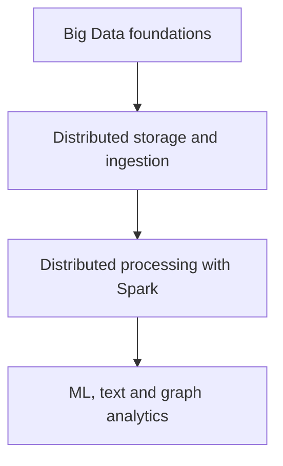
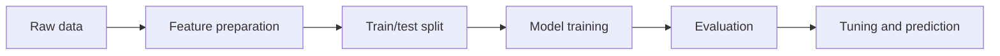

# DADS6002: Big Data Analytics — Course Syllabus Master Note

> รายวิชา: วธวข. 6002 การวิเคราะห์ข้อมูลขนาดใหญ่ (Big Data Analytics)
>
> เอกสารต้นฉบับ: `dads6002_course_syllabus(1).pdf`
>
> ภาคการศึกษา: 1/2569
>
> ผู้สอน: รศ. ดร. สุรพงค์ เอื้อวัฒนามงคล
>
> จำนวนหน่วยกิต: 3 หน่วยกิต (บรรยาย 45 ชั่วโมง)

## 1. ภาพรวมรายวิชา

### จากเอกสาร

DADS6002 เป็นวิชาหลัก/วิชาบังคับของหลักสูตรวิทยาศาสตรมหาบัณฑิต สาขาการวิเคราะห์ข้อมูลและวิทยาการข้อมูล และเกี่ยวข้องกับสาขาวิทยาการคอมพิวเตอร์และระบบสารสนเทศ เรียนในชั้นปีที่ 1 ภาคการศึกษาที่ 1/2569 โดยไม่มีรายวิชาบุพวิชาหรือวิชาที่ต้องเรียนพร้อมกัน (หน้า 1)

จุดมุ่งหมายของรายวิชาคือเรียนรู้กระบวนการทำงาน เครื่องมือ และการประยุกต์ใช้ในการจัดการและวิเคราะห์ข้อมูลขนาดใหญ่ ผู้เรียนต้องเข้าใจและสามารถใช้เครื่องมือ เช่น Hadoop, Hive, HBase, Flume, Sqoop, Kafka, Spark, Spark SQL, MLlib/ML และ GraphX/GraphFrames (หน้า 2)

คำอธิบายรายวิชาครอบคลุม

- ความหมายและคุณลักษณะของ Big Data
- แพลตฟอร์ม Hadoop และ Spark
- การจัดเก็บ อัปโหลด แจกจ่าย และประมวลผลข้อมูลขนาดใหญ่
- HDFS, HBase และฐานข้อมูลแบบ Key-Value, Document และ Graph
- Algorithm สำหรับการวิเคราะห์ข้อมูลบนแพลตฟอร์มต่าง ๆ
- การนำเสนอ Big Data ด้วยภาพ (หน้า 2)

### คำอธิบายเพิ่มเติม

รายวิชานี้เชื่อมองค์ความรู้ 4 ชั้นเข้าด้วยกัน:

1. **Foundations:** เข้าใจว่าเหตุใดข้อมูลบางประเภทจึงต้องใช้ distributed system
2. **Data Engineering:** นำเข้า จัดเก็บ และ query ข้อมูลด้วย Hadoop ecosystem
3. **Distributed Computing:** ประมวลผลด้วย MapReduce และ Spark
4. **Advanced Analytics:** ใช้ Spark ทำ Machine Learning, Text Analytics และ Graph Analytics

ดังนั้นวิชานี้ไม่ได้สอนเพียง “เครื่องมือหลายตัว” แต่กำลังสอนวงจร Big Data ตั้งแต่รับข้อมูลจนถึงสร้างผลวิเคราะห์

---

## 2. Learning Objectives

หลังจบรายวิชา ผู้เรียนควรสามารถ

1. อธิบาย Big Data และเหตุผลที่ต้องใช้ distributed storage/processing ได้
2. เลือกเครื่องมือให้เหมาะกับบทบาท เช่น storage, ingestion, query, processing และ analytics
3. อธิบายสถาปัตยกรรมและการทำงานร่วมกันของ Hadoop, HDFS, YARN และ MapReduce ได้
4. ใช้ Hive/HBase ตามลักษณะข้อมูลและรูปแบบการเข้าถึงที่เหมาะสม
5. แยก batch ingestion, event streaming และการเชื่อมต่อแหล่งข้อมูลได้
6. ใช้แนวคิด Spark และ Spark SQL เพื่อประมวลผล structured data แบบกระจาย
7. อธิบาย workflow ของ Machine Learning บน Spark ได้
8. ประยุกต์ Spark กับข้อความและ graph data ได้
9. วิเคราะห์ trade-off ของเครื่องมือและเลือกสถาปัตยกรรมตามสถานการณ์
10. ทำงานกลุ่ม ค้นคว้า อ้างอิง และนำเสนอผลการวิเคราะห์อย่างมีจริยธรรม

---

## 3. Prerequisite Knowledge

### จากเอกสาร

รายวิชาไม่มี prerequisite อย่างเป็นทางการ (หน้า 1)

### คำอธิบายเพิ่มเติม

เพื่อเรียนได้คล่องควรมีพื้นฐานต่อไปนี้

| พื้นฐาน | ระดับที่ควรมี | เหตุผล |
|---|---|---|
| Python | อ่าน function, loop, collection และ DataFrame ได้ | Spark lab มักใช้ PySpark |
| SQL | SELECT, JOIN, GROUP BY และ window concept | ใช้ต่อยอดใน Hive และ Spark SQL |
| Linux/CLI | path, file, permission และ command พื้นฐาน | Hadoop ecosystem มักทำงานผ่าน terminal |
| Database | schema, table, primary key และ transaction | ช่วยเปรียบเทียบ SQL/NoSQL |
| Statistics/ML | regression, classification, clustering และ evaluation | ใช้ใน Machine Learning with Spark |
| Data Engineering | ETL/ELT, batch, streaming และ data pipeline | ช่วยเชื่อมเครื่องมือแต่ละสัปดาห์ |

สำหรับเป้ จุดแข็งคือ SQL, Power BI, ETL และ data modeling ส่วนที่ควรเตรียมเพิ่มเป็นพิเศษคือ Linux command line, Python DataFrame และ distributed computing terminology

---

## 4. โครงสร้างการเรียนตลอดภาค

### จากเอกสาร

แผนการสอนอยู่ในหน้า 5-6 โดยแต่ละหัวข้อใช้เวลา 3 ชั่วโมง ยกเว้นสัปดาห์สอบ

| สัปดาห์ | หัวข้อ | บทบาทในภาพรวม |
|---:|---|---|
| 1 | Introduction to Big Data | วางรากฐาน Big Data และสถาปัตยกรรม |
| 2 | Hadoop | distributed storage/resource ecosystem |
| 3 | MapReduce Framework | distributed batch processing |
| 4 | Hive | SQL/query layer บนข้อมูลขนาดใหญ่ |
| 5 | HBase | NoSQL wide-column database |
| 6 | Data Ingestion: Sqoop, Flume, Kafka | batch ingestion, log collection และ event streaming |
| 7 | Spark | distributed processing เบื้องต้น |
| 8 | Spark | Spark ต่อเนื่องและการประยุกต์ |
| 9-10 | Midterm Examination | ประเมินเนื้อหาช่วงแรก |
| 11 | Spark SQL | structured data, DataFrame และ SQL |
| 12-14 | Machine Learning with Spark | feature, pipeline, training และ evaluation |
| 15 | Text Analytics with Spark | distributed text processing |
| 16-17 | Graph Analytics with Spark | GraphX/GraphFrames และความสัมพันธ์ |
| 18 | University break week | สัปดาห์ว่างตามสถาบันกำหนด |
| 19-20 | Final Examination | ประเมินเนื้อหาช่วงหลัง/ภาพรวม |

### Concept Map ของเครื่องมือ

| Layer | เครื่องมือใน syllabus | คำถามที่เครื่องมือตอบ |
|---|---|---|
| Storage | HDFS, HBase | ข้อมูลเก็บที่ไหนและเข้าถึงอย่างไร? |
| Resource/processing | Hadoop, MapReduce, Spark | แบ่งงานและประมวลผลหลายเครื่องอย่างไร? |
| Query | Hive, Spark SQL | query structured/semi-structured data อย่างไร? |
| Ingestion | Sqoop, Flume, Kafka | นำข้อมูลจากต้นทางเข้าสู่ platform อย่างไร? |
| Machine Learning | Spark MLlib/ML | สร้าง scalable ML pipeline อย่างไร? |
| Text | Spark text processing | วิเคราะห์ข้อความปริมาณมากอย่างไร? |
| Graph | GraphX, GraphFrames | วิเคราะห์ node/edge และความสัมพันธ์อย่างไร? |

---

## 5. Roadmap ความเข้าใจรายหัวข้อ

### 5.1 Introduction to Big Data

**What:** ความหมาย ประเภทข้อมูล และ 5Vs เช่น Volume, Velocity, Variety, Veracity และ Value

**Why:** ช่วยตัดสินว่าเมื่อใดระบบแบบ single machine หรือ relational database เดิมไม่ตอบโจทย์

**How:** เชื่อม business requirement เช่น latency, scale และ data format กับ architecture

**When to use:** เมื่อต้องออกแบบระบบที่ข้อมูลใหญ่ เร็ว หลากหลาย หรือมีการประมวลผลซับซ้อน

### 5.2 Hadoop และ HDFS

**What:** Hadoop ecosystem รองรับ distributed storage และ processing โดย HDFS แบ่งไฟล์เป็น blocks กระจายไปยัง DataNodes และใช้ NameNode จัดการ metadata

**Why:** เพิ่ม capacity ด้วยการเพิ่มเครื่อง และรองรับ failure ผ่าน replication/กลไกกู้คืน

**Trade-off:** เหมาะกับไฟล์ใหญ่และ batch scan แต่ไม่เหมาะกับ low-latency random row update

### 5.3 MapReduce

**What:** programming model ที่แบ่งงานเป็น Map → Shuffle/Sort → Reduce

**Why:** ทำให้ task หลายตัวประมวลผลข้อมูลคนละส่วนอย่างอิสระและรวมผลภายหลัง

**Likely use:** Word Count, aggregation และ batch transformation

### 5.4 Hive และ HBase

| ประเด็น | Hive | HBase |
|---|---|---|
| ลักษณะ | SQL/query engine และ table abstraction | distributed wide-column NoSQL database |
| งานเด่น | batch analytics, SQL aggregation | random read/write ตาม row key |
| ผู้ใช้ | Analyst/Data Engineer ที่ใช้ SQL | Application/Data Engineer |
| ไม่เหมาะกับ | OLTP latency ต่ำ | ad-hoc complex SQL แบบ warehouse |

เครื่องมือทั้งสองทำงานกับข้อมูลขนาดใหญ่แต่แก้คนละปัญหา จึงไม่ควรจำเพียงว่าเป็น “database บน Hadoop” เหมือนกัน

### 5.5 Data Ingestion

| เครื่องมือ | บทบาทดั้งเดิม | รูปแบบ |
|---|---|---|
| Sqoop | ย้ายข้อมูลระหว่าง RDBMS กับ Hadoop | batch |
| Flume | รวบรวม log/event เข้า Hadoop | continuous collection |
| Kafka | distributed event streaming platform | streaming/event-driven |

**หมายเหตุปัจจุบัน:** Sqoop และ Flume มักพบใน Hadoop legacy stack ส่วน Kafka ยังคงเป็นเทคโนโลยีหลักด้าน event streaming เอกสารทางการอธิบายว่า Kafka รองรับการ publish/subscribe, จัดเก็บ event อย่างทนทาน และประมวลผล event ทั้งแบบทันทีและย้อนหลัง ([Apache Kafka Documentation](https://kafka.apache.org/documentation/))

### 5.6 Spark และ Spark SQL

Spark เป็น distributed processing engine ที่รองรับ workload หลายรูปแบบและเหมาะกับ iterative computation มากกว่า MapReduce ที่เขียนผลกลางลง disk หลายรอบ Spark SQL เพิ่ม structured APIs เช่น DataFrame และ SQL

ควรเข้าใจคำศัพท์:

- Driver และ Executor
- Transformation และ Action
- Lazy Evaluation
- Partition
- Shuffle
- Cache/Persist
- DataFrame และ Schema

### 5.7 Machine Learning with Spark

เนื้อหา 3 สัปดาห์บ่งชี้ว่าเป็นช่วงสำคัญของรายวิชา (หน้า 5) ควรเข้าใจทั้ง algorithm และ pipeline:

Spark MLlib เป็น scalable machine learning library และทำงานร่วมกับ Spark APIs ได้ ([Apache Spark MLlib](https://spark.apache.org/mllib/))

### 5.8 Text Analytics และ Graph Analytics

Text Analytics อาจครอบคลุม tokenization, normalization, feature extraction เช่น TF-IDF และการสร้างโมเดลจากข้อความ ส่วน Graph Analytics สนใจ node, edge, path, community และความสัมพันธ์ เช่น

- PageRank
- Connected Components
- Community/relationship analysis
- Friend recommendation

GraphX เป็น graph processing API ของ Spark ส่วน GraphFrames ใช้แนวคิด DataFrame แทน vertices และ edges

---

## 6. ผลลัพธ์การเรียนรู้และวิธีสอน

### จากเอกสาร

รายวิชาใช้การบรรยาย การอภิปราย ระดมสมอง กรณีศึกษา และโครงงาน เน้นผู้เรียนเป็นศูนย์กลาง (หน้า 2-4) ผลลัพธ์ครอบคลุม

1. **คุณธรรมและจริยธรรม:** ซื่อสัตย์ ตรงเวลา รับผิดชอบ เคารพความคิดเห็น และอ้างอิงเอกสารถูกต้อง
2. **ความรู้:** เข้าใจหลักการ วิเคราะห์ปัญหา เลือกเครื่องมือ ออกแบบและประยุกต์ระบบ
3. **ทักษะทางปัญญา:** คิดอย่างมีวิจารณญาณ สืบค้น ตีความ และแก้ปัญหาอย่างสร้างสรรค์
4. **ความสัมพันธ์และความรับผิดชอบ:** ทำงานกลุ่ม สื่อสาร รับบทผู้นำ/ผู้ตาม และรับผิดชอบงานส่วนตน
5. **การวิเคราะห์และเทคโนโลยี:** ใช้เครื่องมือปัจจุบัน วิเคราะห์เชิงตัวเลข และนำเสนออย่างเหมาะสม

### ผลต่อการเรียนจริง

การสอบวัดความรู้เชิงแนวคิดเป็นหลัก แต่คะแนนงานกลุ่มวัดการประยุกต์ การค้นคว้า การอ้างอิง และการนำเสนอ ดังนั้นควรเตรียมทั้งสองมิติ ไม่ควรอ่านจำ architecture โดยไม่เคยทดลองข้อมูลจริง

---

## 7. การประเมินผล

### จากเอกสาร

| การประเมิน | ช่วงเวลา | สัดส่วน |
|---|---|---:|
| สอบกลางภาค | สัปดาห์ 9-10 | 40% |
| สอบปลายภาค | สัปดาห์ 19-20 | 40% |
| กรณีศึกษา การค้นคว้า รายงาน งานกลุ่ม การนำเสนอ และงานที่มอบหมาย | ตลอดภาค | 20% |
| การเข้าชั้นเรียนและมีส่วนร่วม | ตลอดภาค | ระบุเป็นวิธีประเมิน แต่ไม่ได้แยกเปอร์เซ็นต์เพิ่มเติม |

ข้อมูลนี้ปรากฏในหน้า 6 และสอดคล้องกับหน้า 2 ที่แบ่ง Assessment of Academic Knowledge 80% และ Assigned Tasks 20%

### วิเคราะห์น้ำหนักคะแนน

รายวิชานี้เป็น **exam-heavy** เพราะข้อสอบรวม 80% ความเสี่ยงสำคัญคือการทำ project ได้ดีแต่ตอบข้อสอบเชิงสถาปัตยกรรมและการเปรียบเทียบไม่ได้

สมมติคะแนนงาน 18/20:

- หากสอบรวมได้ 48/80 คะแนนรวมจะเป็น 66/100
- หากต้องการ 80/100 ต้องสอบรวมอย่างน้อย 62/80
- จึงควรสะสมความเข้าใจรายสัปดาห์ ไม่รออ่านก่อนสอบ

---

## 8. Likely Exam Focus

ส่วนนี้อนุมานจากแผนการสอน น้ำหนักสอบ และจำนวนสัปดาห์ ไม่ใช่ข้อมูลข้อสอบจริง

### Midterm Focus

คาดว่าจะเน้นสัปดาห์ 1-8:

- ความหมายและ 5Vs ของ Big Data
- Hadoop architecture และ distributed computing principles
- HDFS: block, replication, NameNode/DataNode
- YARN และการจัดสรร resource
- MapReduce flow และ key/value
- Hive vs HBase
- Sqoop vs Flume vs Kafka
- Spark fundamentals

### Final Focus

คาดว่าจะเน้นสัปดาห์ 11-17 และอาจเชื่อมพื้นฐานช่วงแรก:

- Spark SQL, DataFrame และ structured processing
- Transformation, Action, Lazy Evaluation, Partition และ Shuffle
- ML pipeline: features, train/test, model, evaluation และ tuning
- Classification, regression และ clustering ในบริบท distributed ML
- Text Analytics workflow
- Graph terminology และ algorithms
- การเลือกเครื่องมือตาม scenario

### รูปแบบคำถามที่ควรเตรียม

1. **Definition:** อธิบายศัพท์และ component
2. **Process:** ไล่ flow เช่น MapReduce หรือ Spark execution
3. **Comparison:** Hive vs HBase, batch vs streaming, MapReduce vs Spark
4. **Architecture:** ระบุ component และหน้าที่
5. **Scenario:** เลือกเครื่องมือและให้เหตุผล
6. **Code interpretation:** อ่าน Spark SQL/DataFrame หรือ ML pipeline

กรอบตอบคำถามอธิบายที่ควรใช้คือ **What → Why → How → Limitation/Use Case**

---

## 9. Common Misconceptions

| ความเข้าใจผิด | ความเข้าใจที่ถูกต้อง |
|---|---|
| Big Data คือข้อมูลใหญ่เพียงอย่างเดียว | ต้องพิจารณาความเร็ว ความหลากหลาย คุณภาพ และคุณค่าด้วย |
| Hadoop คือ database | Hadoop เป็น ecosystem/framework; HDFS เป็น file system และมีเครื่องมืออื่นประกอบ |
| Hive และ HBase ใช้แทนกันได้ | Hive เด่นด้าน batch SQL analytics; HBase เด่นด้าน random read/write ตาม key |
| Kafka คือเครื่องมือ copy file เข้า Hadoop เท่านั้น | Kafka เป็น distributed event streaming platform ที่จัดเก็บและกระจาย event |
| Spark เก็บทุกอย่างใน memory เสมอ | Spark ใช้ memory อย่างมีประสิทธิภาพ แต่สามารถ spill และอ่าน/เขียน disk ได้ |
| Spark SQL ใช้ได้เฉพาะ SQL string | ใช้ได้ทั้ง SQL และ DataFrame/Dataset APIs |
| MLlib ทำให้ข้อมูลไม่ต้อง clean | distributed ML ยังต้องการ data quality และ feature engineering |
| Graph Analytics คือการวาดกราฟ | เป็นการวิเคราะห์โครงสร้าง node-edge และความสัมพันธ์ ไม่ใช่ data visualization อย่างเดียว |
| เรียนเครื่องมือครบเท่ากับออกแบบระบบได้ | ต้องเลือกเครื่องมือตาม access pattern, latency, scale และ trade-off |

---

## 10. กลยุทธ์การเรียนและเตรียมสอบ

### ระหว่างภาค

1. หลังแต่ละสัปดาห์สร้างสรุปหนึ่งหน้า: component, flow, strength, limitation และ use case
2. วาด architecture จากความจำโดยไม่เปิด slide
3. ทำตารางเปรียบเทียบเครื่องมือที่แก้ปัญหาใกล้กัน
4. ทดลอง code สั้น ๆ โดยเน้นว่าแต่ละบรรทัดทำอะไรกับ partition/dataflow
5. ฝึกตอบ scenario ว่า “เลือกอะไร เพราะอะไร และไม่เลือกอะไร”

### ก่อนกลางภาค

- ทบทวนเส้นทาง Data Source → Ingestion → HDFS/HBase → Hive/Spark
- ไล่ MapReduce Word Count ด้วยมือ
- จำบทบาท NameNode, DataNode, ResourceManager, NodeManager และ ApplicationMaster
- ฝึกเปรียบเทียบ Hive/HBase และ Sqoop/Flume/Kafka

### ก่อนปลายภาค

- ฝึก Spark DataFrame operations และ Spark SQL
- วาด ML pipeline จาก raw data ถึง evaluation
- ทบทวน metric ของ regression/classification/clustering ตามที่เรียนจริง
- แยก text feature ออกจาก graph feature
- ฝึก scenario ที่ต้องเลือก Spark SQL, MLlib หรือ GraphFrames

---

## 11. Practice Questions

### Recall

1. รายวิชานี้มีคะแนนสอบรวมกี่เปอร์เซ็นต์?
2. เครื่องมือใดใน syllabus ใช้สำหรับ distributed event streaming?
3. สัปดาห์ใดเรียน Spark SQL?
4. Machine Learning with Spark เรียนกี่สัปดาห์?

### Explain and Compare

5. อธิบายเหตุผลที่รายวิชาสอน Hadoop ก่อน Spark
6. เปรียบเทียบ Hive กับ HBase ตาม data access pattern
7. เปรียบเทียบ Sqoop, Flume และ Kafka
8. อธิบายว่า Spark SQL เชื่อม Data Engineering กับ Analytics อย่างไร

### Apply and Analyze

9. ระบบต้องนำข้อมูลจาก relational database เข้า Hadoop ทุกคืน ควรเลือกเครื่องมือใดใน syllabus และเพราะเหตุใด?
10. ระบบต้องรับ event การสั่งซื้ออย่างต่อเนื่องและให้ consumer หลายระบบอ่านได้ ควรเลือกอะไร?
11. ถ้าต้องวิเคราะห์ความสัมพันธ์ระหว่างลูกค้าและสินค้า ควรแทนข้อมูลเป็น node/edge อย่างไร?
12. นักศึกษาได้คะแนนงาน 16/20 และต้องการคะแนนรวม 75 ต้องได้คะแนนสอบรวมอย่างน้อยเท่าใดจาก 80?

### Model Answers with Reasoning

1. **80%** แบ่งกลางภาค 40% และปลายภาค 40% (หน้า 6)
2. **Kafka** เพราะออกแบบสำหรับ publish, subscribe และจัดเก็บ event stream
3. **สัปดาห์ 11** หลังกลางภาค (หน้า 5)
4. **3 สัปดาห์** คือสัปดาห์ 12-14 แสดงว่าเป็นหัวข้อที่มีน้ำหนักเนื้อหาสูง
5. Hadoop สร้างพื้นฐาน distributed storage, resource และ batch processing ทำให้เข้าใจปัญหาที่ Spark ปรับปรุง เช่น iterative processing และการลดการเขียน intermediate data ซ้ำ
6. Hive เหมาะกับ SQL analytics และ scan/aggregate ข้อมูลจำนวนมาก ส่วน HBase เหมาะกับ random read/write ด้วย row key ควรเลือกจาก access pattern ไม่ใช่ชื่อว่าอยู่บน Hadoop เหมือนกัน
7. Sqoop เหมาะกับ batch transfer ระหว่าง RDBMS/Hadoop; Flume เด่นด้านรวบรวม log/event; Kafka เป็น event streaming platform ที่รองรับ producers/consumers และ durable topics
8. Spark SQL ให้ Data Engineer สร้าง transformation ด้วย DataFrame/SQL และส่งต่อข้อมูล structured ให้ analytics/ML pipeline บน engine เดียวกัน
9. **Sqoop** ตามบริบทเครื่องมือดั้งเดิมใน syllabus เพราะออกแบบสำหรับ bulk transfer ระหว่าง relational database กับ Hadoop; ในระบบสมัยใหม่อาจใช้ CDC/connector อื่นตาม platform
10. **Kafka** เพราะแยก producer กับ consumer และรองรับ topic partitions สำหรับ scale
11. อาจกำหนดลูกค้าและสินค้าเป็น vertices สองประเภท และการซื้อ/ดูสินค้าเป็น edges พร้อม attributes เช่นเวลา จำนวน และมูลค่า จากนั้นใช้ graph algorithms วิเคราะห์ community หรือ recommendation
12. ต้องได้ **59/80** เพราะคะแนนที่ต้องเพิ่มคือ `75 - 16 = 59`

---

## 12. Key Takeaways

1. วิชานี้ครอบคลุม Big Data ตั้งแต่ storage และ ingestion ถึง ML, text และ graph analytics
2. Hadoop/HDFS/MapReduce เป็นรากฐานเพื่อเข้าใจ distributed system ก่อนต่อยอด Spark
3. Hive, HBase, Sqoop, Flume และ Kafka มีบทบาทต่างกัน ต้องเลือกตาม workload
4. Spark เป็นแกนกลางช่วงหลัง โดยเชื่อม Spark SQL, MLlib, Text Analytics และ Graph Analytics
5. คะแนนสอบรวม 80% จึงต้องฝึกอธิบาย architecture, process, comparison และ scenario อย่างเป็นระบบ
6. งาน 20% วัดการค้นคว้า การประยุกต์ การทำงานกลุ่ม การอ้างอิง และการนำเสนอ
7. ไม่มี prerequisite อย่างเป็นทางการ แต่ Python, SQL, Linux และ ML fundamentals ช่วยลดภาระการเรียนอย่างมาก

---

## 13. Glossary

| คำศัพท์ | ความหมายย่อ |
|---|---|
| Big Data | ข้อมูลที่ scale, speed หรือ complexity ต้องใช้แนวทางจัดการเฉพาะ |
| Distributed System | ระบบที่หลายเครื่องทำงานร่วมกัน |
| Hadoop | ecosystem สำหรับ distributed storage/resource/processing |
| HDFS | distributed file system ของ Hadoop |
| MapReduce | model สำหรับ map, shuffle/sort และ reduce |
| Hive | SQL/table abstraction สำหรับข้อมูลบน distributed storage |
| HBase | distributed wide-column NoSQL database |
| Sqoop | เครื่องมือ batch transfer ระหว่าง RDBMS กับ Hadoop แบบดั้งเดิม |
| Flume | เครื่องมือเก็บ log/event เข้า Hadoop แบบดั้งเดิม |
| Kafka | distributed event streaming platform |
| Spark | distributed multi-purpose data processing engine |
| Spark SQL | module สำหรับ structured data และ SQL/DataFrame |
| MLlib | scalable machine learning library ของ Spark |
| GraphX | graph processing API ของ Spark |
| GraphFrames | graph processing ที่แทน vertices/edges ด้วย DataFrames |
| Partition | หน่วยแบ่งข้อมูลเพื่อประมวลผลแบบขนาน |
| Shuffle | การกระจายข้อมูลใหม่ระหว่าง partitions ตาม key/operation |

---

## 14. ตำราและ References

### จากเอกสาร (หน้า 6)

1. Benjamin Bengfort and Jenny Kim, *Data Analytics with Hadoop*, O'Reilly
2. Tom White, *Hadoop: The Definitive Guide — Storage and Analysis at Internet Scale*, O'Reilly
3. Wenqiang Feng, *Learning Apache Spark with Python*, 5 December 2021
4. Bill Chambers and Matei Zaharia, *Spark: The Definitive Guide — Big Data Processing Made Simple*, O'Reilly

### เอกสารทางการเพิ่มเติม

- [Apache Hadoop Documentation](https://hadoop.apache.org/docs/current/)
- [Apache Hadoop YARN Architecture](https://hadoop.apache.org/docs/current/hadoop-yarn/hadoop-yarn-site/YARN.html)
- [Apache Spark Documentation](https://spark.apache.org/documentation)
- [Apache Spark MLlib](https://spark.apache.org/mllib/)
- [Apache Kafka Documentation](https://kafka.apache.org/documentation/)

---

## 15. ขอบเขตที่เสริมจากภายนอกเอกสาร

หัวข้อต่อไปนี้เป็นคำอธิบายเพิ่มเติมเพื่อเชื่อม syllabus กับการเรียนจริง ไม่ได้ระบุรายละเอียดทั้งหมดใน PDF:

- การจัดกลุ่มเนื้อหาเป็น storage, ingestion, processing, query และ analytics layers
- Prerequisite ที่ควรเตรียมแม้รายวิชาไม่บังคับ
- What/Why/How/When และ trade-off ของเครื่องมือแต่ละกลุ่ม
- บริบทปัจจุบันของ Sqoop/Flume เทียบกับ Kafka
- คำศัพท์ Driver, Executor, Transformation, Action, Lazy Evaluation, Partition และ Shuffle
- ML pipeline, Text Analytics และ Graph Analytics use cases
- กลยุทธ์เตรียมสอบจากน้ำหนักคะแนน 80%
- Common misconceptions และ scenario-based practice questions
- การเชื่อมกับพื้นฐาน Data Engineering และเส้นทาง DP-700/Microsoft Fabric
