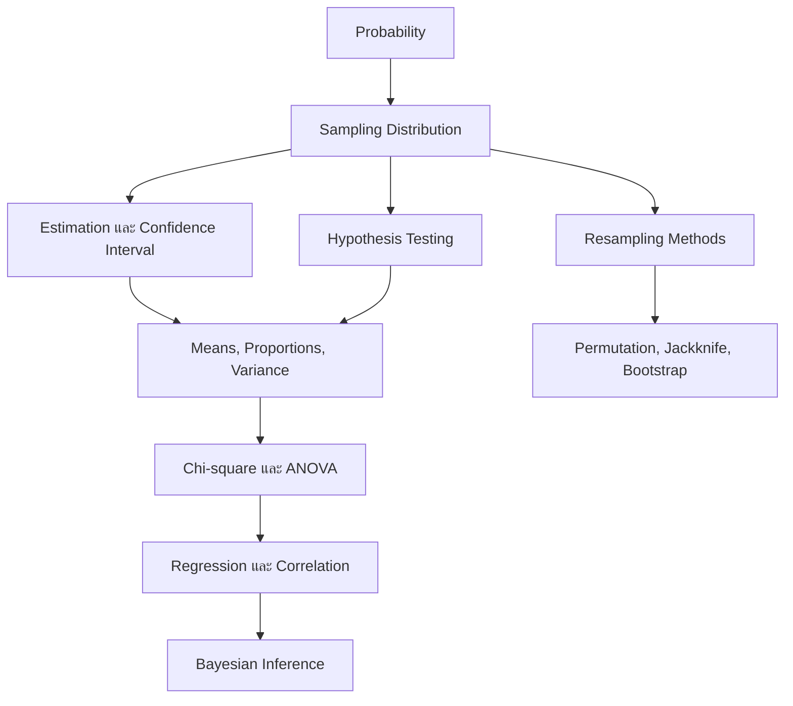

# DADS6001: Applied Modern Statistical Analysis — Course Syllabus

> **รายวิชา:** DADS6001 Applied Modern Statistical Analysis  
> **ผู้สอน:** Asst. Prof. Dr. Ramidha Srihera  
> **แหล่งข้อมูลหลัก:** `dads6001_course_syllabus(1).pptx` (5 slides)  
> **สถานที่เรียน:** Lab 4 ชั้น 10 อาคารสยาม  
> **วันเรียน:** วันเสาร์

## 1. ภาพรวมรายวิชา

DADS6001 เป็นรายวิชาที่เชื่อม **Probability** เข้ากับ **Statistical Inference** และต่อยอดไปสู่เทคนิควิเคราะห์ข้อมูลสมัยใหม่ เนื้อหาเริ่มจากความน่าจะเป็นและการแจกแจงของตัวอย่าง ก่อนเข้าสู่การประมาณค่า การสร้างช่วงความเชื่อมั่น และการทดสอบสมมติฐาน จากนั้นจึงขยายไปสู่ ANOVA, Chi-squared test, Regression, computationally intensive statistics และ Bayesian inference (จากเอกสาร: Slide 1)

แก่นของวิชาไม่ใช่เพียงการจำสูตร แต่คือการตอบคำถามว่า:

1. ข้อมูลที่มีเป็น **sample** จาก population ใด
2. ต้องการประมาณหรือทดสอบ **parameter** อะไร
3. ควรใช้วิธีทางสถิติใดภายใต้ assumptions แบบใด
4. ผลลัพธ์มีความหมายอย่างไรในบริบทของปัญหา
5. หาก assumptions แบบดั้งเดิมไม่เหมาะสม จะใช้ resampling หรือ Bayesian approach อย่างไร

## 2. Learning Objectives

เมื่อเรียนจบรายวิชา ผู้เรียนควรสามารถ:

- อธิบาย Probability, random variable, probability distribution และ sampling distribution ได้
- อธิบาย Central Limit Theorem และบทบาทต่อ Statistical Inference ได้
- ประมาณค่า population parameter ด้วย point estimate และ confidence interval
- ตั้งสมมติฐาน เลือก test statistic และตีความผล hypothesis test ได้อย่างถูกต้อง
- เลือกวิธีอนุมานสำหรับ mean, proportion, variance และ correlation ได้
- วิเคราะห์ความแตกต่างของหลายกลุ่มด้วย one-way และ multi-way ANOVA
- วิเคราะห์ความสัมพันธ์ด้วย regression และ correlation analysis
- ใช้ Chi-squared test กับข้อมูล categorical ตามวัตถุประสงค์ที่เหมาะสม
- อธิบายและประยุกต์ permutation, jackknife และ bootstrap ได้
- เข้าใจภาพรวมของ Markov chain, Monte Carlo methods และ Bayesian inference
- แปลผลทางสถิติให้เป็นข้อสรุปเชิงข้อมูล โดยไม่สรุปเกินกว่าหลักฐานรองรับ

## 3. ความหมายของ Statistics และ Statistic

### 3.1 Statistics

เอกสารนิยาม **Statistics** ว่าเป็นศาสตร์และศิลป์ของการออกแบบการศึกษาและวิเคราะห์ข้อมูลที่เกิดจากการศึกษา เป้าหมายสูงสุดคือการแปลงข้อมูลให้เป็นความรู้และความเข้าใจต่อสิ่งรอบตัว หรือสรุปสั้น ๆ ว่า **the art and science of learning from data** (จากเอกสาร: Slide 5)

Statistics จึงครอบคลุมมากกว่าการคำนวณค่าเฉลี่ย เพราะรวมถึง:

- การตั้งคำถามและออกแบบการเก็บข้อมูล
- การเลือก sample ให้เป็นตัวแทนของ population
- การตรวจสอบคุณภาพและ assumptions ของข้อมูล
- การเลือกวิธีวิเคราะห์
- การตีความผลลัพธ์พร้อมอธิบาย uncertainty
- การสื่อสารข้อค้นพบเพื่อใช้ตัดสินใจ

### 3.2 Statistic

**Statistic** คือค่าที่คำนวณจากข้อมูลตัวอย่าง หรือเขียนในรูปฟังก์ชัน

$$
T(X_1,X_2,\ldots,X_n)
$$

ตัวอย่าง statistic ได้แก่ sample mean $\bar{x}$, sample proportion $\hat{p}$, sample variance $s^2$ และ correlation coefficient $r$

ควรแยกคำว่า **statistic** ออกจาก **parameter**:

| ประเด็น | Statistic | Parameter |
|---|---|---|
| แหล่งข้อมูล | Sample | Population |
| สถานะ | คำนวณได้จากตัวอย่าง | มักไม่ทราบค่า |
| ตัวอย่าง | $\bar{x},\hat p,s^2,r$ | $\mu,p,\sigma^2,\rho$ |
| บทบาท | ใช้ประมาณ parameter | ค่าที่ต้องการศึกษา |

ตัวอย่างเช่น หากต้องการทราบค่าใช้จ่ายเฉลี่ยของประชากรทั้งหมด แต่เก็บข้อมูลได้เพียง 200 คน เราจะใช้ $\bar{x}$ จาก sample เพื่อประมาณ $\mu$ ของ population

## 4. Descriptive Statistics และ Inferential Statistics

เอกสารแบ่ง Statistical Analysis เป็นสองกลุ่มหลัก (จากเอกสาร: Slide 5)

### 4.1 Descriptive Statistics

เป็นวิธีสรุปข้อมูลที่เก็บมาแล้วด้วยตัวเลขหรือกราฟ เช่น ค่าเฉลี่ย ร้อยละ ตารางแจกแจงความถี่ histogram และ boxplot

คำถามที่ตอบได้ เช่น:

- ยอดขายเฉลี่ยของ sample เท่าใด
- สาขาใดมีจำนวน transaction สูงที่สุดในชุดข้อมูล
- การกระจายของระยะเวลารอคอยมีลักษณะอย่างไร

ผลสรุปจำกัดอยู่กับข้อมูลที่สังเกตได้ และยังไม่ใช่การกล่าวอ้างถึง population

### 4.2 Inferential Statistics

เป็นวิธีใช้ข้อมูลจาก sample เพื่อตัดสินใจ คาดการณ์ หรืออนุมานเกี่ยวกับ population เช่น confidence interval, hypothesis testing, ANOVA และ regression

ตัวอย่างเช่น จากตัวอย่างลูกค้า 500 คน เราอาจประมาณสัดส่วนความพึงพอใจของลูกค้าทั้งหมด พร้อมระบุ margin of error แทนการรายงานเพียงร้อยละของ sample

| ประเด็น | Descriptive | Inferential |
|---|---|---|
| เป้าหมาย | สรุปข้อมูลที่มี | อนุมานจาก sample ไปยัง population |
| ผลลัพธ์ | ตาราง กราฟ ค่าเฉลี่ย ร้อยละ | Estimate, confidence interval, p-value, prediction |
| Uncertainty | อาจไม่ได้วัดโดยตรง | ต้องคำนึงถึง sampling uncertainty |
| ตัวอย่างคำถาม | ข้อมูลชุดนี้มีค่าเฉลี่ยเท่าใด | ค่าเฉลี่ยประชากรน่าจะอยู่ในช่วงใด |

## 5. แผนที่เนื้อหาของรายวิชา

ลำดับนี้สะท้อนว่า Probability และ Sampling Distribution เป็นฐานของเกือบทุกหัวข้อหลังจากนั้น หากยังไม่เข้าใจ random variable, expected value, variance, standard error และ Central Limit Theorem จะทำให้ confidence interval และ hypothesis testing กลายเป็นเพียงการจำสูตร

## 6. ตารางเรียน

### 6.1 ครึ่งแรกของภาคการศึกษา

| วันที่ | หัวข้อ | Chapter/Session ตามสไลด์ |
|---|---|---:|
| 8 ส.ค. 2026 | Introduction to Probability and Sampling Distribution | 5 & 6 |
| 15 ส.ค. 2026 | Basic Concept of Estimation and Constructing Confidence Interval | 8.1, 8.2, 8.3 |
| 22 ส.ค. 2026 | Constructing Confidence Interval (ต่อ) | 8.1, 8.2, 8.3 |
| 29 ส.ค. 2026 | Jackknife and Bootstrap Methods | 8.5 |
| 5 ก.ย. 2026 | Basic Concept of Hypothesis Testing: One Population Mean | 9.1, 9.3, 9.4 |
| 12 ก.ย. 2026 | Hypothesis Testing: Two Population Means | 10.2 |
| 19 ก.ย. 2026 | Hypothesis Testing: Two Population Means (ต่อ) | 10.3, 11.5 |
| 26 ก.ย. 2026 | Permutation | 10.4 |
| 3–16 ต.ค. 2026 | Midterm Examination | — |

ที่มา: Slide 3

### 6.2 ครึ่งหลังของภาคการศึกษา

| วันที่ | หัวข้อ | Chapter/Session ตามสไลด์ |
|---|---|---:|
| 17 ต.ค. 2026 | Hypothesis Testing: One/Two Population Proportion(s) | 9.2 |
| 24 ต.ค. 2026 | Chi-squared Test | 11.2, 11.3 |
| 31 ต.ค. 2026 | One-way & Multi-way ANOVA | 12 |
| 7 พ.ย. 2026 | One-way & Multi-way ANOVA (ต่อ) | 12 |
| 14 พ.ย. 2026 | Basic Concept of Regression Analysis | 14 |
| 21 พ.ย. 2026 | Regression Analysis (ต่อ) | 14 |
| 28 พ.ย. 2026 | Introduction to Bayesian Inference | ไม่ระบุ |
| 12–25 ธ.ค. 2026 | Final Examination | — |

ที่มา: Slide 4

> **ข้อสังเกต:** Course description กล่าวถึง inference for variance and correlation รวมถึง Markov chain และ Monte Carlo methods แต่ตารางเรียนไม่ได้แยกหัวข้อเหล่านี้เป็นรายสัปดาห์อย่างชัดเจน จึงอาจสอดแทรกอยู่ในหัวข้ออื่นหรือปรับตามเวลาสอน ไม่ควรสรุปเองว่าเป็นหัวข้อสอบจนกว่าผู้สอนจะยืนยัน

## 7. การวัดผล

| องค์ประกอบ | สัดส่วน |
|---|---:|
| Midterm Examination | 30% |
| Final Examination | 30% |
| Assignments & Others | 40% |
| **รวม** | **100%** |

ที่มา: Slide 2

Assignments & Others มีน้ำหนักมากที่สุดที่ 40% จึงควรทำโจทย์และงานระหว่างภาคอย่างต่อเนื่อง การอ่านเฉพาะก่อนสอบไม่เพียงพอ เพราะทักษะสำคัญของวิชานี้คือการเลือกวิธี คำนวณ และตีความผลซ้ำ ๆ จนเห็นโครงสร้างร่วมของแต่ละการทดสอบ

## 8. แนวคิดสำคัญที่แต่ละช่วงกำลังสร้าง

### 8.1 Probability และ Sampling Distribution

Probability เป็นภาษาที่ใช้อธิบาย uncertainty ส่วน sampling distribution อธิบายว่า statistic เช่น $\bar X$ จะเปลี่ยนแปลงอย่างไรเมื่อสุ่มตัวอย่างซ้ำ ๆ ความเข้าใจส่วนนี้นำไปสู่ standard error, confidence interval และ hypothesis test

### 8.2 Estimation และ Confidence Interval

- **Point estimate:** ใช้ statistic หนึ่งค่าเพื่อประมาณ parameter
- **Interval estimate:** ให้ช่วงค่าที่เป็นไปได้พร้อมระดับความเชื่อมั่น
- **Standard error:** วัดความแปรปรวนของ statistic ระหว่าง sample

Confidence interval ไม่ได้หมายความว่า “parameter มีโอกาส 95% อยู่ในช่วงที่คำนวณได้” ภายใต้กรอบ frequentist parameter ถือเป็นค่าคงที่ ส่วน 95% กล่าวถึงกระบวนการสร้างช่วงที่ครอบคลุม parameter ในระยะยาว

### 8.3 Hypothesis Testing

โครงสร้างร่วมของการทดสอบสมมติฐานคือ:

1. ระบุ $H_0$ และ $H_1$
2. กำหนดระดับนัยสำคัญ $\alpha$
3. เลือก test statistic ให้เหมาะกับข้อมูลและ assumptions
4. คำนวณ test statistic และ p-value
5. เปรียบเทียบ p-value กับ $\alpha$
6. สรุปผลในบริบทของโจทย์

การที่ p-value ต่ำไม่ได้บอกว่า effect มีขนาดใหญ่ และ p-value ไม่ใช่ความน่าจะเป็นที่ $H_0$ เป็นจริง

### 8.4 Resampling Methods

- **Bootstrap:** สุ่มซ้ำแบบคืนที่จาก sample เพื่อประมาณ sampling distribution, standard error หรือ confidence interval
- **Jackknife:** ตัด observation ออกครั้งละหนึ่งค่าแล้วคำนวณ statistic ใหม่ เหมาะกับการประเมิน bias และ variance ของ estimator บางชนิด
- **Permutation test:** สลับ label ภายใต้ $H_0$ เพื่อสร้าง null distribution และประเมินว่าความแตกต่างที่พบสุดโต่งเพียงใด

วิธีเหล่านี้มีประโยชน์เมื่อสูตรเชิงทฤษฎีซับซ้อนหรือ assumptions ของวิธี parametric ไม่เหมาะ แต่ไม่ได้ทำให้ข้อจำกัดด้าน sample quality และ study design หายไป

### 8.5 Chi-squared Test และ ANOVA

- Chi-squared test มักใช้กับ count/frequency ของข้อมูล categorical เช่น goodness-of-fit หรือ test of independence
- ANOVA ใช้เปรียบเทียบค่าเฉลี่ยตั้งแต่สามกลุ่มขึ้นไป โดยทดสอบภาพรวมก่อนพิจารณาการเปรียบเทียบรายคู่
- Multi-way ANOVA วิเคราะห์หลาย factors พร้อมกันและสามารถพิจารณา interaction ได้

### 8.6 Regression และ Correlation

Correlation วัดทิศทางและความแข็งแรงของความสัมพันธ์ ขณะที่ regression สร้างแบบจำลองความสัมพันธ์ระหว่าง outcome กับ predictors เพื่ออธิบายหรือพยากรณ์ ค่าสหสัมพันธ์สูงไม่ยืนยัน causation และ regression coefficient ต้องตีความโดยคงตัวแปรอื่นในแบบจำลองให้คงที่

### 8.7 Bayesian Inference

Bayesian inference ปรับความเชื่อเกี่ยวกับ parameter จาก prior distribution ด้วยข้อมูลผ่าน likelihood แล้วได้ posterior distribution:

$$
p(\theta\mid x) \propto p(x\mid\theta)p(\theta)
$$

หัวข้อนี้ต่างจาก frequentist inference ตรงที่ parameter ถูกแทนด้วย distribution และสามารถกล่าวถึง posterior probability ของ parameter ได้โดยตรงภายใต้ model และ prior ที่กำหนด

## 9. Prerequisite Checklist

ก่อนเรียนแต่ละบท ควรทบทวน:

- พีชคณิตพื้นฐาน สมการ เลขยกกำลัง logarithm และ summation notation
- Mean, median, variance และ standard deviation
- Set, event, conditional probability และ independence
- Random variable และ distribution สำคัญ เช่น Binomial, Normal, $t$ และ Chi-square
- Standardization และ z-score
- Population, sample, parameter, statistic และ sampling bias
- การอ่านตาราง กราฟ distribution และการตีความพื้นที่ใต้โค้ง
- การใช้เครื่องมือวิเคราะห์ เช่น Excel, R หรือ Python ตามที่ผู้สอนกำหนด

## 10. แนวทางเลือกวิธีวิเคราะห์เบื้องต้น

| คำถาม | ลักษณะข้อมูล | วิธีที่น่าพิจารณา |
|---|---|---|
| ค่าเฉลี่ยประชากรต่างจากค่ามาตรฐานหรือไม่ | Numeric, 1 sample | One-sample mean test |
| ค่าเฉลี่ยสองกลุ่มต่างกันหรือไม่ | Numeric, 2 groups | Two-sample/paired mean test |
| ค่าเฉลี่ยตั้งแต่สามกลุ่มต่างกันหรือไม่ | Numeric, 3+ groups | ANOVA |
| สัดส่วนต่างจากค่ามาตรฐานหรือไม่ | Binary/categorical, 1 sample | One-proportion test |
| สัดส่วนสองกลุ่มต่างกันหรือไม่ | Binary/categorical, 2 groups | Two-proportion test |
| ตัวแปร categorical สองตัวสัมพันธ์กันหรือไม่ | Frequency table | Chi-squared test of independence |
| ตัวแปร numeric สัมพันธ์กันอย่างไร | Numeric variables | Correlation/regression |
| ต้องการ SE/CI แต่สูตรยากหรือไม่มั่นใจ distribution | Resample-able observations | Bootstrap |
| ต้องการทดสอบความแตกต่างโดยสร้าง null distribution | Exchangeable labels under $H_0$ | Permutation test |

ตารางนี้เป็นเพียงจุดเริ่มต้น การเลือกวิธีจริงต้องตรวจ study design, independence, distribution, sample size, measurement scale และ assumptions ของแต่ละวิธีด้วย

## 11. Common Misconceptions

1. **Statistics กับ statistic คือคำเดียวกัน** — Statistics คือศาสตร์ ส่วน statistic คือค่าที่คำนวณจาก sample
2. **Descriptive statistics ใช้สรุปถึง population ได้ทันที** — การอนุมานต้องพิจารณาวิธีสุ่มและ sampling uncertainty
3. **95% confidence interval แปลว่า parameter มีโอกาส 95% อยู่ในช่วงนี้** — ไม่ใช่การตีความแบบ frequentist
4. **p-value คือโอกาสที่ $H_0$ เป็นจริง** — p-value คำนวณภายใต้เงื่อนไขว่า $H_0$ เป็นจริง
5. **ไม่ reject $H_0$ เท่ากับพิสูจน์ว่า $H_0$ จริง** — หลักฐานอาจไม่เพียงพอ จึงควรใช้คำว่า fail to reject
6. **Statistical significance เท่ากับ practical significance** — ผลต่างอาจมีนัยสำคัญแต่เล็กเกินกว่าจะมีผลเชิงธุรกิจ
7. **Correlation แสดงเหตุและผล** — association อาจเกิดจาก confounding, reverse causation หรือความบังเอิญ
8. **Bootstrap แก้ sample ที่ลำเอียงได้** — bootstrap จำลองจากข้อมูลที่มี จึงสืบทอด bias และคุณภาพของ sample

## 12. Likely Exam Focus

หัวข้อต่อไปนี้เป็นการอนุมานจาก course description ตารางสอน และน้ำหนักการสอบ ไม่ใช่การเปิดเผยข้อสอบจริง

### Definitions to remember

- Statistics, statistic, population, sample, parameter
- Descriptive versus inferential statistics
- Null and alternative hypotheses
- Confidence level, standard error, p-value และ significance level
- Main assumptions ของ mean test, ANOVA, Chi-square และ regression
- Bootstrap, jackknife และ permutation test

### Processes to explain

- จาก research question ไปสู่การเลือก statistical method
- ขั้นตอนสร้างและตีความ confidence interval
- ขั้นตอน hypothesis testing และการสรุปผลในบริบท
- ความเชื่อมโยง Probability → Sampling Distribution → Inference
- แนวคิดการสร้าง resampling/permutation distribution

### Calculations to perform

- Point estimate และ standard error
- Confidence interval สำหรับ mean หรือ proportion
- Test statistic และ p-value สำหรับหนึ่งหรือสองประชากร
- Expected count และ Chi-square statistic
- ANOVA quantities และการตีความ F-test
- Regression coefficient, prediction และการตีความ model output

### Concepts to compare

- Statistic versus parameter
- Descriptive versus inferential statistics
- Confidence interval versus hypothesis test
- Parametric methods versus resampling methods
- Bootstrap versus permutation test
- Correlation versus regression
- Frequentist versus Bayesian inference

### Scenario-based decisions

โจทย์มีแนวโน้มให้ระบุชนิด outcome, จำนวนกลุ่ม, independence/paired design และเป้าหมายการวิเคราะห์ แล้วเลือกวิธีที่เหมาะสมพร้อมอธิบาย assumptions และการตีความผล

## 13. Practice Questions

### 13.1 Recall

**Q1. Statistics และ statistic ต่างกันอย่างไร?**

**Q2. การวัดผลส่วนใดมีน้ำหนักมากที่สุด และคิดเป็นกี่เปอร์เซ็นต์?**

**Q3. หัวข้อใดเป็นฐานเชื่อมจาก Probability ไปสู่ Statistical Inference?**

### 13.2 Explain

**Q4. เพราะเหตุใดค่าเฉลี่ยจาก sample จึงไม่จำเป็นต้องเท่ากับค่าเฉลี่ย population?**

**Q5. อธิบายว่าทำไม p-value ต่ำจึงไม่ได้แปลว่า effect มีขนาดใหญ่**

### 13.3 Compare

**Q6. เปรียบเทียบ bootstrap กับ permutation test ในด้านวัตถุประสงค์และวิธีสุ่ม**

**Q7. Descriptive statistics และ inferential statistics ให้คำตอบต่างกันอย่างไร?**

### 13.4 Apply

**Q8. ร้านขายยาต้องการตรวจว่าสัดส่วนสาขาที่ผ่าน audit สูงกว่า 80% หรือไม่ ควรเริ่มพิจารณาวิธีใด?**

**Q9. ต้องการเปรียบเทียบยอดขายเฉลี่ยของสาขา 4 รูปแบบ ควรใช้วิธีใด และควรตรวจ assumptions อะไร?**

### 13.5 Analyze

**Q10. ผลทดสอบพบ $p=0.03$ ที่ $\alpha=0.05$ แต่ค่าเฉลี่ยสองกลุ่มต่างกันเพียง 0.2 หน่วย จงสรุปทั้งเชิงสถิติและเชิงปฏิบัติ**

## 14. Model Answers

**A1.** Statistics คือศาสตร์ของการเรียนรู้จากข้อมูล ส่วน statistic คือค่าฟังก์ชันของ observations ใน sample เช่น $\bar{x}$ หรือ $\hat p$

**A2.** Assignments & Others มีน้ำหนักสูงสุด 40% ขณะที่ midterm และ final อย่างละ 30%

**A3.** Sampling distribution โดยเฉพาะแนวคิด standard error และ Central Limit Theorem

**A4.** Sample เป็นเพียงส่วนหนึ่งของ population และแต่ละ sample อาจมีสมาชิกต่างกัน จึงเกิด sampling variability ค่า statistic จึงเปลี่ยนไปตาม sample

**A5.** p-value สะท้อนความเข้ากันได้ของข้อมูลกับ $H_0$ โดยขึ้นกับทั้ง effect size, variability และ sample size จึงไม่ได้วัดขนาดหรือความสำคัญเชิงปฏิบัติของ effect โดยตรง

**A6.** Bootstrap สุ่ม observation แบบคืนที่จาก sample เพื่อประมาณ sampling distribution, SE หรือ CI ส่วน permutation test สลับ group labels ภายใต้ $H_0$ เพื่อสร้าง null distribution สำหรับการทดสอบความแตกต่าง

**A7.** Descriptive statistics สรุปข้อมูลที่สังเกตได้ ส่วน inferential statistics ใช้ sample เพื่อประมาณ ทดสอบ หรือพยากรณ์เกี่ยวกับ population พร้อมจัดการ uncertainty

**A8.** เริ่มจาก one-sample proportion test โดยตั้ง $H_0:p\leq0.80$ และ $H_1:p>0.80$ พร้อมตรวจ sampling design, independence และเงื่อนไขของ normal approximation หรือเลือก exact method หากตัวอย่างเล็ก

**A9.** เริ่มพิจารณา one-way ANOVA เพราะ outcome เป็น numeric และมี 4 groups ควรตรวจ independence, residual normality และ homogeneity of variance หาก design หรือ assumptions ต่างออกไปอาจต้องเลือกวิธีอื่น

**A10.** ที่ระดับ 0.05 มีหลักฐานทางสถิติให้ reject $H_0$ เพราะ $0.03<0.05$ แต่ผลต่าง 0.2 หน่วยอาจไม่มี practical significance ต้องพิจารณา confidence interval, effect size, หน่วยวัด ต้นทุน และบริบทธุรกิจก่อนตัดสินใจ

## 15. Key Takeaways

- วิชานี้วางเส้นทางจาก Probability ไปสู่ Classical Inference, Regression, Resampling และ Bayesian inference
- Sampling distribution เป็นสะพานสำคัญระหว่าง sample statistic กับ population parameter
- ต้องฝึกทั้งการคำนวณ การตรวจ assumptions การเลือกวิธี และการตีความ
- คะแนนงานระหว่างภาค 40% มากกว่าการสอบแต่ละครั้ง จึงควรเรียนและทำโจทย์อย่างต่อเนื่อง
- การได้คำตอบเชิงตัวเลขยังไม่เพียงพอ ต้องแปลผลให้ถูกต้องและไม่สรุปเกินกว่าหลักฐาน

## 16. Glossary

| Term | ความหมาย |
|---|---|
| Population | กลุ่มทั้งหมดที่ต้องการศึกษา |
| Sample | ส่วนหนึ่งของ population ที่นำมาสังเกต |
| Parameter | ค่าคุณลักษณะของ population |
| Statistic | ค่าที่คำนวณจาก sample |
| Estimator | กฎหรือ statistic ที่ใช้ประมาณ parameter |
| Sampling distribution | การแจกแจงของ statistic จากการสุ่มตัวอย่างซ้ำ |
| Standard error | ส่วนเบี่ยงเบนมาตรฐานของ sampling distribution |
| Confidence interval | ช่วงประมาณค่า parameter ตามระดับความเชื่อมั่น |
| Null hypothesis | สมมติฐานตั้งต้นที่ใช้สร้างการแจกแจงอ้างอิง |
| p-value | ความน่าจะเป็นของผลลัพธ์ที่อย่างน้อยสุดโต่งเท่าที่พบ ภายใต้ $H_0$ |
| Resampling | การสุ่มซ้ำจากข้อมูลเพื่อประเมิน distribution หรือทำ inference |
| Posterior | Distribution ของ parameter หลังรวม prior กับข้อมูล |

## 17. References

1. Berenson, M., Levine, D. M., & Krehbiel, T. C. (2012). *Basic Business Statistics: Concepts and Applications* (12th ed.). Pearson.
2. Efron, B., & Hastie, T. (2016). *Computer Age Statistical Inference: Algorithms, Evidence, and Data Science*. Cambridge University Press.
3. Mendenhall, W., & Sincich, T. (1996). *A Second Course in Statistics: Regression Analysis* (5th ed.). Prentice Hall.
4. Weiss, N. A. (2017). *Introductory Statistics* (10th ed., Global Edition). Pearson.
5. Agresti, A., Franklin, C., & Klingenberg, B. (2018). *Statistics: The Art and Science of Learning from Data* (4th ed., Global Edition). Pearson.
