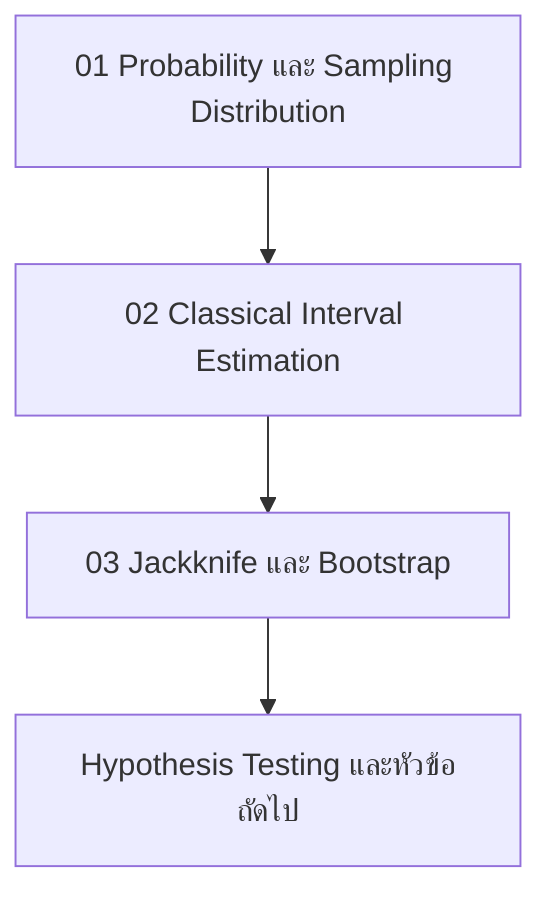

# DADS6001 Applied Modern Statistical Analysis

หน้านี้เป็นแผนที่การเรียนของชุด Master Notes รายวิชา DADS6001 เนื้อหาสามบทแรกพาผู้เรียนจากภาษาของความไม่แน่นอน ไปสู่การประมาณค่าด้วยช่วงความเชื่อมั่น และต่อยอดสู่วิธี resampling เมื่อสูตรเชิงทฤษฎีหาได้ยาก จุดประสงค์คือช่วยเลือกอ่านตาม prerequisite เห็นความเชื่อมโยงข้ามบท และทบทวนเพื่อสอบอย่างเป็นระบบ

> **Primary source:** `dads6001-applied_statistics/lecture/dads6001_00_course_syllabus.pptx` จำนวน 5 สไลด์  
> **Lecture coverage in this index:** Chapters 01–03  
> **Contact information:** ไม่แสดงข้อมูลติดต่อผู้สอนใน public course notes

## 1. ภาพรวมรายวิชา

รายวิชาครอบคลุม probability, sampling distribution, statistical inference, confidence intervals, hypothesis testing, ANOVA, chi-squared tests, regression, computationally intensive statistics และ Bayesian inference แกนร่วมของทั้งวิชาคือการใช้ sample เพื่อเรียนรู้ population พร้อมระบุความไม่แน่นอน เงื่อนไข และข้อจำกัดของข้อสรุป

### การประเมินผล

| รายการ | สัดส่วน |
|---|---:|
| Midterm Examination | 30% |
| Final Examination | 40% |
| Assignments & Others | 30% |

สัดส่วนนี้ถอดจาก syllabus โดยตรง Final Examination มีน้ำหนักสูงสุด จึงควรสะสมความเข้าใจและสูตรตัดสินใจข้ามบท ไม่ควรท่องแยกเป็นรายสัปดาห์

## 2. Master Notes ที่พร้อมใช้งาน

| ลำดับ | Master Note | ผลลัพธ์การเรียนรู้หลัก | Prerequisite |
|---:|---|---|---|
| 01 | [Introduction to Probability and Sampling Distribution](01_introduction.md) | อธิบาย probability, random variables, distributions, sampling distribution, CLT และตรวจ Normality | พีชคณิตและเซตพื้นฐาน |
| 02 | [Interval Estimation](02_interval_estimation.md) | เลือกและตีความ CI สำหรับ means และ proportions ทั้ง one-sample, independent และ paired designs | Chapter 01 |
| 03 | [Jackknife and Bootstrap](03_jackknife_bootstrap.md) | ประมาณ bias, standard error และ CI ด้วย resampling พร้อมตรวจ assumptions และโครงสร้างข้อมูล | Chapters 01–02 |

### ลำดับการอ่านที่แนะนำ

อย่าข้าม Chapter 01 หากยังแยก standard deviation กับ standard error ไม่ชัด และอย่าเริ่ม Chapter 03 ก่อนเข้าใจว่า confidence interval พยายามประมาณ uncertainty ของ estimator อย่างไร

## 3. Concept Map ข้ามบท

| แนวคิด | Chapter 01 | Chapter 02 | Chapter 03 |
|---|---|---|---|
| Population และ sample | วางนิยามและกลไกการสุ่ม | ใช้ sample ประมาณ parameter | ใช้ empirical distribution แทน population ชั่วคราว |
| Statistic และ estimator | สร้าง sampling distribution | ใช้ point estimate เป็นศูนย์กลางของ CI | คำนวณ statistic ซ้ำบน resamples |
| Standard error | SD ของ sampling distribution | กำหนดความกว้างของ CI | ประมาณจาก Jackknife หรือ Bootstrap replicates |
| Distribution | ศึกษา Normal, t และ Chi-square | เลือก critical value และสูตร | ประมาณ distribution ด้วยการ resample |
| Assumptions | independence, distribution และ sampling design | ตรวจเงื่อนไขของแต่ละ CI | ต้องรักษาหน่วยอิสระและ dependence structure |
| Interpretation | แยกข้อมูลดิบจาก sampling distribution | อธิบาย confidence level แบบ frequentist | แยก sampling distribution จาก resampling distribution |

## 4. Cumulative Learning Objectives

เมื่อเรียนครบสามบท ผู้เรียนควรสามารถ:

1. ระบุ population, sample, parameter, statistic และ sampling design จากสถานการณ์จริง
2. อธิบายว่าความไม่แน่นอนของ estimator เกิดจากการสุ่ม sample และวัดด้วย standard error
3. เลือก distribution หรือ resampling strategy ให้เหมาะกับ estimand และโครงสร้างข้อมูล
4. สร้างและตีความ confidence interval โดยไม่กล่าวว่า parameter มี probability อยู่ในช่วงหลังเห็นข้อมูล
5. เปรียบเทียบ classical, Jackknife และ Bootstrap ทั้งด้าน assumptions, computation และข้อจำกัด
6. ตรวจผลด้วยเหตุผลเชิงสถิติ การคำนวณซ้ำ และ sensitivity analysis

## 5. ตารางสอนจาก Syllabus

| วันที่ | หัวข้อ | สถานะ Master Note |
|---|---|---|
| 8 Aug 2026 | Introduction to Probability and Sampling Distribution | [พร้อมอ่าน](01_introduction.md) |
| 15 Aug 2026 | Estimation and Constructing Confidence Interval | [พร้อมอ่าน](02_interval_estimation.md) |
| 22 Aug 2026 | Constructing Confidence Interval ต่อ | รวมใน Chapter 02 |
| 29 Aug 2026 | Jackknife and Bootstrap Methods for Estimation | [พร้อมอ่าน](03_jackknife_bootstrap.md) |
| 5 Sep 2026 | Hypothesis Testing: One Population Mean | ยังไม่มีในชุดนี้ |
| 12 Sep 2026 | Hypothesis Testing: Two Population Means | ยังไม่มีในชุดนี้ |
| 19 Sep 2026 | Two Population Means ต่อ | ยังไม่มีในชุดนี้ |
| 26 Sep 2026 | Permutation Test | ยังไม่มีในชุดนี้ |
| 3–16 Oct 2026 | Midterm Examination period | ทบทวนครึ่งภาคแรก |
| 17 Oct 2026 | Hypothesis Testing: One/Two Population Proportions | ยังไม่มีในชุดนี้ |
| 24 Oct 2026 | Chi-squared Test | ยังไม่มีในชุดนี้ |
| 31 Oct 2026 | One-way and Multi-way ANOVA | ยังไม่มีในชุดนี้ |
| 7 Nov 2026 | ANOVA ต่อ | ยังไม่มีในชุดนี้ |
| 14 Nov 2026 | Basic Concept of Regression Analysis | ยังไม่มีในชุดนี้ |
| 21 Nov 2026 | Regression Analysis ต่อ | ยังไม่มีในชุดนี้ |
| 28 Nov 2026 | Introduction to Bayesian Inference | ยังไม่มีในชุดนี้ |
| 12–25 Dec 2026 | Final Examination period | ทบทวนสะสมทั้งรายวิชา |

วันและหัวข้อถอดจาก syllabus ปี 2026 ส่วนเลข chapter/session ในสไลด์อ้างถึงตำราหลักและไม่ใช่หมายเลข Master Note ใน repository นี้

## 6. Integrated Capstone: Hospital Waiting Time

ใช้ข้อมูลเวลารอของผู้ป่วยเพื่อเชื่อมสามบทเข้าด้วยกัน โดยกำหนด estimand ให้ชัดก่อนวิเคราะห์ เช่น mean waiting time หรือ median waiting time

### งานที่ต้องทำ

1. นิยาม population, sampling unit, sample และ potential sources of bias
2. สำรวจ distribution ด้วย histogram, boxplot และ Q–Q plot พร้อมแยก distribution ของข้อมูลจาก sampling distribution
3. สร้าง classical confidence interval สำหรับ mean ภายใต้เงื่อนไขที่เหมาะสม
4. สร้าง Bootstrap confidence intervals สำหรับ mean และ median โดยกำหนด random seed และจำนวน resamples
5. ใช้ Jackknife ประมาณ bias และ standard error ของ statistic อย่างน้อยหนึ่งตัว
6. เปรียบเทียบจุดประมาณ ความกว้างของช่วง และ sensitivity ต่อ outliers
7. อธิบายว่าควร resample ผู้ป่วย แถวข้อมูล หรือ cluster ใด โดยอิงหน่วยอิสระจริง
8. สรุปข้อค้นพบ ข้อจำกัด และสิ่งที่ข้อมูลชุดนี้ยังตอบไม่ได้

### เกณฑ์ตรวจงานย่อ

| ด้าน | สิ่งที่ต้องเห็น |
|---|---|
| Statistical framing | estimand, population และ sampling unit ชัดเจน |
| Method choice | เหตุผลรองรับ classical หรือ resampling method |
| Correctness | สูตร โค้ด และ interpretation สอดคล้องกัน |
| Validation | ตรวจ assumptions, seed, resample count และ sensitivity |
| Communication | แปลผลในบริบทโดยไม่กล่าวเกินข้อมูล |

## 7. Cumulative Exam Blueprint

| ทักษะ | น้ำหนักแนะนำในการทบทวน | ตัวอย่างสิ่งที่ควรทำได้ |
|---|---:|---|
| Definitions and concepts | 20% | แยก parameter, statistic, sampling distribution และ resampling distribution |
| Formula selection | 25% | เลือก z, t, Welch, pooled, paired หรือ proportion interval |
| Calculation | 25% | คำนวณ probability, SE, CI, Jackknife bias และ Bootstrap summaries |
| Interpretation | 15% | ตีความ confidence level และผลในบริบทอย่างถูกต้อง |
| Method critique | 15% | ตรวจ assumptions, dependence, outliers และข้อจำกัดของ resampling |

Blueprint นี้เป็นแผนทบทวนจากเนื้อหา Chapters 01–03 ไม่ใช่สัดส่วนข้อสอบที่ผู้สอนประกาศ

## 8. Final Revision Checklist

- [ ] แยก sample distribution, sampling distribution และ resampling distribution ได้
- [ ] อธิบาย CLT โดยไม่สรุปว่าข้อมูลดิบต้องเป็น Normal
- [ ] แยก standard deviation และ standard error ได้
- [ ] เลือก CI ตาม parameter, sample relationship และ variance assumptions ได้
- [ ] ตีความ 95% confidence interval แบบ repeated-sampling ได้
- [ ] อธิบายขั้นตอน Jackknife และ Bootstrap จากคำพูดเป็นสูตรหรือ pseudocode ได้
- [ ] เลือก resampling unit โดยไม่ทำลาย paired, clustered หรือ longitudinal structure
- [ ] อธิบายว่า Bootstrap ลด Monte Carlo error ได้ด้วยการเพิ่ม resamples แต่ไม่แก้ biased sample
- [ ] ตรวจ Markdown equations ใน profile `github` ก่อนเผยแพร่

## 9. Source Coverage and Review Status

| Source | การใช้งาน |
|---|---|
| `dads6001_00_course_syllabus.pptx`, Slides 1–5 | course scope, grading, schedule, textbooks และ distinction ระหว่าง Statistics/Statistic |
| `dads6001_01_introduction.pptx`, Slides 1–41 | Chapter 01 และ source coverage audit ภายในบท |
| `dads6001_02_interval_estimation.pptx`, Slides 1–17 | Chapter 02 และ source coverage audit ภายในบท |
| `dads6001_03_jackknife_bootstrap.pptx`, Slides 1–14 | Chapter 03 และ source coverage audit ภายในบท |

ทั้งสาม Master Notes ผ่านตัวตรวจ GitHub Markdown ตาม conservative profile ซึ่งตรวจ delimiter, braces และ macros ที่ GitHub renderer ไม่รองรับ

## 10. References from the Syllabus

1. Berenson, M. L., Levine, D. M., & Krehbiel, T. C. (2012). *Basic Business Statistics: Concepts and Applications* (12th ed.). Pearson.
2. Efron, B., & Hastie, T. (2016). *Computer Age Statistical Inference*. Cambridge University Press.
3. Mendenhall, W., & Sincich, T. (1996). *A Second Course in Statistics: Regression Analysis* (5th ed.). Prentice Hall.
4. Weiss, N. A. (2017). *Introductory Statistics* (10th ed.). Pearson.
5. Agresti, A., Franklin, C., & Klingenberg, B. (2018). *Statistics: The Art and Science of Learning from Data* (4th ed.). Pearson.
