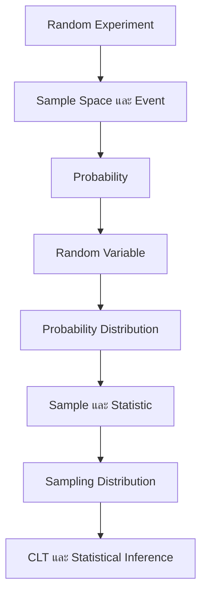

# Introduction to Probability and Sampling Distribution

> **Course:** DADS6001 Applied Modern Statistical Analysis  
> **Week:** 01  
> **Source:** `dads6001-applied_statistics/lecture/dads6001_01_introduction.pptx` จำนวน 41 สไลด์  
> **Main topics:** Probability, random variables, probability distributions, sampling distributions, Central Limit Theorem และการตรวจสอบ Normality

## 1. Chapter Overview

บทนี้สร้างรากฐานสำหรับ Statistical Inference ทั้งวิชา เส้นทางความคิดเริ่มจากการทดลองที่ผลลัพธ์ไม่แน่นอน แล้วกำหนด sample space และ event เพื่อคำนวณ probability จากนั้นแปลง outcome ให้เป็นตัวเลขด้วย random variable และอธิบายพฤติกรรมของตัวแปรผ่าน probability distribution เมื่อเปลี่ยนจากตัวแปรหนึ่งค่าไปเป็น statistic ที่คำนวณจาก sample เช่น sample mean จะเข้าสู่แนวคิด sampling distribution ซึ่งนำไปสู่ Standard Error, Central Limit Theorem, Confidence Interval และ Hypothesis Testing ในบทถัดไป



## 2. Learning Objectives

หลังเรียนบทนี้ ผู้เรียนควรสามารถ:

- แยก random experiment, outcome, sample space และ event ได้
- สร้าง event ด้วย union, intersection และ complement
- ใช้ probability axioms, addition rule และ complement rule ได้
- แยก subjective, relative-frequency และ classical approaches ได้
- อธิบาย random variable และจำแนก discrete/continuous random variables ได้
- สร้างและตรวจสอบ PMF, PDF และ CDF ได้
- คำนวณ expectation และ variance ของ discrete random variable ได้
- ตรวจว่าโจทย์เข้าเงื่อนไข Binomial distribution หรือไม่ และคำนวณ probability ได้
- อธิบาย Uniform, Normal, Standard Normal, Student's t และ Chi-square distributions ได้
- อธิบาย sampling distribution ของ sample mean ทั้งแบบสุ่มคืนที่และไม่คืนที่ได้
- อธิบาย Central Limit Theorem และไม่สับสนกับการแจกแจงของข้อมูลดิบ
- ใช้ histogram, P–P plot และ Q–Q plot ช่วยประเมิน distribution ได้

## 3. Prerequisite Knowledge

ควรทบทวนเรื่องต่อไปนี้ก่อน:

- Set และ subset
- Union, intersection และ complement
- Summation notation: $\sum$
- ค่าเฉลี่ย ความแปรปรวน และส่วนเบี่ยงเบนมาตรฐาน
- Factorial และ combination
- พื้นที่ใต้กราฟและ integral เบื้องต้น

## 4. Random Experiment, Outcome, Sample Space และ Event

### 4.1 Random Experiment

**Random experiment** คือการกระทำหรือกระบวนการที่มีผลลัพธ์เป็นไปได้มากกว่าหนึ่งอย่าง และไม่สามารถทราบล่วงหน้าอย่างแน่นอนว่าจะเกิดผลลัพธ์ใด แม้จะทราบชุดผลลัพธ์ที่เป็นไปได้ทั้งหมด (จากเอกสาร: Slides 2–6)

ตัวอย่าง:

- โยนเหรียญหนึ่งครั้ง
- ทอยลูกเต๋าหนึ่งลูก
- สุ่มลูกค้าหนึ่งรายแล้วบันทึกประเภทประกัน
- สุ่มหลอดไฟหนึ่งหลอดแล้ววัดอายุการใช้งาน

### 4.2 Outcome

**Outcome** คือผลลัพธ์พื้นฐานหนึ่งค่าที่เกิดจากการทดลอง เช่น ทอยลูกเต๋าได้ 4 หรือสุ่มเหรียญแล้วได้หัว

### 4.3 Sample Space

**Sample space** เขียนแทนด้วย $S$ คือเซตของ outcomes ทั้งหมดที่เป็นไปได้

| การทดลอง | Sample space |
|---|---|
| โยนเหรียญ 1 ครั้ง | $S=\{H,T\}$ |
| ทอยลูกเต๋า 1 ลูก | $S=\{1,2,3,4,5,6\}$ |
| นับจำนวนอุบัติเหตุ | $S=\{0,1,2,\ldots\}$ |
| วัดอายุหลอดไฟ | $S=\{x:x>0\}$ |
| คะแนน Likert 1–5 | $S=\{1,2,3,4,5\}$ |

Sample space อาจเป็น finite, countably infinite หรือ continuous ก็ได้

### 4.4 Event

**Event** คือ subset ของ sample space เขียนว่า $A\subseteq S$ เหตุการณ์เกิดขึ้นเมื่อ outcome ที่เกิดจริงเป็นสมาชิกของ event นั้น

ตัวอย่าง ทอยลูกเต๋า:

- $A=$ ได้เลขคู่ $=\{2,4,6\}$
- $B=$ ได้ค่ามากกว่า 4 $=\{5,6\}$
- $A\cap B=\{6\}$

เหตุการณ์พิเศษ:

- $S$ เป็น **certain event** เพราะเกิดเสมอ
- $\varnothing$ เป็น **impossible event** เพราะไม่มี outcome ใดอยู่ในเหตุการณ์

### 4.5 ข้อมูล Likert และ Top/Bottom Boxes

Slides 4 และ 6 ใช้คะแนน 1–5 เพื่อสร้าง event เช่น:

- Top 2 Boxes: $\{4,5\}$
- Bottom 2 Boxes: $\{1,2\}$
- คะแนนไม่ถึง “ดีมาก”: $\{1,2,3,4\}$

สิ่งสำคัญคือ event เป็นการรวม outcomes ที่สนใจ ส่วนการรวมคะแนนเป็น Top 2 Boxes เป็น business rule ซึ่งควรกำหนดก่อนดูผลเพื่อหลีกเลี่ยงการเลือกเกณฑ์ตามข้อมูล

## 5. Operations on Events

ให้ $A,B\subseteq S$

| สัญลักษณ์ | อ่านว่า | ความหมาย |
|---|---|---|
| $A\cap B$ | A intersection B | A และ B เกิดพร้อมกัน |
| $A\cup B$ | A union B | A หรือ B หรือทั้งสองเหตุการณ์เกิด |
| $A^c$ | complement of A | A ไม่เกิด |
| $A\setminus B$ | A minus B | A เกิด แต่ B ไม่เกิด |

คำว่า “or” ใน probability โดยทั่วไปเป็น **inclusive OR** จึงรวมกรณีที่ A และ B เกิดพร้อมกันด้วย

### 5.1 Mutually Exclusive Events

A และ B เป็น **mutually exclusive** เมื่อไม่สามารถเกิดพร้อมกัน:

$$
A\cap B=\varnothing
$$

ตัวอย่างในการทอยลูกเต๋าหนึ่งครั้ง เหตุการณ์ “ได้เลขคู่” กับ “ได้เลขคี่” ไม่เกิดร่วมกัน

> **อย่าสับสน:** Mutually exclusive ไม่เหมือน independent หาก A และ B mutually exclusive และทั้งคู่มี probability มากกว่า 0 การเกิด A ทำให้ B เกิดไม่ได้ จึงไม่ independent

### 5.2 Worked Example: Two-set Venn Diagram

จาก Slide 9 นักศึกษาใหม่ 150 คน ลง Math 85 คน ลง English 70 คน และลงทั้งสองวิชา 50 คน

- Math only $=85-50=35$
- English only $=70-50=20$
- Math or English $=85+70-50=105$
- Neither $=150-105=45$

ต้องลบ intersection หนึ่งครั้ง เพราะเมื่อบวก 85 กับ 70 สมาชิกที่ลงทั้งสองวิชาถูกนับสองครั้ง

### 5.3 Worked Example: Three-set Venn Diagram

จาก Slide 9 มีนักศึกษา 100 คน:

- PE 28, Biology 31, English 42
- PE∩Biology 9, PE∩English 10, Biology∩English 6
- ทั้งสามวิชา 4

ใช้ inclusion–exclusion:

$$
|P\cup B\cup E|
=|P|+|B|+|E|-|P\cap B|-|P\cap E|-|B\cap E|+|P\cap B\cap E|
$$

$$
=28+31+42-9-10-6+4=80
$$

ดังนั้นเรียน none $=100-80=20$ คน

- PE only $=28-(9-4)-(10-4)-4=13$
- PE และ Biology แต่ไม่ English $=9-4=5$

## 6. Probability

### 6.1 Probability Axioms

Probability เป็นฟังก์ชันที่กำหนดค่าให้ event โดยต้องเป็นไปตาม axioms (จากเอกสาร: Slide 10)

1. Non-negativity: $P(A)\ge 0$
2. Normalization: $P(S)=1$
3. Countable additivity: สำหรับ events ที่ไม่ทับซ้อนกัน ความน่าจะเป็นของ union เท่ากับผลรวมของความน่าจะเป็น

สำหรับสอง mutually exclusive events:

$$
P(A\cup B)=P(A)+P(B)
$$

### 6.2 Important Properties

$$
P(\varnothing)=0
$$

$$
P(A^c)=1-P(A)
$$

$$
P(A\cup B)=P(A)+P(B)-P(A\cap B)
$$

ถ้า $A\subseteq B$:

$$
P(A)\le P(B)
$$

### 6.3 ข้อแก้ความเข้าใจจาก Notation ในสไลด์

Slides 10–11 มี notation ที่ควรอ่านอย่างระมัดระวัง:

- Non-negativity ต้องเป็น $P(A)\ge0$ ไม่ใช่ $P(A)>0$ เพราะ impossible event มี probability เท่ากับ 0
- ถ้า $A\subseteq B$ ต้องได้ $P(A)\le P(B)$ ไม่จำเป็นต้องน้อยกว่าแบบ strict เพราะสอง events อาจมี probability เท่ากัน
- ในความหมายมาตรฐาน $A\subseteq S$ อาจรวมกรณี $A=S$ ส่วนบางตำราใช้ $\subset$ แทน proper subset จึงควรดู convention ของผู้สอน

## 7. Approaches to Probability

Slide 12 แบ่งวิธีคิด probability เป็น 3 แนวทาง

### 7.1 Subjective Approach

ใช้ความเชื่อหรือการประเมินจากข้อมูลและประสบการณ์ เช่น ผู้เชี่ยวชาญประเมินโอกาสโครงการล่าช้า 30% เหมาะเมื่อไม่มีการทดลองซ้ำแบบเดียวกันจำนวนมาก แต่ควรอธิบายฐานข้อมูลและเหตุผลของผู้ประเมิน

### 7.2 Relative-frequency Approach

ประมาณ probability จากสัดส่วนการเกิด event เมื่อทดลองซ้ำจำนวนมาก:

$$
P(A)\approx\frac{n(A)}{n}
$$

เมื่อ $n$ เพิ่มขึ้น relative frequency มีแนวโน้มคงที่ใกล้ probability จริงตาม Law of Large Numbers ภายใต้เงื่อนไขที่เหมาะสม

### 7.3 Classical Approach

เมื่อ outcomes มีโอกาสเท่ากัน:

$$
P(A)=\frac{\text{จำนวน outcomes ที่สนับสนุน A}}{\text{จำนวน outcomes ทั้งหมด}}
$$

เช่น โยนเหรียญยุติธรรม 3 ครั้ง มี ordered outcomes ทั้งหมด $2^3=8$ และโอกาสได้หัว 2 ครั้งคือ $\binom{3}{2}/8=3/8$

## 8. Random Variables

### 8.1 Definition

**Random variable** คือฟังก์ชันค่าจริงที่ map outcome ใน sample space ไปเป็นตัวเลข:

$$
X:S\rightarrow\mathbb{R}
$$

ตัวพิมพ์ใหญ่ $X$ หมายถึง random variable ส่วนตัวพิมพ์เล็ก $x$ หมายถึงค่าหนึ่งที่ $X$ อาจรับได้ (จากเอกสาร: Slide 13)

ตัวอย่าง โยนเหรียญสามครั้ง และให้ $X=$ จำนวนหัว ถึงแม้ sample space มี 8 ordered outcomes แต่ $X$ รับค่าเพียง $0,1,2,3$

### 8.2 Discrete versus Continuous

| ประเด็น | Discrete | Continuous |
|---|---|---|
| ค่าที่เป็นไปได้ | นับเป็นค่า ๆ ได้ | เป็นช่วงต่อเนื่อง |
| ตัวอย่าง | จำนวนอุบัติเหตุ, จำนวนหัว | เวลา, น้ำหนัก, อายุการใช้งาน |
| ฟังก์ชันหลัก | PMF | PDF |
| Probability ณ จุด | อาจมากกว่า 0 | $P(X=x)=0$ |
| Probability ในช่วง | รวม PMF | พื้นที่ใต้ PDF |

## 9. Discrete Random Variables: PMF, Expectation และ Variance

### 9.1 Probability Mass Function

PMF นิยามว่า:

$$
p_X(x)=P(X=x)
$$

โดยต้องมี:

$$
p_X(x)\ge0,\qquad \sum_xp_X(x)=1
$$

PMF ต้องกำหนด probability สำหรับทุกค่าที่เป็นไปได้ของ X และรวมกันได้ 1

### 9.2 Expectation

$$
\mu=E(X)=\sum_xxp_X(x)
$$

Expectation คือค่าเฉลี่ยระยะยาวเมื่อทำกระบวนการซ้ำ ไม่จำเป็นต้องเป็นค่าที่ X รับได้จริง เช่นจำนวนบุตรคาดหมายอาจเท่ากับ 1.7 แม้ไม่มีครอบครัวใดมีบุตร 1.7 คน

### 9.3 Variance

$$
\sigma^2=V(X)=E[(X-\mu)^2]
$$

หรือสูตรคำนวณลัด:

$$
V(X)=E(X^2)-[E(X)]^2
$$

Standard deviation คือ $\sigma=\sqrt{V(X)}$ และมีหน่วยเดียวกับ X ขณะที่ variance มีหน่วยยกกำลังสอง

### 9.4 Worked Example: Discrete Uniform 1–5

ให้ $P(X=x)=0.2$ สำหรับ $x=1,2,3,4,5$ (Slides 14–15)

$$
E(X)=\sum_xxp_X(x)=0.2(1+2+3+4+5)=3
$$

$$
E(X^2)=0.2(1^2+2^2+3^2+4^2+5^2)=11
$$

$$
V(X)=11-3^2=2
$$

ดังนั้น $SD(X)=\sqrt2\approx1.414$

## 10. Sampling Distribution of the Sample Mean

### 10.1 Population Distribution versus Sampling Distribution

- **Population distribution:** การกระจายของค่าของหน่วยใน population
- **Sample distribution:** การกระจายของ observations ใน sample ที่สุ่มมาแล้วหนึ่งชุด
- **Sampling distribution:** การกระจายของ statistic เช่น $\bar X$ จากทุก sample ที่เป็นไปได้ภายใต้วิธีสุ่มเดียวกัน

นี่เป็น distinction ที่สำคัญมาก เพราะ inference ใช้ sampling distribution เพื่อวัดว่าค่า statistic เปลี่ยนแปลงมากน้อยเพียงใดจาก sample หนึ่งไปอีก sample หนึ่ง

### 10.2 With Replacement

Slides 16–17 สุ่มตัวเลขสองครั้งจาก $\{1,2,3,4,5\}$ แบบคืนที่ มี ordered samples $5^2=25$ ชุด และสร้าง $\bar X$

$$
E(\bar X)=\mu=3
$$

$$
V(\bar X)=\frac{\sigma^2}{n}=\frac{2}{2}=1
$$

แม้ $\bar X$ มีค่าเฉลี่ยเท่ากับ population mean แต่กระจายน้อยกว่า individual observation เพราะการเฉลี่ยลดความผันผวน

### 10.3 Without Replacement และ Finite Population Correction

เมื่อสุ่มจาก finite population แบบไม่คืนที่ observations ไม่ independent และ variance ของ sample mean ลดลง:

$$
V(\bar X)=\frac{\sigma^2}{n}(\frac{N-n}{N-1})
$$

สำหรับ $N=5,n=2,\sigma^2=2$:

$$
V(\bar X)=\frac{2}{2}(\frac{5-2}{5-1})=0.75
$$

พจน์ $\frac{N-n}{N-1}$ คือ finite population correction ในรูป variance เมื่อ sample fraction สูง ความไม่แน่นอนลดลงเพราะมีสมาชิกที่ยังไม่ถูกเลือกเหลือน้อยลง

## 11. Binomial Distribution

### 11.1 Conditions

ให้ $X\sim B(n,p)$ เมื่อ:

1. มีจำนวน trials คงที่ $n$
2. แต่ละ trial มีสอง outcomes ตามนิยาม success/failure
3. Trials independent กัน
4. Probability of success คงที่เท่ากับ $p$
5. X นับจำนวน successes

หากสุ่มแบบไม่คืนที่จาก finite population เล็ก ๆ ค่า $p$ จะเปลี่ยนและ trials ไม่ independent จึงไม่ใช่ Binomial โดยตรง

### 11.2 PMF, Mean และ Variance

$$
P(X=x)=\binom{n}{x}p^x(1-p)^{n-x},\quad x=0,1,\ldots,n
$$

$$
E(X)=np,\qquad V(X)=np(1-p)
$$

$\binom{n}{x}$ นับจำนวนตำแหน่งที่สามารถวาง successes จำนวน x ครั้งใน n trials

### 11.3 Worked Example: สุ่มลูกบอล

Slides 19–20 กำหนด $n=4,p=3/5$ จึงมี $X\sim B(4,3/5)$

$$
P(X=x)=\binom4x(\frac35)^x(\frac25)^{4-x}
$$

| x | Probability |
|---:|---:|
| 0 | $16/625$ |
| 1 | $96/625$ |
| 2 | $216/625$ |
| 3 | $216/625$ |
| 4 | $81/625$ |

ตรวจสอบได้ว่าผลรวมเท่ากับ $625/625=1$

### 11.4 Worked Example: Multiple-choice Exam

จาก Slide 22 มี 5 ข้อ ข้อละ 4 ตัวเลือก เดาสุ่มและคืนลูกบอลทุกครั้ง จึงมี $X\sim B(5,0.25)$

**a) ถูก 5 ข้อ**

$$
P(X=5)=(0.25)^5=0.0009765625
$$

**b) ถูกอย่างน้อย 4 ข้อ**

$$
P(X\ge4)=P(X=4)+P(X=5)
$$

$$
=\binom54(0.25)^4(0.75)+(0.25)^5=0.015625
$$

**c) ไม่ถูกเลย**

$$
P(X=0)=(0.75)^5=0.2373046875
$$

**d) ถูกไม่เกิน 2 ข้อ**

$$
P(X\le2)=\sum_{x=0}^{2}\binom5x(0.25)^x(0.75)^{5-x}
=0.896484375
$$

คำสำคัญ:

- exactly 2: $P(X=2)$
- at least 2: $P(X\ge2)$
- at most/no more than 2: $P(X\le2)$
- more than 2: $P(X>2)$

## 12. Continuous Random Variables

### 12.1 PDF and CDF

สำหรับ continuous random variable:

$$
F_X(x)=P(X\le x)
$$

และหาก differentiable:

$$
f_X(x)=\frac{d}{dx}F_X(x)
$$

Probability ของช่วงคือพื้นที่ใต้ PDF:

$$
P(a<X<b)=\int_a^b f_X(x)\,dx=F_X(b)-F_X(a)
$$

เงื่อนไขของ PDF:

$$
f_X(x)\ge0,\qquad\int_{-\infty}^{\infty}f_X(x)\,dx=1
$$

ความสูง $f_X(x)$ ไม่ใช่ probability ณ จุด เพราะ $P(X=x)=0$

> Slide 23 เขียน CDF เป็น $P(X<x)$ ซึ่งให้ค่าเท่ากับ $P(X\le x)$ สำหรับ continuous variable แต่คำนิยามมาตรฐานทั่วไปนิยมใช้ $P(X\le x)$

### 12.2 Continuous Uniform Distribution

ถ้า $X\sim U(a,b)$:

$$
f_X(x)=\frac1{b-a},\quad a<x<b
$$

$$
E(X)=\frac{a+b}{2},\qquad V(X)=\frac{(b-a)^2}{12}
$$

คำว่า uniform หมายถึงช่วงที่มีความยาวเท่ากันมี probability เท่ากัน ไม่ได้หมายความว่าแต่ละจุดมี probability บวกเท่ากัน เพราะทุกจุดมี probability 0

## 13. Normal Distribution

ถ้า $X\sim N(\mu,\sigma^2)$ การแจกแจงมีลักษณะสมมาตรรอบ $\mu$ และกำหนดรูปร่างด้วย mean และ variance (Slides 24–26)

คุณสมบัติสำคัญ:

- $E(X)=\mu$
- $V(X)=\sigma^2$
- $P(X<\mu)=P(X>\mu)=0.5$
- $P(a<X<b)=F(b)-F(a)$

Empirical rule ตามตัวเลขใน Slide 25:

| ช่วง | Probability โดยประมาณ |
|---|---:|
| $\mu\pm1\sigma$ | 0.6826 |
| $\mu\pm2\sigma$ | 0.9544 |
| $\mu\pm3\sigma$ | 0.9974 |

### 13.1 Standardization

$$
Z=\frac{X-\mu}{\sigma}\sim N(0,1)
$$

z-score บอกว่าค่า X อยู่ห่างจาก mean กี่ standard deviations และทำให้ใช้ Standard Normal distribution เป็น reference เดียวกันได้

## 14. Distribution of the Sample Mean, t และ Chi-square

### 14.1 Sample Mean from a Normal Population

ถ้า $X_1,\ldots,X_n$ เป็น i.i.d. จาก $N(\mu,\sigma^2)$:

$$
\bar X\sim N(\mu,\frac{\sigma^2}{n})
$$

ดังนั้น:

$$
Z=\frac{\bar X-\mu}{\sigma/\sqrt n}\sim N(0,1)
$$

$\sigma/\sqrt n$ คือ standard error ของ sample mean เมื่อทราบ population standard deviation

### 14.2 Student's t Distribution

เมื่อไม่ทราบ $\sigma$ และใช้ sample standard deviation:

$$
S^2=\frac{\sum_{i=1}^{n}(X_i-\bar X)^2}{n-1}
$$

หากสุ่มจาก Normal population:

$$
T=\frac{\bar X-\mu}{S/\sqrt n}\sim t_{n-1}
$$

t distribution มีหางหนากว่า Standard Normal เพื่อสะท้อน uncertainty จากการประมาณ $\sigma$ ด้วย S เมื่อ degrees of freedom เพิ่มขึ้น t จะเข้าใกล้ Normal

### 14.3 Chi-square Distribution

ภายใต้ Normal population:

$$
\frac{(n-1)S^2}{\sigma^2}\sim\chi^2_{n-1}
$$

Chi-square distribution เป็นบวกและเบ้ขวา รูปร่างขึ้นกับ degrees of freedom ความสัมพันธ์นี้ใช้สร้าง inference สำหรับ population variance

## 15. Normal Approximation to Binomial

ถ้า $X\sim B(n,p)$ เมื่อ n ใหญ่พอ การแจกแจงของ X สามารถประมาณด้วย:

$$
X\approx N(np,np(1-p))
$$

หรือ standardized:

$$
\frac{X-np}{\sqrt{np(1-p)}}\approx N(0,1)
$$

แนวปฏิบัติที่ใช้บ่อยคือให้ $np$ และ $n(1-p)$ ไม่เล็กเกินไป ทั้งนี้ threshold อาจต่างกันตามตำรา ควรยึดเกณฑ์ของผู้สอน

เพราะ Binomial เป็น discrete แต่ Normal เป็น continuous การคำนวณที่ต้องการความแม่นยำควรใช้ **continuity correction** เช่น:

$$
P(X\le10)\approx P(Y<10.5)
$$

เมื่อ $Y\sim N(np,np(1-p))$

## 16. Central Limit Theorem

### 16.1 Core Idea

ให้ $X_1,\ldots,X_n$ เป็น i.i.d. มี mean $\mu$ และ finite variance $\sigma^2$ เมื่อ n เพิ่มขึ้น:

$$
\frac{\bar X-\mu}{\sigma/\sqrt n}\xrightarrow{d}N(0,1)
$$

หรือกล่าวว่า:

$$
\bar X\approx N(\mu,\frac{\sigma^2}{n})
$$

แม้ population distribution ไม่เป็น Normal โดย approximation จะดีขึ้นเมื่อ n เพิ่มขึ้น (Slide 31)

### 16.2 CLT สำคัญอย่างไร

CLT ทำให้สามารถสร้าง confidence interval และ hypothesis test สำหรับ mean โดยอาศัย Normal approximation ได้ในหลายสถานการณ์ จึงเป็นรากฐานของ classical inference

### 16.3 สิ่งที่ CLT ไม่ได้กล่าว

- ไม่ได้กล่าวว่าข้อมูลดิบจะกลายเป็น Normal เมื่อ n ใหญ่
- กล่าวถึงการแจกแจงของ standardized sum หรือ sample mean จากการสุ่มซ้ำ
- ไม่มีขนาด sample เดียวที่ “ใหญ่พอ” สำหรับทุก population หาก population เบ้มากหรือหางหนักอาจต้องใช้ n มากขึ้น
- n ใหญ่ไม่ได้แก้ bias, dependence, measurement error หรือ non-representative sampling

## 17. Checking Distribution and Normality

Slide 32 แบ่งวิธีตรวจ distribution เป็น graphical methods และ hypothesis tests

### 17.1 Histogram

ใช้ดู shape, modality, skewness, gaps และ outliers แต่ผลขึ้นกับ bin width และอาจตีความยากเมื่อ sample เล็ก

### 17.2 P–P Plot

P–P plot เปรียบเทียบ cumulative probabilities ของ empirical distribution กับ theoretical distribution จุดใกล้เส้น 45° แสดงว่า CDFs ใกล้เคียงกัน โดยมักไวต่อความแตกต่างบริเวณกลาง distribution มากกว่าหาง (Slides 33–37)

### 17.3 Q–Q Plot

Q–Q plot เปรียบเทียบ quantiles ของสอง distributions หาก distributions มีรูปทรงใกล้กัน จุดจะเรียงใกล้เส้นตรง (Slides 38–40)

| รูปแบบใน Normal Q–Q plot | ความหมายที่เป็นไปได้ |
|---|---|
| จุดใกล้เส้นตรง | approximately Normal |
| โค้งเป็นระบบ | skewness หรือ shape ต่างจาก Normal |
| ปลายเบี่ยงออกมาก | tail behavior ต่างหรือมี outliers |
| เส้นตรงแต่ slope/intercept ต่าง | shape ใกล้กันแต่ location/scale ต่าง |

Q–Q plot ให้ข้อมูลเรื่อง tails ชัดกว่า P–P plot และ histogram แต่ควรดูร่วมกับบริบทและ sample size

### 17.4 Formal Tests

สไลด์กล่าวถึง Goodness-of-fit และ Kolmogorov–Smirnov test การตีความ formal normality test ต้องระวัง:

- Sample ใหญ่มากอาจ detect deviation เล็กที่ไม่มีผลต่อวิธีวิเคราะห์
- Sample เล็กอาจมี power ไม่พอจะพบ non-normality
- การไม่ reject ไม่ได้พิสูจน์ว่า distribution เป็น Normal
- ควรตรวจ residuals ของ model เมื่อ assumption กล่าวถึง errors/residuals ไม่ใช่ดู outcome อย่างเดียว

### 17.5 Utility Data Exercise

Slide 41 ให้ค่าไฟเดือนกรกฎาคมของอพาร์ตเมนต์ 50 แห่ง และให้ประเมิน Normality ด้วย boxplot และ Q–Q plot ขั้นตอนตอบที่ดีคือ:

1. สร้าง boxplot เพื่อตรวจ median, symmetry, IQR และ outliers
2. สร้าง Normal Q–Q plot
3. พิจารณาความเบี่ยงเบนอย่างเป็นระบบ โดยเฉพาะ tails
4. สรุปว่า “approximately normal” หรือไม่ พร้อมหลักฐานจากทั้งสองกราฟ
5. หลีกเลี่ยงคำสรุปแบบเด็ดขาดจากกราฟเดียว

ตัวอย่าง Python:

```python
import matplotlib.pyplot as plt
import scipy.stats as stats

utility = [
    96, 171, 202, 178, 147, 102, 153, 197, 127, 82,
    157, 185, 90, 116, 172, 111, 148, 213, 130, 165,
    141, 149, 206, 175, 123, 128, 144, 168, 109, 167,
    95, 163, 150, 154, 130, 143, 187, 166, 139, 149,
    108, 119, 183, 151, 114, 135, 191, 137, 129, 158
]

fig, axes = plt.subplots(1, 2, figsize=(10, 4))
axes[0].boxplot(utility, vert=True)
axes[0].set_title("Utility Cost Boxplot")
stats.probplot(utility, dist="norm", plot=axes[1])
axes[1].set_title("Normal Q-Q Plot")
plt.tight_layout()
plt.show()
```

## 18. Common Misconceptions

1. **Event คือ outcome เดียวเสมอ** — Event อาจมีหลาย outcomes
2. **Mutually exclusive เท่ากับ independent** — ตรงกันข้ามในกรณีที่ probabilities เป็นบวก
3. **Random variable คือค่าที่เปลี่ยนแบบไม่มีหลักการ** — เป็นฟังก์ชันที่กำหนดชัดเจนจาก outcome ไปสู่ตัวเลข
4. **PDF ณ จุดคือ probability ของจุดนั้น** — สำหรับ continuous variable ต้องหาพื้นที่ในช่วง
5. **Expectation ต้องเป็นค่าที่เกิดขึ้นได้จริง** — เป็น weighted long-run average
6. **Sampling distribution คือ histogram ของ sample หนึ่งชุด** — เป็น distribution ของ statistic จากการสุ่มซ้ำ
7. **Binomial ใช้ได้กับทุกโจทย์ที่มีสอง outcomes** — ต้องมี fixed n, independence และ constant p
8. **ใช้ z ทุกครั้งเมื่อ n ใหญ่** — ต้องดูว่าทราบ $\sigma$ หรือไม่ design และ assumptions เป็นอย่างไร
9. **CLT ทำให้ raw data เป็น Normal** — CLT เกี่ยวกับ standardized sums/sample means
10. **Q–Q plot ต้องทับเส้น $y=x$ เสมอ** — หากเปรียบเทียบ shape จุดอาจอยู่บนเส้นตรงที่ slope/intercept ต่างได้
11. **ไม่ reject normality แปลว่าพิสูจน์ว่า Normal** — เป็นเพียงหลักฐานไม่พอที่จะ reject ภายใต้ test นั้น

## 19. Likely Exam Focus

หัวข้อนี้อนุมานจากลำดับ เนื้อหาที่เน้น สูตร และ exercises ในสไลด์ ไม่ใช่ข้อสอบจริง

### Definitions to remember

- Random experiment, outcome, sample space, event
- Union, intersection, complement, mutually exclusive
- Probability axioms
- Random variable, PMF, PDF, CDF
- Expectation, variance, sampling distribution และ standard error
- Binomial, Normal, t และ Chi-square distributions
- Central Limit Theorem
- P–P plot versus Q–Q plot

### Calculations to perform

- Venn diagram และ inclusion–exclusion
- Addition/complement rules
- PMF, $E(X)$ และ $V(X)$
- Sampling distribution ของ $\bar X$
- Finite population correction
- Binomial probability รวมคำว่า exactly/at least/at most
- Standardization ด้วย z-score
- Normal approximation to Binomial

### Concepts to explain or compare

- Outcome versus event
- Discrete versus continuous random variables
- PMF versus PDF versus CDF
- Population distribution versus sampling distribution
- With-replacement versus without-replacement sampling
- Standard Normal versus Student's t
- P–P plot versus Q–Q plot
- Exact Binomial versus Normal approximation

### Scenario decisions

- ตรวจว่าโจทย์เป็น Binomial หรือไม่
- เลือก distribution ของ statistic ตามสิ่งที่ทราบเกี่ยวกับ population variance
- ตัดสินว่าควรใช้ continuity correction หรือไม่
- ประเมิน approximately Normal จากหลายหลักฐาน ไม่ยึดกราฟหรือ test เพียงอย่างเดียว

## 20. Practice Questions

### Recall and Understanding

1. Sample space กับ event ต่างกันอย่างไร
2. เขียน probability axioms ทั้งสามข้อ
3. PMF กับ PDF ต่างกันอย่างไร
4. Sampling distribution หมายถึงอะไร
5. ระบุเงื่อนไข Binomial distribution

### Multiple Choice

6. หาก A และ B mutually exclusive และ $P(A),P(B)>0$ ข้อใดถูกต้อง
   - A. A และ B independent
   - B. $P(A\cap B)=P(A)P(B)$
   - C. $P(A\cup B)=P(A)+P(B)$
   - D. $P(A\mid B)=P(A)$

7. ข้อใดเป็น continuous random variable
   - A. จำนวนรายการสั่งซื้อ
   - B. จำนวนสินค้าที่ชำรุด
   - C. ระยะเวลารอรับยา
   - D. จำนวนสาขาที่ผ่าน audit

8. ถ้า $X\sim B(10,0.2)$ ค่า $E(X)$ เท่ากับเท่าใด
   - A. 0.2
   - B. 2
   - C. 8
   - D. 10

9. CLT กล่าวถึง distribution ใดเป็นหลัก
   - A. Raw observations ใน sample เดียว
   - B. Population ที่ต้องเป็น Normal เสมอ
   - C. Standardized sum หรือ sample mean เมื่อ n เพิ่มขึ้น
   - D. เฉพาะ Binomial variable

### Apply and Analyze

10. ทอยลูกเต๋ายุติธรรมสองครั้ง ให้ $X$ เป็นจำนวนครั้งที่ได้เลข 6 จงระบุ distribution และหา $P(X\ge1)$
11. ให้ PMF: $P(X=0)=0.2$, $P(X=1)=0.5$, $P(X=2)=0.3$ จงหา $E(X)$ และ $V(X)$
12. Population มี $\mu=50,\sigma=12$ สุ่ม independent sample ขนาด 36 จงหา mean และ standard error ของ $\bar X$
13. อธิบายว่าทำไม sampling without replacement จาก population เล็กจึงมี variance ของ $\bar X$ ต่ำกว่า with replacement
14. หาก Normal Q–Q plot เรียงเกือบตรงกลางแต่ปลายทั้งสองเบี่ยงออกจากเส้น ควรตีความอย่างไร
15. นักวิเคราะห์กล่าวว่า “ข้อมูล 1,000 แถวจึงเป็น Normal ตาม CLT” จงวิจารณ์

## 21. Model Answers with Reasoning

1. Sample space คือ outcomes ทั้งหมด ส่วน event คือ subset ของ outcomes ที่สนใจ
2. $P(A)\ge0$, $P(S)=1$ และ probability ของ union ของ disjoint events เท่ากับผลรวม
3. PMF กำหนด point probability สำหรับ discrete variable ส่วน PDF เป็น density ของ continuous variable และต้อง integrate เพื่อหา probability
4. Distribution ของ statistic จาก samples ที่เป็นไปได้ภายใต้วิธีสุ่มเดียวกัน
5. Fixed n, two outcomes, independent trials, constant p และ X นับ success
6. **C** เพราะ intersection ว่าง จึงบวก probabilities ได้โดยตรง แต่ไม่ independent
7. **C** ระยะเวลารับค่าได้ต่อเนื่อง
8. **B** เพราะ $E(X)=np=10(0.2)=2$
9. **C** CLT กล่าวถึง standardized sum/sample mean ไม่ใช่ raw-data distribution
10. $X\sim B(2,1/6)$ และ $P(X\ge1)=1-P(X=0)=1-(5/6)^2=11/36$
11. $E(X)=0(0.2)+1(0.5)+2(0.3)=1.1$; $E(X^2)=0+0.5+1.2=1.7$; $V(X)=1.7-1.1^2=0.49$
12. $E(\bar X)=50$ และ $SE(\bar X)=12/\sqrt{36}=2$
13. การเลือกหน่วยหนึ่งทำให้ค่าของหน่วยที่เหลือมีข้อมูลมากขึ้นและ observations มี dependence เชิงลบ finite population correction จึงลด variance
14. ส่วนกลางใกล้ Normal แต่ tails ต่างจาก Normal อาจเป็น heavy/light tails หรือ outliers ควรตรวจข้อมูลและกราฟอื่นร่วมด้วย
15. CLT ไม่ได้ทำให้ raw data เป็น Normal แต่ทำให้ sampling distribution ของ standardized mean/sum เข้าใกล้ Normal ภายใต้เงื่อนไข ข้อมูล 1,000 แถวอาจยังเบ้ มี outliers หรือ dependent ได้

## 22. Quick Formula Sheet

### Probability

$$P(A^c)=1-P(A)$$

$$P(A\cup B)=P(A)+P(B)-P(A\cap B)$$

### Discrete Random Variable

$$E(X)=\sum_xxp_X(x)$$

$$V(X)=E(X^2)-[E(X)]^2$$

### Sample Mean

$$E(\bar X)=\mu$$

$$V(\bar X)=\frac{\sigma^2}{n}$$

Without replacement from finite population:

$$V(\bar X)=\frac{\sigma^2}{n}(\frac{N-n}{N-1})$$

### Binomial

$$P(X=x)=\binom{n}{x}p^x(1-p)^{n-x}$$

$$E(X)=np,\qquad V(X)=np(1-p)$$

### Normal and t

$$Z=\frac{X-\mu}{\sigma}$$

$$Z=\frac{\bar X-\mu}{\sigma/\sqrt n}$$

$$T=\frac{\bar X-\mu}{S/\sqrt n}\sim t_{n-1}$$

### Chi-square for Variance

$$\frac{(n-1)S^2}{\sigma^2}\sim\chi^2_{n-1}$$

## 23. Key Takeaways

- Probability เริ่มจากการกำหนด sample space และ event ให้ถูกต้อง
- Random variable เป็นสะพานจาก outcomes ไปสู่ตัวเลขและ distributions
- PMF ใช้กับ discrete variable ส่วน PDF ใช้กับ continuous variable
- Expectation วัดศูนย์กลางระยะยาว ส่วน variance วัดการกระจาย
- Sampling distribution ไม่ใช่ distribution ของ raw data แต่เป็น distribution ของ statistic
- Sample mean เป็น unbiased for population mean ภายใต้การสุ่มที่เหมาะสม และมี variance ลดลงเมื่อ n เพิ่ม
- Binomial ใช้ได้เมื่อ fixed n, binary outcome, independence และ constant p
- Normal, t และ Chi-square เป็น reference distributions สำคัญสำหรับ inference
- CLT อธิบายเหตุผลที่ Normal approximation ใช้กับ sample mean ได้อย่างกว้างขวาง
- การตรวจ Normality ควรใช้กราฟ การทดสอบ และบริบทประกอบกัน

## 24. Glossary

| Term | ความหมาย |
|---|---|
| Random experiment | กระบวนการที่ outcome ไม่แน่นอนล่วงหน้า |
| Outcome | ผลลัพธ์พื้นฐานหนึ่งค่า |
| Sample space | เซต outcomes ทั้งหมด |
| Event | Subset ของ sample space |
| Mutually exclusive | Events ที่เกิดพร้อมกันไม่ได้ |
| Random variable | ฟังก์ชันจาก outcome ไปยังจำนวนจริง |
| PMF | Point probabilities ของ discrete random variable |
| PDF | Density ของ continuous random variable |
| CDF | $F(x)=P(X\le x)$ |
| Expectation | ค่าเฉลี่ยถ่วงน้ำหนักระยะยาว |
| Variance | Expected squared deviation from mean |
| Sampling distribution | Distribution ของ statistic จาก repeated samples |
| Standard error | Standard deviation ของ sampling distribution |
| Finite population correction | ตัวคูณลด variance เมื่อสุ่มไม่คืนที่จาก finite population |
| Binomial distribution | Distribution ของจำนวน successes ใน n Bernoulli trials |
| Degrees of freedom | จำนวนข้อมูลอิสระที่เหลือหลังประมาณข้อจำกัด/parameters |
| Central Limit Theorem | ทฤษฎีการลู่เข้าของ standardized sum/sample mean สู่ Normal |
| P–P plot | กราฟเปรียบเทียบ cumulative probabilities |
| Q–Q plot | กราฟเปรียบเทียบ quantiles |

## 25. Source Coverage Audit

| Source slides | Primary teaching home |
|---|---|
| 1–6 | Chapter overview; random experiment, outcome, sample space และ event |
| 7–12 | Event operations, Venn diagrams, probability axioms และ probability approaches |
| 13–18 | Random variables, PMF, expectation, variance และ sampling with/without replacement |
| 19–22 | Binomial distribution และ multiple-choice exercise |
| 23–30 | Continuous uniform, Normal, Standard Normal, t, Chi-square และ Normal approximation |
| 31 | Central Limit Theorem |
| 32–40 | Distribution checking, P–P plot และ Q–Q plot |
| 41 | Utility-data normality exercise |

บทนี้เป็น prerequisite โดยตรงของ [02 Interval Estimation](02_interval_estimation.md) โดยเฉพาะ sampling distribution, Standard Error, Normal, Student's t, Chi-square และ CLT

## 26. References

1. เอกสารประกอบการสอน `dads6001-applied_statistics/lecture/dads6001_01_introduction.pptx`, Slides 1–41.
2. Berenson, M., Levine, D. M., & Krehbiel, T. C. (2012). *Basic Business Statistics: Concepts and Applications* (12th ed.). Pearson. อ้างถึงใน Slide 41.
3. แหล่งข้อมูลประกอบที่ระบุไว้ในสไลด์: Wikipedia pages for Binomial, Normal, Student's t, Chi-square, P–P plot และ Q–Q plot. ใช้เพื่อชี้แหล่งเดิมของภาพ/คำอธิบายในเอกสาร ไม่ได้ใช้แทนเนื้อหาหลักของรายวิชา
