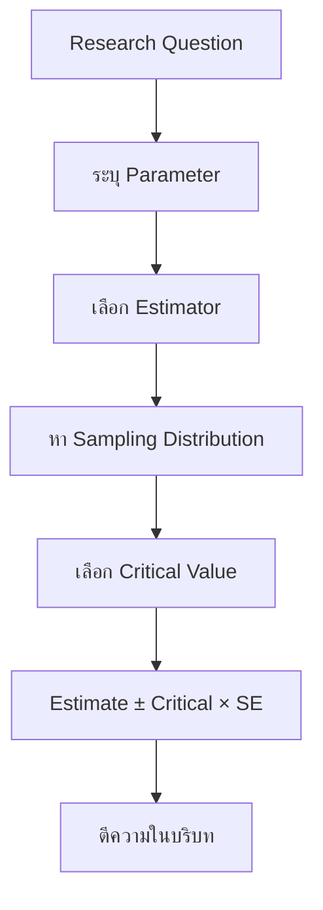

# Interval Estimation

> **Course:** DADS6001 Applied Modern Statistical Analysis  
> **Week:** 02  
> **Source:** `dads6001-applied_statistics/lecture/dads6001_02_interval_estimation.pptx` จำนวน 17 สไลด์  
> **Main topics:** Point estimation, confidence intervals, one/two population means, paired means และ one/two population proportions

> **Course navigation:** [Course Overview](00_readme.md) · บทก่อนหน้า [01 Introduction](01_introduction.md) · บทถัดไป [03 Jackknife and Bootstrap](03_jackknife_bootstrap.md)

## 1. Chapter Overview

บทนี้เริ่มต้น Statistical Inference อย่างเป็นทางการ โดยใช้ข้อมูลจาก sample เพื่อประมาณ population parameter ที่ไม่ทราบค่า การประมาณมีสองแบบ:

- **Point estimation:** ให้คำตอบเป็นค่าหนึ่งค่า
- **Interval estimation:** ให้ช่วงของค่าที่สมเหตุสมผล พร้อม confidence level

โครงสร้างของ confidence interval ส่วนใหญ่เขียนได้เป็น:

$$
\text{Point estimate}\ \pm\ \text{Critical value}\times\text{Standard error}
$$

หรือ:

$$
\text{Estimate}\pm\text{Margin of error}
$$

สิ่งที่ต้องตัดสินใจในโจทย์ไม่ใช่เพียงแทนสูตร แต่ต้องระบุให้ได้ว่า parameter คืออะไร sample เป็นอิสระหรือจับคู่ รู้ population variance หรือไม่ และ distribution/ขนาด sample รองรับวิธีนั้นหรือไม่

## 2. Learning Objectives

หลังเรียนบทนี้ ผู้เรียนควรสามารถ:

- แยก estimand, estimator และ estimate ได้
- อธิบาย point estimation และ interval estimation ได้
- อธิบาย confidence coefficient, confidence level, lower/upper confidence limits ได้
- สร้าง confidence interval จาก pivotal quantity ได้
- เลือกใช้ z หรือ t interval สำหรับ population mean ได้
- สร้าง CI สำหรับ population proportion ด้วย Normal approximation ได้
- สร้าง CI สำหรับผลต่างค่าเฉลี่ยของ independent samples ได้ทั้ง known variance, Welch และ pooled-variance cases
- สร้าง paired t interval จาก within-pair differences ได้
- สร้าง CI สำหรับผลต่าง population proportions ได้
- ตีความ confidence interval อย่างถูกต้องและไม่สับสนกับ probability statement ของ fixed parameter
- อธิบายผลของ confidence level, sample size และ variability ต่อความกว้างของช่วงได้

## 3. Prerequisite Knowledge

- Population, sample, parameter และ statistic
- Sampling distribution และ Standard Error
- Central Limit Theorem
- Standard Normal, Student's t และ Chi-square distributions
- Binomial distribution และ sample proportion
- Independent versus dependent/paired samples
- Variance, standard deviation และ degrees of freedom

## 4. Statistical Inference

Slide 2 แบ่ง Statistical Inference เป็นสองส่วนหลัก:

1. **Estimation:** ใช้ sample เพื่อประมาณ parameter
2. **Hypothesis testing:** ใช้ sample ประเมินหลักฐานต่อข้ออ้างเกี่ยวกับ parameter

ทั้งสองส่วนเชื่อมกันผ่าน sampling distribution ตัวอย่างเช่น 95% confidence interval แบบ two-sided จะรวมค่าของ parameter ที่ไม่ถูก reject ด้วย two-sided hypothesis test ที่ $\alpha=0.05$ ภายใต้ assumptions และวิธีเดียวกัน

## 5. Estimand, Estimator และ Estimate

### 5.1 Estimand

**Estimand** คือ population quantity ที่ต้องการทราบ เขียนแทนทั่วไปด้วย $\theta$ เช่น:

- Population mean: $\mu$
- Population proportion: $p$
- Difference in means: $\mu_1-\mu_2$
- Difference in proportions: $p_1-p_2$

การระบุ estimand ต้องชัดทั้ง population, variable และ contrast ที่สนใจ

### 5.2 Estimator

**Estimator** คือ random statistic หรือกฎที่ใช้ประมาณ parameter:

$$
\hat\theta=T(X_1,X_2,\ldots,X_n)
$$

ก่อนเก็บข้อมูล estimator เป็น random variable เพราะขึ้นกับ random sample

### 5.3 Estimate

**Estimate** คือค่าตัวเลขที่ได้เมื่อแทน observations จริงลงใน estimator

| แนวคิด | ตัวอย่าง mean | ตัวอย่าง proportion |
|---|---|---|
| Estimand | $\mu$ | $p$ |
| Estimator | $\bar X$ | $\hat p=X/n$ |
| Estimate | เช่น $\bar x=52.4$ | เช่น $\hat p=0.63$ |

> **Common language trap:** หลายแหล่งใช้ estimator/estimate สลับกันในภาษาพูด แต่ในการตอบเชิงทฤษฎีควรแยก random rule ออกจากค่าที่สังเกตได้

## 6. Point Estimation versus Interval Estimation

### 6.1 Point Estimation

รายงาน statistic หนึ่งค่า เช่น $\bar x=52.4$ ข้อดีคือกระชับ แต่ไม่บอก sampling uncertainty

### 6.2 Interval Estimation

สร้าง random limits:

$$
L(X_1,\ldots,X_n)<\theta<U(X_1,\ldots,X_n)
$$

ให้กระบวนการมี coverage probability:

$$
P(L < \theta < U) = 1 - \alpha
$$

เมื่อเก็บ sample แล้ว L และ U กลายเป็นค่าคงที่ เกิดเป็น observed interval (Slides 2–3)

## 7. Confidence Interval Terminology

ช่วง:

$$
[L,U]
$$

เรียกว่า $(1-\alpha)100\%$ confidence interval สำหรับ $\theta$

| Term | Meaning |
|---|---|
| Lower Confidence Limit (LCL) | ขอบเขตล่าง L |
| Upper Confidence Limit (UCL) | ขอบเขตบน U |
| Confidence coefficient | $1-\alpha$ |
| Confidence level | $(1-\alpha)100\%$ |
| Tail probability | two-sided CI แบ่งเป็น $\alpha/2$ ต่อด้าน |
| Critical value | quantile ที่ตัด central probability $1-\alpha$ |
| Margin of error | Critical value × Standard error |

สำหรับ 95% CI:

$$
1-\alpha=0.95,\quad \alpha=0.05,\quad \alpha/2=0.025
$$

และ Standard Normal critical value คือ:

$$
z_{\alpha/2}=z_{0.025}=1.96
$$

## 8. Correct Interpretation of Confidence Intervals

### 8.1 Frequentist Interpretation

หากสุ่มตัวอย่างและสร้าง interval ด้วยวิธีเดียวกันซ้ำจำนวนมาก ประมาณ 95% ของ intervals ที่สร้างด้วย 95% procedure จะครอบคลุม parameter จริง (Slide 4)

หลังคำนวณ interval หนึ่งช่วงแล้ว parameter แบบ frequentist เป็นค่าคงที่ ช่วงนั้นครอบคลุมหรือไม่ครอบคลุม parameter ไม่ควรกล่าวว่า “มีโอกาส 95% ที่ $\mu$ อยู่ในช่วงนี้”

### 8.2 Recommended Reporting

ควรเขียนว่า:

> จากวิธีการและ assumptions ที่กำหนด เรามีความเชื่อมั่น 95% ว่าค่าเฉลี่ยประชากรอยู่ระหว่าง L ถึง U

พร้อมระบุหน่วยและ population เช่น “ค่าเฉลี่ยจำนวนพนักงานธนาคารที่อยู่ในเหตุการณ์ปล้น” ไม่ใช่เขียนเพียง “ค่าเฉลี่ยอยู่ในช่วง...”

### 8.3 What CI Does Not Guarantee

- ไม่รับประกันว่า 95% ของ observations อยู่ในช่วง
- ไม่ใช่ prediction interval สำหรับ observation ใหม่
- ไม่รับประกัน causal effect
- ไม่แก้ bias จาก non-random sampling, measurement error หรือ missing data
- ช่วงแคบอาจแม่นยำเชิง sampling แต่ยังผิดจาก bias ได้

## 9. Deriving the General Two-sided CI

หากมี pivotal statistic Z ที่ distribution ไม่ขึ้นกับ parameter:

$$
P(-z_{\alpha/2}<Z<z_{\alpha/2})=1-\alpha
$$

แทน Z ด้วย standardized estimator แล้วจัดอสมการเพื่อ isolate parameter จะได้ confidence interval

สำหรับ estimator ที่ approximately Normal:

$$
\frac{\hat\theta-\theta}{SE(\hat\theta)}\approx N(0,1)
$$

จึงได้:

$$
\hat\theta\pm z_{\alpha/2}SE(\hat\theta)
$$

## 10. CI for One Population Mean

ต้องเลือกจากสองกรณีหลัก: ทราบ $\sigma$ หรือไม่ทราบ $\sigma$

### 10.1 Known Population Variance: z Interval

ถ้า $X_1,\ldots,X_n$ มาจาก Normal population หรือ n ใหญ่พอสำหรับ Normal approximation และทราบ $\sigma$:

$$
\bar X\sim N(\mu,\frac{\sigma^2}{n})
$$

$$
Z=\frac{\bar X-\mu}{\sigma/\sqrt n}\sim N(0,1)
$$

CI คือ:

$$
\boxed{\bar x\pm z_{\alpha/2}\frac{\sigma}{\sqrt n}}
$$

สำหรับ 95%:

$$
\bar x\pm1.96\frac{\sigma}{\sqrt n}
$$

ที่มา: Slide 8

### 10.2 Unknown Population Variance: t Interval

ในงานจริงมักไม่ทราบ $\sigma$ จึงแทนด้วย sample standard deviation S การแทนนี้เพิ่ม uncertainty จึงใช้ Student's t:

$$
T=\frac{\bar X-\mu}{S/\sqrt n}\sim t_{n-1}
$$

ภายใต้ Normal population:

$$
\boxed{\bar x\pm t_{\alpha/2,n-1}\frac{s}{\sqrt n}}
$$

ที่มา: Slide 10

### 10.3 z versus t

| Condition | Critical distribution | Standard error |
|---|---|---|
| รู้ population SD $\sigma$ | z | $\sigma/\sqrt n$ |
| ไม่รู้ $\sigma$ ใช้ sample SD s | $t_{n-1}$ | $s/\sqrt n$ |

t มีหางหนากว่า Normal โดยเฉพาะ df ต่ำ ทำให้ CI กว้างกว่า เมื่อ df เพิ่มขึ้น t critical value เข้าใกล้ z critical value

> การมี n ใหญ่ไม่ได้แปลว่าเรารู้ $\sigma$ เพียงแต่ t และ z ให้ผลใกล้กันมากขึ้น

## 11. Worked Case: Bank Robberies

Slides 5–6 ให้ข้อมูล bank raids ในสหราชอาณาจักรจำนวน $n=364$ ครั้ง

| Variable | Sample mean | Sample SD |
|---|---:|---:|
| Amount stolen (£) | 20,330.5 | 53,510.2 |
| Bank staff present | 5.417 | 4.336 |
| Customers present | 2.000 | 3.684 |
| Bank raiders | 1.637 | 0.971 |
| Travel time to nearest police station (min.) | 4.557 | 4.028 |

### 11.1 Point Estimates

Point estimate ของ population mean แต่ละตัวคือ sample mean ในตาราง เช่น £20,330.5 ประมาณ mean amount stolen ต่อ bank raid ใน target population ที่วิธีเก็บข้อมูลรองรับ

### 11.2 95% Confidence Intervals

ไม่ทราบ population SD จึงใช้:

$$
\bar x\pm t_{0.025,363}\frac{s}{\sqrt{364}}
$$

เมื่อ df สูง $t_{0.025,363}\approx1.966$

| Variable | SE | 95% CI โดยประมาณ |
|---|---:|---:|
| Amount stolen (£) | 2,804.70 | [14,816.47, 25,844.53] |
| Bank staff present | 0.2273 | [4.970, 5.864] |
| Customers present | 0.1931 | [1.620, 2.380] |
| Bank raiders | 0.0509 | [1.537, 1.737] |
| Travel time (min.) | 0.2111 | [4.142, 4.972] |

ตัวอย่างการตีความ:

> เรามีความเชื่อมั่น 95% ว่า mean travel time จากธนาคารถึงสถานีตำรวจที่ใกล้ที่สุดใน population ที่ศึกษาอยู่ประมาณ 4.14–4.97 นาที

### 11.3 Important Limitations

- Amount stolen มี SD สูงกว่า mean มาก อาจมี right skew/outliers จึงควรตรวจ distribution
- n=364 ทำให้ CI for mean อาศัย CLT ได้ค่อนข้างดีหาก observations independent และไม่มีปัญหา extreme heavy tails รุนแรง
- คำว่า “average robbery” ไม่ได้แปลว่า individual robbery ส่วนใหญ่มีจำนวนเงินใกล้ mean
- ความแม่นยำจากสูตรไม่ชดเชย coverage bias หากข้อมูลไม่เป็นตัวแทน

## 12. CI for One Population Proportion

ให้ $X\sim B(n,p)$ และ:

$$
\hat p=\frac Xn
$$

เมื่อ Normal approximation เหมาะสม:

$$
\frac{\hat p-p}{\sqrt{p(1-p)/n}}\approx N(0,1)
$$

แทน p ใน SE ด้วย $\hat p$ ได้ Wald interval:

$$
\boxed{\hat p\pm z_{\alpha/2}\sqrt{\frac{\hat p(1-\hat p)}n}}
$$

สำหรับ 95%:

$$
\hat p\pm1.96\sqrt{\frac{\hat p(1-\hat p)}n}
$$

ที่มา: Slides 11–12

### 12.1 Conditions

- Binary outcome ตามนิยาม success/failure
- Observations independent
- Sample เป็นตัวแทน target population
- จำนวน expected successes/failures มากพอสำหรับ Normal approximation

### 12.2 Caution about Wald Interval

Wald interval อาจทำงานไม่ดีเมื่อ n เล็กหรือ $\hat p$ ใกล้ 0/1 และอาจให้ limits นอก [0,1] ในงานจริงอาจพิจารณา Wilson score หรือ exact interval แต่ในการสอบควรใช้วิธีที่ผู้สอนกำหนดและสามารถอธิบาย limitation ได้

### 12.3 Worked Example

สำรวจ 200 คน พบ 130 คนพึงพอใจ:

$$
\hat p=130/200=0.65
$$

$$
SE=\sqrt{\frac{0.65(0.35)}{200}}=0.03373
$$

$$
95\%\ CI=0.65\pm1.96(0.03373)=[0.584,0.716]
$$

ตีความว่า population satisfaction proportion ประมาณ 58.4%–71.6% ภายใต้ assumptions

## 13. CI for Difference between Two Independent Means

Estimand คือ:

$$
\mu_1-\mu_2
$$

Estimator คือ:

$$
\bar X_1-\bar X_2
$$

ต้องระบุทิศทางล่วงหน้า เพราะ CI ของ $\mu_1-\mu_2$ มีเครื่องหมายตรงข้ามกับ CI ของ $\mu_2-\mu_1$

### 13.1 Known Population Variances

สำหรับ independent samples และทราบ $\sigma_1^2,\sigma_2^2$:

$$
SE=\sqrt{\frac{\sigma_1^2}{n_1}+\frac{\sigma_2^2}{n_2}}
$$

$$
\boxed{(\bar x_1-\bar x_2)\pm z_{\alpha/2}
\sqrt{\frac{\sigma_1^2}{n_1}+\frac{\sigma_2^2}{n_2}}}
$$

ที่มา: Slide 13

### 13.2 Unknown and Unequal Variances: Welch t Interval

เมื่อตัวอย่าง independent ไม่ทราบ variances และไม่ assume ว่าเท่ากัน:

$$
SE=\sqrt{\frac{s_1^2}{n_1}+\frac{s_2^2}{n_2}}
$$

$$
\boxed{(\bar x_1-\bar x_2)\pm t_{\alpha/2,\nu}
\sqrt{\frac{s_1^2}{n_1}+\frac{s_2^2}{n_2}}}
$$

Welch–Satterthwaite degrees of freedom:

$$
\nu=\frac{(s_1^2/n_1+s_2^2/n_2)^2}
{\frac{(s_1^2/n_1)^2}{n_1-1}+\frac{(s_2^2/n_2)^2}{n_2-1}}
$$

ที่มา: Slide 14

Welch interval เป็นตัวเลือกทั่วไปที่ปลอดภัยกว่าเมื่อไม่มีเหตุผลหนักแน่นให้ assume equal variances

### 13.3 Unknown but Equal Variances: Pooled t Interval

ถ้า independent samples มาจาก Normal populations และ assume:

$$
\sigma_1^2=\sigma_2^2=\sigma^2
$$

Pooled variance:

$$
s_p^2=\frac{(n_1-1)s_1^2+(n_2-1)s_2^2}{n_1+n_2-2}
$$

$$
s_p=\sqrt{s_p^2}
$$

CI:

$$
\boxed{(\bar x_1-\bar x_2)\pm t_{\alpha/2,n_1+n_2-2}
s_p\sqrt{\frac1{n_1}+\frac1{n_2}}}
$$

ที่มา: Slide 15

### 13.4 Welch versus Pooled

| Feature | Welch | Pooled |
|---|---|---|
| Equal-variance assumption | ไม่ต้อง | ต้องมี |
| SE | $\sqrt{s_1^2/n_1+s_2^2/n_2}$ | $s_p\sqrt{1/n_1+1/n_2}$ |
| df | Welch–Satterthwaite | $n_1+n_2-2$ |
| Suitable default | มักใช่ | ใช้เมื่อสมมติ equal variance มีเหตุผล |

อย่าเลือก pooled เพียงเพราะ sample SDs “ดูใกล้กัน” โดยไม่พิจารณาบริบท design, sample sizes และความสมเหตุสมผลของ common variance

## 14. CI for Paired Means

Paired samples เกิดเมื่อ observations เชื่อมโยงกัน เช่น:

- วัดคนเดิมก่อน–หลัง
- Matched subjects
- วัดสองวิธีบนหน่วยเดียวกัน

นิยาม within-pair difference:

$$
d_k=X_{1k}-X_{2k},\quad k=1,\ldots,n
$$

จากนั้นลดโจทย์เป็น one-sample inference บน differences:

$$
\bar d=\frac1n\sum_{k=1}^nd_k
$$

$$
s_d^2=\frac1{n-1}\sum_{k=1}^n(d_k-\bar d)^2
$$

$$
\boxed{\bar d\pm t_{\alpha/2,n-1}\frac{s_d}{\sqrt n}}
$$

โดย $\mu_d=\mu_1-\mu_2$ ตามทิศทางการนิยาม d (Slide 16)

### 14.1 Key Assumption

Pairs ต้อง independent ต่อกัน แต่ค่าภายใน pair ตั้งใจให้ dependent การตรวจ Normality จึงตรวจ distribution ของ differences ไม่ใช่ตรวจแต่ละกลุ่มแยกกัน

### 14.2 Why Pairing Helps

หากค่าภายในคู่สัมพันธ์กันสูง การใช้ differences หัก variability ระหว่างบุคคลออก ทำให้ SE ต่ำลงและ CI แคบขึ้น แต่ pairing ที่ไม่เหมาะสมอาจไม่ให้ประโยชน์

## 15. CI for Difference between Two Proportions

สำหรับ independent Binomial samples:

$$
\hat p_1=\frac{X_1}{n_1},\qquad
\hat p_2=\frac{X_2}{n_2}
$$

Estimand คือ $p_1-p_2$ และ estimator คือ $\hat p_1-\hat p_2$

$$
SE=\sqrt{
\frac{\hat p_1(1-\hat p_1)}{n_1}+
\frac{\hat p_2(1-\hat p_2)}{n_2}}
$$

$$
\boxed{(\hat p_1-\hat p_2)\pm z_{\alpha/2}SE}
$$

ที่มา: Slides 16–17

### 15.1 Worked Example

กลุ่ม 1 สำเร็จ 84 จาก 120 คน และกลุ่ม 2 สำเร็จ 60 จาก 110 คน:

$$
\hat p_1=0.70,\qquad \hat p_2=0.5455
$$

Point estimate:

$$
\hat p_1-\hat p_2=0.1545
$$

$$
SE=\sqrt{\frac{0.7(0.3)}{120}+\frac{0.5455(0.4545)}{110}}
\approx0.06327
$$

$$
95\%\ CI=0.1545\pm1.96(0.06327)
=[0.0305,0.2785]
$$

ตีความว่า proportion ของกลุ่ม 1 สูงกว่ากลุ่ม 2 ประมาณ 3.1–27.9 percentage points ภายใต้ assumptions

> สำหรับ CI ใช้ **unpooled SE** ตามแต่ละ $\hat p_i$ ส่วน hypothesis test ภายใต้ $H_0:p_1=p_2$ อาจใช้ pooled proportion นี่เป็นจุดที่มักสับสน

## 16. Decision Table: Which Confidence Interval?

| Parameter | Samples/design | Variance information | Method |
|---|---|---|---|
| $\mu$ | One sample | รู้ $\sigma$ | One-mean z interval |
| $\mu$ | One sample | ไม่รู้ $\sigma$ | One-mean t interval |
| $p$ | One binary sample | Large-sample approximation | One-proportion interval |
| $\mu_1-\mu_2$ | Independent | รู้ $\sigma_1,\sigma_2$ | Two-mean z interval |
| $\mu_1-\mu_2$ | Independent | ไม่รู้และไม่ assume equal | Welch t interval |
| $\mu_1-\mu_2$ | Independent | ไม่รู้แต่ assume equal | Pooled t interval |
| $\mu_1-\mu_2$ | Paired | ไม่รู้ $\sigma_d$ | Paired t interval on d |
| $p_1-p_2$ | Independent binary samples | Large-sample approximation | Two-proportion interval |

## 17. What Controls CI Width?

จากโครงสร้าง:

$$
\text{Width}=2\times\text{Critical value}\times SE
$$

### 17.1 Confidence Level

Confidence level สูงขึ้น → critical value สูงขึ้น → CI กว้างขึ้น

### 17.2 Sample Size

สำหรับ mean $SE\propto1/\sqrt n$ ดังนั้นเพิ่ม n สี่เท่าจึงลด SE และ margin of error ได้ครึ่งหนึ่ง

### 17.3 Variability

SD สูงขึ้น → SE สูงขึ้น → CI กว้างขึ้น การเพิ่ม sample size ลด sampling variability แต่ไม่ลดความแตกต่างโดยธรรมชาติของ observations

### 17.4 Design

Paired design ที่มี positive within-pair correlation อาจลด variability ของ differences ส่วน cluster/dependent observations ที่ถูกวิเคราะห์เสมือน independent จะทำให้ SE ต่ำเกินจริง

## 18. Sample Size Planning

### 18.1 Mean with Known/Planning SD

ต้องการ margin of error ไม่เกิน E:

$$
n=(\frac{z_{\alpha/2}\sigma}{E})^2
$$

ปัดขึ้นเป็นจำนวนเต็มเสมอ

### 18.2 Proportion

$$
n = \frac{z_{\alpha/2}^{2} p_0 (1-p_0)}{E^{2}}
$$

โดย $p_0$ คือ planning value ของ population proportion หากไม่มี prior estimate ให้ใช้ $p_0=0.5$ ซึ่งให้ variance สูงสุดและ sample size แบบ conservative

## 19. Assumptions and Diagnostics

### Means

- Random/representative sampling ตามเป้าหมาย inference
- Independence ระหว่าง sampling units
- Normal population สำหรับ exact small-sample t procedure หรือ sample ใหญ่พอที่ CLT รองรับ
- ไม่มี extreme outliers/heavy tails ที่ทำให้ mean และ SE ไม่เสถียร

### Proportions

- Binary outcome
- Independence
- Success/failure counts เพียงพอสำหรับ Normal approximation

### Two Independent Samples

- สอง samples independent ต่อกัน
- Observations independent ภายในกลุ่ม
- หาก pooled t ต้องมี equal population variances เพิ่มเติม

### Paired Samples

- Matching ถูกต้อง
- Pairs independent ต่อกัน
- Differences approximately Normal สำหรับ exact small-sample paired t

## 20. Common Misconceptions

1. **95% CI หมายถึง parameter มี probability 0.95 อยู่ใน observed interval** — ไม่ใช่ frequentist interpretation
2. **95% ของข้อมูลอยู่ใน 95% CI** — CI สำหรับ parameter ไม่ใช่ช่วงของ observations
3. **CI แคบแปลว่าถูกต้องเสมอ** — อาจแคบแต่ biased จาก sampling/design
4. **ไม่รู้ $\sigma$ แต่ n ใหญ่จึงถือว่ารู้ $\sigma$** — ควรใช้ t; เพียงแต่ผลใกล้ z
5. **Samples ก่อน–หลังเป็น independent** — เป็น paired เพราะมาจากหน่วยเดียวกัน
6. **Paired CI ใช้ SD ของสองกลุ่มแยกกัน** — ต้องสร้าง differences แล้วใช้ $s_d$
7. **Pooled t ใช้ได้ทุกครั้งที่ไม่รู้ variances** — ต้อง assume equal population variances
8. **CI คร่อม 0 แปลว่าสอง groups เหมือนกันแน่นอน** — หมายถึงข้อมูลยังสอดคล้องกับ zero difference ภายใต้ระดับ/วิธีที่ใช้
9. **CI ไม่คร่อม 0 แปลว่าผลสำคัญเชิงปฏิบัติ** — ต้องพิจารณาขนาด effect และบริบท
10. **CI สัดส่วนใช้ pooled proportion เหมือน test เสมอ** — two-proportion CI ปกติใช้ unpooled SE
11. **เพิ่ม sample size แก้ทุกอย่าง** — ไม่แก้ systematic bias หรือ dependence ที่ model ไม่รองรับ

## 21. Likely Exam Focus

ส่วนนี้อนุมานจากสูตร กรณีศึกษา และลำดับในสไลด์ ไม่ใช่ข้อสอบจริง

### Definitions

- Estimand, estimator, estimate
- Point versus interval estimation
- Confidence coefficient/level และ confidence limits
- Standard error และ margin of error
- Independent versus paired samples

### Derivations and Calculations

- จัดอสมการจาก pivotal quantity เพื่อสร้าง CI
- One-mean z/t interval
- One-proportion interval
- Two independent means: known variance, Welch, pooled
- Paired t interval
- Two-proportion interval
- ตีความว่า CI คร่อม 0 หรือไม่

### Decisions

- เลือก z หรือ t
- เลือก independent หรือ paired procedure
- เลือก Welch หรือ pooled
- ตรวจ assumptions ก่อนรายงาน
- แยก statistical significance จาก practical significance

### Interpretation

- อธิบาย 95% confidence อย่างถูกต้อง
- ระบุ population, parameter, units และ direction ของ difference
- อธิบายผลของ n, SD และ confidence level ต่อ CI width

## 22. Practice Questions

### Recall

1. Estimand, estimator และ estimate ต่างกันอย่างไร
2. Confidence coefficient ของ 99% CI เท่ากับเท่าใด และ $\alpha/2$ เท่ากับเท่าใด
3. Margin of error ประกอบด้วยอะไร

### Multiple Choice

4. ไม่ทราบ population SD, sample ขนาด 20 จาก approximately Normal population ควรใช้ข้อใด
   - A. z interval
   - B. t interval with 19 df
   - C. Chi-square interval for mean
   - D. Binomial interval

5. วัดความดันคนเดิมก่อนและหลัง intervention ควรใช้
   - A. Independent pooled t interval
   - B. Welch interval
   - C. Paired t interval
   - D. Two-proportion interval

6. ข้อใดทำให้ CI แคบลงเมื่อปัจจัยอื่นคงที่
   - A. เพิ่ม confidence level
   - B. เพิ่ม standard deviation
   - C. เพิ่ม sample size
   - D. ใช้ t ที่ df ต่ำลง

### Apply

7. Sample มี $n=25,\bar x=80,s=10$ จงสร้าง 95% CI for $\mu$ โดยใช้ $t_{0.025,24}=2.064$
8. สำรวจ 400 คน มี 240 คนตอบ “ใช่” จงสร้าง approximate 95% CI for p
9. กลุ่ม 1: $n_1=30,\bar x_1=52,s_1=8$; กลุ่ม 2: $n_2=35,\bar x_2=47,s_2=10$ จงเขียนสูตร Welch CI และคำนวณ point estimate กับ SE
10. Paired differences มี $n=16,\bar d=-2.5,s_d=4$ และ $t_{0.025,15}=2.131$ จงสร้าง CI และตีความทิศทาง

### Analyze

11. 95% CI ของ $\mu_1-\mu_2$ เท่ากับ [-1.2, 4.8] สรุปอะไรได้และไม่ได้
12. นักวิจัยเลือก pooled t เพราะ sample variances เท่ากับ 25 และ 30 จงวิจารณ์
13. รายงานเขียนว่า “มีโอกาส 95% ที่ยอดขายเฉลี่ยประชากรอยู่ระหว่าง 1.2–1.8 ล้านบาท” จงแก้การตีความ
14. เหตุใด CI ที่คำนวณจากข้อมูล 100,000 records จึงยังไม่น่าเชื่อถือได้ หาก records มาจาก convenience sample

## 23. Model Answers with Reasoning

1. Estimand คือ parameter เป้าหมาย; estimator คือ random statistic ที่ใช้ประมาณ; estimate คือค่าที่คำนวณได้จาก observed sample
2. Confidence coefficient = 0.99; $\alpha=0.01$ และ $\alpha/2=0.005$
3. Critical value × Standard error
4. **B** เพราะไม่ทราบ $\sigma$ และใช้ s จึงอ้างอิง $t_{n-1}$
5. **C** เพราะค่าก่อน–หลังมาจากคนเดียวกัน ต้องวิเคราะห์ within-person differences
6. **C** เพราะ SE ลดตาม $1/\sqrt n$
7. $SE=10/\sqrt{25}=2$; MOE $=2.064(2)=4.128$; CI $=[75.872,84.128]$
8. $\hat p=0.60$; $SE=\sqrt{0.6(0.4)/400}=0.024495$; CI $=0.60\pm1.96(0.024495)=[0.552,0.648]$
9. Point estimate $=52-47=5$; $SE=\sqrt{8^2/30+10^2/35}\approx2.234$; CI ต้องใช้ $5\pm t_{\alpha/2,\nu}(2.234)$ โดยหา Welch df
10. $SE=4/4=1$; CI $=-2.5\pm2.131=[-4.631,-0.369]$ หาก $d=$ ก่อน−หลัง ค่าติดลบแสดงว่าค่าเฉลี่ยหลังสูงกว่าก่อนประมาณ 0.369–4.631 หน่วย
11. Zero อยู่ใน CI จึงยังไม่มีหลักฐานของ nonzero difference ที่สอดคล้องกับ two-sided 5% test แต่ไม่ได้พิสูจน์ว่ากลุ่มเท่ากัน และ interval ยังรองรับ effects ตั้งแต่ -1.2 ถึง 4.8
12. Sample variances ใกล้กันไม่พิสูจน์ equal population variances ควรดู design, subject matter, sample sizes และ robustness; Welch เป็น default ที่ไม่ต้อง assume equality
13. ควรเขียนว่า “ด้วยวิธีการนี้ เรามีความเชื่อมั่น 95% ว่า population mean อยู่ระหว่าง 1.2–1.8 ล้านบาท” พร้อมระบุ population/time period
14. Sample size ใหญ่ลด random error แต่ไม่ลด selection bias หาก sample ไม่เป็นตัวแทน CI อาจแคบมากรอบค่าที่ผิดเป้าหมาย

## 24. Quick Formula Sheet

### One Mean

Known $\sigma$:

$$\bar x\pm z_{\alpha/2}\frac{\sigma}{\sqrt n}$$

Unknown $\sigma$:

$$\bar x\pm t_{\alpha/2,n-1}\frac{s}{\sqrt n}$$

### One Proportion

$$\hat p\pm z_{\alpha/2}\sqrt{\frac{\hat p(1-\hat p)}n}$$

### Two Independent Means

Known variances:

$$
(\bar x_1-\bar x_2)\pm z_{\alpha/2}
\sqrt{\frac{\sigma_1^2}{n_1}+\frac{\sigma_2^2}{n_2}}
$$

Welch:

$$
(\bar x_1-\bar x_2)\pm t_{\alpha/2,\nu}
\sqrt{\frac{s_1^2}{n_1}+\frac{s_2^2}{n_2}}
$$

Pooled:

$$
(\bar x_1-\bar x_2)\pm t_{\alpha/2,n_1+n_2-2}
s_p\sqrt{\frac1{n_1}+\frac1{n_2}}
$$

### Paired Means

$$\bar d\pm t_{\alpha/2,n-1}\frac{s_d}{\sqrt n}$$

### Two Proportions

$$
(\hat p_1-\hat p_2)\pm z_{\alpha/2}
\sqrt{\frac{\hat p_1(1-\hat p_1)}{n_1}
+\frac{\hat p_2(1-\hat p_2)}{n_2}}
$$

## 25. Key Takeaways

- ระบุ estimand ก่อนเลือกสูตรทุกครั้ง
- CI มีโครงสร้าง estimate ± critical value × SE
- Confidence level เป็นคุณสมบัติระยะยาวของ procedure
- รู้ $\sigma$ ใช้ z; ไม่รู้ $\sigma$ และใช้ s ให้ใช้ t
- Two independent means ต้องแยก known, Welch และ pooled cases
- Paired data ต้องสร้าง differences แล้ววิเคราะห์เป็น one-sample problem
- Two-proportion CI ใช้ unpooled standard error
- CI width ลดเมื่อ n เพิ่ม และเพิ่มเมื่อ confidence level หรือ variability สูงขึ้น
- CI ที่คำนวณถูกสูตรอาจยังไม่น่าเชื่อถือหาก sampling/design ไม่ดี

## 26. Glossary

| Term | ความหมาย |
|---|---|
| Estimand | Population parameter เป้าหมาย |
| Estimator | Random statistic ที่ใช้ประมาณ estimand |
| Estimate | ค่าตัวเลขของ estimator จาก observed sample |
| Point estimate | การประมาณด้วยค่าหนึ่งค่า |
| Interval estimate | การประมาณด้วยช่วง |
| Confidence coefficient | $1-\alpha$ |
| Confidence level | $(1-\alpha)100\%$ |
| Confidence limits | ขอบล่างและขอบบนของ CI |
| Critical value | Quantile จาก reference distribution |
| Standard error | SD ของ sampling distribution ของ estimator |
| Margin of error | Critical value × SE |
| Welch interval | Two-mean t interval ที่ไม่ assume equal variances |
| Pooled variance | Weighted estimate ของ common variance |
| Paired sample | Observations ที่เชื่อมโยงเป็นคู่ |
| Coverage probability | สัดส่วนระยะยาวของ intervals ที่ครอบคลุม parameter |

## 27. Source Coverage Audit

| Source slides | Primary teaching home |
|---|---|
| 1–3 | Statistical inference, point/interval estimation และ CI terminology |
| 4, 7–9 | Sampling distributions และ CI for one population mean |
| 5–6 | Bank Robberies worked case |
| 10–11 | Binomial review และ CI for one population proportion |
| 12 | CI for two independent means when population variances are known |
| 13 | Welch interval for unknown unequal variances |
| 14 | Pooled interval under equal-variance assumption |
| 15 | Paired-mean interval |
| 16–17 | Binomial review และ CI for difference between two proportions |

บทนี้ใช้ [01 Introduction](01_introduction.md) เป็น prerequisite โดยตรง และเป็นฐานสำหรับ Jackknife/Bootstrap ซึ่งใช้ resampling เพื่อประมาณ Standard Error และ Confidence Interval เมื่อ classical derivation ทำได้ยาก

## 28. References

1. เอกสารประกอบการสอน `dads6001-applied_statistics/lecture/dads6001_02_interval_estimation.pptx`, Slides 1–17.
2. Reilly et al. *Robbing Banks*. *Significance*, Vol. 9, Issue 3, pp. 17–21. อ้างถึงในสไลด์กรณีศึกษา Bank Robberies.
3. ตัวเลข CI ใน Bank Robberies เป็นคำอธิบายเพิ่มเติมที่คำนวณจาก summary statistics ใน Slides 5–6 โดยใช้ $t_{0.025,363}\approx1.966$.
