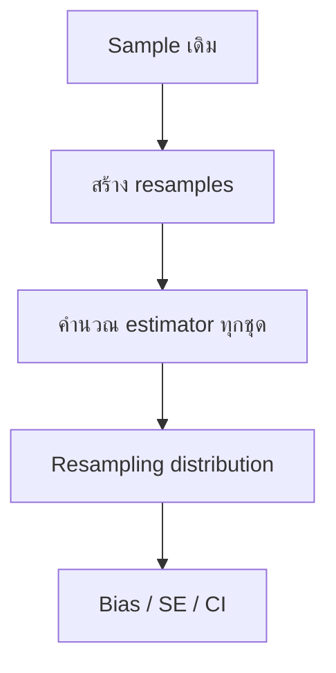

# Jackknife and Bootstrap Methods for Estimation

## 1. ข้อมูลต้นฉบับและขอบเขตบทเรียน

Master Note นี้เรียบเรียงจากสไลด์ **DADS6001: Jackknife and Bootstrap Method for Estimation** จำนวน 14 สไลด์ เนื้อหาจากเอกสารครอบคลุมการทบทวน classical statistical inference แนวคิด resampling, Jackknife สำหรับประมาณ bias และ standard error, Bootstrap สำหรับประมาณ bias, standard error และ confidence interval ตลอดจนแบบฝึกหัด 3 ชุด

> **หมายเหตุการถอดความ:** สมการบางส่วนในไฟล์ต้นฉบับเป็นวัตถุ Equation รุ่นเก่าและซ้อนทับกันเมื่อแสดงผล จึงเขียนใหม่ด้วย notation มาตรฐาน พร้อมตรวจสอบสูตรและตัวอย่างเชิงตัวเลขโดยอิสระ แทนการคัดรูปสมการที่อ่านไม่สมบูรณ์

### แผนระดับความลึก

| ระดับ | หัวข้อ |
|---|---|
| Core | Sampling distribution, resampling, Jackknife, Bootstrap, bias, standard error, confidence interval |
| Supporting | Classical inference, empirical distribution, Monte Carlo error, skewness และ robustness |
| Reference | ประวัติย่อ สูตรสรุป Python workflow และแนวทางเลือกวิธี |

## 2. Learning Objectives

เมื่อเรียนจบบทนี้ ผู้เรียนควรสามารถ:

1. อธิบายเหตุผลที่ต้องใช้ resampling เมื่อ sampling distribution หาได้ยาก
2. แยก population distribution, empirical distribution และ resampling distribution ได้
3. สร้าง leave-one-out samples และคำนวณ Jackknife bias, bias-corrected estimate และ standard error ได้
4. สร้าง Bootstrap samples แบบสุ่มคืนที่ และคำนวณ Bootstrap bias, standard error และ confidence interval ได้
5. เปรียบเทียบ Classical, Jackknife และ Bootstrap พร้อมเลือกวิธีให้เหมาะกับสถานการณ์
6. เขียนโค้ดที่ทำซ้ำได้ ตรวจสอบผล และอธิบายข้อจำกัดของข้อสรุปทางสถิติ

## 3. พื้นฐานที่ต้องรู้ก่อน

### 3.1 Population, sample, parameter และ statistic

- **Population** คือกลุ่มเป้าหมายทั้งหมดที่ต้องการศึกษา
- **Sample** คือข้อมูลบางส่วนที่สุ่มมาจาก population
- **Parameter** คือค่าคงที่ของ population ที่ไม่ทราบ เช่น ค่าเฉลี่ยประชากร $\mu$
- **Statistic** คือค่าที่คำนวณจาก sample เช่น sample mean $\bar{x}$

ถ้าต้องการประมาณ parameter $\theta$ เราเลือก statistic ชนิดหนึ่งเป็น **estimator** และเขียนเป็น $\hat{\theta}$. เมื่อแทนข้อมูลจริงลงไปแล้ว ค่าตัวเลขที่ได้เรียกว่า **estimate**

### 3.2 Random sample และ iid

ให้

$$
X_1, X_2, \ldots, X_n \overset{\mathrm{iid}}{\sim} F
$$

หมายถึงตัวแปรสุ่มทั้ง $n$ ตัวเป็นอิสระต่อกันและมี distribution เดียวกันคือ $F$ คำว่า iid ประกอบด้วย:

- **independent:** การทราบค่าหนึ่งไม่ให้ข้อมูลเกี่ยวกับอีกค่า
- **identically distributed:** ทุกค่ามาจากกลไกหรือ distribution เดียวกัน

ข้อสมมตินี้สำคัญมาก เพราะ resampling จาก sample เดิมจะเลียนแบบโลกที่ข้อมูลแต่ละหน่วยแลกเปลี่ยนตำแหน่งกันได้ หากข้อมูลเป็น time series, cluster, repeated measures หรือมี dependence การสุ่ม observation แยกกันอาจผิดโครงสร้าง

### 3.3 Sampling distribution

ถ้าเราสุ่ม sample ใหม่จาก population ซ้ำจำนวนมาก แล้วคำนวณ $\hat{\theta}$ ทุกครั้ง ค่าของ $\hat{\theta}$ จะเปลี่ยนไป การกระจายของค่าที่ได้เรียกว่า **sampling distribution of the estimator**

Sampling distribution ใช้ตอบคำถามสำคัญ เช่น:

- estimator มี bias หรือไม่
- estimator ผันผวนมากเพียงใด
- standard error เท่าใด
- ช่วงใดควรครอบคลุม parameter ด้วยระดับความเชื่อมั่นที่กำหนด

ปัญหาคือในงานจริงเรามี sample เพียงชุดเดียวและไม่รู้ population distribution $F$ จึงสร้าง sampling distribution จริงไม่ได้โดยตรง Resampling เป็นวิธีใช้ sample เดิมเพื่อประมาณสิ่งที่มองไม่เห็นนี้

## 4. Resampling คืออะไร

### 4.1 Mental model แบบไม่ใช้ศัพท์เทคนิค

สมมติว่าเรามีข้อมูลผู้ป่วย 10 คน และคำนวณค่ากลางได้หนึ่งค่า แต่ต้องการรู้ว่าค่ากลางนี้เสถียรเพียงใด เราไม่สามารถย้อนกลับไปสุ่มผู้ป่วยจากประชากรทั้งหมดซ้ำหลายพันครั้งได้ จึงใช้ข้อมูล 10 คนเป็น “ประชากรจำลอง” แล้วสร้างชุดข้อมูลย่อยหรือชุดข้อมูลสุ่มใหม่หลายชุด จากนั้นดูว่าค่าสถิติเปลี่ยนมากเพียงใด

การเปลี่ยนแปลงน้อยหมายถึง estimator ค่อนข้างเสถียร ส่วนการเปลี่ยนแปลงมากสะท้อนความไม่แน่นอนสูง แต่ต้องจำไว้ว่าเราไม่ได้สร้างข้อมูลใหม่จริง ๆ เพียงใช้ sample เดิมเพื่อประมาณผลของการสุ่มซ้ำ

### 4.2 Formal model

จากข้อมูลสังเกต $x_1,\ldots,x_n$ สร้าง **empirical distribution** $\hat{F}_n$ ซึ่งให้น้ำหนัก $1/n$ แก่แต่ละ observation จากนั้นทำ resampling ตามกฎของวิธีที่เลือก แล้วคำนวณ estimator ซ้ำ



Resampling distribution ไม่ใช่ population distribution และไม่ใช่ sampling distribution จริง แต่เป็นค่าประมาณของ sampling distribution ที่อาศัยข้อมูลใน sample เดิม

## 5. Bias และ Standard Error

### 5.1 Bias

Bias ของ estimator นิยามเป็น

$$
\operatorname{Bias}(\hat{\theta}) = E(\hat{\theta}) - \theta
$$

- Bias เป็นบวก: estimator มีแนวโน้มสูงกว่า parameter
- Bias เป็นลบ: estimator มีแนวโน้มต่ำกว่า parameter
- Bias ใกล้ศูนย์: ไม่ได้แปลว่า estimate แม่นเสมอไป เพราะ variance อาจสูง

Bias-corrected estimate เขียนในรูปทั่วไปได้ว่า

$$
\hat{\theta}_{BC} = \hat{\theta} - \widehat{\operatorname{Bias}}(\hat{\theta})
$$

### 5.2 Standard error

Standard error คือส่วนเบี่ยงเบนมาตรฐานของ sampling distribution:

$$
SE(\hat{\theta}) = \sqrt{\operatorname{Var}(\hat{\theta})}
$$

มันบอกความผันผวนของ estimator ระหว่างการสุ่ม sample ซ้ำ ไม่ใช่การกระจายของข้อมูลรายหน่วย ดังนั้น **standard deviation ของข้อมูล** กับ **standard error ของ estimator** ตอบคนละคำถาม

## 6. Jackknife Resampling

### 6.1 แนวคิดพื้นฐาน

Jackknife ใช้วิธี **ตัด observation ออกทีละหนึ่งตัว** หรือ leave-one-out แล้วคำนวณ estimator ใหม่ทุกครั้ง ถ้า sample มีขนาด $n$ จะได้ Jackknife samples จำนวน $n$ ชุด แต่ละชุดมีขนาด $n-1$

สำหรับ sample $(x_1,x_2,\ldots,x_n)$:

- ชุดที่ 1 ตัด $x_1$: $(x_2,x_3,\ldots,x_n)$
- ชุดที่ 2 ตัด $x_2$: $(x_1,x_3,\ldots,x_n)$
- ชุดที่ $i$ ตัด $x_i$
- ชุดที่ $n$ ตัด $x_n$: $(x_1,x_2,\ldots,x_{n-1})$

ให้ $\hat{\theta}_{(i)}$ เป็น estimate จากชุดที่ตัด observation ลำดับที่ $i$ และให้ค่าเฉลี่ยของ leave-one-out estimates เป็น

$$
\bar{\theta}_{(\cdot)} = \frac{1}{n}\sum_{i=1}^{n}\hat{\theta}_{(i)}
$$

วงเล็บใน subscript $(i)$ หมายถึง “ตัดตัวที่ $i$” ไม่ใช่ observation ลำดับที่ $i$ หลังเรียงข้อมูล

### 6.2 Jackknife estimate of bias

สูตรประมาณ bias คือ

$$
\widehat{\operatorname{Bias}}_{jack}
= (n-1)(\bar{\theta}_{(\cdot)}-\hat{\theta})
$$

และ bias-corrected Jackknife estimate คือ

$$
\hat{\theta}_{jack,BC}
= \hat{\theta}-\widehat{\operatorname{Bias}}_{jack}
$$

จัดรูปได้เป็น

$$
\hat{\theta}_{jack,BC}
= n\hat{\theta}-(n-1)\bar{\theta}_{(\cdot)}
$$

เหตุผลที่คูณด้วย $n-1$ คือ leave-one-out estimate เปลี่ยนจาก estimate เดิมเพียงเล็กน้อย การ scaling ช่วยประมาณ bias ระดับแรกที่ขึ้นกับ $1/n$ สูตรนี้ทำงานดีกับ estimator ที่เปลี่ยนอย่างราบรื่นเมื่อข้อมูลหนึ่งจุดถูกนำออก

### 6.3 Jackknife estimate of standard error

$$
\widehat{SE}_{jack}(\hat{\theta})
= \sqrt{\frac{n-1}{n}
\sum_{i=1}^{n}
(\hat{\theta}_{(i)}-\bar{\theta}_{(\cdot)})^2}
$$

ค่าภายในผลรวมวัดว่า estimate จากแต่ละ leave-one-out sample ห่างจากค่าเฉลี่ยเพียงใด ถ้าการตัด observation เพียงตัวเดียวทำให้ estimate เปลี่ยนมาก standard error จะสูง และยังเป็นสัญญาณว่า estimator อาจถูกครอบงำด้วย influential observations

### 6.4 Worked Example: Fuel efficiency

ข้อมูล mpg จากสไลด์:

$$
26, 23, 21, 23, 19, 29, 15, 26, 19, 26
$$

มี $n=10$ และ sample mean เท่ากับ

$$
\bar{x}=\frac{227}{10}=22.7\text{ mpg}
$$

เมื่อ estimator คือ mean ค่าเฉลี่ยแบบตัดตัวที่ $i$ คำนวณอย่างรวดเร็วได้จาก

$$
\bar{x}_{(i)}=\frac{n\bar{x}-x_i}{n-1}
$$

| ตัดค่า | Leave-one-out mean |
|---:|---:|
| 26 | 22.3333 |
| 23 | 22.6667 |
| 21 | 22.8889 |
| 23 | 22.6667 |
| 19 | 23.1111 |
| 29 | 22.0000 |
| 15 | 23.5556 |
| 26 | 22.3333 |
| 19 | 23.1111 |
| 26 | 22.3333 |

ค่าเฉลี่ยของ leave-one-out means คือ $22.7$ เท่ากับ sample mean ดังนั้น

$$
\widehat{\operatorname{Bias}}_{jack}=9(22.7-22.7)=0
$$

และ

$$
\widehat{SE}_{jack}(\bar{x})=1.3421\text{ mpg}
$$

ตรวจสอบกับ classical formula โดย sample standard deviation คือ $s=4.2439$:

$$
SE(\bar{x})=\frac{s}{\sqrt{n}}
=\frac{4.2439}{\sqrt{10}}
=1.3421
$$

ผลเท่ากันไม่ใช่เรื่องบังเอิญ สำหรับ sample mean สูตร Jackknife SE ลดรูปเป็น $s/\sqrt{n}$ พอดี และ Jackknife bias ของ mean เป็นศูนย์ เพราะ mean เป็น linear statistic

### 6.5 Pseudovalue

อีก notation ที่พบได้บ่อยกำหนด Jackknife pseudovalue เป็น

$$
PV_i=n\hat{\theta}-(n-1)\hat{\theta}_{(i)}
$$

ค่าเฉลี่ย pseudovalue เท่ากับ bias-corrected Jackknife estimate วิธีนี้ช่วยมองว่าการตัดแต่ละ observation ทำให้ estimate ที่ปรับแล้วเปลี่ยนอย่างไร แต่ pseudovalues ไม่ใช่ข้อมูลดิบที่เป็นอิสระกันจริง

### 6.6 จุดแข็งและข้อจำกัด

Jackknife มีข้อดีคือ deterministic ทำซ้ำแล้วได้ผลเหมือนเดิม สร้างเพียง $n$ ชุด และเหมาะกับการตรวจ influence หรือประมาณ SE ของ estimator ที่ smooth เช่น mean, regression coefficient และ correlation ในสถานการณ์ทั่วไป

อย่างไรก็ตาม Jackknife อาจทำงานไม่ดีสำหรับ estimator ที่ไม่ smooth เช่น median, quantile, maximum หรือ model-selection procedure เพราะตัดข้อมูลหนึ่งจุดแล้ว estimate อาจกระโดดหรือไม่เปลี่ยนเลย นอกจากนี้ ordinary Jackknife ที่ตัด observation ทีละตัวไม่เหมาะกับ dependent data โดยตรง

## 7. Bootstrap Resampling

### 7.1 แนวคิดพื้นฐาน

Bootstrap ถือว่า empirical distribution $\hat{F}_n$ เป็นค่าประมาณของ population distribution $F$ แล้วสุ่มข้อมูลขนาด $n$ **แบบคืนที่** จาก sample เดิม ทำซ้ำ $B$ รอบ

Bootstrap sample ที่ $b$ เขียนเป็น

$$
x_1^{*(b)},x_2^{*(b)},\ldots,x_n^{*(b)}
$$

และ estimate จากชุดนั้นคือ

$$
\hat{\theta}^{*(b)}=t(x_1^{*(b)},\ldots,x_n^{*(b)})
$$

เครื่องหมายดอกจันหมายถึงค่าที่ได้จากโลก Bootstrap ไม่ได้หมายถึงค่าจริงของ population

### 7.2 ทำไมต้องสุ่มแบบคืนที่

ถ้าสุ่ม $n$ ค่าจาก sample ขนาด $n$ โดยไม่คืนที่ ทุก resample จะมีข้อมูลเดิมครบทุกค่า เพียงเปลี่ยนลำดับ ดังนั้น statistic เช่น mean หรือ median จะไม่เปลี่ยนและไม่เกิด distribution ของความไม่แน่นอน

การสุ่มแบบคืนที่ทำให้บาง observation ปรากฏซ้ำและบาง observation ไม่ถูกเลือก จึงสร้างความแปรผันที่เลียนแบบการสุ่ม sample ใหม่จาก population

ใน Bootstrap sample ขนาด $n$ จำนวน observation ที่ไม่ซ้ำกันโดยเฉลี่ยประมาณ $0.632n$ เมื่อ $n$ ใหญ่ เพราะความน่าจะเป็นที่ค่าหนึ่งไม่ถูกเลือกเลยคือ

$$
(1-\frac{1}{n})^n \to e^{-1}
$$

ดังนั้นสัดส่วนที่ถูกเลือกอย่างน้อยหนึ่งครั้งเข้าใกล้ $1-e^{-1}\approx0.632$

### 7.3 Bootstrap estimate of bias

ให้

$$
\bar{\theta}^{*}
=\frac{1}{B}\sum_{b=1}^{B}\hat{\theta}^{*(b)}
$$

Bootstrap estimate of bias คือ

$$
\widehat{\operatorname{Bias}}_{boot}
=\bar{\theta}^{*}-\hat{\theta}
$$

และ bias-corrected estimate คือ

$$
\hat{\theta}_{boot,BC}
=2\hat{\theta}-\bar{\theta}^{*}
$$

### 7.4 Bootstrap estimate of standard error

$$
\widehat{SE}_{boot}(\hat{\theta})
=\sqrt{\frac{1}{B-1}
\sum_{b=1}^{B}
(\hat{\theta}^{*(b)}-\bar{\theta}^{*})^2}
$$

สูตรนี้คือ sample standard deviation ของ Bootstrap estimates จำนวน $B$ ค่า เมื่อ $B$ เพิ่มขึ้น Monte Carlo error จากการสุ่ม Bootstrap จะลดลง แต่ข้อจำกัดจาก sample เดิมไม่ได้หายไป

## 8. Bootstrap Confidence Intervals

### 8.1 Normal approximation interval

ถ้า resampling distribution ใกล้สมมาตรและ approximately normal:

$$
\hat{\theta}\pm z_{1-\alpha/2}\widehat{SE}_{boot}
$$

สำหรับ 95% CI ใช้ $z_{0.975}\approx1.96$

ข้อดีคือคำนวณง่าย แต่ช่วงมีรูปสมมาตรรอบ estimate จึงอาจไม่เหมาะเมื่อ distribution เบ้มาก และไม่ได้แก้ bias โดยอัตโนมัติ

### 8.2 Percentile interval

เรียง Bootstrap estimates จากน้อยไปมาก แล้วใช้ empirical quantiles:

$$
CI_{percentile}
=[q^{*}_{\alpha/2},q^{*}_{1-\alpha/2}]
$$

สำหรับ 95% CI ใช้ percentile ที่ 2.5 และ 97.5:

$$
CI_{95}
=[q^{*}_{0.025},q^{*}_{0.975}]
$$

วิธีนี้สะท้อนความไม่สมมาตรของ Bootstrap distribution ได้ แต่ไม่ได้แปลว่าแก้ bias หรือ coverage error ได้เสมอไป

### 8.3 Basic Bootstrap interval

คำอธิบายเพิ่มเติม: วิธีพื้นฐานอีกแบบสะท้อน quantiles รอบ estimate เดิม:

$$
CI_{basic}
=[2\hat{\theta}-q^{*}_{1-\alpha/2},
2\hat{\theta}-q^{*}_{\alpha/2}]
$$

อย่าสับสน basic interval กับ percentile interval เพราะขอบเขตกลับด้านรอบ $\hat{\theta}$

### 8.4 BCa interval

คำอธิบายเพิ่มเติม: Bias-Corrected and Accelerated หรือ BCa interval ปรับทั้ง bias และความเปลี่ยนแปลงของ standard error ตามค่าของ parameter จึงมักมี coverage ดีกว่า simple percentile ในหลายสถานการณ์ แต่ซับซ้อนกว่าและต้องอาศัย Jackknife เพื่อคำนวณ acceleration

## 9. Jackknife กับ Bootstrap ต่างกันอย่างไร

| ประเด็น | Jackknife | Bootstrap |
|---|---|---|
| การสร้างชุดใหม่ | ตัดออกทีละ 1 observation | สุ่มขนาด $n$ แบบคืนที่ |
| จำนวนชุด | เท่ากับ $n$ | กำหนดเป็น $B$ |
| ความสุ่ม | ไม่มี | มี ต้องกำหนด seed |
| งานหลัก | Bias, SE, influence | Bias, SE, CI, sampling distribution |
| Computational cost | มักต่ำกว่า | มักสูงกว่า |
| Estimator ไม่ smooth | อาจล้มเหลว | โดยทั่วไปยืดหยุ่นกว่า แต่ไม่รับประกัน |
| Dependence | ต้องใช้ variant เช่น delete-a-group | ต้องใช้ block/cluster bootstrap |
| จุดตรวจสอบ | ความไวต่อ observation | รูปร่างและความเสถียรของ resampling distribution |

Jackknife ไม่ใช่ Bootstrap ที่ใช้ $B=n$ และ Bootstrap ไม่ใช่การเพิ่ม sample size ทั้งสองวิธีใช้ข้อมูลเดิมเพื่อประมาณ uncertainty ภายใต้ข้อสมมติว่า sample เดิมเป็นตัวแทนที่เหมาะสมของ population

## 10. Worked Example 2: Annual Family Income

ข้อมูล annual income ของ 29 ครอบครัวในสไลด์มีหน่วยเป็น **ร้อยดอลลาร์**

### 10.1 Point estimates

$$
n=29,\qquad \bar{x}=90.2414,\qquad s=20.9926
$$

แปลงหน่วยเป็นดอลลาร์:

- estimated mean = 9,024.14 USD
- estimated standard deviation = 2,099.26 USD

### 10.2 Classical 95% t interval

เพราะไม่ทราบ population standard deviation:

$$
\bar{x}\pm t_{0.975,28}\frac{s}{\sqrt{n}}
$$

โดย $SE=3.8982$ ร้อยดอลลาร์ ได้

$$
[82.2562,98.2265]
$$

หรือประมาณ **8,225.62 ถึง 9,822.65 USD**

การตีความที่ถูกต้องคือ หากสุ่ม sample และสร้างช่วงด้วยกระบวนการนี้ซ้ำในระยะยาว ประมาณ 95% ของช่วงจะครอบคลุม population mean ไม่ใช่ “มีโอกาส 95% ที่ parameter คงที่อยู่ในช่วงนี้” ภายใต้ frequentist interpretation

### 10.3 Bootstrap percentile interval

ตัวอย่างที่ตรวจสอบด้วย $B=200{,}000$ และ seed = 2026 ได้:

$$
\widehat{SE}_{boot}\approx3.8401
$$

$$
CI_{percentile}\approx[82.8966,97.8966]
$$

ผลอาจต่างเล็กน้อยเมื่อเปลี่ยน seed, $B$ หรือวิธีคำนวณ percentile ความใกล้เคียงกับ classical CI เกิดจาก estimator เป็น mean, sample size ไม่เล็กมาก และข้อมูลไม่ได้มีความเบ้รุนแรงจนสองวิธีให้ผลต่างกันมาก

## 11. Worked Example 3: Skewed Data

ข้อมูล 50 ค่าในสไลด์มีค่าตั้งแต่ 1 ถึง 165 และมีค่าด้านขวาขนาดใหญ่หลายค่า จึงคาดว่า distribution เบ้ขวา

### 11.1 Point estimates

$$
n=50,\qquad \bar{x}=43.04,\qquad s=41.9261
$$

### 11.2 Classical 95% t interval

$$
SE=\frac{41.9261}{\sqrt{50}}=5.9292
$$

$$
CI_t=[31.1247,54.9553]
$$

### 11.3 Bootstrap percentile interval

เมื่อใช้ $B=200{,}000$ และ seed = 2026:

$$
\widehat{SE}_{boot}\approx5.8633
$$

$$
CI_{percentile}\approx[32.16,55.08]
$$

Bootstrap interval ไม่ได้ต่างจาก t interval มาก เพราะสิ่งที่ประมาณคือ mean และ $n=50$ ทำให้ sampling distribution ของ mean มีแนวโน้มเข้าใกล้ normal ตาม CLT แม้ข้อมูลรายหน่วยจะเบ้ อย่างไรก็ดี ควรดู histogram/boxplot, influential observations และ Bootstrap distribution ก่อนสรุป ไม่ควรใช้คำว่า “Bootstrap robust ต่อทุกปัญหา”

## 12. Code and Computational Workflow

### 12.1 Jackknife ด้วย Python

```python
import numpy as np

x = np.array([26, 23, 21, 23, 19, 29, 15, 26, 19, 26], dtype=float)
n = len(x)

theta_hat = x.mean()
theta_leave_one_out = np.array([
    np.delete(x, i).mean()
    for i in range(n)
])

theta_dot = theta_leave_one_out.mean()
jackknife_bias = (n - 1) * (theta_dot - theta_hat)
jackknife_se = np.sqrt(
    (n - 1) / n
    * np.sum((theta_leave_one_out - theta_dot) ** 2)
)

print(theta_hat)       # 22.7
print(jackknife_bias)  # 0.0
print(jackknife_se)    # 1.3420548
```

Trace ของ loop:

| รอบ | state ก่อน | operation | output |
|---:|---|---|---:|
| 0 | ข้อมูล 10 ค่า | ตัด 26 ตัวแรก แล้วหา mean | 22.3333 |
| 1 | ข้อมูล 10 ค่า | ตัด 23 แล้วหา mean | 22.6667 |
| … | … | … | … |
| 9 | ข้อมูล 10 ค่า | ตัด 26 ตัวสุดท้าย แล้วหา mean | 22.3333 |

ถ้าลืม `ddof` ในการตรวจเทียบกับ sample SD จะได้ population SD ของ array และ SE ไม่ตรงกับสูตรในสถิติอนุมาน

### 12.2 Bootstrap ด้วย Python

```python
import numpy as np

rng = np.random.default_rng(2026)
B = 20_000
n = len(x)

indices = rng.integers(0, n, size=(B, n))
bootstrap_samples = x[indices]
bootstrap_means = bootstrap_samples.mean(axis=1)

bootstrap_bias = bootstrap_means.mean() - x.mean()
bootstrap_se = bootstrap_means.std(ddof=1)
ci_percentile = np.quantile(bootstrap_means, [0.025, 0.975])
```

รูปร่างข้อมูลสำคัญ:

| ตัวแปร | Shape | ความหมาย |
|---|---:|---|
| `x` | `(n,)` | sample เดิม |
| `indices` | `(B, n)` | ตำแหน่งที่สุ่มแบบคืนที่ |
| `bootstrap_samples` | `(B, n)` | Bootstrap samples ทั้งหมด |
| `bootstrap_means` | `(B,)` | mean หนึ่งค่าต่อหนึ่ง resample |

`axis=1` หมายถึงหา mean ตามแต่ละแถว ถ้าไม่ระบุ axis จะได้ mean เดียวจากข้อมูลทั้งหมดและสูญเสีย resampling distribution

### 12.3 Validation checks

```python
assert bootstrap_samples.shape == (B, n)
assert bootstrap_means.shape == (B,)
assert np.isfinite(bootstrap_means).all()

classical_se = x.std(ddof=1) / np.sqrt(n)
print(classical_se, jackknife_se, bootstrap_se)
```

การรันโดยไม่ error ไม่ได้พิสูจน์ว่าถูก ต้องตรวจอย่างน้อย:

1. สุ่มแบบคืนที่และ resample มีขนาด $n$
2. คำนวณ statistic ต่อ resample ไม่ใช่รวมทุก resample
3. จำนวน Bootstrap estimates เท่ากับ $B$
4. ค่า SE มีหน่วยเดียวกับ estimator
5. ผลเสถียรเมื่อเพิ่ม $B$
6. ไม่มี missing/infinite values ที่ถูกละเลยโดยไม่ตั้งใจ

## 13. Guided Lab

### Objective

เปรียบเทียบ Classical, Jackknife และ Bootstrap สำหรับ mean และ median ภายใต้ข้อมูลเบ้

### ขั้นตอน

1. สร้างข้อมูล `x = [1, 2, 2, 3, 3, 4, 4, 5, 8, 30]`
2. วาด histogram และ boxplot แล้วทำนายว่า mean หรือ median จะไวต่อค่า 30 มากกว่า
3. คำนวณ mean, median และ classical SE ของ mean
4. สร้าง Jackknife estimates สำหรับ mean และ median
5. Bootstrap ทั้งสอง statistics ด้วย $B=20{,}000$ และ seed คงที่
6. เปรียบเทียบรูปร่าง distribution, SE และ percentile CI
7. ลบค่า 30 แล้วทำซ้ำเพื่อวัด influence

### Prediction checkpoint

- mean ควรลดลงมากเมื่อเอา 30 ออก
- median ควรเปลี่ยนน้อยกว่า
- Jackknife ของ median อาจให้ภาพ uncertainty ที่หยาบ เพราะ median เป็น non-smooth statistic
- Bootstrap distribution ของ median อาจเป็นขั้นหรือมีค่าซ้ำมาก

### Deliberate failure experiment

เปลี่ยนการสุ่มจาก

```python
rng.integers(0, n, size=(B, n))
```

เป็นการสุ่มโดยไม่คืนที่ครบ $n$ ค่า แล้วสังเกตว่า mean ของทุก resample เหมือนเดิมและ Bootstrap SE เข้าใกล้ศูนย์ นี่เป็นหลักฐานเชิงทดลองว่าทำไม Bootstrap ต้องสุ่มคืนที่

### Extension

เปลี่ยน statistic เป็น 90th percentile แล้วเปรียบเทียบ Jackknife SE กับ Bootstrap SE อธิบายว่าความไม่ smooth มีผลอย่างไร

## 14. Decision Framework

| สถานการณ์ | วิธีที่ควรพิจารณา | เหตุผลและคำเตือน |
|---|---|---|
| Mean, iid, sample ใหญ่ และ assumptions สมเหตุผล | Classical | เร็ว ตีความง่าย สูตรชัด |
| ต้องตรวจ observation ที่มี influence | Jackknife | leave-one-out แสดงความไวรายจุด |
| SE ของ smooth estimator แต่สูตรซับซ้อน | Jackknife หรือ Bootstrap | ตรวจเทียบสองวิธีได้ |
| Median, quantile หรือ statistic ซับซ้อน | Bootstrap | มักเหมาะกว่า Jackknife แต่ตรวจ discreteness และ sample size |
| Distribution เบ้ | Percentile หรือ BCa Bootstrap | ตรวจ coverage และ bias; percentile ไม่ได้ดีที่สุดเสมอ |
| Time series | Block Bootstrap | ห้ามสุ่มแต่ละเวลาอย่างอิสระ |
| Clustered data | Cluster Bootstrap | resample ที่ระดับ cluster ไม่ใช่ row |
| sample เล็กและไม่ครอบคลุม tail | ไม่มีวิธีใดแก้ข้อมูลที่หายไปได้ | ต้องใช้ domain knowledge/model/เก็บข้อมูลเพิ่ม |

## 15. Validation and Troubleshooting

### Bootstrap CI เปลี่ยนทุกครั้ง

สาเหตุคือ Bootstrap มี Monte Carlo randomness แก้โดยกำหนด seed เพิ่ม $B$ และรายงานทั้ง seed กับจำนวน resamples

### SE เป็นศูนย์หรือเล็กผิดปกติ

ตรวจว่าสุ่มแบบคืนที่หรือไม่ คำนวณ statistic แยกตาม resample หรือไม่ และ statistic นั้นเปลี่ยนได้จริงหรือไม่

### Memory error

การสร้าง matrix ขนาด $(B,n)$ ใช้หน่วยความจำมาก สำหรับข้อมูลใหญ่ให้ประมวลผลเป็น batch หรือ loop แล้วเก็บเฉพาะ Bootstrap estimates

### Missing values

ต้องตัดสินใจวิธีจัดการก่อน resampling หากแต่ละ resample ลบ missing ต่างกัน sample size จะเปลี่ยนและ interpretation ซับซ้อน ห้ามปล่อยให้ฟังก์ชันข้าม NA โดยไม่ทราบพฤติกรรม

### IID assumption ไม่สมเหตุผล

เปลี่ยนหน่วย resampling ให้รักษา dependence เช่น block, cluster หรือ subject-level resampling มิฉะนั้น SE มักต่ำเกินจริง

### CI ดูแปลกหรือไม่ครอบคลุมค่าที่เป็นไปได้

ตรวจ parameter bounds ตัวอย่างเช่น proportion ต้องอยู่ระหว่าง 0 และ 1 การใช้ symmetric normal interval อาจเลยขอบเขต ควรพิจารณาวิธีที่เคารพ geometry ของ parameter หรือ transformation ที่เหมาะสม

## 16. Critical Discussion ระดับปริญญาโท

### 16.1 Resampling ไม่ได้สร้างสารสนเทศใหม่

Bootstrap อาศัย empirical distribution หาก sample ไม่มีเหตุการณ์หายาก ไม่มีส่วน tail หรือมี selection bias, resampling จะทำซ้ำข้อจำกัดนั้น จึงประมาณ uncertainty conditional on observed sample ได้ แต่ไม่แก้ representativeness

### 16.2 Robust ไม่ได้แปลว่า assumption-free

สไลด์เรียก Bootstrap ว่าใช้สร้าง robust estimates เมื่อ parametric assumptions น่าสงสัย ควรตีความอย่างระวัง Bootstrap ยังต้องพึ่ง assumptions เช่น หน่วย resampling ถูกต้อง sample เป็นตัวแทน และ statistic มีพฤติกรรมที่ Bootstrap approximation ใช้ได้

### 16.3 Statistical uncertainty กับ data-quality uncertainty

SE และ CI มักสะท้อน sampling variability แต่ไม่รวม measurement error, coding error, missing-not-at-random, model selection, data leakage หรือความไม่แน่นอนจากการนิยามตัวแปร เว้นแต่กระบวนการเหล่านี้ถูกนำเข้าไปใน resampling workflow

### 16.4 Reproducibility

รายงานควรระบุ algorithm, statistic, resampling unit, $B$, seed, CI method, software version และ data preprocessing เพราะคำว่า “ใช้ Bootstrap 95% CI” อย่างเดียวไม่เพียงพอให้ทำซ้ำ

## 17. Common Misconceptions

1. **Bootstrap เพิ่มจำนวนตัวอย่าง** — ไม่จริง จำนวนข้อมูลอิสระยังเท่าเดิม
2. **Bootstrap sample ต้องไม่มีค่าซ้ำ** — ตรงกันข้าม ค่าซ้ำเกิดจากการสุ่มคืนที่
3. **ยิ่ง $B$ สูง ข้อสรุปยิ่งถูกเสมอ** — $B$ สูงลด Monte Carlo error แต่ไม่แก้ bias ของ sample
4. **Jackknife ใช้ได้ดีกับทุก estimator** — ไม่จริง โดยเฉพาะ non-smooth statistics
5. **ข้อมูลเบ้แปลว่า mean ใช้ไม่ได้ทันที** — ต้องแยก distribution ของข้อมูลจาก sampling distribution ของ mean และพิจารณา $n$, outliers และคำถามวิจัย
6. **95% CI คือ parameter มี probability 0.95 อยู่ในช่วงหลังเห็นข้อมูล** — ไม่ใช่ frequentist interpretation
7. **Percentile interval เป็นวิธีดีที่สุดเสมอ** — ไม่มีวิธีเดียวดีที่สุดทุกสถานการณ์

## 18. Likely Exam Focus

หัวข้อต่อไปนี้เป็นการคาดการณ์จาก learning objectives สูตรที่เน้น และแบบฝึกหัดในสไลด์ ไม่ใช่ข้อมูลข้อสอบจริง:

1. สร้าง Jackknife samples จากข้อมูลขนาดเล็กและคำนวณ bias/SE
2. อธิบายความต่างระหว่าง delete-one กับ sampling with replacement
3. เขียนและตีความสูตร Bootstrap bias และ Bootstrap SE
4. สร้าง percentile CI จาก Bootstrap estimates ที่เรียงแล้ว
5. เปรียบเทียบ classical CI กับ Bootstrap CI ภายใต้ข้อมูลเบ้
6. อธิบายว่าเหตุใด resampling ต้องรักษา dependence structure
7. วิจารณ์ข้อความ “Bootstrap ไม่ต้องมี assumptions”

## 19. Progressive Practice

### 19.1 Guided: นิยาม

**โจทย์:** อธิบายความต่างระหว่าง sampling distribution กับ resampling distribution

**เฉลย:** Sampling distribution เกิดจากการสุ่ม sample ใหม่จาก population จริงซ้ำ ๆ ส่วน resampling distribution เกิดจากการสร้างชุดใหม่จาก sample ที่สังเกตแล้ว จึงเป็นค่าประมาณของ sampling distribution ไม่ใช่สิ่งเดียวกัน

### 19.2 Completion: Jackknife bias

ให้ $n=5$, $\hat{\theta}=10$ และ $\bar{\theta}_{(\cdot)}=10.2$

$$
\widehat{\operatorname{Bias}}_{jack}
=(\square-1)(\square-\square)
$$

**เฉลย:**

$$
(5-1)(10.2-10)=0.8
$$

ดังนั้น bias-corrected estimate เท่ากับ $10-0.8=9.2$

### 19.3 Apply: Bootstrap percentile CI

ให้ Bootstrap estimates ที่เรียงแล้วจำนวน 100 ค่า ถ้ากำหนด 90% CI ควรใช้ percentile ใด

**เฉลย:** $\alpha=0.10$ จึงใช้ percentile ที่ 5 และ 95 หรือ empirical quantiles $q^{*}_{0.05}$ และ $q^{*}_{0.95}$ การเลือกตำแหน่ง array จริงขึ้นกับ quantile convention ของ software

### 19.4 Analyze: เลือกหน่วย resampling

ข้อมูลมีผู้ป่วย 100 คน แต่แต่ละคนมีการวัด 5 เวลา หาก resample 500 rows อย่างอิสระจะผิดอย่างไร

**เฉลย:** การวัดของคนเดียวกันสัมพันธ์กัน การสุ่ม row ทำลาย within-person dependence และปฏิบัติต่อ 500 rows ราวกับเป็นข้อมูลอิสระ จึงมักประเมิน SE ต่ำเกินจริง ควร resample ผู้ป่วยทั้งคน หรือใช้วิธีที่รักษา longitudinal structure

### 19.5 Evaluate: Bootstrap แก้ small sample หรือไม่

**คำตอบตัวอย่าง:** Bootstrap ช่วยหลีกเลี่ยงสูตร analytic บางชนิด แต่ไม่ได้รับประกัน inference ที่ดีใน sample เล็ก เพราะ empirical distribution อาจแทน population ไม่ดี โดยเฉพาะ tail, rare events และ extreme quantiles ต้องประเมิน estimator, data-generating process และ coverage ผ่าน simulation หรือทฤษฎีที่เกี่ยวข้อง

## 20. Exam Blueprint

| Objective | ระดับ | Assessment evidence |
|---|---|---|
| อธิบาย resampling | Explain | ข้อ 19.1 |
| คำนวณ Jackknife bias | Apply | ข้อ 19.2 |
| สร้าง Bootstrap CI | Apply | ข้อ 19.3 |
| รักษา dependence | Analyze | ข้อ 19.4 |
| วิจารณ์ข้อจำกัด | Evaluate | ข้อ 19.5 |
| ทำ workflow ครบ | Create | Mini-project |

## 21. Mini-project: Hospital Waiting Time

โรงพยาบาลต้องการประมาณ median waiting time และ 90th percentile จากข้อมูลผู้ป่วย 300 ราย

### งานที่ต้องทำ

1. ตรวจ missing, unit, duplicate visit และ outliers
2. อธิบายว่า observation ใดเป็นหน่วยอิสระ
3. คำนวณ point estimates
4. ใช้ Jackknife และ Bootstrap ประมาณ SE ของ median
5. สร้าง 95% Bootstrap percentile CI ของ median และ 90th percentile
6. ทำ sensitivity analysis โดยเปลี่ยน $B$ และ seed
7. อธิบาย limitation หากข้อมูลมาจากช่วงเวลาที่ระบบคิวล่ม

### Rubric

| เกณฑ์ | คะแนน |
|---|---:|
| นิยาม estimand และหน่วยวิเคราะห์ถูกต้อง | 20 |
| Workflow ทำซ้ำได้ | 20 |
| เลือก resampling scheme ถูกต้อง | 20 |
| ตีความ estimate, SE และ CI ถูกต้อง | 20 |
| Validation และข้อจำกัด | 20 |

## 22. Mastery Checklist

- [ ] แยก parameter, estimator, estimate และ standard error ได้
- [ ] อธิบาย empirical distribution และเหตุผลของ sampling with replacement ได้
- [ ] สร้าง leave-one-out samples ครบ $n$ ชุดได้
- [ ] คำนวณ Jackknife bias, corrected estimate และ SE ได้
- [ ] เขียน Bootstrap algorithm พร้อม seed และ $B$ ได้
- [ ] สร้างและตีความ normal กับ percentile CI ได้
- [ ] ตรวจความเสถียรเมื่อเพิ่ม $B$ ได้
- [ ] เลือก resampling unit สำหรับ iid, cluster และ time series ได้
- [ ] อธิบายว่า Bootstrap ไม่แก้ selection bias หรือข้อมูลที่ sample ไม่เคยเห็นได้

## 23. Key Takeaways

1. Resampling ใช้ sample เดิมเพื่อประมาณ sampling distribution ที่ไม่ทราบ
2. Jackknife ตัดข้อมูลออกทีละหนึ่ง เหมาะกับ bias, SE และ influence ของ smooth estimators
3. Bootstrap สุ่มขนาด $n$ แบบคืนที่จำนวน $B$ รอบ ยืดหยุ่นกว่าในการสร้าง SE และ CI
4. การเลือกวิธีต้องพิจารณา estimator, sample size, skewness และ dependence ไม่ใช่เลือกจากชื่อวิธีอย่างเดียว
5. เพิ่ม $B$ ลดเพียง Monte Carlo error แต่ไม่เพิ่ม information หรือแก้ sample bias
6. การตีความ uncertainty ที่ดีต้องมาพร้อม validation, reproducibility และข้อจำกัด

## 24. Glossary

| คำศัพท์ | ความหมาย |
|---|---|
| Empirical distribution | Distribution ที่ให้น้ำหนักเท่ากันแก่ observations ใน sample |
| Resample | ชุดข้อมูลที่สร้างใหม่จาก sample เดิมตามกฎที่กำหนด |
| Leave-one-out | ตัด observation หนึ่งตัวออกจาก sample |
| Bootstrap sample | Sample ขนาด $n$ ที่สุ่มแบบคืนที่จากข้อมูลเดิม |
| Bootstrap replicate | ค่า statistic หนึ่งค่าจาก Bootstrap sample หนึ่งชุด |
| Bias | ความต่างระหว่าง expected estimator กับ parameter |
| Standard error | SD ของ sampling distribution ของ estimator |
| Percentile CI | CI ที่ใช้ quantiles ของ Bootstrap estimates โดยตรง |
| Monte Carlo error | ความผันผวนจากจำนวนการจำลองที่มีขอบเขตจำกัด |
| Smooth estimator | Estimator ที่เปลี่ยนอย่างค่อยเป็นค่อยไปเมื่อ empirical distribution เปลี่ยนเล็กน้อย |

## 25. Source Coverage Audit

| เนื้อหาในสไลด์ | ตำแหน่งใน Master Note |
|---|---|
| Classical statistical method และ sampling distribution | §§3–5 |
| Resampling overview | §4 |
| Jackknife history, bias และ SE | §6 |
| Exercise 1: Fuel efficiency | §6.4 |
| Bootstrap definition, bias และ SE | §7 |
| Classical/Percentile CI | §8 |
| Exercise 2: Family income | §10 |
| Exercise 3: Skewed data | §11 |
| การใช้ software และการเปรียบเทียบ | §§12–15 |

## 26. References

### จากเอกสารต้นฉบับ

1. Efron, B. (1979). *Bootstrap Methods: Another Look at the Jackknife*. The Annals of Statistics, 7(1), 1–26. [Project Euclid](https://projecteuclid.org/journals/annals-of-statistics/volume-7/issue-1/Bootstrap-Methods-Another-Look-at-the-Jackknife/10.1214/aos/1176344552.full)
2. Efron, B. (1982). *The Jackknife, the Bootstrap, and Other Resampling Plans*. SIAM.
3. Efron, B., & Tibshirani, R. J. (1993). *An Introduction to the Bootstrap*. Chapman & Hall.
4. Quenouille, M. H. (1949). Approximate Tests of Correlation in Time-Series. *Journal of the Royal Statistical Society: Series B*, 11(1), 68–84.
5. Quenouille, M. H. (1956). Notes on Bias in Estimation. *Biometrika*, 43(3/4), 353–360.
6. Tukey, J. W. (1958). Bias and Confidence in Not Quite Large Samples. *The Annals of Mathematical Statistics*, 29(2), 614.

### คำอธิบายเพิ่มเติมและการคำนวณ

ตัวเลขใน Worked Examples ตรวจสอบซ้ำด้วย Python/NumPy และ SciPy โดยกำหนด seed = 2026 สำหรับ Bootstrap simulation ผล Bootstrap อาจต่างเล็กน้อยตาม seed, จำนวน resamples และ quantile convention ของ software
