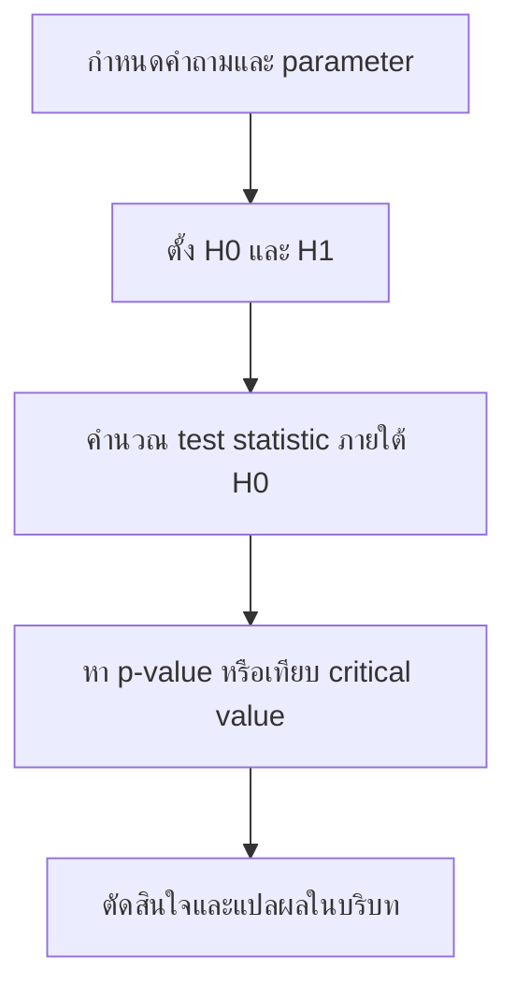

# Hypothesis Testing

> **Course:** DADS6001 Applied Modern Statistical Analysis  
> **Week:** 04  
> **Source:** `dads6001-applied_statistics/lecture/dads6001_04_hypothesis_testing.pptx` จำนวน 21 สไลด์  
> **Main topics:** Null and alternative hypotheses, test statistics, critical regions, p-values, Type I/II errors, power, tests for means and proportions

> **Course navigation:** [Course Overview](00_readme.md) · บทก่อนหน้า [03 Jackknife and Bootstrap](03_jackknife_bootstrap.md)

## 1. ข้อมูลต้นฉบับและขอบเขตบทเรียน

บทนี้เรียบเรียงจากสไลด์เรื่องการทดสอบสมมุติฐาน เนื้อหาต้นฉบับเริ่มจากตัวอย่างคำถามวิจัย อธิบาย $H_0$, $H_1$, ตรรกะของการทดสอบ ตัวสถิติทดสอบ เขตวิกฤต ความผิดพลาดสองประเภท power และ p-value ก่อนสรุปสูตรทดสอบค่าเฉลี่ยและสัดส่วนหนึ่งหรือสองประชากร รวมถึงการชี้ทางไปยัง ANOVA สำหรับหลายประชากร

สมการบางหน้าเป็นวัตถุ Equation รุ่นเก่าที่ซ้อนทับกันเมื่อ render อันอันจึงถอดความหมายและเขียนใหม่ด้วย notation มาตรฐาน โดยยึดหัวข้อและทิศทางการทดสอบจากสไลด์ แต่ตรวจสูตรกับหลักสถิติอีกครั้ง จุดที่ถ้อยคำในสไลด์อาจทำให้เข้าใจผิดจะระบุไว้โดยตรงในหัวข้อ “ข้อแก้ความเข้าใจ”

### แผนระดับความลึก

| ระดับ | หัวข้อ |
|---|---|
| Core | $H_0/H_1$, test statistic, rejection region, p-value, Type I/II errors, power, one/two-sample tests for means and proportions |
| Supporting | one-tailed/two-tailed tests, assumptions, relation to confidence intervals, effect size, sample size |
| Reference | ANOVA overview, decision table, Python workflow และสูตรสรุป |

## 2. Learning Objectives

เมื่อเรียนจบบทนี้ ผู้เรียนควรสามารถ:

1. แปลงคำถามวิจัยเป็น parameter และตั้ง $H_0/H_1$ พร้อมเลือกทิศทางการทดสอบ
2. อธิบายตรรกะของ hypothesis testing โดยไม่ตีความว่า “ไม่ปฏิเสธ $H_0$” เท่ากับพิสูจน์ว่า $H_0$ จริง
3. คำนวณ test statistic, critical region และ p-value แล้วตัดสินใจที่ระดับนัยสำคัญที่กำหนด
4. แยก Type I error, Type II error, significance level และ power พร้อมวิเคราะห์ trade-off
5. เลือกและดำเนินการทดสอบค่าเฉลี่ยหนึ่งประชากร สองกลุ่มอิสระ และข้อมูลจับคู่
6. เลือกและดำเนินการทดสอบสัดส่วนหนึ่งและสองประชากร
7. ตรวจ assumptions ตีความผลในบริบท และแยก statistical significance ออกจาก practical significance

## 3. พื้นฐานที่ต้องรู้ก่อน

บทนี้ต่อจาก [01 Introduction](01_introduction.md) และ [02 Interval Estimation](02_interval_estimation.md) โดยตรง ผู้เรียนควรรู้จัก population, sample, parameter, statistic, sampling distribution, standard error, Normal distribution, Student's t distribution และ confidence interval ก่อน

ให้ $\theta$ แทน parameter ที่ต้องการศึกษา เช่น population mean $\mu$, difference in means $\mu_1-\mu_2$ หรือ population proportion $p$ ส่วน $\hat{\theta}$ คือ estimator ที่คำนวณจาก sample ความผันผวนของ $\hat{\theta}$ ระหว่างการสุ่มซ้ำวัดด้วย standard error

Confidence interval และ hypothesis test ใช้กลไกเดียวกัน คือเปรียบเทียบค่าประมาณกับความผันผวนตาม sampling distribution ความต่างคือ CI แสดงช่วงค่าที่เข้ากันได้กับข้อมูล ส่วน test เริ่มจากค่าที่กำหนดภายใต้ $H_0$ แล้วถามว่าข้อมูลที่พบสุดโต่งเกินกว่าจะอธิบายด้วยค่านั้นหรือไม่

## 4. Concept Foundation: Hypothesis Testing คืออะไร

Statistical hypothesis คือข้อความเกี่ยวกับ population หรือกลไกที่สร้างข้อมูล เช่น “ค่าเฉลี่ยเวลารอเท่ากับ 30 นาที” หรือ “สัดส่วนผู้ป่วยที่พึงพอใจมากกว่า 80%” เราไม่สามารถตรวจ population ทั้งหมดได้ จึงใช้ sample เป็นหลักฐานเพื่อประเมินว่าข้อความหนึ่งยังสมเหตุสมผลหรือขัดกับข้อมูลมากเพียงใด

Hypothesis testing เป็นกระบวนการตัดสินใจภายใต้ความไม่แน่นอน ไม่ใช่เครื่องพิสูจน์ความจริงแบบเด็ดขาด เราสมมุติ $H_0$ ชั่วคราว สร้าง sampling distribution ที่ควรเกิดเมื่อ $H_0$ จริง แล้วดูว่า statistic จาก sample อยู่ในบริเวณปกติหรือบริเวณสุดโต่ง หากสุดโต่งมากพอตามเกณฑ์ที่กำหนด เราปฏิเสธ $H_0$; หากไม่สุดโต่งพอ เราเพียง “ไม่ปฏิเสธ $H_0$” เพราะหลักฐานยังไม่พอ

### ตัวอย่างเล็กที่สุด

สมมุติโรงพยาบาลอ้างว่าเวลารอเฉลี่ยคือ 30 นาที เราสุ่มผู้ป่วยและได้ค่าเฉลี่ย 31 นาที ความต่าง 1 นาทีอาจเกิดจาก sampling variation ได้ง่าย แต่ถ้าได้ 45 นาทีและ standard error เล็ก ผลนั้นจะอยู่ไกลจากสิ่งที่ $H_0$ คาดไว้มากกว่า Hypothesis test จึงไม่ได้ดูเฉพาะ “ต่างกี่หน่วย” แต่เทียบความต่างกับ uncertainty

## 5. First-pass Mental Model: การพิจารณาคดีเชิงสถิติ

ให้นึกว่า $H_0$ เป็นสถานะตั้งต้น คล้ายหลัก “ยังไม่ลงโทษจนกว่าหลักฐานเพียงพอ” ข้อมูล sample คือหลักฐาน และ test statistic คือวิธีแปลงหลักฐานให้เป็นคะแนนมาตรฐาน เขตวิกฤตคือระดับความสุดโต่งที่ตกลงล่วงหน้าว่าจะถือว่าหลักฐานแรงพอ

อุปมานี้ช่วยจำตรรกะ แต่มีขอบเขต: $H_0$ ไม่จำเป็นต้องเป็นความบริสุทธิ์หรือสิ่งที่เราเชื่อจริง และ p-value ไม่ใช่ probability ที่ $H_0$ จริง การทดสอบแบบ frequentist คำนวณ probability ของข้อมูลภายใต้สมมุติฐาน ไม่ได้คำนวณ probability ของสมมุติฐานหลังเห็นข้อมูล



## 6. การตั้ง Null และ Alternative Hypotheses

### 6.1 Null hypothesis

$H_0$ คือโมเดลฐานที่ใช้สร้าง reference distribution ของ test statistic โดยทั่วไปเขียนให้มี equality ที่ boundary เช่น

$$
H_0: \mu = \mu_0
$$

สำหรับคำกล่าวเชิงทิศทาง เช่น “ค่าเฉลี่ยไม่เกิน 30” สามารถเขียน composite null เป็น $H_0:\mu\le30$ แต่เวลาคำนวณ critical value มักใช้ boundary $\mu=30$ เพราะเป็นจุดที่ควบคุม Type I error สำหรับการทดสอบด้านขวา

### 6.2 Alternative hypothesis

$H_1$ คือทิศทางหรือชุดค่าที่เป็นคู่แข่งกับ $H_0$ และเป็นตัวกำหนดตำแหน่งของ rejection region

| คำถามวิจัย | $H_0$ | $H_1$ | ชนิดการทดสอบ |
|---|---|---|---|
| ค่าเฉลี่ยแตกต่างจาก 30 หรือไม่ | $\mu=30$ | $\mu\ne30$ | Two-sided |
| ค่าเฉลี่ยสูงกว่า 30 หรือไม่ | $\mu\le30$ | $\mu>30$ | Right-tailed |
| ค่าเฉลี่ยต่ำกว่า 30 หรือไม่ | $\mu\ge30$ | $\mu<30$ | Left-tailed |

ทิศทางต้องกำหนดจาก research question ก่อนเห็นข้อมูล ห้ามเห็นค่าเฉลี่ยตัวอย่างแล้วค่อยเลือก one-tailed test เพราะจะเพิ่มโอกาส false positive โดยไม่ประกาศไว้ล่วงหน้า

### 6.3 ตัวอย่างจากสไลด์: ความถนัดคณิตศาสตร์

ให้ $\mu_M$ และ $\mu_F$ แทนคะแนนเฉลี่ยของประชากรชายและหญิง หากคำถามคือ “ผู้ชายมีคะแนนเฉลี่ยสูงกว่าหรือไม่” hypotheses ที่เหมาะสมคือ

$$
H_0: \mu_M-\mu_F \le 0
$$

$$
H_1: \mu_M-\mu_F > 0
$$

ตอนคำนวณ test statistic ใช้ค่าขอบเขตศูนย์ ไม่ใช่ใช้ sample means 14 และ 10 เป็น hypotheses เพราะ hypotheses กล่าวถึง population parameters

### 6.4 ข้อแก้ความเข้าใจจากสไลด์

สไลด์บางตัวอย่างเขียน $H_0$ และ $H_1$ ด้วยอสมการที่ไม่ครอบคลุม parameter space ครบ เช่น $H_0:\mu_A-\mu_B<0$ เทียบกับ $H_1:\mu_A-\mu_B>0$ ทำให้กรณีเท่ากับศูนย์หายไป วิธีมาตรฐานต้องให้สองชุดไม่ทับกันและรวมกันครอบคลุมค่าที่เป็นไปได้ เช่น $H_0:\mu_A-\mu_B\le0$ กับ $H_1:\mu_A-\mu_B>0$

## 7. ตรรกะของการทดสอบ

สไลด์ใช้แนวคิดว่า ถ้า $H_0$ จริง เราคาดว่าข้อมูลจะมีลักษณะที่เข้ากับ $H_0$ หากข้อมูลกลับอยู่ในบริเวณที่แทบไม่เกิดภายใต้ $H_0$ นั่นเป็นหลักฐานคัดค้าน $H_0$ ตรรกะนี้คล้าย proof by contradiction แต่ไม่เด็ดขาด เพราะเหตุการณ์ที่ probability ต่ำยังเกิดขึ้นได้

ตัวอย่าง หาก $H_0:\mu=100$ จริง sample mean มักอยู่ใกล้ 100 แต่การพบ $\bar{x}\approx100$ ไม่ได้พิสูจน์ว่า $\mu=100$ เพราะ population mean อื่นอาจสร้าง sample แบบนี้ได้เช่นกัน ในทางกลับกัน หาก $\bar{x}$ อยู่ไกลมากเมื่อเทียบกับ SE เรามีหลักฐานว่ารูปแบบที่ $H_0$ ทำนายไม่สอดคล้องกับข้อมูล

ดังนั้นคำตัดสินมีเพียง:

- **Reject $H_0$:** หลักฐานขัดกับ $H_0$ มากพอตามเกณฑ์ $\alpha$
- **Fail to reject $H_0$:** หลักฐานยังไม่พอปฏิเสธ ไม่ได้แปลว่า $H_0$ ถูกพิสูจน์แล้ว

## 8. Test Statistic, Critical Value และ Rejection Region

Test statistic คือฟังก์ชันของข้อมูลที่วัดว่าค่าประมาณห่างจากค่าภายใต้ $H_0$ กี่ standard errors โครงสร้างทั่วไปคือ

$$
\mathrm{Test\ statistic}
=
\frac{\mathrm{Estimate}-\mathrm{Null\ value}}
{\mathrm{SE\ under\ }H_0}
$$

ค่าบวกมากสนับสนุน alternative ด้านขวา ค่าลบมากสนับสนุนด้านซ้าย และค่าสัมบูรณ์มากสนับสนุน two-sided alternative

Critical value คือเส้นแบ่งระหว่างบริเวณที่ยังเข้ากับ $H_0$ กับ rejection region โดยเลือกให้ probability ของการตกใน rejection region เมื่อ $H_0$ จริงเท่ากับ $\alpha$ ตัวอย่าง two-sided z test ที่ $\alpha=0.05$ ใช้ critical values ประมาณ $-1.96$ และ $1.96$

## 9. Significance Level, Type I/II Errors และ Power

เพราะการตัดสินใจใช้ sample จึงผิดได้สองแบบ

| ความจริง | Reject $H_0$ | Fail to reject $H_0$ |
|---|---|---|
| $H_0$ จริง | Type I error | ตัดสินใจถูก |
| $H_0$ ไม่จริง | ตัดสินใจถูก | Type II error |

### 9.1 Type I error และ significance level

$$
\alpha = \mathrm{P}(\mathrm{Reject\ }H_0 \mid H_0\mathrm{\ true})
$$

$\alpha$ คืออัตรา false positive ระยะยาวที่ยอมรับภายใต้กระบวนการทดสอบ ไม่ใช่ probability ว่าการตัดสินใจครั้งนี้ผิด

### 9.2 Type II error และ power

$$
\beta = \mathrm{P}(\mathrm{Fail\ to\ reject\ }H_0 \mid H_1\mathrm{\ true})
$$

$$
\mathrm{Power}=1-\beta
$$

Power คือโอกาสที่ test จะตรวจพบ effect ขนาดหนึ่งเมื่อ effect นั้นมีจริง ค่า power ไม่ได้มีค่าเดียวโดยไม่มีการระบุ effect size เพราะ effect ยิ่งห่างจาก null ยิ่งตรวจพบง่าย

### 9.3 Trade-off

เมื่อ sample size คงที่ การลด $\alpha$ ทำให้เกณฑ์เข้มขึ้นและมักเพิ่ม $\beta$ การเพิ่ม sample size ช่วยลดทั้ง uncertainty และเพิ่ม power โดยไม่จำเป็นต้องผ่อน $\alpha$ ปัจจัยที่เพิ่ม power ได้แก่ effect size ใหญ่ขึ้น, variability ต่ำลง, sample ใหญ่ขึ้น และ one-sided test ที่กำหนดทิศทางถูกต้องล่วงหน้า

## 10. p-value

p-value คือ probability ภายใต้ $H_0$ ที่จะได้ test statistic อย่างน้อยสุดโต่งเท่าค่าที่สังเกต ในทิศทางที่ $H_1$ กำหนด เขียนเชิงแนวคิดได้ว่า

$$
p\mathrm{-value}
=
\mathrm{P}(\mathrm{result\ at\ least\ as\ extreme\ as\ observed}\mid H_0)
$$

กฎการตัดสินใจคือ

$$
p\mathrm{-value}\le\alpha
\quad\Rightarrow\quad
\mathrm{Reject\ }H_0
$$

หาก $p\mathrm{-value}>\alpha$ ให้ fail to reject $H_0$

### 10.1 การเลือกพื้นที่หาง

ถ้า $T$ คือ test statistic ที่สังเกตได้เป็น $t_{obs}$:

- Right-tailed: พื้นที่ตั้งแต่ $t_{obs}$ ไปทางขวา
- Left-tailed: พื้นที่ตั้งแต่ $t_{obs}$ ไปทางซ้าย
- Two-sided: รวมความสุดโต่งทั้งสองด้านตาม null distribution

สูตร “สองเท่าของพื้นที่หางเดียว” ใช้ตรงไปตรงมาเมื่อ null distribution สมมาตรและวัดความสุดโต่งด้วยค่าสัมบูรณ์ สำหรับการแจกแจงไม่สมมาตรหรือ discrete exact test ต้องใช้คำนิยามของวิธีนั้น ไม่ควรคูณสองโดยอัตโนมัติ

### 10.2 p-value ไม่ใช่อะไร

- ไม่ใช่ probability ที่ $H_0$ จริง
- ไม่ใช่ probability ที่ผลเกิดจากความบังเอิญ
- ไม่บอกขนาดหรือความสำคัญเชิงปฏิบัติของ effect
- ค่าใหญ่ไม่ได้พิสูจน์ว่า “ไม่มี effect”; อาจเกิดจาก sample เล็กหรือ test มี power ต่ำ

## 11. ขั้นตอนการทดสอบสมมุติฐานอย่างเป็นระบบ

1. ระบุ research question, population, parameter และ estimand
2. ตั้ง $H_0/H_1$ และทิศทางก่อนดูผล
3. เลือก $\alpha$ และกำหนด practical significance
4. ตรวจ design: independent, paired, clustered หรือ repeated measures
5. เลือก test statistic และ assumptions
6. คำนวณ statistic กับ p-value หรือเทียบ critical value
7. ตรวจ sensitivity, effect size และ confidence interval
8. ตัดสินใจด้วยคำว่า reject/fail to reject
9. แปลผลในหน่วยและบริบทจริง พร้อมข้อจำกัด

## 12. One-sample t Test for a Mean

เมื่อสุ่มข้อมูล (X_1,\ldots,X_n) อย่างอิสระจากประชากรที่มี mean $\mu$ และไม่ทราบ population variance ใช้

$$
t=
\frac{\bar{X}-\mu_0}{s/\sqrt{n}}
$$

ภายใต้ $H_0:\mu=\mu_0$ และ assumptions ที่เหมาะสม statistic นี้มี t distribution ที่ (n-1) degrees of freedom

ตัวเศษวัด observed effect ส่วนตัวส่วนวัด sampling uncertainty ดังนั้นค่าเฉลี่ยที่ต่างเท่ากันอาจให้ผลต่างกันหาก sample size หรือ variability ต่างกัน

### Assumptions

- observations เป็น random และ independent ตาม sampling design
- population ใกล้ Normal สำหรับ sample เล็ก หรือ sample ใหญ่พอให้ sampling distribution ของ mean ใกล้ Normal
- ไม่มี outlier รุนแรงที่ทำให้ mean และ SD บิดเบือน โดยเฉพาะเมื่อ $n$ เล็ก

## 13. Worked Example: เวลารอเฉลี่ย

โรงพยาบาลต้องการตรวจว่าเวลารอเฉลี่ยสูงกว่าเกณฑ์ 30 นาทีหรือไม่ สุ่มผู้ป่วย $n=25$ คน ได้ $\bar{x}=34$ นาที และ $s=10$ นาที กำหนด $\alpha=0.05$

### Step 1: ตั้งสมมุติฐาน

$$
H_0:\mu\le30
$$

$$
H_1:\mu>30
$$

### Step 2: คำนวณ standard error

$$
SE=\frac{10}{\sqrt{25}}=2
$$

### Step 3: คำนวณ statistic

$$
t=\frac{34-30}{2}=2.00
$$

Degrees of freedom เท่ากับ 24 สำหรับ right-tailed test ค่านี้ให้ p-value ประมาณ 0.028 จึงปฏิเสธ $H_0$ ที่ $\alpha=0.05$

### Step 4: แปลผล

ข้อมูลให้หลักฐานทางสถิติว่าเวลารอเฉลี่ยสูงกว่า 30 นาที แต่ observed difference เท่ากับ 4 นาที ต้องพิจารณาต่อว่า 4 นาทีมีความสำคัญเชิงบริการหรือไม่ และ sample เป็นตัวแทนของช่วงเวลา/หน่วยบริการเป้าหมายเพียงใด

### Validation

ใช้ critical-value approach ได้ผลเดียวกัน เพราะ (t_{0.95,24}\approx1.711) และ (2.00>1.711) นอกจากนี้ one-sided 95% lower confidence bound ควรอยู่เหนือ 30 เมื่อ test ปฏิเสธ $H_0$

## 14. Tests for Two Independent Means

ให้กลุ่ม 1 และ 2 เป็นคนละหน่วยสังเกต และต้องการทดสอบ

$$
H_0:\mu_1-\mu_2=\Delta_0
$$

โดยทั่วไป $\Delta_0=0$

### 14.1 Welch t test: ไม่สมมุติ equal variances

$$
t=
\frac{(\bar{X}_1-\bar{X}_2)-\Delta_0}
{\sqrt{s_1^2/n_1+s_2^2/n_2}}
$$

Welch test เป็น default ที่ปลอดภัยกว่าสำหรับ independent groups เพราะไม่ต้องสมมุติ population variances เท่ากัน degrees of freedom ใช้ Welch–Satterthwaite approximation

### 14.2 Pooled t test: สมมุติ equal variances

$$
s_p^2=
\frac{(n_1-1)s_1^2+(n_2-1)s_2^2}
{n_1+n_2-2}
$$

$$
t=
\frac{(\bar{X}_1-\bar{X}_2)-\Delta_0}
{s_p\sqrt{1/n_1+1/n_2}}
$$

Degrees of freedom เท่ากับ (n_1+n_2-2) วิธี pooled เหมาะเมื่อมีเหตุผลจาก design หรือ domain ว่า variances เท่ากัน ไม่ควรเลือกเพียงเพราะ preliminary variance test ไม่ significant

### 14.3 Worked Example จากสไลด์

เด็กชายและเด็กหญิงกลุ่มละ 11 คน มี sample means 14 และ 10 และ SD เท่ากับ 3 และ 2 ตามลำดับ หากใช้ Welch test เพื่อทดสอบด้านขวา:

$$
SE=
\sqrt{\frac{3^2}{11}+\frac{2^2}{11}}
=1.087
$$

$$
t=\frac{14-10}{1.087}=3.68
$$

ค่า statistic อยู่ไกลทางขวาและให้หลักฐานคัดค้าน equal-mean null อย่างมาก อย่างไรก็ตาม การสรุปเชิงสาเหตุต้องพิจารณาวิธีสุ่ม ความเท่าเทียมของข้อสอบ และ confounders ไม่ใช่อาศัย p-value เพียงอย่างเดียว

## 15. Paired t Test

ข้อมูล paired เกิดเมื่อแต่ละค่าของกลุ่มหนึ่งเชื่อมกับอีกค่าหนึ่ง เช่น before/after ของคนเดียวกันหรือ matched twins วิธีที่ถูกต้องคือสร้าง difference ภายในคู่

$$
d_i=X_{1i}-X_{2i}
$$

แล้วทดสอบ mean difference ด้วย one-sample t test

$$
t=
\frac{\bar{d}-\mu_{d,0}}
{s_d/\sqrt{n}}
$$

Degrees of freedom เท่ากับ (n-1) จุดสำคัญคือ (s_d) รวม covariance ภายในคู่ไว้แล้ว การปฏิบัติต่อข้อมูล paired เป็น independent groups ทิ้งสารสนเทศความสัมพันธ์และอาจประมาณ SE ผิด

### Worked Example: คะแนนก่อนและหลังเรียน

สมมุติ differences หลังลบก่อนของนักศึกษา 8 คนมี $\bar{d}=2.5$, $s_d=2.0$ ต้องการทดสอบว่าคะแนนเพิ่มขึ้น:

$$
H_0:\mu_d\le0
$$

$$
H_1:\mu_d>0
$$

$$
t=\frac{2.5}{2/\sqrt{8}}=3.54
$$

ให้ใช้ t distribution ที่ 7 degrees of freedom การตีความต้องกล่าวถึง “ค่าเฉลี่ยของ within-person changes” ไม่ใช่ความต่างระหว่างคนสองกลุ่ม

## 16. Tests for Population Proportions

ข้อมูลสัดส่วนเกิดจากจำนวน successes $X$ ใน $n$ Bernoulli trials โดย $\hat{p}=X/n$ เมื่อ sample ใหญ่พอ Normal approximation ช่วยสร้าง z statistic ได้

### 16.1 One-proportion z test

ภายใต้ $H_0:p=p_0$:

$$
z=
\frac{\hat{p}-p_0}
{\sqrt{p_0(1-p_0)/n}}
$$

สังเกตว่าตัวส่วนใช้ $p_0$ เพราะ sampling distribution ถูกสร้างภายใต้ null ควรตรวจว่า $np_0$ และ $n(1-p_0)$ มากพอ หากไม่พอให้พิจารณา exact binomial test

### Worked Example: ความเห็นต่อวัคซีน

สุ่มนักศึกษา 200 คน พบว่า 170 คนเห็นด้วยกับวัคซีน จึงได้ $\hat{p}=0.85$ ต้องการทดสอบว่ามากกว่า 0.80 หรือไม่

$$
z=
\frac{0.85-0.80}
{\sqrt{0.80(0.20)/200}}
=1.77
$$

right-tailed p-value ประมาณ 0.038 จึงปฏิเสธ $H_0$ ที่ $\alpha=0.05$ แต่ margin เหนือเกณฑ์มีเพียง 5 percentage points จึงต้องพิจารณาความสำคัญทางนโยบายแยกต่างหาก

### 16.2 Two-proportion z test

สำหรับ independent groups ภายใต้ $H_0:p_1=p_2$ ใช้ pooled proportion

$$
\hat{p}_{pool}=\frac{x_1+x_2}{n_1+n_2}
$$

$$
z=
\frac{\hat{p}_1-\hat{p}_2}
{\sqrt{\hat{p}_{pool}(1-\hat{p}_{pool})(1/n_1+1/n_2)}}
$$

การ pooling ใช้เฉพาะ SE ของ significance test ภายใต้ equality null สำหรับ confidence interval ของ (p_1-p_2) โดยทั่วไปใช้ unpooled standard error

## 17. หลายประชากรและ ANOVA

หากเปรียบเทียบ means ของ (k>2) groups การทำ pairwise t tests จำนวนมากทำให้ familywise Type I error สูงขึ้น One-way ANOVA ทดสอบ global null

$$
H_0:\mu_1=\mu_2=\cdots=\mu_k
$$

กับ alternative ว่ามีอย่างน้อยหนึ่งคู่ต่างกัน โดยใช้ F statistic เปรียบเทียบ between-group variability กับ within-group variability หาก global test significant ยังต้องทำ post-hoc comparisons เพื่อระบุว่าคู่ใดต่างกัน รายละเอียดเป็นหัวข้อของบท ANOVA ภายหลัง

## 18. Decision Framework

| Research design | Parameter | วิธีหลัก | จุดตรวจสำคัญ |
|---|---|---|---|
| หนึ่ง sample, continuous outcome | $\mu$ | One-sample t test | independence, outliers, distribution/size |
| สองกลุ่มคนละหน่วย | $\mu_1-\mu_2$ | Welch t test | independent groups, outliers |
| ก่อน–หลังหรือ matched pairs | $\mu_d$ | Paired t test | pairing ถูกต้อง, distribution ของ differences |
| หนึ่ง sample, binary outcome | $p$ | One-proportion z หรือ exact test | success/failure counts |
| สองกลุ่ม binary outcome | (p_1-p_2) | Two-proportion z test | independent groups, expected counts |
| มากกว่าสอง means | $\mu_1,\ldots,\mu_k$ | ANOVA | independence, variance structure, residuals |

หาก observations มี cluster, repeated measures หลายเวลา หรือ dependence ซับซ้อน วิธีในตารางอาจประเมิน SE ต่ำเกินไป ต้องใช้ model หรือ resampling strategy ที่รักษา dependence structure

## 19. Confidence Interval, Effect Size และ Practical Significance

สำหรับ two-sided test ที่ระดับ $\alpha$ ค่า null จะถูกปฏิเสธเมื่ออยู่นอก confidence interval ระดับ $1-\alpha$ ความสัมพันธ์นี้ช่วยตรวจคำตอบและทำให้เห็นขนาด effect

p-value ตอบว่าข้อมูลขัดกับ null มากเพียงใดภายใต้ model ส่วน effect estimate กับ CI ตอบว่าขนาดที่สมเหตุสมผลมีช่วงเท่าใด การตัดสินใจจริงควรรายงานอย่างน้อย estimate, CI, p-value, sample size และบริบทของ practical threshold

ตัวอย่าง ผลต่างเวลารอ 0.5 นาทีอาจ significant เมื่อ sample ใหญ่มาก แต่ไม่มีผลต่อการปฏิบัติงาน ขณะที่ผลต่าง 8 นาทีอาจยังไม่ significant ใน pilot sample เล็กแต่มีความสำคัญเชิงบริการและควรศึกษาต่อ

## 20. Validation and Troubleshooting

### เลือกหางผิด

ตรวจเครื่องหมายของ $H_1$ ก่อนคำนวณ p-value หาก $H_1:\mu>\mu_0$ ต้องใช้ right tail แม้ observed statistic จะเป็นลบ ซึ่งกรณีนั้น p-value จะใหญ่

### ใช้ independent test กับ paired data

ตรวจว่า observation หนึ่งในกลุ่มแรกจับคู่กับ observation ใดในกลุ่มสอง หากเป็นคนเดียวกัน ให้คำนวณ differences และวิเคราะห์ที่ระดับคู่

### p-value จาก software เป็น two-sided

software หลายตัวรายงาน two-sided p-value โดย default ห้ามหารสองโดยอัตโนมัติ เว้นแต่ alternative ถูกกำหนดล่วงหน้า null distribution สมมาตร และ observed direction ตรงกับ $H_1$

### Sample ใหญ่มากจนทุกอย่าง significant

รายงาน effect size และ CI แล้วเทียบกับ minimum practically important difference

### Assumptions ไม่ผ่าน

ตรวจ data collection ก่อนเลือก remedy สำหรับ outliers หรือ skewness อาจใช้ robust/nonparametric method หรือ Bootstrap ที่เหมาะสม แต่ resampling ไม่แก้ non-random sample หรือ dependence ที่ถูกละเลย

## 21. Python Workflow

ตัวอย่างข้อมูล illustrative สำหรับ one-sample t test:

```python
import numpy as np
from scipy import stats

waiting_time = np.array([
    28, 31, 35, 30, 42,
    29, 37, 33, 36, 34
])

result = stats.ttest_1samp(
    waiting_time,
    popmean=30,
    alternative='greater'
)

mean_wait = waiting_time.mean()
sd_wait = waiting_time.std(ddof=1)

print(mean_wait, sd_wait)
print(result.statistic, result.pvalue)
```

ก่อนรัน ให้ทำนายเครื่องหมายของ statistic จาก $\bar{x}-30$ หลังรัน ตรวจว่า p-value อยู่ระหว่าง 0 และ 1 และผลสอดคล้องกับ critical-value approach เปลี่ยน `alternative` เป็น `'two-sided'` แล้วสังเกตว่า p-value เปลี่ยนเพราะพื้นที่หางที่นับเปลี่ยน ไม่ใช่เพราะข้อมูลเปลี่ยน

สำหรับ paired data ใช้ `stats.ttest_rel(after, before, alternative='greater')`; สำหรับ independent groups ใช้ `stats.ttest_ind(group_1, group_2, equal_var=False)` เพื่อใช้ Welch test

## 22. Guided Lab: ตรวจ SLA เวลารอ

### Objective

ประเมินว่าเวลารอเฉลี่ยสูงกว่า SLA 30 นาทีหรือไม่ และสื่อสารทั้ง statistical และ practical significance

### Steps

1. ใช้ `waiting_time` จาก Section 21 และกำหนด $\alpha=0.05$
2. เขียน $H_0/H_1$ ก่อนรันโค้ด
3. คำนวณ mean, SD, SE และ t statistic ด้วยมือ
4. รัน SciPy แล้วเปรียบเทียบผล
5. สร้าง 95% two-sided CI ด้วย `stats.t.interval`
6. ตรวจ boxplot และ Q–Q plot เพื่อหา outlier/shape ที่ผิดปกติ
7. เปลี่ยน observation 42 เป็น 82 แล้วทำนายทิศทางของ mean, SD, t และ p-value ก่อนรัน
8. อธิบายว่าทำไม outlier อาจเพิ่ม mean พร้อมเพิ่ม uncertainty จนทิศทางของ p-valueไม่ชัดจาก mean เพียงอย่างเดียว

### Expected validation

- manual statistic และ SciPy statistic ต้องตรงกันภายใต้ rounding
- one-sided p-value ต้องไม่มากกว่า two-sided p-value เมื่อ observed effect อยู่ในทิศทาง $H_1$
- เปลี่ยนหน่วยนาทีเป็นวินาทีต้องไม่เปลี่ยน t statistic หรือ p-value หาก null value ถูกแปลงหน่วยด้วย

### Transfer challenge

ออกแบบการศึกษาใหม่ให้ครอบคลุมหลายสาขา ระบุว่า sampling unit คือผู้ป่วยหรือสาขา และอธิบายว่าการสุ่มผู้ป่วยทุกแถวเป็นอิสระเหมาะสมหรือไม่

## 23. Critical Discussion ระดับปริญญาโท

### Multiple testing

การทดสอบ hypotheses จำนวนมากที่ $\alpha=0.05$ ทำให้โอกาสพบ significant result อย่างน้อยหนึ่งครั้งเพิ่มขึ้นแม้ nulls จริงทั้งหมด จึงต้องวาง analysis plan และพิจารณาการควบคุม familywise error หรือ false discovery rate ตามวัตถุประสงค์

### Optional stopping และ researcher degrees of freedom

การดูผลซ้ำแล้วหยุดเมื่อ significant หรือทดลองหลายวิธีแล้วรายงานเฉพาะวิธีที่ให้ p-value ต่ำ ทำให้ Type I error จริงสูงกว่าที่ประกาศ วิธีป้องกันคือกำหนด protocol, stopping rule และ analysis plan ล่วงหน้า

### Statistical model กับ data-generating process

สูตรทดสอบถูกต้องเชิงคณิตศาสตร์ไม่ได้รับประกันข้อสรุปที่น่าเชื่อถือ หาก sample selection มี bias, measurement ไม่ valid หรือ observations ไม่ independent ความไม่แน่นอนที่คำนวณจะไม่ครอบคลุมปัญหาเหล่านี้

## 24. Common Misconceptions

1. **(p<0.05) แปลว่า $H_0$ มีโอกาสจริงน้อยกว่า 5%** — ผิด p-value condition บน $H_0$
2. **ไม่ significant แปลว่าไม่มี effect** — ผิด อาจมี power ต่ำหรือ CI กว้าง
3. **Significant แปลว่าสำคัญในงานจริง** — ผิด ต้องดู effect size และ practical threshold
4. **Fail to reject เท่ากับ accept $H_0$** — ผิด หลักฐานอาจยังไม่พอ
5. **เลือก one-tailed หลังเห็นผลได้** — ทำให้ error rate ไม่เป็นไปตามที่ประกาศ
6. **ทุกข้อมูลก่อน–หลังใช้ independent test** — ต้องใช้ pairing information
7. **Bootstrap แก้ assumption ทุกชนิด** — ไม่แก้ biased sampling หรือ resampling unit ที่ผิด

## 25. Likely Exam Focus

หัวข้อต่อไปนี้เป็นการคาดการณ์จาก learning objectives และเนื้อหาที่สไลด์เน้น ไม่ใช่ข้อมูลข้อสอบจริง:

- ตั้ง $H_0/H_1$ จากข้อความและระบุ one-/two-tailed test
- อธิบาย logic ของ rejection และเหตุผลที่ไม่ใช้คำว่า accept $H_0$
- สร้าง decision table ของ Type I/II errors และคำนวณ power
- ตีความ p-value และตรวจข้อความตีความที่ผิด
- เลือก one-sample, Welch, pooled หรือ paired t test
- คำนวณ one-/two-proportion z statistic
- ระบุ assumptions และผลกระทบเมื่อ violation
- เชื่อม hypothesis test กับ confidence interval และ practical significance

## 26. Progressive Practice

### 26.1 Guided: ตั้งสมมุติฐาน

โรงงานกำหนดว่าน้ำหนักบรรจุเฉลี่ยต้องไม่น้อยกว่า 500 กรัม ผู้ตรวจต้องการหาหลักฐานว่าน้ำหนักต่ำกว่าเกณฑ์

**เฉลย:** ให้ $\mu$ เป็น population mean weight ตั้ง $H_0:\mu\ge500$ และ $H_1:\mu<500$ เป็น left-tailed test

### 26.2 Completion: One-sample t

ให้ $n=16$, $\bar{x}=52$, $s=8$, $H_0:\mu=50$ จงเติม $SE$ และ $t$

**เฉลย:** (SE=8/\sqrt{16}=2) และ (t=(52-50)/2=1)

### 26.3 Apply: Type I error

ในงานตรวจ fraud ตั้ง $H_0$: transaction ปกติ และ $H_1$: transaction ผิดปกติ Type I error หมายถึงอะไร

**เฉลย:** ระบบ flag transaction ปกติว่าเป็น fraud หรือ false positive ผลกระทบคือเพิ่มภาระตรวจสอบและอาจรบกวนผู้ใช้ที่สุจริต

### 26.4 Analyze: Independent หรือ paired

เปรียบเทียบความดันก่อนและหลังให้ยาของผู้ป่วย 30 คน ควรใช้ test ใด

**เฉลย:** Paired t test เพราะ observation ก่อนและหลังมาจากคนเดียวกัน วิเคราะห์ differences ภายในผู้ป่วย 30 ค่า ไม่ใช่ทำเหมือนมีคนอิสระ 60 คน

### 26.5 Evaluate: Significant แต่ CI แคบใกล้ศูนย์

งานศึกษาขนาดใหญ่มากพบ difference 0.2 หน่วย, 95% CI ([0.1,0.3]), (p<0.001) ควรสรุปอย่างไร

**เฉลย:** มีหลักฐานว่า effect ไม่เท่าศูนย์และ estimate แม่นยำ แต่ขนาด 0.2 ต้องเทียบกับ practical threshold หากเล็กกว่าค่าที่มีความหมาย ไม่ควรอ้างว่าผลสำคัญในทางปฏิบัติ

### 26.6 Transfer: เลือก proportion test

สำรวจผู้ป่วย 40 คน พบ adverse event 1 คน ต้องการเทียบกับอัตรา 10% ควรใช้ Normal approximation ทันทีหรือไม่

**เฉลย:** ภายใต้ null expected adverse events เท่ากับ 4 ซึ่งค่อนข้างเล็ก Normal approximation อาจไม่น่าเชื่อถือ ควรพิจารณา exact binomial test และรายงาน CI ที่เหมาะกับ rare event

## 27. Exam Blueprint

| Objective | Cognitive level | Assessment evidence |
|---|---|---|
| ตั้ง hypotheses และทิศทาง | Apply | 26.1 |
| คำนวณและตัดสินใจ | Apply | 13, 26.2 |
| แยก errors และ power | Explain/Analyze | 9, 26.3 |
| เลือก test ตาม design | Analyze | 18, 26.4 |
| ตีความ significance | Evaluate | 19, 26.5 |
| ตรวจ assumptions และเลือก alternative | Evaluate/Transfer | 20, 26.6 |

## 28. Mini-project: Quality and Service Hypothesis Test

เลือก KPI หนึ่งตัว เช่น waiting time, dispensing error rate หรือ patient satisfaction แล้วดำเนินงานต่อไปนี้:

1. ระบุ population, sampling unit, parameter และ practical threshold
2. ตั้ง $H_0/H_1$ ก่อนดู inferential result
3. ตรวจ data quality, independence และ distribution/count conditions
4. เลือก test พร้อมเหตุผลและคำนวณ effect estimate, CI และ p-value
5. ทำ sensitivity analysis อย่างน้อยหนึ่งแบบ
6. สื่อสารผลสำหรับผู้บริหารโดยแยก evidence, magnitude และ limitation

### Rubric

| ด้าน | คะแนน |
|---|---:|
| Statistical framing และ hypotheses | 20 |
| Method choice และ assumptions | 20 |
| Calculation/code correctness | 20 |
| Interpretation และ practical significance | 20 |
| Validation, limitations และ reproducibility | 20 |

## 29. Mastery Checklist

- [ ] แปลงคำถามเป็น parameter และตั้ง $H_0/H_1$ โดยไม่ทำให้ parameter space มีช่องว่าง
- [ ] เลือก tail จาก research question ก่อนเห็นผล
- [ ] อธิบาย test statistic เป็น effect เทียบกับ SE
- [ ] แยก $\alpha$, $\beta$ และ power พร้อมยกตัวอย่าง consequence
- [ ] คำนวณและตีความ one-sample, independent และ paired mean tests
- [ ] คำนวณและตีความ one-/two-proportion tests
- [ ] รายงาน estimate, CI, p-value และ practical significance ร่วมกัน
- [ ] ตรวจ dependence, outliers, sample size และ approximation conditions
- [ ] อธิบายได้ว่าทำไม fail to reject ไม่เท่ากับพิสูจน์ null

## 30. Quick Formula Sheet

### One-sample mean

$$
t=\frac{\bar{X}-\mu_0}{s/\sqrt{n}},
\qquad df=n-1
$$

### Welch two-sample means

$$
t=
\frac{(\bar{X}_1-\bar{X}_2)-\Delta_0}
{\sqrt{s_1^2/n_1+s_2^2/n_2}}
$$

### Pooled two-sample means

$$
s_p^2=\frac{(n_1-1)s_1^2+(n_2-1)s_2^2}{n_1+n_2-2}
$$

$$
t=
\frac{(\bar{X}_1-\bar{X}_2)-\Delta_0}
{s_p\sqrt{1/n_1+1/n_2}}
$$

### Paired mean

$$
t=\frac{\bar{d}-\mu_{d,0}}{s_d/\sqrt{n}},
\qquad df=n-1
$$

### One proportion

$$
z=\frac{\hat{p}-p_0}{\sqrt{p_0(1-p_0)/n}}
$$

### Two proportions under equality null

$$
\hat{p}_{pool}=\frac{x_1+x_2}{n_1+n_2}
$$

$$
z=
\frac{\hat{p}_1-\hat{p}_2}
{\sqrt{\hat{p}_{pool}(1-\hat{p}_{pool})(1/n_1+1/n_2)}}
$$

## 31. Key Takeaways

Hypothesis testing เปรียบเทียบ observed effect กับ sampling uncertainty ภายใต้ $H_0$ การเลือก test เริ่มจาก parameter และ study design ไม่ใช่เริ่มจากชื่อสูตร p-value วัดความสุดโต่งของข้อมูลภายใต้ null แต่ไม่บอก probability ที่ null จริง และไม่บอก practical importance การสรุปที่มีคุณภาพต้องรายงาน estimate, CI, p-value, assumptions และข้อจำกัดร่วมกัน

บทนี้ยังเปิดคำถามต่อไปว่า หากสูตร parametric assumptions ไม่เหมาะ เราจะสร้าง null distribution จากข้อมูลได้อย่างไร นั่นนำไปสู่ Permutation Test ซึ่งเป็น computational testing counterpart ของแนวคิด resampling ใน [03 Jackknife and Bootstrap](03_jackknife_bootstrap.md)

## 32. Glossary

| คำศัพท์ | ความหมาย |
|---|---|
| Statistical hypothesis | ข้อความเกี่ยวกับ population หรือ data-generating process |
| Null hypothesis | โมเดลฐานที่ใช้สร้าง reference distribution |
| Alternative hypothesis | ชุดค่าหรือทิศทางที่แข่งขันกับ null |
| Test statistic | คะแนนที่เปรียบ observed effect กับ uncertainty |
| Critical value | ค่าที่แบ่ง rejection กับ non-rejection regions |
| Significance level | อัตรา Type I error ที่กำหนดล่วงหน้า |
| p-value | Probability ภายใต้ null ของผลที่อย่างน้อยสุดโต่งเท่าที่พบ |
| Type I error | Reject null ทั้งที่ null จริง |
| Type II error | Fail to reject null ทั้งที่ alternative จริง |
| Power | Probability ที่ reject null เมื่อ effect ที่กำหนดมีจริง |
| Effect size | ขนาดของความแตกต่างหรือความสัมพันธ์ |
| Paired data | observations ที่เชื่อมโยงกันเป็นคู่ |

## 33. Source Coverage Audit

| Source slides | Primary teaching home |
|---|---|
| 1–2 | Chapter scope และ research-question examples |
| 3–6 | Definition and formulation of $H_0/H_1$ |
| 7–8 | Logic of hypothesis testing |
| 9–10 | Components, workflow, test statistic, critical region |
| 11 | One-/two-tailed tests |
| 12 | Type I/II errors, significance and power |
| 13 | p-value and decision rule |
| 14–15 | Tests for population means and one-sample t test |
| 16–17 | Independent two-sample tests: unequal/equal variances |
| 18 | Matched-pair test |
| 19 | Multiple means and ANOVA bridge |
| 20–21 | Assumptions and tests for one/two proportions |

## 34. References

1. เอกสารประกอบการสอน `dads6001-applied_statistics/lecture/dads6001_04_hypothesis_testing.pptx`, Slides 1–21.
2. Berenson, M. L., Levine, D. M., & Krehbiel, T. C. (2012). *Basic Business Statistics: Concepts and Applications* (12th ed.). Pearson.
3. Weiss, N. A. (2017). *Introductory Statistics* (10th ed.). Pearson.
