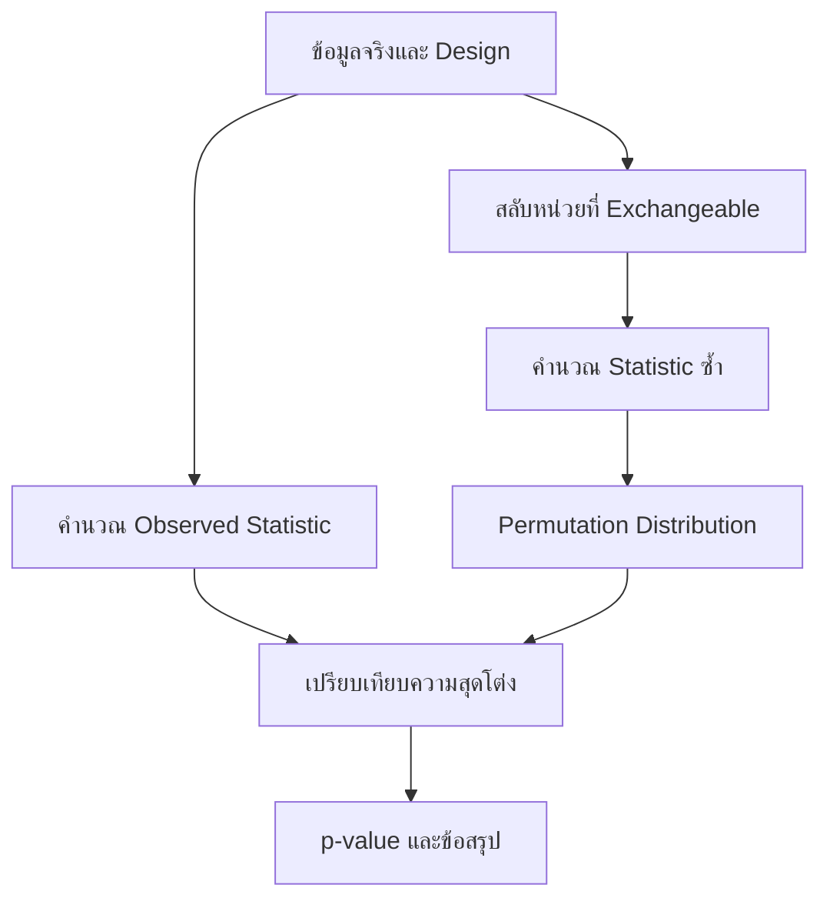

# Permutation Test

> บทนี้อธิบายการทดสอบสมมติฐานแบบเรียงสับเปลี่ยนตั้งแต่แนวคิดพื้นฐาน เงื่อนไข Exchangeability การสร้าง Permutation Distribution การคำนวณ p-value แบบ Exact และ Monte Carlo ตลอดจนการเลือกวิธีสลับข้อมูลให้ตรงกับรูปแบบการทดลอง พร้อมตัวอย่างคำนวณและโค้ด R

## 1. ทำไมเราจึงต้องเรียน Permutation Test

การทดสอบสมมติฐานแบบคลาสสิก เช่น z test, t test และ Pearson correlation test อาศัยการแจกแจงอ้างอิงที่ได้จากทฤษฎี ภายใต้ข้อสมมติบางอย่างเกี่ยวกับการสุ่ม ความเป็นอิสระ รูปแบบการแจกแจง หรือขนาดตัวอย่าง ตัวอย่างเช่น one-sample t test ใช้ข้อเท็จจริงว่า หากข้อมูลมาจากประชากรปกติแล้ว

$$
T=\frac{\bar{X}-\mu_0}{S/\sqrt{n}}
$$

จะมีการแจกแจง t ที่มี degrees of freedom เท่ากับ $n-1$ เมื่อสมมติฐานว่างเป็นจริง เราจึงนำค่า $T$ ที่สังเกตได้ไปเปรียบเทียบกับ t distribution เพื่อหา p-value

อย่างไรก็ตาม ข้อมูลจริงอาจมีขนาดเล็ก เบ้ มี outlier หรือมีตัวสถิติที่ไม่ทราบ sampling distribution ในรูปปิด จึงเกิดคำถามว่า เราจะสร้างการแจกแจงอ้างอิงภายใต้สมมติฐานว่างจากข้อมูลที่มีอยู่ได้หรือไม่

Permutation Test ตอบคำถามนี้ด้วยแนวคิดง่าย ๆ ว่า ถ้า $H_0$ เป็นจริงและ label ที่ใช้แบ่งกลุ่มไม่มีความหมายต่อผลลัพธ์ การสลับ label เหล่านั้นควรให้ชุดข้อมูลที่เป็นไปได้พอ ๆ กัน เราจึงสลับ label หลายครั้ง คำนวณตัวสถิติทุกครั้ง และใช้ค่าที่ได้เป็นการแจกแจงของตัวสถิติภายใต้ $H_0$

กล่าวอีกอย่างหนึ่ง Permutation Test ไม่ได้ถามว่า “ข้อมูลมีรูปทรงเหมือน Normal distribution หรือไม่” เป็นหลัก แต่ถามว่า “ภายใต้ $H_0$ เรามีสิทธิ์สลับอะไร โดยยังรักษาโครงสร้างการทดลองเดิมไว้”

## 2. จาก Classical Test สู่ Resampling Test

### 2.1 โครงสร้างร่วมของการทดสอบสมมติฐาน

ไม่ว่าจะใช้วิธีคลาสสิกหรือ Permutation Test กระบวนการหลักยังเหมือนกัน

1. กำหนด $H_0$ และ $H_1$
2. เลือกตัวสถิติที่สะท้อนความแตกต่างหรือความสัมพันธ์ที่ต้องการตรวจสอบ
3. คำนวณ observed statistic จากข้อมูลจริง
4. สร้างหรือเลือก null distribution ของตัวสถิติเมื่อ $H_0$ เป็นจริง
5. วัดว่า observed statistic อยู่ไกลเข้าไปในหางของ null distribution เพียงใด
6. คำนวณ p-value และสรุปผลในบริบทของปัญหา

จุดที่ต่างกันคือวิธีสร้าง null distribution

| ประเด็น | Classical test | Permutation test |
|---|---|---|
| แหล่งของ null distribution | สูตรและทฤษฎีความน่าจะเป็น | การสลับข้อมูลที่สอดคล้องกับ $H_0$ |
| ข้อสมมติเด่น | รูปแบบ distribution และเงื่อนไขของ test | Exchangeability และรูปแบบการสุ่ม/การทดลอง |
| ตัวสถิติ | มักมีสูตรมาตรฐาน | เลือกให้ตรงกับคำถามได้ยืดหยุ่น |
| การคำนวณ | มักรวดเร็ว | อาจต้องใช้การคำนวณจำนวนมาก |
| ผลลัพธ์ | Exact หรือ asymptotic ตามทฤษฎี | Exact เมื่อแจกแจงครบทุก permutation และเงื่อนไขถูกต้อง |

### 2.2 Sampling Distribution กับ Permutation Distribution

Sampling distribution คือการแจกแจงของตัวสถิติที่เกิดจากการสุ่มตัวอย่างใหม่จากประชากรซ้ำ ๆ แต่ในงานจริงเรามี sample เพียงชุดเดียวและมักไม่รู้ population distribution

Permutation distribution ต่างออกไป เราคงค่าที่สังเกตได้ไว้ แต่จัดสรร label หรือจับคู่ใหม่ตามกฎที่ $H_0$ อนุญาต แล้วคำนวณตัวสถิติจากแต่ละ arrangement การแจกแจงที่ได้จึงเป็น conditional distribution ซึ่งมีเงื่อนไขบนข้อมูลที่สังเกตแล้ว

Permutation Test จึงไม่ใช่การสร้างข้อมูลใหม่จากประชากร และไม่ใช่ Bootstrap จุดประสงค์ของ Bootstrap โดยทั่วไปคือประมาณความไม่แน่นอนของ estimator ด้วยการสุ่มแบบคืนที่ ส่วน Permutation Test สร้างโลกที่ $H_0$ เป็นจริงด้วยการสลับข้อมูลตามโครงสร้างของสมมติฐาน

## 3. แนวคิดหัวใจ: Exchangeability

### 3.1 Exchangeability คืออะไร

ข้อมูลหรือ label มีสมบัติ Exchangeability ภายใต้ $H_0$ เมื่อการสลับตำแหน่งตามกฎที่กำหนดไม่เปลี่ยน joint distribution ของข้อมูล กล่าวในภาษาง่าย ๆ คือ หาก $H_0$ เป็นจริง arrangement ที่สังเกตได้ไม่ควรมีสิทธิพิเศษเหนือ arrangement อื่นที่อนุญาต

ใน randomized experiment ซึ่งหน่วยทดลองถูกสุ่มให้รับ Treatment หรือ Control เมื่อ $H_0$ ระบุว่า treatment ไม่มีผล label ทั้งสองกลุ่มสามารถสลับระหว่างหน่วยทดลองตามกลไกการสุ่มเดิมได้ เพราะภายใต้ $H_0$ ผลลัพธ์ไม่ควรขึ้นกับ label

สำหรับ observational study การสลับ label ต้องระวังมากขึ้น เพราะความแตกต่างของกลุ่มอาจมาจาก confounding หรือ selection mechanism แม้คำนวณ permutation p-value ได้ ก็ไม่ได้ทำให้การศึกษากลายเป็น randomized experiment และไม่เพียงพอสำหรับข้อสรุปเชิงสาเหตุ

### 3.2 Exchangeability ไม่เท่ากับ Independence

Independence หมายถึงความรู้เกี่ยวกับตัวแปรหนึ่งไม่ให้ข้อมูลเกี่ยวกับอีกตัวแปรหนึ่ง ส่วน Exchangeability หมายถึง joint distribution ไม่เปลี่ยนเมื่อสลับตำแหน่งที่อนุญาต ทั้งสองแนวคิดเกี่ยวข้องกันแต่ไม่เหมือนกัน

ข้อมูล repeated measures จากคนเดียวกันอาจไม่เป็นอิสระระหว่างเวลา แต่ยังสร้างการทดสอบแบบ permutation ที่ถูกต้องได้ หากสลับ treatment ภายใน block หรือสลับเครื่องหมายของ paired differences ตามโครงสร้าง $H_0$ การสลับ observation ทุกแถวอย่างอิสระจะทำลายความสัมพันธ์ภายในคนและทำให้ null distribution ผิด

### 3.3 สิ่งที่ต้องสลับขึ้นกับ Design

| Design | หน่วยที่สลับได้ภายใต้ $H_0$ | สิ่งที่ไม่ควรทำ |
|---|---|---|
| Two independent groups | สลับ group labels โดยคงขนาดกลุ่มเดิม | สลับเฉพาะลำดับภายในแต่ละกลุ่ม |
| Matched pairs | สลับ Treatment/Control ภายในคู่ หรือ sign-flip paired difference | กระจายสมาชิกของคู่ไปปนกับคู่อื่น |
| Randomized block | สลับ label ภายในแต่ละ block | สลับข้าม block โดยไม่รักษาโครงสร้าง |
| Correlation | ตรึงตัวแปรหนึ่ง แล้วสลับอีกตัวแปรหนึ่ง | สลับทั้งสองตัวแปรด้วยลำดับเดียวกัน |
| Time series | ต้องใช้วิธีที่รักษา dependence ตามเวลา | สลับทุก time point อย่างอิสระ |

ดังนั้นคำถามสำคัญก่อนเริ่มไม่ใช่ “จะใช้กี่ permutation” แต่คือ “ภายใต้ $H_0$ อะไรคือหน่วยที่ exchangeable”

## 4. กลไกของ Permutation Test

ให้ $S$ เป็นตัวสถิติทดสอบ และให้

$$
S_{obs}=S(x_1,x_2,\ldots,x_n)
$$

เป็นค่าจากข้อมูลจริง สำหรับแต่ละ permutation ที่อนุญาต ให้ $S_b$ เป็นค่าตัวสถิติจากข้อมูลที่สลับแล้ว เมื่อ $b=1,2,\ldots,B$

กระบวนการทำงานมีดังนี้

1. เขียน $H_0$ และ $H_1$ ให้ตรงกับคำถาม
2. เลือก statistic ที่ค่ามากหรือค่าสุดโต่งสะท้อนหลักฐานต้าน $H_0$
3. คำนวณ $S_{obs}$
4. สลับข้อมูลตามหน่วยที่ exchangeable ภายใต้ $H_0$
5. คำนวณ $S_b$ จากแต่ละ permutation
6. รวมค่า $S_b$ เป็น permutation distribution
7. นับสัดส่วนของค่า permutation ที่สุดโต่งอย่างน้อยเท่ากับ $S_{obs}$
8. เปรียบเทียบ p-value กับระดับนัยสำคัญ $\alpha$

ภาพทางความคิดของกระบวนการคือ



จุดสำคัญคือ Permutation Test ไม่ได้เพียง “สลับข้อมูลแบบสุ่ม” แต่ต้องสลับด้วยกฎที่จำลองโลกของ $H_0$ และรักษาโครงสร้างการเก็บข้อมูลเดิม

## 5. การเลือก Test Statistic

ตัวสถิติต้องไวต่อรูปแบบของ $H_1$ และต้องเปลี่ยนเมื่อสลับสิ่งที่สนใจ ตัวอย่างที่ใช้บ่อย ได้แก่

| คำถาม | ตัวสถิติที่เป็นไปได้ |
|---|---|
| ค่าเฉลี่ยสองกลุ่มต่างกันหรือไม่ | $\bar{x}_1-\bar{x}_2$ หรือ absolute mean difference |
| Median สองกลุ่มต่างกันหรือไม่ | $median_1-median_2$ |
| Treatment ให้ผลสูงกว่า Control หรือไม่ | $\bar{x}_{T}-\bar{x}_{C}$ |
| ตัวแปรสองตัวสัมพันธ์กันหรือไม่ | Pearson $r$ หรือ Spearman correlation |
| หลายกลุ่มต่างกันหรือไม่ | Between-group sum of squares หรือ F statistic |
| Regression coefficient เป็นศูนย์หรือไม่ | coefficient หรือ t statistic ภายใต้ permutation scheme ที่เหมาะสม |

ข้อผิดพลาดที่พบบ่อยคือสลับลำดับ observation แต่คำนวณ statistic ที่ไม่ขึ้นกับลำดับ เช่น mean ของข้อมูลรวม หากเราเพียงเรียงค่า $x_1,\ldots,x_n$ ใหม่ ค่า mean และ median ของชุดรวมจะเท่าเดิมทุกครั้ง จึงไม่เกิด null distribution ที่มีประโยชน์

สิ่งที่ควรสลับใน two-group test คือ group label หรือการจัดสมาชิกเข้าสู่กลุ่ม ไม่ใช่การเรียงลำดับของชุดรวมโดยปล่อย membership เดิมไว้

## 6. Exact Permutation กับ Monte Carlo Permutation

### 6.1 Exact Permutation Test

ถ้าแจกแจงทุก arrangement ที่เป็นไปได้ครบทั้งหมด และแต่ละ arrangement มีโอกาสเท่ากันภายใต้ $H_0$ เราจะได้ Exact Permutation Test

คำว่า Exact หมายถึงการควบคุม Type I error จาก randomization distribution ได้ตามระดับที่กำหนด ภายใต้เงื่อนไขของ design และ exchangeability ไม่ได้หมายความว่าวิธีนี้ปราศจากข้อสมมติ

จำนวน permutation ไม่จำเป็นต้องเป็น $n!$ เสมอ หากแบ่งข้อมูล $n$ ค่าเป็นสองกลุ่มขนาด $n_1$ และ $n_2$ โดยลำดับภายในกลุ่มไม่มีความหมาย จำนวนการจัดกลุ่มที่ไม่ซ้ำกันคือ

$$
\binom{n}{n_1}=\frac{n!}{n_1!n_2!}
$$

สำหรับ paired design ที่มี $n$ คู่และภายใต้ $H_0$ สามารถสลับ Treatment/Control ภายในแต่ละคู่ได้ จำนวน arrangement คือ $2^n$ ไม่ใช่ $(2n)!$

### 6.2 Monte Carlo Permutation Test

เมื่อจำนวน arrangement ใหญ่มาก เราสุ่มเพียง $B$ permutations แทนการแจกแจงครบทั้งหมด วิธีนี้ประมาณ exact permutation distribution และมี Monte Carlo error เพิ่มเข้ามา

หากนับได้ว่า $K$ permutations จาก $B$ รอบมี statistic สุดโต่งอย่างน้อยเท่าค่าที่สังเกต สูตรที่แนะนำเมื่อ observed arrangement ไม่ได้รวมอยู่ใน $B$ รอบคือ

$$
\hat{p}=\frac{K+1}{B+1}
$$

การบวกหนึ่งทั้งเศษและส่วนรวม observed arrangement เข้าเป็นหนึ่งกรณี และป้องกันการรายงาน p-value เท่ากับศูนย์จากการสุ่มจำนวนจำกัด

Standard error เชิง Monte Carlo ของสัดส่วนโดยประมาณคือ

$$
SE_{MC}\approx\sqrt{\frac{\hat{p}(1-\hat{p})}{B}}
$$

ดังนั้นถ้า p-value อยู่ใกล้ระดับตัดสินใจ เช่น $\hat{p}=0.049$ เมื่อ $\alpha=0.05$ เราควรเพิ่ม $B$ และตรวจสอบความเสถียร ไม่ควรตัดสินจากตัวเลขรอบเดียว

### 6.3 จำนวน permutation มากไม่ได้แก้ทุกปัญหา

การเพิ่ม $B$ ลด Monte Carlo error แต่ไม่แก้การเลือก statistic ผิด การสลับผิดหน่วย การละเมิด exchangeability การสุ่มตัวอย่างที่มี bias หรือข้อจำกัดด้าน causal inference หาก permutation scheme ไม่สะท้อน $H_0$ ผลที่แม่นยำทางคอมพิวเตอร์ก็ยังเป็นคำตอบของคำถามที่ผิด

## 7. การคำนวณ p-value ตามทิศทางของสมมติฐาน

สำหรับ right-tailed test ซึ่งค่ามากสนับสนุน $H_1$

$$
p=P(S_{perm}\ge S_{obs}\mid H_0)
$$

สำหรับ left-tailed test ซึ่งค่าน้อยสนับสนุน $H_1$

$$
p=P(S_{perm}\le S_{obs}\mid H_0)
$$

สำหรับ two-sided test ต้องกำหนดความสุดโต่งให้ชัด วิธีที่เข้าใจง่ายเมื่อ null distribution สมมาตรรอบศูนย์คือ

$$
p=P(|S_{perm}|\ge |S_{obs}|\mid H_0)
$$

แต่การนำ one-sided p-value คูณสองไม่ถูกต้องเสมอ โดยเฉพาะเมื่อ permutation distribution ไม่สมมาตรหรือ statistic มี discrete support จึงควรนิยาม two-sided extremeness ก่อนคำนวณ

การใช้ $\ge$ แทน $>$ มีความสำคัญ เพราะ permutation distribution เป็น discrete และอาจมี ties ค่า statistic ที่เท่ากับ observed statistic ถือว่าสุดโต่งอย่างน้อยเท่ากันและควรถูกนับรวม

## 8. Worked Example 1: Shampoo กับคุณภาพขนอัลปากา

### 8.1 คำถามและข้อมูล

กลุ่ม Treatment ใช้แชมพูใหม่ และกลุ่ม Control ไม่ใช้แชมพูใหม่ คะแนนคุณภาพขนคือ

```text
Treatment: 8.3, 7.4, 5.8, 4.3, 7.2, 8.3,
           6.2, 4.8, 7.7, 7.1, 4.1, 4.4

Control:   3.9, 4.6, 4.4, 3.8, 2.8, 5.6,
           4.6, 5.4, 4.2, 5.1, 5.8, 4.1
```

หากต้องการพิสูจน์ว่าแชมพูใหม่เพิ่มคุณภาพขน ควรเขียนสมมติฐานเป็น

$$
H_0:\mu_T\le\mu_C
$$

$$
H_1:\mu_T>\mu_C
$$

Equality ต้องอยู่ใน null hypothesis เพราะการควบคุม Type I error และการสร้าง permutation distribution ใช้ boundary case ที่ไม่มี treatment effect

เลือก statistic เป็นผลต่างค่าเฉลี่ย

$$
S=\bar{x}_T-\bar{x}_C
$$

จากข้อมูลจริง

$$
\bar{x}_T=6.300
$$

$$
\bar{x}_C=4.525
$$

ดังนั้น

$$
S_{obs}=6.300-4.525=1.775
$$

### 8.2 สร้าง null distribution

ภายใต้ $H_0$ ว่าแชมพูไม่มีผล เรารวมคะแนนทั้ง 24 ค่า แล้วจัดสรรใหม่ให้ Treatment 12 ค่าและ Control 12 ค่า ทุกครั้งคำนวณ mean difference ใหม่

เนื่องจากลำดับภายในกลุ่มไม่มีความหมาย จำนวนการแบ่งกลุ่มที่ไม่ซ้ำกันคือ

$$
\binom{24}{12}=2{,}704{,}156
$$

ไม่ใช่ $24!$ เพราะการสลับตำแหน่งภายในกลุ่มเดิมไม่ทำให้การแบ่ง Treatment/Control เปลี่ยน

### 8.3 ผลจากสไลด์และการตรวจสอบเพิ่มเติม

จากเอกสาร สุ่ม 200 permutations และรายงานว่า 16 ค่ามากกว่า $1.775$ จึงได้

$$
p=\frac{16}{200}=0.08
$$

ที่ระดับ $\alpha=0.10$ เอกสารจึงปฏิเสธ $H_0$ และสรุปว่าแชมพูใหม่เพิ่มคุณภาพขน

อย่างไรก็ตาม เมื่อแจกแจงการแบ่งกลุ่มครบทั้ง $2{,}704{,}156$ กรณี พบ 4,261 กรณีที่ mean difference มากกว่าหรือเท่ากับ $1.775$ ทำให้ exact one-sided p-value เป็น

$$
p=\frac{4{,}261}{2{,}704{,}156}\approx0.00158
$$

ผลตรวจสอบนี้ไม่สอดคล้องกับค่า 0.08 ในสไลด์ ความต่างมีขนาดใหญ่เกินกว่าจะอธิบายด้วย Monte Carlo randomness ตามปกติ จึงควรถือค่าจากสไลด์เป็นตัวอย่างของขั้นตอน แต่ใช้ค่า exact ที่ตรวจสอบใหม่เมื่อต้องรายงานผลจากข้อมูลชุดนี้

ข้อสรุปที่เหมาะสมคือ ข้อมูลให้หลักฐานทางสถิติว่า Treatment มี mean wool-quality score สูงกว่า Control ภายใต้ exchangeability และ design ที่สมเหตุสมผล แต่การสรุปว่า “แชมพูเป็นสาเหตุ” ต้องอาศัยการสุ่มจัด Treatment และการควบคุมตัวแปรรบกวนจริงในการทดลอง

## 9. Worked Example 2: Permutation Test สำหรับ Correlation

### 9.1 คำถามและ statistic

ต้องการตรวจว่าอุปทาน $Q$ และราคา $P$ มีความสัมพันธ์เชิงเส้นทางบวกหรือไม่

$$
H_0:\rho=0
$$

$$
H_1:\rho>0
$$

ใช้ Pearson correlation coefficient เป็น statistic

$$
r=\frac{\sum_{i=1}^{n}(P_i-\bar{P})(Q_i-\bar{Q})}
{\sqrt{\sum_{i=1}^{n}(P_i-\bar{P})^2}\sqrt{\sum_{i=1}^{n}(Q_i-\bar{Q})^2}}
$$

ค่า $r$ อยู่ระหว่าง $-1$ และ $1$ ขนาดของ $|r|$ สะท้อนความแรงของความสัมพันธ์เชิงเส้น ส่วนเครื่องหมายบอกทิศทาง

จากข้อมูล 20 คู่ในเอกสารได้

$$
r_{obs}=0.6183
$$

### 9.2 ทำไมต้องตรึง Q แล้วสลับ P

ข้อมูลจริงมีคู่ $(P_i,Q_i)$ ถ้า $P$ และ $Q$ ไม่มีความสัมพันธ์ การจับคู่ที่สังเกตไม่ควรพิเศษกว่าการจับคู่ใหม่ เราจึงตรึงลำดับ $Q$ และสลับลำดับ $P$ เพื่อทำลายความสัมพันธ์ระหว่างสองตัวแปร แต่ยังรักษาค่าขอบของแต่ละตัวแปรไว้ครบถ้วน

หากสลับ $P$ และ $Q$ ด้วย permutation เดียวกัน คู่เดิมจะยังอยู่ด้วยกันทุกคู่ ค่า correlation จึงไม่เปลี่ยน วิธีนั้นไม่สร้างโลกของ $H_0$

ข้อมูล 20 คู่มี $20!\approx2.43\times10^{18}$ permutations จึงไม่เหมาะกับการแจกแจงครบทุกกรณี เอกสารสุ่ม 50,000 permutations และรายงาน

$$
p=P(R_{perm}\ge0.6183\mid H_0)=0.0016
$$

เนื่องจาก p-value ต่ำกว่า 0.05 จึงปฏิเสธ $H_0$ และสรุปว่าข้อมูลให้หลักฐานของความสัมพันธ์เชิงเส้นทางบวกระหว่างอุปทานกับราคา

คำว่า “สัมพันธ์” ไม่เท่ากับ “เป็นสาเหตุ” และ Permutation Test ไม่แก้ปัญหา reverse causality, omitted variables หรือ dependence ตามเวลา หากข้อมูลราคาและอุปทานเรียงตามเวลา การสลับทุก observation อย่างอิสระอาจไม่เหมาะสมเพราะทำลาย autocorrelation

## 10. R Walkthrough

### 10.1 Two-group Permutation Test

```r
treatment <- c(
  8.3, 7.4, 5.8, 4.3, 7.2, 8.3,
  6.2, 4.8, 7.7, 7.1, 4.1, 4.4
)

control <- c(
  3.9, 4.6, 4.4, 3.8, 2.8, 5.6,
  4.6, 5.4, 4.2, 5.1, 5.8, 4.1
)

observed_diff <- mean(treatment) - mean(control)

pooled <- c(treatment, control)
n_treatment <- length(treatment)
B <- 50000

set.seed(2026)

permuted_diff <- replicate(B, {
  shuffled <- sample(pooled, replace = FALSE)
  mean(shuffled[1:n_treatment]) - mean(shuffled[-(1:n_treatment)])
})

K <- sum(permuted_diff >= observed_diff)
p_value <- (K + 1) / (B + 1)

c(
  observed_difference = observed_diff,
  extreme_permutations = K,
  p_value = p_value
)
```

`pooled` รวมข้อมูลภายใต้แนวคิดว่า เมื่อ $H_0$ เป็นจริง label Treatment และ Control แลกกันได้ `sample(..., replace = FALSE)` สลับลำดับโดยไม่สุ่มค่าซ้ำ แล้ว 12 ค่าแรกถูกจัดเป็น Treatment ใหม่ การทำซ้ำผ่าน `replicate()` สร้าง permutation distribution ส่วน `sum(permuted_diff >= observed_diff)` นับ right-tail events

ต้องใช้ `replace = FALSE` เพราะ Permutation Test จัดสรรค่าสังเกตเดิมใหม่โดยแต่ละ observation ปรากฏหนึ่งครั้ง การใช้ `replace = TRUE` จะกลายเป็นแนวทางแบบ Bootstrap และเปลี่ยนคำถามทางสถิติ

### 10.2 Correlation Permutation Test

```r
P <- c(
  5.0, 4.8, 4.7, 4.0, 5.3, 4.1, 5.5, 4.7, 3.3, 4.0,
  4.0, 4.6, 5.3, 3.0, 3.5, 3.9, 4.7, 5.0, 5.2, 4.6
)

Q <- c(
  60, 59, 58, 47, 65, 48, 67, 70, 55, 63,
  62, 65, 71, 56, 59, 60, 74, 77, 78, 62
)

observed_r <- cor(P, Q, method = 'pearson')
B <- 50000

set.seed(2026)

permuted_r <- replicate(B, {
  cor(sample(P, replace = FALSE), Q, method = 'pearson')
})

K <- sum(permuted_r >= observed_r)
p_value <- (K + 1) / (B + 1)

c(
  observed_correlation = observed_r,
  extreme_permutations = K,
  p_value = p_value
)
```

โค้ดนี้ตรึง `Q` แล้วสุ่มลำดับ `P` ใหม่ทุกครั้ง ค่า marginal distribution ของ `P` และ `Q` จึงไม่เปลี่ยน แต่ pairings ซึ่งเป็นแหล่งของ correlation ถูกทำลาย หากเปลี่ยนเป็น two-sided alternative ต้องนับ

```r
K <- sum(abs(permuted_r) >= abs(observed_r))
```

### 10.3 ตรวจความเสถียรของ Monte Carlo p-value

```r
se_mc <- sqrt(p_value * (1 - p_value) / B)

c(
  p_value = p_value,
  monte_carlo_se = se_mc,
  lower_check = max(0, p_value - 2 * se_mc),
  upper_check = min(1, p_value + 2 * se_mc)
)
```

ช่วง `p_value ± 2 * se_mc` เป็นเพียง diagnostic โดยประมาณของความผันผวนจาก Monte Carlo ไม่ใช่ confidence interval ของ effect size หากช่วงตรวจสอบยังคร่อม $\alpha$ ควรเพิ่ม $B$ แล้วรันใหม่ด้วย seed ที่รายงานได้

## 11. การตีความผลลัพธ์อย่างถูกต้อง

p-value ของ Permutation Test คือความน่าจะเป็น ภายใต้ $H_0$ และ permutation scheme ที่กำหนด ที่จะได้ statistic สุดโต่งอย่างน้อยเท่ากับค่าที่สังเกต p-value ไม่ใช่ความน่าจะเป็นที่ $H_0$ เป็นจริง และไม่ใช่ขนาดของ treatment effect

การรายงานผลที่ดีควรมีอย่างน้อยสี่ส่วน

1. statistic และทิศทางของ alternative
2. วิธีสลับข้อมูลและเหตุผลที่สอดคล้องกับ design
3. จำนวน permutations และวิธีคำนวณ p-value
4. ข้อสรุปในบริบท พร้อมข้อจำกัด

ตัวอย่างการรายงานคือ

> ใช้ one-sided permutation test โดยสลับ Treatment/Control labels และคงขนาดกลุ่มละ 12 ตัวอย่าง ค่า observed mean difference เท่ากับ 1.775 คะแนน จาก exact permutation distribution ได้ p-value ประมาณ 0.00158 จึงปฏิเสธ $H_0$ ที่ระดับ 0.05 ข้อมูลให้หลักฐานว่า mean wool-quality score ของกลุ่มที่ใช้แชมพูสูงกว่ากลุ่มควบคุม ภายใต้เงื่อนไขว่า label สามารถแลกเปลี่ยนได้ตาม design

แม้ p-value ต่ำ ควรรายงาน observed effect และหน่วยร่วมด้วย เพราะนัยสำคัญทางสถิติไม่ได้บอกว่า effect มีความสำคัญในทางปฏิบัติเพียงใด

## 12. Assumptions และข้อจำกัด

Permutation Test มักถูกเรียกว่า nonparametric แต่ไม่ได้แปลว่าไม่มี assumption เงื่อนไขสำคัญประกอบด้วย

### 12.1 Permutation scheme ต้องถูกต้อง

หน่วยที่สลับต้อง exchangeable ภายใต้ $H_0$ และต้องสะท้อน randomization scheme หรือ dependence structure จริง หากสลับผิดหน่วย p-value จะไม่มีความหมายตามที่ตั้งใจ

### 12.2 Observations และ Sampling Design

ความเป็นอิสระระหว่างหน่วยยังสำคัญในหลาย design หากข้อมูลมี cluster, household, hospital, repeated measures หรือ time dependence ต้องรักษาโครงสร้างเหล่านั้นระหว่าง permutation

### 12.3 Generalizability

Permutation inference อาจ exact สำหรับหน่วยที่ศึกษา แต่การขยายผลไปยังประชากรกว้างขึ้นยังขึ้นกับวิธีสุ่ม sample ความครอบคลุมของประชากร และคุณภาพข้อมูล

### 12.4 Causal Interpretation

การสุ่ม permutation ไม่สามารถทดแทนการสุ่ม treatment จริง หากข้อมูลเป็น observational การปฏิเสธ $H_0$ แสดง association ตาม statistic และ permutation scheme ไม่ได้พิสูจน์เหตุและผล

### 12.5 Discrete p-value

เมื่อจำนวน permutations น้อย p-value ที่เป็นไปได้มีขั้นห่าง เช่น หากมี 99 random permutations แล้วใช้ plus-one correction ค่า p-value ต่ำสุดคือ $1/100=0.01$ จึงไม่สามารถรายงานความละเอียดเกินกว่าที่จำนวน permutations รองรับ

## 13. เปรียบเทียบ Permutation Test กับวิธีใกล้เคียง

| วิธี | กลไกหลัก | เป้าหมายทั่วไป | จุดที่ต้องระวัง |
|---|---|---|---|
| Parametric test | ใช้ theoretical distribution | ทดสอบ parameter ภายใต้ model | Distributional assumptions |
| Permutation test | สลับ label หรือ pairing แบบไม่คืนที่ | ทดสอบ $H_0$ จาก randomization distribution | Exchangeability และ design |
| Bootstrap | สุ่ม observation แบบคืนที่ | ประมาณ SE, bias และ confidence interval | Sample ต้องแทน population ได้ดี |
| Randomization test | อ้างอิง assignment mechanism จริง | ทดสอบผลของ treatment ใน experiment | ต้องรู้ randomization scheme |
| Rank-based test | แปลงข้อมูลเป็นอันดับ | ทดสอบ location หรือ stochastic ordering | คำถามไม่จำเป็นต้องเป็น mean difference |

คำว่า Permutation Test และ Randomization Test มักใช้ทับซ้อนกัน แต่ในความหมายที่เข้ม Randomization Test ผูกกับกลไกสุ่มจัด treatment จริง ส่วน Permutation Test อาจอาศัย exchangeability จาก model หรือ $H_0$ ที่กำหนด

## 14. Common Misconceptions

### 14.1 “Permutation Test ไม่มี assumption”

ไม่จริง วิธีนี้ลดการพึ่งพา parametric distribution บางชนิด แต่ต้องอาศัย exchangeability และ permutation scheme ที่ถูกต้อง

### 14.2 “ข้อมูลน้อยจึงใช้ Permutation Test ได้เสมอ”

ข้อมูลน้อยทำให้แจกแจง permutations ครบได้ง่าย แต่ information ใน sample ยังน้อย และจำนวน distinct permutations อาจทำให้ p-value หยาบมาก วิธีนี้ไม่สร้างข้อมูลใหม่เพิ่มขึ้น

### 14.3 “สลับลำดับข้อมูลอย่างไรก็ได้”

ไม่จริง การสลับต้องตรงกับ $H_0$ และ design เช่น two-group test สลับ labels, paired test สลับภายในคู่ และ correlation test สลับตัวแปรหนึ่งเทียบกับอีกตัวแปรหนึ่ง

### 14.4 “p-value ต่ำแปลว่า effect ใหญ่”

ไม่จริง p-value ขึ้นกับ effect, variability, sample size และ statistic ต้องรายงาน effect estimate และพิจารณาความสำคัญเชิงปฏิบัติแยกกัน

### 14.5 “สุ่ม 50,000 รอบจึงเป็น Exact Test”

ไม่จริง การสุ่มบางส่วนเป็น Monte Carlo approximation Exact Test ต้องแจกแจง arrangement ที่เป็นไปได้ครบ หรือใช้วิธีคำนวณ exact distribution ที่เทียบเท่ากัน

## 15. แนวเขียนตอบข้อสอบ

### 15.1 โครงคำตอบ 6 ขั้น

เมื่อต้องอธิบาย Permutation Test ให้ตอบสั้นแต่ครบดังนี้

1. ระบุ $H_0$, $H_1$ และทิศทางของ test
2. ระบุ observed statistic
3. อธิบายสิ่งที่ exchangeable และหน่วยที่สลับ
4. สร้าง permutation distribution ภายใต้ $H_0$
5. คำนวณ p-value จากสัดส่วนค่าที่สุดโต่งอย่างน้อยเท่า observed statistic
6. เปรียบเทียบกับ $\alpha$ และสรุปในบริบท โดยไม่กล่าวว่า “ยอมรับ $H_0$”

### 15.2 ตัวอย่างคำตอบแบบเขียนสอบ

> Permutation Test สร้าง null distribution โดยสลับ label หรือ pairing ที่ exchangeable ภายใต้ $H_0$ แล้วคำนวณ test statistic ซ้ำ สำหรับ two-group mean test จะคำนวณ observed mean difference จากข้อมูลจริง จากนั้นรวมข้อมูลและสลับ group labels โดยคงขนาดกลุ่มเดิม p-value คือสัดส่วนของ permuted statistics ที่สุดโต่งอย่างน้อยเท่าค่าจริง หาก p-value ต่ำกว่า $\alpha$ ให้ปฏิเสธ $H_0$ ทั้งนี้ความถูกต้องขึ้นกับ exchangeability และ permutation scheme ที่สอดคล้องกับ design

## 16. Likely Exam Focus

จากการเน้นซ้ำในเอกสาร ประเด็นที่ควรเตรียมเป็นพิเศษ ได้แก่

- อธิบายความต่างระหว่าง classical test กับ permutation test
- ให้นิยามและอธิบายความสำคัญของ Exchangeability
- เขียนขั้นตอนสร้าง permutation distribution และ p-value
- ระบุสิ่งที่ต้องสลับสำหรับ two groups, matched pairs และ correlation
- แยก Exact Permutation Test ออกจาก Monte Carlo approximation
- อธิบายเหตุผลที่การสลับข้อมูลแล้วคำนวณ mean ของข้อมูลรวมให้ statistic เท่าเดิม
- ตีความ one-sided p-value จากกราฟ permutation distribution
- วิเคราะห์ข้อจำกัดเมื่อ $n!$ หรือจำนวน combinations มีขนาดใหญ่มาก

## 17. โจทย์ฝึกและเฉลย

### ข้อ 1: อธิบาย Exchangeability

นักวิจัยมีข้อมูลคะแนนจากโรงพยาบาล 10 แห่ง แต่สุ่ม Treatment ภายในแต่ละโรงพยาบาล ถ้าต้องการ Permutation Test ควรสลับ label อย่างไร

**เฉลย:** ควรสลับ Treatment/Control ภายในโรงพยาบาลเดียวกัน เพราะ randomization เกิดภายใน block โรงพยาบาล การสลับข้ามโรงพยาบาลทำให้โรงพยาบาลที่มีพื้นฐานต่างกันแลก observation กันและไม่สะท้อน assignment mechanism เดิม Null distribution ที่ได้อาจผสม treatment effect กับ hospital effect

### ข้อ 2: คำนวณ Monte Carlo p-value

สุ่ม 9,999 permutations และพบ 37 ค่าที่มากกว่าหรือเท่ากับ observed statistic จงคำนวณ p-value ด้วย plus-one correction

**เฉลย:**

$$
\hat{p}=\frac{37+1}{9{,}999+1}=\frac{38}{10{,}000}=0.0038
$$

ดังนั้นที่ระดับ 0.05 ปฏิเสธ $H_0$ แต่ต้องสรุปในบริบทของสมมติฐานและ design

### ข้อ 3: วินิจฉัยโค้ดที่ผิด

โค้ดต่อไปนี้ใช้ทดสอบ correlation แต่ทำไมค่า correlation ไม่เปลี่ยน

```r
index <- sample(seq_along(P))
cor(P[index], Q[index])
```

**เฉลย:** โค้ดสลับ $P$ และ $Q$ ด้วย index เดียวกัน จึงรักษาคู่เดิมไว้ครบ correlation ไม่เปลี่ยน ต้องตรึงตัวแปรหนึ่งและสลับอีกตัวแปรหนึ่ง เช่น `cor(P[index], Q)` เพื่อทำลาย pairing ภายใต้ $H_0$

### ข้อ 4: เลือกวิธีสำหรับ Paired Data

วัดความดันก่อนและหลังให้ยาในผู้ป่วยคนเดิม 12 คน จะสลับอย่างไร

**เฉลย:** หน่วยที่ exchangeable คือสถานะ Before/After ภายในผู้ป่วยแต่ละคนภายใต้ sharp null ว่า treatment ไม่มีผล สามารถสลับค่าภายในคู่ หรือคำนวณ paired difference แล้วสุ่มคูณแต่ละ difference ด้วย $+1$ หรือ $-1$ ห้ามกระจายค่าจากผู้ป่วยหนึ่งไปจับคู่กับอีกคน เพราะจะทำลาย matched structure

### ข้อ 5: วิจารณ์ข้อสรุป

นักวิเคราะห์ได้ permutation p-value เท่ากับ 0.002 จาก observational data แล้วสรุปว่า “ราคาเป็นสาเหตุให้อุปทานเพิ่ม” ข้อสรุปนี้ถูกต้องหรือไม่

**เฉลย:** ยังสรุปเชิงสาเหตุไม่ได้ p-value แสดงว่าความสัมพันธ์ที่สังเกตสุดโต่งเมื่อเทียบกับ null distribution ที่สร้างขึ้น แต่ observational data อาจมี confounding, reverse causality หรือ time dependence Permutation Test ไม่เปลี่ยน observational design ให้เป็น randomized experiment ควรสรุปว่าพบหลักฐานของ association และระบุข้อจำกัด

## 18. สรุปแก่นของบท

Permutation Test สร้างการแจกแจงอ้างอิงจากข้อมูลที่สังเกต โดยสลับ label, pairing หรือ assignment ที่ exchangeable ภายใต้ $H_0$ แล้วเปรียบเทียบ observed statistic กับค่าจาก permutations วิธีนี้ลดการพึ่งพา parametric distribution และรองรับ statistic ที่ยืดหยุ่น แต่ไม่ได้ปราศจาก assumption

ความถูกต้องของผลขึ้นกับสามเรื่องมากกว่าจำนวนรอบเพียงอย่างเดียว ได้แก่ การกำหนด $H_0$ ที่ถูกต้อง การเลือก statistic ที่สอดคล้องกับ $H_1$ และการสลับหน่วยที่รักษา design เดิม หากสามเรื่องนี้ถูกต้อง จึงพิจารณาต่อว่าจะใช้ exact enumeration หรือ Monte Carlo approximation และเลือกจำนวน permutations ให้ p-value มีความแม่นเพียงพอต่อการตัดสินใจ

## References

- เอกสารประกอบการสอน `lecture05_permutation_test.pptx`, 10 สไลด์
- Wilber, J. *Permutation Tests*. https://www.jwilber.me/permutationtest/
- R-bloggers. *What Is a Permutation Test?* https://www.r-bloggers.com/what-is-a-permutation-test/
- Good, P. *Permutation, Parametric, and Bootstrap Tests of Hypotheses*. อ้างถึงในรายการเอกสารประกอบของสไลด์

