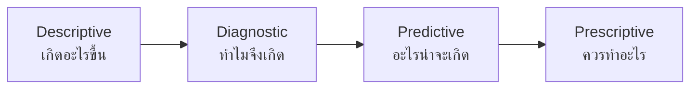
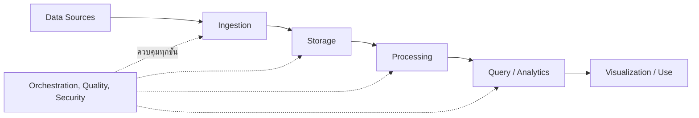
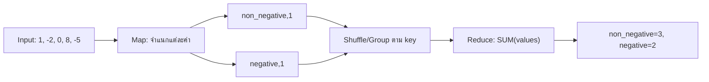
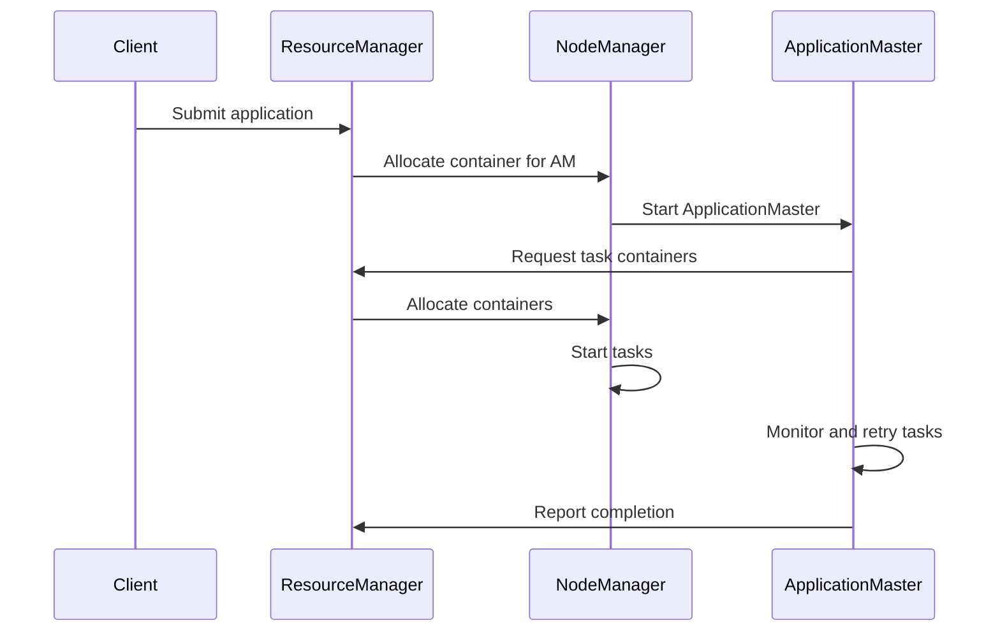
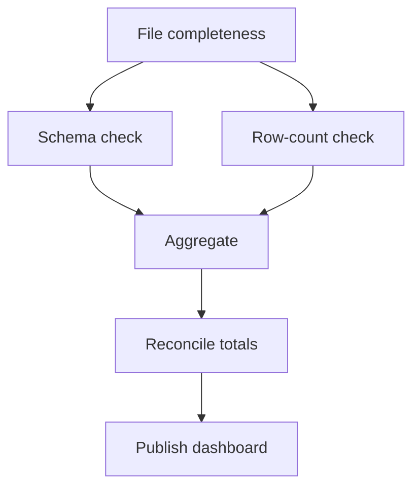
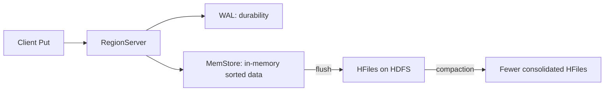
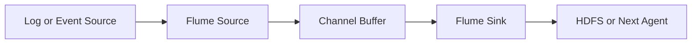

# DADS6002 Big Data Analytics — คลังโจทย์ข้อเขียนพร้อมวิธีเขียนตอบ

เอกสารนี้ใช้ฝึกอ่านโจทย์และฝึกเขียนคำตอบแบบบรรยาย โดยจัดตามลำดับเนื้อหาใน Lecture แทนการแบ่งเป็นชุด Mock A/B/C ทุกข้อวาง **โจทย์ → ตัวอย่างคำตอบสำหรับเขียนในข้อสอบ → เกณฑ์คะแนน** ต่อกันทันที

ป้ายกำกับมีสองแบบ:

- **[ข้อสอบเก่า]** คือโจทย์ที่เป้ส่งมาให้โดยตรง
- **[ข้อเก็ง]** และ **[ข้อเก็งเพิ่มเติม]** คือโจทย์ที่สร้างจากรูปแบบข้อสอบเก่าและเนื้อหาใน Lecture ไม่ใช่ข้อสอบจริงหรือข้อมูลจากอาจารย์

วิธีฝึกที่แนะนำคืออ่านเฉพาะโจทย์ ปิดส่วนคำตอบ แล้วร่างโครง 4–6 บรรทัดจากความจำ จากนั้นจึงอ่านตัวอย่างคำตอบเพื่อเทียบว่าเรามี **นิยาม → ส่วนประกอบ → ขั้นตอน → ตัวอย่าง → failure/trade-off → สรุป** ครบหรือไม่

# 01 — Introduction to Big Data

ครอบคลุมความหมายของ Big Data, 5Vs, ประเภทการวิเคราะห์ข้อมูล, Big Data Pipeline, Data Lake และการตรวจสอบความถูกต้องของข้อมูล

## Intro 1 — [ข้อสอบเก่า] คุณสมบัติ 5Vs ของ Big Data (15 คะแนน)

### โจทย์

จงอธิบายคุณสมบัติ 5Vs ของ Big Data ให้เข้าใจ

### ตัวอย่างคำตอบสำหรับเขียนในข้อสอบ

Big Data ไม่ได้หมายถึงข้อมูลที่มีขนาดใหญ่อย่างเดียว แต่หมายถึงสถานการณ์ที่ลักษณะของข้อมูลทำให้วิธีจัดเก็บ ประมวลผล และวิเคราะห์แบบเดิมไม่เพียงพอ แนวคิด **5Vs** ใช้อธิบายความท้าทายสำคัญห้าด้าน ได้แก่ Volume, Velocity, Variety, Veracity และ Value แต่ละ V เชื่อมโยงกับการออกแบบระบบต่างกัน

### 1. Volume — ปริมาณข้อมูล

Volume หมายถึงจำนวนหรือขนาดข้อมูลที่มีมากจนระบบแบบเครื่องเดียวหรือวิธีจัดเก็บเดิมรองรับได้ยาก ตัวอย่างเช่น เครือโรงพยาบาลเก็บรายการจัดซื้อ ใบสั่งซื้อ การรับสินค้า และ log การใช้งานจากโรงพยาบาลจำนวนมากติดต่อกันหลายปี ข้อมูลอาจมีหลายพันล้าน records และเพิ่มขึ้นเรื่อย ๆ

ปัญหาที่เกิดขึ้นไม่ใช่เพียงพื้นที่ disk ไม่พอ แต่ยังรวมถึงเวลาที่ใช้ scan, copy, backup และประมวลผลข้อมูล วิธีแก้จึงมักใช้ distributed storage เช่น HDFS และแบ่งงานประมวลผลให้หลายเครื่องทำพร้อมกัน

### 2. Velocity — ความเร็วของการเกิดและไหลเข้าของข้อมูล

Velocity หมายถึงอัตราที่ข้อมูลถูกสร้าง ส่งเข้าระบบ และต้องถูกประมวลผล ตัวอย่างเช่น clickstream, sensor, ระบบติดตามอุณหภูมิยา หรือเหตุการณ์การสั่งซื้ออาจเกิดขึ้นต่อเนื่องทุกวินาที หากระบบรับข้อมูลช้ากว่าอัตราที่ข้อมูลเกิด จะเกิด backlog หรือข้อมูลสูญหายได้

Velocity ยังเกี่ยวข้องกับเวลาที่ธุรกิจยอมรอผล หากต้องวิเคราะห์ยอดรายเดือน การนำเข้าแบบ batch อาจเพียงพอ แต่ถ้าต้องแจ้งเตือนอุณหภูมิวัคซีนผิดปกติ ระบบอาจต้องประมวลผลแบบ streaming หรือ near real time

### 3. Variety — ความหลากหลายของรูปแบบข้อมูล

Variety หมายถึงข้อมูลมาจากหลายแหล่งและมีโครงสร้างแตกต่างกัน เช่น

- Structured data: ตารางในฐานข้อมูล เช่น MySQL หรือ SQL Server
- Semi-structured data: JSON, XML และ log ที่มีรูปแบบบางส่วน
- Unstructured data: ข้อความ รูปภาพ เสียง และเอกสาร

ความท้าทายคือข้อมูลเหล่านี้ไม่สามารถใช้ schema หรือเครื่องมือเดียวกันได้ทั้งหมด ระบบต้องกำหนดวิธี parse, data type, schema evolution และวิธีเชื่อมข้อมูลจากหลายแหล่งให้มีความหมายร่วมกัน

### 4. Veracity — ความน่าเชื่อถือและคุณภาพข้อมูล

Veracity หมายถึงระดับความถูกต้อง ครบถ้วน สอดคล้อง และน่าเชื่อถือของข้อมูล ตัวอย่างเช่น รหัสโรงพยาบาลสะกดไม่เหมือนกัน วันที่หาย จำนวนเงินผิดหน่วย record ซ้ำ หรือ sensor ส่งค่าผิดปกติ แม้ระบบจะประมวลผลข้อมูลได้รวดเร็ว แต่ถ้าข้อมูลต้นทางไม่น่าเชื่อถือ ผลวิเคราะห์ก็อาจผิด

การจัดการ Veracity จึงต้องมี validation, data profiling, duplicate checks, reconciliation, data lineage และกฎคุณภาพข้อมูล เช่นตรวจว่าจำนวนเงินไม่ติดลบโดยไม่มีเหตุผล หรือยอดรวมปลายทางตรงกับต้นทาง

### 5. Value — คุณค่าที่ได้จากข้อมูล

Value หมายถึงความสามารถในการเปลี่ยนข้อมูลให้เป็นประโยชน์ต่อการตัดสินใจ ไม่ใช่เพียงเก็บข้อมูลให้ได้มากที่สุด ตัวอย่างเช่น การวิเคราะห์รายการจัดซื้ออาจช่วยลดต้นทุน ระบุสินค้าที่ควรรวมการต่อรอง ป้องกัน stockout หรือค้นหากระบวนการที่ใช้เวลานาน

ข้อมูลจำนวนมากที่ไม่ตอบโจทย์ธุรกิจ ไม่มีผู้ใช้ หรือไม่สามารถนำไปตัดสินใจได้ อาจสร้างเพียงต้นทุนด้าน storage และการดูแลระบบ ดังนั้น Value เป็นเหตุผลที่ทำให้ต้องเชื่อมปัญหาทางเทคนิคกลับไปยังเป้าหมายทางธุรกิจ

### ความสัมพันธ์ของ 5Vs

5Vs ไม่ได้แยกจากกัน ตัวอย่างเช่น sensor จำนวนมากสร้างข้อมูลอย่างรวดเร็ว ทำให้เกิดทั้ง Volume และ Velocity ข้อมูลจาก sensor หลายรุ่นทำให้เกิด Variety หากบางเครื่องส่งค่าผิดจะกระทบ Veracity และจะเกิด Value ก็ต่อเมื่อนำข้อมูลที่น่าเชื่อถือไปใช้เตือนหรือปรับปรุงงานจริง

| V | คำถามที่ใช้จำ | ตัวอย่างปัญหา |
|---|---|---|
| Volume | ข้อมูลมากเพียงใด | เก็บและ scan ไม่ทัน |
| Velocity | ข้อมูลมาเร็วเพียงใด | รับไม่ทันหรือต้องตอบสนองเร็ว |
| Variety | ข้อมูลมีรูปแบบอะไรบ้าง | ตาราง, JSON, log, รูปภาพ |
| Veracity | ข้อมูลเชื่อถือได้หรือไม่ | missing, duplicate, ผิดหน่วย |
| Value | ข้อมูลช่วยตัดสินใจอะไร | ลดต้นทุนหรือปรับปรุงบริการ |

### แนวแบ่งคะแนน 15 คะแนน

อาจแบ่ง V ละประมาณ 3 คะแนน โดยแต่ละ V ควรมีคำอธิบาย ความท้าทาย และตัวอย่าง ไม่ควรตอบเพียงแปลชื่อศัพท์ห้าคำ

---

## Intro 2 — [ข้อสอบเก่า] ประเภทของการวิเคราะห์ข้อมูล (10 คะแนน)

### โจทย์

การวิเคราะห์ข้อมูลมีได้กี่แบบ จงอธิบายและยกตัวอย่างประกอบ

### ตัวอย่างคำตอบสำหรับเขียนในข้อสอบ

การวิเคราะห์ข้อมูลมักแบ่งตามคำถามที่ต้องการตอบเป็น **4 ประเภท** ได้แก่ Descriptive, Diagnostic, Predictive และ Prescriptive Analytics ลำดับนี้เดินจากการอธิบายอดีต ไปหาสาเหตุ คาดการณ์อนาคต และแนะนำการตัดสินใจ

### 1. Descriptive Analytics — เกิดอะไรขึ้น

Descriptive Analytics สรุปสิ่งที่เกิดขึ้นแล้วจากข้อมูลในอดีต เช่นยอดจัดซื้อรวมเดือนนี้ จำนวนใบสั่งซื้อที่เกิน SLA หรือจำนวนผู้ป่วยแยกตามโรงพยาบาล เครื่องมือที่ใช้ได้แก่ aggregation, dashboard, report และ summary statistics

ตัวอย่าง: “เดือนกันยายนมีใบสั่งซื้อ 12,000 รายการ และมี 850 รายการที่เกิน SLA” คำตอบนี้บอกสถานการณ์ แต่ยังไม่ได้บอกสาเหตุ

### 2. Diagnostic Analytics — เพราะเหตุใดจึงเกิดขึ้น

Diagnostic Analytics วิเคราะห์หาปัจจัยหรือสาเหตุที่สัมพันธ์กับผลที่พบ โดยเจาะข้อมูลตามมิติ เปรียบเทียบกลุ่ม ตรวจความสัมพันธ์ หรือวิเคราะห์กระบวนการ

ตัวอย่าง: เมื่อพบ PO เกิน SLA จำนวนมาก อาจแยกตามโรงพยาบาล หมวดสินค้า หรือช่วงเวลาที่รอผู้อนุมัติ เพื่อค้นหาว่าความล่าช้าส่วนใหญ่เกิดที่ขั้นตอนใด อย่างไรก็ตาม การพบความสัมพันธ์ยังไม่พิสูจน์เหตุและผลโดยอัตโนมัติ

### 3. Predictive Analytics — มีแนวโน้มจะเกิดอะไรขึ้น

Predictive Analytics ใช้ข้อมูลในอดีตสร้างแบบจำลองเพื่อคาดการณ์ค่าหรือเหตุการณ์ในอนาคต เช่น regression, classification หรือ time-series forecasting ผลลัพธ์เป็นการประมาณภายใต้ข้อมูลและสมมติฐาน ไม่ใช่คำทำนายที่ถูกต้องแน่นอน

ตัวอย่าง: ใช้ประวัติการใช้ยา ฤดูกาล และ lead time เพื่อคาดการณ์ความต้องการยาในเดือนหน้า หรือคาดการณ์ว่า PO ใดมีความเสี่ยงเกิน SLA

### 4. Prescriptive Analytics — ควรทำอะไร

Prescriptive Analytics เสนอการกระทำที่เหมาะสมภายใต้เป้าหมายและข้อจำกัด โดยอาจใช้ optimization, simulation, business rules หรือผลจาก predictive model

ตัวอย่าง: จากความต้องการยาที่คาดการณ์ ระบบแนะนำปริมาณสั่งซื้อและเวลาสั่งที่ลดทั้งความเสี่ยง stockout และต้นทุนถือครอง หรือแนะนำให้กระจาย stock ระหว่างโรงพยาบาลภายใต้ข้อจำกัดเรื่องวันหมดอายุ



ทั้งสี่แบบสามารถใช้ร่วมกันได้ Dashboard อาจเริ่มจากบอกว่า stockout เพิ่มขึ้น จากนั้นเจาะหาสาเหตุ สร้างโมเดลคาดการณ์ความต้องการ และสุดท้ายแนะนำแผนเติมสินค้า การวิเคราะห์ระดับหลังไม่ได้ทำให้ระดับก่อนหมดความสำคัญ เพราะการคาดการณ์และคำแนะนำต้องอาศัยข้อมูลพื้นฐานที่ถูกต้อง

### แนวแบ่งคะแนน 10 คะแนน

| ประเด็น | คะแนนโดยประมาณ |
|---|---:|
| ระบุครบ 4 ประเภท | 2 |
| อธิบายคำถามของแต่ละประเภท | 4 |
| ตัวอย่างสอดคล้องกับแต่ละประเภท | 4 |

---

## Intro 3 — [ข้อสอบเก่า] ขั้นตอนของ Big Data Pipeline (10 คะแนน)

### โจทย์

จงอธิบายขั้นตอนต่าง ๆ ของ Big Data Pipeline และยกตัวอย่างเครื่องมือที่ช่วยในการทำงานของแต่ละขั้นตอน

### ตัวอย่างคำตอบสำหรับเขียนในข้อสอบ

**Big Data Pipeline** คือเส้นทางที่พาข้อมูลจากระบบต้นทาง ผ่านการนำเข้า จัดเก็บ ประมวลผล และวิเคราะห์ จนกลายเป็นข้อมูลหรือผลลัพธ์ที่ผู้ใช้สามารถนำไปตัดสินใจได้ Pipeline ไม่ได้เป็นเพียงการต่อรายชื่อเครื่องมือ แต่ต้องกำหนดด้วยว่าข้อมูลอยู่ที่ใด เคลื่อนไปไหน ถูกเปลี่ยนอย่างไร และตรวจสอบความถูกต้องตรงจุดใด



### 1. Data Sources — แหล่งกำเนิดข้อมูล

ข้อมูลอาจมาจากฐานข้อมูลธุรกรรม ไฟล์ application logs, APIs, sensor, social media หรือระบบภายนอก ตัวอย่างเช่น MySQL เก็บตารางคำสั่งซื้อ และ web servers สร้าง clickstream logs

### 2. Data Ingestion — นำข้อมูลเข้าสู่แพลตฟอร์ม

ขั้นนี้เคลื่อนข้อมูลจากต้นทางเข้าระบบ Big Data โดยอาจเป็น batch หรือ streaming

- **Sqoop** ใช้ในระบบ Hadoop รุ่นเดิมเพื่อย้าย structured tables ระหว่าง RDBMS กับ HDFS, Hive หรือ HBase แบบ batch
- **Flume** ใช้รวบรวม logs หรือ events ต่อเนื่องผ่าน Source–Channel–Sink
- **Kafka** รับและเก็บ event stream ใน topics เพื่อให้ consumer หลายกลุ่มอ่านได้

### 3. Storage — จัดเก็บข้อมูล

ขั้น Storage เก็บข้อมูลให้รองรับขนาด ความทนทาน และรูปแบบการใช้งาน

- **HDFS** เก็บไฟล์ขนาดใหญ่แบบกระจายและทำ replication
- **Hive tables** เพิ่ม metadata และมุมมองแบบตารางเหนือ files
- **HBase** เหมาะกับการอ่านหรือเขียน row ตาม RowKey อย่างรวดเร็ว

การเลือก storage ต้องดู access pattern ไม่ใช่เลือกจากชื่อเครื่องมือ เช่นงาน scan ทั้งตารางเหมาะกับ Hive มากกว่าการค้น record เดียว ส่วนการค้น record ด้วย RowKey เหมาะกับ HBase

### 4. Processing and Transformation — ประมวลผลและแปลงข้อมูล

ข้อมูลดิบอาจต้อง parse, filter, clean, join และ aggregate ก่อนใช้งาน เครื่องมือ เช่น

- **MapReduce** แบ่งงานแบบ batch ให้หลายเครื่องทำแล้วรวมผล
- **Apache Spark** ประมวลผลแบบกระจายและรองรับ workflow ที่ยืดหยุ่นกว่า
- **Hive execution engine** รัน execution plan ที่แปลงมาจาก HQL

### 5. Query, Analytics and Modeling — วิเคราะห์ข้อมูล

เมื่อข้อมูลมีโครงสร้างและคุณภาพเหมาะสมแล้ว ผู้ใช้สามารถ query, ทำสถิติ หรือสร้างโมเดล

- **Hive/HQL** และ **Spark SQL** สำหรับ query และ aggregation
- **Spark MLlib/ML** สำหรับ machine learning บนข้อมูลขนาดใหญ่
- Python หรือ R สำหรับการวิเคราะห์เฉพาะทางเมื่อปริมาณและสภาพแวดล้อมเหมาะสม

### 6. Presentation and Consumption — นำผลไปใช้

ผลลัพธ์อาจถูกนำเสนอผ่าน dashboard, report, API หรือ data product เช่น Power BI, Tableau หรือ application ที่เรียกข้อมูลจาก serving layer จุดสำคัญคือผู้ใช้ต้องเข้าใจ grain, เวลา refresh และข้อจำกัดของผลวิเคราะห์

### 7. Orchestration, Quality, Security and Governance — การควบคุมตลอด Pipeline

งานจริงมีหลายขั้นและ dependency เครื่องมืออย่าง **Oozie** หรือ **Airflow** ช่วย schedule, monitor, retry และควบคุมลำดับงาน แต่ orchestrator ไม่ได้ประมวลผลแทน MapReduce หรือ Spark นอกจากนี้ทุกขั้นต้องมี data quality checks, security, lineage, metadata และ monitoring

ตัวอย่าง end-to-end คือ Sqoop นำตารางจัดซื้อจาก MySQL เข้า HDFS, Hive ประกาศ schema เหนือไฟล์, MapReduce หรือ Spark สรุปยอดต่อโรงพยาบาล, Airflow ควบคุมลำดับงาน และ Power BI แสดงผลแก่ผู้บริหาร โดยต้องตรวจ row count และยอดรวมระหว่างต้นทางกับปลายทางก่อนเผยแพร่

### แนวแบ่งคะแนน 10 คะแนน

ให้คะแนนจากความครบถ้วนของขั้นตอน ความสัมพันธ์ระหว่างขั้น และการยกเครื่องมือให้ตรงหน้าที่ ไม่ควรตอบเป็นเพียงรายชื่อ `Sqoop → Hadoop → Hive → Power BI` โดยไม่อธิบายว่าข้อมูลถูกทำอะไรในแต่ละช่วง

---

## Intro 4 — [ข้อเก็ง] 5Vs กับการออกแบบระบบ (10 คะแนน)

### โจทย์

จงอธิบายว่า 5Vs แต่ละด้านส่งผลต่อการออกแบบ Big Data System อย่างไร โดยใช้กรณีข้อมูลธุรกรรมจัดซื้อ, clickstream และ sensor อุณหภูมิยาเป็นตัวอย่าง

### ตัวอย่างคำตอบสำหรับเขียนในข้อสอบ

**Volume** ของธุรกรรมจัดซื้อหลายปีทำให้ต้องใช้ storage ที่ขยายได้และแบ่ง processing หลายเครื่อง เช่น HDFS และ distributed processing **Velocity** ของ clickstream และ sensor ทำให้ระบบต้องรับ events ต่อเนื่อง มี buffer และ monitoring เพื่อไม่ให้ producer เร็วกว่าปลายทางจนข้อมูลตกหล่น

**Variety** เกิดจากธุรกรรมแบบตาราง, clickstream แบบ JSON/log และ sensor records ที่อาจมี schema ต่างกัน จึงต้องมี parsing, SerDe, schema management และ data contract **Veracity** เกิดจาก duplicate transactions, missing timestamp, sensor ผิดหน่วย หรือรหัสโรงพยาบาลไม่ตรงกัน จึงต้องมี validation, deduplication และ reconciliation

**Value** กำหนดว่าระบบควรนำข้อมูลไปทำอะไร เช่นลดต้นทุน คาดการณ์ stockout หรือตรวจอุณหภูมิผิดปกติ หากเก็บข้อมูลมากและเร็วแต่ไม่มี decision/use case ก็สร้างต้นทุนโดยไม่เกิดคุณค่า

คำตอบที่ดีต้องเชื่อม V กับ design consequence ไม่ใช่แปลชื่อศัพท์เท่านั้น เช่น Velocity นำไปสู่ streaming/buffering, Variety นำไปสู่ schema/format handling และ Veracity นำไปสู่ quality controls

**เกณฑ์ 10 คะแนน:** V ละ 2 คะแนน โดยแต่ละ V ต้องมีความหมาย ผลต่อระบบ และตัวอย่าง

---

## Intro 5 — [ข้อเก็ง] Analytics 4 แบบในปัญหา Stockout (10 คะแนน)

### โจทย์

จงเปรียบเทียบ Descriptive, Diagnostic, Predictive และ Prescriptive Analytics โดยใช้ปัญหา stockout ของโรงพยาบาลเป็นสถานการณ์เดียวกันตลอดคำตอบ

### ตัวอย่างคำตอบสำหรับเขียนในข้อสอบ

Descriptive Analytics ตอบว่า “เกิดอะไรขึ้น” เช่นเดือนนี้เกิด stockout 120 ครั้งใน 15 โรงพยาบาล Diagnostic Analytics ตอบว่า “เพราะเหตุใด” โดยเจาะตามสินค้า โรงพยาบาล lead time และ forecast error อาจพบว่าส่วนใหญ่เกิดกับสินค้าที่ lead time สูงและปรับ reorder point ไม่ทัน

Predictive Analytics ตอบว่า “อะไรน่าจะเกิด” เช่นใช้ยอดใช้ย้อนหลัง ฤดูกาล และ lead time คาดการณ์ความน่าจะเป็นที่แต่ละสินค้า–โรงพยาบาลจะ stockout ภายใน 14 วัน Prescriptive Analytics ตอบว่า “ควรทำอะไร” เช่นแนะนำให้สั่งเพิ่ม โอน stock ระหว่างโรงพยาบาล หรือปรับ safety stock ภายใต้ข้อจำกัดงบประมาณและวันหมดอายุ

ทั้งสี่ระดับต่อกันแต่ไม่แทนกัน Prediction ที่แม่นไม่ได้บอก action ที่เหมาะสมโดยอัตโนมัติ และ prescription ที่ดีต้องอาศัยข้อมูล descriptive/diagnostic ที่ถูกต้องรวมทั้งข้อจำกัดธุรกิจ

**เกณฑ์ 10 คะแนน:** ประเภทละ 2 คะแนน และการเชื่อมเป็นสถานการณ์เดียว 2 คะแนน

---

## Intro 6 — [ข้อเก็ง] ออกแบบ Big Data Pipeline (15 คะแนน)

### โจทย์

เครือโรงพยาบาลต้องสร้างระบบวิเคราะห์การจัดซื้อ โดยมี vendor master ใน MySQL, purchase events ที่เกิดต่อเนื่อง และต้องแสดง dashboard รายวัน จงออกแบบ Big Data Pipeline ตั้งแต่ ingestion ถึง visualization ระบุเครื่องมือในแต่ละขั้น พร้อมอธิบาย validation และ failure recovery

### ตัวอย่างคำตอบสำหรับเขียนในข้อสอบ

Vendor master ใน MySQL เป็น structured data ที่เปลี่ยนเป็นรอบ จึงใช้ batch/incremental connector; ในกรอบเครื่องมือของบทเรียนใช้ Sqoop import ไป HDFS/Hive ได้ Purchase events ที่เกิดต่อเนื่องและมีผู้ใช้หลายกลุ่มควร publish เข้า Kafka โดยใช้ key ที่สอดคล้องกับ ordering requirement เช่น `hospital_id` หรือ `po_id`

Raw data เก็บใน HDFS/Data Lake โดยแยก path ตาม source และ ingestion date Hive External Tables ประกาศ schema เหนือ raw files แล้ว processing ด้วย Hive/MapReduce/Spark ทำความสะอาด deduplicate และ join vendor master สร้าง curated table สำหรับยอดรายวัน Dashboard query aggregated serving table แทน raw events ทั้งหมดเพื่อลด latency/cost

Orchestrator เช่น Airflow/Oozie ควบคุม dependency: ingestion complete → schema/volume checks → transformation → reconciliation → publish แต่ไม่คำนวณข้อมูลแทน engine Validation ต้องมี source/destination row counts, duplicate event IDs, null/key checks, min/max timestamps, unmatched vendors, amount totals และ freshness SLA

Failure recovery ใช้ batch ID/checkpoint/offset เขียนลง staging ก่อน promote, commit watermark หลัง validation และออกแบบ output ให้ idempotent หาก consumer ล้มให้ resume จาก committed offset หาก transformation ล้มให้ rerun partition/date นั้นโดยไม่ append ซ้ำ

**เกณฑ์ 15 คะแนน:** ingestion 3, storage/model 3, processing/consumption 3, orchestration 2, validation 2, failure/idempotency 2 คะแนน

---

## Intro 7 — [ข้อเก็ง] Job Success กับ Data Correctness (10 คะแนน)

### โจทย์

จงอธิบายว่า “job รันสำเร็จ” ต่างจาก “ข้อมูลถูกต้อง” อย่างไร เสนอ validation evidence อย่างน้อย 6 รายการสำหรับ pipeline ที่นำข้อมูลจาก MySQL เข้า Hive แล้ว aggregate ยอดซื้อ

---

### ตัวอย่างคำตอบสำหรับเขียนในข้อสอบ

Job success หมายถึง process จบโดยไม่เกิด error ตามเงื่อนไขของ engine แต่ไม่ได้รับรองว่า source ถูกชุด, ดึงข้อมูลครบ, schema ถูก, ไม่มี duplicate หรือ business totals ตรง ตัวอย่างเช่น Sqoop job สำเร็จแต่ดึงเฉพาะบางวันที่ watermark ผิด หรือ Hive query สำเร็จแต่ join ทำยอดซ้ำ

Validation evidence ที่ควรมีอย่างน้อย:

1. Source row count เทียบ destination row count แยก batch/date
2. Distinct business key count และ duplicate keys
3. Null count/invalid values ของ key และ measure สำคัญ
4. Min/max ของ primary key, timestamp หรือ business date
5. Data type, column mapping และ parse error count
6. Sum(amount) หรือ control totals ก่อนและหลัง ingestion
7. Unmatched vendor keys หลัง join
8. Row count และ grain หลัง aggregation/join
9. Batch ID, source watermark, ingestion timestamp และ lineage
10. Freshness/SLA และรายการ rejected/dead-letter records

หลักฐานต้องเก็บร่วมกับสถานะ batch และ commit watermark หลัง validation ผ่านเท่านั้น เพื่อ rerun/reconcile ได้

**เกณฑ์ 10 คะแนน:** แยก success/correctness 2, validation อย่างน้อยหกรายการ 6, audit/rerun reasoning 2 คะแนน

---

---

## Intro 8 — [ข้อเก็งเพิ่มเติม] Data Lake ต่างจาก Data Warehouse อย่างไร

### โจทย์

Data Lake ต่างจาก Data Warehouse อย่างไร

### ตัวอย่างคำตอบสำหรับเขียนในข้อสอบ

Data Lake มักเก็บข้อมูลหลากหลายรูปแบบและหลายระดับการปรับแต่งบน scalable storage ส่วน Warehouse เน้นข้อมูลมีโครงสร้าง/curated สำหรับ analytics และ governance ความต่างไม่ใช่เพียงชนิดไฟล์ แต่รวม schema, workload, quality และ operating model

---

# 02 — Hadoop, HDFS, YARN และ MapReduce

ครอบคลุม Hadoop architecture, distributed storage, resource management, MapReduce data flow, failure recovery, data skew และ workflow orchestration

## Hadoop 1 — [ข้อสอบเก่า] หลักการและขั้นตอนการทำงานของ MapReduce (10 คะแนน)

### โจทย์

จงอธิบายหลักการและขั้นตอนการทำงานของ MapReduce พร้อมยกตัวอย่างการใช้ MapReduce เพื่อนับจำนวนค่าที่เป็นบวกหรือศูนย์ (`>= 0`) และค่าที่เป็นลบในไฟล์ เช่น

```text
1, -2, 0, 8, -5, ...
```

### ตัวอย่างคำตอบสำหรับเขียนในข้อสอบ

**MapReduce** คือรูปแบบการประมวลผลข้อมูลจำนวนมากแบบกระจาย โดยแบ่งข้อมูลออกเป็นส่วนย่อยให้หลายเครื่องหรือหลาย task ประมวลผลพร้อมกัน แล้วนำผลย่อยที่มี key เดียวกันมารวมเป็นผลลัพธ์สุดท้าย MapReduce ไม่ใช่เครื่องคอมพิวเตอร์หนึ่งเครื่อง และไม่ได้หมายถึงฟังก์ชัน `map()` ในภาษา Python แต่เป็นแบบจำลองการทำงานที่ประกอบด้วยช่วง Map, การจัดกลุ่มข้อมูลกลาง และช่วง Reduce

แนวคิดสำคัญคือ เราต้องกำหนดก่อนว่า **ต้องการนับอะไร** และใช้สิ่งนั้นเป็น key ในโจทย์นี้ต้องการนับเพียงสองกลุ่ม ได้แก่

- กลุ่ม `non_negative` สำหรับค่าที่มากกว่าหรือเท่ากับศูนย์
- กลุ่ม `negative` สำหรับค่าที่น้อยกว่าศูนย์

แม้โจทย์จะใช้คำว่า “ค่าบวก (`>= 0`)” แต่ในทางคณิตศาสตร์ศูนย์ไม่ใช่จำนวนบวก คำที่แม่นยำกว่าคือ **จำนวนไม่เป็นลบ (non-negative)** อย่างไรก็ตาม ในข้อสอบควรทำตามเงื่อนไขที่โจทย์กำหนด คือรวมศูนย์ไว้กับกลุ่มบวก

### ขั้นตอนการทำงาน

1. **อ่านข้อมูลเข้า (Input)**  
   ระบบอ่านค่าจากไฟล์และแบ่ง input ให้ Mapper หลายตัวประมวลผล แต่ละ record ในตัวอย่างนี้คือจำนวนหนึ่งค่า

2. **Map**  
   Mapper ตรวจค่าทีละตัว ถ้าค่ามากกว่าหรือเท่ากับศูนย์ ให้ส่ง intermediate key-value pair เป็น `(non_negative, 1)` แต่ถ้าค่าน้อยกว่าศูนย์ ให้ส่ง `(negative, 1)` เลข `1` หมายความว่า Mapper พบสมาชิกของกลุ่มนั้นหนึ่งรายการ

3. **Partition, Shuffle และ Sort/Group**  
   ระบบนำผลลัพธ์จาก Mappers ทุกตัวมาจัดกลุ่มตาม key เดียวกัน ระหว่างขั้นนี้ข้อมูลที่อาจเกิดจากหลายเครื่องจะถูกส่งไปยัง Reducer ที่รับผิดชอบ key นั้น ผลลัพธ์ก่อนเข้า Reducer จะมีลักษณะดังนี้:

   ```text
   negative      -> [1, 1]
   non_negative  -> [1, 1, 1]
   ```

4. **Reduce**  
   Reducer รับ key พร้อมรายการ values แล้วหาผลรวมของเลข `1` ทั้งหมด จึงได้จำนวนสมาชิกของแต่ละกลุ่ม

5. **เขียน Output**  
   Reducer เขียนผลลัพธ์สุดท้ายลงไฟล์ปลายทาง เช่น HDFS

### การติดตามข้อมูลตัวอย่างทีละค่า

| Input | เงื่อนไขใน Mapper | Intermediate output |
|---:|---|---|
| `1` | `1 >= 0` | `(non_negative, 1)` |
| `-2` | `-2 < 0` | `(negative, 1)` |
| `0` | `0 >= 0` | `(non_negative, 1)` |
| `8` | `8 >= 0` | `(non_negative, 1)` |
| `-5` | `-5 < 0` | `(negative, 1)` |

ดังนั้นผลลัพธ์คือ

```text
negative       2
non_negative   3
```



### ตัวอย่าง Mapper และ Reducer แบบ Hadoop Streaming

Mapper:

```python
import sys

for line in sys.stdin:
    for token in line.replace(',', ' ').split():
        value = int(token)
        group = 'non_negative' if value >= 0 else 'negative'
        print(f'{group}\t1')
```

Reducer:

```python
import sys

current_key = None
current_count = 0

for line in sys.stdin:
    key, count = line.rstrip('\n').split('\t')
    count = int(count)

    if key == current_key:
        current_count += count
    else:
        if current_key is not None:
            print(f'{current_key}\t{current_count}')
        current_key = key
        current_count = count

if current_key is not None:
    print(f'{current_key}\t{current_count}')
```

หัวใจของคำตอบไม่ใช่ตัว code แต่คือการอธิบายว่า Mapper เปลี่ยนตัวเลขแต่ละค่าเป็นกลุ่มและเลข `1` จากนั้น Shuffle/Sort รวม values ของ key เดียวกัน และ Reducer จึงหาผลรวมได้ หากตอบเพียงว่า “Map แบ่งงานและ Reduce รวมผล” จะยังไม่แสดงให้เห็นว่าเข้าใจ intermediate key-value pairs และการจัดกลุ่มข้อมูล

### แนวแบ่งคะแนน 10 คะแนน

| ประเด็น | คะแนนโดยประมาณ |
|---|---:|
| ความหมายและหลักการของ MapReduce | 2 |
| หน้าที่ของ Map | 2 |
| Shuffle/Sort/Group | 2 |
| หน้าที่ของ Reduce | 2 |
| ตัวอย่างและผลลัพธ์ถูกต้อง | 2 |

---

## Hadoop 2 — [ข้อสอบเก่า] ส่วนประกอบของ HDFS และ YARN (15 คะแนน)

### โจทย์

จงอธิบายส่วนประกอบและหน้าที่ของส่วนประกอบเหล่านั้นของ HDFS และ YARN

### ตัวอย่างคำตอบสำหรับเขียนในข้อสอบ

**HDFS (Hadoop Distributed File System)** คือระบบจัดเก็บไฟล์แบบกระจายซึ่งแบ่งไฟล์ขนาดใหญ่ออกเป็น blocks แล้วเก็บ blocks กระจายบนหลายเครื่อง HDFS แยก metadata ออกจาก bytes ของไฟล์ เพื่อให้มีจุดกลางสำหรับค้นว่า block อยู่ที่ใด ขณะที่ข้อมูลจำนวนมากสามารถไหลระหว่าง client กับเครื่องเก็บข้อมูลโดยตรง

#### NameNode

NameNode ดูแล **metadata** และ namespace ของ HDFS เช่นชื่อไฟล์ directory, permission, การ mapping ว่าไฟล์ประกอบด้วย block ใด และ block แต่ละชุดมี replicas อยู่บน DataNode ใด NameNode ไม่ได้เก็บ bytes ของไฟล์ทั้งหมดและข้อมูลปกติไม่ต้องไหลผ่าน NameNode

เมื่อ client ต้องการอ่านไฟล์ จะถาม NameNode ก่อนว่า blocks อยู่ที่ DataNode ใด แล้วจึงอ่าน bytes จาก DataNode โดยตรง ถ้า NameNode ใช้งานไม่ได้และไม่มี High Availability ระบบอาจยังมี block bytes อยู่ แต่ client ไม่สามารถค้นโครงสร้างไฟล์ได้

#### DataNode

DataNode เก็บ block bytes จริงบน local disks รับคำสั่งให้สร้าง ลบ หรือทำ replication ของ block และให้ client อ่านหรือเขียนข้อมูล DataNode ส่ง **heartbeat** เพื่อรายงานว่ายังทำงานอยู่ และส่ง **block report** เพื่อรายงานรายการ blocks ที่ตนเก็บ

หาก DataNode หายไป NameNode จะตรวจพบจาก heartbeat ที่ขาดหาย และสั่งสร้าง replica ใหม่จากสำเนาที่ยังเหลืออยู่เพื่อคืนระดับ replication ตามที่กำหนด

#### Secondary NameNode หรือ Checkpoint Node

Secondary NameNode ไม่ใช่ NameNode สำรองที่สลับมาทำงานได้ทันที หน้าที่คือสร้าง checkpoint โดยนำ `FsImage` ซึ่งเป็น snapshot ของ namespace มารวมกับ `EditLog` ซึ่งบันทึกการเปลี่ยนแปลง แล้วสร้างภาพ metadata รุ่นใหม่เพื่อลดภาระการ replay log ตอนเริ่มระบบ

ในระบบ production สามารถใช้ HDFS High Availability ที่มี Active และ Standby NameNode พร้อมกลไกแชร์ edit log แต่แนวคิดนี้ต้องแยกจาก Secondary NameNode

### ตัวอย่าง HDFS Write Flow

สมมติ client เขียนไฟล์ 300 MB และ block size เท่ากับ 128 MB ไฟล์จะถูกแบ่งประมาณเป็น 3 blocks ขนาด 128 MB, 128 MB และ 44 MB

1. Client ขอสร้างไฟล์จาก NameNode
2. NameNode ตรวจสิทธิ์และเลือก DataNodes สำหรับ replicas ของ block แรก
3. Client ส่ง block ไปยัง DataNode ตัวแรก แล้ว DataNodes ส่งต่อกันเป็น replication pipeline
4. เมื่อเขียนสำเร็จ acknowledgement จะย้อนกลับมายัง client
5. Client ขอรายชื่อ DataNodes สำหรับ block ถัดไปจนเขียนครบ
6. NameNode บันทึก metadata ว่าไฟล์ประกอบด้วย blocks ใด

จุดสำคัญคือ NameNode จัดการตำแหน่งและ metadata แต่ file payload ไหลไปยัง DataNodes โดยตรง

### แนวคำตอบส่วน YARN

**YARN (Yet Another Resource Negotiator)** คือระบบจัดการทรัพยากรและควบคุมการรัน distributed applications บน Hadoop cluster YARN แยกการตัดสินใจจัดสรรทรัพยากรออกจาก logic ของ application ทำให้หลาย processing frameworks ใช้ cluster ร่วมกันได้

#### ResourceManager

ResourceManager เป็นผู้จัดการทรัพยากรระดับทั้ง cluster รับคำขอ application และจัดสรร CPU กับ memory ในรูปของ containers โดยมี Scheduler ช่วยพิจารณาคิว นโยบาย และทรัพยากรที่ว่าง ResourceManager ไม่ได้รัน tasks ของทุก application ด้วยตนเอง

#### NodeManager

NodeManager ทำงานบน worker node แต่ละเครื่อง มีหน้าที่เปิดและดูแล containers, ติดตามการใช้ CPU/memory, เก็บ log และรายงานสถานะของ node ไปยัง ResourceManager ผ่าน heartbeat

#### ApplicationMaster

แต่ละ application มี ApplicationMaster ของตนเอง ทำหน้าที่เจรจาขอ containers จาก ResourceManager วางแผนและติดตาม tasks ของ application และจัดการ retry ตามความสามารถของ framework ApplicationMaster รู้ logic ของงานตนเองมากกว่า ResourceManager

#### Container

Container คือขอบเขตทรัพยากรที่ YARN จัดให้ process หรือ task หนึ่งชุด เช่นจำนวน memory และ virtual CPU Container ไม่ใช่ Docker container โดยจำเป็น และไม่ใช่ตัว task เอง แต่เป็นสิทธิ์และสภาพแวดล้อมที่ task ใช้รัน

### YARN Application Flow



ความสัมพันธ์ระหว่าง HDFS และ YARN คือ HDFS ตอบคำถามว่า **ข้อมูลอยู่ที่ไหนและเก็บอย่างไร** ส่วน YARN ตอบว่า **งานใดจะได้ CPU และ memory บนเครื่องใด** ทั้งสองส่วนไม่ได้ทำหน้าที่แทนกัน Processing framework เช่น MapReduce ใช้ทรัพยากรจาก YARN เพื่ออ่านหรือเขียนข้อมูลใน HDFS

### แนวแบ่งคะแนน 15 คะแนน

| ประเด็น | คะแนนโดยประมาณ |
|---|---:|
| หลักการ HDFS และ NameNode | 3 |
| DataNode, replication และ heartbeat/block report | 3 |
| Secondary NameNode/checkpoint และความเข้าใจผิด | 1.5 |
| หลักการ YARN และ ResourceManager | 2.5 |
| NodeManager, ApplicationMaster และ Container | 3 |
| เชื่อม interaction และ flow ได้ถูกต้อง | 2 |

---

## Hadoop 3 — [ข้อเก็ง] Hadoop, HDFS, YARN และ MapReduce (10 คะแนน)

### โจทย์

จงอธิบายว่า Hadoop คืออะไร และอธิบายความสัมพันธ์ระหว่าง HDFS, YARN และ MapReduce โดยยกตัวอย่างงานสรุปยอดจัดซื้อรายโรงพยาบาล

### ตัวอย่างคำตอบสำหรับเขียนในข้อสอบ

Hadoop คือชุดซอฟต์แวร์สำหรับจัดเก็บและประมวลผลข้อมูลแบบกระจายบน cluster ของหลายเครื่อง ไม่ใช่ฐานข้อมูลหนึ่งชนิด และไม่ใช่ชื่ออื่นของ MapReduce ทั้งระบบประกอบด้วยชั้นที่รับผิดชอบต่างกันแต่ทำงานร่วมกัน

**HDFS** เป็น storage layer ทำหน้าที่แบ่งไฟล์เป็น blocks กระจาย blocks ไปยัง DataNodes และทำ replication เพื่อให้ข้อมูลยังใช้งานได้เมื่อบางเครื่องเสีย **YARN** เป็น resource-management layer จัดสรร CPU และ memory ในรูป containers ให้ applications ที่ต้องรันบน cluster ส่วน **MapReduce** เป็น processing model ที่แบ่งการคำนวณเป็น Map, Shuffle/Sort และ Reduce

ตัวอย่างงานสรุปยอดจัดซื้อต่อโรงพยาบาล เริ่มจากไฟล์รายการจัดซื้ออยู่ใน HDFS Client ส่ง MapReduce job ไปยัง YARN, ResourceManager และ ApplicationMaster จัดสรร containers ให้ Mapper และ Reducer Tasks แต่ละ Mapper อ่าน records จาก HDFS แล้ว emit `(hospital_id, amount)` ระบบ Shuffle/Sort รวม amounts ของโรงพยาบาลเดียวกัน และ Reducer หาผลรวมก่อนเขียน output กลับ HDFS

ความสัมพันธ์ที่ควรสรุปคือ HDFS ตอบว่า “ข้อมูลอยู่ที่ไหน”, YARN ตอบว่า “งานใดได้ใช้ทรัพยากรที่ใด” และ MapReduce ตอบว่า “จะแบ่งและรวมการคำนวณอย่างไร”

**เกณฑ์ 10 คะแนน:** ความหมาย Hadoop 2, HDFS 2, YARN 2, MapReduce 2 และตัวอย่างเชื่อมครบ 2 คะแนน

---

## Hadoop 4 — [ข้อเก็ง] HDFS Blocks, Replication และ Write Flow (15 คะแนน)

### โจทย์

ไฟล์ขนาด 600 MB ถูกจัดเก็บใน HDFS ซึ่งกำหนด block size เท่ากับ 128 MB และ replication factor เท่ากับ 3

1. ไฟล์นี้ถูกแบ่งเป็นกี่ blocks และแต่ละ block มีขนาดเท่าใด
2. มี block replicas รวมกี่ชุด
3. จงอธิบาย HDFS write flow ตั้งแต่ client เริ่มเขียนจนเขียนสำเร็จ

### ตัวอย่างคำตอบสำหรับเขียนในข้อสอบ

จำนวน blocks คำนวณด้วย

$$
\lceil \frac{600}{128} \rceil = 5\text{ blocks}
$$

สี่ blocks แรกมีขนาด 128 MB รวม 512 MB และ block สุดท้ายมีขนาด 88 MB จำนวน block replicas รวมคือ

$$
5 \times 3 = 15\text{ replicas}
$$

Replication factor 3 หมายถึงแต่ละ block มีสาม replicas ไม่ได้หมายความว่าผู้ใช้เห็นไฟล์สามไฟล์ และไม่ควรคำนวณพื้นที่จริงเพียง `600 × 3` โดยละเลย metadata, checksums และ overhead หากโจทย์ถามเฉพาะ payload ตามแนวคิดพื้นฐาน ขนาด replicated payload คือประมาณ 1,800 MB

HDFS write flow เริ่มเมื่อ client ขอสร้างไฟล์จาก NameNode NameNode ตรวจ namespace, permission และยืนยันว่า path ใช้งานได้ จากนั้นเลือก DataNodes สำหรับ replicas ของ block แรก Client ส่ง bytes ไปยัง DataNode ตัวแรก ซึ่งส่งต่อเป็น pipeline ไปยัง DataNodes ถัดไป เมื่อแต่ละ DataNode เขียนและตรวจข้อมูลสำเร็จ acknowledgement จะย้อนกลับมาหา client หลัง block แรกเสร็จ client ขอ pipeline สำหรับ block ต่อไปจนครบห้า blocks แล้วปิดไฟล์

NameNode บันทึก metadata เช่นชื่อไฟล์ รายการ blocks และตำแหน่ง replicas แต่ payload ไม่ไหลผ่าน NameNode โดยปกติ หาก DataNode ใดล้มระหว่างเขียน pipeline จะปรับและระบบพยายามสร้าง replica ให้ครบตามนโยบาย ภายหลัง DataNodes ส่ง heartbeat และ block report เพื่อให้ NameNode ติดตามสถานะจริง

**เกณฑ์ 15 คะแนน:** blocks/ขนาด 3, replicas 2, NameNode 2, pipeline/acknowledgement 5, failure และการติดตาม 3 คะแนน

---

## Hadoop 5 — [ข้อเก็ง] YARN Application Lifecycle (15 คะแนน)

### โจทย์

จงอธิบายส่วนประกอบของ YARN และไล่ขั้นตอนตั้งแต่ client submit MapReduce application จนงานเสร็จ หาก NodeManager หนึ่งเครื่องหยุดทำงานระหว่างรัน จะเกิดอะไรขึ้น

### ตัวอย่างคำตอบสำหรับเขียนในข้อสอบ

ส่วนประกอบหลักของ YARN ได้แก่ ResourceManager, NodeManager, ApplicationMaster และ Container ResourceManager ดูแลทรัพยากรระดับ cluster NodeManager ทำงานบน worker nodes และเปิด containers ApplicationMaster ดูแล lifecycle และ tasks ของ application หนึ่งงาน ส่วน Container คือขอบเขต CPU/memory ที่ได้รับจัดสรร ไม่ใช่ตัว task และไม่จำเป็นต้องหมายถึง Docker

ขั้นตอนคือ client submit application พร้อมข้อมูลที่จำเป็นไปยัง ResourceManager จากนั้น ResourceManager เลือก NodeManager และให้ container สำหรับเริ่ม ApplicationMaster ApplicationMaster register กับ ResourceManager แล้วขอ containers สำหรับ Mapper/Reducer Tasks โดยระบุความต้องการทรัพยากรและอาจคำนึงถึง data locality ResourceManager จัดสรร containers, NodeManagers เปิด processes และรายงานสถานะ ขณะที่ ApplicationMaster ติดตาม progress และจัดการ retry เมื่องานเสร็จจึงรายงานผลและคืนทรัพยากร

หาก NodeManager หยุดทำงาน ResourceManager ตรวจพบจาก heartbeat ที่ขาดหาย Containers บน node นั้นถือว่าสูญหาย ApplicationMaster หรือ framework จึงขอ containers ใหม่และ rerun tasks ที่ยังไม่สำเร็จใน node อื่น การ retry ไม่ได้ทำให้ side effects ภายนอกปลอดภัยโดยอัตโนมัติ หาก task ส่งอีเมลหรือเขียนฐานข้อมูลภายนอกโดยไม่ idempotent อาจเกิดผลซ้ำ

**เกณฑ์ 15 คะแนน:** components 6, lifecycle 6, NodeManager failure/retry 3 คะแนน

---

## Hadoop 6 — [ข้อเก็ง] MapReduce ยอดซื้อรวม (15 คะแนน)

### โจทย์

กำหนดข้อมูลยอดซื้อดังนี้:

```text
H001,100
H002,300
H001,250
H003,400
H002,50
```

จงออกแบบ MapReduce เพื่อหายอดซื้อรวมต่อโรงพยาบาล แสดง output ของ Mapper, ผลหลัง Shuffle/Sort และผลของ Reducer พร้อมอธิบายหน้าที่ของ Partitioner และ Combiner

### ตัวอย่างคำตอบสำหรับเขียนในข้อสอบ

Mapper อ่านหนึ่ง record แยก `hospital_id` และ `amount` แล้ว emit ดังนี้:

| Input | Mapper output |
|---|---|
| `H001,100` | `(H001,100)` |
| `H002,300` | `(H002,300)` |
| `H001,250` | `(H001,250)` |
| `H003,400` | `(H003,400)` |
| `H002,50` | `(H002,50)` |

หลัง Shuffle/Sort/Group:

```text
H001 -> [100, 250]
H002 -> [300, 50]
H003 -> [400]
```

Reducer บวก values ของแต่ละ key จึงได้:

```text
H001,350
H002,350
H003,400
```

**Partitioner** ตัดสินใจว่า intermediate key จะไป Reducer ใด เงื่อนไขสำคัญคือ `H001` จาก Mappers ทุกตัวต้องไป Reducer เดียวกัน มิฉะนั้นยอด H001 จะถูกแยกและผิด **Combiner** อาจหาผลรวมย่อยในฝั่ง Mapper เพื่อลดข้อมูลที่ส่งผ่าน network เช่นรวม H001 ของ Mapper หนึ่งเป็น `(H001,350)` ก่อน Shuffle

Combiner เป็น optimization และ framework ไม่รับประกันว่าจะรัน จึงห้ามพึ่ง Combiner เพื่อความถูกต้อง ฟังก์ชัน SUM ใช้ได้เพราะ associative และ commutative แต่ average ต้องส่งอย่างน้อย sum กับ count ไม่ควรหา average ย่อยแล้วนำ averages มาเฉลี่ยตรง ๆ

**เกณฑ์ 15 คะแนน:** Map 3, Shuffle/Group 3, Reduce/output 3, Partitioner 3, Combiner และข้อจำกัด 3 คะแนน

---

## Hadoop 7 — [ข้อเก็ง] HDFS Components, Metadata และ Failure (15 คะแนน)

### โจทย์

จงเปรียบเทียบ NameNode, Secondary NameNode, DataNode และ Standby NameNode พร้อมอธิบายว่า heartbeat, block report, `FsImage` และ `EditLog` มีหน้าที่อะไร หาก DataNode หนึ่งเครื่องเสีย HDFS จัดการอย่างไร

### ตัวอย่างคำตอบสำหรับเขียนในข้อสอบ

NameNode ดูแล namespace และ metadata เช่นไฟล์ประกอบด้วย blocks ใดและ replicas อยู่ DataNodes ใด DataNode เก็บ block bytes จริง ส่ง heartbeat รายงานว่ายังมีชีวิต และ block report รายงานรายการ blocks ที่เก็บอยู่

`FsImage` คือ snapshot ของ namespace ณ จุดหนึ่ง ส่วน `EditLog` บันทึกการเปลี่ยนแปลงหลัง snapshot Secondary NameNode หรือ Checkpoint Node นำทั้งสองมารวมเป็น checkpoint ใหม่ มันไม่ใช่ hot backup ที่รับงานแทน NameNode ได้ทันที

Standby NameNode ใน HDFS High Availability ต่างออกไป เพราะติดตาม metadata changes จาก shared edits และเตรียมรับบท Active เมื่อเกิด failover ภายใต้ coordination/fencing ที่เหมาะสม จึงไม่ควรเรียก Secondary NameNode ว่า Standby NameNode

ถ้า DataNode เสีย NameNode ตรวจพบจาก heartbeat ที่หายไป ระบุ blocks ที่ under-replicated จาก metadata/block reports และเลือก DataNodes ที่ยังมี replica ให้คัดลอกไปยัง DataNode อื่นจน replication กลับครบ ระหว่างนั้น client ยังอ่านได้หากมี replica ที่ใช้งานได้

**เกณฑ์ 15 คะแนน:** NameNode/DataNode 4, heartbeat/block report 3, FsImage/EditLog/checkpoint 4, Standby/HA 2, re-replication 2 คะแนน

---

## Hadoop 8 — [ข้อเก็ง] HDFS Block, Input Split, InputFormat และ RecordReader (10 คะแนน)

### โจทย์

จงอธิบายความแตกต่างระหว่าง HDFS Block กับ MapReduce Input Split และอธิบายบทบาทของ InputFormat และ RecordReader เหตุใดจึงไม่ควรกล่าวว่า “หนึ่ง HDFS Block เท่ากับหนึ่ง Mapper เสมอ”

### ตัวอย่างคำตอบสำหรับเขียนในข้อสอบ

HDFS Block เป็นหน่วยทางกายภาพที่ HDFS ใช้จัดเก็บและ replication bytes ของไฟล์ เช่น block size 128 MB ส่วน Input Split เป็นคำอธิบายเชิงตรรกะว่าหนึ่ง Map Task ควรอ่านช่วงใดของ input มันมักพยายามสอดคล้องกับ blocks เพื่อ data locality แต่ไม่ได้เป็น object เดียวกัน

InputFormat กำหนดวิธีสร้าง Input Splits และ RecordReader กำหนดวิธีแปลง bytes ภายใน split เป็น records/key-value pairs ที่ Mapper เข้าใจ เช่น TextInputFormat ใช้หนึ่งบรรทัดเป็นหนึ่ง record

หนึ่ง block ไม่เท่ากับหนึ่ง Mapper เสมอ เพราะ split size ปรับได้, input format บางชนิดรวมไฟล์เล็กหลายไฟล์, record อาจข้าม block boundary และ compressed file บางชนิดแบ่งไม่ได้ตามปกติ จำนวน Mappers จึงสัมพันธ์กับจำนวน input splits ไม่ใช่จำนวน blocks โดยกฎตายตัว

**เกณฑ์ 10 คะแนน:** Block 2, Split 2, InputFormat 2, RecordReader 2, อธิบายเหตุที่ไม่ one-to-one 2 คะแนน

---

## Hadoop 9 — [ข้อเก็ง] Workflow Orchestration และ DAG (10 คะแนน)

### โจทย์

จงอธิบาย Workflow Orchestration และ DAG พร้อมออกแบบ dependency ของงานต่อไปนี้: ตรวจว่าไฟล์มาครบ, ตรวจ schema, ตรวจ row count, aggregate ยอดซื้อ, reconcile ยอดรวม และ publish dashboard อธิบายว่า task ใดทำขนานกันได้ และถ้า publish ล้มควร rerun อย่างไร

### ตัวอย่างคำตอบสำหรับเขียนในข้อสอบ

Workflow Orchestration คือการกำหนดว่า tasks ใดรันเมื่อใด ต้องรอใคร ล้มแล้ว retry อย่างไร และผลลัพธ์ถูกส่งต่อที่ใด DAG คือ directed acyclic graph ที่แสดง dependencies โดยไม่มีวงจร

Flow ที่เหมาะสมคือหลังตรวจว่าไฟล์มาครบแล้ว สามารถตรวจ schema และ row count แบบขนาน เพราะทั้งสองอ่าน input เดียวกันแต่ไม่ต้องรอกัน เมื่อทั้งคู่ผ่านจึง aggregate ยอดซื้อ จากนั้น reconcile output กับ control totals แล้วจึง publish dashboard



หาก publish ล้ม ไม่ควรรัน ingestion และ aggregation ใหม่โดยไม่มีเหตุผล เพราะผล upstream ที่ผ่าน validation แล้วนำกลับมาใช้ได้ ให้ retry เฉพาะ publish โดยใช้ output version/batch เดิม การ publish ควร idempotent เช่น replace partition หรือ atomic swap เพื่อไม่สร้างสำเนาซ้ำ

**เกณฑ์ 10 คะแนน:** orchestration/DAG 2, dependency 4, parallel tasks 2, selective/idempotent rerun 2 คะแนน

---

## Hadoop 10 — [ข้อเก็ง] Partitioner และ Data Skew (15 คะแนน)

### โจทย์

MapReduce Job มี reducer 4 ตัว แต่ key `H001` มีข้อมูลมากถึง 70% ของ records ทั้งหมด จงอธิบายบทบาทของ Partitioner, ปัญหา Data Skew, ผลต่อเวลารัน และแนวทางแก้ไขโดยไม่ทำให้ผลรวมผิด

### ตัวอย่างคำตอบสำหรับเขียนในข้อสอบ

Partitioner ใช้ intermediate key เลือก Reducer โดยต้องทำให้ key เดียวกันไป Reducer เดียวกัน หากใช้ hash partitioner ตามปกติ `H001` ทั้งหมดจะไป Reducer ตัวเดียว เมื่อ H001 มี 70% ของ records Reducer นั้นจึงใช้เวลานาน ขณะที่อีกสาม reducers เสร็จและรอ Job completion นี่คือ data skew เพิ่มทั้ง network, memory/spill และ tail latency

ห้ามแก้ด้วยการกระจาย H001 แบบสุ่มไปหลาย reducersแล้วจบ เพราะจะได้ผลรวมย่อยหลายค่าและละเมิดเงื่อนไข key เดียวกันต้องรวมครบ แนวทางที่ถูกต้องมีหลายแบบ:

1. ทำ two-stage aggregation โดยเติม salt ให้ key หนัก เช่น `H001#0..9` ใน job แรกเพื่อได้ partial sums แล้ว job ที่สองลบ salt และรวมเป็น H001
2. ใช้ Combiner ลด records ฝั่ง Mapper หาก aggregation เป็น SUM และข้อมูล H001 จำนวนมากเกิดในแต่ละ mapper
3. ปรับ partition strategy สำหรับ keys อื่นให้สมดุล แต่ heavy key เดี่ยวยังคงต้องใช้ multi-stage approach
4. ถ้าธุรกิจยอมเปลี่ยน grain อาจแบ่งตาม hospital+period แต่ต้องรวมกลับตาม requirement สุดท้าย

ควรตรวจ key frequency ก่อนรันและดู reducer input records/duration เพื่อยืนยัน skew

**เกณฑ์ 15 คะแนน:** Partitioner correctness 3, skew mechanism 4, impact 2, valid mitigation 4, validation/trade-off 2 คะแนน

---

## Hadoop 11 — [ข้อเก็งเพิ่มเติม] เหตุใด HDFS ไม่เหมาะกับไฟล์เล็กจำนวนมาก

### โจทย์

เหตุใด HDFS ไม่เหมาะกับไฟล์เล็กจำนวนมาก

### ตัวอย่างคำตอบสำหรับเขียนในข้อสอบ

ทุกไฟล์และ block ต้องมี metadata ใน NameNode ไฟล์เล็กจำนวนมากจึงใช้ memory metadata และสร้าง overhead ในการ list/open รวมถึงมี task startup มากเมื่อประมวลผล แม้ payload รวมไม่ใหญ่ แนวทางคือรวมไฟล์ ใช้ container format เช่น Parquet/SequenceFile หรือ compact files ตาม workload

---

## Hadoop 12 — [ข้อเก็งเพิ่มเติม] Data Locality คืออะไร

### โจทย์

Data Locality คืออะไร

### ตัวอย่างคำตอบสำหรับเขียนในข้อสอบ

Data locality คือการพยายามรัน task บน node ที่มี block หรือใกล้กับข้อมูล เพื่อลด network transfer YARN/MapReduce ใช้ตำแหน่งข้อมูลประกอบการจัด container แต่ไม่รับประกันว่าจะ local เสมอเพราะทรัพยากรอาจไม่ว่าง

---

## Hadoop 13 — [ข้อเก็งเพิ่มเติม] ทำไม Secondary NameNode ไม่ใช่ Backup NameNode

### โจทย์

ทำไม Secondary NameNode ไม่ใช่ Backup NameNode

### ตัวอย่างคำตอบสำหรับเขียนในข้อสอบ

มันสร้าง checkpoint โดย merge FsImage กับ EditLog ไม่ได้ติดตามสถานะพร้อมรับ traffic และ failover อัตโนมัติแบบ Standby NameNode ใน HA

---

## Hadoop 14 — [ข้อเก็งเพิ่มเติม] Combiner ใช้ไม่ได้กับกรณีใด

### โจทย์

Combiner ใช้ไม่ได้กับกรณีใด

### ตัวอย่างคำตอบสำหรับเขียนในข้อสอบ

ใช้ไม่ได้เมื่อ partial aggregation แล้วนำมารวมต่อให้ผลต่างจากคำนวณทั้งหมด เช่น average-of-averages ที่กลุ่มย่อยมีขนาดไม่เท่ากัน หรือ function ที่ไม่ associative/commutative และต้องไม่พึ่งว่าจะรัน

---

## Hadoop 15 — [ข้อเก็งเพิ่มเติม] Map Task ล้มแล้ว framework ทำอย่างไร

### โจทย์

Map Task ล้มแล้ว framework ทำอย่างไร

### ตัวอย่างคำตอบสำหรับเขียนในข้อสอบ

รัน task attempt ใหม่ใน container เดิมหรือ node อื่น Output ชั่วคราวของ attempt ที่ล้มไม่ควรถูก commit แต่ side effect ภายนอกอาจเกิดซ้ำ จึงต้องออกแบบ mapper/reducer ให้ deterministic และ idempotent

---

## Hadoop 16 — [ข้อเก็งเพิ่มเติม] Oozie/Airflow ต่างจาก Processing Engine อย่างไร

### โจทย์

Oozie/Airflow ต่างจาก Processing Engine อย่างไร

### ตัวอย่างคำตอบสำหรับเขียนในข้อสอบ

Orchestrator schedule และควบคุม dependency/retry ของ tasks แต่ไม่ได้คำนวณ aggregation แทน MapReduce/Spark/Hive Engine จึงต้องแยก orchestration failure จาก processing/data failure

---

---

# 03 — Apache Hive

ครอบคลุม file-to-table abstraction, Metastore, query execution, ACID, Partition/Bucket, Managed/External Table, SerDe, aggregation และ join correctness

## Hive 1 — [ข้อสอบเก่า] การทำงานของ Hive (10 คะแนน)

### ภาพพื้นฐานก่อนตอบ

**Apache Hive** เป็นระบบ data warehouse และ query layer ที่ทำให้ผู้ใช้มองไฟล์ใน HDFS หรือ storage อื่นเป็นตารางและ query ด้วย HQL ได้ Hive ไม่ได้เก็บข้อมูลจริงทั้งหมดไว้ใน Metastore และ HQL ไม่ได้ประมวลผล bytes ด้วยตัวเอง

เมื่อรับคำสั่ง Hive จะ parse และตรวจความหมายของ HQL อ่าน metadata ของ table จาก Hive Metastore สร้างและ optimize execution plan แล้วส่งแผนให้ execution engine ทำงานกับไฟล์จริง

### ข้อ 6.1 ACID Operations: Insert, Update และ Delete

คำว่า **ACID** ประกอบด้วย Atomicity, Consistency, Isolation และ Durability เป็นคุณสมบัติที่ทำให้ transaction มีผลครบถ้วน รักษากฎข้อมูล แยกการทำงานพร้อมกัน และไม่สูญหายหลัง commit

Hive เดิมทำงานกับไฟล์ขนาดใหญ่แบบ batch จึงไม่สามารถเปิดไฟล์แล้วแก้ row ตรงกลางได้ง่ายเหมือน OLTP database Hive transactional tables แก้ปัญหานี้โดยไม่เขียนไฟล์เดิมใหม่ทันทีทุกครั้ง แต่บันทึกการเปลี่ยนแปลงลงไฟล์ `delta` หรือ `delete_delta` และใช้ transaction metadata กำกับว่า reader ควรมองเห็น version ใด

#### Insert

เมื่อ `INSERT` ข้อมูลใหม่ Hive จะเขียน rows ใหม่เป็น delta files ของ transaction นั้น เมื่อ transaction commit ข้อมูลจึงมองเห็นได้ตามกฎ isolation ผู้ใช้ไม่จำเป็นต้องแก้ base file เดิมทันที

#### Update

การ `UPDATE` ในเชิง storage ไม่ได้แก้ bytes ตรงตำแหน่งเดิมอย่างง่าย แต่บันทึกว่ารายการเดิมถูกแทนที่และเขียนค่ารุ่นใหม่ลง delta files เมื่ออ่าน table Hive ผสาน base files กับ delta files ที่ commit แล้วเพื่อสร้างมุมมองปัจจุบัน

#### Delete

การ `DELETE` บันทึกตัวระบุของ rows ที่ถูกลบลง delete delta เมื่อ query ครั้งต่อไป reader จะตัด rows เหล่านั้นออกจากผลลัพธ์ แม้ bytes รุ่นเก่าอาจยังอยู่จนกว่าจะเกิด compaction

เมื่อ delta files สะสมจำนวนมาก การอ่านจะต้อง merge หลายไฟล์และช้าลง Hive จึงใช้ **minor compaction** เพื่อรวม delta files และ **major compaction** เพื่อรวม base กับ deltas เป็น base รุ่นใหม่ จากนั้นระบบจึงทำความสะอาดไฟล์เก่าตามเงื่อนไขที่ปลอดภัย

ดังนั้นคำตอบสำคัญคือ Hive ทำ ACID บน storage แบบไฟล์ผ่าน transaction metadata, base/delta files และ compaction ไม่ได้เปลี่ยน HDFS ให้กลายเป็นระบบแก้ bytes แบบสุ่มเหมือนฐานข้อมูล OLTP

### ข้อ 6.2 SELECT with GROUP BY และ Aggregation

พิจารณาคำสั่ง:

```sql
SELECT hospital_id, SUM(amount) AS total_amount
FROM purchases
GROUP BY hospital_id;
```

หนึ่ง row ใน `purchases` แทนรายการจัดซื้อหนึ่งรายการ แต่ output ต้องการหนึ่ง row ต่อโรงพยาบาล `GROUP BY hospital_id` จึงเปลี่ยน grain จาก “รายการจัดซื้อ” เป็น “โรงพยาบาล” และ `SUM(amount)` รวมค่าของทุก row ภายในกลุ่มเดียวกัน

ขั้นตอนการทำงานมีดังนี้:

1. Hive รับและ parse HQL เพื่อตรวจ syntax และองค์ประกอบของ query
2. Hive อ่าน metadata จาก Metastore เพื่อทราบ schema, table location, partition และ file format
3. Semantic analyzer ตรวจว่า columns และ data types ใช้งานได้ถูกต้อง
4. Optimizer สร้างหรือปรับ execution plan เช่นเลือกอ่านเฉพาะ partition หรือ columns ที่จำเป็น
5. Execution engine scan records และสร้าง intermediate pairs เช่น `(H001, 2500)`
6. ระบบกระจายหรือ shuffle records ตาม `hospital_id` เพื่อให้ข้อมูลของโรงพยาบาลเดียวกันไปยัง aggregation task เดียวกัน
7. Aggregation task รวม `amount` ของแต่ละ key และสร้างผลหนึ่ง row ต่อ `hospital_id`
8. ผลลัพธ์ถูกส่งกลับผู้ใช้หรือเขียนเป็น files/table ใหม่

ตัวอย่าง input:

| hospital_id | amount |
|---|---:|
| H001 | 2,500 |
| H002 | 1,000 |
| H001 | 700 |

หลัง grouping:

```text
H001 -> [2500, 700]
H002 -> [1000]
```

ผลลัพธ์:

| hospital_id | total_amount |
|---|---:|
| H001 | 3,200 |
| H002 | 1,000 |

ข้อควรระวังคือ columns ใน `SELECT` ที่ไม่ได้อยู่ใน aggregate function ต้องมีความสัมพันธ์กับ grouping key ตามกฎของ query มิฉะนั้นระบบไม่สามารถตัดสินได้ว่าควรเลือกค่าจาก row ใด นอกจากนี้ query สำเร็จไม่ได้แปลว่าผลถูกต้อง ต้องตรวจ grain, null keys, row count และยอดรวมก่อนกับหลัง aggregation

### แนวแบ่งคะแนน 10 คะแนน

| ประเด็น | คะแนนโดยประมาณ |
|---|---:|
| หลักการ Hive, Metastore และ execution engine | 2 |
| ACID: transaction, base/delta และ compaction | 4 |
| GROUP BY/Aggregation และ data flow | 4 |

---

## Hive 2 — [ข้อเก็ง] Hive Architecture และ Query Flow (10 คะแนน)

### โจทย์

จงอธิบายว่า Hive ทำให้ไฟล์ใน HDFS กลายเป็นตารางที่ query ได้อย่างไร โดยอธิบายความสัมพันธ์ระหว่าง HQL, Driver/Compiler, Metastore, Execution Engine และ HDFS

### ตัวอย่างคำตอบสำหรับเขียนในข้อสอบ

HDFS มองข้อมูลเป็น files และ bytes แต่ไม่ทราบว่าแต่ละส่วนคือ column ใด Hive เพิ่ม table metadata เพื่อแปล files เหล่านั้นเป็น rows และ columns ทำให้ผู้ใช้ query ด้วย HQL ได้ ข้อมูลจริงยังอยู่ใน HDFS หรือ storage ที่กำหนด ไม่ได้ถูกย้ายทั้งหมดไปไว้ใน Metastore

เมื่อผู้ใช้ส่ง HQL, Driver รับและควบคุม query Compiler/Analyzer parse syntax และตรวจความหมาย เช่น table/column มีอยู่หรือไม่ จากนั้นถาม Metastore เพื่อได้ schema, location, partition, file format และ SerDe Optimizer ปรับ logical plan เช่น partition pruning แล้วสร้าง physical execution plan Execution Engine รัน plan ด้วย engine ที่กำหนด อ่าน files จาก HDFS และส่งผลกลับผู้ใช้หรือเขียนเป็น table ใหม่

Metastore เก็บ metadata ไม่ใช่ records ธุรกิจทั้งหมด HQL เป็นภาษาระบุผลที่ต้องการ ไม่ใช่ engine ที่คำนวณเอง และ Hive ไม่ได้แทน HDFS แต่สร้าง abstraction แบบตารางเหนือ storage

**เกณฑ์ 10 คะแนน:** file-to-table concept 2, components 4, end-to-end flow 3, แก้ misconception 1 คะแนน

---

## Hive 3 — [ข้อเก็ง] Hive Partition กับ Bucket (10 คะแนน)

### โจทย์

จงเปรียบเทียบ Hive Partition และ Bucket อธิบายว่าทั้งสองเปลี่ยน physical layout อย่างไร และยกตัวอย่างการออกแบบตารางรายการจัดซื้อ

### ตัวอย่างคำตอบสำหรับเขียนในข้อสอบ

Partition แยกข้อมูลเป็น directories ตามค่าของ partition columns เช่น `purchase_year=2026/month=10` เมื่อ query มี filter ตรง partition column Hive สามารถทำ partition pruning และไม่อ่าน directories ที่ไม่เกี่ยวข้อง จึงลด I/O อย่างมาก แต่ถ้าสร้าง partition ด้วยค่าที่มี cardinality สูง เช่นหนึ่ง partition ต่อ PO จะเกิด directories/files จำนวนมากและ metadata overhead

Bucket แบ่ง rows ภายใน table หรือ partition เป็นจำนวน files ที่กำหนดโดยใช้ hash ของ bucket column เช่น `CLUSTERED BY (hospital_id) INTO 16 BUCKETS` ค่า hospital เดียวกันถูกกำหนดไปยัง bucket ตาม hash Bucket ไม่สร้าง directory ต่อ hospital และช่วย sampling หรือ join บางรูปแบบเมื่อ layout สอดคล้องกัน แต่ pruning ไม่ตรงไปตรงมาเหมือน partition filter

สำหรับรายการจัดซื้อที่ query ตามปี/เดือนบ่อย อาจ partition ด้วย `purchase_year` และ `purchase_month` แล้ว bucket ด้วย `hospital_id` จำนวน buckets ต้องสัมพันธ์กับขนาดข้อมูลและ parallelism ไม่ควรมากจนเกิด small files

**เกณฑ์ 10 คะแนน:** Partition 3, Bucket 3, comparison 2, design/trade-off 2 คะแนน

---

## Hive 4 — [ข้อเก็ง] Managed/External Table, Schema-on-read และ SerDe (15 คะแนน)

### โจทย์

จงเปรียบเทียบ Hive Managed Table กับ External Table รวมถึงผลของคำสั่ง `DROP TABLE` อธิบายด้วยว่า Schema-on-read และ SerDe เกี่ยวข้องกับ table ทั้งสองอย่างไร

### ตัวอย่างคำตอบสำหรับเขียนในข้อสอบ

Managed Table คือ table ที่ Hive ถือว่าเป็นผู้จัดการ lifecycle ของ metadata และ data ตามกติกาของระบบ เมื่อ `DROP TABLE` โดยทั่วไปทั้ง metadata และ data ใน managed location ถูกลบ จึงเหมาะกับข้อมูลที่ Hive pipeline สร้างและควบคุมทั้งหมด

External Table ให้ Hive จัดการ metadata ที่ชี้ไปยัง files ซึ่งมี lifecycle แยกจาก table definition เมื่อ drop external table โดยทั่วไป metadata ถูกลบแต่ files ยังคงอยู่ จึงเหมาะกับ shared/raw data ที่ระบบอื่นยังต้องใช้ อย่างไรก็ตามควรตรวจ version/configuration และ table properties จริงก่อน destructive action

Schema-on-read หมายถึง files ถูกตีความตาม table schema ตอนอ่าน ไม่ได้หมายความว่าไม่ต้องมี schema Table ทั้งสองแบบต้องมี metadata ที่บอก columns, types, location และ format SerDe ทำหน้าที่แปลง bytes/records ระหว่าง representation ใน file กับ rows/columns ที่ Hive ใช้ ถ้า SerDe หรือ delimiter ผิด query อาจได้ null หรือคอลัมน์เลื่อนแม้ file ยังอยู่ครบ

**เกณฑ์ 15 คะแนน:** Managed 3, External 3, DROP behavior 3, schema-on-read 3, SerDe/failure example 3 คะแนน

---

## Hive 5 — [ข้อเก็ง] Hive Partition/Bucket Design (10 คะแนน)

### โจทย์

Hive table เก็บข้อมูล 5 ปีและ query ส่วนใหญ่กรองด้วย `purchase_year` และ `hospital_id` จงเสนอ Partition/Bucket Design พร้อมอธิบาย partition pruning, จำนวนไฟล์ และ small-files problem

### ตัวอย่างคำตอบสำหรับเขียนในข้อสอบ

Query กรองปีบ่อย จึงควร partition ด้วย `purchase_year` เพราะมีเพียงห้าค่าและ partition pruning ช่วยไม่อ่านปีอื่น หาก volume ต่อปีใหญ่มากและ query กรองเดือนบ่อย อาจเพิ่ม `purchase_month` แต่ต้องหลีกเลี่ยง partition ตาม `hospital_id` ถ้ามีโรงพยาบาลจำนวนมากและข้อมูลต่อ partition เล็ก เพราะจะสร้าง directories/files จำนวนมาก

ภายในแต่ละ year partition สามารถ bucket ด้วย `hospital_id` เช่น 16 หรือ 32 buckets เพื่อกระจาย rows เป็น files จำนวนคงที่และช่วย sampling/join บางกรณี จำนวน buckets ต้องเลือกจาก data volume, cluster parallelism และ file size ที่ต้องการ ไม่ใช่ยิ่งมากยิ่งดี

Small-files problem เกิดเมื่อมี partitions/buckets มากและแต่ละ ingestion สร้าง files เล็กจำนวนมาก ทำให้ NameNode metadata, open/list operations และ task startup overhead สูง แนวทางคือ compact files, ควบคุม writer parallelism, batch ข้อมูลให้เหมาะสม และหลีกเลี่ยง high-cardinality partitions

**เกณฑ์ 10 คะแนน:** partition design/pruning 4, bucket design 3, small-files mechanism/remedy 3 คะแนน

---

## Hive 6 — [ข้อเก็ง] Row Multiplication หลัง Join (10 คะแนน)

### โจทย์

หลัง `JOIN` ตาราง purchase orders กับ vendor master จำนวน rows เพิ่มจาก 1,000,000 เป็น 1,250,000 ทั้งที่ต้องการหนึ่ง row ต่อ PO จงอธิบายสาเหตุที่เป็นไปได้ วิธีตรวจ และแนวทางแก้ โดยใช้แนวคิด grain, key uniqueness และ cardinality

### ตัวอย่างคำตอบสำหรับเขียนในข้อสอบ

Purchase table ต้องมี grain หนึ่ง row ต่อ PO แต่ row count เพิ่มหลัง join แสดงว่า vendor master อาจไม่ได้ unique ตาม join key เช่น `vendor_id` เดียวมีหลาย records เมื่อนำ PO หนึ่ง row ไป match master หลาย rows จะเกิด one-to-many join และทำให้ยอดเงินถูกนับซ้ำ

ตรวจด้วย:

```sql
SELECT vendor_id, COUNT(*) AS n
FROM vendor_master
GROUP BY vendor_id
HAVING COUNT(*) > 1;
```

จากนั้นเปรียบเทียบ row count ก่อน/หลัง, distinct PO count, unmatched keys และ SUM(amount) ตรวจด้วยว่า join condition ขาด effective date/company code หรือใช้ key ที่ไม่ครบ composite key หรือไม่

วิธีแก้ต้องยึด business rule อาจ deduplicate master ด้วย `ROW_NUMBER()` เลือก active/latest record, aggregate master ให้หนึ่ง row ต่อ vendor, เพิ่มเงื่อนไข effective date หรือเปลี่ยน join key ให้ครบ ห้ามใช้ `SELECT DISTINCT` โดยไม่เข้าใจสาเหตุ เพราะอาจซ่อน duplicate และยังทำยอดผิด

**เกณฑ์ 10 คะแนน:** grain/cardinality 3, causes 2, diagnostics 3, correct remedy 2 คะแนน

---

## Hive 7 — [ข้อเก็งเพิ่มเติม] Hive Schema-on-read ต่างจาก Schema-on-write อย่างไร

### โจทย์

Hive Schema-on-read ต่างจาก Schema-on-write อย่างไร

### ตัวอย่างคำตอบสำหรับเขียนในข้อสอบ

Schema-on-read เก็บ files ก่อนแล้วใช้ schema ตอนอ่าน ยืดหยุ่นแต่ความผิดพลาดอาจปรากฏตอน query Schema-on-write ตรวจ/แปลงก่อนเขียนเข้าโครงสร้างเป้าหมาย ให้ consistency สูงกว่าแต่รับข้อมูลใหม่ช้ากว่า ทั้งสองยังต้องมี data contract

---

## Hive 8 — [ข้อเก็งเพิ่มเติม] SerDe ผิดจะเห็นอาการอย่างไร

### โจทย์

SerDe ผิดจะเห็นอาการอย่างไร

### ตัวอย่างคำตอบสำหรับเขียนในข้อสอบ

คอลัมน์อาจเลื่อน กลายเป็น null หรือแยก record ผิด แม้ file bytes อยู่ครบ ตรวจ raw line, delimiter/regex, field count, types และ rejected/parse errors

---

## Hive 9 — [ข้อเก็งเพิ่มเติม] Partition Pruning คืออะไร

### โจทย์

Partition Pruning คืออะไร

### ตัวอย่างคำตอบสำหรับเขียนในข้อสอบ

Optimizer ใช้ filter บน partition column เลือกอ่านเฉพาะ directories/partitions ที่เกี่ยวข้อง ลด file scan หาก filter ไม่ใช้ partition column หรือมี expression ที่ engine ใช้ prune ไม่ได้ อาจยัง scan กว้าง

---

## Hive 10 — [ข้อเก็งเพิ่มเติม] Hive Index กับแนวทางปัจจุบัน

### โจทย์

Hive Index กับแนวทางปัจจุบัน

### ตัวอย่างคำตอบสำหรับเขียนในข้อสอบ

Hive indexes รุ่นเก่าไม่ใช่กลไกหลักในระบบปัจจุบัน การเร่ง query มักใช้ partitioning, bucketing, columnar formats, statistics, predicate pushdown และ engine optimization ควรตอบตาม version/บริบทที่โจทย์กำหนด

---

# 04 — Apache HBase

ครอบคลุม HBase components, data model, Read/Write Path, RowKey design, Region, hotspot, version และ compaction

## HBase 1 — [ข้อสอบเก่า] ส่วนประกอบและการ Read/Write ของ HBase (15 คะแนน)

### ตัวอย่างคำตอบสำหรับเขียนในข้อสอบ

**Apache HBase** เป็นฐานข้อมูลแบบ distributed wide-column store ที่ทำงานบน HDFS และออกแบบให้ค้นหรือแก้ข้อมูลตาม **RowKey** ได้รวดเร็ว โดยไม่จำเป็นต้อง scan ไฟล์ทั้งชุดเหมือนงานวิเคราะห์แบบ batch ข้อมูลใน table เรียงตาม RowKey และถูกแบ่งเป็นช่วงที่เรียกว่า Regions

### ส่วนประกอบสำคัญ

#### HMaster

HMaster ดูแลการบริหาร cluster เช่น assign Regions ให้ RegionServers, balance load, ประสานการ split region และจัดการ schema operation HMaster ไม่ได้อยู่ในเส้นทาง read/write ปกติของทุก record หลังจาก client ทราบว่า Region อยู่ที่ใดแล้ว

#### RegionServer

RegionServer ให้บริการอ่านและเขียนข้อมูลของ Regions ที่ได้รับมอบหมาย หนึ่ง RegionServer สามารถดูแลหลาย Regions และภายในแต่ละ Region มี storage structures ของ Column Families

#### Region

Region คือช่วง RowKey ที่ต่อเนื่องกันของ table ตัวอย่างเช่น Region A อาจดูแล RowKey ตั้งแต่ `DEV-0001` ถึงก่อน `DEV-3000` และ Region B ดูแลช่วงถัดไป เมื่อ Region ใหญ่เกิน threshold สามารถ split เป็น Regions ที่เล็กลงได้ การแบ่งตามช่วง RowKey ทำให้ client ไปยัง RegionServer ที่รับผิดชอบ row นั้นโดยตรง

#### `hbase:meta`

`hbase:meta` เป็น system table ที่บอกว่าแต่ละช่วง RowKey อยู่ใน Region ใดและ RegionServer ใด Client ใช้ข้อมูลนี้ค้นตำแหน่ง row และ cache ผลไว้เพื่อลดการค้นซ้ำ

#### ZooKeeper หรือ Coordination Service

ใน architecture ที่ใช้ในบทเรียน ZooKeeper ช่วย coordination และค้นสถานะสำคัญของ cluster เช่นตำแหน่งสำหรับเริ่มค้น metadata และการรับรู้ว่า server ใดทำงานอยู่ ไม่ได้เก็บข้อมูลธุรกิจทุก row

#### WAL, MemStore, HFile และ BlockCache

- **WAL (Write-Ahead Log)** บันทึกการเปลี่ยนแปลงก่อน เพื่อให้กู้ข้อมูลที่ยังไม่ flush ได้หาก RegionServer ล้ม
- **MemStore** เก็บข้อมูลใหม่ของ Column Family ใน memory และจัดเรียงตาม key ก่อนเขียนลง disk
- **HFile** เป็นไฟล์ข้อมูลที่จัดเก็บจริงบน HDFS หลัง MemStore ถูก flush
- **BlockCache** เก็บ blocks ที่อ่านบ่อยไว้ใน memory เพื่อลด disk I/O

### Write Path: เหตุใดจึงเขียนได้รวดเร็ว

สมมติ client เขียนค่าไปยัง RowKey `H001#PO1001`:

1. Client ใช้ metadata เพื่อหา RegionServer ที่ดูแลช่วง RowKey นี้
2. RegionServer ตรวจ request และบันทึก mutation ลง WAL ก่อน เพื่อให้กู้คืนได้
3. ข้อมูลถูกเขียนเข้า MemStore ใน memory
4. เมื่อ WAL และ MemStore รับข้อมูลสำเร็จ RegionServer จึงตอบ acknowledgement แก่ client โดยไม่ต้องรอสร้าง HFile ใหม่ทุกครั้ง
5. เมื่อ MemStore ถึงเงื่อนไข ระบบ flush ข้อมูลที่เรียงแล้วเป็น HFile บน HDFS
6. เมื่อ HFiles สะสม ระบบทำ compaction เพื่อรวมไฟล์ ลดไฟล์เก่า และจัดโครงสร้างให้อ่านมีประสิทธิภาพ

HBase เขียนได้เร็วเพราะ write path เป็นแนว append ไปยัง WAL และเขียนเข้า memory ก่อน ไม่ต้องเปิดไฟล์เดิมแล้วแก้ bytes กลางไฟล์ทุกครั้ง อย่างไรก็ตามความเร็วนี้แลกกับงานเบื้องหลัง เช่น flush และ compaction



### Read Path: เหตุใดจึงอ่านได้รวดเร็ว

1. Client ใช้ RowKey ค้น RegionServer ที่รับผิดชอบ โดยอาศัย `hbase:meta` และ location cache
2. RegionServer ตรวจ BlockCache ก่อน เพราะข้อมูลที่อ่านบ่อยอาจอยู่ใน memory
3. ตรวจ MemStore เพื่อรวมข้อมูลที่เพิ่งเขียนและยังไม่ flush
4. หากยังไม่พบหรือยังไม่ครบ จึงอ่าน HFiles ที่เกี่ยวข้องจาก HDFS
5. ระบบรวม versions และใช้ timestamp เพื่อเลือกค่าที่มองเห็นได้ตามเงื่อนไขของ request แล้วส่ง row กลับ client

การอ่านแบบ `Get` เร็วเพราะ RowKey ทำให้ระบบระบุ Region และช่วงข้อมูลได้ ไม่ต้อง scan ทุก row อีกทั้ง BlockCache ลดการอ่าน disk และ HFiles มีโครงสร้างช่วยค้นตำแหน่งข้อมูล อย่างไรก็ตาม ถ้าไม่ทราบ RowKey หรือต้อง filter จากคอลัมน์ที่ไม่ใช่ RowKey ระบบอาจต้อง scan ข้อมูลจำนวนมาก

### RowKey Design กับประสิทธิภาพ

RowKey ไม่ได้มีหน้าที่เพียงทำให้ row ไม่ซ้ำ แต่กำหนดตำแหน่ง ลำดับ และการกระจาย load หากใช้ timestamp ที่เพิ่มขึ้นต่อท้ายหรือใช้ key ที่ทำให้ข้อมูลทั้งหมดตกใน Region เดียว อาจเกิด **hotspot** คือ RegionServer หนึ่งรับ write หนักกว่าส่วนอื่น ในทางกลับกัน การกระจาย key มากเกินไปอาจทำให้ scan ตามช่วงธุรกิจยากขึ้น จึงต้องออกแบบจาก access pattern

### Failure and Recovery

ถ้า RegionServer ล้ม ข้อมูลที่ flush แล้วอยู่ใน HFiles บน HDFS ส่วนข้อมูลที่ acknowledged แต่ยังอยู่ใน MemStore สามารถกู้จาก WAL จากนั้น Regions ถูก assign ไปยัง RegionServer อื่น ความทนทานจึงเกิดจาก WAL ร่วมกับ HDFS replication ไม่ใช่เพราะ MemStore อยู่ใน memory อย่างเดียว

### แนวแบ่งคะแนน 15 คะแนน

| ประเด็น | คะแนนโดยประมาณ |
|---|---:|
| HMaster, RegionServer, Region และ metadata | 4 |
| WAL, MemStore, HFile และ BlockCache | 4 |
| Write Path | 2.5 |
| Read Path | 2.5 |
| RowKey, hotspot และเหตุผลด้านความเร็ว | 2 |

---

## HBase 2 — [ข้อเก็ง] HBase Write Path และ Read Path (15 คะแนน)

### โจทย์

จงอธิบาย HBase Write Path และ Read Path โดยใช้คำต่อไปนี้ให้ครบและสัมพันธ์กัน:

`RowKey`, `Region`, `RegionServer`, `WAL`, `MemStore`, `HFile`, `BlockCache`, `hbase:meta`

### ตัวอย่างคำตอบสำหรับเขียนในข้อสอบ

Table ของ HBase เรียงตาม RowKey และแบ่งเป็นช่วงต่อเนื่องที่เรียกว่า Regions แต่ละ Region ถูกให้บริการโดย RegionServer `hbase:meta` บอกว่า RowKey range ใดอยู่ Region/RegionServer ใด Client ค้นตำแหน่งครั้งแรกแล้ว cache เพื่อ request ครั้งถัดไป

Write Path เริ่มจาก client ส่ง Put ไปยัง RegionServer ที่รับผิดชอบ RowKey RegionServer บันทึก mutation ลง WAL เพื่อ durability และเขียนเข้า MemStore ซึ่งเป็นข้อมูลเรียงใน memory เมื่อทั้งสองส่วนสำเร็จจึงตอบ acknowledgement เมื่อ MemStore ถึงเงื่อนไขจะ flush เป็น HFile บน HDFS และ HFiles จะถูก compaction ภายหลัง วิธีนี้เร็วเพราะไม่ต้องแก้ bytes กลางไฟล์ทุก Put

Read Path เริ่มจาก client หา RegionServer ผ่าน metadata แล้ว RegionServer ตรวจ BlockCache สำหรับ blocks ที่อ่านบ่อย ตรวจ MemStore สำหรับข้อมูลใหม่ที่ยังไม่ flush และอ่าน HFiles ที่เกี่ยวข้องหากจำเป็น จากนั้นรวม versions/timestamps ให้เป็นค่าที่มองเห็นได้และคืนผล

ถ้า RegionServer ล้ม WAL ใช้ replay ข้อมูลที่ acknowledged แต่ยังไม่ flush และ Region ถูก assign ให้ server อื่น RowKey จึงเป็นทั้ง identifier, sort order และตัวกำหนดการกระจาย load หากออกแบบไม่ดีอาจเกิด hotspot

**เกณฑ์ 15 คะแนน:** location/Region 3, Write Path 5, Read Path 5, recovery/design consequence 2 คะแนน

---

## HBase 3 — [ข้อเก็ง] HBase RowKey และ Hotspot (15 คะแนน)

### โจทย์

บริษัทต้องจัดเก็บสถานะล่าสุดของใบสั่งซื้อและค้นด้วย `po_id` อย่างรวดเร็ว จงออกแบบ HBase RowKey และ Column Families พร้อมอธิบายว่า RowKey ที่เพิ่มขึ้นตามลำดับอาจทำให้เกิด hotspot ได้อย่างไร และเสนอวิธีลดปัญหา

### ตัวอย่างคำตอบสำหรับเขียนในข้อสอบ

ถ้า access pattern หลักคือค้นสถานะล่าสุดด้วย `po_id` การใช้ `po_id` เป็นส่วนหลักของ RowKey ทำให้ Get ระบุ row ได้โดยตรง ตัวอย่าง RowKey อาจเป็น `<salt>#<po_id>` หากต้องกระจาย writes หรือ `<hospital_id>#<po_id>` หากธุรกิจต้อง scan ตามโรงพยาบาลและ PO โดยต้องประเมิน distribution จริงก่อน

Column Families ควรมีจำนวนน้อยและจัด columns ที่มี lifecycle/access pattern คล้ายกันไว้ด้วยกัน เช่น `info` สำหรับ vendor/date/amount และ `status` สำหรับ current_status/status_time ไม่ควรสร้าง Column Family แยกทุก field เพราะแต่ละ family มี MemStore/HFiles และเพิ่ม overhead

RowKey ที่เพิ่มตามลำดับ เช่น timestamp หรือ sequential PO number อาจส่ง writes ล่าสุดทั้งหมดไปยัง Region ท้ายสุด ทำให้ RegionServer หนึ่งรับ load สูงและเกิด hotspot วิธีลดปัญหา ได้แก่ prefix ด้วย hash/salt จำนวนจำกัด, reverse ส่วนของ key หรือ pre-split regions แต่แต่ละวิธีมี trade-off เช่น point lookup ต้องคำนวณ salt และ range scan อาจต้องอ่านหลาย prefixes

การออกแบบต้องรักษา access pattern ที่สำคัญ ไม่ใช่กระจายแบบสุ่มจน query ที่ต้องใช้ทำไม่ได้ ควรทดสอบ distribution และตรวจ RegionServer request rate/latency

**เกณฑ์ 15 คะแนน:** access pattern/key 4, families 3, hotspot mechanism 4, mitigation/trade-off 4 คะแนน

---

## HBase 4 — [ข้อเก็ง] Hive กับ HBase (15 คะแนน)

### โจทย์

จงเปรียบเทียบ Hive กับ HBase โดยพิจารณา data model, access pattern, latency, storage และงานที่เหมาะสม จากนั้นเลือกเครื่องมือสำหรับการสรุปยอดซื้อรายเดือนทั้งเครือ, การค้นสถานะล่าสุดของ PO หนึ่งรายการ และการ query ประวัติแบบ ad hoc

### ตัวอย่างคำตอบสำหรับเขียนในข้อสอบ

| ประเด็น | Hive | HBase |
|---|---|---|
| มุมมองข้อมูล | Table schema เหนือ files | Wide-column rows เรียงตาม RowKey |
| Access pattern | Scan, filter, join, aggregate | Point Get/Put และ range scan ตาม RowKey |
| Latency | Batch/interactive ตาม engine ไม่เน้น per-row OLTP | Low-latency row access |
| Storage | Files ใน HDFS/object storage | HFiles บน HDFS ผ่าน RegionServers |
| การออกแบบหลัก | Partition, format, schema, grain | RowKey, Column Family, Region distribution |

การสรุปยอดซื้อรายเดือนทั้งเครือต้อง scan และ aggregate records จำนวนมาก จึงเหมาะกับ Hive การค้นสถานะล่าสุดของ PO เดียวเมื่อทราบ key เหมาะกับ HBase ส่วนประวัติย้อนหลังสำหรับ ad hoc query หลายมิติและ SQL-like analysis เหมาะกับ Hive

บางระบบใช้ร่วมกัน: raw/history อยู่ Hive และ latest operational view อยู่ HBase เครื่องมือหนึ่งไม่ได้ “ดีกว่า” อีกเครื่องมือโดยทั่วไป ต้องเลือกตาม access pattern, latency และวิธี query

**เกณฑ์ 15 คะแนน:** comparison 8, เลือกสามกรณี 5, integration/trade-off 2 คะแนน

---

## HBase 5 — [ข้อเก็งเพิ่มเติม] HBase Cell ระบุด้วยอะไร

### โจทย์

HBase Cell ระบุด้วยอะไร

### ตัวอย่างคำตอบสำหรับเขียนในข้อสอบ

พิกัด cell ประกอบด้วย RowKey, Column Family, Column Qualifier และ Timestamp/Version ค่าเดียวกันใน logical column สามารถมีหลาย versions ได้

---

## HBase 6 — [ข้อเก็งเพิ่มเติม] ทำไม Column Family ต้องออกแบบล่วงหน้า

### โจทย์

ทำไม Column Family ต้องออกแบบล่วงหน้า

### ตัวอย่างคำตอบสำหรับเขียนในข้อสอบ

Column Family เป็น physical storage boundary มี MemStore/HFiles และ configuration ของตน เพิ่ม family มากทำให้ overhead สูง Columns qualifiers ภายใน family เพิ่มยืดหยุ่นกว่า จึงจัดข้อมูลตาม access/lifecycle ที่ใช้ร่วมกัน

---

## HBase 7 — [ข้อเก็งเพิ่มเติม] HBase Compaction ทำอะไร

### โจทย์

HBase Compaction ทำอะไร

### ตัวอย่างคำตอบสำหรับเขียนในข้อสอบ

รวม HFiles ลดจำนวนไฟล์และจัดการข้อมูล/versions/deletes ตามกติกา Minor compaction รวมบางไฟล์ ส่วน major compaction ครอบคลุมกว้างกว่าและอาจใช้ I/O สูง Compaction ช่วย read แต่สร้าง background load

---

# 05 — Data Ingestion: Sqoop, Flume และ Kafka

ครอบคลุม batch ingestion, event pipeline, Flume reliability, Kafka partition/consumer group, ordering, offset และการเลือกเครื่องมือจากลักษณะข้อมูล

## Ingestion 1 — [ข้อสอบเก่า] การทำงานและลักษณะข้อมูลของ Sqoop และ Flume (15 คะแนน)

### ตัวอย่างคำตอบสำหรับเขียนในข้อสอบ

Sqoop และ Flume เป็นเครื่องมือ Data Ingestion ใน Hadoop ecosystem เหมือนกัน แต่แก้ปัญหาคนละแบบ **Sqoop** เหมาะกับการย้าย structured data ปริมาณมากระหว่าง relational database กับ Hadoop แบบ batch ส่วน **Flume** เหมาะกับการรวบรวม log หรือ event data ที่เกิดขึ้นต่อเนื่องจากหลายแหล่งแล้วส่งไปยัง Hadoop storage

### Sqoop

Apache Sqoop ถูกออกแบบเพื่อโอนข้อมูลจำนวนมากระหว่าง RDBMS เช่น MySQL หรือ Oracle กับ HDFS, Hive หรือ HBase ข้อมูลต้นทางมักเป็น structured tables ที่มี rows, columns, schema และ data types ชัดเจน

ขั้นตอน Sqoop Import โดยทั่วไปคือ:

1. Sqoop เชื่อมต่อฐานข้อมูลผ่าน JDBC
2. อ่าน metadata ของ table เช่นชื่อ column, data type และข้อมูลที่ใช้แบ่งช่วง
3. สร้าง map-only job เพื่อแบ่ง rows ให้หลาย Mappers อ่านพร้อมกัน
4. Mapper แต่ละตัว query ข้อมูลคนละช่วง โดยใช้ primary key หรือ `--split-by`
5. Mapper serialize rows แล้วเขียนไปยัง HDFS, Hive หรือ HBase
6. ผู้ใช้ตรวจ row count, schema, null, key range และยอดรวมกับฐานข้อมูลต้นทาง

จำนวน Mappers เพิ่ม throughput ได้ แต่เพิ่ม concurrent database connections และ load บนฐานข้อมูลต้นทาง ถ้า split key กระจายไม่ดี Mappers บางตัวจะได้ข้อมูลมากกว่าตัวอื่นและเกิด data skew ดังนั้น parallelism ต้องสมดุลกับผลกระทบต่อ source system

Sqoop เป็นการนำเข้าแบบ batch ไม่ได้ออกแบบเพื่อรับ event ต่อเนื่องจากหลายแหล่ง ขณะเดียวกัน Sqoop ถูก retire และอยู่ใน Apache Attic แล้ว แต่หลักการ bulk database ingestion, parallel extraction และ source reconciliation ยังมีประโยชน์ต่อการเข้าใจระบบปัจจุบัน

### Flume

Apache Flume ถูกออกแบบเพื่อรับ event ปริมาณมาก เช่น application log, web clickstream, network event หรือ sensor data แล้วส่งไปยัง HDFS หรือระบบปลายทางอื่น Event หนึ่งรายการประกอบด้วย body ซึ่งเป็น payload และอาจมี headers ซึ่งเป็น metadata

Flume Agent เป็น JVM process ที่มีองค์ประกอบหลักสามส่วน:

1. **Source** รับ events จากระบบภายนอก เช่น Spooling Directory หรือ Avro client แล้วนำ event เข้า channel
2. **Channel** เป็น buffer ที่พัก event ระหว่าง Source กับ Sink ทำให้การรับและส่งไม่จำเป็นต้องเร็วเท่ากันทุกขณะ ตัวอย่างคือ Memory Channel และ File Channel
3. **Sink** ดึง event จาก Channel แล้วส่งไปยังปลายทาง เช่น HDFS หรือ Flume Agent ถัดไป

Flume ใช้ transaction สองช่วงสำคัญ Source commit เมื่อเขียน event ลง Channel สำเร็จ และ Sink นำ event ออกจาก Channel เมื่อปลายทางยอมรับแล้ว ถ้า HDFS หยุดทำงาน Sink จะส่งไม่สำเร็จและ events จะสะสมอยู่ใน Channel จนระบบกลับมาหรือ Channel เต็ม กลไก retry ช่วยลด data loss แต่ยังอาจเกิด duplicate จึงควรมี event ID และ validation ที่ปลายทาง



Memory Channel เร็วเพราะเก็บใน memory แต่เสี่ยงสูญข้อมูลเมื่อ process หรือ host ล้ม ส่วน File Channel เขียน event ลง local disk จึงทนต่อการ restart ได้ดีกว่า แต่มี disk I/O และยังไม่ปลอดภัยจาก disk/host failure ทุกกรณี

### ตารางเปรียบเทียบ

| ประเด็น | Sqoop | Flume |
|---|---|---|
| ข้อมูลหลัก | Structured rows/tables | Logs และ events |
| Source | RDBMS เช่น MySQL, Oracle | Application, log files, network หรือ custom event sources |
| รูปแบบเวลา | Batch/bulk transfer | Continuous event ingestion |
| กลไกหลัก | JDBC + parallel map-only jobs | Source → Channel → Sink |
| ปลายทาง | HDFS, Hive, HBase | HDFS หรือ next-hop agent/destination |
| หน่วย parallelism/buffer | Mappers และ split column | Agents และ Channels |
| ความเสี่ยงสำคัญ | Source load, data skew, rerun ซ้ำ | Channel เต็ม, data loss, duplicate, small files |
| การตรวจสอบ | Row count, schema, totals | Event count, parse errors, duplicate IDs, channel status |

### ตัวอย่างเลือกใช้

ถ้าต้องย้ายตาราง `purchase_order` จาก MySQL เข้า Hive ทุกคืน งานมี schema ชัดเจนและยอมรับความล่าช้าเป็นรอบได้ จึงเป็นปัญหาแบบ Sqoop แต่ถ้าต้องรับ product impression หรือ web access log จาก web servers ตลอดเวลาและส่งเข้า HDFS จึงเป็นปัญหาแบบ Flume

สรุปคือ Sqoop เน้น **การย้ายตารางแบบ batch** ส่วน Flume เน้น **การลำเลียง events อย่างต่อเนื่องผ่าน buffer** การเลือกเครื่องมือต้องเริ่มจากลักษณะ source, latency, data format, reliability และวิธี validation ไม่ใช่ดูเพียงว่าทั้งสองเครื่องมือสามารถส่งข้อมูลเข้า Hadoop ได้

### แนวแบ่งคะแนน 15 คะแนน

| ประเด็น | คะแนนโดยประมาณ |
|---|---:|
| ลักษณะข้อมูลและการทำงานของ Sqoop | 5 |
| Source–Channel–Sink และ reliability ของ Flume | 5 |
| เปรียบเทียบและเลือกใช้จากสถานการณ์ | 3 |
| ยกตัวอย่างและอธิบายข้อจำกัด | 2 |

---

## Ingestion 2 — [ข้อเก็ง] Kafka Partitions และ Consumer Group (10 คะแนน)

### โจทย์

Kafka topic หนึ่งมี 6 partitions และ replication factor เท่ากับ 3

1. มี partition replicas รวมกี่ชุด
2. ถ้า consumer group มี 4 consumers แต่ละ consumer จะทำงานอย่างไร
3. ถ้าเพิ่มเป็น 8 consumers จะเกิดอะไรขึ้น
4. Kafka รับประกันลำดับของข้อมูลในขอบเขตใด

---

### ตัวอย่างคำตอบสำหรับเขียนในข้อสอบ

จำนวน partition replicas รวมคือ

$$
6 \times 3 = 18
$$

ถ้ามี 4 consumers ใน consumer group เดียว Kafka assign แต่ละ partition ให้ consumer เพียงหนึ่งตัวในช่วงเวลาหนึ่ง จึงมี consumers ทั้งสี่ทำงาน โดยบางตัวได้ประมาณสอง partitions และบางตัวได้หนึ่ง partition ทั้งนี้ assignment จริงขึ้นกับ assignor

ถ้าเพิ่มเป็น 8 consumers แต่ยังมี 6 partitions จะมี active consumers ได้สูงสุด 6 ตัว ส่วนอีก 2 ตัวไม่มี partition ให้ประมวลผล การเพิ่ม consumers เกิน partitions จึงไม่เพิ่ม parallelism ของ topic นี้ใน group เดียวและอาจเพิ่ม coordination/rebalance cost

Kafka รับประกันลำดับภายใน partition เดียว ไม่รับประกัน global ordering ระหว่าง partitions หากต้องการลำดับต่อโรงพยาบาล ให้ใช้ `hospital_id` เป็น key เพื่อให้ events ของโรงพยาบาลเดียวกันไป partition เดียวกัน แต่ต้องระวัง key ที่มีปริมาณสูงจนเกิด hot partition

**เกณฑ์ 10 คะแนน:** replicas 2, 4 consumers 3, 8 consumers 2, ordering/key 3 คะแนน

---

---

## Ingestion 3 — [ข้อเก็ง] Flume เมื่อ HDFS หยุด 30 นาที (15 คะแนน)

### โจทย์

Flume pipeline ใช้ Spooling Directory Source → File Channel → HDFS Sink ขณะที่ HDFS หยุดทำงานเป็นเวลา 30 นาที จงอธิบายสิ่งที่เกิดขึ้นกับ event, transaction, channel และ sink พร้อมวิเคราะห์ความเสี่ยง data loss, duplicate และ small files

### ตัวอย่างคำตอบสำหรับเขียนในข้อสอบ

Source รับ files ที่เขียนเสร็จจาก Spooling Directory แล้วทำ transaction เพื่อวาง events ลง File Channel Sink ดึง events จาก Channel เป็น batch และพยายามเขียน HDFS เมื่อ HDFS ใช้งานไม่ได้ Sink ไม่ควร commit transaction ที่นำ events ออกจาก Channel จึง rollback/retry และ events สะสมใน File Channel

File Channel เก็บ state บน local disk จึงทนต่อ agent restart ดีกว่า Memory Channel แต่ไม่ปลอดภัยจาก disk เสีย พื้นที่เต็ม หรือ host สูญหาย หาก HDFS หยุดนานจน Channel เต็ม Source จะรับข้อมูลใหม่ต่อไม่ได้ เกิด backpressure หรือ error ตาม configuration

Data loss อาจเกิดหากต้นทางถูกลบก่อน Flume รับอย่างสมบูรณ์, channel/disk เสีย หรือ configuration ไม่ durable Duplicate อาจเกิดเมื่อปลายทางได้รับ event แล้วแต่ acknowledgement/commit ไม่สำเร็จ ทำให้ retry event เดิม ระบบจึงควรมี event ID และ deduplication

Small files เกิดเมื่อ HDFS Sink roll files ถี่เกินไปหรือ batch/file threshold เล็ก ต้องปรับ roll interval/size/count และ throughput โดยไม่ทำให้ไฟล์ค้างเปิดนานเกิน requirement Monitoring ควรดู channel fill percentage, disk space, source accepted events, sink errors, HDFS files และ end-to-end counts

**เกณฑ์ 15 คะแนน:** flow/transaction 4, buffering/backpressure 3, data loss 3, duplicate 2, small files/monitoring 3 คะแนน

---

## Ingestion 4 — [ข้อเก็ง] Sqoop, Flume และ Kafka (10 คะแนน)

### โจทย์

จงเปรียบเทียบ Sqoop, Flume และ Kafka จาก source, รูปแบบข้อมูล, latency, buffer/storage, replay และจำนวนผู้บริโภค พร้อมเลือกเครื่องมือให้เหมาะกับ:

1. ดึงตาราง vendor master ทุกคืน
2. รวบรวม web logs เข้า HDFS
3. ส่ง purchase events ให้ fraud detection และ data lake อ่านแยกกัน

---

### ตัวอย่างคำตอบสำหรับเขียนในข้อสอบ

| ประเด็น | Sqoop | Flume | Kafka |
|---|---|---|---|
| Source เด่น | RDBMS | Logs/files/events | Producers/applications/connectors |
| รูปแบบข้อมูล | Structured tables | Event body/headers | Key/value event records |
| เวลา | Batch | Continuous ingestion | Continuous event streaming |
| ที่พักข้อมูล | Job/output files | Channel ชั่วคราว | Retained partition log |
| Replay | รัน import ใหม่ตาม state | ขึ้นกับ source/flow | อ่านใหม่จาก offset ภายใน retention |
| หลายผู้บริโภค | ไม่ใช่แกนหลัก | ไม่ใช่ abstraction หลัก | Consumer groups เป็นแกนหลัก |

Vendor master ทุกคืนเป็น structured table และ latency รายวัน จึงเป็น batch database ingestion; ในบริบท legacy Hadoop ใช้ Sqoop ได้ แต่ระบบใหม่ควรประเมิน connector ที่ยังได้รับการดูแล Web logs ที่ต้องรวบรวมเข้า HDFS ตรง ๆ สอดคล้องกับ Flume Source–Channel–Sink

Purchase events ที่ fraud detection และ data lake ต้องอ่านแยกกันเหมาะกับ Kafka เพราะ producer publish ครั้งเดียว แต่แต่ละ consumer group มี offset ของตนและอ่าน/replay ตามจังหวะต่างกัน อาจใช้ Flume เชื่อมกับ Kafka/HDFS ได้ในระบบบางแบบ แต่ต้องนิยามว่าใครเป็น durable buffer และใครรับผิดชอบ replay

**เกณฑ์ 10 คะแนน:** เปรียบเทียบ 4, เลือกสามกรณี 4, เหตุผล/trade-off 2 คะแนน

---

---

## Ingestion 5 — [ข้อเก็ง] Kafka Key, Ordering และ Hot Partition (15 คะแนน)

### โจทย์

Kafka topic `purchase-events` มี 4 partitions และใช้ `hospital_id` เป็น key โรงพยาบาล H001 สร้าง event 60% ของทั้งหมด จงอธิบายผลต่อ ordering, load distribution, consumer lag และ hot partition พร้อมเสนอแนวทางออกแบบโดยรักษาลำดับที่ธุรกิจต้องการ

### ตัวอย่างคำตอบสำหรับเขียนในข้อสอบ

Producer ใช้ `hospital_id` เป็น key ทำให้ events ของ H001 ไป partition เดียวกัน จึงรักษาลำดับต่อ H001 ภายใน partition แต่เมื่อ H001 มี 60% ของ events partition นั้นรับ throughput สูงกว่าส่วนอื่น Broker/partition และ consumer ที่รับผิดชอบอาจเป็นคอขวด ทำให้ consumer lag ของ partition นี้โต แม้ consumers ของ partitions อื่นว่าง

เพิ่ม consumer อย่างเดียวอาจไม่ช่วย เพราะ partition เดียวถูก assign ให้ consumer เดียวใน group ณ ช่วงเวลาหนึ่ง วิธีแก้ต้องเริ่มจากนิยาม ordering requirement หากต้องรักษาลำดับต่อทั้งโรงพยาบาลจริง อาจต้องยอมรับ hotspot, เพิ่ม capacity, แยก H001 ไป topic เฉพาะ หรือเพิ่ม partitions โดยยังรู้ว่าหนึ่ง key อยู่ partition เดียว

ถ้าธุรกิจต้องการลำดับเพียงต่อ PO ไม่ใช่ต่อโรงพยาบาล สามารถใช้ `po_id` เป็น key เพื่อกระจายดีกว่าและยังรักษาลำดับต่อ PO หากต้องการแยก key เช่น `hospital_id#bucket` จะกระจาย load แต่เสีย total order ต่อ hospital และ downstream ต้อง merge/reorder ตาม event time/sequence ซึ่งซับซ้อน

ควรวัด record rate ต่อ key/partition, bytes in/out และ consumer lag แยก partition ไม่ควรดูเฉพาะ lag รวม

**เกณฑ์ 15 คะแนน:** key/ordering 4, hotspot/lag 4, consumer limitation 2, solution tied to requirement 4, monitoring 1 คะแนน

---

## Ingestion 6 — [ข้อเก็งเพิ่มเติม] Sqoop `-m 1` หมายความว่าอะไร

### โจทย์

Sqoop `-m 1` หมายความว่าอะไร

### ตัวอย่างคำตอบสำหรับเขียนในข้อสอบ

ใช้ Mapper หนึ่งตัว จึงไม่มี parallel extraction และมักได้ part file เดียว เหมาะกับ lab/ข้อมูลเล็กแต่ throughput ต่ำ การเพิ่ม mappers ต้องมี split column ที่เหมาะสมและระวัง source database load

---

## Ingestion 7 — [ข้อเก็งเพิ่มเติม] Avro ใน Flume มีสองความหมายอย่างไร

### โจทย์

Avro ใน Flume มีสองความหมายอย่างไร

### ตัวอย่างคำตอบสำหรับเขียนในข้อสอบ

Avro Data File เป็น serialized container format ส่วน Flume Avro Source/Sink ใช้ Avro RPC ส่ง Flume events ระหว่าง agents การใช้ Avro Sink ไม่ทำให้ HDFS output เป็น Avro file อัตโนมัติ

---

## Ingestion 8 — [ข้อเก็งเพิ่มเติม] File Channel ดีกว่า Memory Channel เสมอหรือไม่

### โจทย์

File Channel ดีกว่า Memory Channel เสมอหรือไม่

### ตัวอย่างคำตอบสำหรับเขียนในข้อสอบ

ไม่เสมอ File Channel durable ต่อ process restart มากกว่าแต่มี disk I/O และยังเสียได้เมื่อ disk/host ล้ม Memory Channel เร็วกว่าแต่สูญข้อมูลใน memory ได้ ต้องเลือกจาก loss tolerance, replayability และ throughput

---

## Ingestion 9 — [ข้อเก็งเพิ่มเติม] Kafka Offset คืออะไร

### โจทย์

Kafka Offset คืออะไร

### ตัวอย่างคำตอบสำหรับเขียนในข้อสอบ

Offset คือตำแหน่ง record ภายใน partition ไม่ unique ข้าม topic/partition พิกัดเต็มต้องมี topic+partition+offset Consumer group commit offset เพื่อบอกความคืบหน้าและ resume

---

## Ingestion 10 — [ข้อเก็งเพิ่มเติม] Rebalance คืออะไรและมีผลอย่างไร

### โจทย์

Rebalance คืออะไรและมีผลอย่างไร

### ตัวอย่างคำตอบสำหรับเขียนในข้อสอบ

เมื่อสมาชิก consumer group หรือ partitions เปลี่ยน Kafka แจก partitions ใหม่ ระหว่าง rebalance การประมวลผลอาจหยุดชั่วคราวและ state/cache อาจย้าย การเพิ่ม consumers จึงมี coordination cost

---

## Ingestion 11 — [ข้อเก็งเพิ่มเติม] At-most-once กับ At-least-once ต่างกันอย่างไร

### โจทย์

At-most-once กับ At-least-once ต่างกันอย่างไร

### ตัวอย่างคำตอบสำหรับเขียนในข้อสอบ

Commit ก่อน process เสี่ยง record หายแต่ลด duplicate; process แล้ว commit เสี่ยง process ซ้ำเมื่อ fail ก่อน commit ระบบจริงจึงมักใช้ at-least-once ร่วมกับ idempotent output/deduplication

---

# วิธีใช้คลังโจทย์

1. เลือกหมวดตาม Lecture ที่กำลังทบทวน ไม่จำเป็นต้องทำเรียงทั้งไฟล์
2. อ่านเฉพาะหัวข้อ “โจทย์” แล้วกำหนดเวลาประมาณ 1 นาทีต่อ 1 คะแนน
3. ก่อนเขียนเต็ม ให้ร่าง technical terms และ flow ที่ห้ามตกหล่น
4. เปรียบเทียบกับตัวอย่างคำตอบที่ระดับ reasoning ไม่ใช่เทียบถ้อยคำทุกประโยค
5. ข้อใดขาด component interaction หรือ failure/trade-off ให้เขียนใหม่จากความจำภายใน 24 ชั่วโมง

## Template สำหรับคำตอบ 10–15 คะแนน

ย่อหน้าแรกให้นิยาม parent concept และขอบเขต ย่อหน้าถัดมาอธิบายส่วนประกอบพร้อมสิ่งที่แต่ละส่วนรับผิดชอบ จากนั้นไล่ end-to-end flow โดยใช้ตัวอย่างหนึ่งชุด ต่อด้วย failure หรือ trade-off และปิดท้ายด้วยข้อสรุปที่ตอบคำถามโดยตรง หากมีการคำนวณให้แสดงสูตร การแทนค่า หน่วย และการตีความผลครบ
