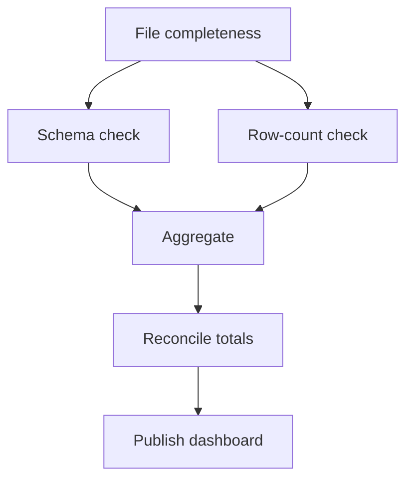

# DADS6002 Big Data Analytics — คลังโจทย์ข้อเขียนพร้อมวิธีเขียนตอบ

เอกสารนี้ใช้ฝึกอ่านโจทย์และเขียนคำตอบแบบบรรยาย โดยจัดตามลำดับเนื้อหาใน Lecture แทนการแบ่งเป็นชุด Mock A/B/C ทุกข้อวาง **โจทย์ → คำตอบสำหรับเขียนสอบ** ต่อกันทันที คำตอบตั้งใจให้มีความยาวที่เขียนได้จริงตามคะแนน จึงเน้นประเด็นที่ทำให้ได้คะแนนและไม่ทำหน้าที่แทนบทเรียนในไฟล์ Summary

ป้ายกำกับมีสองแบบ:

- **[ข้อสอบเก่า]** คือโจทย์ที่เป้ส่งมาให้โดยตรง
- **[ข้อเก็ง]** และ **[ข้อเก็งเพิ่มเติม]** คือโจทย์ที่สร้างจากรูปแบบข้อสอบเก่าและเนื้อหาใน Lecture ไม่ใช่ข้อสอบจริงหรือข้อมูลจากอาจารย์

วิธีฝึกที่แนะนำคืออ่านเฉพาะโจทย์ ปิดส่วนคำตอบ แล้วร่างประเด็นสำคัญจากความจำ จากนั้นจึงเทียบกับคำตอบว่าเรามี **นิยาม → ส่วนประกอบหรือกลไก → ขั้นตอน → ตัวอย่าง → failure/trade-off → สรุป** ครบหรือไม่ ไม่จำเป็นต้องจำถ้อยคำเหมือนตัวอย่าง

# 01 — Introduction to Big Data

ครอบคลุมความหมายของ Big Data, 5Vs, ประเภทการวิเคราะห์ข้อมูล, Big Data Pipeline, Data Lake และการตรวจสอบความถูกต้องของข้อมูล

## Intro 1 — [ข้อสอบเก่า] คุณสมบัติ 5Vs ของ Big Data (15 คะแนน)

### โจทย์

จงอธิบายคุณสมบัติ 5Vs ของ Big Data ให้เข้าใจ

### คำตอบสำหรับเขียนสอบ

Big Data คือสถานการณ์ที่ขนาด ความเร็ว หรือลักษณะของข้อมูลทำให้วิธีจัดเก็บและประมวลผลแบบเดิมไม่เพียงพอ โดยอธิบายได้ด้วย 5Vs ดังนี้

1. **Volume** คือปริมาณข้อมูลจำนวนมาก เช่น ธุรกรรมจากโรงพยาบาลหลายแห่งย้อนหลังหลายปี ทำให้ต้องกระจายการจัดเก็บและประมวลผล
2. **Velocity** คือความเร็วที่ข้อมูลเกิดและต้องถูกนำไปใช้ เช่น Log หรือข้อมูล Sensor ที่ไหลเข้าตลอดเวลา จึงต้องเลือกระหว่าง Batch กับ Streaming ให้เหมาะสม
3. **Variety** คือความหลากหลายของรูปแบบ เช่น Table, CSV, JSON, Log รูปภาพ และข้อความ ทำให้ต้องใช้วิธีอ่านและกำหนด Schema ต่างกัน
4. **Veracity** คือความถูกต้องและความน่าเชื่อถือ เช่น ข้อมูลซ้ำ ค่า Null หรือหน่วยนับไม่ตรง จึงต้องมี Validation และ Data Quality Control
5. **Value** คือคุณค่าที่องค์กรได้รับ เช่น ลดต้นทุน คาดการณ์ Stockout หรือช่วยตัดสินใจ หากข้อมูลมากแต่ใช้ประโยชน์ไม่ได้ก็ไม่ถือว่าประสบความสำเร็จ

ทั้งห้ามิติเชื่อมโยงกัน เช่น การรับข้อมูลจำนวนมากด้วยความเร็วสูงอาจเพิ่มปัญหาคุณภาพ ดังนั้นระบบ Big Data ต้องออกแบบทั้ง Storage, Processing และ Governance เพื่อเปลี่ยนข้อมูลให้เป็นคุณค่าทางธุรกิจ

## Intro 2 — [ข้อสอบเก่า] ประเภทของการวิเคราะห์ข้อมูล (10 คะแนน)

### โจทย์

การวิเคราะห์ข้อมูลมีได้กี่แบบ จงอธิบายและยกตัวอย่างประกอบ

### คำตอบสำหรับเขียนสอบ

การวิเคราะห์ข้อมูลแบ่งตามคำถามที่ต้องการตอบได้ 4 แบบ

1. **Descriptive Analytics** ตอบว่า “เกิดอะไรขึ้น” โดยสรุปข้อมูลอดีต เช่น รายงานจำนวนรายการ Stockout รายเดือน
2. **Diagnostic Analytics** ตอบว่า “ทำไมจึงเกิดขึ้น” โดยเจาะรายละเอียดและเปรียบเทียบปัจจัย เช่น พบว่า Stockout สูงเพราะ Supplier ส่งล่าช้าและ Forecast ต่ำกว่าความต้องการ
3. **Predictive Analytics** ตอบว่า “มีแนวโน้มจะเกิดอะไร” โดยใช้ข้อมูลอดีตสร้างแบบจำลอง เช่น พยากรณ์ว่ายาใดเสี่ยงขาดในเดือนหน้า
4. **Prescriptive Analytics** ตอบว่า “ควรทำอะไร” โดยเสนอการตัดสินใจภายใต้ข้อจำกัด เช่น แนะนำปริมาณสั่งซื้อและ Supplier สำรองเพื่อให้ต้นทุนต่ำแต่ยังมีของเพียงพอ

ทั้งสี่แบบต่อเนื่องกันจากการมองอดีต หาสาเหตุ คาดการณ์อนาคต และเลือกการกระทำ แต่ไม่จำเป็นต้องใช้ครบทุกแบบในทุกปัญหา ต้องเลือกตามคำถามและข้อมูลที่มี

## Intro 3 — [ข้อสอบเก่า] ขั้นตอนของ Big Data Pipeline (10 คะแนน)

### โจทย์

จงอธิบายขั้นตอนต่าง ๆ ของ Big Data Pipeline และยกตัวอย่างเครื่องมือที่ช่วยในการทำงานของแต่ละขั้นตอน

### คำตอบสำหรับเขียนสอบ

Big Data Pipeline คือกระบวนการพาข้อมูลจากแหล่งกำเนิดไปสู่ผลลัพธ์ที่ผู้ใช้ตัดสินใจได้ ประกอบด้วยขั้นสำคัญดังนี้

1. **Data Source** คือแหล่งข้อมูล เช่น RDBMS, File, Application Log และ Sensor
2. **Ingestion** นำข้อมูลเข้าสู่แพลตฟอร์ม แบบ Batch อาจใช้ Sqoop และแบบ Event ต่อเนื่องอาจใช้ Flume หรือ Kafka
3. **Storage** เก็บข้อมูลดิบและข้อมูลที่ผ่านการจัดระเบียบ เช่น HDFS, Data Lake หรือ HBase
4. **Processing and Transformation** ทำความสะอาด แปลง และคำนวณข้อมูล เช่น MapReduce หรือ Spark
5. **Query and Analytics** วิเคราะห์หรือสร้างผลสรุป เช่น Hive, SQL และเครื่องมือ Machine Learning
6. **Serving and Presentation** ส่งผลให้ผู้ใช้ เช่น Dashboard, Report, API หรือตารางปลายทาง
7. **Orchestration and Governance** ควบคุมลำดับงาน การ Retry คุณภาพ ความปลอดภัย และ Lineage เช่น Airflow หรือ Oozie

ตัวอย่างเช่น ดึงรายการจัดซื้อจาก MySQL เข้า HDFS ประมวลผลยอดด้วย Spark เปิดให้ Query ผ่าน Hive แล้วแสดงใน Dashboard โดยทุกขั้นต้องตรวจจำนวนแถว ข้อมูลซ้ำ และยอดรวม ไม่ใช่ตรวจเพียงว่า Job รันสำเร็จ

## Intro 4 — [ข้อเก็ง] 5Vs กับการออกแบบระบบ (10 คะแนน)

### โจทย์

จงอธิบายว่า 5Vs แต่ละด้านส่งผลต่อการออกแบบ Big Data System อย่างไร โดยใช้กรณีข้อมูลธุรกรรมจัดซื้อ, clickstream และ sensor อุณหภูมิยาเป็นตัวอย่าง

### คำตอบสำหรับเขียนสอบ

**Volume** ของธุรกรรมจัดซื้อหลายปีทำให้ต้องใช้ storage ที่ขยายได้และแบ่ง processing หลายเครื่อง เช่น HDFS และ distributed processing **Velocity** ของ clickstream และ sensor ทำให้ระบบต้องรับ events ต่อเนื่อง มี buffer และ monitoring เพื่อไม่ให้ producer เร็วกว่าปลายทางจนข้อมูลตกหล่น

**Variety** เกิดจากธุรกรรมแบบตาราง, clickstream แบบ JSON/log และ sensor records ที่อาจมี schema ต่างกัน จึงต้องมี parsing, SerDe, schema management และ data contract **Veracity** เกิดจาก duplicate transactions, missing timestamp, sensor ผิดหน่วย หรือรหัสโรงพยาบาลไม่ตรงกัน จึงต้องมี validation, deduplication และ reconciliation

**Value** กำหนดว่าระบบควรนำข้อมูลไปทำอะไร เช่นลดต้นทุน คาดการณ์ stockout หรือตรวจอุณหภูมิผิดปกติ หากเก็บข้อมูลมากและเร็วแต่ไม่มี decision/use case ก็สร้างต้นทุนโดยไม่เกิดคุณค่า

คำตอบที่ดีต้องเชื่อม V กับ design consequence ไม่ใช่แปลชื่อศัพท์เท่านั้น เช่น Velocity นำไปสู่ streaming/buffering, Variety นำไปสู่ schema/format handling และ Veracity นำไปสู่ quality controls

---

## Intro 5 — [ข้อเก็ง] Analytics 4 แบบในปัญหา Stockout (10 คะแนน)

### โจทย์

จงเปรียบเทียบ Descriptive, Diagnostic, Predictive และ Prescriptive Analytics โดยใช้ปัญหา stockout ของโรงพยาบาลเป็นสถานการณ์เดียวกันตลอดคำตอบ

### คำตอบสำหรับเขียนสอบ

Descriptive Analytics ตอบว่า “เกิดอะไรขึ้น” เช่นเดือนนี้เกิด stockout 120 ครั้งใน 15 โรงพยาบาล Diagnostic Analytics ตอบว่า “เพราะเหตุใด” โดยเจาะตามสินค้า โรงพยาบาล lead time และ forecast error อาจพบว่าส่วนใหญ่เกิดกับสินค้าที่ lead time สูงและปรับ reorder point ไม่ทัน

Predictive Analytics ตอบว่า “อะไรน่าจะเกิด” เช่นใช้ยอดใช้ย้อนหลัง ฤดูกาล และ lead time คาดการณ์ความน่าจะเป็นที่แต่ละสินค้า–โรงพยาบาลจะ stockout ภายใน 14 วัน Prescriptive Analytics ตอบว่า “ควรทำอะไร” เช่นแนะนำให้สั่งเพิ่ม โอน stock ระหว่างโรงพยาบาล หรือปรับ safety stock ภายใต้ข้อจำกัดงบประมาณและวันหมดอายุ

ทั้งสี่ระดับต่อกันแต่ไม่แทนกัน Prediction ที่แม่นไม่ได้บอก action ที่เหมาะสมโดยอัตโนมัติ และ prescription ที่ดีต้องอาศัยข้อมูล descriptive/diagnostic ที่ถูกต้องรวมทั้งข้อจำกัดธุรกิจ

---

## Intro 6 — [ข้อเก็ง] ออกแบบ Big Data Pipeline (15 คะแนน)

### โจทย์

เครือโรงพยาบาลต้องสร้างระบบวิเคราะห์การจัดซื้อ โดยมี vendor master ใน MySQL, purchase events ที่เกิดต่อเนื่อง และต้องแสดง dashboard รายวัน จงออกแบบ Big Data Pipeline ตั้งแต่ ingestion ถึง visualization ระบุเครื่องมือในแต่ละขั้น พร้อมอธิบาย validation และ failure recovery

### คำตอบสำหรับเขียนสอบ

Vendor master ใน MySQL เป็น structured data ที่เปลี่ยนเป็นรอบ จึงใช้ batch/incremental connector; ในกรอบเครื่องมือของบทเรียนใช้ Sqoop import ไป HDFS/Hive ได้ Purchase events ที่เกิดต่อเนื่องและมีผู้ใช้หลายกลุ่มควร publish เข้า Kafka โดยใช้ key ที่สอดคล้องกับ ordering requirement เช่น `hospital_id` หรือ `po_id`

Raw data เก็บใน HDFS/Data Lake โดยแยก path ตาม source และ ingestion date Hive External Tables ประกาศ schema เหนือ raw files แล้ว processing ด้วย Hive/MapReduce/Spark ทำความสะอาด deduplicate และ join vendor master สร้าง curated table สำหรับยอดรายวัน Dashboard query aggregated serving table แทน raw events ทั้งหมดเพื่อลด latency/cost

Orchestrator เช่น Airflow/Oozie ควบคุม dependency: ingestion complete → schema/volume checks → transformation → reconciliation → publish แต่ไม่คำนวณข้อมูลแทน engine Validation ต้องมี source/destination row counts, duplicate event IDs, null/key checks, min/max timestamps, unmatched vendors, amount totals และ freshness SLA

Failure recovery ใช้ batch ID/checkpoint/offset เขียนลง staging ก่อน promote, commit watermark หลัง validation และออกแบบ output ให้ idempotent หาก consumer ล้มให้ resume จาก committed offset หาก transformation ล้มให้ rerun partition/date นั้นโดยไม่ append ซ้ำ

---

## Intro 7 — [ข้อเก็ง] Job Success กับ Data Correctness (10 คะแนน)

### โจทย์

จงอธิบายว่า “job รันสำเร็จ” ต่างจาก “ข้อมูลถูกต้อง” อย่างไร เสนอ validation evidence อย่างน้อย 6 รายการสำหรับ pipeline ที่นำข้อมูลจาก MySQL เข้า Hive แล้ว aggregate ยอดซื้อ

---

### คำตอบสำหรับเขียนสอบ

Job success หมายถึง process จบโดยไม่เกิด error ตามเงื่อนไขของ engine แต่ไม่ได้รับรองว่า source ถูกชุด, ดึงข้อมูลครบ, schema ถูก, ไม่มี duplicate หรือ business totals ตรง ตัวอย่างเช่น Sqoop job สำเร็จแต่ดึงเฉพาะบางวันที่ watermark ผิด หรือ Hive query สำเร็จแต่ join ทำยอดซ้ำ

Validation evidence ที่ควรมีอย่างน้อย:

1. Source row count เทียบ destination row count แยก batch/date
2. Distinct business key count และ duplicate keys
3. Null count/invalid values ของ key และ measure สำคัญ
4. Min/max ของ primary key, timestamp หรือ business date
5. Data type, column mapping และ parse error count
6. Sum(amount) หรือ control totals ก่อนและหลัง ingestion
7. Unmatched vendor keys หลัง join
8. Row count และ grain หลัง aggregation/join
9. Batch ID, source watermark, ingestion timestamp และ lineage
10. Freshness/SLA และรายการ rejected/dead-letter records

หลักฐานต้องเก็บร่วมกับสถานะ batch และ commit watermark หลัง validation ผ่านเท่านั้น เพื่อ rerun/reconcile ได้

---

---

## Intro 8 — [ข้อเก็งเพิ่มเติม] Data Lake ต่างจาก Data Warehouse อย่างไร

### โจทย์

Data Lake ต่างจาก Data Warehouse อย่างไร

### คำตอบสำหรับเขียนสอบ

Data Lake มักเก็บข้อมูลหลากหลายรูปแบบและหลายระดับการปรับแต่งบน scalable storage ส่วน Warehouse เน้นข้อมูลมีโครงสร้าง/curated สำหรับ analytics และ governance ความต่างไม่ใช่เพียงชนิดไฟล์ แต่รวม schema, workload, quality และ operating model

---

# 02 — Hadoop, HDFS, YARN และ MapReduce

ครอบคลุม Hadoop architecture, distributed storage, resource management, MapReduce data flow, failure recovery, data skew และ workflow orchestration

## Hadoop 1 — [ข้อสอบเก่า] หลักการและขั้นตอนการทำงานของ MapReduce (10 คะแนน)

### โจทย์

จงอธิบายหลักการและขั้นตอนการทำงานของ MapReduce พร้อมยกตัวอย่างการนับจำนวนค่าที่เป็นบวกหรือศูนย์ และค่าที่เป็นลบในไฟล์ 1, -2, 0, 8, -5

### คำตอบสำหรับเขียนสอบ

MapReduce เป็นรูปแบบประมวลผลข้อมูลแบบกระจาย โดยแบ่งข้อมูลให้หลาย Mapper ทำงานพร้อมกัน แล้วรวบรวมผลตาม Key ก่อนส่งให้ Reducer สรุปคำตอบ

ขั้นแรก InputFormat แบ่งข้อมูลเป็น Input Splits และ RecordReader ส่งแต่ละค่าให้ Mapper จากนั้น Mapper ตรวจค่าทีละตัว ถ้าค่ามากกว่าหรือเท่ากับศูนย์ให้ส่ง (positive, 1) ถ้าค่าน้อยกว่าศูนย์ให้ส่ง (negative, 1) ระบบ Partitioner และ Shuffle/Sort จะนำค่าที่มี Key เดียวกันไปยัง Reducer เดียวและจัดกลุ่มเป็น positive → [1,1,1] กับ negative → [1,1] สุดท้าย Reducer บวกค่าภายในแต่ละกลุ่ม จึงได้ positive = 3 และ negative = 2

หลักสำคัญคือ Mapper แปลง Record เป็น Intermediate Key–Value, Shuffle รวมข้อมูลตาม Key และ Reducer สรุปแต่ละกลุ่ม การเลือก Key จึงกำหนดว่าระบบกำลังตอบคำถามอะไร หาก Task ล้ม Framework สามารถรันใหม่ได้ จึงไม่ควรให้ Mapper สร้าง Side Effect ที่เกิดซ้ำไม่ได้

## Hadoop 2 — [ข้อสอบเก่า] ส่วนประกอบของ HDFS และ YARN (15 คะแนน)

### โจทย์

จงอธิบายส่วนประกอบและหน้าที่ของส่วนประกอบเหล่านั้นของ HDFS และ YARN

### คำตอบสำหรับเขียนสอบ

**HDFS** เป็นระบบจัดเก็บไฟล์แบบกระจาย ไฟล์ถูกแบ่งเป็น Blocks และทำ Replication บนหลายเครื่อง **NameNode** เก็บ Metadata เช่นชื่อไฟล์ สิทธิ์ รายการ Blocks และตำแหน่ง DataNodes ส่วน **DataNode** เก็บ Bytes ของ Blocks จริง ส่ง Heartbeat และ Block Report ให้ NameNode และให้บริการอ่าน–เขียนข้อมูล **Checkpoint หรือ Secondary NameNode** ช่วยรวม FsImage กับ EditLog เพื่อลดภาระการกู้ Metadata แต่ไม่ใช่ Backup ที่รับงานแทนทันที

เมื่อ Client เขียนไฟล์ จะขอสร้างไฟล์จาก NameNode ก่อน NameNode เลือก DataNodes สำหรับ Replicas แล้ว Client ส่ง Block ไป DataNode แรก จากนั้นส่งต่อเป็น Replication Pipeline หาก DataNode ล้ม NameNode ตรวจพบจาก Heartbeat และสั่งสร้าง Replica ทดแทน

**YARN** จัดสรร CPU และ Memory ให้ Applications ใน Cluster **ResourceManager** ดูทรัพยากรรวมและจัดสรร Containers, **NodeManager** ดูแลทรัพยากรและรัน Containers บนแต่ละเครื่อง, **ApplicationMaster** ควบคุม Application หนึ่งงาน ขอ Containers และติดตาม Tasks ส่วน **Container** คือขอบเขตทรัพยากรที่จัดให้ Task

สรุปคือ HDFS ตอบว่า “ข้อมูลอยู่ที่ไหน” ส่วน YARN ตอบว่า “งานใดได้ใช้ทรัพยากรที่ไหน” และ Processing Framework เช่น MapReduce ใช้ทั้งสองระบบร่วมกัน

## Hadoop 3 — [ข้อเก็ง] Hadoop, HDFS, YARN และ MapReduce (10 คะแนน)

### โจทย์

จงอธิบายว่า Hadoop คืออะไร และอธิบายความสัมพันธ์ระหว่าง HDFS, YARN และ MapReduce โดยยกตัวอย่างงานสรุปยอดจัดซื้อรายโรงพยาบาล

### คำตอบสำหรับเขียนสอบ

Hadoop คือชุดซอฟต์แวร์สำหรับจัดเก็บและประมวลผลข้อมูลแบบกระจายบน cluster ของหลายเครื่อง ไม่ใช่ฐานข้อมูลหนึ่งชนิด และไม่ใช่ชื่ออื่นของ MapReduce ทั้งระบบประกอบด้วยชั้นที่รับผิดชอบต่างกันแต่ทำงานร่วมกัน

**HDFS** เป็น storage layer ทำหน้าที่แบ่งไฟล์เป็น blocks กระจาย blocks ไปยัง DataNodes และทำ replication เพื่อให้ข้อมูลยังใช้งานได้เมื่อบางเครื่องเสีย **YARN** เป็น resource-management layer จัดสรร CPU และ memory ในรูป containers ให้ applications ที่ต้องรันบน cluster ส่วน **MapReduce** เป็น processing model ที่แบ่งการคำนวณเป็น Map, Shuffle/Sort และ Reduce

ตัวอย่างงานสรุปยอดจัดซื้อต่อโรงพยาบาล เริ่มจากไฟล์รายการจัดซื้ออยู่ใน HDFS Client ส่ง MapReduce job ไปยัง YARN, ResourceManager และ ApplicationMaster จัดสรร containers ให้ Mapper และ Reducer Tasks แต่ละ Mapper อ่าน records จาก HDFS แล้ว emit `(hospital_id, amount)` ระบบ Shuffle/Sort รวม amounts ของโรงพยาบาลเดียวกัน และ Reducer หาผลรวมก่อนเขียน output กลับ HDFS

ความสัมพันธ์ที่ควรสรุปคือ HDFS ตอบว่า “ข้อมูลอยู่ที่ไหน”, YARN ตอบว่า “งานใดได้ใช้ทรัพยากรที่ใด” และ MapReduce ตอบว่า “จะแบ่งและรวมการคำนวณอย่างไร”

---

## Hadoop 4 — [ข้อเก็ง] HDFS Blocks, Replication และ Write Flow (15 คะแนน)

### โจทย์

ไฟล์ขนาด 600 MB ถูกจัดเก็บใน HDFS ซึ่งกำหนด block size เท่ากับ 128 MB และ replication factor เท่ากับ 3

1. ไฟล์นี้ถูกแบ่งเป็นกี่ blocks และแต่ละ block มีขนาดเท่าใด
2. มี block replicas รวมกี่ชุด
3. จงอธิบาย HDFS write flow ตั้งแต่ client เริ่มเขียนจนเขียนสำเร็จ

### คำตอบสำหรับเขียนสอบ

จำนวน blocks คำนวณด้วย

$$
\lceil \frac{600}{128} \rceil = 5\text{ blocks}
$$

สี่ blocks แรกมีขนาด 128 MB รวม 512 MB และ block สุดท้ายมีขนาด 88 MB จำนวน block replicas รวมคือ

$$
5 \times 3 = 15\text{ replicas}
$$

Replication factor 3 หมายถึงแต่ละ block มีสาม replicas ไม่ได้หมายความว่าผู้ใช้เห็นไฟล์สามไฟล์ และไม่ควรคำนวณพื้นที่จริงเพียง `600 × 3` โดยละเลย metadata, checksums และ overhead หากโจทย์ถามเฉพาะ payload ตามแนวคิดพื้นฐาน ขนาด replicated payload คือประมาณ 1,800 MB

HDFS write flow เริ่มเมื่อ client ขอสร้างไฟล์จาก NameNode NameNode ตรวจ namespace, permission และยืนยันว่า path ใช้งานได้ จากนั้นเลือก DataNodes สำหรับ replicas ของ block แรก Client ส่ง bytes ไปยัง DataNode ตัวแรก ซึ่งส่งต่อเป็น pipeline ไปยัง DataNodes ถัดไป เมื่อแต่ละ DataNode เขียนและตรวจข้อมูลสำเร็จ acknowledgement จะย้อนกลับมาหา client หลัง block แรกเสร็จ client ขอ pipeline สำหรับ block ต่อไปจนครบห้า blocks แล้วปิดไฟล์

NameNode บันทึก metadata เช่นชื่อไฟล์ รายการ blocks และตำแหน่ง replicas แต่ payload ไม่ไหลผ่าน NameNode โดยปกติ หาก DataNode ใดล้มระหว่างเขียน pipeline จะปรับและระบบพยายามสร้าง replica ให้ครบตามนโยบาย ภายหลัง DataNodes ส่ง heartbeat และ block report เพื่อให้ NameNode ติดตามสถานะจริง

---

## Hadoop 5 — [ข้อเก็ง] YARN Application Lifecycle (15 คะแนน)

### โจทย์

จงอธิบายส่วนประกอบของ YARN และไล่ขั้นตอนตั้งแต่ client submit MapReduce application จนงานเสร็จ หาก NodeManager หนึ่งเครื่องหยุดทำงานระหว่างรัน จะเกิดอะไรขึ้น

### คำตอบสำหรับเขียนสอบ

ส่วนประกอบหลักของ YARN ได้แก่ ResourceManager, NodeManager, ApplicationMaster และ Container ResourceManager ดูแลทรัพยากรระดับ cluster NodeManager ทำงานบน worker nodes และเปิด containers ApplicationMaster ดูแล lifecycle และ tasks ของ application หนึ่งงาน ส่วน Container คือขอบเขต CPU/memory ที่ได้รับจัดสรร ไม่ใช่ตัว task และไม่จำเป็นต้องหมายถึง Docker

ขั้นตอนคือ client submit application พร้อมข้อมูลที่จำเป็นไปยัง ResourceManager จากนั้น ResourceManager เลือก NodeManager และให้ container สำหรับเริ่ม ApplicationMaster ApplicationMaster register กับ ResourceManager แล้วขอ containers สำหรับ Mapper/Reducer Tasks โดยระบุความต้องการทรัพยากรและอาจคำนึงถึง data locality ResourceManager จัดสรร containers, NodeManagers เปิด processes และรายงานสถานะ ขณะที่ ApplicationMaster ติดตาม progress และจัดการ retry เมื่องานเสร็จจึงรายงานผลและคืนทรัพยากร

หาก NodeManager หยุดทำงาน ResourceManager ตรวจพบจาก heartbeat ที่ขาดหาย Containers บน node นั้นถือว่าสูญหาย ApplicationMaster หรือ framework จึงขอ containers ใหม่และ rerun tasks ที่ยังไม่สำเร็จใน node อื่น การ retry ไม่ได้ทำให้ side effects ภายนอกปลอดภัยโดยอัตโนมัติ หาก task ส่งอีเมลหรือเขียนฐานข้อมูลภายนอกโดยไม่ idempotent อาจเกิดผลซ้ำ

---

## Hadoop 6 — [ข้อเก็ง] MapReduce ยอดซื้อรวม (15 คะแนน)

### โจทย์

กำหนดข้อมูลยอดซื้อดังนี้:

```text
H001,100
H002,300
H001,250
H003,400
H002,50
```

จงออกแบบ MapReduce เพื่อหายอดซื้อรวมต่อโรงพยาบาล แสดง output ของ Mapper, ผลหลัง Shuffle/Sort และผลของ Reducer พร้อมอธิบายหน้าที่ของ Partitioner และ Combiner

### คำตอบสำหรับเขียนสอบ

Mapper อ่านหนึ่ง record แยก `hospital_id` และ `amount` แล้ว emit ดังนี้:

| Input | Mapper output |
|---|---|
| `H001,100` | `(H001,100)` |
| `H002,300` | `(H002,300)` |
| `H001,250` | `(H001,250)` |
| `H003,400` | `(H003,400)` |
| `H002,50` | `(H002,50)` |

หลัง Shuffle/Sort/Group:

```text
H001 -> [100, 250]
H002 -> [300, 50]
H003 -> [400]
```

Reducer บวก values ของแต่ละ key จึงได้:

```text
H001,350
H002,350
H003,400
```

**Partitioner** ตัดสินใจว่า intermediate key จะไป Reducer ใด เงื่อนไขสำคัญคือ `H001` จาก Mappers ทุกตัวต้องไป Reducer เดียวกัน มิฉะนั้นยอด H001 จะถูกแยกและผิด **Combiner** อาจหาผลรวมย่อยในฝั่ง Mapper เพื่อลดข้อมูลที่ส่งผ่าน network เช่นรวม H001 ของ Mapper หนึ่งเป็น `(H001,350)` ก่อน Shuffle

Combiner เป็น optimization และ framework ไม่รับประกันว่าจะรัน จึงห้ามพึ่ง Combiner เพื่อความถูกต้อง ฟังก์ชัน SUM ใช้ได้เพราะ associative และ commutative แต่ average ต้องส่งอย่างน้อย sum กับ count ไม่ควรหา average ย่อยแล้วนำ averages มาเฉลี่ยตรง ๆ

---

## Hadoop 7 — [ข้อเก็ง] HDFS Components, Metadata และ Failure (15 คะแนน)

### โจทย์

จงเปรียบเทียบ NameNode, Secondary NameNode, DataNode และ Standby NameNode พร้อมอธิบายว่า heartbeat, block report, `FsImage` และ `EditLog` มีหน้าที่อะไร หาก DataNode หนึ่งเครื่องเสีย HDFS จัดการอย่างไร

### คำตอบสำหรับเขียนสอบ

NameNode ดูแล namespace และ metadata เช่นไฟล์ประกอบด้วย blocks ใดและ replicas อยู่ DataNodes ใด DataNode เก็บ block bytes จริง ส่ง heartbeat รายงานว่ายังมีชีวิต และ block report รายงานรายการ blocks ที่เก็บอยู่

`FsImage` คือ snapshot ของ namespace ณ จุดหนึ่ง ส่วน `EditLog` บันทึกการเปลี่ยนแปลงหลัง snapshot Secondary NameNode หรือ Checkpoint Node นำทั้งสองมารวมเป็น checkpoint ใหม่ มันไม่ใช่ hot backup ที่รับงานแทน NameNode ได้ทันที

Standby NameNode ใน HDFS High Availability ต่างออกไป เพราะติดตาม metadata changes จาก shared edits และเตรียมรับบท Active เมื่อเกิด failover ภายใต้ coordination/fencing ที่เหมาะสม จึงไม่ควรเรียก Secondary NameNode ว่า Standby NameNode

ถ้า DataNode เสีย NameNode ตรวจพบจาก heartbeat ที่หายไป ระบุ blocks ที่ under-replicated จาก metadata/block reports และเลือก DataNodes ที่ยังมี replica ให้คัดลอกไปยัง DataNode อื่นจน replication กลับครบ ระหว่างนั้น client ยังอ่านได้หากมี replica ที่ใช้งานได้

---

## Hadoop 8 — [ข้อเก็ง] HDFS Block, Input Split, InputFormat และ RecordReader (10 คะแนน)

### โจทย์

จงอธิบายความแตกต่างระหว่าง HDFS Block กับ MapReduce Input Split และอธิบายบทบาทของ InputFormat และ RecordReader เหตุใดจึงไม่ควรกล่าวว่า “หนึ่ง HDFS Block เท่ากับหนึ่ง Mapper เสมอ”

### คำตอบสำหรับเขียนสอบ

HDFS Block เป็นหน่วยทางกายภาพที่ HDFS ใช้จัดเก็บและ replication bytes ของไฟล์ เช่น block size 128 MB ส่วน Input Split เป็นคำอธิบายเชิงตรรกะว่าหนึ่ง Map Task ควรอ่านช่วงใดของ input มันมักพยายามสอดคล้องกับ blocks เพื่อ data locality แต่ไม่ได้เป็น object เดียวกัน

InputFormat กำหนดวิธีสร้าง Input Splits และ RecordReader กำหนดวิธีแปลง bytes ภายใน split เป็น records/key-value pairs ที่ Mapper เข้าใจ เช่น TextInputFormat ใช้หนึ่งบรรทัดเป็นหนึ่ง record

หนึ่ง block ไม่เท่ากับหนึ่ง Mapper เสมอ เพราะ split size ปรับได้, input format บางชนิดรวมไฟล์เล็กหลายไฟล์, record อาจข้าม block boundary และ compressed file บางชนิดแบ่งไม่ได้ตามปกติ จำนวน Mappers จึงสัมพันธ์กับจำนวน input splits ไม่ใช่จำนวน blocks โดยกฎตายตัว

---

## Hadoop 9 — [ข้อเก็ง] Workflow Orchestration และ DAG (10 คะแนน)

### โจทย์

จงอธิบาย Workflow Orchestration และ DAG พร้อมออกแบบ dependency ของงานต่อไปนี้: ตรวจว่าไฟล์มาครบ, ตรวจ schema, ตรวจ row count, aggregate ยอดซื้อ, reconcile ยอดรวม และ publish dashboard อธิบายว่า task ใดทำขนานกันได้ และถ้า publish ล้มควร rerun อย่างไร

### คำตอบสำหรับเขียนสอบ

Workflow Orchestration คือการกำหนดว่า tasks ใดรันเมื่อใด ต้องรอใคร ล้มแล้ว retry อย่างไร และผลลัพธ์ถูกส่งต่อที่ใด DAG คือ directed acyclic graph ที่แสดง dependencies โดยไม่มีวงจร

Flow ที่เหมาะสมคือหลังตรวจว่าไฟล์มาครบแล้ว สามารถตรวจ schema และ row count แบบขนาน เพราะทั้งสองอ่าน input เดียวกันแต่ไม่ต้องรอกัน เมื่อทั้งคู่ผ่านจึง aggregate ยอดซื้อ จากนั้น reconcile output กับ control totals แล้วจึง publish dashboard



หาก publish ล้ม ไม่ควรรัน ingestion และ aggregation ใหม่โดยไม่มีเหตุผล เพราะผล upstream ที่ผ่าน validation แล้วนำกลับมาใช้ได้ ให้ retry เฉพาะ publish โดยใช้ output version/batch เดิม การ publish ควร idempotent เช่น replace partition หรือ atomic swap เพื่อไม่สร้างสำเนาซ้ำ

---

## Hadoop 10 — [ข้อเก็ง] Partitioner และ Data Skew (15 คะแนน)

### โจทย์

MapReduce Job มี reducer 4 ตัว แต่ key `H001` มีข้อมูลมากถึง 70% ของ records ทั้งหมด จงอธิบายบทบาทของ Partitioner, ปัญหา Data Skew, ผลต่อเวลารัน และแนวทางแก้ไขโดยไม่ทำให้ผลรวมผิด

### คำตอบสำหรับเขียนสอบ

Partitioner ใช้ intermediate key เลือก Reducer โดยต้องทำให้ key เดียวกันไป Reducer เดียวกัน หากใช้ hash partitioner ตามปกติ `H001` ทั้งหมดจะไป Reducer ตัวเดียว เมื่อ H001 มี 70% ของ records Reducer นั้นจึงใช้เวลานาน ขณะที่อีกสาม reducers เสร็จและรอ Job completion นี่คือ data skew เพิ่มทั้ง network, memory/spill และ tail latency

ห้ามแก้ด้วยการกระจาย H001 แบบสุ่มไปหลาย reducersแล้วจบ เพราะจะได้ผลรวมย่อยหลายค่าและละเมิดเงื่อนไข key เดียวกันต้องรวมครบ แนวทางที่ถูกต้องมีหลายแบบ:

1. ทำ two-stage aggregation โดยเติม salt ให้ key หนัก เช่น `H001#0..9` ใน job แรกเพื่อได้ partial sums แล้ว job ที่สองลบ salt และรวมเป็น H001
2. ใช้ Combiner ลด records ฝั่ง Mapper หาก aggregation เป็น SUM และข้อมูล H001 จำนวนมากเกิดในแต่ละ mapper
3. ปรับ partition strategy สำหรับ keys อื่นให้สมดุล แต่ heavy key เดี่ยวยังคงต้องใช้ multi-stage approach
4. ถ้าธุรกิจยอมเปลี่ยน grain อาจแบ่งตาม hospital+period แต่ต้องรวมกลับตาม requirement สุดท้าย

ควรตรวจ key frequency ก่อนรันและดู reducer input records/duration เพื่อยืนยัน skew

---

## Hadoop 11 — [ข้อเก็งเพิ่มเติม] เหตุใด HDFS ไม่เหมาะกับไฟล์เล็กจำนวนมาก

### โจทย์

เหตุใด HDFS ไม่เหมาะกับไฟล์เล็กจำนวนมาก

### คำตอบสำหรับเขียนสอบ

ทุกไฟล์และ block ต้องมี metadata ใน NameNode ไฟล์เล็กจำนวนมากจึงใช้ memory metadata และสร้าง overhead ในการ list/open รวมถึงมี task startup มากเมื่อประมวลผล แม้ payload รวมไม่ใหญ่ แนวทางคือรวมไฟล์ ใช้ container format เช่น Parquet/SequenceFile หรือ compact files ตาม workload

---

## Hadoop 12 — [ข้อเก็งเพิ่มเติม] Data Locality คืออะไร

### โจทย์

Data Locality คืออะไร

### คำตอบสำหรับเขียนสอบ

Data locality คือการพยายามรัน task บน node ที่มี block หรือใกล้กับข้อมูล เพื่อลด network transfer YARN/MapReduce ใช้ตำแหน่งข้อมูลประกอบการจัด container แต่ไม่รับประกันว่าจะ local เสมอเพราะทรัพยากรอาจไม่ว่าง

---

## Hadoop 13 — [ข้อเก็งเพิ่มเติม] ทำไม Secondary NameNode ไม่ใช่ Backup NameNode

### โจทย์

ทำไม Secondary NameNode ไม่ใช่ Backup NameNode

### คำตอบสำหรับเขียนสอบ

มันสร้าง checkpoint โดย merge FsImage กับ EditLog ไม่ได้ติดตามสถานะพร้อมรับ traffic และ failover อัตโนมัติแบบ Standby NameNode ใน HA

---

## Hadoop 14 — [ข้อเก็งเพิ่มเติม] Combiner ใช้ไม่ได้กับกรณีใด

### โจทย์

Combiner ใช้ไม่ได้กับกรณีใด

### คำตอบสำหรับเขียนสอบ

ใช้ไม่ได้เมื่อ partial aggregation แล้วนำมารวมต่อให้ผลต่างจากคำนวณทั้งหมด เช่น average-of-averages ที่กลุ่มย่อยมีขนาดไม่เท่ากัน หรือ function ที่ไม่ associative/commutative และต้องไม่พึ่งว่าจะรัน

---

## Hadoop 15 — [ข้อเก็งเพิ่มเติม] Map Task ล้มแล้ว framework ทำอย่างไร

### โจทย์

Map Task ล้มแล้ว framework ทำอย่างไร

### คำตอบสำหรับเขียนสอบ

รัน task attempt ใหม่ใน container เดิมหรือ node อื่น Output ชั่วคราวของ attempt ที่ล้มไม่ควรถูก commit แต่ side effect ภายนอกอาจเกิดซ้ำ จึงต้องออกแบบ mapper/reducer ให้ deterministic และ idempotent

---

## Hadoop 16 — [ข้อเก็งเพิ่มเติม] Oozie/Airflow ต่างจาก Processing Engine อย่างไร

### โจทย์

Oozie/Airflow ต่างจาก Processing Engine อย่างไร

### คำตอบสำหรับเขียนสอบ

Orchestrator schedule และควบคุม dependency/retry ของ tasks แต่ไม่ได้คำนวณ aggregation แทน MapReduce/Spark/Hive Engine จึงต้องแยก orchestration failure จาก processing/data failure

---

---

# 03 — Apache Hive

ครอบคลุม file-to-table abstraction, Metastore, query execution, ACID, Partition/Bucket, Managed/External Table, SerDe, aggregation และ join correctness

## Hive 1 — [ข้อสอบเก่า] การทำงานของ Hive (10 คะแนน)

### โจทย์

จงอธิบายวิธีที่ Hive ทำคำสั่ง (1) ACID Operations ได้แก่ Insert, Update และ Delete กับ Hive Table และ (2) Select with Group By และ Aggregation

### คำตอบสำหรับเขียนสอบ

Hive เป็น Data Warehouse และ Query Layer ที่ทำให้ผู้ใช้มอง Files ใน HDFS เป็น Table และใช้ HQL ได้ เมื่อรับคำสั่ง Hive จะตรวจ HQL อ่าน Schema, Location และ File Format จาก Metastore สร้าง Execution Plan แล้วให้ Execution Engine อ่านหรือเขียน Files จริง

สำหรับ **ACID Operations** Hive ไม่แก้ Bytes กลางไฟล์เดิมทันที แต่จัดการการเปลี่ยนแปลงด้วย Transaction Metadata และ Delta Files โดย Insert เขียน Rows ใหม่, Update บันทึกการแทนที่ Row เดิมด้วยค่าใหม่ และ Delete สร้าง Delete Delta เพื่อให้ Reader ตัด Row นั้นออก เมื่อ Delta Files มากขึ้น Compaction จะรวมไฟล์เพื่อลดต้นทุนการอ่าน ดังนั้น Hive รองรับ ACID ได้แต่ยังเหมาะกับงานวิเคราะห์แบบ Batch มากกว่างาน OLTP ที่แก้ทีละแถวถี่มาก

สำหรับ **Group By และ Aggregation** Hive อ่าน Rows ตาม Schema แบ่งกลุ่มด้วย Grouping Key แล้วคำนวณ Aggregate เช่น SUM, COUNT หรือ AVG ตัวอย่าง Group By hospital_id จะเปลี่ยน Grain จากหนึ่ง Row ต่อรายการซื้อเป็นหนึ่ง Row ต่อโรงพยาบาล Execution Engine อาจทำ Partial Aggregation ก่อน Shuffle เพื่อลดข้อมูลที่ส่งผ่าน Network แล้วรวมผลสุดท้ายภายหลัง

## Hive 2 — [ข้อเก็ง] Hive Architecture และ Query Flow (10 คะแนน)

### โจทย์

จงอธิบายว่า Hive ทำให้ไฟล์ใน HDFS กลายเป็นตารางที่ query ได้อย่างไร โดยอธิบายความสัมพันธ์ระหว่าง HQL, Driver/Compiler, Metastore, Execution Engine และ HDFS

### คำตอบสำหรับเขียนสอบ

HDFS มองข้อมูลเป็น files และ bytes แต่ไม่ทราบว่าแต่ละส่วนคือ column ใด Hive เพิ่ม table metadata เพื่อแปล files เหล่านั้นเป็น rows และ columns ทำให้ผู้ใช้ query ด้วย HQL ได้ ข้อมูลจริงยังอยู่ใน HDFS หรือ storage ที่กำหนด ไม่ได้ถูกย้ายทั้งหมดไปไว้ใน Metastore

เมื่อผู้ใช้ส่ง HQL, Driver รับและควบคุม query Compiler/Analyzer parse syntax และตรวจความหมาย เช่น table/column มีอยู่หรือไม่ จากนั้นถาม Metastore เพื่อได้ schema, location, partition, file format และ SerDe Optimizer ปรับ logical plan เช่น partition pruning แล้วสร้าง physical execution plan Execution Engine รัน plan ด้วย engine ที่กำหนด อ่าน files จาก HDFS และส่งผลกลับผู้ใช้หรือเขียนเป็น table ใหม่

Metastore เก็บ metadata ไม่ใช่ records ธุรกิจทั้งหมด HQL เป็นภาษาระบุผลที่ต้องการ ไม่ใช่ engine ที่คำนวณเอง และ Hive ไม่ได้แทน HDFS แต่สร้าง abstraction แบบตารางเหนือ storage

---

## Hive 3 — [ข้อเก็ง] Hive Partition กับ Bucket (10 คะแนน)

### โจทย์

จงเปรียบเทียบ Hive Partition และ Bucket อธิบายว่าทั้งสองเปลี่ยน physical layout อย่างไร และยกตัวอย่างการออกแบบตารางรายการจัดซื้อ

### คำตอบสำหรับเขียนสอบ

Partition แยกข้อมูลเป็น directories ตามค่าของ partition columns เช่น `purchase_year=2026/month=10` เมื่อ query มี filter ตรง partition column Hive สามารถทำ partition pruning และไม่อ่าน directories ที่ไม่เกี่ยวข้อง จึงลด I/O อย่างมาก แต่ถ้าสร้าง partition ด้วยค่าที่มี cardinality สูง เช่นหนึ่ง partition ต่อ PO จะเกิด directories/files จำนวนมากและ metadata overhead

Bucket แบ่ง rows ภายใน table หรือ partition เป็นจำนวน files ที่กำหนดโดยใช้ hash ของ bucket column เช่น `CLUSTERED BY (hospital_id) INTO 16 BUCKETS` ค่า hospital เดียวกันถูกกำหนดไปยัง bucket ตาม hash Bucket ไม่สร้าง directory ต่อ hospital และช่วย sampling หรือ join บางรูปแบบเมื่อ layout สอดคล้องกัน แต่ pruning ไม่ตรงไปตรงมาเหมือน partition filter

สำหรับรายการจัดซื้อที่ query ตามปี/เดือนบ่อย อาจ partition ด้วย `purchase_year` และ `purchase_month` แล้ว bucket ด้วย `hospital_id` จำนวน buckets ต้องสัมพันธ์กับขนาดข้อมูลและ parallelism ไม่ควรมากจนเกิด small files

---

## Hive 4 — [ข้อเก็ง] Managed/External Table, Schema-on-read และ SerDe (15 คะแนน)

### โจทย์

จงเปรียบเทียบ Hive Managed Table กับ External Table รวมถึงผลของคำสั่ง `DROP TABLE` อธิบายด้วยว่า Schema-on-read และ SerDe เกี่ยวข้องกับ table ทั้งสองอย่างไร

### คำตอบสำหรับเขียนสอบ

Managed Table คือ table ที่ Hive ถือว่าเป็นผู้จัดการ lifecycle ของ metadata และ data ตามกติกาของระบบ เมื่อ `DROP TABLE` โดยทั่วไปทั้ง metadata และ data ใน managed location ถูกลบ จึงเหมาะกับข้อมูลที่ Hive pipeline สร้างและควบคุมทั้งหมด

External Table ให้ Hive จัดการ metadata ที่ชี้ไปยัง files ซึ่งมี lifecycle แยกจาก table definition เมื่อ drop external table โดยทั่วไป metadata ถูกลบแต่ files ยังคงอยู่ จึงเหมาะกับ shared/raw data ที่ระบบอื่นยังต้องใช้ อย่างไรก็ตามควรตรวจ version/configuration และ table properties จริงก่อน destructive action

Schema-on-read หมายถึง files ถูกตีความตาม table schema ตอนอ่าน ไม่ได้หมายความว่าไม่ต้องมี schema Table ทั้งสองแบบต้องมี metadata ที่บอก columns, types, location และ format SerDe ทำหน้าที่แปลง bytes/records ระหว่าง representation ใน file กับ rows/columns ที่ Hive ใช้ ถ้า SerDe หรือ delimiter ผิด query อาจได้ null หรือคอลัมน์เลื่อนแม้ file ยังอยู่ครบ

---

## Hive 5 — [ข้อเก็ง] Hive Partition/Bucket Design (10 คะแนน)

### โจทย์

Hive table เก็บข้อมูล 5 ปีและ query ส่วนใหญ่กรองด้วย `purchase_year` และ `hospital_id` จงเสนอ Partition/Bucket Design พร้อมอธิบาย partition pruning, จำนวนไฟล์ และ small-files problem

### คำตอบสำหรับเขียนสอบ

Query กรองปีบ่อย จึงควร partition ด้วย `purchase_year` เพราะมีเพียงห้าค่าและ partition pruning ช่วยไม่อ่านปีอื่น หาก volume ต่อปีใหญ่มากและ query กรองเดือนบ่อย อาจเพิ่ม `purchase_month` แต่ต้องหลีกเลี่ยง partition ตาม `hospital_id` ถ้ามีโรงพยาบาลจำนวนมากและข้อมูลต่อ partition เล็ก เพราะจะสร้าง directories/files จำนวนมาก

ภายในแต่ละ year partition สามารถ bucket ด้วย `hospital_id` เช่น 16 หรือ 32 buckets เพื่อกระจาย rows เป็น files จำนวนคงที่และช่วย sampling/join บางกรณี จำนวน buckets ต้องเลือกจาก data volume, cluster parallelism และ file size ที่ต้องการ ไม่ใช่ยิ่งมากยิ่งดี

Small-files problem เกิดเมื่อมี partitions/buckets มากและแต่ละ ingestion สร้าง files เล็กจำนวนมาก ทำให้ NameNode metadata, open/list operations และ task startup overhead สูง แนวทางคือ compact files, ควบคุม writer parallelism, batch ข้อมูลให้เหมาะสม และหลีกเลี่ยง high-cardinality partitions

---

## Hive 6 — [ข้อเก็ง] Row Multiplication หลัง Join (10 คะแนน)

### โจทย์

หลัง `JOIN` ตาราง purchase orders กับ vendor master จำนวน rows เพิ่มจาก 1,000,000 เป็น 1,250,000 ทั้งที่ต้องการหนึ่ง row ต่อ PO จงอธิบายสาเหตุที่เป็นไปได้ วิธีตรวจ และแนวทางแก้ โดยใช้แนวคิด grain, key uniqueness และ cardinality

### คำตอบสำหรับเขียนสอบ

Purchase table ต้องมี grain หนึ่ง row ต่อ PO แต่ row count เพิ่มหลัง join แสดงว่า vendor master อาจไม่ได้ unique ตาม join key เช่น `vendor_id` เดียวมีหลาย records เมื่อนำ PO หนึ่ง row ไป match master หลาย rows จะเกิด one-to-many join และทำให้ยอดเงินถูกนับซ้ำ

ตรวจด้วย:

```sql
SELECT vendor_id, COUNT(*) AS n
FROM vendor_master
GROUP BY vendor_id
HAVING COUNT(*) > 1;
```

จากนั้นเปรียบเทียบ row count ก่อน/หลัง, distinct PO count, unmatched keys และ SUM(amount) ตรวจด้วยว่า join condition ขาด effective date/company code หรือใช้ key ที่ไม่ครบ composite key หรือไม่

วิธีแก้ต้องยึด business rule อาจ deduplicate master ด้วย `ROW_NUMBER()` เลือก active/latest record, aggregate master ให้หนึ่ง row ต่อ vendor, เพิ่มเงื่อนไข effective date หรือเปลี่ยน join key ให้ครบ ห้ามใช้ `SELECT DISTINCT` โดยไม่เข้าใจสาเหตุ เพราะอาจซ่อน duplicate และยังทำยอดผิด

---

## Hive 7 — [ข้อเก็งเพิ่มเติม] Hive Schema-on-read ต่างจาก Schema-on-write อย่างไร

### โจทย์

Hive Schema-on-read ต่างจาก Schema-on-write อย่างไร

### คำตอบสำหรับเขียนสอบ

Schema-on-read เก็บ files ก่อนแล้วใช้ schema ตอนอ่าน ยืดหยุ่นแต่ความผิดพลาดอาจปรากฏตอน query Schema-on-write ตรวจ/แปลงก่อนเขียนเข้าโครงสร้างเป้าหมาย ให้ consistency สูงกว่าแต่รับข้อมูลใหม่ช้ากว่า ทั้งสองยังต้องมี data contract

---

## Hive 8 — [ข้อเก็งเพิ่มเติม] SerDe ผิดจะเห็นอาการอย่างไร

### โจทย์

SerDe ผิดจะเห็นอาการอย่างไร

### คำตอบสำหรับเขียนสอบ

คอลัมน์อาจเลื่อน กลายเป็น null หรือแยก record ผิด แม้ file bytes อยู่ครบ ตรวจ raw line, delimiter/regex, field count, types และ rejected/parse errors

---

## Hive 9 — [ข้อเก็งเพิ่มเติม] Partition Pruning คืออะไร

### โจทย์

Partition Pruning คืออะไร

### คำตอบสำหรับเขียนสอบ

Optimizer ใช้ filter บน partition column เลือกอ่านเฉพาะ directories/partitions ที่เกี่ยวข้อง ลด file scan หาก filter ไม่ใช้ partition column หรือมี expression ที่ engine ใช้ prune ไม่ได้ อาจยัง scan กว้าง

---

## Hive 10 — [ข้อเก็งเพิ่มเติม] Hive Index กับแนวทางปัจจุบัน

### โจทย์

Hive Index กับแนวทางปัจจุบัน

### คำตอบสำหรับเขียนสอบ

Hive indexes รุ่นเก่าไม่ใช่กลไกหลักในระบบปัจจุบัน การเร่ง query มักใช้ partitioning, bucketing, columnar formats, statistics, predicate pushdown และ engine optimization ควรตอบตาม version/บริบทที่โจทย์กำหนด

---

# 04 — Apache HBase

ครอบคลุม HBase components, data model, Read/Write Path, RowKey design, Region, hotspot, version และ compaction

## HBase 1 — [ข้อสอบเก่า] ส่วนประกอบและการ Read/Write ของ HBase (15 คะแนน)

### โจทย์

จงอธิบายส่วนประกอบและหน้าที่ของ HBase พร้อมอธิบายว่า HBase อ่านและเขียนข้อมูลได้รวดเร็วอย่างไร

### คำตอบสำหรับเขียนสอบ

HBase เป็น Distributed Wide-column Database บน HDFS ที่จัด Rows ตาม RowKey และแบ่งช่วง RowKey เป็น **Regions** แต่ละ Region ถูกให้บริการโดย **RegionServer** ส่วน **HMaster** ทำหน้าที่ Assign/Reassign Regions, Load Balance และจัดการ Schema ข้อมูลตำแหน่ง Region อยู่ใน **hbase:meta** และระบบ Coordination ช่วยติดตามสถานะของ Services

เส้นทางเขียนเริ่มจาก Client ใช้ RowKey หา RegionServer เป้าหมาย แล้ว RegionServer บันทึก Mutation ลง **WAL** เพื่อความทนทานก่อนเขียนลง **MemStore** จึงตอบกลับได้โดยไม่ต้องสร้างไฟล์บน Disk ทุกครั้ง เมื่อ MemStore ถึงเงื่อนไขจึง Flush เป็น **HFile** บน HDFS หาก RegionServer ล้ม ระบบสามารถ Replay WAL เพื่อกู้ข้อมูลที่ยังไม่ Flush

เส้นทางอ่านเริ่มจาก Client หา RegionServer ที่ถือ RowKey จากนั้น RegionServer ตรวจ **BlockCache** และ MemStore ก่อน หากยังไม่ครบจึงอ่าน HFiles โดยใช้ Index และ Bloom Filter ช่วยลดไฟล์หรือ Blocks ที่ต้องตรวจ แล้วรวม Versions และ Delete Markers เพื่อคืนค่าที่ถูกต้อง

ความเร็วของ HBase จึงมาจากการเข้าถึงตาม RowKey, การแบ่ง Regions, Memory Buffer และ Cache ไม่ใช่เพราะอ่านทุก Query ได้เร็ว หากออกแบบ RowKey เรียงเพิ่มขึ้นจน Writes ไป Region เดียวจะเกิด Hotspot และ HBase ก็ไม่เหมาะกับ Join หรือ Aggregate แบบ Ad Hoc เท่า Hive

## HBase 2 — [ข้อเก็ง] HBase Write Path และ Read Path (15 คะแนน)

### โจทย์

จงอธิบาย HBase Write Path และ Read Path โดยใช้คำต่อไปนี้ให้ครบและสัมพันธ์กัน:

`RowKey`, `Region`, `RegionServer`, `WAL`, `MemStore`, `HFile`, `BlockCache`, `hbase:meta`

### คำตอบสำหรับเขียนสอบ

Table ของ HBase เรียงตาม RowKey และแบ่งเป็นช่วงต่อเนื่องที่เรียกว่า Regions แต่ละ Region ถูกให้บริการโดย RegionServer `hbase:meta` บอกว่า RowKey range ใดอยู่ Region/RegionServer ใด Client ค้นตำแหน่งครั้งแรกแล้ว cache เพื่อ request ครั้งถัดไป

Write Path เริ่มจาก client ส่ง Put ไปยัง RegionServer ที่รับผิดชอบ RowKey RegionServer บันทึก mutation ลง WAL เพื่อ durability และเขียนเข้า MemStore ซึ่งเป็นข้อมูลเรียงใน memory เมื่อทั้งสองส่วนสำเร็จจึงตอบ acknowledgement เมื่อ MemStore ถึงเงื่อนไขจะ flush เป็น HFile บน HDFS และ HFiles จะถูก compaction ภายหลัง วิธีนี้เร็วเพราะไม่ต้องแก้ bytes กลางไฟล์ทุก Put

Read Path เริ่มจาก client หา RegionServer ผ่าน metadata แล้ว RegionServer ตรวจ BlockCache สำหรับ blocks ที่อ่านบ่อย ตรวจ MemStore สำหรับข้อมูลใหม่ที่ยังไม่ flush และอ่าน HFiles ที่เกี่ยวข้องหากจำเป็น จากนั้นรวม versions/timestamps ให้เป็นค่าที่มองเห็นได้และคืนผล

ถ้า RegionServer ล้ม WAL ใช้ replay ข้อมูลที่ acknowledged แต่ยังไม่ flush และ Region ถูก assign ให้ server อื่น RowKey จึงเป็นทั้ง identifier, sort order และตัวกำหนดการกระจาย load หากออกแบบไม่ดีอาจเกิด hotspot

---

## HBase 3 — [ข้อเก็ง] HBase RowKey และ Hotspot (15 คะแนน)

### โจทย์

บริษัทต้องจัดเก็บสถานะล่าสุดของใบสั่งซื้อและค้นด้วย `po_id` อย่างรวดเร็ว จงออกแบบ HBase RowKey และ Column Families พร้อมอธิบายว่า RowKey ที่เพิ่มขึ้นตามลำดับอาจทำให้เกิด hotspot ได้อย่างไร และเสนอวิธีลดปัญหา

### คำตอบสำหรับเขียนสอบ

ถ้า access pattern หลักคือค้นสถานะล่าสุดด้วย `po_id` การใช้ `po_id` เป็นส่วนหลักของ RowKey ทำให้ Get ระบุ row ได้โดยตรง ตัวอย่าง RowKey อาจเป็น `<salt>#<po_id>` หากต้องกระจาย writes หรือ `<hospital_id>#<po_id>` หากธุรกิจต้อง scan ตามโรงพยาบาลและ PO โดยต้องประเมิน distribution จริงก่อน

Column Families ควรมีจำนวนน้อยและจัด columns ที่มี lifecycle/access pattern คล้ายกันไว้ด้วยกัน เช่น `info` สำหรับ vendor/date/amount และ `status` สำหรับ current_status/status_time ไม่ควรสร้าง Column Family แยกทุก field เพราะแต่ละ family มี MemStore/HFiles และเพิ่ม overhead

RowKey ที่เพิ่มตามลำดับ เช่น timestamp หรือ sequential PO number อาจส่ง writes ล่าสุดทั้งหมดไปยัง Region ท้ายสุด ทำให้ RegionServer หนึ่งรับ load สูงและเกิด hotspot วิธีลดปัญหา ได้แก่ prefix ด้วย hash/salt จำนวนจำกัด, reverse ส่วนของ key หรือ pre-split regions แต่แต่ละวิธีมี trade-off เช่น point lookup ต้องคำนวณ salt และ range scan อาจต้องอ่านหลาย prefixes

การออกแบบต้องรักษา access pattern ที่สำคัญ ไม่ใช่กระจายแบบสุ่มจน query ที่ต้องใช้ทำไม่ได้ ควรทดสอบ distribution และตรวจ RegionServer request rate/latency

---

## HBase 4 — [ข้อเก็ง] Hive กับ HBase (15 คะแนน)

### โจทย์

จงเปรียบเทียบ Hive กับ HBase โดยพิจารณา data model, access pattern, latency, storage และงานที่เหมาะสม จากนั้นเลือกเครื่องมือสำหรับการสรุปยอดซื้อรายเดือนทั้งเครือ, การค้นสถานะล่าสุดของ PO หนึ่งรายการ และการ query ประวัติแบบ ad hoc

### คำตอบสำหรับเขียนสอบ

| ประเด็น | Hive | HBase |
|---|---|---|
| มุมมองข้อมูล | Table schema เหนือ files | Wide-column rows เรียงตาม RowKey |
| Access pattern | Scan, filter, join, aggregate | Point Get/Put และ range scan ตาม RowKey |
| Latency | Batch/interactive ตาม engine ไม่เน้น per-row OLTP | Low-latency row access |
| Storage | Files ใน HDFS/object storage | HFiles บน HDFS ผ่าน RegionServers |
| การออกแบบหลัก | Partition, format, schema, grain | RowKey, Column Family, Region distribution |

การสรุปยอดซื้อรายเดือนทั้งเครือต้อง scan และ aggregate records จำนวนมาก จึงเหมาะกับ Hive การค้นสถานะล่าสุดของ PO เดียวเมื่อทราบ key เหมาะกับ HBase ส่วนประวัติย้อนหลังสำหรับ ad hoc query หลายมิติและ SQL-like analysis เหมาะกับ Hive

บางระบบใช้ร่วมกัน: raw/history อยู่ Hive และ latest operational view อยู่ HBase เครื่องมือหนึ่งไม่ได้ “ดีกว่า” อีกเครื่องมือโดยทั่วไป ต้องเลือกตาม access pattern, latency และวิธี query

---

## HBase 5 — [ข้อเก็งเพิ่มเติม] HBase Cell ระบุด้วยอะไร

### โจทย์

HBase Cell ระบุด้วยอะไร

### คำตอบสำหรับเขียนสอบ

พิกัด cell ประกอบด้วย RowKey, Column Family, Column Qualifier และ Timestamp/Version ค่าเดียวกันใน logical column สามารถมีหลาย versions ได้

---

## HBase 6 — [ข้อเก็งเพิ่มเติม] ทำไม Column Family ต้องออกแบบล่วงหน้า

### โจทย์

ทำไม Column Family ต้องออกแบบล่วงหน้า

### คำตอบสำหรับเขียนสอบ

Column Family เป็น physical storage boundary มี MemStore/HFiles และ configuration ของตน เพิ่ม family มากทำให้ overhead สูง Columns qualifiers ภายใน family เพิ่มยืดหยุ่นกว่า จึงจัดข้อมูลตาม access/lifecycle ที่ใช้ร่วมกัน

---

## HBase 7 — [ข้อเก็งเพิ่มเติม] HBase Compaction ทำอะไร

### โจทย์

HBase Compaction ทำอะไร

### คำตอบสำหรับเขียนสอบ

รวม HFiles ลดจำนวนไฟล์และจัดการข้อมูล/versions/deletes ตามกติกา Minor compaction รวมบางไฟล์ ส่วน major compaction ครอบคลุมกว้างกว่าและอาจใช้ I/O สูง Compaction ช่วย read แต่สร้าง background load

---

# 05 — Data Ingestion: Sqoop, Flume และ Kafka

ครอบคลุม batch ingestion, event pipeline, Flume reliability, Kafka partition/consumer group, ordering, offset และการเลือกเครื่องมือจากลักษณะข้อมูล

## Ingestion 1 — [ข้อสอบเก่า] การทำงานและลักษณะข้อมูลของ Sqoop และ Flume (15 คะแนน)

### โจทย์

จงอธิบายวิธีการทำงานและลักษณะของข้อมูลที่ Sqoop และ Flume นำเข้าสู่ Hadoop

### คำตอบสำหรับเขียนสอบ

Sqoop และ Flume เป็นเครื่องมือ Data Ingestion แต่เหมาะกับข้อมูลและรูปแบบเวลาต่างกัน

**Sqoop** ใช้ย้าย Structured Data ปริมาณมากระหว่าง RDBMS เช่น MySQL กับ HDFS, Hive หรือ HBase แบบ Batch โดยเชื่อมต่อผ่าน JDBC อ่าน Schema แล้วสร้าง Map-only Job ให้หลาย Mappers แบ่งช่วง Rows ด้วย Split Column และเขียนผลออกเป็นหลาย Part Files การเพิ่ม Mappers ทำให้เร็วขึ้นได้แต่เพิ่ม Connections และภาระฐานข้อมูลต้นทาง จึงต้องตรวจ Row Count, Key Range, Null และยอดรวมหลัง Import รวมทั้งออกแบบการ Rerun ไม่ให้ข้อมูลซ้ำ

**Flume** ใช้รวบรวม Log หรือ Event Data ที่เกิดต่อเนื่องจากหลายแหล่ง โครงสร้าง Agent ประกอบด้วย **Source** รับ Event, **Channel** พัก Event และ **Sink** ส่งไปยังปลายทาง เช่น HDFS Source เขียน Event เข้า Channel ภายใต้ Transaction และ Sink นำ Event ออกจาก Channel เมื่อปลายทางรับสำเร็จ หาก HDFS ล้ม Event จะสะสมใน Channel; File Channel ทนต่อ Process Restart ได้ดีกว่า Memory Channel แต่มี Disk I/O และยังอาจเกิดข้อมูลซ้ำจาก Retry

สรุปคือ Sqoop เหมาะกับ Rows ที่มี Schema ชัดเจนและย้ายเป็นรอบ ส่วน Flume เหมาะกับ Log หรือ Event Stream ที่ไหลต่อเนื่อง การเลือกต้องพิจารณา Source Type, Latency, Failure Recovery และการตรวจข้อมูลครบหรือซ้ำ

## Ingestion 2 — [ข้อเก็ง] Kafka Partitions และ Consumer Group (10 คะแนน)

### โจทย์

Kafka topic หนึ่งมี 6 partitions และ replication factor เท่ากับ 3

1. มี partition replicas รวมกี่ชุด
2. ถ้า consumer group มี 4 consumers แต่ละ consumer จะทำงานอย่างไร
3. ถ้าเพิ่มเป็น 8 consumers จะเกิดอะไรขึ้น
4. Kafka รับประกันลำดับของข้อมูลในขอบเขตใด

---

### คำตอบสำหรับเขียนสอบ

จำนวน partition replicas รวมคือ

$$
6 \times 3 = 18
$$

ถ้ามี 4 consumers ใน consumer group เดียว Kafka assign แต่ละ partition ให้ consumer เพียงหนึ่งตัวในช่วงเวลาหนึ่ง จึงมี consumers ทั้งสี่ทำงาน โดยบางตัวได้ประมาณสอง partitions และบางตัวได้หนึ่ง partition ทั้งนี้ assignment จริงขึ้นกับ assignor

ถ้าเพิ่มเป็น 8 consumers แต่ยังมี 6 partitions จะมี active consumers ได้สูงสุด 6 ตัว ส่วนอีก 2 ตัวไม่มี partition ให้ประมวลผล การเพิ่ม consumers เกิน partitions จึงไม่เพิ่ม parallelism ของ topic นี้ใน group เดียวและอาจเพิ่ม coordination/rebalance cost

Kafka รับประกันลำดับภายใน partition เดียว ไม่รับประกัน global ordering ระหว่าง partitions หากต้องการลำดับต่อโรงพยาบาล ให้ใช้ `hospital_id` เป็น key เพื่อให้ events ของโรงพยาบาลเดียวกันไป partition เดียวกัน แต่ต้องระวัง key ที่มีปริมาณสูงจนเกิด hot partition

---

---

## Ingestion 3 — [ข้อเก็ง] Flume เมื่อ HDFS หยุด 30 นาที (15 คะแนน)

### โจทย์

Flume pipeline ใช้ Spooling Directory Source → File Channel → HDFS Sink ขณะที่ HDFS หยุดทำงานเป็นเวลา 30 นาที จงอธิบายสิ่งที่เกิดขึ้นกับ event, transaction, channel และ sink พร้อมวิเคราะห์ความเสี่ยง data loss, duplicate และ small files

### คำตอบสำหรับเขียนสอบ

Source รับ files ที่เขียนเสร็จจาก Spooling Directory แล้วทำ transaction เพื่อวาง events ลง File Channel Sink ดึง events จาก Channel เป็น batch และพยายามเขียน HDFS เมื่อ HDFS ใช้งานไม่ได้ Sink ไม่ควร commit transaction ที่นำ events ออกจาก Channel จึง rollback/retry และ events สะสมใน File Channel

File Channel เก็บ state บน local disk จึงทนต่อ agent restart ดีกว่า Memory Channel แต่ไม่ปลอดภัยจาก disk เสีย พื้นที่เต็ม หรือ host สูญหาย หาก HDFS หยุดนานจน Channel เต็ม Source จะรับข้อมูลใหม่ต่อไม่ได้ เกิด backpressure หรือ error ตาม configuration

Data loss อาจเกิดหากต้นทางถูกลบก่อน Flume รับอย่างสมบูรณ์, channel/disk เสีย หรือ configuration ไม่ durable Duplicate อาจเกิดเมื่อปลายทางได้รับ event แล้วแต่ acknowledgement/commit ไม่สำเร็จ ทำให้ retry event เดิม ระบบจึงควรมี event ID และ deduplication

Small files เกิดเมื่อ HDFS Sink roll files ถี่เกินไปหรือ batch/file threshold เล็ก ต้องปรับ roll interval/size/count และ throughput โดยไม่ทำให้ไฟล์ค้างเปิดนานเกิน requirement Monitoring ควรดู channel fill percentage, disk space, source accepted events, sink errors, HDFS files และ end-to-end counts

---

## Ingestion 4 — [ข้อเก็ง] Sqoop, Flume และ Kafka (10 คะแนน)

### โจทย์

จงเปรียบเทียบ Sqoop, Flume และ Kafka จาก source, รูปแบบข้อมูล, latency, buffer/storage, replay และจำนวนผู้บริโภค พร้อมเลือกเครื่องมือให้เหมาะกับ:

1. ดึงตาราง vendor master ทุกคืน
2. รวบรวม web logs เข้า HDFS
3. ส่ง purchase events ให้ fraud detection และ data lake อ่านแยกกัน

---

### คำตอบสำหรับเขียนสอบ

| ประเด็น | Sqoop | Flume | Kafka |
|---|---|---|---|
| Source เด่น | RDBMS | Logs/files/events | Producers/applications/connectors |
| รูปแบบข้อมูล | Structured tables | Event body/headers | Key/value event records |
| เวลา | Batch | Continuous ingestion | Continuous event streaming |
| ที่พักข้อมูล | Job/output files | Channel ชั่วคราว | Retained partition log |
| Replay | รัน import ใหม่ตาม state | ขึ้นกับ source/flow | อ่านใหม่จาก offset ภายใน retention |
| หลายผู้บริโภค | ไม่ใช่แกนหลัก | ไม่ใช่ abstraction หลัก | Consumer groups เป็นแกนหลัก |

Vendor master ทุกคืนเป็น structured table และ latency รายวัน จึงเป็น batch database ingestion; ในบริบท legacy Hadoop ใช้ Sqoop ได้ แต่ระบบใหม่ควรประเมิน connector ที่ยังได้รับการดูแล Web logs ที่ต้องรวบรวมเข้า HDFS ตรง ๆ สอดคล้องกับ Flume Source–Channel–Sink

Purchase events ที่ fraud detection และ data lake ต้องอ่านแยกกันเหมาะกับ Kafka เพราะ producer publish ครั้งเดียว แต่แต่ละ consumer group มี offset ของตนและอ่าน/replay ตามจังหวะต่างกัน อาจใช้ Flume เชื่อมกับ Kafka/HDFS ได้ในระบบบางแบบ แต่ต้องนิยามว่าใครเป็น durable buffer และใครรับผิดชอบ replay

---

---

## Ingestion 5 — [ข้อเก็ง] Kafka Key, Ordering และ Hot Partition (15 คะแนน)

### โจทย์

Kafka topic `purchase-events` มี 4 partitions และใช้ `hospital_id` เป็น key โรงพยาบาล H001 สร้าง event 60% ของทั้งหมด จงอธิบายผลต่อ ordering, load distribution, consumer lag และ hot partition พร้อมเสนอแนวทางออกแบบโดยรักษาลำดับที่ธุรกิจต้องการ

### คำตอบสำหรับเขียนสอบ

Producer ใช้ `hospital_id` เป็น key ทำให้ events ของ H001 ไป partition เดียวกัน จึงรักษาลำดับต่อ H001 ภายใน partition แต่เมื่อ H001 มี 60% ของ events partition นั้นรับ throughput สูงกว่าส่วนอื่น Broker/partition และ consumer ที่รับผิดชอบอาจเป็นคอขวด ทำให้ consumer lag ของ partition นี้โต แม้ consumers ของ partitions อื่นว่าง

เพิ่ม consumer อย่างเดียวอาจไม่ช่วย เพราะ partition เดียวถูก assign ให้ consumer เดียวใน group ณ ช่วงเวลาหนึ่ง วิธีแก้ต้องเริ่มจากนิยาม ordering requirement หากต้องรักษาลำดับต่อทั้งโรงพยาบาลจริง อาจต้องยอมรับ hotspot, เพิ่ม capacity, แยก H001 ไป topic เฉพาะ หรือเพิ่ม partitions โดยยังรู้ว่าหนึ่ง key อยู่ partition เดียว

ถ้าธุรกิจต้องการลำดับเพียงต่อ PO ไม่ใช่ต่อโรงพยาบาล สามารถใช้ `po_id` เป็น key เพื่อกระจายดีกว่าและยังรักษาลำดับต่อ PO หากต้องการแยก key เช่น `hospital_id#bucket` จะกระจาย load แต่เสีย total order ต่อ hospital และ downstream ต้อง merge/reorder ตาม event time/sequence ซึ่งซับซ้อน

ควรวัด record rate ต่อ key/partition, bytes in/out และ consumer lag แยก partition ไม่ควรดูเฉพาะ lag รวม

---

## Ingestion 6 — [ข้อเก็งเพิ่มเติม] Sqoop `-m 1` หมายความว่าอะไร

### โจทย์

Sqoop `-m 1` หมายความว่าอะไร

### คำตอบสำหรับเขียนสอบ

ใช้ Mapper หนึ่งตัว จึงไม่มี parallel extraction และมักได้ part file เดียว เหมาะกับ lab/ข้อมูลเล็กแต่ throughput ต่ำ การเพิ่ม mappers ต้องมี split column ที่เหมาะสมและระวัง source database load

---

## Ingestion 7 — [ข้อเก็งเพิ่มเติม] Avro ใน Flume มีสองความหมายอย่างไร

### โจทย์

Avro ใน Flume มีสองความหมายอย่างไร

### คำตอบสำหรับเขียนสอบ

Avro Data File เป็น serialized container format ส่วน Flume Avro Source/Sink ใช้ Avro RPC ส่ง Flume events ระหว่าง agents การใช้ Avro Sink ไม่ทำให้ HDFS output เป็น Avro file อัตโนมัติ

---

## Ingestion 8 — [ข้อเก็งเพิ่มเติม] File Channel ดีกว่า Memory Channel เสมอหรือไม่

### โจทย์

File Channel ดีกว่า Memory Channel เสมอหรือไม่

### คำตอบสำหรับเขียนสอบ

ไม่เสมอ File Channel durable ต่อ process restart มากกว่าแต่มี disk I/O และยังเสียได้เมื่อ disk/host ล้ม Memory Channel เร็วกว่าแต่สูญข้อมูลใน memory ได้ ต้องเลือกจาก loss tolerance, replayability และ throughput

---

## Ingestion 9 — [ข้อเก็งเพิ่มเติม] Kafka Offset คืออะไร

### โจทย์

Kafka Offset คืออะไร

### คำตอบสำหรับเขียนสอบ

Offset คือตำแหน่ง record ภายใน partition ไม่ unique ข้าม topic/partition พิกัดเต็มต้องมี topic+partition+offset Consumer group commit offset เพื่อบอกความคืบหน้าและ resume

---

## Ingestion 10 — [ข้อเก็งเพิ่มเติม] Rebalance คืออะไรและมีผลอย่างไร

### โจทย์

Rebalance คืออะไรและมีผลอย่างไร

### คำตอบสำหรับเขียนสอบ

เมื่อสมาชิก consumer group หรือ partitions เปลี่ยน Kafka แจก partitions ใหม่ ระหว่าง rebalance การประมวลผลอาจหยุดชั่วคราวและ state/cache อาจย้าย การเพิ่ม consumers จึงมี coordination cost

---

## Ingestion 11 — [ข้อเก็งเพิ่มเติม] At-most-once กับ At-least-once ต่างกันอย่างไร

### โจทย์

At-most-once กับ At-least-once ต่างกันอย่างไร

### คำตอบสำหรับเขียนสอบ

Commit ก่อน process เสี่ยง record หายแต่ลด duplicate; process แล้ว commit เสี่ยง process ซ้ำเมื่อ fail ก่อน commit ระบบจริงจึงมักใช้ at-least-once ร่วมกับ idempotent output/deduplication

---

# วิธีใช้คลังโจทย์

1. เลือกหมวดตาม Lecture ที่กำลังทบทวน ไม่จำเป็นต้องทำเรียงทั้งไฟล์
2. อ่านเฉพาะหัวข้อ “โจทย์” แล้วกำหนดเวลาประมาณ 1 นาทีต่อ 1 คะแนน
3. ก่อนเขียนเต็ม ให้ร่าง technical terms และ flow ที่ห้ามตกหล่น
4. เปรียบเทียบกับตัวอย่างคำตอบที่ระดับ reasoning ไม่ใช่เทียบถ้อยคำทุกประโยค
5. ข้อใดขาด component interaction หรือ failure/trade-off ให้เขียนใหม่จากความจำภายใน 24 ชั่วโมง

## Template สำหรับคำตอบ 10–15 คะแนน

ย่อหน้าแรกให้นิยาม parent concept และขอบเขต ย่อหน้าถัดมาอธิบายส่วนประกอบพร้อมสิ่งที่แต่ละส่วนรับผิดชอบ จากนั้นไล่ end-to-end flow โดยใช้ตัวอย่างหนึ่งชุด ต่อด้วย failure หรือ trade-off และปิดท้ายด้วยข้อสรุปที่ตอบคำถามโดยตรง หากมีการคำนวณให้แสดงสูตร การแทนค่า หน่วย และการตีความผลครบ
