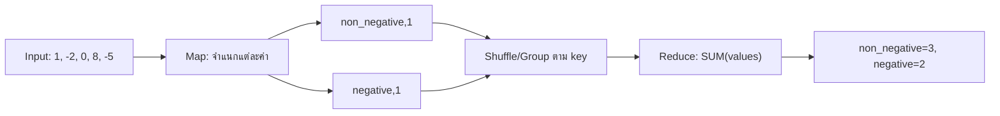
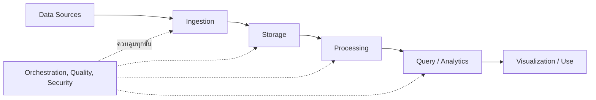
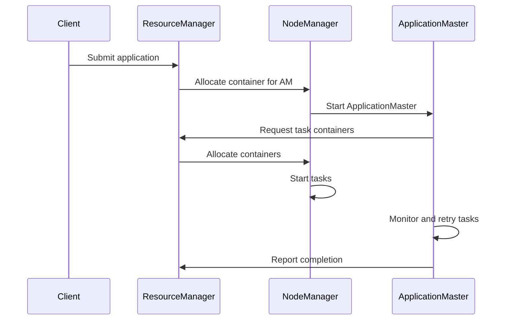
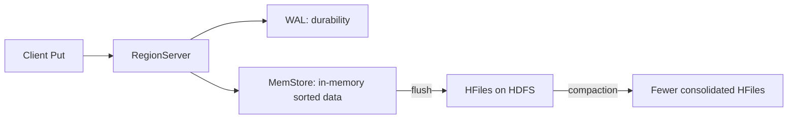
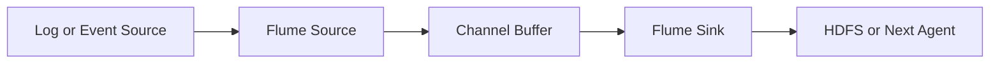

# DADS6002 Big Data Analytics — เฉลยข้อสอบกลางภาคเก่า

เอกสารฉบับนี้เป็น **แนวคำตอบแบบบรรยาย** สำหรับใช้ทำความเข้าใจและฝึกเขียนข้อสอบ ไม่ใช่เฉลยอย่างเป็นทางการจากอาจารย์ คำตอบแต่ละข้อเรียบเรียงให้มีทั้งคำจำกัดความ หลักการทำงาน ตัวอย่าง และประเด็นสำคัญที่ควรปรากฏในกระดาษคำตอบจริง

ข้อสอบมีทั้งหมด 8 ข้อ รวม 100 คะแนน และเน้นการอธิบายกลไกของระบบมากกว่าการจำคำสั่ง ดังนั้นเวลาเขียนตอบควรใช้ลำดับดังนี้:

> นิยามสิ่งที่โจทย์ถาม → อธิบายส่วนประกอบหรือประเภท → ไล่ขั้นตอนการทำงาน → ยกตัวอย่าง → สรุปเหตุผลหรือข้อจำกัด

---

## ข้อ 1 (10 คะแนน) หลักการและขั้นตอนการทำงานของ MapReduce

### โจทย์

จงอธิบายหลักการและขั้นตอนการทำงานของ MapReduce พร้อมยกตัวอย่างการใช้ MapReduce เพื่อนับจำนวนค่าที่เป็นบวกหรือศูนย์ (`>= 0`) และค่าที่เป็นลบในไฟล์ เช่น

```text
1, -2, 0, 8, -5, ...
```

### แนวคำตอบ

**MapReduce** คือรูปแบบการประมวลผลข้อมูลจำนวนมากแบบกระจาย โดยแบ่งข้อมูลออกเป็นส่วนย่อยให้หลายเครื่องหรือหลาย task ประมวลผลพร้อมกัน แล้วนำผลย่อยที่มี key เดียวกันมารวมเป็นผลลัพธ์สุดท้าย MapReduce ไม่ใช่เครื่องคอมพิวเตอร์หนึ่งเครื่อง และไม่ได้หมายถึงฟังก์ชัน `map()` ในภาษา Python แต่เป็นแบบจำลองการทำงานที่ประกอบด้วยช่วง Map, การจัดกลุ่มข้อมูลกลาง และช่วง Reduce

แนวคิดสำคัญคือ เราต้องกำหนดก่อนว่า **ต้องการนับอะไร** และใช้สิ่งนั้นเป็น key ในโจทย์นี้ต้องการนับเพียงสองกลุ่ม ได้แก่

- กลุ่ม `non_negative` สำหรับค่าที่มากกว่าหรือเท่ากับศูนย์
- กลุ่ม `negative` สำหรับค่าที่น้อยกว่าศูนย์

แม้โจทย์จะใช้คำว่า “ค่าบวก (`>= 0`)” แต่ในทางคณิตศาสตร์ศูนย์ไม่ใช่จำนวนบวก คำที่แม่นยำกว่าคือ **จำนวนไม่เป็นลบ (non-negative)** อย่างไรก็ตาม ในข้อสอบควรทำตามเงื่อนไขที่โจทย์กำหนด คือรวมศูนย์ไว้กับกลุ่มบวก

### ขั้นตอนการทำงาน

1. **อ่านข้อมูลเข้า (Input)**  
   ระบบอ่านค่าจากไฟล์และแบ่ง input ให้ Mapper หลายตัวประมวลผล แต่ละ record ในตัวอย่างนี้คือจำนวนหนึ่งค่า

2. **Map**  
   Mapper ตรวจค่าทีละตัว ถ้าค่ามากกว่าหรือเท่ากับศูนย์ ให้ส่ง intermediate key-value pair เป็น `(non_negative, 1)` แต่ถ้าค่าน้อยกว่าศูนย์ ให้ส่ง `(negative, 1)` เลข `1` หมายความว่า Mapper พบสมาชิกของกลุ่มนั้นหนึ่งรายการ

3. **Partition, Shuffle และ Sort/Group**  
   ระบบนำผลลัพธ์จาก Mappers ทุกตัวมาจัดกลุ่มตาม key เดียวกัน ระหว่างขั้นนี้ข้อมูลที่อาจเกิดจากหลายเครื่องจะถูกส่งไปยัง Reducer ที่รับผิดชอบ key นั้น ผลลัพธ์ก่อนเข้า Reducer จะมีลักษณะดังนี้:

   ```text
   negative      -> [1, 1]
   non_negative  -> [1, 1, 1]
   ```

4. **Reduce**  
   Reducer รับ key พร้อมรายการ values แล้วหาผลรวมของเลข `1` ทั้งหมด จึงได้จำนวนสมาชิกของแต่ละกลุ่ม

5. **เขียน Output**  
   Reducer เขียนผลลัพธ์สุดท้ายลงไฟล์ปลายทาง เช่น HDFS

### การติดตามข้อมูลตัวอย่างทีละค่า

| Input | เงื่อนไขใน Mapper | Intermediate output |
|---:|---|---|
| `1` | `1 >= 0` | `(non_negative, 1)` |
| `-2` | `-2 < 0` | `(negative, 1)` |
| `0` | `0 >= 0` | `(non_negative, 1)` |
| `8` | `8 >= 0` | `(non_negative, 1)` |
| `-5` | `-5 < 0` | `(negative, 1)` |

ดังนั้นผลลัพธ์คือ

```text
negative       2
non_negative   3
```



### ตัวอย่าง Mapper และ Reducer แบบ Hadoop Streaming

Mapper:

```python
import sys

for line in sys.stdin:
    for token in line.replace(',', ' ').split():
        value = int(token)
        group = 'non_negative' if value >= 0 else 'negative'
        print(f'{group}\t1')
```

Reducer:

```python
import sys

current_key = None
current_count = 0

for line in sys.stdin:
    key, count = line.rstrip('\n').split('\t')
    count = int(count)

    if key == current_key:
        current_count += count
    else:
        if current_key is not None:
            print(f'{current_key}\t{current_count}')
        current_key = key
        current_count = count

if current_key is not None:
    print(f'{current_key}\t{current_count}')
```

หัวใจของคำตอบไม่ใช่ตัว code แต่คือการอธิบายว่า Mapper เปลี่ยนตัวเลขแต่ละค่าเป็นกลุ่มและเลข `1` จากนั้น Shuffle/Sort รวม values ของ key เดียวกัน และ Reducer จึงหาผลรวมได้ หากตอบเพียงว่า “Map แบ่งงานและ Reduce รวมผล” จะยังไม่แสดงให้เห็นว่าเข้าใจ intermediate key-value pairs และการจัดกลุ่มข้อมูล

### แนวแบ่งคะแนน 10 คะแนน

| ประเด็น | คะแนนโดยประมาณ |
|---|---:|
| ความหมายและหลักการของ MapReduce | 2 |
| หน้าที่ของ Map | 2 |
| Shuffle/Sort/Group | 2 |
| หน้าที่ของ Reduce | 2 |
| ตัวอย่างและผลลัพธ์ถูกต้อง | 2 |

---

## ข้อ 2 (15 คะแนน) คุณสมบัติ 5Vs ของ Big Data

### โจทย์

จงอธิบายคุณสมบัติ 5Vs ของ Big Data ให้เข้าใจ

### แนวคำตอบ

Big Data ไม่ได้หมายถึงข้อมูลที่มีขนาดใหญ่อย่างเดียว แต่หมายถึงสถานการณ์ที่ลักษณะของข้อมูลทำให้วิธีจัดเก็บ ประมวลผล และวิเคราะห์แบบเดิมไม่เพียงพอ แนวคิด **5Vs** ใช้อธิบายความท้าทายสำคัญห้าด้าน ได้แก่ Volume, Velocity, Variety, Veracity และ Value แต่ละ V เชื่อมโยงกับการออกแบบระบบต่างกัน

### 1. Volume — ปริมาณข้อมูล

Volume หมายถึงจำนวนหรือขนาดข้อมูลที่มีมากจนระบบแบบเครื่องเดียวหรือวิธีจัดเก็บเดิมรองรับได้ยาก ตัวอย่างเช่น เครือโรงพยาบาลเก็บรายการจัดซื้อ ใบสั่งซื้อ การรับสินค้า และ log การใช้งานจากโรงพยาบาลจำนวนมากติดต่อกันหลายปี ข้อมูลอาจมีหลายพันล้าน records และเพิ่มขึ้นเรื่อย ๆ

ปัญหาที่เกิดขึ้นไม่ใช่เพียงพื้นที่ disk ไม่พอ แต่ยังรวมถึงเวลาที่ใช้ scan, copy, backup และประมวลผลข้อมูล วิธีแก้จึงมักใช้ distributed storage เช่น HDFS และแบ่งงานประมวลผลให้หลายเครื่องทำพร้อมกัน

### 2. Velocity — ความเร็วของการเกิดและไหลเข้าของข้อมูล

Velocity หมายถึงอัตราที่ข้อมูลถูกสร้าง ส่งเข้าระบบ และต้องถูกประมวลผล ตัวอย่างเช่น clickstream, sensor, ระบบติดตามอุณหภูมิยา หรือเหตุการณ์การสั่งซื้ออาจเกิดขึ้นต่อเนื่องทุกวินาที หากระบบรับข้อมูลช้ากว่าอัตราที่ข้อมูลเกิด จะเกิด backlog หรือข้อมูลสูญหายได้

Velocity ยังเกี่ยวข้องกับเวลาที่ธุรกิจยอมรอผล หากต้องวิเคราะห์ยอดรายเดือน การนำเข้าแบบ batch อาจเพียงพอ แต่ถ้าต้องแจ้งเตือนอุณหภูมิวัคซีนผิดปกติ ระบบอาจต้องประมวลผลแบบ streaming หรือ near real time

### 3. Variety — ความหลากหลายของรูปแบบข้อมูล

Variety หมายถึงข้อมูลมาจากหลายแหล่งและมีโครงสร้างแตกต่างกัน เช่น

- Structured data: ตารางในฐานข้อมูล เช่น MySQL หรือ SQL Server
- Semi-structured data: JSON, XML และ log ที่มีรูปแบบบางส่วน
- Unstructured data: ข้อความ รูปภาพ เสียง และเอกสาร

ความท้าทายคือข้อมูลเหล่านี้ไม่สามารถใช้ schema หรือเครื่องมือเดียวกันได้ทั้งหมด ระบบต้องกำหนดวิธี parse, data type, schema evolution และวิธีเชื่อมข้อมูลจากหลายแหล่งให้มีความหมายร่วมกัน

### 4. Veracity — ความน่าเชื่อถือและคุณภาพข้อมูล

Veracity หมายถึงระดับความถูกต้อง ครบถ้วน สอดคล้อง และน่าเชื่อถือของข้อมูล ตัวอย่างเช่น รหัสโรงพยาบาลสะกดไม่เหมือนกัน วันที่หาย จำนวนเงินผิดหน่วย record ซ้ำ หรือ sensor ส่งค่าผิดปกติ แม้ระบบจะประมวลผลข้อมูลได้รวดเร็ว แต่ถ้าข้อมูลต้นทางไม่น่าเชื่อถือ ผลวิเคราะห์ก็อาจผิด

การจัดการ Veracity จึงต้องมี validation, data profiling, duplicate checks, reconciliation, data lineage และกฎคุณภาพข้อมูล เช่นตรวจว่าจำนวนเงินไม่ติดลบโดยไม่มีเหตุผล หรือยอดรวมปลายทางตรงกับต้นทาง

### 5. Value — คุณค่าที่ได้จากข้อมูล

Value หมายถึงความสามารถในการเปลี่ยนข้อมูลให้เป็นประโยชน์ต่อการตัดสินใจ ไม่ใช่เพียงเก็บข้อมูลให้ได้มากที่สุด ตัวอย่างเช่น การวิเคราะห์รายการจัดซื้ออาจช่วยลดต้นทุน ระบุสินค้าที่ควรรวมการต่อรอง ป้องกัน stockout หรือค้นหากระบวนการที่ใช้เวลานาน

ข้อมูลจำนวนมากที่ไม่ตอบโจทย์ธุรกิจ ไม่มีผู้ใช้ หรือไม่สามารถนำไปตัดสินใจได้ อาจสร้างเพียงต้นทุนด้าน storage และการดูแลระบบ ดังนั้น Value เป็นเหตุผลที่ทำให้ต้องเชื่อมปัญหาทางเทคนิคกลับไปยังเป้าหมายทางธุรกิจ

### ความสัมพันธ์ของ 5Vs

5Vs ไม่ได้แยกจากกัน ตัวอย่างเช่น sensor จำนวนมากสร้างข้อมูลอย่างรวดเร็ว ทำให้เกิดทั้ง Volume และ Velocity ข้อมูลจาก sensor หลายรุ่นทำให้เกิด Variety หากบางเครื่องส่งค่าผิดจะกระทบ Veracity และจะเกิด Value ก็ต่อเมื่อนำข้อมูลที่น่าเชื่อถือไปใช้เตือนหรือปรับปรุงงานจริง

| V | คำถามที่ใช้จำ | ตัวอย่างปัญหา |
|---|---|---|
| Volume | ข้อมูลมากเพียงใด | เก็บและ scan ไม่ทัน |
| Velocity | ข้อมูลมาเร็วเพียงใด | รับไม่ทันหรือต้องตอบสนองเร็ว |
| Variety | ข้อมูลมีรูปแบบอะไรบ้าง | ตาราง, JSON, log, รูปภาพ |
| Veracity | ข้อมูลเชื่อถือได้หรือไม่ | missing, duplicate, ผิดหน่วย |
| Value | ข้อมูลช่วยตัดสินใจอะไร | ลดต้นทุนหรือปรับปรุงบริการ |

### แนวแบ่งคะแนน 15 คะแนน

อาจแบ่ง V ละประมาณ 3 คะแนน โดยแต่ละ V ควรมีคำอธิบาย ความท้าทาย และตัวอย่าง ไม่ควรตอบเพียงแปลชื่อศัพท์ห้าคำ

---

## ข้อ 3 (10 คะแนน) ประเภทของการวิเคราะห์ข้อมูล

### โจทย์

การวิเคราะห์ข้อมูลมีได้กี่แบบ จงอธิบายและยกตัวอย่างประกอบ

### แนวคำตอบ

การวิเคราะห์ข้อมูลมักแบ่งตามคำถามที่ต้องการตอบเป็น **4 ประเภท** ได้แก่ Descriptive, Diagnostic, Predictive และ Prescriptive Analytics ลำดับนี้เดินจากการอธิบายอดีต ไปหาสาเหตุ คาดการณ์อนาคต และแนะนำการตัดสินใจ

### 1. Descriptive Analytics — เกิดอะไรขึ้น

Descriptive Analytics สรุปสิ่งที่เกิดขึ้นแล้วจากข้อมูลในอดีต เช่นยอดจัดซื้อรวมเดือนนี้ จำนวนใบสั่งซื้อที่เกิน SLA หรือจำนวนผู้ป่วยแยกตามโรงพยาบาล เครื่องมือที่ใช้ได้แก่ aggregation, dashboard, report และ summary statistics

ตัวอย่าง: “เดือนกันยายนมีใบสั่งซื้อ 12,000 รายการ และมี 850 รายการที่เกิน SLA” คำตอบนี้บอกสถานการณ์ แต่ยังไม่ได้บอกสาเหตุ

### 2. Diagnostic Analytics — เพราะเหตุใดจึงเกิดขึ้น

Diagnostic Analytics วิเคราะห์หาปัจจัยหรือสาเหตุที่สัมพันธ์กับผลที่พบ โดยเจาะข้อมูลตามมิติ เปรียบเทียบกลุ่ม ตรวจความสัมพันธ์ หรือวิเคราะห์กระบวนการ

ตัวอย่าง: เมื่อพบ PO เกิน SLA จำนวนมาก อาจแยกตามโรงพยาบาล หมวดสินค้า หรือช่วงเวลาที่รอผู้อนุมัติ เพื่อค้นหาว่าความล่าช้าส่วนใหญ่เกิดที่ขั้นตอนใด อย่างไรก็ตาม การพบความสัมพันธ์ยังไม่พิสูจน์เหตุและผลโดยอัตโนมัติ

### 3. Predictive Analytics — มีแนวโน้มจะเกิดอะไรขึ้น

Predictive Analytics ใช้ข้อมูลในอดีตสร้างแบบจำลองเพื่อคาดการณ์ค่าหรือเหตุการณ์ในอนาคต เช่น regression, classification หรือ time-series forecasting ผลลัพธ์เป็นการประมาณภายใต้ข้อมูลและสมมติฐาน ไม่ใช่คำทำนายที่ถูกต้องแน่นอน

ตัวอย่าง: ใช้ประวัติการใช้ยา ฤดูกาล และ lead time เพื่อคาดการณ์ความต้องการยาในเดือนหน้า หรือคาดการณ์ว่า PO ใดมีความเสี่ยงเกิน SLA

### 4. Prescriptive Analytics — ควรทำอะไร

Prescriptive Analytics เสนอการกระทำที่เหมาะสมภายใต้เป้าหมายและข้อจำกัด โดยอาจใช้ optimization, simulation, business rules หรือผลจาก predictive model

ตัวอย่าง: จากความต้องการยาที่คาดการณ์ ระบบแนะนำปริมาณสั่งซื้อและเวลาสั่งที่ลดทั้งความเสี่ยง stockout และต้นทุนถือครอง หรือแนะนำให้กระจาย stock ระหว่างโรงพยาบาลภายใต้ข้อจำกัดเรื่องวันหมดอายุ


ทั้งสี่แบบสามารถใช้ร่วมกันได้ Dashboard อาจเริ่มจากบอกว่า stockout เพิ่มขึ้น จากนั้นเจาะหาสาเหตุ สร้างโมเดลคาดการณ์ความต้องการ และสุดท้ายแนะนำแผนเติมสินค้า การวิเคราะห์ระดับหลังไม่ได้ทำให้ระดับก่อนหมดความสำคัญ เพราะการคาดการณ์และคำแนะนำต้องอาศัยข้อมูลพื้นฐานที่ถูกต้อง

### แนวแบ่งคะแนน 10 คะแนน

| ประเด็น | คะแนนโดยประมาณ |
|---|---:|
| ระบุครบ 4 ประเภท | 2 |
| อธิบายคำถามของแต่ละประเภท | 4 |
| ตัวอย่างสอดคล้องกับแต่ละประเภท | 4 |

---

## ข้อ 4 (10 คะแนน) ขั้นตอนของ Big Data Pipeline

### โจทย์

จงอธิบายขั้นตอนต่าง ๆ ของ Big Data Pipeline และยกตัวอย่างเครื่องมือที่ช่วยในการทำงานของแต่ละขั้นตอน

### แนวคำตอบ

**Big Data Pipeline** คือเส้นทางที่พาข้อมูลจากระบบต้นทาง ผ่านการนำเข้า จัดเก็บ ประมวลผล และวิเคราะห์ จนกลายเป็นข้อมูลหรือผลลัพธ์ที่ผู้ใช้สามารถนำไปตัดสินใจได้ Pipeline ไม่ได้เป็นเพียงการต่อรายชื่อเครื่องมือ แต่ต้องกำหนดด้วยว่าข้อมูลอยู่ที่ใด เคลื่อนไปไหน ถูกเปลี่ยนอย่างไร และตรวจสอบความถูกต้องตรงจุดใด



### 1. Data Sources — แหล่งกำเนิดข้อมูล

ข้อมูลอาจมาจากฐานข้อมูลธุรกรรม ไฟล์ application logs, APIs, sensor, social media หรือระบบภายนอก ตัวอย่างเช่น MySQL เก็บตารางคำสั่งซื้อ และ web servers สร้าง clickstream logs

### 2. Data Ingestion — นำข้อมูลเข้าสู่แพลตฟอร์ม

ขั้นนี้เคลื่อนข้อมูลจากต้นทางเข้าระบบ Big Data โดยอาจเป็น batch หรือ streaming

- **Sqoop** ใช้ในระบบ Hadoop รุ่นเดิมเพื่อย้าย structured tables ระหว่าง RDBMS กับ HDFS, Hive หรือ HBase แบบ batch
- **Flume** ใช้รวบรวม logs หรือ events ต่อเนื่องผ่าน Source–Channel–Sink
- **Kafka** รับและเก็บ event stream ใน topics เพื่อให้ consumer หลายกลุ่มอ่านได้

### 3. Storage — จัดเก็บข้อมูล

ขั้น Storage เก็บข้อมูลให้รองรับขนาด ความทนทาน และรูปแบบการใช้งาน

- **HDFS** เก็บไฟล์ขนาดใหญ่แบบกระจายและทำ replication
- **Hive tables** เพิ่ม metadata และมุมมองแบบตารางเหนือ files
- **HBase** เหมาะกับการอ่านหรือเขียน row ตาม RowKey อย่างรวดเร็ว

การเลือก storage ต้องดู access pattern ไม่ใช่เลือกจากชื่อเครื่องมือ เช่นงาน scan ทั้งตารางเหมาะกับ Hive มากกว่าการค้น record เดียว ส่วนการค้น record ด้วย RowKey เหมาะกับ HBase

### 4. Processing and Transformation — ประมวลผลและแปลงข้อมูล

ข้อมูลดิบอาจต้อง parse, filter, clean, join และ aggregate ก่อนใช้งาน เครื่องมือ เช่น

- **MapReduce** แบ่งงานแบบ batch ให้หลายเครื่องทำแล้วรวมผล
- **Apache Spark** ประมวลผลแบบกระจายและรองรับ workflow ที่ยืดหยุ่นกว่า
- **Hive execution engine** รัน execution plan ที่แปลงมาจาก HQL

### 5. Query, Analytics and Modeling — วิเคราะห์ข้อมูล

เมื่อข้อมูลมีโครงสร้างและคุณภาพเหมาะสมแล้ว ผู้ใช้สามารถ query, ทำสถิติ หรือสร้างโมเดล

- **Hive/HQL** และ **Spark SQL** สำหรับ query และ aggregation
- **Spark MLlib/ML** สำหรับ machine learning บนข้อมูลขนาดใหญ่
- Python หรือ R สำหรับการวิเคราะห์เฉพาะทางเมื่อปริมาณและสภาพแวดล้อมเหมาะสม

### 6. Presentation and Consumption — นำผลไปใช้

ผลลัพธ์อาจถูกนำเสนอผ่าน dashboard, report, API หรือ data product เช่น Power BI, Tableau หรือ application ที่เรียกข้อมูลจาก serving layer จุดสำคัญคือผู้ใช้ต้องเข้าใจ grain, เวลา refresh และข้อจำกัดของผลวิเคราะห์

### 7. Orchestration, Quality, Security and Governance — การควบคุมตลอด Pipeline

งานจริงมีหลายขั้นและ dependency เครื่องมืออย่าง **Oozie** หรือ **Airflow** ช่วย schedule, monitor, retry และควบคุมลำดับงาน แต่ orchestrator ไม่ได้ประมวลผลแทน MapReduce หรือ Spark นอกจากนี้ทุกขั้นต้องมี data quality checks, security, lineage, metadata และ monitoring

ตัวอย่าง end-to-end คือ Sqoop นำตารางจัดซื้อจาก MySQL เข้า HDFS, Hive ประกาศ schema เหนือไฟล์, MapReduce หรือ Spark สรุปยอดต่อโรงพยาบาล, Airflow ควบคุมลำดับงาน และ Power BI แสดงผลแก่ผู้บริหาร โดยต้องตรวจ row count และยอดรวมระหว่างต้นทางกับปลายทางก่อนเผยแพร่

### แนวแบ่งคะแนน 10 คะแนน

ให้คะแนนจากความครบถ้วนของขั้นตอน ความสัมพันธ์ระหว่างขั้น และการยกเครื่องมือให้ตรงหน้าที่ ไม่ควรตอบเป็นเพียงรายชื่อ `Sqoop → Hadoop → Hive → Power BI` โดยไม่อธิบายว่าข้อมูลถูกทำอะไรในแต่ละช่วง

---

## ข้อ 5 (15 คะแนน) ส่วนประกอบของ HDFS และ YARN

### โจทย์

จงอธิบายส่วนประกอบและหน้าที่ของส่วนประกอบเหล่านั้นของ HDFS และ YARN

### แนวคำตอบส่วน HDFS

**HDFS (Hadoop Distributed File System)** คือระบบจัดเก็บไฟล์แบบกระจายซึ่งแบ่งไฟล์ขนาดใหญ่ออกเป็น blocks แล้วเก็บ blocks กระจายบนหลายเครื่อง HDFS แยก metadata ออกจาก bytes ของไฟล์ เพื่อให้มีจุดกลางสำหรับค้นว่า block อยู่ที่ใด ขณะที่ข้อมูลจำนวนมากสามารถไหลระหว่าง client กับเครื่องเก็บข้อมูลโดยตรง

#### NameNode

NameNode ดูแล **metadata** และ namespace ของ HDFS เช่นชื่อไฟล์ directory, permission, การ mapping ว่าไฟล์ประกอบด้วย block ใด และ block แต่ละชุดมี replicas อยู่บน DataNode ใด NameNode ไม่ได้เก็บ bytes ของไฟล์ทั้งหมดและข้อมูลปกติไม่ต้องไหลผ่าน NameNode

เมื่อ client ต้องการอ่านไฟล์ จะถาม NameNode ก่อนว่า blocks อยู่ที่ DataNode ใด แล้วจึงอ่าน bytes จาก DataNode โดยตรง ถ้า NameNode ใช้งานไม่ได้และไม่มี High Availability ระบบอาจยังมี block bytes อยู่ แต่ client ไม่สามารถค้นโครงสร้างไฟล์ได้

#### DataNode

DataNode เก็บ block bytes จริงบน local disks รับคำสั่งให้สร้าง ลบ หรือทำ replication ของ block และให้ client อ่านหรือเขียนข้อมูล DataNode ส่ง **heartbeat** เพื่อรายงานว่ายังทำงานอยู่ และส่ง **block report** เพื่อรายงานรายการ blocks ที่ตนเก็บ

หาก DataNode หายไป NameNode จะตรวจพบจาก heartbeat ที่ขาดหาย และสั่งสร้าง replica ใหม่จากสำเนาที่ยังเหลืออยู่เพื่อคืนระดับ replication ตามที่กำหนด

#### Secondary NameNode หรือ Checkpoint Node

Secondary NameNode ไม่ใช่ NameNode สำรองที่สลับมาทำงานได้ทันที หน้าที่คือสร้าง checkpoint โดยนำ `FsImage` ซึ่งเป็น snapshot ของ namespace มารวมกับ `EditLog` ซึ่งบันทึกการเปลี่ยนแปลง แล้วสร้างภาพ metadata รุ่นใหม่เพื่อลดภาระการ replay log ตอนเริ่มระบบ

ในระบบ production สามารถใช้ HDFS High Availability ที่มี Active และ Standby NameNode พร้อมกลไกแชร์ edit log แต่แนวคิดนี้ต้องแยกจาก Secondary NameNode

### ตัวอย่าง HDFS Write Flow

สมมติ client เขียนไฟล์ 300 MB และ block size เท่ากับ 128 MB ไฟล์จะถูกแบ่งประมาณเป็น 3 blocks ขนาด 128 MB, 128 MB และ 44 MB

1. Client ขอสร้างไฟล์จาก NameNode
2. NameNode ตรวจสิทธิ์และเลือก DataNodes สำหรับ replicas ของ block แรก
3. Client ส่ง block ไปยัง DataNode ตัวแรก แล้ว DataNodes ส่งต่อกันเป็น replication pipeline
4. เมื่อเขียนสำเร็จ acknowledgement จะย้อนกลับมายัง client
5. Client ขอรายชื่อ DataNodes สำหรับ block ถัดไปจนเขียนครบ
6. NameNode บันทึก metadata ว่าไฟล์ประกอบด้วย blocks ใด

จุดสำคัญคือ NameNode จัดการตำแหน่งและ metadata แต่ file payload ไหลไปยัง DataNodes โดยตรง

### แนวคำตอบส่วน YARN

**YARN (Yet Another Resource Negotiator)** คือระบบจัดการทรัพยากรและควบคุมการรัน distributed applications บน Hadoop cluster YARN แยกการตัดสินใจจัดสรรทรัพยากรออกจาก logic ของ application ทำให้หลาย processing frameworks ใช้ cluster ร่วมกันได้

#### ResourceManager

ResourceManager เป็นผู้จัดการทรัพยากรระดับทั้ง cluster รับคำขอ application และจัดสรร CPU กับ memory ในรูปของ containers โดยมี Scheduler ช่วยพิจารณาคิว นโยบาย และทรัพยากรที่ว่าง ResourceManager ไม่ได้รัน tasks ของทุก application ด้วยตนเอง

#### NodeManager

NodeManager ทำงานบน worker node แต่ละเครื่อง มีหน้าที่เปิดและดูแล containers, ติดตามการใช้ CPU/memory, เก็บ log และรายงานสถานะของ node ไปยัง ResourceManager ผ่าน heartbeat

#### ApplicationMaster

แต่ละ application มี ApplicationMaster ของตนเอง ทำหน้าที่เจรจาขอ containers จาก ResourceManager วางแผนและติดตาม tasks ของ application และจัดการ retry ตามความสามารถของ framework ApplicationMaster รู้ logic ของงานตนเองมากกว่า ResourceManager

#### Container

Container คือขอบเขตทรัพยากรที่ YARN จัดให้ process หรือ task หนึ่งชุด เช่นจำนวน memory และ virtual CPU Container ไม่ใช่ Docker container โดยจำเป็น และไม่ใช่ตัว task เอง แต่เป็นสิทธิ์และสภาพแวดล้อมที่ task ใช้รัน

### YARN Application Flow



ความสัมพันธ์ระหว่าง HDFS และ YARN คือ HDFS ตอบคำถามว่า **ข้อมูลอยู่ที่ไหนและเก็บอย่างไร** ส่วน YARN ตอบว่า **งานใดจะได้ CPU และ memory บนเครื่องใด** ทั้งสองส่วนไม่ได้ทำหน้าที่แทนกัน Processing framework เช่น MapReduce ใช้ทรัพยากรจาก YARN เพื่ออ่านหรือเขียนข้อมูลใน HDFS

### แนวแบ่งคะแนน 15 คะแนน

| ประเด็น | คะแนนโดยประมาณ |
|---|---:|
| หลักการ HDFS และ NameNode | 3 |
| DataNode, replication และ heartbeat/block report | 3 |
| Secondary NameNode/checkpoint และความเข้าใจผิด | 1.5 |
| หลักการ YARN และ ResourceManager | 2.5 |
| NodeManager, ApplicationMaster และ Container | 3 |
| เชื่อม interaction และ flow ได้ถูกต้อง | 2 |

---

## ข้อ 6 (10 คะแนน) การทำงานของ Hive

### ภาพพื้นฐานก่อนตอบ

**Apache Hive** เป็นระบบ data warehouse และ query layer ที่ทำให้ผู้ใช้มองไฟล์ใน HDFS หรือ storage อื่นเป็นตารางและ query ด้วย HQL ได้ Hive ไม่ได้เก็บข้อมูลจริงทั้งหมดไว้ใน Metastore และ HQL ไม่ได้ประมวลผล bytes ด้วยตัวเอง

เมื่อรับคำสั่ง Hive จะ parse และตรวจความหมายของ HQL อ่าน metadata ของ table จาก Hive Metastore สร้างและ optimize execution plan แล้วส่งแผนให้ execution engine ทำงานกับไฟล์จริง

### ข้อ 6.1 ACID Operations: Insert, Update และ Delete

คำว่า **ACID** ประกอบด้วย Atomicity, Consistency, Isolation และ Durability เป็นคุณสมบัติที่ทำให้ transaction มีผลครบถ้วน รักษากฎข้อมูล แยกการทำงานพร้อมกัน และไม่สูญหายหลัง commit

Hive เดิมทำงานกับไฟล์ขนาดใหญ่แบบ batch จึงไม่สามารถเปิดไฟล์แล้วแก้ row ตรงกลางได้ง่ายเหมือน OLTP database Hive transactional tables แก้ปัญหานี้โดยไม่เขียนไฟล์เดิมใหม่ทันทีทุกครั้ง แต่บันทึกการเปลี่ยนแปลงลงไฟล์ `delta` หรือ `delete_delta` และใช้ transaction metadata กำกับว่า reader ควรมองเห็น version ใด

#### Insert

เมื่อ `INSERT` ข้อมูลใหม่ Hive จะเขียน rows ใหม่เป็น delta files ของ transaction นั้น เมื่อ transaction commit ข้อมูลจึงมองเห็นได้ตามกฎ isolation ผู้ใช้ไม่จำเป็นต้องแก้ base file เดิมทันที

#### Update

การ `UPDATE` ในเชิง storage ไม่ได้แก้ bytes ตรงตำแหน่งเดิมอย่างง่าย แต่บันทึกว่ารายการเดิมถูกแทนที่และเขียนค่ารุ่นใหม่ลง delta files เมื่ออ่าน table Hive ผสาน base files กับ delta files ที่ commit แล้วเพื่อสร้างมุมมองปัจจุบัน

#### Delete

การ `DELETE` บันทึกตัวระบุของ rows ที่ถูกลบลง delete delta เมื่อ query ครั้งต่อไป reader จะตัด rows เหล่านั้นออกจากผลลัพธ์ แม้ bytes รุ่นเก่าอาจยังอยู่จนกว่าจะเกิด compaction

เมื่อ delta files สะสมจำนวนมาก การอ่านจะต้อง merge หลายไฟล์และช้าลง Hive จึงใช้ **minor compaction** เพื่อรวม delta files และ **major compaction** เพื่อรวม base กับ deltas เป็น base รุ่นใหม่ จากนั้นระบบจึงทำความสะอาดไฟล์เก่าตามเงื่อนไขที่ปลอดภัย

ดังนั้นคำตอบสำคัญคือ Hive ทำ ACID บน storage แบบไฟล์ผ่าน transaction metadata, base/delta files และ compaction ไม่ได้เปลี่ยน HDFS ให้กลายเป็นระบบแก้ bytes แบบสุ่มเหมือนฐานข้อมูล OLTP

### ข้อ 6.2 SELECT with GROUP BY และ Aggregation

พิจารณาคำสั่ง:

```sql
SELECT hospital_id, SUM(amount) AS total_amount
FROM purchases
GROUP BY hospital_id;
```

หนึ่ง row ใน `purchases` แทนรายการจัดซื้อหนึ่งรายการ แต่ output ต้องการหนึ่ง row ต่อโรงพยาบาล `GROUP BY hospital_id` จึงเปลี่ยน grain จาก “รายการจัดซื้อ” เป็น “โรงพยาบาล” และ `SUM(amount)` รวมค่าของทุก row ภายในกลุ่มเดียวกัน

ขั้นตอนการทำงานมีดังนี้:

1. Hive รับและ parse HQL เพื่อตรวจ syntax และองค์ประกอบของ query
2. Hive อ่าน metadata จาก Metastore เพื่อทราบ schema, table location, partition และ file format
3. Semantic analyzer ตรวจว่า columns และ data types ใช้งานได้ถูกต้อง
4. Optimizer สร้างหรือปรับ execution plan เช่นเลือกอ่านเฉพาะ partition หรือ columns ที่จำเป็น
5. Execution engine scan records และสร้าง intermediate pairs เช่น `(H001, 2500)`
6. ระบบกระจายหรือ shuffle records ตาม `hospital_id` เพื่อให้ข้อมูลของโรงพยาบาลเดียวกันไปยัง aggregation task เดียวกัน
7. Aggregation task รวม `amount` ของแต่ละ key และสร้างผลหนึ่ง row ต่อ `hospital_id`
8. ผลลัพธ์ถูกส่งกลับผู้ใช้หรือเขียนเป็น files/table ใหม่

ตัวอย่าง input:

| hospital_id | amount |
|---|---:|
| H001 | 2,500 |
| H002 | 1,000 |
| H001 | 700 |

หลัง grouping:

```text
H001 -> [2500, 700]
H002 -> [1000]
```

ผลลัพธ์:

| hospital_id | total_amount |
|---|---:|
| H001 | 3,200 |
| H002 | 1,000 |

ข้อควรระวังคือ columns ใน `SELECT` ที่ไม่ได้อยู่ใน aggregate function ต้องมีความสัมพันธ์กับ grouping key ตามกฎของ query มิฉะนั้นระบบไม่สามารถตัดสินได้ว่าควรเลือกค่าจาก row ใด นอกจากนี้ query สำเร็จไม่ได้แปลว่าผลถูกต้อง ต้องตรวจ grain, null keys, row count และยอดรวมก่อนกับหลัง aggregation

### แนวแบ่งคะแนน 10 คะแนน

| ประเด็น | คะแนนโดยประมาณ |
|---|---:|
| หลักการ Hive, Metastore และ execution engine | 2 |
| ACID: transaction, base/delta และ compaction | 4 |
| GROUP BY/Aggregation และ data flow | 4 |

---

## ข้อ 7 (15 คะแนน) ส่วนประกอบและการ Read/Write ของ HBase

### แนวคำตอบ

**Apache HBase** เป็นฐานข้อมูลแบบ distributed wide-column store ที่ทำงานบน HDFS และออกแบบให้ค้นหรือแก้ข้อมูลตาม **RowKey** ได้รวดเร็ว โดยไม่จำเป็นต้อง scan ไฟล์ทั้งชุดเหมือนงานวิเคราะห์แบบ batch ข้อมูลใน table เรียงตาม RowKey และถูกแบ่งเป็นช่วงที่เรียกว่า Regions

### ส่วนประกอบสำคัญ

#### HMaster

HMaster ดูแลการบริหาร cluster เช่น assign Regions ให้ RegionServers, balance load, ประสานการ split region และจัดการ schema operation HMaster ไม่ได้อยู่ในเส้นทาง read/write ปกติของทุก record หลังจาก client ทราบว่า Region อยู่ที่ใดแล้ว

#### RegionServer

RegionServer ให้บริการอ่านและเขียนข้อมูลของ Regions ที่ได้รับมอบหมาย หนึ่ง RegionServer สามารถดูแลหลาย Regions และภายในแต่ละ Region มี storage structures ของ Column Families

#### Region

Region คือช่วง RowKey ที่ต่อเนื่องกันของ table ตัวอย่างเช่น Region A อาจดูแล RowKey ตั้งแต่ `DEV-0001` ถึงก่อน `DEV-3000` และ Region B ดูแลช่วงถัดไป เมื่อ Region ใหญ่เกิน threshold สามารถ split เป็น Regions ที่เล็กลงได้ การแบ่งตามช่วง RowKey ทำให้ client ไปยัง RegionServer ที่รับผิดชอบ row นั้นโดยตรง

#### `hbase:meta`

`hbase:meta` เป็น system table ที่บอกว่าแต่ละช่วง RowKey อยู่ใน Region ใดและ RegionServer ใด Client ใช้ข้อมูลนี้ค้นตำแหน่ง row และ cache ผลไว้เพื่อลดการค้นซ้ำ

#### ZooKeeper หรือ Coordination Service

ใน architecture ที่ใช้ในบทเรียน ZooKeeper ช่วย coordination และค้นสถานะสำคัญของ cluster เช่นตำแหน่งสำหรับเริ่มค้น metadata และการรับรู้ว่า server ใดทำงานอยู่ ไม่ได้เก็บข้อมูลธุรกิจทุก row

#### WAL, MemStore, HFile และ BlockCache

- **WAL (Write-Ahead Log)** บันทึกการเปลี่ยนแปลงก่อน เพื่อให้กู้ข้อมูลที่ยังไม่ flush ได้หาก RegionServer ล้ม
- **MemStore** เก็บข้อมูลใหม่ของ Column Family ใน memory และจัดเรียงตาม key ก่อนเขียนลง disk
- **HFile** เป็นไฟล์ข้อมูลที่จัดเก็บจริงบน HDFS หลัง MemStore ถูก flush
- **BlockCache** เก็บ blocks ที่อ่านบ่อยไว้ใน memory เพื่อลด disk I/O

### Write Path: เหตุใดจึงเขียนได้รวดเร็ว

สมมติ client เขียนค่าไปยัง RowKey `H001#PO1001`:

1. Client ใช้ metadata เพื่อหา RegionServer ที่ดูแลช่วง RowKey นี้
2. RegionServer ตรวจ request และบันทึก mutation ลง WAL ก่อน เพื่อให้กู้คืนได้
3. ข้อมูลถูกเขียนเข้า MemStore ใน memory
4. เมื่อ WAL และ MemStore รับข้อมูลสำเร็จ RegionServer จึงตอบ acknowledgement แก่ client โดยไม่ต้องรอสร้าง HFile ใหม่ทุกครั้ง
5. เมื่อ MemStore ถึงเงื่อนไข ระบบ flush ข้อมูลที่เรียงแล้วเป็น HFile บน HDFS
6. เมื่อ HFiles สะสม ระบบทำ compaction เพื่อรวมไฟล์ ลดไฟล์เก่า และจัดโครงสร้างให้อ่านมีประสิทธิภาพ

HBase เขียนได้เร็วเพราะ write path เป็นแนว append ไปยัง WAL และเขียนเข้า memory ก่อน ไม่ต้องเปิดไฟล์เดิมแล้วแก้ bytes กลางไฟล์ทุกครั้ง อย่างไรก็ตามความเร็วนี้แลกกับงานเบื้องหลัง เช่น flush และ compaction



### Read Path: เหตุใดจึงอ่านได้รวดเร็ว

1. Client ใช้ RowKey ค้น RegionServer ที่รับผิดชอบ โดยอาศัย `hbase:meta` และ location cache
2. RegionServer ตรวจ BlockCache ก่อน เพราะข้อมูลที่อ่านบ่อยอาจอยู่ใน memory
3. ตรวจ MemStore เพื่อรวมข้อมูลที่เพิ่งเขียนและยังไม่ flush
4. หากยังไม่พบหรือยังไม่ครบ จึงอ่าน HFiles ที่เกี่ยวข้องจาก HDFS
5. ระบบรวม versions และใช้ timestamp เพื่อเลือกค่าที่มองเห็นได้ตามเงื่อนไขของ request แล้วส่ง row กลับ client

การอ่านแบบ `Get` เร็วเพราะ RowKey ทำให้ระบบระบุ Region และช่วงข้อมูลได้ ไม่ต้อง scan ทุก row อีกทั้ง BlockCache ลดการอ่าน disk และ HFiles มีโครงสร้างช่วยค้นตำแหน่งข้อมูล อย่างไรก็ตาม ถ้าไม่ทราบ RowKey หรือต้อง filter จากคอลัมน์ที่ไม่ใช่ RowKey ระบบอาจต้อง scan ข้อมูลจำนวนมาก

### RowKey Design กับประสิทธิภาพ

RowKey ไม่ได้มีหน้าที่เพียงทำให้ row ไม่ซ้ำ แต่กำหนดตำแหน่ง ลำดับ และการกระจาย load หากใช้ timestamp ที่เพิ่มขึ้นต่อท้ายหรือใช้ key ที่ทำให้ข้อมูลทั้งหมดตกใน Region เดียว อาจเกิด **hotspot** คือ RegionServer หนึ่งรับ write หนักกว่าส่วนอื่น ในทางกลับกัน การกระจาย key มากเกินไปอาจทำให้ scan ตามช่วงธุรกิจยากขึ้น จึงต้องออกแบบจาก access pattern

### Failure and Recovery

ถ้า RegionServer ล้ม ข้อมูลที่ flush แล้วอยู่ใน HFiles บน HDFS ส่วนข้อมูลที่ acknowledged แต่ยังอยู่ใน MemStore สามารถกู้จาก WAL จากนั้น Regions ถูก assign ไปยัง RegionServer อื่น ความทนทานจึงเกิดจาก WAL ร่วมกับ HDFS replication ไม่ใช่เพราะ MemStore อยู่ใน memory อย่างเดียว

### แนวแบ่งคะแนน 15 คะแนน

| ประเด็น | คะแนนโดยประมาณ |
|---|---:|
| HMaster, RegionServer, Region และ metadata | 4 |
| WAL, MemStore, HFile และ BlockCache | 4 |
| Write Path | 2.5 |
| Read Path | 2.5 |
| RowKey, hotspot และเหตุผลด้านความเร็ว | 2 |

---

## ข้อ 8 (15 คะแนน) การทำงานและลักษณะข้อมูลของ Sqoop และ Flume

### แนวคำตอบภาพรวม

Sqoop และ Flume เป็นเครื่องมือ Data Ingestion ใน Hadoop ecosystem เหมือนกัน แต่แก้ปัญหาคนละแบบ **Sqoop** เหมาะกับการย้าย structured data ปริมาณมากระหว่าง relational database กับ Hadoop แบบ batch ส่วน **Flume** เหมาะกับการรวบรวม log หรือ event data ที่เกิดขึ้นต่อเนื่องจากหลายแหล่งแล้วส่งไปยัง Hadoop storage

### Sqoop

Apache Sqoop ถูกออกแบบเพื่อโอนข้อมูลจำนวนมากระหว่าง RDBMS เช่น MySQL หรือ Oracle กับ HDFS, Hive หรือ HBase ข้อมูลต้นทางมักเป็น structured tables ที่มี rows, columns, schema และ data types ชัดเจน

ขั้นตอน Sqoop Import โดยทั่วไปคือ:

1. Sqoop เชื่อมต่อฐานข้อมูลผ่าน JDBC
2. อ่าน metadata ของ table เช่นชื่อ column, data type และข้อมูลที่ใช้แบ่งช่วง
3. สร้าง map-only job เพื่อแบ่ง rows ให้หลาย Mappers อ่านพร้อมกัน
4. Mapper แต่ละตัว query ข้อมูลคนละช่วง โดยใช้ primary key หรือ `--split-by`
5. Mapper serialize rows แล้วเขียนไปยัง HDFS, Hive หรือ HBase
6. ผู้ใช้ตรวจ row count, schema, null, key range และยอดรวมกับฐานข้อมูลต้นทาง

จำนวน Mappers เพิ่ม throughput ได้ แต่เพิ่ม concurrent database connections และ load บนฐานข้อมูลต้นทาง ถ้า split key กระจายไม่ดี Mappers บางตัวจะได้ข้อมูลมากกว่าตัวอื่นและเกิด data skew ดังนั้น parallelism ต้องสมดุลกับผลกระทบต่อ source system

Sqoop เป็นการนำเข้าแบบ batch ไม่ได้ออกแบบเพื่อรับ event ต่อเนื่องจากหลายแหล่ง ขณะเดียวกัน Sqoop ถูก retire และอยู่ใน Apache Attic แล้ว แต่หลักการ bulk database ingestion, parallel extraction และ source reconciliation ยังมีประโยชน์ต่อการเข้าใจระบบปัจจุบัน

### Flume

Apache Flume ถูกออกแบบเพื่อรับ event ปริมาณมาก เช่น application log, web clickstream, network event หรือ sensor data แล้วส่งไปยัง HDFS หรือระบบปลายทางอื่น Event หนึ่งรายการประกอบด้วย body ซึ่งเป็น payload และอาจมี headers ซึ่งเป็น metadata

Flume Agent เป็น JVM process ที่มีองค์ประกอบหลักสามส่วน:

1. **Source** รับ events จากระบบภายนอก เช่น Spooling Directory หรือ Avro client แล้วนำ event เข้า channel
2. **Channel** เป็น buffer ที่พัก event ระหว่าง Source กับ Sink ทำให้การรับและส่งไม่จำเป็นต้องเร็วเท่ากันทุกขณะ ตัวอย่างคือ Memory Channel และ File Channel
3. **Sink** ดึง event จาก Channel แล้วส่งไปยังปลายทาง เช่น HDFS หรือ Flume Agent ถัดไป

Flume ใช้ transaction สองช่วงสำคัญ Source commit เมื่อเขียน event ลง Channel สำเร็จ และ Sink นำ event ออกจาก Channel เมื่อปลายทางยอมรับแล้ว ถ้า HDFS หยุดทำงาน Sink จะส่งไม่สำเร็จและ events จะสะสมอยู่ใน Channel จนระบบกลับมาหรือ Channel เต็ม กลไก retry ช่วยลด data loss แต่ยังอาจเกิด duplicate จึงควรมี event ID และ validation ที่ปลายทาง



Memory Channel เร็วเพราะเก็บใน memory แต่เสี่ยงสูญข้อมูลเมื่อ process หรือ host ล้ม ส่วน File Channel เขียน event ลง local disk จึงทนต่อการ restart ได้ดีกว่า แต่มี disk I/O และยังไม่ปลอดภัยจาก disk/host failure ทุกกรณี

### ตารางเปรียบเทียบ

| ประเด็น | Sqoop | Flume |
|---|---|---|
| ข้อมูลหลัก | Structured rows/tables | Logs และ events |
| Source | RDBMS เช่น MySQL, Oracle | Application, log files, network หรือ custom event sources |
| รูปแบบเวลา | Batch/bulk transfer | Continuous event ingestion |
| กลไกหลัก | JDBC + parallel map-only jobs | Source → Channel → Sink |
| ปลายทาง | HDFS, Hive, HBase | HDFS หรือ next-hop agent/destination |
| หน่วย parallelism/buffer | Mappers และ split column | Agents และ Channels |
| ความเสี่ยงสำคัญ | Source load, data skew, rerun ซ้ำ | Channel เต็ม, data loss, duplicate, small files |
| การตรวจสอบ | Row count, schema, totals | Event count, parse errors, duplicate IDs, channel status |

### ตัวอย่างเลือกใช้

ถ้าต้องย้ายตาราง `purchase_order` จาก MySQL เข้า Hive ทุกคืน งานมี schema ชัดเจนและยอมรับความล่าช้าเป็นรอบได้ จึงเป็นปัญหาแบบ Sqoop แต่ถ้าต้องรับ product impression หรือ web access log จาก web servers ตลอดเวลาและส่งเข้า HDFS จึงเป็นปัญหาแบบ Flume

สรุปคือ Sqoop เน้น **การย้ายตารางแบบ batch** ส่วน Flume เน้น **การลำเลียง events อย่างต่อเนื่องผ่าน buffer** การเลือกเครื่องมือต้องเริ่มจากลักษณะ source, latency, data format, reliability และวิธี validation ไม่ใช่ดูเพียงว่าทั้งสองเครื่องมือสามารถส่งข้อมูลเข้า Hadoop ได้

### แนวแบ่งคะแนน 15 คะแนน

| ประเด็น | คะแนนโดยประมาณ |
|---|---:|
| ลักษณะข้อมูลและการทำงานของ Sqoop | 5 |
| Source–Channel–Sink และ reliability ของ Flume | 5 |
| เปรียบเทียบและเลือกใช้จากสถานการณ์ | 3 |
| ยกตัวอย่างและอธิบายข้อจำกัด | 2 |

---

## สรุปแนวทางเขียนข้อสอบให้ได้คะแนน

ข้อสอบชุดนี้ไม่ได้ต้องการเพียงชื่อ component แต่ต้องการให้ผู้ตอบอธิบายว่าแต่ละ component รับอะไร ทำอะไร ส่งผลไปที่ใด และเหตุใดระบบจึงออกแบบเช่นนั้น คำตอบที่ดีควรมีลักษณะดังนี้:

1. เริ่มด้วยนิยามที่ชัดเจนหนึ่งย่อหน้า
2. อธิบายส่วนประกอบพร้อมหน้าที่ ไม่เขียนรายชื่ออย่างเดียว
3. ไล่ขั้นตอนจาก input ไป output ตามลำดับ
4. ใช้ตัวอย่างชุดเดียวตลอดคำตอบเพื่อให้ตรวจตามได้
5. ระบุ failure หรือข้อจำกัดอย่างน้อยหนึ่งประเด็นในข้อที่ถามเรื่องระบบ
6. สรุปความแตกต่างหรือเหตุผลเชิงออกแบบตอนท้าย

หากเวลาจำกัด ควรวาด flow สั้น ๆ แล้วเขียนอธิบายใต้ภาพ แต่อย่าใช้ภาพแทนคำตอบทั้งหมด เพราะคะแนนส่วนใหญ่จะมาจากความสามารถในการอธิบายความสัมพันธ์และกลไกเป็นภาษาเขียน

## ตารางทบทวนก่อนสอบ

| ข้อ | สิ่งที่ต้องอธิบายจากความจำให้ได้ |
|---:|---|
| 1 | Input → Map → intermediate pairs → Shuffle/Group → Reduce → Output |
| 2 | 5Vs พร้อมความท้าทายและตัวอย่าง |
| 3 | Descriptive → Diagnostic → Predictive → Prescriptive |
| 4 | Source → Ingestion → Storage → Processing → Analytics → Consumption |
| 5 | HDFS write/read และ YARN application lifecycle |
| 6 | Hive ACID ผ่าน base/delta/compaction และ Group By ผ่าน execution plan |
| 7 | HBase Write Path, Read Path, RowKey และ failure recovery |
| 8 | Sqoop batch table transfer เทียบกับ Flume continuous event flow |

