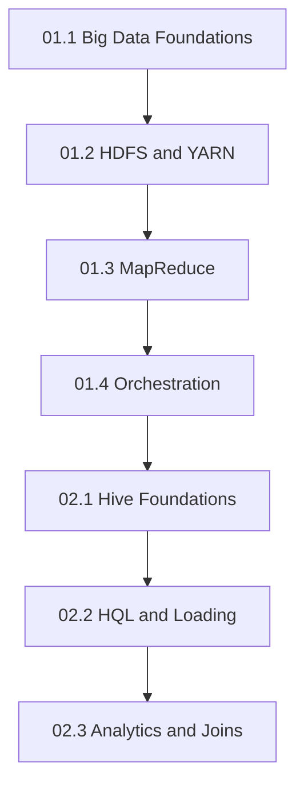

# DADS6002 Big Data Analytics — Master Notes

สารบัญกลางของ Master Notes ภาษาไทย เรียงเลขบทด้วยรูปแบบ `เอกสารหลัก.บทย่อย` เช่น `01.3` หมายถึงบทย่อยที่ 3 จากเอกสาร Hadoop หมายเลข 01 และ `02.1` หมายถึงบทย่อยที่ 1 จากเอกสาร Hive หมายเลข 02

> **เอกสารกำกับรายวิชา:** `dads6002_00_course_syllabus.pdf` จำนวน 7 หน้า  
> **รายวิชา:** วธวข. 6002 การวิเคราะห์ข้อมูลขนาดใหญ่ (Big Data Analytics)  
> **หลักสูตร:** วิทยาศาสตรมหาบัณฑิต สาขาการวิเคราะห์ข้อมูลและวิทยาการข้อมูล / สาขาวิทยาการคอมพิวเตอร์และระบบสารสนเทศ  
> **ภาคการศึกษา:** 1/2569 ชั้นปีที่ 1

ชุด canonical ที่แนะนำให้อ่านคือไฟล์ `011`–`014` และ `021`–`023` ซึ่งอยู่ในโฟลเดอร์ `summary/` นี้โดยตรง ให้ใช้เลขและลิงก์จากสารบัญนี้เป็นหลักเพื่อไม่สับสนกับชื่อไฟล์จากการสรุปรุ่นก่อนหน้า

## ภาพรวมรายวิชาจาก Course Syllabus

DADS6002 เป็นวิชาหลักหรือวิชาบังคับ 3 หน่วยกิต เนื้อหาเรียนแบบบรรยายรวม 45 ชั่วโมง และระบุการศึกษาด้วยตนเอง 15 ชั่วโมง ไม่มี prerequisite หรือ co-requisite ที่กำหนดไว้ใน syllabus อย่างไรก็ตาม ผู้เริ่มต้นจะเรียนได้ราบรื่นขึ้นหากเข้าใจแนวคิดพื้นฐานเรื่องไฟล์ ตาราง SQL และการประมวลผลข้อมูลก่อน

| รายการ | ข้อมูลจาก syllabus |
|---|---|
| ผู้รับผิดชอบรายวิชาและผู้สอน | รศ. ดร. สุรพงค์ เอื้อวัฒนามงคล |
| สถานที่เรียน | สถาบันบัณฑิตพัฒนบริหารศาสตร์ |
| รูปแบบการสอน | บรรยาย อภิปราย ระดมสมอง กรณีศึกษา และโครงงาน |
| เวลาปรึกษาทางวิชาการ | 6 ชั่วโมงต่อสัปดาห์ |

เป้าหมายของวิชาคือให้เข้าใจกระบวนการ เครื่องมือ และการประยุกต์ใช้สำหรับจัดการและวิเคราะห์ข้อมูลขนาดใหญ่ ไม่ได้จำกัดอยู่ที่ Hadoop เพียงเครื่องมือเดียว แต่เดินจากการจัดเก็บและประมวลผลแบบกระจายไปสู่ ingestion, query, machine learning, text analytics และ graph analytics เครื่องมือที่ syllabus ระบุประกอบด้วย Hadoop, Hive, HBase, Flume, Sqoop, Kafka, Spark, Spark SQL, MLlib/ML และ GraphX/GraphFrames

คำอธิบายรายวิชายังครอบคลุม HDFS, HBase, key-value stores, document databases, graph databases, อัลกอริทึมวิเคราะห์ข้อมูลบนหลายแพลตฟอร์ม และการนำเสนอข้อมูลขนาดใหญ่ด้วยภาพ ดังนั้นแกนของวิชานี้คือการตอบให้ได้ว่า **ข้อมูลควรเข้า เก็บ กระจาย ประมวลผล วิเคราะห์ และนำเสนออย่างไรภายใต้ข้อจำกัดด้านขนาด ความเร็ว และความซับซ้อน** ไม่ใช่การท่องคำสั่งของเครื่องมือแต่ละตัวแยกจากกัน

ผลการเรียนรู้ที่ syllabus มุ่งหวังไม่ได้มีเฉพาะความรู้เครื่องมือ แต่รวมถึงการวิเคราะห์และออกแบบวิธีแก้ปัญหา การติดตามเทคโนโลยีใหม่ การบูรณาการความรู้กับศาสตร์อื่น การคิดอย่างมีวิจารณญาณ การทำงานเป็นทีม การสื่อสารและนำเสนอ ตลอดจนจริยธรรม ความรับผิดชอบ และการอ้างอิงผลงานอย่างถูกต้อง ด้วยเหตุนี้คำตอบระดับปริญญาโทควรอธิบายทั้งเหตุผล กลไก trade-off ผลกระทบ และหลักฐานตรวจสอบ ไม่ควรหยุดที่คำจำกัดความหรือชื่อคำสั่ง

## โครงสร้างคะแนนและผลต่อกลยุทธ์การเรียน

| องค์ประกอบ | สัดส่วน | สิ่งที่ syllabus ระบุ |
|---|---:|---|
| สอบกลางภาค | 40% | สัปดาห์ที่ 9–10 |
| สอบปลายภาค | 40% | สัปดาห์ที่ 19–20 |
| กรณีศึกษา การค้นคว้า รายงาน งานกลุ่ม และงานที่มอบหมาย | 20% | ตลอดภาคการศึกษา |

คะแนนสอบรวม 80% ทำให้การอ่านเพื่อ “อธิบายกลไกและเปรียบเทียบได้” สำคัญกว่าการจำ syntax อย่างเดียว ส่วนงาน 20% ต้องแสดงการประยุกต์ การวิเคราะห์กรณีศึกษา การทำงานร่วมกัน การนำเสนอ และการอ้างอิงแหล่งข้อมูลอย่างเหมาะสม Master Notes จึงจัดแต่ละบทตามลำดับความเข้าใจ → กลไก → ตัวอย่าง → failure/trade-off → แบบฝึกหัดและแนวข้อสอบ

### กลยุทธ์เตรียมสอบจากโครงคะแนน

1. หลังเรียนแต่ละบท ให้ปิดเอกสารแล้วอธิบาย input → mechanism → output และข้อจำกัดจากความจำ
2. ก่อนกลางภาค ให้เน้นเหตุผลเชื่อม Big Data, Hadoop, HDFS, YARN, MapReduce, Hive และเครื่องมือ ingestion ตามขอบเขตที่อาจารย์สอนจริง
3. ก่อนปลายภาค ให้เน้น Spark, Spark SQL, machine learning, text analytics และ graph analytics พร้อมย้อนเชื่อมว่าทำงานเหนือ storage/cluster อย่างไร
4. สำหรับงานกลุ่ม ให้เลือกกรณีที่พิสูจน์ผลได้ด้วย architecture, data flow, grain, validation และ trade-off ไม่ใช่เพียงสาธิตว่าเครื่องมือรันได้

## แผนการสอนตาม Syllabus

| สัปดาห์ | หัวข้อ | บทบาทในเส้นทางการเรียน |
|---:|---|---|
| 1 | Introduction to Big Data | ปัญหา 5Vs และภาพรวมระบบข้อมูลขนาดใหญ่ |
| 2 | Hadoop | distributed storage และ resource management |
| 3 | MapReduce Framework | การแบ่งงาน สร้าง key และรวมผลบนคลัสเตอร์ |
| 4 | Hive | abstraction แบบตารางและ HQL เหนือ Hadoop |
| 5 | HBase | การเข้าถึงข้อมูลแบบ key-value/column-family |
| 6 | Data Ingestion: Sqoop, Flume, Kafka | การนำข้อมูล batch และ events เข้าสู่แพลตฟอร์ม |
| 7–8 | Spark | distributed processing ที่ยืดหยุ่นกว่า pipeline แบบ MapReduce |
| 9–10 | สอบกลางภาค | ประเมินความรู้ครึ่งภาคแรก |
| 11 | Spark SQL | การประมวลผลเชิงตารางด้วย Spark |
| 12–14 | Machine Learning with Spark | การสร้างและประเมินโมเดลบนข้อมูลขนาดใหญ่ |
| 15 | Text Analytics with Spark | การแปลงและวิเคราะห์ข้อความ |
| 16–17 | Graph Analytics with Spark | vertices, edges และการวิเคราะห์ความสัมพันธ์ |
| 18 | สัปดาห์ว่างตามปฏิทินสถาบัน | ทบทวนและเตรียมสอบ |
| 19–20 | สอบปลายภาค | ประเมินความรู้ครึ่งภาคหลังและการเชื่อมโยงทั้งวิชา |

หัวข้อในตารางเป็นแผนตาม syllabus ส่วนไฟล์ Master Notes จะเพิ่มลงในสารบัญเมื่อมี lecture source ของหัวข้อนั้น จึงไม่สร้างบทจากชื่อสัปดาห์เพียงอย่างเดียวโดยไม่มีเอกสารต้นทาง

## 01 — Hadoop

แหล่งหลัก: `dads6002_01_hadoop.pdf` จำนวน 43 หน้า

1. [บทที่ 01.1: Big Data Foundations, Workflow และ Data Lake](011_big_data_foundations.md)
2. [บทที่ 01.2: Hadoop Architecture, HDFS และ YARN](012_hdfs_and_yarn.md)
3. [บทที่ 01.3: MapReduce และ Hadoop Streaming](013_mapreduce_and_streaming.md)
4. [บทที่ 01.4: Partitioner และ Workflow Orchestration](014_workflow_orchestration.md)

## 02 — Hive

แหล่งหลัก: `dads6002_02_hive.pdf` จำนวน 21 หน้า และ `lab_02_hive.pdf` จำนวน 5 หน้า ชุดนี้ปรับด้วยมาตรฐานการอธิบายแบบขยายความ โดยรักษาเหตุผลจากต้นฉบับ แปลศัพท์เมื่อพบครั้งแรก และใช้ตัวอย่างเดียวเชื่อมจากไฟล์ดิบไปจนถึงผลวิเคราะห์

1. [บทที่ 02.1: พื้นฐาน Hive และการจัดวางข้อมูล](021_hive_foundations_and_storage.md) — เข้าใจว่า Hive ทำให้ไฟล์กลายเป็นตารางที่ค้นหาได้อย่างไร และ table, partition, bucket ทำหน้าที่ต่างกันตรงไหน
2. [บทที่ 02.2: HQL, Schema, SerDe และการนำข้อมูลเข้า](022_hql_schema_serde_and_loading.md) — สร้างคำอธิบายตาราง แปลข้อความเป็นคอลัมน์ และตรวจความผิดพลาดที่อาจไม่เกิด error ตอน load
3. [บทที่ 02.3: การสรุปข้อมูลและการเชื่อมตาราง](023_hive_analytics_and_joins.md) — ติดตามว่า `GROUP BY` เปลี่ยน grain อย่างไร และเลือก join จากประชากรที่ต้องรักษา

### วิธีอ่านชุด Hive สำหรับผู้เริ่มต้น

ให้อ่านสามบทตามลำดับโดยใช้คำถามเดียวเป็นแกน เริ่มจาก “ไฟล์จริงกับคำอธิบายไฟล์อยู่ที่ใด” ใน 02.1 ต่อด้วย “Hive แยกหนึ่งบรรทัดเป็นคอลัมน์อย่างไร” ใน 02.2 และจบที่ “เมื่อแถวพร้อมแล้ว ระบบรวมและจับคู่แถวอย่างไร” ใน 02.3 หากตอบคำถามของบทก่อนยังไม่ได้ ไม่ควรข้ามไปจำ syntax ของบทถัดไป

ศัพท์อังกฤษถูกเก็บไว้เพื่อให้ตรงกับสไลด์และเอกสารระบบ แต่ทุกคำหลักต้องมีคำแปลและตัวอย่างเมื่อพบครั้งแรก ตารางสรุปและรายการคำสั่งเป็นส่วนทบทวนหลังคำอธิบาย ไม่ใช่สิ่งที่ใช้แทนการทำความเข้าใจ

## Recommended Learning Path

ลำดับนี้เริ่มจากเหตุผลที่ต้องใช้ distributed system ต่อด้วย storage/resource management, distributed processing และ workflow ก่อนยกระดับสู่ SQL-based analytics ด้วย Hive

## เส้นทาง Theory → Lab → Validation

Lab ไม่ได้แยกเป็นบทใหม่ เพราะควรอ่านทันทีหลังเข้าใจกลไกที่มันพิสูจน์ แต่ละกิจกรรมจึงถูกผสานไว้ในบ้านหลักดังนี้:

| Lab source | อ่านทฤษฎีก่อน | สิ่งที่ลงมือทำ | หลักฐานว่าผ่าน |
|---|---|---|---|
| [Lab 01 Hadoop หน้า 1–3](../lab/lab_01_hadoop.pdf) | [01.2 HDFS และ YARN](012_hdfs_and_yarn.md) | local file ↔ HDFS, `put/get/cp/rm` | `diff`, HDFS path และเนื้อหาตรงกัน |
| [Lab 01 Hadoop หน้า 4–5](../lab/lab_01_hadoop.pdf) + [mapper](../lab/lab_01_hadoop_mapper.py) / [reducer](../lab/lab_01_hadoop_reducer.py) | [01.3 MapReduce และ Streaming](013_mapreduce_and_streaming.md) | local pipeline และ Hadoop Streaming Word Count | key counts และผลรวม tokens ตรง input |
| [Lab 02 Hive หน้า 1–4](../lab/lab_02_hive.pdf) | [02.2 HQL, Schema, SerDe และ Loading](022_hql_schema_serde_and_loading.md) | DDL, MovieLens, managed/external, RegexSerDe | row count, sample fields และ null checks ผ่าน |
| [Lab 02 Hive หน้า 3–5](../lab/lab_02_hive.pdf) | [02.3 Analytics และ Joins](023_hive_analytics_and_joins.md) | aggregate users และ web logs | group grain และผลรวม counts reconcile |

วิธีอ่านที่แนะนำคืออ่านคำอธิบายจนตอบได้ว่า input → mechanism → output คืออะไร จากนั้นทำนายผลก่อนรัน Lab เก็บผลตรวจสอบ และจงใจทำ failure ที่กำหนดไว้หนึ่งครั้ง การจำคำสั่งโดยไม่ทำสามขั้นนี้อาจช่วยให้พิมพ์ตามได้ แต่ยังไม่พอสำหรับการสอบวิเคราะห์หรือวินิจฉัยระบบจริง

### สะพานเชื่อมแนวคิดระหว่างเอกสาร 01 และ 02

ชุด Hadoop อธิบายกลไกด้านล่าง: HDFS เก็บไฟล์, YARN จัดสรรทรัพยากร, MapReduce แบ่งและรวมงาน และ orchestrator ควบคุมหลาย jobs เมื่อเข้าสู่ Hive เราไม่ได้ทิ้งกลไกเหล่านั้น แต่เพิ่ม abstraction แบบตาราง Hive ใช้ metadata อธิบายไฟล์และแปล HQL เป็น execution plan ทำให้นักวิเคราะห์ระบุผลที่ต้องการโดยไม่เขียน Mapper/Reducer ทุกครั้ง

เรื่องราวหลักของทั้งชุดคือข้อมูลจัดซื้อโรงพยาบาล เริ่มจาก raw events เข้า Data Lake เก็บอย่างทนทานในระบบกระจาย แปลงด้วยงาน batch ควบคุมด้วย DAG จากนั้นประกาศ Hive tables และ schema เพื่อให้ query ได้ สุดท้ายจึง aggregate และ join กับ vendor master โดยตรวจ grain, unmatched keys, row multiplication และยอดรวม การอ่านตามลำดับนี้ช่วยให้เห็นว่าแต่ละเครื่องมือแก้ข้อจำกัดจากขั้นก่อนหน้า

## Cumulative Learning Objectives

- เชื่อม 5Vs กับ storage, processing, latency และ data-quality requirements
- trace HDFS write/read และ YARN application lifecycle
- ติดตาม record ผ่าน Map, partition, shuffle, sort และ Reduce
- ออกแบบ DAG ที่ retry และ rerun ได้อย่างปลอดภัย
- อธิบาย Hive, Metastore, tables, partitions และ buckets
- สร้าง HQL schema, SerDe และ staging-to-curated load flow
- เขียน aggregation และ joins พร้อมตรวจ grain, unmatched keys และ totals
- รัน Lab Hadoop/Hive พร้อมแยก local/HDFS, ตรวจ data contract และอธิบาย failure ได้

## Numbering Standard

| รูปแบบ | ความหมาย | ตัวอย่าง |
|---|---|---|
| `01.x` | ชุด Hadoop จากเอกสารหมายเลข 01 | `01.3` = MapReduce |
| `02.x` | ชุด Hive จากเอกสารหมายเลข 02 | `02.2` = HQL และ loading |
| ชื่อไฟล์ `0xy_...md` | ตัดจุดออกเพื่อให้ sort ง่าย | `023_...md` = บทที่ 02.3 |

เลขในชื่อไฟล์ หัวเรื่อง ลิงก์ข้ามบท และสารบัญต้องใช้ mapping เดียวกันนี้

## Integrated Capstone

ออกแบบ analytical pipeline สำหรับข้อมูลการสั่งซื้อของโรงพยาบาล ตั้งแต่รับไฟล์เข้า HDFS จัดสรร resource ด้วย YARN ประมวลผลและ orchestration งาน สร้าง Hive external staging table แปลงเป็น curated table แล้วสรุปยอดร่วมกับ vendor master

ผลงานต้องแสดง architecture, grain, partition design, HQL, failure recovery และ reconciliation ของ row count กับยอดเงิน

## Cumulative Exam Blueprint

| ความสามารถ | บทหลัก | ระดับ |
|---|---|---|
| อธิบาย distributed storage/compute | 01.1–01.3 | Explain/Apply |
| วิเคราะห์ failure และ orchestration | 01.2–01.4 | Analyze/Evaluate |
| ออกแบบ Hive storage/schema | 02.1–02.2 | Apply/Analyze |
| วิเคราะห์ aggregation/join correctness | 02.3 | Analyze/Evaluate |
| ออกแบบ pipeline end-to-end | ทุกบท | Create |

## Final Revision Checklist

- [ ] อธิบายลำดับ 01.1 → 02.3 และ dependency ของแต่ละบทได้
- [ ] วาด HDFS/YARN/MapReduce flow จากความจำได้
- [ ] แยก table, partition และ bucket ได้
- [ ] อธิบาย schema-on-read และ SerDe ได้
- [ ] ตรวจ row multiplication และ unmatched keys หลัง join ได้
- [ ] ออกแบบ retry, validation และ reconciliation สำหรับ pipeline ได้
- [ ] ทำ Lab 01–02 โดยทำนายผล เก็บหลักฐาน และซ่อม deliberate failure ได้

## Source Coverage

- `dads6002_00_course_syllabus.pdf` หน้า 1–7 ครอบคลุมข้อมูลรายวิชา เป้าหมาย คำอธิบาย ผลการเรียนรู้ แผนสัปดาห์ การประเมิน และเอกสารหลักในไฟล์นี้
- `dads6002_01_hadoop.pdf` หน้า 1–43 ครอบคลุมในบท 01.1–01.4
- `dads6002_02_hive.pdf` หน้า 1–21 ครอบคลุมในบท 02.1–02.3
- `lab_01_hadoop.pdf` หน้า 1–5 และ Python mapper/reducer ครอบคลุมในบท 01.2–01.3
- `lab_02_hive.pdf` หน้า 1–5 ครอบคลุมในบท 02.2–02.3

## Suite Review

- เลขบท canonical สอดคล้องกัน: `01.1–01.4` และ `02.1–02.3`
- ทุกบทมี source range, prerequisites, teaching layer, practice, exam focus และ mastery checks
- Hadoop → Hive เชื่อมผ่าน HDFS, MapReduce, metadata และ SQL abstraction
- Hive หน้า 1–5 มีบ้านหลักใน 02.1, หน้า 6–15 ใน 02.2 และหน้า 16–21 ใน 02.3 โดยไม่มีช่วงหน้าตกหล่น
- Lab ทุกชุดมีบ้านหลักตามแนวคิด ไม่สร้างไฟล์ซ้ำ และเพิ่ม prediction, expected evidence, deliberate failure กับ validation แล้ว

## References

- `dads6002_00_course_syllabus.pdf`, หน้า 1–7
- Benjamin Bengfort and Jenny Kim, *Data Analytics with Hadoop*, O'Reilly
- Tom White, *Hadoop: The Definitive Guide - Storage and Analysis at Internet Scale*, O'Reilly
- Wenqiang Feng, *Learning Apache Spark with Python*, 2021
- Bill Chambers and Matei Zaharia, *Spark: The Definitive Guide - Big Data Processing Made Simple*, O'Reilly
- [Apache Hadoop Documentation](https://hadoop.apache.org/docs/current/)
- [Apache Airflow Documentation](https://airflow.apache.org/docs/apache-airflow/stable/)
- [Apache Hive Documentation](https://hive.apache.org/docs/latest/)
