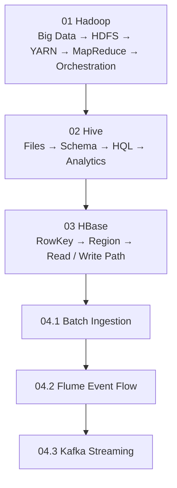

# DADS6002 Big Data Analytics — Course Syllabus and Master Notes

สารบัญกลางของ Master Notes ภาษาไทย เรียงตามหมายเลขเอกสาร Lecture เช่น `01_hadoop.md` หมายถึงบทเรียนรวมจาก Lecture และ Lab หมายเลข 01 ส่วนหัวข้อย่อยอยู่ภายในไฟล์เดียวเพื่อให้อ่านต่อเนื่องได้

> **เอกสารกำกับรายวิชา:** `dads6002_00_course_syllabus.pdf` จำนวน 7 หน้า  
> **รายวิชา:** วธวข. 6002 การวิเคราะห์ข้อมูลขนาดใหญ่ (Big Data Analytics)  
> **หลักสูตร:** วิทยาศาสตรมหาบัณฑิต สาขาการวิเคราะห์ข้อมูลและวิทยาการข้อมูล / สาขาวิทยาการคอมพิวเตอร์และระบบสารสนเทศ  
> **ภาคการศึกษา:** 1/2569 ชั้นปีที่ 1

ไฟล์ Hadoop ฉบับหลักเปลี่ยนเป็น `01_hadoop.md` ซึ่งรวมเนื้อหาจาก Lecture และ Lab ไว้ในเส้นเรื่องเดียว ไฟล์ย่อย `011`–`014` ยังเก็บไว้ชั่วคราวระหว่างการตรวจย้ายเนื้อหา แต่ไม่ใช่ฉบับที่แนะนำให้อ่าน ส่วนหัวข้ออื่นจะทยอยรวมเมื่อผ่านการเรียบเรียงและตรวจสอบแล้ว

## ภาพรวมรายวิชาจาก Course Syllabus

DADS6002 เป็นวิชาหลักหรือวิชาบังคับ 3 หน่วยกิต เนื้อหาเรียนแบบบรรยายรวม 45 ชั่วโมง และระบุการศึกษาด้วยตนเอง 15 ชั่วโมง ไม่มี prerequisite หรือ co-requisite ที่กำหนดไว้ใน syllabus อย่างไรก็ตาม ผู้เริ่มต้นจะเรียนได้ราบรื่นขึ้นหากเข้าใจแนวคิดพื้นฐานเรื่องไฟล์ ตาราง SQL และการประมวลผลข้อมูลก่อน

| รายการ | ข้อมูลจาก syllabus |
|---|---|
| ผู้รับผิดชอบรายวิชาและผู้สอน | รศ. ดร. สุรพงค์ เอื้อวัฒนามงคล |
| สถานที่เรียน | สถาบันบัณฑิตพัฒนบริหารศาสตร์ |
| รูปแบบการสอน | บรรยาย อภิปราย ระดมสมอง กรณีศึกษา และโครงงาน |
| เวลาปรึกษาทางวิชาการ | 6 ชั่วโมงต่อสัปดาห์ |

เป้าหมายของวิชาคือให้เข้าใจกระบวนการ เครื่องมือ และการประยุกต์ใช้สำหรับจัดการและวิเคราะห์ข้อมูลขนาดใหญ่ ไม่ได้จำกัดอยู่ที่ Hadoop เพียงเครื่องมือเดียว แต่เดินจากการจัดเก็บและประมวลผลแบบกระจายไปสู่ ingestion, query, machine learning, text analytics และ graph analytics เครื่องมือที่ syllabus ระบุประกอบด้วย Hadoop, Hive, HBase, Flume, Sqoop, Kafka, Spark, Spark SQL, MLlib/ML และ GraphX/GraphFrames

คำอธิบายรายวิชายังครอบคลุม HDFS, HBase, key-value stores, document databases, graph databases, อัลกอริทึมวิเคราะห์ข้อมูลบนหลายแพลตฟอร์ม และการนำเสนอข้อมูลขนาดใหญ่ด้วยภาพ ดังนั้นแกนของวิชานี้คือการตอบให้ได้ว่า **ข้อมูลควรเข้า เก็บ กระจาย ประมวลผล วิเคราะห์ และนำเสนออย่างไรภายใต้ข้อจำกัดด้านขนาด ความเร็ว และความซับซ้อน** ไม่ใช่การท่องคำสั่งของเครื่องมือแต่ละตัวแยกจากกัน

ผลการเรียนรู้ที่ syllabus มุ่งหวังไม่ได้มีเฉพาะความรู้เครื่องมือ แต่รวมถึงการวิเคราะห์และออกแบบวิธีแก้ปัญหา การติดตามเทคโนโลยีใหม่ การบูรณาการความรู้กับศาสตร์อื่น การคิดอย่างมีวิจารณญาณ การทำงานเป็นทีม การสื่อสารและนำเสนอ ตลอดจนจริยธรรม ความรับผิดชอบ และการอ้างอิงผลงานอย่างถูกต้อง ด้วยเหตุนี้คำตอบระดับปริญญาโทควรอธิบายทั้งเหตุผล กลไก trade-off ผลกระทบ และหลักฐานตรวจสอบ ไม่ควรหยุดที่คำจำกัดความหรือชื่อคำสั่ง

## โครงสร้างคะแนนและผลต่อกลยุทธ์การเรียน

| องค์ประกอบ | สัดส่วน | สิ่งที่ syllabus ระบุ |
|---|---:|---|
| สอบกลางภาค | 40% | สัปดาห์ที่ 9–10 |
| สอบปลายภาค | 40% | สัปดาห์ที่ 19–20 |
| กรณีศึกษา การค้นคว้า รายงาน งานกลุ่ม และงานที่มอบหมาย | 20% | ตลอดภาคการศึกษา |

คะแนนสอบรวม 80% ทำให้การอ่านเพื่อ “อธิบายกลไกและเปรียบเทียบได้” สำคัญกว่าการจำ syntax อย่างเดียว ส่วนงาน 20% ต้องแสดงการประยุกต์ การวิเคราะห์กรณีศึกษา การทำงานร่วมกัน การนำเสนอ และการอ้างอิงแหล่งข้อมูลอย่างเหมาะสม Master Notes จึงจัดแต่ละบทตามลำดับความเข้าใจ → กลไก → ตัวอย่าง → failure/trade-off → แบบฝึกหัดและแนวข้อสอบ

### กลยุทธ์เตรียมสอบจากโครงคะแนน

1. หลังเรียนแต่ละบท ให้ปิดเอกสารแล้วอธิบาย input → mechanism → output และข้อจำกัดจากความจำ
2. ก่อนกลางภาค ให้เน้นเหตุผลเชื่อม Big Data, Hadoop, HDFS, YARN, MapReduce, Hive และเครื่องมือ ingestion ตามขอบเขตที่อาจารย์สอนจริง
3. ก่อนปลายภาค ให้เน้น Spark, Spark SQL, machine learning, text analytics และ graph analytics พร้อมย้อนเชื่อมว่าทำงานเหนือ storage/cluster อย่างไร
4. สำหรับงานกลุ่ม ให้เลือกกรณีที่พิสูจน์ผลได้ด้วย architecture, data flow, grain, validation และ trade-off ไม่ใช่เพียงสาธิตว่าเครื่องมือรันได้

## แผนการสอนตาม Syllabus

| สัปดาห์ | หัวข้อ | บทบาทในเส้นทางการเรียน |
|---:|---|---|
| 1 | Introduction to Big Data | ปัญหา 5Vs และภาพรวมระบบข้อมูลขนาดใหญ่ |
| 2 | Hadoop | distributed storage และ resource management |
| 3 | MapReduce Framework | การแบ่งงาน สร้าง key และรวมผลบนคลัสเตอร์ |
| 4 | Hive | abstraction แบบตารางและ HQL เหนือ Hadoop |
| 5 | HBase | การเข้าถึงข้อมูลแบบ key-value/column-family |
| 6 | Data Ingestion: Sqoop, Flume, Kafka | การนำข้อมูล batch และ events เข้าสู่แพลตฟอร์ม |
| 7–8 | Spark | distributed processing ที่ยืดหยุ่นกว่า pipeline แบบ MapReduce |
| 9–10 | สอบกลางภาค | ประเมินความรู้ครึ่งภาคแรก |
| 11 | Spark SQL | การประมวลผลเชิงตารางด้วย Spark |
| 12–14 | Machine Learning with Spark | การสร้างและประเมินโมเดลบนข้อมูลขนาดใหญ่ |
| 15 | Text Analytics with Spark | การแปลงและวิเคราะห์ข้อความ |
| 16–17 | Graph Analytics with Spark | vertices, edges และการวิเคราะห์ความสัมพันธ์ |
| 18 | สัปดาห์ว่างตามปฏิทินสถาบัน | ทบทวนและเตรียมสอบ |
| 19–20 | สอบปลายภาค | ประเมินความรู้ครึ่งภาคหลังและการเชื่อมโยงทั้งวิชา |

หัวข้อในตารางเป็นแผนตาม syllabus ส่วนไฟล์ Master Notes จะเพิ่มลงในสารบัญเมื่อมี lecture source ของหัวข้อนั้น จึงไม่สร้างบทจากชื่อสัปดาห์เพียงอย่างเดียวโดยไม่มีเอกสารต้นทาง

## 01 — Hadoop

แหล่งหลัก: `dads6002_01_hadoop.pdf` จำนวน 43 หน้า และ `lab_01_hadoop.pdf` จำนวน 5 หน้า

- [01 — Hadoop: จากปัญหา Big Data สู่ระบบจัดเก็บและประมวลผลแบบกระจาย](01_hadoop.md)

บทเรียนรวมเริ่มจากเหตุผลที่ข้อมูลขนาดใหญ่ต้องเปลี่ยนวิธีเก็บและประมวลผล แล้วติดตามไฟล์ผ่าน HDFS, การจัดสรรทรัพยากรด้วย YARN, การคำนวณด้วย MapReduce และการเชื่อมหลาย jobs ด้วย Workflow Orchestration ภายในมีภาพ Architecture และ Sequence Diagram อธิบายตำแหน่งและการไหลของข้อมูล พร้อมผสาน HDFS CLI และ Hadoop Streaming จาก Lab เข้าไว้ตรงแนวคิดที่เกี่ยวข้อง

## 02 — Hive

- [02 — Apache Hive: จากไฟล์บน HDFS สู่ตารางที่ Query และวิเคราะห์ได้](02_hive.md)

บทเรียนรวมใช้ Lecture 21 หน้าและ Lab 5 หน้า เริ่มจากข้อจำกัดของการมองข้อมูลเป็นเพียงไฟล์ แล้วติดตามว่า Hive ใช้ Metastore, Table Definition และ SerDe ทำให้ไฟล์ถูกอ่านเป็น Row และ Column ได้อย่างไร จากนั้นจึงเชื่อม Storage Layout, Schema-on-read, Loading, Aggregation และ Join เป็นเรื่องเดียว ภายในมีภาพ Data Flow และโครงสร้างที่ช่วยให้เห็นสิ่งซึ่งมองไม่เห็น รวมถึง Lab, Validation, Troubleshooting และโจทย์บรรยายพร้อมแนวคำตอบ

ไฟล์เดิม `021–023` ยังคงเก็บไว้ชั่วคราวเพื่อเปรียบเทียบความครอบคลุม แต่เส้นทางอ่านหลักคือ `02_hive.md`

## 03 — HBase

- [03 — Apache HBase: จาก RowKey สู่ฐานข้อมูลแบบกระจายสำหรับการอ่าน–เขียนระดับแถว](03_hbase.md)

บทเรียนรวมใช้ Lecture 16 หน้าและ Lab 7 หน้า เริ่มจากคำถามว่าเหตุใดงานที่ต้องค้นหรือแก้ข้อมูลหนึ่ง Row อย่างรวดเร็วจึงไม่เหมือนงานวิเคราะห์แบบ Batch ของ Hive แล้วค่อยสร้าง Data Model ตั้งแต่ RowKey, Column Family, Qualifier, Cell และ Version ก่อนติดตาม Write Path, Read Path, Failure Recovery และผลของ RowKey Design เนื้อหา HBase Shell และ Lab ถูกวางหลังกลไกที่คำสั่งเหล่านั้นกระทบ เพื่อให้เข้าใจผลของคำสั่งแทนการท่อง Syntax

ไฟล์เดิม `031–033` ยังคงเก็บไว้ชั่วคราวเพื่อเปรียบเทียบความครอบคลุม แต่เส้นทางอ่านหลักคือ `03_hbase.md`

## 04 — Data Ingestion

แหล่งหลัก: `dads6002_04_data_ingestion.pdf` จำนวน 22 หน้า ชุดนี้อธิบายเส้นทางที่ข้อมูลจากระบบภายนอกเข้าสู่ Hadoop และ Streaming Platform โดยแยก Batch Table Transfer, Log/Event Collection และ Distributed Event Streaming ออกจากกัน

1. [บทที่ 04.1: Data Ingestion และ Sqoop](041_data_ingestion_and_sqoop.md) — Ingestion Pattern, RDBMS → HDFS/Hive/HBase, Mapper Parallelism, Validation และสถานะปัจจุบันของ Sqoop
2. [บทที่ 04.2: Flume, Avro และ Event Data Flow](042_flume_avro_and_event_flows.md) — Source–Channel–Sink, Reliability, Multi-agent/Fan-in Flow และ Product Impression Example
3. [บทที่ 04.3: Kafka Streaming Foundations](043_kafka_streaming_foundations.md) — Broker, Topic, Partition, Offset, Replication, Producer, Consumer Group, Ordering และ KRaft

### วิธีอ่านชุด Data Ingestion สำหรับผู้เริ่มต้น

เริ่ม 04.1 ด้วยคำถามว่า “ข้อมูลมาจากระบบใด มาเป็นรอบหรือต่อเนื่อง และปลายทางต้องใช้อย่างไร” จากนั้นใช้ Sqoop เป็นตัวอย่างของ Batch Bulk Transfer แล้วอ่าน 04.2 เพื่อติดตาม Event ต่อเนื่องผ่าน Source → Channel → Sink เมื่อเข้าใจการเก็บและส่ง Event แล้วจึงอ่าน 04.3 เพื่อดูว่า Kafka ทำให้ Event เดิมถูกเก็บแบบ Durable Log และเปิดให้ Consumer Groups หลายชุดอ่านอย่างอิสระได้อย่างไร

เครื่องมือในสไลด์สะท้อนทั้ง Legacy Hadoop และแนวคิดที่ยังใช้ในปัจจุบัน ชุดนี้จึงแยกสิ่งที่ควรรู้เพื่อสอบออกจากสิ่งที่ควรใช้ตัดสินใจในระบบใหม่ เช่น Sqoop ถูก Retire แล้ว และ Kafka 4.x ใช้ KRaft แทน ZooKeeper

## Recommended Learning Path

ลำดับนี้เริ่มจากเหตุผลที่ต้องใช้ Distributed System ต่อด้วย Storage/Resource Management, Distributed Processing และ Workflow ก่อนยกระดับสู่ SQL-based Analytics ด้วย Hive แล้วจึงใช้ข้อจำกัดของงาน Batch เป็นสะพานไปสู่ HBase สำหรับการอ่านและเขียนข้อมูลรายแถว จากนั้นบท 04 ตอบคำถามที่อยู่ก่อนทุกระบบเหล่านี้ว่า ข้อมูลจาก RDBMS, Logs และ Events จะเข้าสู่แพลตฟอร์มอย่างถูกต้องและตรวจสอบได้อย่างไร

## เส้นทาง Theory → Lab → Validation

Lab ไม่ได้แยกเป็นบทใหม่ เพราะควรอ่านทันทีหลังเข้าใจกลไกที่มันพิสูจน์ แต่ละกิจกรรมจึงถูกผสานไว้ในบ้านหลักดังนี้:

| Lab source | อ่านทฤษฎีก่อน | สิ่งที่ลงมือทำ | หลักฐานว่าผ่าน |
|---|---|---|---|
| [Lab 01 Hadoop หน้า 1–3](../lab/lab_01_hadoop.pdf) | [01 Hadoop — ส่วน HDFS และ Lab](01_hadoop.md) | local file ↔ HDFS, `put/get/cp/rm` | HDFS path, ขนาด และเนื้อหาตรงกัน |
| [Lab 01 Hadoop หน้า 4–5](../lab/lab_01_hadoop.pdf) | [01 Hadoop — ส่วน MapReduce และ Streaming](01_hadoop.md) | local pipeline และ Hadoop Streaming Word Count | key counts และผลรวม tokens ตรง input |
| [Lab 02 Hive หน้า 1–4](../lab/lab_02_hive.pdf) | [02 Hive — HQL, Schema, SerDe และ Loading](02_hive.md) | DDL, MovieLens, managed/external, RegexSerDe | row count, sample fields และ null checks ผ่าน |
| [Lab 02 Hive หน้า 3–5](../lab/lab_02_hive.pdf) | [02 Hive — Aggregation และ Joins](02_hive.md) | aggregate users และ web logs | group grain และผลรวม counts reconcile |
| [Lab 03 HBase หน้า 1–7](../lab/lab_03_hbase.pdf) | [03 HBase — Data Model, Shell และ RowKey](03_hbase.md) | namespace, table, put/get, versions, scan, filter และ delete | Cell coordinates, version count, byte order และ scan boundary ตรงที่ทำนาย |

วิธีอ่านที่แนะนำคืออ่านคำอธิบายจนตอบได้ว่า input → mechanism → output คืออะไร จากนั้นทำนายผลก่อนรัน Lab เก็บผลตรวจสอบ และจงใจทำ failure ที่กำหนดไว้หนึ่งครั้ง การจำคำสั่งโดยไม่ทำสามขั้นนี้อาจช่วยให้พิมพ์ตามได้ แต่ยังไม่พอสำหรับการสอบวิเคราะห์หรือวินิจฉัยระบบจริง

### สะพานเชื่อมแนวคิดระหว่างเอกสาร 01 และ 02

ชุด Hadoop อธิบายกลไกด้านล่าง: HDFS เก็บไฟล์, YARN จัดสรรทรัพยากร, MapReduce แบ่งและรวมงาน และ orchestrator ควบคุมหลาย jobs เมื่อเข้าสู่ Hive เราไม่ได้ทิ้งกลไกเหล่านั้น แต่เพิ่ม abstraction แบบตาราง Hive ใช้ metadata อธิบายไฟล์และแปล HQL เป็น execution plan ทำให้นักวิเคราะห์ระบุผลที่ต้องการโดยไม่เขียน Mapper/Reducer ทุกครั้ง

เรื่องราวหลักของทั้งชุดคือข้อมูลจัดซื้อโรงพยาบาล เริ่มจาก raw events เข้า Data Lake เก็บอย่างทนทานในระบบกระจาย แปลงด้วยงาน batch ควบคุมด้วย DAG จากนั้นประกาศ Hive tables และ schema เพื่อให้ query ได้ สุดท้ายจึง aggregate และ join กับ vendor master โดยตรวจ grain, unmatched keys, row multiplication และยอดรวม การอ่านตามลำดับนี้ช่วยให้เห็นว่าแต่ละเครื่องมือแก้ข้อจำกัดจากขั้นก่อนหน้า

เมื่อเชื่อมไปยัง HBase ให้แยก workload ก่อน: Hive ยังเหมาะกับการ scan และสรุปข้อมูลจำนวนมาก ส่วน HBase เหมาะกับการค้นหรือแก้ไข record ที่ทราบ RowKey และต้องตอบสนองเร็วกว่า การเลือกเครื่องมือจึงขึ้นกับ access pattern ไม่ใช่การตัดสินว่าเครื่องมือใด “ใหม่กว่า” หรือ “ดีกว่า” โดยไม่มีบริบท

เมื่อเข้าสู่ Data Ingestion ให้ย้อนมองต้นทางของข้อมูลทั้งหมด Sqoop แสดง Batch Transfer จาก RDBMS, Flume แสดง Event Flow จาก Source ผ่าน Buffer ไป Destination และ Kafka แสดง Durable Event Log ที่แยก Producer ออกจาก Consumer หลายกลุ่ม ความต่างนี้ทำให้เลือกเครื่องมือจาก Source Type, Latency, Replay, Ordering และ Consumer Pattern แทนการเลือกจากชื่อเครื่องมือ

## Cumulative Learning Objectives

- เชื่อม 5Vs กับ storage, processing, latency และ data-quality requirements
- trace HDFS write/read และ YARN application lifecycle
- ติดตาม record ผ่าน Map, partition, shuffle, sort และ Reduce
- ออกแบบ DAG ที่ retry และ rerun ได้อย่างปลอดภัย
- อธิบาย Hive, Metastore, tables, partitions และ buckets
- สร้าง HQL schema, SerDe และ staging-to-curated load flow
- เขียน aggregation และ joins พร้อมตรวจ grain, unmatched keys และ totals
- อธิบาย HBase data model และระบุพิกัดของ Cell จาก RowKey, Column Family, Qualifier และ Version
- trace HBase write/read path พร้อมอธิบายความทนทาน การ flush และ compaction
- ออกแบบ RowKey จาก access pattern พร้อมวิเคราะห์ลำดับแบบ byte และความเสี่ยง hotspot
- จำแนก Batch, Incremental, CDC และ Streaming Ingestion ได้
- trace Sqoop Import และวิเคราะห์ผลของ Mapper Parallelism ต่อ Source Database ได้
- trace Flume Event ผ่าน Source, Channel และ Sink พร้อมวิเคราะห์ Failure/Duplicate ได้
- อธิบาย Kafka Topic, Partition, Offset, Replication และ Consumer Group ได้
- วิเคราะห์ Ordering, Partition Key, Consumer Parallelism และ Lag ได้
- รัน Lab Hadoop, Hive และ HBase พร้อมแยก storage layer, ตรวจ data contract และอธิบาย failure ได้

## Numbering Standard

| รูปแบบ | ความหมาย | ตัวอย่าง |
|---|---|---|
| `01` | บทเรียนรวม Hadoop จาก Lecture และ Lab หมายเลข 01 | `01_hadoop.md` |
| `02` | บทเรียนรวม Hive จาก Lecture และ Lab หมายเลข 02 | `02_hive.md` |
| `03` | บทเรียนรวม HBase จาก Lecture และ Lab หมายเลข 03 | `03_hbase.md` |
| `04.x` | ชุด Data Ingestion จากเอกสารหมายเลข 04 | `04.3` = Kafka streaming foundations |
| ชื่อไฟล์ `0xy_...md` | รูปแบบเดิมที่เก็บไว้ชั่วคราวระหว่างตรวจบทเรียนรวม | `023_...md` = ไฟล์ Hive เดิมส่วนที่ 3 |

เลขในชื่อไฟล์ หัวเรื่อง ลิงก์ข้ามบท และสารบัญต้องใช้ mapping เดียวกันนี้

## Integrated Capstone

ออกแบบ Analytical Pipeline สำหรับข้อมูลการสั่งซื้อของโรงพยาบาล โดยรับข้อมูล Master/Transaction จาก RDBMS แบบ Batch และรับสถานะคำสั่งซื้อแบบ Event จาก Streaming Platform นำ Raw Data เข้า HDFS จัดสรร Resource ด้วย YARN ประมวลผลและ Orchestration งาน สร้าง Hive External Staging Table แปลงเป็น Curated Table แล้วสรุปยอดร่วมกับ Vendor Master จากนั้นออกแบบ HBase Table สำหรับค้นสถานะคำสั่งซื้อหรือยอดล่าสุดของโรงพยาบาลแบบ RowKey Lookup

ผลงานต้องแสดง Architecture, Ingestion Pattern, Event Key, Grain, Partition Design, HQL, HBase RowKey/Column Family, Failure Recovery และ Reconciliation ของ Row Count กับยอดเงิน พร้อมอธิบายว่าข้อมูลส่วนใดควรอยู่ใน Hive, HBase หรือ Kafka ตาม Access Pattern

## Cumulative Exam Blueprint

| ความสามารถ | บทหลัก | ระดับ |
|---|---|---|
| อธิบาย distributed storage/compute | 01.1–01.3 | Explain/Apply |
| วิเคราะห์ failure และ orchestration | 01.2–01.4 | Analyze/Evaluate |
| ออกแบบ Hive storage/schema | 02 | Apply/Analyze |
| วิเคราะห์ aggregation/join correctness | 02 | Analyze/Evaluate |
| อธิบาย HBase data model และ read/write path | 03 | Explain/Analyze |
| ออกแบบ RowKey และวิเคราะห์ hotspot | 03 | Apply/Evaluate |
| เลือก Batch/Streaming Ingestion และตรวจความครบถ้วน | 04.1–04.2 | Apply/Analyze |
| วิเคราะห์ Kafka partitioning, ordering และ consumer groups | 04.3 | Analyze/Evaluate |
| ออกแบบ pipeline end-to-end | ทุกบท | Create |

## Final Revision Checklist

- [ ] อธิบายลำดับ 01.1 → 04.3 และ dependency ของแต่ละบทได้
- [ ] วาด HDFS/YARN/MapReduce flow จากความจำได้
- [ ] แยก table, partition และ bucket ได้
- [ ] อธิบาย schema-on-read และ SerDe ได้
- [ ] ตรวจ row multiplication และ unmatched keys หลัง join ได้
- [ ] ระบุพิกัด Cell และ trace เส้นทาง WAL → MemStore → HFile ได้
- [ ] อธิบายว่า RowKey ทำให้ scan order และ hotspot เปลี่ยนอย่างไรได้
- [ ] เปรียบเทียบ Sqoop, Flume และ Kafka จาก Source, Latency, Replay และ Consumer Pattern ได้
- [ ] คำนวณ Active Kafka Consumers จากจำนวน Partitions และอธิบาย Ordering Boundary ได้
- [ ] ออกแบบ retry, validation และ reconciliation สำหรับ pipeline ได้
- [ ] ทำ Lab 01–03 โดยทำนายผล เก็บหลักฐาน และซ่อม deliberate failure ได้

## Source Coverage

- `dads6002_00_course_syllabus.pdf` หน้า 1–7 ครอบคลุมข้อมูลรายวิชา เป้าหมาย คำอธิบาย ผลการเรียนรู้ แผนสัปดาห์ การประเมิน และเอกสารหลักในไฟล์นี้
- `dads6002_01_hadoop.pdf` หน้า 1–43 ครอบคลุมในบท 01.1–01.4
- `dads6002_02_hive.pdf` หน้า 1–21 และ `lab_02_hive.pdf` หน้า 1–5 ครอบคลุมใน `02_hive.md`
- `dads6002_03_hbase.pdf` หน้า 1–16 และ `lab_03_hbase.pdf` หน้า 1–7 ครอบคลุมใน `03_hbase.md`
- `dads6002_04_data_ingestion.pdf` หน้า 1–22 ครอบคลุมในบท 04.1–04.3
- `lab_01_hadoop.pdf` หน้า 1–5 และ Python mapper/reducer ครอบคลุมในบท 01.2–01.3

## Suite Review

- บท Hadoop, Hive และ HBase ใช้ไฟล์รวม `01_hadoop.md`, `02_hive.md` และ `03_hbase.md`; Data Ingestion ยังใช้ไฟล์แยกเดิมระหว่างรอปรับ
- ทุกบทมี source range, prerequisites, teaching layer, practice, exam focus และ mastery checks
- Hadoop → Hive เชื่อมผ่าน HDFS, MapReduce, metadata และ SQL abstraction
- Hive → HBase เชื่อมผ่านความต่างระหว่าง batch analytics กับ low-latency row access
- HBase → Data Ingestion เชื่อมด้วยคำถามว่าข้อมูลจาก RDBMS, Logs และ Events เข้าสู่ Storage/Serving Systems อย่างไร
- Hive Lecture หน้า 1–21 และ Lab หน้า 1–5 เชื่อมต่อกันใน `02_hive.md` โดยไม่มีช่วงหน้าตกหล่น
- Lab ทุกชุดมีบ้านหลักตามแนวคิด ไม่สร้างไฟล์ซ้ำ และเพิ่ม prediction, expected evidence, deliberate failure กับ validation แล้ว
- HBase Lecture หน้า 1–16 และ Lab หน้า 1–7 เชื่อมต่อกันใน `03_hbase.md` โดยไม่มีช่วงหน้าตกหล่น
- Data Ingestion หน้า 1–6 มีบ้านหลักใน 04.1, หน้า 7–16 ใน 04.2 และหน้า 17–22 ใน 04.3 โดยแยก Legacy Context ออกจาก Current Context

## References

- `dads6002_00_course_syllabus.pdf`, หน้า 1–7
- Benjamin Bengfort and Jenny Kim, *Data Analytics with Hadoop*, O'Reilly
- Tom White, *Hadoop: The Definitive Guide - Storage and Analysis at Internet Scale*, O'Reilly
- Wenqiang Feng, *Learning Apache Spark with Python*, 2021
- Bill Chambers and Matei Zaharia, *Spark: The Definitive Guide - Big Data Processing Made Simple*, O'Reilly
- [Apache Hadoop Documentation](https://hadoop.apache.org/docs/current/)
- [Apache Airflow Documentation](https://airflow.apache.org/docs/apache-airflow/stable/)
- [Apache Hive Documentation](https://hive.apache.org/docs/latest/)
- [Apache HBase Documentation](https://hbase.apache.org/docs/)
- [Apache Sqoop in the Apache Attic](https://attic.apache.org/projects/sqoop.html)
- [Apache Flume Documentation](https://flume.apache.org/)
- [Apache Kafka Documentation](https://kafka.apache.org/documentation/)
