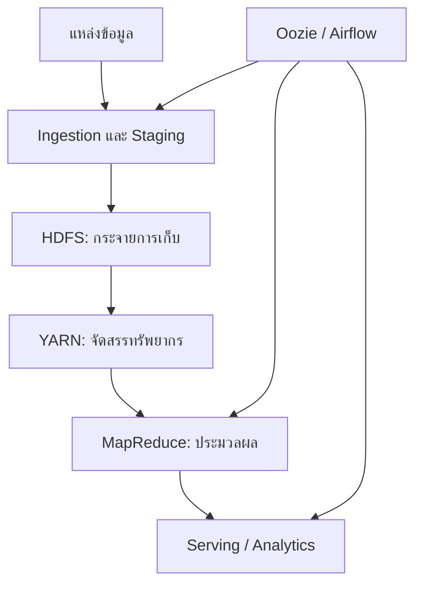

# บทที่ 01.1: Big Data Foundations, Workflow และ Data Lake

> **จากเอกสาร:** dads6002_01_hadoop.pdf หน้า 1–10  
> บทนี้สร้างพื้นฐานก่อนเข้าสู่ Hadoop โดยอธิบายจากปัญหาทางข้อมูลไปสู่การออกแบบ pipeline และ architecture

> [← สารบัญ](000_readme.md) | [บทที่ 01.2: HDFS และ YARN →](012_hdfs_and_yarn.md)

## ภาพรวมและขอบเขต

บทเรียนเริ่มจากเหตุผลที่ระบบข้อมูลแบบเดิมรองรับ Big Data ได้ยาก แล้วค่อยไล่จากวงจรงานข้อมูล สถาปัตยกรรม Lambda และ Data Lake ไปสู่แกนหลักของ Hadoop ได้แก่

- **HDFS** — กระจายการจัดเก็บไฟล์ขนาดใหญ่และทนต่อความเสียหายของเครื่อง
- **YARN** — จัดสรรทรัพยากรและควบคุมการรันแอปพลิเคชันในคลัสเตอร์
- **MapReduce** — แบบจำลองประมวลผลข้อมูลแบบขนานด้วยคู่ `key-value`
- **Hadoop Streaming** — ใช้ภาษาอื่น เช่น Python เขียน Mapper/Reducer ผ่าน `stdin/stdout`
- **Workflow orchestration** — เชื่อมหลายงานเป็น DAG ด้วย Oozie หรือ Airflow

แก่นของบทเรียนไม่ใช่การจำชื่อเครื่องมือ แต่คือหลักคิดว่า **ย้ายการคำนวณไปใกล้ข้อมูล แบ่งงานเป็นส่วนย่อย ยอมรับว่าเครื่องเสียได้ และออกแบบให้ระบบกู้คืนได้อัตโนมัติ**

## Learning Objectives ประจำบท

เมื่อเรียนจบบทนี้ควรทำได้ดังนี้

1. จำแนก structured, semi-structured และ unstructured data จากตัวอย่างใหม่ได้
2. วิเคราะห์ 5Vs แล้วแปลงเป็นข้อกำหนดด้าน latency, quality, storage และ governance ได้
3. ติดตามข้อมูลหนึ่งรายการผ่าน ingestion, staging, computation และ serving พร้อมออกแบบ validation checks ได้
4. เปรียบเทียบ batch, speed layer และแนวทาง unified processing ตาม SLA และ late data ได้
5. ออกแบบ Data Lake zones และ metadata ขั้นต่ำเพื่อป้องกัน data swamp ได้

## พื้นฐานที่ต้องรู้ก่อน

- Linux shell เบื้องต้น: path, pipe (`|`), redirect (`>`/`>>`), permission
- แนวคิดฐานข้อมูล: table, schema, transaction และ query latency
- ความต่างเบื้องต้นระหว่าง batch (ทำเป็นรอบ) กับ event (เกิดเป็นรายการต่อเนื่อง)
- ไม่จำเป็นต้องรู้ Hadoop มาก่อน เพราะบทนี้เป็นพื้นฐานสำหรับบทที่ 01.2

## แผนขอบเขตและระดับความลึก

| ระดับ | หัวข้อ |
|---|---|
| Core | Big Data Workflow, Lambda Architecture, Data Lake design |
| Supporting | Data types, 5Vs, Data Product, Data Science Pipeline |
| Reference | ชื่อ ingestion/compute tools ใน Hadoop ecosystem |

## Concept Map

## จากข้อมูลทั่วไปสู่ Big Data

ก่อนจำคำว่า 5Vs ให้เริ่มจากสถานการณ์เดียวที่จะพาเราไปตลอดทั้งชุดบทเรียน สมมติว่าเครือร้านยาต้องการตอบสามคำถามพร้อมกัน: วันนี้ขายอะไรไปบ้าง สาขาใดควรเติมสินค้า และมีรายการใดผิดปกติ ข้อมูลตั้งต้นไม่ได้อยู่ในที่เดียว รายการขายอยู่ในฐานข้อมูล สต็อกส่งมาเป็นไฟล์ พฤติกรรมผู้ใช้อยู่ใน log และภาพใบเสร็จเป็นไฟล์รูป หากมีเพียงไม่กี่สาขา คนหนึ่งอาจรวมไฟล์ในเครื่องแล้วคำนวณได้ แต่เมื่อจำนวนสาขาและเหตุการณ์เพิ่มขึ้น งานเดียวกันเริ่มช้า ตรวจสอบย้อนกลับยาก และล้มได้เมื่อเครื่องเดียวมีปัญหา

ตรงนี้คือสะพานจาก “มีข้อมูล” ไปสู่ “มีปัญหาระบบข้อมูล” สิ่งที่ต้องขยายไม่ใช่เพียงพื้นที่ดิสก์ แต่รวมถึงวิธีรับข้อมูลหลายรูปแบบ วิธีรักษาประวัติ วิธีแบ่งงานให้หลายเครื่อง และวิธีพิสูจน์ว่าผลลัพธ์ยังถูกต้อง แนวคิด Big Data จึงเริ่มจากข้อจำกัดของวิธีเดิม แล้วจึงนำเราไปหา workflow, storage และ computation ที่เหมาะสม ไม่ควรเริ่มจากเลือก Hadoop ก่อนรู้ว่าปัญหาคืออะไร

### Big Data คืออะไร

**คำอธิบายพื้นฐาน:** Big Data คือ **สภาวะของปัญหาข้อมูล** ที่ขนาด ความเร็ว ความหลากหลาย หรือข้อจำกัดด้านคุณภาพทำให้วิธีจัดเก็บและประมวลผลแบบเดิมไม่ตอบโจทย์ภายใต้เวลา ต้นทุน หรือความน่าเชื่อถือที่ต้องการ มันไม่ใช่ชื่อผลิตภัณฑ์ และไม่ใช่เพียง “ไฟล์ใหญ่มาก” เพราะข้อมูลไม่ใหญ่มากแต่ไหลเข้าตลอดเวลาและต้องตอบภายในวินาทีก็เป็นโจทย์ Big Data ได้

Input อาจเป็นธุรกรรม log sensor ข้อความ หรือภาพ ส่วน output ที่ต้องการอาจเป็นตารางวิเคราะห์ feature ของโมเดล alert หรือ data product ผู้เกี่ยวข้องมีทั้งผู้ผลิตข้อมูล ทีมแพลตฟอร์ม นักวิเคราะห์/นักวิทยาศาสตร์ข้อมูล และผู้ใช้ผลลัพธ์ วิธีแก้จึงไม่ใช่เพิ่มเครื่องเสมอไป แต่ต้องเริ่มจาก SLA, data quality, governance และคุณค่าที่ต้องการ

**ตัวอย่างเล็กที่สุด:** ร้านหนึ่งมีใบเสร็จวันละ 100 ใบ Excel อาจเพียงพอ แต่แพลตฟอร์มส่งอาหารรับคำสั่งซื้อ ตำแหน่งไรเดอร์ และเหตุการณ์จากแอปหลายล้านรายการต่อเนื่อง ต้องเก็บย้อนหลังและคำนวณ ETA เร็ว ความยากจึงเกิดพร้อมกันจากปริมาณ ความเร็ว รูปแบบ และความถูกต้อง ไม่ใช่ขนาดไฟล์อย่างเดียว

### ประเภทของข้อมูล

**จากเอกสาร (หน้า 1)**

| ประเภท | ลักษณะ | ตัวอย่าง |
|---|---|---|
| Structured | โครงสร้างตายตัว เป็นแถว/คอลัมน์ | ตารางธุรกรรม, RDBMS |
| Semi-structured | มี tag/key ช่วยบอกโครงสร้าง แต่ยืดหยุ่น | JSON, XML, log |
| Unstructured | ไม่มี schema ตารางที่ชัดเจน | ข้อความ, ภาพ,เสียง,วิดีโอ |

**คำอธิบายเพิ่มเติม:** ประเภทข้อมูลไม่ได้ตัดสินจากนามสกุลไฟล์เพียงอย่างเดียว แต่ดูว่าเครื่องสามารถตีความโครงสร้างได้มากเพียงใด เช่น ข้อความใน JSON มีโครงสร้างระดับ key แต่ค่าภายในอาจเป็นข้อความอิสระ การเก็บทุกอย่างใน Data Lake ไม่ได้แปลว่าไม่ต้องมี governance; ยิ่ง schema ยืดหยุ่น ยิ่งต้องมี metadata, data quality และสิทธิ์เข้าถึงที่ชัดเจน

ความสัมพันธ์ระหว่าง “ชนิดข้อมูล” กับ “สถาปัตยกรรม” คือ ยิ่งข้อมูลมีรูปแบบต่างกันมาก เรายิ่งไม่ควรบังคับให้ทุกอย่างผ่านตารางแบบเดียวตั้งแต่จุดรับเข้า ร้านยาจึงอาจเก็บธุรกรรมเดิมและภาพใบเสร็จไว้ก่อน แล้วค่อยสร้างตารางมาตรฐานสำหรับการวิเคราะห์ภายหลัง อย่างไรก็ตาม ความยืดหยุ่นนี้มีราคา: ถ้าไม่มีคำอธิบาย schema, เจ้าของข้อมูล และกฎคุณภาพ ผู้ใช้จะไม่รู้ว่าไฟล์ใดเชื่อถือได้ นี่คือเหตุผลที่ Variety ต้องถูกอ่านคู่กับ Veracity และ governance

### Big Data 5Vs

**จากเอกสาร (หน้า 2)**

- **Volume:** ปริมาณข้อมูลมาก
- **Velocity:** เกิดและต้องประมวลผลเร็ว
- **Variety:** หลายรูปแบบและหลายแหล่ง
- **Veracity:** ความน่าเชื่อถือ/คุณภาพไม่สม่ำเสมอ
- **Value:** ต้องเปลี่ยนข้อมูลให้เป็นคุณค่าทางธุรกิจ

**ตัวอย่าง:** ระบบส่งอาหารมี Volume จากธุรกรรมจำนวนมาก, Velocity จากตำแหน่งไรเดอร์, Variety จากคำสั่งซื้อ/ข้อความ/ภาพ, Veracity จาก GPS ที่คลาดเคลื่อน และ Value จากการลดเวลาจัดส่ง จุดสำคัญคือข้อมูล “ใหญ่” ไม่จำเป็นต้องเด่นทุก V พร้อมกัน; ข้อมูลไม่มากแต่ไหลเร็วมากก็ต้องใช้สถาปัตยกรรมเฉพาะได้

### Data Product และ Data Science Pipeline

**จากเอกสาร (หน้า 3–4)** ยกตัวอย่าง Amazon, Facebook และรถอัตโนมัติเป็นผลิตภัณฑ์ที่ใช้ข้อมูล และนำเสนอ Data Science เป็นศาสตร์ผสม พร้อม pipeline ตั้งแต่รวบรวมข้อมูลไปจนถึงสร้างคุณค่า

**คำอธิบายเพิ่มเติม:** Data product คือผลิตภัณฑ์หรือฟังก์ชันที่พฤติกรรมหลักขึ้นกับข้อมูล เช่น recommendation, fraud detection หรือ ETA ไม่ใช่เพียง dashboard หนึ่งหน้า Pipeline ที่ดีต้องมี feedback loop: ผลทำนายจริงถูกบันทึกกลับมาเพื่อวัด drift และปรับปรุงโมเดล

## Big Data Workflow, Lambda Architecture และ Data Lake

### Big Data Workflow

**จากเอกสาร (หน้า 5–6)** แบ่งงานหลักเป็น ingestion, staging/storage, computation และ workflow management โดยมีเครื่องมือใน ecosystem รับผิดชอบแต่ละช่วง

| ขั้น | คำถามออกแบบ | ตัวอย่างเทคโนโลยีในบริบท Hadoop |
|---|---|---|
| Ingestion | รับข้อมูลแบบ batch หรือ event? รับซ้ำได้ไหม? | Sqoop, Flume, Kafka |
| Staging/Storage | เก็บดิบหรือแปลงก่อน? partition อย่างไร? | HDFS, Hive |
| Computation | ต้องการ throughput หรือ latency? | MapReduce, Spark |
| Serving | ผู้ใช้ query แบบใด? | Hive, HBase, search/BI |
| Orchestration | dependency, retry, schedule เป็นอย่างไร? | Oozie, Airflow |

**คำอธิบายเพิ่มเติม:** Sqoop และ Flume มีความสำคัญทางประวัติศาสตร์ แต่ระบบสมัยใหม่มักใช้ CDC, managed ingestion, object storage และ event streaming แทน หลักออกแบบยังเหมือนเดิม: idempotency, schema evolution, checkpoint, observability และการย้อนประมวลผล

เหตุที่ต้องแยก workflow เป็นหลายช่วง เพราะแต่ละช่วงตอบคำถามคนละชนิด Ingestion ถามว่า “รับมาได้ครบหรือยัง” Storage ถามว่า “เก็บที่ไหนและย้อนกลับได้หรือไม่” Computation ถามว่า “จะแปลงข้อมูลอย่างไร” Serving ถามว่า “ใครต้องใช้ผลและเร็วเพียงใด” ส่วน orchestration ถามว่า “ขั้นใดต้องรอขั้นใดและล้มแล้วกู้คืนอย่างไร” หากรวมทุกอย่างเป็นสคริปต์ก้อนเดียว เราจะรู้เพียงว่าสคริปต์ล้ม แต่ไม่รู้ว่าข้อมูลขาด การคำนวณผิด หรือการเผยแพร่มีปัญหา การแบ่งเป็นช่วงจึงสร้างทั้งความรับผิดชอบและจุดตรวจสอบ

#### ติดตามข้อมูลหนึ่งรายการผ่าน workflow

สมมติสาขาร้านยาส่งรายการขาย `TX1001` เวลา 10:05 น. ขั้น ingestion ต้องรับรายการและเพิ่ม metadata เช่น source, ingestion time และ unique transaction ID หาก network ทำให้ส่งซ้ำ ระบบต้องใช้ ID เดิมตรวจ duplicate แทนการนับเป็นยอดขายสองครั้ง จากนั้น staging เก็บสำเนาดิบเพื่อ audit และ replay โดยยังไม่แก้ค่าเดิมเงียบ ๆ

Computation อ่านรายการที่ผ่าน validation ไปคำนวณยอดรายสาขา ถ้า product code ไม่มีใน master data ควรแยกเป็น rejected/quarantine record พร้อมเหตุผล ไม่ใช่ทิ้งโดยไม่บอก Serving layer จึงได้รับเฉพาะผลที่ผ่านกฎ ส่วน workflow management บันทึกว่าแต่ละขั้นใช้ input version ใด จำนวนเข้า/ออกเท่าไร และ retry กี่ครั้ง ตัวอย่างนี้ทำให้เห็นว่า pipeline ไม่ใช่เพียงการย้ายไฟล์ แต่เป็นการรักษาความถูกต้องและ traceability ตลอดทาง

การตรวจที่ควรมีอย่างน้อยคือ `source_count = accepted_count + rejected_count`, transaction ID ไม่ซ้ำ, amount อยู่ในช่วงที่ยอมรับ และ business total ก่อน/หลัง transformation reconcile ได้ การรันสำเร็จโดยไม่เกิด error ยังไม่พิสูจน์ว่าข้อมูลถูกต้อง

### Lambda Architecture

**จากเอกสาร (หน้า 7–9)** สถาปัตยกรรม Lambda แยกเป็น

1. **Batch layer** เก็บข้อมูลหลักและคำนวณผลที่ถูกต้องครบถ้วน
2. **Speed layer** ประมวลผลข้อมูลใหม่ด้วย latency ต่ำ
3. **Serving layer** รวมผลเพื่อให้ผู้ใช้ query

**ตัวอย่าง:** ยอดขายวันนี้แสดงจาก stream ทุกนาที ขณะที่ batch job คำนวณยอดย้อนหลังใหม่ทุกคืนเพื่อแก้ event ที่มาช้า

**คำอธิบายเพิ่มเติม:** ข้อดีคือได้ทั้งความเร็วและความแม่นยำ แต่ต้องดูแล logic สองชุด จึงเสี่ยงให้ผล batch/stream ไม่ตรงกัน แนวทาง Kappa หรือ unified streaming engine ลดความซ้ำซ้อนโดยใช้เส้นทางประมวลผลหลักชุดเดียว การเลือกขึ้นกับ SLA, late data, ความสามารถ replay และต้นทุนการปฏิบัติการ

#### กลไก reconciliation ทีละขั้น

เวลา 10:05 speed layer รับยอดขาย 100 บาทและ dashboard แสดงทันที ต่อมา 10:20 มี correction ยกเลิกรายการเดิม แต่ event มาถึงช้า หาก speed layer ไม่รองรับ correction dashboard อาจยังแสดง 100 บาท Batch layer ซึ่งอ่าน immutable history ตอนกลางคืนสามารถคำนวณใหม่เป็น 0 บาทและแทนที่ serving view ที่คลาดเคลื่อน

จุดออกแบบสำคัญจึงไม่ใช่เพียงมีสอง layers แต่ต้องกำหนดว่า output ใด authoritative, ใช้ key ใด merge ผล, late event ย้อนแก้ช่วงเวลาใด และผู้ใช้ยอมรับความคลาดเคลื่อนชั่วคราวได้นานเท่าไร หาก business logic สองชุดต่างกัน แม้ข้อมูลเข้าเหมือนกันก็อาจ reconcile ไม่ได้ นี่เป็นต้นทุนการบำรุงรักษาหลักของ Lambda Architecture

| เงื่อนไข | แนวทางที่เหมาะกว่า |
|---|---|
| ต้องตอบเร็วและยอมให้ผลชั่วคราวได้ | Speed layer พร้อม batch correction |
| รายงานกฎหมาย/การเงินต้องครบก่อนเผยแพร่ | Batch ที่ผ่าน reconciliation |
| Engine รองรับ replay และ logic ชุดเดียว | Unified/Kappa-style processing อาจลดความซ้ำซ้อน |
| ทีมเล็กและ SLA ไม่ต่ำมาก | Batch แบบง่ายมักดูแลง่ายกว่า Lambda |

### Data Lake

**จากเอกสาร (หน้า 10)** Data Lake เป็นแหล่งรวมข้อมูลหลายรูปแบบในระดับใหญ่ เพื่อให้ผู้ใช้หลายกลุ่มนำไปประมวลผลต่อได้

**คำอธิบายเพิ่มเติม:** Data Lake ไม่เท่ากับ HDFS เสมอไป—บน cloud มักเป็น object storage และอาจเพิ่ม table format/transaction layer กลายเป็น lakehouse หากไม่มี catalog, owner, quality rule, lineage และ lifecycle policy จะกลายเป็น “data swamp” ที่ค้นหาและเชื่อถือไม่ได้

Data Lake ควรแยก logical zones ตามหน้าที่ เช่น raw/bronze เก็บข้อมูลต้นทางเพื่อ replay, validated/silver เก็บข้อมูลที่ผ่าน schema และ quality rules และ curated/gold เตรียมตาม business grain สำหรับผู้ใช้ปลายทาง แนวทางแบ่งคุณภาพเพิ่มขึ้นตาม zones สอดคล้องกับ [Microsoft Data Engineering Playbook](https://learn.microsoft.com/en-us/data-engineering/playbook/solutions/modern-data-warehouse/) ชื่อ zone ไม่สำคัญเท่ากับ contract ว่าข้อมูลแต่ละชั้นผ่านอะไรมาแล้ว การ copy ไฟล์จาก raw ไป gold โดยไม่มี validation ไม่ได้เพิ่มความน่าเชื่อถือ

ตัวอย่างยอดขายร้านยาควรมี owner, schema version, business date, ingestion timestamp, source system, sensitivity classification, retention period และ lineage ไปยังรายงาน หากยอด dashboard ผิด ทีมจึงย้อนจาก metric ไปยัง curated table, transformation run และ raw transaction ได้ หากไม่มี metadata เหล่านี้ Data Lake จะเก็บข้อมูลได้มากแต่ตอบไม่ได้ว่าชุดใดควรใช้

## สะพานจาก Data Lake ไปสู่ Hadoop

เมื่อออกแบบ Data Lake แล้ว เรายังเหลือคำถามเชิงกลไกสองข้อ ข้อแรกคือไฟล์จำนวนมากจะถูกเก็บอย่างไรเมื่อดิสก์หรือเครื่องบางตัวเสีย ข้อที่สองคือเมื่อหลายทีมต้องคำนวณพร้อมกัน ใครจะจัดสรร CPU และหน่วยความจำให้แต่ละงาน Hadoop ตอบคำถามแรกด้วย HDFS และตอบคำถามที่สองด้วย YARN ดังนั้น HDFS/YARN ไม่ได้โผล่มาเป็นรายชื่อเทคโนโลยีใหม่ แต่เป็นคำตอบของข้อจำกัดที่เกิดขึ้นหลังจากเราตัดสินใจเก็บและประมวลผลข้อมูลในระดับคลัสเตอร์

ให้จำความสัมพันธ์นี้ไว้: Data Lake เป็นแนวคิดเรื่องแหล่งรวมและวงจรชีวิตข้อมูล ส่วน HDFS เป็นเทคโนโลยีจัดเก็บแบบกระจายที่อาจใช้รองรับ Data Lake ในระบบ Hadoop รุ่นดั้งเดิม ทั้งสองคำจึงไม่ใช่คำพ้องกัน บทถัดไปจะตามไฟล์ยอดขายหนึ่งไฟล์ตั้งแต่วางลง HDFS แบ่งเป็น blocks ทำสำเนา และขอทรัพยากรจาก YARN เพื่อเตรียมประมวลผล

## Guided Design Lab: ออกแบบ Sales Data Lake

### โจทย์และข้อมูลตัวอย่าง

ร้านยา 3 สาขาส่งไฟล์ `sales_YYYYMMDD.csv` ทุกคืน และส่ง cancellation events ระหว่างวัน Dashboard ต้องเห็นยอดประมาณการภายใน 5 นาที แต่ยอดปิดวันต้องตรง Finance

### ลงมือทำตาม Practicality Ladder

1. **Explain:** ระบุ 5Vs ที่มีผลต่อโจทย์ โดยห้ามตอบเพียงรายชื่อ V ต้องเชื่อมกับ design requirement
2. **Trace:** ติดตาม `TX1001` จาก event → raw zone → validation → aggregate → dashboard และระบุ metadata ที่เพิ่มแต่ละจุด
3. **Design:** วาด batch/speed/serving paths และกำหนด source of truth หลังปิดวัน
4. **Modify:** เพิ่มเงื่อนไข cancellation มาช้า 2 วัน แล้วปรับ backfill/reconciliation policy
5. **Diagnose:** สมมติ dashboard = 1,020,000 บาท แต่ batch = 1,000,000 บาท ให้ลำดับการตรวจ duplicate, late event, timezone และ logic version
6. **Validate:** กำหนด checks ได้แก่ source count, duplicate transaction ID, accepted/rejected reconciliation และ amount totals
7. **Transfer:** ปรับ design ไปใช้กับ inventory movement ซึ่งมี stock correction ย้อนหลัง

### ผลงานและเกณฑ์ผ่าน

ส่ง diagram หนึ่งภาพ, data contract หนึ่งตาราง และเหตุผลเลือก architecture ไม่เกินหนึ่งหน้า ถือว่าผ่านเมื่ออธิบายได้ว่า latency กับ correctness ขัดกันตรงไหน, rerun อย่างไร และข้อมูลใด authoritative

## Validation และ Troubleshooting

| อาการ | สมมติฐานที่ควรตรวจ | หลักฐาน |
|---|---|---|
| ยอด stream สูงกว่า batch | duplicate/reversal มาช้า | transaction ID และ event type |
| ไฟล์อยู่ใน Lake แต่หาไม่พบ | catalog/partition metadata ขาด | path, partition, registration log |
| schema เปลี่ยนแล้ว pipeline ล้ม | producer เพิ่ม/เปลี่ยน field | schema version และ rejected records |
| รายงานแต่ละทีมไม่ตรงกัน | grain/business rule ต่าง | metric definition และ lineage |

## Progressive Practice และเฉลย

**Guided:** ข้อมูล 20 GB/วันแต่ต้องแจ้ง fraud ภายใน 5 วินาที V ใดเด่นที่สุด?  
**เฉลย:** Velocity เพราะ SLA บังคับให้ประมวลผลเร็ว แม้ Volume มีผลต่อ storage แต่ไม่ใช่ตัวขับ architecture หลักของ alert นี้

**Analyze:** หาก batch และ stream ใช้ business rule คนละ version จะเกิดอะไร?  
**เฉลยพร้อมเหตุผล:** ผลสองเส้นทางต่างกันแม้ input เดียวกัน การ reconcile ด้วยการแทนค่าปลายทางอย่างเดียวซ่อน root cause ต้อง version logic, ทดสอบด้วย golden dataset และกำหนดว่า batch หรือ corrected stream เป็น authoritative

**Transfer:** ออกแบบ metadata ขั้นต่ำของ raw zone  
**แนวคำตอบ:** owner/source เพื่อรับผิดชอบ, schema/version เพื่ออ่านซ้ำ, event/ingestion time เพื่อจัดการ late data, sensitivity เพื่อควบคุมสิทธิ์, retention เพื่อ lifecycle และ lineage/run ID เพื่อย้อนผลลัพธ์ การให้เพียงชื่อ field โดยไม่อธิบายการใช้ได้คะแนนไม่เต็ม

## Mastery Checklist

- [ ] แปลงแต่ละ V เป็น design consequence พร้อมตัวอย่างได้
- [ ] trace transaction ผ่าน workflow และระบุ validation checkpoints ได้
- [ ] อธิบาย reconciliation ของ late/corrected events ได้
- [ ] เลือก batch, Lambda หรือ unified approach พร้อม trade-off ได้
- [ ] ออกแบบ Lake zones, metadata และ lineage ที่ audit ได้

## Glossary และ Source Coverage

| คำ | ความหมาย |
|---|---|
| Ingestion | การรับข้อมูลเข้าสู่ platform |
| Staging | พื้นที่พัก/เตรียมข้อมูลก่อนประมวลผลหลัก |
| Late event | เหตุการณ์ที่มาถึงหลังช่วงเวลาที่คาด |
| Reconciliation | การเทียบและอธิบายความต่างจนได้ผลที่เชื่อถือได้ |
| Lineage | เส้นทางจากแหล่งข้อมูลผ่าน transformations ไปผลลัพธ์ |

ครอบคลุม PDF หน้า 1–4 ในส่วน Data/5Vs/Data Product และหน้า 5–10 ในส่วน Workflow/Lambda/Data Lake ภาพหน้า 7–9 ใช้ยืนยันความสัมพันธ์ของ layers โดยไม่มีส่วนอ่านไม่ได้

## References

- เอกสารหลัก หน้า 1–10
- [Apache Hadoop HDFS Architecture](https://hadoop.apache.org/docs/current/hadoop-project-dist/hadoop-hdfs/HdfsDesign.html)
