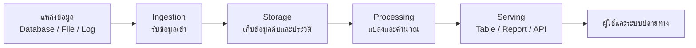
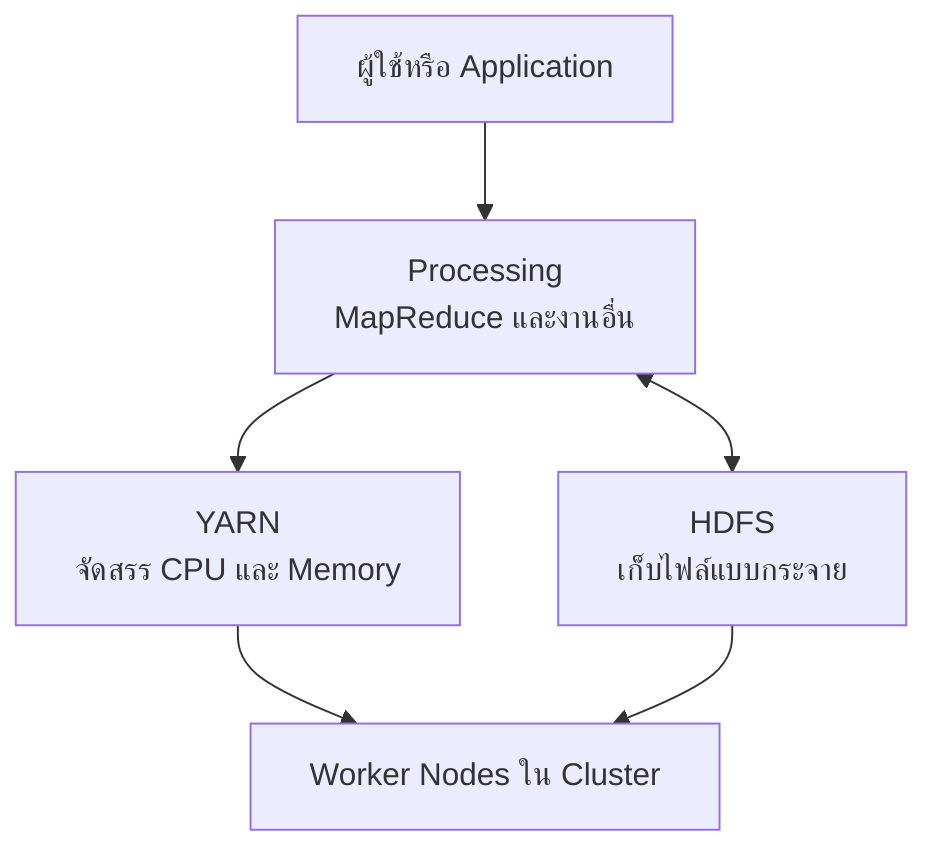
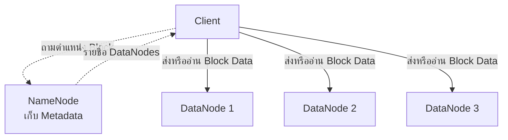
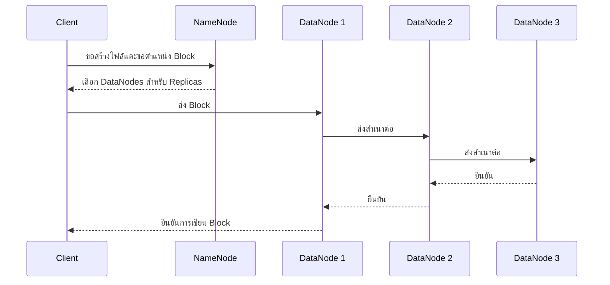
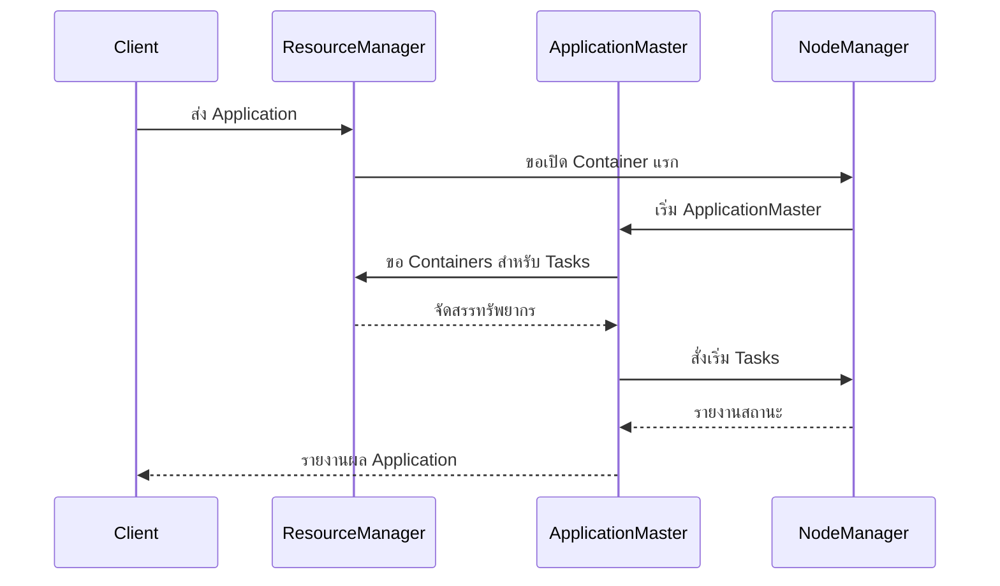
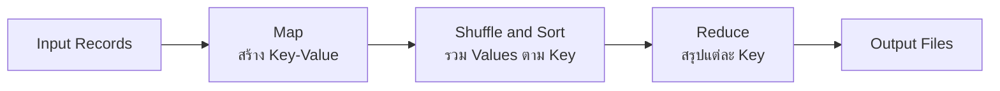
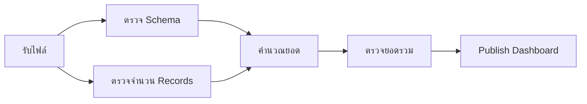

# 01 — Hadoop: จากปัญหา Big Data สู่ระบบจัดเก็บและประมวลผลแบบกระจาย

[← กลับสู่ Course Syllabus](00_course_syllabus.md)

บทนี้เริ่มจากคำถามง่าย ๆ ว่า ถ้าข้อมูลของเครือโรงพยาบาลเพิ่มจากไฟล์ไม่กี่ชุดเป็นธุรกรรมหลายปีจากหลายสิบแห่ง เหตุใดเราจึงไม่ซื้อเครื่องที่ใหญ่ขึ้นแล้วทำงานแบบเดิมต่อไป คำตอบไม่ได้อยู่ที่ขนาดของข้อมูลเพียงอย่างเดียว แต่รวมถึงความเร็วที่ข้อมูลไหลเข้ามา รูปแบบที่หลากหลาย ความน่าเชื่อถือของข้อมูล และความจำเป็นที่ระบบต้องทำงานต่อได้เมื่อเครื่องบางส่วนเสีย

เราจะใช้สถานการณ์เดียวตลอดบท สมมติเครือโรงพยาบาลรวบรวมรายการจัดซื้อจากทุกโรงพยาบาลเป็นไฟล์ขนาดใหญ่ ต้องเก็บข้อมูลย้อนหลังอย่างปลอดภัย คำนวณยอดจัดซื้อต่อโรงพยาบาล และรันกระบวนการนี้ซ้ำทุกวัน เส้นทางนี้จะพาเราไปรู้จัก Big Data, Data Lake, Hadoop, HDFS, YARN, MapReduce และ Workflow Orchestration ตามลำดับที่แต่ละแนวคิดเข้ามาแก้ปัญหา

## 1. เมื่อปัญหาข้อมูลไม่ใช่แค่ “ไฟล์ใหญ่”

**คำถามนำ:** เราจะรู้ได้อย่างไรว่าปัญหาที่พบเป็น Big Data ไม่ใช่เพียงไฟล์ที่มีขนาดใหญ่ขึ้น?

ในช่วงแรก องค์กรอาจดึงข้อมูลจากฐานข้อมูลมาเป็นไฟล์ แล้วใช้เครื่องหนึ่งเครื่องรวมและคำนวณผล วิธีนี้เรียบง่ายและเหมาะกับงานขนาดเล็ก แต่เมื่อข้อมูลเพิ่มขึ้นจะพบข้อจำกัดพร้อมกันหลายด้าน เครื่องอาจมีพื้นที่ไม่พอ การอ่านไฟล์ใช้เวลานาน งานล้มกลางทางแล้วต้องเริ่มใหม่ และหาก disk เสียอาจสูญข้อมูลทั้งหมด

คำว่า **Big Data** จึงไม่ได้หมายถึงตัวเลขขนาดตายตัว แต่หมายถึงสถานการณ์ที่ปริมาณ ลักษณะ หรือความเร็วของข้อมูลทำให้วิธีจัดเก็บและประมวลผลเดิมไม่ตอบโจทย์อีกต่อไป การพิจารณาแบบ **5Vs** ช่วยแยกปัญหาออกเป็นห้ามิติ

| มิติ | คำถามที่ควรถาม | ตัวอย่างในงานจัดซื้อโรงพยาบาล |
|---|---|---|
| Volume | มีข้อมูลมากเพียงใดและโตเร็วแค่ไหน | รายการ PO และ GR ย้อนหลังหลายปี |
| Velocity | ข้อมูลเข้ามาเร็วเพียงใดและต้องตอบเร็วแค่ไหน | เหตุการณ์สต็อกและการรับสินค้าเกิดตลอดวัน |
| Variety | มีรูปแบบข้อมูลกี่ชนิด | ตารางธุรกรรม, CSV, log, JSON และเอกสาร |
| Veracity | เชื่อถือข้อมูลได้เพียงใด | รหัสโรงพยาบาลหาย หน่วยนับไม่ตรง และรายการซ้ำ |
| Value | การประมวลผลช่วยตัดสินใจอะไร | ควบคุมต้นทุน วางแผนสต็อก และติดตาม supplier |

5Vs ไม่ใช่รายการที่ต้องท่องแยกจากกัน แต่เป็นสะพานจากปัญหาธุรกิจไปสู่ข้อกำหนดของระบบ ตัวอย่างเช่น Volume สูงทำให้ต้องกระจาย storage, Velocity สูงทำให้ต้องพิจารณา latency, Variety สูงทำให้ต้องเก็บข้อมูลหลายรูปแบบ, Veracity ทำให้ต้องมี validation และ lineage ส่วน Value เตือนว่าโครงการ Big Data ไม่ได้สำเร็จเพราะเก็บข้อมูลได้มาก แต่สำเร็จเมื่อข้อมูลนั้นนำไปใช้ได้จริง

ข้อมูลที่เข้าสู่ระบบอาจเป็น **structured data** ซึ่งมีโครงสร้างแถวและคอลัมน์ชัดเจน, **semi-structured data** เช่น JSON หรือ XML ที่มีป้ายกำกับแต่แต่ละ record อาจไม่เหมือนกันทั้งหมด และ **unstructured data** เช่นข้อความ รูปภาพ เสียง หรือเอกสาร คำเหล่านี้ไม่ได้บอกว่าข้อมูลชนิดใดดีกว่า แต่บอกว่าระบบต้องใช้กติกาในการอ่านและตรวจสอบต่างกัน

## 2. จากข้อมูลดิบไปสู่ Data Product

**คำถามนำ:** เมื่อเก็บข้อมูลได้แล้ว ต้องเกิดอะไรขึ้นต่อจึงจะเปลี่ยนข้อมูลดิบให้เป็นสิ่งที่ผู้ใช้ตัดสินใจจากมันได้?

ข้อมูลจำนวนมากไม่มีคุณค่าด้วยตัวเอง องค์กรต้องนำข้อมูลผ่านกระบวนการตั้งแต่รับเข้ามา จัดเก็บ ทำความสะอาด คำนวณ ตรวจสอบ และส่งผลให้ผู้ใช้ กระบวนการนี้เรียกว่า **Data Workflow** ส่วนผลลัพธ์ที่ผู้ใช้สามารถนำไปตัดสินใจหรือทำงานต่อได้ เช่น dashboard, recommendation หรือ API อาจเรียกว่า **Data Product**

ภาพต่อไปนี้เป็นแผนที่ของบท ให้เริ่มอ่านจากซ้ายไปขวา ลูกศรหมายถึงการเคลื่อนและเปลี่ยนสภาพของข้อมูล กล่อง Storage คือจุดเก็บข้อมูล ส่วน Processing คือการคำนวณ ไม่ใช่สถานที่เก็บข้อมูลถาวร



ในเอกสารต้นฉบับ ขั้นตอน Ingestion รับข้อมูลจากแหล่งต่าง ๆ ส่วน Staging เตรียมข้อมูลให้พร้อมใช้ เช่นทำรูปแบบให้สม่ำเสมอและจัดการข้อมูลผิดปกติ จากนั้น Computation สร้างผลหรือ model และ Workflow Management ควบคุมให้งานแต่ละส่วนทำตามลำดับที่ถูกต้อง

แนวคิด **Data Lake** เกิดขึ้นเมื่อองค์กรต้องการเก็บข้อมูลดิบและข้อมูลที่ผ่านการแปลงแล้วหลายรูปแบบไว้ในแหล่งกลาง โดยไม่บังคับให้ทุกชุดต้องแปลงเป็นตารางสมบูรณ์ก่อนจึงจะเก็บได้ จุดสำคัญคือ Data Lake ไม่ได้แปลว่าโยนไฟล์ทุกอย่างลง directory เดียว หากไม่มี metadata, ownership, naming, quality rule และ lifecycle ข้อมูลจะค้นหาและเชื่อถือได้ยากจนกลายเป็น **data swamp**

สำหรับตัวอย่างของเรา อาจแบ่งพื้นที่เป็นสามระดับ:

- `raw` เก็บสำเนาข้อมูลที่รับเข้ามาโดยรักษาหลักฐานต้นทาง
- `curated` เก็บข้อมูลที่ผ่านการตรวจ schema, deduplicate และทำมาตรฐานแล้ว
- `serving` เก็บผลรวมที่พร้อมใช้ เช่นยอดจัดซื้อต่อโรงพยาบาลต่อเดือน

Data Lake อธิบายการจัดวางข้อมูลในเชิงสถาปัตยกรรม แต่ยังไม่ตอบว่าไฟล์ขนาดใหญ่มากจะถูกเก็บบนเครื่องใด หรือจะเกิดอะไรเมื่อเครื่องนั้นเสีย ปัญหานี้พาเราเข้าสู่ Hadoop

### Lambda Architecture อยู่ตรงไหน

สไลด์นำเสนอ **Lambda Architecture** ซึ่งแยกการประมวลผลเป็น Batch Layer สำหรับคำนวณข้อมูลจำนวนมากอย่างครบถ้วน, Speed Layer สำหรับผลที่ต้องการเร็ว และ Serving Layer สำหรับให้ผู้ใช้เรียกผลจากสองทาง แนวคิดนี้แสดง trade-off ระหว่างความเร็วกับความครบถ้วนได้ดี แต่มีต้นทุนจากการดูแล logic สองสายและการ reconcile ผลลัพธ์

สิ่งที่ควรจำไม่ใช่ว่าทุกระบบต้องใช้ Lambda Architecture แต่คือคำถามออกแบบ: งานนี้ต้องการผลเร็วเพียงใด ยอมรับข้อมูลมาช้าได้หรือไม่ และจะทำให้ผล batch กับผลระหว่างวันสอดคล้องกันอย่างไร

## 3. Hadoop คืออะไร

**คำถามนำ:** Hadoop แก้ปัญหาใด และ HDFS, YARN กับ MapReduce แบ่งหน้าที่กันอย่างไร?

**Apache Hadoop** คือชุดซอฟต์แวร์สำหรับเก็บและประมวลผลข้อมูลแบบกระจายบนคลัสเตอร์ของเครื่องหลายเครื่อง Hadoop ไม่ใช่ฐานข้อมูลหนึ่งชนิด ไม่ใช่ระบบปฏิบัติการ และไม่ได้หมายถึง MapReduce เพียงอย่างเดียว

แกนที่เราต้องเข้าใจก่อนมีสองส่วน:

- **HDFS** รับผิดชอบการเก็บไฟล์แบบกระจาย
- **YARN** รับผิดชอบการจัดสรร CPU และ memory ให้งานที่ต้องรันบนคลัสเตอร์

จากนั้น **MapReduce** เป็นแบบแผนการแบ่งงานประมวลผลให้หลายเครื่องทำร่วมกัน ภาพต่อไปนี้แสดงความสัมพันธ์เชิงชั้น ไม่ได้แปลว่าข้อมูลทุกชิ้นต้องไหลผ่าน YARN ก่อนถึง HDFS: HDFS เป็น storage, YARN เป็น resource management และ processing framework ใช้ทรัพยากรที่ YARN จัดให้เพื่ออ่านหรือเขียนข้อมูลใน HDFS



Hadoop ออกแบบภายใต้ข้อเท็จจริงว่าเครื่องในคลัสเตอร์สามารถเสียได้ งานจึงต้องแบ่งเป็นส่วนย่อย ทำซ้ำหรือ retry ได้ และย้ายการคำนวณไปใกล้ข้อมูลเพื่อลดการส่งไฟล์ขนาดใหญ่ผ่าน network แนวคิดนี้ต่างจากการพยายามสร้างเครื่องเดียวที่ห้ามเสียโดยสิ้นเชิง

## 4. HDFS: ไฟล์หนึ่งไฟล์อยู่บนหลายเครื่องได้อย่างไร

**คำถามนำ:** ระบบจะทำให้ผู้ใช้เห็นไฟล์เดียว ทั้งที่ bytes ของไฟล์กระจายและมีสำเนาอยู่บนหลายเครื่องได้อย่างไร?

สมมติเรามีไฟล์รายการจัดซื้อขนาด 300 MB หากกำหนด block size เท่ากับ 128 MB ไฟล์จะถูกแบ่งเป็นสาม blocks:

$$
\lceil \frac{300}{128} \rceil = 3\mathrm{\ blocks}
$$

สอง blocks แรกมีขนาดประมาณ 128 MB และ block สุดท้ายประมาณ 44 MB คำว่า **Block** ใน HDFS คือหน่วยที่ระบบใช้จัดเก็บและติดตาม ไม่ได้หมายความว่าไฟล์ต้นฉบับกลายเป็นสามไฟล์ที่ผู้ใช้ต้องประกอบเอง ผู้ใช้ยังเห็นเป็นไฟล์เดียวผ่าน namespace ของ HDFS

### NameNode รู้ตำแหน่ง ส่วน DataNode เก็บ bytes

HDFS แยกหน้าที่ระหว่าง metadata กับข้อมูลจริงอย่างชัดเจน

- **NameNode** เก็บ metadata เช่น directory tree, ชื่อไฟล์, permission และ mapping ว่าแต่ละ block อยู่ที่ DataNode ใด
- **DataNode** เก็บ bytes ของ blocks บน disk และให้บริการอ่านหรือเขียน block

ให้เริ่มอ่านภาพจาก Client ด้านบน เส้นประหมายถึงคำขอ metadata ส่วนเส้นทึบหมายถึงการส่งข้อมูลจริง ข้อมูลไฟล์ไม่จำเป็นต้องวิ่งผ่าน NameNode เพราะหากทุก byte ต้องผ่านจุดเดียว NameNode จะกลายเป็นคอขวด



### ติดตามการเขียนไฟล์ 300 MB

เมื่อ Client ต้องการเขียนไฟล์ กระบวนการเชิงแนวคิดเป็นดังนี้:

1. Client ขอสร้างไฟล์กับ NameNode
2. NameNode ตรวจชื่อไฟล์ สิทธิ์ และเลือก DataNodes สำหรับ block แรก
3. Client แบ่งข้อมูลตาม block size แล้วส่ง block ไปยัง DataNode แรก
4. DataNode แรกส่งสำเนาต่อไปตาม replication pipeline
5. เมื่อ DataNodes เขียนข้อมูลสำเร็จ การยืนยันจะย้อนกลับมายัง Client
6. Client ทำแบบเดียวกันกับ blocks ถัดไป
7. เมื่อครบ NameNode บันทึกว่าไฟล์ประกอบด้วย blocks ใดบ้าง



ภาพนี้เป็นแบบย่อเพื่อแสดงเส้นทางหลัก รายละเอียดจริงมี checksum, packet และการจัดการ pipeline เมื่อ node ล้ม แต่แก่นคือ NameNode จัดการ metadata ขณะที่ Client ส่ง block data ไปยัง DataNodes โดยตรง

### Replication และความทนทานต่อความเสียหาย

ถ้า replication factor เท่ากับ 3 แต่ละ block มีสาม replicas บน DataNodes ที่ต่างกัน พื้นที่จัดเก็บเชิงประมาณของไฟล์ 300 MB จึงเป็น:

$$
300\text{ MB} \times 3 = 900\text{ MB}
$$

นี่คือการแลกพื้นที่กับ fault tolerance หาก DataNode หนึ่งหยุดทำงาน ระบบยังอ่าน replica อื่นได้ NameNode ใช้ **heartbeat** เพื่อตรวจว่า DataNode ยังตอบสนองและใช้ **block report** เพื่อทราบว่า node นั้นมี blocks ใด หาก replica ต่ำกว่าเป้าหมาย NameNode จะสั่งสร้างสำเนาเพิ่มบน DataNode อื่น

Replication ไม่ใช่ backup ทุกความหมาย หากผู้ใช้ลบไฟล์หรือเขียนข้อมูลผิด การเปลี่ยนแปลงอาจกระทบทุก replica เช่นกัน Backup, snapshot และ retention policy จึงเป็นคนละเรื่องกับ replication

Hadoop รุ่นใหม่ยังรองรับ **erasure coding** ซึ่งลด storage overhead เมื่อเทียบกับ replication โดยแบ่งข้อมูลและ parity เป็นหลายชิ้น แต่แลกกับการคำนวณและกระบวนการกู้คืนที่ซับซ้อนกว่า เหมาะกับข้อมูลขนาดใหญ่ที่อ่านมากและไม่เปลี่ยนบ่อย มากกว่าการแทน replication ในทุกกรณี

### การอ่านไฟล์และ Block ที่เสีย

เมื่ออ่านไฟล์ Client ขอ block locations จาก NameNode แล้วเลือกอ่านจาก DataNode ที่เหมาะสม หาก checksum ไม่ถูกต้องหรือ DataNode ใช้งานไม่ได้ Client สามารถลอง replica อื่นได้ การออกแบบนี้ทำให้ NameNode ไม่ต้องส่งข้อมูลจริง แต่ NameNode ยังสำคัญต่อการหา namespace และตำแหน่ง block

### FsImage, EditLog และ Secondary NameNode

NameNode ต้องรักษา metadata ของ filesystem ให้คงอยู่บน disk โดยใช้สองแนวคิดหลัก:

- **FsImage** เป็นภาพรวม metadata ณ checkpoint หนึ่ง
- **EditLog** บันทึกการเปลี่ยนแปลงที่เกิดหลังจากภาพรวมนั้น

เมื่อ NameNode เริ่มทำงาน มันอ่าน FsImage แล้ว replay EditLog เพื่อสร้างสถานะล่าสุด การปล่อยให้ EditLog โตไม่จำกัดทำให้ startup และ recovery ช้าลง จึงต้องมี checkpoint ที่รวมภาพเก่ากับรายการเปลี่ยนแปลง

**Secondary NameNode ไม่ใช่เครื่องสำรองที่เข้ารับงานแทนทันที** หน้าที่หลักคือช่วยทำ checkpoint ในสถาปัตยกรรมแบบดั้งเดิม หากต้องการลด single point of failure ของ NameNode ต้องใช้สถาปัตยกรรม High Availability ซึ่งมี Active/Standby NameNodes และกลไกประสาน metadata ที่เหมาะสม

### HDFS เหมาะกับงานแบบใด

HDFS เหมาะกับไฟล์ใหญ่ การอ่านต่อเนื่อง และงานแบบ write once/read many เพราะสามารถกระจาย block และประมวลผลใกล้ข้อมูลได้ดี แต่ไม่เหมาะกับการแก้ bytes ตรงกลางไฟล์แบบสุ่มหรือธุรกรรมเล็กจำนวนมากแบบ OLTP

ปัญหา **small files** เกิดเมื่อมีไฟล์ขนาดเล็กจำนวนมหาศาล แม้ bytes รวมไม่มาก แต่แต่ละไฟล์และ block ต้องมี metadata ใน NameNode และแต่ละ task อาจต้องเปิดไฟล์จำนวนมาก ผลคือ memory และ scheduling overhead สูง การรวมไฟล์ เลือก file format ที่เหมาะสม หรือปรับ partitioning จึงสำคัญ

## 5. YARN: เมื่อหลายงานต้องแบ่งทรัพยากรของคลัสเตอร์

**คำถามนำ:** เมื่อหลาย application ต้องใช้เครื่องชุดเดียวกัน ใครเป็นผู้ตัดสินว่าแต่ละงานได้ CPU และ memory ที่ไหนและเท่าไร?

ตอนนี้เรารู้แล้วว่าไฟล์อยู่ที่ใด แต่ HDFS ยังไม่ได้ตัดสินใจว่างานใดจะใช้ CPU และ memory บนเครื่องใด หากหลายทีมส่งงานพร้อมกัน ระบบต้องมีผู้จัดสรรทรัพยากร นี่คือบทบาทของ **YARN (Yet Another Resource Negotiator)**

องค์ประกอบสำคัญค่อย ๆ ปรากฏตามลำดับการส่งงาน:

- **ResourceManager** มองภาพรวมทรัพยากรของคลัสเตอร์และตัดสินใจจัดสรรทรัพยากร
- **ApplicationMaster** ดูแลการรันของ application หนึ่งงาน ขอทรัพยากรและติดตาม tasks ของงานนั้น
- **NodeManager** ทำงานบนแต่ละ worker node เปิดและติดตามงานที่ได้รับมอบหมาย
- **Container** คือขอบเขตทรัพยากร เช่น memory และ CPU ที่จัดให้ task ไม่ใช่ Docker container โดยอัตโนมัติ



ให้สังเกตว่า ResourceManager ไม่ได้รันทุก task ด้วยตัวเอง มันจัดสรรทรัพยากร ส่วน ApplicationMaster ประสานงานของ application และ NodeManager ดูแลการรันบนเครื่องจริง การแยกหน้าที่ทำให้คลัสเตอร์รองรับหลาย applications พร้อมกันได้

เมื่อ task ล้ม framework สามารถขอให้รันใหม่ใน container อื่นได้ หาก NodeManager หายไป ResourceManager จะเห็นจาก heartbeat และงานที่อยู่บน node นั้นอาจถูกจัดใหม่ หาก ApplicationMaster ล้ม การกู้คืนขึ้นกับ framework และ configuration จึงไม่ควรสรุปว่า YARN ทำให้งานทุกชนิดปลอดภัยจาก side effect โดยอัตโนมัติ Task ที่เรียก API หรือเขียนระบบภายนอกต้องออกแบบให้ retry แล้วไม่สร้างผลซ้ำ

HDFS แก้คำถามว่า “ข้อมูลอยู่ที่ไหน” และ YARN แก้คำถามว่า “ใครได้ใช้ทรัพยากรที่ไหน” แต่เรายังต้องบอกว่าจะคำนวณยอดจัดซื้อต่อโรงพยาบาลอย่างไรบนหลายเครื่อง ปัญหานี้นำไปสู่ MapReduce

## 6. MapReduce: แบ่งงานแล้วรวมผลอย่างเป็นระบบ

**คำถามนำ:** การคำนวณชุดเดียวจะแบ่งให้หลายเครื่องทำพร้อมกัน แล้วรวมกลับมาเป็นคำตอบที่ถูกต้องได้อย่างไร?

**MapReduce** คือแบบจำลองการประมวลผลข้อมูลแบบกระจาย ไม่ใช่เครื่องหนึ่งเครื่องและไม่ใช่ฟังก์ชันเดียว แนวคิดหลักมีสองช่วงที่คั่นด้วยการจัดกลุ่มข้อมูล:

1. Map อ่าน input records อย่างอิสระและสร้าง intermediate key-value pairs
2. ระบบรวบรวม values ที่มี key เดียวกัน
3. Reduce ประมวลผลหนึ่ง key พร้อม values ของ key นั้นเพื่อสร้างผลลัพธ์

### เริ่มด้วยตัวอย่างนับคำโดยไม่ใช้ศัพท์มากเกินไป

สมมติมีข้อความสองบรรทัด:

```text
cat wears hat
cat runs
```

เครื่องแต่ละเครื่องอ่านคนละบรรทัดแล้วสร้างบัตรเล็ก ๆ ว่าพบคำใดหนึ่งครั้ง:

```text
(cat, 1) (wears, 1) (hat, 1)
(cat, 1) (runs, 1)
```

ระบบนำบัตรที่มีคำเดียวกันมาอยู่ด้วยกัน:

```text
cat   -> [1, 1]
hat   -> [1]
runs  -> [1]
wears -> [1]
```

จากนั้นจึงบวกค่าของแต่ละกลุ่ม:

```text
cat   2
hat   1
runs  1
wears 1
```

เมื่อภาพนี้ชัดแล้วจึงแมปกับศัพท์ทางการ: การสร้าง `(word, 1)` คือ Map, คู่ที่ได้เรียกว่า intermediate key-value pair, การย้ายและรวม key เดียวกันคือ Shuffle/Sort และการบวก list ของแต่ละคำคือ Reduce



ลูกศรระหว่าง Map กับ Shuffle อาจผ่าน network เพราะ records ที่มี key เดียวกันอาจเกิดจาก Mappers คนละเครื่อง ส่วน Output ถูกเขียนเป็นไฟล์ ไม่ได้ส่งกลับมาอยู่ใน memory ของเครื่องเดียวทั้งหมด

### Input Split, Record และ Mapper

HDFS block เป็นหน่วยจัดเก็บทางกายภาพ ส่วน **Input Split** เป็นคำอธิบายว่างานหนึ่งควรอ่านช่วงใดของ input ทั้งสองมักสัมพันธ์กันเพื่อให้ task อยู่ใกล้ข้อมูล แต่ไม่ใช่สิ่งเดียวกัน **InputFormat** กำหนดวิธีแบ่ง input และ **RecordReader** แปลง bytes ที่อ่านได้เป็น records ที่ Mapper รับ

ใน Word Count record อาจเป็นหนึ่งบรรทัด Mapper อ่าน record แล้ว emit คู่ `(word, 1)` หลายคู่ คำว่า **emit** หมายถึงส่งผลลัพธ์ขั้นกลางให้ framework ไม่ได้หมายถึงเขียนผลสุดท้ายทันที

### Key design กำหนดคำถามที่ระบบตอบ

ถ้าเราต้องการยอดจัดซื้อต่อโรงพยาบาล Mapper ควร emit:

```text
(hospital_id, amount)
```

หากเปลี่ยน key เป็น `(hospital_id, month)` ผลลัพธ์จะเปลี่ยนเป็นยอดต่อโรงพยาบาลต่อเดือน ดังนั้น key ไม่ใช่เพียงรูปแบบข้อมูล แต่เป็นการกำหนด grain ของการรวมผล

### ตัวอย่างจาก Lecture: Shared Friendship

ตัวอย่าง Shared Friendship ในสไลด์ใช้ MapReduce เพื่อค้นหาเพื่อนร่วมกันของผู้ใช้สองคน สมมติ input มี adjacency list ดังนี้:

```text
Allen -> Betty, Chris, David
Betty -> Allen, Chris, David, Ellen
```

เมื่อ Mapper อ่านรายการของ Allen จะสร้างคู่ผู้ใช้ทุกคู่ที่ปรากฏร่วมกัน เช่น `(Allen, Betty)` แล้วแนบรายชื่อเพื่อนของ Allen ไปด้วย เมื่อ Mapper อ่านรายการของ Betty ก็สร้าง key `(Allen, Betty)` อีกครั้ง แต่แนบรายชื่อเพื่อนของ Betty ระบบ Shuffle จึงนำข้อมูลสองชุดของคู่เดียวกันมาอยู่ด้วยกัน:

```text
(Allen, Betty) ->
    [Betty, Chris, David]
    [Allen, Chris, David, Ellen]
```

Reducer หา intersection ของสอง sets แล้วได้เพื่อนร่วมกันคือ `Chris` และ `David` จุดสำคัญของตัวอย่างนี้ไม่ใช่ syntax ของ set แต่คือการออกแบบ key ให้แทน “คู่คนที่เราต้องการเปรียบเทียบ” เมื่อทุกข้อมูลของคู่เดียวกันมาถึง Reducer เดียวกันจึงคำนวณ intersection ได้

ต้องจัดรูปคู่ให้เป็น canonical order เช่นเรียงชื่อก่อนสร้าง `(Allen, Betty)` มิฉะนั้น `(Allen, Betty)` กับ `(Betty, Allen)` จะกลายเป็นคนละ key และข้อมูลไม่ถูกนำมารวมกัน ตัวอย่างนี้แสดงว่า Key design กำหนดทั้งการจัดกลุ่ม ความถูกต้อง และปริมาณ intermediate data

### Partitioner, Shuffle และ Reducer

**Partitioner** เลือกว่า intermediate key จะไป Reducer ใด เงื่อนไขสำคัญคือ key เดียวกันต้องไป Reducer เดียวกัน มิฉะนั้นผลรวมของ key นั้นจะถูกแยกและผิด เมื่อแบ่งเสร็จ Shuffle ส่ง partitions ไปยัง reducers และ Sort/Group ทำให้ Reducer ได้ key ตามลำดับพร้อม values ของ key นั้น

Reducer ของ Word Count รับ `cat -> [1,1]` แล้วคืน `cat -> 2` ส่วนงานยอดจัดซื้อรับ `H001 -> [2500,1800,700]` แล้วคืน `H001 -> 5000`

### Task retry และผลข้างเคียง

MapReduce framework สามารถรัน task ใหม่เมื่อ task ล้มได้ จึงเหมาะกับฟังก์ชันที่ผลขึ้นกับ input และเขียนผลผ่านกลไกที่ framework ควบคุม หาก Mapper ส่งอีเมล เรียก API ชำระเงิน หรือเขียนฐานข้อมูลภายนอกโดยตรง การ retry อาจทำให้ผลเกิดซ้ำ การออกแบบ distributed task จึงต้องคำนึงถึง **idempotency** หรือความสามารถในการรันซ้ำแล้วได้ผลธุรกิจเท่าเดิม

## 7. Hadoop Streaming: ภาษาอื่นเชื่อมกับ MapReduce ได้อย่างไร

**คำถามนำ:** ถ้าแนวคิด MapReduce ไม่ได้ผูกกับภาษา Java เหตุใดโปรแกรม Python จึงทำหน้าที่เป็น Mapper หรือ Reducer ได้?

**Hadoop Streaming** เป็นกลไกที่เปิดโปรแกรมภายนอกเป็น process แล้วเชื่อมข้อมูลผ่าน standard streams กล่าวคือ Hadoop ส่ง record ให้โปรแกรมทาง `stdin` และอ่านผลลัพธ์จาก `stdout` โปรแกรมจึงไม่จำเป็นต้องรู้รายละเอียดทั้งหมดของ cluster แต่ต้องรักษา **data contract** ให้ถูกต้อง

ใน Word Count โปรแกรม Mapper อ่านข้อความแล้วส่งบรรทัดรูป `word\t1` ส่วน Hadoop รับ intermediate records เหล่านี้ไป partition, shuffle และ sort ตาม key ก่อนส่งบรรทัดที่เรียงแล้วให้ Reducer ดังนั้น Python ไม่ได้ทำ Shuffle/Sort เอง และ Streaming ก็ไม่ได้แทนที่ MapReduce; มันเป็นเพียงสะพานระหว่าง framework กับโปรแกรมที่สื่อสารตามรูปแบบข้อความที่ตกลงกัน

จุดที่มักเข้าใจผิดคือคิดว่า Mapper ส่งผลตรงถึง Reducer ตัวเดียวทันที ความจริง framework ยังต้องเลือก partition และรวม key เดียวกันก่อน อีกจุดหนึ่งคือ Reducer ที่สะสมค่าตาม key มักพึ่ง input ที่เรียงแล้ว หากรูปแบบ output ของ Mapper ผิด เช่นไม่มีตัวคั่นระหว่าง key กับ value ผลลัพธ์หลัง Shuffle อาจไม่เป็นกลุ่มตามที่ตั้งใจ แม้โปรแกรมจะยังรันได้

บทนี้เก็บเฉพาะกลไกของ Streaming เพื่อให้เห็นความสัมพันธ์กับ MapReduce ส่วนการเขียนไฟล์ `mapper.py`, `reducer.py`, การใช้คำสั่ง HDFS และการส่ง Streaming Job เป็นกิจกรรมปฏิบัติ จึงไม่นำมารวมในบททฤษฎีนี้

## 8. Combiner: ลดข้อมูลก่อนผ่าน Network

**คำถามนำ:** ถ้า Mapper สร้าง intermediate records จำนวนมาก เราจะลดข้อมูลที่ต้องส่งผ่าน network โดยไม่เปลี่ยนคำตอบได้อย่างไร?

Mapper อาจสร้าง intermediate records จำนวนมาก ตัวอย่างยอดซื้อแต่ละโรงพยาบาลอาจมีหลายล้าน records การส่งทั้งหมดผ่าน network ทำให้ Shuffle แพง **Combiner** สามารถรวมผลบางส่วนใกล้ Mapper ก่อนส่ง เช่นรวมยอด `H001` ภายใน mapper นั้นจากหลาย records ให้เหลือหนึ่ง partial sum

อย่างไรก็ตาม Hadoop ไม่รับประกันว่า Combiner จะถูกเรียกกี่ครั้งหรือถูกเรียกเสมอ ผลลัพธ์จึงต้องถูกต้องไม่ว่าจะมีหรือไม่มี Combiner ฟังก์ชัน `sum` ใช้ได้เพราะการบวกสามารถรวม partial sums ต่อได้ แต่การคำนวณ average ด้วยค่าเฉลี่ยย่อยเพียงค่าเดียวอาจผิด วิธีที่ถูกต้องคือส่ง `(sum, count)` แล้วรวมทั้งสองค่า ก่อนหารครั้งสุดท้าย

## 9. Partitioner และ Data Skew

**คำถามนำ:** การกระจาย key ไปหลาย Reducers รับประกันหรือไม่ว่าทุก Reducer จะมีงานเท่ากัน?

Partitioner เลือกว่า key ใดไป Reducer ใด ค่าเริ่มต้นมักใช้ hash ของ key วิธีนี้ช่วยกระจาย keys แต่ไม่ได้รับประกันว่าปริมาณ records หรือเวลาประมวลผลเท่ากัน

สมมติ key `UNKNOWN` มี 8 ล้าน records ขณะที่ keys อื่นรวมกัน 2 ล้าน records Reducer ที่ได้รับ `UNKNOWN` จะทำงานหนักกว่าตัวอื่น แม้เพิ่ม reducers ก็ไม่ช่วยหาก records ของ key เดียวกันยังต้องอยู่ reducer เดียว อาการนี้เรียกว่า **data skew**

แนวทางแก้ขึ้นกับสาเหตุ อาจแก้ data quality ที่ทำให้ key หาย, pre-aggregate ก่อน shuffle, ใช้ custom partitioner หรือทำ **salting** แยก `UNKNOWN` เป็นหลาย keys ชั่วคราวแล้วรวม partial results อีกรอบ ทุกวิธีต้องรักษาความถูกต้องของคำตอบ ไม่ควรแก้ performance ด้วยการแยก key เดียวไปหลาย reducers แล้วลืมรวมกลับ

## 10. จาก Job เดี่ยวสู่ Workflow Orchestration

**คำถามนำ:** เมื่อผลลัพธ์จริงต้องผ่านหลาย jobs เราจะควบคุมลำดับ dependency, retry และสถานะความล้มเหลวอย่างไร?

MapReduce Job หนึ่งงานอาจสร้างผลรวมได้ แต่ pipeline จริงมักต้องรับไฟล์ ตรวจ schema รัน aggregation ตรวจยอด และ publish dashboard หลายขั้น งานบางส่วนรันขนานกันได้ ขณะที่บางงานต้องรอผลก่อนหน้า การเขียน script เรียงบรรทัดอย่างเดียวทำให้ dependency, retry และ failure state มองเห็นยาก

**Workflow Orchestration** คือการกำหนดและควบคุมว่างานใดต้องรันเมื่อใด รอใคร ล้มแล้วทำอย่างไร และสำเร็จแล้วส่งต่ออะไร Orchestrator ไม่ใช่ processing engine มันสั่งและติดตาม SQL, MapReduce, Spark, shell หรือ API แต่ไม่ได้คำนวณแทนเครื่องมือเหล่านั้น



ภาพนี้เป็น **DAG (Directed Acyclic Graph)** Node แทน task และลูกศรแทน dependency งานตรวจ Schema กับตรวจจำนวน Records รันขนานกันได้ แต่คำนวณยอดต้องรอทั้งสองงาน คำว่า acyclic หมายถึงห้ามเกิดวงจร เช่น A รอ B และ B รอ A เพราะจะไม่มีงานใดเริ่มได้

สไลด์กล่าวถึง **Apache Oozie** ซึ่งออกแบบมาใกล้กับ Hadoop ecosystem และนิยาม workflow ด้วย XML มี action nodes และ control nodes เช่น fork/join ส่วน **Apache Airflow** นิยาม workflow เป็น Python DAG และมี scheduler, task instances, executor, retry และ monitoring การเลือกไม่ควรถามเพียงว่าเครื่องมือใดใหม่กว่า แต่ต้องดูว่า workload อยู่ที่ใด ทีมดูแลภาษาอะไร ต้อง backfill อย่างไร และมีระบบ alerting/secrets/access control แบบใด

Cron expression ในสไลด์ `0 0 * * *` สื่อว่ารันทุกวันเวลา 00:00 แต่ระบบจริงต้องระบุ timezone และเข้าใจ data interval ด้วย งานที่รันเวลาเที่ยงคืนอาจกำลังประมวลผล “ข้อมูลของวันก่อนหน้า” ไม่ใช่ข้อมูลที่เกิดหลังเที่ยงคืน

ไม่ว่าใช้ Oozie หรือ Airflow งานที่ retry ต้องออกแบบให้ idempotent สมมติ Publish เขียนข้อมูลสำเร็จแต่ process ล้มก่อนรายงานสถานะ หาก retry ด้วย `INSERT` ซ้ำอาจเกิดข้อมูลสองชุด วิธีที่ปลอดภัยกว่าอาจเป็นการเขียนทับ partition ของวันนั้นหรือใช้ merge key ที่ป้องกันรายการซ้ำ

## 11. มอง Hadoop ทั้งระบบอีกครั้ง

เมื่อจบบท เราสามารถมองระบบเป็นเรื่องเดียวต่อเนื่องได้:

1. Big Data ทำให้วิธีเก็บและประมวลผลบนเครื่องเดียวเริ่มไม่พอ
2. Data Lake จัดพื้นที่สำหรับข้อมูลดิบและข้อมูลที่พร้อมใช้
3. HDFS แบ่งไฟล์เป็น blocks และกระจาย replicas บน DataNodes
4. NameNode เก็บ metadata เพื่อให้ Client หา blocks ได้
5. YARN จัดสรร CPU และ memory ให้งานบนคลัสเตอร์
6. MapReduce แบ่งการคำนวณเป็น Map, Shuffle/Sort และ Reduce
7. Hadoop Streaming ทำให้ใช้ Python ผ่าน stdin/stdout ได้
8. Combiner และ Partitioner ช่วยควบคุมต้นทุนการส่งข้อมูลและการกระจายงาน
9. Workflow Orchestration เชื่อมหลาย jobs ให้รันตาม dependency และรับมือ failure

ความสัมพันธ์นี้สำคัญกว่าการจำรายชื่อ component แยกกัน HDFS ไม่ได้คำนวณแทน MapReduce, YARN ไม่ได้เก็บไฟล์แทน HDFS, MapReduce ไม่ได้จัด schedule ของทั้ง pipeline และ Airflow/Oozie ไม่ได้ประมวลผลข้อมูลแทน engine

## 12. ฝึกเขียนตอบแบบบรรยาย

ส่วนนี้เป็น **Exam Compression Layer** คำตอบจึงตั้งใจให้สั้นกว่าส่วนอธิบายหลัก แต่ยังรักษาลำดับนิยาม กลไก ตัวอย่าง และข้อจำกัดที่จำเป็นต่อการได้คะแนน

### ข้อ 1 — อธิบาย: เหตุใด HDFS จึงแยก NameNode และ DataNode

**โจทย์:** อธิบายหน้าที่ของ NameNode และ DataNode รวมถึงเหตุผลที่ file data ไม่ควรไหลผ่าน NameNode ในทุกการอ่านและเขียน

**แนวคำตอบ:** NameNode ดูแล namespace และ metadata เช่นไฟล์ประกอบด้วย blocks ใดและ blocks เหล่านั้นอยู่ที่ DataNodes ใด ส่วน DataNodes เก็บ bytes จริงของ blocks เมื่อ Client ต้องการอ่านหรือเขียนจึงถามตำแหน่งจาก NameNode แล้วติดต่อ DataNodes โดยตรง การแยกเส้นทาง metadata ออกจาก data ทำให้ NameNode ไม่ต้องรับ network traffic ของไฟล์ทุก byte จึงรองรับ Client และไฟล์จำนวนมากได้ดีกว่า อย่างไรก็ตาม NameNode ยังคงเป็นองค์ประกอบสำคัญ เพราะหากหา metadata ไม่ได้ Client จะไม่รู้ว่าจะประกอบไฟล์จาก blocks ใด การทำ checkpoint และ High Availability จึงตอบคนละปัญหากับ replication ของ blocks

### ข้อ 2 — คำนวณและ Trace: ไฟล์ 600 MB ใน HDFS

**โจทย์:** กำหนด block size 128 MB และ replication factor 3 ไฟล์ 600 MB ใช้กี่ blocks และพื้นที่เชิงตรรกะประมาณเท่าไร จากนั้นอธิบายเส้นทางการเขียน block แรก

**แนวคำตอบ:** จำนวน blocks คือ $\lceil 600/128 \rceil = 5$ เพราะสี่ blocks แรกเก็บได้ 512 MB และ block สุดท้ายเก็บอีก 88 MB พื้นที่เชิงตรรกะจาก replication ประมาณ $600\times3=1{,}800$ MB โดยยังไม่รวม overhead อื่น สำหรับ block แรก Client ขอสร้างไฟล์จาก NameNode, NameNode เลือก DataNodes สำหรับ replicas, Client ส่ง block ไป DataNode แรก แล้ว replicas ถูกส่งต่อใน pipeline เมื่อทุกปลายทางยืนยัน การยืนยันจึงย้อนกลับมายัง Client ก่อนดำเนิน block ถัดไป

### ข้อ 3 — Trace: Record หนึ่งรายการผ่าน MapReduce

**โจทย์:** Record `H001,2500` ต้องถูกใช้คำนวณยอดจัดซื้อต่อโรงพยาบาล จงอธิบายตั้งแต่ Mapper จนถึง Output

**แนวคำตอบ:** RecordReader ส่ง record ให้ Mapper หลัง parse ข้อมูล Mapper emit `(H001,2500)` โดยใช้ hospital ID เป็น key Partitioner เลือก Reducer ที่รับผิดชอบ key นี้ Shuffle ส่ง record ไปยัง Reducer นั้น และ Sort/Group รวม amount ของ H001 จาก Mappers ทุกตัวให้เป็น list เดียว Reducer บวก values แล้วเขียน `(H001,total_amount)` ลง output file การใช้ H001 เป็น key ทำให้รายการของโรงพยาบาลเดียวกันไปยัง Reducer เดียวกัน หากใช้ key ผิด เช่นใช้ PO number ระบบจะตอบยอดต่อ PO แทนยอดต่อโรงพยาบาล

### ข้อ 4 — Diagnose: Job เหลือ Reducer เดียวทำงานนานมาก

**โจทย์:** Map tasks และ Reducers ส่วนใหญ่เสร็จแล้ว แต่ Reducer หนึ่งตัวยังทำงานนานผิดปกติ ควรวิเคราะห์อะไร

**แนวคำตอบ:** อาการนี้อาจเกิดจาก data skew ต้องตรวจจำนวน records และ bytes ต่อ key/partition ไม่ใช่ดูเพียงจำนวน keys หาก key เช่น `UNKNOWN` มีข้อมูลส่วนใหญ่ HashPartitioner ก็ยังส่ง key นั้นไป Reducer เดียว การเพิ่ม Reducers อาจไม่ช่วย แนวทางแก้ต้องพิจารณาสาเหตุ หากเกิดจากข้อมูลหายควรแก้ quality rule หาก key ใหญ่โดยธรรมชาติอาจใช้ pre-aggregation หรือ salting แล้วรวม partial result อีกรอบ หลังแก้ต้อง reconcile totals กับ baseline เพื่อพิสูจน์ว่า performance ดีขึ้นโดยคำตอบไม่เปลี่ยน

### ข้อ 5 — Design: ออกแบบ Daily Purchase Pipeline

**โจทย์:** ออกแบบ workflow รายวันที่รับไฟล์ ตรวจคุณภาพ คำนวณยอดต่อโรงพยาบาล และ publish dashboard พร้อมอธิบาย failure behavior

**แนวคำตอบ:** Workflow ควรเริ่มจากตรวจว่าไฟล์มาถึงครบ จากนั้นรัน schema check และ volume check แบบขนาน เมื่อทั้งสองผ่านจึงส่ง MapReduce aggregation หลังคำนวณต้อง reconcile row count และยอดรวมก่อน publish Dependency เหล่านี้ควรเขียนเป็น DAG เพื่อไม่ให้ aggregation เริ่มเมื่อ input ยังผิด หาก quality check ล้มให้หยุด downstream และแจ้งเตือน หาก publish ล้มให้ retry เฉพาะ publish โดยออกแบบการเขียนแบบ replace partition หรือ merge ตาม business key เพื่อไม่ให้ข้อมูลซ้ำ ทุก task ควรบันทึก input date, output path, row count และสถานะเพื่อให้ตรวจย้อนหลังได้

## 13. ประเด็นที่ควรเตรียมสำหรับข้อสอบ

จากน้ำหนักและการเน้นซ้ำใน Lecture หัวข้อที่ควรอธิบายเป็นเหตุเป็นผลได้ ได้แก่ ความหมายของ Big Data และ 5Vs, ความสัมพันธ์ระหว่าง HDFS/YARN/MapReduce, หน้าที่ของ NameNode/DataNode/ResourceManager/ApplicationMaster/NodeManager, การคำนวณ blocks และ replication, เส้นทาง Map–Shuffle–Reduce, Key design, Combiner, Partitioner/Data Skew และความหมายของ DAG/Workflow Orchestration

การตอบที่ดีไม่ควรมีเพียงคำนิยาม ควรระบุปัญหาที่แนวคิดแก้, input, กลไก, output, failure และ trade-off พร้อมตัวอย่างเล็ก ๆ

## References

### เอกสารรายวิชา

- `dads6002-big-data-analytics/lecture/dads6002_01_hadoop.pdf`, หน้า 1–43

### เอกสารทางการสำหรับคำอธิบายเพิ่มเติม

- [Apache Hadoop HDFS Architecture Guide](https://hadoop.apache.org/docs/current/hadoop-project-dist/hadoop-hdfs/HdfsDesign.html)
- [Apache Hadoop HDFS High Availability](https://hadoop.apache.org/docs/current/hadoop-project-dist/hadoop-hdfs/HDFSHighAvailabilityWithQJM.html)
- [Apache Hadoop YARN Architecture](https://hadoop.apache.org/docs/current/hadoop-yarn/hadoop-yarn-site/YARN.html)
- [Apache Hadoop MapReduce Tutorial](https://hadoop.apache.org/docs/current/hadoop-mapreduce-client/hadoop-mapreduce-client-core/MapReduceTutorial.html)
- [Apache Hadoop Streaming](https://hadoop.apache.org/docs/current/hadoop-streaming/HadoopStreaming.html)
- [Apache Oozie Workflow Functional Specification](https://oozie.apache.org/docs/5.2.1/WorkflowFunctionalSpec.html)
- [Apache Airflow Core Concepts](https://airflow.apache.org/docs/apache-airflow/stable/core-concepts/index.html)
