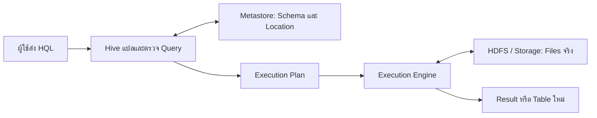
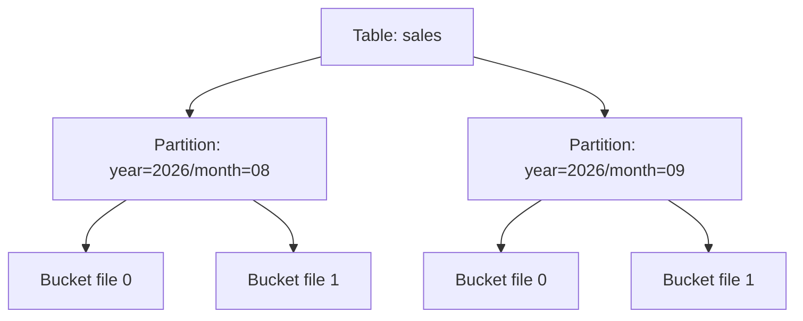
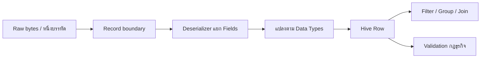
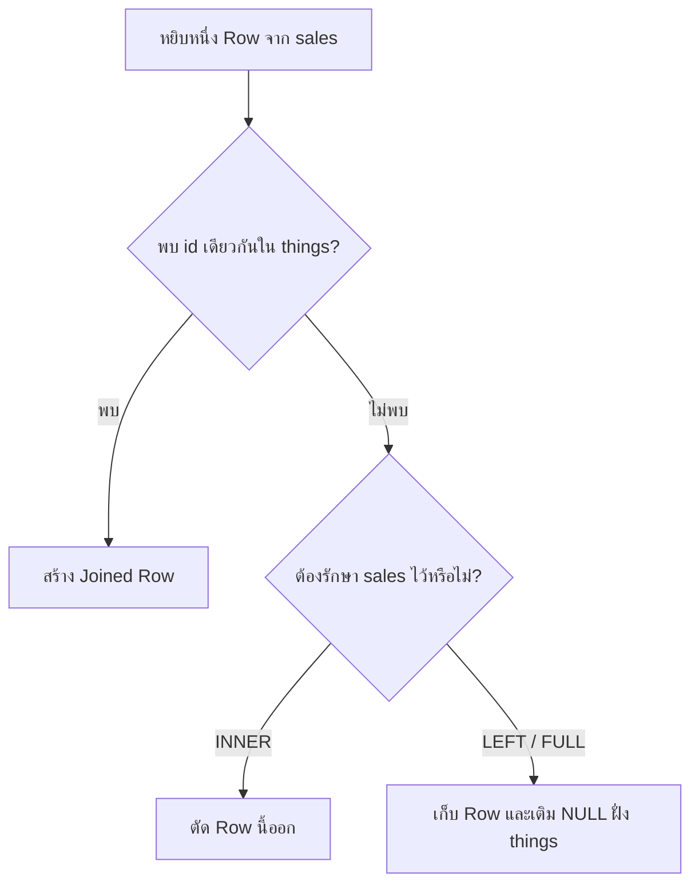

# 02 — Apache Hive: จากไฟล์บน HDFS สู่ตารางที่ Query และวิเคราะห์ได้

> **แหล่งเนื้อหาหลัก:** [Lecture — dads6002_02_hive.pdf](../lecture/dads6002_02_hive.pdf) หน้า 1–21 และ [Lab — lab_02_hive.pdf](../lab/lab_02_hive.pdf) หน้า 1–5

[← กลับสู่ Course Syllabus](00_course_syllabus.md) | [บทก่อนหน้า: Hadoop](01_hadoop.md)

เราต้องใช้ความรู้จาก Hadoop เพียงสองเรื่อง เรื่องแรกคือ HDFS เป็นระบบเก็บไฟล์แบบกระจาย ไฟล์หนึ่งอาจแบ่งเป็นหลาย blocks และเก็บอยู่หลายเครื่อง เรื่องที่สองคือ MapReduce เป็นวิธีประมวลผลข้อมูลจำนวนมากแบบ batch โดยแบ่งงานไปทำแล้วนำผลกลับมารวมกัน หากยังจำรายละเอียดไม่ได้ก็อ่านบทนี้ได้ เพราะจะทบทวนเฉพาะส่วนที่ต้องใช้

แกนหลักของบทคือความหมายของ Hive, ความสัมพันธ์ระหว่างข้อมูลจริงกับ Hive Metastore และเหตุผลในการแบ่งข้อมูลเป็น partition ส่วน ACID และ bucket เป็นเนื้อหาสนับสนุน ขณะที่ index ที่ปรากฏในสไลด์เป็นข้อมูลเชิงประวัติศาสตร์ซึ่งต้องแยกออกจากวิธีที่ Hive รุ่นใหม่ใช้

บทนี้ต่อจากชุด Hadoop โดยตรง ในบท 01 เราต้องอธิบายให้ MapReduce รู้ว่าจะสร้าง key อะไรและรวมค่าอย่างไร แม้คำถามจะเป็นเพียง “ยอดจัดซื้อต่อโรงพยาบาลเท่าไร” ภาระดังกล่าวเหมาะกับวิศวกรที่ต้องควบคุมอัลกอริทึม แต่ไม่เหมาะกับนักวิเคราะห์ที่คิดเป็นตาราง คอลัมน์ การกรอง และการรวมยอด Hive จึงไม่ได้มาแทน HDFS หรือ MapReduce แต่เพิ่มชั้นภาษาและ metadata เพื่อแปลคำถามเชิงตารางให้กลายเป็นแผนประมวลผลบนระบบกระจาย

## 1. Hive คืออะไร

### ปัญหาก่อนมี Hive

HDFS แก้ปัญหาการจัดเก็บไฟล์ขนาดใหญ่บนหลายเครื่อง แต่ HDFS มองข้อมูลเป็นไฟล์และ bytes มันไม่ได้รู้ว่าในบรรทัดหนึ่ง ส่วนใดเป็นรหัสโรงพยาบาล ส่วนใดเป็นวันที่ และส่วนใดเป็นจำนวนเงิน ดังนั้นการมีไฟล์อยู่ใน HDFS ยังไม่ได้ทำให้นักวิเคราะห์สั่ง `SELECT`, `WHERE` หรือ `GROUP BY` ได้ทันที

หากไม่มี Hive นักพัฒนาต้องเขียนโปรแกรมประมวลผลแบบกระจาย เช่น Mapper และ Reducer สำหรับคำถามแต่ละข้อ แม้คำถามนั้นจะเป็นเพียง “แต่ละโรงพยาบาลมียอดจัดซื้อรวมเท่าไร” วิธีนี้ทำได้ แต่ผู้ถามต้องคิดทั้งเรื่องการแบ่งข้อมูล การสร้าง key การรวมค่า และการส่งงานไปยังคลัสเตอร์ ภาระทางเทคนิคจึงสูงเกินความจำเป็นสำหรับงานวิเคราะห์เชิงตาราง

Hive เข้ามาแก้ช่องว่างนี้ Hive คือซอฟต์แวร์คลังข้อมูลที่ช่วยให้อ่าน เขียน และจัดการชุดข้อมูลขนาดใหญ่ในระบบจัดเก็บแบบกระจายผ่านคำสั่งที่มีรูปแบบคล้าย SQL ภาษาเฉพาะนี้เรียกว่า **Hive Query Language (HiveQL หรือ HQL)** ผู้ใช้ระบุว่าอยากได้คำตอบอะไร ส่วน Hive นำคำสั่งนั้นไปสร้างแผนการประมวลผลให้ระบบด้านล่างทำงานต่อ [Apache Hive](https://hive.apache.org/docs/latest/)

ขอบเขตของ Hive จึงต้องเข้าใจให้ชัด Hive ไม่ได้มาแทน HDFS เพราะไฟล์จริงยังอยู่ในระบบจัดเก็บ และ HQL ก็ไม่ได้อ่าน bytes หรือรวมยอดด้วยตัวมันเอง Hive ทำหน้าที่รับคำสั่ง ตรวจความหมาย อ้างอิงโครงสร้างตาราง และสร้าง **แผนการประมวลผล (execution plan)** จากนั้น **กลไกประมวลผล (execution engine)** จึงทำงานจริง ผลลัพธ์อาจเป็นตารางคำตอบที่แสดงแก่ผู้ใช้ หรือเป็นไฟล์ของตารางใหม่

### ตัวอย่างเล็กที่สุดก่อนใช้ศัพท์สถาปัตยกรรม

สมมติว่า HDFS มีไฟล์ `purchases.txt` ซึ่งมีข้อความสองบรรทัด:

```text
H001|2026-08-01|2500
H002|2026-08-01|1800
```

ในมุมมองของ HDFS นี่คือไฟล์หนึ่งไฟล์ที่ต้องเก็บอย่างทนทาน แต่ HDFS ไม่ทราบเองว่า `H001` คือรหัสโรงพยาบาล หรือ `2500` คือจำนวนเงิน เราจึงสร้างนิยามตารางใน Hive เพื่อบอกว่าแต่ละบรรทัดมีสามคอลัมน์ ได้แก่ `hospital_id`, `purchase_date` และ `amount` และใช้เครื่องหมาย `|` เป็นตัวคั่น

เมื่อมีคำอธิบายนี้ Hive จึงสามารถตีความไฟล์เดิมเป็นตารางได้:

| hospital_id | purchase_date | amount |
|---|---|---:|
| H001 | 2026-08-01 | 2500 |
| H002 | 2026-08-01 | 1800 |

จากนั้นผู้ใช้จึงเขียนคำถามแบบตารางได้:

```sql
SELECT hospital, SUM(amount) AS total_amount
FROM purchase_log
GROUP BY hospital;
```

คำสั่งนี้ไม่ได้เปลี่ยนไฟล์ให้กลายเป็นฐานข้อมูลแบบธุรกรรม แต่บอก Hive ว่าให้จัดกลุ่มแถวตาม `hospital_id` แล้วรวม `amount` ของแต่ละกลุ่ม ผู้ใช้จึงคิดเป็นตาราง คอลัมน์ และผลรวม แทนการเขียนโปรแกรมกระจายงานเอง

สไลด์หน้า 2 ยังกล่าวถึง **User-Defined Function (UDF)** หรือฟังก์ชันที่ผู้ใช้สร้างเพิ่มเอง สมมติข้อมูลชื่อโรงพยาบาลมีรูปแบบไม่เหมือนกัน เราอาจสร้างฟังก์ชัน `normalize_hospital(name)` แล้วเรียกใช้ใน HQL เหมือนฟังก์ชันทั่วไป UDF รับค่าจากแถว คำนวณตามกติกาที่เราเขียน และคืนผลกลับเข้าสู่ query จึงช่วยขยายความสามารถของ HQL แต่ UDF ไม่ได้แทนที่ตัววางแผน query หรือ execution engine; มันเป็นเพียงขั้นคำนวณหนึ่งในแผนงานเท่านั้น รายละเอียดชนิดของฟังก์ชันดูได้จาก [Apache Hive UDFs](https://hive.apache.org/docs/latest/language/hive-udfs/)

### ทำความเข้าใจเรื่องเดียวกันสองรอบ: จากไฟล์สู่ Table ที่ Query ได้

ก่อนใช้อุปมา ให้แยกของจริงออกเป็นสองส่วนก่อน ส่วนแรกคือ **ข้อมูลจริง** เช่น ข้อความรายการจัดซื้อหลายล้านบรรทัดในไฟล์ ส่วนที่สองคือ **คำอธิบายข้อมูล** เช่น ไฟล์อยู่ที่ไหน แต่ละบรรทัดแบ่งเป็นคอลัมน์อะไร และแต่ละคอลัมน์มีชนิดข้อมูลอะไร HDFS ดูแลส่วนแรก ส่วน Hive เพิ่มและใช้ส่วนที่สองเพื่อให้มองไฟล์เป็นตารางได้

**รอบแรก — แยกข้อมูลจริงออกจากคำอธิบายข้อมูล**

สมมติมีไฟล์รายการจัดซื้อหลายล้านบรรทัดอยู่ใน HDFS ตัว HDFS รู้ว่าไฟล์และ Block ถูกเก็บไว้ที่ใด แต่ไม่ได้รู้ว่าข้อความส่วนแรกของแต่ละบรรทัดคือ `hospital_id` หรือข้อความส่วนสุดท้ายคือ `amount` กล่าวคือ HDFS ดูแลการจัดเก็บ Bytes แต่ไม่ได้กำหนดความหมายเชิงตารางของ Bytes เหล่านั้น

Hive จึงเพิ่ม **Metadata** ที่บอกชื่อชุดข้อมูล ตำแหน่งไฟล์ ชื่อ Column ชนิดข้อมูล และกติกาสำหรับแยกหนึ่งบรรทัดออกเป็น Fields เมื่อผู้ใช้ส่ง HQL ระบบใช้ทั้งคำสั่ง Metadata และไฟล์จริงเพื่อสร้างแผนประมวลผล ความสัมพันธ์นี้ทำให้ผู้ใช้ Query ไฟล์ผ่านมุมมองแบบ Table ได้โดยไม่ต้องย้ายข้อมูลทั้งหมดเข้า Metastore

**รอบที่สอง — ระบุ Component และหน้าที่ทางการ**

Metadata ถูกจัดเก็บและให้บริการผ่าน **Hive Metastore** ส่วนข้อมูลจริงยังเป็น Files ใน HDFS หรือ Storage อื่น **Table Definition** เชื่อมสองส่วนนี้เข้าด้วยกัน โดยกำหนดว่าไฟล์ใน Location ใดต้องถูกตีความเป็น Columns อะไรและอ่านด้วยกติกาใด

เมื่อผู้ใช้ส่ง HQL Hive จะตรวจคำสั่งและอ่าน metadata แล้วสร้าง execution plan แผนนี้ระบุขั้นตอน เช่น อ่านไฟล์ กรองแถว จัดกลุ่ม และรวมยอด จากนั้น execution engine จึงดำเนินงานตามแผน ดังนั้นสิ่งที่ต้องใช้ในการตอบ query มีทั้งคำสั่งของผู้ใช้ คำอธิบายตาราง และไฟล์ข้อมูลจริง ไม่ใช่ไฟล์เพียงอย่างเดียว

Optimizer อาจเปลี่ยนลำดับ Operators หรือเลือกวิธีดำเนินงานเพื่อใช้ทรัพยากรน้อยลง สิ่งที่ต้องแยกให้ชัดมีสามข้อ: Metastore ไม่ได้เก็บข้อมูลจริงทั้งหมด, HQL ระบุผลที่ต้องการแต่ Execution Engine เป็นผู้ประมวลผล และการสร้าง Table อาจเพียงสร้าง Metadata ที่ชี้ไปยังไฟล์เดิมโดยไม่ต้องคัดลอกไฟล์

ภาพต่อไปนี้ควรอ่านจากซ้ายไปขวา เส้นบนคือ **control flow** ซึ่งใช้คำสั่งและ metadata เพื่อสร้างแผน ส่วนเส้นล่างคือ **data flow** ซึ่ง execution engine อ่านข้อมูลจริงจาก storage โดยตรง ข้อมูลหลายล้านแถวจึงไม่ต้องไหลผ่าน Metastore



## 2. Data กับ Metadata อยู่คนละที่

คำว่า **data** ในบทนี้หมายถึงข้อมูลจริงในไฟล์ เช่นสองบรรทัดของ `purchases.txt` ส่วน **metadata** หมายถึงข้อมูลที่ใช้อธิบาย data อีกที เช่น ชื่อตาราง รายชื่อคอลัมน์ ชนิดข้อมูล ตำแหน่งไฟล์ partition และกติกาการแยกแต่ละบรรทัด การแยกสองอย่างนี้ช่วยให้เราเปลี่ยนหรือค้นหาคำอธิบายได้โดยไม่ต้องนำข้อมูลหลายพันล้านแถวไปเก็บในฐานเดียวกับคำอธิบาย

**Hive Metastore** คือบริการที่เก็บและให้ Hive ค้น metadata โดยทั่วไป metadata ถูกเก็บในฐานข้อมูลเชิงสัมพันธ์ เช่น MySQL ตามตัวอย่างในสไลด์ เพราะข้อมูลกลุ่มนี้มีขนาดเล็กกว่าข้อมูลจริงและต้องค้นหรือแก้ไขได้สะดวก ส่วน records จำนวนมากยังคงอยู่ใน HDFS หรือระบบจัดเก็บแบบกระจาย

เมื่อ query เริ่มขึ้น Hive ต้องถาม Metastore ก่อนว่า table อยู่ที่ใดและอ่านอย่างไร แต่ไฟล์ข้อมูลไม่ไหลผ่านฐานข้อมูล Metastore ความเข้าใจผิดว่า “Hive table เก็บทุก row ใน MySQL” จึงไม่ถูกต้อง

### ตามคำสั่งหนึ่งคำสั่งตั้งแต่ต้นจนจบ

ลองใช้คำสั่งรวมยอดจาก `purchase_log` อีกครั้ง เมื่อผู้ใช้ส่ง HQL ระบบยังตอบไม่ได้ทันที เพราะชื่อ `purchase_log` เป็นเพียงชื่อเชิงตรรกะ Hive ต้องเปิด metadata เพื่อค้นว่าตารางนี้ชี้ไปยัง directory ใด ใช้ `|` แบ่งคอลัมน์ และอ่าน `amount` เป็นตัวเลขชนิดใด หลังจากรู้โครงสร้างแล้ว Hive จึงตรวจได้ว่าคอลัมน์ที่กล่าวถึงมีอยู่จริง และวางแผนว่าจะอ่าน กรอง จัดกลุ่ม และรวมข้อมูลตามลำดับใด

เมื่อแผนพร้อม execution engine จะอ่าน bytes จากไฟล์จริง แปลงแต่ละบรรทัดเป็นแถวตามกติกาของตาราง แล้วทำการคำนวณ ผลรวมที่ได้จึงส่งกลับไปยังผู้ใช้ ขั้นตอนนี้แสดงให้เห็นว่าทั้ง metadata และ data จำเป็น แต่ทำหน้าที่ต่างกัน: metadata บอก “จะหาและอ่านอย่างไร” ส่วน data คือ “สิ่งที่ถูกอ่านและคำนวณ”

สรุปลำดับอย่างเป็นทางการได้ดังนี้:

1. Client ส่ง HQL
2. Hive parse syntax และ resolve ชื่อ table/column
3. Hive อ่าน metadata จาก Metastore
4. Optimizer สร้าง logical/physical plan
5. Execution engine อ่านไฟล์จาก storage และทำ operators
6. Hive ส่งผลกลับหรือเขียนเป็น table ใหม่

ถ้า Metastore ใช้งานไม่ได้ Hive อาจยังเห็นว่าไฟล์อยู่ใน HDFS แต่ไม่รู้ว่าจะตีความไฟล์นั้นเป็นตารางอย่างไร Query ใหม่จึงล้มตั้งแต่ขั้นค้น metadata ในทางกลับกัน ถ้า metadata ยังอยู่แต่ไฟล์ถูกลบ Hive รู้โครงสร้างตารางแต่ไม่มีข้อมูลจริงให้อ่าน สองกรณีนี้ต่างกันและต้องตรวจคนละจุด

กรณีถามยอดจัดซื้อเฉพาะเดือนสิงหาคมเพิ่มอีกปัจจัยหนึ่งคือที่ตั้งของไฟล์ หากข้อมูลแต่ละเดือนถูกแยกเป็นคนละ partition และคำสั่งระบุเดือนตรงกับ partition column Hive สามารถตัด directory ของเดือนอื่นออกจากแผนได้ กลไกนี้เรียกว่า **partition pruning** จึงเป็นสะพานจากโครงสร้างเชิงตรรกะของตารางไปสู่การจัดไฟล์ทางกายภาพในหัวข้อถัดไป

## 3. ACID และข้อจำกัดเชิงงาน

ระบบฐานข้อมูลสำหรับงานธุรกรรมมักแก้ไขแถวเล็ก ๆ ได้ตลอดเวลา เช่นเปลี่ยนสถานะใบสั่งซื้อหนึ่งรายการจาก `pending` เป็น `approved` แต่ HDFS และ Hive ถูกออกแบบโดยเน้นการอ่านและประมวลผลข้อมูลจำนวนมากเป็นชุด การเปิดไฟล์ขนาดใหญ่แล้วเขียนใหม่ทั้งไฟล์เพราะเปลี่ยนหนึ่งแถวจะสิ้นเปลืองมาก

Hive รุ่นที่รองรับธุรกรรมจึงไม่ได้แก้ข้อความเดิมกลางไฟล์ทันที การ `INSERT`, `UPDATE` หรือ `DELETE` สร้างไฟล์การเปลี่ยนแปลงขนาดเล็กที่เรียกว่า **delta files** เมื่อมี delta files มากขึ้น การอ่านต้องพิจารณาทั้งไฟล์ฐานและการเปลี่ยนแปลงที่เกิดภายหลัง ระบบจึงมี **compaction** เพื่อรวมไฟล์เหล่านี้เป็นโครงสร้างที่อ่านง่ายขึ้น ภาษาปัจจุบันแยก minor compaction ซึ่งรวม delta files กับ major compaction ซึ่งรวม delta และ base เป็น base ใหม่ [Hive Transactions](https://hive.apache.org/docs/latest/user/hive-transactions/)

ดังนั้นข้อความว่า “Hive รองรับ `UPDATE`” บอกเพียงว่ามีความสามารถนี้ ไม่ได้แปลว่า Hive เหมาะกับการแก้ไขแถวถี่ ๆ เท่าฐานข้อมูลธุรกรรม หากระบบต้องเปลี่ยนสถานะการชำระเงินทุกไม่กี่มิลลิวินาทีและให้ผู้ใช้อ่านค่าล่าสุดทันที ควรให้ฐานข้อมูล OLTP ดูแลงานต้นทาง แล้วส่งสำเนาข้อมูลมาวิเคราะห์เป็นชุดใน Hive การเลือกเครื่องมือจึงขึ้นกับรูปแบบงาน ไม่ใช่ดูเพียงว่าคำสั่งนั้นมีอยู่หรือไม่

## 4. Table, Partition และ Bucket

### Table

**ตาราง (table)** ใน Hive คือคำอธิบายเชิงตรรกะที่ผูกชื่อคอลัมน์และชนิดข้อมูลเข้ากับตำแหน่งไฟล์หนึ่งแห่งหรือหลายแห่ง ตารางไม่ได้ทำให้ files หายไป แต่สร้างมุมมองว่า bytes ในไฟล์ควรถูกอ่านเป็นแถวและคอลัมน์อย่างไร สำหรับ `purchase_log` หนึ่งแถวอาจแทนรายการจัดซื้อหนึ่งรายการ นี่คือ **ระดับรายละเอียดของหนึ่งแถว (grain)** ซึ่งต้องกำหนดให้ชัดก่อนรวมยอดหรือเชื่อมตาราง

ในทางกายภาพ ตารางมักสัมพันธ์กับ directory หลัก และไฟล์ภายในถูกเก็บตาม file format เช่น TextFile หรือ ORC Hive ใช้ schema และ SerDe แปลข้อมูลในไฟล์กลับเป็น columns ดังนั้น table เป็นสะพานเชื่อมชื่อที่นักวิเคราะห์ใช้กับไฟล์ที่ระบบต้องอ่าน

### Partition

เมื่อข้อมูลโตขึ้น การเก็บไฟล์ทุกเดือนรวมใน directory เดียวทำให้คำถามที่ต้องการเพียงเดือนเดียวอาจต้องตรวจไฟล์ทั้งปี **Partition** แก้ปัญหานี้ด้วยการแบ่งข้อมูลของตารางเป็น subdirectories ตามค่าของคอลัมน์ เช่น:

```text
/sales/country=TH/year=2026/month=08/
/sales/country=TH/year=2026/month=09/
```

เมื่อคำสั่งมีเงื่อนไข `WHERE country='TH' AND year=2026 AND month=8` Hive สามารถเลือก directory ที่ตรงเงื่อนไขและไม่อ่านเดือนอื่น ประโยชน์จึงเกิดจากการลดไฟล์ที่ต้อง scan ไม่ใช่เพราะ partition ทำให้ทุก query เร็วโดยอัตโนมัติ หาก query ไม่กรองคอลัมน์เหล่านี้ ระบบอาจยังต้องอ่านหลาย partitions

การ partition ด้วย `po_id` ซึ่งมีหลายล้านค่าอาจสร้าง directories และ metadata จำนวนมาก จึงมักเลือกคอลัมน์ที่ปรากฏบ่อยใน filter และมี cardinality พอเหมาะ เช่น date/month/region

สมมติ table มีข้อมูล 5 ปี เดือนละ 100 GB และผู้ใช้ถามเฉพาะเดือนสิงหาคม 2026 หากจัด partition เป็น `year/month` และ predicate ระบุสองคอลัมน์ Hive มีโอกาสอ่านเพียง 100 GB แทน 6 TB แต่ถ้าจัด partition ด้วย `po_id` หลายล้านค่า เราจะได้ directory เล็กจำนวนมหาศาล Metastore ต้องติดตาม partitions มากขึ้นและเกิด small-files overhead การออกแบบ partition จึงเป็นการแลก “ลดปริมาณ scan” กับ “เพิ่มจำนวนหน่วยที่ต้องจัดการ” ไม่ใช่ยิ่งละเอียดแล้วยิ่งดี

### Bucket

Partition ยังอาจมีไฟล์จำนวนมากภายในเดือนเดียว **Bucket** เป็นการแบ่ง records ภายใน table หรือ partition ออกเป็นจำนวนกลุ่มที่กำหนดไว้ล่วงหน้า โดยคำนวณ hash จากคอลัมน์ เช่น 8 buckets ตาม `vendor_id`:

```text
bucket_number = hash(vendor_id) mod 8
```

ถ้า hash ของ `V105` ให้ผลลง bucket 3 ทุก record ที่มี key เดียวกันจะถูกกำหนดไปยัง bucket ตามกติกาเดียวกัน Bucket ไม่เหมือน partition เพราะเราไม่ได้สร้าง directory แยกสำหรับ vendor ทุกค่า และผู้ใช้มักไม่เลือก bucket ด้วย `WHERE vendor_id=...` แบบเดียวกับการเลือก partition จุดประสงค์หลักคือจัดการการกระจาย records และช่วยงานบางชนิด เช่น sampling หรือ join ภายใต้เงื่อนไขที่เหมาะสม

ความสัมพันธ์ที่ควรจำคือ partition ตัดข้อมูลด้วยค่าที่ผู้ใช้มักเขียนใน `WHERE` ส่วน bucket กระจาย rows ภายใน partition ด้วย hash เช่น partition เดือนสิงหาคมอาจมี 8 bucket files ตาม `vendor_id` ผู้ใช้ไม่เลือก directory ชื่อ vendor แต่ hash จะกำหนดไฟล์ปลายทาง การประกาศ `CLUSTERED BY` ใน metadata โดยที่ขั้นเขียนไม่สร้าง layout ตามนั้นทำให้ table “บอกว่ามี bucket” แต่ไฟล์จริงไม่รักษาสัญญา เอกสาร Apache จึงเตือนว่าคุณสมบัติ bucketing ต้องถูกทำให้เกิดจริงตอนเขียน ไม่ใช่เชื่อจาก DDL อย่างเดียว [Apache Hive DDL](https://hive.apache.org/docs/latest/language/languagemanual-ddl/)

ตารางอาจประกาศ `SORTED BY (vendor_id)` เพิ่มด้วย ซึ่งหมายความว่าแถวภายในแต่ละ bucket ถูกเรียงตามคอลัมน์นั้น ให้แยกสองแนวคิดนี้ออกจากกัน: bucket ตอบว่า “แถวควรอยู่ไฟล์กลุ่มใด” ส่วน sort ตอบว่า “แถวภายในกลุ่มนั้นเรียงอย่างไร” การเรียงอาจช่วยงานบางชนิด แต่ไม่ได้ทำให้ทุก query เร็วขึ้นโดยอัตโนมัติ และประโยชน์จะเกิดก็ต่อเมื่อข้อมูลจริงถูกเขียนให้ตรงกับ layout ที่ประกาศไว้

ภาพนี้แสดงความสัมพันธ์เชิง containment: Table เป็นขอบเขตใหญ่ Partition แยกเป็น directory ตามค่าที่ใช้กรอง และ Bucket เป็น files ภายในแต่ละ partition ที่กระจาย row ด้วย hash



## 5. จาก Storage Layout ไปสู่ HQL และ Schema-on-read

เมื่อรู้แล้วว่า Hive เชื่อม metadata กับ files อย่างไร คำถามถัดไปคือเราจะสร้าง metadata นั้นอย่างไร และถ้าไฟล์ดิบไม่เป็นตารางเรียบร้อย Hive จะแยก bytes เป็น columns ได้อย่างไร ส่วนถัดไปจึงเริ่มจาก HQL สำหรับสร้าง database/table แล้วตามด้วย managed/external ownership, schema-on-read และ SerDe ลำดับนี้สำคัญ เพราะ syntax `CREATE TABLE` จะมีความหมายก็ต่อเมื่อเราเข้าใจว่ากำลังประกาศสัญญาการอ่านและ lifecycle ของไฟล์ ไม่ใช่เพียงสร้างกล่องว่างแบบฐานข้อมูลธุรกรรม

| กลไก | หน่วยกายภาพ | เหมาะเมื่อ | ความเสี่ยง |
|---|---|---|---|
| Table | directory หลัก | แยก dataset/schema | table มากเกินไป |
| Partition | subdirectory ตามค่า | filter ซ้ำบนคอลัมน์ cardinality พอเหมาะ | small partitions/Metastore overhead |
| Bucket | files จาก hash | sampling/join และกระจาย records | จำนวนไฟล์และ hash mismatch |

### Index: เนื้อหาเดิมกับสถานะปัจจุบัน

สไลด์กล่าวว่า table สามารถทำ index เพื่อช่วยการค้นหา นี่เป็นข้อมูลเชิงประวัติศาสตร์ แต่ native Hive indexing ถูกนำออกตั้งแต่ Hive 3.0 เอกสาร Apache เสนอแนวทางอื่น เช่น materialized views และ file format แบบ columnar ที่ช่วย selective scan จึงไม่ควรนำ syntax ของ native index จากสไลด์ไปใช้กับ Hive รุ่นใหม่โดยไม่ตรวจ version [Apache Hive Indexing](https://hive.apache.org/docs/latest/language/languagemanual-indexing/)

## 6. พื้นฐานเชิงตารางก่อนเขียน HQL

ก่อนอ่าน syntax ต้องรู้ก่อนว่าเรากำลังอธิบายข้อมูลแบบใด **ตาราง (table)** คือมุมมองข้อมูลเป็นแถวและคอลัมน์ **แถว (row หรือ record)** หนึ่งแถวต้องแทนหน่วยบางอย่างที่ชัดเจน เช่นหนึ่งบรรทัดของใบสั่งซื้อ ไม่ใช่หนึ่ง vendor ขณะที่ **คอลัมน์ (column)** เก็บคุณลักษณะของหน่วยนั้น เช่นรหัสใบสั่งซื้อ รหัส vendor และจำนวนเงิน

คำว่า **grain** หมายถึงระดับรายละเอียดของหนึ่งแถว หากไฟล์มีหนึ่งแถวต่อ PO line แต่เราคิดว่าเป็นหนึ่งแถวต่อ PO ยอดรวมและจำนวนรายการจะถูกตีความผิดตั้งแต่ต้น **Key** คือคอลัมน์หรือชุดคอลัมน์ที่ใช้ระบุหรือเชื่อม records ส่วน **cardinality** ในบริบทนี้ช่วยบอกว่าคอลัมน์มีค่าที่แตกต่างกันมากน้อยเพียงใด ความหมายเหล่านี้ไม่ใช่ศัพท์เสริม แต่เป็นพื้นฐานสำหรับเลือก data type, partition และวิธีตรวจข้อมูล

ใช้ตัวอย่างเดียวตลอดบท: ไฟล์ `po_202608.csv` มีหนึ่งแถวต่อหนึ่ง PO line โดย `po_line_id` ควรไม่ซ้ำ, `vendor_id` เป็นรหัส และ `amount` เป็นมูลค่า ข้อตกลงว่าแต่ละคอลัมน์หมายถึงอะไรและยอมรับค่าแบบใดเรียกว่า **สัญญาข้อมูล (data contract)** Hive อ่านไฟล์ตาม schema ที่ประกาศ แต่ไม่ได้บังคับความเป็นเอกลักษณ์ของ `po_line_id` แทนเราโดยอัตโนมัติ Pipeline จึงต้องตรวจ grain, key และคุณภาพข้อมูลเอง

## 7. จาก CLI สู่ HQL

**HQL** คือภาษาที่ใช้บอก Hive ว่าต้องการสร้างโครงสร้าง เปลี่ยนข้อมูล หรืออ่านคำตอบ ส่วน **Command Line Interface (CLI)** เป็นเพียงช่องทางหนึ่งสำหรับส่งภาษา HQL เข้าไป สองสิ่งนี้ไม่ใช่เรื่องเดียวกัน เช่นเดียวกับภาษา SQL ที่สามารถส่งผ่านหลายโปรแกรมได้

สไลด์หน้า 6 ใช้ Hive CLI สามรูปแบบ การพิมพ์ `hive` เปิดหน้าจอ interactive สำหรับส่งคำสั่งทีละชุด `hive -e` ส่งคำสั่งสั้นจาก shell โดยไม่เปิดหน้าจอ และ `hive -f` รันคำสั่งหลายบรรทัดจากไฟล์ `.hql` แนวคิดเรื่อง interactive, inline และ script ยังสำคัญ แม้ระบบใหม่มักเชื่อม HiveServer2 ผ่าน Beeline แทน Hive CLI แบบเก่า

```sql
CREATE DATABASE IF NOT EXISTS log_data;
USE log_data;
SHOW TABLES;
DESCRIBE apache_log;
```

คำสั่ง `CREATE DATABASE` และ `CREATE TABLE` อยู่ในกลุ่ม **Data Definition Language (DDL)** เพราะสร้างหรือเปลี่ยนคำอธิบายโครงสร้าง `SELECT` อ่านข้อมูล ส่วน `INSERT` และ `LOAD` ทำให้ตารางมีข้อมูลให้อ่าน จุดสำคัญคือการสร้าง table สำเร็จยืนยันเพียงว่า metadata ถูกสร้าง ไม่ได้ยืนยันว่าไฟล์มีโครงสร้างตรงกับ schema และการ load สำเร็จก็ยังไม่ได้พิสูจน์ว่าแต่ละ row ถูกแยกคอลัมน์ถูกต้อง

ให้แยก “ภาษา” ออกจาก “ช่องทางส่งภาษา” HQL คือภาษาที่บอกสิ่งที่ต้องการ ส่วน Hive CLI, Beeline หรือ application client เป็นช่องทางส่งคำสั่ง สไลด์ใช้ Hive CLI เพื่อสาธิตได้ง่าย แต่ความรู้ที่ควรนำไปใช้คือ DDL/DML และ query semantics ไม่ใช่การยึดติดว่าต้องพิมพ์ผ่านคำสั่ง `hive` เท่านั้น ระบบจริงมักส่งคำสั่งผ่าน HiveServer2 และ Beeline เพื่อจัดการ session, authentication และหลายผู้ใช้ [Apache Hive documentation](https://hive.apache.org/docs/latest/)

## 8. Managed Table กับ External Table

ก่อนเลือกชนิด table ให้ถามว่า **ใครเป็นเจ้าของวงจรชีวิตของไฟล์** คำว่า “เจ้าของ” ในที่นี้ไม่ได้หมายถึง Linux user แต่หมายถึงระบบใดมีสิทธิ์ตัดสินใจสร้าง ย้าย เก็บรักษา และลบไฟล์เหล่านั้น

ถ้าเป็น **managed table** Hive เป็นผู้จัดการทั้ง metadata และข้อมูลของ table เมื่อเราสร้าง table แล้ว load ข้อมูล Hive จะนำไฟล์ไปอยู่ในพื้นที่ที่ Hive ดูแล โดยทั่วไปการ `DROP TABLE` จึงอาจลบทั้งคำอธิบายและข้อมูล วิธีนี้เหมาะกับ intermediate หรือ curated data ที่ Hive เป็นผู้สร้างและรับผิดชอบตลอดวงจรชีวิต

ถ้าเป็น **external table** Hive ดูแลเฉพาะ metadata ที่ชี้ไปยังตำแหน่งไฟล์ แต่ไฟล์มีเจ้าของหรือผู้ใช้อื่นอยู่แล้ว เช่น raw data ที่ pipeline นำเข้าหรือไฟล์ที่ Spark ต้องใช้ร่วมกัน เมื่อ drop external table โดยหลัก Hive จะลบคำอธิบายของตารางแต่ปล่อยไฟล์ไว้ การเลือก external จึงไม่ใช่เรื่องความเร็ว แต่เป็นการป้องกันไม่ให้การจัดการ metadata ของ Hive ลบข้อมูลร่วมโดยไม่ตั้งใจ รายละเอียดบางอย่างขึ้นกับ version และ configuration จึงไม่ควรทดลอง `DROP` กับข้อมูล production

| คำถาม | Managed | External |
|---|---|---|
| ใครควบคุม lifecycle ไฟล์ | Hive | pipeline/system ภายนอก |
| ใช้เมื่อ | intermediate/curated data ที่ Hive เป็นเจ้าของ | shared/raw data หรือหลาย engine ใช้ร่วมกัน |
| ความเสี่ยงหลัก | drop แล้วสูญเสีย data | metadata กับ files drift |

ตัวอย่าง DDL ที่แก้ quote และ syntax ให้รันได้:

```sql
CREATE TABLE memo (
    line_no STRING,
    line_text STRING
)
ROW FORMAT DELIMITED
FIELDS TERMINATED BY '\t'
STORED AS TEXTFILE;

CREATE EXTERNAL TABLE memo_external (
    line_no STRING,
    line_text STRING
)
ROW FORMAT DELIMITED
FIELDS TERMINATED BY '\t'
STORED AS TEXTFILE
LOCATION '/user/student/external_table';
```

ตัวอย่างเช่นไฟล์ raw PO ถูกวางไว้ที่ `/data/raw/po/` โดยระบบ ingestion และทั้ง Hive กับ Spark ต้องอ่าน path นี้ การสร้าง external table ทำให้ Hive เพิ่มมุมมองแบบตารางโดยไม่รับสิทธิ์ลบไฟล์ร่วม แต่ถ้า Hive สร้างตารางสรุปชั่วคราวสำหรับงานหนึ่งและไม่มีระบบอื่นใช้ managed table จะช่วยให้การ cleanup อยู่ภายใต้ Hive อย่างเป็นระบบ ก่อนใช้ `DROP TABLE` จึงต้องตอบให้ได้ว่าไฟล์เป็นของใครและมีระบบใดอ้าง path เดียวกันอยู่บ้าง

## 9. Schema-on-read คืออะไร

คำว่า **schema** หมายถึงคำอธิบายโครงสร้าง เช่นมีคอลัมน์อะไร เรียงอย่างไร และแต่ละคอลัมน์เป็นชนิดใด ส่วน **schema-on-read** หมายถึงระบบนำ schema มาใช้ตีความข้อมูลตอนอ่าน ไม่ได้ตรวจและแปลงทุกค่าจนผ่านกฎทั้งหมดตั้งแต่ตอนนำไฟล์เข้ามา

ลองนึกถึงไฟล์ที่มีข้อความ `1001|250.50` เราอาจประกาศว่าค่าแรกคือ `po_id INT` และค่าที่สองคือ `amount DECIMAL` เมื่อ query อ่านบรรทัดนี้ Hive จึงแยก fields แล้วพยายามแปลงชนิดตาม schema หากไฟล์จริงมี `ABC|300.00` ค่า `ABC` ไม่สามารถเป็น integer ได้ จึงอาจกลายเป็น `NULL` ตอนอ่าน ทั้งที่คำสั่งนำไฟล์เข้า table ก่อนหน้านั้นไม่ได้รายงานข้อผิดพลาด

ตัวอย่าง input ที่คาดว่า `po_id INT, amount DOUBLE`:

```text
1001	250.50
ABC	300.00
1003	missing
```

แถวสองมี `po_id` ผิดชนิดและแถวสามมี `amount` ผิดชนิด ผลลัพธ์อาจมี `NULL` การตรวจขั้นต่ำคือ total rows, null-by-column, rejected-pattern count และยอดรวมเทียบ source

ดังนั้น schema-on-read ไม่ได้แปลว่า “ไม่มี schema” แต่หมายถึงจุดที่ schema ถูกบังคับใช้ต่างจากระบบที่ตรวจเข้มตอนเขียน ข้อดีคือรับไฟล์ดิบได้รวดเร็วและเปลี่ยนวิธีมองข้อมูลได้ยืดหยุ่น ข้อเสียคือความผิดพลาดอาจถูกค้นพบช้า หากเดือนถัดมาผู้ส่งไฟล์สลับลำดับคอลัมน์ Query อาจยังรันแต่ `amount` กลายเป็น `NULL` และ `SUM(amount)` ต่ำกว่าความจริงโดยไม่มีข้อความแจ้งข้อผิดพลาดที่ชัดเจน

วิธีที่ปลอดภัยคือสร้าง **staging table** ซึ่งเก็บ fields ดิบเป็น `STRING` ก่อน แล้วใช้ขั้น **curated** ตรวจรูปแบบ แปลงชนิด และแยก rejected rows วิธีนี้ทำให้เรายังเห็นค่าต้นฉบับเมื่อ cast ไม่ผ่านและอธิบายได้ว่าข้อมูลใดถูกตัดออก

## 10. SerDe: สะพานระหว่าง bytes กับ columns

แม้ Hive จะมี schema แล้ว ระบบยังต้องรู้ว่าจะเปลี่ยนข้อความหนึ่งบรรทัดให้เป็นหลายคอลัมน์อย่างไร หน้าที่นี้เป็นของ **Serializer/Deserializer หรือ SerDe**

ฝั่งอ่านใช้ **Deserializer** รับ record จากไฟล์แล้วแยกออกเป็น fields ที่ Hive เข้าใจ เช่นรับ `H001|V020|1250.50` แล้วแยกเป็น `H001`, `V020` และ `1250.50` จากนั้น Hive จึงนำแต่ละ field ไปตีความตามชนิดคอลัมน์ ฝั่งเขียนใช้ **Serializer** ทำทางกลับกัน คือแปลง row ภายใน Hive ให้อยู่ในรูปที่บันทึกเป็นไฟล์ได้ เอกสาร Apache อธิบายว่า SerDe เป็นส่วนติดต่อด้าน input/output และสามารถรองรับรูปแบบที่กำหนดเองได้ [Apache Hive SerDe](https://hive.apache.org/docs/latest/user/serde/)

SerDe จึงไม่ใช่เพียงเครื่องหมายคั่นคอลัมน์ สำหรับไฟล์ง่ายอาจใช้ delimiter แต่ log ที่มีช่องว่างและข้อความอยู่ในเครื่องหมาย quote ต้องใช้กติกาซับซ้อนกว่า เช่น regular expression อย่างไรก็ตาม SerDe ทำหน้าที่แปล representation ไม่ได้ตรวจ business rule เช่นจำนวนเงินต้องมากกว่าศูนย์หรือ vendor ต้องมีอยู่ใน master

คำศัพท์ต้องอ่านตามลำดับ: raw line → record boundary → pattern/delimiter → fields → type conversion → Hive row หาก regex จับกลุ่มไม่ครบ column mapping จะเลื่อนหรือกลายเป็น `NULL`

สไลด์แสดง `RegSerde` แต่ class ที่ใช้จริงควรตรวจจาก Hive distribution และมักพบ `RegexSerDe` การคัดลอก class name จากสไลด์โดยไม่ตรวจ JAR/version เป็น failure mode สำคัญ

ลองติดตาม raw line `PO1001|V020|1250.50` ทีละขั้น ระบบอ่านหนึ่งบรรทัดเป็นหนึ่ง record จากนั้น Deserializer ใช้ `|` แยกเป็นสาม fields แล้ว Hive แปลง field ที่สามเป็นชนิดตัวเลขตาม schema ผลคือ row `(PO1001, V020, 1250.50)` ที่คำสั่งถัดไปนำไปกรองหรือรวมยอดได้ หากกติกาจับได้เพียงสอง fields คอลัมน์ที่สามจะไม่มีค่า และหากลำดับกติกาผิด ค่าจะไปอยู่ผิดคอลัมน์แม้ query ยังรันได้ การทดสอบ SerDe จึงต้องเทียบ raw sample กับผลลัพธ์ทีละ field ไม่ใช่ดูเฉพาะ `COUNT(*)`

Serializer ทำเส้นทางกลับกันเมื่อต้องเขียน row ออกเป็นไฟล์ แต่ไม่ควรเหมารวมว่า SerDe เป็นตัวตรวจ business rules มันแปล representation เท่านั้น กฎอย่าง `amount >= 0`, vendor ต้องมีใน master หรือ `po_line_id` ต้อง unique อยู่ในชั้น validation/curation

ภาพต่อไปนี้แยกขั้นตอนที่มักถูกพูดรวมกันว่า “Hive อ่านไฟล์” ให้เห็นชัดว่า SerDe รับผิดชอบเฉพาะการแปลงรูปแบบ ส่วนการตรวจ business rule ต้องทำภายหลัง



## 11. Regex ที่จำเป็นต่อการอ่าน log

**Regular expression หรือ regex** คือภาษาขนาดเล็กสำหรับบรรยายรูปแบบของข้อความ ใน Lab web log หนึ่งบรรทัดมี host, object ที่อยู่ในเครื่องหมาย quote และตัวเลขเวลา ช่องว่างทั่วไปจึงไม่สามารถใช้เป็น delimiter อย่างตรงไปตรงมา เพราะ object เองอาจมีรูปแบบเฉพาะ Regex ช่วยระบุว่าแต่ละส่วนเริ่มและจบตรงไหน

อย่าเริ่มจากการท่องสัญลักษณ์ทั้งหมด ให้อ่าน pattern `([^ ]+) "([^"]+)" ([0-9]+)` เป็นสามกลุ่ม กลุ่มแรกเก็บอักขระที่ไม่ใช่ช่องว่างตั้งแต่หนึ่งตัวขึ้นไป กลุ่มที่สองเก็บอักขระภายใน quote และกลุ่มที่สามเก็บตัวเลขตั้งแต่หนึ่งหลักขึ้นไป วงเล็บแต่ละคู่สร้าง capture group ซึ่งจะถูกส่งให้คอลัมน์ตามลำดับ

| สัญลักษณ์ | ความหมาย | ตัวอย่าง |
|---|---|---|
| `^`, `$` | ต้นและท้าย string | `^abc$` ตรงทั้ง string |
| `*`, `+`, `?` | 0+, 1+, 0/1 ครั้ง | `ab+c` ต้องมี b อย่างน้อยหนึ่ง |
| `{m,n}` | จำนวนครั้งเป็นช่วง | `b{3,5}` |
| `()` | group | `(ab)+` |
| `|` | OR | `GET|POST` |
| `[]` | character class | `[0-9]` |
| `.` | อักขระใดหนึ่งตัว | `a.[0-9]` |
| `\` | escape | ใช้กับอักขระพิเศษ |

ควร anchor pattern และทดสอบกับ valid/invalid samples ก่อนใช้ เพราะ regex ที่ permissive เกินไปอาจ parse ผิดอย่างเงียบ ๆ

## 12. Data Types

Data type บอก Hive ว่าควรตีความ field และอนุญาตการคำนวณแบบใด `INT` และ `BIGINT` ใช้กับจำนวนเต็ม `FLOAT` และ `DOUBLE` ใช้กับเลขทศนิยมแบบประมาณค่า `BOOLEAN` ใช้กับจริง/เท็จ `STRING` ใช้กับข้อความ และ `TIMESTAMP` ใช้กับวันเวลา คำว่า `bint` ในสไลด์เป็นการเขียนคลาดเคลื่อน ชนิดที่ถูกต้องใน HQL คือ `BIGINT`

Complex types ช่วยรักษาโครงสร้างซ้อน:

```sql
ARRAY<STRING>
MAP<STRING, INT>
STRUCT<name:STRING, age:INT>
```

เลือกชนิดจากความหมาย ไม่ใช่จากหน้าตาว่ามีแต่ตัวเลข เช่น zipcode `00125` และ vendor `0007` เป็นรหัส ไม่ได้ใช้บวกหรือลบ และเลขศูนย์นำหน้ามีความหมาย จึงควรเป็น `STRING` ส่วนจำนวนเงินต้องรักษาความแม่นยำ จึงควรพิจารณา `DECIMAL(precision, scale)` มากกว่า floating point ที่เป็นค่าประมาณ

## 13. Loading Data

```sql
LOAD DATA INPATH '/user/student/apache.log'
OVERWRITE INTO TABLE apache_log;
```

`LOAD DATA` ไม่ควรถูกเข้าใจว่าเป็นกระบวนการ ETL ที่ตรวจ business rule ของแต่ละแถวให้ครบก่อนรับข้อมูล แนวคิดดั้งเดิมของคำสั่งนี้คือการ copy หรือ move ไฟล์ไปยังตำแหน่งของ table โดยไม่ transform record อย่างไรก็ดี ตั้งแต่ Hive 3 บางกรณีอาจถูก rewrite ภายในเป็น `INSERT AS SELECT` ตามเงื่อนไขของระบบ [Apache Hive DML](https://hive.apache.org/docs/latest/language/languagemanual-dml/) ข้อเท็จจริงที่ยังเหมือนเดิมคือ “คำสั่งสำเร็จ” ไม่ได้รับประกันว่า delimiter, type และความหมายของทุก field ถูกต้อง จึงต้องตรวจข้อมูลหลัง load ตามหลัก schema-on-read

คำว่า `INPATH` โดยไม่มี `LOCAL` อ้างถึง path ใน filesystem ที่ Hive ใช้ เช่น HDFS และการ load อาจย้ายไฟล์ต้นทาง ส่วน `LOCAL INPATH` อ่านจาก local filesystem ของเครื่องที่บริการ Hive มองเห็น คำว่า `OVERWRITE` ให้แทนข้อมูลเดิมในขอบเขตเป้าหมาย จึงต้องตรวจ table, partition และ path ให้ถูกก่อนรัน

ต่างจาก `LOAD DATA`, คำสั่ง `INSERT ... SELECT` นำผลจาก query ไปเขียนใน table ปลายทาง จึงเหมาะกับการแปลง staging data ให้เป็น curated data เช่นกรองค่าที่ผิด cast และเลือกคอลัมน์ใหม่ ความแตกต่างสั้น ๆ คือ LOAD จัดวางไฟล์ ส่วน INSERT สร้างข้อมูลผลลัพธ์จากการประมวลผล

### Safe loading workflow

1. สำรวจ sample และนิยาม schema contract
2. สร้าง external staging table เพื่อเก็บ raw data
3. ตรวจ row count, parse failures และ null distribution
4. insert เข้า curated table ด้วย explicit casts/filters
5. reconcile count และ business totals
6. เก็บ query/version เพื่อ reproducibility

## Guided Lab: Staging-to-curated

ใช้ไฟล์ตัวอย่าง:

```text
1001	V001	250.50
1002	V002	175.00
BAD	V003	300.00
```

สร้าง staging ทุก field เป็น STRING แล้วสร้าง curated table ที่ `po_id BIGINT`, `vendor_id STRING`, `amount DECIMAL(12,2)` ใช้ conditional cast หรือ regex filter แยก invalid row ก่อน insert คาดว่า curated มี 2 rows และ reject มี 1 row

Validation:

```sql
SELECT COUNT(*) AS source_rows FROM po_staging;
SELECT COUNT(*) AS valid_rows FROM po_curated;
SELECT COUNT(*) AS rejected_rows
FROM po_staging
WHERE po_id = '' OR po_id RLIKE '[^0-9]';
```

สมการ reconciliation เชิงแนวคิดคือ `source_rows = valid_rows + rejected_rows` หากไม่เท่าต้องหาข้อมูลซ้ำ สูญหาย หรือ classification overlap

## Lab จากชั้นเรียน: Hive DDL, MovieLens และ Web Log

ส่วนนี้เรียบเรียงจาก [Lab 02 Hive หน้า 1–5](../lab/lab_02_hive.pdf) Lab ใช้ Hive CLI และ Cloudera QuickStart VM ซึ่งเหมาะกับการเห็นกลไกพื้นฐาน แต่คำสั่งเดียวกันอาจต้องส่งผ่าน Beeline ในระบบใหม่ ก่อนรันทุกช่วงให้ถามว่า “คำสั่งนี้เปลี่ยนเฉพาะ metadata, ย้ายไฟล์ หรืออ่านไฟล์” เพื่อเชื่อม syntax กับความหมาย

### ช่วง A — Database และ table แรก

```sql
CREATE DATABASE IF NOT EXISTS my_db;
USE my_db;

CREATE TABLE test (
    id INT,
    name STRING
)
ROW FORMAT DELIMITED
FIELDS TERMINATED BY ',';

SHOW TABLES;
DESCRIBE test;
ALTER TABLE test ADD COLUMNS (address STRING);
DESCRIBE test;
```

ก่อน `ALTER` ให้ทำนายว่าไฟล์เก่าจะไม่ได้ถูก rewrite เพราะคำสั่งเปลี่ยน metadata เมื่ออ่านแถวเก่าซึ่งมีเพียงสอง fields คอลัมน์ `address` จึงอาจเป็น `NULL` อย่ารัน `DROP TABLE test` เพียงเพื่อทดลองจนกว่าจะยืนยันว่า table นี้ไม่มีข้อมูลที่ต้องเก็บ เพราะ managed table อาจลบทั้ง metadata และข้อมูล

### ช่วง B — MovieLens `u.user`: delimiter ทำให้ bytes กลายเป็น columns

หลังแตกไฟล์ MovieLens ให้ตรวจ raw sample และจำนวนบรรทัดก่อนส่งเข้า HDFS:

```bash
head ml-100k/u.user
wc -l ml-100k/u.user
hadoop fs -mkdir -p /user/cloudera/movielens
hadoop fs -put ml-100k/u.user /user/cloudera/movielens/u.user
hadoop fs -cat /user/cloudera/movielens/u.user | head
```

หนึ่งบรรทัดใช้ `|` คั่นห้า fields จึงประกาศ schema ตามลำดับจริง:

```sql
CREATE TABLE users (
    userid INT,
    age INT,
    gender STRING,
    occupation STRING,
    zipcode STRING
)
ROW FORMAT DELIMITED
FIELDS TERMINATED BY '|';

LOAD DATA INPATH '/user/cloudera/movielens/u.user'
OVERWRITE INTO TABLE users;

SELECT * FROM users LIMIT 10;
SELECT COUNT(*) AS user_rows FROM users;
SELECT COUNT(*) AS invalid_rows
FROM users
WHERE userid IS NULL OR age IS NULL;
```

อย่าจำจำนวนผลลัพธ์โดยไม่ตรวจไฟล์ที่ใช้ หลักฐานที่แข็งแรงกว่าคือ `user_rows` ต้องเท่ากับจำนวนบรรทัดของ source และ sample fields ต้องไม่เลื่อน `zipcode` ใช้ `STRING` เพราะเป็นรหัสที่อาจมีเลขศูนย์นำหน้า ไม่ใช่ปริมาณสำหรับคำนวณ

จุดที่มักทำให้ผู้เริ่มต้นสับสนคือ `LOAD DATA INPATH` อาจย้ายไฟล์ใน filesystem เข้า location ของ managed table ไม่ใช่ parse แล้ว copy แบบ database loader ทั่วไป หากต้องใช้ raw path เดิมสร้าง external table อีกครั้ง ให้เก็บสำเนาแยกหรือเลือก external staging ตั้งแต่ต้น และตรวจ path หลัง `LOAD` ด้วย `hadoop fs -ls`

### ช่วง C — RegexSerDe: จาก log หนึ่งบรรทัดสู่สามคอลัมน์

Lab กำหนดรูปแบบหนึ่งบรรทัดเป็น `host "object" time` เช่น:

```text
client01 "GET_/index.html" 1470000000
```

Regex `([^ ]+) "([^"]+)" ([0-9]+)` จับสาม groups ตามลำดับคือ `host`, `object`, `time` ดังนั้นจำนวนและลำดับ groups ต้องตรงกับ columns:

```sql
CREATE EXTERNAL TABLE weblog (
    host STRING,
    object STRING,
    time STRING
)
ROW FORMAT SERDE 'org.apache.hadoop.hive.contrib.serde2.RegexSerDe'
WITH SERDEPROPERTIES (
    'input.regex' = '([^ ]+) "([^"]+)" ([0-9]+)'
)
LOCATION '/user/cloudera/weblog';
```

class `contrib` นี้ขึ้นกับ JAR ของ environment หากหา class ไม่พบ ต้องตรวจ Hive distribution ไม่ควรเปลี่ยน regex แบบสุ่ม หาก query ได้ `NULL` ให้ย้อนตรวจ raw line → แต่ละ capture group → ชนิดคอลัมน์ ด้วย:

```sql
SELECT * FROM weblog LIMIT 10;
SELECT COUNT(*) AS parsed_rows FROM weblog;
SELECT COUNT(*) AS parse_failures
FROM weblog
WHERE host IS NULL OR object IS NULL OR time IS NULL;
```

Lab ต้นฉบับโหลด `wlog` จาก `/user/cloudera/weblog/wlog` เข้า managed table `weblogtest` แล้วจึงสร้าง external table ให้ชี้กลับไปที่ `/user/cloudera/weblog` ขั้นนี้อาจทำให้ external table ไม่พบไฟล์ เพราะ `LOAD DATA INPATH` อาจย้าย `wlog` ออกจาก raw path ไปยังพื้นที่ของ managed table วิธีที่ทำซ้ำได้คือเก็บ raw copy แยกสำหรับ external table หรือสร้าง external table ให้ชี้ raw path ก่อน แล้วใช้ `INSERT ... SELECT` สร้าง managed/curated table ภายหลัง

การทดลอง failure ที่ให้ความรู้ที่สุดคือเปลี่ยน delimiter ของ `users` จาก `|` เป็น `,` หรือเอาเครื่องหมาย quote ออกจาก regex แล้วเปรียบเทียบ sample rows กับ null counts จากนั้นคืน DDL ให้ถูกต้อง หลักฐานว่าซ่อมสำเร็จคือจำนวนแถวตรง source, fields ไม่เลื่อน และ parse failures เป็นศูนย์สำหรับข้อมูลที่ตรง contract

## 14. Relational mental model: Grain, Key และ Cardinality

ก่อนใช้ `GROUP BY` หรือ `JOIN` ต้องตอบคำถามพื้นฐานที่สุดว่า “หนึ่งแถวแทนอะไร” คำตอบนี้เรียกว่า **ระดับรายละเอียดของข้อมูล (grain)** หากตอบผิด คำสั่ง SQL อาจรันได้สมบูรณ์แต่คำตอบทางธุรกิจผิด

บทนี้ใช้สองตารางจากสไลด์ ตาราง `sales(cname,id)` มีหนึ่งแถวต่อเหตุการณ์ที่ลูกค้าหนึ่งคนซื้อสินค้าหนึ่งรหัส ดังนั้นลูกค้าคนเดิมหรือสินค้ารหัสเดิมปรากฏได้หลายครั้ง ตาราง `things(id,iname)` มีหนึ่งแถวต่อสินค้าหนึ่งรหัส เพราะทำหน้าที่คล้ายรายการอ้างอิงชื่อสินค้า ด้วย grain นี้ `COUNT(*)` ของ `sales` จึงหมายถึงจำนวนเหตุการณ์ซื้อ ไม่ใช่จำนวนลูกค้าที่ไม่ซ้ำ และ `COUNT(*)` ของ `things` หมายถึงจำนวนแถวสินค้าในรายการอ้างอิง

คอลัมน์ `id` เป็น **คีย์สำหรับเชื่อมตาราง (join key)** เพราะใช้ตอบว่าเหตุการณ์ซื้ออ้างถึงสินค้าชิ้นใด ฝั่ง `things` เราคาดว่า `id` ไม่ซ้ำ เนื่องจากหนึ่งรหัสควรมีชื่อสินค้าหนึ่งรายการ แต่ฝั่ง `sales` ซ้ำได้เพราะสินค้าชนิดเดียวขายหลายครั้ง ความสัมพันธ์นี้เรียกว่า many-to-one: หลายแถวจาก sales จับคู่กับหนึ่งแถวจาก things

คำว่า **cardinality** ใช้อธิบายจำนวนหรือรูปแบบความสัมพันธ์ระหว่างแถว ถ้า `id=2` ปรากฏสองครั้งใน sales และหนึ่งครั้งใน things ผล join จะมีสองแถว ไม่ใช่หนึ่ง เพราะเหตุการณ์ซื้อทั้งสองยังคงเป็นคนละเหตุการณ์ Join เติมชื่อสินค้าให้แต่ละเหตุการณ์ ไม่ได้รวมเหตุการณ์เหล่านั้นเข้าด้วยกัน

เมื่อคีย์ฝั่งหนึ่งหาอีกฝั่งไม่พบ เราเรียกแถวนั้นว่า **แถวที่จับคู่ไม่ได้ (unmatched row)** ในตัวอย่าง `sales.id=0` ไม่มีสินค้ารหัส 0 ใน things ขณะที่ `things.id=1` มีอยู่ในรายการสินค้าแต่ไม่เคยปรากฏใน sales การเลือกชนิด join คือการตัดสินว่าเราต้องการรักษาแถวกลุ่มใดไว้ ไม่ใช่การเลือกรูปวงกลมจากความจำ

## 15. Aggregation: จาก MapReduce Program สู่ HQL

**Aggregation หรือการสรุปรวม** คือการนำหลายแถวมาเปลี่ยนเป็นค่ารวม เช่นจำนวน ผลรวม ค่าเฉลี่ย ค่าต่ำสุด หรือค่าสูงสุด ส่วน `GROUP BY` กำหนดว่าแถวใดควรถูกนำมาสรุปร่วมกัน

ลองเริ่มจากข้อมูล log สี่แถว โดยสามแถวอยู่เดือน Jan และหนึ่งแถวอยู่เดือน Feb หากถามจำนวนเหตุการณ์ต่อเดือน ระบบต้องจัดแถวที่มีเดือนเดียวกันเป็นกลุ่ม แล้วนับสมาชิกในแต่ละกลุ่ม ผลลัพธ์จึงเปลี่ยน grain จาก “หนึ่งแถวต่อเหตุการณ์” เป็น “หนึ่งแถวต่อเดือน”

หากเขียนงาน group-count ด้วย MapReduce เราต้องสร้าง mapper, key, shuffle และ reducer แต่ Hive ให้ผู้ใช้ประกาศผลที่ต้องการด้วย HQL:

```sql
SELECT month, COUNT(*) AS hit_count
FROM apache_log
GROUP BY month
ORDER BY hit_count DESC;
```

คอลัมน์ `month` หลัง `GROUP BY` เป็น **grouping key** ส่วน `COUNT(*)` เป็น aggregate function ที่นับแถวในแต่ละกลุ่ม ทุกคอลัมน์ใน `SELECT` จึงต้องเป็นสิ่งที่บอกชื่อกลุ่มหรือเป็นค่าที่สรุปจากสมาชิกของกลุ่ม มิฉะนั้นระบบไม่รู้ว่าจะเลือกค่าจากแถวใดมาแสดงในผลลัพธ์หนึ่งแถว

Hive รองรับ `SUM`, `AVG`, `MIN`, `MAX`, variance, standard deviation และ covariance การเลือกฟังก์ชันต้องตรงกับความหมายของข้อมูล เช่น `SUM(amount)` มีความหมายกับยอดเงิน แต่ `SUM(zipcode)` ไม่มีความหมายแม้ zipcode จะประกอบด้วยตัวเลข

สไลด์กล่าวถึง map-side aggregation ซึ่งให้ worker รวมผลย่อยบางส่วนก่อนส่งข้อมูลผ่านเครือข่าย วิธีนี้ลดข้อมูลที่ต้อง shuffle แต่ใช้หน่วยความจำในช่วง map มากขึ้น และ aggregate ต้องรวม partial results ได้อย่างถูกต้อง ตัวอย่าง `SUM` รวมผลย่อยต่อได้ตรงไปตรงมา แต่การรวมค่าเฉลี่ยต้องรักษาทั้งผลรวมและจำนวน ไม่ควรเฉลี่ยค่าเฉลี่ยของกลุ่มที่มีขนาดไม่เท่ากัน

Aggregation เปลี่ยน grain อย่างเป็นระบบ ก่อน `GROUP BY` หนึ่ง row อาจแทน log event หลัง `GROUP BY month` หนึ่ง row แทนหนึ่งเดือน คอลัมน์ที่ไม่ได้อยู่ใน grouping key ต้องถูกสรุป เช่น `COUNT(*)` หรือ `SUM(amount)` เพราะระบบไม่สามารถเลือกค่ารายเหตุการณ์หนึ่งค่าให้ row รายเดือนได้อย่างมีความหมาย หาก grouping key ละเอียดเกินไป เช่นใส่ `event_id` ที่ไม่ซ้ำ ทุกกลุ่มจะเหลือหนึ่ง row และไม่ได้สรุปจริง หากหยาบเกินไป เช่นไม่ใส่ hospital เมื่อโจทย์ต้องการรายโรงพยาบาล ผลจะรวมประชากรต่างกลุ่มเข้าด้วยกัน

### Worked trace

Input:

| month | host |
|---|---|
| Jan | remote |
| Jan | local |
| Feb | remote |
| Jan | remote |

หลัง group by ได้ `Jan → 3`, `Feb → 1` ถ้ากรอง `host = 'remote'` ก่อน grouping ผลเป็น `Jan → 2`, `Feb → 1` ลำดับ filter ก่อน aggregate จึงเปลี่ยนผลอย่างมีเหตุผล

## 16. Subquery, `SPLIT` และ CTAS

บางครั้งคอลัมน์ที่ต้องใช้จัดกลุ่มยังซ่อนอยู่ในข้อความ เช่น `time` เก็บวันเวลาเต็มและเดือนอยู่ระหว่างเครื่องหมาย `/` ฟังก์ชัน `SPLIT(time_text, '/')` แบ่งข้อความเป็น array และ `[1]` เลือกสมาชิกตำแหน่งที่สอง เพราะ index เริ่มจากศูนย์ เราจึงใช้ subquery สร้างคอลัมน์ `month` ชั่วคราวก่อน แล้ว query ชั้นนอกค่อย group ตามเดือน

กลไกนี้พึ่งพารูปแบบข้อความ หากบางแถวไม่มี `/` สมาชิก `[1]` อาจไม่มีค่าและกลายเป็น `NULL` จึงควรตรวจจำนวนแถวที่ parse ไม่ได้ หรือแปลงวันเวลาเป็นชนิดที่ชัดเจนใน curated layer แทนการแตกข้อความซ้ำทุก query

```sql
CREATE TABLE remote_hits_by_month AS
SELECT month, COUNT(*) AS hit_count
FROM (
    SELECT SPLIT(time_text, '/')[1] AS month
    FROM apache_log
    WHERE host = 'remote'
) s
GROUP BY month;
```

**CTAS หรือ `CREATE TABLE AS SELECT`** ทำสองอย่างในคำสั่งเดียว: สร้าง metadata ของตารางใหม่และเขียนผลจาก query ลงเป็นข้อมูลของตารางนั้น จึงเหมาะเมื่ออยากเก็บผลสรุปไว้ใช้ต่อ แต่ต้องคิดเรื่องเจ้าของไฟล์ รูปแบบไฟล์ และการรันซ้ำ หาก table มีอยู่แล้วคำสั่งอาจ error และหากเปลี่ยนไปใช้ insert โดยไม่กำหนด overwrite หรือ partition อย่างเหมาะสมก็อาจเกิดข้อมูลซ้ำ

## 17. Join คืออะไร

**Join** คือการสร้างแถวผลลัพธ์จากแถวของสองตารางที่ตรงตามเงื่อนไขการจับคู่ ในตัวอย่าง เรามีชื่อผู้ซื้อและรหัสสินค้าอยู่ใน `sales` แต่ชื่อสินค้าอยู่ใน `things` หากต้องการรายงานว่าแต่ละคนซื้ออะไร เราต้องจับคู่ `sales.id` กับ `things.id`

Input:

**sales**: `(Joe,2)`, `(Hank,4)`, `(Ali,0)`, `(Eve,3)`, `(Hank,2)`  
**things**: `(2,Tie)`, `(4,Coat)`, `(3,Hat)`, `(1,Scarf)`

ลองตามแถว `(Joe,2)` ระบบค้น `things.id=2` แล้วพบ `(2,Tie)` จึงสร้างแถวผลลัพธ์ `(Joe,2,2,Tie)` ส่วน `(Ali,0)` หา `things.id=0` ไม่พบ สิ่งที่เกิดกับ Ali ต่อไปขึ้นกับชนิด join ที่เราเลือก

ก่อนเขียน syntax ให้ตัดสินใจสามเรื่อง ขั้นแรกคือประชากรที่ต้องรักษา เช่นต้องการเก็บรายการขายทุกแถวหรือเฉพาะรายการที่มี master data ขั้นที่สองคือเงื่อนไขการจับคู่ `sales.id = things.id` ขั้นที่สามคือวิธีจัดการ unmatched rows การตัดสินใจนี้ทำให้เราเลือก join จากคำถามธุรกิจ ไม่ใช่จากความคุ้นเคยกับชื่อ

ภาพนี้ไม่ใช่แผนภาพ Venn แต่เป็น data-flow ของหนึ่งแถว จึงช่วยให้เห็นว่าชนิดของ Join กำหนดชะตาของ matched และ unmatched rows ต่างกันอย่างไร



## 18. ติดตามผลลัพธ์ของ Join แต่ละชนิด

### Inner Join

```sql
SELECT s.cname, s.id, t.iname
FROM sales s
JOIN things t ON s.id = t.id;
```

Inner join เก็บเฉพาะแถวที่หาคู่ได้ทั้งสองฝั่ง Joe, Hank และ Eve จึงได้ชื่อสินค้า ส่วน Ali ถูกตัดเพราะรหัส 0 ไม่มีใน things และ Scarf ไม่ปรากฏเพราะไม่มี sales อ้างรหัส 1 ผลมี 4 แถวเนื่องจาก id 2 ปรากฏใน sales สองเหตุการณ์และแต่ละเหตุการณ์จับคู่กับ Tie แยกกัน

### Left Outer Join

Left outer join รักษาทุกแถวจากตารางด้านซ้าย ในคำสั่งนี้ sales อยู่ซ้าย จึงยังเก็บ `(Ali,0)` ไว้ แต่เนื่องจากหา things ไม่พบ คอลัมน์จากฝั่ง things จะเป็น `NULL` ค่า `NULL` นี้ไม่ได้แปลว่าชื่อสินค้าในไฟล์ต้นทางว่างเสมอไป แต่อาจหมายถึงไม่มีแถวที่จับคู่ได้ วิธีนี้เหมาะเมื่อต้องรักษาธุรกรรมทุกแถวและต้องการค้นหา master data ที่หาย

### Right Outer Join

Right outer join ทำหลักเดียวกันแต่รักษาทุกแถวจากตารางด้านขวา เมื่อ things อยู่ขวา สินค้า Scarf จึงยังปรากฏแม้ไม่มีใครซื้อ และคอลัมน์จาก sales เป็น `NULL` คำว่า left กับ right อ้างตำแหน่งตารางในคำสั่ง ไม่ได้บอกว่าชนิดใดดีกว่า หากสลับลำดับตาราง ความหมายของ left/right ก็เปลี่ยนตาม

### Full Outer Join

Full outer join รักษาทั้งแถว sales ที่ไม่มี master และแถว things ที่ไม่มี transaction จึงเห็นทั้ง Ali และ Scarf ในผลเดียว เหมาะกับ **reconciliation** หรือการกระทบยอดเพื่อค้นความต่างระหว่างสองชุดข้อมูล แต่ผู้ใช้ต้องตีความ `NULL` ว่าเกิดจากการไม่พบคู่ด้านใด

### Left Semi Join

Left semi join ตอบคำถามว่า “แถวฝั่งซ้ายมีคู่ในฝั่งขวาหรือไม่” แล้วคืนเฉพาะคอลัมน์จากฝั่งซ้าย ไม่ได้นำคอลัมน์ฝั่งขวามาต่อ ในตัวอย่าง `things LEFT SEMI JOIN sales` จึงคืน Tie, Coat และ Hat เพราะมี sales อย่างน้อยหนึ่งแถวอ้างถึงสินค้าเหล่านี้ แต่ไม่คืน Scarf จุดสำคัญคือแม้ Tie มี sales สองแถว semi join ก็ใช้เพื่อทดสอบการมีอยู่ ไม่ได้ทำซ้ำแถว Tie ตามจำนวนคู่เหมือน inner join

| คำถาม | Join ที่เป็นจุดเริ่มต้น |
|---|---|
| เอาเฉพาะ matched transactions | INNER |
| รักษา transaction แม้ master หาย | LEFT OUTER |
| รักษา master ทุกตัวแม้ไม่เคยใช้ | RIGHT OUTER หรือสลับ table แล้ว LEFT |
| reconcile unmatched ทั้งสองฝั่ง | FULL OUTER |
| กรองว่ามีอยู่ โดยไม่เอาคอลัมน์อีกฝั่ง | LEFT SEMI |

## 19. Row Multiplication และ Grain

หาก key ซ้ำทั้งสองฝั่ง join จะเป็น many-to-many เช่น key K มี 3 rows ซ้ายและ 4 rows ขวา ผลเฉพาะ K มี 12 rows นี่ไม่ใช่ bug ของ Hive แต่เป็นผลตาม relational algebra ก่อน join จึงต้องตรวจ uniqueness ตาม grain ที่คาด

```sql
SELECT id, COUNT(*)
FROM things
GROUP BY id
HAVING COUNT(*) > 1;
```

ถ้า master ควร unique แต่พบซ้ำ ต้อง deduplicate ด้วย business rule ที่ชัดเจน ไม่ควรใช้ `DISTINCT` ปิดอาการโดยไม่หาสาเหตุ

ตัวอย่างเชิงตัวเลขช่วยให้ตรวจได้ก่อนรัน ถ้า key `V01` มี PO 3 rows และ vendor master ผิดพลาดมี `V01` 2 rows ผล join สำหรับ key นี้จะเป็น 3 × 2 = 6 rows ยอดเงินของแต่ละ PO ถูกทำซ้ำสองครั้ง ถ้ารวมยอดหลัง join จะได้สองเท่า แม้ SQL ไม่มีข้อความแจ้งข้อผิดพลาด วิธีพิสูจน์คือวัด uniqueness ของ master, เทียบ row count ก่อน/หลัง และ reconcile `SUM(amount)` การใช้ `DISTINCT` อาจทำให้แถวดูน้อยลง แต่หาก attributes ต่างกันเพียงบางคอลัมน์ก็ยังไม่แก้ และอาจลบเหตุการณ์จริงที่เหมือนกันโดยบังเอิญ

## 20. Join Execution และ Optimization

เชิงแนวคิด distributed join มีต้นทุน shuffle หากข้อมูลสองฝั่งต้อง regroup ตาม key Optimizer อาจเลือก map join เมื่อด้านหนึ่งเล็กพอใส่ memory และใช้ statistics เพื่อ reorder joins ตาม [Join Optimization](https://hive.apache.org/docs/latest/language/)

การเพิ่ม partition ช่วย join ก็ต่อเมื่อ query filter partition ได้ ส่วน bucket อาจช่วยบาง plan แต่ไม่ควรสรุปว่า bucket แล้ว join เร็วเสมอ ต้องดู engine, statistics, file layout และ `EXPLAIN`

ให้แยก correctness ออกจาก performance ก่อน Join type, key และ grain กำหนดว่าคำตอบถูกหรือไม่ ส่วน join order, map-side join, statistics, partition pruning และ bucketing มีผลต่อวิธีใช้ทรัพยากร Query ที่เร็วแต่คูณยอดผิดไม่ใช่ optimization ที่สำเร็จ ลำดับทำงานที่ปลอดภัยคือพิสูจน์ผลด้วยข้อมูลเล็ก ตรวจ cardinality และ totals แล้วจึงอ่าน `EXPLAIN` เพื่อปรับ plan เอกสาร Apache อธิบายว่า optimizer ใช้แนวทางอย่าง filter/projection/partition pruning และ cost-based optimization เพื่อลดต้นทุน โดยเฉพาะ shuffle [Apache Hive Cost-Based Optimization](https://hive.apache.org/docs/latest/user/cost-based-optimization-in-hive/)

## 21. เชื่อม Hive กลับสู่ระบบ Big Data ทั้งชุด

Hive ปิดช่องว่างระหว่างนักวิเคราะห์กับระบบกระจาย แต่กลไกจากบทก่อนยังอยู่ใต้คำสั่ง SQL เมื่อ query scan table, HDFS/storage ยังส่งไฟล์ เมื่อ query aggregate หรือ join, execution engine ยังต้องแบ่งงานและอาจ shuffle ตาม key เมื่อมีหลายขั้นตอน Airflow/Oozie ยังอาจเป็นผู้ควบคุม schedule และ retry ดังนั้น Hive ไม่ได้ลบความจำเป็นในการเข้าใจ Hadoop แต่ยกระดับ abstraction ให้เราเขียน “ผลที่ต้องการ” และใช้ความรู้ด้าน storage/grain/failure ตรวจว่าแผนและผลลัพธ์สมเหตุผล

## Guided Lab: Vendor Reconciliation

Tables:

- `po(po_id, vendor_id, amount)` มี 5 rows
- `vendor(vendor_id, vendor_name)` มี 4 rows โดยมี vendor หนึ่งรายไม่ถูกใช้และ PO หนึ่ง row หา master ไม่พบ

งาน:

1. ใช้ inner join สรุป matched amount
2. ใช้ left join หา missing vendor master
3. ใช้ full outer join แยก `missing_master`, `unused_master`, `matched`
4. ตรวจ input counts, output counts และ sum(amount)
5. ปลูก error โดยเพิ่ม duplicate vendor_id ใน master แล้วสังเกต row count/amount โต
6. แก้ด้วย data-quality rule ก่อน join และพิสูจน์ totals กลับมาตรง

Validation queries:

```sql
SELECT COUNT(*) AS po_rows, SUM(amount) AS po_amount FROM po;

SELECT COUNT(*) AS missing_master_rows
FROM po p
LEFT JOIN vendor v ON p.vendor_id = v.vendor_id
WHERE v.vendor_id IS NULL;
```

## Lab จากชั้นเรียน: Aggregation บน MovieLens และ Web Log

ส่วนนี้ต่อจากการสร้าง `users` และ `weblog` ในหัวข้อ Lab ก่อนหน้า และมาจาก [Lab 02 Hive หน้า 3–5](../lab/lab_02_hive.pdf) จุดประสงค์ไม่ใช่เพียงให้ query รัน แต่ให้เห็นว่า `GROUP BY` เปลี่ยน grain อย่างไร

ตัวอย่างแรกเปลี่ยนจากหนึ่ง row ต่อผู้ใช้เป็นหนึ่ง row ต่อรหัสไปรษณีย์:

```sql
SELECT
    zipcode,
    COUNT(*) AS user_count,
    AVG(age) AS avg_age
FROM users
GROUP BY zipcode
ORDER BY user_count DESC;
```

ก่อนรัน ให้ทำนายว่า output rows จะเท่ากับจำนวน `zipcode` ที่แตกต่างกัน ไม่ใช่จำนวน users แล้วตรวจด้วย:

```sql
SELECT COUNT(*) AS source_rows FROM users;
SELECT COUNT(DISTINCT zipcode) AS expected_group_rows FROM users;
SELECT SUM(user_count) AS reconciled_rows
FROM (
    SELECT zipcode, COUNT(*) AS user_count
    FROM users
    GROUP BY zipcode
) g;
```

`reconciled_rows` ต้องเท่ากับ `source_rows` หากไม่มี row ถูก filter ส่วน `AVG(age)` เป็นค่าเฉลี่ยต่อคนในแต่ละกลุ่ม ไม่ควรนำค่าเฉลี่ยของแต่ละ zipcode ไปเฉลี่ยต่ออีกครั้งโดยไม่ถ่วงด้วย `user_count`

ตัวอย่างที่สองเปลี่ยนจากหนึ่ง row ต่อ log event เป็นหนึ่ง row ต่อ object:

```sql
SELECT object, COUNT(*) AS hit_count
FROM weblog
GROUP BY object
ORDER BY hit_count DESC;
```

ตรวจยอดรวมของ `hit_count` เทียบกับ `COUNT(*)` จาก `weblog` และตรวจ `parse_failures` จากบทก่อนก่อนเชื่อผล หาก regex ทำให้ `object` เป็น `NULL` การ aggregate อาจสร้างกลุ่ม `NULL` ขนาดใหญ่ ซึ่งเป็นสัญญาณ data quality ไม่ใช่ object ที่ได้รับความนิยมจริง

ทดลองให้พังโดยแก้ DDL delimiter หรือ regex แล้วรัน query เดิม สังเกตว่า SQL ยังอาจทำงานจนจบโดยไม่รายงานข้อผิดพลาด แต่ grain และค่ากลุ่มผิด จากนั้นซ่อม SerDe และพิสูจน์ด้วย row reconciliation นี่เชื่อมบทเรียนสำคัญว่า query syntax ถูกไม่ได้รับประกันคำตอบธุรกิจถูก

## Troubleshooting

| อาการ | สาเหตุที่น่าจะเป็น | การตรวจ |
|---|---|---|
| จำนวน row เพิ่มมาก | duplicate keys/many-to-many | count per key ทั้งสองฝั่ง |
| unmatched หาย | ใช้ inner join | เปลี่ยนเป็น outer ตาม population |
| left join กลายเป็น inner | filter right table ใน `WHERE` | ย้ายเงื่อนไขเข้า `ON` หรือรองรับ NULL |
| aggregation ผิด | grain ก่อน group ผิด | inspect sample และ distinct business key |
| job ช้า | shuffle, skew, statistics เก่า | `EXPLAIN`, key distribution, stats |

## โจทย์ฝึกอธิบายพร้อมแนวคำตอบ

### ข้อ 1 — อธิบายเส้นทางของ Query ตั้งแต่ HQL จนได้ผลลัพธ์

สมมติผู้ใช้สั่ง `SELECT hospital_id, SUM(amount) FROM purchases GROUP BY hospital_id` จงอธิบายหน้าที่ของ Hive, Metastore, execution engine และ HDFS โดยห้ามตอบเพียงรายชื่อ component

**แนวคำตอบ:** Hive รับ HQL แล้ว parse คำสั่งเพื่อทราบว่าต้องใช้ Table และ Column ใด จากนั้นอ่าน Metadata จาก Metastore เพื่อค้น Schema, Location, File Format และกติกาแปลง File เป็น Row เมื่อยืนยันความหมายของ Query แล้ว Hive สร้าง execution plan ซึ่งประกอบด้วยการอ่าน Column ที่จำเป็น จัดกลุ่มตาม `hospital_id` และรวม `amount` Execution engine เป็นผู้รันแผนและอ่าน Files จริงจาก HDFS; ข้อมูลธุรกรรมไม่ได้ถูกดึงผ่านฐานข้อมูลของ Metastore หลังคำนวณเสร็จผลลัพธ์จึงถูกส่งกลับหรือเขียนเป็น Table ใหม่ จุดสำคัญคือ Hive สร้างมุมมองและแผน ส่วน HDFS เก็บ Files และ engine ทำงานประมวลผลจริง

### ข้อ 2 — ออกแบบ Partition จากรูปแบบการใช้งาน

ข้อมูลจัดซื้อมี 60 โรงพยาบาล เพิ่มเดือนละ 100 GB และเก็บ 5 ปี ผู้ใช้ส่วนใหญ่กรองปีและเดือน บางครั้งกรองโรงพยาบาล และค้น `vendor_id` ข้ามปี จงเสนอ Partition พร้อมอธิบายสิ่งที่ไม่ควรทำ

**แนวคำตอบ:** จุดเริ่มต้นที่เหมาะคือ Partition ด้วย `year` และ `month` เพราะตรงกับ Filter หลัก ทำให้ Query รายเดือนมีโอกาสอ่านประมาณ 100 GB แทนข้อมูล 6 TB การเพิ่ม `hospital_id` เป็น Partition ชั้นถัดไปต้องดูขนาดข้อมูลต่อโรงพยาบาลและจำนวน Partitions เพราะ 5 ปี × 12 เดือน × 60 โรงพยาบาลเท่ากับ 3,600 Partitions ซึ่งอาจยังจัดการได้แต่ต้องวัดจริง ไม่ควร Partition ด้วย `vendor_id` หากมี Vendor จำนวนมากและ Query ส่วนใหญ่ไม่ได้กรองด้วยคอลัมน์นี้ เพราะจะสร้าง Directory ขนาดเล็กจำนวนมากและเพิ่มภาระ Metastore สำหรับ Vendor อาจพิจารณา Bucket หรือปล่อยให้ Engine ทำ Join/Filter ตาม Plan แทน

### ข้อ 3 — วินิจฉัยกรณี Load สำเร็จแต่ผลรวมต่ำผิดปกติ

ไฟล์ใหม่ถูก `LOAD DATA` สำเร็จ แต่ `SUM(amount)` ต่ำกว่า Source มากและหลายแถวมี `NULL` จงอธิบายสาเหตุที่เป็นไปได้และลำดับการตรวจ

**แนวคำตอบ:** การ Load สำเร็จไม่ได้ยืนยันว่า Schema ตรงกับ File เพราะ `LOAD DATA` โดยหลักจัดวางหรือย้าย File และ Hive ใช้ Schema ตอนอ่าน ควรเริ่มจากเปิด Raw Sample เพื่อตรวจ Delimiter, ลำดับ Field และรูปแบบจำนวนเงิน จากนั้น Query ตัวอย่าง Rows พร้อมนับ `NULL` ราย Column ตรวจว่า SerDe แยก Fields ครบหรือไม่ และดูว่าการ Cast `amount` ล้มเพราะข้อความผิดรูปแบบหรือไม่ แล้วจึงกระทบยอด `source rows = valid rows + rejected rows` พร้อมเทียบผลรวมของ Valid Source กับ Curated Table วิธีแก้ที่ทนทานคือรับ Raw Fields เป็น `STRING` ใน Staging Table ก่อนตรวจและ Cast เข้า Curated Table โดยเก็บ Rejected Rows ไว้อธิบายได้

### ข้อ 4 — วิเคราะห์ Join ที่ทำให้ยอดเงินเพิ่มเป็นสองเท่า

หลัง Join PO กับ Vendor Master จำนวนแถวและ `SUM(amount)` เพิ่มเกือบสองเท่า ทั้งที่ใช้ `INNER JOIN` และไม่มี Error จงอธิบายกลไกและวิธีพิสูจน์

**แนวคำตอบ:** สาเหตุหลักที่ควรสงสัยคือ Join Key ใน Master ไม่ Unique หาก Vendor `V01` มี 3 PO Rows และ Master มี `V01` ซ้ำ 2 Rows Join จะสร้างทุกคู่ที่ Key ตรงกันเป็น 3 × 2 = 6 Rows ทำให้ Amount แต่ละ PO ถูกทำซ้ำ การพิสูจน์ต้องนับ Rows ต่อ Key ทั้งสองฝั่ง หา Key ที่มี `COUNT(*) > 1` ใน Master แล้วเทียบ Row Count และ `SUM(amount)` ก่อนกับหลัง Join การใช้ `DISTINCT` หลัง Join ไม่ใช่คำตอบทั่วไป เพราะอาจซ่อนคุณลักษณะ Master ที่ขัดกันหรือเผลอลบเหตุการณ์จริง ต้องกำหนด Business Rule เพื่อเลือก Master Record ที่ถูกต้องหรือแก้ข้อมูลต้นทางก่อน Join

### ข้อ 5 — เลือก Managed หรือ External Table

ทีม Ingestion วาง Raw Files ไว้ที่ Path กลางซึ่ง Hive และ Spark ใช้ร่วมกัน ส่วน Hive ต้องสร้างตารางสรุปชั่วคราวสำหรับรายงานรายเดือน จงเลือกชนิด Table ให้แต่ละกรณีและอธิบายความเสี่ยง

**แนวคำตอบ:** Raw Files ควรเริ่มจาก External Table เพราะ Hive เพียงเพิ่ม Metadata เพื่ออ่าน Path ที่ระบบอื่นเป็นเจ้าของ การ Drop Table จึงไม่ควรทำลาย Shared Data ส่วนตารางสรุปชั่วคราวที่ Hive สร้างและรับผิดชอบวงจรชีวิตเองเหมาะกับ Managed Table เพราะระบบสามารถจัดการการสร้างและ Cleanup ร่วมกันได้ อย่างไรก็ตามต้องตรวจ Behavior ตาม Version และ Configuration ก่อนทดลอง Drop เสมอ การเลือกนี้ไม่ได้อิงความเร็ว แต่พิจารณาว่าใครเป็นเจ้าของ File Lifecycle และระบบอื่นอ้าง Path เดียวกันหรือไม่

## Likely Exam Focus

- trace ผลของ join จากตารางเล็ก
- เลือก join type จาก population ที่ต้องรักษา
- อธิบาย group grain และ partial aggregation
- วิเคราะห์ many-to-many/row multiplication
- อ่าน CTAS/subquery และตรวจ failure จาก parsing


## References

- [Lecture — `dads6002_02_hive.pdf`](../lecture/dads6002_02_hive.pdf), หน้า 1–21
- [Lab — `lab_02_hive.pdf`](../lab/lab_02_hive.pdf), หน้า 1–5

- [Apache Hive DDL](https://hive.apache.org/docs/latest/language/languagemanual-ddl/)
- [Managed vs. External Tables](https://hive.apache.org/docs/latest/language/managed-vs--external-tables/)
- [Apache Hive Tutorial](https://hive.apache.org/docs/latest/user/tutorial/)
- [Apache Hive DML](https://hive.apache.org/docs/latest/language/languagemanual-dml/)
- [Apache Hive SerDe](https://hive.apache.org/docs/latest/user/serde/)
- [Hive Transactions](https://hive.apache.org/docs/latest/user/hive-transactions/)
- [Apache Hive Indexing](https://hive.apache.org/docs/latest/language/languagemanual-indexing/)
- [Apache Hive Language Manual](https://hive.apache.org/docs/latest/language/)
- [Apache Hive Cost-Based Optimization](https://hive.apache.org/docs/latest/user/cost-based-optimization-in-hive/)
