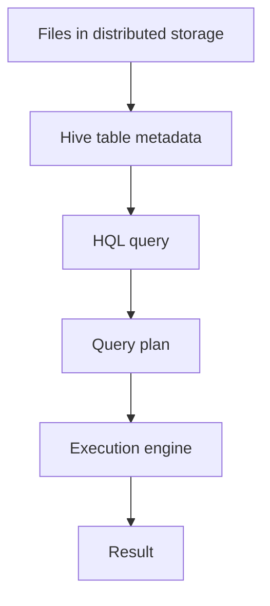

# DADS6002: Apache Hive

ชุด Master Notes ภาษาไทยจาก `dads6002_02_hive.pdf` จำนวน 21 หน้า ออกแบบสำหรับผู้อ่านที่รู้จัก HDFS และ MapReduce แล้ว แต่ยังไม่เคยใช้ Hive

## ลำดับการเรียน

1. [021 Hive Foundations and Storage](021_hive_foundations_and_storage.md) — PDF หน้า 1–5
2. [022 HQL, Schema, SerDe and Loading](022_hql_schema_serde_and_loading.md) — PDF หน้า 6–15
3. [023 Hive Analytics and Joins](023_hive_analytics_and_joins.md) — PDF หน้า 16–21

## ภาพรวมแบบไม่ใช้ศัพท์เทคนิค

HDFS เก็บไฟล์ขนาดใหญ่ได้ดี แต่ไม่รู้ว่าแต่ละตำแหน่งในไฟล์หมายถึงคอลัมน์อะไร หากต้องเขียน MapReduce ทุกครั้งที่ต้องการนับ จัดกลุ่ม หรือ join งานวิเคราะห์จะใช้แรงมาก Hive จึงเพิ่มชั้น “ตารางและ SQL” ไว้เหนือข้อมูลกระจาย ผู้ใช้บอกโครงสร้างและเขียน HQL จากนั้น Hive วางแผนและส่งงานให้ execution engine ทำ

Hive ไม่ได้เปลี่ยน HDFS ให้เป็น OLTP database และ table metadata ไม่ได้แปลว่าข้อมูลทุกแถวถูกเก็บในฐานข้อมูล Metastore ตัว Metastore เก็บคำอธิบาย เช่น schema, location และ partition ส่วนข้อมูลจริงอยู่ใน distributed storage

## Cumulative Learning Objectives

เมื่อเรียนครบชุด ผู้อ่านควรสามารถ

1. อธิบายขอบเขตของ Hive และเส้นทางจาก HQL ไปสู่ผลลัพธ์ได้
2. แยกข้อมูลจริงออกจาก metadata และตัดสินใจเลือก managed/external table ได้
3. ออกแบบ partition และ bucket โดยอธิบายประโยชน์กับต้นทุนได้
4. สร้าง database/table กำหนด data type, row format, SerDe และโหลดข้อมูลได้
5. อธิบาย schema-on-read และวินิจฉัย `NULL` จาก schema mismatch ได้
6. อ่านและเขียน aggregation, CTAS และ join หลายชนิดได้
7. ตรวจความถูกต้องของผลลัพธ์ด้วย row count, unmatched keys และ reconciliation ได้

## Dependency Map

`HDFS file` → `schema` → `Metastore` → `table` → `partition/bucket` → `SerDe` → `LOAD/INSERT` → `SELECT/GROUP BY` → `JOIN` → `validation`

## แผนระดับความลึก

| ระดับ | หัวข้อ |
|---|---|
| Core | Hive mental model, metadata/data separation, managed vs external, partitioning, schema-on-read, aggregation และ joins |
| Supporting | buckets, file formats, ACID compaction, SerDe, primitive/complex types และ CTAS |
| Reference | legacy CLI, regex syntax และคำสั่ง DDL รายคำสั่ง |

## Integrated Capstone: Hospital Purchase Log Mart

ให้ออกแบบ Hive solution สำหรับไฟล์ log การสั่งซื้อรายวัน มี `event_time`, `hospital`, `vendor_id`, `po_id`, `amount` และ `status`

ผลงานต้องประกอบด้วย

1. เลือก managed หรือ external table พร้อมเหตุผลด้าน ownership และผลของ `DROP TABLE`
2. เลือก partition key ที่ช่วย query รายเดือนโดยไม่สร้าง small directories มากเกินไป
3. เขียน DDL และตัวอย่างโหลดข้อมูล
4. สรุปยอดรายเดือนและ join กับ vendor master โดยรักษา PO ที่ยังหา vendor ไม่พบ
5. แสดง validation ได้แก่ source count, loaded count, unmatched vendor count และ total amount reconciliation
6. อธิบาย failure อย่างน้อยสองแบบและวิธีตรวจ

## Cumulative Exam Blueprint

| ความสามารถ | ระดับ | หลักฐาน |
|---|---|---|
| อธิบาย Hive architecture | Explain | วาด data/metadata/query flow |
| ออกแบบ partition และ table ownership | Analyze/Evaluate | ให้เหตุผลจาก query pattern และ lifecycle |
| สร้าง schema และ parse file | Apply | DDL, SerDe และ load plan |
| วิเคราะห์ aggregation/join | Apply/Analyze | HQL และ trace ผลลัพธ์ |
| ตรวจความถูกต้อง | Evaluate | reconciliation และ unmatched analysis |
| ออกแบบ solution | Create | Integrated Capstone |

## Final Revision Checklist

- อธิบายได้ว่า Hive คืออะไรและไม่ใช่อะไร
- แยก Metastore metadata ออกจากไฟล์ข้อมูลจริงได้
- ทำนายผลของการ drop managed/external table ได้
- อธิบาย partition pruning และอันตรายของ partition cardinality สูงได้
- อธิบาย SerDe และ schema-on-read จากตัวอย่าง malformed row ได้
- trace inner, left, right, full outer และ left semi join ได้
- ตรวจ row multiplication และ unmatched keys หลัง join ได้

## Source Coverage Audit

| PDF | Primary home |
|---|---|
| หน้า 1–3: Hive, ACID, Metastore, data organization | บท 021 |
| หน้า 4–5: tables, partitions, buckets | บท 021 |
| หน้า 6–8: CLI, DDL, managed/external tables | บท 022 |
| หน้า 9–12: RegexSerDe และ regex | บท 022 |
| หน้า 13–15: types, schema-on-read, loading | บท 022 |
| หน้า 16–17: grouping, aggregates, CTAS | บท 023 |
| หน้า 18–21: joins | บท 023 |

## หมายเหตุเรื่องเวอร์ชัน

สไลด์สะท้อน Hive แบบดั้งเดิมที่ใช้ MapReduce และ CLI เป็นหลัก บันทึกชุดนี้รักษาเนื้อหาสำหรับการเรียน แต่แยกคำอธิบายปัจจุบันไว้ชัดเจน เช่น native Hive indexes ถูกนำออกตั้งแต่ Hive 3.0 และงานจริงมักใช้ Beeline/HiveServer2 กับ execution engine ที่ตั้งค่าไว้

## References

- เอกสารหลัก: `dads6002_02_hive.pdf`, 21 หน้า
- [Apache Hive Language Manual](https://hive.apache.org/docs/latest/language/)
- [Apache Hive DDL](https://hive.apache.org/docs/latest/language/languagemanual-ddl/)
- [Managed vs. External Tables](https://hive.apache.org/docs/latest/language/managed-vs--external-tables/)
- [Hive Transactions](https://hive.apache.org/docs/latest/user/hive-transactions/)
