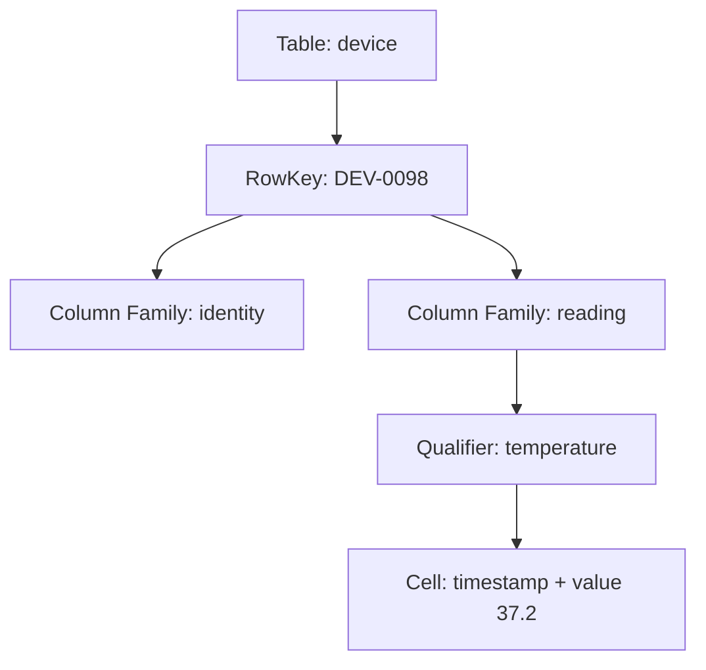
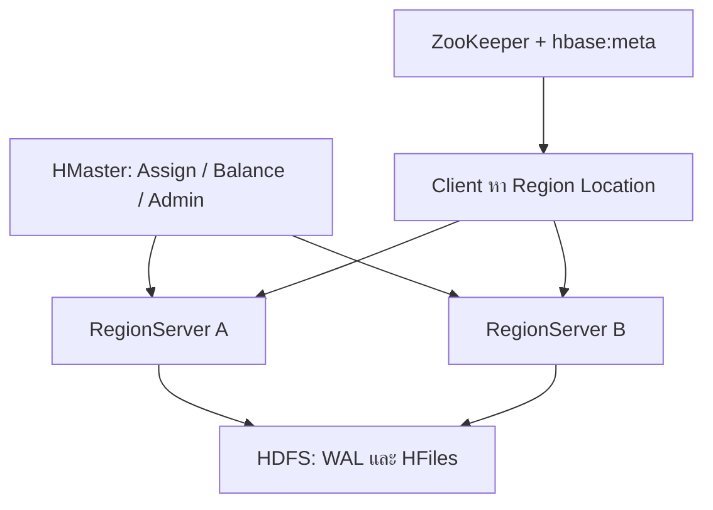
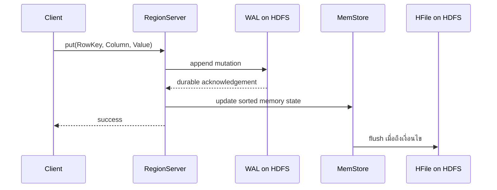
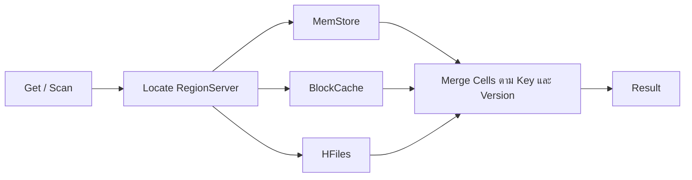

# 03 — Apache HBase: จาก RowKey สู่ฐานข้อมูลแบบกระจายสำหรับการอ่าน–เขียนระดับแถว

> **แหล่งเนื้อหาหลัก:** [Lecture — dads6002_03_hbase.pdf](../lecture/dads6002_03_hbase.pdf) หน้า 1–16 และ [Lab — lab_03_hbase.pdf](../lab/lab_03_hbase.pdf) หน้า 1–7

[← Course Syllabus](00_course_syllabus.md) | [บทก่อนหน้า: Hive](02_hive.md)

## จาก Hive มาสู่ HBase: ปัญหาที่ระบบเดิมยังตอบไม่ดี

สมมติเครือโรงพยาบาลเก็บเหตุการณ์อุปกรณ์การแพทย์หลายปีไว้ใน HDFS และใช้ Hive สรุปจำนวนแจ้งเตือนรายวัน วิธีนี้เหมาะกับการอ่านข้อมูลจำนวนมากเพื่อหาผลรวม แต่หน้าจอปฏิบัติการต้องเปิดสถานะล่าสุดของอุปกรณ์ `DEV-0098` ทันทีและบันทึกค่าชีพจรใหม่ทุกไม่กี่วินาที หากทุกคำขอต้องเริ่ม batch job เพื่อสแกนไฟล์ คำตอบจะช้าและมี overhead สูง

HBase แก้โจทย์อีกแบบหนึ่ง: application รู้ key ของแถวที่ต้องการและต้องการอ่านหรือเขียนแถวนั้นอย่างรวดเร็วในชุดข้อมูลขนาดใหญ่ HBase ยังเก็บข้อมูลกระจายบนหลายเครื่องและใช้ HDFS เป็น storage ชั้นล่าง แต่เพิ่ม data model, index ตาม RowKey, write path และ read path สำหรับการเข้าถึงแบบสุ่ม ดังนั้น HBase ไม่ได้มาแทน Hive ทุกกรณี Hive เด่นที่การวิเคราะห์หลายแถวด้วยภาษาคล้าย SQL ส่วน HBase เด่นที่ lookup, range scan และ update ตาม RowKey

| คำถาม | Hive เหมาะกว่า | HBase เหมาะกว่า |
|---|---|---|
| ยอดขายรวมรายจังหวัดตลอด 3 ปี | ใช่ เพราะเป็น analytical scan/aggregation | ไม่ใช่จุดเด่น |
| เปิดข้อมูลลูกค้าจาก customer ID | อาจทำได้แต่ไม่ใช่ low-latency serving หลัก | ใช่ หาก RowKey ออกแบบจาก ID |
| Join หลายตารางแบบ ad hoc | HQL รองรับ | ไม่มี native join แบบ RDBMS |
| เพิ่มค่าตัวนับของแถวเดียว | ไม่ใช่ workload หลัก | รองรับ atomic operation ระดับแถว |

## ทำความเข้าใจ HBase สองรอบ

### รอบแรก: มองข้อมูลหนึ่ง Row ให้ครบ

สมมติ HBase Table เก็บข้อมูลอุปกรณ์ โดยหนึ่งอุปกรณ์แทนด้วยหนึ่ง **Row** และระบุด้วย **RowKey** เช่น `DEV-0098` ข้อมูลภายใน Row ถูกจัดกลุ่มด้วย **Column Family** ที่กำหนดไว้ล่วงหน้า เช่น `identity` และ `reading` แต่แต่ละ Row ไม่จำเป็นต้องมี Columns เหมือนกันทั้งหมด อุปกรณ์วัดอุณหภูมิอาจมี `reading:temperature` ขณะที่เครื่องวัดความดันมี `reading:systolic` และ `reading:diastolic`

ชื่อที่ต่อท้าย Column Family เช่น `temperature` หรือ `systolic` เรียกว่า **Column Qualifier** พิกัดของค่าหนึ่งจุดหรือ **Cell** จึงไม่ได้ระบุด้วยเลขแถวและชื่อคอลัมน์เท่านั้น แต่ประกอบด้วย RowKey, Column Family, Column Qualifier และ Timestamp เมื่อเขียนค่าใหม่ HBase สามารถเก็บค่าเดิมเป็น Version ก่อนหน้าได้ตามนโยบายของ Column Family

### รอบที่สอง: เชื่อม Data Model กับพฤติกรรมของระบบ

HBase จัดเรียง Rows ตาม Bytes ของ RowKey และแบ่งช่วงของ Rows ออกเป็น **Regions** ซึ่งกระจายให้ **RegionServers** ดูแล Data Model จึงสัมพันธ์กับ Runtime โดยตรง: การออกแบบ RowKey มีผลต่อทั้งตำแหน่งข้อมูล ลำดับ Scan และการกระจายภาระ ส่วนการวาง Column Qualifiers ไว้ใน Column Family เดียวกันมีผลต่อการจัดเก็บ การอ่าน และ Lifecycle ของข้อมูลกลุ่มนั้น

ตัวอย่างข้อมูลจริงหนึ่ง Cell:

```text
RowKey:        DEV-0098
Column:        reading:temperature
Timestamp:     1726209000000
Value:         37.2
```

คำว่า column ใน HBase จึงเขียนเป็น `family:qualifier` เช่น `reading:temperature` โดย `reading` คือกลุ่มกายภาพที่ตั้งค่า storage ร่วมกัน ส่วน `temperature` คือชื่อรายการภายในกลุ่ม

ภาพนี้ควรอ่านจากนอกเข้าใน: Table มีหลาย Rows, Row หนึ่งถูกระบุด้วย RowKey, ภายใน Row มี Column Families และค่าหนึ่ง Cell ต้องระบุทั้ง Family, Qualifier และ Timestamp การเห็นลำดับ containment นี้ช่วยป้องกันการมอง HBase เหมือนตาราง SQL ที่ทุก Row ต้องมี Columns ชุดเดียวกัน



## NoSQL ไม่ได้แปลว่าไม่มี Schema

**จากเอกสาร หน้า 1–2:** NoSQL เป็นคำกว้างซึ่งรวม document, key-value, graph และ column-family databases โดย HBase อยู่ในกลุ่ม column-family และมีต้นแบบจาก Google Bigtable

NoSQL ไม่ได้หมายถึงฐานข้อมูลทุกชนิดทำงานเหมือนกัน และไม่ได้หมายถึงห้ามใช้ SQL โดยนิยาม คำที่ปลอดภัยกว่าคือ “ฐานข้อมูลที่ไม่ยึด relational model แบบดั้งเดิมเป็นแกนหลัก” แต่ละประเภทออกแบบตาม access pattern ต่างกัน HBase จัดแถวตาม RowKey และจัด columns เป็น families จึงไม่ควรถูกมองเป็นตาราง RDBMS ที่เพียงมี column มากขึ้น

คำว่า **schema-less** ในสไลด์ควรอ่านเป็น **schema-flexible** เพราะ HBase ยังมีโครงสร้างที่ต้องออกแบบ Table และ Column Families ต้องประกาศก่อนใช้งาน เพียงแต่ Column Qualifiers ภายใน family สามารถเกิดต่างกันในแต่ละแถวได้ [Apache HBase Data Model](https://hbase.apache.org/docs/datamodel/) อธิบายว่า families คงที่ใน schema แต่ qualifiers เปลี่ยนและต่างกันระหว่าง rows ได้

## Data Model จากใหญ่ไปเล็ก

### Table และ RowKey

Table เป็น namespace ของ rows ทั้งหมด ทุก row ต้องมี RowKey ที่ไม่ซ้ำภายใน table และ HBase จัด rows ตามลำดับ byte ของ RowKey RowKey ไม่มีชนิดข้อมูลระดับฐานข้อมูลให้เราเลือกแบบ `INT` หรือ `VARCHAR`; application แปลงค่าของตนเป็น byte array ดังนั้นวิธี encode จึงมีผลต่อทั้งลำดับและตำแหน่งที่ข้อมูลถูกเก็บ

RowKey ทำหน้าที่พร้อมกันหลายอย่าง: ระบุแถว, เป็น index หลัก, กำหนดลำดับ scan และมีอิทธิพลต่อ Region ที่รับ read/write ถ้าเลือกผิด เราไม่สามารถแก้ด้วย secondary index หรือ join แบบ relational ได้ง่าย การออกแบบจึงเริ่มจากคำถามที่จะอ่าน ไม่ใช่เริ่มจากรายชื่อ attributes

### Column Family และ Column Qualifier

Column Family เป็นหน่วยจัดเก็บกายภาพและ configuration เช่น compression, versions หรือ TTL Columns ใน family เดียวกันถูกเก็บใกล้กัน จึงควรวางข้อมูลที่มักอ่านพร้อมกันและมีลักษณะ lifecycle ใกล้กันไว้ด้วยกัน การมี families จำนวนมากเพิ่ม MemStore และไฟล์ต่อ Region จึงไม่ควรสร้าง family ต่อ field

Column Qualifier คือชื่อย่อยหลังเครื่องหมาย colon เช่น `profile:name` และ `profile:address` Qualifier เพิ่มได้โดยไม่ alter schema และบาง row อาจไม่มี qualifier นั้นเลย เมื่อไม่มีค่า HBase ไม่จำเป็นต้องเก็บ `NULL` placeholder แบบตารางกว้างทั่วไป นี่คือความหมายของ sparse table

ตัวอย่าง Person Table จากสไลด์สามารถเขียนเป็น:

| RowKey | `personal:name` | `personal:address` | `demographic:birthdate` | `demographic:gender` |
|---|---|---|---|---|
| P001 | Mali | Bangkok | 1990-04-11 | F |
| P002 | Anan | - | 1985-08-20 | - |

เครื่องหมาย `-` ในตารางอธิบายหมายถึง Cell ไม่มีอยู่จริง ไม่ใช่ string ที่ HBase ต้องเก็บ

### Cell และ Version

Cell ถูกระบุด้วยพิกัด `{RowKey, Column Family, Column Qualifier, Timestamp}` และเก็บ Value เป็น bytes ถ้า `put` ค่าใหม่ที่พิกัดเดียวกันแต่ timestamp ใหม่ ระบบมีหลาย versions ของ Cell ได้ โดยอ่านรุ่นล่าสุดก่อนตามลำดับ timestamp อย่างไรก็ตามจำนวน versions ที่เก็บขึ้นกับ configuration ของ Column Family; ค่าเริ่มต้นที่สไลด์ระบุคือหนึ่ง version จึงห้ามสรุปว่าทุก update มีประวัติย้อนหลังให้ใช้เสมอ

Version ไม่ใช่ audit log ที่สมบูรณ์โดยอัตโนมัติ เพราะ retention, TTL, compaction และ delete markers มีผลต่อสิ่งที่ยังอ่านได้ หากข้อมูลทางการแพทย์หรือการเงินต้องมีประวัติที่พิสูจน์ได้ ควรออกแบบ event/audit table และ retention policy ชัดเจน ไม่ควรพึ่งหลาย versions โดยไม่กำหนดข้อกำกับ

## Strong Consistency มีขอบเขตอย่างไร

**จากเอกสาร หน้า 2:** HBase ให้ random row-level read/write, strong consistency และ flexible data modeling

คำว่า strong consistency หมายความว่า หลังการเขียนแถวสำเร็จ การอ่านตาม guarantee ของระบบจะไม่ควรเห็นค่าก่อนหน้าราวกับการเขียนยังไม่เกิด แต่ต้องระวังขอบเขต: HBase ให้ atomicity และ consistency ที่ระดับ row เป็นหลัก ไม่ได้ทำให้การแก้หลาย rows กลายเป็น transaction เดียวแบบฐานข้อมูล relational โดยอัตโนมัติ [Apache HBase Data Model](https://hbase.apache.org/docs/datamodel/) อธิบาย ACID semantics และข้อจำกัดไว้ในส่วน Data Model

ตัวอย่างเช่น การเพิ่ม counter `share` ใน row เดียวสามารถทำแบบ atomic ได้ แต่การหัก stock จาก row A และเพิ่ม stock ให้ row B ต้องพิจารณาความล้มเหลวระหว่างสองคำสั่งเอง หากธุรกิจต้องการ all-or-nothing ข้ามหลาย rows อาจต้องเปลี่ยน data model หรือเลือกฐานข้อมูลที่รองรับ transaction นั้นโดยตรง

## Decision Framework: ควรใช้ HBase หรือไม่

HBase เหมาะเมื่อชุดข้อมูลใหญ่ กระจายอยู่บนคลัสเตอร์ access pattern รู้ RowKey หรือช่วง RowKey และต้องอ่าน/เขียนระดับแถวจำนวนมากอย่างสม่ำเสมอ มันไม่ใช่ตัวเลือกอัตโนมัติเมื่อได้ยินคำว่า Big Data

ไม่ควรเริ่มด้วย HBase หากต้องการ joins แบบ ad hoc, transaction ข้ามหลาย rows, secondary indexes หลายชุด หรือ dataset เล็กที่ RDBMS จัดการได้ง่ายกว่า ต้นทุนของ HBase รวมถึง cluster operations, schema ที่ผูกกับ access pattern และความเสี่ยงจาก RowKey hotspot

## Common Misconceptions

- **“HBase เป็น Hive ที่เร็วกว่า”** ไม่จริง เพราะ workload และ data model ต่างกัน
- **“Schema-less จึงไม่ต้องออกแบบ”** ไม่จริง การออกแบบ RowKey และ Column Family เป็นหัวใจ
- **“ทุก column ต้องมีในทุก row”** ไม่จริง Qualifiers เป็น sparse ได้
- **“หลาย versions เท่ากับ audit trail”** ไม่เสมอ เพราะ retention และ compaction มีผล
- **“Strong consistency เท่ากับ transaction ทั้งตาราง”** ไม่จริง Guarantee หลักอยู่ระดับ row

## ภาพรวมจาก Table ไปสู่ Storage

สมมติ HBase Table เก็บข้อมูลอุปกรณ์ที่มี RowKey ตั้งแต่ `DEV-0001` ถึง `DEV-9999` เมื่อข้อมูลเพิ่มขึ้น HBase จะแบ่ง Table ตามช่วง RowKey ออกเป็นหลาย **Regions** เช่น Region แรกอาจครอบคลุม `DEV-0001` ถึงก่อน `DEV-3000` และ Region ถัดไปครอบคลุมช่วงต่อจากนั้น แต่ละ Region ถูกมอบหมายให้ **RegionServer** หนึ่งตัวให้บริการในขณะหนึ่ง และ RegionServer หนึ่งตัวสามารถดูแลหลาย Regions ได้

Client ต้องรู้ก่อนว่า RowKey ที่ต้องการอยู่ใน Region ใดและ RegionServer ใดกำลังให้บริการ ข้อมูลตำแหน่งนี้อยู่ใน `hbase:meta` เมื่อ Client พบปลายทางแล้ว จึงติดต่อ RegionServer เพื่ออ่านหรือเขียนข้อมูลโดยตรง

เมื่อ RegionServer รับข้อมูลใหม่ ระบบบันทึกการเปลี่ยนแปลงลง **Write-Ahead Log (WAL)** เพื่อรองรับการกู้คืน แล้วเก็บข้อมูลล่าสุดไว้ใน **MemStore** ซึ่งอยู่ใน Memory เมื่อ MemStore ถึงเงื่อนไขที่กำหนด ข้อมูลจะถูก **Flush** ลงเป็น **HFile** บน HDFS ส่วน **BlockCache** เก็บ Data Blocks ที่ถูกอ่านบ่อยไว้ใน Memory เพื่อลดการอ่านจาก Disk คำเหล่านี้เป็นชื่อ Component จริงที่ต้องใช้ติดตาม Write Path, Read Path และ Failure Recovery ในส่วนถัดไป

แผนภาพต่อไปนี้แยก Control Plane ออกจาก Data Plane: HMaster ดูแลการมอบหมาย Regions และงานบริหาร ขณะที่ Client อ่านหรือเขียนกับ RegionServer ที่ถือ Region เป้าหมายโดยตรง หลังจากค้นตำแหน่งผ่าน metadata แล้ว



## Region และการกระจาย Table

HBase แบ่ง table ตามช่วง RowKey เป็น **Regions** แต่ละ Region มี start key และ end key และถูกเปิดให้ RegionServer หนึ่งตัวรับบริการในเวลาหนึ่ง เมื่อ Region โตถึงเกณฑ์ ระบบสามารถ split ออกเป็นสองช่วง ทำให้ table ขยายข้าม RegionServers ได้

คำว่า Region ไม่เหมือน HDFS block Region เป็นช่วงเชิงตรรกะของ rows ใน HBase และภายในมี Store แยกตาม Column Family ส่วน HFile เป็นไฟล์จริงบน HDFS HDFS ยังคงรับผิดชอบ durability ของ bytes แต่ HBase รับผิดชอบความหมายของ rows, columns, versions และการส่งคำขอไป Region ที่ถูกต้อง

## องค์ประกอบและขอบเขตความรับผิดชอบ

### HMaster

HMaster จัดการงานควบคุมระดับคลัสเตอร์ เช่น assign/reassign Regions, load balancing และ schema/admin operations แต่ client ไม่จำเป็นต้องส่งทุก `get` หรือ `put` ผ่าน HMaster หลังรู้ตำแหน่ง Region แล้ว client ติดต่อ RegionServer โดยตรง หาก HMaster หยุดชั่วคราว existing Regions อาจยังให้บริการได้บางส่วน แต่ admin operations, reassignment และ recovery จะได้รับผล จึงต้องมี high availability ตามการติดตั้งจริง

### RegionServer

RegionServer รับ read/write ของ Regions ที่ตนเปิดอยู่ มันดูแล WAL, MemStores, BlockCache และ Stores/HFiles ของ Regions เหล่านั้น สไลด์กล่าวว่า RegionServer รันบน HDFS DataNode ซึ่งเป็น deployment ที่มัก colocate เพื่อ locality แต่ควรแยกว่า RegionServer กับ DataNode เป็นคนละ service ไม่ใช่องค์ประกอบเดียวกัน

### ZooKeeper และ `hbase:meta`

สไลด์อธิบาย flow รุ่นดั้งเดิมว่า ZooKeeper ช่วยบอกตำแหน่ง META และ META บอกว่า RowKey อยู่ Region ใด แก่นที่ควรจำคือ client ต้องมี **bootstrap location** แล้วค้น mapping จาก key range ไป RegionServer ก่อน caching ตำแหน่งไว้ คำขอครั้งถัดไปจึงไม่ต้องค้นใหม่ทุกครั้ง เมื่อ Region ย้ายหรือ split แล้ว cache เก่า Client จะ refresh location

ใน HBase รุ่นต่างกัน bootstrap mechanism และบทบาท ZooKeeper อาจต่างกัน จึงไม่ควรจำขั้น RPC แบบตายตัวข้าม version แต่ `hbase:meta` ยังคงเป็น catalog สำคัญของ Region locations ดู architecture ปัจจุบันได้จาก [Apache HBase Architecture](https://hbase.apache.org/docs/architecture/)

## Write Path: จาก `put` ไปสู่ HFile

สมมติ application เขียน `DEV-0098, reading:temperature, 37.2` กระบวนการเชิงแนวคิดเป็นดังนี้:

1. Client แปลง RowKey และค่าต่าง ๆ เป็น bytes แล้วหา Region ที่ครอบคลุม `DEV-0098`
2. Client ส่ง `put` ไปยัง RegionServer ที่ดูแล Region นั้น
3. RegionServer บันทึกการเปลี่ยนแปลงลง **Write-Ahead Log (WAL)** เพื่อให้มีหลักฐาน durable ก่อนข้อมูลใน memory สูญหาย
4. RegionServer เพิ่ม Cell ลง **MemStore** ของ Column Family ที่เกี่ยวข้อง MemStore เก็บข้อมูลเรียงตาม key
5. เมื่อเงื่อนไข flush ถึงเกณฑ์ MemStore ถูกเขียนเป็น HFile ใหม่บน HDFS
6. หลังข้อมูลใน HFile ปลอดภัย ส่วน WAL ที่ไม่จำเป็นต่อ recovery แล้วจึงถูกจัดการตาม lifecycle

WAL กับ MemStore จึงแก้คนละปัญหา WAL แก้ durability เมื่อ RegionServer ล้ม ส่วน MemStore รวม random writes ให้กลายเป็น sequential sorted file write ถ้าบันทึกเฉพาะ MemStore การดับของ process อาจทำให้ค่าที่ตอบรับแล้วหาย แต่ถ้าเขียน HFile ใหม่ทุก Cell ระบบจะสร้าง small files และ I/O มากเกินไป



### Failure และ recovery

ถ้า RegionServer ล้มก่อน MemStore flush, HMaster/cluster coordination ตรวจพบ server failure, Regions ถูก assign ไปยัง RegionServers อื่น และ WAL ที่เกี่ยวข้องถูก replay เพื่อสร้าง updates ที่ยังไม่อยู่ใน HFiles ใหม่ การ recovery จึงอาศัยทั้ง HFiles ที่ durable อยู่แล้วและ WAL ของข้อมูลใหม่ ไม่ใช่อาศัย MemStore ซึ่งหายไปพร้อม process

การที่ `put` คืน success ยังไม่เท่ากับมี HFile ใหม่ทันที สิ่งที่ต้องพิสูจน์คือ WAL durability และ acknowledgement semantics ตาม configuration นอกจากนี้ HDFS replication ป้องกัน disk/node failure แต่ไม่แทน backup เมื่อผู้ใช้ลบข้อมูลผิด

## Read Path: ระบบค้นค่าจากที่ใด

สมมติ client ขอค่าล่าสุดของ `DEV-0098` หลังหา RegionServer แล้ว ระบบต้องพิจารณาข้อมูลหลายชั้นเพราะค่าล่าสุดอาจเพิ่งเขียนและยังไม่ flush:

1. ตรวจข้อมูลที่เพิ่งเขียนใน MemStore
2. ตรวจ BlockCache สำหรับ HFile blocks ที่เคยอ่านและยังอยู่ใน memory
3. อ่าน StoreFiles/HFiles ที่เกี่ยวข้องจาก storage โดยใช้ indexes, Bloom filters และ metadata ช่วยลดไฟล์/blocks ที่ต้องเปิด
4. รวม candidates ตาม key, timestamp และ delete markers เพื่อคืน version ที่ตรง request

สไลด์ย่อว่า “ค้น BlockCache และ MemStore ก่อน แล้ว binary search HFiles” ซึ่งใช้สร้างภาพรวมได้ แต่ read path จริงไม่ใช่ binary search ทุกไฟล์แบบตรงไปตรงมา และอาจต้องตรวจ HFiles หลายชุด ยิ่งมี HFiles ทับซ้อนกันมาก read amplification ยิ่งสูง นี่คือเหตุผลที่ต้องมี compaction

ภาพนี้แสดงว่า Read ไม่ได้เลือกเพียงแหล่งเดียว ระบบอาจต้องรวม Candidates จากข้อมูลใหม่ใน MemStore, Blocks ที่ Cache ไว้ และ HFiles หลายไฟล์ แล้วตัดสินด้วย Key, Timestamp และ Delete Markers ก่อนคืนผล



## Flush และ Compaction ต่างกันอย่างไร

**Flush** เปลี่ยน MemStore หนึ่งชุดเป็น HFile ใหม่ ทำให้ข้อมูลออกจาก memory ไป storage แต่ไม่ได้รวม HFiles เดิม ดังนั้น flush ถี่เกินไปสร้างไฟล์เล็กจำนวนมาก

**Minor compaction** เลือก HFiles บางชุดใน Store มารวมเป็นไฟล์ใหม่ที่ใหญ่ขึ้น เพื่อลดจำนวนไฟล์ที่ read path ต้องตรวจ ส่วน **Major compaction** พยายาม rewrite HFiles ทั้งหมดของ Store ที่เกี่ยวข้อง เพื่อรวม versions/delete markers ตาม policy และลดไฟล์ แต่ใช้ I/O สูง

ข้อความในสไลด์ที่ว่า major compaction รวม HFiles “ของ table” เป็น HFile เดียวควรตีความในขอบเขต Store/Region ไม่ใช่ทั้งตารางข้ามทุก Regions และ Column Families เพราะ table ขนาดใหญ่ยังคงกระจายเป็นหลาย Regions [Apache HBase Architecture](https://hbase.apache.org/docs/architecture/) อธิบายโครง RegionServer, Regions และ Stores ไว้แยกกัน

| Operation | Input | Output | จุดประสงค์หลัก | ความเสี่ยง |
|---|---|---|---|---|
| Flush | MemStore | HFile ใหม่ | ทำข้อมูลใน memory ให้ durable เป็นไฟล์ | ไฟล์เล็กเพิ่ม |
| Minor compaction | HFiles บางชุด | HFile ที่รวมแล้ว | ลด read amplification | I/O background |
| Major compaction | HFiles ของ Store ตาม scope | ชุดไฟล์ rewrite | รวมข้อมูลและจัดการ obsolete cells | I/O สูงและกระทบ workload |

## BlockCache: เร็วขึ้นแต่ไม่ใช่แหล่งข้อมูลถาวร

BlockCache เก็บ blocks ที่อ่านบ่อยใน memory เมื่อ cache hit ระบบลดการอ่าน storage แต่ถ้า cache เต็ม blocks ที่ใช้น้อยจะถูก evict การ restart RegionServer ทำให้ cache อุ่นใหม่ จึงอาจเห็น latency สูงชั่วคราว Cache ช่วย performance ไม่ใช่ durability และข้อมูลที่ไม่อยู่ใน cache ยังต้องอ่านได้จาก HFiles

## Worked Trace: Cell หนึ่งรายการตลอดวงจร

| เหตุการณ์ | WAL | MemStore | HFile | สิ่งที่ Client อ่านได้ |
|---|---|---|---|---|
| ก่อน `put` | ไม่มี update | ไม่มี | ค่าเดิม 36.8 | 36.8 |
| หลัง `put` สำเร็จ | มี 37.2 | มี 37.2 | ยังเป็น 36.8 | 37.2 จาก merged read |
| หลัง flush | WAL entry เลิกจำเป็นตาม lifecycle | ถูก clear ชุดนั้น | มี 37.2 ในไฟล์ใหม่ | 37.2 |
| หลัง compaction | ตาม lifecycle | - | HFiles ถูก merge/rewrite | 37.2 |

Validation สำคัญคือ read-after-write ได้ค่าที่คาด, timestamp ถูกต้อง, RegionServer restart แล้วยังอ่านค่าได้ และจำนวน HFiles/latency หลัง compaction เปลี่ยนตามสมมติฐานโดยไม่ทำ row count หรือ versions ที่ต้องเก็บหาย

## Troubleshooting และ Decision Practice

| อาการ | สมมติฐาน | หลักฐานที่ตรวจ |
|---|---|---|
| Write latency สูง | WAL/HDFS ช้า, Region hotspot | WAL sync latency, Region request rate |
| Read ช้าหลัง restart | BlockCache เย็น | cache hit ratio และ disk reads |
| Read ช้าลงเรื่อย ๆ | HFiles มาก/read amplification | StoreFile count, compaction queue |
| RegionServer ล้มแล้วบาง row ชั่วคราวเข้าไม่ได้ | Region recovery/reassignment | server log, Region state, WAL replay |
| MemStore สูง | flush pressure หรือ hot Region | MemStore size และ flush metrics |

## ก่อนพิมพ์คำสั่ง: ออกแบบจาก Query ย้อนกลับ

สมมติเราต้องสร้างระบบบันทึกลิงก์ตามตัวอย่างสไลด์ หนึ่ง row แทนหนึ่งเว็บไซต์ ใช้ domain กลับด้าน เช่น `org.hbase.www` เป็น RowKey ข้อมูลชื่อเรื่องอยู่ใน `link:title` และจำนวนแชร์อยู่ใน `statistics:share` Access patterns คือเปิดเว็บไซต์หนึ่งรายการจาก domain, เพิ่ม counter และ scan เว็บไซต์กลุ่มเดียวกัน

การกลับ domain ทำให้ส่วนกว้างอยู่ด้านหน้า เช่น `org.apache.www`, `org.apache.mail` และ `org.apache.jira` เรียงใกล้กัน จึง scan กลุ่ม Apache ได้ง่ายกว่าใช้ `www.apache.org`, `mail.apache.org` และ `jira.apache.org` ซึ่งจะกระจายตาม subdomain [Apache HBase Data Model](https://hbase.apache.org/docs/datamodel/) ใช้แนวคิด reversed domain เป็นตัวอย่าง RowKey เช่นกัน

## HBase Shell และ Schema Lifecycle

เริ่ม Shell ด้วย:

```bash
hbase shell
```

คำสั่งใน HBase Shell ใช้รูปแบบ Ruby/JRuby และชื่อ table, row, column ควรใส่ single quotes ตาม [Apache HBase Shell](https://hbase.apache.org/docs/shell/) ตัวอย่างในสไลด์มี smart quotes จาก PowerPoint ซึ่งต้องเปลี่ยนเป็น ASCII quotes ก่อนรัน

Lab เริ่มด้วย **Namespace** ซึ่งเป็นขอบเขตสำหรับจัดกลุ่ม Tables คล้ายการใช้ชื่อกลุ่มนำหน้า Table ไม่ได้เปลี่ยน Data Model ภายใน Row คำสั่งต่อไปนี้สร้าง Namespace และ Table ชื่อ `t1` ภายในนั้น:

```ruby
create_namespace 'ns_test'
list_namespace
create 'ns_test:t1', 'cf1'
describe 'ns_test:t1'
```

การลบ Namespace ทำได้ต่อเมื่อไม่มี Table เหลืออยู่ จึงต้อง `disable` และ `drop` Table ก่อน แล้วจึง `drop_namespace 'ns_test'` ข้อจำกัดนี้ป้องกันการลบขอบเขตที่ยังมี Objects อยู่โดยไม่ตั้งใจ

สร้าง table ใน default namespace โดยกำหนดสอง Column Families ตั้งแต่ต้น:

```ruby
create 'linkshare', 'link', 'statistics'
list
describe 'linkshare'
```

เหตุที่กำหนด `link` และ `statistics` แยกกันควรมาจาก storage/access policy ไม่ใช่เพียงชื่อสวยงาม เช่น metadata ลิงก์อาจเก็บหลาย versions ส่วน counter อาจมี retention ต่างกัน Qualifiers อย่าง `title`, `url` และ `share` ไม่ต้องประกาศใน `create`

สไลด์สอน workflow แบบเดิมให้ disable ก่อนเปลี่ยน schema:

```ruby
disable 'linkshare'
alter 'linkshare', {NAME => 'link', VERSIONS => 5}
enable 'linkshare'
describe 'linkshare'
```

ความสามารถ online schema change ต่างตาม operation และ HBase version สำหรับการเรียนให้ทำตาม environment ของอาจารย์และอ่าน `help 'alter'` ก่อน หาก disable table clients จะอ่าน/เขียนไม่ได้ชั่วคราว จึงต้องวาง maintenance และตรวจว่า table กลับเป็น enabled

## Put ไม่ใช่ Insert อย่างเดียว

```ruby
put 'linkshare', 'org.hbase.www', 'link:title', 'Apache HBase'
get 'linkshare', 'org.hbase.www'
```

`put` ระบุ table, RowKey, column และ value ถ้า Cell พิกัดเดียวกันยังไม่มี มันสร้างค่าใหม่ หากมีแล้ว `put` ค่าใหม่จะสร้าง version ตาม timestamp และค่าล่าสุดจะถูกอ่านก่อน จึงเป็นทั้ง insert/update ในภาษาทั่วไป แต่ไม่ใช่ SQL `UPDATE` ที่ค้นหลาย rows ด้วย predicate

สำหรับ counter ให้ใช้ atomic increment แทนการอ่านค่าเดิมมาบวกใน client:

```ruby
incr 'linkshare', 'org.hbase.www', 'statistics:share', 1
get_counter 'linkshare', 'org.hbase.www', 'statistics:share'
```

ถ้า client สองตัวอ่านค่า 10 พร้อมกัน แล้วต่างคนเขียน 11 อาจเกิด lost update แต่ `incr` ให้ server ทำการเพิ่มแบบ atomic ตาม row/column operation จึงเหมาะกับ counter มากกว่า read-modify-write ฝั่ง client

## Versions และ Time Range

เขียนสอง versions แบบกำหนด timestamp เพื่อให้ทดลองซ้ำได้:

```ruby
put 'linkshare', 'org.hbase.www', 'link:title', 'Apache HBase v1', 1700000000000
put 'linkshare', 'org.hbase.www', 'link:title', 'Apache HBase v2', 1700000001000

get 'linkshare', 'org.hbase.www', {
  COLUMN => 'link:title',
  VERSIONS => 2
}
```

คำสั่งจะคืนสอง versions ได้ก็ต่อเมื่อ Column Family ตั้ง `VERSIONS` ไว้เพียงพอ หากยังเป็นค่าเริ่มต้นหนึ่ง version ผลอาจเห็นเพียงล่าสุด การกำหนด `{TIMERANGE => [start, end]}` ใช้ช่วง timestamp หน่วย milliseconds และควรตรวจ semantics ของปลายช่วงตาม version; โดยทั่วไป start รวมและ end ไม่รวม

Timestamp เป็นส่วนของ Cell coordinate แต่ไม่ควรใช้แทน business event time โดยไม่คิด หากข้อมูลมาถึงช้า server timestamp อาจสะท้อนเวลา ingestion ไม่ใช่เวลาที่เหตุการณ์เกิด ควรเก็บ event time เป็น qualifier เมื่อธุรกิจต้องวิเคราะห์เวลาเหตุการณ์จริง

## RowKey เรียงตาม Bytes: เหตุใด 100 มาก่อน 2

HBase ไม่รู้ว่า string `'100'` เป็นเลขหนึ่งร้อย มันเปรียบเทียบ byte จากซ้ายไปขวา ดังนั้นลำดับของ strings คือ `'1'`, `'10'`, `'100'`, `'11'`, ... `'2'` เพราะทุกค่าที่ขึ้นต้นด้วย byte ของ `1` อยู่ก่อน byte ของ `2`

ถ้าต้องการให้เลขเรียงตามค่าจริง มีสองวิธีหลัก:

- encode integer เป็น fixed-width binary ด้วยกติกาที่รักษาลำดับ
- zero-pad string ให้กว้างเท่ากัน เช่น `000001`, `000002`, `000100`

ต้องเลือกตาม client libraries และช่วงค่า การใช้ `str(number)` โดยไม่ pad แล้วหวังว่า scan จะเรียงเชิงตัวเลขเป็นความผิดพลาดที่พบบ่อย

## Point Get, Range Scan และ Filter

### Point Get

เมื่อรู้ RowKey เต็ม `get` สามารถ locate Region และอ่านแถวเป้าหมายได้:

```ruby
get 'linkshare', 'org.hbase.www', {COLUMN => ['link:title', 'statistics:share']}
```

นี่คือ access pattern ที่ HBase เด่น เพราะไม่ต้องไล่ทุก row

### Range Scan

```ruby
scan 'linkshare', {
  STARTROW => 'org.apache.',
  STOPROW => 'org.apache/'
}
```

แนวคิดสำคัญคือ scan เริ่มที่ key แรกซึ่งมากกว่าหรือเท่ากับ `STARTROW` และหยุดก่อน `STOPROW` โดยไม่จำเป็นต้องมี row ตรงกับ boundary ใน table ชื่อ option ใน HBase Shell ปัจจุบันมักใช้ `STOPROW`; สไลด์ใช้ `ENDROW` จึงต้องตรวจ `help 'scan'` ใน environment ก่อนรัน

การเลือก RowKey ที่ทำให้ข้อมูลซึ่งอ่านร่วมกันมี prefix เดียวกันช่วยให้ range scan มีขอบเขตสั้น แต่ถ้าเขียนทุก key ด้วย prefix เวลาเดียวกันตามลำดับ อาจทำให้ Region ท้ายสุดรับ writes ทั้งหมด เกิด hotspot

### Filter

สไลด์แนะนำ RowFilter, ValueFilter, ColumnRangeFilter, SingleColumnValueFilter และ RegexStringComparator Filters ช่วยตัดผลที่ไม่ตรงเงื่อนไขฝั่ง RegionServer ก่อนส่งกลับ client แต่ไม่ได้สร้าง secondary index อัตโนมัติ หาก filter ต้องตรวจข้อมูลจำนวนมาก ระบบยังอาจ scan rows/cells จำนวนมาก ดังนั้น “ส่งกลับน้อย” ไม่เท่ากับ “อ่านน้อย”

ตัวอย่างตามแนวคิดสไลด์ โดย syntax filter อาจต่างตาม version:

```ruby
show_filters
scan 'linkshare', {
  FILTER => "RowFilter(>, 'binary:org.hbase')"
}
```

ก่อนใช้ filter ให้ถามว่าสามารถ encode เงื่อนไขสำคัญใน RowKey เพื่อจำกัด range ก่อนได้หรือไม่ แล้วค่อยใช้ filter ภายในช่วงนั้น

## RowKey Hotspot: ความเร็วของ Range Scan แลกกับการกระจาย Write

Rows ที่อยู่ติดกันถูกจัดใน Region เดียวกันหรือใกล้กัน คุณสมบัตินี้ทำให้ range scan เร็ว แต่ถ้า RowKeys ใหม่เพิ่มแบบเรียงขึ้น เช่น timestamp อยู่ด้านหน้า writes ล่าสุดทั้งหมดจะมุ่งไป Region ปลายสุด RegionServer หนึ่งตัวรับภาระสูง ขณะที่ตัวอื่นว่าง

แนวทางแก้มี trade-off:

| วิธี | ช่วยอะไร | ต้นทุน |
|---|---|---|
| Salt/hash prefix | กระจาย writes หลาย Regions | การอ่านช่วงต้องยิงหลาย prefixes แล้วรวมผล |
| Reverse timestamp | อ่านค่าล่าสุดก่อนใน entity เดียว | ต้อง encode ให้ถูกและยังเสี่ยง hotspot หากไม่มี entity prefix |
| Composite key เช่น `device#date#event` | เก็บ events ของ device ใกล้กัน | Query ข้าม devices ต้องหลาย scans |
| Pre-split Regions | กระจายโหลดเริ่มต้นเมื่อรู้ key ranges | split ผิดทำให้ Regions ไม่สมดุล |

ไม่มี RowKey ที่ดีที่สุดสากล ต้องเริ่มจาก queries ที่สำคัญที่สุด, write distribution, cardinality และขนาด row แล้วทดสอบด้วยข้อมูลใกล้ production

## Delete, Drop และ Flush

```ruby
delete 'linkshare', 'org.hbase.www', 'link:title'
flush 'linkshare'
```

Delete สร้างเครื่องหมายลบตาม version semantics และ compaction จัดการข้อมูลเก่าในภายหลัง จึงไม่ควรตีความว่าทุก byte หายทันที ส่วน `flush` บังคับ MemStores ของ scope ที่ระบุให้สร้าง HFiles; ใช้เพื่อการทดลอง/ปฏิบัติการ ไม่ควรใช้แก้ performance แบบสุ่มเพราะเพิ่ม StoreFiles ได้

การลบ table ต้อง disable และ drop:

```ruby
disable 'linkshare'
drop 'linkshare'
```

นี่เป็น destructive operation ให้ตรวจ `list`, environment และชื่อ table ก่อนเสมอ สำหรับ Lab ควรใช้ชื่อเฉพาะของตนและเก็บคำสั่งสร้างข้อมูลใหม่ได้

## Guided Lab: Copy, Predict, Execute, Validate

### 1. สร้างและตรวจ schema

```ruby
create 'linkshare_lab', 'link', 'statistics'
describe 'linkshare_lab'
```

ทำนายก่อนรันว่า qualifiers ใดจะปรากฏ แม้ยังไม่ได้ประกาศ จากนั้น `put`:

```ruby
put 'linkshare_lab', 'org.apache.www', 'link:title', 'Apache'
put 'linkshare_lab', 'org.hbase.www', 'link:title', 'HBase'
incr 'linkshare_lab', 'org.hbase.www', 'statistics:share', 1
```

### 2. อ่านและตรวจผล

```ruby
get 'linkshare_lab', 'org.hbase.www'
scan 'linkshare_lab'
```

หลักฐานผ่านคือมีสอง RowKeys, `org.hbase.www` มี title และ counter เท่ากับ 1 และลำดับ scan ตรง byte order

### 3. Modify และ Diagnose

เพิ่ม `org.hive.www` แล้วทำนายตำแหน่ง ทดลอง scan ช่วง จากนั้นเขียน IDs `'1'`, `'2'`, `'10'` ใน table ทดลองและอธิบายเหตุผลของลำดับที่เห็น อย่าแก้ด้วย sort หลังอ่านโดยไม่ตอบว่าการออกแบบ RowKey ควรเปลี่ยนหรือไม่

### 4. Cleanup

```ruby
disable 'linkshare_lab'
drop 'linkshare_lab'
list
```

## Validation และ Troubleshooting

| อาการ | สาเหตุที่เป็นไปได้ | วิธีตรวจ/แก้ |
|---|---|---|
| เห็น version เดียว | Family ตั้ง `VERSIONS => 1` | `describe`, alter version policy แล้วเขียนใหม่ |
| Range scan ไม่ได้ rows ที่คาด | byte order/boundary ผิด | แสดง RowKeys จริงและตรวจ STOPROW exclusive |
| Write บาง Region สูงผิดปกติ | monotonic/hot prefix | Region metrics และ key distribution |
| Filter ช้าแม้คืนไม่กี่แถว | ไม่มี index และ scan ช่วงกว้าง | จำกัด STARTROW/STOPROW หรือ redesign key |
| Alter/drop ไม่ได้ | table state หรือ syntax ต่าง version | `is_enabled`, `help`, `describe` |

## โจทย์ฝึกอธิบายพร้อมแนวคำตอบ

### ข้อ 1 — เปรียบเทียบ Hive กับ HBase จาก Workload

ระบบหนึ่งต้องสร้างรายงานยอดแจ้งเตือนอุปกรณ์ย้อนหลังสามปี ส่วนอีกหน้าจอต้องเปิดสถานะล่าสุดของ `DEV-0098` และเขียนค่าทุกไม่กี่วินาที จงเลือกเครื่องมือและอธิบายด้วยกลไก ไม่ใช่ตอบเพียงว่าเครื่องมือใดเร็วกว่า

**แนวคำตอบ:** รายงานย้อนหลังเหมาะกับ Hive เพราะโจทย์ต้อง Scan และ Aggregate หลาย Records เป็นงานวิเคราะห์แบบ Batch ส่วนหน้าจอรายอุปกรณ์เหมาะกับ HBase เมื่อ Application ทราบ RowKey เพราะ Client สามารถหา Region ที่ครอบคลุม `DEV-0098` แล้วส่ง `get` หรือ `put` ไปยัง RegionServer เป้าหมาย HBase ไม่ได้แทน Hive ในทุกกรณี เนื่องจากไม่มี Native Join แบบ Relational และการ Scan ข้อมูลมหาศาลเพื่อสรุปแบบ Ad Hoc ไม่ใช่จุดเด่น การเลือกจึงมาจาก Access Pattern, Latency และวิธี Update มากกว่าขนาดข้อมูลเพียงอย่างเดียว

### ข้อ 2 — ระบุพิกัดและความหมายของ Cell

ข้อมูล `DEV-0098`, `reading:temperature`, Timestamp `1726209000000`, Value `37.2` ประกอบด้วยส่วนใดบ้าง และเหตุใดจึงกล่าวว่า HBase เป็น Sparse Table ได้

**แนวคำตอบ:** `DEV-0098` คือ RowKey, `reading` คือ Column Family, `temperature` คือ Column Qualifier และ Timestamp ระบุ Version ของ Cell ที่มีค่า `37.2` พิกัดเต็มจึงประกอบด้วย RowKey, Family, Qualifier และ Timestamp Column Family ต้องประกาศใน Schema แต่ Qualifier สามารถเกิดต่างกันในแต่ละ Row ได้ หากอุปกรณ์หนึ่งไม่มี `reading:oxygen` ระบบไม่จำเป็นต้องเก็บ NULL Placeholder นั่นทำให้ Table มีโครงสร้างยืดหยุ่นและ Sparse แต่ไม่ได้หมายความว่าไม่มี Schema เพราะ RowKey และ Families ยังต้องออกแบบอย่างระมัดระวัง

### ข้อ 3 — ติดตาม `put` และวิเคราะห์ RegionServer Failure

หลัง `put` คืน Success แต่ MemStore ยังไม่ Flush หาก RegionServer ล้ม ข้อมูลใหม่จะกู้คืนอย่างไร และเพราะเหตุใด BlockCache ไม่ช่วยในกรณีนี้

**แนวคำตอบ:** RegionServer บันทึก Mutation ลง WAL บน Storage ที่ทนทานก่อนเก็บ State ล่าสุดใน MemStore เมื่อ Server ล้ม MemStore ซึ่งอยู่ใน Memory สูญหาย แต่ Cluster สามารถ Assign Region ไปยัง RegionServer อื่นและ Replay WAL เพื่อสร้าง Mutation ที่ยังไม่อยู่ใน HFile จากนั้นให้บริการร่วมกับ HFiles เดิม BlockCache ไม่ใช่แหล่งกู้คืนเพราะเป็น Cache ของข้อมูลที่อ่านและสามารถถูก Evict หรือสูญหายเมื่อ Process หยุด Durability มาจาก WAL และ HFiles บน HDFS ไม่ใช่ Cache

### ข้อ 4 — วินิจฉัย Write Hotspot จาก RowKey

Table เหตุการณ์ใช้ RowKey เป็น Timestamp ที่เพิ่มขึ้นตลอดเวลา พบว่า RegionServer หนึ่งมี Write Latency สูงมาก ขณะที่เครื่องอื่นว่าง จงอธิบายสาเหตุและเสนอทางเลือกพร้อม Trade-off

**แนวคำตอบ:** HBase เรียง Rows ตาม Bytes ของ RowKey ดังนั้น Keys ใหม่ที่เพิ่มตามเวลาอยู่ปลาย Keyspace และมุ่งไป Region ท้ายช่วงเดียวกัน ทำให้ RegionServer ที่ถือ Region นั้นกลายเป็น Hotspot วิธีแก้อาจเติม Salt หรือ Hash Prefix เพื่อกระจาย Writes แต่ Range Scan ตามเวลาต้องยิงหลาย Prefix แล้วรวมผล หรือใช้ Composite Key เช่น `device#reverse_timestamp` เพื่อให้เหตุการณ์ของอุปกรณ์เดียวอยู่ใกล้กันและค่าล่าสุดมาก่อน แต่ Query ข้ามอุปกรณ์จะต้องหลาย Scans ไม่มีแบบใดดีที่สุดโดยสากล ต้องเลือกตาม Queries หลักและทดสอบ Distribution จริง

### ข้อ 5 — แยก Flush, Minor Compaction และ Major Compaction

ระบบมี HFiles ขนาดเล็กจำนวนมากและ Read Latency เพิ่มขึ้น การสั่ง `flush` ซ้ำ ๆ จะแก้ปัญหาหรือไม่ และควรวิเคราะห์อย่างไร

**แนวคำตอบ:** `flush` ย้ายข้อมูลจาก MemStore ไปเป็น HFile ใหม่ จึงอาจเพิ่มจำนวน StoreFiles และทำให้ Read Amplification แย่ลง ไม่ใช่คำสั่งรวมไฟล์ Minor Compaction รวม HFiles บางส่วนเพื่อลดจำนวนไฟล์ ส่วน Major Compaction Rewrite Files ในขอบเขต Store ที่เกี่ยวข้องและช่วยจัดการ Versions หรือ Delete Markers ตาม Policy แต่ใช้ I/O สูง ก่อนดำเนินการต้องตรวจ StoreFile Count, Compaction Queue, Cache Hit Ratio และ Workload ช่วงเวลา แล้วเลือก Maintenance Window ไม่ควรสั่ง Major Compaction โดยอัตโนมัติในช่วง Peak

## Likely Exam Focus

- อธิบายพิกัด Cell และความต่างระหว่าง Column Family กับ Column Qualifier
- Trace Write Path และ Read Path พร้อม Failure Recovery
- แยก Region, RegionServer, HFile และ HDFS Block
- วิเคราะห์ผลของ Byte Ordering, Range Scan และ RowKey Hotspot
- อธิบาย Versions, Filters, Counters, Flush และ Compaction จากสถานการณ์

## References

- [Lecture — `dads6002_03_hbase.pdf`](../lecture/dads6002_03_hbase.pdf), หน้า 1–16
- [Lab — `lab_03_hbase.pdf`](../lab/lab_03_hbase.pdf), หน้า 1–7
- [Apache HBase: Data Model](https://hbase.apache.org/docs/datamodel/)
- [Apache HBase: Architecture](https://hbase.apache.org/docs/architecture/)
- [Apache HBase: RegionServer](https://hbase.apache.org/docs/architecture/regionserver/)
- [Apache HBase: Catalog Tables](https://hbase.apache.org/docs/architecture/catalog-tables/)
- [Apache HBase: Schema Design](https://hbase.apache.org/docs/schema-design/)
- [Apache HBase: Shell](https://hbase.apache.org/docs/shell/)
