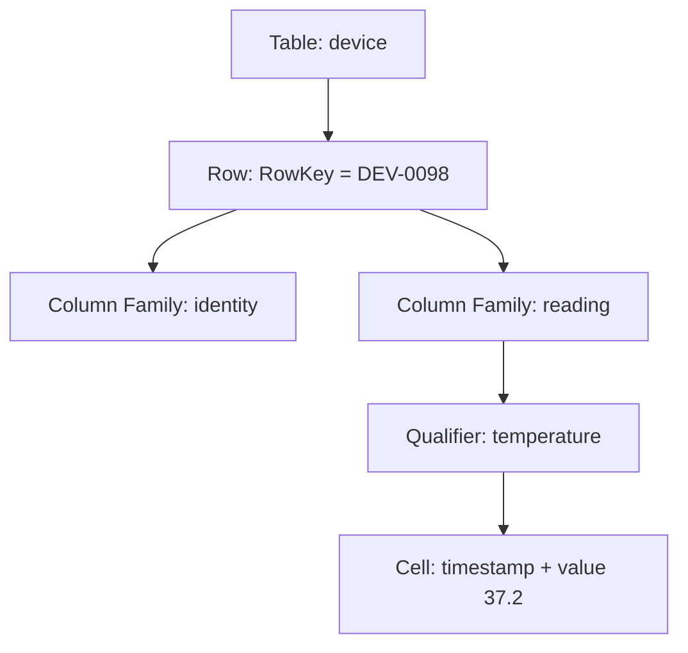
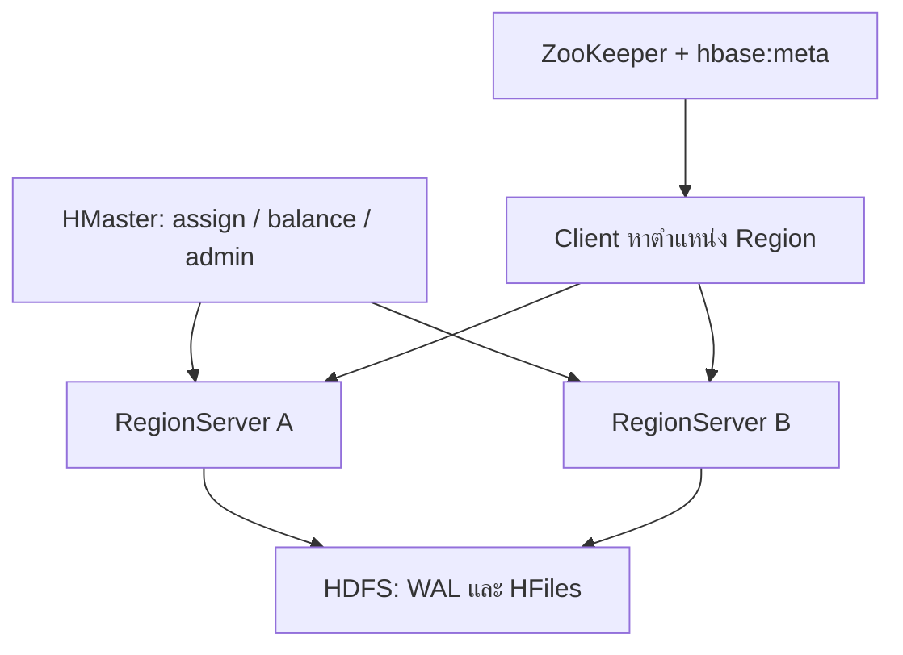
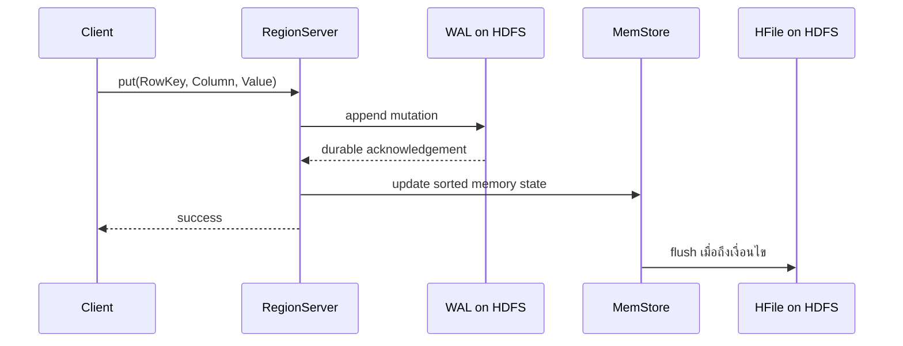
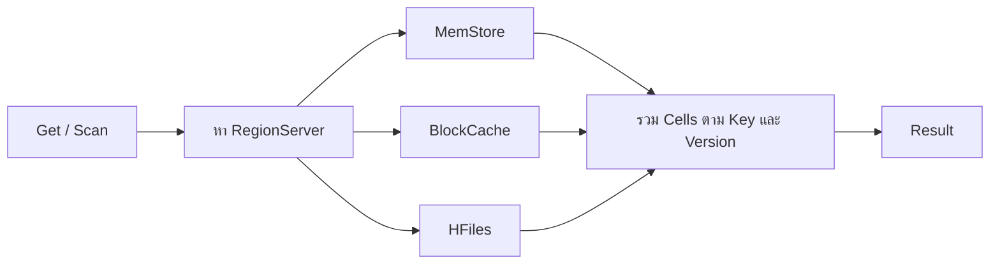

# 03 — Apache HBase (ฉบับอธิบายเพิ่มสำหรับผู้ไม่มีพื้นฐาน)

> **ที่มา:** ปรับปรุงจากสรุป `03_hbase.md` (Lecture หน้า 1–16, Lab หน้า 1–7)
> **หมายเหตุ:** ฉบับนี้เรียบเรียงจากไฟล์สรุปเท่านั้น ยังไม่ได้เทียบกับ slide ต้นฉบับ ส่วนที่เพิ่มจากความรู้ทั่วไปเกี่ยวกับ HBase มีเครื่องหมาย 💡 ส่วนที่ควรเช็กกับ slide/อาจารย์มีเครื่องหมาย ⚠️ (รวมไว้ในหัวข้อ 15)

[← Course Syllabus](00_course_syllabus.md) | [บทก่อนหน้า: Hive](02_hive.md)

---

## 0. วิธีอ่านเอกสารนี้

### เนื้อหาเรียงจาก "เล็กไปใหญ่" และ "ทำไมก่อนอย่างไร"


### ประโยคเดียวที่ควรจำไว้ตลอดทั้งบท

> **HBase คือที่เก็บข้อมูลขนาดใหญ่บนหลายเครื่อง ที่เรียงข้อมูลตาม RowKey ทำให้ "หยิบแถวเดียวหรือช่วงแถว" ได้เร็ว และ "เขียน/แก้ทีละแถว" ได้เร็ว**

เกือบทุกเรื่องในบทนี้ (data model, RowKey, Region, WAL, hotspot) คือผลที่ตามมาจากประโยคนี้

---

## 1. ปูพื้นฐาน: ศัพท์ที่ต้องรู้ก่อน

| ศัพท์ | ความหมายแบบสั้น |
|---|---|
| **Cluster / Node** | กลุ่มคอมพิวเตอร์หลายเครื่องที่ทำงานร่วมกัน แต่ละเครื่องคือ node |
| **HDFS** | ระบบไฟล์ที่กระจายไฟล์ไปเก็บหลาย node และทำสำเนา (replication) ไว้กันเครื่องพัง เหมาะกับไฟล์ใหญ่ที่เขียนต่อท้ายหรือเขียนใหม่ทั้งไฟล์ แต่ **ไม่เหมาะกับการแก้กลางไฟล์** |
| **RDBMS** | ฐานข้อมูลเชิงสัมพันธ์ เช่น MySQL, PostgreSQL ข้อมูลเป็นตารางที่ทุกแถวมีคอลัมน์ชุดเดียวกัน ใช้ SQL และ JOIN ได้ |
| **Hive** | เครื่องมือบน Hadoop ที่ให้เขียนคำสั่งคล้าย SQL (HQL) แล้วแปลงเป็นงานประมวลผลแบบ batch ไปอ่านไฟล์ใน HDFS |
| **Batch processing** | ประมวลผลข้อมูลก้อนใหญ่ในรอบเดียว ใช้เวลาเป็นนาทีถึงชั่วโมง เหมาะกับสรุปผล/รายงาน |
| **Random access** | เข้าถึงข้อมูลชิ้นเดียวตามต้องการทันที เช่น "ขอข้อมูลลูกค้า ID 123" โดยไม่ต้องอ่านทั้งไฟล์ |
| **Latency** | เวลาที่รอจนได้คำตอบ (ยิ่งต่ำยิ่งเร็ว) |
| **Byte array** | ข้อมูลดิบเป็นลำดับของ byte HBase เก็บทุกอย่างเป็น byte array ไม่รู้ว่าเป็นตัวเลขหรือข้อความ |

**จุดที่ทำให้ HBase น่าสนใจ:** HDFS แก้ไขกลางไฟล์ไม่ได้ แต่ HBase ต้องการ "แก้ค่าแถวเดียวเดี๋ยวนี้" HBase จึงมีกลไกพิเศษ (MemStore, WAL, HFile, compaction ในหัวข้อ 6–7) ที่ทำให้ระบบที่ตัวเก็บข้อมูลแก้กลางไฟล์ไม่ได้ ยังรองรับการอ่าน/เขียนรายแถวได้ ถ้าเข้าใจตรงนี้ กลไกที่ดูซับซ้อนจะมีเหตุผลขึ้นมาก

---

## 2. ทำไมต้องมี HBase

### สถานการณ์ตัวอย่าง

โรงพยาบาลเก็บเหตุการณ์จากอุปกรณ์การแพทย์หลายปีไว้ใน HDFS มีความต้องการสองแบบ:

- **แบบ A — รายงาน:** "จำนวนการแจ้งเตือนรายวันในรอบ 3 ปี" ต้องอ่านข้อมูลมหาศาลแล้วรวมผล รอเป็นนาทีได้ → **Hive เหมาะ**
- **แบบ B — หน้าจอปฏิบัติการ:** "เปิดสถานะล่าสุดของอุปกรณ์ `DEV-0098` เดี๋ยวนี้ และบันทึกค่าชีพจรใหม่ทุกไม่กี่วินาที" → ถ้าใช้ Hive ทุกคำขอต้องเริ่ม batch job ไปสแกนไฟล์ ช้าเกินไป → **HBase เหมาะ**

### เปรียบเทียบ

| คำถาม | เหมาะกับ | เหตุผล |
|---|---|---|
| ยอดขายรวมรายจังหวัดตลอด 3 ปี | Hive | ต้องสแกน/รวมผลข้อมูลจำนวนมาก |
| เปิดข้อมูลลูกค้าจาก customer ID | HBase | ถ้าใช้ ID เป็น RowKey หยิบแถวเดียวได้ตรงๆ |
| JOIN หลายตารางแบบ ad hoc | Hive | HBase ไม่มี JOIN แบบ RDBMS ในตัว |
| เพิ่มตัวนับ (counter) ของแถวเดียว | HBase | รองรับ atomic operation ระดับแถว |

**สรุปหัวข้อนี้:** HBase ไม่ใช่ "Hive ที่เร็วกว่า" แต่เป็นเครื่องมือคนละประเภท เลือกจาก **รูปแบบการเข้าถึงข้อมูล (access pattern)** ไม่ใช่จากขนาดข้อมูลอย่างเดียว

---

## 3. Data Model: ข้อมูลใน HBase หน้าตาเป็นอย่างไร

### 3.1 ภาพในหัวที่ช่วยที่สุด: HBase คือ "Map ที่เรียงลำดับแล้ว"

อย่าคิดว่าเป็นตารางแบบ Excel ให้คิดว่าเป็น **พจนานุกรมขนาดใหญ่ที่เรียงตามคีย์** โดยที่ "คีย์" ประกอบด้วย 4 ส่วน และ "ค่า" คือ byte array:

```text
(RowKey, Column Family, Column Qualifier, Timestamp)  →  Value
```

💡 ภาพนี้ตรงกับที่อธิบายในเอกสาร Apache HBase (sorted map) ช่วยให้เข้าใจว่าทำไม HBase ถึงเก่งเรื่อง "หาตาม key" และ "อ่านเป็นช่วง key"

### 3.2 ตัวอย่างค่าหนึ่งจุด (Cell)

```text
RowKey:        DEV-0098
Column:        reading:temperature
Timestamp:     1726209000000
Value:         37.2
```

| ส่วน | ค่าในตัวอย่าง | คืออะไร |
|---|---|---|
| **RowKey** | `DEV-0098` | ตัวระบุแถว (เหมือน primary key) |
| **Column Family** | `reading` | กลุ่มของคอลัมน์ ต้องประกาศตอนสร้างตาราง |
| **Column Qualifier** | `temperature` | ชื่อย่อยในกลุ่ม สร้างเมื่อไรก็ได้ |
| **Timestamp** | `1726209000000` | เวลา (มิลลิวินาที) ระบุ "รุ่น" ของค่า |
| **Value** | `37.2` | ค่าจริง เก็บเป็น bytes |

ชื่อคอลัมน์เขียนเป็น `family:qualifier` เช่น `reading:temperature`

### 3.3 ลำดับชั้น (จากนอกเข้าใน)



### 3.4 Row และ RowKey

- ทุก Row มี RowKey ที่ **ไม่ซ้ำ** ภายใน table
- HBase **เรียง Row ตามลำดับ byte ของ RowKey** เสมอ (ดูผลกระทบในหัวข้อ 4)
- RowKey ไม่มีชนิดข้อมูลแบบ `INT` หรือ `VARCHAR` แอปพลิเคชันต้องแปลงค่าเป็น byte array เอง วิธีแปลงจึงกำหนดลำดับของแถว
- RowKey ทำหน้าที่พร้อมกันหลายอย่าง: ระบุแถว, เป็น index หลัก, กำหนดลำดับการ scan และกำหนดว่าแถวไปอยู่ Region ไหน
- 💡 HBase ไม่มี secondary index ในตัวให้ใช้ง่ายๆ ถ้าออกแบบ RowKey ผิดกับ query ที่ต้องใช้ จะแก้ยาก → **เริ่มออกแบบจาก "คำถามที่จะถาม" ไม่ใช่จากรายชื่อฟิลด์**

### 3.5 Column Family และ Column Qualifier

**Column Family**
- ต้องกำหนดตอนสร้างตาราง (เปลี่ยนภายหลังทำได้ด้วย `alter`)
- เป็น **หน่วยจัดเก็บจริง** (คอลัมน์ในกลุ่มเดียวกันถูกเก็บไว้ด้วยกัน) และเป็นจุดตั้งค่า เช่น compression, จำนวน versions, TTL (อายุข้อมูล)
- ควรจัดข้อมูลที่ **มักอ่านพร้อมกัน และมีอายุ/นโยบายเก็บคล้ายกัน** ไว้ family เดียวกัน
- **อย่าสร้าง family ต่อ field** เพราะแต่ละ family เพิ่ม MemStore และไฟล์ต่อ Region ทำให้เปลืองทรัพยากร (💡 โดยทั่วไปแนะนำให้มี family น้อยๆ เช่น 1–3)

**Column Qualifier**
- คือส่วนหลัง `:` เช่น `profile:name`, `profile:address`
- เพิ่มได้ทันทีโดยไม่ต้องแก้ schema
- แต่ละ row มี qualifier ต่างกันได้

**ตัวอย่างตาราง Person**

| RowKey | `personal:name` | `personal:address` | `demographic:birthdate` | `demographic:gender` |
|---|---|---|---|---|
| P001 | Mali | Bangkok | 1990-04-11 | F |
| P002 | Anan | *(ไม่มี)* | 1985-08-20 | *(ไม่มี)* |

- family ที่ต้องประกาศ: `personal`, `demographic`
- `personal:address` ของ P002 **ไม่ได้ถูกเก็บเป็น NULL** แต่ไม่มี cell นี้อยู่จริง

### 3.6 Cell, Timestamp และ Version

- Cell ถูกระบุด้วย `{RowKey, Family, Qualifier, Timestamp}`
- ถ้า `put` ซ้ำที่ `RowKey + family:qualifier` เดิม ระบบสร้าง cell **ใหม่ที่ timestamp ใหม่** ไม่ได้เขียนทับค่าเดิมทันที การอ่านปกติจะได้ **ค่าล่าสุดก่อน**
- จะเก็บย้อนหลังกี่ version ขึ้นกับการตั้งค่า `VERSIONS` ของ **Column Family**
- ตามสไลด์ค่าเริ่มต้นคือ **1 version** → ห้ามสรุปว่า "ทุกการแก้ไขมีประวัติให้ย้อนดู"

**ทำไมหลาย version ไม่เท่ากับ audit log**
version ที่เก็บไว้อาจหายได้จาก TTL, compaction และ delete marker ถ้าเป็นข้อมูลที่ต้องพิสูจน์ประวัติได้ (การแพทย์ การเงิน) ควรออกแบบตาราง event/audit แยกและกำหนด retention ชัดเจน

**Timestamp ไม่ใช่ event time เสมอไป:** ถ้า server ใส่ timestamp ตอนรับข้อมูล มันคือ "เวลาที่ข้อมูลเข้าระบบ" ไม่ใช่ "เวลาที่เหตุการณ์เกิดขึ้น" ถ้าต้องวิเคราะห์เวลาเหตุการณ์จริง ให้เก็บเป็น qualifier แยก

### 3.7 NoSQL ไม่ได้แปลว่าไม่มี schema

- **NoSQL** = คำกว้างๆ สำหรับฐานข้อมูลที่ไม่ยึด relational model เป็นแกนหลัก มีหลายชนิด: document, key-value, graph, **column-family (HBase อยู่กลุ่มนี้)**
- HBase มีต้นแบบจาก **Google Bigtable**
- สไลด์ใช้คำว่า schema-less แต่ควรเข้าใจว่าเป็น **schema-flexible**:
  - **ต้องกำหนดล่วงหน้า:** table, column family (และ RowKey ที่ต้องออกแบบ)
  - **ยืดหยุ่น:** qualifier ในแต่ละ row

**Sparse table:** เพราะไม่มีค่าก็ไม่ต้องเก็บอะไรเลย ตารางที่มีคอลัมน์เยอะแต่แต่ละแถวใช้ไม่กี่คอลัมน์จึงไม่เปลืองที่ (ต่างจาก RDBMS ที่มักต้องมีช่อง NULL)

### 3.8 Strong Consistency มีขอบเขตแค่ไหน

- **Strong consistency:** เมื่อเขียนแถวสำเร็จแล้ว การอ่านหลังจากนั้นต้องเห็นค่าใหม่ ไม่เห็นค่าเก่าเหมือนการเขียนยังไม่เกิด
- 💡 เหตุที่ทำได้: แต่ละ Region ถูกให้บริการโดย **RegionServer เพียงตัวเดียว** ในเวลาหนึ่ง (หัวข้อ 5) ทุกอ่าน/เขียนของแถวนั้นจึงผ่านที่เดียวกัน
- **ขอบเขต:** การรับประกัน (atomicity) อยู่ที่ **ระดับ row** ไม่ใช่ transaction ข้ามหลาย row

ตัวอย่าง:
- เพิ่มตัวนับ `share` ในแถวเดียว → ทำแบบ atomic ได้ ✅
- หักสต็อกแถว A แล้วเพิ่มสต็อกแถว B → ระบบไม่การันตีว่าสำเร็จทั้งคู่หรือไม่สำเร็จทั้งคู่ ถ้าธุรกิจต้องการ all-or-nothing ข้ามแถว ต้องปรับ data model (เช่น ใส่ข้อมูลที่ต้องเปลี่ยนพร้อมกันไว้ใน row เดียวกัน) หรือเลือกฐานข้อมูลที่รองรับ transaction ข้ามแถว ❌

### 3.9 ควรใช้ HBase เมื่อไร

**เหมาะ:** ข้อมูลใหญ่มาก กระจายหลายเครื่อง, รู้ RowKey หรือช่วง RowKey ที่จะเข้าถึง, มีการอ่าน/เขียนระดับแถวจำนวนมากอย่างสม่ำเสมอ

**ไม่ควรเริ่มด้วย HBase เมื่อ:** ต้องการ JOIN แบบ ad hoc, ต้องการ transaction ข้ามหลาย row, ต้องการ secondary index หลายชุด, หรือข้อมูลเล็กที่ RDBMS จัดการได้สบาย เพราะ HBase มีต้นทุนด้านการดูแลคลัสเตอร์ และ schema ผูกกับรูปแบบการเข้าถึง

### สรุปหัวข้อ 3
1. HBase = sorted map: `(RowKey, Family, Qualifier, Timestamp) → Value`
2. Family ประกาศล่วงหน้า / Qualifier ยืดหยุ่น / ไม่มีค่า = ไม่เก็บ (sparse)
3. Version จำนวนเท่าใดขึ้นกับ config (ค่าเริ่มต้น 1) ไม่ใช่ audit log
4. Strong consistency ระดับ row เท่านั้น

---

## 4. RowKey: การตัดสินใจออกแบบที่สำคัญที่สุด

### 4.1 HBase เรียงตาม byte ไม่ใช่ตามค่าตัวเลข

HBase ไม่รู้ว่า `'100'` คือเลขหนึ่งร้อย มันเทียบ byte ทีละตัวจากซ้ายไปขวา (เหมือนเรียงพจนานุกรม)

```text
ลำดับที่ HBase เห็น:  '1'  <  '10'  <  '100'  <  '11'  <  '2'  <  '20'
                      (ค่าที่ขึ้นต้นด้วย '1' มาก่อนค่าที่ขึ้นต้นด้วย '2' เสมอ)
```

ถ้าต้องการให้เรียงตามค่าจริง:
- **Zero-pad** ให้ความยาวเท่ากัน: `000001`, `000002`, `000100`
- หรือ encode เป็น **fixed-width binary** ที่รักษาลำดับ

ข้อผิดพลาดที่พบบ่อย: ใช้ `str(number)` ตรงๆ แล้วหวังว่า scan จะเรียงตามตัวเลข

### 4.2 ตัวอย่างการออกแบบ: ระบบลิงก์แชร์ (linkshare)

**โจทย์:** เก็บข้อมูลเว็บไซต์ (ชื่อเรื่อง จำนวนแชร์) — query ที่ต้องทำ:
1. เปิดข้อมูลเว็บจาก domain
2. เพิ่มตัวนับแชร์
3. Scan เว็บที่อยู่ในกลุ่มเดียวกัน

**ออกแบบ:**
- RowKey = domain **กลับด้าน** เช่น `org.hbase.www`
- `link:title` = ชื่อเรื่อง
- `statistics:share` = จำนวนแชร์

**ทำไมต้องกลับ domain?** เพราะส่วนที่ "กว้าง" (org.apache) จะได้อยู่ข้างหน้า

| แบบปกติ (เรียงตามอักษร) | แบบกลับด้าน (เรียงตามอักษร) |
|---|---|
| `jira.apache.org` | `org.apache.jira` |
| `mail.apache.org` | `org.apache.mail` |
| `www.apache.org` | `org.apache.www` |
| *(แยกกระจัดกระจายตาม subdomain)* | *(ติดกันหมด scan กลุ่ม Apache ทีเดียวได้)* |

### 4.3 Range Scan

Scan เริ่มที่ key แรกที่ **มากกว่าหรือเท่ากับ** `STARTROW` และหยุด **ก่อน** `STOPROW` (STOPROW ไม่รวม)

```ruby
scan 'linkshare', {
  STARTROW => 'org.apache.',
  STOPROW  => 'org.apache/'
}
```

**ทำไมใช้ `'org.apache/'` เป็นจุดหยุด?** ในตาราง ASCII อักขระ `.` (0x2E) ตามด้วย `/` (0x2F) ทันที ดังนั้นทุก key ที่ขึ้นต้นด้วย `org.apache.` จะอยู่ระหว่างสองค่านี้พอดี เป็นเทคนิคทำ "prefix scan"

⚠️ สไลด์ใช้ `ENDROW` แต่ HBase Shell รุ่นที่ใช้กันมักใช้ `STOPROW` ให้เช็ก `help 'scan'` ในเครื่อง lab

### 4.4 Filter

Filter (เช่น `RowFilter`, `ValueFilter`, `SingleColumnValueFilter`) ให้ RegionServer **กรองก่อนส่งผลกลับ**

- ข้อดี: ข้อมูลที่ส่งกลับ client น้อยลง
- ข้อควรระวัง: **ไม่ใช่ index** RegionServer ยังต้องไล่อ่าน row/cell ที่อยู่ในช่วง scan ทั้งหมดเพื่อตรวจ → "ส่งกลับน้อย" ไม่เท่ากับ "อ่านน้อย"
- แนวปฏิบัติ: ใส่เงื่อนไขสำคัญไว้ใน RowKey เพื่อจำกัดช่วงก่อน แล้วค่อยใช้ filter ภายในช่วงนั้น

### 4.5 Hotspot: ความเร็ว scan แลกกับการกระจายภาระ

**ปัญหา:** rows ที่ key ติดกันอยู่ Region เดียวกัน (ทำให้ range scan เร็ว) แต่ถ้า key ใหม่ **เพิ่มขึ้นเรื่อยๆ** เช่น ใช้ timestamp นำหน้า ทุก write ใหม่จะไปลงที่ Region สุดท้ายเสมอ

```text
เวลาผ่านไป →  key: 1726209000, 1726209001, 1726209002, ...
Region 1 [........]   ไม่มีใครเขียน
Region 2 [........]   ไม่มีใครเขียน
Region 3 [........]   ← writes ทั้งหมดมาลงที่นี่ (RegionServer เดียวทำงานหนัก ตัวอื่นว่าง)
```

**วิธีแก้และราคาที่ต้องจ่าย**

| วิธี | ทำอย่างไร | ช่วยอะไร | ต้นทุน |
|---|---|---|---|
| **Salt / hash prefix** | เติมเลขสุ่ม/hash หน้า key เช่น `2_1726209000` (bucket = hash mod 4) | กระจาย write ไปหลาย Region | อ่านช่วงต้อง scan ทุก prefix (ที่นี่ 4 ครั้ง) แล้วรวมผล |
| **Reverse timestamp** | เก็บ `MAX − timestamp` แทน timestamp | อ่านค่า "ล่าสุดก่อน" | ต้อง encode ให้ถูก และถ้าไม่มี entity นำหน้ายังเสี่ยง hotspot |
| **Composite key** | เช่น `device#date#event` | เหตุการณ์ของ device เดียวอยู่ติดกัน และ write กระจายตาม device | query ข้ามหลาย device ต้องหลาย scan |
| **Pre-split Regions** | แบ่ง Region ล่วงหน้าตามช่วง key ที่คาดไว้ | กระจายโหลดตั้งแต่เริ่ม | แบ่งผิดทำให้ Region ไม่สมดุล |

**ไม่มี RowKey ที่ดีที่สุดสากล** ต้องเริ่มจาก query สำคัญ, การกระจาย write, cardinality, ขนาด row แล้วทดสอบด้วยข้อมูลใกล้ของจริง

### สรุปหัวข้อ 4
1. เรียงตาม byte → `'10'` มาก่อน `'2'`; แก้ด้วย zero-pad
2. ใส่ส่วนที่ "กว้าง/ใช้จัดกลุ่ม" ไว้หน้า key (reversed domain)
3. Range scan: `STARTROW` รวม, `STOPROW` ไม่รวม
4. Filter ไม่ใช่ index
5. Key ที่เพิ่มเรียงกัน → hotspot; แก้ได้แต่ต้องยอมแลกกับการ scan

---

## 5. สถาปัตยกรรม: ใครทำอะไรในระบบ

### 5.1 เปรียบเทียบให้เห็นภาพ (ห้องสมุด)

| ในระบบ HBase | เปรียบเทียบ |
|---|---|
| Table | ชุดหนังสือทั้งหมดที่เรียงตามชื่อ |
| **Region** | "เล่ม" หนึ่งเล่มที่ครอบคลุมช่วง key ช่วงหนึ่ง (เช่น DEV-0001 ถึง DEV-2999) |
| **RegionServer** | บรรณารักษ์หนึ่งคน ดูแลหลายเล่ม |
| **HMaster** | ผู้จัดการห้องสมุด แบ่งว่าเล่มไหนให้ใครดูแล ไม่ได้ยืน "หยิบหนังสือ" ให้ทุกคนที่มา |
| **`hbase:meta`** | สมุดดัชนีบอกว่าช่วง key ไหนอยู่กับบรรณารักษ์คนใด |
| **ZooKeeper** | ป้ายบอกว่า "สมุดดัชนีอยู่ที่ไหน" (จุดเริ่มค้น) |
| **HDFS** | ห้องเก็บถาวร ที่เก็บไฟล์จริงและทำสำเนา |

### 5.2 Region

- HBase แบ่ง table ตามช่วง RowKey เป็น **Regions** แต่ละ Region มี start key และ end key
- เมื่อ Region โตถึงเกณฑ์ ระบบ **split** เป็นสองช่วง ทำให้ table ขยายข้ามหลายเครื่องได้
- ในเวลาหนึ่ง Region หนึ่งถูกให้บริการโดย **RegionServer เพียงตัวเดียว** แต่ RegionServer หนึ่งตัวดูแลได้หลาย Region

**Region ≠ HDFS block**
- Region = ช่วงของ row เชิงตรรกะในระดับ HBase; ข้างใน Region มี **Store แยกตาม Column Family**
- **HFile** = ไฟล์จริงบน HDFS (แต่ละ Store มี MemStore หนึ่งชุดและ HFile หลายไฟล์)
- HDFS รับผิดชอบความทนทานของ bytes; HBase รับผิดชอบความหมายของ row/column/version

```text
Table
 └─ Region (ช่วง key)
     └─ Store (หนึ่ง Column Family)
         ├─ MemStore (ใน memory)
         └─ HFile, HFile, ... (บน HDFS)
```

### 5.3 ภาพรวม Control Plane vs Data Plane



- **Control plane** (งานควบคุม): HMaster มอบหมาย Region, จัดสมดุลโหลด, งานแอดมิน
- **Data plane** (งานข้อมูลจริง): Client คุยกับ RegionServer **โดยตรง** หลังรู้ตำแหน่งแล้ว

### 5.4 บทบาทแต่ละส่วน

**HMaster**
- assign/reassign Region, load balancing, schema/admin operations
- ไม่ใช่ทางผ่านของทุก `get`/`put`
- ถ้า HMaster หยุดชั่วคราว Region ที่ทำงานอยู่อาจยังให้บริการได้ แต่งานแอดมิน การย้าย Region และ recovery จะกระทบ → ระบบจริงควรมี HMaster สำรอง

**RegionServer**
- รับ read/write ของ Region ที่ตนถืออยู่
- ดูแล WAL, MemStore, BlockCache, Store/HFile
- มักติดตั้งบนเครื่องเดียวกับ HDFS DataNode เพื่อให้อ่านข้อมูลใกล้ตัว (locality) แต่ **เป็นคนละ service** ไม่ใช่ตัวเดียวกัน

**ZooKeeper และ `hbase:meta`**
- Client ต้องรู้ก่อนว่า RowKey ที่ต้องการอยู่ Region ไหน RegionServer ไหน
- ขั้นตอนแนวคิด: ถามหาตำแหน่งของ META (ผ่าน ZooKeeper ในรุ่นดั้งเดิม) → อ่าน META เพื่อหา RegionServer ของ key → **เก็บ (cache) ตำแหน่งไว้** ครั้งต่อไปไม่ต้องถามใหม่
- ถ้า Region ย้ายหรือ split จนตำแหน่งที่ cache ไว้ผิด client จะ refresh
- ⚠️ กลไก bootstrap และบทบาท ZooKeeper แตกต่างกันตามรุ่น อย่าท่องขั้น RPC แบบตายตัว จำแก่นว่า "หาตำแหน่ง → cache → คุย RegionServer โดยตรง" พอ

### สรุปหัวข้อ 5
1. Table → Regions (ตามช่วง key) → RegionServers (1 Region : 1 server ณ เวลาหนึ่ง)
2. HMaster คุมภาพรวม; Client คุยกับ RegionServer โดยตรง
3. `hbase:meta` = สมุดที่อยู่ของ Region
4. Region (ตรรกะ) ≠ HDFS block; HFile คือไฟล์จริง

---

## 6. Write Path: จาก `put` ถึง HFile

### 6.1 ชิ้นส่วนที่เกี่ยวข้อง

| ชิ้นส่วน | อยู่ที่ไหน | หน้าที่ | เปรียบเทียบ |
|---|---|---|---|
| **WAL** (Write-Ahead Log) | HDFS | จดทุกการเปลี่ยนแปลง *ก่อน* เพื่อกู้คืนได้ | สมุดบันทึกประจำวัน ที่จดต่อท้ายทุกครั้งก่อนแก้จริง |
| **MemStore** | Memory | เก็บข้อมูลใหม่แบบเรียงตาม key | ร่างบนโต๊ะที่กำลังทำงานอยู่ |
| **HFile** | HDFS | ไฟล์ข้อมูลเรียงตาม key ที่ไม่แก้ไขอีก (immutable) | หน้าที่พิมพ์เข้าเล่มแล้ว |

### 6.2 ขั้นตอน (ตัวอย่าง: `DEV-0098, reading:temperature, 37.2`)

1. Client แปลง RowKey/ค่าเป็น bytes และหา Region ที่ครอบคลุม `DEV-0098`
2. ส่ง `put` ไปยัง RegionServer ที่ดูแล Region นั้น
3. RegionServer บันทึกลง **WAL**
4. เพิ่ม cell ลง **MemStore** ของ Column Family นั้น (เรียงตาม key)
5. ตอบ success ให้ Client
6. เมื่อ MemStore ถึงเกณฑ์ → **flush** เป็น HFile ใหม่บน HDFS
7. WAL ส่วนที่ไม่จำเป็นต่อการกู้คืนแล้วจึงถูกจัดการตาม lifecycle



### 6.3 ทำไมต้องมีทั้ง WAL และ MemStore

ลองตัดออกทีละอย่าง:

- **มีแค่ MemStore ไม่มี WAL:** เครื่องดับ → ข้อมูลใน memory หายทั้งที่ตอบ "สำเร็จ" ไปแล้ว ❌
- **เขียน HFile ทุกครั้งที่ put ไม่มี MemStore:** สร้างไฟล์เล็กๆ จำนวนมหาศาล I/O เยอะ ❌
- **WAL + MemStore:** WAL รับประกันไม่หาย (durability) ส่วน MemStore รวมการเขียนแบบสุ่มหลายครั้งให้กลายเป็นการเขียนไฟล์ที่เรียงลำดับแล้วรอบเดียว ✅

นี่คือคำตอบของ "HDFS แก้กลางไฟล์ไม่ได้ แล้ว HBase ทำ update ได้อย่างไร" → ไม่ได้แก้ของเดิม แต่ **เพิ่ม cell รุ่นใหม่** (ใน WAL/MemStore แล้วค่อยลง HFile ใหม่) แล้วตอนอ่านเลือกรุ่นล่าสุด

### 6.4 เมื่อ RegionServer ล้ม

ถ้าล้มก่อน MemStore flush:
1. ระบบตรวจพบว่า server ล้ม
2. Region ถูก assign ให้ RegionServer ตัวอื่น
3. **Replay WAL** เพื่อสร้างข้อมูลที่ยังไม่อยู่ใน HFile กลับมา
4. ให้บริการต่อจาก HFile เดิม + ข้อมูลที่ replay

ข้อสังเกต:
- Recovery พึ่ง **HFile (ที่ durable แล้ว) + WAL** ไม่ใช่ MemStore
- `put` ตอบ success **ไม่ได้แปลว่ามี HFile ใหม่แล้ว** สิ่งที่รับประกันคือ WAL durability ตาม config
- HDFS replication กันเครื่อง/ดิสก์พัง แต่ **ไม่ใช่ backup** ถ้าผู้ใช้ลบข้อมูลผิดเอง

### สรุปหัวข้อ 6
`put` → WAL (กันหาย) → MemStore (เร็ว/เรียง) → flush เป็น HFile (ถาวร)

---

## 7. Read Path, Flush และ Compaction

### 7.1 การอ่านต้องมองหลายที่

ค่าล่าสุดอาจเพิ่งเขียนและยังไม่ flush จึงต้องรวมข้อมูลจากหลายแหล่ง:

1. **MemStore** (ข้อมูลที่เพิ่งเขียน)
2. **BlockCache** (blocks ของ HFile ที่เคยอ่านและยังค้างใน memory)
3. **HFiles** บน HDFS (โดยใช้ index, Bloom filter, metadata ช่วยลดจำนวนไฟล์/blocks ที่ต้องเปิด)
4. **รวมผล** ตาม key, timestamp และ delete marker แล้วคืน version ที่ตรงกับคำขอ



💡 **Bloom filter** คือโครงสร้างข้อมูลเล็กๆ ที่ตอบได้ว่า "key นี้ *ไม่มีแน่นอน* ในไฟล์นี้" หรือ "*อาจมี*" ช่วยข้ามไฟล์ที่ไม่ต้องเปิด (อาจตอบผิดแบบ "อาจมี" ทั้งที่ไม่มีได้ แต่ไม่ตอบ "ไม่มี" ทั้งที่มีอยู่)

⚠️ สไลด์ย่อว่า "ค้น BlockCache กับ MemStore ก่อน แล้ว binary search HFiles" ใช้เป็นภาพรวมได้ แต่จริงๆ อาจต้องตรวจ HFile หลายไฟล์ ยิ่งมีไฟล์ซ้อนกันมาก การอ่านยิ่งช้า (**read amplification**) → นี่คือเหตุผลที่ต้องมี compaction

### 7.2 BlockCache

- เก็บ blocks ที่อ่านบ่อยใน memory ลดการอ่านดิสก์
- เต็มแล้ว block ที่ใช้น้อยถูกไล่ออก (evict)
- restart RegionServer → cache ว่างเปล่า ("เย็น") อ่านช้าชั่วคราว
- **ช่วยเรื่องความเร็ว ไม่ใช่ความทนทาน** ข้อมูลจริงอยู่ใน HFile/WAL

### 7.3 Flush vs Compaction

**ปัญหา:** flush แต่ละครั้งสร้าง HFile ใหม่ ยิ่งนานไฟล์ยิ่งเพิ่ม → การอ่านต้องตรวจหลายไฟล์ → ช้าลง

| Operation | Input | Output | จุดประสงค์ | ความเสี่ยง |
|---|---|---|---|---|
| **Flush** | MemStore | HFile ใหม่ 1 ไฟล์ | ย้ายข้อมูลจาก memory ลงไฟล์ | ไฟล์เล็กเพิ่มขึ้น |
| **Minor compaction** | HFile *บางชุด* | HFile ที่ใหญ่ขึ้น | ลดจำนวนไฟล์ | ใช้ I/O เบื้องหลัง |
| **Major compaction** | HFile *ทั้งหมดของ Store* | ชุดไฟล์ที่ rewrite ใหม่ | รวม version, ลบ cell ที่ถูกลบ/หมดอายุถาวร | I/O สูง กระทบ workload |

**Delete ทำงานอย่างไร:** `delete` ไม่ได้ลบ byte ทันที แต่สร้าง **delete marker (tombstone)** ตอน compaction (โดยเฉพาะ major) จึงลบข้อมูลจริงออก

⚠️ สไลด์ว่า major compaction รวม HFiles "ของ table" เป็นไฟล์เดียว ให้ตีความในขอบเขต **Store/Region** ไม่ใช่ทั้ง table เพราะ table ใหญ่กระจายอยู่หลาย Region

### 7.4 ติดตาม Cell หนึ่งตลอดวงจร (Worked Trace)

โจทย์: เดิม `DEV-0098` มี temperature = 36.8 ใน HFile แล้วมีคำสั่ง `put` ค่า 37.2

| เหตุการณ์ | WAL | MemStore | HFile | Client อ่านได้ |
|---|---|---|---|---|
| ก่อน `put` | ไม่มี update | ไม่มี | 36.8 | 36.8 |
| หลัง `put` สำเร็จ | มี 37.2 | มี 37.2 | ยังเป็น 36.8 | **37.2** (รวมผลแล้วเลือก timestamp ใหม่สุด) |
| หลัง flush | entry เลิกจำเป็นตาม lifecycle | ชุดนั้นถูกล้าง | มี 37.2 ในไฟล์ใหม่ (36.8 ยังอยู่ไฟล์เก่า) | 37.2 |
| หลัง compaction | ตาม lifecycle | - | ไฟล์ถูกรวม/rewrite | 37.2 |

**เช็กว่าถูกต้อง:** อ่านแล้วได้ค่าที่คาด, timestamp ถูก, restart RegionServer แล้วยังอ่านได้, จำนวน HFile/latency เปลี่ยนตามที่คาดหลัง compaction

### สรุปหัวข้อ 7
1. อ่าน = รวมผล MemStore + BlockCache + HFiles
2. Flush ไม่รวมไฟล์ (มักเพิ่มไฟล์); Compaction ต่างหากที่ลดไฟล์
3. สั่ง `flush` ซ้ำๆ **ไม่ได้แก้** ปัญหาอ่านช้าจากไฟล์เยอะ
4. BlockCache = ความเร็ว, WAL/HFile = ความทนทาน

---

## 8. Decision Table: อาการ → สมมติฐาน → หลักฐานที่ตรวจ

| อาการ | สมมติฐาน | สิ่งที่ตรวจ |
|---|---|---|
| Write latency สูง | WAL/HDFS ช้า หรือ Region hotspot | WAL sync latency, request rate ต่อ Region |
| Read ช้าหลัง restart | BlockCache เย็น | cache hit ratio, disk reads |
| Read ช้าลงเรื่อยๆ | HFile เยอะ (read amplification) | StoreFile count, compaction queue |
| RegionServer ล้มแล้วบาง row เข้าไม่ได้ชั่วคราว | กำลัง reassign Region + replay WAL | server log, Region state |
| MemStore ใหญ่ผิดปกติ | flush pressure หรือ Region ร้อน | MemStore size, flush metrics |

---

## 9. HBase Shell: อธิบายทีละคำสั่ง

เปิด shell:

```bash
hbase shell
```

**กฎที่ต้องรู้:**
- Shell ใช้ไวยากรณ์แบบ Ruby → ชื่อ table/row/column ใส่ในเครื่องหมาย **single quote**
- สไลด์ที่ copy จาก PowerPoint อาจมี "smart quotes" (’ ‘ “ ”) ต้องเปลี่ยนเป็น ASCII quote ธรรมดา `'` และ `"` ก่อนรัน ไม่เช่นนั้นจะ error

### 9.1 Namespace

Namespace = ขอบเขตจัดกลุ่ม table (คล้ายโฟลเดอร์/schema) ไม่กระทบโครงสร้างข้อมูลในแถว

```ruby
create_namespace 'ns_test'        # สร้าง namespace
list_namespace                    # ดูรายการ
create 'ns_test:t1', 'cf1'        # สร้าง table t1 ใน ns_test พร้อม family ชื่อ cf1
describe 'ns_test:t1'             # ดูโครงสร้าง
```

ลบ namespace ได้เมื่อไม่มี table เหลือ (ต้อง `disable` และ `drop` table ก่อน แล้ว `drop_namespace 'ns_test'`)

### 9.2 สร้างตารางพร้อม Column Family

```ruby
create 'linkshare', 'link', 'statistics'   # 2 families: link และ statistics
list
describe 'linkshare'
```

- ประกาศเฉพาะ family; qualifier (`title`, `url`, `share`) **ไม่ต้องประกาศ**
- แยก `link` กับ `statistics` เพราะนโยบายเก็บต่างกัน เช่น metadata ของลิงก์อาจเก็บหลาย version ส่วนตัวนับอาจมี retention ต่างกัน

### 9.3 เปลี่ยน schema (alter)

```ruby
disable 'linkshare'
alter 'linkshare', {NAME => 'link', VERSIONS => 5}   # ให้ family link เก็บสูงสุด 5 versions
enable 'linkshare'
describe 'linkshare'
```

- workflow ตามสไลด์: `disable` → `alter` → `enable`
- ระหว่าง disable, client อ่าน/เขียนไม่ได้ → ต้องวางแผนช่วงบำรุงรักษา
- ⚠️ HBase บางรุ่นทำ online schema change ได้บางกรณี ให้ทำตาม environment ของอาจารย์และดู `help 'alter'`

### 9.4 put และ get

```ruby
put 'linkshare', 'org.hbase.www', 'link:title', 'Apache HBase'
get 'linkshare', 'org.hbase.www'
```

รูปแบบ: `put <table>, <rowkey>, <family:qualifier>, <value>`

- ถ้า cell ยังไม่มี → สร้างใหม่
- ถ้ามีแล้ว → สร้าง version ใหม่ (timestamp ใหม่) ค่าล่าสุดถูกอ่านก่อน
- จึงเป็นทั้ง insert และ update แต่ **ไม่ใช่ SQL `UPDATE`** ที่หาหลายแถวตามเงื่อนไข

### 9.5 Counter (incr)

```ruby
incr 'linkshare', 'org.hbase.www', 'statistics:share', 1
get_counter 'linkshare', 'org.hbase.www', 'statistics:share'
```

**ทำไมไม่ `get` แล้ว `put` บวกเอง?** ถ้า client สองตัวอ่านได้ 10 พร้อมกัน ต่างคนเขียน 11 → ผลลัพธ์ควรเป็น 12 แต่ได้ 11 (**lost update**) `incr` ให้ server บวกแบบ atomic จึงปลอดภัย

### 9.6 Versions และ Time Range

```ruby
put 'linkshare', 'org.hbase.www', 'link:title', 'Apache HBase v1', 1700000000000
put 'linkshare', 'org.hbase.www', 'link:title', 'Apache HBase v2', 1700000001000

get 'linkshare', 'org.hbase.www', {
  COLUMN => 'link:title',
  VERSIONS => 2
}
```

- อาร์กิวเมนต์ตัวสุดท้ายของ `put` คือ timestamp ที่กำหนดเอง (ms) เพื่อให้ทดลองซ้ำได้
- จะเห็น 2 versions ได้ **ก็ต่อเมื่อ family ตั้ง `VERSIONS` ≥ 2** (ค่าเริ่มต้น 1 จะเห็นแค่ล่าสุด → ถ้าไม่เห็น ให้ `alter` ตามหัวข้อ 9.3 ก่อน แล้วเขียนใหม่)
- `{TIMERANGE => [start, end]}` ใช้ช่วง timestamp (ms) โดยทั่วไป start รวม, end ไม่รวม

### 9.7 get แบบเฉพาะคอลัมน์ / scan

```ruby
get 'linkshare', 'org.hbase.www', {COLUMN => ['link:title', 'statistics:share']}
scan 'linkshare'
scan 'linkshare', {STARTROW => 'org.apache.', STOPROW => 'org.apache/'}
```

- `get` = point get (รู้ RowKey เต็ม) → จุดแข็งของ HBase
- `scan` = อ่านเป็นช่วง

### 9.8 Filter

```ruby
show_filters
scan 'linkshare', {
  FILTER => "RowFilter(>, 'binary:org.hbase')"
}
```

syntax ของ filter อาจต่างตามรุ่น ให้ทดสอบกับ `show_filters` และ `help 'scan'`

### 9.9 Delete, Flush, Drop

```ruby
delete 'linkshare', 'org.hbase.www', 'link:title'   # สร้าง delete marker (ไม่ใช่ลบ byte ทันที)
flush 'linkshare'                                   # บังคับ MemStore สร้าง HFile
disable 'linkshare'
drop 'linkshare'                                    # ลบทั้ง table (ย้อนกลับไม่ได้)
```

- `flush` ใช้ทดลอง/ปฏิบัติการ ไม่ควรใช้แก้ performance แบบสุ่ม เพราะเพิ่มไฟล์ได้
- `drop` เป็นคำสั่งทำลาย ตรวจชื่อ table ด้วย `list` ก่อนทุกครั้ง

---

## 10. Guided Lab: ทำนายก่อน → รัน → ตรวจผล

### ขั้น 1: สร้างและตรวจ schema

```ruby
create 'linkshare_lab', 'link', 'statistics'
describe 'linkshare_lab'
```

🧠 **ทำนายก่อนรัน:** `describe` จะแสดง qualifier อะไรบ้างที่ยังไม่ได้ประกาศ?
**เฉลย:** ไม่แสดง qualifier เลย แสดงแค่ 2 family (`link`, `statistics`)

### ขั้น 2: เขียนข้อมูล

```ruby
put 'linkshare_lab', 'org.apache.www', 'link:title', 'Apache'
put 'linkshare_lab', 'org.hbase.www', 'link:title', 'HBase'
incr 'linkshare_lab', 'org.hbase.www', 'statistics:share', 1
```

### ขั้น 3: อ่านและตรวจผล

```ruby
get 'linkshare_lab', 'org.hbase.www'
scan 'linkshare_lab'
```

**ผลที่ควรได้ (ผ่าน):**
- มี 2 RowKey
- `org.hbase.www` มี title และ counter = 1
- `scan` เรียง `org.apache.www` ก่อน `org.hbase.www` (a < h ตาม byte order)

💡 ค่า counter อาจแสดงเป็น bytes (เช่น `\x00\x00...\x01`) ใน `get` ให้ใช้ `get_counter` เพื่ออ่านเป็นตัวเลข

### ขั้น 4: ปรับและวินิจฉัย

1. เพิ่ม `org.hive.www` แล้วทำนายว่าจะอยู่ตำแหน่งไหนก่อน `scan` (คำตอบ: ต่อจาก `org.hbase.www` เพราะ `hb` < `hi`)
2. ทดลอง scan ช่วง
3. เขียน RowKey `'1'`, `'2'`, `'10'` ใน table ทดลอง แล้วอธิบายลำดับที่เห็น (คำตอบ: `'1'`, `'10'`, `'2'` ตาม byte order) อย่าแก้ด้วยการ sort ทีหลังโดยไม่คิดว่า RowKey ควรเปลี่ยน (เช่น zero-pad)

### ขั้น 5: ล้างข้อมูล

```ruby
disable 'linkshare_lab'
drop 'linkshare_lab'
list
```

### ปัญหาที่พบบ่อยใน Lab

| อาการ | สาเหตุที่เป็นไปได้ | วิธีตรวจ/แก้ |
|---|---|---|
| เห็น version เดียว | Family ตั้ง `VERSIONS => 1` | `describe` แล้ว `alter` ปรับ version, เขียนค่าใหม่ |
| Scan ช่วงไม่ได้ row ที่คาด | byte order หรือ boundary ผิด | ดู RowKey จริง, จำว่า STOPROW ไม่รวม |
| Command error ทั้งที่พิมพ์ตรงสไลด์ | smart quotes / syntax ต่างรุ่น | เปลี่ยนเป็น `'` ธรรมดา, `help '<command>'` |
| Filter ช้าแม้คืนไม่กี่แถว | ไม่มี index, scan ช่วงกว้าง | จำกัด STARTROW/STOPROW หรือ redesign key |
| alter/drop ไม่ได้ | table ยัง enabled หรือ syntax ต่างรุ่น | `is_enabled`, `disable`, `help` |

---

## 11. แนวคิดที่มักเข้าใจผิด

| ความเข้าใจผิด | ความจริง |
|---|---|
| "HBase คือ Hive ที่เร็วกว่า" | คนละ workload และ data model กัน |
| "Schema-less จึงไม่ต้องออกแบบ" | ต้องออกแบบ RowKey และ Column Family อย่างระวัง |
| "ทุก column ต้องมีในทุก row" | ไม่จริง qualifier เป็น sparse ได้ |
| "หลาย version = audit trail" | ไม่เสมอ ขึ้นกับ retention, TTL, compaction |
| "Strong consistency = transaction ทั้งตาราง" | รับประกันหลักที่ระดับ row |
| "`flush` ช่วยให้อ่านเร็วขึ้น" | flush สร้างไฟล์เพิ่ม; compaction ต่างหากที่รวมไฟล์ |
| "put success = มี HFile แล้ว" | สำเร็จหมายถึง WAL durable ตาม config; HFile มาทีหลังตอน flush |
| "Region คือ HDFS block" | คนละระดับ (ตรรกะ vs ไฟล์/บล็อกจริง) |
| "Filter คือ index" | ไม่ใช่ ยังต้องไล่อ่านใน scan range |

---

## 12. สรุปทั้งบทใน 1 หน้า (Cheat Sheet)

**Data model:** `(RowKey, Family:Qualifier, Timestamp) → Value` | Family ประกาศล่วงหน้า | Qualifier ยืดหยุ่น | sparse

**RowKey:** เรียงตาม byte | zero-pad ตัวเลข | ส่วนกว้างไว้หน้า | เลี่ยง key ที่เพิ่มเรียงกัน (hotspot) | ออกแบบจาก query

**สถาปัตยกรรม:** Table → Region (ช่วง key) → RegionServer | HMaster คุมภาพรวม | `hbase:meta` เก็บที่อยู่ Region | Client cache ตำแหน่งแล้วคุย RegionServer โดยตรง

**Write:** Client → RegionServer → **WAL** → **MemStore** → (flush) → **HFile**

**Read:** MemStore + BlockCache + HFiles → รวมผลตาม key/timestamp/delete marker

**Failure:** Region ย้ายไป server อื่น → replay WAL → ให้บริการต่อ

**Maintenance:** Flush = MemStore→HFile | Minor compaction = รวมไฟล์บางชุด | Major = rewrite ทั้ง Store

**Consistency:** Strong ระดับ row | ไม่มี multi-row transaction ในตัว

**Shell:** `create` `put` `get` `scan` `incr` `get_counter` `delete` `flush` `disable` `alter` `enable` `drop` (ชื่อในเครื่องหมาย `'`)

---

## 13. โจทย์ฝึกพร้อมแนวคำตอบ

### ข้อ 1 — เลือก Hive หรือ HBase จาก workload
ระบบหนึ่งต้องทำรายงานยอดแจ้งเตือนย้อนหลัง 3 ปี อีกหน้าจอต้องเปิดสถานะล่าสุดของ `DEV-0098` และเขียนค่าทุกไม่กี่วินาที จงเลือกเครื่องมือและอธิบายด้วยกลไก

**แนวตอบ:** รายงานย้อนหลังเหมาะกับ Hive เพราะต้องสแกนและรวมผลหลายระเบียนแบบ batch ส่วนหน้าจอรายอุปกรณ์เหมาะกับ HBase เพราะรู้ RowKey (`DEV-0098`) client จึงหา Region ที่ครอบคลุมแล้วส่ง `get`/`put` ไป RegionServer นั้นโดยตรง โดยไม่ต้องสแกนทั้งชุดข้อมูล HBase ไม่ได้แทน Hive ทุกกรณี เพราะไม่มี native join และการสแกนสรุปผลแบบ ad hoc ไม่ใช่จุดเด่น การเลือกมาจาก access pattern, latency และวิธี update มากกว่าขนาดข้อมูล

### ข้อ 2 — ระบุส่วนประกอบของ Cell และอธิบาย sparse
ข้อมูล `DEV-0098`, `reading:temperature`, timestamp `1726209000000`, value `37.2` ประกอบด้วยส่วนใด และทำไมจึงเรียก HBase ว่า sparse table

**แนวตอบ:** `DEV-0098` = RowKey, `reading` = Column Family, `temperature` = Column Qualifier, `1726209000000` = Timestamp (ระบุ version), `37.2` = Value พิกัดเต็มคือ RowKey + Family + Qualifier + Timestamp Family ต้องประกาศใน schema แต่ qualifier ต่างกันได้แต่ละ row ถ้าอุปกรณ์ไม่มี `reading:oxygen` ระบบไม่ต้องเก็บ NULL จึงเป็น sparse แต่ไม่ใช่ไม่มี schema เพราะ RowKey และ Family ยังต้องออกแบบ

### ข้อ 3 — `put` สำเร็จแต่ยังไม่ flush แล้ว RegionServer ล้ม
ข้อมูลใหม่กู้คืนอย่างไร และทำไม BlockCache ไม่ช่วย

**แนวตอบ:** RegionServer จดลง WAL (บน HDFS) ก่อนเก็บใน MemStore เมื่อ server ล้ม MemStore ที่อยู่ใน memory หายไป แต่ cluster assign Region ให้ server อื่นและ replay WAL เพื่อสร้าง mutation ที่ยังไม่อยู่ใน HFile กลับมา แล้วให้บริการร่วมกับ HFile เดิม BlockCache ไม่ใช่แหล่งกู้คืน เพราะเป็น cache ของข้อมูลที่เคยอ่าน หายเมื่อ process หยุดหรือถูก evict ได้ ความทนทานมาจาก WAL และ HFile บน HDFS

### ข้อ 4 — วินิจฉัย hotspot
ตารางใช้ RowKey เป็น timestamp ที่เพิ่มขึ้นตลอด พบ RegionServer หนึ่งตัว write latency สูงมาก ตัวอื่นว่าง อธิบายสาเหตุและเสนอทางเลือกพร้อม trade-off

**แนวตอบ:** HBase เรียง row ตาม byte ของ RowKey key ใหม่ที่เพิ่มตามเวลาจึงอยู่ปลาย keyspace และเข้า Region สุดท้ายเสมอ ทำให้ RegionServer ที่ถือ Region นั้นเป็น hotspot วิธีแก้: (1) salt/hash prefix กระจาย write แต่ range scan ตามเวลาต้องยิงหลาย prefix แล้วรวมผล (2) composite key เช่น `device#reverse_timestamp` ให้เหตุการณ์ของ device เดียวอยู่ติดกันและค่าล่าสุดมาก่อน แต่ query ข้าม device ต้องหลาย scan (3) pre-split Regions ไม่มีแบบใดดีที่สุดสากล ต้องเลือกตาม query หลักและทดสอบ distribution จริง

### ข้อ 5 — Flush vs Minor vs Major compaction
มี HFile เล็กจำนวนมากและ read latency เพิ่ม การสั่ง `flush` ซ้ำๆ จะแก้ปัญหาหรือไม่

**แนวตอบ:** ไม่ เพราะ `flush` ย้ายข้อมูลจาก MemStore เป็น HFile ใหม่ ซึ่งอาจเพิ่มจำนวน StoreFile และแย่ลง Minor compaction รวม HFile บางส่วนเพื่อลดจำนวนไฟล์ ส่วน Major compaction rewrite ไฟล์ในขอบเขต Store ช่วยจัดการ version/delete marker ตาม policy แต่ใช้ I/O สูง ก่อนทำต้องตรวจ StoreFile count, compaction queue, cache hit ratio และ workload แล้วเลือกช่วงบำรุงรักษา ไม่ควรสั่ง major compaction ช่วง peak

### แบบฝึกทบทวนเพิ่ม (เช็กความเข้าใจตัวเอง)

1. ถ้า RowKey คือ `'9'`, `'10'`, `'100'`, `'8'` HBase จะเรียงอย่างไร? *(ตอบ: `'10'`, `'100'`, `'8'`, `'9'`)*
2. `STARTROW => 'a'`, `STOPROW => 'c'` จะรวม row `'c'` หรือไม่? *(ตอบ: ไม่ เพราะ STOPROW ไม่รวม)*
3. ทำไม client ส่วนใหญ่ไม่ต้องผ่าน HMaster ตอนอ่าน/เขียน? *(ตอบ: ค้นตำแหน่ง Region จาก meta แล้ว cache แล้วคุย RegionServer โดยตรง)*
4. WAL ต่างจาก HFile อย่างไร? *(ตอบ: WAL คือบันทึกลำดับการเปลี่ยนแปลงไว้กู้คืน; HFile คือไฟล์ข้อมูลที่เรียงตาม key ใช้ตอบการอ่าน)*
5. ทำไมควรเลี่ยงการสร้าง Column Family จำนวนมาก? *(ตอบ: แต่ละ family เพิ่ม MemStore และไฟล์ต่อ Region)*
6. ถ้าต้องหักสต็อกจาก row A ไปเพิ่ม row B พร้อมกัน HBase การันตีหรือไม่? *(ตอบ: ไม่ การรับประกัน atomic อยู่ระดับ row)*

---

## 14. โฟกัสที่น่าจะออกสอบ

- อธิบายพิกัด Cell และความต่างของ Column Family กับ Column Qualifier
- Trace Write Path และ Read Path พร้อม Failure Recovery
- แยก Region, RegionServer, HFile และ HDFS block
- วิเคราะห์ผลของ byte ordering, range scan และ RowKey hotspot
- อธิบาย versions, filters, counters, flush และ compaction จากสถานการณ์

---

## 15. ⚠️ จุดที่ควรเทียบกับ slide ต้นฉบับ / ถามอาจารย์

เนื่องจากฉบับนี้ทำจากสรุปของ ChatGPT ไม่ได้เห็น slide โดยตรง ควรเช็กประเด็นเหล่านี้ว่าตรงกับที่อาจารย์สอนหรือไม่:

1. **`ENDROW` vs `STOPROW`** ในคำสั่ง scan (สไลด์ใช้ ENDROW; เอกสารสรุปว่า shell ปัจจุบันใช้ STOPROW)
2. **ค่าเริ่มต้นของ `VERSIONS`** (สไลด์ระบุ 1 ตามสรุป)
3. **ขอบเขตของ major compaction** (สไลด์ว่า "ของ table"; สรุปแก้เป็นระดับ Store/Region)
4. **ขั้นตอน ZooKeeper → META → RegionServer** (อาจารย์อาจต้องการให้ตอบตามรูปในสไลด์ตามรุ่นเดิม)
5. **คำอธิบาย read path** ("binary search HFile" ในสไลด์ เป็นภาพย่อ)
6. **ต้อง `disable` ก่อน `alter` หรือไม่** ให้ทำตาม environment ของ lab
7. **รูปแบบข้อสอบ** ว่าเน้นท่องขั้นตอน/ศัพท์ หรือเน้นวิเคราะห์สถานการณ์ เพื่อปรับน้ำหนักการทบทวน

---

## References

- [Lecture — `dads6002_03_hbase.pdf`](../lecture/dads6002_03_hbase.pdf), หน้า 1–16
- [Lab — `lab_03_hbase.pdf`](../lab/lab_03_hbase.pdf), หน้า 1–7
- [Apache HBase: Data Model](https://hbase.apache.org/docs/datamodel/)
- [Apache HBase: Architecture](https://hbase.apache.org/docs/architecture/)
- [Apache HBase: RegionServer](https://hbase.apache.org/docs/architecture/regionserver/)
- [Apache HBase: Catalog Tables](https://hbase.apache.org/docs/architecture/catalog-tables/)
- [Apache HBase: Schema Design](https://hbase.apache.org/docs/schema-design/)
- [Apache HBase: Shell](https://hbase.apache.org/docs/shell/)
