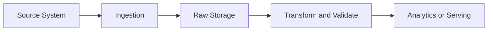

# บทที่ 04.1: Data Ingestion และ Sqoop

> **จากเอกสาร:** [dads6002_04_data_ingestion.pdf](../lecture/dads6002_04_data_ingestion.pdf) หน้า 1–6  
> **ขอบเขต:** ความหมายของ Data Ingestion, การนำข้อมูลจาก RDBMS เข้า HDFS, Hive และ HBase ด้วย Sqoop และข้อจำกัดของเครื่องมือ

> [← บทที่ 03.3: HBase Shell และ RowKey Design](033_hbase_shell_and_rowkey_design.md) | [สารบัญ](000_readme.md) | [บทที่ 04.2: Flume และ Avro →](042_flume_avro_and_event_flows.md)

## เป้าหมายการเรียนรู้

หลังเรียนบทนี้ ผู้อ่านควรสามารถ:

1. อธิบายว่า Data Ingestion อยู่ตรงไหนของ Data Pipeline และต่างจาก Transformation อย่างไร
2. จำแนก Batch Ingestion, Streaming Ingestion และ Change Data Capture ได้
3. ติดตาม Sqoop Import จาก MySQL ไปยัง HDFS, Hive และ HBase ได้ทีละขั้น
4. อธิบายความสัมพันธ์ระหว่างจำนวน Mappers, Parallelism และ Source Database Load
5. ตรวจสอบผลนำเข้าด้วย Row Count, Schema, Null และ Reconciliation
6. แยกสิ่งที่ต้องรู้เพื่อสอบจากข้อจำกัดของ Sqoop ในระบบปัจจุบันได้

## 1. Data Ingestion คืออะไร

**Data Ingestion** คือกระบวนการนำข้อมูลจาก Source System เข้าสู่ Storage หรือ Processing Platform ที่ปลายทาง เพื่อให้ข้อมูลพร้อมสำหรับการจัดเก็บ แปลง วิเคราะห์ หรือให้บริการต่อไป Source อาจเป็นฐานข้อมูลธุรกรรม ไฟล์ Log API Sensor หรือ Event Stream ส่วน Destination อาจเป็น HDFS, Data Lake, Data Warehouse, Hive, HBase หรือ Streaming Platform

คำว่า Ingestion เน้นการเคลื่อนข้อมูลเข้าแพลตฟอร์ม ไม่ได้หมายความว่าข้อมูลสะอาดหรือพร้อมวิเคราะห์แล้วเสมอ ตัวอย่างเช่น การคัดลอกตาราง `sales_order` จาก MySQL เข้า HDFS ถือเป็น Ingestion ส่วนการแปลงวันที่ ลบข้อมูลซ้ำ คำนวณยอดสุทธิ และรวมกับ Master Data เป็น Transformation



สไลด์เรียก Ingestion ว่าเป็นขั้นแรกของ Data Science Pipeline ซึ่งเหมาะในภาพรวม แต่ในระบบจริงต้องมีการกำหนด Data Contract, Security, Schema และ Validation ตั้งแต่ก่อนเคลื่อนข้อมูล หากนำข้อมูลผิดชุดหรือทำข้อมูลตกหล่น การวิเคราะห์ขั้นถัดไปจะผิดแม้ Model หรือ Dashboard ทำงานสมบูรณ์

### 1.1 รูปแบบของ Ingestion

| รูปแบบ | ลักษณะ | ตัวอย่าง | จุดตัดสินใจสำคัญ |
|---|---|---|---|
| Batch | ย้ายข้อมูลเป็นรอบ | ดึงยอดขายทุกคืน | รอบเวลา ปริมาณ และเวลาที่รับได้ |
| Streaming | รับ Event ต่อเนื่อง | Clickstream หรือ Sensor | Throughput, Latency และ Delivery Semantics |
| Incremental | ดึงเฉพาะข้อมูลใหม่หรือเปลี่ยน | `updated_at > last_watermark` | Watermark, Late Data และการรันซ้ำ |
| Change Data Capture (CDC) | อ่านการเปลี่ยนแปลงจาก Transaction Log | Insert/Update/Delete จากฐานข้อมูล | Ordering, Schema Evolution และ Delete Handling |

Sqoop ในบทนี้เป็นเครื่องมือ **Batch Bulk Transfer** ระหว่างฐานข้อมูลเชิงสัมพันธ์กับ Hadoop ไม่ได้ออกแบบมาสำหรับ Event Streaming ต่อเนื่อง

## 2. Sqoop แก้ปัญหาอะไร

Apache Sqoop ถูกออกแบบให้ย้ายข้อมูลจำนวนมากระหว่าง **Relational Database Management System (RDBMS)** เช่น MySQL หรือ Oracle กับ Hadoop Ecosystem เช่น HDFS, Hive และ HBase โดยอ่าน Database Metadata เช่นชื่อ Column และ Data Type แล้วสร้าง MapReduce Job เพื่อถ่ายโอนข้อมูล

หากไม่มี Sqoop นักพัฒนาอาจต้องเขียนโปรแกรมเปิด JDBC Connection, แบ่งช่วงข้อมูล, Serialize Records, Retry เมื่อ Task ล้ม และเขียนผลลง HDFS เอง Sqoop รวมงานเหล่านี้ไว้ในคำสั่งเดียว โดยเฉพาะการแบ่ง Table ให้หลาย Mappers อ่านพร้อมกัน

### 2.1 Mental Model ตั้งแต่ Source ถึง Destination

สมมติ MySQL มีตาราง `avgprice_by_state` จำนวน 10 ล้าน Rows และต้องนำเข้า HDFS:

1. Sqoop เชื่อมต่อ MySQL ผ่าน JDBC
2. Sqoop อ่าน Schema และข้อมูลที่จำเป็นต่อการแบ่งงาน
3. Sqoop สร้าง Map-only Job ไม่มี Reducer เพราะแต่ละ Mapper สามารถอ่านและเขียนชุดข้อมูลของตนได้โดยไม่ต้อง Group หรือ Aggregate
4. Mappers อ่านคนละช่วงของ Source Table
5. แต่ละ Mapper Serialize Rows เป็นไฟล์ผลลัพธ์ใน HDFS
6. ผู้ใช้ตรวจจำนวน Rows, Schema และตัวอย่างข้อมูลก่อนส่งต่อไปยังขั้น Transform

ผลลัพธ์จึงมักมีหลายไฟล์ เช่น `part-m-00000`, `part-m-00001` ไม่ใช่ไฟล์เดียว เพราะแต่ละ Mapper เขียน Output ของตนเอง

## 3. จำนวน Mappers ไม่ใช่เพียงตัวเลือกความเร็ว

ตัวเลือก `-m 1` หรือ `--num-mappers 1` บังคับให้ใช้ Mapper เดียว จึงได้ไฟล์ Part เดียวและเข้าใจง่ายใน Lab แต่ใช้ Parallelism ไม่ได้ หากเพิ่ม Mappers Sqoop ต้องมี Column สำหรับแบ่งช่วง เช่น Primary Key หรือ Column ที่กำหนดผ่าน `--split-by`

สมมติ `id` มีค่าตั้งแต่ 1 ถึง 1,000,000 และใช้ 4 Mappers แนวคิดอย่างง่ายคือแบ่งช่วงประมาณนี้:

| Mapper | ช่วงโดยประมาณ |
|---:|---|
| 1 | 1–250,000 |
| 2 | 250,001–500,000 |
| 3 | 500,001–750,000 |
| 4 | 750,001–1,000,000 |

จำนวน Mappers มากขึ้นอาจลดเวลานำเข้า แต่เพิ่ม Concurrent Connections และ Query Load บนฐานข้อมูลต้นทาง หากข้อมูลกระจุกตัวไม่สม่ำเสมอ บาง Mapper อาจทำงานนานกว่าตัวอื่น เกิด Data Skew ดังนั้นจำนวน Mappers ต้องสมดุลระหว่าง Throughput ของ Pipeline กับผลกระทบต่อ Production Database

## 4. Import จาก MySQL ไป HDFS

สไลด์สร้างฐานข้อมูล `energydata` และ Table `avgprice_by_state` ซึ่งมีข้อมูลปี รัฐ ภาคการใช้พลังงาน และราคาเฉลี่ย จากนั้นใช้คำสั่ง Sqoop Import

```bash
sqoop import \
  --connect jdbc:mysql://localhost:3306/energydata \
  --username root \
  --password-prompt \
  --table avgprice_by_state \
  --target-dir /user/cloudera/energydata \
  --num-mappers 1
```

ตัวอย่างนี้ปรับเครื่องหมาย Dash และ Quote จากสไลด์ให้เป็นอักขระมาตรฐาน และใช้ `--password-prompt` แทนการเขียน Password ตรงใน Command Line เพราะคำสั่งอาจถูกบันทึกใน Shell History หรือมองเห็นจาก Process List

ตรวจผลเบื้องต้น:

```bash
hadoop fs -ls /user/cloudera/energydata
hadoop fs -cat /user/cloudera/energydata/part-m-00000 | head
hadoop fs -cat /user/cloudera/energydata/part-m-00000 | wc -l
```

การเห็นไฟล์อยู่ใน HDFS ยังไม่เพียงพอ ต้องเปรียบเทียบอย่างน้อย:

- Source Row Count กับ Destination Row Count
- Column Count และ Data Type Mapping
- Null Count ของ Columns สำคัญ
- Min/Max ของ Primary Key หรือวันที่
- Sum ของ Measure ที่ควร Reconcile เช่นยอดเงิน

## 5. Import ไป Hive

สไลด์แสดง `--hive-import` เพื่อสร้างหรือนำข้อมูลเข้า Hive Table โดยตรงจากมุมมองของผู้ใช้ แต่คำว่า “ตรง” ไม่ได้หมายความว่าข้อมูลไม่ผ่าน Storage Layer เพราะข้อมูลของ Hive ยังคงถูกจัดเก็บเป็น Files ใน HDFS หรือ Storage ที่กำหนด Hive เพิ่ม Table Metadata เหนือไฟล์เหล่านั้น

```bash
sqoop import \
  --connect jdbc:mysql://localhost:3306/energydata \
  --username root \
  --password-prompt \
  --table avgprice_by_state \
  --hive-import \
  --hive-table avgprice \
  --num-mappers 1
```

หลัง Import ควรตรวจทั้ง Metadata และ Data:

```sql
DESCRIBE FORMATTED avgprice;
SELECT COUNT(*) FROM avgprice;
SELECT MIN(year), MAX(year) FROM avgprice;
SELECT * FROM avgprice LIMIT 10;
```

Data Type จาก RDBMS อาจไม่แมปตรงกับ Hive ทุกกรณี โดยเฉพาะ Decimal, Date/Timestamp, Boolean และ Character Encoding จึงต้องตรวจ Schema ไม่ใช่ดูเฉพาะ Sample Rows

## 6. Import ไป HBase

การ Import ไป HBase ต้องตัดสินใจเพิ่มสองเรื่องที่ไม่มีใน HDFS Import:

1. Column ใดเป็น **RowKey**
2. Columns จะอยู่ใน **Column Family** ใด

```bash
sqoop import \
  --connect jdbc:mysql://localhost:3306/country_db \
  --username root \
  --password-prompt \
  --table country_tbl \
  --hbase-table country \
  --column-family country_cf \
  --hbase-row-key id \
  --hbase-create-table \
  --num-mappers 1
```

การเลือก Primary Key ของ RDBMS เป็น HBase RowKey ทำได้ในตัวอย่างนี้เพราะ `id` ระบุ Row ได้ไม่ซ้ำ แต่ในงานจริงต้องพิจารณา Access Pattern, RowKey Distribution และ Hotspot ด้วย การคัดลอก Schema จาก RDBMS มา HBase แบบตรงตัวไม่ถือว่าเป็นการออกแบบ HBase ที่ดีโดยอัตโนมัติ

## 7. Failure, Rerun และ Idempotency

Pipeline ต้องตอบได้ว่าหาก Import ล้มครึ่งทางแล้วรันใหม่จะเกิดอะไรขึ้น หาก Target Directory มีอยู่แล้ว คำสั่งอาจล้ม หรือถ้า Append โดยไม่มี Key ป้องกันอาจเกิดข้อมูลซ้ำ แนวทางออกแบบที่ปลอดภัยคือ:

1. เขียนลง Staging Path ที่ผูกกับ Batch ID
2. ตรวจ Validation ให้ผ่าน
3. Promote หรือ Swap ไปยัง Curated Location
4. บันทึก Watermark และ Audit Log หลังสำเร็จเท่านั้น
5. กำหนดวิธี Cleanup Batch ที่ล้มอย่างชัดเจน

หลัก **Idempotency** หมายถึงการรันคำสั่งเดิมซ้ำแล้วไม่ทำให้ผลลัพธ์เสียหรือเพิ่มข้อมูลซ้ำโดยไม่ตั้งใจ เป็นคุณสมบัติสำคัญกว่าการทำให้คำสั่ง “รันผ่าน” เพียงครั้งเดียว

## 8. บริบทปัจจุบันของ Sqoop

**คำอธิบายเพิ่มเติม:** [Apache Sqoop ถูก Retire และย้ายเข้า Apache Attic ในปี 2021](https://attic.apache.org/projects/sqoop.html) จึงควรเรียนเพื่อเข้าใจระบบ Hadoop รุ่นเดิมและข้อสอบจากสไลด์ แต่ไม่ควรเลือกเป็น Default สำหรับโครงการใหม่โดยไม่ประเมินทางเลือกอื่น เช่น Managed Connectors, JDBC-based Batch Pipelines หรือ CDC Platforms

แนวคิดของ Sqoop ยังมีคุณค่า เพราะทำให้เห็นคำถามพื้นฐานของ Database Ingestion ได้แก่ Schema Discovery, Parallel Extraction, Split Key, Source Load, Serialization, Incremental State และ Validation ซึ่งยังคงต้องตอบไม่ว่าจะใช้เครื่องมือใด

## 9. Decision Framework

| สถานการณ์ | แนวทางที่เหมาะกว่า |
|---|---|
| ย้าย RDBMS Table เป็นรอบใน Legacy Hadoop | Sqoop อาจยังพบในระบบเดิม |
| ต้องรับ Log ต่อเนื่องเข้า HDFS | Flume ตามขอบเขตของสไลด์ |
| หลาย Consumers ต้องอ่าน Event เดิมอย่างอิสระ | Kafka |
| ต้องจับ Insert/Update/Delete ใกล้ Real Time | CDC Connector/Platform |
| ต้อง Transform ซับซ้อนระหว่างทาง | ETL/ELT หรือ Stream Processing Engine |

## 10. Likely Exam Focus

### คำถาม 1

**เหตุใด Sqoop Import ไป HDFS จึงเป็น Map-only Job?**

**แนวคำตอบ:** งานหลักคือแบ่ง Source Rows ให้ Mappers อ่านแบบขนานแล้วเขียน Files ปลายทาง แต่ละ Row ไม่ต้องถูก Group หรือ Aggregate ข้าม Mapper จึงไม่จำเป็นต้องมี Reducer อย่างไรก็ตามต้องมีวิธีแบ่งช่วง เช่น Primary Key หรือ `--split-by`

### คำถาม 2

**อธิบายผลของ `-m 1`**

**แนวคำตอบ:** ใช้ Mapper เดียว ทำให้ Import แบบไม่ขนานและมักได้ Part File เดียว เหมาะกับ Lab หรือข้อมูลเล็ก แต่ Throughput ต่ำกว่าและไม่ใช้ทรัพยากร Cluster เต็มที่

### คำถาม 3

**Import สำเร็จตาม Exit Code แล้วถือว่าข้อมูลถูกต้องหรือไม่?**

**แนวคำตอบ:** ไม่ถือว่าเพียงพอ ต้อง Reconcile Row Count, Schema, Null, Key Range และ Business Totals เพราะ Job อาจสำเร็จแต่ดึงข้อมูลไม่ครบหรือแปลงชนิดผิด

## 11. Mastery Checklist

- [ ] แยก Ingestion ออกจาก Transformation ได้
- [ ] อธิบาย Sqoop Map-only Import ได้ตั้งแต่ Metadata ถึง HDFS Files
- [ ] อธิบาย Trade-off ของจำนวน Mappers ได้
- [ ] ระบุสิ่งที่ต้องออกแบบเพิ่มเมื่อ Import เข้า Hive และ HBase ได้
- [ ] ออกแบบ Validation และ Rerun Strategy ได้
- [ ] อธิบายได้ว่าเหตุใด Sqoop ยังออกสอบได้แม้ไม่ใช่ตัวเลือกหลักของระบบใหม่

## Source Coverage และ References

- เอกสารหลัก หน้า 1–6: Data Ingestion, Sqoop, MySQL → HDFS/Hive/HBase และคำสั่งตัวอย่าง
- [Apache Sqoop in the Apache Attic](https://attic.apache.org/projects/sqoop.html)
- [Apache Hadoop HDFS Documentation](https://hadoop.apache.org/docs/current/hadoop-project-dist/hadoop-hdfs/HdfsDesign.html)
