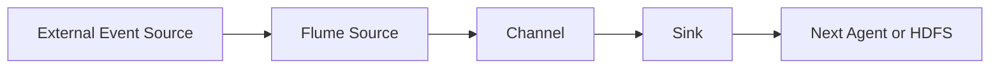

# บทที่ 04.2: Flume, Avro และ Event Data Flow

> **จากเอกสาร:** [dads6002_04_data_ingestion.pdf](../lecture/dads6002_04_data_ingestion.pdf) หน้า 7–16  
> **ขอบเขต:** Flume Agent, Source–Channel–Sink, Multi-agent/Fan-in Flow, Avro และกรณี Product Impression Logs

> [← บทที่ 04.1: Data Ingestion และ Sqoop](041_data_ingestion_and_sqoop.md) | [สารบัญ](000_readme.md) | [บทที่ 04.3: Kafka →](043_kafka_streaming_foundations.md)

## เป้าหมายการเรียนรู้

หลังเรียนบทนี้ ผู้อ่านควรสามารถ:

1. อธิบายว่า Flume เหมาะกับ Event/Log Ingestion แบบใด
2. ติดตาม Event ผ่าน Source → Channel → Sink ได้
3. อธิบายว่าทำไม Channel จึงเป็นขอบเขตสำคัญของ Reliability
4. เปรียบเทียบ Memory Channel กับ File Channel ได้
5. แยก Avro Data File ออกจาก Avro RPC ที่ใช้เชื่อม Agents ได้
6. อ่าน Configuration ของ Client Agent และ Collector Agent ได้
7. ตรวจ Throughput, Data Loss, Duplicate และ Small-file Risk ได้

## 1. จาก Batch Table สู่ Continuous Events

Sqoop เหมาะกับการดึง Table จาก RDBMS เป็นรอบ แต่ Web Access Log, Clickstream, Network Event และ Sensor Reading เกิดขึ้นต่อเนื่อง หากรอ Export ทั้ง Table ทุกครั้งจะช้าและสิ้นเปลือง Flume จึงถูกออกแบบให้รวบรวม Event ปริมาณมากจากหลาย Sources แล้วส่งไปยัง Hadoop Storage

**Event** ใน Flume คือหน่วยข้อมูลที่ไหลผ่านระบบ ประกอบด้วย Body ซึ่งเก็บ Payload เป็น Bytes และ Headers ซึ่งเก็บ Key-value Metadata ตัวอย่าง Event หนึ่งรายการอาจเป็น Log Line หรือ JSON ของการกดสินค้า ไม่จำเป็นต้องเป็น Row แบบ RDBMS



## 2. Flume Agent และ Component สามส่วน

Flume Agent คือ JVM Process หนึ่งตัวที่มี Components หลักสามส่วน:

### 2.1 Source

Source รับ Events จากระบบภายนอก เช่น Spooling Directory, Exec Command หรือ Avro Client แล้วเขียน Event ลง Channel Source ไม่ควรถือว่า Event ส่งสำเร็จเพียงเพราะอ่านจากต้นทางได้ ต้องผ่าน Transaction ที่ทำให้ Event เข้า Channel สำเร็จด้วย

### 2.2 Channel

Channel เป็น Buffer ระหว่าง Source กับ Sink ทำให้ทั้งสองส่วนทำงานคนละอัตราได้ หาก Destination ช้าชั่วคราว Source ยังสามารถรับข้อมูลต่อได้จนกว่า Channel จะเต็ม [Apache Flume User Guide](https://flume.apache.org/FlumeUserGuide.html) อธิบายว่า Source เก็บ Event ลง Channel และ Channel รักษา Event ไว้จน Sink นำไปส่งต่อ

### 2.3 Sink

Sink อ่าน Event จาก Channel แล้วส่งไปยัง Next-hop Agent หรือ Final Destination เช่น HDFS Sink จะเขียน Event ลง HDFS การนำ Event ออกจาก Channel ต้องสัมพันธ์กับผลส่งปลายทาง หากส่งไม่สำเร็จ Transaction ต้อง Roll Back เพื่อให้ลองใหม่ได้

## 3. Reliability เกิดจาก Transaction Boundary

เส้นทางหนึ่ง Hop มีสอง Transaction ที่สำคัญ:

1. Source → Channel: Commit เมื่อ Event ถูกเก็บใน Channel สำเร็จ
2. Channel → Sink: Commit และนำ Event ออกจาก Channel เมื่อ Destination ยอมรับ Event แล้ว

กลไกนี้ช่วยลด Data Loss แต่การ Retry หลัง Failure อาจทำให้ Event ถูกส่งซ้ำได้ ระบบปลายทางจึงควรมี Event ID หรือ Deduplication Logic หากต้องการผลลัพธ์ทางธุรกิจแบบ Exactly-once ความสามารถของ Flume เหมาะจะอธิบายเป็น Reliable Delivery ต่อ Hop ไม่ควรสรุปว่าไม่มีข้อมูลซ้ำทุกกรณี

### 3.1 Memory Channel กับ File Channel

| ประเด็น | Memory Channel | File Channel |
|---|---|---|
| ที่เก็บหลัก | Memory | Local Filesystem |
| Throughput | โดยทั่วไปสูงกว่า | มี Disk I/O |
| ทนต่อ Process/Host Failure | ต่ำกว่า | ดีกว่าเมื่อ Disk ยังใช้ได้ |
| เหมาะกับ | ยอมสูญหายบางส่วนได้หรือมีต้นทาง Replay | Log ที่ต้องการ Durability มากขึ้น |

คำว่า File Channel ไม่ได้ทำให้ระบบปลอดภัยจากทุก Failure หาก Disk เสียพร้อม Host หรือไม่มี Replication ภายนอกก็ยังสูญข้อมูลได้ Reliability ต้องพิจารณาทั้ง Agent, Disk, Destination และความสามารถ Replay ของ Source

## 4. รูปแบบ Data Flow

### 4.1 Simple Flow

หนึ่ง Agent รับ Event แล้วส่งไป Destination เหมาะกับเส้นทางสั้นและดูแลง่าย แต่หาก Agent เป็น Single Point of Failure ต้องเพิ่ม Monitoring และ Recovery Strategy

### 4.2 Multi-agent Flow

Client Agent รับ Events ใกล้ Source แล้วส่งไป Collector Agent ซึ่งรวมและเขียนลง Storage การแยก Tier ช่วยควบคุมอัตราการเขียนและแยกความรับผิดชอบ แต่เพิ่ม Network Hop, Configuration และ Failure Modes

### 4.3 Fan-in Flow

หลาย Client Agents ส่ง Events มายัง Collector กลาง เหมาะกับ Log จากหลาย Web Servers แต่ Collector และ Destination ต้องรองรับ Throughput รวม หาก Capacity ไม่พอ Channel จะโตจนเต็มและเกิด Backpressure

## 5. Avro: ต้องแยกสองบริบท

[Apache Avro](https://avro.apache.org/docs/) เป็นระบบ Data Serialization ที่รองรับโครงสร้างข้อมูล Format แบบ Binary ที่กะทัดรัด Container File และ RPC แต่ในบทนี้มีสองบริบทที่ไม่ควรปะปน:

1. **Avro Data File** — เก็บ Serialized Records พร้อม Schema Metadata ใน Container File
2. **Flume Avro Source/Sink** — ใช้ Avro RPC ส่ง Flume Events ระหว่าง Agents

การตั้ง `client.sinks.k1.type=avro` ไม่ได้หมายความว่า HDFS Output จะกลายเป็น Avro Data File โดยอัตโนมัติ Format ปลายทางขึ้นกับ HDFS Sink Configuration เช่นตัวอย่างสไลด์กำหนด `fileType=DataStream` และ `writeFormat=text`

## 6. Product Impression Example

สไลด์จำลอง Event จากร้านค้าออนไลน์ เช่น View, Click, Add Cart, Remove Cart และ Purchase ตัวอย่าง JSON ที่แก้ Syntax ให้ถูกต้องคือ:

```json
{
  "sku": "T9921-5",
  "timestamp": 1453167527737,
  "cid": "51761",
  "action": "add_cart",
  "ip": "226.43.51.25"
}
```

จุดสำคัญไม่ใช่เพียงรับไฟล์ได้ แต่ต้องกำหนด Event Contract เช่น Field ที่จำเป็น Timestamp Unit, Allowed Actions, Event ID, Character Encoding และวิธีจัดการ Invalid JSON หาก Contract ไม่ชัด ต่อให้ Pipeline ไม่ Error ก็อาจส่งข้อมูลคุณภาพต่ำไป HDFS

## 7. อ่าน Client Agent Configuration

```properties
client.sources = r1
client.sources.r1.type = spooldir
client.sources.r1.spoolDir = /tmp/impressions
client.sources.r1.channels = ch1

client.channels = ch1
client.channels.ch1.type = FILE

client.sinks = k1
client.sinks.k1.type = avro
client.sinks.k1.hostname = localhost
client.sinks.k1.port = 4141
client.sinks.k1.channel = ch1
```

เส้นทางคือ Spool Directory → Source `r1` → File Channel `ch1` → Avro Sink `k1` → Collector Port 4141

Spool Directory Source เหมาะกับไฟล์ที่เขียนเสร็จแล้วและนำมาวางใน Directory ไม่ควรให้ Application เขียนต่อท้ายไฟล์เดิมขณะที่ Flume กำลังอ่าน เพราะอาจทำให้ Event Boundary และสถานะไฟล์ไม่เป็นไปตามที่คาด

## 8. อ่าน Collector Agent Configuration

```properties
collector.sources = r1
collector.sources.r1.type = avro
collector.sources.r1.bind = 0.0.0.0
collector.sources.r1.port = 4141
collector.sources.r1.channels = ch1

collector.channels = ch1
collector.channels.ch1.type = FILE
collector.channels.ch1.checkpointDir = /tmp/flume/checkpoint
collector.channels.ch1.dataDirs = /tmp/flume/data

collector.sinks = k1
collector.sinks.k1.type = hdfs
collector.sinks.k1.channel = ch1
collector.sinks.k1.hdfs.path = /user/cloudera/impressions
collector.sinks.k1.hdfs.filePrefix = impressions
collector.sinks.k1.hdfs.fileSuffix = .log
collector.sinks.k1.hdfs.fileType = DataStream
collector.sinks.k1.hdfs.writeFormat = Text
collector.sinks.k1.hdfs.batchSize = 1000
```

เส้นทาง Collector คือ Avro Source → File Channel → HDFS Sink การเห็นชื่อ `r1`, `ch1`, `k1` เพียงอย่างเดียวไม่บอกหน้าที่ ต้องอ่าน Type และการ Bind ระหว่าง Components ด้วย

## 9. การรันและ Validation

```bash
flume-ng agent --name collector --conf . --conf-file ./collector.conf
flume-ng agent --name client --conf . --conf-file ./client.conf
```

สไลด์ใช้ `&` เพื่อรัน Background แต่ผู้เริ่มต้นควรรัน Foreground ก่อนเพื่อเห็น Error Log แล้วจึงจัดการ Process ด้วยเครื่องมือที่เหมาะสม

Validation ขั้นต่ำ:

```bash
hadoop fs -ls /user/cloudera/impressions
hadoop fs -cat /user/cloudera/impressions/impressions*.log | head
hadoop fs -cat /user/cloudera/impressions/impressions*.log | wc -l
```

ตรวจเพิ่ม:

- จำนวน Events ที่ Source สร้าง เทียบกับจำนวน Lines ปลายทาง
- JSON Parse Success/Failure
- Duplicate Event ID
- Channel Fill Percentage และ Sink Error
- จำนวน/ขนาด HDFS Files เพื่อป้องกัน Small-files Problem
- Permission ของ Directory; `chmod 777` ในสไลด์เหมาะกับ Lab เก่า ไม่ใช่ Production Security Practice

## 10. Failure Scenarios

| Failure | สิ่งที่คาดว่าจะเกิด | สิ่งที่ต้องตรวจ |
|---|---|---|
| HDFS ช้าหรือหยุด | Sink ส่งไม่ได้, Channel สะสม | Channel Capacity และ Disk Space |
| Collector ล้ม | Client Avro Sink Retry/Backoff | Client Channel Retention |
| Event ผิด Schema | อาจถูกส่งเป็น Bytes แต่ Parse ภายหลังล้ม | Validation/Dead-letter Strategy |
| Restart หลัง Commit ไม่ชัดเจน | อาจเกิด Duplicate | Event ID และ Deduplication |
| HDFS Roll บ่อยเกิน | Files เล็กจำนวนมาก | Roll Size/Interval และ Batch Size |

## 11. Likely Exam Focus

### คำถาม 1

**อธิบายหน้าที่ Source, Channel และ Sink พร้อมเหตุผลที่ต้องมี Channel**

**แนวคำตอบ:** Source รับ Events, Channel Buffer และรักษา Events ระหว่างอัตรารับกับอัตราส่ง, Sink นำ Events ไป Next Hop หรือ Destination Channel ทำให้ Source กับ Sink ไม่ต้องทำงานพร้อมกันทุกจังหวะและเป็นขอบเขต Transaction สำหรับ Reliability

### คำถาม 2

**Multi-agent Flow ช่วยอะไรและเพิ่มความเสี่ยงอะไร?**

**แนวคำตอบ:** ช่วยรวม Events จากหลาย Sources ควบคุมอัตราเขียน และแยก Edge Collection จาก Storage แต่เพิ่ม Network Hop, Configuration, Buffer และ Failure Point ที่ต้อง Monitor

### คำถาม 3

**Avro Sink ทำให้ไฟล์ HDFS เป็น Avro หรือไม่?**

**แนวคำตอบ:** ไม่จำเป็น Avro Sink ในตัวอย่างใช้ Avro RPC ระหว่าง Agents ส่วน File Format ปลายทางกำหนดโดย HDFS Sink

## 12. Mastery Checklist

- [ ] วาด Source → Channel → Sink และอธิบาย Transaction ได้
- [ ] แยก Memory Channel กับ File Channel ได้
- [ ] แยก Avro Data File กับ Avro RPC ได้
- [ ] อ่าน Client/Collector Configuration แล้ว Trace Event ได้
- [ ] อธิบาย Backpressure, Duplicate และ Small-file Risk ได้
- [ ] กำหนด Validation Evidence สำหรับ Event Pipeline ได้

## Source Coverage และ References

- เอกสารหลัก หน้า 7–16: Flume, Data Flows, Avro, Product Impression, Client/Collector Config และการรัน
- [Apache Flume User Guide](https://flume.apache.org/FlumeUserGuide.html)
- [Apache Avro Documentation](https://avro.apache.org/docs/)
- [Apache Avro Specification](https://avro.apache.org/docs/1.12.0/specification/)
