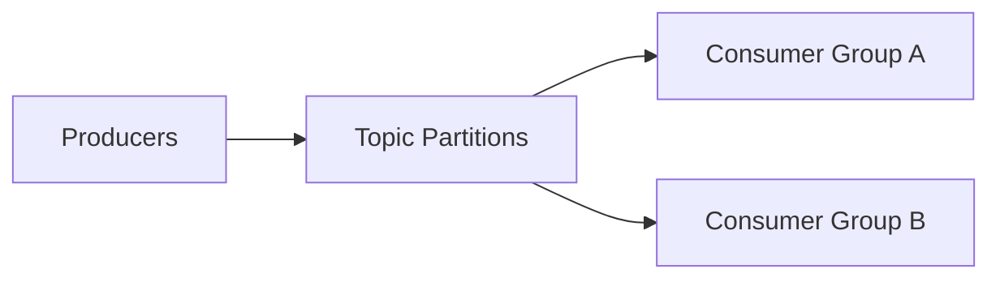

# บทที่ 04.3: Kafka Streaming Foundations

> **จากเอกสาร:** [dads6002_04_data_ingestion.pdf](../lecture/dads6002_04_data_ingestion.pdf) หน้า 17–22  
> **ขอบเขต:** Broker, Topic, Partition, Record, Offset, Replication, Producer, Consumer และ Consumer Group

> [← บทที่ 04.2: Flume และ Avro](042_flume_avro_and_event_flows.md) | [สารบัญ](000_readme.md)

## เป้าหมายการเรียนรู้

หลังเรียนบทนี้ ผู้อ่านควรสามารถ:

1. อธิบาย Kafka ในฐานะ Distributed Event Streaming Platform ได้
2. แยก Topic, Partition, Record และ Offset ได้อย่างถูกต้อง
3. Trace Record จาก Producer ไป Broker แล้วถึง Consumer Group ได้
4. อธิบาย Ordering, Parallelism และ Replication Boundary ได้
5. คำนวณจำนวน Active Consumers สูงสุดจากจำนวน Partitions ได้
6. วิเคราะห์ผลของ Key และ Partition Strategy ต่อ Ordering และ Load Balance ได้
7. แยกเนื้อหา ZooKeeper ในสไลด์ออกจาก Kafka KRaft รุ่นปัจจุบันได้

## 1. Kafka คืออะไรและไม่ใช่อะไร

Apache Kafka คือ Distributed Event Streaming Platform ที่รับ Events จาก Producers เก็บ Events อย่างทนทานใน Topics และเปิดให้ Consumers หลายกลุ่มอ่านตามจังหวะของตนเอง Kafka ไม่ใช่เพียง Queue ที่ส่งข้อความแล้วหายทันที และไม่ใช่ Database สำหรับ Query แบบอิสระทุก Field

ความแตกต่างสำคัญจาก Direct Pipeline คือ Producer ไม่ต้องรู้ว่า Consumer คนใดจะใช้ข้อมูล และ Consumer แต่ละ Group มีตำแหน่งการอ่านของตนเอง Event เดียวจึงถูกใช้ได้ทั้ง Fraud Detection, Dashboard, Data Lake Ingestion และ Machine Learning Pipeline โดยไม่ต้องให้ Producer ส่งซ้ำแยกปลายทาง



## 2. Vocabulary Dependency

### 2.1 Record

Record คือ Event หนึ่งรายการ โดยทั่วไปประกอบด้วย Key, Value, Timestamp และ Headers Key อาจไม่มีค่าได้ แต่หากกำหนด Key จะมีผลต่อการเลือก Partition และ Ordering ของ Records ที่มี Key เดียวกัน

### 2.2 Topic

Topic คือชื่อ Logical Stream เช่น `purchase-events` หรือ `inventory-updates` Topic เป็นขอบเขตที่ Producers Publish และ Consumers Subscribe แต่ข้อมูลจริงถูกแบ่งเก็บใน Partitions

### 2.3 Partition

Partition คือ Ordered Append-only Log หนึ่งชุดภายใน Topic แต่ละ Record ใน Partition มี **Offset** ที่เพิ่มตามลำดับ [Apache Kafka Documentation](https://kafka.apache.org/documentation/) ระบุขอบเขตการรับประกันลำดับไว้ภายใน Topic-Partition เดียว ไม่ได้รับประกัน Global Ordering ระหว่างหลาย Partitions

### 2.4 Offset

Offset คือตำแหน่งของ Record ภายใน Partition ไม่ใช่ ID ที่ Unique ข้าม Topic ทั้งหมด พิกัดที่ระบุ Record จึงต้องมีอย่างน้อย Topic + Partition + Offset

ตัวอย่าง:

```text
Topic: purchase-events
Partition: 2
Offset: 1048
```

Offset ยังใช้บอกความคืบหน้าของ Consumer เมื่อ Consumer Process แล้ว Commit Offset ระบบจึงทราบว่าควร Resume จากตำแหน่งใด

## 3. Broker และ Cluster

Kafka Server หนึ่งตัวเรียกว่า **Broker** และ Brokers หลายตัวรวมเป็น Cluster Partitions ของ Topics ถูกกระจายข้าม Brokers เพื่อเพิ่ม Capacity และ Parallelism การเพิ่ม Broker ไม่ได้ทำให้ข้อมูลกระจายสมดุลโดยอัตโนมัติทุกกรณี ต้องมี Partition Assignment/Reassignment และ Capacity Planning ที่เหมาะสม

แต่ละ Partition มี Leader Replica ที่รับ Read/Write และอาจมี Follower Replicas บน Brokers อื่นเพื่อ Fault Tolerance หาก Leader ใช้งานไม่ได้ ระบบสามารถเลือก Replica ที่เหมาะสมขึ้นมารับบทบาทตาม Configuration และ Cluster State

**Replication Factor** บอกจำนวน Replicas ของ Partition ไม่ใช่จำนวนสำเนาของทั้ง Topic เป็นก้อนเดียว หาก Topic มี 6 Partitions และ Replication Factor 3 ระบบจะมี Partition Replicas รวม 18 ชุด

## 4. Producer และ Partition Selection

Producer ส่ง Records ไป Topic และต้องเลือก Partition แนวทางทั่วไปคือ:

- มี Key: ใช้ Partitioner ทำให้ Key เดียวกันมักไป Partition เดียวกัน
- ไม่มี Key: กระจาย Records เพื่อ Load Balance ตามพฤติกรรมของ Client
- Custom Partitioner: ใช้กติกาธุรกิจ แต่เสี่ยง Data Skew

สมมติใช้ `hospital_id` เป็น Key Events ของ Hospital เดียวกันจะถูกส่งไป Partition เดียวกัน จึงรักษาลำดับเฉพาะ Hospital ได้ แต่หาก Hospital หนึ่งสร้าง Events มากผิดปกติ Partition นั้นอาจกลายเป็น Hot Partition

ดังนั้น Key Design เป็น Trade-off ระหว่าง:

- Ordering Scope
- Parallelism
- Load Distribution
- State Locality ของ Consumer

## 5. Consumer Group

Consumers ที่ใช้ Group ID เดียวกันอยู่ใน **Consumer Group** เดียว Kafka Assign แต่ละ Partition ให้ Consumer เพียงหนึ่ง Instance ภายใน Group ในช่วงเวลาหนึ่ง เพื่อไม่ให้สอง Consumers ใน Group ประมวลผล Partition เดียวกันพร้อมกันโดยไม่ตั้งใจ

ถ้า Topic มี 6 Partitions:

| Consumers ใน Group | Active Consumers โดยประมาณ | ผล |
|---:|---:|---|
| 1 | 1 | Consumer เดียวอ่าน 6 Partitions |
| 3 | 3 | เฉลี่ยคนละ 2 Partitions |
| 6 | 6 | คนละ 1 Partition |
| 8 | 6 | 2 Consumers ไม่มี Partition ให้ทำงาน |

สูตรขอบเขต Parallelism ต่อ Topic ใน Consumer Group คือ:

$$
\text{Active Consumers} \leq \text{Number of Partitions}
$$

หากใช้คนละ Group ID แต่ละ Group จะอ่าน Event Stream ได้อิสระ คล้าย Broadcast ระหว่าง Groups แต่ Load Balance ภายใน Group

## 6. Rebalance และ Consumer Lag

เมื่อ Consumer เข้า/ออก Group หรือ Partition Assignment เปลี่ยน จะเกิด **Rebalance** เพื่อแจก Partitions ใหม่ ระหว่างนั้นการประมวลผลอาจหยุดชั่วคราวหรือย้าย State ดังนั้นการเพิ่ม Consumers ไม่ได้ให้ Throughput ฟรีโดยไม่มี Coordination Cost

**Consumer Lag** คือส่วนต่างระหว่าง Offset ล่าสุดใน Partition กับ Offset ที่ Consumer Group ประมวลผลหรือ Commit แล้ว Lag ที่โตต่อเนื่องอาจหมายถึง Consumer ช้ากว่า Producer, Processing Error, Partition Skew หรือ Capacity ไม่พอ

## 7. Ordering: คำถามที่มักตอบกว้างเกินไป

ประโยค “Kafka รักษาลำดับ” ต้องระบุขอบเขตให้ครบ:

> Kafka รักษาลำดับของ Records ภายใน Partition เดียวตามตำแหน่งใน Log

หากต้องการ Global Order ของ Topic ทั้งหมด การใช้ Partition เดียวเป็นแนวทางตรงที่สุด แต่ลด Parallelism และ Throughput สไลด์จึงเสนอหนึ่ง Partition สำหรับ Queue ที่ต้องรักษาลำดับทั้งหมด อย่างไรก็ตาม ระบบส่วนใหญ่มักต้องการเพียง Order ต่อ Entity เช่นต่อ Customer, Order หรือ Device จึงใช้ Entity ID เป็น Key และคงหลาย Partitions ได้

## 8. Delivery Semantics และ Offset Commit

ผลลัพธ์ไม่ได้ขึ้นกับ Kafka Storage เพียงอย่างเดียว แต่ขึ้นกับเวลาที่ Consumer Commit Offset:

| รูปแบบ | แนวคิด | ความเสี่ยงหลัก |
|---|---|---|
| At-most-once | Commit ก่อน Process | Process ล้มแล้ว Record อาจหายจากมุมมองงาน |
| At-least-once | Process แล้ว Commit | ล้มหลังเขียนผลแต่ก่อน Commit อาจ Process ซ้ำ |
| Exactly-once | ใช้ Transaction/Idempotent Design ตามขอบเขต | ซับซ้อนและต้องนิยาม End-to-end |

ในงานจริง Consumer ควรออกแบบ Output ให้ Idempotent หรือมี Deduplication Key เพราะ At-least-once เป็นรูปแบบที่พบได้บ่อย

## 9. ZooKeeper ในสไลด์กับ KRaft ปัจจุบัน

**จากเอกสาร หน้า 17–18:** สไลด์อธิบายว่า Brokers และ Consumers ใช้ ZooKeeper สำหรับ State และ Offset ซึ่งสะท้อน Kafka รุ่นเก่า

**คำอธิบายเพิ่มเติม:** [Kafka 4.0 ขึ้นไปรองรับเฉพาะ KRaft Mode และนำ ZooKeeper Mode ออกแล้ว](https://kafka.apache.org/40/getting-started/upgrade/) Control Plane จึงถูกผนวกเข้ากับ Kafka เอง นอกจากนี้ Consumer Offsets ใน Kafka สมัยใหม่ถูกจัดการผ่าน Group Coordinator และ Internal Topic ไม่ควรจำว่า Consumer ทุกตัวเขียน Offset ลง ZooKeeper

สำหรับการสอบ ให้ตอบตาม Architecture ที่อาจารย์สอนพร้อมระบุว่าเป็น Legacy Architecture หากโจทย์ถามบริบทปัจจุบัน ส่วนการออกแบบระบบใหม่ให้ใช้เอกสาร Kafka Version ที่องค์กรใช้งานจริง

## 10. Kafka กับ Flume ต่างกันอย่างไร

| ประเด็น | Flume | Kafka |
|---|---|---|
| แกนหลัก | Source–Channel–Sink Ingestion | Durable Distributed Event Log |
| รูปแบบการใช้งานเด่น | รวบรวม Log เข้า Hadoop | Event Backbone สำหรับหลาย Producers/Consumers |
| การเก็บ Event | Channel ระหว่างส่ง | Retained ตาม Topic Policy |
| หลาย Consumer Groups | ไม่ใช่ Abstraction หลัก | เป็นความสามารถแกนกลาง |
| Replay | ขึ้นกับ Source/Flow | อ่านใหม่จาก Offset ได้ภายใน Retention |
| Scaling Unit | Agents/Channels/Sinks | Brokers/Partitions/Consumers |

Flume และ Kafka ไม่จำเป็นต้องแทนกันเสมอไป Flume สามารถเชื่อม Kafka Source/Sink ได้ แต่ในการออกแบบใหม่ต้องประเมิน Ecosystem, Operational Skill, Retention, Replay และ Connector Availability

## 11. Worked Example: Hospital Purchase Events

กำหนด Topic `purchase-events` มี 4 Partitions และใช้ `hospital_id` เป็น Key มี Consumers 3 ตัวใน Group `inventory-update`

1. Events ของ Hospital เดียวกันไป Partition เดียวกัน จึงรักษาลำดับต่อ Hospital
2. Kafka Assign 4 Partitions ให้ 3 Consumers โดย Consumer หนึ่งตัวอาจได้ 2 Partitions
3. เพิ่ม Consumer ตัวที่ 4 ทำให้มีโอกาสได้คนละ Partition
4. เพิ่ม Consumer ตัวที่ 5 จะมีอย่างน้อยหนึ่งตัว Idle
5. หาก Hospital ใหญ่สร้าง 70% ของ Events อาจเกิด Hot Partition แม้มี Consumers หลายตัว

ตัวอย่างนี้แสดงว่าจำนวน Consumers แก้ปัญหาไม่ได้หาก Partition Key ทำให้ข้อมูลกระจุกตัว

## 12. Likely Exam Focus

### คำถาม 1

**Topic, Partition และ Offset สัมพันธ์กันอย่างไร?**

**แนวคำตอบ:** Topic เป็นชื่อ Logical Stream, Partition เป็น Ordered Log ย่อยของ Topic และ Offset ระบุตำแหน่ง Record ภายใน Partition พิกัด Record ต้องอาศัย Topic + Partition + Offset

### คำถาม 2

**Topic มี 5 Partitions แต่ Group มี 8 Consumers จะเกิดอะไรขึ้น?**

**แนวคำตอบ:** ในช่วงเวลาหนึ่ง Partition ถูก Assign ให้ Consumer เดียวภายใน Group จึงมี Active Consumers สูงสุด 5 ตัว อีก 3 ตัวไม่มี Partition ให้ทำงาน

### คำถาม 3

**ทำไม Key Design จึงเกี่ยวข้องทั้ง Ordering และ Load Balance?**

**แนวคำตอบ:** Key เดียวกันถูกส่งไป Partition เดียวกัน จึงรักษาลำดับต่อ Key แต่ Key ที่มีปริมาณสูงมากทำให้ Partition และ Consumer ที่รับผิดชอบรับ Load มากกว่าส่วนอื่น

### คำถาม 4

**Kafka รับประกัน Global Ordering หรือไม่?**

**แนวคำตอบ:** ไม่รับประกันข้าม Partitions รับประกันลำดับภายใน Partition เดียว หากต้องการ Global Order อาจใช้ Partition เดียวแต่ต้องแลกกับ Parallelism

## 13. Mastery Checklist

- [ ] อธิบายเส้นทาง Producer → Topic Partition → Consumer Group ได้
- [ ] ระบุพิกัด Record ด้วย Topic, Partition และ Offset ได้
- [ ] คำนวณ Active Consumers สูงสุดได้
- [ ] อธิบาย Ordering Boundary และ Key Trade-off ได้
- [ ] อธิบาย Replication Factor และ Leader/Follower ได้
- [ ] แยก ZooKeeper Architecture เก่าออกจาก KRaft ปัจจุบันได้
- [ ] วิเคราะห์ Lag, Rebalance และ Duplicate Risk ได้

## Source Coverage และ References

- เอกสารหลัก หน้า 17–22: Kafka Capabilities, Broker, Topic, Record, Producer, Consumer, Partition, Offset, Replication, Consumer Group, Ordering และ Advantages
- [Apache Kafka Documentation](https://kafka.apache.org/documentation/)
- [Apache Kafka Design](https://kafka.apache.org/43/design/design/)
- [KRaft versus ZooKeeper](https://kafka.apache.org/40/getting-started/zk2kraft/)
