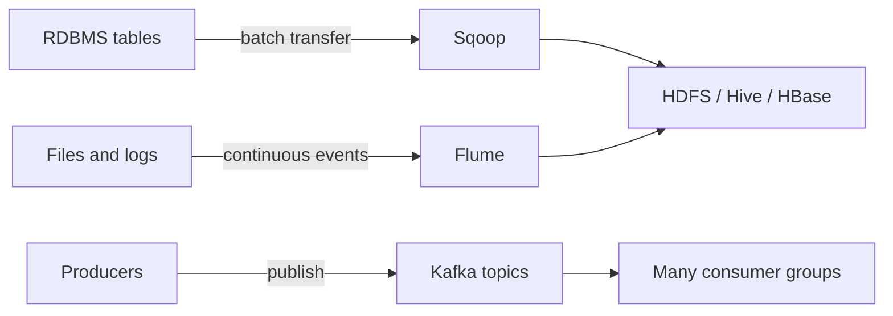
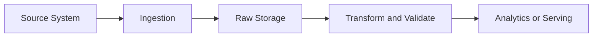
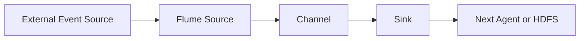
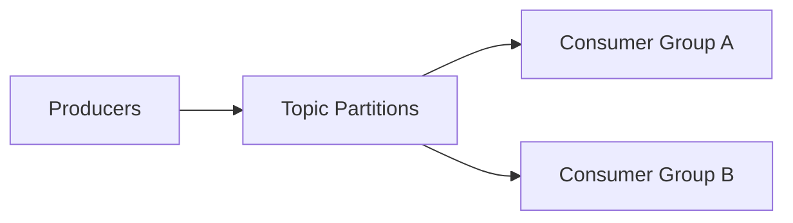

# 04 — Data Ingestion: จากข้อมูลภายนอกสู่ Hadoop และ Event Streaming

> **เอกสารหลัก:** [Lecture 04 — Data Ingestion](../lecture/dads6002_04_data_ingestion.pdf) หน้า 1–22  
> **เส้นทางอ่าน:** [← 03 HBase](03_hbase.md) | [สารบัญรายวิชา](00_course_syllabus.md)

ข้อมูลที่เราใช้วิเคราะห์ไม่ได้ถือกำเนิดอยู่ใน HDFS, Hive หรือ HBase ตั้งแต่แรก ข้อมูลยอดขายอาจอยู่ใน MySQL, พฤติกรรมผู้ใช้อาจเกิดเป็น log file บน web server และเหตุการณ์สั่งซื้ออาจไหลเข้ามาตลอดเวลา ก่อนระบบวิเคราะห์จะทำงานได้จึงต้องมีขั้นตอนพาข้อมูลจาก “ที่ที่มันเกิด” ไปยัง “ที่ที่ระบบปลายทางใช้ได้” ขั้นตอนนี้เรียกว่า **Data Ingestion**

บทนี้ใช้เครื่องมือสามตัวเพื่อสร้างภาพสามแบบที่ต่างกันชัดเจน Sqoop แสดงการย้ายตารางจำนวนมากเป็นรอบ, Flume แสดงการรับและส่ง event ผ่าน pipeline และ Kafka แสดงการเก็บ event เป็น distributed log ที่หลาย consumer group อ่านตามจังหวะของตนได้ แม้บางเครื่องมือในสไลด์เป็นเทคโนโลยีรุ่นเก่า แต่คำถามเรื่องต้นทาง ความถี่ ความทนทาน การอ่านซ้ำ ลำดับ และการตรวจสอบข้อมูลยังเป็นคำถามเดิมในระบบสมัยใหม่

## ภาพรวม: ข้อมูลอยู่ตรงไหนและเคลื่อนอย่างไร

**คำถามนำ:** ก่อนเลือกเครื่องมือ เราจะจำแนกได้อย่างไรว่ากำลังย้ายตารางเป็นรอบ ส่ง Event ตามท่อ หรือสร้าง Event Log ที่หลายระบบอ่านซ้ำได้?

ลองมองระบบโรงพยาบาลหนึ่งแห่ง ฐานข้อมูลธุรกรรมเก็บ master data และคำสั่งซื้อเป็นตาราง ทุกครั้งที่ผู้ใช้เปิดหน้าสินค้าจะเกิด event และหลายระบบปลายทางต้องการ event ชุดเดียวกัน ทั้ง data lake, dashboard และระบบแจ้งเตือน เครื่องมือทั้งสามจึงไม่ได้เป็นคำพ้องความหมาย แต่รับผิดชอบคนละรูปแบบของการเคลื่อนข้อมูล



| คำถามก่อนเลือกวิธี | สิ่งที่ต้องตัดสินใจ |
|---|---|
| ข้อมูลเกิดแบบใด | ตาราง, ไฟล์, log หรือ event |
| ต้องเห็นข้อมูลเร็วแค่ไหน | รายวัน รายชั่วโมง หรือเกือบทันที |
| ต้องอ่านข้อมูลเดิมซ้ำหรือไม่ | replay, audit และ recovery |
| มีผู้ใช้ปลายทางกี่กลุ่ม | ปลายทางเดียวหรือหลาย consumer groups |
| ลำดับสำคัญในขอบเขตใด | ทั้งชุด, ต่อ customer หรือไม่สำคัญ |
| เมื่อระบบล้มจะทำอย่างไร | retry, deduplicate, resume และ reconcile |

## ส่วนที่ 1 — Sqoop: ย้ายตารางจาก RDBMS เป็นรอบ

**คำถามนำ:** Sqoop แบ่งการดึง Table ขนาดใหญ่ให้หลาย Mappers ทำพร้อมกันอย่างไร และเหตุใดการเพิ่ม Parallelism จึงอาจกระทบฐานข้อมูลต้นทาง?

### 1. Data Ingestion คืออะไร

**Data Ingestion** คือกระบวนการนำข้อมูลจาก Source System เข้าสู่ Storage หรือ Processing Platform ที่ปลายทาง เพื่อให้ข้อมูลพร้อมสำหรับการจัดเก็บ แปลง วิเคราะห์ หรือให้บริการต่อไป Source อาจเป็นฐานข้อมูลธุรกรรม ไฟล์ Log API Sensor หรือ Event Stream ส่วน Destination อาจเป็น HDFS, Data Lake, Data Warehouse, Hive, HBase หรือ Streaming Platform

คำว่า Ingestion เน้นการเคลื่อนข้อมูลเข้าแพลตฟอร์ม ไม่ได้หมายความว่าข้อมูลสะอาดหรือพร้อมวิเคราะห์แล้วเสมอ ตัวอย่างเช่น การคัดลอกตาราง `sales_order` จาก MySQL เข้า HDFS ถือเป็น Ingestion ส่วนการแปลงวันที่ ลบข้อมูลซ้ำ คำนวณยอดสุทธิ และรวมกับ Master Data เป็น Transformation



สไลด์เรียก Ingestion ว่าเป็นขั้นแรกของ Data Science Pipeline ซึ่งเหมาะในภาพรวม แต่ในระบบจริงต้องมีการกำหนด Data Contract, Security, Schema และ Validation ตั้งแต่ก่อนเคลื่อนข้อมูล หากนำข้อมูลผิดชุดหรือทำข้อมูลตกหล่น การวิเคราะห์ขั้นถัดไปจะผิดแม้ Model หรือ Dashboard ทำงานสมบูรณ์

#### 1.1 รูปแบบของ Ingestion

| รูปแบบ | ลักษณะ | ตัวอย่าง | จุดตัดสินใจสำคัญ |
|---|---|---|---|
| Batch | ย้ายข้อมูลเป็นรอบ | ดึงยอดขายทุกคืน | รอบเวลา ปริมาณ และเวลาที่รับได้ |
| Streaming | รับ Event ต่อเนื่อง | Clickstream หรือ Sensor | Throughput, Latency และ Delivery Semantics |
| Incremental | ดึงเฉพาะข้อมูลใหม่หรือเปลี่ยน | `updated_at > last_watermark` | Watermark, Late Data และการรันซ้ำ |
| Change Data Capture (CDC) | อ่านการเปลี่ยนแปลงจาก Transaction Log | Insert/Update/Delete จากฐานข้อมูล | Ordering, Schema Evolution และ Delete Handling |

Sqoop ในบทนี้เป็นเครื่องมือ **Batch Bulk Transfer** ระหว่างฐานข้อมูลเชิงสัมพันธ์กับ Hadoop ไม่ได้ออกแบบมาสำหรับ Event Streaming ต่อเนื่อง

### 2. Sqoop แก้ปัญหาอะไร

Apache Sqoop ถูกออกแบบให้ย้ายข้อมูลจำนวนมากระหว่าง **Relational Database Management System (RDBMS)** เช่น MySQL หรือ Oracle กับ Hadoop Ecosystem เช่น HDFS, Hive และ HBase โดยอ่าน Database Metadata เช่นชื่อ Column และ Data Type แล้วสร้าง MapReduce Job เพื่อถ่ายโอนข้อมูล

หากไม่มี Sqoop นักพัฒนาอาจต้องเขียนโปรแกรมเปิด JDBC Connection, แบ่งช่วงข้อมูล, Serialize Records, Retry เมื่อ Task ล้ม และเขียนผลลง HDFS เอง Sqoop รวมงานเหล่านี้ไว้ในคำสั่งเดียว โดยเฉพาะการแบ่ง Table ให้หลาย Mappers อ่านพร้อมกัน

#### 2.1 Mental Model ตั้งแต่ Source ถึง Destination

สมมติ MySQL มีตาราง `avgprice_by_state` จำนวน 10 ล้าน Rows และต้องนำเข้า HDFS:

1. Sqoop เชื่อมต่อ MySQL ผ่าน JDBC
2. Sqoop อ่าน Schema และข้อมูลที่จำเป็นต่อการแบ่งงาน
3. Sqoop สร้าง Map-only Job ไม่มี Reducer เพราะแต่ละ Mapper สามารถอ่านและเขียนชุดข้อมูลของตนได้โดยไม่ต้อง Group หรือ Aggregate
4. Mappers อ่านคนละช่วงของ Source Table
5. แต่ละ Mapper Serialize Rows เป็นไฟล์ผลลัพธ์ใน HDFS
6. ผู้ใช้ตรวจจำนวน Rows, Schema และตัวอย่างข้อมูลก่อนส่งต่อไปยังขั้น Transform

ผลลัพธ์จึงมักมีหลายไฟล์ เช่น `part-m-00000`, `part-m-00001` ไม่ใช่ไฟล์เดียว เพราะแต่ละ Mapper เขียน Output ของตนเอง

### 3. จำนวน Mappers ไม่ใช่เพียงตัวเลือกความเร็ว

การใช้ Mapper เดียวทำให้ได้ไฟล์ Part เดียวและทำความเข้าใจเส้นทางได้ง่าย แต่ไม่ใช้ Parallelism หากเพิ่ม Mappers Sqoop ต้องมี Column สำหรับแบ่งช่วง เช่น Primary Key หรือ Split Column ที่กระจายข้อมูลเหมาะสม

สมมติ `id` มีค่าตั้งแต่ 1 ถึง 1,000,000 และใช้ 4 Mappers แนวคิดอย่างง่ายคือแบ่งช่วงประมาณนี้:

| Mapper | ช่วงโดยประมาณ |
|---:|---|
| 1 | 1–250,000 |
| 2 | 250,001–500,000 |
| 3 | 500,001–750,000 |
| 4 | 750,001–1,000,000 |

จำนวน Mappers มากขึ้นอาจลดเวลานำเข้า แต่เพิ่ม Concurrent Connections และ Query Load บนฐานข้อมูลต้นทาง หากข้อมูลกระจุกตัวไม่สม่ำเสมอ บาง Mapper อาจทำงานนานกว่าตัวอื่น เกิด Data Skew ดังนั้นจำนวน Mappers ต้องสมดุลระหว่าง Throughput ของ Pipeline กับผลกระทบต่อ Production Database

### 4. Import จาก MySQL ไป HDFS

สไลด์ใช้ฐานข้อมูล `energydata` และ Table `avgprice_by_state` ซึ่งมีข้อมูลปี รัฐ ภาคการใช้พลังงาน และราคาเฉลี่ย เพื่อแสดงการ Import ไปยัง HDFS ผลลัพธ์เป็น Files หลาย Part ตามจำนวน Mappers ไม่ใช่ Table Metadata แบบ Hive และไม่ใช่ Rows ที่เข้าถึงผ่าน RowKey แบบ HBase

การเห็นไฟล์อยู่ใน HDFS ยังไม่เพียงพอ ต้องเปรียบเทียบอย่างน้อย:

- Source Row Count กับ Destination Row Count
- Column Count และ Data Type Mapping
- Null Count ของ Columns สำคัญ
- Min/Max ของ Primary Key หรือวันที่
- Sum ของ Measure ที่ควร Reconcile เช่นยอดเงิน

### 5. Import ไป Hive

สไลด์แสดงการ Import ไป Hive Table โดยตรงจากมุมมองของผู้ใช้ แต่คำว่า “ตรง” ไม่ได้หมายความว่าข้อมูลไม่ผ่าน Storage Layer เพราะข้อมูลของ Hive ยังคงถูกจัดเก็บเป็น Files ใน HDFS หรือ Storage ที่กำหนด Hive เพิ่ม Table Metadata เหนือไฟล์เหล่านั้น หลัง Import จึงต้องตรวจทั้ง Schema ใน Metastore และค่าที่อ่านได้จาก Files จริง

Data Type จาก RDBMS อาจไม่แมปตรงกับ Hive ทุกกรณี โดยเฉพาะ Decimal, Date/Timestamp, Boolean และ Character Encoding จึงต้องตรวจ Schema ไม่ใช่ดูเฉพาะ Sample Rows

### 6. Import ไป HBase

การ Import ไป HBase ต้องตัดสินใจเพิ่มสองเรื่องที่ไม่มีใน HDFS Import:

1. Column ใดเป็น **RowKey**
2. Columns จะอยู่ใน **Column Family** ใด


การเลือก Primary Key ของ RDBMS เป็น HBase RowKey ทำได้ในตัวอย่างนี้เพราะ `id` ระบุ Row ได้ไม่ซ้ำ แต่ในงานจริงต้องพิจารณา Access Pattern, RowKey Distribution และ Hotspot ด้วย การคัดลอก Schema จาก RDBMS มา HBase แบบตรงตัวไม่ถือว่าเป็นการออกแบบ HBase ที่ดีโดยอัตโนมัติ

### 7. Failure, Rerun และ Idempotency

Pipeline ต้องตอบได้ว่าหาก Import ล้มครึ่งทางแล้วรันใหม่จะเกิดอะไรขึ้น หาก Target Directory มีอยู่แล้ว คำสั่งอาจล้ม หรือถ้า Append โดยไม่มี Key ป้องกันอาจเกิดข้อมูลซ้ำ แนวทางออกแบบที่ปลอดภัยคือ:

1. เขียนลง Staging Path ที่ผูกกับ Batch ID
2. ตรวจ Validation ให้ผ่าน
3. Promote หรือ Swap ไปยัง Curated Location
4. บันทึก Watermark และ Audit Log หลังสำเร็จเท่านั้น
5. กำหนดวิธี Cleanup Batch ที่ล้มอย่างชัดเจน

หลัก **Idempotency** หมายถึงการรันคำสั่งเดิมซ้ำแล้วไม่ทำให้ผลลัพธ์เสียหรือเพิ่มข้อมูลซ้ำโดยไม่ตั้งใจ เป็นคุณสมบัติสำคัญกว่าการทำให้คำสั่ง “รันผ่าน” เพียงครั้งเดียว

### 8. บริบทปัจจุบันของ Sqoop

**คำอธิบายเพิ่มเติม:** [Apache Sqoop ถูก Retire และย้ายเข้า Apache Attic ในปี 2021](https://attic.apache.org/projects/sqoop.html) จึงควรเรียนเพื่อเข้าใจระบบ Hadoop รุ่นเดิมและข้อสอบจากสไลด์ แต่ไม่ควรเลือกเป็น Default สำหรับโครงการใหม่โดยไม่ประเมินทางเลือกอื่น เช่น Managed Connectors, JDBC-based Batch Pipelines หรือ CDC Platforms

แนวคิดของ Sqoop ยังมีคุณค่า เพราะทำให้เห็นคำถามพื้นฐานของ Database Ingestion ได้แก่ Schema Discovery, Parallel Extraction, Split Key, Source Load, Serialization, Incremental State และ Validation ซึ่งยังคงต้องตอบไม่ว่าจะใช้เครื่องมือใด

### 9. Decision Framework

| สถานการณ์ | แนวทางที่เหมาะกว่า |
|---|---|
| ย้าย RDBMS Table เป็นรอบใน Legacy Hadoop | Sqoop อาจยังพบในระบบเดิม |
| ต้องรับ Log ต่อเนื่องเข้า HDFS | Flume ตามขอบเขตของสไลด์ |
| หลาย Consumers ต้องอ่าน Event เดิมอย่างอิสระ | Kafka |
| ต้องจับ Insert/Update/Delete ใกล้ Real Time | CDC Connector/Platform |
| ต้อง Transform ซับซ้อนระหว่างทาง | ETL/ELT หรือ Stream Processing Engine |


## จาก Batch Table ไปสู่ Event ที่เกิดอย่างต่อเนื่อง

**คำถามนำ:** เมื่อข้อมูลเกิดขึ้นตลอดเวลาและปลายทางอาจหยุดชั่วคราว ระบบจะพัก Event ไว้ที่ใดและรับประกันการส่งต่อในขอบเขตใด?

Sqoop เหมาะเมื่อข้อมูลต้นทางเป็นตารางและยอมรอให้ดึงเป็นรอบได้ แต่ log และ clickstream ไม่หยุดรอรอบกลางคืน ถ้าต้องรับข้อมูลที่เกิดขึ้นเรื่อย ๆ เราต้องมี buffer คั่นระหว่างผู้สร้างข้อมูลกับปลายทาง นี่คือจุดที่ Flume เข้ามาแก้ปัญหา

### 1. จาก Batch Table สู่ Continuous Events

Sqoop เหมาะกับการดึง Table จาก RDBMS เป็นรอบ แต่ Web Access Log, Clickstream, Network Event และ Sensor Reading เกิดขึ้นต่อเนื่อง หากรอ Export ทั้ง Table ทุกครั้งจะช้าและสิ้นเปลือง Flume จึงถูกออกแบบให้รวบรวม Event ปริมาณมากจากหลาย Sources แล้วส่งไปยัง Hadoop Storage

**Event** ใน Flume คือหน่วยข้อมูลที่ไหลผ่านระบบ ประกอบด้วย Body ซึ่งเก็บ Payload เป็น Bytes และ Headers ซึ่งเก็บ Key-value Metadata ตัวอย่าง Event หนึ่งรายการอาจเป็น Log Line หรือ JSON ของการกดสินค้า ไม่จำเป็นต้องเป็น Row แบบ RDBMS



### 2. Flume Agent และ Component สามส่วน

Flume Agent คือ JVM Process หนึ่งตัวที่มี Components หลักสามส่วน:

#### 2.1 Source

Source รับ Events จากระบบภายนอก เช่น Spooling Directory, Exec Command หรือ Avro Client แล้วเขียน Event ลง Channel Source ไม่ควรถือว่า Event ส่งสำเร็จเพียงเพราะอ่านจากต้นทางได้ ต้องผ่าน Transaction ที่ทำให้ Event เข้า Channel สำเร็จด้วย

#### 2.2 Channel

Channel เป็น Buffer ระหว่าง Source กับ Sink ทำให้ทั้งสองส่วนทำงานคนละอัตราได้ หาก Destination ช้าชั่วคราว Source ยังสามารถรับข้อมูลต่อได้จนกว่า Channel จะเต็ม [Apache Flume User Guide](https://flume.apache.org/FlumeUserGuide.html) อธิบายว่า Source เก็บ Event ลง Channel และ Channel รักษา Event ไว้จน Sink นำไปส่งต่อ

#### 2.3 Sink

Sink อ่าน Event จาก Channel แล้วส่งไปยัง Next-hop Agent หรือ Final Destination เช่น HDFS Sink จะเขียน Event ลง HDFS การนำ Event ออกจาก Channel ต้องสัมพันธ์กับผลส่งปลายทาง หากส่งไม่สำเร็จ Transaction ต้อง Roll Back เพื่อให้ลองใหม่ได้

### 3. Reliability เกิดจาก Transaction Boundary

เส้นทางหนึ่ง Hop มีสอง Transaction ที่สำคัญ:

1. Source → Channel: Commit เมื่อ Event ถูกเก็บใน Channel สำเร็จ
2. Channel → Sink: Commit และนำ Event ออกจาก Channel เมื่อ Destination ยอมรับ Event แล้ว

กลไกนี้ช่วยลด Data Loss แต่การ Retry หลัง Failure อาจทำให้ Event ถูกส่งซ้ำได้ ระบบปลายทางจึงควรมี Event ID หรือ Deduplication Logic หากต้องการผลลัพธ์ทางธุรกิจแบบ Exactly-once ความสามารถของ Flume เหมาะจะอธิบายเป็น Reliable Delivery ต่อ Hop ไม่ควรสรุปว่าไม่มีข้อมูลซ้ำทุกกรณี

#### 3.1 Memory Channel กับ File Channel

| ประเด็น | Memory Channel | File Channel |
|---|---|---|
| ที่เก็บหลัก | Memory | Local Filesystem |
| Throughput | โดยทั่วไปสูงกว่า | มี Disk I/O |
| ทนต่อ Process/Host Failure | ต่ำกว่า | ดีกว่าเมื่อ Disk ยังใช้ได้ |
| เหมาะกับ | ยอมสูญหายบางส่วนได้หรือมีต้นทาง Replay | Log ที่ต้องการ Durability มากขึ้น |

คำว่า File Channel ไม่ได้ทำให้ระบบปลอดภัยจากทุก Failure หาก Disk เสียพร้อม Host หรือไม่มี Replication ภายนอกก็ยังสูญข้อมูลได้ Reliability ต้องพิจารณาทั้ง Agent, Disk, Destination และความสามารถ Replay ของ Source

### 4. รูปแบบ Data Flow

#### 4.1 Simple Flow

หนึ่ง Agent รับ Event แล้วส่งไป Destination เหมาะกับเส้นทางสั้นและดูแลง่าย แต่หาก Agent เป็น Single Point of Failure ต้องเพิ่ม Monitoring และ Recovery Strategy

#### 4.2 Multi-agent Flow

Client Agent รับ Events ใกล้ Source แล้วส่งไป Collector Agent ซึ่งรวมและเขียนลง Storage การแยก Tier ช่วยควบคุมอัตราการเขียนและแยกความรับผิดชอบ แต่เพิ่ม Network Hop, Configuration และ Failure Modes

#### 4.3 Fan-in Flow

หลาย Client Agents ส่ง Events มายัง Collector กลาง เหมาะกับ Log จากหลาย Web Servers แต่ Collector และ Destination ต้องรองรับ Throughput รวม หาก Capacity ไม่พอ Channel จะโตจนเต็มและเกิด Backpressure

### 5. Avro: ต้องแยกสองบริบท

[Apache Avro](https://avro.apache.org/docs/) เป็นระบบ Data Serialization ที่รองรับโครงสร้างข้อมูล Format แบบ Binary ที่กะทัดรัด Container File และ RPC แต่ในบทนี้มีสองบริบทที่ไม่ควรปะปน:

1. **Avro Data File** — เก็บ Serialized Records พร้อม Schema Metadata ใน Container File
2. **Flume Avro Source/Sink** — ใช้ Avro RPC ส่ง Flume Events ระหว่าง Agents

การตั้ง `client.sinks.k1.type=avro` ไม่ได้หมายความว่า HDFS Output จะกลายเป็น Avro Data File โดยอัตโนมัติ Format ปลายทางขึ้นกับ HDFS Sink Configuration เช่นตัวอย่างสไลด์กำหนด `fileType=DataStream` และ `writeFormat=text`

### 6. Product Impression Example

สไลด์จำลอง Event จากร้านค้าออนไลน์ เช่น View, Click, Add Cart, Remove Cart และ Purchase ตัวอย่าง JSON ที่แก้ Syntax ให้ถูกต้องคือ:

```json
{
  "sku": "T9921-5",
  "timestamp": 1453167527737,
  "cid": "51761",
  "action": "add_cart",
  "ip": "226.43.51.25"
}
```

จุดสำคัญไม่ใช่เพียงรับไฟล์ได้ แต่ต้องกำหนด Event Contract เช่น Field ที่จำเป็น Timestamp Unit, Allowed Actions, Event ID, Character Encoding และวิธีจัดการ Invalid JSON หาก Contract ไม่ชัด ต่อให้ Pipeline ไม่ Error ก็อาจส่งข้อมูลคุณภาพต่ำไป HDFS

### 7. อ่านเส้นทางของ Client Agent

เส้นทางเชิงแนวคิดคือ Spool Directory → Source → File Channel → Avro Sink → Collector การอ่าน Flow ต้องเริ่มจากชนิดของ Component และการเชื่อม Source–Channel–Sink ไม่ใช่จำชื่อ `r1`, `ch1` หรือ `k1`

Spool Directory Source เหมาะกับไฟล์ที่เขียนเสร็จแล้วและนำมาวางใน Directory ไม่ควรให้ Application เขียนต่อท้ายไฟล์เดิมขณะที่ Flume กำลังอ่าน เพราะอาจทำให้ Event Boundary และสถานะไฟล์ไม่เป็นไปตามที่คาด

### 8. อ่านเส้นทางของ Collector Agent

เส้นทาง Collector คือ Avro Source → File Channel → HDFS Sink การแยก Client กับ Collector เพิ่มจุดพักและ Failure Boundary อีกหนึ่งชั้น จึงต้องตรวจว่า Event ถูก Commit ออกจาก Channel ใดเมื่อใด และหากปลายทางล้ม Event ยังอยู่ที่จุดใด

### 9. Validation ต้องพิสูจน์มากกว่า “มีไฟล์ปลายทาง”

การเห็นไฟล์ถูกสร้างไม่ได้พิสูจน์ว่า Event เดินทางครบ ไม่ซ้ำ และยังรักษาความหมายเดิมไว้ การตรวจจึงควรครอบคลุม:

- จำนวน Events ที่ Source สร้าง เทียบกับจำนวน Lines ปลายทาง
- JSON Parse Success/Failure
- Duplicate Event ID
- Channel Fill Percentage และ Sink Error
- จำนวน/ขนาด HDFS Files เพื่อป้องกัน Small-files Problem
- สิทธิ์ของ Directory และ Service Account โดยไม่เปิดสิทธิ์กว้างเกินความจำเป็น

### 10. Failure Scenarios

| Failure | สิ่งที่คาดว่าจะเกิด | สิ่งที่ต้องตรวจ |
|---|---|---|
| HDFS ช้าหรือหยุด | Sink ส่งไม่ได้, Channel สะสม | Channel Capacity และ Disk Space |
| Collector ล้ม | Client Avro Sink Retry/Backoff | Client Channel Retention |
| Event ผิด Schema | อาจถูกส่งเป็น Bytes แต่ Parse ภายหลังล้ม | Validation/Dead-letter Strategy |
| Restart หลัง Commit ไม่ชัดเจน | อาจเกิด Duplicate | Event ID และ Deduplication |
| HDFS Roll บ่อยเกิน | Files เล็กจำนวนมาก | Roll Size/Interval และ Batch Size |


## จากท่อส่ง Event ไปสู่ Event Log ที่อ่านซ้ำได้

**คำถามนำ:** หากหลายระบบต้องอ่าน Event ชุดเดียวกันในเวลาต่างกันและบางระบบต้อง Replay ข้อมูลเดิม เหตุใดท่อส่งแบบ Source–Channel–Sink จึงยังไม่เพียงพอ?

Flume ช่วยส่ง event ตามเส้นทาง Source → Channel → Sink แต่เมื่อ event ชุดเดียวต้องถูกใช้โดยหลายระบบและแต่ละระบบต้องอ่านตามจังหวะของตนเอง เราต้องการพื้นที่กลางที่เก็บ event ตามลำดับและจำตำแหน่งการอ่านได้ Kafka จึงไม่ใช่เพียงท่ออีกเส้น แต่เป็น distributed event log

### 1. Kafka คืออะไรและไม่ใช่อะไร

Apache Kafka คือ Distributed Event Streaming Platform ที่รับ Events จาก Producers เก็บ Events อย่างทนทานใน Topics และเปิดให้ Consumers หลายกลุ่มอ่านตามจังหวะของตนเอง Kafka ไม่ใช่เพียง Queue ที่ส่งข้อความแล้วหายทันที และไม่ใช่ Database สำหรับ Query แบบอิสระทุก Field

ความแตกต่างสำคัญจาก Direct Pipeline คือ Producer ไม่ต้องรู้ว่า Consumer คนใดจะใช้ข้อมูล และ Consumer แต่ละ Group มีตำแหน่งการอ่านของตนเอง Event เดียวจึงถูกใช้ได้ทั้ง Fraud Detection, Dashboard, Data Lake Ingestion และ Machine Learning Pipeline โดยไม่ต้องให้ Producer ส่งซ้ำแยกปลายทาง



### 2. Vocabulary Dependency

#### 2.1 Record

Record คือ Event หนึ่งรายการ โดยทั่วไปประกอบด้วย Key, Value, Timestamp และ Headers Key อาจไม่มีค่าได้ แต่หากกำหนด Key จะมีผลต่อการเลือก Partition และ Ordering ของ Records ที่มี Key เดียวกัน

#### 2.2 Topic

Topic คือชื่อ Logical Stream เช่น `purchase-events` หรือ `inventory-updates` Topic เป็นขอบเขตที่ Producers Publish และ Consumers Subscribe แต่ข้อมูลจริงถูกแบ่งเก็บใน Partitions

#### 2.3 Partition

Partition คือ Ordered Append-only Log หนึ่งชุดภายใน Topic แต่ละ Record ใน Partition มี **Offset** ที่เพิ่มตามลำดับ [Apache Kafka Documentation](https://kafka.apache.org/documentation/) ระบุขอบเขตการรับประกันลำดับไว้ภายใน Topic-Partition เดียว ไม่ได้รับประกัน Global Ordering ระหว่างหลาย Partitions

#### 2.4 Offset

Offset คือตำแหน่งของ Record ภายใน Partition ไม่ใช่ ID ที่ Unique ข้าม Topic ทั้งหมด พิกัดที่ระบุ Record จึงต้องมีอย่างน้อย Topic + Partition + Offset

ตัวอย่าง:

```text
Topic: purchase-events
Partition: 2
Offset: 1048
```

Offset ยังใช้บอกความคืบหน้าของ Consumer เมื่อ Consumer Process แล้ว Commit Offset ระบบจึงทราบว่าควร Resume จากตำแหน่งใด

### 3. Broker และ Cluster

Kafka Server หนึ่งตัวเรียกว่า **Broker** และ Brokers หลายตัวรวมเป็น Cluster Partitions ของ Topics ถูกกระจายข้าม Brokers เพื่อเพิ่ม Capacity และ Parallelism การเพิ่ม Broker ไม่ได้ทำให้ข้อมูลกระจายสมดุลโดยอัตโนมัติทุกกรณี ต้องมี Partition Assignment/Reassignment และ Capacity Planning ที่เหมาะสม

แต่ละ Partition มี Leader Replica ที่รับ Read/Write และอาจมี Follower Replicas บน Brokers อื่นเพื่อ Fault Tolerance หาก Leader ใช้งานไม่ได้ ระบบสามารถเลือก Replica ที่เหมาะสมขึ้นมารับบทบาทตาม Configuration และ Cluster State

**Replication Factor** บอกจำนวน Replicas ของ Partition ไม่ใช่จำนวนสำเนาของทั้ง Topic เป็นก้อนเดียว หาก Topic มี 6 Partitions และ Replication Factor 3 ระบบจะมี Partition Replicas รวม 18 ชุด

### 4. Producer และ Partition Selection

Producer ส่ง Records ไป Topic และต้องเลือก Partition แนวทางทั่วไปคือ:

- มี Key: ใช้ Partitioner ทำให้ Key เดียวกันมักไป Partition เดียวกัน
- ไม่มี Key: กระจาย Records เพื่อ Load Balance ตามพฤติกรรมของ Client
- Custom Partitioner: ใช้กติกาธุรกิจ แต่เสี่ยง Data Skew

สมมติใช้ `hospital_id` เป็น Key Events ของ Hospital เดียวกันจะถูกส่งไป Partition เดียวกัน จึงรักษาลำดับเฉพาะ Hospital ได้ แต่หาก Hospital หนึ่งสร้าง Events มากผิดปกติ Partition นั้นอาจกลายเป็น Hot Partition

ดังนั้น Key Design เป็น Trade-off ระหว่าง:

- Ordering Scope
- Parallelism
- Load Distribution
- State Locality ของ Consumer

### 5. Consumer Group

Consumers ที่ใช้ Group ID เดียวกันอยู่ใน **Consumer Group** เดียว Kafka Assign แต่ละ Partition ให้ Consumer เพียงหนึ่ง Instance ภายใน Group ในช่วงเวลาหนึ่ง เพื่อไม่ให้สอง Consumers ใน Group ประมวลผล Partition เดียวกันพร้อมกันโดยไม่ตั้งใจ

ถ้า Topic มี 6 Partitions:

| Consumers ใน Group | Active Consumers โดยประมาณ | ผล |
|---:|---:|---|
| 1 | 1 | Consumer เดียวอ่าน 6 Partitions |
| 3 | 3 | เฉลี่ยคนละ 2 Partitions |
| 6 | 6 | คนละ 1 Partition |
| 8 | 6 | 2 Consumers ไม่มี Partition ให้ทำงาน |

สูตรขอบเขต Parallelism ต่อ Topic ใน Consumer Group คือ:

$$
\text{Active Consumers} \leq \text{Number of Partitions}
$$

หากใช้คนละ Group ID แต่ละ Group จะอ่าน Event Stream ได้อิสระ คล้าย Broadcast ระหว่าง Groups แต่ Load Balance ภายใน Group

### 6. Rebalance และ Consumer Lag

เมื่อ Consumer เข้า/ออก Group หรือ Partition Assignment เปลี่ยน จะเกิด **Rebalance** เพื่อแจก Partitions ใหม่ ระหว่างนั้นการประมวลผลอาจหยุดชั่วคราวหรือย้าย State ดังนั้นการเพิ่ม Consumers ไม่ได้ให้ Throughput ฟรีโดยไม่มี Coordination Cost

**Consumer Lag** คือส่วนต่างระหว่าง Offset ล่าสุดใน Partition กับ Offset ที่ Consumer Group ประมวลผลหรือ Commit แล้ว Lag ที่โตต่อเนื่องอาจหมายถึง Consumer ช้ากว่า Producer, Processing Error, Partition Skew หรือ Capacity ไม่พอ

### 7. Ordering: คำถามที่มักตอบกว้างเกินไป

ประโยค “Kafka รักษาลำดับ” ต้องระบุขอบเขตให้ครบ:

> Kafka รักษาลำดับของ Records ภายใน Partition เดียวตามตำแหน่งใน Log

หากต้องการ Global Order ของ Topic ทั้งหมด การใช้ Partition เดียวเป็นแนวทางตรงที่สุด แต่ลด Parallelism และ Throughput สไลด์จึงเสนอหนึ่ง Partition สำหรับ Queue ที่ต้องรักษาลำดับทั้งหมด อย่างไรก็ตาม ระบบส่วนใหญ่มักต้องการเพียง Order ต่อ Entity เช่นต่อ Customer, Order หรือ Device จึงใช้ Entity ID เป็น Key และคงหลาย Partitions ได้

### 8. Delivery Semantics และ Offset Commit

ผลลัพธ์ไม่ได้ขึ้นกับ Kafka Storage เพียงอย่างเดียว แต่ขึ้นกับเวลาที่ Consumer Commit Offset:

| รูปแบบ | แนวคิด | ความเสี่ยงหลัก |
|---|---|---|
| At-most-once | Commit ก่อน Process | Process ล้มแล้ว Record อาจหายจากมุมมองงาน |
| At-least-once | Process แล้ว Commit | ล้มหลังเขียนผลแต่ก่อน Commit อาจ Process ซ้ำ |
| Exactly-once | ใช้ Transaction/Idempotent Design ตามขอบเขต | ซับซ้อนและต้องนิยาม End-to-end |

ในงานจริง Consumer ควรออกแบบ Output ให้ Idempotent หรือมี Deduplication Key เพราะ At-least-once เป็นรูปแบบที่พบได้บ่อย

### 9. ZooKeeper ในสไลด์กับ KRaft ปัจจุบัน

**จากเอกสาร หน้า 17–18:** สไลด์อธิบายว่า Brokers และ Consumers ใช้ ZooKeeper สำหรับ State และ Offset ซึ่งสะท้อน Kafka รุ่นเก่า

**คำอธิบายเพิ่มเติม:** [Kafka 4.0 ขึ้นไปรองรับเฉพาะ KRaft Mode และนำ ZooKeeper Mode ออกแล้ว](https://kafka.apache.org/40/getting-started/upgrade/) Control Plane จึงถูกผนวกเข้ากับ Kafka เอง นอกจากนี้ Consumer Offsets ใน Kafka สมัยใหม่ถูกจัดการผ่าน Group Coordinator และ Internal Topic ไม่ควรจำว่า Consumer ทุกตัวเขียน Offset ลง ZooKeeper

สำหรับการสอบ ให้ตอบตาม Architecture ที่อาจารย์สอนพร้อมระบุว่าเป็น Legacy Architecture หากโจทย์ถามบริบทปัจจุบัน ส่วนการออกแบบระบบใหม่ให้ใช้เอกสาร Kafka Version ที่องค์กรใช้งานจริง

### 10. Kafka กับ Flume ต่างกันอย่างไร

| ประเด็น | Flume | Kafka |
|---|---|---|
| แกนหลัก | Source–Channel–Sink Ingestion | Durable Distributed Event Log |
| รูปแบบการใช้งานเด่น | รวบรวม Log เข้า Hadoop | Event Backbone สำหรับหลาย Producers/Consumers |
| การเก็บ Event | Channel ระหว่างส่ง | Retained ตาม Topic Policy |
| หลาย Consumer Groups | ไม่ใช่ Abstraction หลัก | เป็นความสามารถแกนกลาง |
| Replay | ขึ้นกับ Source/Flow | อ่านใหม่จาก Offset ได้ภายใน Retention |
| Scaling Unit | Agents/Channels/Sinks | Brokers/Partitions/Consumers |

Flume และ Kafka ไม่จำเป็นต้องแทนกันเสมอไป Flume สามารถเชื่อม Kafka Source/Sink ได้ แต่ในการออกแบบใหม่ต้องประเมิน Ecosystem, Operational Skill, Retention, Replay และ Connector Availability

### 11. Worked Example: Hospital Purchase Events

กำหนด Topic `purchase-events` มี 4 Partitions และใช้ `hospital_id` เป็น Key มี Consumers 3 ตัวใน Group `inventory-update`

1. Events ของ Hospital เดียวกันไป Partition เดียวกัน จึงรักษาลำดับต่อ Hospital
2. Kafka Assign 4 Partitions ให้ 3 Consumers โดย Consumer หนึ่งตัวอาจได้ 2 Partitions
3. เพิ่ม Consumer ตัวที่ 4 ทำให้มีโอกาสได้คนละ Partition
4. เพิ่ม Consumer ตัวที่ 5 จะมีอย่างน้อยหนึ่งตัว Idle
5. หาก Hospital ใหญ่สร้าง 70% ของ Events อาจเกิด Hot Partition แม้มี Consumers หลายตัว

ตัวอย่างนี้แสดงว่าจำนวน Consumers แก้ปัญหาไม่ได้หาก Partition Key ทำให้ข้อมูลกระจุกตัว


## เปรียบเทียบ Sqoop, Flume และ Kafka จากปัญหาที่แก้

**คำถามนำ:** เครื่องมือทั้งสามต่างกันที่ชนิดข้อมูลอย่างเดียว หรือแตกต่างถึงรูปแบบเวลา การพักข้อมูล การอ่านซ้ำ และจำนวนผู้บริโภค?

| ประเด็น | Sqoop | Flume | Kafka |
|---|---|---|---|
| หน่วยข้อมูลหลัก | rows ในตาราง | events ที่ไหลผ่าน agent | records ใน partition log |
| รูปแบบเวลา | batch | continuous ingestion | continuous event streaming |
| Buffer/Storage กลาง | งานและไฟล์ปลายทาง | channel | retained topic partitions |
| ผู้บริโภคหลายกลุ่ม | ไม่ใช่แนวคิดหลัก | ไม่ใช่ abstraction หลัก | consumer groups เป็นแกนกลาง |
| Replay | รัน import ใหม่ตามแผน | ขึ้นกับ source และ flow | อ่านใหม่จาก offset ภายใน retention |
| สิ่งที่ต้องระวัง | source load, split key, rerun | channel capacity, duplicate, small files | partition key, lag, rebalance, ordering |

อย่าจำว่า “Sqoop เก่า, Flume ส่ง log, Kafka ใหม่กว่า” แล้วจบ เพราะคำตอบนั้นยังเลือกสถาปัตยกรรมไม่ได้ ให้เริ่มจาก data contract และรูปแบบการใช้ข้อมูล จากนั้นจึงตัดสินใจว่าเราต้องการ batch transfer, reliable pipeline หรือ durable shared event log

## ฝึกเขียนตอบแบบบรรยาย

ส่วนนี้เป็น **Exam Compression Layer** คำตอบจึงสั้นกว่าส่วนอธิบายหลัก แต่ยังรักษาปัญหา กลไก ตัวอย่าง และ trade-off ที่จำเป็นต่อการได้คะแนน

### ข้อ 1: เลือก ingestion pattern ให้ข้อมูลสามชนิด

โรงพยาบาลมี vendor master ใน MySQL ที่เปลี่ยนวันละครั้ง, web clickstream ที่เกิดตลอดเวลา และ purchase event ที่ระบบตรวจทุจริตกับ data lake ต้องอ่านแยกกัน จงเสนอรูปแบบ ingestion พร้อมเหตุผล

**แนวคำตอบ:** vendor master เหมาะกับ batch หรือ incremental database ingestion เพราะข้อมูลเป็นตารางและความสดระดับรายวันเพียงพอ ในบริบทของบทเรียน Sqoop แสดงกลไกนี้ได้ แต่ระบบใหม่ควรประเมิน connector ที่ยังดูแลอยู่ clickstream ซึ่งต้องรวบรวมจาก log servers ไป storage อาจใช้ pipeline แบบ Flume หากระบบเดิมรองรับ ส่วน purchase event ควรเข้า Kafka เพราะหลาย consumer groups ต้องอ่าน stream เดียวกันอย่างอิสระและอาจ replay ได้ การออกแบบยังต้องกำหนด key, retention, schema และ reconciliation ไม่ใช่เลือกชื่อเครื่องมือเท่านั้น

### ข้อ 2: อธิบายว่าทำไมเพิ่ม Sqoop mappers แล้วอาจทำให้ระบบช้าลง

**แนวคำตอบ:** mapper มากขึ้นทำให้แบ่งอ่าน source table พร้อมกันและอาจลดเวลาของ import แต่ mapper แต่ละตัวสร้าง database connection และ query ของตน หากเพิ่มมากเกินไป production database อาจใช้ CPU, I/O หรือ connection pool จนธุรกรรมปกติช้าลง นอกจากนี้ split column ที่กระจุกตัวยังทำให้ mapper บางตัวรับงานหนักกว่าตัวอื่น จึงต้องวัดทั้ง throughput ของ import และผลกระทบต่อต้นทาง

### ข้อ 3: HDFS หยุดทำงานระหว่างที่ Flume รับ events จะเกิดอะไรขึ้น

**แนวคำตอบ:** HDFS sink ส่ง event ไม่สำเร็จ จึงไม่ควร commit transaction ที่นำ event ออกจาก channel Events จะสะสมใน channel จนปลายทางกลับมาหรือ channel เต็ม หากเป็น Memory Channel การ restart process อาจทำให้สูญข้อมูลมากกว่า File Channel เมื่อ HDFS กลับมา sink จะ retry แต่ failure รอบ commit อาจทำให้ส่งซ้ำได้ จึงต้อง monitor channel fill, disk space, sink errors และมี event ID สำหรับ deduplication

### ข้อ 4: Topic มี 6 partitions และ consumer group มี 9 consumers จงอธิบายการทำงาน

**แนวคำตอบ:** ภายใน group เดียว partition หนึ่งถูก assign ให้ consumer หนึ่งตัวในช่วงเวลาหนึ่ง ดังนั้นมี consumers ทำงานพร้อมกันได้สูงสุด 6 ตัว ส่วนอีก 3 ตัวไม่มี partition ให้ประมวลผล การเพิ่ม consumer เกินจำนวน partitions ไม่เพิ่ม parallelism แต่ยังอาจเพิ่ม coordination cost หาก membership เปลี่ยนและเกิด rebalance

### ข้อ 5: ต้องการรักษาลำดับของทุกเหตุการณ์ต่อโรงพยาบาล แต่ไม่ต้องการลด topic เหลือ partition เดียว ควรออกแบบอย่างไร

**แนวคำตอบ:** ใช้ `hospital_id` เป็น record key เพื่อให้ events ของโรงพยาบาลเดียวกันไป partition เดียวกัน จึงรักษาลำดับต่อโรงพยาบาลและยังใช้หลาย partitions สำหรับ parallelism ได้ แต่ต้องตรวจ distribution เพราะโรงพยาบาลขนาดใหญ่อาจสร้าง hot partition หากความกระจุกตัวสูง อาจต้องทบทวน key หรือแยก workload โดยไม่ทำลาย ordering requirement

### ข้อ 6: เปรียบเทียบ “job สำเร็จ” กับ “ข้อมูลถูกต้อง”

**แนวคำตอบ:** job สำเร็จเพียงบอกว่ากระบวนการไม่จบด้วย error ตามเงื่อนไขของเครื่องมือ แต่ไม่ได้รับรองว่าเลือก source ถูก, ดึงครบ, schema ถูก, ไม่มี duplicate หรือยอดรวมตรงต้นทาง หลักฐานความถูกต้องต้องมี row/event count, key range, null/parse error, duplicate check, business totals และ audit ของ batch/offset เพื่ออธิบายได้ว่าข้อมูลใดเข้ามาเมื่อใดและตรวจอย่างไร

## สรุปภาพใหญ่

Data Ingestion คือสัญญาระหว่างโลกที่ข้อมูลเกิดกับโลกที่นำข้อมูลไปใช้ Sqoop สอนการแบ่งและย้ายตารางแบบ batch, Flume สอน reliability ผ่าน Source–Channel–Sink และ Kafka สอน durable event log, partitioned ordering และ independent consumer groups หากเข้าใจขอบเขตของแต่ละแบบ เราจะไม่ถามเพียงว่า “ควรใช้เครื่องมือไหน” แต่จะถามได้ครบว่า source คืออะไร, ต้องสดแค่ไหน, ข้อมูลจะพักที่ใด, ใครอ่านบ้าง, อ่านซ้ำอย่างไร, ลำดับสำคัญตรงไหน และจะพิสูจน์ความถูกต้องหลัง failure ได้อย่างไร

## เอกสารอ้างอิง

- [Lecture — `dads6002_04_data_ingestion.pdf`](../lecture/dads6002_04_data_ingestion.pdf), หน้า 1–22
- [Apache Sqoop — Apache Attic](https://attic.apache.org/projects/sqoop.html)
- [Apache Flume User Guide](https://flume.apache.org/releases/content/1.9.0/FlumeUserGuide.html)
- [Apache Avro Documentation](https://avro.apache.org/docs/)
- [Apache Kafka Documentation](https://kafka.apache.org/documentation/)
- [Apache Kafka KRaft](https://kafka.apache.org/43/operations/kraft/)
