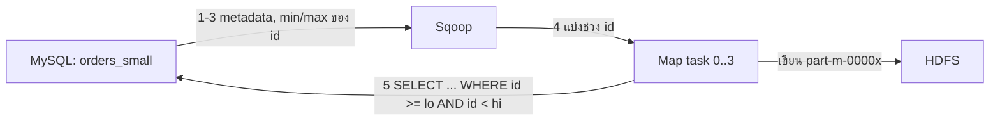
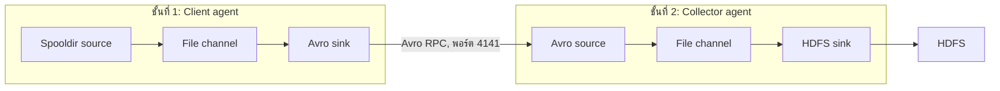

# Data Ingestion: Sqoop, Flume, Avro และ Kafka

**แก่นของบท:** ข้อมูลที่อยู่นอก Hadoop ต้องถูกนำเข้ามาก่อนจึงวิเคราะห์ได้ เครื่องมือที่เลือกขึ้นอยู่กับลักษณะข้อมูล ถ้าเป็นตารางที่เก็บอยู่ในฐานข้อมูล ใช้ Sqoop ถ้าเป็นเหตุการณ์ที่เกิดต่อเนื่อง ใช้ Flume หรือ Kafka

**วิธีอ่าน:** ไฟล์นี้เป็นส่วนแนวคิด ทุกหัวข้อสอนด้วยตัวอย่างข้อมูลจริงที่มีตัวเลขให้ตามได้ทีละขั้น ส่วนคำสั่งที่พิมพ์ตามบนเครื่องอยู่ในไฟล์ปฏิบัติการ `03_data_ingestion_lab.md` อ่านไฟล์นี้ก่อน เอกสารอ้างอิงซอฟต์แวร์รุ่นที่ใช้ในห้องปฏิบัติการ ได้แก่ Sqoop 1.4.x, Flume 1.x และ Kafka 0.9.0.1

---

## สารบัญ

1. ปูพื้นฐาน: ศัพท์ที่ต้องรู้ก่อน
2. ทำไมต้องมี Data Ingestion
3. Sqoop: นำตารางจากฐานข้อมูลเข้า Hadoop
4. Flume: นำข้อมูลเหตุการณ์เข้า Hadoop
5. Avro: รูปแบบข้อมูลและ RPC ที่ Flume ใช้
6. Kafka: ที่เก็บและส่งต่อสตรีมของเหตุการณ์
7. เลือกเครื่องมืออย่างไร
8. แนวคิดที่มักเข้าใจผิด
9. Cheat sheet
10. โจทย์ฝึกพร้อมแนวตอบ
11. โฟกัสที่น่าจะออกสอบ
12. ข้อควรระวังและคำถามที่ควรถามอาจารย์
13. References

---

## 1. ปูพื้นฐาน: ศัพท์ที่ต้องรู้ก่อน

อ่านตารางนี้หนึ่งรอบก่อนเริ่ม ทุกคำจะถูกอธิบายซ้ำพร้อมตัวอย่างในหัวข้อที่ใช้

| ศัพท์ที่วิชาใช้ | ศัพท์ทางการ / คำเต็ม | ความหมายสั้น |
|---|---|---|
| Data Ingestion | Data ingestion | การนำข้อมูลจากแหล่งภายนอกเข้ามาเก็บในระบบที่ใช้วิเคราะห์ |
| HDFS | Hadoop Distributed File System | ระบบไฟล์ของ Hadoop ที่แบ่งไฟล์เป็นบล็อกเก็บกระจายหลายเครื่อง |
| MapReduce | MapReduce | โมเดลประมวลผลแบบขนานของ Hadoop แบ่งเป็นงานย่อย map (อ่านและแปลงข้อมูล) กับ reduce (รวมผล) |
| Map-only job | Map-only job | งาน MapReduce ที่มีเฉพาะขั้น map ไม่มีขั้น reduce เหมาะกับการคัดลอกข้อมูลตรงๆ |
| RDBMS | Relational Database Management System | ฐานข้อมูลเชิงสัมพันธ์ เช่น MySQL เก็บเป็นตาราง (table) แถว (row) และคอลัมน์ (column) |
| Primary key | Primary key | คอลัมน์ที่ค่าไม่ซ้ำกันในทุกแถว ใช้ระบุแถว |
| JDBC | Java Database Connectivity | มาตรฐานที่โปรแกรม Java ใช้คุยกับฐานข้อมูล ระบุตำแหน่งด้วย connect string เช่น jdbc:mysql://localhost:3306/energydata |
| Hive | Apache Hive | เครื่องมือที่ให้เขียนคำสั่งคล้าย SQL ค้นข้อมูลไฟล์ใน HDFS |
| HBase | Apache HBase | ฐานข้อมูลแบบ column-family บน HDFS เข้าถึงข้อมูลรายแถวด้วย row key |
| Streaming data | Streaming data | ข้อมูลที่เกิดขึ้นต่อเนื่องเป็นเหตุการณ์ เช่น log ของเว็บเซิร์ฟเวอร์ |
| Event | Event | หน่วยข้อมูลหนึ่งหน่วยในสตรีม เช่น log หนึ่งบรรทัด |
| Agent (Flume) | Flume agent | โปรเซส JVM หนึ่งตัวที่ประกอบด้วย source, channel และ sink |
| Source / Channel / Sink | Source / Channel / Sink | ส่วนที่รับ event เข้า / ส่วนที่พัก event ไว้ / ส่วนที่ส่ง event ออก |
| Client agent / Collector agent | Source agent (ชั้นที่ 1) / Collector agent (ชั้นที่ 2) | agent ชั้นแรกอ่านข้อมูลต้นทางแล้วส่งต่อ agent ชั้นที่สองรวบรวมแล้วเขียนลงปลายทาง |
| Serialization | Serialization | การแปลงข้อมูลในหน่วยความจำเป็นไบต์ที่ส่งผ่านเครือข่ายหรือเก็บลงดิสก์ได้ |
| Avro | Apache Avro | ระบบ serialization ที่ใช้ schema เขียนด้วย JSON และมี RPC ในตัว |
| RPC | Remote Procedure Call | การเรียกฟังก์ชันที่อยู่บนอีกเครื่องผ่านเครือข่าย |
| Kafka | Apache Kafka | ระบบเก็บและส่งต่อสตรีมของ record แบบกระจาย ทนต่อความล้มเหลว |
| Broker | Kafka broker | เซิร์ฟเวอร์ Kafka หนึ่งตัวในคลัสเตอร์ |
| Topic | Topic | ชื่อหมวดที่ใช้แยกสตรีมของ record ใน Kafka |
| Partition | Partition | ส่วนย่อยของ topic เป็นลำดับของ record ที่เขียนต่อท้ายได้อย่างเดียว |
| Offset | Offset | เลขลำดับของ record ภายในหนึ่ง partition เริ่มที่ 0 |
| Producer / Consumer | Producer / Consumer | โปรแกรมที่เขียน record เข้า topic / โปรแกรมที่อ่าน record จาก topic |
| Consumer group | Consumer group | กลุ่มของ consumer ที่ใช้ชื่อกลุ่มเดียวกันเพื่อแบ่งกันอ่าน topic |
| ZooKeeper | Apache ZooKeeper | บริการประสานงานแบบกระจาย Kafka รุ่น 0.9 ใช้เก็บข้อมูลสถานะของคลัสเตอร์ |

ศัพท์ที่วิชาอาจใช้ต่างจากนี้: ถ้าข้อสอบเรียก agent ชั้นแรกว่า Source Agent หรือ Client Agent ให้ตอบตามคำที่ข้อสอบใช้ ทั้งสองคำหมายถึง agent ตัวเดียวกัน

---

## 2. ทำไมต้องมี Data Ingestion

### 2.1 ตัวอย่างข้อมูลจริงของร้านค้าออนไลน์

ร้านค้าออนไลน์แห่งหนึ่งมีข้อมูลสองกลุ่มอยู่คนละที่ กลุ่มแรกคือตาราง `orders` ในฐานข้อมูล MySQL หนึ่งแถวคือหนึ่งคำสั่งซื้อ

| order_id | cid | sku | qty | price | order_date |
|---|---|---|---|---|---|
| 10045 | 51761 | T9921-5 | 2 | 349.00 | 2016-01-19 |
| 10046 | 20390 | T1966-2 | 1 | 1290.00 | 2016-01-19 |

กลุ่มที่สองคือไฟล์ log บนเว็บเซิร์ฟเวอร์ ทุกครั้งที่ลูกค้าทำอะไรกับสินค้า เซิร์ฟเวอร์เขียน JSON หนึ่งบรรทัด

```json
{"sku": "T9921-5", "timestamp": 1453167527737, "cid": "51761", "action": "add_cart", "ip": "226.43.51.25"}
```

ค่า timestamp 1453167527737 คือจำนวนมิลลิวินาทีนับจาก 1 มกราคม 1970 (epoch) ตรงกับ 2016-01-19 01:38:47 (UTC) ลูกค้า 51761 ใส่สินค้า T9921-5 ลงตะกร้าเวลานั้น

คำถามทางธุรกิจ "ลูกค้ากลุ่มไหนใส่ตะกร้าแล้วไม่ซื้อ" ต้องใช้ทั้งสองกลุ่ม ลูกค้า 51761 ปรากฏทั้งใน log (add_cart) และใน orders (สั่งซื้อ order 10045) การเทียบสองกลุ่มต้องให้ข้อมูลอยู่ในที่เดียวกันที่ Hive หรือ MapReduce อ่านได้ นั่นคือใน Hadoop (HDFS, Hive หรือ HBase) ข้อมูลที่ยังอยู่ใน MySQL หรือในไฟล์ log บนเว็บเซิร์ฟเวอร์จึงยังวิเคราะห์ด้วยเครื่องมือของ Hadoop ไม่ได้ Data ingestion คือขั้นตอนย้ายข้อมูลทั้งสองกลุ่มเข้า Hadoop ให้ถูกที่ ถูกรูปแบบ และไม่สูญหายระหว่างทาง

### 2.2 ถ้าไม่มีเครื่องมือเฉพาะ ต้องทำอะไรเอง

สำหรับตาราง orders ต้อง export เป็น CSV เอง คัดลอกขึ้น HDFS เอง แล้วเขียนคำสั่ง CREATE TABLE ใน Hive ให้ตรงกับชนิดข้อมูลของ MySQL ด้วยมือ และถ้าตารางมีหลายล้านแถว การดึงด้วยงานเดียวช้า สำหรับ log ที่เกิดทุกวินาทีบนเว็บเซิร์ฟเวอร์หลายเครื่อง การคัดลอกไฟล์ด้วยมือไม่ทัน และถ้า HDFS ล่มชั่วคราวระหว่างคัดลอก ข้อมูลช่วงนั้นหายโดยไม่มีใครรู้ เครื่องมือในบทนี้มีไว้แก้ปัญหาเหล่านี้ทีละข้อ

### 2.3 ข้อมูลที่นำเข้ามีสามลักษณะ

| ลักษณะ | ตัวอย่างจริง | เครื่องมือในบทนี้ |
|---|---|---|
| มีโครงสร้าง (structured) | แถวของตาราง orders ข้างบน ทุกแถวมีคอลัมน์เดียวกัน ชนิดข้อมูลกำหนดไว้ | Sqoop |
| กึ่งมีโครงสร้าง (semi-structured) | บรรทัด JSON ของ impression แต่ละบรรทัดมีฟิลด์ชื่อกำกับ แต่ไม่มีตารางกำหนด schema ล่วงหน้า | Flume, Kafka |
| ไม่มีโครงสร้าง (unstructured) | ข้อความรีวิวสินค้าที่ลูกค้าพิมพ์เอง รูปภาพ | Flume ขนส่งได้ในฐานะ event ที่เป็นไบต์ แต่การตีความเป็นหน้าที่ของขั้นวิเคราะห์ |

อีกมุมหนึ่งคือแยกตามวิธีเกิดข้อมูล ตารางในฐานข้อมูลเป็นชุดที่มีอยู่แล้ว ย้ายครั้งเดียวหรือเป็นรอบได้ ส่วนบรรทัด log เกิดขึ้นต่อเนื่อง ต้องมีตัวรับที่เปิดรออยู่ตลอดเวลา

**สรุปหัวข้อ:** ข้อมูลที่อยู่นอก Hadoop วิเคราะห์ร่วมกันไม่ได้ Data ingestion ย้ายข้อมูลเข้า Hadoop ตารางใช้ Sqoop เหตุการณ์ต่อเนื่องใช้ Flume หรือ Kafka

---

## 3. Sqoop: นำตารางจากฐานข้อมูลเข้า Hadoop

### 3.1 Sqoop คืออะไรและไม่ใช่อะไร

Sqoop (มาจาก SQL-to-Hadoop) เป็นเครื่องมือบรรทัดคำสั่งที่ถ่ายโอนข้อมูลระหว่างฐานข้อมูลเชิงสัมพันธ์ (เช่น MySQL, Oracle) กับ HDFS, Hive และ HBase ทั้งขาเข้า (import) และขาออก (export) หนึ่งคำสั่ง sqoop import คือหนึ่งงาน MapReduce[[1]](https://sqoop.apache.org/docs/1.4.6/SqoopUserGuide.html)

Sqoop **ไม่ใช่** เครื่องมือรับข้อมูลที่เกิดต่อเนื่อง ทุกครั้งที่รันคือการดึงตารางหนึ่งชุด ถ้าต้องการข้อมูลใหม่ต้องรันอีกครั้ง

หมายเหตุด้านรุ่น: โครงการ Sqoop ถูกปลดระวางและย้ายไปที่ Apache Attic ในปี 2021 ไม่มีการพัฒนาต่อ[[6]](https://attic.apache.org/projects/sqoop.html) แต่ห้องปฏิบัติการยังใช้ Sqoop 1.4.x

### 3.2 กลไกของ sqoop import ทีละขั้น

ใช้ตัวอย่างต่อไปนี้ตลอดหัวข้อ: ตาราง `orders_small` ใน MySQL มี primary key ชื่อ id และมีข้อมูลดังนี้

| id | cid | amount |
|---|---|---|
| 0 | 51761 | 349.00 |
| 1 | 20390 | 1290.00 |
| 2 | 51761 | 99.00 |
| 3 | 75994 | 450.00 |
| 4 | 42538 | 120.00 |
| 5 | 20390 | 880.00 |
| 6 | 75994 | 60.00 |
| 7 | 42538 | 2100.00 |
| 8 | 51761 | 15.00 |
| 1000 | 20390 | 700.00 |

และสั่ง:

```
sqoop import --connect jdbc:mysql://localhost:3306/shop \
  --username root -P --table orders_small --target-dir /user/cloudera/orders_small -m 4
```

**ขั้นที่ 1: ขอ metadata ผ่าน JDBC** Sqoop ต่อเข้า MySQL ตาม connect string ถามชื่อคอลัมน์และชนิดข้อมูลของตาราง ได้ว่า id, cid, amount ตามลำดับ และสร้างคลาส Java ที่แทนหนึ่งแถวของตาราง ใช้ในงาน MapReduce (ซอร์สของคลาสนี้เป็นผลพลอยได้ที่เก็บไว้ให้ใช้ต่อได้)[[1]](https://sqoop.apache.org/docs/1.4.6/SqoopUserGuide.html)

**ขั้นที่ 2: เลือกคอลัมน์แบ่งงาน (splitting column)** ค่าเริ่มต้นคือ primary key ของตาราง ในตัวอย่างคือ id[[1]](https://sqoop.apache.org/docs/1.4.6/SqoopUserGuide.html)

**ขั้นที่ 3: หาช่วงค่า** Sqoop ถามฐานข้อมูลหาค่าต่ำสุดและสูงสุดของ id ได้ min = 0 และ max = 1000

**ขั้นที่ 4: แบ่งช่วงตามจำนวน map task** คู่มือยกกรณี min = 0, max = 1000 และ 4 task ว่า Sqoop รัน SQL รูปแบบ `SELECT * FROM sometable WHERE id >= lo AND id < hi` โดย (lo, hi) ของแต่ละ task คือ (0, 250), (250, 500), (500, 750) และ (750, 1001)[[1]](https://sqoop.apache.org/docs/1.4.6/SqoopUserGuide.html) ค่า 1001 ที่ปลายช่วงสุดท้ายทำให้ id = 1000 ถูกรวมด้วย เพราะเงื่อนไขปลายช่วงเป็น "น้อยกว่า" ตัวอย่างของเราเป็นกรณีเดียวกันพอดี

**ขั้นที่ 5: แต่ละ map task ดึงแถวของตนและเขียนไฟล์ลง HDFS**

| Task | SQL ที่รัน | แถวที่ได้ | ไฟล์ผลลัพธ์ |
|---|---|---|---|
| 0 | WHERE id >= 0 AND id < 250 | id 0 ถึง 8 (9 แถว) | part-m-00000 |
| 1 | WHERE id >= 250 AND id < 500 | ไม่มี (0 แถว) | part-m-00001 |
| 2 | WHERE id >= 500 AND id < 750 | ไม่มี (0 แถว) | part-m-00002 |
| 3 | WHERE id >= 750 AND id < 1001 | id 1000 (1 แถว) | part-m-00003 |

ผลคือโฟลเดอร์ /user/cloudera/orders_small มีไฟล์ข้อความ part-m-00000 ถึง part-m-00003 หนึ่งไฟล์ต่อหนึ่ง map task ค่าเริ่มต้นเป็นไฟล์ข้อความคั่นด้วยจุลภาค หนึ่งแถวต่อหนึ่งบรรทัด[[1]](https://sqoop.apache.org/docs/1.4.6/SqoopUserGuide.html) เช่น part-m-00003 มีบรรทัดเดียวคือ

```
1000,20390,700.00
```

**ข้อสังเกตจากตัวอย่างนี้ (data skew):** การแบ่งช่วงด้วยความกว้างเท่ากันไม่ได้แปลว่าแต่ละ task ได้จำนวนแถวเท่ากัน ตัวอย่างนี้ task 0 ได้ 9 แถว task 1 และ 2 ไม่ได้อะไรเลย และ task 3 ได้ 1 แถว เพราะค่า id กระจุกตัวใกล้ 0 ถ้าข้อมูลจริงเป็นแบบนี้ การรัน 4 task ไม่ช่วยให้เร็วขึ้น ควรเลือกคอลัมน์ที่ค่ากระจายสม่ำเสมอกว่าด้วย `--split-by` (เช่น คอลัมน์ที่เป็นเลขลำดับต่อเนื่อง) ข้อสังเกตนี้ตรวจสอบได้จากการคำนวณข้างบน



วิธีอ่านแผนภาพ: ลูกศรหมายเลข 1 ถึง 4 เกิดก่อนย้ายข้อมูลจริงและทำครั้งเดียว ลูกศรหมายเลข 5 และการเขียนไฟล์ทำพร้อมกันโดย map task ทุกตัว และไม่มีขั้น reduce

### 3.3 ตารางที่ไม่มี primary key

ถ้า orders_small ไม่มี primary key และไม่ใส่ `--split-by` Sqoop ไม่มีคอลัมน์ให้หา min และ max จึงแบ่งงานไม่ได้ คู่มือระบุว่าการ import จะล้มเหลว เว้นแต่กำหนดจำนวน mapper เป็นหนึ่ง[[1]](https://sqoop.apache.org/docs/1.4.6/SqoopUserGuide.html) มีสามทางออก

| ทางออก | ผล | ข้อแลกเปลี่ยน |
|---|---|---|
| `-m 1` | task เดียวอ่านทั้งตาราง ได้ไฟล์เดียว part-m-00000 | ไม่ขนาน ช้าเมื่อตารางใหญ่ |
| `--split-by cid` (ระบุคอลัมน์เอง) | แบ่งช่วงตามค่าของคอลัมน์ที่ระบุ | ถ้าคอลัมน์ค่ากระจายไม่สม่ำเสมอ หรือเป็นข้อความ ผลแบ่งงานอาจไม่ดี |
| `--autoreset-to-one-mapper` | ให้ Sqoop ลดเหลือ mapper เดียวเองเมื่อตารางไม่มี primary key และไม่ได้ระบุ split-by | ใช้ไม่ได้พร้อมกับ --split-by และมีผลเฉพาะกรณีที่ไม่มีทั้ง primary key และ split-by (รายละเอียดว่าใช้กับคำสั่งใดได้บ้างดูในคู่มือรุ่นที่ติดตั้ง) |

### 3.4 ตัวเลือกสำคัญของ sqoop import

| ตัวเลือก | ความหมาย |
|---|---|
| --connect | Connect string แบบ JDBC ระบุเซิร์ฟเวอร์ พอร์ต และชื่อฐานข้อมูล |
| --username, --password | ผู้ใช้และรหัสผ่านของฐานข้อมูล |
| --table | ตารางที่จะ import |
| --target-dir | โฟลเดอร์ปลายทางใน HDFS ถ้ามีอยู่แล้วงานล้มเหลว ใส่ --delete-target-dir เพื่อลบก่อน[[1]](https://sqoop.apache.org/docs/1.4.6/SqoopUserGuide.html) |
| -m หรือ --num-mappers | จำนวน map task ค่าเริ่มต้นคือ 4[[1]](https://sqoop.apache.org/docs/1.4.6/SqoopUserGuide.html) |
| --split-by | คอลัมน์ที่ใช้แบ่งงาน |
| --hive-import, --hive-table | นำข้อมูลเข้า Hive และตั้งชื่อตารางใน Hive |
| --hbase-table, --column-family, --hbase-row-key, --hbase-create-table | นำข้อมูลเข้า HBase |

### 3.5 Import เข้า Hive

เมื่อใส่ `--hive-import` Sqoop นำข้อมูลเข้า HDFS ก่อน แล้วสร้างและรันสคริปต์ Hive ที่มี CREATE TABLE (แปลงชนิดข้อมูลของ MySQL เป็นชนิดของ Hive) ตามด้วย LOAD DATA INPATH เพื่อย้ายไฟล์เข้า warehouse ของ Hive[[1]](https://sqoop.apache.org/docs/1.4.6/SqoopUserGuide.html) ผู้ใช้จึงไม่ต้องเขียน CREATE TABLE เอง และตั้งชื่อตารางด้วย `--hive-table`

**ตัวอย่างปัญหา NULL:** สมมติแถวหนึ่งของ orders_small มี amount เป็น NULL Sqoop เขียนค่านี้ลงไฟล์เป็นข้อความ `null` แต่ Hive ใช้ `\N` แทน NULL ผลคือ Hive มองข้อความ `null` เป็นสตริงธรรมดา และคำสั่งอย่าง `WHERE amount IS NULL` ไม่เจอแถวนั้น คู่มือแก้ด้วย `--null-string '\\N' --null-non-string '\\N'` เพื่อให้ Sqoop เขียน `\N` แทน[[1]](https://sqoop.apache.org/docs/1.4.6/SqoopUserGuide.html)

### 3.6 Import เข้า HBase

ใช้ตาราง `country_tbl` (primary key id) ซึ่งมีข้อมูลดังนี้

| id | country |
|---|---|
| 1 | USA |
| 2 | CANADA |
| 3 | JAPAN |

ด้วยคำสั่ง `--hbase-table country --column-family country-cf --hbase-row-key id --hbase-create-table` Sqoop แปลงแต่ละแถวเป็นการ Put หนึ่งครั้ง ค่าของคอลัมน์ id เป็น row key ส่วนคอลัมน์ที่เหลือ (country) ถูกเก็บใน column family country-cf โดยคอลัมน์ที่ใช้เป็น row key ไม่ถูกเก็บซ้ำเป็นข้อมูลของแถว (ค่าเริ่มต้นของ Sqoop)[[1]](https://sqoop.apache.org/docs/1.4.6/SqoopUserGuide.html) ผลใน HBase เทียบกับแถวของ MySQL:

| Row key | Cell (column family : qualifier) | Value |
|---|---|---|
| 1 | country-cf:country | USA |
| 2 | country-cf:country | CANADA |
| 3 | country-cf:country | JAPAN |

ค่าเริ่มต้นของ row key คือคอลัมน์แบ่งงาน หรือ primary key ถ้าไม่ได้ระบุ กำหนดเองได้ด้วย `--hbase-row-key` ถ้าตารางหรือ column family ปลายทางยังไม่มี งานล้มเหลว เว้นแต่ใส่ `--hbase-create-table`[[1]](https://sqoop.apache.org/docs/1.4.6/SqoopUserGuide.html)

### 3.7 รหัสผ่านและ localhost

คู่มือระบุว่า `--password` ไม่ปลอดภัย เพราะผู้ใช้อื่นอ่านรหัสผ่านจากอาร์กิวเมนต์ของคำสั่งได้ วิธีที่ดีกว่าคือ `-P` (ถามรหัสผ่านตอนรัน) หรือ `--password-file`[[1]](https://sqoop.apache.org/docs/1.4.6/SqoopUserGuide.html) ปฏิบัติการใช้ `--password` เพราะเป็น VM สำหรับเรียน

ตัวอย่าง localhost: connect string `jdbc:mysql://localhost:3306/shop` ใช้ได้เมื่อ MySQL อยู่เครื่องเดียวกับ Sqoop แต่ map task บนคลัสเตอร์รันหลายเครื่อง และแต่ละเครื่องจะเชื่อมไปที่ localhost ของตัวเอง ซึ่งไม่มี MySQL ในงานจริงจึงต้องใส่ชื่อโฮสต์หรือ IP ของเซิร์ฟเวอร์ฐานข้อมูล เช่น `jdbc:mysql://db01.example.com:3306/shop`[[1]](https://sqoop.apache.org/docs/1.4.6/SqoopUserGuide.html) ควรระวังด้วยว่า map task ทุกตัวเชื่อมฐานข้อมูลจริงพร้อมกัน ถ้าตั้ง -m สูงเกินไป ฐานข้อมูลที่ใช้งานจริงอยู่อาจช้าลง

### 3.8 เมื่อไรควรใช้และเมื่อไรไม่ควร

ใช้เมื่อข้อมูลอยู่ในตาราง RDBMS และย้ายเป็นชุด เช่น ตาราง orders 5 ล้านแถวเข้า Hive เดือนละครั้ง ไม่ควรใช้เมื่อต้องการให้ log ที่เกิดทุกวินาทีเข้าระบบแทบทันที เพราะทุกครั้งที่รันคือหนึ่งงาน MapReduce ที่ต้องสตาร์ตและเสร็จสิ้น

**สรุปหัวข้อ Sqoop**

| ประเด็น | สาระสำคัญ |
|---|---|
| หน้าที่ | ถ่ายโอนตาราง RDBMS ไป HDFS, Hive, HBase |
| กลไก | อ่าน schema จาก DB หา min/max ของคอลัมน์แบ่งงาน แบ่งช่วง แล้วรัน map-only job |
| ผลลัพธ์เริ่มต้น | ไฟล์ข้อความคั่นด้วยจุลภาค part-m-xxxxx หนึ่งไฟล์ต่อ task |
| จำนวน task | -m (ค่าเริ่มต้น 4) |
| ตารางไม่มี primary key | ใช้ -m 1 หรือ --split-by |
| ข้อควรระวัง | ค่ากระจุกตัวทำให้ task ได้งานไม่เท่ากัน, NULL ใน Hive, --password ไม่ปลอดภัย |
| ไม่รองรับ | การรับข้อมูลต่อเนื่อง |

---
## 4. Flume: นำข้อมูลเหตุการณ์เข้า Hadoop

### 4.1 ปัญหาที่ Flume แก้

สมมติร้านค้ามีเว็บเซิร์ฟเวอร์ web01, web02 และ web03 แต่ละเครื่องเขียนไฟล์ impressions log ใหม่ตลอดเวลา และต้องการให้ log ทั้งหมดไปอยู่ที่ /user/shop/impressions ใน HDFS Sqoop ใช้ไม่ได้เพราะไม่มีตารางให้ดึง การสั่ง `hadoop fs -put` ด้วยมือต้องมีคนรันซ้ำทุกครั้งที่มีไฟล์ใหม่ และถ้า HDFS ล่มช่วงที่คัดลอก ไฟล์ที่ส่งไม่สำเร็จไม่มีใครรู้ว่าหายไป

Flume ถูกออกแบบมาเพื่อรวบรวมและนำข้อมูลปริมาณมากจากหลายแหล่งเข้า Hadoop โดยทั่วไปใช้กับ log ของเว็บเซิร์ฟเวอร์ และใช้ขนส่งเหตุการณ์จากแหล่งอื่นได้ เช่น ข้อมูลเครือข่าย โซเชียลมีเดีย และเซ็นเซอร์ พร้อมทนต่อความล้มเหลวและขยายตัวได้ผ่านสถาปัตยกรรมแบบกระจาย[[2]](https://flume.apache.org/releases/content/1.9.0/FlumeUserGuide.html)

### 4.2 Event และ Agent

**Event** คือหน่วยข้อมูลที่เดินทางใน Flume ประกอบด้วยเนื้อหาเป็นไบต์ (body) และแอตทริบิวต์แบบสตริงที่ไม่บังคับ (header)[[2]](https://flume.apache.org/releases/content/1.9.0/FlumeUserGuide.html) ตัวอย่าง: บรรทัด log หนึ่งบรรทัด

```
{"sku": "T9921-5", "timestamp": 1453167527737, "cid": "51761", "action": "add_cart", "ip": "226.43.51.25"}
```

กลายเป็นหนึ่ง event ที่ body คือไบต์ UTF-8 ของข้อความนี้ทั้งบรรทัด (106 ไบต์) และ header ว่าง (spooling directory source เพิ่ม header ที่เก็บชื่อไฟล์ให้ก็ต่อเมื่อเปิดตัวเลือก fileHeader) Flume ไม่ตีความเนื้อหา JSON มันขนส่ง body ตามที่เป็น

**Agent** คือโปรเซส JVM หนึ่งตัวที่โฮสต์ส่วนประกอบที่ event ไหลผ่าน agent หนึ่งตัวมีสามส่วนที่กำหนดค่าได้ คือ source, channel และ sink[[2]](https://flume.apache.org/releases/content/1.9.0/FlumeUserGuide.html) เครื่องหนึ่งเครื่องรันได้หลาย agent

| ส่วนประกอบ | ทำไมต้องมี | ถือสถานะอะไร | ทำอะไร | ตัวอย่างชนิด |
|---|---|---|---|---|
| Source | เป็นทางเข้าของ event | ตำแหน่งที่อ่านถึง เช่นไฟล์ไหนอ่านครบแล้ว | รับ event จากแหล่งภายนอก แล้วเขียนลง channel | exec, spooldir, avro, netcat, syslog |
| Channel | ให้ source กับ sink ทำงานคนละความเร็วได้ และเก็บ event ไว้จนกว่าจะส่งต่อสำเร็จ | คิวของ event ที่ยังไม่ถูกส่งต่อ | เก็บ event อย่างเดียว ไม่ส่งไปไหนเอง | memory, file |
| Sink | เป็นทางออกของ event | ไม่มี (อ่านจาก channel) | ดึง event ออกจาก channel แล้วส่งไป agent ถัดไปหรือปลายทางสุดท้าย | hdfs, avro, logger |

กฎการเชื่อม: source หนึ่งตัวระบุ channel ได้หลายตัว แต่ sink หนึ่งตัวระบุ channel ได้เพียงตัวเดียว[[2]](https://flume.apache.org/releases/content/1.9.0/FlumeUserGuide.html)

### 4.3 Source ที่ใช้ในวิชานี้

**Exec source** รันคำสั่ง Unix ที่ค้างทำงานอยู่ แล้วอ่านผลลัพธ์ทีละบรรทัดเป็น event ตัวอย่างคำสั่ง `tail -F /var/log/apache2/access_log` (ตัวพิมพ์ใหญ่ F ทำให้ tail ตามไฟล์ต่อแม้ไฟล์ถูกหมุนเวียนชื่อ) คู่มือเตือนว่า exec source ไม่รับประกันการส่งมอบ เพราะโปรแกรมที่เขียน log ไม่มีทางรู้ว่า Flume รับบรรทัดนั้นไปแล้วหรือยัง ถ้า channel เต็มหรือส่ง event ไม่ได้ ข้อมูลอาจหายไปเงียบๆ[[2]](https://flume.apache.org/releases/content/1.9.0/FlumeUserGuide.html)

สถานการณ์ตัวอย่าง: channel รับได้ 100 event ขณะที่ sink ช้าลง เว็บเซิร์ฟเวอร์เขียน 150 บรรทัดในเวลาสั้นๆ `tail` ส่งบรรทัดออกมาตามที่เกิด ไม่มีกลไกให้ `tail` หยุดรอ ส่วนที่เกินความจุจึงไม่มีที่เก็บ และไม่มีใครบอกเว็บเซิร์ฟเวอร์ให้เขียนใหม่

**Spooling directory source (spooldir)** เฝ้าโฟลเดอร์หนึ่ง และอ่านไฟล์ใหม่ที่ถูกวางลงมา เมื่ออ่านไฟล์เข้า channel ครบแล้ว ค่าเริ่มต้นคือเปลี่ยนชื่อไฟล์โดยต่อท้าย .COMPLETED หนึ่งบรรทัดเป็นหนึ่ง event ตัวอย่าง:

| เหตุการณ์ | สิ่งที่เกิดขึ้น |
|---|---|
| วางไฟล์ impressions-0119.log (500 บรรทัด) ลงโฟลเดอร์ | source อ่านทีละบรรทัดเข้า channel เมื่อครบ 500 บรรทัด เปลี่ยนชื่อเป็น impressions-0119.log.COMPLETED |
| Flume รีสตาร์ตกลางทางขณะอ่านไฟล์ | ไฟล์ที่ยังไม่ได้ทำเครื่องหมาย COMPLETED จะถูกอ่านใหม่ ไม่มีบรรทัดหาย (อาจมีบรรทัดที่อ่านไปแล้วถูกอ่านซ้ำ) |
| มีโปรแกรมเขียนต่อท้าย impressions-0119.log หลังวางลงโฟลเดอร์แล้ว | Flume บันทึกข้อผิดพลาดใน log และหยุดประมวลผล |
| วางไฟล์ชื่อ impressions-0119.log ซ้ำอีกครั้ง (ชื่อซ้ำกับไฟล์ที่เคยประมวลผล) | Flume บันทึกข้อผิดพลาดใน log และหยุดประมวลผล |

เงื่อนไขของ spooldir จึงมีสองข้อ ไฟล์ที่วางลงโฟลเดอร์ต้องไม่ถูกแก้ไขอีก (immutable) และชื่อไฟล์ต้องไม่ซ้ำ ข้อแลกเปลี่ยนคือเชื่อถือได้กว่า exec แต่ต้องมีกระบวนการที่วางไฟล์ลงโฟลเดอร์เมื่อไฟล์ปิดแล้วเท่านั้น (เช่นหมุนไฟล์ log ทุกชั่วโมงแล้วย้ายไฟล์ที่ปิดแล้วเข้าโฟลเดอร์ ตั้งชื่อด้วยวันที่และชั่วโมง)[[2]](https://flume.apache.org/releases/content/1.9.0/FlumeUserGuide.html)

**Avro source** รับ event จาก Avro client หรือจาก Avro sink ของ agent ก่อนหน้า ใช้ต่อ agent หลายชั้น (หัวข้อ 4.6)[[2]](https://flume.apache.org/releases/content/1.9.0/FlumeUserGuide.html)

### 4.4 Channel ที่ใช้ในวิชานี้

| | Memory channel | File channel |
|---|---|---|
| เก็บ event ที่ไหน | หน่วยความจำของ agent | ไฟล์บนดิสก์ (ต้องระบุ checkpointDir และ dataDir) |
| ถ้าโปรเซส agent ตาย | event ที่ค้างอยู่ใน channel หายทั้งหมด | event ที่ค้างยังอยู่บนดิสก์ และ agent อ่านต่อได้เมื่อสตาร์ตใหม่ |
| ความเร็ว | เร็วกว่า | ช้ากว่า เพราะเขียนดิสก์ |

ตัวอย่าง: ระหว่างที่ sink ส่งไม่ได้ channel สะสม event ไว้ 800 ตัว แล้ว agent ถูกฆ่าด้วย `kill -9` ถ้าใช้ memory channel ทั้ง 800 ตัวหายและไม่มีทางกู้ ถ้าใช้ file channel ทั้ง 800 ตัวยังอยู่ในไฟล์ใน dataDir และถูกส่งต่อหลังสตาร์ตใหม่[[2]](https://flume.apache.org/releases/content/1.9.0/FlumeUserGuide.html) ปฏิบัติการจึงใช้ file channel ในทั้งสอง agent

### 4.5 ความน่าเชื่อถือ: ธุรกรรมและการลบ event

Flume ครอบการเก็บ event ลง channel (ฝั่ง source) และการดึง event ออกจาก channel (ฝั่ง sink) ด้วยธุรกรรมของ channel เอง event ถูกลบออกจาก channel ก็ต่อเมื่อถูกเก็บลง channel ของ agent ถัดไป หรือเก็บลงปลายทางสุดท้าย (เช่น HDFS) เรียบร้อยแล้ว ในโฟลว์หลาย hop ทั้ง sink ของ hop ก่อนและ source ของ hop ถัดไปมีธุรกรรมของตัวเอง[[2]](https://flume.apache.org/releases/content/1.9.0/FlumeUserGuide.html)

**ตัวอย่างทีละขั้น: sink ส่งชุดละ 3 event และ HDFS ล่มกลางทาง** (ใช้ batch เล็กเพื่อให้ตามได้ ในปฏิบัติการ batchSize เท่ากับ 1000)

| ขั้น | เหตุการณ์ | event ใน channel (e1, e2, e3, e4) |
|---|---|---|
| 1 | sink เริ่มธุรกรรม ดึง e1, e2, e3 ออกจาก channel (ยังไม่ถูกลบถาวร) | e1 e2 e3 e4 (e1 ถึง e3 อยู่ในธุรกรรม) |
| 2 | sink เขียน e1, e2 ลงไฟล์ใน HDFS สำเร็จ | เหมือนเดิม |
| 3 | เขียน e3 ไม่สำเร็จ เพราะ HDFS ล่ม sink ยกเลิกธุรกรรม (rollback) | e1 e2 e3 e4 กลับมาเป็นของ channel ทั้งหมด |
| 4 | HDFS กลับมา sink ดึง e1, e2, e3 อีกครั้งแล้วเขียนครบ | |
| 5 | ธุรกรรมสำเร็จ (commit) ทั้งสามถูกลบจาก channel | e4 |

ผล: ไม่มี event ใดหาย แต่ e1 และ e2 ถูกเขียนลง HDFS สองครั้ง เพราะการเขียนในขั้น 2 สำเร็จไปแล้วก่อน rollback นี่คือที่มาของข้อสรุป "Flume เสี่ยงซ้ำ ไม่เสี่ยงหาย" (ผลซ้ำสรุปจากกฎการลบข้างบน) ผู้ใช้จะสังเกตเห็นว่า channel เต็มขึ้นเมื่อปลายทางล่ม และอาจพบบรรทัดซ้ำในไฟล์ปลายทางหลังเหตุล่ม

### 4.6 รูปแบบการต่อ agent

**โฟลว์อย่างง่าย** agent ตัวเดียว source, channel, sink ต่อกันในโปรเซสเดียว

**โฟลว์หลายชั้น (multi-hop)** ให้ sink ชนิด avro ของ agent แรกชี้ไปที่ hostname และ port ของ Avro source ของ agent ถัดไป[[2]](https://flume.apache.org/releases/content/1.9.0/FlumeUserGuide.html)



วิธีอ่าน: event เกิดที่ไฟล์ แล้วเข้า source ของ client ลง channel ของ client ถูก Avro sink ส่งข้ามเครือข่ายไปพอร์ต 4141 ของ collector เข้า Avro source และ channel ของ collector และสุดท้าย HDFS sink เขียนลง HDFS

**ตัวอย่างการเดินทางของ event หนึ่งตัวในโฟลว์ข้างบน** (ค่าที่ใช้เหมือนปฏิบัติการที่ 2)

| ขั้น | ตำแหน่ง | สิ่งที่เกิดขึ้น | สถานะของ event |
|---|---|---|---|
| 1 | ไฟล์ /tmp/impressions/impressions.log | มี JSON หนึ่งบรรทัดต่อหนึ่งเหตุการณ์ | เป็นบรรทัดข้อความ |
| 2 | Spooldir source ของ client | อ่านทีละบรรทัด หนึ่งบรรทัดเป็นหนึ่ง event | event อยู่ใน source |
| 3 | File channel ของ client | source เขียน event ลงคิวบนดิสก์ | รอใน channel |
| 4 | Avro sink ของ client | ดึง event จาก channel ส่งด้วย Avro RPC ไปพอร์ต 4141 | อยู่ระหว่างส่ง ยังไม่ถูกลบจาก channel ของ client |
| 5 | Avro source ของ collector | ฟังที่ 0.0.0.0:4141 รับ event เขียนลง channel ของ collector | เก็บใน channel ที่สองแล้ว ธุรกรรมของ sink ฝั่ง client สำเร็จ |
| 6 | File channel ของ client | ลบ event ออก | เหลืออยู่ที่ collector |
| 7 | HDFS sink ของ collector | ดึง event เป็นชุดเขียนเป็นข้อความลง /user/cloudera/impressions | อยู่ใน HDFS |
| 8 | File channel ของ collector | ลบ event ออกหลังเขียน HDFS สำเร็จ | ครบทาง |

ถ้า collector ล่มระหว่างขั้น 5 client ยังไม่ได้รับการยืนยัน จึงไม่ลบ event ออกจาก file channel (ซึ่งอยู่บนดิสก์) และส่งใหม่เมื่อ collector กลับมา

**เหตุผลที่แยกเป็นสองชั้น:** agent ชั้นแรกวางไว้ใกล้แหล่งข้อมูล (เครื่องเดียวกับเว็บเซิร์ฟเวอร์) ส่วนการเขียนลง HDFS ทำโดย agent ชั้นที่สองซึ่งมีจำนวนน้อย ทำให้ควบคุมจำนวนการเชื่อมต่อเข้า HDFS และจุดที่ตั้งค่า HDFS ได้ที่เดียว

**ตัวอย่าง fan-in:** web01, web02 และ web03 แต่ละเครื่องรัน client agent ที่มีไฟล์ตั้งค่าเกือบเหมือนกัน ต่างกันเฉพาะโฟลเดอร์ที่เฝ้าดู โดย Avro sink ของทั้งสามชี้ไปที่ collector.example.com พอร์ต 4141 เดียวกัน

```
# web01 / web02 / web03 ใช้ไฟล์เดียวกัน
client.sinks.k1.type=avro
client.sinks.k1.hostname=collector.example.com
client.sinks.k1.port=4141
```

collector ตัวเดียวรับ event จากทั้งสามเครื่องเข้า channel เดียวแล้วเขียนลง HDFS นี่คือ fan-in (consolidation) ถ้ามีเว็บเซิร์ฟเวอร์ 300 เครื่อง การเขียนลง HDFS ยังทำโดย collector ไม่กี่ตัว[[2]](https://flume.apache.org/releases/content/1.9.0/FlumeUserGuide.html)

**ตัวอย่าง fan-out:** source หนึ่งตัวส่ง event ไปหลาย channel ด้วย channel selector ซึ่งมีสองแบบ replicating (ส่งสำเนาไปทุก channel เป็นค่าเริ่มต้น) และ multiplexing (เลือก channel ตามค่า header ของ event) ตัวอย่างการตั้งค่า multiplexing ที่ส่ง event ที่ header action เป็น purchase ไป channel c1 และที่เหลือไป c2:

```
a1.sources.r1.channels = c1 c2
a1.sources.r1.selector.type = multiplexing
a1.sources.r1.selector.header = action
a1.sources.r1.selector.mapping.purchase = c1
a1.sources.r1.selector.default = c2
```

ข้อควรระวัง: ค่า header action ต้องถูกใส่ไว้ใน event ก่อน (เช่นด้วย interceptor) เพราะ body ที่เป็น JSON ไม่ถูก Flume ตีความเอง[[2]](https://flume.apache.org/releases/content/1.9.0/FlumeUserGuide.html)

### 4.7 ไฟล์ตั้งค่าและกฎการตั้งชื่อ agent

ไฟล์ตั้งค่า Flume เป็นรูปแบบ Java properties แต่ละบรรทัดอ่านเป็นส่วนๆ ได้ดังนี้

```
collector.sources.r1.type = avro
   |         |      |   |      |
   |         |      |   |      +-- ค่า
   |         |      |   +-- คุณสมบัติ
   |         |      +-- ชื่อส่วนประกอบ (ตั้งเอง)
   |         +-- ชนิดส่วนประกอบ (sources, channels หรือ sinks)
   +-- ชื่อ agent
```

ไฟล์เดียวกำหนดได้หลาย agent และตอนสตาร์ตต้องบอกว่าจะรัน agent ชื่ออะไรด้วย `--name`[[2]](https://flume.apache.org/releases/content/1.9.0/FlumeUserGuide.html) ดังนั้น **ค่า --name ต้องตรงกับคำนำหน้าในไฟล์** ตัวอย่าง:

| ไฟล์ | คำนำหน้าในไฟล์ | คำสั่งที่ถูก | คำสั่งที่ผิด |
|---|---|---|---|
| client.conf | client | `--name client --conf-file ./client.conf` | `--name collector --conf-file ./client.conf` (หา agent ชื่อ collector ในไฟล์ไม่พบ) |
| collector.conf | collector | `--name collector --conf-file ./collector.conf` | `--name Collector ...` (ชื่อเป็นตัวพิมพ์ใหญ่ ไม่ตรงกับ collector) |

ตัวอย่างการต่อส่วนประกอบมาตรฐาน (ใช้ชื่อสมมติ a1):

```
a1.sources = r1
a1.sinks = k1
a1.channels = c1
a1.sources.r1.channels = c1
a1.sinks.k1.channel = c1
```

ฝั่ง source ใช้คำว่า channels (พหูพจน์) ส่วนฝั่ง sink ใช้ channel (เอกพจน์) ตามกฎในหัวข้อ 4.2

**ตัวอย่างข้อผิดพลาดหนึ่งตัวอักษร:** ถ้าบรรทัดหนึ่งในไฟล์ client.conf สะกดเป็น `clinet.sinks.k1.port=4141` บรรทัดนี้ขึ้นต้นด้วยชื่อ agent ที่ไม่มีอยู่ จึงไม่นับเป็นการตั้งค่าของ agent ชื่อ client ทำให้ Avro sink k1 ของ client ขาด port ซึ่ง Avro sink ต้องมี คาดว่า sink นี้ตั้งค่าไม่สมบูรณ์และ event ไม่ถูกส่งไป collector (ข้อความใน log จริงขึ้นกับรุ่นของ Flume ตรวจสอบตามรุ่นที่ใช้)

### 4.8 HDFS sink: ชื่อไฟล์และการแบ่งไฟล์ (roll)

HDFS sink เขียน event ลงไฟล์ใน HDFS และปิดไฟล์เมื่อเข้าเงื่อนไขข้อใดข้อหนึ่ง ค่า hdfs.rollInterval (เวลา) hdfs.rollSize (ขนาดไบต์) และ hdfs.rollCount (จำนวน event) ถ้าไม่กำหนด ค่าเริ่มต้นตามคู่มือ Flume 1.9 คือ 30 วินาที 1024 ไบต์ และ 10 event ตามลำดับ[[2]](https://flume.apache.org/releases/content/1.9.0/FlumeUserGuide.html)

**ตัวอย่างคำนวณ:** event ในปฏิบัติการยาวประมาณ 100 ถึง 113 ไบต์ต่อบรรทัด (รวมอักขระขึ้นบรรทัดใหม่) 9 event รวมไม่เกินประมาณ 1,017 ไบต์ ซึ่งยังไม่ถึง 1024 และ event ที่ 10 ทำให้ครบ rollCount (ขนาดก็ใกล้ถึงเกณฑ์พอดีในจังหวะนั้น) ดังนั้นคาดว่าไฟล์แต่ละไฟล์ได้ประมาณ 10 event ถ้าส่ง 500 event เข้ามา จะได้ราว 50 ไฟล์ ไม่ใช่ไฟล์เดียว (นี่เป็นผลจากการวิเคราะห์ ไม่ได้รันจริง) การมีไฟล์เล็กจำนวนมากเป็นพฤติกรรมของค่าเริ่มต้นนี้ ไม่ใช่ข้อผิดพลาด แต่ HDFS ไม่เหมาะกับไฟล์เล็กจำนวนมากในงานจริง จึงมักปรับ roll ให้ใหญ่ขึ้น

ไฟล์ที่ยังเขียนอยู่มีนามสกุลชั่วคราว (เช่น .tmp) ต่อท้ายจนกว่าจะถูกปิด ชื่อไฟล์ประกอบด้วย hdfs.filePrefix ตามด้วยตัวนับที่ Flume ใส่ให้ แล้วตามด้วย hdfs.fileSuffix เช่น prefix เป็น impressions และ suffix เป็น .log จึงคาดว่าได้ชื่อรูปแบบ impressions.ตัวเลข.log (ตรวจสอบตามรุ่นที่ใช้)

### 4.9 เมื่อไรควรใช้ Flume

| กรณี | เลือก | เหตุผล |
|---|---|---|
| เก็บ log ไฟล์จากเว็บเซิร์ฟเวอร์ 300 เครื่องลง HDFS โดยไม่เขียนโปรแกรม | Flume | มี source สำเร็จรูป มี HDFS sink ในตัว รองรับ fan-in |
| ตารางในฐานข้อมูล | Sqoop | อ่าน schema เองและขนานได้ |
| ข้อความที่หลายระบบต้องอ่านอิสระและย้อนอ่านได้ | Kafka | Kafka เก็บข้อความไว้ตามระยะเวลาที่ตั้ง ไม่ลบเมื่ออ่านแล้ว |
| ต้องการความน่าเชื่อถือสูงสุดจากไฟล์ log | Flume ด้วย spooldir และ file channel | exec source ไม่รับประกันการส่งมอบ |

**สรุปหัวข้อ Flume**

| ประเด็น | สาระสำคัญ |
|---|---|
| Event | body (ไบต์) บวก header (สตริง ไม่บังคับ) |
| Agent | JVM หนึ่งตัว ประกอบด้วย source, channel, sink |
| กฎเชื่อม | source มีได้หลาย channel, sink มีได้ channel เดียว |
| Exec vs spooldir | exec ไม่รับประกันการส่งมอบ spooldir เชื่อถือได้แต่ไฟล์ต้องไม่ถูกแก้และชื่อไม่ซ้ำ |
| Memory vs file channel | memory หายเมื่อโปรเซสตาย file กู้ได้ |
| ความน่าเชื่อถือ | ลบจาก channel เมื่อ hop ถัดไปเก็บแล้วเท่านั้น เสี่ยงซ้ำ ไม่เสี่ยงหาย |
| Multi-hop | Avro sink ต่อ Avro source |
| --name | ต้องตรงกับคำนำหน้าในไฟล์ตั้งค่า |
| HDFS sink | ค่าเริ่มต้น roll 30 วินาที 1024 ไบต์ 10 event ได้ไฟล์เล็กจำนวนมาก |

---

## 5. Avro: รูปแบบข้อมูลและ RPC ที่ Flume ใช้

### 5.1 ปัญหาที่ Avro แก้

เมื่อ Avro sink ของ client ส่ง event ไปยัง Avro source ของ collector ข้ามเครือข่าย event ซึ่งเป็นออบเจ็กต์ในหน่วยความจำของ JVM ต้องถูกแปลงเป็นไบต์ที่ฝั่งรับอ่านกลับได้ตรงกัน งานแปลงนี้เรียกว่า serialization Avro เป็นระบบ serialization ในระบบนิเวศ Hadoop ที่แปลงข้อมูลเป็นรูปแบบไบนารีกะทัดรัด และเก็บเป็นไฟล์ที่อธิบายตัวเองได้ (Avro data file หรือ object container file)[[3]](https://avro.apache.org/docs/1.11.1/specification/) Avro **ไม่ใช่** ฐานข้อมูลหรือระบบคิว เป็นเพียงรูปแบบการเข้ารหัสและโปรโตคอลสื่อสาร

### 5.2 Schema เป็น JSON

schema บอกว่าข้อมูลมีฟิลด์อะไร ชนิดอะไร ตามลำดับใด ตัวอย่าง schema ของ impression:

```json
{
  "type": "record",
  "name": "Impression",
  "fields": [
    {"name": "sku",       "type": "string"},
    {"name": "timestamp", "type": "long"},
    {"name": "cid",       "type": "string"},
    {"name": "action",    "type": "string"},
    {"name": "ip",        "type": "string"}
  ]
}
```

### 5.3 การเข้ารหัสทีละไบต์

การเข้ารหัสแบบไบนารีของ Avro ไม่มีชื่อฟิลด์หรือข้อมูลชนิดปนอยู่ในข้อมูล ผู้อ่านต้องมี schema ที่ผู้เขียนใช้จึงจะอ่านได้[[3]](https://avro.apache.org/docs/1.11.1/specification/) กฎที่ใช้ในตัวอย่างนี้มีสองข้อ

- **long:** ใช้ zig-zag แล้วเขียนแบบความยาวแปรผัน (variable-length) zig-zag ทำให้จำนวนเต็มบวก n กลายเป็น 2n และจำนวนลบ -1 กลายเป็น 1 ค่าที่ได้ถูกเขียนทีละ 7 บิต โดยบิตสูงสุดของแต่ละไบต์บอกว่ายังมีไบต์ต่ออีกหรือไม่
- **string:** ความยาวเป็นจำนวนไบต์ (เข้ารหัสเป็น long) ตามด้วยไบต์ UTF-8
- **record:** นำการเข้ารหัสของแต่ละฟิลด์ตามลำดับที่ประกาศมาต่อกัน

**ตัวอย่างเล็ก:** record ที่มี a (long) = 27 และ b (string) = "foo" ได้ 27 -> 54 = 0x36, ความยาว 3 -> 6 = 0x06 และ f, o, o = 66 6f 6f ผลคือ `36 06 66 6f 6f` (5 ไบต์)[[3]](https://avro.apache.org/docs/1.11.1/specification/)
**ตัวอย่างเต็ม:** impression ตัวอย่างจากหัวข้อ 4.2

| ฟิลด์ | ค่า | วิธีเข้ารหัส | ไบต์ (ฐานสิบหก) | จำนวนไบต์ |
|---|---|---|---|---|
| sku | "T9921-5" | ความยาว 7 -> 14 = 0e, ตามด้วย T 9 9 2 1 - 5 | 0e 54 39 39 32 31 2d 35 | 8 |
| timestamp | 1453167527737 | zig-zag แล้ว varint 6 ไบต์ | f2 9c c6 f8 ca 54 | 6 |
| cid | "51761" | ความยาว 5 -> 10 = 0a, ตามด้วย 5 1 7 6 1 | 0a 35 31 37 36 31 | 6 |
| action | "add_cart" | ความยาว 8 -> 16 = 10 | 10 61 64 64 5f 63 61 72 74 | 9 |
| ip | "226.43.51.25" | ความยาว 12 -> 24 = 18 | 18 32 32 36 2e 34 33 2e 35 31 2e 32 35 | 13 |

รวม 42 ไบต์ เทียบกับบรรทัด JSON ต้นฉบับยาว 106 ตัวอักษร ที่เล็กกว่าเพราะไม่มีชื่อฟิลด์ เครื่องหมายคำพูด และวงเล็บในข้อมูล ผู้อ่านรู้ว่าไบต์ชุดแรกเป็นสตริงชื่อ sku และชุดถัดไปเป็น long ชื่อ timestamp ได้เพราะมี schema นี่คือเหตุผลที่ไฟล์ Avro ต้องพก schema ไปด้วย

### 5.4 ไฟล์ Avro (object container file)

ไฟล์ Avro เก็บ schema ไว้ในส่วนหัวของไฟล์เสมอ โครงสร้างตามข้อกำหนดคือ

| ส่วน | เนื้อหา |
|---|---|
| ส่วนหัว | ไบต์ magic 4 ไบต์ (อักษร O, b, j ตามด้วยเลข 1) ตามด้วย metadata ที่มี `avro.schema` (schema เป็น JSON) และ `avro.codec` (วิธีบีบอัดบล็อก) และ sync marker แบบสุ่ม 16 ไบต์ |
| บล็อกข้อมูล (ซ้ำหลายบล็อก) | จำนวน record ในบล็อก, ขนาดไบต์ของบล็อก, ข้อมูล record ที่เข้ารหัสแล้ว, และ sync marker เดิมปิดท้าย |

[[3]](https://avro.apache.org/docs/1.11.1/specification/) ผลคือไฟล์เปิดอ่านได้เองโดยไม่ต้องหา schema จากที่อื่น และ sync marker ช่วยให้โปรแกรมกระโดดไปเริ่มอ่านจากกลางไฟล์ได้ (ใช้ตอน MapReduce แบ่งไฟล์ให้ task หลายตัว)

### 5.5 ตัวอย่าง: schema เปลี่ยนภายหลัง

สมมติปีนี้เก็บ impression ด้วย schema ในหัวข้อ 5.2 ปีหน้าเพิ่มฟิลด์ `channel` ผู้อ่านรุ่นใหม่ใช้ schema ใหม่ที่เพิ่ม `{"name": "channel", "type": "string", "default": "web"}` เมื่ออ่านไฟล์เก่า Avro เทียบ schema ของผู้เขียน (ที่อยู่ในหัวไฟล์) กับ schema ของผู้อ่าน ฟิลด์ที่ผู้อ่านมีแต่ผู้เขียนไม่มีจะได้ค่า default คือ "web" โดยไม่ต้องแก้ข้อมูลเก่า[[3]](https://avro.apache.org/docs/1.11.1/specification/) นี่คือเหตุผลที่ Sqoop มีตัวเลือก `--as-avrodatafile` ให้ import ตารางเป็นไฟล์ Avro เพราะเมื่อโครงสร้างตารางเปลี่ยนภายหลัง ไฟล์เก่ายังอ่านได้[[1]](https://sqoop.apache.org/docs/1.4.6/SqoopUserGuide.html)

### 5.6 Avro RPC และ handshake

Avro มีระบบ RPC ในตัว ในบริบท Flume ฝั่งส่ง (Avro sink) คือ client และฝั่งรับ (Avro source) คือ server ก่อนเริ่มส่งข้อมูล ทั้งสองฝั่งต้องรู้คำอธิบายโปรโตคอล (ซึ่งรวม schema) ของกันและกัน ขั้นตอนตามข้อกำหนดคือ client ส่งแฮช MD5 ของโปรโตคอลของตนเอง พร้อมแฮชที่ client เดาว่าเป็นของ server แล้ว server ตอบค่า match หนึ่งในสามแบบ[[3]](https://avro.apache.org/docs/1.11.1/specification/)

| สถานการณ์ | server ตอบ | ผลต่อมา |
|---|---|---|
| ติดต่อกันครั้งแรก server ไม่รู้จักแฮชของ client | NONE | client ส่งคำขอใหม่พร้อมข้อความโปรโตคอลเต็มของตน |
| server รู้จักแฮชของ client และแฮชที่ client เดาของ server ถูกต้อง | BOTH | ทำงานต่อได้ทันที ไม่ต้องส่งข้อความโปรโตคอล |
| server รู้จักโปรโตคอลของ client แต่แฮชที่ client เดาของ server ผิด (เช่น server เปลี่ยนรุ่น) | CLIENT | server ตอบพร้อมโปรโตคอลและแฮชจริงของตน client เก็บแคชไว้ใช้ต่อ |

ทั้งสองฝั่งเก็บแคชโปรโตคอลที่เคยเห็น ในกรณีทั่วไปการจับมือจึงเสร็จโดยไม่ต้องส่งข้อความโปรโตคอลเต็ม และเมื่อสำเร็จแล้ว การเรียกต่อไปบนการเชื่อมต่อเดียวกันไม่ต้องจับมืออีก ประโยค "Avro ใช้ RPC แลกเปลี่ยน schema ระหว่าง client และ server ตอน handshake" หมายถึงขั้นตอนนี้

**สรุปหัวข้อ Avro**

| ประเด็น | สาระสำคัญ |
|---|---|
| คืออะไร | ระบบ serialization (ไม่ใช่ฐานข้อมูล) มี RPC ในตัว |
| Schema | JSON เก็บในหัวไฟล์ ข้อมูลไม่มีชื่อฟิลด์ |
| ตัวอย่างเข้ารหัส | long 27 เป็น 0x36, string "foo" เป็น 06 66 6f 6f |
| Schema เปลี่ยน | ใช้ schema ผู้เขียนเทียบผู้อ่าน ฟิลด์ใหม่ใช้ default |
| Handshake | แลกแฮช MD5 ตอบ BOTH, CLIENT หรือ NONE |
| ในบทนี้ | Avro sink กับ Avro source ของ Flume, `--as-avrodatafile` ของ Sqoop |

---
## 6. Kafka: ที่เก็บและส่งต่อสตรีมของเหตุการณ์

### 6.1 ปัญหาที่ Kafka แก้

ข้อมูล impression ชุดเดียวกัน (เช่น `{"cid": "51761", "action": "add_cart", ...}`) ถูกใช้ประโยชน์พร้อมกันหลายระบบ ระบบแรกเขียนลง HDFS ให้นักวิเคราะห์ ระบบที่สองตรวจจับการโกง ระบบที่สามแนะนำสินค้า แต่ละระบบอ่านในจังหวะของตัวเอง ระบบแนะนำสินค้าอ่านช้ากว่าระบบอื่น และทีมตรวจการโกงต้องการย้อนอ่านเหตุการณ์ของเมื่อวานด้วย

ถ้าใช้ Flume ต่อ sink ไปทีละระบบ ต้องตั้ง channel และ sink แยกให้ทุกระบบ และเมื่อ sink ส่งสำเร็จ event ถูกลบจาก channel ทำให้ย้อนอ่านไม่ได้ ถ้าให้เว็บเซิร์ฟเวอร์ส่งตรงไปทุกระบบ เว็บเซิร์ฟเวอร์ต้องรู้จักทุกระบบ เพิ่มระบบที่สี่ต้องแก้เว็บเซิร์ฟเวอร์

Kafka แก้โดยเป็นตัวกลางที่เก็บสตรีมของ record ไว้อย่างทนต่อความล้มเหลวและคงทน ผู้ผลิตเขียนครั้งเดียวลง topic ผู้ใช้กี่รายก็อ่านได้อิสระต่อกัน และการอ่านไม่ลบ record ออก[[4]](https://kafka.apache.org/intro)

### 6.2 นิยามและขอบเขต

Kafka เป็นแพลตฟอร์มสตรีมแบบกระจาย (distributed streaming platform) ที่มีความสามารถหลักสามอย่าง

1. เผยแพร่และสมัครรับสตรีมของ record คล้ายคิวข้อความ (message queue)
2. เก็บสตรีมของ record อย่างทนต่อความล้มเหลวและคงทน
3. ประมวลผลสตรีมของ record ขณะที่เกิดขึ้น[[5]](https://kafka.apache.org/24/getting-started/introduction/)

Kafka **ไม่ใช่** เครื่องมือดึงข้อมูลจากตารางฐานข้อมูลโดยตรงอย่าง Sqoop และไม่ใช่ตัวเขียนลง HDFS สำเร็จรูปอย่าง HDFS sink ของ Flume เป็นตัวกลางเก็บและส่งต่อ record ต้องมี producer และ consumer มาต่อเอง

### 6.3 ส่วนประกอบและบทบาท

| ส่วนประกอบ | คืออะไรและมีไว้ทำไม | ถือข้อมูลหรือสถานะอะไร |
|---|---|---|
| Record (message) | หน่วยข้อมูลหนึ่งหน่วย ประกอบด้วย key, value และ timestamp[[4]](https://kafka.apache.org/intro) | ข้อมูลเหตุการณ์ |
| Broker | เซิร์ฟเวอร์ Kafka หนึ่งตัว คลัสเตอร์มี broker หนึ่งตัวขึ้นไป | ข้อมูลของ partition ที่ตนรับผิดชอบ |
| Topic | ชื่อหมวดของสตรีม ผู้ผลิตเลือก topic ที่จะเขียน | ประกอบด้วย partition หลายตัว |
| Partition | ส่วนย่อยของ topic เป็นลำดับ record ที่เขียนต่อท้ายได้อย่างเดียว ไม่แก้ไขย้อนหลัง | record ตามลำดับพร้อม offset |
| Offset | เลขลำดับของ record ภายใน partition เริ่มจาก 0[[5]](https://kafka.apache.org/24/getting-started/introduction/) | ตำแหน่งของ record |
| Producer | โปรแกรมที่เขียน record เข้า topic และเลือกว่าไป partition ใด | ไม่มี |
| Consumer | โปรแกรมที่อ่าน record จาก topic | ตำแหน่ง offset ที่อ่านถึงของตน |
| ZooKeeper | บริการประสานงานที่ Kafka รุ่น 0.9 ใช้เก็บสถานะของคลัสเตอร์ และที่ console consumer แบบเก่าใช้ค้นหาข้อมูล | ข้อมูลสถานะของคลัสเตอร์ |

บันทึกเรื่องรุ่น: บทบาทของ ZooKeeper ข้างบนเป็นของรุ่น 0.9 ที่ใช้ในห้องปฏิบัติการ Kafka รุ่นใหม่เปลี่ยนไปมาก (ตรวจสอบตามรุ่นที่ใช้)

### 6.4 ตัวอย่างทีละขั้น: record หนึ่งชุดลงใน partition

สถานการณ์ตัวอย่าง: topic ชื่อ impressions มี 3 partition (P0, P1, P2) producer ส่ง record 7 ตัวตามลำดับเวลา โดยใช้รหัสลูกค้า (cid) เป็น key ผู้ผลิตเป็นผู้เลือก partition ซึ่งทำได้แบบหมุนเวียน (round-robin) เพื่อกระจายโหลด หรือตามฟังก์ชันที่ใช้ key[[5]](https://kafka.apache.org/24/getting-started/introduction/) เมื่อใช้ key record ที่มี key เดียวกันไปอยู่ partition เดียวกันเสมอ สมมติฟังก์ชันแมป cid 51761 ไป P0, cid 20390 และ 42538 ไป P1, cid 75994 ไป P2 (ตัวเลขแมปเป็นค่าสมมติเพื่อใช้อธิบาย ค่าจริงขึ้นกับฟังก์ชันแฮชของ Kafka)

| ลำดับที่ส่ง | cid (key) | action | ไป partition | offset ที่ได้ |
|---|---|---|---|---|
| 1 | 51761 | add_cart | P0 | 0 |
| 2 | 20390 | view | P1 | 0 |
| 3 | 51761 | purchase | P0 | 1 |
| 4 | 75994 | view | P2 | 0 |
| 5 | 20390 | click | P1 | 1 |
| 6 | 42538 | view | P1 | 2 |
| 7 | 51761 | view | P0 | 2 |

เนื้อหาของแต่ละ partition หลังจบ:

| Partition | offset 0 | offset 1 | offset 2 |
|---|---|---|---|
| P0 | 51761 add_cart | 51761 purchase | 51761 view |
| P1 | 20390 view | 20390 click | 42538 view |
| P2 | 75994 view | | |

**สิ่งที่รับประกัน:** consumer ที่อ่าน P0 เห็น add_cart, purchase, view ตามลำดับที่เขียนเสมอ Kafka รับประกันว่า consumer ของ partition หนึ่งอ่าน record ของ partition นั้นตามลำดับเดียวกับที่เขียน[[4]](https://kafka.apache.org/intro) แต่ **ไม่รับประกันลำดับระหว่าง partition ต่างตัว** consumer ที่อ่าน P0 และ P1 พร้อมกันอาจเห็น "20390 click" (P1 offset 1) ก่อน "51761 purchase" (P0 offset 1) ทั้งที่ลำดับที่ส่งคือ 3 ก่อน 5 คำบอกว่า Kafka ให้ลำดับรวมของทั้ง topic เฉพาะภายใน partition เท่านั้น[[5]](https://kafka.apache.org/24/getting-started/introduction/)

**ทำไมการใช้ key จึงสำคัญ:** ถ้า producer ไม่ใช้ key และหมุนเวียนทีละ partition ลูกค้า 51761 อาจมี add_cart อยู่ P0 และ purchase อยู่ P1 consumer ที่อ่านสอง partition ในจังหวะต่างกันอาจเห็น purchase ก่อน add_cart ของลูกค้าคนเดียวกัน การใช้ cid เป็น key ทำให้ลำดับของลูกค้าแต่ละรายอยู่ใน partition เดียว จึงรักษาลำดับต่อลูกค้าได้ แม้ไม่มีลำดับรวมทั้ง topic

**ถ้าต้องการลำดับรวมทั้ง topic:** ต้องใช้ partition เดียว ข้อแลกเปลี่ยนคือ throughput ต่ำกว่า และ consumer ในกลุ่มเดียวกันอ่านพร้อมกันได้เพียงตัวเดียว (หัวข้อ 6.6)

### 6.5 Offset, การอ่านซ้ำ และระยะเก็บ

ตัวอย่าง: P1 ข้างบนมี record ที่ offset 0 ถึง 2 consumer A อ่านถึง offset 1 และ consumer B อ่านถึง offset 2 ต่างคนมีตำแหน่งของตนเอง การที่ B อ่านไปไกลกว่าไม่ทำให้ A ข้ามข้อความ และ A อ่าน offset 2 ต่อได้เมื่อพร้อม consumer ใหม่ที่เริ่มด้วยการอ่านจากต้น (เหมือน `--from-beginning` ในปฏิบัติการ) เห็น offset 0 ถึง 2 ครบ เพราะ Kafka ไม่ลบ record เมื่อถูกอ่าน แต่เก็บตามระยะเวลาที่ตั้งต่อ topic (เช่นตั้งไว้ 7 วัน) record ที่เก่ากว่านั้นถูกทิ้ง[[4]](https://kafka.apache.org/intro)

**ตัวอย่างเมื่อ consumer ล้ม:** สมมติ consumer บันทึกตำแหน่ง (commit) ไว้ที่ offset 9 ของ partition หนึ่ง แล้วประมวลผลต่อถึง offset 11 ก่อนโปรเซสตาย เมื่อสตาร์ตใหม่ consumer อ่านต่อจากตำแหน่งที่บันทึกไว้ คือ offset 10 ดังนั้น record ที่ offset 10 และ 11 ถูกประมวลผลสองครั้ง ระบบที่อ่านจาก Kafka จึงควรทนต่อข้อมูลซ้ำ (ตัวเลขเป็นสมมติ วิธีและจังหวะการบันทึกตำแหน่งขึ้นกับรุ่นและการตั้งค่า)

### 6.6 Consumer group

consumer ติดป้ายตัวเองด้วยชื่อกลุ่ม (consumer group) กฎมีดังนี้[[5]](https://kafka.apache.org/24/getting-started/introduction/)

- record ที่เผยแพร่ไปยัง topic ถูกส่งให้ consumer instance เพียงหนึ่งตัวภายในแต่ละกลุ่มที่สมัครรับ
- แต่ละ partition ถูกมอบหมายให้ consumer เพียงหนึ่งตัวในกลุ่ม ดังนั้นจำนวน consumer ที่ทำงานพร้อมกันในหนึ่งกลุ่มไม่เกินจำนวน partition consumer ที่เกินไม่ได้รับ partition และว่างงาน
- consumer ทุกตัวอยู่กลุ่มเดียวกัน: record ถูกกระจายโหลดไปยัง consumer เหล่านั้น (ทำงานเหมือนคิว)
- consumer อยู่คนละกลุ่ม: แต่ละ record ถูกส่งไปทุกกลุ่ม (ทำงานเหมือนการ broadcast)

**ตัวอย่าง:** topic impressions ที่มี 4 partition (P0 ถึง P3) มีสองกลุ่ม

| กลุ่ม | consumer | การมอบหมายตัวอย่าง | ผลที่ได้ |
|---|---|---|---|
| fraud (ตรวจการโกง) | F1, F2 | F1 ได้ P0 และ P1, F2 ได้ P2 และ P3 | ทั้งสองได้งานครบ ทุก record ถูกอ่านโดยตัวใดตัวหนึ่งของกลุ่มนี้หนึ่งครั้ง |
| recs (แนะนำสินค้า) | R1, R2, R3, R4, R5, R6 | R1 ถึง R4 ได้ P0 ถึง P3 ตัวละหนึ่ง | R5 และ R6 ว่างงาน เพราะมี partition เพียง 4 |

ผลรวม: ทุก record ถูกอ่านหนึ่งครั้งโดยกลุ่ม fraud และหนึ่งครั้งโดยกลุ่ม recs สองกลุ่มไม่รบกวนกัน และต่างมีตำแหน่ง offset ของตนเอง ถ้าต้องการให้กลุ่ม recs อ่านเร็วขึ้นด้วยการเพิ่ม consumer ให้เกิน 4 ตัวไม่ช่วย ต้องเพิ่มจำนวน partition ก่อน (การมอบหมายในตารางนี้เป็นตัวอย่างอธิบายกฎ รูปแบบจริงขึ้นกับตัวจัดสรรของ Kafka)

### 6.7 ความทนต่อความล้มเหลวด้วยการทำสำเนา

แต่ละ partition ถูกทำสำเนาไปยัง broker จำนวนที่กำหนดได้ แต่ละ partition มี broker หนึ่งตัวเป็น leader และตัวอื่นเป็น follower[[5]](https://kafka.apache.org/24/getting-started/introduction/) ค่าที่พบทั่วไปในระบบจริงคือ replication factor เท่ากับ 3 หมายถึงมีข้อมูลสามชุดเสมอ[[4]](https://kafka.apache.org/intro)

ตัวอย่าง: คลัสเตอร์มี broker 1, 2, 3 และ P0 มี replication factor 3 โดย broker 1 เป็น leader ของ P0 ถ้า broker 1 ล่ม broker 2 หรือ 3 ที่มีสำเนาของ P0 รับบทเป็น leader แทน และ producer กับ consumer ของ P0 ทำงานต่อได้ ถ้า P0 มีสำเนาเพียงชุดเดียวบน broker 1 ข้อมูลของ P0 เข้าถึงไม่ได้จนกว่า broker 1 กลับมา

### 6.8 ข้อดีและเมื่อไรควรใช้

Kafka ขยายได้สองทาง เพิ่ม consumer จำนวนมาก (ภายในเพดานจำนวน partition ของแต่ละกลุ่ม) และเพิ่ม broker เข้าคลัสเตอร์เพื่อกระจาย partition อีกด้านคือความคงทนของข้อความ (message durability) ที่ได้จากการเก็บตามระยะเวลาและการทำสำเนา

| เกณฑ์ | Kafka | Flume |
|---|---|---|
| ข้อมูลหลังถูกอ่าน | ยังอยู่จนพ้นระยะเก็บ อ่านซ้ำได้ | ถูกลบจาก channel เมื่อส่งต่อสำเร็จ |
| ผู้ใช้ข้อมูล | หลายกลุ่มอ่านอิสระ | ปลายทางที่กำหนดไว้ใน sink |
| รูปแบบการทำงาน | ตัวกลางเก็บและส่งต่อ ต้องมี producer และ consumer | ตั้งค่า source, channel, sink ไม่ต้องเขียนโค้ด |
| งานที่เหมาะ | สตรีมที่หลายระบบใช้ร่วมกัน | รวบรวม log ลง HDFS |

**สรุปหัวข้อ Kafka**

| ประเด็น | สาระสำคัญ |
|---|---|
| ความสามารถ | publish-subscribe, เก็บถาวรทนความล้มเหลว, ประมวลผลสตรีม |
| โครงสร้าง | cluster ของ broker เก็บ topic ที่แบ่งเป็น partition |
| ลำดับ | รับประกันเฉพาะภายใน partition ใช้ key รักษาลำดับต่อ key |
| Offset | ตำแหน่งของ record ใน partition ไม่ซ้ำเฉพาะภายใน partition |
| Consumer group | partition หนึ่งมี consumer ตัวเดียวในกลุ่ม consumer เกิน partition ว่างงาน |
| กลุ่มเดียวกัน / ต่างกลุ่ม | แบ่งโหลด / ได้ครบทุก record |
| คิวที่รักษาลำดับรวม | ใช้ partition เดียว |
| ทนล้มเหลว | ทำสำเนาข้าม broker มี leader และ follower |

---

## 7. เลือกเครื่องมืออย่างไร

| สถานการณ์ | เครื่องมือ | เหตุผล |
|---|---|---|
| ย้ายตารางลูกค้า 5 ล้านแถวจาก Oracle เข้า Hive เดือนละครั้ง | Sqoop | ข้อมูลเป็นตาราง ย้ายเป็นชุด และ --hive-import สร้างตาราง Hive ให้จาก schema |
| รวบรวม access log ของเว็บเซิร์ฟเวอร์ 300 เครื่องลง HDFS โดยไม่เขียนโปรแกรม | Flume (client agent ฝั่งเว็บเซิร์ฟเวอร์ ต่อ collector agent) | fan-in และ HDFS sink ตั้งค่าอย่างเดียว ควรเลือก spooldir มากกว่า exec เพื่อความเชื่อถือได้ |
| สตรีมการคลิกที่ระบบตรวจการโกงและระบบแนะนำสินค้าอ่านอิสระ และย้อนอ่านได้ | Kafka | คนละ consumer group ได้สำเนาทุก record และข้อความอยู่ตามระยะเก็บ |
| ต้องการทั้งเก็บลง HDFS และให้หลายระบบอ่านสตรีมเดียวกัน | Kafka เป็นตัวกลาง บวกตัวเขียนลง HDFS (เช่น Flume ที่ใช้ Kafka เป็น source หรือโปรแกรม consumer) | แยกการเก็บถาวรออกจากผู้ใช้อื่น |

---

## 8. แนวคิดที่มักเข้าใจผิด

| ผิด | จริง |
|---|---|
| Sqoop รับข้อมูลสตรีมต่อเนื่องได้ | Sqoop ย้ายตารางเป็นชุด งานสตรีมเป็นของ Flume หรือ Kafka |
| Sqoop คัดลอกข้อมูลโดยไม่ใช้ MapReduce | Sqoop ส่งงาน MapReduce แบบ map-only เพื่อดึงข้อมูลแบบขนาน |
| ใช้ 4 mapper แล้วแต่ละไฟล์มีแถวเท่ากัน | แบ่งตามช่วงค่าของคอลัมน์แบ่งงาน ถ้าค่ากระจุกตัว บาง task ได้มากกว่าหรือไม่ได้เลย |
| -m 1 ทำให้ Sqoop เร็วขึ้น | -m 1 คือ task เดียว ช้ากว่าแบบขนานเมื่อข้อมูลใหญ่ แต่จำเป็นเมื่อตารางไม่มี primary key |
| --hive-import ต้องสร้างตารางใน Hive ก่อน | Sqoop สร้างตาราง Hive ให้ |
| Flume agent คือเครื่องคอมพิวเตอร์หนึ่งเครื่อง | agent คือโปรเซส JVM หนึ่งตัว เครื่องหนึ่งรันได้หลาย agent |
| Channel ส่งข้อมูลต่อเอง | channel เก็บอย่างเดียว ตัวที่ดึงออกคือ sink |
| Flume ไม่ทำให้ event ซ้ำเลย | เมื่อล้มเหลวบางจังหวะ event ที่เขียนไปแล้วอาจถูกเขียนซ้ำ แต่ไม่หาย |
| Memory channel กับ file channel ทนความล้มเหลวเท่ากัน | memory channel เสีย event ที่ค้างเมื่อโปรเซสตาย file channel กู้ได้ |
| Exec source เชื่อถือได้เท่า spooldir | exec ไม่รับประกันการส่งมอบ |
| ค่า --name ตั้งอะไรก็ได้ | ต้องตรงกับคำนำหน้าชื่อ agent ในไฟล์ตั้งค่า |
| ไฟล์ HDFS ที่ Flume เขียนเป็นไฟล์เดียวใหญ่ | ค่าเริ่มต้นแบ่งไฟล์ทุก 30 วินาที, 1024 ไบต์ หรือ 10 event ได้ไฟล์เล็กจำนวนมาก |
| Avro เป็นฐานข้อมูล | Avro เป็นระบบ serialization และ RPC |
| Avro เก็บ schema แยกจากข้อมูล | ไฟล์ Avro เก็บ schema ไว้ในหัวไฟล์ ตัวข้อมูลไม่มีชื่อฟิลด์ |
| Kafka ลบข้อความเมื่อ consumer อ่านแล้ว | Kafka เก็บตามระยะเวลาที่ตั้ง อ่านซ้ำได้ |
| Kafka รับประกันลำดับทั้ง topic | รับประกันเฉพาะภายใน partition |
| เพิ่ม consumer ในกลุ่มแล้วเร็วขึ้นเรื่อยๆ | consumer ที่เกินจำนวน partition ว่างงาน |
| Consumer สองตัวในกลุ่มเดียวกันได้ข้อความเหมือนกัน | ได้ต่างกัน (แบ่งโหลด) ถ้าต้องการครบทุกข้อความต้องอยู่คนละกลุ่ม |
| Offset ไม่ซ้ำกันทั้ง topic | ไม่ซ้ำเฉพาะภายใน partition |

---

## 9. Cheat sheet

**เลือกเครื่องมือ**

| ข้อมูล | ใช้ |
|---|---|
| ตาราง RDBMS ไป HDFS/Hive/HBase | Sqoop |
| log/เหตุการณ์ ไป HDFS ด้วยการตั้งค่า | Flume |
| สตรีมที่หลายระบบอ่านร่วม เก็บไว้อ่านซ้ำ | Kafka |

**Sqoop:** `sqoop import --connect jdbc:mysql://HOST:3306/DB --username U -P --table T --target-dir /dir -m N`

- แบ่งช่วงค่า primary key ตามจำนวน task ค่าเริ่มต้น 4 task ผลเป็น part-m-xxxxx หนึ่งไฟล์ต่อ task
- ไม่มี primary key: `-m 1` หรือ `--split-by`
- Hive: `--hive-import --hive-table`, HBase: `--hbase-table --column-family --hbase-row-key --hbase-create-table`
- target-dir ต้องไม่มีอยู่ (หรือใส่ --delete-target-dir), NULL ใน Hive ใช้ --null-string และ --null-non-string, รหัสผ่านใช้ -P

**Flume**

- Agent = source + channel + sink (JVM หนึ่งตัว) source มีหลาย channel ได้, sink มี channel เดียว
- spooldir: ไฟล์ต้องไม่ถูกแก้ ชื่อไม่ซ้ำ เปลี่ยนชื่อเป็น .COMPLETED เมื่อครบ, exec: ไม่รับประกันการส่งมอบ
- file channel กู้ได้, memory channel เร็วแต่หายเมื่อโปรเซสตาย
- event ถูกลบเมื่อ hop ถัดไปเก็บแล้ว: ซ้ำได้ ไม่หาย
- สองชั้น: Avro sink (client) ไป Avro source (collector) พอร์ตเดียวกัน
- `--name` ตรงกับคำนำหน้าในไฟล์ตั้งค่า
- HDFS sink ข้อความล้วน: fileType=DataStream, writeFormat=text, roll เริ่มต้น 30 วินาที / 1024 ไบต์ / 10 event

**Avro**

- schema เป็น JSON อยู่ในหัวไฟล์ ข้อมูลไม่มีชื่อฟิลด์
- long: zig-zag แล้ว varint (27 เป็น 0x36), string: ความยาวแล้ว UTF-8 ("foo" เป็น 06 66 6f 6f)
- handshake: แลกแฮช MD5 ตอบ BOTH, CLIENT, NONE

**Kafka (รุ่นในห้องปฏิบัติการ 0.9.0.1)**

- Broker, topic, partition, offset, producer, consumer, consumer group, ZooKeeper
- ลำดับรับประกันเฉพาะใน partition ใช้ key รักษาลำดับต่อ key ลำดับรวมต้องใช้ partition เดียว
- กลุ่มเดียวกัน: แบ่งโหลด partition ละ consumer หนึ่งตัว, ต่างกลุ่ม: ได้ครบทุก record, consumer เกิน partition ว่างงาน
- Kafka เก็บตามระยะเวลาที่ตั้ง ไม่ลบเมื่ออ่านแล้ว

---

## 10. โจทย์ฝึกพร้อมแนวตอบ

### โจทย์ 1 (trace): Sqoop แบ่งงานอย่างไร

ตาราง `sales` มี primary key ชื่อ id และมี id ดังนี้ 0, 120, 249, 250, 499, 500, 749, 750, 1000 สั่ง `sqoop import ... --table sales -m 4` (ก) Sqoop รัน SQL อะไรบ้างสำหรับแต่ละ task (ข) แต่ละไฟล์ part-m-0000x มีกี่แถว และไฟล์ใดมี id 1000 (ค) ถ้าตารางนี้สร้างโดยไม่มี primary key และไม่ใส่ตัวเลือกอื่น เกิดอะไรขึ้น และแก้อย่างไรได้บ้าง

**แนวตอบ:**

(ก) min = 0 และ max = 1000 กับ 4 task ได้ช่วง (0, 250), (250, 500), (500, 750), (750, 1001) โดยแต่ละ task รัน `SELECT * FROM sales WHERE id >= lo AND id < hi`

(ข) task 0 ได้ id 0, 120, 249 (3 แถว) ไฟล์ part-m-00000, task 1 ได้ 250, 499 (2 แถว) part-m-00001, task 2 ได้ 500, 749 (2 แถว) part-m-00002, task 3 ได้ 750, 1000 (2 แถว) part-m-00003 id 1000 อยู่ part-m-00003 เพราะปลายช่วงเป็น 1001 และเงื่อนไขเป็น "น้อยกว่า"

(ค) ไม่มีคอลัมน์ให้หา min และ max จึงแบ่งงานไม่ได้ การ import ล้มเหลว แก้ได้ด้วย `-m 1` (ได้ไฟล์เดียว part-m-00000) หรือ `--split-by` ระบุคอลัมน์ที่เหมาะสม

**เกณฑ์คะแนน (6 คะแนน):** ช่วง (lo, hi) ถูกต้อง (2) จำนวนแถวต่อไฟล์ถูก (2) อธิบาย id 1000 ถูก (1) ผลเมื่อไม่มี primary key และทางแก้อย่างน้อยหนึ่งทาง (1)

### โจทย์ 2 (วิเคราะห์ความล้มเหลว): Flume และข้อมูลซ้ำ

HDFS sink ดึง event ชุดละ 4 ตัว (e1 ถึง e4) เขียน e1, e2, e3 ลง HDFS สำเร็จ แล้ว HDFS ล่มตอนเขียน e4 หลังจาก HDFS กลับมา เกิดอะไรกับ event ทั้งสี่ มี event ใดหายหรือซ้ำหรือไม่ และถ้า collector ใช้ memory channel แทน file channel แล้วโปรเซส collector ถูกฆ่าหลังจากนั้น มีผลต่างอย่างไร

**แนวตอบ:**

1. ธุรกรรมของ sink ถูกยกเลิก (rollback) e1 ถึง e4 กลับมาเป็นของ channel เพราะ event ถูกลบจาก channel ก็ต่อเมื่อเก็บลงปลายทางเรียบร้อยทั้งชุด
2. เมื่อ HDFS กลับมา sink ดึงชุดเดิมแล้วเขียนใหม่ทั้งสี่ตัว ไม่มี event หาย แต่ e1, e2, e3 ถูกเขียนสองครั้ง (ซ้ำ)
3. ถ้าใช้ memory channel และโปรเซสถูกฆ่า event ที่ค้างอยู่ใน channel ขณะนั้นหายทั้งหมด ถ้าเป็น file channel event ยังอยู่บนดิสก์และถูกส่งต่อหลังสตาร์ตใหม่

**เกณฑ์คะแนน (5 คะแนน):** อธิบาย rollback และเหตุผลที่ event ยังอยู่ใน channel (2) ระบุว่าไม่หายแต่ซ้ำ e1 ถึง e3 (2) เปรียบเทียบ memory กับ file channel (1)

### โจทย์ 3 (วินิจฉัย): สองจุดที่ทำให้ไม่มีข้อมูลใน HDFS

ผู้เรียนรัน collector ด้วย `flume-ng agent --name Collector --conf . --conf-file ./collector.conf` โดยในไฟล์ใช้คำนำหน้า `collector` และในไฟล์ client.conf ตั้ง `client.sinks.k1.port=4140` ขณะที่ collector.conf ตั้ง `collector.sources.r1.port=4141` จงวินิจฉัยปัญหาทั้งสองข้อ อาการที่คาดว่าจะเห็น และวิธีแก้

**แนวตอบ:**

1. `--name Collector` ไม่ตรงกับคำนำหน้า `collector` (ชื่อ agent แยกตัวพิมพ์ใหญ่เล็ก) agent ไม่พบการตั้งค่าของตนเอง ไม่เปิดพอร์ต 4141 แก้เป็น `--name collector`
2. แม้แก้ข้อ 1 แล้ว พอร์ตของ Avro sink ของ client (4140) ไม่ตรงกับพอร์ตที่ Avro source ของ collector ฟัง (4141) client ต่อ collector ไม่ติด
3. อาการ: log ของ client แจ้งว่าเชื่อมต่อปลายทางไม่ได้ HDFS ไม่มีไฟล์ใหม่ event สะสมใน file channel ของ client บนดิสก์ ไม่หาย และถูกส่งเมื่อแก้พอร์ตแล้วสตาร์ตใหม่ (ข้อความจริงขึ้นกับรุ่น ตรวจสอบตามรุ่นที่ใช้)
4. วิธีแก้: ทำให้พอร์ตทั้งสองไฟล์ตรงกัน (เช่น 4141) และรัน collector ก่อน client

**เกณฑ์คะแนน (5 คะแนน):** ปัญหาชื่อ agent พร้อมเหตุผล (1) ปัญหาพอร์ตไม่ตรง (1) อาการที่สังเกตได้ (1) event ยังอยู่ใน channel ไม่หาย (1) วิธีแก้ครบ (1)

### โจทย์ 4 (เทียบและออกแบบ): ระบบเก็บ impression

ร้านค้ามีเว็บเซิร์ฟเวอร์ 200 เครื่อง ต้องการเก็บ impression ลง HDFS ให้นักวิเคราะห์ใช้ผ่าน Hive และต้องการให้ทีมตรวจการโกงอ่านสตรีมเดียวกันแทบทันที และข้อมูลลูกค้าแต่ละรายต้องเรียงตามเวลา จงเสนอสถาปัตยกรรม เหตุผล และความเสี่ยงหนึ่งข้อ

**แนวตอบ (มีได้หลายแบบ ตัวอย่างหนึ่ง):**

1. เว็บเซิร์ฟเวอร์แต่ละเครื่องเป็น producer เขียนเข้า Kafka topic impressions โดยใช้ cid เป็น key เพื่อให้เหตุการณ์ของลูกค้าคนเดียวอยู่ partition เดียวและเรียงตามลำดับ (หัวข้อ 6.4)
2. consumer group หนึ่ง (ทีมเก็บข้อมูล) อ่านแล้วเขียนลง HDFS ให้ Hive ค้นได้ ใช้ Flume ที่มี Kafka source และ HDFS sink หรือโปรแกรม consumer เอง
3. consumer group อีกกลุ่ม (ทีมตรวจการโกง) อ่านอิสระ ได้ทุก record โดยไม่กระทบกลุ่มแรก
4. ความเสี่ยง (ตัวอย่าง): จำนวน partition เป็นเพดานของความขนานในกลุ่ม ถ้าตั้งน้อยไปเพิ่ม consumer ไม่ช่วย และ consumer ที่เริ่มใหม่อาจประมวลผลซ้ำ จึงต้องออกแบบขั้นเขียนลง HDFS ให้ทนข้อมูลซ้ำ

**เกณฑ์คะแนน (6 คะแนน):** เลือกเครื่องมือและบทบาทสมเหตุผล (2) ใช้ consumer group แยกผู้ใช้ถูกต้อง (1) ใช้ key รักษาลำดับต่อลูกค้า (1) เหตุผลเชื่อมกับคุณสมบัติจริงของเครื่องมือ (1) ความเสี่ยงสมเหตุผล (1)

### โจทย์ 5 (คำนวณและตีความ): partition และ consumer group

topic หนึ่งมี 3 partition กลุ่ม X มี consumer 5 ตัว กลุ่ม Y มี consumer 2 ตัว (ก) แต่ละกลุ่มมี consumer ได้งานกี่ตัว ว่างงานกี่ตัว (ข) กลุ่ม Y มอบหมายอย่างไร (ค) producer ส่ง record สี่ตัวของ cid 51761 โดยใช้ cid เป็น key และอีกสามตัวของ cid 20390 consumer ของกลุ่ม X ที่ได้ partition ที่เก็บ 51761 เห็นลำดับของ record สี่ตัวนั้นอย่างไร (ง) ถ้าต้องการลำดับรวมของทั้ง topic ต้องทำอย่างไรและเสียอะไร

**แนวตอบ:**

(ก) กลุ่ม X: 3 partition จึงมี consumer ได้งาน 3 ตัว ว่างงาน 5 - 3 = 2 ตัว กลุ่ม Y: ได้งานทั้ง 2 ตัว ไม่มีว่างงาน

(ข) consumer ตัวหนึ่งรับ 2 partition อีกตัวรับ 1 partition (ไม่เท่ากัน)

(ค) key เดียวกันไป partition เดียวกัน consumer ที่ถือ partition นั้นเห็น record ทั้งสี่ตัวตามลำดับที่เขียน

(ง) ใช้ partition เดียว เพราะไม่มีลำดับรับประกันข้าม partition ข้อเสียคือ throughput ต่ำลง และ consumer ในกลุ่มทำงานพร้อมกันได้ตัวเดียว ทั้งสองกลุ่มยังได้ record ครบเพราะอยู่คนละกลุ่ม

**เกณฑ์คะแนน (6 คะแนน):** (ก) 2 (ข) 1 (ค) 1 (ง) 2

### โจทย์ 6 (เข้ารหัสและตีความ): Avro

schema คือ record ที่มีฟิลด์ a ชนิด long และ b ชนิด string (ก) เข้ารหัส a = -3 และ b = "hi" เป็นไบต์ฐานสิบหก (ข) เทียบขนาดกับ JSON `{"a": -3, "b": "hi"}` (ค) ผู้อ่านที่ได้รับไบต์เหล่านี้อ่านกลับได้อย่างไร และถ้าไม่มี schema จะเกิดอะไรขึ้น (ง) client ติดต่อ server เป็นครั้งแรก handshake ผลเป็นอย่างไร

**แนวตอบ:**

(ก) zig-zag ของ -3 คือ 5 จึงได้ 05 ความยาว 2 เป็น 4 จึงได้ 04 และ "hi" คือ 68 69 รวมเป็น `05 04 68 69`

(ข) Avro ใช้ 4 ไบต์ JSON มี 20 ตัวอักษร

(ค) ผู้อ่านใช้ schema (ในไฟล์ Avro อยู่ในหัวไฟล์) รู้ว่าไบต์แรกเป็น long แล้วเป็น string จึงถอดเป็น -3 และ "hi" ถ้าไม่มี schema ไบต์เหล่านี้ตีความไม่ได้ เพราะไม่มีชื่อฟิลด์หรือชนิดอยู่ในข้อมูล

(ง) server ไม่รู้จักแฮชโปรโตคอลของ client จึงตอบ NONE และ client ส่งคำขอใหม่พร้อมข้อความโปรโตคอลเต็ม หลังจากนั้นทั้งสองฝั่งเก็บแคช

**เกณฑ์คะแนน (6 คะแนน):** (ก) 2 (ข) 1 (ค) 2 (ง) 1

### แบบฝึกเช็กตัวเอง (ตอบสั้น)

| ข้อ | คำถาม | เฉลย |
|---|---|---|
| 1 | ค่าเริ่มต้นของจำนวน map task ใน sqoop import | 4 |
| 2 | ถ้าใช้ -m 1 ผลลัพธ์ชื่อไฟล์อะไร | part-m-00000 |
| 3 | ตัวเลือกที่ทำให้ Sqoop นำข้อมูลเข้า Hive | --hive-import |
| 4 | ตัวเลือกที่ให้ Sqoop สร้างตาราง HBase | --hbase-create-table |
| 5 | Flume agent ประกอบด้วยอะไร | Source, Channel, Sink |
| 6 | sink หนึ่งตัวระบุ channel ได้กี่ตัว | 1 ตัว |
| 7 | Channel ชนิดใดกู้ event ได้เมื่อ agent ตาย | File channel |
| 8 | Avro sink ส่งไปยัง source ชนิดใด | Avro source |
| 9 | --name ต้องตรงกับอะไร | คำนำหน้าชื่อ agent ในไฟล์ตั้งค่า |
| 10 | spooldir เปลี่ยนชื่อไฟล์ที่อ่านครบเป็นอะไร | ต่อท้ายด้วย .COMPLETED |
| 11 | Kafka รับประกันลำดับที่ระดับใด | ภายใน partition เดียว |
| 12 | Consumer หลายตัวในกลุ่มเดียวกัน record หนึ่งไปที่ตัวไหน | ตัวเดียวในกลุ่ม |
| 13 | ค่า 27 ของ long ใน Avro เข้ารหัสเป็นอะไร | 0x36 |

---

## 11. โฟกัสที่น่าจะออกสอบ

ส่วนนี้เป็นการอนุมานจากหัวข้อที่มีทั้งคำอธิบาย ตารางเปรียบเทียบ และปฏิบัติการรองรับ ไม่ใช่ข้อมูลจากข้อสอบจริง

1. **หน้าที่ ข้อจำกัด และกลไกของ Sqoop** ย้ายตาราง RDBMS ไป HDFS/Hive/HBase ไม่ใช่เครื่องมือสตรีม ใช้ MapReduce แบบ map-only แบ่งงานด้วยคอลัมน์แบ่งงาน
2. **ตัวเลือกของ sqoop import** --connect, --table, --target-dir, -m 1 และเหตุผลที่ตารางไม่มี primary key ต้องใช้ -m 1 รวมถึงตัวเลือก Hive และ HBase
3. **โครงสร้าง Flume** agent, source-channel-sink, กฎ channel, โฟลว์อย่างง่าย, multi-hop, fan-in และเหตุผลของแบบสองชั้น
4. **ความน่าเชื่อถือของ Flume** exec เทียบ spooldir, file เทียบ memory channel, การลบ event เมื่อ hop ถัดไปเก็บแล้ว
5. **Avro** schema เป็น JSON เก็บในไฟล์ บทบาท RPC และ handshake
6. **แนวคิด Kafka** broker, topic, partition, offset, producer, consumer, consumer group, ZooKeeper, ข้อดี (scalability, durability)
7. **กฎ consumer group และ partition** และการใช้ partition เดียวเมื่อต้องการลำดับรวม
8. **ลำดับขั้นปฏิบัติการ** รัน collector ก่อน client และลำดับ broker, producer, consumer (รายละเอียดในไฟล์ปฏิบัติการ)

---

## 12. ข้อควรระวังและคำถามที่ควรถามอาจารย์

- รูปแบบข้อสอบยังไม่ทราบ ควรถามว่าเป็นปรนัย ข้อเขียน หรือให้เขียนคำสั่ง และต้องจำตัวเลือกของ sqoop กับพารามิเตอร์ของ flume-ng ได้ระดับใด
- ควรถามว่าต้องรู้การเข้ารหัสไบนารีของ Avro (เช่น zig-zag) หรือรู้ระดับแนวคิดเท่านั้น
- คำสั่ง Kafka ในห้องปฏิบัติการเป็นของรุ่น 0.9.0.1 (--broker-list, --zookeeper) ควรถามว่าข้อสอบยอมรับตัวเลือกของรุ่นใหม่ (--bootstrap-server) หรือไม่
- ค่าเริ่มต้นของ HDFS sink (30 วินาที, 1024 ไบต์, 10 event) มาจากคู่มือ Flume 1.9 ควรยืนยันกับรุ่นที่ติดตั้งใน VM
- รายละเอียดเฉพาะรุ่น 0.9 (บทบาท ZooKeeper, การบันทึก offset) ควรตรวจกับรุ่นที่ติดตั้ง หลักการทั่วไปของ Kafka ในเอกสารนี้อ้างจากเอกสารรุ่นใหม่กว่า

---

## 13. References

รุ่นที่อ้างถึง: Sqoop 1.4.6, Flume 1.9.0, Avro specification 1.11.1, Kafka (หน้าแนะนำของเอกสารปัจจุบัน และของรุ่น 2.4)

1. Apache Sqoop. Sqoop User Guide (v1.4.6). https://sqoop.apache.org/docs/1.4.6/SqoopUserGuide.html
2. Apache Flume. Flume 1.9.0 User Guide. https://flume.apache.org/releases/content/1.9.0/FlumeUserGuide.html
3. Apache Avro. Specification (1.11.1). https://avro.apache.org/docs/1.11.1/specification/
4. Apache Kafka. Introduction. https://kafka.apache.org/intro
5. Apache Kafka. Introduction (documentation 2.4). https://kafka.apache.org/24/getting-started/introduction/
6. Apache Software Foundation. Apache Sqoop (Attic). https://attic.apache.org/projects/sqoop.html
