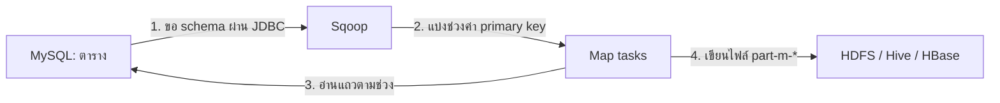
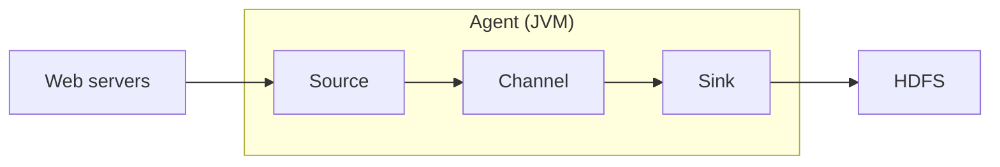
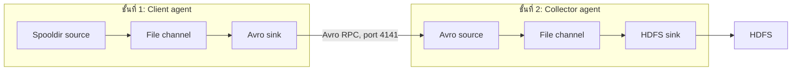

# Data Ingestion: การนำข้อมูลเข้าสู่ระบบ Big Data ด้วย Sqoop, Flume และ Kafka

**แก่นของบท:** ข้อมูลที่อยู่นอก Hadoop ต้องถูกนำเข้ามาก่อนจึงวิเคราะห์ได้ และเครื่องมือที่เลือกใช้ขึ้นอยู่กับว่าข้อมูลนั้นเป็น "ตารางที่นิ่งอยู่ในฐานข้อมูล" (ใช้ Sqoop) หรือเป็น "เหตุการณ์ที่ไหลเข้ามาต่อเนื่อง" (ใช้ Flume หรือ Kafka)

**วิธีอ่าน:** เริ่มจากตารางศัพท์ในส่วนที่ 1 แล้วอ่านตามลำดับ ส่วนที่ 2 ถึง 5 เป็นแนวคิด ส่วนที่ 6 ถึง 9 เป็นปฏิบัติการทีละขั้นพร้อมอธิบายทุกคำสั่ง ส่วนที่ 10 ถึง 13 ใช้ทบทวนและเตรียมสอบ เอกสารนี้อ้างอิงรุ่นซอฟต์แวร์ตามที่ใช้ในห้องปฏิบัติการ ได้แก่ Sqoop 1.4.x, Flume 1.x, Kafka 0.9.0.1 บน Cloudera QuickStart VM

---

## สารบัญ

1. ปูพื้นฐาน: ศัพท์ที่ต้องรู้ก่อน
2. ทำไมต้องมี Data Ingestion
3. Sqoop: นำข้อมูลจากฐานข้อมูลเชิงสัมพันธ์เข้า Hadoop
4. Flume และ Avro: นำข้อมูลสตรีมเข้า Hadoop
5. Kafka: แพลตฟอร์มสตรีมแบบกระจาย
6. ปฏิบัติการที่ 1: Sqoop จาก MySQL ไป HDFS, Hive และ HBase
7. ปฏิบัติการที่ 2: Flume รับข้อมูล Product Impression
8. ปฏิบัติการที่ 3: Kafka Producer และ Consumer
9. ข้อผิดพลาดที่พบบ่อยในปฏิบัติการ
10. แนวคิดที่มักเข้าใจผิด
11. Cheat sheet
12. โจทย์ฝึกพร้อมแนวตอบ
13. โฟกัสที่น่าจะออกสอบ
14. ข้อควรระวังและคำถามที่ควรถามอาจารย์
15. References

---

## 1. ปูพื้นฐาน: ศัพท์ที่ต้องรู้ก่อน

ตารางนี้นิยามคำที่จะใช้ตลอดบท อ่านผ่านหนึ่งรอบก่อนเริ่มเนื้อหาหลัก

| ศัพท์ที่วิชาใช้ | ศัพท์ทางการ / คำเต็ม | ความหมายสั้น |
|---|---|---|
| Data Ingestion | Data ingestion | กระบวนการนำข้อมูลจากแหล่งภายนอกเข้ามาเก็บในระบบที่ใช้วิเคราะห์ เป็นขั้นแรกของ data science pipeline |
| HDFS | Hadoop Distributed File System | ระบบไฟล์แบบกระจายของ Hadoop เก็บไฟล์ขนาดใหญ่โดยแบ่งเป็นบล็อกกระจายหลายเครื่อง |
| MapReduce | MapReduce | โมเดลประมวลผลแบบขนานของ Hadoop ประกอบด้วยงานย่อย map (อ่านและแปลงข้อมูล) และ reduce (รวมผล) |
| map-only job | Map-only job | งาน MapReduce ที่มีเฉพาะขั้น map ไม่มีขั้น reduce เหมาะกับการคัดลอกข้อมูลตรงๆ |
| RDBMS | Relational Database Management System | ระบบฐานข้อมูลเชิงสัมพันธ์ เช่น MySQL, Oracle เก็บข้อมูลเป็นตาราง (table) แถว (row) และคอลัมน์ (column) |
| JDBC | Java Database Connectivity | มาตรฐานที่โปรแกรม Java ใช้คุยกับฐานข้อมูล ระบุตำแหน่งฐานข้อมูลด้วย connect string เช่น jdbc:mysql://localhost:3306/energydata |
| Hive | Apache Hive | เครื่องมือบน Hadoop ที่ให้เขียนคำสั่งคล้าย SQL ค้นข้อมูลที่เก็บใน HDFS |
| HBase | Apache HBase | ฐานข้อมูลแบบ column-family บน HDFS เข้าถึงข้อมูลรายแถวด้วย row key |
| Structured / Semi-structured / Unstructured | ข้อมูลมีโครงสร้าง / กึ่งมีโครงสร้าง / ไม่มีโครงสร้าง | ตาราง = มีโครงสร้าง, JSON หรือ log = กึ่งมีโครงสร้าง, ข้อความอิสระหรือรูปภาพ = ไม่มีโครงสร้าง |
| Streaming data | Streaming data | ข้อมูลที่เกิดขึ้นต่อเนื่องเป็นเหตุการณ์ เช่น log ของเว็บเซิร์ฟเวอร์ ข้อมูลเซ็นเซอร์ |
| Event | Event | หน่วยข้อมูลหนึ่งหน่วยที่เดินทางในระบบสตรีม เช่น log หนึ่งบรรทัด |
| Agent (Flume) | Flume agent | โปรเซส JVM หนึ่งตัวที่ประกอบด้วย source, channel และ sink |
| Source / Channel / Sink | Source / Channel / Sink | ทางเข้ารับ event / ที่พักคิว event / ทางออกส่ง event ต่อ |
| Client agent / Collector agent | Source agent (tier 1) / Collector agent (tier 2) | agent ชั้นแรกที่อ่านข้อมูลต้นทางแล้วส่งต่อ / agent ชั้นที่สองที่รวบรวมแล้วเขียนลงปลายทาง |
| Avro | Apache Avro | ระบบ serialization ของ Hadoop เก็บข้อมูลพร้อม schema ที่เป็น JSON และมี RPC ในตัว |
| Serialization | Serialization | การแปลงข้อมูลในหน่วยความจำ (object, structure) เป็นไบต์หรือข้อความที่ส่งผ่านเครือข่ายหรือเก็บลงดิสก์ได้ |
| RPC | Remote Procedure Call | การเรียกฟังก์ชันข้ามเครื่องผ่านเครือข่าย |
| Kafka | Apache Kafka | แพลตฟอร์มสตรีมแบบกระจาย ทำหน้าที่เป็นคิวข้อความที่เก็บถาวรและทนต่อความล้มเหลว |
| Broker | Kafka broker | เซิร์ฟเวอร์ Kafka หนึ่งตัวในคลัสเตอร์ |
| Topic | Topic | หมวดหมู่ที่ใช้เก็บสตรีมของ record ใน Kafka |
| Partition | Partition | ส่วนย่อยของ topic เป็น log แบบเรียงลำดับที่เขียนต่อท้ายได้อย่างเดียว |
| Offset | Offset | เลขลำดับที่ระบุตำแหน่งของ record แต่ละตัวภายในหนึ่ง partition |
| Producer / Consumer | Producer / Consumer | โปรเซสที่เขียนข้อความเข้า topic / โปรเซสที่อ่านข้อความจาก topic |
| Consumer group | Consumer group | กลุ่มของ consumer ที่ใช้ชื่อกลุ่มเดียวกันเพื่อแบ่งงานกันอ่าน topic |
| ZooKeeper | Apache ZooKeeper | บริการประสานงานแบบกระจาย Kafka รุ่นที่ใช้ในห้องปฏิบัติการใช้เก็บข้อมูลสถานะของ broker และ consumer |

---

## 2. ทำไมต้องมี Data Ingestion

### 2.1 ปัญหาที่ต้องแก้

ลองนึกถึงร้านค้าออนไลน์แห่งหนึ่ง ข้อมูลที่มีค่าต่อการวิเคราะห์กระจายอยู่หลายที่ ยอดขายรายปีอยู่ในฐานข้อมูล MySQL ส่วนพฤติกรรมของลูกค้าว่าใครกดดูสินค้าอะไร ใส่ตะกร้าเมื่อไร เกิดขึ้นทุกวินาทีและถูกบันทึกลงไฟล์ log บนเว็บเซิร์ฟเวอร์หลายเครื่อง เครื่องมือวิเคราะห์อย่าง Hive หรือ MapReduce ทำงานกับข้อมูลที่อยู่ใน Hadoop (HDFS, Hive, HBase) ถ้าข้อมูลยังอยู่นอก Hadoop ก็วิเคราะห์ด้วยเครื่องมือเหล่านั้นไม่ได้ Data ingestion คือกระบวนการย้ายข้อมูลจากแหล่งภายนอกเข้ามาให้ถูกที่ ถูกรูปแบบ และไม่สูญหายระหว่างทาง

### 2.2 ภาพในหัว

ให้นึกถึงระบบประปา แหล่งน้ำมีสองแบบ แบบแรกเป็นถังน้ำขนาดใหญ่ที่นิ่งอยู่ (ตารางในฐานข้อมูล) ต้องใช้ปั๊มดูดไปเก็บครั้งเดียวจนหมดถัง แบบที่สองเป็นลำธารที่ไหลไม่หยุด (สตรีมของเหตุการณ์) ต้องมีท่อรับน้ำและถังพักคอยรองรับตลอดเวลา Sqoop คือปั๊มสำหรับถังน้ำ Flume และ Kafka คือระบบท่อสำหรับลำธาร อุปมานี้ผิดตรงที่ Sqoop ก็ดึงข้อมูลซ้ำเป็นรอบๆ ได้ (incremental import) และตารางในฐานข้อมูลก็เปลี่ยนแปลงได้ ไม่ได้นิ่งสนิท แต่ Sqoop ไม่ได้ออกแบบมาให้รับข้อมูลต่อเนื่องแบบทันที

### 2.3 ข้อมูลที่นำเข้ามีสามลักษณะ

ข้อมูลที่นำเข้าได้มีสามลักษณะ ได้แก่ ข้อมูลมีโครงสร้าง (เช่น ตารางใน MySQL) ข้อมูลกึ่งมีโครงสร้างหรือไม่มีโครงสร้าง (เช่น ไฟล์ JSON, log) และข้อมูลสตรีมที่เกิดจากไฟล์ log หรือเหตุการณ์ภายนอก

### 2.4 เครื่องมือในบทนี้เลือกใช้อย่างไร

| เกณฑ์ | Sqoop | Flume | Kafka |
|---|---|---|---|
| ลักษณะข้อมูล | ตารางในฐานข้อมูลเชิงสัมพันธ์ | เหตุการณ์หรือ log ที่ไหลต่อเนื่อง | เหตุการณ์ที่ไหลต่อเนื่องจากหลายผู้ผลิตไปหลายผู้ใช้ |
| ปลายทางหลัก | HDFS, Hive, HBase | HDFS (และปลายทางอื่นผ่าน sink) | Consumer ใดก็ได้ที่สมัครอ่าน topic |
| กลไกภายใน | งาน MapReduce แบบ map-only | Agent: source, channel, sink | Cluster ของ broker เก็บ log แบ่งเป็น partition |
| ออกแบบมารองรับสตรีมต่อเนื่องหรือไม่ | ไม่ | ใช่ | ใช่ |
| ตัวอย่างในห้องปฏิบัติการ | ตาราง avgprice_by_state, country_tbl | ไฟล์ impressions.log | ข้อความทดสอบใน topic ชื่อ test |

**สรุปหัวข้อ:** Data ingestion คือขั้นแรกของ pipeline การวิเคราะห์ ข้อมูลตารางใช้ Sqoop ข้อมูลเหตุการณ์ต่อเนื่องใช้ Flume หรือ Kafka

---

## 3. Sqoop: นำข้อมูลจากฐานข้อมูลเชิงสัมพันธ์เข้า Hadoop

### 3.1 ปัญหาและภาพในหัว

ถ้าไม่มี Sqoop เราต้อง export ตารางเป็นไฟล์ CSV แล้วคัดลอกขึ้น HDFS ด้วยมือ และเขียนโครงสร้างตารางใน Hive ซ้ำอีกรอบ ทั้งช้า ผิดง่าย และทำแบบขนานไม่ได้ Sqoop (ชื่อมาจาก SQL-to-Hadoop) ทำให้ขั้นตอนนี้เป็นคำสั่งเดียว โดยถามโครงสร้างตารางจากฐานข้อมูลเอง แล้วใช้ MapReduce ดึงข้อมูลแบบขนาน[[1]](https://sqoop.apache.org/docs/1.4.6/SqoopUserGuide.html)

ภาพในหัว: Sqoop เหมือนพนักงานขนย้ายที่ถือแบบแปลนของตาราง (schema) ที่ขอจากฐานข้อมูลมาก่อน แล้วส่งคนงานหลายคน (map task) ไปขนแถวข้อมูลคนละช่วงมาวางในโกดัง (HDFS) อุปมานี้ผิดตรงที่คนงานทุกคนเชื่อมต่อฐานข้อมูลจริงพร้อมกัน ถ้าจำนวนมากเกินไปจะทำให้ฐานข้อมูลช้าลงได้

### 3.2 นิยามและขอบเขต

Sqoop เป็นเครื่องมือถ่ายโอนข้อมูลระหว่างฐานข้อมูลเชิงสัมพันธ์ (เช่น MySQL, Oracle) กับที่เก็บข้อมูลของ Hadoop ได้แก่ HDFS, Hive และ HBase ทั้งขาเข้า (import) และขาออก (export) Sqoop **ไม่ใช่** เครื่องมือรับข้อมูลสตรีมต่อเนื่องจากหลายแหล่ง งานนั้นเป็นหน้าที่ของ Flume หรือ Kafka

หมายเหตุด้านรุ่น: เอกสารทางการของ Sqoop ระบุว่าโครงการนี้ถูกย้ายไปสถานะ retired (Apache Attic) แล้ว แต่ยังเป็นเครื่องมือที่ใช้ในห้องปฏิบัติการและออกสอบในวิชานี้[[1]](https://sqoop.apache.org/docs/1.4.6/SqoopUserGuide.html)

### 3.3 กลไกทีละขั้นของ sqoop import

1. **อ่านข้อมูลกำกับ (metadata):** Sqoop เชื่อมต่อฐานข้อมูลผ่าน JDBC และขอชื่อคอลัมน์กับชนิดข้อมูลของตาราง
2. **สร้างโค้ดรองรับแถวข้อมูล:** ผลพลอยได้ของการ import คือคลาส Java หนึ่งคลาสที่แทนหนึ่งแถวของตาราง Sqoop ใช้คลาสนี้เอง และเก็บซอร์สไว้ให้ใช้เขียน MapReduce ต่อได้[[1]](https://sqoop.apache.org/docs/1.4.6/SqoopUserGuide.html)
3. **แบ่งงาน:** Sqoop เลือก "คอลัมน์แบ่งงาน" (splitting column) โดยค่าเริ่มต้นคือ primary key ของตาราง ถามค่าต่ำสุดและสูงสุดของคอลัมน์นั้น แล้วแบ่งช่วงค่าให้ map task แต่ละตัวเท่าๆ กัน[[1]](https://sqoop.apache.org/docs/1.4.6/SqoopUserGuide.html)
4. **รันงาน map-only:** map task แต่ละตัวอ่านแถวในช่วงของตนจากฐานข้อมูลแล้วเขียนไฟล์ลง HDFS โดยไม่มีขั้น reduce
5. **ได้ไฟล์ผลลัพธ์:** ไฟล์ชื่อ part-m-00000, part-m-00001, ... หนึ่งไฟล์ต่อหนึ่ง map task ค่าเริ่มต้นเป็นไฟล์ข้อความคั่นด้วยจุลภาค (comma) หนึ่งแถวต่อหนึ่งบรรทัด[[1]](https://sqoop.apache.org/docs/1.4.6/SqoopUserGuide.html)



วิธีอ่านแผนภาพ: ลูกศรหมายเลข 1 และ 2 เกิดก่อนการย้ายข้อมูลจริง ส่วนหมายเลข 3 และ 4 ทำซ้ำโดย map task หลายตัวพร้อมกัน

### 3.4 ตัวอย่างการแบ่งงานด้วยค่าจริง

สมมติตารางมี primary key ชื่อ id ค่าต่ำสุด 0 ค่าสูงสุด 1000 และสั่ง Sqoop ใช้ 4 map task เอกสารทางการยกตัวอย่างว่า Sqoop จะรัน SQL รูปแบบ SELECT ... WHERE id >= lo AND id < hi โดยคู่ (lo, hi) ของแต่ละ task คือ (0, 250), (250, 500), (500, 750) และ (750, 1001)[[1]](https://sqoop.apache.org/docs/1.4.6/SqoopUserGuide.html) ค่า 1001 ที่ปลายช่วงสุดท้ายทำให้ค่า 1000 ถูกรวมอยู่ด้วย เพราะเงื่อนไขปลายช่วงเป็น "น้อยกว่า" ข้อควรสังเกตคือถ้าค่า id กระจุกตัวไม่สม่ำเสมอ task บางตัวจะได้งานมากกว่าตัวอื่น ควรเลือกคอลัมน์อื่นด้วย --split-by

### 3.5 ตัวเลือกสำคัญของ sqoop import

| ตัวเลือก | ความหมาย |
|---|---|
| --connect | Connect string แบบ JDBC ระบุเซิร์ฟเวอร์ พอร์ต และชื่อฐานข้อมูล |
| --username, --password | ผู้ใช้และรหัสผ่านของฐานข้อมูล |
| --table | ตารางที่จะ import |
| --target-dir | ไดเรกทอรีปลายทางใน HDFS ถ้ามีอยู่แล้ว Sqoop จะไม่เขียนทับและงานล้มเหลว |
| -m หรือ --num-mappers | จำนวน map task ค่าเริ่มต้นคือ 4 |
| --split-by | คอลัมน์ที่ใช้แบ่งงาน |
| --hive-import, --hive-table | นำข้อมูลเข้า Hive และตั้งชื่อตารางใน Hive |
| --hbase-table, --column-family, --hbase-row-key, --hbase-create-table | นำข้อมูลเข้าตาราง HBase |

ค่าเริ่มต้นและข้อบังคับทั้งหมดในตารางนี้มาจากคู่มือ Sqoop User Guide[[1]](https://sqoop.apache.org/docs/1.4.6/SqoopUserGuide.html)

**กฎที่ออกสอบได้: ตารางที่ไม่มี primary key** ถ้าตารางไม่มี primary key และไม่ระบุ --split-by การ import จะล้มเหลว เว้นแต่กำหนดให้ใช้ map task เดียวด้วย -m 1 (หรือใช้ --autoreset-to-one-mapper)[[1]](https://sqoop.apache.org/docs/1.4.6/SqoopUserGuide.html) นี่คือเหตุผลที่ปฏิบัติการใช้ -m 1 กับตาราง avgprice_by_state ซึ่งสร้างโดยไม่มี primary key และผลคือได้ไฟล์เดียวคือ part-m-00000

### 3.6 การ import เข้า Hive

เมื่อใส่ --hive-import ต่อท้ายคำสั่ง Sqoop จะนำข้อมูลเข้า HDFS ก่อน แล้วสร้างและรันสคริปต์ Hive ที่มีคำสั่ง CREATE TABLE (แปลงชนิดข้อมูลของ MySQL เป็นชนิดของ Hive) ตามด้วย LOAD DATA INPATH เพื่อย้ายไฟล์เข้า warehouse ของ Hive[[1]](https://sqoop.apache.org/docs/1.4.6/SqoopUserGuide.html) จึงไม่ต้องสร้างตารางใน Hive เอง และตั้งชื่อตารางใน Hive ได้ด้วย --hive-table ข้อควรระวังจากคู่มือ: Sqoop เขียนค่า NULL เป็นสตริง null แต่ Hive ใช้ \N แทน NULL จึงต้องใช้ --null-string และ --null-non-string ถ้าต้องการให้เงื่อนไข IS NULL ใน Hive ทำงานถูก[[1]](https://sqoop.apache.org/docs/1.4.6/SqoopUserGuide.html)

### 3.7 การ import เข้า HBase

เมื่อระบุ --hbase-table Sqoop จะแปลงแต่ละแถวของตารางต้นทางเป็นการ Put หนึ่งครั้งลงตาราง HBase โดยค่าคอลัมน์หนึ่งทำหน้าที่เป็น row key ทุกคอลัมน์ที่เหลือถูกวางใน column family เดียวกันที่ระบุด้วย --column-family ค่าเริ่มต้นของ row key คือคอลัมน์แบ่งงาน หรือ primary key ถ้าไม่ได้ระบุ และกำหนดเองได้ด้วย --hbase-row-key[[1]](https://sqoop.apache.org/docs/1.4.6/SqoopUserGuide.html) ถ้าตารางและ column family ปลายทางยังไม่มี งานจะล้มเหลว เว้นแต่ใส่ --hbase-create-table ให้ Sqoop สร้างให้[[1]](https://sqoop.apache.org/docs/1.4.6/SqoopUserGuide.html) ค่าทุกช่องถูกแปลงเป็นสตริงแล้วเก็บเป็นไบต์ UTF-8[[1]](https://sqoop.apache.org/docs/1.4.6/SqoopUserGuide.html)

### 3.8 ความปลอดภัยของรหัสผ่านและ localhost

คู่มือ Sqoop ระบุว่าการใส่ --password ในคำสั่งไม่ปลอดภัย เพราะผู้ใช้คนอื่นอ่านได้จากรายการโปรเซส (เช่นผลของคำสั่ง ps) วิธีที่แนะนำคือ -P (ถามรหัสผ่านตอนรัน) หรือ --password-file[[1]](https://sqoop.apache.org/docs/1.4.6/SqoopUserGuide.html) ห้องปฏิบัติการใช้ --password เพื่อความสะดวกบน VM ที่ใช้เรียนเท่านั้น อีกข้อคือ connect string ที่ใช้ localhost ใช้ได้เมื่อรันบนเครื่องเดียว แต่บนคลัสเตอร์จริง map task รันหลายเครื่อง แต่ละเครื่องจะเชื่อมไปที่ localhost ของตัวเอง จึงต้องใช้ชื่อโฮสต์หรือ IP จริงของเซิร์ฟเวอร์ฐานข้อมูล[[1]](https://sqoop.apache.org/docs/1.4.6/SqoopUserGuide.html)

### 3.9 เมื่อไรควรใช้ และเมื่อไรไม่ควร

ใช้ Sqoop เมื่อข้อมูลอยู่ในตารางของ RDBMS และต้องการย้ายเป็นชุด (batch) ครั้งเดียวหรือเป็นรอบ ไม่ควรใช้เมื่อข้อมูลเป็นเหตุการณ์ที่เกิดขึ้นต่อเนื่องและต้องการให้เข้าระบบแทบทันที เพราะ Sqoop แต่ละครั้งเป็นการรันงาน MapReduce หนึ่งงาน

**สรุปหัวข้อ Sqoop**

| ประเด็น | สาระสำคัญ |
|---|---|
| หน้าที่ | ถ่ายโอนตาราง RDBMS ไป HDFS, Hive, HBase (และส่งกลับได้) |
| กลไก | อ่าน schema จาก DB แล้วรัน MapReduce แบบ map-only |
| ผลลัพธ์เริ่มต้น | ไฟล์ข้อความคั่นด้วยจุลภาค ชื่อ part-m-xxxxx |
| ตัวเลือกจำนวน task | -m (ค่าเริ่มต้น 4) |
| ตารางไม่มี primary key | ต้องใช้ --split-by หรือ -m 1 |
| ไม่รองรับ | การรับสตรีมต่อเนื่องจากหลายแหล่ง |

---
## 4. Flume และ Avro: นำข้อมูลสตรีมเข้า Hadoop

### 4.1 ปัญหาที่ Flume แก้

เว็บเซิร์ฟเวอร์หลายสิบเครื่องเขียน log ตลอดเวลา ถ้าจะใช้ Sqoop ก็ไม่มีตารางให้ดึง ถ้าจะคัดลอกไฟล์ด้วยมือก็ไม่ทัน และถ้า HDFS ล่มชั่วคราว ข้อมูลที่ส่งมาในช่วงนั้นก็จะหายไป Flume ถูกออกแบบมาเพื่อรวบรวมและนำข้อมูลปริมาณมากจากหลายสตรีมเข้า Hadoop โดยทั่วไปใช้กับ log ของเว็บเซิร์ฟเวอร์ และปรับแต่งให้ขนส่งเหตุการณ์จากแหล่งอื่นได้ เช่น ข้อมูลเครือข่าย ข้อมูลจากโซเชียลมีเดีย และข้อมูลเซ็นเซอร์ พร้อมทั้งรักษาความทนต่อความล้มเหลว (fault tolerance) และความสามารถขยายตัว (scalability) ผ่านสถาปัตยกรรมแบบกระจาย[[2]](https://flume.apache.org/releases/content/1.9.0/FlumeUserGuide.html)

### 4.2 ภาพในหัว

ให้นึกถึงสายพานลำเลียงในโรงงานที่มีสามส่วน ทางเข้ารับกล่องจากรถบรรทุก (source) ลานพักกล่องที่วางกล่องรอไว้จนกว่าจะมีคนมารับ (channel) และทางออกที่หยิบกล่องไปส่งปลายทาง (sink) จุดสำคัญคือกล่องจะถูกยกออกจากลานพักก็ต่อเมื่อปลายทางรับของแล้วเท่านั้น อุปมานี้ผิดตรงที่ในโรงงานจริงกล่องมีตัวตนเดียว แต่ใน Flume ถ้าเกิดความล้มเหลวกลางทางบางจังหวะ event เดิมอาจถูกส่งซ้ำได้ (duplicate) ซึ่งเป็นราคาของการไม่ทำให้ข้อมูลหาย

### 4.3 นิยามและส่วนประกอบ

- **Event:** หน่วยข้อมูลที่เดินทางใน Flume ประกอบด้วยเนื้อหาเป็นไบต์ (payload) และแอตทริบิวต์แบบสตริงที่ไม่บังคับ (header) เช่น log หนึ่งบรรทัดคือหนึ่ง event[[2]](https://flume.apache.org/releases/content/1.9.0/FlumeUserGuide.html)
- **Flow (data flow):** เส้นทางของ event จากต้นทางไปปลายทาง ผ่านลำดับของจุดต่อ (hop)
- **Agent:** โปรเซส JVM หนึ่งตัวที่โฮสต์ส่วนประกอบที่ event ไหลผ่าน agent หนึ่งตัวมีสามส่วนที่กำหนดค่าได้ คือ source, channel และ sink[[2]](https://flume.apache.org/releases/content/1.9.0/FlumeUserGuide.html)

| ส่วนประกอบ | ทำไมต้องมี | ถือสถานะอะไร | ทำอะไร | ตัวอย่างชนิด |
|---|---|---|---|---|
| Source | เป็นทางเข้าของ event | ตำแหน่งที่อ่านถึง (เช่น ไฟล์ใดอ่านครบแล้ว) | ฟังและรับ event จากแหล่งภายนอก แล้วเขียนลง channel | exec, spooldir, avro, netcat, syslog |
| Channel | แยกความเร็วของ source กับ sink ออกจากกัน และรอ event ไว้ | คิวของ event ที่ยังไม่ถูกส่ง | เก็บ event แบบ passive จนกว่า sink จะมาเอา | memory, file |
| Sink | เป็นทางออกของ event | ไม่มี (อ่านจาก channel) | อ่านและเอา event ออกจาก channel แล้วส่งไป hop ถัดไปหรือปลายทางสุดท้าย | hdfs, avro, logger |

กฎการเชื่อมต่อ: source หนึ่งตัวระบุ channel ได้หลายตัว แต่ sink หนึ่งตัวระบุ channel ได้เพียงตัวเดียว[[2]](https://flume.apache.org/releases/content/1.9.0/FlumeUserGuide.html)

**Source ที่พบในวิชา**

- **Exec source:** รันคำสั่ง Unix แล้วอ่านผลลัพธ์ เช่น tail -F ไฟล์ access log ของ Apache เป็นสตรีมของบรรทัด ข้อควรระวังจากคู่มือ Flume: source ประเภทนี้ไม่รับประกันการส่งมอบ ถ้า channel เต็มหรือส่ง event ไม่ได้ ข้อมูลอาจหาย เพราะโปรแกรมที่เขียน log ไม่มีทางรู้ว่า Flume รับไปหรือยัง[[2]](https://flume.apache.org/releases/content/1.9.0/FlumeUserGuide.html)
- **Spooling directory source (spooldir):** ดูโฟลเดอร์ที่กำหนด แล้วอ่านไฟล์ใหม่ที่ถูกวางลงมา เมื่ออ่านไฟล์หนึ่งเข้า channel ครบ ค่าเริ่มต้นคือเปลี่ยนชื่อไฟล์โดยต่อท้าย .COMPLETED ข้อดีคือเชื่อถือได้กว่า exec แม้ Flume ถูกรีสตาร์ทก็ไม่ทำข้อมูลหาย ข้อแลกเปลี่ยนคือไฟล์ที่วางในโฟลเดอร์ต้องไม่ถูกแก้ไขอีก (immutable) และชื่อไฟล์ต้องไม่ซ้ำ ถ้าไฟล์ถูกเขียนต่อหลังวางลงโฟลเดอร์ หรือมีการใช้ชื่อไฟล์เดิมซ้ำ Flume จะบันทึกข้อผิดพลาดใน log แล้วหยุดประมวลผล ค่าเริ่มต้นคือหนึ่งบรรทัดเป็นหนึ่ง event[[2]](https://flume.apache.org/releases/content/1.9.0/FlumeUserGuide.html)
- **Avro source:** รับ event จาก Avro client หรือจาก Avro sink ของ agent ก่อนหน้า ใช้เชื่อม agent หลายชั้นเข้าด้วยกัน[[2]](https://flume.apache.org/releases/content/1.9.0/FlumeUserGuide.html)

**Channel ที่พบในวิชา**

- **File channel:** เก็บ event บนดิสก์ของเครื่อง (ต้องระบุ checkpointDir และ dataDir) ทนต่อการที่ agent ล้ม เพราะ event ที่ค้างอยู่ยังอยู่บนดิสก์
- **Memory channel:** เก็บในหน่วยความจำ เร็วกว่าแต่ถ้าโปรเซส agent ตาย event ที่ค้างจะกู้คืนไม่ได้[[2]](https://flume.apache.org/releases/content/1.9.0/FlumeUserGuide.html)

### 4.4 กลไกความน่าเชื่อถือ

Flume ใช้แนวคิดธุรกรรม (transaction) กล่าวคือการเก็บ event ลง channel (ฝั่ง source) และการดึง event ออกจาก channel (ฝั่ง sink) ต่างครอบด้วยธุรกรรมของ channel เอง event จะถูกลบออกจาก channel ก็ต่อเมื่อถูกเก็บลง channel ของ agent ถัดไป หรือเก็บลงปลายทางสุดท้าย (เช่น HDFS) เรียบร้อยแล้ว ในโฟลว์หลาย hop ทั้ง sink ของ hop ก่อนและ source ของ hop ถัดไปต่างมีธุรกรรมของตนเอง เพื่อให้แน่ใจว่า event ถูกเก็บลง channel ของ hop ถัดไปอย่างปลอดภัย[[2]](https://flume.apache.org/releases/content/1.9.0/FlumeUserGuide.html)

ผลที่ตามมาคือ ถ้า sink ส่งไม่สำเร็จ event ยังอยู่ใน channel และจะถูกลองส่งใหม่ ผู้ใช้จะสังเกตเห็นว่า channel ค่อยๆ เต็ม และในบางกรณีปลายทางได้ event ซ้ำ ไม่ใช่ event หาย

### 4.5 รูปแบบโฟลว์



**โฟลว์อย่างง่าย:** เว็บเซิร์ฟเวอร์ส่ง event ให้ source (ลำดับ 1) source เขียนลง channel (ลำดับ 2) sink อ่านจาก channel แล้วเขียนลง HDFS (ลำดับ 3) ทั้งหมดอยู่ใน agent เดียว

**โฟลว์หลายชั้น (multi-agent):** ให้ sink ของ agent แรกเป็นชนิด avro ชี้ไปที่ hostname และ port ของ Avro source ของ agent ถัดไป[[2]](https://flume.apache.org/releases/content/1.9.0/FlumeUserGuide.html) เหตุผลที่แยกเป็นสองชั้นคือควบคุมอัตราการเขียนลงที่เก็บข้อมูลปลายทางได้ดีขึ้น เพราะ agent ชั้นแรกกระจายอยู่ใกล้แหล่งข้อมูล ส่วน agent ชั้นที่สองเป็นตัวเดียวที่ต่อกับ HDFS



**โฟลว์แบบ fan-in (consolidation):** agent ชั้นแรกหลายตัว (แต่ละตัวอยู่กับเว็บเซิร์ฟเวอร์หนึ่งเครื่อง) มี Avro sink ชี้ไปที่ Avro source ของ agent ชั้นที่สองตัวเดียว ซึ่งรวม event ทั้งหมดเข้า channel เดียวแล้วส่งต่อไป HDFS เหมาะกับกรณี log จากเว็บเซิร์ฟเวอร์หลายร้อยเครื่องไปยัง agent ไม่กี่ตัวที่เขียนลง HDFS[[2]](https://flume.apache.org/releases/content/1.9.0/FlumeUserGuide.html)

**โฟลว์แบบ fan-out:** source หนึ่งตัวส่ง event ไปหลาย channel ด้วย channel selector แบบ replicating (ส่งซ้ำไปทุก channel และเป็นค่าเริ่มต้น) หรือ multiplexing (เลือก channel ตามค่า header ของ event)[[2]](https://flume.apache.org/releases/content/1.9.0/FlumeUserGuide.html)

### 4.6 การตั้งค่า agent: กฎการตั้งชื่อ

ไฟล์ตั้งค่า Flume เป็นรูปแบบ Java properties แต่ละบรรทัดมีรูปแบบ ชื่อ-agent.ชนิด-ส่วนประกอบ.ชื่อ-ส่วนประกอบ.คุณสมบัติ = ค่า เช่น collector.sources.r1.type = avro ไฟล์เดียวกำหนดได้หลาย agent และตอนสตาร์ตต้องบอกว่าจะรัน agent ชื่ออะไรด้วย --name[[2]](https://flume.apache.org/releases/content/1.9.0/FlumeUserGuide.html) ดังนั้น **ค่า --name ต้องตรงกับคำนำหน้าในไฟล์** ไฟล์ client.conf ใช้คำนำหน้า client จึงต้องรันด้วย --name client และไฟล์ collector.conf ใช้คำนำหน้า collector จึงต้องรันด้วย --name collector ถ้าไม่ตรงกัน agent จะไม่พบการตั้งค่าของตัวเอง

โครงสร้างมาตรฐานของการเชื่อมส่วนประกอบ (ใช้ชื่อสมมติ a1):

```
a1.sources = r1
a1.sinks = k1
a1.channels = c1
a1.sources.r1.channels = c1
a1.sinks.k1.channel = c1
```

สังเกตว่าฝั่ง source ใช้คำว่า channels (พหูพจน์) ส่วนฝั่ง sink ใช้ channel (เอกพจน์) ตามกฎในหัวข้อ 4.3[[2]](https://flume.apache.org/releases/content/1.9.0/FlumeUserGuide.html)

### 4.7 Avro

**ปัญหา:** เมื่อ Avro sink ของ agent หนึ่งส่ง event ให้ Avro source ของอีก agent ผ่านเครือข่าย ข้อมูลในหน่วยความจำต้องถูกแปลงเป็นไบต์ที่อีกฝั่งอ่านกลับได้ตรงกัน นี่คืองานของ serialization

**นิยาม:** Avro เป็นระบบ serialization ในระบบนิเวศ Hadoop มันแปลงโครงสร้างข้อมูลหรือสถานะของ object เป็นรูปแบบไบนารีหรือข้อความที่ส่งผ่านเครือข่ายหรือเก็บลงที่เก็บถาวรได้ ในรูปไฟล์ที่อธิบายตัวเองได้ (Avro Data File หรือ object container file)[[3]](https://avro.apache.org/docs/1.11.1/specification/)

**สิ่งที่ Avro ไม่ได้ทำ:** Avro ไม่ใช่ที่เก็บข้อมูลหรือระบบคิว มันเป็นเพียงรูปแบบการเข้ารหัสและโปรโตคอลสื่อสาร

**Schema เป็น JSON:** schema ของ Avro เขียนด้วย JSON เช่น record ที่มีสองฟิลด์:

```json
{
  "type": "record",
  "name": "test",
  "fields": [
    {"name": "a", "type": "long"},
    {"name": "b", "type": "string"}
  ]
}
```

**เก็บ schema ไว้กับข้อมูล:** การเข้ารหัสแบบไบนารีของ Avro ไม่มีชื่อฟิลด์หรือข้อมูลชนิดใดๆ ปนอยู่ในข้อมูล ผู้อ่านจึงต้องมี schema ที่ผู้เขียนใช้ตอนเขียนจึงจะอ่านได้ถูกต้อง ด้วยเหตุนี้ไฟล์ Avro จึงเก็บ schema ไว้ในส่วนหัวของไฟล์เสมอ (คุณสมบัติชื่อ avro.schema) แล้วตามด้วยบล็อกข้อมูล[[3]](https://avro.apache.org/docs/1.11.1/specification/) ข้อดีคือข้อมูลมีขนาดเล็ก และไฟล์เปิดอ่านได้เองโดยไม่ต้องหา schema จากที่อื่น

**ตัวอย่างทีละขั้น: เข้ารหัส record ข้างต้น** ให้ a = 27 และ b = "foo"

1. ค่า long ใช้การเข้ารหัสแบบ zig-zag ที่ความยาวแปรผัน สำหรับจำนวนเต็มบวก n ค่าที่เข้ารหัสคือ 2n ดังนั้น 27 กลายเป็น 54 ซึ่งเขียนเลขฐานสิบหกได้เป็น 36
2. สตริงเข้ารหัสเป็นความยาวไบต์ (เป็น long) ตามด้วยไบต์ UTF-8 ความยาว 3 เข้ารหัสเป็น 06 และอักขระ f, o, o คือไบต์ 66 6f 6f
3. record เข้ารหัสโดยนำการเข้ารหัสของแต่ละฟิลด์ตามลำดับที่ประกาศมาต่อกัน ผลคือไบต์ 36 06 66 6f 6f[[3]](https://avro.apache.org/docs/1.11.1/specification/)
4. ตรวจสอบ: ผลมี 5 ไบต์ ไม่มีชื่อฟิลด์ a หรือ b อยู่เลย ผู้อ่านรู้ว่าไบต์แรกเป็น long และไบต์ถัดไปเป็นสตริงได้ก็เพราะมี schema

**Avro RPC และการจับมือ (handshake):** Avro มีระบบ RPC ในตัว เมื่อ client กับ server (ในบริบท Flume คือ sink กับ source) เริ่มสื่อสาร ทั้งสองฝั่งต้องมีคำอธิบายโปรโตคอล (ซึ่งรวม schema) ของกันและกัน ขั้นตอนคือ client ส่งค่าแฮช MD5 ของโปรโตคอลตนเองและแฮชที่เดาหรือจำได้ของโปรโตคอลของ server ถ้า server รู้จักโปรโตคอลของ client และแฮชของ server ถูกต้อง จะตอบ match เป็น BOTH แล้วทำงานต่อได้เลย ถ้า server ไม่รู้จักโปรโตคอลของ client จะตอบ match เป็น NONE และ client ต้องส่งคำขอใหม่พร้อมข้อความโปรโตคอลเต็ม ทั้งสองฝั่งเก็บแคชโปรโตคอลที่เคยเห็น ในกรณีทั่วไปการจับมือจึงเสร็จโดยไม่ต้องส่งข้อความโปรโตคอลเต็ม และเมื่อสำเร็จแล้ว การสื่อสารต่อไปบนการเชื่อมต่อเดียวกันไม่ต้องจับมืออีก[[3]](https://avro.apache.org/docs/1.11.1/specification/) นี่คือความหมายของประโยค "Avro ใช้ RPC แลกเปลี่ยน schema ระหว่าง client และ server ตอน handshake"

**Avro ปรากฏที่ไหนอีกในบทนี้:** ใน Flume (Avro sink กับ Avro source) และใน Sqoop (ตัวเลือก --as-avrodatafile เพื่อ import เป็นไฟล์ Avro ซึ่งรองรับการเปลี่ยน schema ของตารางในภายหลังได้ดี)[[1]](https://sqoop.apache.org/docs/1.4.6/SqoopUserGuide.html)[[3]](https://avro.apache.org/docs/1.11.1/specification/)

### 4.8 ตัวอย่างทีละขั้น: หนึ่ง event เดินทางอย่างไร

สถานการณ์: ร้านค้าออนไลน์สมมติบันทึกทุกปฏิสัมพันธ์ของผู้ใช้ (impression) เป็น JSON หนึ่งบรรทัดต่อหนึ่งเหตุการณ์ ฟิลด์ที่ใช้คือ sku (รหัสสินค้า) timestamp (เวลาเป็นมิลลิวินาทีจาก epoch) cid (รหัสลูกค้า) action และ ip ค่า action เป็นหนึ่งใน view, click, add_cart, remove_cart, purchase ตัวอย่างหนึ่ง event:

```json
{"sku": "T9921-5", "timestamp": 1453167527737, "cid": "51761", "action": "add_cart", "ip": "226.43.51.25"}
```

| ขั้น | ตำแหน่ง | สิ่งที่เกิดขึ้น | สถานะของ event |
|---|---|---|---|
| 1 | ไฟล์ /tmp/impressions/impressions.log | โปรแกรมจำลองเขียน JSON หนึ่งบรรทัดต่อหนึ่งเหตุการณ์ | เป็นบรรทัดข้อความในไฟล์ |
| 2 | Spooldir source ของ client | อ่านไฟล์ในโฟลเดอร์ /tmp/impressions ทีละบรรทัด หนึ่งบรรทัดเป็นหนึ่ง event | event อยู่ใน source |
| 3 | File channel ของ client | source เขียน event ลงคิวบนดิสก์ | event รอใน channel |
| 4 | Avro sink ของ client | อ่าน event จาก channel ส่งผ่าน Avro RPC ไปยัง localhost พอร์ต 4141 | event อยู่ระหว่างส่ง (ยังไม่ถูกลบจาก channel) |
| 5 | Avro source ของ collector | ฟังที่พอร์ต 4141 (bind 0.0.0.0) รับ event เขียนลง channel ของ collector | event ถูกเก็บใน channel ที่สอง ธุรกรรมฝั่งส่งจึงสำเร็จ |
| 6 | File channel ของ client | เมื่อขั้น 5 สำเร็จ event ถูกลบออกจาก channel ของ client | event เหลืออยู่ที่ collector |
| 7 | HDFS sink ของ collector | อ่าน event จาก channel เป็นชุด (batch) เขียนเป็นข้อความลงไฟล์ใน /user/cloudera/impressions | event อยู่ใน HDFS |
| 8 | File channel ของ collector | เมื่อเขียนลง HDFS สำเร็จ event ถูกลบออกจาก channel | ครบวงจร |

การตีความ: ที่ทุก hop ผู้ส่งจะไม่ลบ event จนกว่าผู้รับยืนยันว่าเก็บแล้ว ถ้า collector ล่มระหว่างขั้น 5 เพราะ client ยังไม่ลบ event จึงส่งใหม่ได้เมื่อ collector กลับมา (event ที่ส่งไปแล้วอาจซ้ำ) การตรวจสอบเมื่อรันจริงทำในปฏิบัติการที่ 2

**การตั้งชื่อไฟล์ใน HDFS และการแบ่งไฟล์ (roll):** ไฟล์ตั้งค่าของ collector กำหนด hdfs.filePrefix เป็น impressions และ hdfs.fileSuffix เป็น .log จึงคาดว่าไฟล์ผลลัพธ์มีชื่อรูปแบบ impressions.ตัวเลข.log ตัวเลขกลางเป็นตัวนับที่ Flume ใส่ให้ และไฟล์ที่ยังเขียนอยู่มักมีนามสกุลชั่วคราวเพิ่ม (เช่น .tmp) ไฟล์ตั้งค่านี้ไม่ได้กำหนด hdfs.rollInterval, hdfs.rollSize และ hdfs.rollCount จึงใช้ค่าเริ่มต้นของ HDFS sink ซึ่งตามคู่มือ Flume รุ่น 1.x ตั้งให้ปิดไฟล์เมื่อครบเวลา 30 วินาที หรือขนาด 1024 ไบต์ หรือ 10 event อย่างใดอย่างหนึ่งก่อน (ตรวจสอบตามรุ่นที่ใช้) ผลคือข้อมูลชุดเล็กอาจถูกแบ่งเป็นหลายไฟล์ ซึ่งเป็นพฤติกรรมปกติ ไม่ใช่ข้อผิดพลาด[[2]](https://flume.apache.org/releases/content/1.9.0/FlumeUserGuide.html)

### 4.9 เมื่อไรควรใช้ Flume และเทียบทางเลือกใกล้เคียง

| กรณี | เลือก | เหตุผล |
|---|---|---|
| ต้องการเก็บ log ไฟล์จากเซิร์ฟเวอร์จำนวนมากลง HDFS | Flume | มี source สำเร็จรูป, sink HDFS ในตัว, รองรับ fan-in |
| ข้อมูลอยู่ในตารางฐานข้อมูล | Sqoop | อ่าน schema เองและขนานได้ |
| ต้องการเก็บข้อความไว้อ่านซ้ำหลายรอบโดยหลายระบบ | Kafka | ข้อความถูกเก็บตามเวลาที่กำหนด ไม่ถูกลบเมื่อถูกอ่าน |
| ต้องการความน่าเชื่อถือสูงสุดจากไฟล์ log | Flume ด้วย spooldir + file channel | exec source ไม่รับประกันการส่งมอบ |

**สรุปหัวข้อ Flume และ Avro**

| ประเด็น | สาระสำคัญ |
|---|---|
| Flume | รวบรวมและนำข้อมูลสตรีมปริมาณมากเข้า Hadoop ทนความล้มเหลว ขยายตัวได้ |
| Agent | JVM process หนึ่งตัว ประกอบด้วย source, channel, sink |
| Reliability | event ถูกลบออกจาก channel เมื่อ hop ถัดไปเก็บแล้วเท่านั้น (เสี่ยงซ้ำ ไม่เสี่ยงหาย) |
| Multi-tier | Avro sink ของชั้นแรกต่อกับ Avro source ของชั้นที่สอง |
| ชื่อ agent | ค่า --name ต้องตรงกับคำนำหน้าในไฟล์ตั้งค่า |
| Avro | serialization เก็บ schema (JSON) ไว้กับข้อมูล มี RPC และ handshake |

---
## 5. Kafka: แพลตฟอร์มสตรีมแบบกระจาย

### 5.1 ปัญหาที่ Kafka แก้

Flume ส่ง event จากจุดหนึ่งไปยังปลายทางที่กำหนดไว้ล่วงหน้า และ event หายจาก channel เมื่อส่งสำเร็จ แต่ในองค์กรจริง ข้อมูลเหตุการณ์ชุดเดียวกัน เช่น การคลิกของลูกค้า อาจต้องถูกใช้โดยหลายระบบ ได้แก่ ระบบเก็บลง HDFS ระบบตรวจจับการโกง และระบบแนะนำสินค้า แต่ละระบบอ่านในจังหวะของตนเอง และบางระบบต้องการย้อนกลับไปอ่านข้อมูลเก่า ถ้าผู้ผลิตข้อมูลต้องรู้จักและส่งให้ผู้ใช้ทุกรายโดยตรง ระบบจะพันกันยุ่งเหยิง Kafka แก้ปัญหานี้โดยเป็นตัวกลางที่เก็บสตรีมของ record ไว้อย่างถาวรและทนต่อความล้มเหลว ผู้ผลิตเขียนครั้งเดียว ผู้ใช้กี่รายก็อ่านได้อิสระต่อกัน[[4]](https://kafka.apache.org/intro)

### 5.2 ภาพในหัว

ให้นึกถึงสมุดบันทึกประจำวันแบบเขียนต่อท้ายอย่างเดียว (log) ผู้ผลิตคือคนที่จดเหตุการณ์ลงบรรทัดต่อไปเรื่อยๆ ผู้ใช้แต่ละรายมีที่คั่นหนังสือของตนเอง (offset) อ่านไปถึงบรรทัดไหนก็คั่นไว้ที่นั่น การอ่านของคนหนึ่งไม่ทำให้บรรทัดหายไปจากสมุด และการวางที่คั่นใหม่ให้ย้อนอ่านบรรทัดเก่าก็ทำได้ อุปมานี้ผิดตรงที่ Kafka ไม่ได้เก็บสมุดไว้ตลอดกาล บรรทัดเก่าจะถูกทิ้งเมื่อพ้นระยะเวลาเก็บ (retention) ที่กำหนดต่อ topic[[4]](https://kafka.apache.org/intro)

### 5.3 นิยามและขอบเขต

Kafka คือแพลตฟอร์มสตรีมแบบกระจาย (distributed streaming platform) ที่มีความสามารถหลักสามอย่าง

1. เผยแพร่และสมัครรับสตรีมของ record คล้ายคิวข้อความ (message queue) หรือระบบส่งข้อความขององค์กร
2. เก็บสตรีมของ record อย่างทนต่อความล้มเหลวและคงทน
3. ประมวลผลสตรีมของ record ในขณะที่เกิดขึ้น[[4]](https://kafka.apache.org/intro)

Kafka **ไม่ใช่** เครื่องมือดึงข้อมูลจากตารางฐานข้อมูลโดยตรงเหมือน Sqoop และไม่ใช่ตัวเขียนลง HDFS สำเร็จรูปเหมือน HDFS sink ของ Flume เป็นเพียงตัวกลางเก็บและส่งต่อ record

### 5.4 ส่วนประกอบและบทบาท

| ส่วนประกอบ | คืออะไรและมีไว้ทำไม | ถือข้อมูลหรือสถานะอะไร |
|---|---|---|
| Record (message) | หน่วยข้อมูลหนึ่งหน่วย ประกอบด้วย key, value และ timestamp | ข้อมูลเหตุการณ์ |
| Broker | เซิร์ฟเวอร์ Kafka หนึ่งตัว Kafka รันเป็นคลัสเตอร์ของ broker หนึ่งตัวขึ้นไป | ไฟล์ log ของ partition ที่ตนรับผิดชอบ |
| Topic | หมวดหมู่ที่เก็บสตรีมของ record ผู้ผลิตเลือก topic ที่จะเขียน | ประกอบด้วย partition หลายตัว |
| Partition | ส่วนย่อยของ topic แต่ละ partition เป็น log แบบเรียงลำดับ เขียนต่อท้ายได้อย่างเดียว และแมปกับไฟล์ log เชิงตรรกะ (ชุดของไฟล์ segment ขนาดเท่ากัน) | ลำดับของ record พร้อม offset |
| Offset | เลขลำดับที่ระบุ record แต่ละตัวภายใน partition เริ่มจาก 0 | ตำแหน่งของ record |
| Producer | โปรเซสที่เผยแพร่ข้อความไปยัง topic มีหน้าที่เลือกว่า record ใดไปที่ partition ใด | ไม่มี |
| Consumer | โปรเซสที่สมัครรับ topic และประมวลผลข้อความที่เผยแพร่ | ตำแหน่ง offset ที่อ่านถึง |
| ZooKeeper | บริการประสานงาน broker และ consumer ใช้ดึงข้อมูลสถานะและติดตาม offset ของข้อความ (ในรุ่นที่ใช้ในห้องปฏิบัติการ) | ข้อมูลสถานะของคลัสเตอร์ |

บันทึกเรื่องรุ่น: ข้อมูลว่า consumer ใช้ ZooKeeper ติดตาม offset เป็นพฤติกรรมของ Kafka รุ่น 0.9 ที่ใช้ในห้องปฏิบัติการ Kafka รุ่นใหม่ๆ มีกลไกที่เปลี่ยนไป (ตรวจสอบตามรุ่นที่ใช้)

**Partition และการขยายตัว:** topic หนึ่งมี partition ได้หลายตัว (กำหนดค่าได้) partition ที่มากขึ้นหมายถึง throughput ที่มากขึ้น เพราะ partition ต่างตัวกันอ่านและเขียนพร้อมกันได้ และแต่ละ partition วางอยู่บน broker คนละเครื่องได้[[4]](https://kafka.apache.org/intro)

**การจำลอง (replication):** แต่ละ partition ทำสำเนาไปยังเซิร์ฟเวอร์จำนวนที่กำหนดได้เพื่อทนต่อความล้มเหลว ถ้า broker ตัวหนึ่งล่ม broker อื่นที่มีสำเนาจะรับช่วงต่อ ค่าที่พบทั่วไปในระบบจริงคือ replication factor เท่ากับ 3[[4]](https://kafka.apache.org/intro)

**การเลือก partition:** ผู้ผลิตเป็นผู้เลือกว่า record ไปที่ partition ใด ทำได้แบบหมุนเวียน (round-robin) เพื่อกระจายโหลด หรือเลือกตาม key ของ record[[4]](https://kafka.apache.org/intro) เมื่อใช้ key เหตุการณ์ที่มี key เดียวกัน (เช่น รหัสลูกค้าเดียวกัน) จะไปอยู่ partition เดียวกันเสมอ

### 5.5 กลไกการรับประกันลำดับ

Kafka รับประกันว่า consumer ที่อ่าน partition หนึ่งจะเห็น record ของ partition นั้นตามลำดับเดียวกับที่เขียนเสมอ[[4]](https://kafka.apache.org/intro) แต่ **ไม่มีการรับประกันลำดับระหว่าง partition ต่างตัว** ดังนั้นถ้าต้องการใช้ Kafka เป็นระบบคิวที่รักษาลำดับของข้อความทั้งหมด ต้องใช้เพียง partition เดียว ข้อแลกเปลี่ยนคือ partition เดียวหมายถึง throughput ต่ำกว่าและมี consumer ที่อ่านพร้อมกันในกลุ่มได้เพียงตัวเดียว

### 5.6 Consumer group

- consumer ติดป้ายตัวเองด้วยชื่อกลุ่ม (consumer group)
- record ที่เผยแพร่ไปยัง topic จะถูกส่งให้ consumer instance เพียงหนึ่งตัวในแต่ละกลุ่มที่สมัครรับ
- ถ้า consumer ทุกตัวอยู่กลุ่มเดียวกัน record จะถูกกระจายโหลดไปยัง consumer เหล่านั้น (เทียบเท่าคิว)
- ถ้า consumer ทุกตัวอยู่คนละกลุ่ม แต่ละ record จะถูกกระจายส่งไปทุก consumer (เทียบเท่าการ broadcast หรือ publish-subscribe)
- แต่ละ partition ถูกมอบหมายให้ consumer เพียงหนึ่งตัวภายในกลุ่ม ดังนั้นข้อความที่มี key เดียวกันซึ่งถูกส่งเข้า partition เดียวกันจะถูกประมวลผลโดย consumer ตัวเดียวกัน
- ถ้าจำนวน consumer ในกลุ่มมากกว่าจำนวน partition consumer บางตัวจะไม่ได้รับมอบหมายและว่างงาน

สรุปในประโยคเดียว: จำนวน consumer ที่ทำงานพร้อมกันในหนึ่งกลุ่มถูกจำกัดโดยจำนวน partition ของ topic

### 5.7 ตัวอย่างทีละขั้น: คลัสเตอร์ 2 broker, 4 partition, 2 กลุ่ม

สมมติ topic หนึ่งมี 4 partition คือ P0, P1, P2, P3 กระจายบน 2 broker (broker 1 เก็บ P0 และ P3 broker 2 เก็บ P2 และ P1) มีสอง consumer group

- กลุ่ม A มี consumer 2 ตัว (C1, C2) แต่ละตัวได้ partition ละ 2 ตัว เช่น C1 ได้ P0 กับ P2 และ C2 ได้ P3 กับ P1
- กลุ่ม B มี consumer 4 ตัว (C3, C4, C5, C6) แต่ละตัวได้ partition ตัวเดียว

ตีความ: ทุก record ที่ producer เขียนเข้ามาจะถูกอ่านหนึ่งครั้งโดยกลุ่ม A (โดยตัวใดตัวหนึ่งใน C1 หรือ C2 ตามที่ partition ถูกมอบหมาย) และหนึ่งครั้งโดยกลุ่ม B (โดยตัวใดตัวหนึ่งใน C3 ถึง C6) สองกลุ่มไม่ขัดขวางกัน ถ้ากลุ่ม B ขยายเป็น consumer 6 ตัว จะมี 2 ตัวว่างงาน เพราะมีเพียง 4 partition ถ้า broker 1 ล่มและ topic ไม่มีการทำสำเนา P0 กับ P3 จะเข้าถึงไม่ได้ แต่ถ้ามีสำเนาบน broker 2 การอ่านจะดำเนินต่อได้ (การมอบหมาย partition ให้ consumer ในตัวอย่างนี้เป็นตัวอย่างสมมติเพื่ออธิบายกฎ รูปแบบการมอบหมายจริงขึ้นกับตัวจัดสรรของ Kafka)

**ตัวอย่าง offset:** partition หนึ่งมี record ที่ offset 0 ถึง 12 producer เขียนต่อท้ายที่ offset 13 ถัดไป ถ้า consumer A อ่านถึง offset 9 และ consumer B อ่านถึง offset 11 ต่างคนต่างมีตำแหน่งของตนเอง การที่ B อ่านไปไกลกว่าไม่ได้ทำให้ A ข้ามข้อความ และ record ที่ offset 0 ถึง 8 ยังอยู่ให้ผู้ใช้รายใหม่อ่านย้อนหลังได้ตราบที่ยังไม่พ้นระยะเก็บ

### 5.8 ข้อดีและเมื่อไรควรใช้

ข้อดีของ Kafka ตามที่วิชาเน้นมีสองข้อ ข้อแรกคือ scalability เพิ่ม consumer จำนวนมากได้ง่าย และเพิ่มเซิร์ฟเวอร์ (broker) เข้าคลัสเตอร์เพื่อขยายความสามารถได้ ข้อสองคือ message durability มีการรองรับความทนทานของข้อความต่อความล้มเหลว

| เกณฑ์ | Kafka | Flume |
|---|---|---|
| ข้อมูลหลังถูกอ่าน | ยังอยู่จนพ้นระยะเก็บ อ่านซ้ำได้ | ถูกลบจาก channel เมื่อส่งสำเร็จ |
| ผู้ใช้ข้อมูล | หลายกลุ่มอ่านอิสระ | ปลายทางที่กำหนดไว้ใน sink |
| รูปแบบการทำงาน | ตัวกลางเก็บและส่งต่อ (ต้องมี producer และ consumer เขียนหรือใช้) | ตั้งค่าเป็น source-channel-sink ไม่ต้องเขียนโค้ด |
| งานที่เหมาะ | สตรีมที่หลายระบบใช้ร่วมกัน | รวบรวม log ลง HDFS |

**สรุปหัวข้อ Kafka**

| ประเด็น | สาระสำคัญ |
|---|---|
| ความสามารถ | publish-subscribe, เก็บถาวรทนความล้มเหลว, ประมวลผลสตรีม |
| โครงสร้าง | cluster ของ broker เก็บ topic ที่แบ่งเป็น partition |
| ลำดับ | รับประกันเฉพาะภายใน partition เดียว |
| Offset | ระบุตำแหน่งของ record ใน partition |
| Consumer group | partition หนึ่งถูกอ่านโดย consumer ตัวเดียวในกลุ่ม consumer เกิน partition = ว่างงาน |
| กลุ่มเดียวกัน / ต่างกลุ่ม | แบ่งโหลดกัน / รับสำเนาทุกตัว |
| คิวที่รักษาลำดับ | ใช้ partition เดียว |

---
## 6. ปฏิบัติการที่ 1: Sqoop จาก MySQL ไป HDFS, Hive และ HBase

**เป้าหมาย:** สร้างฐานข้อมูล MySQL สองชุด นำข้อมูลเข้าตาราง แล้วใช้ Sqoop ย้ายข้อมูลไปยัง HDFS, Hive และ HBase

**สภาพแวดล้อม:** Cloudera QuickStart VM ที่มี MySQL, Hadoop, Hive, HBase และ Sqoop ติดตั้งแล้ว ผู้ใช้ cloudera โฟลเดอร์ทำงานคือ /home/cloudera รหัสผ่านฐานข้อมูล root คือ cloudera

หมายเหตุเรื่องเครื่องหมาย: ข้อความที่คัดลอกจากเอกสารมักมีเครื่องหมายอัญประกาศแบบโค้ง (‘ ’) และขีดยาว (–) ปนมา ต้องพิมพ์เป็นเครื่องหมายตรง (' และ -) เท่านั้น ไม่เช่นนั้นคำสั่งจะรันไม่ได้ คำสั่งในเอกสารนี้แก้ให้ถูกต้องแล้ว

### 6.1 ขั้นที่ 1: สร้างฐานข้อมูลและตารางใน MySQL

```
mysql -uroot -pcloudera
```

คำสั่งนี้เปิด MySQL client โดย -u ตามด้วยชื่อผู้ใช้ (root) และ -p ตามด้วยรหัสผ่าน (cloudera) โดยไม่เว้นวรรคระหว่างตัวเลือกกับค่า

```sql
create database energydata;
use energydata;
create table avgprice_by_state (
  year INT NOT NULL,
  state VARCHAR(5) NOT NULL,
  sector VARCHAR(255),
  residential DECIMAL(10,2),
  industrial DECIMAL(10,2),
  transportation DECIMAL(10,2),
  other DECIMAL(10,2),
  total DECIMAL(10,2)
);
quit;
```

| บรรทัด | ความหมาย |
|---|---|
| create database energydata | สร้างฐานข้อมูลชื่อ energydata |
| use energydata | เลือกฐานข้อมูลนี้เป็นฐานที่ทำงานอยู่ |
| create table avgprice_by_state (...) | สร้างตารางเก็บราคาไฟฟ้าเฉลี่ยรายรัฐ รายปี รายภาคส่วน |
| year INT NOT NULL | ปีเป็นจำนวนเต็ม ห้ามว่าง |
| state VARCHAR(5) NOT NULL | รหัสรัฐเป็นข้อความยาวไม่เกิน 5 ตัวอักษร ห้ามว่าง |
| sector VARCHAR(255) | ภาคส่วน (ข้อความยาวไม่เกิน 255) ว่างได้ |
| DECIMAL(10,2) | เลขทศนิยมที่มีตัวเลขรวมไม่เกิน 10 หลัก โดย 2 หลักอยู่หลังจุดทศนิยม ใช้กับราคาแต่ละภาคส่วน |
| quit | ออกจาก MySQL client |

สังเกตว่าตารางนี้ **ไม่มี primary key** ซึ่งมีผลต่อขั้นที่ 4

### 6.2 ขั้นที่ 2: เตรียมไฟล์ข้อมูล

รับไฟล์ avgprice_kwh_state.zip ตามที่รายวิชาจัดไว้ วางในโฟลเดอร์ทำงาน /home/cloudera แล้วแตกไฟล์

```
cd /home/cloudera
unzip avgprice_kwh_state.zip
ls avgprice_kwh_state.csv
```

ผลที่ควรได้คือมีไฟล์ avgprice_kwh_state.csv ในโฟลเดอร์ /home/cloudera (ชื่อและตำแหน่งนี้ต้องตรงกับที่ใช้ในขั้นถัดไป) ข้อมูลต้นทางเป็นชุดข้อมูลของโครงการตัวอย่างสาธารณะบน GitHub ชื่อ hadoop-fundamentals

### 6.3 ขั้นที่ 3: โหลดไฟล์ CSV เข้าตาราง

```
mysql -h localhost -uroot -pcloudera --local-infile=1
```

-h localhost คือเชื่อมต่อเครื่องนี้ ส่วน --local-infile=1 เปิดสิทธิ์ให้ client อ่านไฟล์ในเครื่องแล้วส่งเข้าเซิร์ฟเวอร์ ถ้าไม่ใส่ คำสั่ง load data local จะถูกปฏิเสธ

```sql
use energydata;
load data local infile '/home/cloudera/avgprice_kwh_state.csv'
  into table avgprice_by_state
  fields terminated by ','
  lines terminated by '\n'
  ignore 1 lines;
select * from avgprice_by_state limit 5;
quit;
```

| ส่วนของคำสั่ง | ความหมาย |
|---|---|
| load data local infile '...' | โหลดข้อมูลจากไฟล์ในเครื่อง client |
| into table avgprice_by_state | ใส่ลงตารางนี้ |
| fields terminated by ',' | คอลัมน์คั่นด้วยจุลภาค |
| lines terminated by '\n' | แถวคั่นด้วยอักขระขึ้นบรรทัดใหม่ |
| ignore 1 lines | ข้ามบรรทัดแรก เพราะเป็นบรรทัดหัวคอลัมน์ของไฟล์ CSV |
| select ... limit 5 | (ขั้นตรวจสอบที่เพิ่มเอง) ดูห้าแถวแรกเพื่อยืนยันว่าโหลดสำเร็จ |

### 6.4 ขั้นที่ 4: Sqoop import ไป HDFS

```
sqoop import \
  --connect jdbc:mysql://localhost:3306/energydata \
  --username root --password cloudera \
  --table avgprice_by_state \
  --target-dir /user/cloudera/energydata \
  -m 1
```

| ตัวเลือก | ความหมาย |
|---|---|
| --connect jdbc:mysql://localhost:3306/energydata | ต่อ MySQL ที่เครื่องนี้ พอร์ต 3306 ฐานข้อมูล energydata |
| --username root --password cloudera | ผู้ใช้และรหัสผ่าน (ใช้ได้กับ VM ที่ใช้เรียน แต่ไม่ปลอดภัยในงานจริง ดูหัวข้อ 3.8) |
| --table avgprice_by_state | ตารางที่จะดึง |
| --target-dir /user/cloudera/energydata | โฟลเดอร์ปลายทางใน HDFS ต้องยังไม่มีอยู่ |
| -m 1 | ใช้ map task เดียว ได้ไฟล์เดียว และจำเป็นเพราะตารางไม่มี primary key |

ตรวจสอบผล:

```
hadoop fs -ls /user/cloudera/energydata
hadoop fs -cat /user/cloudera/energydata/part-m-00000
```

**ผลที่คาดว่าจะได้ (จากการวิเคราะห์ ไม่ได้รันจริง):** โฟลเดอร์มีไฟล์ part-m-00000 (และมักมีไฟล์ตัวบอกความสำเร็จของงานด้วย) เนื้อหาเป็นข้อความหนึ่งแถวต่อหนึ่งบรรทัด แต่ละบรรทัดมี 8 ค่าคั่นด้วยจุลภาค ตามลำดับคอลัมน์ year, state, sector, residential, industrial, transportation, other, total

ข้อสังเกต: ขณะรัน Sqoop จะพิมพ์ log ของงาน MapReduce ตอนท้ายมักสรุปจำนวนแถวที่ดึงมา (retrieved records) ให้เทียบกับ select count(*) ใน MySQL

### 6.5 ขั้นที่ 5: Sqoop import ไป Hive

```
sqoop import \
  --connect jdbc:mysql://localhost:3306/energydata \
  --username root --password cloudera \
  --table avgprice_by_state \
  --hive-table avgprice --hive-import \
  -m 1
```

ต่างจากขั้นที่ 4 ตรงที่ไม่มี --target-dir แต่มี --hive-import (นำข้อมูลเข้า Hive) และ --hive-table avgprice (ตั้งชื่อตารางใน Hive เป็น avgprice) Sqoop จะสร้างตารางใน Hive ให้เองโดยแปลงชนิดข้อมูลจาก MySQL

ตรวจสอบผล:

```
hive
```

```sql
select * from avgprice limit 10;
```

ผลที่คาดว่าจะได้: แถวข้อมูลเดียวกับตารางใน MySQL (ถ้าไม่ใส่ limit จะพิมพ์ทุกแถว ซึ่งได้ผลเหมือนกันแต่ยาวกว่า)

### 6.6 ขั้นที่ 6: เตรียมตารางสำหรับ HBase ใน MySQL

```
mysql -uroot -pcloudera
```

```sql
create database country_db;
use country_db;
create table country_tbl (
  id int not null,
  country varchar(50),
  primary key (id)
);
insert into country_tbl values (1, 'USA');
insert into country_tbl values (2, 'CANADA');
insert into country_tbl values (3, 'JAPAN');
insert into country_tbl values (4, 'ENGLAND');
insert into country_tbl values (5, 'THAILAND');
select * from country_tbl;
quit;
```

ตารางนี้มี primary key คือ id ซึ่ง Sqoop จะใช้เป็น row key ของ HBase โดยอัตโนมัติถ้าไม่ระบุเอง[[1]](https://sqoop.apache.org/docs/1.4.6/SqoopUserGuide.html) select ควรแสดงห้าแถว (id 1 ถึง 5)

### 6.7 ขั้นที่ 7: Sqoop import ไป HBase

```
sqoop import \
  --connect jdbc:mysql://localhost:3306/country_db \
  --username root --password cloudera \
  --table country_tbl \
  --hbase-table country \
  --column-family country-cf \
  --hbase-row-key id \
  --hbase-create-table \
  -m 1
```

| ตัวเลือก | ความหมาย |
|---|---|
| --hbase-table country | เขียนลงตาราง HBase ชื่อ country แทนที่จะเขียนเป็นไฟล์ใน HDFS |
| --column-family country-cf | คอลัมน์ทั้งหมดที่เหลือใส่ใน column family ชื่อ country-cf |
| --hbase-row-key id | ใช้คอลัมน์ id เป็น row key |
| --hbase-create-table | สร้างตารางและ column family ให้ถ้ายังไม่มี ไม่เช่นนั้นงานล้มเหลว |

ตรวจสอบผล:

```
hbase shell
```

```
scan 'country'
```

**ผลที่คาดว่าจะได้ (จากการวิเคราะห์):** ห้าแถว ที่มี row key เป็น 1 ถึง 5 แต่ละแถวมีเซลล์เดียวชื่อ country-cf:country ค่าเป็น USA, CANADA, JAPAN, ENGLAND, THAILAND ตามลำดับ (ผลจริงมี timestamp ของเซลล์ปรากฏด้วย) เหตุที่ไม่มีคอลัมน์ id แยกต่างหากคือค่าเริ่มต้นของ Sqoop ไม่เก็บคอลัมน์ที่ใช้เป็น row key ซ้ำในข้อมูลของแถว[[1]](https://sqoop.apache.org/docs/1.4.6/SqoopUserGuide.html) ออกจาก shell ด้วย exit

---

## 7. ปฏิบัติการที่ 2: Flume รับข้อมูล Product Impression

**เป้าหมาย:** จำลอง log การเข้าชมสินค้าของร้านค้าออนไลน์ แล้วใช้ Flume สองชั้น (client agent และ collector agent) ส่งเข้า HDFS

**โฟลว์ที่จะสร้าง:** ไฟล์ /tmp/impressions/impressions.log -> client agent (spooldir source, file channel, Avro sink) -> collector agent (Avro source, file channel, HDFS sink) -> โฟลเดอร์ /user/cloudera/impressions ใน HDFS แผนภาพอยู่ในหัวข้อ 4.5

### 7.1 ขั้นที่ 1: สร้างโฟลเดอร์ที่จำเป็นด้วยสคริปต์

สร้างไฟล์ flume_setup.sh ใน /home/cloudera ด้วยโปรแกรมแก้ไขข้อความ เช่น nano ให้มีเนื้อหาดังนี้

```
#!/bin/bash
hadoop fs -mkdir -p /user/cloudera/impressions/
hadoop fs -chmod 777 /user/cloudera/impressions/
mkdir /tmp/impressions
chmod 777 /tmp/impressions
mkdir /tmp/flume
chmod 777 /tmp/flume
```

| บรรทัด | ความหมาย |
|---|---|
| #!/bin/bash | บอกว่าสคริปต์นี้รันด้วย bash |
| hadoop fs -mkdir -p /user/cloudera/impressions/ | สร้างโฟลเดอร์ปลายทางใน HDFS (-p สร้างโฟลเดอร์แม่ให้ด้วยถ้ายังไม่มี และไม่ error ถ้ามีอยู่แล้ว) |
| hadoop fs -chmod 777 ... | ให้ทุกคนอ่านเขียนได้ เพื่อให้ Flume เขียนได้ไม่ว่าจะรันเป็นผู้ใช้ใด |
| mkdir /tmp/impressions | โฟลเดอร์ในเครื่องที่โปรแกรมจำลองเขียน log และที่ spooldir source เฝ้าดู |
| mkdir /tmp/flume | โฟลเดอร์ที่ file channel ของ collector ใช้เก็บ checkpoint และข้อมูล |
| chmod 777 ... | เปิดสิทธิ์ให้เขียนได้ |

บางแหล่งใช้ chmod 1777 แทน 777 เลข 1 นำหน้าคือ sticky bit ที่ทำให้ผู้ใช้ลบได้เฉพาะไฟล์ของตนเองในโฟลเดอร์ที่ทุกคนเขียนได้ ทั้งสองแบบใช้ในห้องปฏิบัติการได้

รันสคริปต์ด้วยสิทธิ์ผู้ดูแล:

```
sudo su -
cd /home/cloudera
sh flume_setup.sh
```

sudo su - สลับเป็นผู้ใช้ root ด้วย environment ของ root ส่วน cd ต้องกลับมาที่โฟลเดอร์ที่มีสคริปต์ ข้อควรระวัง: ในบางเครื่อง ผู้ใช้ root อาจไม่มีสิทธิ์สร้างโฟลเดอร์ใต้ /user/cloudera ใน HDFS ถ้าเห็นข้อความ Permission denied ให้รัน hadoop fs -mkdir และ -chmod สองบรรทัดนั้นเป็นผู้ใช้ cloudera (ออกจาก root ก่อน) ข้อนี้ยังไม่ได้ยืนยันบนเครื่องจริง

### 7.2 ขั้นที่ 2: สร้าง log จำลอง

ดาวน์โหลดไฟล์ impression_tracker.py วางใน /home/cloudera โปรแกรมนี้ทำงานดังนี้

1. สร้างลูกค้าจำลอง 10 ราย (แต่ละรายมี cid ตัวเลข 5 หลักและ ip) บวกลูกค้าแบบ anonymous
2. สร้างรหัสสินค้า (sku) จำลอง 30 รายการ รูปแบบเช่น T9921-5
3. สุ่มเลือกลูกค้า สินค้า และ action จาก view, click, add_cart, remove_cart, purchase แล้วเขียนเป็น JSON หนึ่งบรรทัดต่อหนึ่งเหตุการณ์ จำนวน 500 เหตุการณ์
4. เขียนทั้งลงหน้าจอและลงไฟล์ /tmp/impressions/impressions.log แล้วจบการทำงาน

โปรแกรมเขียนด้วย Python 2 (ใช้ xrange) และไม่มีบรรทัดแรกที่บอกว่าใช้ตัวแปลภาษาใด จึงต้องเพิ่มบรรทัดแรกก่อนเพื่อให้รันแบบโปรแกรมได้

```
nano impression_tracker.py
```

เพิ่มบรรทัดแรกของไฟล์เป็น #!/usr/bin/env python บันทึก (Ctrl+O, Enter) แล้วออก (Ctrl+X) จากนั้นให้สิทธิ์รันและรัน

```
chmod +x impression_tracker.py
./impression_tracker.py
wc -l /tmp/impressions/impressions.log
```

**ผลที่คาดว่าจะได้:** บนหน้าจอเห็น JSON วิ่ง 500 บรรทัด และ wc -l รายงาน 500 บรรทัดสำหรับการรันครั้งแรก ข้อควรระวัง: โปรแกรมเปิดไฟล์แบบต่อท้าย ถ้ารันซ้ำโดยที่ไฟล์เดิมยังอยู่ จะได้ 1000 บรรทัด และต้องไม่แก้ไขไฟล์หลังจาก Flume เริ่มอ่านแล้ว (เหตุผลในหัวข้อ 4.3)

### 7.3 ขั้นที่ 3: ไฟล์ตั้งค่า agent

ดาวน์โหลด client.conf และ collector.conf วางใน /home/cloudera แล้วตรวจให้ตรงกับเนื้อหาด้านล่าง

**client.conf (agent ชื่อ client)**

```
# define spooling directory source:
client.sources=r1
client.sources.r1.channels=ch1
client.sources.r1.type=spooldir
client.sources.r1.spoolDir=/tmp/impressions

# define a file channel:
client.channels=ch1
client.channels.ch1.type=FILE

# define an Avro sink:
client.sinks=k1
client.sinks.k1.type=avro
client.sinks.k1.hostname=localhost
client.sinks.k1.port=4141
client.sinks.k1.channel=ch1
```

| บรรทัด | ความหมาย |
|---|---|
| client.sources=r1 | agent ชื่อ client มี source หนึ่งตัวชื่อ r1 |
| client.sources.r1.channels=ch1 | source r1 เขียน event ลง channel ch1 (ใช้ channels พหูพจน์) |
| client.sources.r1.type=spooldir | source ชนิด spooling directory |
| client.sources.r1.spoolDir=/tmp/impressions | โฟลเดอร์ที่เฝ้าดูไฟล์ใหม่ |
| client.channels.ch1.type=FILE | channel ชนิดเก็บลงไฟล์บนดิสก์ (ทนต่อการล่ม) ไม่ได้กำหนดโฟลเดอร์จึงใช้ค่าเริ่มต้นของ Flume |
| client.sinks.k1.type=avro | sink ชนิด Avro ส่งต่อไปยัง agent อื่นด้วย Avro RPC |
| client.sinks.k1.hostname=localhost และ port=4141 | ปลายทางคือ collector ที่เครื่องนี้ พอร์ต 4141 ในงานจริงเป็นชื่อเครื่องของ collector |
| client.sinks.k1.channel=ch1 | sink k1 อ่านจาก channel ch1 (channel พหูพจน์ไม่ใช้ที่นี่) |

**collector.conf (agent ชื่อ collector)**

```
# define an Avro source:
collector.sources=r1
collector.sources.r1.type=avro
collector.sources.r1.bind=0.0.0.0
collector.sources.r1.port=4141
collector.sources.r1.channels=ch1

# define a file channel using multiple disks for reliability
collector.channels=ch1
collector.channels.ch1.type=FILE
collector.channels.ch1.checkpointDir=/tmp/flume/checkpoint
collector.channels.ch1.dataDir=/tmp/flume/data

# define HDFS sinks to persist events as text
collector.sinks=k1
collector.sinks.k1.type=hdfs
collector.sinks.k1.channel=ch1

# HDFS sink configuration
collector.sinks.k1.hdfs.path=/user/cloudera/impressions
collector.sinks.k1.hdfs.filePrefix=impressions
collector.sinks.k1.hdfs.fileSuffix=.log
collector.sinks.k1.hdfs.fileType=DataStream
collector.sinks.k1.hdfs.writeFormat=text
collector.sinks.k1.hdfs.batchSize=1000
```

| บรรทัด | ความหมาย |
|---|---|
| collector.sources.r1.type=avro | รับ event ผ่าน Avro RPC |
| bind=0.0.0.0 และ port=4141 | ฟังที่ทุกการ์ดเครือข่ายของเครื่อง พอร์ต 4141 (ต้องตรงกับ port ของ Avro sink ของ client) |
| checkpointDir และ dataDir | ตำแหน่งบนดิสก์ที่ file channel เก็บจุดตรวจสอบและข้อมูล event ตรงกับโฟลเดอร์ /tmp/flume ที่สร้างในขั้นที่ 1 |
| hdfs.path | โฟลเดอร์ปลายทางใน HDFS |
| hdfs.filePrefix และ hdfs.fileSuffix | ส่วนหน้าและส่วนท้ายของชื่อไฟล์ผลลัพธ์ |
| hdfs.fileType=DataStream และ hdfs.writeFormat=text | เขียนเป็นไฟล์ข้อความธรรมดา (ค่าเริ่มต้นของ HDFS sink เป็น SequenceFile แบบไบนารี ซึ่ง cat แล้วอ่านไม่ออก) |
| hdfs.batchSize=1000 | จำนวน event ต่อหนึ่งชุดที่เขียนลง HDFS ต้องไม่เกินความจุธุรกรรมของ channel[[2]](https://flume.apache.org/releases/content/1.9.0/FlumeUserGuide.html) |

### 7.4 ขั้นที่ 4: รัน Flume

เปิดเทอร์มินัลที่ 1 สำหรับ collector

```
sudo su -
cd /home/cloudera
flume-ng agent --name collector --conf . --conf-file ./collector.conf -Dflume.root.logger=INFO,console
```

| ส่วนของคำสั่ง | ความหมาย |
|---|---|
| flume-ng agent | สตาร์ต Flume agent |
| --name collector | รัน agent ชื่อ collector ต้องตรงกับคำนำหน้าในไฟล์ (หัวข้อ 4.6) |
| --conf . | ใช้โฟลเดอร์ปัจจุบันเป็นโฟลเดอร์ config (สำหรับ flume-env.sh และ log4j) |
| --conf-file ./collector.conf | ไฟล์ตั้งค่าของ agent |
| -Dflume.root.logger=INFO,console | (ตัวเลือกเสริมตามคู่มือ Flume) แสดง log ระดับ INFO บนหน้าจอ เพื่อเห็นว่า agent ทำงาน[[2]](https://flume.apache.org/releases/content/1.9.0/FlumeUserGuide.html) |

คำสั่งนี้ทำงานอยู่เบื้องหน้าและไม่คืนพรอมต์ ให้เปิดทิ้งไว้ (จะเติม & ท้ายคำสั่งเพื่อให้ทำงานเบื้องหลังก็ได้)

ก่อนสตาร์ต agent ห้องปฏิบัติการให้รัน service flume-ng-agent start เพื่อสตาร์ตบริการ Flume เริ่มต้นของเครื่อง บริการนี้ไม่ใช่ agent ที่เรากำหนดเองด้วย client.conf และ collector.conf ดังนั้นขั้นนี้เป็นเพียงการเตรียมเครื่อง

**ควรรัน collector ก่อน client** เพื่อให้ Avro source เปิดพอร์ต 4141 รอไว้ก่อนที่ Avro sink จะมาเชื่อม

เปิดเทอร์มินัลที่ 2 สำหรับ client

```
sudo su -
cd /home/cloudera
flume-ng agent --name client --conf . --conf-file ./client.conf -Dflume.root.logger=INFO,console
```

หมายเหตุ: เทอร์มินัลนี้ต้องรัน agent ชื่อ client (ไม่ใช่ collector) เพราะเป็นตัวที่อ่านโฟลเดอร์ /tmp/impressions แล้วส่งต่อ

### 7.5 ขั้นที่ 5: ตรวจสอบผลใน HDFS

รอประมาณครึ่งนาทีให้ HDFS sink ปิดไฟล์ (ค่าเริ่มต้นของ roll ดูหัวข้อ 4.8) แล้วเปิดเทอร์มินัลที่ 3

```
hadoop fs -ls /user/cloudera/impressions
hadoop fs -cat /user/cloudera/impressions/impressions.NNNN.log
hadoop fs -cat /user/cloudera/impressions/*.log | wc -l
ls /tmp/impressions
```

NNNN แทนตัวเลขในชื่อไฟล์จริงที่เห็นจากคำสั่ง -ls ให้แทนที่ด้วยชื่อจริง

**ผลที่คาดว่าจะได้ (จากการวิเคราะห์):**

- คำสั่ง -ls แสดงไฟล์หนึ่งไฟล์หรือหลายไฟล์ชื่อขึ้นต้น impressions. และลงท้าย .log
- คำสั่ง -cat แสดง JSON หนึ่งบรรทัดต่อหนึ่ง event
- ผลรวมจำนวนบรรทัดทุกไฟล์ควรเป็น 500 (สำหรับการรัน generator หนึ่งครั้ง)
- ในโฟลเดอร์ /tmp/impressions ไฟล์ impressions.log ถูกเปลี่ยนชื่อเป็น impressions.log.COMPLETED ซึ่งเป็นสัญญาณว่า spooldir source อ่านครบแล้ว

เมื่อตรวจเสร็จ กด Ctrl+C ที่เทอร์มินัลของ client และ collector เพื่อหยุด agent

---

## 8. ปฏิบัติการที่ 3: Kafka Producer และ Consumer

**เป้าหมาย:** ติดตั้ง Kafka รุ่น 0.9.0.1 รัน broker หนึ่งตัว ส่งข้อความด้วย console producer และอ่านด้วย console consumer

### 8.1 ขั้นที่ 1: ติดตั้ง

```
sudo su -
cd /home/cloudera
mkdir kafka
cd kafka
wget https://archive.apache.org/dist/kafka/0.9.0.1/kafka_2.10-0.9.0.1.tgz
tar xzf kafka_2.10-0.9.0.1.tgz
```

| บรรทัด | ความหมาย |
|---|---|
| mkdir kafka และ cd kafka | สร้างและเข้าโฟลเดอร์ติดตั้ง |
| wget URL | ดาวน์โหลดไฟล์บีบอัดจากคลังเก็บรุ่นเก่าของ Apache (หรือใช้ไฟล์ที่รายวิชาจัดไว้) |
| tar xzf ... | x = แตกไฟล์, z = ไฟล์ถูกบีบอัดแบบ gzip, f = ระบุชื่อไฟล์ |

ชื่อไฟล์ kafka_2.10-0.9.0.1 อ่านว่า Kafka รุ่น 0.9.0.1 ที่คอมไพล์ด้วย Scala 2.10 ผลที่ได้คือโฟลเดอร์ /home/cloudera/kafka/kafka_2.10-0.9.0.1 ที่มีโฟลเดอร์ bin และ config

### 8.2 ขั้นที่ 2: สตาร์ต broker

เปิดเทอร์มินัลใหม่

```
sudo su -
cd /home/cloudera/kafka/kafka_2.10-0.9.0.1
bin/kafka-server-start.sh config/server.properties &
```

สคริปต์อ่านไฟล์ config/server.properties (รหัส broker พอร์ตที่ฟัง และที่อยู่ ZooKeeper) เครื่องหมาย & ให้งานทำงานเบื้องหลัง ข้อควรระวัง: broker ของ Kafka รุ่นนี้ต้องเชื่อม ZooKeeper (ค่าตั้งต้นในไฟล์ตัวอย่างชี้ไปที่ localhost:2181) ขั้นตอนในบทนี้ไม่ได้สตาร์ต ZooKeeper เพราะสมมติว่า ZooKeeper ทำงานอยู่แล้วบน VM ถ้า broker ขึ้นข้อความว่าเชื่อม ZooKeeper ไม่ได้ ให้สตาร์ต ZooKeeper ที่มากับ Kafka ก่อนด้วย bin/zookeeper-server-start.sh config/zookeeper.properties & (ตรวจสอบตามรุ่นที่ใช้)

### 8.3 ขั้นที่ 3: รัน producer

เปิดเทอร์มินัลใหม่

```
sudo su -
cd /home/cloudera/kafka/kafka_2.10-0.9.0.1
bin/kafka-console-producer.sh --topic test --broker-list localhost:9092
```

| ตัวเลือก | ความหมาย |
|---|---|
| --topic test | เขียนไปที่ topic ชื่อ test |
| --broker-list localhost:9092 | ที่อยู่ broker ที่จะต่อ (พอร์ต 9092 เป็นพอร์ตมาตรฐาน) |

พิมพ์ข้อความสองบรรทัด กด Enter ท้ายแต่ละบรรทัด (ทุกบรรทัดคือหนึ่ง record)

```
This is a test.
Bye, Kafka.
```

แล้วกด Ctrl+D เพื่อจบการส่ง (Ctrl+D ปิด standard input ของโปรแกรม) บทนี้ไม่ได้สร้าง topic ชื่อ test ล่วงหน้า ในค่าเริ่มต้นของ broker รุ่นนี้ topic ถูกสร้างอัตโนมัติเมื่อมีการเขียนครั้งแรก (ขึ้นกับค่าตั้ง auto.create.topics.enable ตรวจสอบตามรุ่นที่ใช้)

### 8.4 ขั้นที่ 4: รัน consumer

เปิดเทอร์มินัลใหม่

```
sudo su -
cd /home/cloudera/kafka/kafka_2.10-0.9.0.1
bin/kafka-console-consumer.sh --topic test --zookeeper localhost:2181 --from-beginning
```

| ตัวเลือก | ความหมาย |
|---|---|
| --topic test | อ่านจาก topic ชื่อ test |
| --zookeeper localhost:2181 | consumer แบบเก่าของรุ่นนี้ค้นหาข้อมูลผ่าน ZooKeeper |
| --from-beginning | เริ่มอ่านจาก offset แรกสุดของ topic แทนที่จะอ่านเฉพาะข้อความใหม่ที่เข้ามาหลังจากเริ่มรัน |

**ผลที่คาดว่าจะได้:** consumer พิมพ์สองบรรทัดที่ส่งไว้ คือ This is a test. และ Bye, Kafka. แล้วรอข้อความใหม่ต่อ กด Ctrl+C เพื่อออก

**ข้อสังเกตเรื่องรุ่น:** Kafka รุ่นใหม่ๆ ปรับตัวเลือกของ console tool เป็น --bootstrap-server localhost:9092 ทั้งฝั่ง producer และ consumer และไม่ใช้ --zookeeper กับ consumer แล้ว คำสั่งในห้องปฏิบัติการนี้ใช้ได้กับรุ่น 0.9.0.1 เท่านั้น (ตรวจสอบตามรุ่นที่ใช้)

**การทดลองเพิ่ม (ถ้ามีเวลา):** ส่งข้อความเพิ่มจาก producer ขณะที่ consumer เปิดค้างไว้ ควรเห็นข้อความใหม่ปรากฏทันที และหากเปิด consumer อีกตัวด้วย --from-beginning คาดว่าจะเห็นข้อความครบทุกบรรทัดเช่นกัน เพราะ consumer สองตัวนี้ไม่ได้อยู่กลุ่มเดียวกัน (ต่างกลุ่มจึงได้สำเนาทุก record) การทดลองนี้เชื่อมกับหัวข้อ 5.6

---

## 9. ข้อผิดพลาดที่พบบ่อยในปฏิบัติการ

| อาการ | สาเหตุที่เป็นไปได้ | วิธีแก้ |
|---|---|---|
| คำสั่ง mysql หรือ sqoop รายงาน syntax error แปลกๆ | เครื่องหมายอัญประกาศโค้งหรือขีดยาวที่ติดมาจากการคัดลอก | พิมพ์เครื่องหมายตรง ' และ - ใหม่ |
| load data local ถูกปฏิเสธ | เปิด MySQL client โดยไม่ใส่ --local-infile=1 | ออกแล้วเข้าใหม่พร้อมตัวเลือกนี้ |
| Sqoop ล้มเหลวแจ้งว่าตารางไม่มี primary key | ใช้ map task มากกว่า 1 กับตารางที่ไม่มี primary key | ใส่ -m 1 หรือ --split-by คอลัมน์ |
| Sqoop แจ้งว่า output directory มีอยู่แล้ว | โฟลเดอร์ --target-dir มีจากการรันครั้งก่อน | ลบด้วย hadoop fs -rm -r โฟลเดอร์นั้น หรือใส่ --delete-target-dir[[1]](https://sqoop.apache.org/docs/1.4.6/SqoopUserGuide.html) |
| Sqoop import เข้า HBase ล้มเหลว | ตารางหรือ column family ยังไม่มี | ใส่ --hbase-create-table หรือสร้างตารางใน HBase ก่อน |
| Hive ค้นค่า NULL ไม่ถูก | Sqoop เขียน NULL เป็นสตริง null แต่ Hive ใช้ \N | ใส่ --null-string และ --null-non-string[[1]](https://sqoop.apache.org/docs/1.4.6/SqoopUserGuide.html) |
| Flume แจ้งไม่พบการตั้งค่าของ agent | ค่า --name ไม่ตรงกับคำนำหน้าในไฟล์ หรือชี้ไฟล์ผิด | แก้ให้ตรง ตรวจ --conf-file |
| Avro sink ของ client ต่อ collector ไม่ติด | ยังไม่ได้รัน collector หรือพอร์ตไม่ตรง (พิมพ์ผิดเช่น clinet) | รัน collector ก่อน ตรวจ port 4141 ทั้งสองไฟล์ ตรวจว่าทุกบรรทัดขึ้นต้นด้วย client. |
| Flume spooldir หยุดและแจ้งข้อผิดพลาดใน log | ไฟล์ถูกแก้ไขหลังวางในโฟลเดอร์ หรือชื่อไฟล์ซ้ำกับไฟล์ที่เคยประมวลผลแล้ว[[2]](https://flume.apache.org/releases/content/1.9.0/FlumeUserGuide.html) | ใช้ชื่อไฟล์ไม่ซ้ำ (เช่นมี timestamp) อย่าแก้ไขไฟล์หลังวาง ลบไฟล์ .COMPLETED เก่าก่อนรันซ้ำ |
| ไฟล์ใน HDFS มีนามสกุล .tmp หรือยังไม่เห็นไฟล์ | HDFS sink ยังไม่ปิดไฟล์ | รอให้ครบเงื่อนไข roll (ประมาณ 30 วินาที) หรือหยุด agent อย่างเรียบร้อย |
| hadoop fs -cat แสดงอักขระอ่านไม่ออก | ไม่ได้ตั้ง fileType=DataStream และ writeFormat=text | แก้ collector.conf แล้วรันใหม่ |
| Permission denied ตอนเขียน HDFS | ผู้ใช้ที่รัน (เช่น root) ไม่มีสิทธิ์ในโฟลเดอร์ปลายทาง | รันเป็นผู้ใช้ที่มีสิทธิ์ หรือตั้ง chmod ของโฟลเดอร์ปลายทาง |
| Kafka broker สตาร์ตไม่ขึ้นหรือเชื่อม ZooKeeper ไม่ได้ | ZooKeeper ยังไม่ทำงาน | สตาร์ต ZooKeeper ก่อน (หัวข้อ 8.2) |
| Kafka console consumer แจ้งว่า option ไม่รู้จัก | ใช้ตัวเลือกของรุ่นเก่ากับ Kafka รุ่นใหม่ หรือกลับกัน | ใช้ตัวเลือกให้ตรงรุ่น (หัวข้อ 8.4) |
| Consumer ไม่เห็นข้อความเก่าของ topic | ไม่ได้ใส่ --from-beginning | ใส่ตัวเลือกนี้ |

---
## 10. แนวคิดที่มักเข้าใจผิด

| ผิด | จริง |
|---|---|
| Sqoop ใช้รับข้อมูลสตรีมต่อเนื่องได้ | Sqoop ออกแบบมาถ่ายโอนตารางเป็นชุด ไม่รองรับการรับข้อมูลต่อเนื่องจากหลายแหล่ง งานสตรีมเป็นของ Flume หรือ Kafka |
| Sqoop copy ข้อมูลโดยไม่ใช้ MapReduce | Sqoop ส่งงาน MapReduce แบบ map-only เพื่อดึงข้อมูลแบบขนาน |
| -m 1 ทำให้ Sqoop เร็วขึ้น | -m 1 คือใช้ task เดียว ได้ไฟล์เดียว ช้ากว่าแบบขนานเมื่อข้อมูลใหญ่ แต่จำเป็นเมื่อตารางไม่มี primary key |
| --hive-import ต้องสร้างตารางใน Hive ก่อน | Sqoop สร้างตาราง Hive ให้จาก schema ของตารางต้นทาง |
| Sqoop import ไป HBase ไม่ต้องระบุ row key | ระบุได้ด้วย --hbase-row-key ถ้าไม่ระบุจะใช้คอลัมน์แบ่งงานหรือ primary key ถ้าไม่มีทั้งคู่ การ import ล้มเหลว |
| Flume agent คือเครื่องคอมพิวเตอร์หนึ่งเครื่อง | Agent คือโปรเซส JVM หนึ่งตัว เครื่องหนึ่งรันได้หลาย agent |
| Channel ส่งข้อมูลเอง | Channel เป็นที่เก็บแบบ passive ตัวที่ดึงข้อมูลออกคือ sink |
| Flume จะไม่ทำให้ event ซ้ำเลย | Flume พยายามไม่ให้ event หาย แต่เมื่อเกิดความล้มเหลวบางช่วง event อาจถูกส่งซ้ำได้ |
| Memory channel และ File channel ทนความล้มเหลวเท่ากัน | File channel เก็บบนดิสก์ กู้คืนได้เมื่อ agent ล่ม Memory channel สูญ event ที่ค้างเมื่อโปรเซสตาย |
| Exec source (tail) เชื่อถือได้พอๆ กับ spooldir | Exec source ไม่รับประกันการส่งมอบ spooldir เชื่อถือได้กว่า แต่ต้องการไฟล์ที่ไม่ถูกแก้ไขและชื่อไม่ซ้ำ |
| ค่า --name เป็นชื่ออะไรก็ได้ | ต้องตรงกับคำนำหน้าของ agent ในไฟล์ตั้งค่า |
| Avro เป็นฐานข้อมูล | Avro เป็นระบบ serialization และโปรโตคอล RPC ไม่ใช่ที่เก็บข้อมูล |
| Avro เก็บ schema แยกไว้ที่อื่น | ไฟล์ Avro เก็บ schema (JSON) ไว้ในส่วนหัวของไฟล์ ข้อมูลเองไม่มีชื่อฟิลด์ |
| Kafka ลบข้อความเมื่อ consumer อ่านแล้ว | Kafka เก็บข้อความตามระยะเก็บของ topic อ่านซ้ำได้ |
| Kafka รับประกันลำดับของข้อความทั้ง topic | รับประกันเฉพาะภายใน partition เดียว |
| เพิ่ม consumer ในกลุ่มเท่าไรก็เร็วขึ้นเรื่อยๆ | Consumer ที่เกินจำนวน partition ว่างงาน |
| Consumer สองตัวในกลุ่มเดียวกันจะได้ข้อความเหมือนกัน | ต่างตัวได้ต่างข้อความ (แบ่งโหลด) ถ้าต้องการได้ครบทุกข้อความต้องอยู่คนละกลุ่ม |
| Offset เป็นหมายเลขที่ไม่ซ้ำกันทั้ง topic | Offset ไม่ซ้ำเฉพาะภายใน partition เดียว |

---

## 11. Cheat sheet

**เลือกเครื่องมือ**

| ข้อมูล | ใช้ |
|---|---|
| ตารางใน RDBMS ไป HDFS/Hive/HBase | Sqoop |
| log/เหตุการณ์ ไป HDFS ผ่านการตั้งค่า | Flume |
| สตรีมที่หลายระบบอ่านร่วมกัน เก็บไว้อ่านซ้ำ | Kafka |

**Sqoop**

```
sqoop import --connect jdbc:mysql://HOST:3306/DB --username U --password P \
  --table T --target-dir /hdfs/dir -m 1
sqoop import ... --table T --hive-table H --hive-import -m 1
sqoop import ... --table T --hbase-table H --column-family CF \
  --hbase-row-key COL --hbase-create-table -m 1
hadoop fs -cat /hdfs/dir/part-m-00000
```

- ไม่มี primary key = ใส่ -m 1 หรือ --split-by
- ค่าเริ่มต้น mapper = 4
- ผลลัพธ์เริ่มต้น = ข้อความคั่นจุลภาค part-m-xxxxx

**Flume**

- Agent = source + channel + sink (JVM หนึ่งตัว)
- source มีได้หลาย channel, sink มีได้ channel เดียว
- Client: spooldir -> file channel -> avro sink (port 4141)
- Collector: avro source (bind 0.0.0.0, port 4141) -> file channel -> hdfs sink
- รัน: flume-ng agent --name NAME --conf . --conf-file ./NAME.conf
- --name ต้องตรงกับคำนำหน้าในไฟล์
- รัน collector ก่อน client
- HDFS text: fileType=DataStream, writeFormat=text

**Avro**

- serialization + RPC ของ Hadoop, schema เป็น JSON เก็บในไฟล์
- Flume ใช้ Avro sink -> Avro source ต่อ agent สองชั้น

**Kafka (รุ่น 0.9.0.1)**

```
bin/kafka-server-start.sh config/server.properties &
bin/kafka-console-producer.sh --topic test --broker-list localhost:9092
bin/kafka-console-consumer.sh --topic test --zookeeper localhost:2181 --from-beginning
```

- Broker, topic, partition, offset, producer, consumer, consumer group, ZooKeeper
- ลำดับรับประกันเฉพาะใน partition
- partition ต่อ consumer ในกลุ่ม = 1 ต่อ 1, consumer เกิน partition = ว่างงาน
- คิวรักษาลำดับ = 1 partition
- กลุ่มเดียวกัน = แบ่งโหลด, ต่างกลุ่ม = ได้ครบทุกตัว

---

## 12. โจทย์ฝึกพร้อมแนวตอบ

### โจทย์ 1 (อธิบายเชิงเหตุผล): ทำไมต้อง -m 1

ตาราง avgprice_by_state ถูกสร้างโดยไม่มี primary key ถ้ารัน sqoop import โดยไม่ใส่ -m 1 และไม่ใส่ --split-by จะเกิดอะไรขึ้น และเหตุใดการใส่ -m 1 จึงแก้ปัญหาได้ ผลลัพธ์ในโฟลเดอร์ปลายทางเป็นอย่างไร

**แนวตอบ:**

1. Sqoop ต้องมีคอลัมน์แบ่งงานเพื่อแบ่งช่วงค่าให้ map task แต่ละตัว ค่าเริ่มต้นคือ primary key
2. ตารางนี้ไม่มี primary key และไม่ได้ระบุ --split-by จึงไม่มีเกณฑ์แบ่งงาน การ import จะล้มเหลวด้วยข้อความแจ้งให้ระบุ --split-by หรือใช้ mapper เดียว
3. -m 1 บอกให้ใช้ map task เดียว ซึ่งอ่านทั้งตารางโดยไม่ต้องแบ่งช่วง จึงไม่ต้องมีคอลัมน์แบ่งงาน
4. ผลคือได้ไฟล์เดียวชื่อ part-m-00000

**เกณฑ์คะแนน (4 คะแนน):** บอกบทบาทของคอลัมน์แบ่งงาน (1) ระบุว่าไม่มี primary key ทำให้ล้มเหลว (1) อธิบายว่า -m 1 ไม่ต้องแบ่งงาน (1) ระบุผลเป็นไฟล์เดียว part-m-00000 (1)

### โจทย์ 2 (trace): event หนึ่งเดินทางอย่างไร

จงอธิบายทีละขั้นว่าบรรทัด log หนึ่งบรรทัดในไฟล์ /tmp/impressions/impressions.log เดินทางถึง HDFS ได้อย่างไร ระบุ component ที่เกี่ยวข้อง และบอกว่าถ้า collector ล่มชั่วคราวขณะ client กำลังส่ง จะเกิดอะไรกับ event

**แนวตอบ:**

1. Spooldir source ของ client อ่านไฟล์ทีละบรรทัด หนึ่งบรรทัดเป็นหนึ่ง event แล้วเขียนลง file channel ของ client
2. Avro sink ของ client อ่านจาก channel ส่งผ่าน Avro RPC ไปยังพอร์ต 4141
3. Avro source ของ collector รับ เขียนลง file channel ของ collector
4. เมื่อการเก็บลง channel ของ collector สำเร็จ event จึงถูกลบจาก channel ของ client
5. HDFS sink ของ collector อ่านเป็นชุด เขียนเป็นข้อความลงไฟล์ impressions.NNNN.log ใน /user/cloudera/impressions แล้วลบ event จาก channel ของ collector
6. ถ้า collector ล่ม client ยังไม่ได้รับการยืนยัน จึงไม่ลบ event จาก file channel ของตน (ซึ่งอยู่บนดิสก์ ทนการล่ม) และลองส่งใหม่เมื่อ collector กลับมา ผลคือ event ไม่หาย แต่ event บางตัวอาจซ้ำ

**เกณฑ์คะแนน (6 คะแนน):** ลำดับ component ถูกต้อง (2) กฎ "ลบเมื่อ hop ถัดไปเก็บแล้ว" (2) อธิบายผลเมื่อ collector ล่มและความเสี่ยงซ้ำ (2)

### โจทย์ 3 (วินิจฉัย): ไฟล์ตั้งค่าผิดหนึ่งตัวอักษร

ผู้เรียนพิมพ์ในไฟล์ client.conf ว่า clinet.sinks.k1.port=4141 (สะกดคำว่า client ผิด) ส่วนบรรทัดอื่นถูกต้องทั้งหมด จงวินิจฉัยว่าปัญหาคืออะไร อาการที่คาดว่าจะเห็น และวิธีแก้

**แนวตอบ:**

1. ไฟล์ตั้งค่าใช้คำนำหน้าเป็นชื่อ agent บรรทัดนี้ขึ้นต้นด้วย clinet ซึ่งเป็นชื่อ agent อื่นที่ไม่มีอยู่ จึงไม่นับเป็นการตั้งค่าของ agent ชื่อ client
2. ผลคือ Avro sink k1 ของ client ขาดคุณสมบัติ port ซึ่งเป็นคุณสมบัติที่จำเป็นของ Avro sink (ต้องมีทั้งชื่อโฮสต์และพอร์ตปลายทาง)
3. อาการที่คาดว่าจะเห็น: agent แจ้งเตือนหรือข้อผิดพลาดเรื่องการตั้งค่า sink ไม่สมบูรณ์ในข้อความ log ผลคือ event ไม่ถูกส่งไปถึง collector และไม่มีไฟล์ใหม่ใน HDFS (ข้อความจริงขึ้นกับรุ่นของ Flume ตรวจสอบตามรุ่นที่ใช้)
4. วิธีแก้: แก้เป็น client.sinks.k1.port=4141 แล้วสตาร์ต client agent ใหม่

**เกณฑ์คะแนน (4 คะแนน):** ระบุว่าคำนำหน้าคือชื่อ agent (1) ระบุว่า sink ขาด port (1) อธิบายอาการที่ผู้ใช้สังเกตได้ (1) วิธีแก้ (1)

### โจทย์ 4 (เทียบและให้เหตุผล): เลือกเครื่องมือ

จงเลือก Sqoop, Flume หรือ Kafka ให้เหมาะสมกับแต่ละสถานการณ์ พร้อมเหตุผลสั้นๆ

(ก) ย้ายตารางลูกค้า 5 ล้านแถวจาก Oracle เข้า Hive เดือนละครั้ง
(ข) รวบรวม access log ของเว็บเซิร์ฟเวอร์ 300 เครื่องลง HDFS โดยไม่ต้องเขียนโปรแกรม
(ค) สตรีมการคลิกของผู้ใช้ที่ทั้งระบบตรวจจับการโกงและระบบแนะนำสินค้าต้องอ่านอิสระต่อกัน และต้องย้อนอ่านข้อมูลเก่าได้

**แนวตอบ:**

(ก) Sqoop เพราะข้อมูลเป็นตารางใน RDBMS ย้ายเป็นชุด และ --hive-import สร้างตาราง Hive ให้จาก schema
(ข) Flume ด้วย client agent ที่ฝั่งเว็บเซิร์ฟเวอร์ต่อกับ collector agent (fan-in) เขียนลง HDFS sink ตั้งค่าอย่างเดียวไม่ต้องเขียนโค้ด แนะนำ spooldir source มากกว่า exec เพื่อความเชื่อถือได้
(ค) Kafka เพราะหลายกลุ่ม consumer อ่านอิสระ (คนละ consumer group ได้สำเนาทุก record) และข้อความยังอยู่ตามระยะเก็บ ทำให้ย้อนอ่านได้ ซึ่ง Flume ไม่ให้เพราะ event ถูกลบจาก channel เมื่อส่งสำเร็จ

**เกณฑ์คะแนน (6 คะแนน):** ข้อละ 2 คะแนน (เลือกถูก 1 เหตุผล 1)

### โจทย์ 5 (คำนวณและตีความ): Partition และ consumer group

topic หนึ่งมี 3 partition กลุ่ม X มี consumer 5 ตัว และกลุ่ม Y มี consumer 2 ตัว (ก) แต่ละกลุ่มมี consumer กี่ตัวที่ได้งานและกี่ตัวว่างงาน (ข) ในกรณีที่กลุ่ม Y มี 2 ตัวกับ 3 partition การมอบหมายเป็นอย่างไร (ค) ถ้าต้องการรักษาลำดับของข้อความทั้ง topic ต้องทำอย่างไรและเสียอะไร

**แนวตอบ:**

(ก) กลุ่ม X: partition มี 3 ตัว แต่ละ partition ถูกมอบหมายให้ consumer เพียงหนึ่งตัวในกลุ่ม จึงมี consumer ได้งาน 3 ตัว และว่างงาน 5 - 3 = 2 ตัว
(ข) กลุ่ม Y: consumer 2 ตัว partition 3 ตัว ไม่มีตัวใดว่างงาน แต่ต้องมี consumer หนึ่งตัวรับ 2 partition อีกตัวรับ 1 partition (การกระจายไม่เท่ากัน)
(ค) ใช้ partition เดียว เพราะไม่มีลำดับรับประกันข้ามพาร์ทิชัน ข้อเสียคือ throughput ต่ำลงและ consumer ในกลุ่มทำงานพร้อมกันได้ตัวเดียว ทั้งสองกลุ่ม X และ Y ยังได้ข้อความครบทุก record เพราะอยู่คนละกลุ่ม

**เกณฑ์คะแนน (5 คะแนน):** (ก) 2 คะแนน (ข) 1 คะแนน (ค) 2 คะแนน

### โจทย์ 6 (ออกแบบ): ระบบเก็บ impression

ร้านค้าออนไลน์มีเว็บเซิร์ฟเวอร์ 200 เครื่อง ต้องการเก็บ impression ลง HDFS เพื่อให้นักวิเคราะห์ใช้ใน Hive และต้องการให้ทีมตรวจจับการโกงอ่านสตรีมเดียวกันแทบทันที จงเสนอสถาปัตยกรรม อธิบายส่วนประกอบและเหตุผล พร้อมระบุความเสี่ยงหนึ่งข้อ

**แนวตอบ (มีได้หลายแบบ ตัวอย่างหนึ่ง):**

1. ให้เว็บเซิร์ฟเวอร์แต่ละเครื่องเป็น producer เขียน impression เข้า Kafka topic ชื่อ impressions โดยใช้รหัสลูกค้า (cid) เป็น key เพื่อให้เหตุการณ์ของลูกค้ารายเดียวกันอยู่ partition เดียวและเรียงลำดับ
2. กลุ่ม consumer ที่หนึ่ง (ทีมเก็บข้อมูล) อ่านแล้วเขียนลง HDFS เพื่อให้ Hive ค้นได้ ซึ่งทำได้ด้วย Flume ที่ใช้ Kafka source กับ HDFS sink หรือด้วยโปรแกรม consumer เอง
3. กลุ่ม consumer ที่สอง (ทีมตรวจจับการโกง) อ่านอิสระในอีกกลุ่ม ได้สำเนาทุก record โดยไม่กระทบกลุ่มแรก
4. เหตุผล: Kafka เป็นตัวกลางที่แยกผู้ผลิตกับผู้ใช้ ความจุขยายด้วย partition และ broker
5. ความเสี่ยง (ตัวอย่าง): จำนวน partition เป็นเพดานของความขนานของ consumer ในกลุ่ม ถ้าตั้งน้อยเกินไปขยาย consumer ไม่ได้ผล หรือ record อาจถูกประมวลผลซ้ำเมื่อ consumer เริ่มใหม่ จึงต้องออกแบบขั้นเขียนลง HDFS ให้ทนต่อข้อมูลซ้ำ

**เกณฑ์คะแนน (6 คะแนน):** เลือกเครื่องมือและบทบาทสมเหตุผล (2) ใช้ consumer group หรือกลไกแยกผู้ใช้ถูกต้อง (2) เหตุผลเชื่อมกับข้อเท็จจริงของเครื่องมือ (1) ระบุความเสี่ยงสมเหตุผล (1)

### แบบฝึกเช็กตัวเอง (ตอบสั้น)

| ข้อ | คำถาม | เฉลย |
|---|---|---|
| 1 | ค่าเริ่มต้นของจำนวน map task ใน sqoop import คือเท่าไร | 4 |
| 2 | ผลลัพธ์ของ Sqoop ที่ใช้ -m 1 ชื่อไฟล์อะไร | part-m-00000 |
| 3 | ตัวเลือก Sqoop ที่ทำให้นำข้อมูลเข้า Hive คืออะไร | --hive-import |
| 4 | ตัวเลือกที่ให้ Sqoop สร้างตาราง HBase ให้คืออะไร | --hbase-create-table |
| 5 | Flume agent ประกอบด้วยส่วนประกอบใดบ้าง | Source, Channel, Sink |
| 6 | sink หนึ่งตัวระบุ channel ได้กี่ตัว | 1 ตัว |
| 7 | Channel ชนิดใดกู้คืน event ได้เมื่อ agent ล่ม | File channel |
| 8 | Avro sink ของ client ส่งไปยัง source ชนิดใด | Avro source |
| 9 | ในไฟล์ตั้งค่า ค่า --name ต้องตรงกับอะไร | คำนำหน้าชื่อ agent ในไฟล์ |
| 10 | Kafka รับประกันลำดับของ record ที่ระดับใด | ภายใน partition เดียว |
| 11 | Consumer หลายตัวในกลุ่มเดียวกันอ่าน topic เดียวกัน record ไปที่ตัวไหน | ตัวเดียวในกลุ่ม (แบ่งโหลด) |
| 12 | ตัวเลือกใดของ console consumer (0.9) ทำให้อ่านจากข้อความแรกสุด | --from-beginning |

---

## 13. โฟกัสที่น่าจะออกสอบ

ส่วนนี้เป็นการอนุมานจากสิ่งที่รายวิชาให้น้ำหนัก (หัวข้อที่มีทั้งการอธิบายและปฏิบัติการรองรับ หัวข้อที่มีตารางหรือแผนภาพเปรียบเทียบ) ไม่ใช่ข้อมูลจากข้อสอบจริง

1. **หน้าที่และข้อจำกัดของ Sqoop** ถ่ายโอนตาราง RDBMS ไป HDFS/Hive/HBase ไม่ใช่เครื่องมือสตรีม ใช้ MapReduce แบบ map-only
2. **คำสั่งและตัวเลือกของ sqoop import** --connect, --table, --target-dir, -m 1 และความหมาย รวมถึงตัวเลือก Hive และ HBase
3. **โครงสร้าง Flume** agent, source-channel-sink, โฟลว์แบบ simple, multi-agent, fan-in และเหตุผลของแบบสองชั้น
4. **การตั้งค่า client และ collector** ทำไมใช้ Avro sink ต่อ Avro source, พอร์ต 4141, ความหมายของ spooldir และ file channel
5. **Avro** คืออะไร schema เป็น JSON เก็บในไฟล์ บทบาท RPC และ handshake
6. **แนวคิด Kafka** broker, topic, partition, offset, producer, consumer, consumer group, ZooKeeper และข้อดี (scalability, durability)
7. **กฎ consumer group และ partition** และวิธีใช้ Kafka เป็นคิวที่รักษาลำดับ (partition เดียว)
8. **ขั้นตอนปฏิบัติการ** ลำดับคำสั่งในการรัน Flume (collector ก่อน client) และ Kafka (broker, producer, consumer)

---

## 14. ข้อควรระวังและคำถามที่ควรถามอาจารย์

- รูปแบบข้อสอบยังไม่ทราบ ควรถามว่าเป็นปรนัย ข้อเขียน หรือให้เขียนคำสั่ง และต้องจำตัวเลือกของ sqoop กับพารามิเตอร์ของ flume-ng ได้ถึงระดับใด
- ควรถามว่าต้องรู้ระดับการเข้ารหัสไบนารีของ Avro (เช่นตัวอย่าง zig-zag) หรือรู้ในระดับแนวคิดเท่านั้น
- คำสั่ง Kafka ในห้องปฏิบัติการเป็นของรุ่น 0.9.0.1 (--broker-list, --zookeeper) ควรถามว่าข้อสอบยอมรับตัวเลือกของรุ่นใหม่ (--bootstrap-server) หรือไม่
- ศัพท์ของ agent ทั้งสองชั้นมีหลายชื่อ (client agent, source agent, collector agent) ถ้าข้อสอบใช้คำต่างจากเอกสารนี้ ให้ตอบตามศัพท์ที่รายวิชาใช้ในข้อสอบ
- ค่าเริ่มต้นของ HDFS sink (การ roll ไฟล์) และพฤติกรรมของ Kafka ที่ระบุว่า "ตรวจสอบตามรุ่นที่ใช้" ควรยืนยันกับรุ่นที่ติดตั้งใน VM ถ้าต้องอ้างเป็นตัวเลข

---

## 15. References

รุ่นที่อ้างถึง: Sqoop 1.4.6, Flume 1.9.0, Avro specification 1.11.1, Kafka (หน้าแนะนำของเอกสารปัจจุบัน ใช้เฉพาะแนวคิดที่ไม่เปลี่ยนตามรุ่น)

1. Apache Sqoop. Sqoop User Guide (v1.4.6). https://sqoop.apache.org/docs/1.4.6/SqoopUserGuide.html
2. Apache Flume. Flume 1.9.0 User Guide. https://flume.apache.org/releases/content/1.9.0/FlumeUserGuide.html
3. Apache Avro. Specification (1.11.1). https://avro.apache.org/docs/1.11.1/specification/
4. Apache Kafka. Introduction. https://kafka.apache.org/intro
