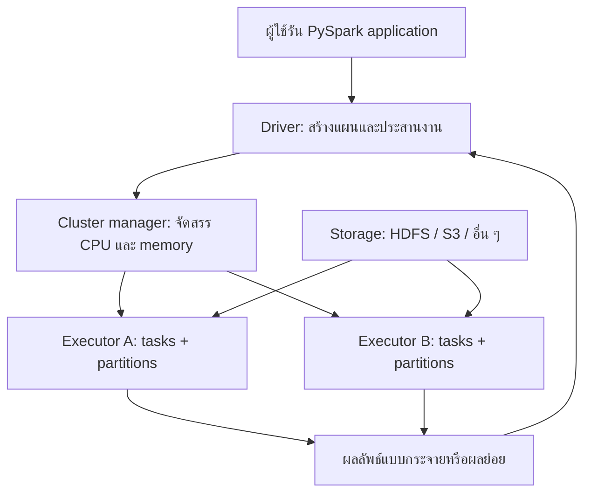
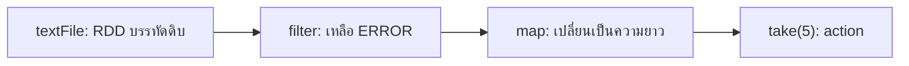
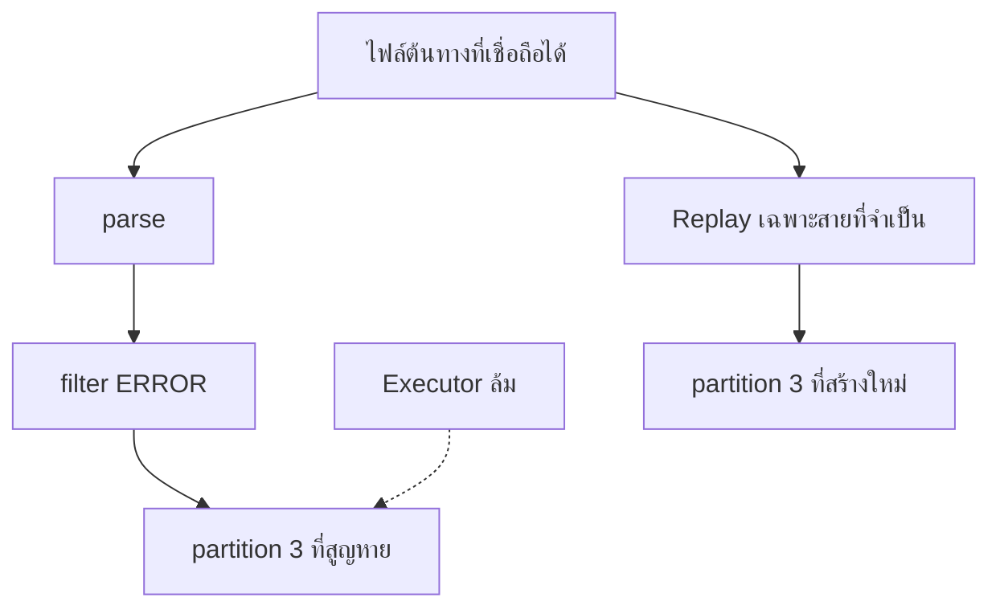

# 05 — Apache Spark: จากข้อมูลกระจายสู่การประมวลผลแบบ DAG

> เอกสารหลัก: `lecture_05_spark.pdf` จำนวน 25 หน้า  
> บทนี้เขียนเป็นบทเรียนสำหรับผู้เริ่มต้น โดยยึดหัวข้อและตัวอย่างจากเอกสาร แล้วขยายกลไกที่สไลด์กล่าวอย่างย่อ พร้อมชี้แจงจุดที่พฤติกรรมของ Spark แตกต่างจากข้อความในสไลด์

## Spark เข้ามาแก้ปัญหาอะไร

ก่อนเรียน Spark ต้องแยกคำว่า **ระบบจัดเก็บข้อมูล** ออกจาก **ระบบประมวลผลข้อมูล** ให้ชัดเจนเสียก่อน HDFS มีหน้าที่เก็บไฟล์ขนาดใหญ่แบบกระจายหลายเครื่องและทำสำเนาเพื่อรับมือกับเครื่องเสีย ส่วน Spark มีหน้าที่นำข้อมูลมาคำนวณ Spark จึงไม่ใช่สิ่งที่มาแทน HDFS และไม่ได้เป็นฐานข้อมูลที่เก็บข้อมูลถาวรด้วยตัวเอง ในระบบหนึ่ง เราอาจเก็บไฟล์ไว้ใน HDFS, Amazon S3 หรือ storage อื่น แล้วให้ Spark อ่านข้อมูลมาประมวลผล

แรงผลักดันสำคัญของ Spark มาจากข้อจำกัดของ Hadoop MapReduce แบบดั้งเดิม งาน MapReduce หนึ่งงานประกอบด้วย Map และ Reduce หากโจทย์มีหลายขั้น ผู้พัฒนามักต้องต่อหลาย MapReduce jobs เข้าด้วยกัน ผลลัพธ์ของ job แรกถูกเขียนลง storage ก่อนที่ job ถัดไปจะอ่านกลับมาทำต่อ วิธีนี้เหมาะกับ batch processing ที่ยอมรอได้ แต่มีต้นทุนสูงเมื่อต้องอ่านและเขียนข้อมูลระหว่างขั้นซ้ำ ๆ

ลองนึกถึงการฝึก machine-learning model ที่ต้องอ่านข้อมูลเดิมและปรับค่าพารามิเตอร์หลายสิบรอบ หรือการสำรวจข้อมูลแบบ interactive ที่ผู้ใช้เปลี่ยนคำถามแล้วคำนวณกับข้อมูลชุดเดิมซ้ำ หากทุก iteration ต้องเขียนผลลง HDFS แล้วอ่านกลับขึ้นมาใหม่ เวลาจำนวนมากจะหมดไปกับ I/O แทนการคำนวณ Spark จึงออกแบบมาให้สร้างสายงานหลายขั้นเป็นกราฟเดียว และสามารถเก็บข้อมูลกลางที่ต้องใช้ซ้ำไว้ใกล้การคำนวณ โดยเฉพาะใน memory ของ executor เมื่อผู้ใช้สั่ง cache หรือ persist

กล่าวอย่างสั้นที่สุด **Apache Spark คือ engine สำหรับประมวลผลข้อมูลแบบกระจาย** ผู้ใช้บอกว่าจะเปลี่ยนข้อมูลอย่างไร ส่วน Spark แบ่งงานออกเป็น task แล้วส่งไปประมวลผลแบบขนานบนเครื่องหลายเครื่อง จุดเด่นไม่ใช่เพียง “เร็วเพราะใช้ RAM” แต่เกิดจากการรวมหลายแนวคิด ได้แก่ การมองสายการคำนวณเป็น Directed Acyclic Graph (DAG), การประมวลผลแบบ lazy, การแบ่งข้อมูลเป็น partition, การนำข้อมูลกลางกลับมาใช้ซ้ำ และการกู้ partition ที่หายจาก lineage

### Spark ไม่ใช่อะไร

- Spark ไม่ใช่ storage และไม่ได้ทำสำเนาไฟล์แทน HDFS
- Spark ไม่ใช่เพียง MapReduce ที่เปลี่ยนภาษา เพราะรองรับกราฟการคำนวณหลายขั้นและ operation มากกว่า `map` กับ `reduce`
- Spark ไม่ได้ทำให้ข้อมูลทุกชุดอยู่ใน RAM โดยอัตโนมัติ ข้อมูลจะถูก cache/persist เมื่อผู้ใช้ร้องขอ และอาจถูกนำออกจาก memory เมื่อพื้นที่ไม่พอ
- การเขียน transformation ไม่ได้แปลว่า computation เกิดขึ้นทันที โดยทั่วไปต้องมี action มากระตุ้น

## ภาพรวมหนึ่งงานตั้งแต่ผู้ใช้สั่งจนได้ผลลัพธ์

เพื่อให้มองเห็นสิ่งที่เกิดขึ้นหลังคำสั่ง Python สมมติว่าเรามีไฟล์บันทึกคำจากโรงพยาบาล และต้องการนับจำนวนครั้งที่แต่ละคำปรากฏ ผู้ใช้เขียนโปรแกรม PySpark บนเครื่องหนึ่ง โปรแกรมส่วนกลางเรียกว่า **driver program** เมื่อเริ่ม application driver ติดต่อ **cluster manager** เพื่อขอ CPU และ memory จาก cluster จากนั้น cluster manager จัดสรร process ที่เรียกว่า **executor** บน worker nodes ให้ application นั้น

Driver ไม่ได้ส่งไฟล์ทั้งหมดกลับมาคำนวณเอง แต่สร้างแผนจาก transformations ที่ผู้ใช้เขียน เมื่อพบ action จึงแบ่งแผนเป็นงานย่อยหรือ **tasks** แล้วส่ง task ไปยัง executors แต่ละ executor อ่านและประมวลผล partition ที่รับผิดชอบ ผลลัพธ์ที่ยังมีขนาดใหญ่ควรคงอยู่แบบกระจายหรือเขียนไป storage ส่วนผลลัพธ์ขนาดเล็กอาจส่งกลับ driver



แผนภาพนี้ต้องอ่านโดยแยก **control flow** ออกจาก **data flow** เส้นจาก driver และ cluster manager เกี่ยวข้องกับการขอ resource การวางแผน และการสั่ง task ส่วนข้อมูลขนาดใหญ่มักไหลจาก storage ไปยัง executors โดยตรง ไม่จำเป็นต้องวิ่งผ่าน driver ทั้งหมด หากใช้ `collect()` ผลทุก element จึงค่อยถูกส่งกลับ driver ซึ่งอาจทำให้ driver memory เต็มได้

## ส่วนประกอบของ Spark application

### Driver program

Driver คือ process ที่รัน `main` ของ application และถือบริบทส่วนกลางของงาน ใน RDD API รุ่นเดิม จุดเชื่อมหลักคือ `SparkContext` ซึ่งบอก Spark ว่า application จะเชื่อมต่อ cluster อย่างไร Driver สร้าง RDD และ transformations, เก็บ lineage/DAG, เปลี่ยน action ให้เป็น job, แบ่ง job เป็น stages และ tasks, ส่ง tasks ไปยัง executors และติดตามผล

Driver จึงเป็น “ผู้วางแผนและประสานงาน” ไม่ใช่ worker ที่ควรรับข้อมูลทั้งหมดมาคำนวณเอง หาก driver หยุดทำงาน application โดยทั่วไปก็ไม่สามารถดำเนินต่อ เพราะแผนและการประสานงานของ application อยู่ที่ driver

### Cluster manager

Cluster manager เป็นระบบจัดสรรทรัพยากรให้ applications หลายตัวที่ใช้ cluster ร่วมกัน มันตัดสินใจว่า application จะได้ CPU และ memory เท่าใด และควรเปิด executor ที่ worker ใด แต่ไม่ได้เป็นผู้คำนวณ transformation ในข้อมูลเอง

สไลด์กล่าวถึง Spark Standalone, Hadoop YARN และ Apache Mesos ตามบริบทของเอกสารเดิม เอกสาร Spark ปัจจุบันแสดง Standalone, YARN และ Kubernetes เป็นตัวเลือกหลักในการ deploy ดังนั้น Mesos ควรถูกจำในฐานะบริบทของสไลด์เก่า ไม่ใช่ตัวเลือกหลักของ Spark รุ่นปัจจุบัน ดู [Spark Cluster Mode Overview](https://spark.apache.org/docs/latest/cluster-overview.html)

### Worker node และ executor

Worker node คือเครื่องใน cluster ที่มีทรัพยากรสำหรับคำนวณ ส่วน executor คือ process ที่ Spark application เปิดอยู่บน worker executor ทำสองงานสำคัญ ได้แก่ รัน tasks และเก็บ partition ที่ cache/persist ไว้ใน memory หรือ disk ของ executor

ต้องไม่สับสนว่า “หนึ่ง worker เท่ากับหนึ่ง task” เพราะ worker หนึ่งเครื่องอาจมี executor และ executor หนึ่งตัวอาจรันหลาย tasks พร้อมกันตามจำนวน cores ที่ได้รับ แต่ task หนึ่งตัวทำงานกับ partition หนึ่ง partition ใน stage นั้นเป็นหลัก

### Application, job, stage และ task

คำทั้งสี่เป็นคนละระดับกัน:

| ระดับ | ความหมาย | สิ่งที่ทำให้เกิด |
|---|---|---|
| Application | โปรแกรม Spark หนึ่งครั้ง ตั้งแต่ driver เริ่มจนจบ | `spark-submit` หรือ session ที่เปิดอยู่ |
| Job | computation ที่เริ่มเพราะ action หนึ่งครั้ง | `count()`, `collect()`, `saveAsTextFile()` เป็นต้น |
| Stage | กลุ่ม tasks ที่รันต่อเนื่องได้โดยไม่ต้อง shuffle ข้าม partition | Spark ตัดขอบ stage ตรง wide dependency/shuffle |
| Task | หน่วยงานเล็กที่ executor รันกับ partition หนึ่งส่วน | Scheduler สร้างหนึ่ง task ต่อ partition ใน stage |

ตัวอย่างเช่น ถ้าเรียก `counts.take(10)` จะเกิด job หนึ่งงาน Job อาจมีหลาย stages เพราะ `reduceByKey` ต้องจัดข้อมูลตาม key ข้าม partitions และแต่ละ stage มีหลาย tasks ตามจำนวน partitions

## Spark stack: Core และ libraries อยู่ตรงไหน

Spark Core เป็นฐานที่จัดการ distributed execution, scheduling, memory, fault recovery และ RDD API เหนือ Core มี libraries สำหรับลักษณะงานต่างกัน สไลด์กล่าวถึง Spark SQL, Spark Streaming, MLlib และ GraphX แนวคิดสำคัญคือผู้ใช้ไม่ต้องเปลี่ยนไปใช้ cluster คนละชุดเมื่อเปลี่ยนจาก query ไป machine learning; libraries เหล่านี้ใช้ execution foundation ร่วมกัน

Spark พัฒนาขึ้นบน Scala/JVM และมี API ให้ใช้งานผ่าน Scala, Java, Python และ R ตามที่สไลด์กล่าว ผู้เรียนจึงควรแยก “ภาษา front end ที่ใช้เขียนคำสั่ง” ออกจาก “distributed execution engine” ตัวอย่างในบทนี้ใช้ PySpark เพราะอ่านง่าย แต่ driver, executor, partition, transformation, action และ shuffle ยังเป็นแนวคิดของ Spark ไม่ใช่คุณสมบัติเฉพาะของ Python

| ส่วน | ใช้ทำอะไร | รูปแบบข้อมูลสำคัญ |
|---|---|---|
| Spark Core | การประมวลผลแบบกระจายระดับพื้นฐาน | RDD |
| Spark SQL | query ข้อมูลมีโครงสร้างด้วย SQL/DataFrame | DataFrame และ Dataset ในภาษาที่รองรับ |
| Structured Streaming | ประมวลผลข้อมูลที่เข้ามาต่อเนื่องด้วยแนวคิด table/query | streaming DataFrame/Dataset |
| MLlib | algorithm และ pipeline สำหรับ machine learning | DataFrame เป็น API หลักในปัจจุบัน |
| GraphX | ประมวลผล graph และ graph-parallel computation | vertices และ edges บน JVM API |

สไลด์ใช้คำว่า Spark Streaming ซึ่งหมายถึงแนวทาง DStreams รุ่นเดิม ในการใช้งานใหม่ เอกสารทางการแนะนำ Structured Streaming เป็น API หลัก ข้อแตกต่างนี้เป็นการอัปเดตจากเอกสาร ไม่ได้เปลี่ยนแนวสอบพื้นฐานของสไลด์ที่ต้องรู้ว่า Spark รองรับ batch, streaming, SQL, machine learning และ graph processing ดู [Spark Programming Guides](https://spark.apache.org/docs/latest/)

## RDD: ข้อมูลหนึ่งชุดที่ถูกแบ่งแต่ยังมองเป็นหน่วยเดียว

### เริ่มจากปัญหาก่อนนิยาม

หากมีข้อมูล 400 ล้าน records เครื่องเดียวอาจมีทั้ง memory และเวลาไม่พอ วิธีหนึ่งคือแบ่งข้อมูลเป็นสี่ส่วนแล้วให้สี่เครื่องทำงานพร้อมกัน แต่ผู้เขียนโปรแกรมไม่ต้องการจัดการไฟล์ย่อย ตำแหน่งเครื่อง และการกู้เครื่องเสียทุกครั้ง จึงต้องมี abstraction ที่ทำให้ผู้ใช้มองข้อมูลเป็น “ชุดเดียว” ขณะที่ระบบรู้ว่าข้อมูลจริงกระจายเป็นหลายส่วน

**Resilient Distributed Dataset (RDD)** คือ collection แบบ immutable ที่ถูกแบ่งเป็น partitions และกระจายให้ประมวลผลแบบขนานได้

- **Resilient** หมายถึงสามารถกู้ partition ที่หายโดยคำนวณใหม่จาก lineage ได้เมื่อเงื่อนไขเหมาะสม
- **Distributed** หมายถึง partitions สามารถอยู่และถูกคำนวณบนหลาย executors
- **Dataset** หมายถึง collection ของ records ไม่ได้จำกัดว่าต้องเป็นตาราง

RDD เป็น immutable กล่าวคือ transformation ไม่แก้ RDD เดิม แต่สร้างคำอธิบายของ RDD ใหม่ สมมติ `numbers` แทนข้อมูล `[1, 2, 3, 4]` เมื่อเขียน `doubled = numbers.map(lambda x: x * 2)` ค่าใน `numbers` ไม่ถูกแก้ให้เป็น `[2, 4, 6, 8]`; Spark สร้าง `doubled` ที่มี lineage ว่าได้จากการนำ `map` ไปใช้กับ `numbers`

### Partition คือหน่วยที่ทำให้ parallelism เกิดขึ้น

Partition คือส่วนย่อยเชิงตรรกะของ dataset Spark ส่ง task ไปทำงานต่อ partition หาก RDD มี 8 partitions stage หนึ่งจึงมีได้ 8 tasks ไม่ว่าข้อมูลจะมีหลายล้าน records ก็ตาม จำนวน partitions ส่งผลต่อ parallelism และ overhead:

- partitions น้อยเกินไปทำให้ใช้ cores ไม่ครบ และ partition ใหญ่บางส่วนอาจเป็นคอขวด
- partitions มากเกินไปทำให้มี tasks เล็กจำนวนมาก เกิด scheduling overhead
- partition ที่มีข้อมูลมากกว่าส่วนอื่นมากเรียกว่า data skew ทำให้ task นั้นจบช้าและลากเวลาของ stage ทั้งหมด

Partition ไม่เหมือน HDFS block แม้การอ่านไฟล์ HDFS อาจใช้ block boundaries ช่วยกำหนด input partitions ทั้งสองแนวคิดอยู่คนละชั้น: block เป็นหน่วยจัดเก็บของ HDFS ส่วน partition เป็นหน่วยข้อมูลที่ Spark ใช้จัดการ computation

### สร้าง RDD ได้อย่างไร

วิธีพื้นฐานมีสองแบบ แบบแรกคืออ่าน external dataset เช่น HDFS:

```python
lines = sc.textFile("hdfs:///data/events.txt")
```

ในกรณีนี้แต่ละ element ของ `lines` คือข้อความหนึ่งบรรทัด แบบที่สองคือกระจาย collection จาก driver:

```python
numbers = sc.parallelize([1, 2, 3, 4], 2)
```

เลข `2` ขอให้แบ่งเป็นสอง partitions วิธีหลังเหมาะกับข้อมูลเล็กสำหรับทดลอง ไม่เหมาะกับการสร้าง big data บน driver ก่อนแล้วค่อยกระจาย เพราะข้อมูลอาจล้น memory ของ driver ตั้งแต่ก่อน Spark เริ่มแบ่งงาน

## Transformation, action และ lazy evaluation

### Transformation บอกว่า “ข้อมูลใหม่ได้มาอย่างไร”

Transformation รับ RDD หนึ่งหรือหลายตัวแล้วคืน RDD ใหม่ เช่น `map`, `filter`, `flatMap`, `distinct`, `reduceByKey`, `sortByKey` และ `groupByKey` การเรียก transformation โดยทั่วไปยังไม่อ่านข้อมูลจริงและยังไม่สร้างผลครบทุก record แต่เพิ่มความสัมพันธ์เข้าไปใน lineage

### Action บอกว่า “ถึงเวลาต้องการผลจริงแล้ว”

Action กระตุ้นให้ Spark ประมวลผล transformations ที่จำเป็น ตัวอย่างเช่น `count`, `collect`, `take`, `takeOrdered`, `reduce`, `foreach` และการเขียนผลอย่าง `saveAsTextFile` บาง action ส่งข้อมูลขนาดเล็กกลับ driver ขณะที่บาง action ทำให้เกิด side effect หรือเขียนผลไป storage

> **จุดแก้ความเข้าใจจากสไลด์:** `reduceByKey` เป็น transformation เพราะผลลัพธ์ยังเป็น RDD แบบกระจาย ไม่ใช่ค่าที่ส่งกลับ driver ทันที ส่วน `saveAsTextFile` เป็น action เพราะทำให้ Spark เริ่ม computation และเขียน output จริง การจำจากชื่อที่มีคำว่า reduce จึงไม่พอ ต้องดูว่า operation คืน RDD ใหม่หรือคืน/เขียนผลที่ materialize แล้ว

### Lazy evaluation ไม่ใช่ “Spark ไม่ทำงาน” แต่คือ “Spark รอให้เห็นเป้าหมาย”

พิจารณาโค้ดนี้:

```python
raw = sc.textFile("events.txt")
errors = raw.filter(lambda line: "ERROR" in line)
lengths = errors.map(len)
result = lengths.take(5)
```

สามบรรทัดแรกสร้าง lineage ยังไม่จำเป็นต้องอ่านทุกบรรทัด จน `take(5)` ต้องการผล Spark จึงวางแผนงานและอาจหยุดเมื่อหา 5 records ได้เพียงพอ แนวทางนี้เปิดโอกาสให้ Spark pipeline transformations และหลีกเลี่ยงการ materialize ผลกลางทุกขั้น



ลูกศรในภาพก่อน action คือ lineage หรือ recipe ว่า RDD ถัดไปได้มาอย่างไร เมื่อ action เกิด Spark จึงนำ recipe ที่จำเป็นไปสร้าง job คำว่า DAG มาจากกราฟนี้มีทิศทางและไม่มีวงวนกลับมายัง node เดิม แม้ algorithm ภายนอกอาจเขียน loop หลาย iteration แต่ computation ของแต่ละรอบยังถูกแทนด้วย DAG ที่มีทิศทาง

เอกสารทางการยืนยันว่า transformations เป็น lazy และจะคำนวณเมื่อ action ต้องการผล รวมทั้ง transformed RDD อาจถูกคำนวณใหม่ทุกครั้งหากไม่ได้ persist ดู [RDD Programming Guide — RDD Operations](https://spark.apache.org/docs/latest/rdd-programming-guide.html#rdd-operations)

## Dependency, shuffle และการแบ่ง stage

ไม่ใช่ transformations ทุกชนิดมีต้นทุนเท่ากัน หาก output partition หนึ่งคำนวณได้จาก input partition เดียว เช่น `map` หรือ `filter` ความสัมพันธ์นี้มักเป็น **narrow dependency** Spark สามารถ pipeline operations ต่อกันภายใน stage เดียวได้

แต่ `reduceByKey`, `groupByKey`, `distinct` และ `sortByKey` มักต้องนำ records ที่เกี่ยวข้องจากหลาย input partitions มารวมไว้ที่ output partition ที่เหมาะสม การย้ายข้อมูลข้าม executors นี้เรียกว่า **shuffle** และมักเป็นขอบที่ทำให้ Spark แบ่ง stage ใหม่ Shuffle ใช้ network, serialization, memory และอาจใช้ disk จึงเป็นจุดต้นทุนและจุดเสี่ยงสำคัญ

สมมติ records `(A,1)` อยู่ partition 0 และ `(A,4)` อยู่ partition 2 การหาผลรวมของ key `A` ต้องทำให้ค่าทั้งสองไปยัง reducer partition เดียวกัน แม้ Spark จะ aggregate บางส่วนในแต่ละ partition ก่อนส่ง แต่ยังต้องมีการแลกเปลี่ยนข้อมูลตาม key

| ก่อน shuffle | การจัดปลายทาง | หลัง aggregate |
|---|---|---|
| P0: `(A,1)`, `(B,2)` | `A` ทั้งหมดไป partition เดียวกัน | `(A,5)` |
| P1: `(B,3)` | `B` ทั้งหมดไป partition เดียวกัน | `(B,5)` |
| P2: `(A,4)` | ข้อมูลเคลื่อนผ่าน network ตาม key | ผลยังเป็น RDD |

นี่คือเหตุผลที่ `reduceByKey` เหมาะกับการรวมค่าตาม key มากกว่า `groupByKey` ในหลายกรณี `groupByKey` ต้องรวบรวมค่าทั้งหมดเป็น iterable ก่อน จึงส่งและเก็บข้อมูลมากกว่า ขณะที่ `reduceByKey` สามารถรวมบางส่วนก่อน shuffle ได้ แต่ถ้าโจทย์ต้องใช้ค่าทุกรายการจริง ๆ เช่นคำนวณลำดับเหตุการณ์ที่ต้องรักษารายละเอียด การเลือก operation ต้องดูความต้องการ ไม่ใช่ห้าม `groupByKey` แบบตายตัว

## Cache และ persistence: เร็วเมื่อใช้ซ้ำ ไม่ใช่เวทมนตร์

หาก action สองครั้งใช้ RDD เดียวกัน และ RDD นั้นไม่ได้ persist Spark อาจคำนวณ lineage ใหม่สำหรับแต่ละ action:

```python
clean = raw.filter(is_valid).map(parse_record)
clean.count()
clean.take(10)
```

ถ้า `clean` แพงและต้องใช้ซ้ำ เราอาจเขียน:

```python
clean = raw.filter(is_valid).map(parse_record).cache()
clean.count()      # action แรกคำนวณและเติม cache
sample = clean.take(10)
```

คำสั่ง `cache()` เองก็ยัง lazy; cache จะถูกเติมเมื่อ action แรกคำนวณ partitions คำว่า “Spark เก็บข้อมูลใน memory” จึงต้องมีเงื่อนไขว่า RDD ถูก persist และมี memory เพียงพอ หาก partition ถูก evict Spark สามารถคำนวณใหม่จาก lineage ได้

`persist()` ให้เลือก storage level ได้ เช่น memory only, memory-and-disk หรือ disk-only ตาม API/ภาษา การ persist มีต้นทุนทั้ง memory การ serialize และการจัดการข้อมูล จึงควรใช้เมื่อข้อมูลต้องใช้ซ้ำหรือคำนวณใหม่แพง ไม่ควร cache ทุก RDD โดยอัตโนมัติ และเมื่อไม่ใช้แล้วควร `unpersist()` เพื่อคืนทรัพยากร ดู [RDD Persistence](https://spark.apache.org/docs/latest/rdd-programming-guide.html#rdd-persistence)

> **จุดแก้ความเข้าใจจากสไลด์:** RDD ไม่ได้อยู่ใน memory โดย default และ `persist()` ไม่ได้แปลว่านำ RDD ไป replicate ผ่าน HDFS เสมอ Storage level กำหนดว่าจะเก็บ partition ที่ executors อย่างไร ส่วนการตัด lineage ด้วย checkpoint ไป reliable storage เป็นอีกกลไกหนึ่ง

## Fault tolerance: ข้อมูลหายแล้ว Spark รู้วิธีสร้างใหม่ได้อย่างไร

RDD เป็น immutable และ Spark จำ lineage ว่า RDD ถูกสร้างจากข้อมูลต้นทางและ transformations ใด สมมติ `errors` partition 3 หายเพราะ executor ล้ม Spark ไม่จำเป็นต้องทำสำเนา RDD ทุก intermediate state ไว้ถาวรเสมอ แต่สามารถอ่าน input partition ที่เกี่ยวข้องแล้ว replay `filter` และ `map` เพื่อสร้าง partition 3 ใหม่



ความสามารถนี้ต้องอาศัย operation ที่ deterministic คือ input เดิมควรนำไปสู่ output เดิม หาก closure อ่านเวลาปัจจุบัน สุ่มค่าโดยไม่ควบคุม seed หรือเขียนผลข้างเคียงไป external system การ retry อาจให้ผลต่างหรือทำ side effect ซ้ำได้ Lineage ยังไม่แก้ทุก failure: หากข้อมูลต้นทางเองหายหรือ driver ล้ม การกู้ต้องอาศัยความทนทานของ storage และ deployment configuration เพิ่มเติม

เมื่อ lineage ยาวมาก การ replay ตั้งแต่ต้นอาจแพง จึงมี checkpoint สำหรับ materialize state ไป reliable storage แล้วเริ่ม lineage ใหม่จากจุดนั้น ส่วน cache/persist เน้น reuse และ performance แม้บาง storage level มี replication ได้ จึงไม่ควรใช้คำว่า checkpoint กับ cache แทนกัน

## Word Count: ติดตามหนึ่ง record ผ่านทุกขั้น

ใช้ข้อมูลเล็กนี้เพื่อมองเห็นทั้ง transformations, partitions และ shuffle:

```text
spark makes data fast
spark makes work visible
```

โค้ด PySpark แบบ RDD:

```python
from operator import add

text = sc.parallelize([
    "spark makes data fast",
    "spark makes work visible",
], 2)

words = text.flatMap(lambda line: line.split())
pairs = words.map(lambda word: (word, 1))
counts = pairs.reduceByKey(add)
result = counts.collect()
```

`text` มี element เป็นหนึ่งบรรทัด `flatMap` แยกหนึ่งบรรทัดออกเป็นหลายคำ จึงต้องใช้ `flatMap` ไม่ใช่ `map` จากนั้น `map` เปลี่ยนคำแต่ละคำเป็นคู่ `(word, 1)` ส่วน `reduceByKey` รวบรวมค่าที่มี key เดียวกันผ่าน shuffle แล้วบวกกัน สุดท้าย `collect` จึงส่งผลทั้งหมดกลับ driver

| ขั้น | ตัวอย่าง input | output ที่เกี่ยวข้อง |
|---|---|---|
| `flatMap` | `"spark makes data fast"` | `spark`, `makes`, `data`, `fast` |
| `map` | `spark` | `(spark, 1)` |
| `reduceByKey` | `(spark,1)` จาก P0 และ `(spark,1)` จาก P1 | `(spark,2)` |
| `collect` | RDD ของ counts | Python list บน driver |

ผลเชิงตรรกะคือ:

```text
(spark, 2)
(makes, 2)
(data, 1)
(fast, 1)
(work, 1)
(visible, 1)
```

ลำดับของ `collect()` ไม่ใช่สิ่งที่ควรสมมติว่าแน่นอนหากไม่ได้ sort เพราะ partitions ทำงานแบบกระจาย หากข้อสอบถามขั้นตอน ให้เน้นว่า transformations สามตัวสร้าง lineage และ `collect()` เป็น action ที่กระตุ้น job; หากเขียนผลจริงควรใช้ `saveAsTextFile()` หรือ output sink แทนการ collect ข้อมูลใหญ่

### แก้โค้ดจากสไลด์ให้รันกับ Python ปัจจุบัน

สไลด์บางหน้ามี smart quotes เช่น `‘SparkWordCount’` ซึ่งไม่ใช่เครื่องหมาย quote ของ Python และระบุ `reduceByKey` เป็น action เวอร์ชันที่เขียนได้ถูกต้องคือ:

```python
from pyspark import SparkContext


def main():
    sc = SparkContext(appName="SparkWordCount")
    input_file = sc.textFile("/user/cloudera/wc/input.txt")
    counts = (
        input_file
        .flatMap(lambda line: line.split())
        .map(lambda word: (word, 1))
        .reduceByKey(lambda a, b: a + b)
    )
    counts.saveAsTextFile("/user/cloudera/wc/output")
    sc.stop()


if __name__ == "__main__":
    main()
```

เรียกด้วย:

```bash
spark-submit --master local[*] word_count.py
```

`local[*]` หมายถึงรัน local mode และใช้ logical cores ที่มี ไม่ได้หมายถึงสร้าง cluster หลายเครื่อง ส่วน `--master yarn` ส่ง application ให้ YARN จัดสรร resource ในระบบจริงไม่ควร hard-code master ไว้ใน source code เพราะ deployment environment ควรเป็นผู้กำหนด

## ทำความเข้าใจ operations จากรูปร่างของข้อมูล

### `map`: หนึ่ง input ให้หนึ่ง output

```python
rdd = sc.parallelize([1, 2, 3, 4])
out = rdd.map(lambda x: x * 2)
# [2, 4, 6, 8]
```

จำนวน output elements โดยหลักเท่ากับ input แต่ชนิดหรือค่าจะเปลี่ยนได้ เช่น record หนึ่งตัวอาจถูกแปลงเป็น tuple หนึ่งตัว

### `filter`: เลือกบาง elements โดยไม่เปลี่ยนค่าที่ผ่าน

```python
out = rdd.filter(lambda x: x % 2 == 0)
# [2, 4]
```

ฟังก์ชันต้องคืนค่าที่ตีความเป็น boolean ถ้าเป็นจริง element เดิมจึงผ่านไป output

### `flatMap`: หนึ่ง input ให้ศูนย์ หนึ่ง หรือหลาย outputs

```python
lines = sc.parallelize(["a b", "c"])
lines.map(lambda x: x.split()).collect()
# [["a", "b"], ["c"]]

lines.flatMap(lambda x: x.split()).collect()
# ["a", "b", "c"]
```

`map` เก็บ list ของแต่ละบรรทัดเป็นหนึ่ง element ส่วน `flatMap` คลี่สมาชิกของแต่ละ list ออกมาเป็น elements ระดับเดียว จึงเหมาะกับ tokenization

### `distinct`: กำจัดค่าซ้ำแต่ต้องระวัง shuffle

```python
sc.parallelize([1, 2, 3, 2, 3]).distinct().collect()
# [1, 2, 3]  # ลำดับอาจต่างกัน
```

การรู้เพียงว่า output ไม่ซ้ำยังไม่พอ ต้องรู้ด้วยว่าค่าที่เหมือนกันอาจอยู่คนละ partition จึงต้อง shuffle เพื่อให้ระบบตัดสินความซ้ำได้ทั่ว dataset

### `reduce`: รวมทั้ง RDD ให้เป็นค่าหนึ่ง

```python
sc.parallelize([1, 2, 3, 4]).reduce(lambda a, b: a * b)
# 24
```

ฟังก์ชันที่ใช้ในการ parallel reduce ควรเป็น associative และ commutative เมื่อผลต้องไม่ขึ้นกับลำดับ เช่นการบวกและคูณจำนวนทั่วไปเหมาะกว่า `a - b` เพราะ Spark อาจจัดกลุ่มและลำดับการรวมต่างจากเครื่องเดียว การใช้ floating-point ยังอาจให้ความต่างเล็กน้อยตามลำดับการบวก

### `take`, `takeOrdered` และ `collect`

- `take(n)` ดึงไม่เกิน `n` elements กลับ driver เหมาะกับการดูตัวอย่าง
- `takeOrdered(n, key=...)` คืน `n` elements ตามลำดับที่กำหนดโดยไม่ต้องส่งทุก element กลับมาจัดอันดับเอง
- `collect()` ส่งทุก element กลับ driver ใช้เฉพาะเมื่อมั่นใจว่าผลเล็กพอ

คำถามสำคัญก่อนใช้ action คือ “ผลจะมีขนาดเท่าไรเมื่อเทียบกับ driver memory” การที่ input ถูกแบ่งหลายเครื่องไม่ได้ช่วย หากท้ายที่สุดสั่งรวบรวมหลายร้อยล้าน records กลับ process เดียว

### Operations ของ key-value RDD

`reduceByKey` รวมค่าแยกตาม key และคืน RDD ใหม่:

```python
pairs = sc.parallelize([(1, 2), (3, 4), (3, 6), (1, 3), (3, 8)])
pairs.reduceByKey(lambda a, b: a + b).collect()
# [(1, 5), (3, 18)]  # ลำดับอาจต่างกัน
```

`groupByKey` คืน `(key, iterable_of_values)` เหมาะเมื่อจำเป็นต้องเห็นสมาชิกทั้งหมด แต่ถ้าต้องการ sum ให้ใช้ `reduceByKey` เพื่อลดปริมาณข้อมูลก่อน shuffle

`sortByKey` จัดเรียงตาม key และมักต้อง shuffle การเรียงลำดับ global มีต้นทุนสูงกว่าการเรียงภายใน partition จึงควรถามก่อนว่าผู้ใช้ต้องการลำดับทั้ง dataset จริงหรือเพียง top N

### `count` และ `foreach`

`count()` คืนจำนวน elements เป็นค่าหนึ่งที่ driver ส่วน `foreach(func)` ให้ executors เรียก function กับแต่ละ element เหมาะกับ side effect ที่ออกแบบให้ปลอดภัยต่อ retry แต่ `print` ใน `foreach` บน cluster จะปรากฏใน executor logs ไม่จำเป็นต้องอยู่ใน console ของ driver และอาจออกไม่เรียงลำดับ

### Log level ช่วยลดเสียงรบกวน แต่ไม่ใช่การแก้ error

สไลด์ปิดท้ายด้วย `sc.setLogLevel(level)` เช่น `ERROR` หรือ `WARN` คำสั่งนี้เปลี่ยนระดับข้อความ log ที่แสดง จึงช่วยให้มองเห็นข้อความสำคัญง่ายขึ้นระหว่างเรียน แต่การตั้ง `ERROR` ไม่ได้ทำให้ warning หรือปัญหาที่ซ่อนอยู่หายไป เพียงลดข้อความที่ปรากฏเท่านั้น ในการวิเคราะห์ failure จริงควรเก็บ executor logs, stage/task failure และ exception ต้นเหตุไว้ ไม่ควรปิด log เพียงเพื่อให้หน้าจอดูสะอาด

```python
sc.setLogLevel("ERROR")
```

## Closure และ shared variables

### Closure คืออะไรจริง ๆ

Closure คือฟังก์ชันพร้อมค่าจาก scope ภายนอกที่ฟังก์ชันอ้างถึง Spark serialize ฟังก์ชันและค่าที่เกี่ยวข้องจาก driver แล้วส่งสำเนาไปให้ executors ตัวอย่าง:

```python
threshold = 100
high = amounts.filter(lambda x: x >= threshold)
```

`threshold` ถูก capture ไปพร้อม closure แต่ worker ไม่ได้ถือ reference กลับมายังตัวแปรเดียวกันบน driver หากแก้ตัวแปรธรรมดาภายใน task แล้วหวังให้ driver เห็นค่ารวม ผลจะไม่เป็นไปตามที่คิด

> **จุดแก้ความเข้าใจจากสไลด์:** closure ไม่ได้หมายถึงฟังก์ชันที่ “ห้ามพึ่ง external variables” ตรงกันข้าม closure สามารถ capture ตัวแปรจาก lexical scope ได้ ปัญหาคือแต่ละ executor ได้ serialized copy ไม่ใช่ shared mutable variable เดียวกัน

### Broadcast variable: ส่งข้อมูลอ่านอย่างเดียวให้แต่ละ executor อย่างมีประสิทธิภาพ

หาก lookup table ขนาดพอเหมาะถูกใช้ใน tasks จำนวนมาก การ capture table ตรง ๆ อาจทำให้ Spark ส่งสำเนาซ้ำไปกับหลาย tasks Broadcast variable ทำให้ Spark แจกค่าที่อ่านอย่างเดียวและเก็บไว้ให้ tasks บน executor ใช้ร่วมกัน:

```python
labels = sc.broadcast({1: "normal", 2: "urgent"})
result = codes.map(lambda code: labels.value.get(code, "unknown"))
```

Broadcast เหมาะกับข้อมูลด้าน lookup ที่เล็กพอจะอยู่บนแต่ละ executor ไม่ใช่วิธีทำให้ dataset ขนาดใหญ่กลายเป็น shared memory และ worker ไม่ควรแก้ `labels.value`

### Accumulator: ให้ workers เพิ่มค่า แต่ driver เป็นผู้อ่านผล

Accumulator ใช้เก็บ counter หรือผลรวมจาก tasks เช่นนับ records ที่ parse ไม่ผ่าน:

```python
bad_records = sc.accumulator(0)

def parse(line):
    global bad_records
    try:
        return int(line)
    except ValueError:
        bad_records += 1
        return None

parsed = lines.map(parse).filter(lambda x: x is not None)
parsed.count()
print(bad_records.value)
```

ค่า accumulator มีความหมายหลัง action ทำให้ tasks รันแล้ว และไม่ควรใช้ accumulator เพื่อควบคุม logic ของ transformations เพราะ tasks อาจ retry หรือคำนวณซ้ำ ทำให้การอัปเดตและเวลาที่มองเห็นค่าซับซ้อน ใช้สำหรับ monitoring/diagnostics มากกว่าสร้างผลลัพธ์ธุรกิจหลัก เอกสารทางการอธิบาย broadcast และ accumulator ใน [Shared Variables](https://spark.apache.org/docs/latest/rdd-programming-guide.html#shared-variables)

## การอ่าน execution อย่างเป็นเหตุเป็นผล

พิจารณา:

```python
sales = sc.textFile("sales.csv")
valid = sales.filter(is_valid)
pairs = valid.map(lambda line: (hospital_id(line), amount(line)))
totals = pairs.reduceByKey(lambda a, b: a + b)
top10 = totals.takeOrdered(10, key=lambda x: -x[1])
```

การอธิบายที่ครบต้องไม่พูดเพียงชื่อ operations แต่ต้องตามลำดับดังนี้:

1. `textFile` นิยาม RDD ของบรรทัดจาก storage
2. `filter` และ `map` เป็น narrow transformations ที่สามารถ pipeline ใน stage แรก
3. `reduceByKey` ต้องรวม amount ของ hospital เดียวกัน แม้กระจายอยู่หลาย partitions จึงเกิด shuffle และขอบ stage
4. แต่ละ output partition รวมค่าตาม key และได้ RDD `totals`
5. `takeOrdered` เป็น action จึงกระตุ้น job และส่งเฉพาะ 10 records สุดท้ายกลับ driver

หาก task ก่อน shuffle ล้ม Spark rerun partition ที่เกี่ยวข้อง หาก input hospital หนึ่งมี records มากผิดปกติ partition ปลายทางอาจ skew หาก `is_valid` เรียกบริการภายนอกและมี side effect การ retry อาจเรียกซ้ำ นี่คือการเชื่อม architecture, lineage และ operation semantics เข้าด้วยกัน

## เลือก Spark เมื่อใด และต้องแลกกับอะไร

Spark เหมาะเมื่อข้อมูลใหญ่จนต้องประมวลผลแบบกระจาย งานมี transformations หลายขั้น มีการใช้ข้อมูลเดิมซ้ำ ต้องการ batch, SQL, streaming หรือ machine learning บน execution platform เดียวกัน หรือ latency ของชุด MapReduce jobs แบบเขียน intermediate ลง disk ไม่ตอบโจทย์

แต่ distributed computing มีต้นทุน Spark ไม่จำเป็นต้องเร็วกว่า Python หรือ SQL บนเครื่องเดียวสำหรับข้อมูลเล็ก เพราะมีค่าเริ่ม driver/executors, scheduling, serialization, network และ shuffle ผู้ใช้ยังต้องดู partitioning, skew, memory, data locality และจำนวนข้อมูลที่ส่งกลับ driver การเพิ่ม nodes ไม่ทำให้งานเร็วแบบเส้นตรงเสมอ เพราะบางส่วนทำขนานไม่ได้และ communication overhead เพิ่มขึ้น

อีกประเด็นคือ RDD เป็น API ระดับต่ำที่ช่วยให้เห็นกลไกของ Spark ชัด แต่สำหรับข้อมูลแบบตาราง งานใหม่จำนวนมากเหมาะกับ DataFrame/Spark SQL มากกว่า เพราะ schema ทำให้ optimizer เข้าใจและปรับแผนได้ อย่างไรก็ตามการเรียน RDD ยังมีคุณค่าในการทำความเข้าใจ partition, lazy execution, action, shuffle, closure และ fault tolerance ซึ่งอยู่ใต้ mental model ของ Spark ทั้งระบบ

## ความเข้าใจผิดที่พบบ่อย

| ความเข้าใจผิด | ความเข้าใจที่ถูกต้อง |
|---|---|
| Spark เก็บข้อมูลทั้งหมดใน RAM | Spark คำนวณแบบกระจายและสามารถ cache/persist ข้อมูลที่ต้องใช้ซ้ำ; memory ไม่พออาจ evict หรือใช้ storage level อื่น |
| Transformation รันทันที | โดยทั่วไป transformation สร้าง lineage; action กระตุ้น job |
| `reduceByKey` เป็น action เพราะมีคำว่า reduce | `reduceByKey` คืน RDD จึงเป็น transformation; `reduce` คืนค่าที่ driver จึงเป็น action |
| Driver คำนวณข้อมูลทั้งหมด | Executors รัน tasks บน partitions; driver วางแผนและรับเฉพาะผลที่ action ต้องส่งกลับ |
| เพิ่มเครื่องแล้วเร็วขึ้นเสมอ | ความเร็วขึ้นกับ parallel fraction, partitioning, skew, shuffle และ overhead |
| Cache ทุกอย่างทำให้งานเร็ว | Cache ใช้ memory และมีต้นทุน ควร cacheเฉพาะสิ่งที่ใช้ซ้ำหรือคำนวณใหม่แพง |
| Executor แก้ตัวแปร Python บน driver ได้ | Closure ได้สำเนา; ใช้ broadcast สำหรับข้อมูลอ่านอย่างเดียวและ accumulator สำหรับ counter แบบจำกัด |
| Lineage ป้องกันความเสียหายทุกชนิด | Lineage ช่วย recompute partition แต่ต้องมีต้นทางที่ยังใช้ได้และ computation ที่เหมาะกับการ replay |

## สรุปแนวคิดทั้งบท

Spark แยก storage ออกจาก computation แล้วให้ driver วางแผนการคำนวณเป็น DAG cluster manager จัดสรรทรัพยากร และ executors รัน tasks บน partitions RDD ทำให้ข้อมูลที่กระจายหลายเครื่องถูกมองเป็น collection เดียวที่ immutable และมี lineage Transformation สร้าง RDD ใหม่แบบ lazy ส่วน action เป็นจุดที่ต้องการผลจริงและทำให้เกิด job

ประสิทธิภาพของ Spark มาจากการหลีกเลี่ยง disk I/O ที่ไม่จำเป็น การ pipeline narrow transformations การ cache ข้อมูลที่ใช้ซ้ำอย่างเหมาะสม และการทำงานแบบขนาน ไม่ได้มาจาก RAM เพียงอย่างเดียว Shuffle เป็นจุดที่ข้อมูลข้าม partitions และมีต้นทุนสูง ส่วน fault tolerance ของ RDD อาศัย lineage เพื่อคำนวณ partition ที่สูญหายใหม่

เมื่อเขียนโปรแกรม Spark จึงควรถามอยู่เสมอว่า ข้อมูลถูกแบ่งอย่างไร operation นี้คืน RDD หรือผลที่ materialize แล้ว เกิด shuffle หรือไม่ ผลถูกส่งกลับ driver มากเท่าใด RDD นี้ถูกใช้ซ้ำพอที่จะ cache หรือไม่ และหาก task ถูก retry ฟังก์ชันยังให้ผลถูกต้องหรือไม่

## แนวข้อสอบเขียนตอบพร้อมคำตอบ

### ข้อ 1: จงอธิบายว่า Spark แก้ข้อจำกัดของ Hadoop MapReduce อย่างไร

**คำตอบสำหรับเขียนสอบ:** Hadoop MapReduce แบบดั้งเดิมเหมาะกับ batch processing แต่ workflow หลายขั้นต้องเขียน intermediate result ลง HDFS แล้วให้ job ถัดไปอ่านกลับ ทำให้ iterative และ interactive workload เสียเวลากับ disk I/O มาก Spark เป็น distributed computation engine ที่มองสายงานหลายขั้นเป็น DAG และใช้ lazy evaluation เพื่อวางแผนก่อนรัน ข้อมูลกลางที่ต้องใช้ซ้ำสามารถ cache/persist บน executors ได้ จึงลดการอ่านเขียนซ้ำ Spark ยังมี operations และ libraries มากกว่า Map กับ Reduce อย่างไรก็ตาม Spark ไม่ใช่ storage และไม่ได้เก็บทุกอย่างใน RAM โดยอัตโนมัติ ประสิทธิภาพยังขึ้นกับ partition, shuffle, skew และทรัพยากรของ cluster

### ข้อ 2: จงอธิบายส่วนประกอบของ Spark application และลำดับการทำงาน

**คำตอบสำหรับเขียนสอบ:** Spark application มี driver เป็นผู้รัน main สร้าง DAG และประสานงาน Driver ติดต่อ cluster manager เพื่อขอ CPU และ memory จากนั้น cluster manager เปิด executors บน worker nodes เมื่อพบ action driver แบ่ง job เป็น stages ตามขอบ shuffle และแบ่งแต่ละ stage เป็น tasks ตาม partitions Executors รัน tasks กับข้อมูลที่อ่านจาก storage หรือ partition ก่อนหน้า และอาจเก็บ partition ที่ cache ไว้ ผลขนาดเล็กส่งกลับ driver ส่วนผลขนาดใหญ่ควรคงแบบกระจายหรือเขียนลง storage หาก executor ล้ม Spark สามารถใช้ lineage สร้าง partition ที่หายใหม่ได้ แต่ถ้า driver ล้ม application โดยทั่วไปหยุดเพราะแผนและการประสานงานอยู่ที่ driver

### ข้อ 3: RDD คืออะไร และเหตุใดจึงเรียกว่า resilient

**คำตอบสำหรับเขียนสอบ:** RDD หรือ Resilient Distributed Dataset คือ collection แบบ immutable ที่แบ่งเป็น partitions และประมวลผลขนานบนหลาย executors Transformation ไม่แก้ RDD เดิม แต่สร้าง RDD ใหม่พร้อม lineage ที่บอกว่ามาจาก input และ operations ใด คำว่า resilient หมายถึงเมื่อ executor ล้มและ partition สูญหาย Spark สามารถ replay operations ตาม lineage จากข้อมูลต้นทางเพื่อสร้างเฉพาะ partition นั้นใหม่ได้ ข้อจำกัดคือต้นทางต้องยังใช้ได้และ operation ควร deterministic; lineage ไม่ได้แทนการป้องกันข้อมูลต้นทางหรือ driver failure ทุกกรณี

### ข้อ 4: Transformation กับ action ต่างกันอย่างไร พร้อมอธิบาย lazy evaluation

**คำตอบสำหรับเขียนสอบ:** Transformation รับ RDD แล้วสร้าง RDD ใหม่ เช่น `map`, `filter`, `flatMap` และ `reduceByKey` โดยปกติยังไม่คำนวณผลทันที แต่เพิ่มขั้นใน lineage ส่วน action ต้องการผลที่ materialize แล้วหรือมีการเขียน output เช่น `count`, `collect`, `take`, `reduce` และ `saveAsTextFile` จึงกระตุ้นให้ Spark สร้าง job Lazy evaluation ทำให้ Spark มอง transformations ทั้งสายก่อนรัน สามารถ pipeline ขั้นที่ต่อกันและไม่สร้าง intermediate data ที่ไม่จำเป็น ตัวอย่าง Word Count จะนิยาม `flatMap`, `map` และ `reduceByKey` ก่อน แล้ว `collect` หรือ `saveAsTextFile` จึงทำให้ computation เริ่มจริง

### ข้อ 5: อธิบาย Word Count ใน Spark ตั้งแต่ input ถึง output

**คำตอบสำหรับเขียนสอบ:** เริ่มจาก `textFile` สร้าง RDD ที่แต่ละ element เป็นหนึ่งบรรทัด `flatMap` แยกแต่ละบรรทัดเป็นหลายคำ `map` เปลี่ยนแต่ละคำเป็นคู่ `(word,1)` จากนั้น `reduceByKey` จัดค่าที่มีคำเดียวกันไปยัง partition เดียวกันผ่าน shuffle และบวกจำนวน ได้ RDD ของ `(word,count)` สุดท้าย `saveAsTextFile` เขียนผลแบบกระจายหรือ `collect` ส่งผลกลับ driver Transformations ก่อนหน้าเป็น lazy และ action สุดท้ายเป็นตัวกระตุ้น job ถ้าข้อมูลใหญ่ไม่ควรใช้ `collect` เพราะผลทั้งหมดอาจทำให้ driver memory เต็ม

### ข้อ 6: Broadcast variable และ accumulator แก้ปัญหาอะไร

**คำตอบสำหรับเขียนสอบ:** ปกติ closure และตัวแปรที่อ้างถึงถูก serialize เป็นสำเนาไปยัง tasks จึงไม่ใช่ shared mutable state Broadcast variable ใช้แจกข้อมูลอ่านอย่างเดียว เช่น lookup table ให้ executors ใช้ร่วมกันอย่างมีประสิทธิภาพ แทนการส่งสำเนาซ้ำไปกับทุก task ส่วน accumulator ให้ workers เพิ่มค่าด้วย operation ที่รองรับ และให้ driver อ่านผล เหมาะกับ counter เช่นจำนวน bad records ไม่ควรใช้ accumulator ควบคุม business logic เพราะ tasks อาจถูก retry และค่าอาจยังไม่พร้อมก่อน action รัน

### ข้อ 7: เหตุใด shuffle จึงสำคัญต่อประสิทธิภาพ

**คำตอบสำหรับเขียนสอบ:** Shuffle คือการจัดและย้าย records ข้าม partitions เพื่อให้ข้อมูลที่สัมพันธ์กัน เช่น key เดียวกัน ไปยัง output partition ที่เหมาะสม เกิดใน operations เช่น `reduceByKey`, `groupByKey`, `distinct` และ `sortByKey` Shuffle ใช้ network, serialization, memory และอาจใช้ disk จึงทำให้ Spark แบ่ง stage และมักเป็นจุดช้า หาก key บางค่ามีข้อมูลมากจะเกิด skew ทำให้ task หนึ่งใช้เวลานานกว่าส่วนอื่น สำหรับการ aggregate ควรใช้ `reduceByKey` แทน `groupByKey` เมื่อทำได้ เพราะสามารถรวมข้อมูลบางส่วนก่อนส่งผ่าน network

### ข้อ 8: จงเปรียบเทียบ cache/persist กับ lineage

**คำตอบสำหรับเขียนสอบ:** Lineage คือสูตรหรือกราฟที่บอกว่า RDD สร้างจาก input และ transformations ใด ใช้คำนวณ partition ที่หายใหม่และเกิดขึ้นตามการสร้าง RDD ส่วน cache/persist เป็นคำสั่งให้เก็บ partition ที่คำนวณแล้วตาม storage level เพื่อใช้ซ้ำได้เร็วขึ้น Cache เหมาะเมื่อ RDD ถูกใช้หลาย actions หรือคำนวณใหม่แพง แต่ใช้ memory/disk และไม่ควรทำกับทุก RDD หาก cache หาย Spark ยังอาศัย lineage คำนวณใหม่ได้ ดังนั้น lineage เน้นความสามารถในการสร้างใหม่ ส่วน persistence เน้นลดเวลาการคำนวณซ้ำ

## References

- เอกสารประกอบการสอน `lecture_05_spark.pdf`, หน้า 1–25
- Apache Spark, [RDD Programming Guide](https://spark.apache.org/docs/latest/rdd-programming-guide.html)
- Apache Spark, [Cluster Mode Overview](https://spark.apache.org/docs/latest/cluster-overview.html)
- Apache Spark, [Spark Documentation and Programming Guides](https://spark.apache.org/docs/latest/)
