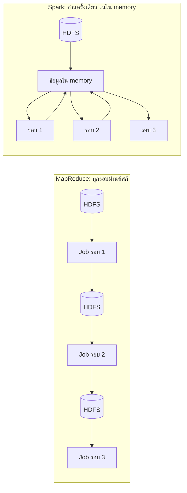
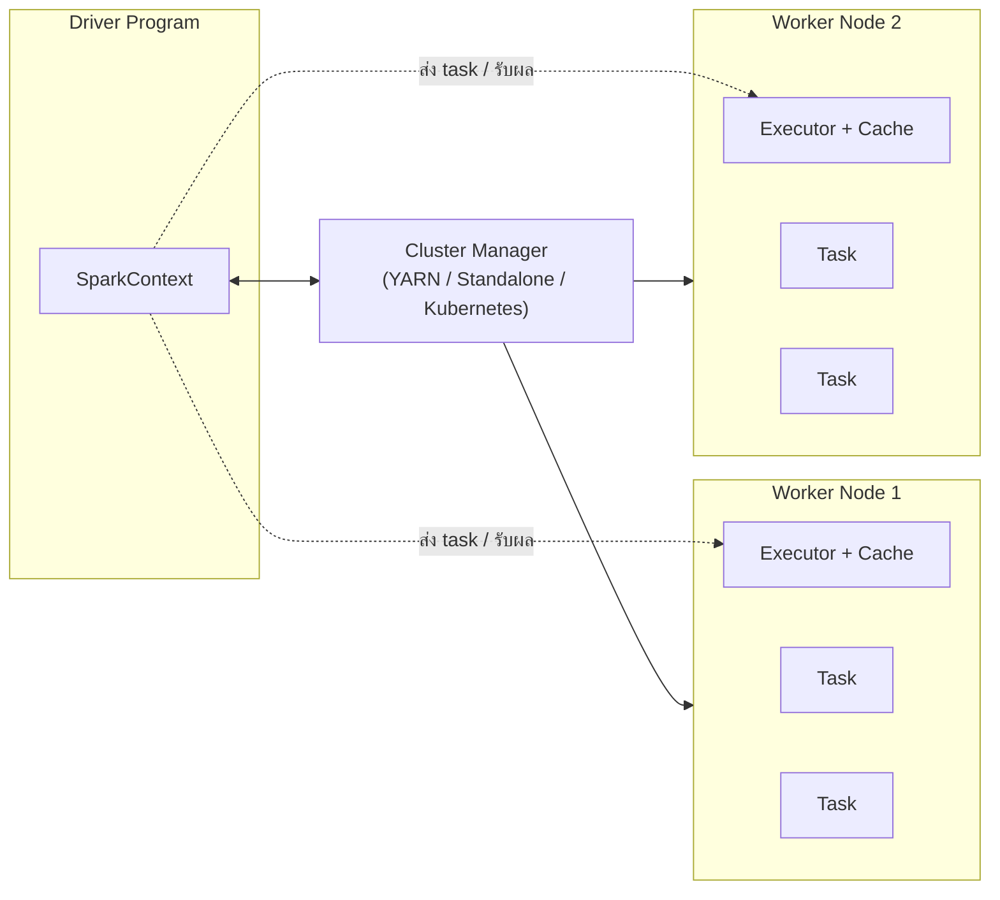
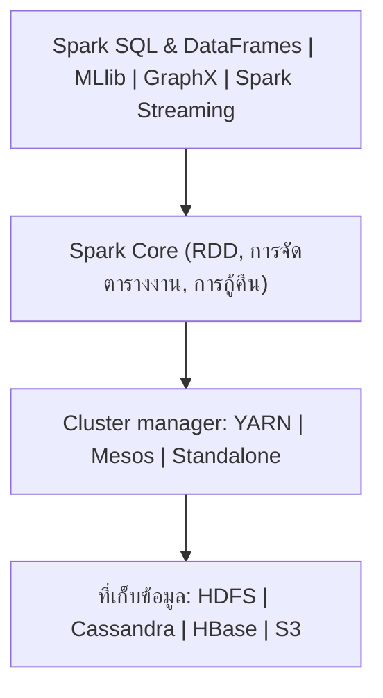
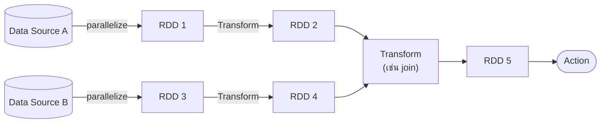
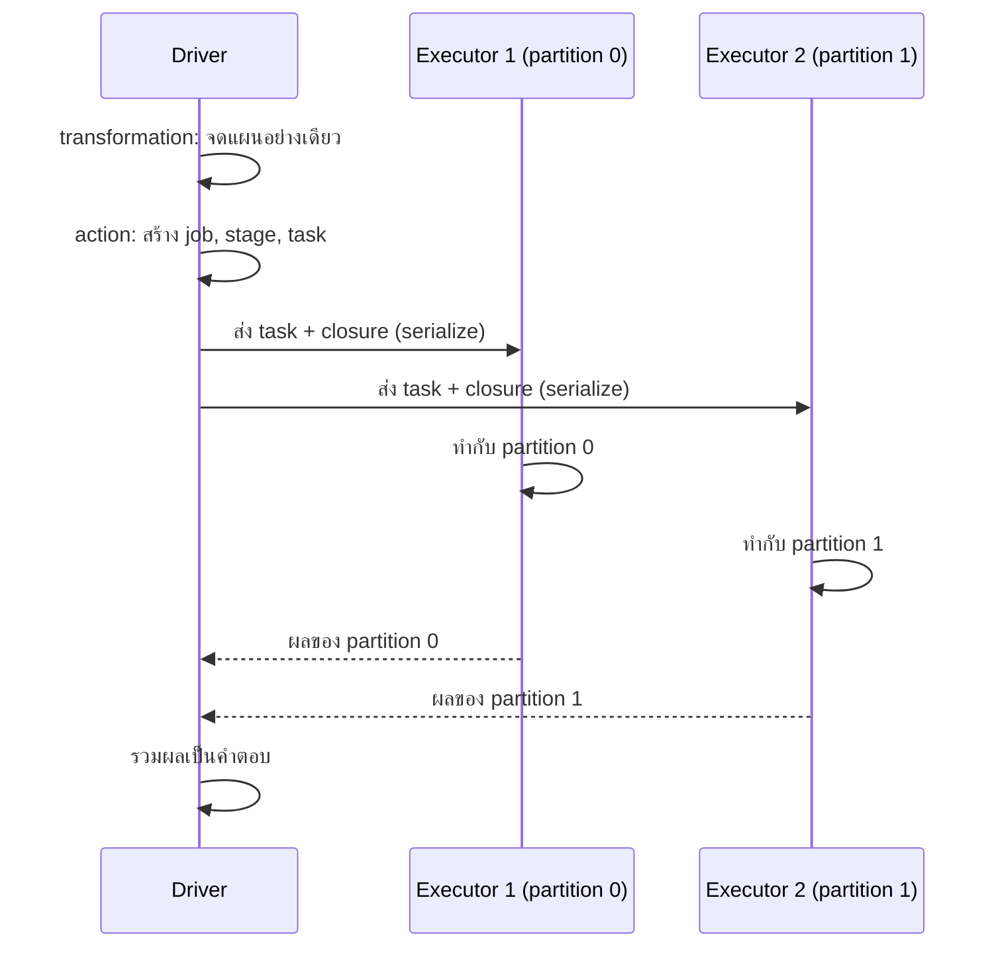
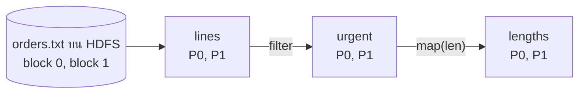
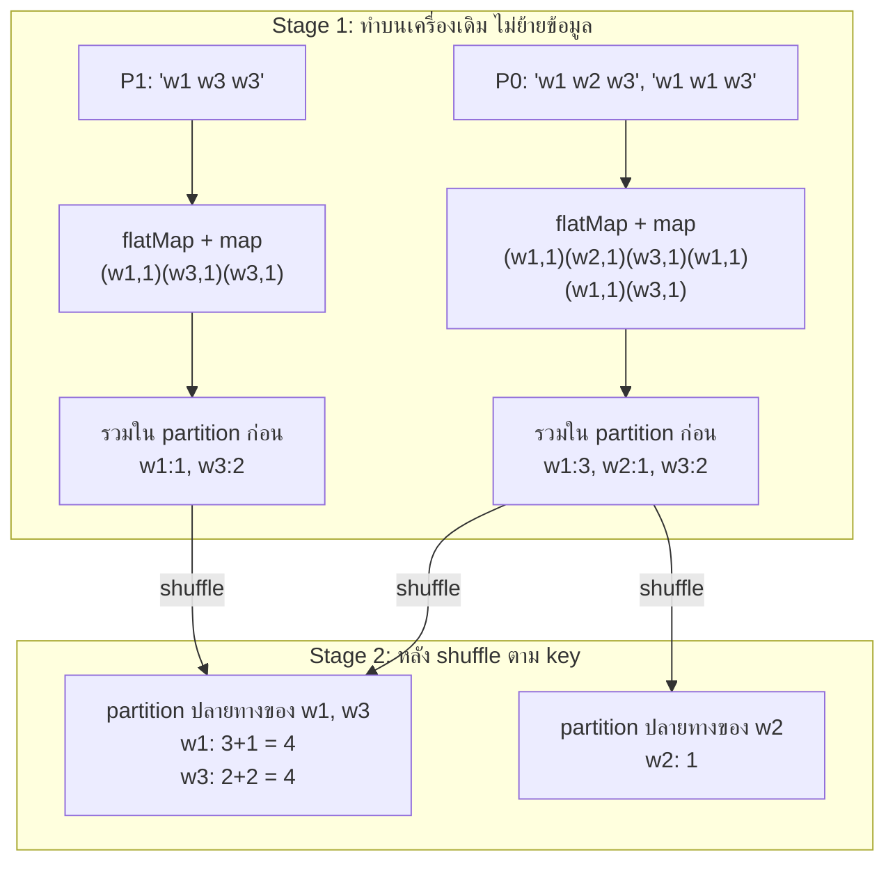

# Apache Spark และ RDD

**แก่นของบท:** Spark คือเครื่องมือประมวลผลข้อมูลแบบกระจายหลายเครื่อง ที่เร็วกว่า MapReduce เพราะเก็บข้อมูลระหว่างทางไว้ในหน่วยความจำ (memory) แทนการเขียนลงดิสก์ทุกขั้น และวางแผนงานทั้งหมดก่อนลงมือทำจริง โดยใช้โครงสร้างข้อมูลหลักชื่อ RDD ที่แก้ไขไม่ได้และจำวิธีสร้างตัวเองไว้ จึงกู้คืนได้เมื่อเครื่องใดเครื่องหนึ่งล้ม

**วิธีอ่าน:** ถ้าเพิ่งเริ่ม ให้อ่านตามลำดับ Part 0 ถึง Part 9 ก่อน เพราะแต่ละส่วนใช้ศัพท์จากส่วนก่อนหน้า จากนั้นค่อยอ่าน Part 10 (คู่มือคำสั่งแต่ละตัว) และทำโจทย์ท้ายบท ถ้ากลับมาทบทวนก่อนสอบ ให้เริ่มที่ Cheat sheet แล้วย้อนกลับไปหัวข้อที่ยังตอบโจทย์ไม่ได้

---

## Part 0 ปูพื้นฐาน: ศัพท์ที่ต้องรู้ก่อน

บทนี้ใช้ศัพท์จากเรื่อง Hadoop และ MapReduce อยู่บ้าง ตารางนี้ให้ความหมายสั้นๆ ไว้ก่อน แต่ละคำจะถูกอธิบายละเอียดอีกครั้งเมื่อถึงหัวข้อของมัน

| ศัพท์ | ความหมายสั้น |
|---|---|
| Cluster | กลุ่มคอมพิวเตอร์หลายเครื่องที่ทำงานร่วมกันเหมือนเป็นระบบเดียว |
| Node | คอมพิวเตอร์หนึ่งเครื่องใน cluster |
| HDFS | ระบบไฟล์ของ Hadoop ที่แบ่งไฟล์ใหญ่เป็นก้อน (block) แล้วกระจายเก็บหลายเครื่อง พร้อมทำสำเนา |
| MapReduce | โมเดลประมวลผลของ Hadoop ที่แบ่งงานเป็นขั้น Map (แปลงทีละรายการ) และ Reduce (รวมผลตาม key) |
| YARN | ตัวจัดสรรทรัพยากร (CPU, memory) ของ Hadoop ว่างานไหนได้เครื่องไหน เท่าไร |
| Partition | ชิ้นส่วนหนึ่งของข้อมูลที่ถูกแบ่งเพื่อให้หลายเครื่องทำพร้อมกัน เป็นหน่วยเล็กสุดของการขนานงานใน Spark |
| Driver program | โปรแกรมหลักที่ผู้ใช้เขียน ทำหน้าที่วางแผนและสั่งงาน |
| Executor | โปรเซสที่รันบนเครื่องลูก (worker node) ทำงานจริงและเก็บข้อมูล cache |
| Task | งานชิ้นเล็กสุดที่ส่งให้ executor ทำ โดยหนึ่ง task ทำงานกับหนึ่ง partition |
| RDD (Resilient Distributed Dataset) | ชุดข้อมูลแบบกระจายที่แก้ไขไม่ได้ ซึ่งเป็นโครงสร้างข้อมูลหลักของ Spark |
| Transformation | คำสั่งที่สร้าง RDD ใหม่จาก RDD เดิม ยังไม่คำนวณจริงทันที |
| Action | คำสั่งที่ต้องการผลลัพธ์จริง ทำให้ Spark เริ่มคำนวณ |
| Lazy evaluation | การเลื่อนการคำนวณไว้จนกว่าจะมี action |
| DAG (Directed Acyclic Graph) | แผนภาพลำดับขั้นของงานที่มีทิศทางและไม่วนกลับ ใช้แทนแผนการคำนวณ |
| Shuffle | การย้ายข้อมูลข้ามเครื่องเพื่อให้ข้อมูลที่มี key เดียวกันไปอยู่ที่เดียวกัน เป็นขั้นที่แพงที่สุด |
| Lineage | ประวัติว่า RDD หนึ่งถูกสร้างมาจาก RDD ใดด้วยคำสั่งอะไร |
| Closure | ฟังก์ชันที่ส่งเข้าไปในคำสั่ง Spark พร้อมตัวแปรภายนอกที่มันอ้างถึง |
| Lambda | ฟังก์ชันสั้นไม่มีชื่อใน Python เช่น `lambda x: x * 2` แปลว่ารับ x แล้วคืน x คูณ 2 |
| REPL | Read-Evaluate-Print Loop หน้าจอพิมพ์คำสั่งแล้วเห็นผลทันที |

---

## Part 1 ทำไมต้องมี Spark

### 1.1 ปัญหาของ MapReduce

สมมติว่าเรามีข้อมูลรายการสั่งซื้อ 1,000 ล้านแถวเก็บอยู่บน HDFS และต้องการทำงานสองแบบ

**งานแบบที่ 1: คำถามต่อเนื่องแบบโต้ตอบ (interactive)** นักวิเคราะห์อยากถามว่า "ยอดซื้อรวมแยกตามผู้ขายเป็นเท่าไร" ได้คำตอบแล้วอยากถามต่อว่า "แล้วเฉพาะเดือนมีนาคมล่ะ" และ "ผู้ขาย 10 อันดับแรกล่ะ" ทุกคำถามใช้ข้อมูลชุดเดิม

**งานแบบที่ 2: อัลกอริทึมที่วนซ้ำ (iterative)** อัลกอริทึม machine learning เช่น logistic regression ต้องอ่านข้อมูลชุดเดิมซ้ำหลายสิบรอบ แต่ละรอบปรับค่าพารามิเตอร์ให้ดีขึ้นทีละนิด

MapReduce ออกแบบมาสำหรับงานแบบ batch คือรันครั้งเดียวจบ โดยมีหลักว่าผลระหว่างทางของแต่ละ job ต้องเขียนกลับลง HDFS ก่อน แล้ว job ถัดไปค่อยอ่านขึ้นมาใหม่ หลักนี้ทำให้ระบบทนต่อความล้มเหลว (ถ้าเครื่องพัง ผลระหว่างทางยังอยู่บนดิสก์และมีสำเนา) และประสานงานง่าย แต่มีราคาที่ต้องจ่าย เพราะการอ่านเขียนดิสก์และการทำสำเนาข้ามเครือข่ายช้ากว่าการอ่านจาก memory มาก

ดังนั้นในงานแบบที่ 2 ถ้าต้องวน 20 รอบ MapReduce ต้องอ่านข้อมูลจาก HDFS 20 ครั้งและเขียนผลลง HDFS 20 ครั้ง ทั้งที่ข้อมูลตั้งต้นไม่ได้เปลี่ยนเลย ส่วนงานแบบที่ 1 ทุกคำถามใหม่คือ job ใหม่ที่ต้องอ่านข้อมูลจากดิสก์ทั้งก้อนอีกครั้ง ทำให้รอคำตอบนานจนใช้แบบโต้ตอบไม่ได้



วิธีอ่านแผนภาพ: ฝั่งซ้ายทุกลูกศรระหว่าง Job ต้องผ่านกล่อง HDFS ซึ่งหมายถึงการเขียนดิสก์แล้วอ่านกลับ ฝั่งขวาอ่านจาก HDFS แค่ครั้งแรก จากนั้นทุกรอบหยิบข้อมูลจาก memory ที่เก็บไว้แล้ว

### 1.2 Spark แก้ปัญหาอย่างไร

Spark แก้ด้วยสองความคิดหลัก

1. **เก็บข้อมูลไว้ใน memory ของเครื่องใน cluster** (เรียกว่า caching) ข้อมูลที่ใช้ซ้ำจะถูกอ่านจากดิสก์ครั้งเดียว แล้วรอบต่อๆ ไปอ่านจาก memory การแชร์ข้อมูลผ่าน memory โดยทั่วไปเร็วกว่าผ่านเครือข่ายและดิสก์หลายสิบถึงร้อยเท่า (ตัวเลข 10-100 เท่าเป็นตัวเลขที่อ้างกันทั่วไปจากงานวิจัยต้นทางของ Spark ความเร็วจริงขึ้นกับงานและขนาดข้อมูล) [Zaharia et al., NSDI 2012](https://www.usenix.org/conference/nsdi12/technical-sessions/presentation/zaharia)
2. **มองงานทั้งชุดเป็นแผนเดียว** ผู้ใช้เขียนลำดับขั้นยาวๆ ได้โดยไม่ต้องหั่นเป็น MapReduce job หลายตัว Spark จะรวบขั้นต่างๆ เป็นแผนภาพ DAG แล้วตัดสินเองว่าจะส่งงานไปทำที่ไหน ขั้นไหนรวบทำต่อเนื่องได้โดยไม่ต้องพักข้อมูล

ข้อควรรู้: Spark ไม่ได้เร็วกว่า MapReduce เสมอ ถ้างานอ่านข้อมูลครั้งเดียวผ่านไปเลยและข้อมูลใหญ่กว่า memory มาก ข้อได้เปรียบเรื่อง memory จะลดลง จุดที่ Spark ชนะชัดคืองานที่ใช้ข้อมูลซ้ำ (iterative และ interactive)

### สรุปหัวข้อ

| ประเด็น | MapReduce | Spark |
|---|---|---|
| ผลระหว่างทาง | เขียนลง HDFS ทุก job | เก็บใน memory ได้ ส่งต่อขั้นถัดไปโดยตรง |
| การเขียนงานหลายขั้น | ต้องแตกเป็นหลาย job | เขียนต่อกันเป็น pipeline เดียว |
| งานวนซ้ำ / โต้ตอบ | ช้า เพราะอ่านดิสก์ซ้ำ | เร็ว เพราะ cache ไว้ |
| ความทนทานต่อความล้มเหลว | ได้จากสำเนาบนดิสก์ | ได้จาก lineage (คำนวณใหม่) |

---

## Part 2 Spark คืออะไร และไม่ใช่อะไร

### 2.1 นิยาม

**Apache Spark** คือเครื่องมือประมวลผลข้อมูลแบบกระจาย (distributed computing engine) สำหรับงานทั่วไป (general purpose) หมายถึงไม่ได้จำกัดแค่ map กับ reduce แต่มีคำสั่งสำเร็จรูปจำนวนมาก เช่น filter (คัดกรอง), join (เชื่อมตาราง), sample (สุ่มตัวอย่าง), collect (ดึงผลกลับ) ตัว Spark เขียนด้วยภาษา Scala และมี API ให้ใช้จากภาษา Scala, Java, Python และ R [Spark Overview](https://spark.apache.org/docs/latest/)

ความหมายของ "API สำหรับการเขียนโปรแกรมแบบกระจาย" คือ ผู้ใช้เขียนโค้ดเหมือนจัดการข้อมูลก้อนเดียว เช่น "เอาทุกบรรทัดมาแยกคำ" แล้ว Spark รับผิดชอบเรื่องการแบ่งข้อมูล ส่งงานไปหลายเครื่อง และรวมผลกลับมาให้เอง

### 2.2 สิ่งที่ Spark ไม่ใช่

- **ไม่ใช่ระบบจัดเก็บข้อมูล** Spark เน้นการคำนวณอย่างเดียว ข้อมูลตั้งต้นต้องอยู่ที่อื่น เช่น HDFS, Amazon S3, Cassandra, HBase พอปิดโปรแกรม ข้อมูลที่ cache ไว้ใน memory ก็หายไปด้วย
- **ไม่ใช่ฐานข้อมูล** Spark ไม่มีการเก็บข้อมูลถาวร ไม่มีดัชนี (index) แบบฐานข้อมูล แม้จะมี Spark SQL ให้เขียน SQL ได้ก็ตาม
- **ไม่ใช่ตัวแทนของ Hadoop ทั้งระบบ** Spark แทนที่ส่วน MapReduce ได้ แต่ยังใช้ HDFS เป็นที่เก็บและใช้ YARN เป็นตัวจัดสรรทรัพยากรร่วมกันได้

### 2.3 ทำให้ทำงานแบบโต้ตอบได้อย่างไร

ถ้าเพิ่มจำนวนเครื่องใน cluster ผลรวมของ memory ก็เพิ่มขึ้น เมื่อ memory รวมใหญ่พอจะเก็บข้อมูลทั้งชุด ทุกคำถามใหม่ก็อ่านจาก memory ได้ทันที ผู้ใช้จึงพิมพ์คำสั่งแล้วรอคำตอบเป็นวินาทีแทนเป็นนาที ทำให้ใช้ Spark แบบโต้ตอบผ่าน shell ได้ (จะเห็นใน Part 9)

### สรุปหัวข้อ

Spark คือเครื่องคำนวณแบบกระจาย ไม่ใช่ที่เก็บข้อมูล มีคำสั่งหลากหลายกว่า map/reduce เขียนได้หลายภาษา และเร็วเพราะใช้ memory กับการวางแผนงานล่วงหน้าผ่าน DAG

---

## Part 3 สถาปัตยกรรม: ใครทำอะไรใน Spark

### 3.1 ภาพในหัว

ให้นึกถึงร้านอาหารใหญ่ หัวหน้าเชฟ (driver) อ่านออร์เดอร์และวางแผนว่าต้องทำอะไรบ้าง ผู้จัดการร้าน (cluster manager) จัดสรรว่าครัวไหนว่าง ให้ใช้กี่เตา และพ่อครัวประจำแต่ละครัว (executor) เป็นคนทำอาหารจริงตามใบงานย่อย (task) โดยมีตู้เย็นข้างตัว (cache) ไว้เก็บวัตถุดิบที่ต้องใช้ซ้ำ

อุปมานี้ผิดตรงที่ในร้านอาหาร พ่อครัวแต่ละคนอาจทำเมนูต่างกัน แต่ใน Spark ทุก executor ทำ "สูตรเดียวกัน" กับ "ข้อมูลคนละชิ้น" (partition คนละส่วน) และพ่อครัวของร้านหนึ่งไม่แบ่งตู้เย็นให้ร้านอื่น ซึ่งตรงกับ Spark ที่แต่ละแอปพลิเคชันมี executor ของตัวเอง

### 3.2 ส่วนประกอบและบทบาท



วิธีอ่านแผนภาพ: เส้นทึบคือการขอและจัดสรรทรัพยากร (driver ขอผ่าน cluster manager แล้ว cluster manager สั่งเปิด executor บน worker) เส้นประคือการคุยกันระหว่างทำงานจริง เมื่อ executor เปิดแล้ว driver จะส่ง task ไปที่ executor โดยตรงและรับผลกลับโดยตรง ไม่ผ่าน cluster manager อีก

| ส่วนประกอบ | ทำไมต้องมี | ถือข้อมูล/สถานะอะไร | ทำอะไร | ถ้าล้มจะเกิดอะไร |
|---|---|---|---|---|
| **Driver program** | ต้องมีคนวางแผนและควบคุมทั้งงาน | โค้ดของผู้ใช้, แผน DAG, lineage ของทุก RDD, ตำแหน่ง partition ที่ cache ไว้ | รัน `main()` ของผู้ใช้, แปลงโค้ดเป็นแผน, แบ่ง task, ส่ง task, รวบรวมผลของ action | งานทั้งแอปพลิเคชันล้ม เพราะแผนและ lineage อยู่ที่นี่ที่เดียว |
| **SparkContext** | เป็นทางเข้าเดียวที่โค้ดใช้คุยกับ cluster | การเชื่อมต่อกับ cluster manager และ executor | สร้าง RDD (`textFile`, `parallelize`), สร้าง broadcast/accumulator, ตั้งค่า log | อยู่ใน driver จึงล้มพร้อม driver |
| **Cluster manager** | หลายแอปใช้ cluster เดียวกัน ต้องมีคนจัดสรรทรัพยากร | สถานะว่าเครื่องไหนมี CPU/memory ว่างเท่าไร | จัดสรรและเปิด executor ให้แต่ละแอป | แอปที่รันอยู่แล้วมักทำต่อได้ระยะหนึ่ง แต่ขอทรัพยากรเพิ่มไม่ได้ (ขึ้นกับระบบ) |
| **Worker node** | เครื่องที่มีทรัพยากรจริง | CPU, memory, ดิสก์ | เป็นที่ตั้งของ executor | executor บนเครื่องนั้นหายไป partition ที่อยู่บนนั้นต้องคำนวณใหม่ |
| **Executor** | ต้องมีโปรเซสที่ทำงานจริงและเก็บข้อมูลไว้ใช้ซ้ำ | partition ที่ cache ไว้ (ช่อง Cache ในแผนภาพ) | รัน task, เก็บ cache, ส่งผลกลับ driver | task ที่ค้างอยู่ถูกส่งไปทำที่ executor อื่น partition ที่หายถูกคำนวณใหม่จาก lineage |
| **Task** | หน่วยงานเล็กที่สุด ทำให้ขนานงานได้ | ฟังก์ชันที่ต้องทำ + partition ที่ต้องทำ | ประมวลผลหนึ่ง partition | Spark ส่ง task นั้นไปทำใหม่ |

ข้อมูลจากเอกสารทางการเพิ่มเติม: แต่ละแอปพลิเคชันได้ executor ของตัวเองแยกจากแอปอื่น ทำให้แอปไม่รบกวนกัน แต่ก็แปลว่าสองแอปแชร์ข้อมูลใน memory กันตรงๆ ไม่ได้ ต้องเขียนลงที่เก็บภายนอก และ driver ต้องติดต่อได้ทางเครือข่ายตลอดเวลาที่งานรัน [Cluster Mode Overview](https://spark.apache.org/docs/latest/cluster-overview.html)

### 3.3 Cluster manager แบบต่างๆ

Spark ไม่มีระบบจัดเก็บและไม่ผูกกับระบบจัดการ cluster แบบใดแบบหนึ่ง จึงรันบนตัวจัดการได้หลายแบบ

| Cluster manager | ลักษณะ | ใช้เมื่อ |
|---|---|---|
| **Hadoop YARN** | ใช้ตัวจัดสรรทรัพยากรของ Hadoop ผ่าน ResourceManager ทำให้ Spark อยู่ร่วมกับงาน Hadoop อื่นและอ่าน HDFS, HBase, Hive ได้ | องค์กรมี Hadoop cluster อยู่แล้ว |
| **Standalone** | ตัวจัดการแบบง่ายที่มากับ Spark มี master หนึ่งเครื่องกระจายงานให้ worker หนึ่งเครื่องขึ้นไป | cluster ที่ใช้ Spark อย่างเดียว ตั้งค่าเร็ว |
| **Apache Mesos** | ตัวจัดการ cluster ระดับ data center ที่ kernel ของ Mesos รันบนทุกเครื่อง (ขยายได้ถึงหลักหมื่นเครื่อง) และให้ API จัดสรรทรัพยากรแก่หลายระบบ เช่น Hadoop, Spark, Kafka, Elasticsearch | ระบบเก่าที่ยังใช้ Spark 3.x |
| **Kubernetes** | ระบบจัดการ container | องค์กรที่รันทุกอย่างบน container / cloud |

ข้อควรระวัง: การรองรับ Mesos ถูกนำออกตั้งแต่ Spark 4.0 ([SPARK-44442](https://issues.apache.org/jira/browse/SPARK-44442), [Spark Release 4.0.0](https://spark.apache.org/releases/spark-release-4-0-0.html)) เอกสารรุ่นปัจจุบัน (Spark 4.2.0) ระบุ cluster manager ไว้สามแบบคือ Standalone, YARN และ Kubernetes [Cluster Mode Overview](https://spark.apache.org/docs/latest/cluster-overview.html) แต่ในวิชานี้ Mesos ยังเป็นหนึ่งในสามตัวเลือกที่เรียน ถ้าข้อสอบถามว่า Spark รันบนอะไรได้บ้าง ให้ตอบ YARN, Mesos, Standalone ตามที่วิชาสอน และถ้ามีพื้นที่ให้เขียน ให้ระบุเพิ่มว่ารุ่นใหม่ใช้ Kubernetes แทน Mesos

### สรุปหัวข้อ

Driver (ที่มี SparkContext) วางแผน, cluster manager จัดสรรทรัพยากร, executor บน worker ทำ task จริงและเก็บ cache, task หนึ่งตัวทำงานกับหนึ่ง partition ถ้า executor ล้ม งานกู้ได้ แต่ถ้า driver ล้ม งานทั้งแอปล้ม

---

## Part 4 Spark Stack: ชั้นของระบบ

Spark จัดเป็นชั้นซ้อนกัน แต่ละชั้นใช้บริการจากชั้นล่าง



วิธีอ่าน: ชั้นบนสุดคือไลบรารีที่ผู้ใช้เลือกใช้ตามงาน ทั้งหมดทำงานบน Spark Core ซึ่งรันบน cluster manager และอ่านเขียนข้อมูลจากที่เก็บด้านล่างสุด

### 4.1 Spark Core

เป็นแกนกลางที่ให้ความสามารถพื้นฐานผ่าน API ได้แก่ โครงสร้าง RDD, การจัดตารางและส่ง task, การจัดการ memory และการกู้คืนเมื่อล้ม ไลบรารีชั้นบนทั้งหมดถูกสร้างบนแกนนี้ โดยไม่ได้ฝังรวมอยู่ใน Core ทำให้พัฒนาไลบรารีใหม่เพิ่มบน Core ได้โดยไม่ต้องแก้ตัวแกน

### 4.2 ไลบรารีหลักบน Core

| ไลบรารี | ใช้ทำอะไร | หมายเหตุสถานะปัจจุบัน |
|---|---|---|
| **Spark SQL** | คุยกับ Spark ด้วยภาษา SQL หรือ API แบบตาราง ผลลัพธ์เป็น DataFrame หรือ Dataset | เป็นทางที่เอกสารทางการแนะนำสำหรับงานส่วนใหญ่ เพราะมีตัวปรับแผนการคำนวณอัตโนมัติ |
| **Spark Streaming** | ประมวลผลข้อมูลที่ไหลเข้ามาไม่สิ้นสุด (unbounded stream) แบบเกือบ real time | เอกสารทางการระบุว่าเป็นโปรเจกต์รุ่นเก่า (legacy) ไม่มีการอัปเดตแล้ว และแนะนำให้ใช้ Structured Streaming แทน [Spark Streaming Guide](https://spark.apache.org/docs/latest/streaming-programming-guide.html) |
| **MLlib** | อัลกอริทึม machine learning ที่ทำงานแบบกระจาย เช่น classification, regression, clustering | API แบบ RDD (`spark.mllib`) อยู่ในสถานะบำรุงรักษาตั้งแต่ Spark 2.0 ส่วน API หลักคือแบบ DataFrame (`spark.ml`) [MLlib Guide](https://spark.apache.org/docs/latest/ml-guide.html) |
| **GraphX** | อัลกอริทึมและเครื่องมือสำหรับข้อมูลกราฟ (โหนดและเส้นเชื่อม) และการคำนวณกราฟแบบขนาน | |

**DataFrame กับ Dataset ต่างกันอย่างไร**

- **DataFrame** คือชุดข้อมูลแบบกระจายที่จัดเป็นคอลัมน์มีชื่อ เหมือนตารางในฐานข้อมูลหรือ DataFrame ของ pandas แต่กระจายอยู่หลายเครื่อง
- **Dataset** คือชุดข้อมูลแบบกระจายที่ระบุชนิดข้อมูลชัดเจน (strongly typed) แต่ละแถวเป็นอ็อบเจกต์ของคลาสที่กำหนด เช่น คลาส `Order` ที่มีฟิลด์ `vendor` และ `amount` ทำให้ตรวจชนิดข้อมูลได้ตั้งแต่ตอนคอมไพล์ API Dataset มีในภาษา Scala และ Java ส่วน Python ใช้ DataFrame [Spark SQL Guide](https://spark.apache.org/docs/latest/sql-programming-guide.html)

### 4.3 เมื่อ Spark ทำงานร่วมกับ Hadoop

เมื่อติดตั้ง Spark คู่กับ Hadoop จะใช้ YARN จัดสรรทรัพยากร (processor และ memory) ผ่าน ResourceManager ของ YARN และอ่านข้อมูลจากแหล่งในระบบ Hadoop ได้ทั้ง HDFS, HBase, Hive รวมถึง Cassandra ซึ่งเป็นฐานข้อมูลแบบ NoSQL

### สรุปหัวข้อ

Spark Core คือแกน มีไลบรารีสี่ตัวต่อยอด (SQL, Streaming, MLlib, GraphX) รันบน cluster manager และอ่านข้อมูลจากที่เก็บภายนอก ในงานจริงปัจจุบันนิยมใช้ DataFrame และ Structured Streaming แต่การเข้าใจ RDD ยังจำเป็น เพราะทุกอย่างทำงานบนหลักการเดียวกัน

---

## Part 5 RDD: โครงสร้างข้อมูลหลักของ Spark

### 5.1 ปัญหาที่ RDD แก้

ถ้าจะเก็บข้อมูลระหว่างทางไว้ใน memory แทนดิสก์ ต้องตอบคำถามสำคัญให้ได้ก่อนว่า "ถ้าเครื่องที่ถือข้อมูลนั้นดับ ข้อมูลหายแล้วจะทำอย่างไร" MapReduce ตอบด้วยการทำสำเนาบนดิสก์ ซึ่งช้า RDD ตอบด้วยวิธีต่างออกไป คือ ไม่ทำสำเนาข้อมูล แต่จดสูตรว่าข้อมูลถูกสร้างมาอย่างไร ถ้าหายก็สร้างใหม่ตามสูตร

### 5.2 นิยาม

**RDD (Resilient Distributed Dataset)** คือชุดของอ็อบเจกต์ที่ **อ่านได้อย่างเดียว (read-only / immutable)** และถูก **แบ่งเป็น partition กระจายอยู่หลายเครื่อง** ชื่อแต่ละคำบอกคุณสมบัติ

- **Resilient (ฟื้นตัวได้)** partition ที่หายไปสร้างใหม่ได้จาก lineage
- **Distributed (กระจาย)** ข้อมูลแบ่งเป็น partition อยู่บนหลาย executor
- **Dataset (ชุดข้อมูล)** เป็นชุดของอ็อบเจกต์อะไรก็ได้ เช่น บรรทัดข้อความ ตัวเลข หรือคู่ (key, value)

**ไม่ใช่อะไร:** RDD ไม่ใช่ตัวข้อมูลที่ต้องมีอยู่จริงใน memory ตลอดเวลา RDD ส่วนใหญ่เป็นเพียง "คำบรรยายว่าจะคำนวณข้อมูลนี้อย่างไร" จนกว่าจะมี action มาเรียก และถ้าไม่ได้สั่ง cache หลังคำนวณเสร็จก็ไม่ถูกเก็บไว้ RDD ก็ไม่ใช่ตารางที่มีคอลัมน์มีชื่อ (นั่นคือ DataFrame)

**ทำไมต้องแก้ไขไม่ได้:** ถ้า RDD แก้ไขได้ สูตรใน lineage จะใช้สร้างข้อมูลคืนไม่ได้ เพราะไม่รู้ว่าก่อนพังข้อมูลถูกแก้ไปกี่ครั้ง การที่ทุกคำสั่งสร้าง RDD ใหม่เสมอ (แบบ functional programming ที่คืนอ็อบเจกต์ใหม่) ทำให้สูตรคงที่และคำนวณซ้ำได้ผลเดิมทุกครั้ง

### 5.3 การสร้าง RDD

RDD เกิดได้สี่ทาง

1. **อ่านจากที่เก็บข้อมูล** เช่น `sc.textFile('hdfs://.../orders.txt')` อ่านไฟล์จาก HDFS, S3, Cassandra, HBase แล้วแบ่งเป็น partition (สำหรับไฟล์บน HDFS โดยทั่วไปหนึ่ง block เป็นหนึ่ง partition)
2. **กระจายคอลเลกชันใน driver (parallelize)** เช่น `sc.parallelize([1, 2, 3, 4])` คือการแบ่งข้อมูลที่อยู่ในโปรแกรมเป็น partition แล้วส่งแต่ละส่วนไปยัง worker ที่จะคำนวณ วิธีนี้เหมาะกับการทดลองและข้อมูลเล็ก
3. **แปลงจาก RDD เดิม (transformation)** เช่น `words = lines.flatMap(...)`
4. **เปลี่ยนสถานะการเก็บของ RDD ที่มีอยู่** ด้วย `cache()` หรือ `persist()` เพื่อให้ partition ที่คำนวณแล้วถูกเก็บไว้ใช้ซ้ำ

### 5.4 การเก็บ RDD ไว้ใช้ซ้ำ: cache และ persist

ค่าเริ่มต้นของ Spark คือ **ไม่เก็บ** RDD ระหว่างทางไว้ ทุก action จะคำนวณใหม่ตั้งแต่ต้นสาย ถ้า RDD ไหนจะถูกใช้หลายครั้ง (เช่น ในลูปของ ML) ต้องสั่งเก็บเอง

| คำสั่ง | ความหมาย |
|---|---|
| `rdd.cache()` | ทางลัดของ `persist(StorageLevel.MEMORY_ONLY)` เก็บใน memory เท่านั้น |
| `rdd.persist(StorageLevel.MEMORY_ONLY)` | เก็บใน memory ถ้า partition ใดใส่ไม่พอ partition นั้นจะไม่ถูกเก็บ และจะคำนวณใหม่เมื่อต้องใช้ |
| `rdd.persist(StorageLevel.MEMORY_AND_DISK)` | เก็บใน memory ก่อน ส่วนที่ใส่ไม่พอเขียนลงดิสก์ของ executor แทนการคำนวณใหม่ |
| ระดับที่ลงท้าย `_2` เช่น `MEMORY_AND_DISK_2` | ทำสำเนาแต่ละ partition ไว้บนสองเครื่อง กู้ได้เร็วขึ้นโดยไม่ต้องคำนวณใหม่ |
| `rdd.unpersist()` | ปล่อยพื้นที่ที่เก็บไว้ |

ที่มา: [RDD Programming Guide, RDD Persistence](https://spark.apache.org/docs/latest/rdd-programming-guide.html#rdd-persistence)

เมื่อ memory เต็ม Spark จะไล่ partition ที่ใช้น้อยสุดล่าสุดออก (LRU) เพื่อให้มีที่สำหรับ RDD ใหม่ ข้อควรระวัง: คำสั่ง `cache()` เองเป็น lazy ด้วย ข้อมูลจะถูกเก็บจริงเมื่อมี action ครั้งแรกที่คำนวณ RDD นั้น

ข้อควรระวังเรื่องศัพท์: ชื่อเมธอดที่ถูกต้องคือ `persist()` ไม่ใช่ `persistent()` และ `persist()` เก็บลงดิสก์ของ executor เอง ไม่ได้ทำสำเนาผ่าน HDFS ถ้าต้องการบันทึก RDD ลงที่เก็บที่มีสำเนาอย่าง HDFS เพื่อตัด lineage ที่ยาวเกินไป ให้ใช้ `checkpoint()` (ดู Part 8)

### สรุปหัวข้อ

RDD คือชุดข้อมูลแบ่ง partition ที่แก้ไขไม่ได้ จำสูตรสร้างตัวเองไว้ สร้างได้จากการอ่านไฟล์ parallelize หรือแปลงจาก RDD อื่น และต้องสั่ง cache/persist เองถ้าต้องการใช้ซ้ำ

---

## Part 6 Transformation, Action และ Lazy Evaluation

### 6.1 สองประเภทของคำสั่ง

คำสั่งที่ทำกับ RDD มีสองประเภท และการแยกให้ออกคือหัวใจของบทนี้

| | Transformation | Action |
|---|---|---|
| ทำอะไร | สร้าง RDD ใหม่จาก RDD เดิม | ขอผลลัพธ์จริง ส่งกลับ driver หรือเขียนลงที่เก็บ |
| คืนค่าเป็น | RDD | ค่าธรรมดาของ Python (ตัวเลข, list) หรือไม่คืนอะไร (เขียนไฟล์) |
| คำนวณทันทีหรือไม่ | ไม่ แค่บันทึกลงแผน | ใช่ เป็นตัวสั่งให้รันแผนทั้งหมด |
| ตัวอย่าง | `map`, `filter`, `flatMap`, `distinct`, `reduceByKey`, `groupByKey`, `sortByKey` | `reduce`, `collect`, `count`, `take`, `takeOrdered`, `foreach`, `saveAsTextFile` |

ทางจำง่าย: ถ้าผลลัพธ์ยังเป็น RDD คือ transformation ถ้าได้ค่าที่ใช้ต่อใน Python ได้ทันทีหรือเขียนไฟล์ออก คือ action

**`map` เป็น transformation** เพราะรับฟังก์ชันไปใช้กับทุกอ็อบเจกต์ใน RDD แล้วผลลัพธ์กลายเป็น RDD ใหม่ **`reduce` เป็น action** เพราะรวมทุกสมาชิกทุก partition ให้เหลือค่าเดียว แล้วส่งค่านั้นกลับไปที่ driver action ส่วนใหญ่มีไว้เพื่อส่งออกผล คือคืนค่าเดียว คืน list เล็กๆ หรือเขียนข้อมูลกลับลงที่เก็บแบบกระจาย

ข้อควรระวัง (จุดที่สับสนบ่อย): **`reduceByKey` เป็น transformation ไม่ใช่ action** แม้ชื่อจะมีคำว่า reduce และแม้จะต้องจัดกลุ่มข้อมูลใหม่ตาม key (shuffle) ก็ตาม เพราะผลของมันคือ RDD ใหม่ของคู่ (key, ผลรวม) ที่ยังกระจายอยู่ใน cluster ไม่ได้ส่งกลับ driver [RDD Programming Guide, Transformations](https://spark.apache.org/docs/latest/rdd-programming-guide.html#transformations) ส่วน `reduce` ไม่มี key และไม่ต้อง shuffle ตาม key มันรวมค่าในแต่ละ partition ก่อน แล้วรวมผลของทุก partition เป็นค่าเดียวที่ driver

### 6.2 Lazy evaluation: เลื่อนการคำนวณ

Spark ใช้ transformation แบบขี้เกียจ (lazy) คือเมื่อเจอ transformation จะยังไม่ทำอะไรกับข้อมูล แค่จดลงแผน รอจนเห็นทั้งลำดับ transformation และ action ครบ แล้วจึงส่งเป็น job ไปรันบน cluster

ลองดูตัวอย่างนี้ทีละบรรทัด

```python
lines = sc.textFile('orders.txt')                 # 1 จดลงแผน: อ่านไฟล์
big = lines.filter(lambda s: 'URGENT' in s)       # 2 จดลงแผน: กรองบรรทัด
lengths = big.map(lambda s: len(s))               # 3 จดลงแผน: นับความยาว
total = lengths.reduce(lambda a, b: a + b)        # 4 action: เริ่มคำนวณทั้ง 1-4
```

บรรทัด 1 ถึง 3 รันเสร็จทันทีแม้ไฟล์จะใหญ่มาก เพราะยังไม่ได้อ่านไฟล์เลย ถ้าชื่อไฟล์ผิด error ก็อาจยังไม่ขึ้นที่บรรทัด 1 แต่ไปขึ้นที่บรรทัด 4 ซึ่งเป็นจุดที่ทำให้ผู้เริ่มต้นงงบ่อย

**ทำไมการเลื่อนจึงคุ้ม** เพราะเมื่อ Spark เห็นแผนทั้งหมดแล้ว จะเลือกคำนวณเฉพาะข้อมูลที่จำเป็นต่อผลลัพธ์

- **ไม่ต้องเก็บผลระหว่างทางนาน** ในตัวอย่างข้างบน แต่ละบรรทัดถูกอ่าน กรอง และวัดความยาวต่อเนื่องในรอบเดียว (pipeline) ไม่ต้องสร้าง RDD `big` ให้ครบทั้งก้อนก่อนแล้วค่อยวัดความยาว จึงใช้ memory ในแต่ละช่วงเวลาน้อย
- **RDD ที่ผลลัพธ์ไม่ได้ใช้จะไม่ถูกสร้าง (not materialized)** ถ้าเราสร้าง RDD ไว้ แต่ไม่มี action ใดเดินผ่านมัน มันจะไม่ถูกคำนวณเลย
- **คำนวณน้อยลงตามที่ action ต้องการ** เช่น `take(5)` อาจอ่านแค่ partition แรกๆ จนได้ครบ 5 ตัวก็หยุด

### 6.3 DAG: แผนภาพของงาน

โปรแกรม Spark ทั้งโปรแกรมแทนได้ด้วยแผนภาพการไหลของข้อมูลแบบ DAG คือแต่ละโหนดเป็น RDD เส้นเชื่อมคือคำสั่งที่สร้าง RDD ใหม่ มีทิศทาง (จาก RDD ต้นไปปลาย) และไม่วนกลับ (เพราะ RDD แก้ไขไม่ได้ จึงไม่มีทางที่ RDD ปลายทางจะย้อนไปสร้าง RDD ต้นทาง)



วิธีอ่าน: ข้อมูลสองแหล่งถูกกระจายเป็น RDD แยกกัน แต่ละสายถูกแปลงหนึ่งครั้ง แล้วสองสายมารวมกันด้วย transformation ที่รับสอง RDD (เช่น join) จนได้ RDD สุดท้าย ไม่มีอะไรเกิดขึ้นจริงจนกล่อง Action ที่ปลายทางถูกเรียก จากนั้นทุกขั้นที่ action ต้องพึ่งจะถูกคำนวณ

เนื่องจาก execution engine เห็น DAG ทั้งหมดล่วงหน้า มันจึงตัดสินได้เองว่าจะแบ่งการคำนวณไปที่เครื่องไหน และจัดการรายละเอียดทั้งหมด เช่น จะรวบขั้นไหนเป็นช่วงเดียวกัน

### 6.4 Narrow, wide, stage และ job

หัวข้อนี้ช่วยให้เข้าใจว่าทำไมบางคำสั่งแพงกว่าคำสั่งอื่น

- **Narrow transformation** แต่ละ partition ผลลัพธ์ใช้ข้อมูลจาก partition ต้นทางเพียงตัวเดียว เช่น `map`, `filter`, `flatMap` ทำบนเครื่องเดิมได้ ไม่ต้องย้ายข้อมูล
- **Wide transformation** partition ผลลัพธ์ต้องใช้ข้อมูลจากหลาย partition ต้นทาง เช่น `reduceByKey`, `groupByKey`, `distinct`, `sortByKey`, `join` ต้องทำ **shuffle** คือส่งข้อมูลข้ามเครือข่ายเพื่อให้ key เดียวกันมาอยู่ partition เดียวกัน ซึ่งต้องเขียนดิสก์และส่งเครือข่าย จึงแพงที่สุด [RDD Programming Guide, Shuffle operations](https://spark.apache.org/docs/latest/rdd-programming-guide.html#shuffle-operations)

เมื่อเรียก action หนึ่งครั้ง Spark สร้าง **job** หนึ่งตัว แล้วตัด job เป็น **stage** ตรงทุกจุดที่มี shuffle ภายใน stage หนึ่ง narrow transformation ทั้งหมดถูกรวบทำต่อเนื่องเป็น pipeline และแต่ละ stage แตกเป็น **task** หนึ่งตัวต่อหนึ่ง partition [Cluster Mode Overview, Glossary](https://spark.apache.org/docs/latest/cluster-overview.html#glossary)

### สรุปหัวข้อ

Transformation คืน RDD และยังไม่คำนวณ action คืนผลจริงและเป็นตัวกระตุ้นการคำนวณ Spark รวบทุกอย่างเป็น DAG แล้วคำนวณเฉพาะที่จำเป็น คำสั่งที่ต้อง shuffle (เช่น `reduceByKey`) แพงกว่าคำสั่ง narrow (เช่น `map`) และ `reduceByKey` เป็น transformation ส่วน `reduce` เป็น action

---

## Part 7 ลำดับการทำงานของโปรแกรม Spark และ Closure

### 7.1 สามขั้นของโปรแกรม Spark ทั่วไป

โปรแกรม Spark เกือบทุกตัวมีรูปแบบเดียวกัน

1. **นิยาม RDD ตั้งต้น** อ่านข้อมูลจากดิสก์ (HDFS, Cassandra, HBase, S3) หรือ parallelize คอลเลกชันในโปรแกรม หรือแปลงจาก RDD ที่มีอยู่ หรือดึงจาก RDD ที่ cache ไว้
2. **เรียก transformation โดยส่ง closure** คือส่งฟังก์ชันให้ทำกับแต่ละสมาชิกของ RDD Spark มีคำสั่งระดับสูงให้เลือกมากกว่า map และ reduce
3. **เรียก action** เช่น `count`, `collect`, `saveAsTextFile` กับ RDD ผลลัพธ์ จังหวะนี้เองที่การคำนวณขั้นที่ 2 และ 3 เริ่มทำงานบน cluster จริง (lazy execution)

### 7.2 โค้ดถูกส่งไปทำงานที่ไหน

โค้ดใน driver ถูกประมวลแบบ lazy บนเครื่องของ driver เอง (ส่วนนี้แค่สร้างแผน) เมื่อถึง action ฟังก์ชันที่ผู้ใช้ส่งให้ transformation จะถูกแปลงเป็นข้อมูลไบต์ (serialize) แล้วส่งไปพร้อม task ให้ executor แต่ละตัวทำกับ partition ของตน แล้วผลลัพธ์ถูกส่งกลับ driver เพื่อรวมหรือรวบรวมเป็นคำตอบ



วิธีอ่าน: เวลาไหลจากบนลงล่าง สองบรรทัดแรกเกิดใน driver ล้วนๆ การส่งงานเกิดหลัง action เท่านั้น executor สองตัวทำงานพร้อมกันกับข้อมูลคนละชิ้น

### 7.3 Closure คืออะไรใน Spark

**Closure** คือฟังก์ชันที่ส่งเข้าไปในคำสั่งอย่าง `map` หรือ `filter` รวมกับตัวแปรภายนอกที่ฟังก์ชันนั้นอ้างถึง Spark จะ serialize ทั้งฟังก์ชันและสำเนาของตัวแปรเหล่านั้นส่งไปให้ executor แต่ละตัว [RDD Programming Guide, Understanding closures](https://spark.apache.org/docs/latest/rdd-programming-guide.html#understanding-closures-)

สิ่งที่ต้องเข้าใจคือ executor ได้รับ **สำเนา** ของตัวแปร ไม่ใช่ตัวแปรตัวจริงใน driver ดังนั้น

- **อ่านตัวแปรภายนอกได้** ถ้าตัวแปรนั้นเล็กและไม่เปลี่ยน เช่น `threshold = 100` แล้วใช้ `rdd.filter(lambda x: x > threshold)`
- **แก้ตัวแปรภายนอกไม่ได้ผล** ตัวอย่างที่ผิดและพบบ่อย

```python
counter = 0
rdd = sc.parallelize([1, 2, 3, 4])

def increment_counter(x):
    global counter
    counter += x          # แก้สำเนาบน executor ไม่ใช่ตัวแปรใน driver

rdd.foreach(increment_counter)
print('Counter value:', counter)
```

ผลที่คาดว่าจะได้บน cluster จริงคือ `Counter value: 0` เพราะแต่ละ executor บวกค่าเข้ากับสำเนาของตัวเอง แล้วสำเนาก็ทิ้งไป driver ไม่เคยรู้ ในโหมด local บางกรณีอาจดูเหมือนได้ผลถูก ทำให้โค้ดที่ทดสอบบนเครื่องตัวเองผ่านแต่พังบน cluster ทางแก้ที่ถูกคือใช้ accumulator (Part 8)

**นิยามที่ควรใช้ตอบ:** ในการสอนแนวคิดนี้ บางครั้งจะนิยาม closure ว่า "ฟังก์ชันที่ไม่พึ่งตัวแปรหรือข้อมูลภายนอก" นิยามนั้นเป็นหลักปฏิบัติที่ดี (ให้ฟังก์ชันทำงานกับข้อมูลที่รับเข้ามาเท่านั้น จะปลอดภัยที่สุด) แต่ไม่ใช่นิยามทางเทคนิค ความหมายทางเทคนิคคือฟังก์ชันที่ "จับ" ตัวแปรภายนอกไว้ใช้ได้ ถ้าข้อสอบถามนิยาม ให้ตอบตามที่วิชาใช้ แล้วเสริมว่าตัวแปรภายนอกที่อ้างถึงจะถูกคัดลอกไปยัง executor และการแก้ไขจะไม่สะท้อนกลับ driver

### สรุปหัวข้อ

โปรแกรม Spark คือ สร้าง RDD, ส่ง closure เข้า transformation, เรียก action โค้ดส่วนแผนรันที่ driver ส่วน closure ถูกคัดลอกไปรันที่ executor ห้ามหวังว่าการแก้ตัวแปรภายนอกใน closure จะกลับมาที่ driver

---

## Part 8 Shared Variables และ Fault Tolerance

### 8.1 ทำไมต้องมี shared variables

จาก Part 7 เราเห็นว่า closure ใช้ได้แค่ตัวแปรของตัวเองและสำเนาของตัวแปรภายนอก ถ้าต้องแชร์ข้อมูลระหว่าง closure ที่รันบนหลายเครื่องจริงๆ Spark มีตัวแปรแชร์ให้สองแบบ ซึ่งทุก worker เข้าถึงได้แต่ในรูปแบบที่จำกัด เพื่อให้ยังทำงานแบบกระจายได้ถูกต้อง

### 8.2 Broadcast variable: ส่งของอ่านอย่างเดียวไปทุกเครื่อง

**ปัญหา:** สมมติมีตาราง lookup รหัสสินค้าเป็นชื่อสินค้า ขนาด 50 MB ถ้าใช้ตัวแปรธรรมดาใน closure Spark อาจต้องส่งสำเนาไปพร้อมทุก task ถ้ามี 2,000 task ก็ส่งซ้ำหลายพันครั้ง

**วิธีแก้:** broadcast variable ถูกส่งไปที่แต่ละ executor **ครั้งเดียว** แล้วเก็บไว้ทุก task บนเครื่องนั้นใช้ร่วมกัน และเป็น **อ่านอย่างเดียว** จึงเหมาะกับตาราง lookup หรือรายการที่ใช้ร่วมกัน

```python
b = sc.broadcast([1, 2, 3, 4])   # ใน driver: สร้าง broadcast

def f(x):
    return b.value[x]            # ใน closure: อ่านผ่าน .value

rdd = sc.parallelize([0, 3])
out = rdd.map(f)
out.collect()                    # คาดว่าจะได้ [1, 4]
```

ทีละบรรทัด: `sc.broadcast(...)` ห่อ list ไว้ในอ็อบเจกต์ broadcast ที่ driver ฟังก์ชัน `f` ใช้ `b.value` เพื่อเข้าถึง list จริง (ต้องผ่าน `.value` เสมอ) RDD มีค่า 0 และ 3 ซึ่งถูกใช้เป็นตำแหน่ง (index) ใน list ตำแหน่ง 0 คือ 1 และตำแหน่ง 3 คือ 4 จึงได้ `[1, 4]` เมื่อไม่ใช้แล้วปล่อยด้วย `b.unpersist()` หรือ `b.destroy()` [RDD Programming Guide, Broadcast Variables](https://spark.apache.org/docs/latest/rdd-programming-guide.html#broadcast-variables)

### 8.3 Accumulator: ตัวนับที่ worker บวกเพิ่มได้

**Accumulator** คือตัวแปรที่ worker ทำได้อย่างเดียวคือ "บวกเพิ่ม" ด้วยการดำเนินการที่สลับกลุ่มได้ (associative) เช่น `x += 1` และมีเพียง driver ที่อ่านค่าได้ นิยมใช้เป็นตัวนับ เช่น นับจำนวนแถวที่ข้อมูลเสีย

```python
rdd = sc.parallelize([1, 2, 3, 4])
c = sc.accumulator(0)            # สร้าง accumulator ค่าเริ่มต้น 0

def f(x):
    global c
    c += x                       # บวกเพิ่ม (เทียบเท่า c.add(x))

rdd.foreach(f)
c.value                          # คาดว่าจะได้ 10
```

ทีละบรรทัด: `sc.accumulator(0)` สร้างตัวสะสมที่ driver ใน `f` คำสั่ง `c += x` ใช้ได้เพราะ accumulator รองรับเครื่องหมาย `+=` (ส่วน `global c` บอก Python ว่าหมายถึงตัวแปร `c` ระดับนอก) `foreach` เป็น action จึงทำให้งานรันจริง แต่ละ task บวกค่าในส่วนของตน แล้ว Spark ส่งยอดบวกกลับมารวมที่ driver ผลรวม 1+2+3+4 = 10 รูปแบบที่เอกสารทางการใช้คือ `rdd.foreach(lambda x: c.add(x))` ซึ่งให้ผลเหมือนกัน [RDD Programming Guide, Accumulators](https://spark.apache.org/docs/latest/rdd-programming-guide.html#accumulators)

เทียบกับตัวอย่าง `counter` ใน Part 7: ต่างกันตรงที่ `c` เป็น accumulator ที่ Spark รู้จักและส่งค่ากลับให้ ส่วน `counter` เป็นแค่ตัวเลขธรรมดาที่ถูกคัดลอกแล้วทิ้ง

ข้อควรระวัง: ถ้าอัปเดต accumulator ภายใน **action** (เช่น `foreach`) Spark รับประกันว่าแต่ละ task บวกเพียงครั้งเดียว แต่ถ้าอัปเดตภายใน **transformation** (เช่น ใน `map`) ค่าอาจถูกบวกซ้ำเมื่อ task หรือ stage ถูกรันใหม่ และเนื่องจาก transformation เป็น lazy ถ้ายังไม่มี action ค่าจะยังเป็น 0

### 8.4 Fault tolerance: กู้ข้อมูลด้วย lineage

**กลไก** มีสามชั้น

1. **Lineage** เพราะ RDD แก้ไขไม่ได้ RDD แต่ละตัวจึงจำได้ว่ามันเกิดจากการดำเนินการที่ให้ผลแน่นอน (deterministic คือใส่ข้อมูลเดิมได้ผลเดิมเสมอ) อะไรบ้าง กับข้อมูลตั้งต้นที่ทนต่อความล้มเหลว (เช่น ไฟล์บน HDFS ที่มีสำเนาอยู่แล้ว) สายของการดำเนินการเหล่านี้ประกอบเป็นแผนการคำนวณเชิงตรรกะเรียกว่า **lineage graph** ซึ่ง driver เก็บไว้ใน memory
2. **คำนวณใหม่เฉพาะส่วนที่หาย** ถ้า worker ล้มและ partition ของ RDD หายไป Spark จะเล่นซ้ำ (replay) สายการดำเนินการจาก lineage กับข้อมูลตั้งต้น เฉพาะ partition ที่หาย ไม่ต้องคำนวณใหม่ทั้งหมด
3. **เก็บสำเนาเพื่อลดเวลากู้** สำหรับ RDD ที่คำนวณแพงหรือ lineage ยาว ใช้ `persist()` ด้วยระดับที่ทำสำเนา (เช่น `MEMORY_AND_DISK_2`) เพื่อให้มีสำเนาบน executor อีกเครื่อง หรือใช้ `checkpoint()` เพื่อเขียน RDD ลงที่เก็บที่ทนความล้มเหลวอย่าง HDFS ซึ่งจะตัด lineage ให้สั้นลง [RDD Programming Guide](https://spark.apache.org/docs/latest/rdd-programming-guide.html#rdd-persistence), [RDD.checkpoint](https://spark.apache.org/docs/latest/api/python/reference/api/pyspark.RDD.checkpoint.html)

**ตัวอย่าง trace การกู้คืน**



สมมติ RDD `lengths` มีสอง partition คือ P0 อยู่บนเครื่อง A และ P1 อยู่บนเครื่อง B ระหว่างที่ `reduce` กำลังรวมผล เครื่อง B ดับ P1 หายไป driver ดู lineage แล้วรู้ว่า P1 ของ `lengths` มาจาก P1 ของ `urgent` ซึ่งมาจาก P1 ของ `lines` ซึ่งมาจาก block 1 ของไฟล์ (HDFS ยังมีสำเนาอยู่บนเครื่องอื่น) จึงส่ง task ใหม่ไปที่เครื่อง C ให้อ่าน block 1, กรอง, วัดความยาว แล้วส่งผลมารวม P0 ที่เครื่อง A ไม่ต้องทำใหม่ ผู้ใช้จะสังเกตเห็นเพียงว่างานช้าลงเล็กน้อย ผลลัพธ์ถูกต้องเหมือนเดิม

**เมื่อการกู้ด้วย lineage ไม่ดี:** ถ้า lineage ยาวมาก (เช่น ลูป ML 100 รอบที่แต่ละรอบสร้าง RDD ใหม่) การคำนวณใหม่จากต้นจะช้ามาก กรณีนี้ควร checkpoint เป็นระยะ และถ้า driver ล้ม lineage จะหายไปด้วย การกู้ด้วย lineage ช่วยไม่ได้

### สรุปหัวข้อ

| กลไก | ใช้เพื่อ | ข้อจำกัด |
|---|---|---|
| Broadcast | ส่งข้อมูลอ่านอย่างเดียวไป executor ครั้งเดียว | แก้ไขไม่ได้ |
| Accumulator | ให้ worker บวกค่าสะสมกลับมาที่ driver | worker อ่านค่าไม่ได้ อาจนับซ้ำถ้าใช้ใน transformation |
| Lineage | คำนวณ partition ที่หายใหม่ | ช้าถ้า lineage ยาว ใช้ไม่ได้ถ้า driver ล้ม |
| persist ระดับ `_2` / checkpoint | มีสำเนา กู้เร็ว ตัด lineage | ใช้พื้นที่และเวลาเขียนเพิ่ม |

---

## Part 9 ใช้งานจริง: PySpark, Word Count และ spark-submit

### 9.1 PySpark shell

สำหรับข้อมูลที่ใส่ใน memory ของ cluster ได้ Spark เร็วพอให้ผู้ใช้สำรวจข้อมูลใหญ่แบบโต้ตอบผ่าน shell ที่เป็น Python REPL ชื่อ **PySpark** เมื่อเปิด PySpark มันจะสร้าง SparkContext ให้อัตโนมัติ และเข้าถึงได้ผ่านตัวแปรชื่อ `sc`

```text
% pyspark
>>> text = sc.textFile('shakespeare.txt')
>>> text.collect()
>>> exit()
```

ทีละบรรทัด

- `pyspark` เปิด shell (เครื่องหมาย `%` คือ prompt ของ terminal ไม่ต้องพิมพ์ ส่วน `>>>` คือ prompt ของ Python)
- `sc.textFile('shakespeare.txt')` สร้าง RDD ที่แต่ละสมาชิกคือหนึ่งบรรทัดของไฟล์ ยังไม่อ่านไฟล์จริง (lazy)
- `text.collect()` เป็น action ดึงทุกบรรทัดกลับมาที่ driver เป็น list ของ Python
- `exit()` หรือกด Ctrl-D เพื่อออก

ข้อควรระวัง: `collect()` ดึงข้อมูลทั้งหมดมาไว้ที่ driver เครื่องเดียว ถ้า RDD ใหญ่ driver จะ memory เต็มและล้ม กับข้อมูลจริงควรใช้ `take(10)` เพื่อดูตัวอย่างแทน [RDD Programming Guide, Printing elements](https://spark.apache.org/docs/latest/rdd-programming-guide.html#printing-elements-of-an-rdd)

ในรุ่นใหม่ shell `pyspark` จะสร้างตัวแปร `spark` (SparkSession สำหรับ DataFrame) ให้ด้วย และยังเข้าถึง SparkContext ได้ทาง `sc` หรือ `spark.sparkContext`

### 9.2 Worked example: นับคำ (Word Count) ทีละขั้น

Word Count คือโจทย์คลาสสิก: นับว่าแต่ละคำปรากฏกี่ครั้งในเอกสาร เป็นตัวอย่างที่ดีเพราะใช้ครบทั้ง flatMap, map, reduceByKey และ action

**ข้อมูลเข้า** สมมติไฟล์มี 3 บรรทัด

```text
w1 w2 w3
w1 w1 w3
w1 w3 w3
```

**โค้ดแบบโต้ตอบ**

```python
text = sc.textFile('shakespeare.txt')
from operator import add

def tokenize(text):
    return text.split()

words = text.flatMap(tokenize)
wc = words.map(lambda x: (x, 1))
counts = wc.reduceByKey(add)
counts.saveAsTextFile('wc')
```

ทีละบรรทัด

1. `text = sc.textFile(...)` RDD ของบรรทัด มี 3 สมาชิก: `'w1 w2 w3'`, `'w1 w1 w3'`, `'w1 w3 w3'`
2. `from operator import add` นำเข้าฟังก์ชัน `add(a, b)` ที่คืน `a + b` ใช้แทน `lambda a, b: a + b` ได้
3. `def tokenize(text): return text.split()` ฟังก์ชันรับหนึ่งบรรทัด คืน list ของคำ โดย `split()` ไม่ใส่อาร์กิวเมนต์จะแยกตามช่องว่างทุกชนิด
4. `words = text.flatMap(tokenize)` ใช้ `flatMap` ไม่ใช่ `map` เพราะหนึ่งบรรทัดให้ได้หลายคำ `flatMap` จะ "แบน" list ของแต่ละบรรทัดต่อกันเป็นสมาชิกเดี่ยวๆ ผลคือ RDD ของคำ 9 ตัว
5. `wc = words.map(lambda x: (x, 1))` เปลี่ยนแต่ละคำเป็นคู่ (คำ, 1) ซึ่งเป็นรูปแบบ (key, value) ที่ใช้กับคำสั่งตระกูล ByKey ได้
6. `counts = wc.reduceByKey(add)` รวมค่าของ key เดียวกันด้วยการบวก เป็น transformation ได้ RDD ใหม่
7. `counts.saveAsTextFile('wc')` เป็น action ที่ทำให้ขั้น 1 ถึง 6 รันจริง และเขียนผลลงโฟลเดอร์ชื่อ `wc`

**สถานะข้อมูลแต่ละขั้น**

| RDD | ข้อมูล |
|---|---|
| `text` | `['w1 w2 w3', 'w1 w1 w3', 'w1 w3 w3']` |
| `words` | `['w1', 'w2', 'w3', 'w1', 'w1', 'w3', 'w1', 'w3', 'w3']` |
| `wc` | `[('w1',1), ('w2',1), ('w3',1), ('w1',1), ('w1',1), ('w3',1), ('w1',1), ('w3',1), ('w3',1)]` |
| `counts` | `[('w1',4), ('w2',1), ('w3',4)]` (ลำดับไม่รับประกัน) |

**trace ระดับ partition** เพื่อเห็นว่างานกระจายอย่างไร สมมติไฟล์ถูกแบ่งเป็น 2 partition: P0 มีบรรทัด 1 และ 2, P1 มีบรรทัด 3 (การแบ่งจริงขึ้นกับขนาดไฟล์ ตัวอย่างนี้ตั้งขึ้นเพื่ออธิบาย)



วิธีอ่าน: ใน Stage 1 แต่ละ partition แยกคำ จับคู่กับ 1 แล้ว **รวมกันเองภายใน partition ก่อน** (เรียกว่า map-side combine) ทำให้ P0 ส่งออกแค่ 3 คู่แทน 6 คู่ จากนั้น shuffle ส่งแต่ละ key ไปยัง partition ปลายทางที่กำหนดด้วยค่า hash ของ key (การที่ w1 กับ w3 ไปอยู่ partition เดียวกันในภาพเป็นเพียงตัวอย่าง) Stage 2 รวมค่าที่มาจากหลาย partition เป็นผลสุดท้าย การรวมก่อน shuffle นี้คือเหตุผลที่ `reduceByKey` เร็วกว่า `groupByKey` (ดูตารางเทียบคำสั่งท้าย Part 10)

**ตรวจผล** ไม่นับด้วย Spark ก็ได้: w1 อยู่บรรทัด 1 หนึ่งครั้ง บรรทัด 2 สองครั้ง บรรทัด 3 หนึ่งครั้ง รวม 4 / w2 มีครั้งเดียว / w3 มี 1+1+2 = 4 ผลรวมทั้งหมด 4+1+4 = 9 เท่ากับจำนวนคำใน `words`

**ดูไฟล์ผลลัพธ์**

```text
% ls wc/
% head wc/part-00000
```

`saveAsTextFile('wc')` สร้าง **โฟลเดอร์** ชื่อ `wc` ไม่ใช่ไฟล์เดียว ภายในมีไฟล์ `part-00000`, `part-00001`, ... หนึ่งไฟล์ต่อหนึ่ง partition ของ RDD และไฟล์ `_SUCCESS` ที่บอกว่างานสำเร็จ แต่ละบรรทัดในไฟล์คือข้อความของสมาชิกหนึ่งตัว เช่น `('w1', 4)`

ข้อผิดพลาดที่พบบ่อย: ถ้ารันซ้ำโดยไม่ลบโฟลเดอร์ `wc` เดิม จะได้ error ว่าโฟลเดอร์ปลายทางมีอยู่แล้ว (Spark ไม่เขียนทับโดยอัตโนมัติ) ให้ลบโฟลเดอร์เก่าหรือเปลี่ยนชื่อปลายทาง

### 9.3 เขียนเป็นแอปพลิเคชันและรันด้วย spark-submit

การเขียนโปรแกรม Spark เป็นไฟล์ Python คล้ายกับการพิมพ์ใน shell ต่างกันตรงที่ต้องสร้าง SparkContext เอง โปรแกรม driver โดยทั่วไปมี การประกาศข้อมูล (เช่น ตัวแปรแชร์), การนิยาม closure สำหรับแปลง RDD และแผนลำดับขั้นของการแปลงและการรวมผล

```python
# word_count.py
from pyspark import SparkContext


def main():
    sc = SparkContext(appName='SparkWordCount')
    input_file = sc.textFile('/user/cloudera/wc/input.txt')
    counts = input_file.flatMap(lambda line: line.split()) \
        .map(lambda word: (word, 1)) \
        .reduceByKey(lambda a, b: a + b)
    counts.saveAsTextFile('/user/cloudera/wc/output')
    sc.stop()


if __name__ == '__main__':
    main()
```

ทีละส่วน

- `SparkContext(appName='SparkWordCount')` สร้างการเชื่อมต่อกับ cluster และตั้งชื่องานที่จะเห็นในหน้าเว็บติดตามงาน ใน shell ไม่ต้องทำเพราะมี `sc` ให้แล้ว และใน 1 โปรแกรมควรมี SparkContext ที่ทำงานอยู่ตัวเดียว
- `sc.textFile('/user/cloudera/wc/input.txt')` พาธที่ไม่มี scheme นำหน้าจะถูกตีความตามระบบไฟล์ตั้งต้นของ cluster ในเครื่อง Cloudera ที่ตั้งค่ากับ Hadoop คือ HDFS
- เครื่องหมาย `\` ท้ายบรรทัดคือการต่อบรรทัดใน Python ทำให้เขียน chain ยาวๆ เป็นหลายบรรทัดได้ โค้ดส่วนนี้คือ Word Count แบบเดียวกับข้อ 9.2 แต่เขียนเป็น chain และใช้ lambda แทน `tokenize` และ `add`
- `sc.stop()` ปิด SparkContext คืนทรัพยากรให้ cluster
- `if __name__ == '__main__':` ทำให้ `main()` ถูกเรียกเมื่อรันไฟล์นี้โดยตรง

ข้อควรระวังเมื่อพิมพ์โค้ด: ใช้เครื่องหมายคำพูดตรง `'` หรือ `"` เท่านั้น เครื่องหมายคำพูดโค้ง (แบบที่โปรแกรมเอกสารเปลี่ยนให้อัตโนมัติ) จะทำให้ Python แจ้ง SyntaxError

**การรัน**

```text
% spark-submit --master local[*] word_count.py
```

`spark-submit` คือสคริปต์มาตรฐานสำหรับส่งแอปพลิเคชันไปรัน ตัวเลือก `--master` บอกว่าจะรันที่ไหน

| ค่า `--master` | ความหมาย |
|---|---|
| `local` | รันบนเครื่องตัวเอง worker thread เดียว ไม่ขนาน |
| `local[K]` | รันบนเครื่องตัวเอง K worker thread เช่น `local[4]` |
| `local[*]` | รันบนเครื่องตัวเอง จำนวน worker thread เท่ากับจำนวน logical core ของเครื่อง |
| `yarn` | รันบน cluster ที่ใช้ YARN เป็นตัวจัดการทรัพยากร |
| `spark://HOST:PORT` | รันบน Standalone cluster โดย HOST คือเครื่อง master ค่า port ตั้งต้น 7077 |
| `mesos://HOST:PORT` | รันบน Mesos cluster ค่า port ตั้งต้น 5050 (ใช้ได้ถึง Spark 3.x เท่านั้น) |
| `k8s://HOST:PORT` | รันบน Kubernetes (รุ่นปัจจุบัน) |

ที่มา: [Submitting Applications, Master URLs](https://spark.apache.org/docs/latest/submitting-applications.html#master-urls), [Running Spark on Mesos (3.4.1)](https://downloads.apache.org/spark/docs/3.4.1/running-on-mesos.html)

ข้อควรระวัง: `local[*]` ใช้ **thread** ภายในโปรเซสเดียว จำนวนเท่ากับ logical core ไม่ใช่การเปิด "process ตามที่ต้องการ" ถ้าข้อสอบถามความหมาย ให้ตอบว่ารันบนเครื่องเดียวโดยใช้ทุก core ที่มี ในเชลล์บางตัว (เช่น zsh) ต้องครอบด้วยเครื่องหมายคำพูดเป็น `--master 'local[*]'` เพราะเครื่องหมาย `[ ]` มีความหมายพิเศษ

### 9.4 ปรับระดับ log ที่แสดง

Spark พิมพ์ข้อความ log จำนวนมากจนบังผลลัพธ์ ปรับได้ด้วย

```python
sc.setLogLevel('ERROR')
```

ระดับที่ใช้ได้เรียงจากละเอียดมากไปน้อย: `ALL`, `TRACE`, `DEBUG`, `INFO`, `WARN`, `ERROR`, `FATAL`, `OFF` การตั้ง `ERROR` จะแสดงเฉพาะข้อผิดพลาด เหมาะตอนเรียนและทดลอง ส่วน `ALL` แสดงทุกอย่าง ใช้ตอนต้องการตามหาสาเหตุปัญหา

### สรุปหัวข้อ

Word Count = `textFile` → `flatMap(split)` → `map((word, 1))` → `reduceByKey(add)` → `saveAsTextFile` มีเพียงขั้นสุดท้ายที่เป็น action และมี shuffle หนึ่งครั้งที่ `reduceByKey` แอปพลิเคชันต้องสร้างและปิด SparkContext เอง และรันด้วย `spark-submit --master ...`

---

## Part 10 คู่มือคำสั่ง RDD ที่ใช้บ่อย

ทุกตัวอย่างใช้ `sc` จาก PySpark ผลลัพธ์เป็นผลที่คาดว่าจะได้จากการวิเคราะห์ตามเอกสาร ไม่ได้รันจริงในการเตรียมบทนี้ ข้อควรระวังร่วม: คำสั่งที่มี shuffle (`distinct`, `reduceByKey`, `groupByKey`, `sortByKey` บางส่วน) **ไม่รับประกันลำดับ** ของผลลัพธ์ ผลที่เห็นจริงอาจเรียงต่างจากที่แสดง แต่สมาชิกเหมือนกัน

### Transformation

**10.1 `map(func)`** คืน RDD ใหม่ที่ได้จากการส่งสมาชิกแต่ละตัวผ่าน `func` หนึ่งเข้า หนึ่งออก

```python
rdd = sc.parallelize([1, 2, 3, 4])
out = rdd.map(lambda x: x * 2)
out.collect()        # [2, 4, 6, 8]
```

**10.2 `filter(func)`** คืน RDD ที่มีเฉพาะสมาชิกที่ `func` คืน True

```python
rdd = sc.parallelize([1, 2, 3, 4])
out = rdd.filter(lambda x: x % 2 == 0)
out.collect()        # [2, 4]
```

`x % 2` คือเศษจากการหารด้วย 2 ถ้าเป็น 0 แปลว่าเลขคู่

**10.3 `distinct()`** คืน RDD ที่ตัดค่าซ้ำออก ต้อง shuffle เพื่อให้ค่าที่ซ้ำกันมาเจอกัน

```python
rdd1 = sc.parallelize([1, 2, 3, 2, 4, 3])
out = rdd1.distinct()
out.collect()        # [1, 2, 3, 4] ในลำดับใดก็ได้ เช่น [4, 1, 2, 3]
```

**10.4 `flatMap(func)`** เหมือน `map` แต่หนึ่งสมาชิกให้ผลได้ศูนย์ตัวหรือหลายตัว `func` จึงต้องคืนลำดับ (เช่น list) แล้ว Spark จะแตกลำดับนั้นต่อกัน

```python
rdd = sc.parallelize([1, 2, 3, 4])
rdd.map(lambda x: [x, x + 5]).collect()
# [[1, 6], [2, 7], [3, 8], [4, 9]]     4 สมาชิก แต่ละตัวเป็น list
rdd.flatMap(lambda x: [x, x + 5]).collect()
# [1, 6, 2, 7, 3, 8, 4, 9]             8 สมาชิก ถูกแตกออก
```

ข้อผิดพลาดที่พบบ่อย: ใช้ `map` กับ `split()` ใน Word Count จะได้ RDD ของ list ทำให้ `(x, 1)` กลายเป็น (list, 1) และนับคำไม่ได้ ถ้า `func` คืนสตริงใน `flatMap` สตริงจะถูกแตกเป็นตัวอักษรทีละตัว

**10.5 `reduceByKey(func)`** ใช้กับ RDD ของคู่ (K, V) คืน RDD ใหม่ที่ค่าของ key เดียวกันถูกรวมด้วย `func` ซึ่งรับสองค่าชนิด V คืนหนึ่งค่าชนิด V เขียนย่อว่า (V, V) → V

```python
rdd = sc.parallelize([(1, 2), (3, 4), (3, 6), (1, 3), (3, 8)])
out = rdd.reduceByKey(lambda a, b: a + b)
out.collect()        # [(1, 5), (3, 18)]
```

trace: key 1 มีค่า 2 และ 3 รวม 5 / key 3 มีค่า 4, 6, 8 รวม 4+6 = 10 แล้ว 10+8 = 18

**10.6 `sortByKey()`** คืน RDD ของคู่ (K, V) เรียงตาม key จากน้อยไปมาก (ใช้ `sortByKey(False)` เพื่อเรียงจากมากไปน้อย)

```python
rdd = sc.parallelize([(1, 'c'), (3, 'd'), (3, 'a'), (1, 'b'), (3, 'e')])
out = rdd.sortByKey()
out.collect()
# [(1, 'c'), (1, 'b'), (3, 'd'), (3, 'a'), (3, 'e')]
```

สังเกตว่าเรียงเฉพาะ key ค่า value ของ key เดียวกัน (c, b) ไม่ได้ถูกเรียงตามตัวอักษร ลำดับของ value ภายใน key เดียวกันไม่รับประกัน ถ้าต้องการเรียงทั้ง key และ value ให้ใช้ `sortBy(lambda kv: (kv[0], kv[1]))`

**10.7 `groupByKey()`** คืน RDD ของคู่ (K, iterable ของ V) คือรวบทุกค่าของ key เดียวกันไว้ด้วยกัน

```python
rdd = sc.parallelize([(1, 'c'), (3, 'd'), (3, 'a'), (1, 'b'), (3, 'e')])
out = rdd.groupByKey()
out.map(lambda x: (x[0], list(x[1]))).collect()
# [(1, ['c', 'b']), (3, ['d', 'a', 'e'])]
```

ทำไมต้องมี `map(... list(x[1]))`: ค่าที่ได้จาก `groupByKey` เป็นอ็อบเจกต์ iterable ของ Spark (ResultIterable) ถ้า `collect()` ตรงๆ จะเห็นเป็นอ็อบเจกต์ที่อ่านไม่ออก จึงแปลงเป็น list ก่อน `x[0]` คือ key และ `x[1]` คือกลุ่มของค่า

### Action

**10.8 `reduce(func)`** รวมทุกสมาชิกของ RDD เป็นค่าเดียวด้วย `func` ที่รับสองค่าคืนหนึ่งค่า และต้อง **สลับที่ได้ (commutative)** กับ **สลับกลุ่มได้ (associative)** เพื่อให้คำนวณแบบขนานได้ถูกต้อง

```python
rdd = sc.parallelize([1, 2, 3, 4])
rdd.reduce(lambda a, b: a * b)     # 24
```

ทำไมต้องมีสองคุณสมบัติ: Spark รวมในแต่ละ partition ก่อนแล้วค่อยรวมข้าม partition ในลำดับที่ไม่แน่นอน สมมติ P0 = [1, 2] และ P1 = [3, 4] จะได้ P0 → 1×2 = 2, P1 → 3×4 = 12 แล้ว 2×12 = 24 ซึ่งเท่ากับ 1×2×3×4 เพราะการคูณสลับที่และสลับกลุ่มได้ ถ้าใช้การลบ `lambda a, b: a - b` ผลจะเปลี่ยนตามวิธีแบ่ง partition: แบ่งแบบนี้ได้ (1−2) − (3−4) = −1 − (−1) = 0 แต่คำนวณเรียงตรงๆ ได้ 1−2−3−4 = −8 จึงห้ามใช้

**10.9 `take(n)`** คืน list ของ n สมาชิกแรก ถ้ามีไม่ถึง n คืนเท่าที่มีโดยไม่ error

```python
rdd = sc.parallelize([1, 2, 3, 4])
rdd.take(2)          # [1, 2]
rdd.take(5)          # [1, 2, 3, 4]
```

**10.10 `collect()`** คืน list ของ **ทุก** สมาชิกมาที่ driver ใช้กับข้อมูลเล็กหรือผลลัพธ์ที่ลดขนาดแล้วเท่านั้น

```python
rdd.collect()        # [1, 2, 3, 4]
```

**10.11 `takeOrdered(n, key=func)`** คืน n สมาชิกแรกตามลำดับจากน้อยไปมากของค่าที่ `func` คำนวณ (ไม่ใส่ key คือเรียงตามค่าของสมาชิกเอง)

```python
rdd = sc.parallelize([1, 2, 3, 4])
rdd.takeOrdered(3, lambda x: -x)   # [4, 3, 2]
```

trace: key ของ 1, 2, 3, 4 คือ −1, −2, −3, −4 เรียงน้อยไปมากได้ −4, −3, −2, −1 ตัวที่ key น้อยสุดสามตัวแรกคือ 4, 3, 2 นี่คือเทคนิคเอาค่ามากสุด n ตัว (top-n) ด้วยการติดลบ

**10.12 `count()`** คืนจำนวนสมาชิกของ RDD

```python
rdd = sc.parallelize([(1, 'c'), (3, 'd'), (3, 'a'), (1, 'b'), (3, 'e')])
rdd.count()          # 5
```

นับคู่ทั้งหมด 5 คู่ ไม่ใช่นับจำนวน key (ถ้าต้องการนับตาม key ใช้ `countByKey()`)

**10.13 `foreach(func)`** เรียก `func` กับสมาชิกทุกตัว ไม่คืนค่า ใช้เพื่อผลข้างเคียง เช่น อัปเดต accumulator หรือเขียนลงระบบภายนอก

```python
def f(x):
    print(x)

rdd = sc.parallelize([1, 2, 3, 4])
rdd.foreach(f)
```

ข้อควรระวังสองข้อ: (1) ใน Python 3 ต้องเขียน `print(x)` แบบมีวงเล็บ รูปแบบ `print x` เป็นไวยากรณ์ Python 2 ซึ่งรุ่นปัจจุบันของ Spark ไม่รองรับแล้ว (2) `print` ทำงานบน executor ข้อความจึงไปอยู่ที่ stdout ของ executor ไม่ใช่หน้าจอของ driver ในโหมด local จะเห็นตัวเลข 1 ถึง 4 บนหน้าจอเพราะทุกอย่างอยู่เครื่องเดียว (ลำดับอาจสลับ) แต่บน cluster จริงจะไม่เห็นอะไรเลยที่ driver ถ้าต้องการดูข้อมูลให้ใช้ `for x in rdd.take(10): print(x)` [RDD Programming Guide, Printing elements](https://spark.apache.org/docs/latest/rdd-programming-guide.html#printing-elements-of-an-rdd)

**10.14 `saveAsTextFile(path)`** เขียนแต่ละสมาชิกเป็นหนึ่งบรรทัดลงโฟลเดอร์ `path` หนึ่งไฟล์ต่อหนึ่ง partition (ดูข้อ 9.2)

### เทียบคำสั่งที่คล้ายกัน

| คู่ที่สับสน | ความต่าง |
|---|---|
| `map` กับ `flatMap` | `map` หนึ่งเข้าหนึ่งออก ส่วน `flatMap` หนึ่งเข้าได้หลายออกและแตก list ออก |
| `reduce` กับ `reduceByKey` | `reduce` เป็น action ไม่มี key ได้ค่าเดียวที่ driver ส่วน `reduceByKey` เป็น transformation รวมแยกตาม key ได้ RDD |
| `reduceByKey` กับ `groupByKey` | ได้ข้อมูลรวมตาม key เหมือนกัน แต่ `reduceByKey` รวมในแต่ละ partition ก่อน shuffle จึงส่งข้อมูลข้ามเครือข่ายน้อยกว่ามาก ส่วน `groupByKey` ส่งทุกค่าข้ามเครือข่ายแล้วค่อยรวม ถ้าเป้าหมายคือรวมยอด ให้ใช้ `reduceByKey` เสมอ |
| `take(n)` กับ `takeOrdered(n)` | `take` เอาตามลำดับที่อยู่ ส่วน `takeOrdered` เรียงก่อนแล้วเอา |
| `collect()` กับ `take(n)` | `collect` ดึงทั้งหมด เสี่ยง driver ล้ม ส่วน `take` ดึงแค่ n ตัว |
| `sortByKey` กับ `takeOrdered` | `sortByKey` เป็น transformation ได้ RDD ทั้งก้อนที่เรียงแล้ว ส่วน `takeOrdered` เป็น action ได้ list แค่ n ตัว |

### สรุปหัวข้อ

Transformation ที่ต้องจำ: `map`, `filter`, `distinct`, `flatMap`, `reduceByKey`, `sortByKey`, `groupByKey` Action ที่ต้องจำ: `reduce`, `take`, `collect`, `takeOrdered`, `count`, `foreach`, `saveAsTextFile` ตัวแปรแชร์: `sc.broadcast` (อ่านผ่าน `.value`) และ `sc.accumulator` (บวกด้วย `+=` หรือ `.add`)

---

## Part 11 แนวคิดที่มักเข้าใจผิด

| ความเข้าใจผิด | ความจริง |
|---|---|
| Spark เป็นที่เก็บข้อมูลแทน HDFS ได้ | Spark คำนวณอย่างเดียว ต้องอ่านเขียนข้อมูลกับที่เก็บภายนอก |
| RDD ทุกตัวถูกเก็บใน memory อัตโนมัติ | ค่าเริ่มต้นไม่เก็บ ต้องสั่ง `cache()` หรือ `persist()` และจะเก็บจริงเมื่อมี action แรก |
| `cache()` แล้วข้อมูลที่ใส่ memory ไม่พอจะถูกย้ายลงดิสก์ | `cache()` คือ `MEMORY_ONLY` ส่วนที่ไม่พอจะไม่ถูกเก็บและถูกคำนวณใหม่ ถ้าต้องการลงดิสก์ใช้ `MEMORY_AND_DISK` |
| `reduceByKey` เป็น action | เป็น transformation คืน RDD |
| เขียน transformation แล้ว Spark คำนวณทันที | ไม่คำนวณจนกว่าจะมี action |
| ไฟล์ผิดชื่อ error จะขึ้นที่บรรทัด `textFile` | มักขึ้นตอนเรียก action ครั้งแรก |
| แก้ตัวแปรภายนอกใน closure แล้ว driver จะเห็นค่าใหม่ | executor แก้สำเนาของตัวเอง ต้องใช้ accumulator |
| Spark ทนความล้มเหลวด้วยการทำสำเนาข้อมูลทุกขั้น | ใช้ lineage คำนวณ partition ที่หายใหม่ การทำสำเนาเป็นทางเลือกเสริม |
| `foreach(print)` แสดงผลที่หน้าจอ driver | แสดงที่ stdout ของ executor |
| `saveAsTextFile('wc')` ได้ไฟล์ชื่อ wc | ได้โฟลเดอร์ wc ที่มีไฟล์ `part-xxxxx` หนึ่งไฟล์ต่อ partition |
| `local[*]` เปิดหลาย process | ใช้หลาย thread ในโปรเซสเดียว เท่าจำนวน logical core |
| `groupByKey` แล้วรวมยอด เหมือน `reduceByKey` ทุกประการ | ผลเท่ากัน แต่ `groupByKey` shuffle ข้อมูลมากกว่ามาก |
| ผลของ `distinct` / `reduceByKey` เรียงตามลำดับเสมอ | ไม่รับประกันลำดับ |

---

## Cheat sheet

**แนวคิดหลัก**

- MapReduce ช้าในงานวนซ้ำและงานโต้ตอบ เพราะเขียนอ่านผลระหว่างทางบน HDFS ทุก job
- Spark เร็วด้วย (1) cache ใน memory (2) DAG + lazy evaluation คำนวณเฉพาะที่จำเป็นและรวบขั้นเป็น pipeline
- Spark = คำนวณเท่านั้น รันบน YARN / Mesos (ถึง Spark 3.x) / Standalone / Kubernetes อ่านจาก HDFS, S3, HBase, Cassandra
- Stack: Spark Core + Spark SQL (DataFrame, Dataset), Spark Streaming, MLlib, GraphX

**สถาปัตยกรรม**

- Driver (SparkContext) วางแผน → Cluster manager จัดสรร → Executor บน worker รัน task และเก็บ cache
- 1 action = 1 job, ตัดเป็น stage ตรง shuffle, 1 task ต่อ 1 partition

**RDD**

- Resilient Distributed Dataset: immutable, partitioned, จำ lineage
- สร้างจาก `textFile`, `parallelize`, transformation; เก็บด้วย `cache()` = `persist(MEMORY_ONLY)`
- Fault tolerance: lineage → คำนวณใหม่เฉพาะ partition ที่หาย; `persist(..._2)` ทำสำเนา; `checkpoint()` เขียนลง HDFS ตัด lineage

**Transformation (คืน RDD, lazy)**

| คำสั่ง | ผล |
|---|---|
| `map(f)` | 1 ต่อ 1 |
| `flatMap(f)` | 1 ต่อ 0..n แล้วแตก list |
| `filter(f)` | เก็บตัวที่ f เป็น True |
| `distinct()` | ตัดซ้ำ (shuffle) |
| `reduceByKey(f)` | รวมค่าต่อ key (shuffle, รวมก่อนส่ง) |
| `groupByKey()` | (K, iterable ของ V) (shuffle ทุกค่า) |
| `sortByKey()` | เรียงตาม key |

**Action (คืนผล, สั่งรัน)**

| คำสั่ง | ผล |
|---|---|
| `reduce(f)` | ค่าเดียว; f ต้อง commutative + associative |
| `collect()` | ทุกตัวเป็น list (ระวัง driver ล้ม) |
| `take(n)` | n ตัวแรก |
| `takeOrdered(n, key)` | n ตัวแรกหลังเรียง; key `-x` = มากสุด n ตัว |
| `count()` | จำนวนสมาชิก |
| `foreach(f)` | ทำ f ทุกตัว ไม่คืนค่า (output อยู่ที่ executor) |
| `saveAsTextFile(p)` | โฟลเดอร์ p, ไฟล์ละ partition |

**Shared variables**

- `b = sc.broadcast(v)` → อ่าน `b.value` อ่านอย่างเดียว ส่งครั้งเดียวต่อ executor
- `c = sc.accumulator(0)` → worker ใช้ `c += x` หรือ `c.add(x)` driver อ่าน `c.value`; อัปเดตใน action นับครั้งเดียวแน่นอน

**Word Count**

```python
sc.textFile(path).flatMap(lambda l: l.split()) \
    .map(lambda w: (w, 1)).reduceByKey(lambda a, b: a + b) \
    .saveAsTextFile(out)
```

**spark-submit**

`spark-submit --master local[*] | yarn | spark://host:7077 | mesos://host:5050 app.py`

**อื่นๆ** `sc.setLogLevel('ERROR')` ลด log; ระดับ ALL, TRACE, DEBUG, INFO, WARN, ERROR, FATAL, OFF

---

## โจทย์ฝึกพร้อมแนวตอบ

### ข้อ 1 อธิบายเชิงเหตุผล

อัลกอริทึมหนึ่งต้องวนอ่านข้อมูล 500 GB จำนวน 30 รอบ จงอธิบายว่าทำไม Spark จึงเหมาะกว่า MapReduce โดยอธิบายเส้นทางของข้อมูลในทั้งสองระบบ และระบุเงื่อนไขที่ข้อได้เปรียบของ Spark จะลดลง

**แนวตอบ:** MapReduce ต้องเขียนผลของทุกรอบลง HDFS (พร้อมสำเนา) แล้วรอบถัดไปอ่านขึ้นมาใหม่ จึงมีการอ่านดิสก์ประมาณ 30 ครั้งและเขียนประมาณ 30 ครั้ง Spark อ่านจาก HDFS ครั้งแรกแล้ว `cache()` RDD ไว้ใน memory ของ executor ทั้ง cluster รอบที่ 2 ถึง 30 อ่านจาก memory ซึ่งเร็วกว่าดิสก์และเครือข่ายมาก นอกจากนี้ขั้นต่างๆ ในแต่ละรอบถูกรวบเป็น pipeline ผ่าน DAG ข้อได้เปรียบลดลงเมื่อ memory รวมของ cluster เก็บข้อมูลไม่พอ (partition ที่ไม่พอจะถูกคำนวณใหม่หรือต้องลงดิสก์) หรือเมื่องานอ่านข้อมูลแค่รอบเดียว

**เกณฑ์ให้คะแนน:** ระบุว่า MapReduce เขียนอ่าน HDFS ทุกรอบ (2) ระบุว่า Spark cache ใน memory และอ่านดิสก์ครั้งเดียว (2) กล่าวถึง DAG/pipeline (1) ระบุเงื่อนไขที่ข้อได้เปรียบลดลง (1)

### ข้อ 2 Trace

กำหนดโค้ด

```python
rdd = sc.parallelize(['a b', 'b c c', 'a'])
x = rdd.flatMap(lambda s: s.split())
y = x.map(lambda w: (w, 1))
z = y.reduceByKey(lambda a, b: a + b)
r = z.filter(lambda kv: kv[1] >= 2)
print(r.count())
```

(ก) เขียนข้อมูลของ `x`, `y`, `z`, `r` (ข) ผลที่พิมพ์คือเท่าไร (ค) บรรทัดใดเป็นจุดที่ Spark เริ่มคำนวณจริง (ง) งานนี้มีกี่ stage เพราะอะไร

**แนวตอบ:** (ก) `x` = `['a', 'b', 'b', 'c', 'c', 'a']` / `y` = `[('a',1), ('b',1), ('b',1), ('c',1), ('c',1), ('a',1)]` / `z` = `[('a',2), ('b',2), ('c',2)]` (ลำดับไม่แน่นอน) / `r` = ทั้งสามคู่ เพราะทุกตัวมีค่า 2 ซึ่งไม่น้อยกว่า 2 (ข) พิมพ์ `3` (ค) บรรทัด `r.count()` เพราะเป็น action ตัวแรก บรรทัดก่อนหน้าเป็น transformation ทั้งหมด (ง) 2 stage: stage แรกคือ parallelize, flatMap, map และการรวมก่อน shuffle ของ reduceByKey; stage ที่สองเริ่มหลัง shuffle คือส่วนรวมผลของ reduceByKey, filter และ count เพราะ Spark ตัด stage ตรง shuffle และมี shuffle ครั้งเดียว

**ตัวเลือกที่ผิดง่าย:** ตอบว่า `x` เป็น `[['a','b'], ['b','c','c'], ['a']]` คือสับสน flatMap กับ map / ตอบว่าเริ่มคำนวณที่ `reduceByKey` เพราะคิดว่าเป็น action

**เกณฑ์ให้คะแนน:** (ก) 2 คะแนน (ข) 1 คะแนน (ค) 1 คะแนนพร้อมเหตุผล (ง) 2 คะแนน (จำนวน stage 1 + เหตุผลเรื่อง shuffle 1)

### ข้อ 3 วินิจฉัยปัญหา

นักศึกษาเขียนโค้ดนับจำนวนแถวที่มีค่าติดลบ

```python
bad = 0
def check(x):
    global bad
    if x < 0:
        bad += 1
    return x

clean = data.map(check)
clean.count()
print(bad)
```

บนเครื่องตัวเองได้ผลถูกบ้างผิดบ้าง บน cluster ได้ 0 เสมอ จงอธิบายสาเหตุและแก้ไข พร้อมบอกข้อควรระวังของวิธีแก้

**แนวตอบ:** `bad` เป็นตัวแปรธรรมดาใน driver เมื่อ `check` ถูกส่งไปเป็น closure แต่ละ executor ได้ **สำเนา** ของ `bad` และบวกค่าในสำเนานั้น driver ไม่เห็นการเปลี่ยนแปลงจึงพิมพ์ 0 ในโหมด local บางครั้งอาจดูถูกเพราะทำงานในโปรเซสเดียวกัน แก้โดยใช้ accumulator

```python
bad = sc.accumulator(0)
data.foreach(lambda x: bad.add(1) if x < 0 else None)
print(bad.value)
```

หรือง่ายกว่านั้นคือ `data.filter(lambda x: x < 0).count()` ข้อควรระวัง: ถ้ายังอัปเดต accumulator ภายใน `map` (transformation) ค่าอาจถูกนับซ้ำเมื่อ task ถูกรันใหม่ หรือเมื่อ RDD `clean` ถูกใช้ใน action หลายครั้งโดยไม่ cache ควรอัปเดตใน action อย่าง `foreach`

**เกณฑ์ให้คะแนน:** อธิบายเรื่องสำเนาใน closure (2) แก้ด้วย accumulator หรือ filter+count ที่ถูกต้อง (2) ระบุข้อควรระวังเรื่องนับซ้ำใน transformation (2)

### ข้อ 4 เทียบและให้เหตุผล

ต้องการยอดซื้อรวมต่อผู้ขายจากข้อมูล (vendor, amount) จำนวน 2,000 ล้านแถว แต่มีผู้ขายเพียง 3,000 ราย ควรใช้ `reduceByKey` หรือ `groupByKey` แล้ว `sum` เพราะอะไร

**แนวตอบ:** ใช้ `reduceByKey(lambda a, b: a + b)` เพราะมันรวมยอดภายในแต่ละ partition ก่อน shuffle ทำให้แต่ละ partition ส่งข้อมูลออกไม่เกินจำนวนผู้ขายที่พบใน partition นั้น (ไม่เกิน 3,000 คู่) ส่วน `groupByKey` ต้องส่งทั้ง 2,000 ล้านแถวข้ามเครือข่ายก่อนแล้วค่อยรวม ใช้เครือข่ายและ memory มากกว่ามาก และ key ที่มีข้อมูลมากอาจทำให้ executor memory ไม่พอ ผลลัพธ์ทั้งสองแบบเท่ากัน ความต่างคือต้นทุน การบวกเป็นทั้ง commutative และ associative จึงใช้รวมก่อนได้อย่างปลอดภัย

**เกณฑ์ให้คะแนน:** เลือกถูก (1) อธิบายการรวมก่อน shuffle (2) เทียบปริมาณข้อมูลที่ shuffle (2) กล่าวถึงเงื่อนไข commutative/associative (1)

### ข้อ 5 ความล้มเหลวและการกู้คืน

งาน Spark อ่านไฟล์บน HDFS แล้วทำ `map` → `filter` → `reduceByKey` → `collect` ระหว่างทำงาน worker เครื่องหนึ่งดับ (ก) Spark กู้ข้อมูลที่หายอย่างไร (ข) ทำไมการที่ RDD แก้ไขไม่ได้จึงสำคัญต่อการกู้ (ค) ถ้า driver ดับแทน จะเกิดอะไร

**แนวตอบ:** (ก) driver เก็บ lineage graph ไว้ จึงรู้ว่า partition ที่หายมาจาก block ใดของไฟล์และผ่านคำสั่งใดบ้าง Spark ส่ง task ใหม่ไปที่ executor อื่นให้อ่าน block นั้นจากสำเนาบน HDFS แล้วทำ `map` และ `filter` ใหม่เฉพาะ partition ที่หาย ถ้าข้อมูล shuffle ที่เครื่องนั้นเก็บไว้หายด้วย ส่วนนั้นก็ถูกคำนวณใหม่เช่นกัน partition อื่นไม่ต้องทำใหม่ (ข) เพราะ RDD ไม่ถูกแก้ไขหลังสร้าง และแต่ละขั้นเป็นการดำเนินการที่ให้ผลแน่นอน การเล่นสูตรเดิมกับข้อมูลเดิมจึงได้ partition ที่เหมือนของเดิมทุกประการ ถ้า RDD ถูกแก้ไขได้ สูตรใน lineage จะไม่พอบอกสถานะล่าสุด (ค) งานทั้งแอปล้ม เพราะ driver ถือแผนและ lineage ทั้งหมด ต้องส่งงานใหม่

**เกณฑ์ให้คะแนน:** (ก) 3 คะแนน (lineage, ส่ง task ใหม่, ทำเฉพาะส่วนที่หาย) (ข) 2 คะแนน (ค) 1 คะแนน

### แบบฝึกเช็กตัวเอง

1. `sc.parallelize([1, 2, 3]).map(lambda x: [x, x]).count()` ได้เท่าไร
2. ถ้าเปลี่ยนข้อ 1 เป็น `flatMap` ได้เท่าไร
3. `sc.parallelize([5, 1, 4]).takeOrdered(2)` ได้อะไร
4. `sortByKey` เป็น transformation หรือ action
5. ถ้าต้องการให้ RDD ที่ใส่ memory ไม่พอเก็บลงดิสก์แทนการคำนวณใหม่ ใช้คำสั่งอะไร
6. ตัวแปรแชร์ชนิดใดที่ worker อ่านค่าได้แต่แก้ไม่ได้
7. `sc.parallelize([2, 3, 4]).reduce(lambda a, b: a + b)` ได้เท่าไร และ `reduce` เป็นชนิดใด
8. ค่า port ตั้งต้นของ Spark standalone master คือเท่าไร

**เฉลย:** 1) 3 เพราะ map ให้ 3 สมาชิกที่เป็น list 2) 6 เพราะ flatMap แตกออกเป็น 6 ตัว 3) `[1, 4]` เรียงน้อยไปมากแล้วเอาสองตัว 4) transformation 5) `persist(StorageLevel.MEMORY_AND_DISK)` 6) broadcast variable 7) 9 และเป็น action 8) 7077

---

## โฟกัสที่น่าจะออกสอบ

ส่วนนี้อนุมานจากน้ำหนักของเนื้อหาในบท ไม่ได้มาจากข้อสอบจริง

- เหตุผลที่ Spark เร็วกว่า MapReduce (memory, ลดการเขียนดิสก์, เหมาะกับงานวนซ้ำและโต้ตอบ)
- นิยาม RDD และคุณสมบัติ immutable, partitioned, resilient
- แยก transformation กับ action ได้ทุกคำสั่ง โดยเฉพาะ `reduce` กับ `reduceByKey`
- Lazy evaluation และประโยชน์ของมัน
- Fault tolerance ด้วย lineage
- Broadcast กับ accumulator: ใช้ทำอะไร ต่างกันอย่างไร
- Trace Word Count และการทำนายผลของคำสั่งแต่ละตัว (map กับ flatMap, takeOrdered ที่ใช้ `-x`, reduceByKey)
- ส่วนประกอบสถาปัตยกรรม (driver, SparkContext, cluster manager, executor, task) และตัวเลือก `--master`
- Spark stack และหน้าที่ของแต่ละไลบรารี

---

## ข้อควรระวังและคำถามที่ควรถามอาจารย์

- **Mesos:** ถูกนำออกตั้งแต่ Spark 4.0 ควรถามว่าข้อสอบยึดสภาพแวดล้อมรุ่นใด (เครื่อง Cloudera ที่ใช้ใน Lab น่าจะเป็น Spark รุ่นเก่า) ถ้าไม่แน่ใจให้ตอบตามที่วิชาสอนและเสริมข้อมูลรุ่นใหม่
- **นิยาม closure:** วิชาใช้นิยามแบบหลักปฏิบัติ (ไม่พึ่งตัวแปรภายนอก) ซึ่งต่างจากนิยามทางเทคนิค ควรถามว่าข้อสอบต้องการนิยามแบบใด
- **การจัด reduceByKey:** ถ้าข้อสอบถามให้จัดประเภท ให้ตอบว่าเป็น transformation (ตามเอกสารทางการ) พร้อมเหตุผลว่าคืน RDD ถ้าอาจารย์ต้องการคำตอบอื่น ควรถามให้ชัดก่อนสอบ
- **ไวยากรณ์ Python:** ถ้าข้อสอบให้เขียนโค้ด ควรถามว่าใช้ Python 2 หรือ 3 (เช่น `print x` กับ `print(x)`)
- **รูปแบบข้อสอบ:** ยังไม่ทราบว่าเป็นปรนัย เขียนอธิบาย หรือเขียนโค้ด

---

## References

- Apache Spark. *Spark Overview* (เอกสารรุ่น 4.2.0). https://spark.apache.org/docs/latest/
- Apache Spark. *RDD Programming Guide*. https://spark.apache.org/docs/latest/rdd-programming-guide.html
- Apache Spark. *Cluster Mode Overview*. https://spark.apache.org/docs/latest/cluster-overview.html
- Apache Spark. *Submitting Applications*. https://spark.apache.org/docs/latest/submitting-applications.html
- Apache Spark. *Spark SQL, DataFrames and Datasets Guide*. https://spark.apache.org/docs/latest/sql-programming-guide.html
- Apache Spark. *Spark Streaming Programming Guide*. https://spark.apache.org/docs/latest/streaming-programming-guide.html
- Apache Spark. *MLlib: Main Guide*. https://spark.apache.org/docs/latest/ml-guide.html
- Apache Spark. *Spark Release 4.0.0*. https://spark.apache.org/releases/spark-release-4-0-0.html
- Apache Spark JIRA. *SPARK-44442 Drop mesos support*. https://issues.apache.org/jira/browse/SPARK-44442
- Apache Spark. *Running Spark on Mesos* (เอกสารรุ่น 3.4.1). https://downloads.apache.org/spark/docs/3.4.1/running-on-mesos.html
- Apache Spark. *pyspark.RDD.checkpoint*. https://spark.apache.org/docs/latest/api/python/reference/api/pyspark.RDD.checkpoint.html
- Zaharia, M. et al. (2012). *Resilient Distributed Datasets: A Fault-Tolerant Abstraction for In-Memory Cluster Computing*. NSDI 2012. https://www.usenix.org/conference/nsdi12/technical-sessions/presentation/zaharia
