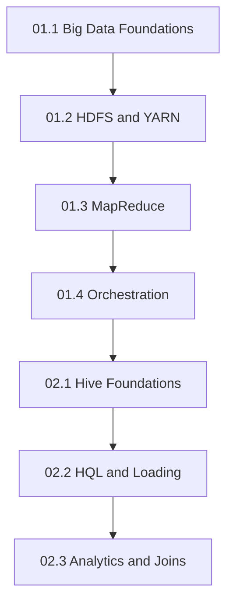

# DADS6002 Big Data Analytics — Master Notes

สารบัญกลางของ Master Notes ภาษาไทย เรียงเลขบทด้วยรูปแบบ `เอกสารหลัก.บทย่อย` เช่น `01.3` หมายถึงบทย่อยที่ 3 จากเอกสาร Hadoop หมายเลข 01 และ `02.1` หมายถึงบทย่อยที่ 1 จากเอกสาร Hive หมายเลข 02

ชุด canonical ที่แนะนำให้อ่านคือไฟล์ `011`–`014` และ `021`–`023` ซึ่งอยู่ในโฟลเดอร์ `summary/` นี้โดยตรง ไฟล์ในโฟลเดอร์ย่อย `02_hive/` เป็นชุดเก่าที่เก็บไว้เพื่อรักษาลิงก์เดิม จึงไม่ควรใช้เป็นจุดเริ่มต้นในการอ่านหรืออ้างเลขบทใหม่

## 01 — Hadoop

แหล่งหลัก: `dads6002_01_hadoop.pdf` จำนวน 43 หน้า

1. [บทที่ 01.1: Big Data Foundations, Workflow และ Data Lake](011_big_data_foundations.md)
2. [บทที่ 01.2: Hadoop Architecture, HDFS และ YARN](012_hdfs_and_yarn.md)
3. [บทที่ 01.3: MapReduce และ Hadoop Streaming](013_mapreduce_and_streaming.md)
4. [บทที่ 01.4: Partitioner และ Workflow Orchestration](014_workflow_orchestration.md)

## 02 — Hive

แหล่งหลัก: `dads6002_02_hive.pdf` จำนวน 21 หน้า

1. [บทที่ 02.1: Hive Foundations and Storage Design](021_hive_foundations_and_storage.md)
2. [บทที่ 02.2: HQL, Schema, SerDe and Loading](022_hql_schema_serde_and_loading.md)
3. [บทที่ 02.3: Hive Analytics and Joins](023_hive_analytics_and_joins.md)

## Recommended Learning Path

ลำดับนี้เริ่มจากเหตุผลที่ต้องใช้ distributed system ต่อด้วย storage/resource management, distributed processing และ workflow ก่อนยกระดับสู่ SQL-based analytics ด้วย Hive

### สะพานเชื่อมแนวคิดระหว่างเอกสาร 01 และ 02

ชุด Hadoop อธิบายกลไกด้านล่าง: HDFS เก็บไฟล์, YARN จัดสรรทรัพยากร, MapReduce แบ่งและรวมงาน และ orchestrator ควบคุมหลาย jobs เมื่อเข้าสู่ Hive เราไม่ได้ทิ้งกลไกเหล่านั้น แต่เพิ่ม abstraction แบบตาราง Hive ใช้ metadata อธิบายไฟล์และแปล HQL เป็น execution plan ทำให้นักวิเคราะห์ระบุผลที่ต้องการโดยไม่เขียน Mapper/Reducer ทุกครั้ง

เรื่องราวหลักของทั้งชุดคือข้อมูลจัดซื้อโรงพยาบาล เริ่มจาก raw events เข้า Data Lake เก็บอย่างทนทานในระบบกระจาย แปลงด้วยงาน batch ควบคุมด้วย DAG จากนั้นประกาศ Hive tables และ schema เพื่อให้ query ได้ สุดท้ายจึง aggregate และ join กับ vendor master โดยตรวจ grain, unmatched keys, row multiplication และยอดรวม การอ่านตามลำดับนี้ช่วยให้เห็นว่าแต่ละเครื่องมือแก้ข้อจำกัดจากขั้นก่อนหน้า

## Cumulative Learning Objectives

- เชื่อม 5Vs กับ storage, processing, latency และ data-quality requirements
- trace HDFS write/read และ YARN application lifecycle
- ติดตาม record ผ่าน Map, partition, shuffle, sort และ Reduce
- ออกแบบ DAG ที่ retry และ rerun ได้อย่างปลอดภัย
- อธิบาย Hive, Metastore, tables, partitions และ buckets
- สร้าง HQL schema, SerDe และ staging-to-curated load flow
- เขียน aggregation และ joins พร้อมตรวจ grain, unmatched keys และ totals

## Numbering Standard

| รูปแบบ | ความหมาย | ตัวอย่าง |
|---|---|---|
| `01.x` | ชุด Hadoop จากเอกสารหมายเลข 01 | `01.3` = MapReduce |
| `02.x` | ชุด Hive จากเอกสารหมายเลข 02 | `02.2` = HQL และ loading |
| ชื่อไฟล์ `0xy_...md` | ตัดจุดออกเพื่อให้ sort ง่าย | `023_...md` = บทที่ 02.3 |

เลขในชื่อไฟล์ หัวเรื่อง ลิงก์ข้ามบท และสารบัญต้องใช้ mapping เดียวกันนี้

## Integrated Capstone

ออกแบบ analytical pipeline สำหรับข้อมูลการสั่งซื้อของโรงพยาบาล ตั้งแต่รับไฟล์เข้า HDFS จัดสรร resource ด้วย YARN ประมวลผลและ orchestration งาน สร้าง Hive external staging table แปลงเป็น curated table แล้วสรุปยอดร่วมกับ vendor master

ผลงานต้องแสดง architecture, grain, partition design, HQL, failure recovery และ reconciliation ของ row count กับยอดเงิน

## Cumulative Exam Blueprint

| ความสามารถ | บทหลัก | ระดับ |
|---|---|---|
| อธิบาย distributed storage/compute | 01.1–01.3 | Explain/Apply |
| วิเคราะห์ failure และ orchestration | 01.2–01.4 | Analyze/Evaluate |
| ออกแบบ Hive storage/schema | 02.1–02.2 | Apply/Analyze |
| วิเคราะห์ aggregation/join correctness | 02.3 | Analyze/Evaluate |
| ออกแบบ pipeline end-to-end | ทุกบท | Create |

## Final Revision Checklist

- [ ] อธิบายลำดับ 01.1 → 02.3 และ dependency ของแต่ละบทได้
- [ ] วาด HDFS/YARN/MapReduce flow จากความจำได้
- [ ] แยก table, partition และ bucket ได้
- [ ] อธิบาย schema-on-read และ SerDe ได้
- [ ] ตรวจ row multiplication และ unmatched keys หลัง join ได้
- [ ] ออกแบบ retry, validation และ reconciliation สำหรับ pipeline ได้

## Source Coverage

- `dads6002_01_hadoop.pdf` หน้า 1–43 ครอบคลุมในบท 01.1–01.4
- `dads6002_02_hive.pdf` หน้า 1–21 ครอบคลุมในบท 02.1–02.3

## Suite Review

- เลขบท canonical สอดคล้องกัน: `01.1–01.4` และ `02.1–02.3`
- ทุกบทมี source range, prerequisites, teaching layer, practice, exam focus และ mastery checks
- Hadoop → Hive เชื่อมผ่าน HDFS, MapReduce, metadata และ SQL abstraction
- Hive หน้า 1–5 มีบ้านหลักใน 02.1, หน้า 6–15 ใน 02.2 และหน้า 16–21 ใน 02.3 โดยไม่มีช่วงหน้าตกหล่น
- โฟลเดอร์ `02_hive/` ไม่ใช่ canonical suite และคงไว้เฉพาะ backward compatibility

## References

- [Apache Hadoop Documentation](https://hadoop.apache.org/docs/current/)
- [Apache Airflow Documentation](https://airflow.apache.org/docs/apache-airflow/stable/)
- [Apache Hive Documentation](https://hive.apache.org/docs/latest/)
