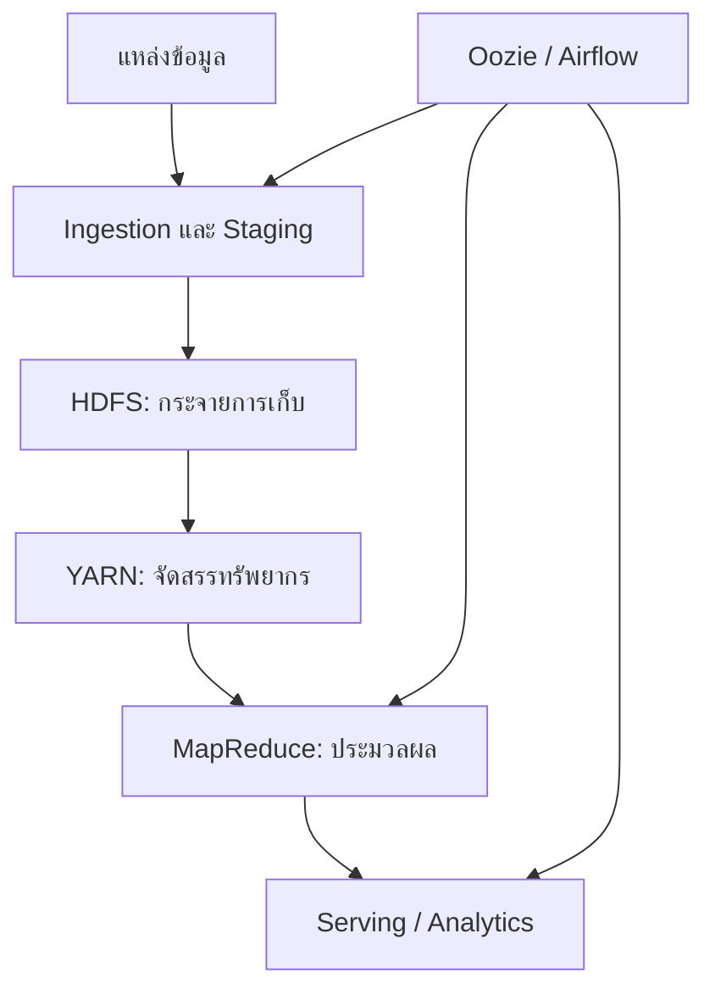

# บทที่ 1: Big Data Foundations, Workflow และ Data Lake

> **จากเอกสาร:** dads6002_week01-03_hadoop.pdf หน้า 1–10  
> บทนี้สร้างพื้นฐานก่อนเข้าสู่ Hadoop โดยอธิบายจากปัญหาทางข้อมูลไปสู่การออกแบบ pipeline และ architecture

## 1. ภาพรวมของบทเรียน

บทเรียนเริ่มจากเหตุผลที่ระบบข้อมูลแบบเดิมรองรับ Big Data ได้ยาก แล้วค่อยไล่จากวงจรงานข้อมูล สถาปัตยกรรม Lambda และ Data Lake ไปสู่แกนหลักของ Hadoop ได้แก่

- **HDFS** — กระจายการจัดเก็บไฟล์ขนาดใหญ่และทนต่อความเสียหายของเครื่อง
- **YARN** — จัดสรรทรัพยากรและควบคุมการรันแอปพลิเคชันในคลัสเตอร์
- **MapReduce** — แบบจำลองประมวลผลข้อมูลแบบขนานด้วยคู่ `key-value`
- **Hadoop Streaming** — ใช้ภาษาอื่น เช่น Python เขียน Mapper/Reducer ผ่าน `stdin/stdout`
- **Workflow orchestration** — เชื่อมหลายงานเป็น DAG ด้วย Oozie หรือ Airflow

แก่นของบทเรียนไม่ใช่การจำชื่อเครื่องมือ แต่คือหลักคิดว่า **ย้ายการคำนวณไปใกล้ข้อมูล แบ่งงานเป็นส่วนย่อย ยอมรับว่าเครื่องเสียได้ และออกแบบให้ระบบกู้คืนได้อัตโนมัติ**

## 2. Learning Objectives

เมื่อเรียนจบบทนี้ควรทำได้ดังนี้

1. จำแนก structured, semi-structured และ unstructured data พร้อมอธิบาย Big Data 5Vs ได้
2. อธิบายเส้นทางข้อมูลตั้งแต่ ingestion จนถึง serving และเปรียบเทียบ batch กับ streaming ได้
3. วาดและอธิบายบทบาท NameNode, DataNode, ResourceManager, NodeManager และ ApplicationMaster ได้
4. คำนวณจำนวน HDFS blocks และผลของ replication factor แบบพื้นฐานได้
5. ติดตามข้อมูลผ่าน Map → Shuffle/Sort → Reduce และทำนายผลลัพธ์ได้
6. เขียนและทดสอบ Hadoop Streaming Word Count ด้วย Python ได้
7. อธิบาย Combiner, Partitioner, data skew และ job chaining พร้อมข้อจำกัดได้
8. ออกแบบ DAG งานข้อมูลและเลือก HDFS/ฐานข้อมูล, MapReduce/เครื่องมือสมัยใหม่ และ Oozie/Airflow ตามบริบทได้

## 3. ความรู้พื้นฐานที่ควรมี

- Linux shell เบื้องต้น: path, pipe (`|`), redirect (`>`/`>>`), permission
- Python เบื้องต้น: อ่านทีละบรรทัด, dictionary, `stdin/stdout`
- แนวคิดฐานข้อมูล: schema, transaction, query latency
- เครือข่าย: node, rack, bandwidth, latency

## 4. แผนที่แนวคิด

## 5. จากข้อมูลทั่วไปสู่ Big Data

### 5.1 ประเภทของข้อมูล

**จากเอกสาร (หน้า 1)**

| ประเภท | ลักษณะ | ตัวอย่าง |
|---|---|---|
| Structured | โครงสร้างตายตัว เป็นแถว/คอลัมน์ | ตารางธุรกรรม, RDBMS |
| Semi-structured | มี tag/key ช่วยบอกโครงสร้าง แต่ยืดหยุ่น | JSON, XML, log |
| Unstructured | ไม่มี schema ตารางที่ชัดเจน | ข้อความ, ภาพ,เสียง,วิดีโอ |

**คำอธิบายเพิ่มเติม:** ประเภทข้อมูลไม่ได้ตัดสินจากนามสกุลไฟล์เพียงอย่างเดียว แต่ดูว่าเครื่องสามารถตีความโครงสร้างได้มากเพียงใด เช่น ข้อความใน JSON มีโครงสร้างระดับ key แต่ค่าภายในอาจเป็นข้อความอิสระ การเก็บทุกอย่างใน Data Lake ไม่ได้แปลว่าไม่ต้องมี governance; ยิ่ง schema ยืดหยุ่น ยิ่งต้องมี metadata, data quality และสิทธิ์เข้าถึงที่ชัดเจน

### 5.2 Big Data 5Vs

**จากเอกสาร (หน้า 2)**

- **Volume:** ปริมาณข้อมูลมาก
- **Velocity:** เกิดและต้องประมวลผลเร็ว
- **Variety:** หลายรูปแบบและหลายแหล่ง
- **Veracity:** ความน่าเชื่อถือ/คุณภาพไม่สม่ำเสมอ
- **Value:** ต้องเปลี่ยนข้อมูลให้เป็นคุณค่าทางธุรกิจ

**ตัวอย่าง:** ระบบส่งอาหารมี Volume จากธุรกรรมจำนวนมาก, Velocity จากตำแหน่งไรเดอร์, Variety จากคำสั่งซื้อ/ข้อความ/ภาพ, Veracity จาก GPS ที่คลาดเคลื่อน และ Value จากการลดเวลาจัดส่ง จุดสำคัญคือข้อมูล “ใหญ่” ไม่จำเป็นต้องเด่นทุก V พร้อมกัน; ข้อมูลไม่มากแต่ไหลเร็วมากก็ต้องใช้สถาปัตยกรรมเฉพาะได้

### 5.3 Data Product และ Data Science Pipeline

**จากเอกสาร (หน้า 3–4)** ยกตัวอย่าง Amazon, Facebook และรถอัตโนมัติเป็นผลิตภัณฑ์ที่ใช้ข้อมูล และนำเสนอ Data Science เป็นศาสตร์ผสม พร้อม pipeline ตั้งแต่รวบรวมข้อมูลไปจนถึงสร้างคุณค่า

**คำอธิบายเพิ่มเติม:** Data product คือผลิตภัณฑ์หรือฟังก์ชันที่พฤติกรรมหลักขึ้นกับข้อมูล เช่น recommendation, fraud detection หรือ ETA ไม่ใช่เพียง dashboard หนึ่งหน้า Pipeline ที่ดีต้องมี feedback loop: ผลทำนายจริงถูกบันทึกกลับมาเพื่อวัด drift และปรับปรุงโมเดล

## 6. Big Data Workflow, Lambda Architecture และ Data Lake

### 6.1 Big Data Workflow

**จากเอกสาร (หน้า 5–6)** แบ่งงานหลักเป็น ingestion, staging/storage, computation และ workflow management โดยมีเครื่องมือใน ecosystem รับผิดชอบแต่ละช่วง

| ขั้น | คำถามออกแบบ | ตัวอย่างเทคโนโลยีในบริบท Hadoop |
|---|---|---|
| Ingestion | รับข้อมูลแบบ batch หรือ event? รับซ้ำได้ไหม? | Sqoop, Flume, Kafka |
| Staging/Storage | เก็บดิบหรือแปลงก่อน? partition อย่างไร? | HDFS, Hive |
| Computation | ต้องการ throughput หรือ latency? | MapReduce, Spark |
| Serving | ผู้ใช้ query แบบใด? | Hive, HBase, search/BI |
| Orchestration | dependency, retry, schedule เป็นอย่างไร? | Oozie, Airflow |

**คำอธิบายเพิ่มเติม:** Sqoop และ Flume มีความสำคัญทางประวัติศาสตร์ แต่ระบบสมัยใหม่มักใช้ CDC, managed ingestion, object storage และ event streaming แทน หลักออกแบบยังเหมือนเดิม: idempotency, schema evolution, checkpoint, observability และการย้อนประมวลผล

#### ติดตามข้อมูลหนึ่งรายการผ่าน workflow

สมมติสาขาร้านยาส่งรายการขาย `TX1001` เวลา 10:05 น. ขั้น ingestion ต้องรับรายการและเพิ่ม metadata เช่น source, ingestion time และ unique transaction ID หาก network ทำให้ส่งซ้ำ ระบบต้องใช้ ID เดิมตรวจ duplicate แทนการนับเป็นยอดขายสองครั้ง จากนั้น staging เก็บสำเนาดิบเพื่อ audit และ replay โดยยังไม่แก้ค่าเดิมเงียบ ๆ

Computation อ่านรายการที่ผ่าน validation ไปคำนวณยอดรายสาขา ถ้า product code ไม่มีใน master data ควรแยกเป็น rejected/quarantine record พร้อมเหตุผล ไม่ใช่ทิ้งโดยไม่บอก Serving layer จึงได้รับเฉพาะผลที่ผ่านกฎ ส่วน workflow management บันทึกว่าแต่ละขั้นใช้ input version ใด จำนวนเข้า/ออกเท่าไร และ retry กี่ครั้ง ตัวอย่างนี้ทำให้เห็นว่า pipeline ไม่ใช่เพียงการย้ายไฟล์ แต่เป็นการรักษาความถูกต้องและ traceability ตลอดทาง

การตรวจที่ควรมีอย่างน้อยคือ `source_count = accepted_count + rejected_count`, transaction ID ไม่ซ้ำ, amount อยู่ในช่วงที่ยอมรับ และ business total ก่อน/หลัง transformation reconcile ได้ การรันสำเร็จโดยไม่เกิด error ยังไม่พิสูจน์ว่าข้อมูลถูกต้อง

### 6.2 Lambda Architecture

**จากเอกสาร (หน้า 7–9)** สถาปัตยกรรม Lambda แยกเป็น

1. **Batch layer** เก็บข้อมูลหลักและคำนวณผลที่ถูกต้องครบถ้วน
2. **Speed layer** ประมวลผลข้อมูลใหม่ด้วย latency ต่ำ
3. **Serving layer** รวมผลเพื่อให้ผู้ใช้ query

**ตัวอย่าง:** ยอดขายวันนี้แสดงจาก stream ทุกนาที ขณะที่ batch job คำนวณยอดย้อนหลังใหม่ทุกคืนเพื่อแก้ event ที่มาช้า

**คำอธิบายเพิ่มเติม:** ข้อดีคือได้ทั้งความเร็วและความแม่นยำ แต่ต้องดูแล logic สองชุด จึงเสี่ยงให้ผล batch/stream ไม่ตรงกัน แนวทาง Kappa หรือ unified streaming engine ลดความซ้ำซ้อนโดยใช้เส้นทางประมวลผลหลักชุดเดียว การเลือกขึ้นกับ SLA, late data, ความสามารถ replay และต้นทุนการปฏิบัติการ

#### กลไก reconciliation ทีละขั้น

เวลา 10:05 speed layer รับยอดขาย 100 บาทและ dashboard แสดงทันที ต่อมา 10:20 มี correction ยกเลิกรายการเดิม แต่ event มาถึงช้า หาก speed layer ไม่รองรับ correction dashboard อาจยังแสดง 100 บาท Batch layer ซึ่งอ่าน immutable history ตอนกลางคืนสามารถคำนวณใหม่เป็น 0 บาทและแทนที่ serving view ที่คลาดเคลื่อน

จุดออกแบบสำคัญจึงไม่ใช่เพียงมีสอง layers แต่ต้องกำหนดว่า output ใด authoritative, ใช้ key ใด merge ผล, late event ย้อนแก้ช่วงเวลาใด และผู้ใช้ยอมรับความคลาดเคลื่อนชั่วคราวได้นานเท่าไร หาก business logic สองชุดต่างกัน แม้ข้อมูลเข้าเหมือนกันก็อาจ reconcile ไม่ได้ นี่เป็นต้นทุนการบำรุงรักษาหลักของ Lambda Architecture

| เงื่อนไข | แนวทางที่เหมาะกว่า |
|---|---|
| ต้องตอบเร็วและยอมให้ผลชั่วคราวได้ | Speed layer พร้อม batch correction |
| รายงานกฎหมาย/การเงินต้องครบก่อนเผยแพร่ | Batch ที่ผ่าน reconciliation |
| Engine รองรับ replay และ logic ชุดเดียว | Unified/Kappa-style processing อาจลดความซ้ำซ้อน |
| ทีมเล็กและ SLA ไม่ต่ำมาก | Batch แบบง่ายมักดูแลง่ายกว่า Lambda |

### 6.3 Data Lake

**จากเอกสาร (หน้า 10)** Data Lake เป็นแหล่งรวมข้อมูลหลายรูปแบบในระดับใหญ่ เพื่อให้ผู้ใช้หลายกลุ่มนำไปประมวลผลต่อได้

**คำอธิบายเพิ่มเติม:** Data Lake ไม่เท่ากับ HDFS เสมอไป—บน cloud มักเป็น object storage และอาจเพิ่ม table format/transaction layer กลายเป็น lakehouse หากไม่มี catalog, owner, quality rule, lineage และ lifecycle policy จะกลายเป็น “data swamp” ที่ค้นหาและเชื่อถือไม่ได้

Data Lake ควรแยก logical zones ตามหน้าที่ เช่น raw/bronze เก็บข้อมูลต้นทางเพื่อ replay, validated/silver เก็บข้อมูลที่ผ่าน schema และ quality rules และ curated/gold เตรียมตาม business grain สำหรับผู้ใช้ปลายทาง ชื่อ zone ไม่สำคัญเท่ากับ contract ว่าข้อมูลแต่ละชั้นผ่านอะไรมาแล้ว การ copy ไฟล์จาก raw ไป gold โดยไม่มี validation ไม่ได้เพิ่มความน่าเชื่อถือ

ตัวอย่างยอดขายร้านยาควรมี owner, schema version, business date, ingestion timestamp, source system, sensitivity classification, retention period และ lineage ไปยังรายงาน หากยอด dashboard ผิด ทีมจึงย้อนจาก metric ไปยัง curated table, transformation run และ raw transaction ได้ หากไม่มี metadata เหล่านี้ Data Lake จะเก็บข้อมูลได้มากแต่ตอบไม่ได้ว่าชุดใดควรใช้

## Mastery Check ประจำบท

หลังจบบทนี้ควรอธิบายได้ว่า 5Vs ส่งผลต่อการออกแบบระบบอย่างไร, วาดเส้นทาง ingestion → storage → compute → serving ได้, เปรียบเทียบ batch/speed layers โดยอ้างอิง SLA และ late data และบอกได้ว่า Data Lake จะกลายเป็น data swamp เมื่อขาดการกำกับดูแลอย่างไร

## คำถามฝึกคิด

1. ข้อมูลยอดขาย 20 GB/วันแต่ต้องแจ้ง fraud ภายใน 5 วินาที ความท้าทายหลักคือ V ใด เพราะเหตุใด?
2. หาก batch และ streaming คำนวณ business rule คนละชุด จะเกิดความเสี่ยงใดใน Lambda Architecture?
3. ออกแบบ metadata ขั้นต่ำสำหรับ raw zone ของ Data Lake: owner, schema, ingestion time, source, sensitivity และ retention ควรใช้อย่างไร?

**แนวคำตอบ:** ข้อ 1 เน้น Velocity มากกว่า Volume; ข้อ 2 เกิด logic duplication และผลสองเส้นทางไม่ตรงกัน จึงต้องมี reconciliation/source of truth; ข้อ 3 metadata ทำให้ค้นหา ตรวจคุณภาพ ควบคุมสิทธิ์ และลบข้อมูลตามวงจรชีวิตได้

## References

- เอกสารหลัก หน้า 1–10
- [Apache Hadoop HDFS Architecture](https://hadoop.apache.org/docs/current/hadoop-project-dist/hadoop-hdfs/HdfsDesign.html)
