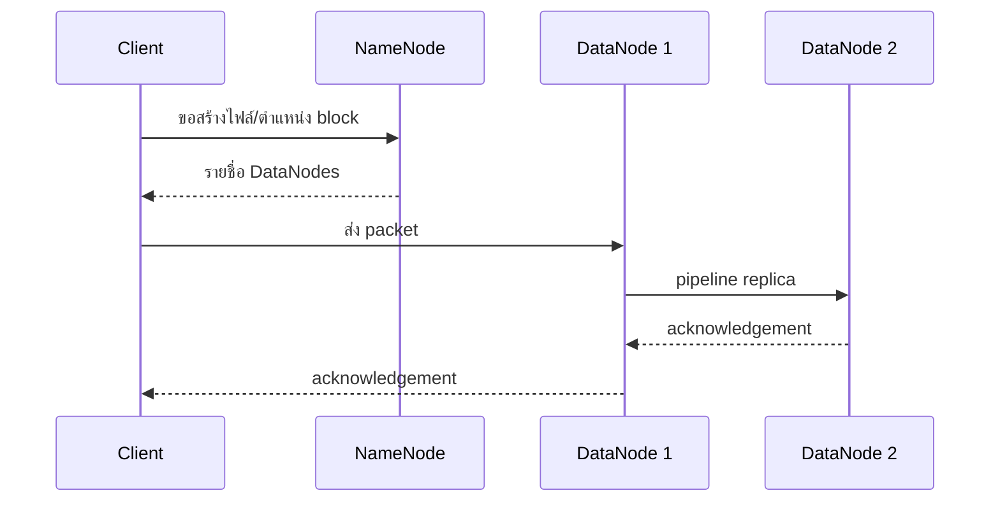

# บทที่ 2: Hadoop Architecture, HDFS และ YARN

> **จากเอกสาร:** dads6002_week01-03_hadoop.pdf หน้า 11–21  
> **Core:** distributed-system requirements, HDFS read/write/failure recovery, blocks/replication และ YARN application lifecycle

## 7. Hadoop Ecosystem และหลักของระบบกระจาย

### 7.1 Ecosystem

**จากเอกสาร (หน้า 11)** แสดงเครื่องมือหลายชั้น เช่น HDFS, YARN, MapReduce, Hive, Pig, HBase, Sqoop, Flume, Oozie และ ZooKeeper

| กลุ่ม | หน้าที่ | อย่าสับสนกับ |
|---|---|---|
| HDFS | distributed storage | ฐานข้อมูลเชิงสัมพันธ์ |
| YARN | resource management | ตัวประมวลผลข้อมูลโดยตรง |
| MapReduce/Spark | compute engine | scheduler ข้ามหลาย pipeline |
| Hive | SQL abstraction/metadata | OLTP database |
| HBase | distributed NoSQL บน Hadoop | HDFS file shell |
| Oozie/Airflow | workflow orchestration | compute engine |

### 7.2 คุณสมบัติที่ต้องการ

**จากเอกสาร (หน้า 12–14)** เน้น fault tolerance, recoverability, consistency และ scalability รวมถึงการแบ่งข้อมูลเป็น blocks, replication, data locality, การแบ่ง job เป็น tasks และสถาปัตยกรรม master/worker

**คำอธิบายเพิ่มเติม:** “เครื่องเสีย” เป็นเหตุการณ์ปกติ ไม่ใช่ข้อยกเว้น การออกแบบจึงต้องมี heartbeat, retry, replica และ metadata ที่บอกตำแหน่งข้อมูล Data locality ลดการส่งข้อมูลขนาดใหญ่ผ่านเครือข่าย โดยพยายามส่งโค้ดขนาดเล็กไปยัง node ที่มี block แทน แนวคิดนี้ตรงกับเอกสาร HDFS ปัจจุบันของ Apache ซึ่งเน้น throughput และการย้าย computation ไปใกล้ข้อมูล

## 8. Hadoop Architecture: HDFS และ YARN

### 8.1 ภาพรวมคลัสเตอร์

**จากเอกสาร (หน้า 15–16)** Hadoop มีสองแกน: HDFS จัดเก็บข้อมูล และ YARN จัดการทรัพยากร งานถูกพยายามวางใกล้ block ที่ต้องอ่าน มี replication และ speculative execution ช่วยรับมือ node/task ที่ช้า

**คำอธิบายเพิ่มเติม:** speculative execution คือการรันสำเนาของ task ที่ช้าผิดปกติ แล้วรับผลจากสำเนาที่เสร็จก่อน เหมาะกับ straggler แต่ไม่ควรใช้แบบไม่คิดกับ task ที่มี side effect เช่น เรียก API ภายนอกหรือเขียนข้อมูลซ้ำ

### 8.2 HDFS components

**จากเอกสาร (หน้า 17, 19–20)**

- **NameNode:** จัดการ namespace, metadata และ mapping ระหว่างไฟล์กับ blocks
- **DataNode:** เก็บ block จริง รับคำสั่งสร้าง/ลบ/ทำสำเนา และบริการ read/write
- **Secondary NameNode:** ทำ checkpoint โดยรวม `fsimage` กับ `edit logs`; **ไม่ใช่ backup NameNode**
- HDFS เหมาะกับไฟล์ใหญ่ การอ่านแบบ streaming และ write-once-read-many

#### 8.2.1 เริ่มจากปัญหา: ทำไมต้องแยก metadata ออกจากข้อมูลจริง

สมมติองค์กรมีไฟล์ log ขนาด 300 MB แต่ disk หนึ่งเครื่องอาจเสียได้ หากเก็บไฟล์เพียงสำเนาเดียว การเสียของ disk อาจทำให้ข้อมูลหาย และเมื่อไฟล์โตเป็นหลาย TB เครื่องเดียวก็อาจเก็บหรืออ่านไม่ทัน HDFS จึงแบ่งไฟล์เป็น **blocks** เพื่อกระจายการเก็บและการอ่าน และสร้าง **replicas** บนคนละเครื่องเพื่อให้ยังอ่านได้เมื่อบางเครื่องล่ม

เมื่อกระจายไฟล์แล้ว ระบบต้องตอบคำถามสองกลุ่มซึ่งมีลักษณะต่างกันมาก กลุ่มแรกคือไฟล์ชื่ออะไร อยู่ directory ใด ประกอบด้วย block ใด และแต่ละ block อยู่เครื่องไหน ข้อมูลกลุ่มนี้เรียกว่า **metadata** กลุ่มที่สองคือ byte จริงของ block ซึ่งมีขนาดใหญ่กว่ามาก HDFS จึงแยกผู้ดูแล “แผนที่” ออกจากผู้เก็บ “ของจริง” เพื่อไม่ให้เครื่อง master ต้องรับข้อมูลทุก byte และกลายเป็นคอขวด

#### 8.2.2 NameNode: ผู้จัดการแผนที่ ไม่ใช่โกดังข้อมูล

NameNode ดูแล **file-system namespace** เช่น `/user/pae/input/sales.csv` รวมถึง owner, permission, replication policy และความสัมพันธ์ว่าไฟล์ประกอบด้วย block ใด นอกจากนี้ยังทราบว่า replica ของแต่ละ block อยู่บน DataNode ใด เมื่อ client ต้องการเปิดไฟล์ client จึงติดต่อ NameNode ก่อนเพื่อขอแผนที่ แล้วติดต่อ DataNode เพื่อรับ byte จริง ด้วยเหตุนี้ user data ตามปกติจึงไม่ไหลผ่าน NameNode ตามที่ [Apache HDFS Architecture](https://hadoop.apache.org/docs/current/hadoop-project-dist/hadoop-hdfs/HdfsDesign.html) อธิบายไว้

NameNode ทำ namespace operations เช่น create, rename และ delete และตัดสินใจเรื่อง block placement กับ re-replication แต่ไม่ได้เปิดอ่านทุก record แทน client มันเก็บ metadata จำนวนมากไว้ใน memory เพื่อค้นหาได้เร็ว ดังนั้นไฟล์เล็กหลายล้านไฟล์อาจกดดัน memory แม้จำนวน byte รวมไม่มาก นี่คือ **small-files problem**

ถ้า NameNode ใช้งานไม่ได้ client จะไม่มีผู้บอกตำแหน่ง block และทำ namespace operation ใหม่ไม่ได้ แม้ block bytes ยังอยู่ครบใน DataNodes ก็ตาม ระบบ production จึงใช้ **NameNode High Availability** แบบ Active/Standby พร้อม shared edits และ failover ไม่ใช่หวังให้ Secondary NameNode รับงานต่อ

#### 8.2.3 DataNode: ผู้เก็บและส่ง block จริง

DataNode ดูแลพื้นที่ disk ของ worker แต่ละเครื่อง โดยเก็บ HDFS blocks เป็นไฟล์ใน local file system เมื่อได้รับ request หรือคำสั่ง มันจะสร้าง block, อ่าน block ให้ client, รับ block ใหม่, ส่งต่อ replica และลบ block ที่ NameNode สั่ง

DataNode รายงานกลับไปยัง NameNode สองรูปแบบสำคัญ **Heartbeat** บอกว่า node ยังมีชีวิตและติดต่อได้ ส่วน **Block report** บอกรายการ blocks ที่ node ถืออยู่ หาก heartbeat ขาดหาย NameNode จะหยุดส่งงานอ่าน/เขียนใหม่ไปยัง node นั้น ตรวจหา blocks ที่มี replica ต่ำกว่า policy แล้วสั่ง DataNodes ที่ยังดีให้ทำ **re-replication** ดังนั้น fault tolerance ไม่ได้เกิดเพียงเพราะมีหลายเครื่อง แต่เกิดจากวงจรตรวจจับ ตัด node ที่เสียออก และซ่อมระดับ replication กลับมา

#### 8.2.4 End-to-end write: เขียนไฟล์ 300 MB

กำหนด block size 128 MB และ replication factor 3 ไฟล์จะถูกแบ่งเป็น `B1=128 MB`, `B2=128 MB` และ `B3=44 MB` แล้วเกิดขั้นตอนดังนี้

1. Client ขอสร้าง path กับ NameNode; NameNode ตรวจว่า path ยังไม่มีและ client มี permission
2. เมื่อจะเขียน B1 NameNode เลือก DataNodes สำหรับ replicas โดยคำนึงถึง node/rack แล้วคืนรายชื่อให้ client
3. Client ส่ง packet ไป DataNode ตัวแรกโดยตรง ไม่ได้ส่ง payload ผ่าน NameNode
4. DataNode ตัวแรกเขียนลง disk และส่ง packetต่อไปตัวที่สอง; ตัวที่สองส่งต่อไปตัวที่สาม เกิด **replication pipeline**
5. Acknowledgement วิ่งย้อนจากตัวสุดท้ายกลับจนถึง client เมื่อ packet ถูกบันทึกครบตาม pipeline
6. เมื่อ B1 เต็ม client ขอ target ชุดถัดไปสำหรับ B2 และทำซ้ำจนปิดไฟล์
7. หาก DataNode เสียระหว่างเขียน pipeline จะถูกปรับ และระบบพยายามรักษาจำนวน replicas ตาม policy



#### 8.2.5 End-to-end read และการรับมือ block เสีย

เมื่ออ่านไฟล์ client ขอเปิด path กับ NameNode และได้รับรายการ blocks พร้อมตำแหน่ง replicas ซึ่งมักเรียงตำแหน่งที่ใกล้หรือเหมาะสม จากนั้น client อ่าน B1 จาก DataNode ที่เลือกและตรวจ checksum เมื่อ B1 จบจึงเปลี่ยนไป B2 และ B3 ซึ่งอาจอยู่คนละเครื่อง หาก DataNode อ่านไม่ได้หรือ checksum ผิด client สามารถลอง replica อื่นได้ การอ่านจึงใช้ bandwidth รวมจาก workers และไม่ผลัก payload ผ่าน NameNode

อย่างไรก็ตาม replication ไม่ได้แปลว่าข้อมูลไม่มีวันสูญหาย หากทุก replica ของ block เดียวกันหาย block นั้นจะอ่านไม่ได้ และ replication ก็ไม่ใช่ backup สำหรับการลบไฟล์ผิดโดยผู้ใช้ จึงยังต้องมี snapshot, backup/retention และการทดสอบ recovery ตามระดับความสำคัญของข้อมูล

#### 8.2.6 `FsImage`, `EditLog` และ Secondary NameNode

NameNode ต้องทำให้ metadata อยู่รอดหลัง restart จึงใช้ `FsImage` เป็นภาพรวม namespace ณ checkpoint หนึ่ง และใช้ `EditLog` บันทึกการเปลี่ยนแปลงหลังจากนั้น เช่น create, rename หรือเปลี่ยน replication factor เหตุผลที่ไม่เขียน image ใหญ่ทั้งก้อนทุกครั้งคือจะช้า จึงบันทึก incremental changes ลง log ก่อน

เมื่อ log โต การ restart จะนานเพราะต้องโหลด `FsImage` แล้ว replay edits จำนวนมาก **Checkpoint** จึงรวม `FsImage + EditLog` เป็น `FsImage` รุ่นใหม่ Secondary NameNode ทำงาน checkpoint นี้ตามสถาปัตยกรรมในบทเรียน แต่ไม่ได้รับ client traffic ต่อโดยอัตโนมัติเมื่อ NameNode ล่ม จึงไม่ใช่ hot standby หรือ backup NameNode

#### 8.2.7 เหตุใด HDFS เหมาะกับไฟล์ใหญ่แต่ไม่เหมาะกับ OLTP

HDFS แลก low latency และ POSIX semantics บางส่วนกับ high-throughput streaming access ปัจจุบันรองรับ append และ truncate แต่ไม่รองรับการแก้ byte กลางไฟล์อย่างอิสระ จึงเหมาะกับ log, archive, batch input และ analytical data มากกว่าระบบขายหน้าร้านที่ต้องแก้ record เล็ก ๆ พร้อม transactions จำนวนมาก นอกจากนี้ไฟล์เล็กจำนวนมหาศาลสร้าง metadata ต่อไฟล์และมักสร้าง tasks จำนวนมาก จึงควรควบคุม file size และ compaction

| Component | สิ่งที่เป็นเจ้าของ | ติดต่อกับใคร | ผลเมื่อเสีย |
|---|---|---|---|
| NameNode | Namespace และ block metadata | Client, DataNodes | เปิด/สร้างไฟล์และค้นตำแหน่ง block ไม่ได้จน recover/failover |
| DataNode | Block bytes บน local disks | Client, NameNode, DataNodes อื่น | Replica บางชุดหาย; NameNode สั่ง re-replication |
| Secondary NameNode | งาน checkpoint metadata | NameNode/metadata files | Checkpoint หยุดและ EditLog โต แต่ไม่ได้ทำ failover |

### 8.3 Blocks, replication และ erasure coding

**จากเอกสาร (หน้า 12–14, 19–20)** ใช้ block ขนาดตัวอย่าง 128 MB และทำ replication เพื่อความทนทาน; เอกสารกล่าวถึง erasure coding ใน Hadoop 3

จำนวน logical blocks คำนวณได้จาก

$$
N_{blocks}=\left\lceil\frac{S_{file}}{S_{block}}\right\rceil
$$

โดย $S_{file}$ คือขนาดไฟล์, $S_{block}$ คือ block size และ $\lceil\ \rceil$ หมายถึงปัดขึ้น เพราะเศษที่เหลือยังต้องใช้ block สุดท้ายหนึ่ง block สำหรับไฟล์ 300 MB:

$$
N_{blocks}=\left\lceil\frac{300}{128}\right\rceil
=\lceil2.34375\rceil=3
$$

จึงได้ 128 + 128 + 44 MB หาก replication factor = 3 ปริมาณ payload โดยประมาณคือ $300\times3=900$ MB ไม่ใช่ $128\times3\times3=1{,}152$ MB เพราะ block สุดท้ายไม่ถูกบังคับให้ใช้ disk เต็มความจุเชิงตรรกะ 128 MB ทั้งนี้ยังไม่รวม checksum และ metadata

Replication factor กำหนดและเปลี่ยนได้ในระดับไฟล์ NameNode ใช้ heartbeat/block report ตรวจจำนวนสำเนาและเลือกตำแหน่งข้าม failure domain เช่น rack เพราะการวางทุกสำเนาบน rack เดียวไม่ช่วยเมื่อ rack นั้นเสีย แต่การเขียนข้าม rack ก็ใช้ network มากขึ้น จึงเป็น trade-off ระหว่างความทนทานกับต้นทุนการเขียน

| วิธี | หลักการ | จุดเด่น | ต้นทุน/ข้อจำกัด |
|---|---|---|---|
| Replication 3x | เก็บสำเนาครบ 3 ชุด | อ่านง่าย กู้คืนตรงไปตรงมา | storage overhead สูง |
| Erasure Coding | แบ่ง data/parity cells | ประหยัดพื้นที่สำหรับ cold data | ใช้ CPU/network ตอน encode/reconstruct มากขึ้น |

**คำอธิบายเพิ่มเติม:** Hadoop 3 ไม่ได้ “เลิก replication”; erasure coding เป็นอีกทางเลือก Policy ควรเลือกตาม hot/cold data, failure domain และ SLA ไม่ใช่ใช้แบบเดียวทั้งคลัสเตอร์

### 8.4 YARN components

**จากเอกสาร (หน้า 18)**

- **ResourceManager (RM):** มุมมองรวมของทรัพยากรและ scheduling
- **NodeManager (NM):** ดูแล containers และทรัพยากรบนแต่ละ worker
- **ApplicationMaster (AM):** วางแผนและติดตามงานของ application หนึ่งชุด
- **Container:** หน่วยทรัพยากร เช่น memory/CPU ที่จัดให้ task

ปัญหาของคลัสเตอร์ที่มีผู้ใช้หลายคนคือทุก job ต้องการ CPU และ RAM พร้อมกัน หากแต่ละโปรแกรมยึดเครื่องเอง จะเกิดทั้งการแย่งทรัพยากรและเครื่องที่ว่างโดยไม่มีใครใช้ YARN จึงทำหน้าที่คล้ายผู้จัดสรรพื้นที่ทำงาน มันไม่ได้คำนวณ Word Count เอง แต่จัดทรัพยากรให้ application ที่รู้วิธีคำนวณ

ResourceManager มีภาพรวมว่าคลัสเตอร์มีทรัพยากรเท่าใดและใช้ไปเท่าใด แต่ไม่ควรต้องควบคุม task ทุกตัวโดยละเอียด หน้าที่ระดับ application จึงแยกให้ ApplicationMaster ส่วน NodeManager เป็นผู้ลงมือเริ่ม/หยุด process และเฝ้าทรัพยากรบน worker ของตน การแยกนี้ทำให้หลาย processing frameworks ใช้คลัสเตอร์เดียวกันได้ ไม่ได้จำกัดเฉพาะ MapReduce

#### ลำดับการส่ง MapReduce job ผ่าน YARN

1. Client ส่ง application metadata และทรัพยากรเริ่มต้นไปยัง ResourceManager
2. ResourceManager เลือก NodeManager หนึ่งเครื่องและให้ container สำหรับเริ่ม ApplicationMaster
3. ApplicationMaster วิเคราะห์งาน เช่น จำนวน input splits แล้วขอ containers สำหรับ map/reduce tasks โดยอาจระบุความต้องการ data locality
4. ResourceManager จัดสรร containers ตามทรัพยากรที่ว่างและ scheduling policy
5. ApplicationMaster ติดต่อ NodeManagers ที่ได้รับเลือกเพื่อเริ่ม tasks
6. NodeManagers เฝ้า process/resource usage ส่วน ApplicationMaster ติดตาม progress และขอ retry หาก task ล้ม
7. เมื่อ tasks เสร็จ ApplicationMaster รายงานผลและคืนทรัพยากร

ถ้า task process ล้ม ความเสียหายมักจำกัดที่ task และ ApplicationMaster สั่งใหม่ได้ ถ้า NodeManager ล่ม containers บนเครื่องนั้นหายและต้องจัดสรรใหม่ ถ้า ApplicationMaster ล้ม YARN อาจเริ่ม application attempt ใหม่ตาม configuration ส่วน ResourceManager เป็นบริการระดับคลัสเตอร์ จึงควรออกแบบ HA ใน production

คำว่า **Container** ใน YARN หมายถึง allocation ของ resource และบริบทสำหรับ process เช่น memory/vcores บน node หนึ่ง ไม่ได้หมายความว่าเป็น Docker container ทุกกรณี

**เปรียบเทียบที่ต้องจำ:** HDFS ตอบว่า “ข้อมูลอยู่ที่ไหนและอ่านอย่างไร” ส่วน YARN ตอบว่า “application ใดได้ CPU/RAM ที่ไหนและเมื่อใด” ขณะที่ MapReduce เป็น processing model ที่ใช้บริการทั้งสองระบบ ไม่ใช่อีกชื่อของ YARN

## 9. การใช้งาน HDFS CLI

**จากเอกสาร (หน้า 20–21)** ยกคำสั่ง `put`, `get`, `mkdir`, `ls`, `mv`, `cp`, `rm` และ `chmod`

```bash
hadoop fs -mkdir -p /user/student/input
hadoop fs -put data.txt /user/student/input/
hadoop fs -ls /user/student/input
hadoop fs -get /user/student/input/data.txt ./downloaded.txt
hadoop fs -cp /user/student/input/data.txt /user/student/input/data-copy.txt
hadoop fs -mv /user/student/input/data-copy.txt /user/student/archive.txt
hadoop fs -chmod 664 /user/student/archive.txt
hadoop fs -rm /user/student/archive.txt
```

**คำอธิบายเพิ่มเติม/แก้ไขเพื่อให้รันได้:** ตัวอย่างบางบรรทัดใน PDF ใช้ขีดยาวจากโปรแกรมนำเสนอ คำสั่งจริงต้องใช้ ASCII hyphen `-` การลบต้องตรวจ path ก่อนเสมอ และระบบ production มักเปิด Trash/retention policy เพื่อให้กู้คืนได้

Permission `664` เท่ากับ `rw-rw-r--`: owner อ่าน/เขียน, group อ่าน/เขียน, others อ่านเท่านั้น

## Mastery Check ประจำบท

- วาด NameNode/DataNode/client และอธิบาย write กับ read flow ได้โดยไม่ดูโน้ต
- คำนวณจำนวน blocks และ payload ภายใต้ replication factor ได้ พร้อมอธิบายสมมติฐาน
- แยก checkpoint จาก High Availability และอธิบายได้ว่า Secondary NameNode ไม่ใช่ standby
- ติดตาม YARN job ตั้งแต่ client submit จน ApplicationMaster คืน resources ได้
- วินิจฉัยได้ว่า DataNode, NameNode, task หรือ NodeManager ล้มแล้วผู้ใช้จะสังเกตอะไร

## แบบฝึกหัดพร้อมเฉลยย่อ

**โจทย์:** ไฟล์ 1,050 MB, block size 128 MB และ replication factor 3 ใช้กี่ logical blocks และ payload รวมประมาณเท่าไร?  
**เฉลย:** $\lceil1{,}050/128\rceil=9$ blocks และ payload ประมาณ $1{,}050\times3=3{,}150$ MB ไม่คูณพื้นที่ว่างของ block สุดท้ายเป็นข้อมูลจริง

**โจทย์:** DataNode หายหนึ่งเครื่องกับ NameNode หายหนึ่งเครื่องต่างกันอย่างไร?  
**เฉลย:** DataNode failure ทำให้ replicas บางชุดหายและ NameNode สั่ง re-replication ได้ ส่วน NameNode failure กระทบ namespace/ตำแหน่ง blocks ทั้งคลัสเตอร์จนกว่า HA failover หรือ recovery จะสำเร็จ

## References

- เอกสารหลัก หน้า 11–21
- [Apache Hadoop: HDFS Architecture](https://hadoop.apache.org/docs/current/hadoop-project-dist/hadoop-hdfs/HdfsDesign.html)
- [Apache Hadoop: YARN Architecture](https://hadoop.apache.org/docs/current/hadoop-yarn/hadoop-yarn-site/YARN.html)
- [Apache Hadoop: HDFS Erasure Coding](https://hadoop.apache.org/docs/current/hadoop-project-dist/hadoop-hdfs/HDFSErasureCoding.html)

