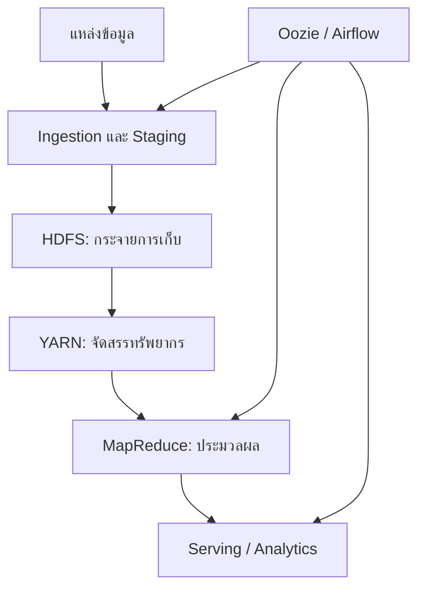
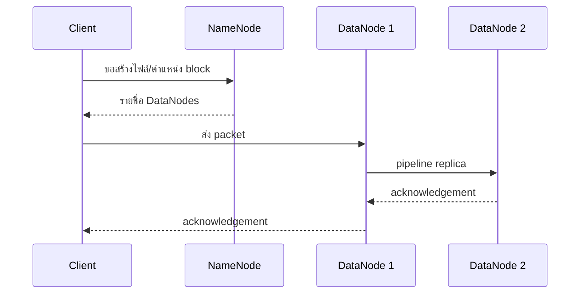

# DADS6002 Big Data Analytics — Hadoop (สัปดาห์ 01–03)

> เอกสารสรุปเพื่อเรียน ทบทวน และเตรียมสอบระดับบัณฑิตศึกษา  
> **แหล่งหลัก:** `dads6001_Hadoop.pdf` จำนวน 43 หน้า (ชื่อไฟล์เป็น DADS6001 แต่หน้าปกระบุ DADS6002/CI7301)  
> **วิธีอ่าน:** ข้อความที่มีป้าย **จากเอกสาร** อ้างอิงเลขหน้า PDF; ป้าย **คำอธิบายเพิ่มเติม** คือการขยายความ แก้ความคลาดเคลื่อน หรือเชื่อมกับเทคโนโลยีปัจจุบัน

## 1. ภาพรวมของบทเรียน

บทเรียนเริ่มจากเหตุผลที่ระบบข้อมูลแบบเดิมรองรับ Big Data ได้ยาก แล้วค่อยไล่จากวงจรงานข้อมูล สถาปัตยกรรม Lambda และ Data Lake ไปสู่แกนหลักของ Hadoop ได้แก่

- **HDFS** — กระจายการจัดเก็บไฟล์ขนาดใหญ่และทนต่อความเสียหายของเครื่อง
- **YARN** — จัดสรรทรัพยากรและควบคุมการรันแอปพลิเคชันในคลัสเตอร์
- **MapReduce** — แบบจำลองประมวลผลข้อมูลแบบขนานด้วยคู่ `key-value`
- **Hadoop Streaming** — ใช้ภาษาอื่น เช่น Python เขียน Mapper/Reducer ผ่าน `stdin/stdout`
- **Workflow orchestration** — เชื่อมหลายงานเป็น DAG ด้วย Oozie หรือ Airflow

แก่นของบทเรียนไม่ใช่การจำชื่อเครื่องมือ แต่คือหลักคิดว่า **ย้ายการคำนวณไปใกล้ข้อมูล แบ่งงานเป็นส่วนย่อย ยอมรับว่าเครื่องเสียได้ และออกแบบให้ระบบกู้คืนได้อัตโนมัติ**

## 2. Learning Objectives

เมื่อเรียนจบบทนี้ควรทำได้ดังนี้

1. จำแนก structured, semi-structured และ unstructured data พร้อมอธิบาย Big Data 5Vs ได้
2. อธิบายเส้นทางข้อมูลตั้งแต่ ingestion จนถึง serving และเปรียบเทียบ batch กับ streaming ได้
3. วาดและอธิบายบทบาท NameNode, DataNode, ResourceManager, NodeManager และ ApplicationMaster ได้
4. คำนวณจำนวน HDFS blocks และผลของ replication factor แบบพื้นฐานได้
5. ติดตามข้อมูลผ่าน Map → Shuffle/Sort → Reduce และทำนายผลลัพธ์ได้
6. เขียนและทดสอบ Hadoop Streaming Word Count ด้วย Python ได้
7. อธิบาย Combiner, Partitioner, data skew และ job chaining พร้อมข้อจำกัดได้
8. ออกแบบ DAG งานข้อมูลและเลือก HDFS/ฐานข้อมูล, MapReduce/เครื่องมือสมัยใหม่ และ Oozie/Airflow ตามบริบทได้

## 3. ความรู้พื้นฐานที่ควรมี

- Linux shell เบื้องต้น: path, pipe (`|`), redirect (`>`/`>>`), permission
- Python เบื้องต้น: อ่านทีละบรรทัด, dictionary, `stdin/stdout`
- แนวคิดฐานข้อมูล: schema, transaction, query latency
- เครือข่าย: node, rack, bandwidth, latency

## 4. แผนที่แนวคิด



## 5. จากข้อมูลทั่วไปสู่ Big Data

### 5.1 ประเภทของข้อมูล

**จากเอกสาร (หน้า 1)**

| ประเภท | ลักษณะ | ตัวอย่าง |
|---|---|---|
| Structured | โครงสร้างตายตัว เป็นแถว/คอลัมน์ | ตารางธุรกรรม, RDBMS |
| Semi-structured | มี tag/key ช่วยบอกโครงสร้าง แต่ยืดหยุ่น | JSON, XML, log |
| Unstructured | ไม่มี schema ตารางที่ชัดเจน | ข้อความ, ภาพ,เสียง,วิดีโอ |

**คำอธิบายเพิ่มเติม:** ประเภทข้อมูลไม่ได้ตัดสินจากนามสกุลไฟล์เพียงอย่างเดียว แต่ดูว่าเครื่องสามารถตีความโครงสร้างได้มากเพียงใด เช่น ข้อความใน JSON มีโครงสร้างระดับ key แต่ค่าภายในอาจเป็นข้อความอิสระ การเก็บทุกอย่างใน Data Lake ไม่ได้แปลว่าไม่ต้องมี governance; ยิ่ง schema ยืดหยุ่น ยิ่งต้องมี metadata, data quality และสิทธิ์เข้าถึงที่ชัดเจน

### 5.2 Big Data 5Vs

**จากเอกสาร (หน้า 2)**

- **Volume:** ปริมาณข้อมูลมาก
- **Velocity:** เกิดและต้องประมวลผลเร็ว
- **Variety:** หลายรูปแบบและหลายแหล่ง
- **Veracity:** ความน่าเชื่อถือ/คุณภาพไม่สม่ำเสมอ
- **Value:** ต้องเปลี่ยนข้อมูลให้เป็นคุณค่าทางธุรกิจ

**ตัวอย่าง:** ระบบส่งอาหารมี Volume จากธุรกรรมจำนวนมาก, Velocity จากตำแหน่งไรเดอร์, Variety จากคำสั่งซื้อ/ข้อความ/ภาพ, Veracity จาก GPS ที่คลาดเคลื่อน และ Value จากการลดเวลาจัดส่ง จุดสำคัญคือข้อมูล “ใหญ่” ไม่จำเป็นต้องเด่นทุก V พร้อมกัน; ข้อมูลไม่มากแต่ไหลเร็วมากก็ต้องใช้สถาปัตยกรรมเฉพาะได้

### 5.3 Data Product และ Data Science Pipeline

**จากเอกสาร (หน้า 3–4)** ยกตัวอย่าง Amazon, Facebook และรถอัตโนมัติเป็นผลิตภัณฑ์ที่ใช้ข้อมูล และนำเสนอ Data Science เป็นศาสตร์ผสม พร้อม pipeline ตั้งแต่รวบรวมข้อมูลไปจนถึงสร้างคุณค่า

**คำอธิบายเพิ่มเติม:** Data product คือผลิตภัณฑ์หรือฟังก์ชันที่พฤติกรรมหลักขึ้นกับข้อมูล เช่น recommendation, fraud detection หรือ ETA ไม่ใช่เพียง dashboard หนึ่งหน้า Pipeline ที่ดีต้องมี feedback loop: ผลทำนายจริงถูกบันทึกกลับมาเพื่อวัด drift และปรับปรุงโมเดล

## 6. Big Data Workflow, Lambda Architecture และ Data Lake

### 6.1 Big Data Workflow

**จากเอกสาร (หน้า 5–6)** แบ่งงานหลักเป็น ingestion, staging/storage, computation และ workflow management โดยมีเครื่องมือใน ecosystem รับผิดชอบแต่ละช่วง

| ขั้น | คำถามออกแบบ | ตัวอย่างเทคโนโลยีในบริบท Hadoop |
|---|---|---|
| Ingestion | รับข้อมูลแบบ batch หรือ event? รับซ้ำได้ไหม? | Sqoop, Flume, Kafka |
| Staging/Storage | เก็บดิบหรือแปลงก่อน? partition อย่างไร? | HDFS, Hive |
| Computation | ต้องการ throughput หรือ latency? | MapReduce, Spark |
| Serving | ผู้ใช้ query แบบใด? | Hive, HBase, search/BI |
| Orchestration | dependency, retry, schedule เป็นอย่างไร? | Oozie, Airflow |

**คำอธิบายเพิ่มเติม:** Sqoop และ Flume มีความสำคัญทางประวัติศาสตร์ แต่ระบบสมัยใหม่มักใช้ CDC, managed ingestion, object storage และ event streaming แทน หลักออกแบบยังเหมือนเดิม: idempotency, schema evolution, checkpoint, observability และการย้อนประมวลผล

### 6.2 Lambda Architecture

**จากเอกสาร (หน้า 7–9)** สถาปัตยกรรม Lambda แยกเป็น

1. **Batch layer** เก็บข้อมูลหลักและคำนวณผลที่ถูกต้องครบถ้วน
2. **Speed layer** ประมวลผลข้อมูลใหม่ด้วย latency ต่ำ
3. **Serving layer** รวมผลเพื่อให้ผู้ใช้ query

**ตัวอย่าง:** ยอดขายวันนี้แสดงจาก stream ทุกนาที ขณะที่ batch job คำนวณยอดย้อนหลังใหม่ทุกคืนเพื่อแก้ event ที่มาช้า

**คำอธิบายเพิ่มเติม:** ข้อดีคือได้ทั้งความเร็วและความแม่นยำ แต่ต้องดูแล logic สองชุด จึงเสี่ยงให้ผล batch/stream ไม่ตรงกัน แนวทาง Kappa หรือ unified streaming engine ลดความซ้ำซ้อนโดยใช้เส้นทางประมวลผลหลักชุดเดียว การเลือกขึ้นกับ SLA, late data, ความสามารถ replay และต้นทุนการปฏิบัติการ

### 6.3 Data Lake

**จากเอกสาร (หน้า 10)** Data Lake เป็นแหล่งรวมข้อมูลหลายรูปแบบในระดับใหญ่ เพื่อให้ผู้ใช้หลายกลุ่มนำไปประมวลผลต่อได้

**คำอธิบายเพิ่มเติม:** Data Lake ไม่เท่ากับ HDFS เสมอไป—บน cloud มักเป็น object storage และอาจเพิ่ม table format/transaction layer กลายเป็น lakehouse หากไม่มี catalog, owner, quality rule, lineage และ lifecycle policy จะกลายเป็น “data swamp” ที่ค้นหาและเชื่อถือไม่ได้

## 7. Hadoop Ecosystem และหลักของระบบกระจาย

### 7.1 Ecosystem

**จากเอกสาร (หน้า 11)** แสดงเครื่องมือหลายชั้น เช่น HDFS, YARN, MapReduce, Hive, Pig, HBase, Sqoop, Flume, Oozie และ ZooKeeper

| กลุ่ม | หน้าที่ | อย่าสับสนกับ |
|---|---|---|
| HDFS | distributed storage | ฐานข้อมูลเชิงสัมพันธ์ |
| YARN | resource management | ตัวประมวลผลข้อมูลโดยตรง |
| MapReduce/Spark | compute engine | scheduler ข้ามหลาย pipeline |
| Hive | SQL abstraction/metadata | OLTP database |
| HBase | distributed NoSQL บน Hadoop | HDFS file shell |
| Oozie/Airflow | workflow orchestration | compute engine |

### 7.2 คุณสมบัติที่ต้องการ

**จากเอกสาร (หน้า 12–14)** เน้น fault tolerance, recoverability, consistency และ scalability รวมถึงการแบ่งข้อมูลเป็น blocks, replication, data locality, การแบ่ง job เป็น tasks และสถาปัตยกรรม master/worker

**คำอธิบายเพิ่มเติม:** “เครื่องเสีย” เป็นเหตุการณ์ปกติ ไม่ใช่ข้อยกเว้น การออกแบบจึงต้องมี heartbeat, retry, replica และ metadata ที่บอกตำแหน่งข้อมูล Data locality ลดการส่งข้อมูลขนาดใหญ่ผ่านเครือข่าย โดยพยายามส่งโค้ดขนาดเล็กไปยัง node ที่มี block แทน แนวคิดนี้ตรงกับเอกสาร HDFS ปัจจุบันของ Apache ซึ่งเน้น throughput และการย้าย computation ไปใกล้ข้อมูล

## 8. Hadoop Architecture: HDFS และ YARN

### 8.1 ภาพรวมคลัสเตอร์

**จากเอกสาร (หน้า 15–16)** Hadoop มีสองแกน: HDFS จัดเก็บข้อมูล และ YARN จัดการทรัพยากร งานถูกพยายามวางใกล้ block ที่ต้องอ่าน มี replication และ speculative execution ช่วยรับมือ node/task ที่ช้า

**คำอธิบายเพิ่มเติม:** speculative execution คือการรันสำเนาของ task ที่ช้าผิดปกติ แล้วรับผลจากสำเนาที่เสร็จก่อน เหมาะกับ straggler แต่ไม่ควรใช้แบบไม่คิดกับ task ที่มี side effect เช่น เรียก API ภายนอกหรือเขียนข้อมูลซ้ำ

### 8.2 HDFS components

**จากเอกสาร (หน้า 17, 19–20)**

- **NameNode:** จัดการ namespace, metadata และ mapping ระหว่างไฟล์กับ blocks
- **DataNode:** เก็บ block จริง รับคำสั่งสร้าง/ลบ/ทำสำเนา และบริการ read/write
- **Secondary NameNode:** ทำ checkpoint โดยรวม `fsimage` กับ `edit logs`; **ไม่ใช่ backup NameNode**
- HDFS เหมาะกับไฟล์ใหญ่ การอ่านแบบ streaming และ write-once-read-many

#### 8.2.1 เริ่มจากปัญหา: ทำไมต้องแยก metadata ออกจากข้อมูลจริง

สมมติองค์กรมีไฟล์ log ขนาด 300 MB แต่ disk หนึ่งเครื่องอาจเสียได้ หากเก็บไฟล์เพียงสำเนาเดียว การเสียของ disk อาจทำให้ข้อมูลหาย และเมื่อไฟล์โตเป็นหลาย TB เครื่องเดียวก็อาจเก็บหรืออ่านไม่ทัน HDFS จึงแบ่งไฟล์เป็น **blocks** เพื่อกระจายการเก็บและการอ่าน และสร้าง **replicas** บนคนละเครื่องเพื่อให้ยังอ่านได้เมื่อบางเครื่องล่ม

เมื่อกระจายไฟล์แล้ว ระบบต้องตอบคำถามสองกลุ่มซึ่งมีลักษณะต่างกันมาก กลุ่มแรกคือไฟล์ชื่ออะไร อยู่ directory ใด ประกอบด้วย block ใด และแต่ละ block อยู่เครื่องไหน ข้อมูลกลุ่มนี้เรียกว่า **metadata** กลุ่มที่สองคือ byte จริงของ block ซึ่งมีขนาดใหญ่กว่ามาก HDFS จึงแยกผู้ดูแล “แผนที่” ออกจากผู้เก็บ “ของจริง” เพื่อไม่ให้เครื่อง master ต้องรับข้อมูลทุก byte และกลายเป็นคอขวด

#### 8.2.2 NameNode: ผู้จัดการแผนที่ ไม่ใช่โกดังข้อมูล

NameNode ดูแล **file-system namespace** เช่น `/user/pae/input/sales.csv` รวมถึง owner, permission, replication policy และความสัมพันธ์ว่าไฟล์ประกอบด้วย block ใด นอกจากนี้ยังทราบว่า replica ของแต่ละ block อยู่บน DataNode ใด เมื่อ client ต้องการเปิดไฟล์ client จึงติดต่อ NameNode ก่อนเพื่อขอแผนที่ แล้วติดต่อ DataNode เพื่อรับ byte จริง ด้วยเหตุนี้ user data ตามปกติจึงไม่ไหลผ่าน NameNode ตามที่ [Apache HDFS Architecture](https://hadoop.apache.org/docs/current/hadoop-project-dist/hadoop-hdfs/HdfsDesign.html) อธิบายไว้

NameNode ทำ namespace operations เช่น create, rename และ delete และตัดสินใจเรื่อง block placement กับ re-replication แต่ไม่ได้เปิดอ่านทุก record แทน client มันเก็บ metadata จำนวนมากไว้ใน memory เพื่อค้นหาได้เร็ว ดังนั้นไฟล์เล็กหลายล้านไฟล์อาจกดดัน memory แม้จำนวน byte รวมไม่มาก นี่คือ **small-files problem**

ถ้า NameNode ใช้งานไม่ได้ client จะไม่มีผู้บอกตำแหน่ง block และทำ namespace operation ใหม่ไม่ได้ แม้ block bytes ยังอยู่ครบใน DataNodes ก็ตาม ระบบ production จึงใช้ **NameNode High Availability** แบบ Active/Standby พร้อม shared edits และ failover ไม่ใช่หวังให้ Secondary NameNode รับงานต่อ

#### 8.2.3 DataNode: ผู้เก็บและส่ง block จริง

DataNode ดูแลพื้นที่ disk ของ worker แต่ละเครื่อง โดยเก็บ HDFS blocks เป็นไฟล์ใน local file system เมื่อได้รับ request หรือคำสั่ง มันจะสร้าง block, อ่าน block ให้ client, รับ block ใหม่, ส่งต่อ replica และลบ block ที่ NameNode สั่ง

DataNode รายงานกลับไปยัง NameNode สองรูปแบบสำคัญ **Heartbeat** บอกว่า node ยังมีชีวิตและติดต่อได้ ส่วน **Block report** บอกรายการ blocks ที่ node ถืออยู่ หาก heartbeat ขาดหาย NameNode จะหยุดส่งงานอ่าน/เขียนใหม่ไปยัง node นั้น ตรวจหา blocks ที่มี replica ต่ำกว่า policy แล้วสั่ง DataNodes ที่ยังดีให้ทำ **re-replication** ดังนั้น fault tolerance ไม่ได้เกิดเพียงเพราะมีหลายเครื่อง แต่เกิดจากวงจรตรวจจับ ตัด node ที่เสียออก และซ่อมระดับ replication กลับมา

#### 8.2.4 End-to-end write: เขียนไฟล์ 300 MB

กำหนด block size 128 MB และ replication factor 3 ไฟล์จะถูกแบ่งเป็น `B1=128 MB`, `B2=128 MB` และ `B3=44 MB` แล้วเกิดขั้นตอนดังนี้

1. Client ขอสร้าง path กับ NameNode; NameNode ตรวจว่า path ยังไม่มีและ client มี permission
2. เมื่อจะเขียน B1 NameNode เลือก DataNodes สำหรับ replicas โดยคำนึงถึง node/rack แล้วคืนรายชื่อให้ client
3. Client ส่ง packet ไป DataNode ตัวแรกโดยตรง ไม่ได้ส่ง payload ผ่าน NameNode
4. DataNode ตัวแรกเขียนลง disk และส่ง packetต่อไปตัวที่สอง; ตัวที่สองส่งต่อไปตัวที่สาม เกิด **replication pipeline**
5. Acknowledgement วิ่งย้อนจากตัวสุดท้ายกลับจนถึง client เมื่อ packet ถูกบันทึกครบตาม pipeline
6. เมื่อ B1 เต็ม client ขอ target ชุดถัดไปสำหรับ B2 และทำซ้ำจนปิดไฟล์
7. หาก DataNode เสียระหว่างเขียน pipeline จะถูกปรับ และระบบพยายามรักษาจำนวน replicas ตาม policy



#### 8.2.5 End-to-end read และการรับมือ block เสีย

เมื่ออ่านไฟล์ client ขอเปิด path กับ NameNode และได้รับรายการ blocks พร้อมตำแหน่ง replicas ซึ่งมักเรียงตำแหน่งที่ใกล้หรือเหมาะสม จากนั้น client อ่าน B1 จาก DataNode ที่เลือกและตรวจ checksum เมื่อ B1 จบจึงเปลี่ยนไป B2 และ B3 ซึ่งอาจอยู่คนละเครื่อง หาก DataNode อ่านไม่ได้หรือ checksum ผิด client สามารถลอง replica อื่นได้ การอ่านจึงใช้ bandwidth รวมจาก workers และไม่ผลัก payload ผ่าน NameNode

อย่างไรก็ตาม replication ไม่ได้แปลว่าข้อมูลไม่มีวันสูญหาย หากทุก replica ของ block เดียวกันหาย block นั้นจะอ่านไม่ได้ และ replication ก็ไม่ใช่ backup สำหรับการลบไฟล์ผิดโดยผู้ใช้ จึงยังต้องมี snapshot, backup/retention และการทดสอบ recovery ตามระดับความสำคัญของข้อมูล

#### 8.2.6 `FsImage`, `EditLog` และ Secondary NameNode

NameNode ต้องทำให้ metadata อยู่รอดหลัง restart จึงใช้ `FsImage` เป็นภาพรวม namespace ณ checkpoint หนึ่ง และใช้ `EditLog` บันทึกการเปลี่ยนแปลงหลังจากนั้น เช่น create, rename หรือเปลี่ยน replication factor เหตุผลที่ไม่เขียน image ใหญ่ทั้งก้อนทุกครั้งคือจะช้า จึงบันทึก incremental changes ลง log ก่อน

เมื่อ log โต การ restart จะนานเพราะต้องโหลด `FsImage` แล้ว replay edits จำนวนมาก **Checkpoint** จึงรวม `FsImage + EditLog` เป็น `FsImage` รุ่นใหม่ Secondary NameNode ทำงาน checkpoint นี้ตามสถาปัตยกรรมในบทเรียน แต่ไม่ได้รับ client traffic ต่อโดยอัตโนมัติเมื่อ NameNode ล่ม จึงไม่ใช่ hot standby หรือ backup NameNode

#### 8.2.7 เหตุใด HDFS เหมาะกับไฟล์ใหญ่แต่ไม่เหมาะกับ OLTP

HDFS แลก low latency และ POSIX semantics บางส่วนกับ high-throughput streaming access ปัจจุบันรองรับ append และ truncate แต่ไม่รองรับการแก้ byte กลางไฟล์อย่างอิสระ จึงเหมาะกับ log, archive, batch input และ analytical data มากกว่าระบบขายหน้าร้านที่ต้องแก้ record เล็ก ๆ พร้อม transactions จำนวนมาก นอกจากนี้ไฟล์เล็กจำนวนมหาศาลสร้าง metadata ต่อไฟล์และมักสร้าง tasks จำนวนมาก จึงควรควบคุม file size และ compaction

| Component | สิ่งที่เป็นเจ้าของ | ติดต่อกับใคร | ผลเมื่อเสีย |
|---|---|---|---|
| NameNode | Namespace และ block metadata | Client, DataNodes | เปิด/สร้างไฟล์และค้นตำแหน่ง block ไม่ได้จน recover/failover |
| DataNode | Block bytes บน local disks | Client, NameNode, DataNodes อื่น | Replica บางชุดหาย; NameNode สั่ง re-replication |
| Secondary NameNode | งาน checkpoint metadata | NameNode/metadata files | Checkpoint หยุดและ EditLog โต แต่ไม่ได้ทำ failover |

### 8.3 Blocks, replication และ erasure coding

**จากเอกสาร (หน้า 12–14, 19–20)** ใช้ block ขนาดตัวอย่าง 128 MB และทำ replication เพื่อความทนทาน; เอกสารกล่าวถึง erasure coding ใน Hadoop 3

จำนวน logical blocks คำนวณได้จาก

$$
N_{blocks}=\left\lceil\frac{S_{file}}{S_{block}}\right\rceil
$$

โดย $S_{file}$ คือขนาดไฟล์, $S_{block}$ คือ block size และ $\lceil\ \rceil$ หมายถึงปัดขึ้น เพราะเศษที่เหลือยังต้องใช้ block สุดท้ายหนึ่ง block สำหรับไฟล์ 300 MB:

$$
N_{blocks}=\left\lceil\frac{300}{128}\right\rceil
=\lceil2.34375\rceil=3
$$

จึงได้ 128 + 128 + 44 MB หาก replication factor = 3 ปริมาณ payload โดยประมาณคือ $300\times3=900$ MB ไม่ใช่ $128\times3\times3=1{,}152$ MB เพราะ block สุดท้ายไม่ถูกบังคับให้ใช้ disk เต็มความจุเชิงตรรกะ 128 MB ทั้งนี้ยังไม่รวม checksum และ metadata

Replication factor กำหนดและเปลี่ยนได้ในระดับไฟล์ NameNode ใช้ heartbeat/block report ตรวจจำนวนสำเนาและเลือกตำแหน่งข้าม failure domain เช่น rack เพราะการวางทุกสำเนาบน rack เดียวไม่ช่วยเมื่อ rack นั้นเสีย แต่การเขียนข้าม rack ก็ใช้ network มากขึ้น จึงเป็น trade-off ระหว่างความทนทานกับต้นทุนการเขียน

| วิธี | หลักการ | จุดเด่น | ต้นทุน/ข้อจำกัด |
|---|---|---|---|
| Replication 3x | เก็บสำเนาครบ 3 ชุด | อ่านง่าย กู้คืนตรงไปตรงมา | storage overhead สูง |
| Erasure Coding | แบ่ง data/parity cells | ประหยัดพื้นที่สำหรับ cold data | ใช้ CPU/network ตอน encode/reconstruct มากขึ้น |

**คำอธิบายเพิ่มเติม:** Hadoop 3 ไม่ได้ “เลิก replication”; erasure coding เป็นอีกทางเลือก Policy ควรเลือกตาม hot/cold data, failure domain และ SLA ไม่ใช่ใช้แบบเดียวทั้งคลัสเตอร์

### 8.4 YARN components

**จากเอกสาร (หน้า 18)**

- **ResourceManager (RM):** มุมมองรวมของทรัพยากรและ scheduling
- **NodeManager (NM):** ดูแล containers และทรัพยากรบนแต่ละ worker
- **ApplicationMaster (AM):** วางแผนและติดตามงานของ application หนึ่งชุด
- **Container:** หน่วยทรัพยากร เช่น memory/CPU ที่จัดให้ task

ปัญหาของคลัสเตอร์ที่มีผู้ใช้หลายคนคือทุก job ต้องการ CPU และ RAM พร้อมกัน หากแต่ละโปรแกรมยึดเครื่องเอง จะเกิดทั้งการแย่งทรัพยากรและเครื่องที่ว่างโดยไม่มีใครใช้ YARN จึงทำหน้าที่คล้ายผู้จัดสรรพื้นที่ทำงาน มันไม่ได้คำนวณ Word Count เอง แต่จัดทรัพยากรให้ application ที่รู้วิธีคำนวณ

ResourceManager มีภาพรวมว่าคลัสเตอร์มีทรัพยากรเท่าใดและใช้ไปเท่าใด แต่ไม่ควรต้องควบคุม task ทุกตัวโดยละเอียด หน้าที่ระดับ application จึงแยกให้ ApplicationMaster ส่วน NodeManager เป็นผู้ลงมือเริ่ม/หยุด process และเฝ้าทรัพยากรบน worker ของตน การแยกนี้ทำให้หลาย processing frameworks ใช้คลัสเตอร์เดียวกันได้ ไม่ได้จำกัดเฉพาะ MapReduce

#### ลำดับการส่ง MapReduce job ผ่าน YARN

1. Client ส่ง application metadata และทรัพยากรเริ่มต้นไปยัง ResourceManager
2. ResourceManager เลือก NodeManager หนึ่งเครื่องและให้ container สำหรับเริ่ม ApplicationMaster
3. ApplicationMaster วิเคราะห์งาน เช่น จำนวน input splits แล้วขอ containers สำหรับ map/reduce tasks โดยอาจระบุความต้องการ data locality
4. ResourceManager จัดสรร containers ตามทรัพยากรที่ว่างและ scheduling policy
5. ApplicationMaster ติดต่อ NodeManagers ที่ได้รับเลือกเพื่อเริ่ม tasks
6. NodeManagers เฝ้า process/resource usage ส่วน ApplicationMaster ติดตาม progress และขอ retry หาก task ล้ม
7. เมื่อ tasks เสร็จ ApplicationMaster รายงานผลและคืนทรัพยากร

ถ้า task process ล้ม ความเสียหายมักจำกัดที่ task และ ApplicationMaster สั่งใหม่ได้ ถ้า NodeManager ล่ม containers บนเครื่องนั้นหายและต้องจัดสรรใหม่ ถ้า ApplicationMaster ล้ม YARN อาจเริ่ม application attempt ใหม่ตาม configuration ส่วน ResourceManager เป็นบริการระดับคลัสเตอร์ จึงควรออกแบบ HA ใน production

คำว่า **Container** ใน YARN หมายถึง allocation ของ resource และบริบทสำหรับ process เช่น memory/vcores บน node หนึ่ง ไม่ได้หมายความว่าเป็น Docker container ทุกกรณี

**เปรียบเทียบที่ต้องจำ:** HDFS ตอบว่า “ข้อมูลอยู่ที่ไหนและอ่านอย่างไร” ส่วน YARN ตอบว่า “application ใดได้ CPU/RAM ที่ไหนและเมื่อใด” ขณะที่ MapReduce เป็น processing model ที่ใช้บริการทั้งสองระบบ ไม่ใช่อีกชื่อของ YARN

## 9. การใช้งาน HDFS CLI

**จากเอกสาร (หน้า 20–21)** ยกคำสั่ง `put`, `get`, `mkdir`, `ls`, `mv`, `cp`, `rm` และ `chmod`

```bash
hadoop fs -mkdir -p /user/student/input
hadoop fs -put data.txt /user/student/input/
hadoop fs -ls /user/student/input
hadoop fs -get /user/student/input/data.txt ./downloaded.txt
hadoop fs -cp /user/student/input/data.txt /user/student/input/data-copy.txt
hadoop fs -mv /user/student/input/data-copy.txt /user/student/archive.txt
hadoop fs -chmod 664 /user/student/archive.txt
hadoop fs -rm /user/student/archive.txt
```

**คำอธิบายเพิ่มเติม/แก้ไขเพื่อให้รันได้:** ตัวอย่างบางบรรทัดใน PDF ใช้ขีดยาวจากโปรแกรมนำเสนอ คำสั่งจริงต้องใช้ ASCII hyphen `-` การลบต้องตรวจ path ก่อนเสมอ และระบบ production มักเปิด Trash/retention policy เพื่อให้กู้คืนได้

Permission `664` เท่ากับ `rw-rw-r--`: owner อ่าน/เขียน, group อ่าน/เขียน, others อ่านเท่านั้น

## 10. MapReduce: จากแนวคิดสู่การไหลของข้อมูล

### 10.1 Functional model

**จากเอกสาร (หน้า 22–23)** Mapper และ Reducer ควรเป็น stateless functions ที่รับและส่งคู่ key-value:

```text
map(k1, v1)    -> list(k2, v2)
reduce(k2, [v2]) -> list(k3, v3)
```

#### ทำไมต้องมี Map และ Reduce แยกกัน

หากนับคำในไฟล์หนึ่งบนเครื่องเดียว โปรแกรมเพียงอ่านทุกบรรทัดแล้วเพิ่ม counter ก็พอ แต่เมื่อ input กระจายอยู่หลายร้อยเครื่อง การมี counter กลางหนึ่งตัวจะทำให้ทุกเครื่องต้องส่งข้อมูลไปแก้ state เดียวกัน เกิด network และ synchronization bottleneck MapReduce แก้ปัญหาด้วยการให้แต่ละ mapper ทำงานกับข้อมูลส่วนของตนโดยไม่แชร์ state แล้วใช้ key เป็นสัญญาว่า records ใดต้องมารวมกันภายหลัง

ใน Word Count mapper ยังไม่จำเป็นต้องรู้ว่าคำว่า `cat` ปรากฏรวมทั่วคลัสเตอร์กี่ครั้ง มันเพียง emit `(cat,1)` ส่วนระบบรับผิดชอบรวบรวมค่า `1` ของ key `cat` จาก mappers ทุกตัวไปยัง reducer เดียวกัน Reducer จึงคำนวณผลรวมได้โดยไม่ต้องอ่าน input ดิบทั้งหมด ความง่ายนี้มีราคา: intermediate data ต้องถูก sort และส่งผ่านเครือข่ายในช่วง shuffle ซึ่งมักเป็นระยะที่แพงที่สุด

#### การไหลของข้อมูลจริง

1. InputFormat แบ่ง input เป็น splits และ RecordReader สร้าง records
2. Mapper แปลงแต่ละ record เป็น intermediate pairs
3. Partitioner เลือกว่า key ใดไป reducer ตัวใด
4. Shuffle โอนข้อมูลข้าม node และ Sort จัด key/group values
5. Reducer สรุปผลของแต่ละ key และเขียน output

Input split เป็นมุมมองเชิงตรรกะสำหรับงานอ่าน ส่วน HDFS block เป็นหน่วยจัดเก็บ ทั้งสองมักมีขนาดใกล้กันเพื่อ locality แต่ไม่ใช่สิ่งเดียวกันเสมอ จำนวน splits ขึ้นกับ InputFormat, compression และ configuration RecordReader แปลง bytes ให้เป็น records เช่น `(byte_offset, line_text)` ก่อนเรียก mapper

หลัง mapper, Partitioner ใช้ key เลือก reducer โดยทั่วไปแนวคิดคล้าย `hash(key) mod number_of_reducers` เงื่อนไขสำคัญคือ key เดียวกันต้องไป partition เดียวกัน จากนั้น mapper output ของแต่ละ partition ถูก sort ในเครื่องต้นทางและ shuffle ไปยัง reducer ปลายทาง Reducer จึงเห็น `key` พร้อม iterable ของ values ที่ถูก group แล้ว ไม่ได้เห็นข้อมูลแยกตาม mapper

MapReduce สามารถ retry map task ได้เพราะ input อยู่ใน HDFS และ mapper ที่ดีไม่มี side effect ภายนอก หาก worker ล้ม task เดิมจึงไปรันบน worker อื่นได้ Reduce task ที่ล้มก็รันใหม่ได้จาก map outputs ที่ยังหาได้ หรืออาจบังคับให้ map บางส่วนสร้าง output ใหม่ อย่างไรก็ตาม ถ้า mapper เรียก API ที่ตัดเงินจริงหรือเขียนฐานข้อมูลโดยไม่มี idempotency การ retry อาจสร้างผลซ้ำ จึงต้องแยก pure transformation ออกจาก side effect

#### Key design คือหัวใจของอัลกอริทึม

Key ไม่ใช่เพียงชื่อ column แต่เป็นการกำหนดว่า records ใดต้องพบกัน หากเลือก key ละเอียดเกินไป values ที่ควรรวมอาจแยกกัน หากหยาบเกินไป reducer เดียวอาจรับข้อมูลมหาศาลและเกิด skew ตัวอย่างเช่น `(date,branch)` ช่วยกระจายยอดขายรายสาขา แต่ key เพียง `date` อาจทำให้วันขายใหญ่ทั้งหมดไปรวม reducer เดียว การออกแบบ key จึงต้องคำนึงพร้อมกันทั้ง semantics ของคำตอบและ load distribution

### 10.2 Worked Example: Word Count

**จากเอกสาร (หน้า 24–27)** ใช้ข้อความสองส่วน:

```text
The fast cat wears no hat.
The cat in the hat ran fast.
```

Mapper ทำ normalization แล้ว emit `(word, 1)` เช่น `(cat,1)`; shuffle/sort รวมเป็น `cat -> [1,1]`; reducer บวกค่าเป็น `cat -> 2`

| ระยะ | ตัวอย่างผล |
|---|---|
| Map | `(the,1) (fast,1) (cat,1) ...` |
| Shuffle/Sort | `cat:[1,1]`, `fast:[1,1]`, `the:[1,1,1]` |
| Reduce | `cat:2`, `fast:2`, `the:3` |

ข้อควรระวัง: ต้องกำหนด policy ของตัวพิมพ์ใหญ่ เครื่องหมายวรรคตอน Unicode และ tokenization ก่อน ไม่เช่นนั้น `The`, `the`, `hat.` และ `hat` อาจถูกนับเป็นคนละคำ

### 10.3 Worked Example: Shared Friendship

**จากเอกสาร (หน้า 28–32)** ให้ adjacency list ของ Allen, Betty, Chris, David และ Ellen แล้วหาเพื่อนร่วมกันของทุกคู่ Mapper สร้าง canonical pair เพื่อไม่ให้ `(Allen, Betty)` กับ `(Betty, Allen)` แยกกัน จากนั้น Reducer หาจุดตัดของ friend lists ตัวอย่างผลคือ Allen กับ Betty มี Chris และ David เป็นเพื่อนร่วมกัน

```text
key = tuple(sorted([person_a, person_b]))
mutual_friends = friends_of_a ∩ friends_of_b
```

**คำอธิบายเพิ่มเติม:** ปัญหานี้เชื่อมกับ graph analytics และ recommendation แต่ “มีเพื่อนร่วมกัน” ไม่ควรถูกใช้เป็นเหตุผลเพียงอย่างเดียวในการแนะนำบุคคล เพราะอาจเปิดเผยความสัมพันธ์ที่ผู้ใช้ไม่ต้องการ เปิดช่อง stalking หรือสร้าง bias จึงต้องมี privacy controls, blocking rules และ evaluation มากกว่า click-through rate

## 11. Hadoop Streaming ด้วย Python

**จากเอกสาร (หน้า 33–38)** Streaming ใช้โปรแกรมใดก็ได้ที่อ่าน `stdin` และเขียน `stdout`; Hadoop ส่ง input ให้ mapper และตีความบรรทัด output เป็น key-value ก่อน shuffle ไป reducer

> **คำอธิบายเพิ่มเติม/แก้ไข:** โค้ด Python ใน PDF มี capitalization, semicolon, indentation และ `__name__` ที่ไม่ถูกต้อง ตัวอย่างต่อไปนี้รักษาแนวคิดเดิม แต่แก้ให้รันได้จริง

### 11.1 `mapper.py`

```python
#!/usr/bin/env python3
import re
import sys

for line in sys.stdin:
    for word in re.findall(r"[A-Za-z0-9']+", line.lower()):
        print(f"{word}\t1")
```

### 11.2 `reducer.py`

```python
#!/usr/bin/env python3
import sys

current_word = None
current_count = 0

for line in sys.stdin:
    word, count_text = line.rstrip("\n").split("\t", 1)
    count = int(count_text)

    if word == current_word:
        current_count += count
    else:
        if current_word is not None:
            print(f"{current_word}\t{current_count}")
        current_word = word
        current_count = count

if current_word is not None:
    print(f"{current_word}\t{current_count}")
```

Reducer นี้พึ่งพา input ที่ sort ตาม key แล้ว ซึ่ง Hadoop shuffle รับประกันให้ แต่การทดสอบ local ต้องใส่ `sort` เอง:

```bash
printf 'The fast cat wears no hat.\nThe cat in the hat ran fast.\n' \
  | python3 mapper.py \
  | sort \
  | python3 reducer.py
```

ตัวอย่างส่งงานจริง (path ของ JAR แตกต่างตาม installation):

```bash
hadoop jar "$HADOOP_HOME/share/hadoop/tools/lib/hadoop-streaming-*.jar" \
  -files mapper.py,reducer.py \
  -mapper mapper.py \
  -reducer reducer.py \
  -input /user/student/input \
  -output /user/student/output
```

ตรวจผลด้วย `hadoop fs -cat /user/student/output/part-*` และจำไว้ว่า output directory ต้องยังไม่มีอยู่ก่อนเริ่ม job

## 12. Combiner, Partitioner, Data Skew และ Job Chaining

### 12.1 Combiner

**จากเอกสาร (หน้า 37–38)** Combiner ทำ local aggregation หลัง mapper เพื่อลดข้อมูลที่ส่งผ่านเครือข่าย เช่น รวมจำนวนเที่ยวบินของ IAD/JFK/SFO ก่อน shuffle

**คำอธิบายเพิ่มเติม:** Hadoop ไม่รับประกันว่า Combiner จะรันกี่ครั้งหรือจะรันเลยหรือไม่ ดังนั้นคำตอบต้องถูกต้องแม้ไม่มี Combiner ฟังก์ชัน `sum`, `min`, `max` มักปลอดภัยเพราะ associative/commutative แต่ค่าเฉลี่ยห้ามเฉลี่ยค่าเฉลี่ยโดยตรง

ตัวอย่าง: กลุ่ม A มี `[10,20]` เฉลี่ย 15; กลุ่ม B มี `[100]` เฉลี่ย 100 การเฉลี่ย `15` กับ `100` ได้ 57.5 แต่คำตอบจริงคือ `(10+20+100)/3 = 43.33` ต้องส่ง `(sum,count)` แล้วรวมทั้งสองส่วน

### 12.2 Partitioner และ Data Skew

**จากเอกสาร (หน้า 39)** HashPartitioner ส่ง key ไป reducer ตาม hash และเตือนเรื่อง data skew

ถ้า key หนึ่งมีข้อมูล 80% reducer หนึ่งจะกลายเป็นคอขวด แม้ reducer อื่นเสร็จแล้ว วิธีแก้ ได้แก่ salting hot key, custom partitioner, pre-aggregation, เพิ่ม partitions อย่างมีเหตุผล หรือเปลี่ยนอัลกอริทึม การเพิ่ม reducer อย่างเดียวไม่ช่วยถ้า hot key ยังต้องอยู่ reducer เดียว

### 12.3 Job Chaining และ DAG

**จากเอกสาร (หน้า 39–43)** งานจริงประกอบจากหลาย jobs มีทั้งลำดับก่อน-หลังและงานขนาน เอกสารแนะนำ Oozie workflow ซึ่งมี action/control nodes, fork/join และ XML แล้วเชื่อมไป Airflow ซึ่งนิยาม workflow เป็น Python DAG พร้อม schedule/dependencies เช่น cron `0 0 * * *` และ `[T2, T3] >> T4`

**คำอธิบายเพิ่มเติม:** DAG ต้องไม่มี cycle; dependency ควรสะท้อน data dependency ไม่ใช่เพียงลำดับที่คุ้นเคย Airflow เป็น **orchestrator ไม่ใช่ processing engine**—ตัว task อาจสั่ง Spark, SQL, API หรือ container อีกที Scheduler ตรวจงานที่พร้อมตามเวลา/dependency แล้วส่งให้ executor

| เกณฑ์ | Oozie | Airflow |
|---|---|---|
| การนิยาม | XML-centric | Python code |
| จุดแข็ง | ผูกกับ Hadoop ecosystem แบบดั้งเดิม | ecosystem/operator กว้าง, dynamic authoring |
| เหมาะกับ | คลัสเตอร์เดิมที่ลงทุนใน Oozie แล้ว | data platform สมัยใหม่/หลายระบบ |
| สิ่งที่ต้องระวัง | XML ยาวและดูแลยาก | Python DAG ซับซ้อนเกินไป, scheduler semantics |

## 13. Guided Hands-on Lab: Streaming Word Count

### เป้าหมาย

สร้าง pipeline ที่รัน local ได้ก่อน แล้วจึงย้ายไป Hadoop โดยพิสูจน์ความถูกต้องและตรวจ failure mode

### ขั้นตอน

1. สร้าง `mapper.py` และ `reducer.py` ตามส่วน 11
2. สร้าง input อย่างน้อย 3 บรรทัด มีตัวพิมพ์ใหญ่และ punctuation
3. รัน mapper เดี่ยวและตรวจว่าทุกบรรทัดเป็น `word<TAB>1`
4. รัน pipeline local พร้อม `sort`
5. คำนวณคำตอบตัวอย่างด้วยมือ 3 คำ แล้วเทียบผล
6. ทดลองตัด `sort` ออกและอธิบายว่า reducer อาจนับ key เดิมหลายช่วง
7. ถ้ามี Hadoop ให้ `-put` input, ส่ง Streaming job, ตรวจ counters/logs และ `part-*`

### เกณฑ์ผ่าน

- ผลคำที่เลือกตรงกับ manual count 100%
- rerun แล้วได้ผลเดิม
- input ว่างไม่ทำให้ reducer พัง
- malformed mapper output ถูกตรวจพบหรือมีข้อความ error ที่ชัดเจน
- อธิบายได้ว่าอะไรเกิดใน local pipe และอะไรเป็นหน้าที่ของ Hadoop shuffle

## 14. Troubleshooting Guide

| อาการ | สาเหตุที่เป็นไปได้ | วิธีตรวจ/แก้ |
|---|---|---|
| `Permission denied` | HDFS permission/owner ไม่ถูก | `hadoop fs -ls`, ตรวจ user/group, ใช้ `chmod/chown` เท่าที่จำเป็น |
| `Output directory already exists` | MapReduce ไม่ overwrite output | ใช้ path ใหม่หรือลบ path ที่ตรวจสอบแล้ว |
| Reducer นับคำเดิมหลายบรรทัด | local input ไม่ sort | ใส่ `sort` ระหว่าง mapper/reducer |
| `ValueError` ใน reducer | output mapper ไม่มี tab/ค่าจำนวนไม่ใช่ integer | inspect ตัวอย่าง mapper output และ validate format |
| งานค้างท้าย ๆ | data skew/straggler | ดู task metrics, distribution ของ keys, hot partitions |
| DataNode หาย | disk/network/node failure | ดู heartbeat, block report, under-replicated blocks |
| DAG ไม่รันตามคาด | schedule interval/timezone/dependency | ตรวจ logical date, task state, scheduler log และ timezone |

## 15. Decision Framework และสถานการณ์ใช้งานจริง

### 15.1 เลือกเทคโนโลยี

| ถ้าต้องการ | ตัวเลือกที่ควรพิจารณา | เหตุผล |
|---|---|---|
| ไฟล์ใหญ่, batch scan, throughput สูง | HDFS | กระจาย blocks และ fault tolerant |
| transaction เล็ก ๆ, random update, latency ต่ำ | RDBMS/OLTP store | HDFS ไม่ออกแบบเพื่อ random in-place update |
| batch transformation ที่เรียบง่ายและคลัสเตอร์เดิม | MapReduce | แบบจำลองชัด ทนทาน แต่เขียนหลายขั้นและมี disk I/O มาก |
| iterative analytics/ML | Spark หรือ engine แบบ in-memory | ลดการเขียน intermediate ลงดิสก์ซ้ำ |
| Hadoop-native workflow เดิม | Oozie | integration เดิมและต้นทุน migration |
| orchestration หลายระบบ | Airflow | Python DAG และ ecosystem กว้าง |

### 15.2 กรณีศึกษา: Log analytics

เว็บไซต์มี log 2 TB/วัน ต้องรายงานยอดรวมเช้าวันถัดไปและแจ้ง spike ภายใน 5 นาที:

- ingestion ส่ง event เข้าระบบ stream และเก็บ raw immutable copy
- speed path คำนวณ rolling metrics เพื่อ alert
- batch path บน Data Lake/HDFS คำนวณผลที่ครบถ้วน รวม late events
- serving store รองรับ dashboard
- Airflow orchestrates batch validation/backfill; stream processor ทำงานต่อเนื่อง

นี่เป็นเหตุผลที่ Lambda Architecture ใช้งานได้ แต่ต้องกำหนด reconciliation ว่าหลัง batch เสร็จ ผลใดเป็น source of truth

## 16. Common Misconceptions

1. **“Hadoop พัฒนาโดย Google”** — สไลด์ใช้ถ้อยคำนี้ แต่แม่นยำกว่าคือ Apache Hadoop เริ่มจาก Doug Cutting และ Mike Cafarella และได้รับแรงบันดาลใจจากงานวิจัย Google File System และ MapReduce; Hadoop ไม่ใช่ผลิตภัณฑ์ที่ Google พัฒนา
2. **“Hadoop คือ operating system”** — ใช้เป็นอุปมาได้ว่าจัดการ storage/resources แต่ไม่ใช่ OS ทั่วไป; Hadoop ทำงานบนระบบปฏิบัติการ เช่น Linux
3. **“Secondary NameNode คือเครื่องสำรอง”** — ผิด; หน้าที่หลักคือ checkpoint metadata
4. **“ไฟล์ 1 KB ใช้พื้นที่ 128 MB เต็ม”** — block size เป็นหน่วยเชิงตรรกะ; block สุดท้ายเก็บเท่าข้อมูลจริงโดยประมาณ
5. **“หนึ่ง block เท่ากับหนึ่ง mapper เสมอ”** — ไม่เสมอ ขึ้นกับ input split
6. **“Combiner จะรันหนึ่งครั้ง”** — ไม่รับประกัน; correctness ห้ามพึ่ง Combiner
7. **“Airflow ประมวลผลข้อมูลเอง”** — Airflow ประสานงานและสั่งงาน engine อื่น
8. **“Data Lake คือทิ้งไฟล์อะไรก็ได้”** — ต้องมี metadata, governance, quality และ lifecycle

## 17. Critical Discussion

- **Small-files problem:** ไฟล์เล็กจำนวนมากสร้างภาระ metadata ที่ NameNode และลดประสิทธิภาพ scheduling ควร compact เป็นไฟล์ขนาดเหมาะสมและ partition อย่างมีเหตุผล
- **Fault tolerance ไม่เท่ากับ backup:** replication ป้องกัน disk/node failure แต่ไม่ป้องกันการลบผิดหรือข้อมูลเสียจาก upstream ทุกกรณี ต้องมี snapshot, backup และ recovery test
- **Exactly-once เป็นคุณสมบัติ end-to-end:** retry อาจทำให้ผลซ้ำ หาก sink ไม่ idempotent จึงควรใช้ deterministic key, transaction/upsert หรือ deduplication
- **Observability:** อย่าดูเพียง job success; ต้องติดตาม input/output row count, rejected records, skew, task duration, freshness และ lineage
- **Ethics:** social graph และ recommendation ต้องคำนึงถึง consent, sensitive relationships, disparate impact และสิทธิ์ลบข้อมูล

## 18. Likely Exam Focus

หัวข้อที่มีโอกาสถูกถามเชิงอธิบาย/วิเคราะห์:

- วาด HDFS/YARN architecture และอธิบาย data flow
- เปรียบเทียบ NameNode กับ Secondary NameNode และ RM กับ AM
- คำนวณ blocks/replicas และวิเคราะห์ storage overhead
- ไล่ผล Word Count ทุกระยะ โดยเฉพาะ shuffle/sort
- อธิบายเหตุผลที่ Combiner ลด network แต่ห้ามพึ่งเพื่อ correctness
- วิเคราะห์ data skew และเสนอวิธีแก้
- ออกแบบ workflow แบบ sequential/parallel DAG และแปล cron
- เลือก Lambda/Batch/Streaming/Data Lake ให้ตรง SLA พร้อม trade-off

## 19. คำถามทบทวนพร้อมเฉลย

### ระดับที่ 1: Guided Recall

**1) HDFS เลือก high throughput มากกว่า low latency หมายความว่าอย่างไร?**  
เฉลย: เหมาะกับการอ่าน/เขียนข้อมูลใหญ่ต่อเนื่องและ batch scan ไม่เหมาะกับการเปิดแก้ record เล็ก ๆ แบบ interactive จำนวนมาก เพราะการออกแบบยอมผ่อนบาง POSIX semantics เพื่อเพิ่ม throughput

**2) NameNode เก็บข้อมูลผู้ใช้ทุก byte หรือไม่?**  
เฉลย: ไม่ เก็บ metadata/namespace และตำแหน่ง blocks ส่วน payload อยู่ DataNodes และ client ติดต่อ DataNodes โดยตรง

**3) `0 0 * * *` หมายถึงอะไร?**  
เฉลย: เวลา 00:00 ทุกวันตาม timezone ที่ scheduler/DAG กำหนด ต้องระวัง timezone และความหมาย logical date ของ orchestrator

### ระดับที่ 2: Completion

**4) เติมขั้นตอน:** Map → ______ → Reduce  
เฉลย: Partition + Shuffle + Sort/Group; ประเด็นสำคัญคือ values ของ key เดียวกันถูกส่งไป reducer เดียวและอยู่เป็นกลุ่ม

**5) ไฟล์ 500 MB, block 128 MB ใช้กี่ blocks? ถ้า replication = 3 payload รวมประมาณเท่าใด?**  
เฉลย: `ceil(500/128)=4` blocks; payload โดยประมาณ `500×3=1,500 MB` ไม่ใช่ `4×128×3` แบบบังคับเต็มทุก block

### ระดับที่ 3: Independent Reasoning

**6) เหตุใด average ไม่ควรใช้ค่าเฉลี่ยย่อยเป็น Combiner output?**  
เฉลย: กลุ่มย่อยมีจำนวนสมาชิกต่างกัน ค่าเฉลี่ยของค่าเฉลี่ยให้น้ำหนักแต่ละกลุ่มเท่ากันและผิด ต้องส่ง `(sum,count)` ซึ่งรวมต่อได้ แล้วหารครั้งสุดท้าย

**7) reducer 8 ตัว แต่ key `UNKNOWN` มีข้อมูล 70% งานยังช้า เพราะเหตุใด และแก้อย่างไร?**  
เฉลย: key เดียวถูก hash ไป partition เดียวจึงมี reducer ร้อน เพิ่ม reducers ไม่กระจาย key นี้ วิธีแก้รวม pre-aggregation, salting แล้ว reduce สองรอบ, แก้ upstream key quality หรือ custom partitioning ตาม semantics

**8) Secondary NameNode ล่ม ข้อมูลหายทันทีหรือไม่?**  
เฉลย: ไม่ใช่ data path และไม่ใช่ standby; NameNode ยังทำงานได้ แต่ checkpoint อาจไม่เกิดทำให้ edit log โต ความพร้อมใช้งานของ NameNode ต้องออกแบบ HA แยกต่างหาก

### ระดับที่ 4: Transfer

**9) ออกแบบระบบยอดขายที่ต้องมี dashboard ภายใน 1 นาทีและงบการเงินที่ต้องถูกต้องทุกเช้า**  
แนวคำตอบ: stream path ให้ผลเร็ว, immutable raw store สำหรับ replay, batch reconciliation จัดการ late/corrected events, serving layer แยกตาม workload และมี rule ว่าผล batch เป็น authoritative พร้อมตรวจ row count/amount totals

**10) ควรย้าย Oozie workflow เดิมไป Airflow ทันทีหรือไม่?**  
แนวคำตอบ: ไม่ตัดสินจากความนิยมอย่างเดียว ประเมิน integration, SLA, skill ทีม, migration risk, test coverage, backfill, observability และต้นทุนดูแล หาก workflow เสถียรและ ecosystem ยังเป็น Hadoop อาจคงเดิม; หากข้ามหลาย platform และต้องการ Python ecosystem Airflow อาจคุ้มกว่า

## 20. Mini-project: Reliable Log Pipeline

ออกแบบ pipeline รับ web logs รายชั่วโมง คำนวณจำนวน request ตาม `status_code` และประเทศ แล้ว publish ตารางรายวัน

### สิ่งส่งมอบ

1. Architecture diagram แสดง ingestion, raw storage, compute, serving และ orchestration
2. Mapper/Reducer หรือ pseudocode พร้อม key schema
3. partition strategy และวิธีรับมือ `country=UNKNOWN`
4. DAG ที่มี ingest → validate → aggregate → reconcile → publish โดย validate หลายชุดรันขนานได้
5. test cases สำหรับ duplicate, malformed record, late event, task retry และ empty input
6. monitoring metrics: freshness, input/output count, reject rate, skew ratio, runtime และ business total

### Rubric (20 คะแนน)

| ด้าน | คะแนน | หลักฐานที่คาดหวัง |
|---|---:|---|
| สถาปัตยกรรมและเหตุผล | 5 | component ตรง SLA และอธิบาย trade-off |
| ความถูกต้องของการคำนวณ | 5 | key/value, shuffle, aggregation และ tests |
| Reliability/idempotency | 4 | retry, duplicate, backfill, recovery |
| Data quality/observability | 4 | checks และ metrics ที่ลงมือวัดได้ |
| การสื่อสาร | 2 | diagram/คำอธิบายกระชับและ trace ได้ |

## 21. Key Takeaways

1. Hadoop แยก **storage (HDFS)**, **resource management (YARN)** และ **compute model (MapReduce)** ออกจากกัน
2. HDFS ออกแบบสำหรับไฟล์ใหญ่, streaming access, throughput และ failure เป็นเรื่องปกติ—not random-update OLTP
3. NameNode จัด metadata; DataNodes เก็บ blocks; Secondary NameNode ทำ checkpoint ไม่ใช่ backup
4. MapReduce สำคัญตรง shuffle/sort และ key design มากกว่าการเขียน loop ใน mapper
5. Combiner เป็น optimization ที่ไม่รับประกัน ส่วน Partitioner กำหนดการกระจาย load
6. Data skew ทำให้การเพิ่มเครื่องไม่ช่วยเสมอ ต้องแก้ distribution/algo
7. Oozie/Airflow จัด dependency และ schedule แต่ไม่ใช่ compute engine
8. ระบบ production ต้องวัด correctness, freshness, idempotency, privacy และ recoverability พร้อมกัน

## 22. Glossary

| คำศัพท์ | ความหมาย |
|---|---|
| Block | หน่วยเชิงตรรกะที่ HDFS ใช้แบ่งไฟล์ |
| Data locality | นำ computation ไปใกล้ตำแหน่งข้อมูล |
| DataNode | worker ที่เก็บ HDFS blocks |
| DAG | directed acyclic graph แทน task/dependency โดยไม่มีวงจร |
| Erasure Coding | สร้าง data/parity cells เพื่อทนความเสียหายด้วยพื้นที่น้อยกว่า replication หลายชุด |
| Fault tolerance | ระบบยังให้บริการ/กู้คืนได้เมื่อส่วนประกอบเสีย |
| FsImage | snapshot ของ HDFS namespace metadata |
| EditLog | transaction log ของการเปลี่ยน metadata |
| NameNode | ผู้จัดการ namespace และ block metadata |
| ApplicationMaster | ผู้จัดการ application หนึ่งชุดบน YARN |
| ResourceManager | ผู้จัดสรรทรัพยากรรวมของ YARN |
| NodeManager | agent ของ YARN บน worker node |
| Mapper | แปลง input records เป็น intermediate key-values |
| Shuffle | โอน/รวม intermediate data ตาม key ระหว่าง map กับ reduce |
| Reducer | aggregate values ของแต่ละ key |
| Combiner | local pre-aggregation ที่ Hadoop อาจเรียกศูนย์หรือหลายครั้ง |
| Partitioner | กำหนดว่า key ไป reducer ใด |
| Data skew | การกระจายข้อมูลไม่สมดุล ทำให้บาง task หนักผิดปกติ |
| Speculative execution | รันสำเนา task ที่ช้าเพื่อรับผลที่เสร็จก่อน |
| WORM | write once, read many; HDFS รองรับ append/truncate แต่ไม่ random in-place update |
| Orchestrator | ระบบจัด schedule, dependency, retry และสถานะ workflow |

## 23. Source Coverage Audit

| หน้า PDF | เนื้อหาในแหล่ง | ตำแหน่งในโน้ต |
|---:|---|---|
| 1–2 | Data types, Big Data 5Vs | §5.1–5.2 |
| 3–4 | Data Product, Data Science Pipeline | §5.3 |
| 5–6 | Big Data Workflow | §6.1 |
| 7–9 | Lambda Architecture และภาพ workflow | §6.2 |
| 10 | Data Lake | §6.3 |
| 11 | Hadoop ecosystem | §7.1 |
| 12–14 | distributed system requirements, blocks, replication, locality | §7.2, §8.3 |
| 15–16 | Hadoop architecture, daemons, locality, speculative execution | §8.1 |
| 17 | HDFS components, FsImage/EditLog, Secondary NameNode | §8.2 |
| 18 | YARN architecture | §8.4 |
| 19–20 | HDFS concepts/access | §8.2–8.3, §9 |
| 21 | HDFS CLI | §9 |
| 22–23 | MapReduce model, shuffle/sort/partition | §10.1 |
| 24–27 | Word Count | §10.2 |
| 28–32 | Shared Friendship | §10.3 |
| 33–36 | Hadoop Streaming และ Python examples | §11 |
| 37–38 | Combiner และ submit command | §11–12.1 |
| 39 | Partitioner, skew, job chaining | §12.2–12.3 |
| 40–41 | Oozie workflow/fork-join | §12.3 |
| 42–43 | Airflow DAG, code, cron, dependencies | §12.3 |

ตรวจครบทุกหน้า 1–43 แล้ว ภาพในหน้า 7–10, 15–18, 23–32 และ 40–43 ถูกใช้เพื่อยืนยันโครงสร้าง/ลำดับการทำงานร่วมกับ text layer ไม่มีข้อความหรือภาพที่อ่านไม่ได้จนต้องคาดเดา ส่วน code ที่พิมพ์ผิดในต้นฉบับถูกระบุและให้ฉบับแก้ไขแยกไว้ชัดเจน

## 24. References

### เอกสารหลัก

- `dads6001_Hadoop.pdf`, 43 หน้า — เอกสารประกอบ DADS6002/CI7301 (อ้างอิงเป็นเลขหน้า PDF ตลอดบท)

### แหล่งทางการสำหรับคำอธิบายเพิ่มเติม

- Apache Hadoop, [HDFS Architecture](https://hadoop.apache.org/docs/current/hadoop-project-dist/hadoop-hdfs/HdfsDesign.html) — goals, blocks, replication, NameNode/DataNode, checkpoint และ write-once-read-many semantics
- Apache Hadoop, [YARN Architecture](https://hadoop.apache.org/docs/current/hadoop-yarn/hadoop-yarn-site/YARN.html) — ResourceManager, NodeManager และ ApplicationMaster
- Apache Hadoop, [MapReduce Tutorial](https://hadoop.apache.org/docs/current/hadoop-mapreduce-client/hadoop-mapreduce-client-core/MapReduceTutorial.html) — input split, mapper, combiner, partitioner, shuffle/sort และ reducer
- Apache Hadoop, [Hadoop Streaming](https://hadoop.apache.org/docs/current/hadoop-streaming/HadoopStreaming.html) — การใช้ executable ผ่าน `stdin/stdout` และรูปแบบคำสั่ง
- Apache Hadoop, [HDFS Erasure Coding](https://hadoop.apache.org/docs/current/hadoop-project-dist/hadoop-hdfs/HDFSErasureCoding.html) — storage overhead และ policy ของ erasure coding
- Apache Airflow, [DAGs](https://airflow.apache.org/docs/apache-airflow/stable/core-concepts/dags.html) และ [Scheduler](https://airflow.apache.org/docs/apache-airflow/stable/administration-and-deployment/scheduler.html) — DAG dependency, scheduling และ execution model
- Google Research, [The Google File System](https://research.google/pubs/the-google-file-system/) — งานวิจัยต้นแบบด้าน distributed file system
- Google Research, [MapReduce: Simplified Data Processing on Large Clusters](https://research.google/pubs/mapreduce-simplified-data-processing-on-large-clusters/) — งานวิจัยต้นแบบ MapReduce
