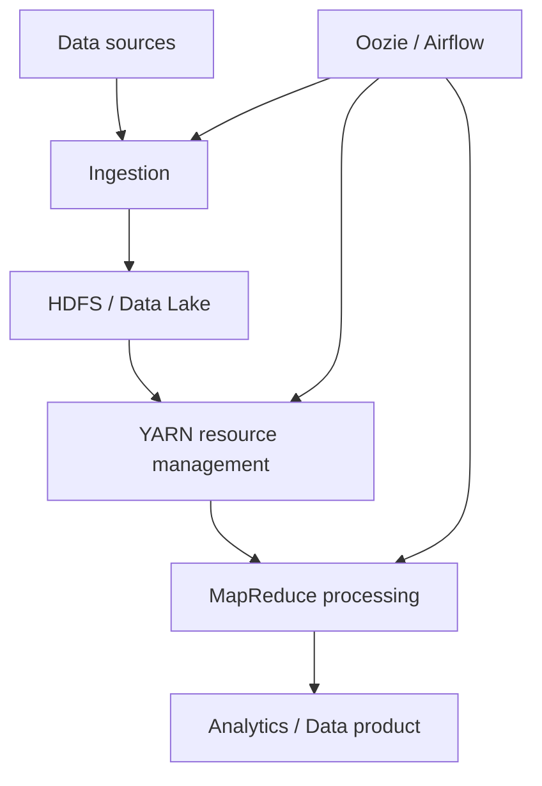
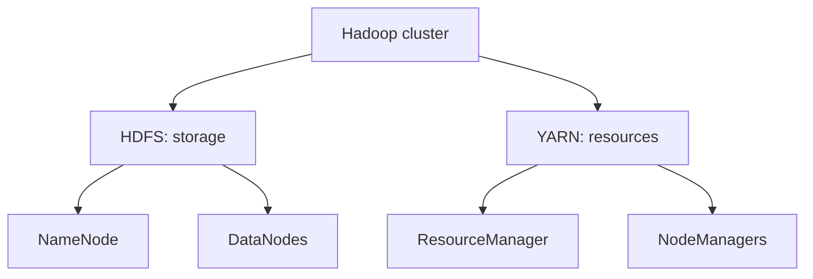
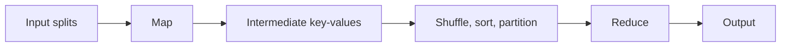
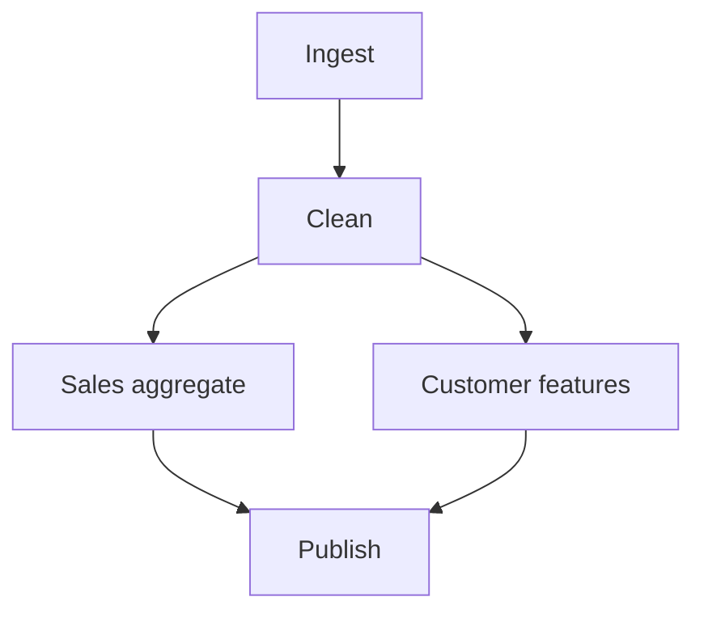

# DADS6002 Week 01: Big Data and Hadoop

> รายวิชา: DADS6002 Big Data Analytics
>
> เอกสารหลัก: `dads6002_week1_hadoop.pdf` (85 หน้า)
>
> ขอบเขต: Data, Big Data, Data Product, Big Data Workflow, Lambda Architecture, Data Lake, Hadoop, HDFS, YARN, MapReduce, Hadoop Streaming, Combiner, Partitioner, Job Chaining, Oozie และ Apache Airflow

## วิธีอ่านบทสรุปนี้

บทสรุปแยกที่มาของเนื้อหาไว้ดังนี้

- **จากเอกสาร:** เนื้อหาที่ปรากฏใน PDF พร้อมเลขหน้า
- **คำอธิบายเพิ่มเติม:** ตัวอย่าง การแก้ความเข้าใจคลาดเคลื่อน และข้อมูลจากเอกสารทางการที่ช่วยให้เห็นภาพมากขึ้น
- **หมายเหตุปัจจุบัน:** บริบทของเทคโนโลยี ณ เวลาจัดทำ เพราะบางส่วนในสไลด์เป็น Hadoop ecosystem แบบดั้งเดิม

เลขหน้าทั้งหมดหมายถึงเลขหน้าของไฟล์ PDF โดยนับหน้าปกเป็นหน้า 1

---

## 1. ภาพรวมของบทเรียน

บทเรียนเริ่มจากประเภทของข้อมูลและคุณลักษณะ 5Vs ของ Big Data แล้วขยายไปสู่การสร้าง Data Product และ Big Data Workflow จากนั้นแนะนำ Lambda Architecture และ Data Lake ก่อนเข้าสู่แกนหลักของ Hadoop ได้แก่

1. **HDFS** สำหรับจัดเก็บข้อมูลแบบกระจาย
2. **YARN** สำหรับจัดสรรทรัพยากรของ cluster
3. **MapReduce** สำหรับประมวลผลข้อมูลแบบขนาน
4. **Oozie/Airflow** สำหรับจัดลำดับ ตั้งเวลา และติดตาม workflow

แก่นของบทเรียนคือ เมื่อข้อมูลใหญ่เกินกว่าจะเก็บหรือคำนวณด้วยเครื่องเดียว เราจะแบ่งข้อมูลและงานไปยังหลายเครื่อง โดยพยายาม **นำการคำนวณไปใกล้ข้อมูล** มากกว่าขนข้อมูลก้อนใหญ่ผ่านเครือข่าย



---

## 2. Learning Objectives

หลังทบทวนบทนี้ควรสามารถ

1. จำแนก structured, semi-structured และ unstructured data ได้
2. อธิบาย 5Vs และผลต่อการออกแบบระบบข้อมูลได้
3. อธิบายความสัมพันธ์ระหว่าง Data Product, Data Science Pipeline และ Big Data Workflow ได้
4. เปรียบเทียบ Batch Layer, Speed Layer และ Serving Layer ใน Lambda Architecture ได้
5. อธิบายบทบาทของ Data Lake และความแตกต่างจาก Data Warehouse ได้
6. อธิบายเหตุผลที่ Hadoop ต้องใช้ distributed storage และ distributed processing ได้
7. แยกบทบาทของ HDFS, YARN และ MapReduce ได้
8. อธิบาย NameNode, DataNode, ResourceManager, ApplicationMaster และ NodeManager ได้
9. ไล่กระบวนการ Map, Shuffle/Sort และ Reduce จากตัวอย่างได้
10. อธิบายประโยชน์และข้อจำกัดของ Combiner และ Partitioner ได้
11. อธิบาย Hadoop Streaming และการใช้ Python เป็น mapper/reducer ได้
12. แยก processing engine ออกจาก workflow orchestrator เช่น Oozie และ Airflow ได้

---

## 2.1 Prerequisite Knowledge

บทนี้ไม่ต้องการให้มีประสบการณ์ดูแล Hadoop cluster มาก่อน แต่ควรเข้าใจพื้นฐานต่อไปนี้

1. **File และ directory:** แยก local file system ออกจาก distributed file system และเข้าใจ path, permission และ command line เบื้องต้น
2. **Database:** รู้จัก table, row, column, schema และความแตกต่างระหว่าง transaction database กับงานวิเคราะห์
3. **Programming:** เข้าใจ function, input/output, loop และ key/value pair เพื่ออ่าน pseudo-code ของ MapReduce
4. **Network:** รู้ว่าการส่งข้อมูลระหว่างเครื่องมีต้นทุนและช้ากว่าการอ่านข้อมูลภายใน node จึงเกิดแนวคิด data locality
5. **Parallel processing:** แยกการแบ่งงานให้หลาย task ทำพร้อมกันออกจากการทำงานตามลำดับบนเครื่องเดียว

### แบบจำลองทางความคิดก่อนเริ่ม

ให้นึกถึงการนับคำในหนังสือ 1,000 เล่ม หากมีคนเดียวทำทั้งหมดจะช้า เราจึงแบ่งหนังสือให้หลายคน (**Map**) แล้วนำกระดาษสรุปของคำเดียวกันมารวมกอง (**Shuffle/Sort**) ก่อนให้คนอีกกลุ่มบวกยอดสุดท้าย (**Reduce**) Hadoop เพิ่มระบบจัดเก็บ กระจายงาน ตรวจความล้มเหลว และรันงานใหม่ให้กระบวนการนี้ทำงานกับเครื่องจำนวนมากได้

---

## 3. ประเภทของข้อมูล

### 3.1 เนื้อหาจากเอกสาร

เอกสารแบ่งข้อมูลออกเป็น 3 ประเภท (หน้า 2)

1. **Structured Data** เช่น record-based data และ relational tables
2. **Unstructured Data** เช่น text, log, image, audio, voice, video และ graph data
3. **Semi-structured Data** เช่น HTML, XML และ JSON

### 3.2 คำอธิบายเพิ่มเติม

| ประเภท | ลักษณะ | ตัวอย่าง | เครื่องมือที่พบบ่อย |
|---|---|---|---|
| Structured | schema และชนิดข้อมูลชัดเจน | ตารางยอดขาย, customer master | SQL, RDBMS, Data Warehouse |
| Semi-structured | มี key/tag แต่แต่ละ record ยืดหยุ่น | JSON, XML, event log | Spark, document database, parser |
| Unstructured | ไม่เหมาะกับโครงสร้างแถว-คอลัมน์ตายตัว | รูปภาพ เสียง วิดีโอ ข้อความ | object storage, NLP, computer vision |

คำว่า unstructured ไม่ได้หมายถึงข้อมูล “ไม่มีโครงสร้างใดเลย” เช่น รูปภาพยังมี resolution และ metadata แต่มันไม่มี schema แบบตารางที่ใช้ query เชิงสัมพันธ์ได้ทันที

ตัวอย่าง JSON ซึ่งเป็น semi-structured data:

```json
{
  "customer_id": "C001",
  "orders": [
    {"product_id": "P01", "amount": 500},
    {"product_id": "P02", "amount": 300}
  ]
}
```

ในงานจริงข้อมูลหนึ่งชุดอาจมีหลายรูปแบบร่วมกัน เช่น transaction table เป็น structured data แต่มีคอลัมน์ `payload` ที่เก็บ JSON และมี URL ชี้ไปยังภาพใบเสร็จ

---

## 4. Big Data และ 5Vs

### 4.1 เนื้อหาจากเอกสาร

เอกสารอธิบาย Big Data Characteristics ด้วย 5Vs (หน้า 3-5)

- **Volume:** ปริมาณข้อมูลมหาศาล
- **Variety:** ข้อมูลจากหลายแหล่งและหลายรูปแบบ
- **Velocity:** ข้อมูลไหลเข้ารวดเร็ว ต่อเนื่อง หรือเป็น real time
- **Veracity:** ปัญหา bias, noise, abnormality และคุณภาพข้อมูล
- **Value:** ความสามารถในการเปลี่ยนข้อมูลเป็นคุณค่า

หน้า 5 แสดงเส้นทางจาก descriptive analytics ไป predictive และ prescriptive analytics โดย value และ difficulty เพิ่มขึ้นตามลำดับ

### 4.2 คำอธิบายเพิ่มเติม

| V | คำถามในการออกแบบระบบ | ตัวอย่างปัญหา |
|---|---|---|
| Volume | เก็บและประมวลผลทันหรือไม่ | transaction หลายพันล้านรายการ |
| Variety | อ่านและเชื่อมข้อมูลต่างรูปแบบอย่างไร | SQL + JSON + image + log |
| Velocity | ต้องตอบเร็วเพียงใด | fraud detection ภายในไม่กี่วินาที |
| Veracity | เชื่อถือข้อมูลได้เพียงใด | duplicate, missing, sensor ผิดปกติ |
| Value | ผลลัพธ์ช่วยใครและทำอะไรต่อ | ลด stockout หรือเพิ่ม conversion |

Big Data จึงเป็นปัญหาเชิงสถาปัตยกรรม ไม่ใช่ตัวเลขตายตัวว่าไฟล์ต้องใหญ่กี่ GB ระบบหนึ่งอาจมอง 100 GB ว่าเล็ก แต่อีกระบบที่มีเครื่องเดียวและต้องตอบผลภายในหนึ่งวินาทีอาจมองว่าใหญ่เกินความสามารถ

**Value** ควรเป็นจุดเริ่มและจุดจบของโครงการ ถ้าเก็บข้อมูลจำนวนมากแต่ไม่มีการตัดสินใจหรือกระบวนการที่จะใช้ผลลัพธ์ ข้อมูลนั้นสร้างต้นทุนมากกว่าคุณค่า

---

## 5. Data Product และ Data Science

### 5.1 เนื้อหาจากเอกสาร

เอกสารนิยาม Data Product ว่าเป็น data-driven application ที่ใช้ข้อมูลสร้างคุณค่า และเมื่อถูกใช้งานก็สร้างข้อมูลและคุณค่าใหม่กลับเข้าสู่ระบบ (หน้า 6) ตัวอย่างได้แก่

- Amazon แนะนำสินค้าจากพฤติกรรมการซื้อของลูกค้าที่คล้ายกัน
- Facebook ใช้ social graph เพื่อหา community จาก mutual friends
- รถยนต์ไร้คนขับใช้ sensor data เพื่อปรับปรุงแพลตฟอร์มการขับขี่

Data Science เป็นศาสตร์สหวิทยาการสำหรับสร้าง Data Product อย่างมีประสิทธิภาพ (หน้า 7) ประกอบด้วย Machine Learning, Software Engineering, Statistics, Database Management และ Distributed Computing

### 5.2 คำอธิบายเพิ่มเติม

Data Product ต่างจากรายงานแบบครั้งเดียวตรงที่มีวงจร feedback:


ตัวอย่างระบบแนะนำสินค้า:

1. ผู้ใช้ดูหรือซื้อสินค้า
2. ระบบบันทึก interaction
3. แบบจำลองปรับคะแนนความสนใจ
4. ระบบแนะนำสินค้าชุดใหม่
5. การตอบสนองต่อคำแนะนำกลายเป็นข้อมูลรอบถัดไป

Data Product ไม่จำเป็นต้องใช้ Machine Learning เสมอไป ระบบเตือน stockout จากกฎทางธุรกิจก็เป็น Data Product ได้ หากมีผู้ใช้ กระบวนการตัดสินใจ และการดูแลคุณภาพอย่างต่อเนื่อง

---

## 6. Data Science Pipeline และ Big Data Workflow

### 6.1 เนื้อหาจากเอกสาร

Data Science Pipeline เป็น workflow สำหรับสร้าง Data Product โดยมนุษย์เป็นผู้ขับเคลื่อนและใช้ scripting language ช่วยงาน แต่รูปแบบดังกล่าวอาจไม่เหมาะกับข้อมูลที่ใหญ่ เร็ว และหลากหลายมาก (หน้า 8)

เอกสารเสนอ Big Data Pipeline แบบวนซ้ำ โดยแบ่งเป็น 4 phase (หน้า 9-11)

1. **Ingestion:** ค้นหาแหล่งข้อมูล นำข้อมูลเข้า และรับ feedback จากผู้ใช้
2. **Staging:** แปลงและเก็บข้อมูลให้พร้อมใช้ เช่น normalization, standardization และ data management
3. **Computation:** วิเคราะห์หรือทำ Machine Learning เพื่อสร้าง insight/model
4. **Workflow Management:** abstraction, orchestration และ automation เพื่อให้กระบวนการทำงานจริงใน production

### 6.2 คำอธิบายเพิ่มเติม

| Phase | ตัวอย่างงาน | ตัวอย่างเครื่องมือ |
|---|---|---|
| Ingestion | database extract, API, CDC, event stream | Sqoop, Flume, Kafka |
| Staging | clean, validate, standardize, partition | HDFS, Spark, Hive |
| Computation | aggregate, train model, graph analysis | MapReduce, Spark, MLlib |
| Workflow Management | schedule, dependency, retry, monitor | Oozie, Airflow |

**Batch ingestion** นำข้อมูลเป็นรอบ เช่น ทุกคืน ส่วน **streaming ingestion** รับ event ต่อเนื่อง ความต้องการ latency เป็นตัวกำหนดว่าควรใช้แบบใด ไม่ใช่ว่า streaming ดีกว่าเสมอ เพราะ streaming เพิ่มต้นทุนและความซับซ้อน

คำว่า **orchestration** หมายถึงการควบคุมว่า task ใดรันเมื่อใด ต้องรออะไร เมื่อผิดพลาดให้ retry อย่างไร และส่งสัญญาณเตือนให้ใคร ไม่ใช่การคำนวณข้อมูลแทน processing engine

---

## 7. Lambda Architecture

### 7.1 เนื้อหาจากเอกสาร

เอกสารอธิบาย Lambda Architecture ว่าเป็นสถาปัตยกรรมประมวลผลที่รวม batch และ real-time stream processing เพื่อรองรับข้อมูลปริมาณมากและตอบสนองแบบ real time (หน้า 12-18) มี 3 ส่วนหลัก

1. **Batch Layer:** เก็บ master raw dataset ทั้งข้อมูลอดีตและล่าสุด และสร้าง batch view จาก aggregate/metric สำคัญ
2. **Speed Layer:** ประมวลผลข้อมูลที่เพิ่งเข้ามาเพื่อให้ได้ผลลัพธ์ latency ต่ำ
3. **Serving Layer:** ให้บริการ query โดยรวมผลจาก batch view และ real-time view

### 7.2 คำอธิบายเพิ่มเติม

| Layer | จุดเด่น | ข้อจำกัด |
|---|---|---|
| Batch | ครบถ้วน คำนวณใหม่จากข้อมูลต้นฉบับได้ | latency สูง |
| Speed | เห็นข้อมูลใหม่รวดเร็ว | logic ซ้ำและดูแลยาก |
| Serving | ให้ผู้ใช้ query ผลลัพธ์ที่เตรียมไว้ | ต้องรวมมุมมองจากสองเส้นทางให้ถูกต้อง |

ตัวอย่าง Dashboard ยอดขาย:

- ยอดถึงเมื่อวานมาจาก Batch Layer
- ยอดของวันนี้มาจาก Speed Layer
- Serving Layer รวมสองส่วนก่อนแสดงผล

ข้อเสียสำคัญคือทีมต้องรักษา logic สองชุดให้ให้ผลสอดคล้องกัน ปัจจุบันจึงมีแนวคิด **Kappa Architecture** ซึ่งใช้ stream processing เป็นเส้นทางหลัก หรือใช้ unified engine เช่น Spark/Flink ลดความซ้ำซ้อน อย่างไรก็ตาม Lambda Architecture ยังสำคัญเพราะอธิบาย trade-off ระหว่าง completeness กับ latency ได้ชัดเจน

---

## 8. Data Lake

### 8.1 เนื้อหาจากเอกสาร

Data Lake เป็น repository กลางสำหรับเก็บข้อมูลหลากหลาย schema และรูปแบบ ตั้งแต่ raw source data ไปจนถึง transformed data (หน้า 19-21) รองรับ relational data, CSV, logs, XML, JSON, documents, PDF, image, audio และ video งานปลายทางอาจเป็น reporting, visualization, analytics และ Machine Learning

เอกสารยก HDFS, Amazon S3 และ Azure Data Lake เป็นตัวอย่าง distributed storage และอธิบายว่าข้อมูลใน lake สามารถผ่าน ETL เพื่อสร้าง Data Warehouse/Data Mart แล้วนำไปวิเคราะห์ด้วยเครื่องมืออื่น (หน้า 20)

หน้า 21 แสดง Data Lake Pattern: Data Sources → Raw Data → Transformations → Data Ready for Each Need

### 8.2 คำอธิบายเพิ่มเติม

| ประเด็น | Data Lake | Data Warehouse |
|---|---|---|
| รูปแบบข้อมูล | ทุกประเภท | structured เป็นหลัก |
| สภาพข้อมูล | raw ถึง curated | ผ่านการจัดรูปแบบแล้ว |
| Schema | มัก schema-on-read | มัก schema-on-write |
| งานเด่น | exploration, ML, large-scale processing | BI, governed reporting |
| ผู้ใช้หลัก | Data Engineer/Data Scientist | Analyst/Business User |

- **Schema-on-write:** ตรวจและจัดข้อมูลให้ตรง schema ก่อนเก็บ
- **Schema-on-read:** เก็บข้อมูลก่อน แล้วกำหนดวิธีตีความเมื่ออ่าน

Data Lake ที่ไม่มี catalog, ownership, quality control และ lifecycle management อาจกลายเป็น **data swamp** คือมีข้อมูลจำนวนมากแต่ค้นหา ไม่เข้าใจ หรือเชื่อถือไม่ได้

**หมายเหตุปัจจุบัน:** Lakehouse เพิ่ม transaction log, schema enforcement, versioning และ table semantics บน Data Lake ตัวอย่างที่เป้พบใน Microsoft Fabric คือ OneLake + Lakehouse/Delta table

---

## 9. Hadoop Ecosystem และ Distributed Computing

### 9.1 เนื้อหาจากเอกสาร

Hadoop เป็น ecosystem ของเครื่องมือบน cluster ซึ่งรองรับบางส่วนของ Big Data Pipeline (หน้า 22)

- Sqoop, Flume และ Kafka: ingestion
- HBase และ Hive: data management
- Spark GraphX, MLlib และ Mahout: analytics/ML

เอกสารอธิบาย Hadoop ว่าเป็นเสมือน operating system for Big Data ซึ่งกระจายการคำนวณของข้อมูลขนาดใหญ่ไปยังหลายเครื่อง แต่ละเครื่องทำงานกับข้อมูลส่วนของตนพร้อมกัน (หน้า 23)

ข้อกำหนดของ distributed system ที่เอกสารกล่าวถึง (หน้า 24-25) ได้แก่

- **Fault tolerance:** component หนึ่งเสียแล้วระบบทั้งหมดไม่ล้ม
- **Recoverability:** กู้คืนได้โดยข้อมูลไม่สูญหาย
- **Consistency:** job หนึ่งล้มไม่ควรทำให้ผลสุดท้ายผิด
- **Scalability:** ภาระเพิ่มแล้วประสิทธิภาพลดอย่างควบคุมได้ และเพิ่ม resource แล้ว performance ควรเพิ่มตาม

หลักการที่ Hadoop ใช้ (หน้า 26-28): กระจายข้อมูลทันทีเมื่อเข้า cluster, เก็บซ้ำเพื่อความปลอดภัย, แบ่งไฟล์เป็น block, แบ่ง job เป็น task, ประมวลผลใกล้ข้อมูล, ลด network traffic, ทำ task redundancy และใช้ master จัดสรรงานให้ worker

### 9.2 คำอธิบายเพิ่มเติมและการแก้ความเข้าใจ

Hadoop ไม่ได้พัฒนาโดย Google โดยตรง Hadoop เริ่มโดย Doug Cutting และ Mike Cafarella และได้รับอิทธิพลจากงานวิจัย **Google File System** และ **Google MapReduce** ดังนั้นข้อความ “developed by Google” ในหน้า 23 ควรตีความว่า “ได้รับแรงบันดาลใจจากเทคโนโลยีของ Google”

Hadoop เป็น framework/ecosystem มากกว่าระบบปฏิบัติการจริง คำว่า “Operating System for Big Data” เป็นการเปรียบเทียบว่ามันมีบริการพื้นฐานด้าน storage, resource และ processing ให้ application ใช้ร่วมกัน

### 9.3 Data locality

แนวคิดสำคัญคือ **moving computation is cheaper than moving data** หาก block ขนาดใหญ่เก็บอยู่ที่ Node A ระบบควรส่งโปรแกรมขนาดเล็กไปทำงานที่ Node A แทนส่ง block ผ่าน network ไป Node B

Data locality มีหลายระดับ:

1. **Node-local:** task ทำงานบน node ที่มี block
2. **Rack-local:** อยู่คนละ node แต่ rack เดียวกัน
3. **Off-rack:** ต้องข้าม rack ซึ่งใช้ bandwidth มากกว่า

### 9.4 Replication และ Erasure Coding

เอกสารกล่าวว่า Hadoop v2 ทำ replication และ Hadoop v3 ใช้ parity block หรือ erasure coding (หน้า 26, 39) ในทางปฏิบัติ Hadoop 3 ยังรองรับ replication อยู่ และเพิ่ม Erasure Coding เป็นอีกทางเลือก ไม่ใช่เปลี่ยนทุกข้อมูลเป็น erasure coding อัตโนมัติ

- Replication กู้คืนง่ายและอ่านเร็ว แต่ใช้พื้นที่มาก
- Erasure Coding ประหยัดพื้นที่กว่า แต่การเข้ารหัส/กู้คืนใช้ CPU และ network มากขึ้น

---

## 10. Hadoop Architecture: HDFS และ YARN

### 10.1 เนื้อหาจากเอกสาร

Hadoop มีองค์ประกอบหลักสองส่วน (หน้า 29-32)

1. **HDFS (Hadoop Distributed File System):** จัดการข้อมูลบน disk และการเข้าถึงข้อมูลทั่ว cluster
2. **YARN (Yet Another Resource Negotiator):** จัดการ resource เช่น CPU และ memory ให้ application

HDFS และ YARN ทำงานร่วมกันเพื่อลด network traffic รักษา fault tolerance และรองรับ speculative execution คือรัน task สำเนาบน node อื่นเมื่อ task เดิมไม่มีความคืบหน้า แล้วเก็บผลจากตัวที่เสร็จก่อน (หน้า 31)

เครื่องใน cluster แบ่งตาม service ที่รันเป็น **master node** ซึ่งประสานงาน และ **worker node** ซึ่งเก็บข้อมูลหรือรัน task (หน้า 32)



### 10.2 คำอธิบายเพิ่มเติม

HDFS ตอบคำถามว่า **ข้อมูลอยู่ที่ไหน** ส่วน YARN ตอบว่า **ทรัพยากรคำนวณอยู่ที่ไหนและใครได้ใช้** scheduler จึงสามารถจัด task ไปยัง node ที่มีทั้งข้อมูลและ resource ว่าง

Speculative execution ช่วยแก้ปัญหา **straggler** หรือ task ที่ช้าผิดปกติ แต่ไม่เหมาะกับงานที่มี side effect แบบไม่เป็น idempotent เช่นส่งอีเมลหรือบันทึกธุรกรรมภายนอกซ้ำโดยไม่มีการป้องกัน

---

## 11. HDFS Architecture

### 11.1 NameNode

**จากเอกสาร (หน้า 33):** NameNode เป็น master ที่เก็บ directory tree, file metadata และตำแหน่งไฟล์ใน cluster รวมถึง `fsimage` ซึ่งเป็น snapshot ของ file system metadata และ `editlogs` ซึ่งบันทึกการเปลี่ยนแปลงหลัง NameNode เริ่มทำงาน

NameNode ไม่ได้เป็นทางผ่านของเนื้อหาไฟล์ทุก byte กระบวนการอ่านโดยสรุปคือ

1. Client ขอ block locations จาก NameNode
2. NameNode ส่งรายชื่อ DataNode ที่มี block
3. Client อ่าน block จาก DataNode โดยตรง

ดังนั้น NameNode เป็น metadata service ส่วน DataNode เป็น data service

### 11.2 Secondary NameNode

**จากเอกสาร (หน้า 34):** Secondary NameNode ทำ housekeeping และ checkpoint โดยนำ edit logs มารวมกับสำเนา fsimage แล้วส่ง fsimage ที่ปรับปรุงกลับไป

**คำอธิบายเพิ่มเติม:** Secondary NameNode **ไม่ใช่ backup NameNode** และไม่ได้พร้อมรับงานแทนโดยอัตโนมัติเมื่อ NameNode ล้ม ใน production cluster ที่ต้องการ High Availability จะใช้ Active NameNode และ Standby NameNode พร้อมกลไก synchronization/failover

### 11.3 DataNode

**จากเอกสาร (หน้า 34):** DataNode เป็น worker ที่เก็บและจัดการ HDFS blocks บน local disk และรายงานสุขภาพ/สถานะกลับ NameNode

**คำอธิบายเพิ่มเติม:** DataNode ส่งข้อมูลสำคัญ เช่น

- **Heartbeat:** แจ้งว่ายังทำงานอยู่
- **Block report:** รายงาน block ที่ node เก็บอยู่

หาก heartbeat หายเกินเกณฑ์ NameNode จะมอง node ว่าใช้งานไม่ได้ และจัดการสร้าง replica เพิ่มบน node อื่นหากจำนวนสำเนาต่ำกว่าที่กำหนด

### 11.4 HDFS read/write แบบย่อ

| การอ่าน | การเขียน |
|---|---|
| Client ขอ block locations จาก NameNode | Client ขอสร้างไฟล์จาก NameNode |
| อ่านจาก replica ที่เหมาะสม/ใกล้ที่สุด | NameNode เลือก DataNode pipeline |
| เมื่อจบ block จึงอ่าน block ถัดไป | Client ส่ง packet ผ่าน DataNode ต่อกัน |
| หาก node เสีย เปลี่ยนไป replica อื่น | แต่ละ DataNode เขียน block และส่ง acknowledgement ย้อนกลับ |

---

## 12. YARN Architecture

### 12.1 เนื้อหาจากเอกสาร

YARN มี service หลักดังนี้ (หน้า 35-37)

- **ResourceManager:** master ที่จัดสรรและติดตามทรัพยากรของ cluster รวมถึง scheduling
- **ApplicationMaster:** master ต่อหนึ่ง application ทำหน้าที่ประสาน application ตามที่ ResourceManager จัดให้
- **NodeManager:** worker บนแต่ละ node ทำหน้าที่รัน/จัดการ processing task และรายงานสถานะ

เอกสารแนะนำให้ master process อยู่บน node ของตัวเองเพื่อไม่ให้แย่ง resource และเป็น bottleneck แต่ cluster ขนาดเล็กอาจใช้ master สอง node (หน้า 36)

### 12.2 คำอธิบายเพิ่มเติม

ลำดับการรัน application แบบง่าย:

1. Client submit application ไปยัง ResourceManager
2. ResourceManager จัด container แรกสำหรับ ApplicationMaster
3. ApplicationMaster ขอ containers เพิ่มตามจำนวน task
4. NodeManager เปิด containers และรัน task
5. ApplicationMaster ติดตามความคืบหน้าและจัดการ retry
6. เมื่อเสร็จ ApplicationMaster คืน resource

**Container** ใน YARN คือหน่วยทรัพยากรที่จัดสรร เช่น memory และ vCore ไม่จำเป็นต้องหมายถึง Docker container

---

## 13. HDFS Concepts และ Command Line

### 13.1 เนื้อหาจากเอกสาร

HDFS เป็น software layer บน native file system และทำงานได้ดีกับไฟล์จำนวนน้อยแต่ขนาดใหญ่ (หน้า 38) ใช้แนวคิด WORM: Write Once, Read Many จึงไม่เหมาะกับ random update, real-time interactive update หรือ record-based transaction

ไฟล์แบ่งเป็น block ขนาด 64 MB หรือ 128 MB และกระจายไปหลาย DataNode โดยค่า replication ที่ยกในเอกสารคือ 3 (หน้า 38-39)

ติดต่อ HDFS ได้ผ่าน CLI, HTTP interface และ Java API (หน้า 40)

### 13.2 คำอธิบายเพิ่มเติม

ระบบปัจจุบันมักใช้ block 128 MB หรือมากกว่า แต่ปรับค่าได้ Block เป็นหน่วยเชิงตรรกะสำหรับกระจายและจัดการข้อมูล ไม่ได้หมายความว่าไฟล์ 1 MB จะใช้เนื้อที่จริง 128 MB เสมอไป

ไฟล์เล็กจำนวนมากก่อ **Small Files Problem** เพราะแต่ละไฟล์/block มี metadata ที่ NameNode ต้องเก็บใน memory และแต่ละ task มี overhead ในการ schedule

HDFS รองรับ append ที่ปลายไฟล์ใน Hadoop รุ่นใหม่ แต่ยังไม่เหมาะกับการ update row ตรงกลางไฟล์แบบ OLTP database

### 13.3 คำสั่งจากเอกสาร (หน้า 41-42)

```bash
# อัปโหลด local file เข้า HDFS
hadoop fs -put x.txt /user/cloudera/y.txt

# ดาวน์โหลดจาก HDFS
hadoop fs -get /user/cloudera/y.txt x.txt

# สร้าง directory พร้อม parent
hadoop fs -mkdir -p /user/cloudera/corpora

# แสดงรายการ
hadoop fs -ls /user/cloudera

# ย้าย คัดลอก และลบ
hadoop fs -mv /user/cloudera/x.txt /user/cloudera/rawdata
hadoop fs -cp /user/cloudera/x.txt /user/cloudera/y.txt
hadoop fs -rm /user/cloudera/x.txt

# กำหนด permission: owner rw, group rw, others r
hadoop fs -chmod 664 /user/cloudera/x.txt
```

หมายเหตุ: เครื่องหมาย option ใน PDF บางจุดแสดงเป็น typographic dash (`–`) เวลารันจริงต้องใช้ hyphen (`-`)

---

## 14. MapReduce

### 14.1 แนวคิดหลักจากเอกสาร

MapReduce เป็น computational framework สำหรับ distributed computation ที่ทนต่อความล้มเหลว ใช้ functional programming style ให้ task อิสระทำงานกับข้อมูลส่วนที่อยู่ใกล้ตน และส่งข้อมูลระหว่าง phase ผ่าน key/value pair (หน้า 43-45)

1. **Map:** รับ input key/value แล้วสร้าง intermediate key/value ตั้งแต่ศูนย์ถึงหลายคู่
2. **Shuffle and Sort:** Hadoop จัดกลุ่มและเรียงข้อมูลตาม key และแบ่งให้ reducer
3. **Reduce:** รวม/สรุปรายการ values ของแต่ละ key แล้วส่ง final key/value

หน้า 46-47 แสดงภาพตั้งแต่ input/split → mapper → intermediate results/combiner → group by key/shuffle → reducer → output



### 14.2 คำอธิบายเพิ่มเติม

MapReduce scale ได้เพราะ mapper หลายตัวทำงานโดยไม่แชร์ state กัน แต่ shuffle มักเป็นช่วงแพงที่สุด เนื่องจากต้อง sort, spill ลง disk และส่งข้อมูลข้าม network

จำนวน mapper มักสัมพันธ์กับ input split ส่วนจำนวน reducer เป็น configuration ของ job จึงไม่ควรจำว่า “หนึ่ง block เท่ากับหนึ่ง mapper” ทุกกรณี แม้จะเป็นภาพพื้นฐานที่ช่วยให้เข้าใจ

---

## 15. MapReduce Example 1: Word Count

### 15.1 เนื้อหาจากเอกสาร

Pseudo-code ในหน้า 48:

```text
map(dockey, line):
    for word in line.split():
        emit(word, 1)

reduce(word, values):
    count = sum(values)
    emit(word, count)
```

เอกสารแบ่งข้อความเป็นสอง block (หน้า 50-51)

```text
The fast cat wears no hat.
The cat in the hat ran fast.
```

Mapper สร้าง `(word, 1)` จากนั้น Hadoop ทำ shuffle/sort (หน้า 52-53) เช่น

```text
("cat",  [1, 1])
("fast", [1, 1])
("hat",  [1, 1])
("in",   [1])
```

Reducer รวมค่าเป็นผลลัพธ์ (หน้า 54)

```text
("cat", 2)
("fast", 2)
("hat", 2)
("in", 1)
```

### 15.2 คำอธิบายเพิ่มเติม

ตัวอย่างสไลด์ช่วยอธิบาย MapReduce แต่ในงานจริงควรทำ normalization ด้วย ไม่เช่นนั้น `The` กับ `the` และ `hat` กับ `hat.` อาจกลายเป็นคนละ key

```python
import re

words = re.findall(r"[a-z]+", line.lower())
```

`emit` ไม่ใช่คำสั่ง Python มาตรฐาน แต่เป็นแนวคิดของการส่ง output ไปยัง phase ถัดไป

---

## 16. MapReduce Example 2: Shared Friendship

### 16.1 เนื้อหาจากเอกสาร

โจทย์หน้า 55-64 ต้องการหาเพื่อนร่วมกันของผู้ใช้สองคน เพื่อนำไปใช้กับ “people you might know” Input คือชื่อบุคคลและรายชื่อเพื่อน Output คือ common friends ของแต่ละคู่

Mapper สร้าง canonical pair โดยเรียงชื่อก่อน เช่นข้อมูล

```text
Allen -> Betty, Chris, David
Betty -> Allen, Chris, David, Ellen
```

จะสร้าง key `(Allen, Betty)` จากทั้งฝั่ง Allen และ Betty แล้ว shuffle ทำให้ friend lists ทั้งสองมาถึง reducer เดียวกัน Reducer หา intersection:

```text
(Allen, Betty) -> (Chris, David)
(Allen, Chris) -> (Betty, David)
(Allen, David) -> (Betty, Chris)
```

### 16.2 คำอธิบายเพิ่มเติม

การ sort ชื่อใน pair สำคัญ เพราะ `(Allen, Betty)` และ `(Betty, Allen)` ต้องเป็น key เดียวกัน ตัวอย่างนี้แสดงว่า MapReduce ไม่ได้ทำได้เฉพาะ sum/count แต่ทำ set operations และ graph preprocessing ได้

ข้อควรระวังคือผู้ใช้ที่มีเพื่อนจำนวนมากจะสร้าง pair และข้อมูล intermediate จำนวนมาก ทำให้เกิด data skew และ shuffle cost สูง

---

## 17. MapReduce Jobs และ Hadoop Streaming

### 17.1 เนื้อหาจากเอกสาร

MapReduce job สามารถเขียนด้วย Java หรือภาษาอื่น แล้ว compile เป็น JAR ซึ่ง Hadoop ส่งไปยัง node ที่จะรัน mapper/reducer (หน้า 65)

Hadoop Streaming เปิดให้ใช้ shell utilities, R หรือ Python โดยสื่อสารผ่าน Unix streams (หน้า 66-72)

- Mapper/reducer อ่าน input จาก `stdin`
- เขียน output ไป `stdout`
- key/value คั่นด้วย tab (`\t`)
- Hadoop เปิด executable แยกต่อ task และ pipe ข้อมูลเข้า/ออก

หน้า 67 แสดง flow จาก HDFS input → split → mapper processes → shuffle/sort → reducer processes → output files

### 17.2 ตัวอย่าง Python ที่แก้ syntax ให้รันได้

ตัวอย่าง Python ในหน้า 69-72 มี capitalization, semicolon, `__name__` และ string formatting ที่ไม่ใช่ Python syntax ที่ถูกต้อง โค้ดที่สื่อความหมายเดียวกันคือ

**Mapper:**

```python
#!/usr/bin/env python3

import sys

for line in sys.stdin:
    for word in line.strip().split():
        print(f"{word}\t1")
```

**Reducer:**

```python
#!/usr/bin/env python3

import sys

current_key = None
total = 0

for line in sys.stdin:
    key, value = line.rstrip().split("\t")
    value = int(value)

    if key == current_key:
        total += value
    else:
        if current_key is not None:
            print(f"{current_key}\t{total}")
        current_key = key
        total = value

if current_key is not None:
    print(f"{current_key}\t{total}")
```

Reducer ใช้ตัวแปร `current_key` ได้เพราะ Hadoop sort key มาแล้ว ข้อมูล key เดียวกันจึงอยู่ติดกัน

---

## 18. Combiner

### 18.1 เนื้อหาจากเอกสาร

Mapper อาจสร้าง intermediate data จำนวนมาก ซึ่งเพิ่ม network traffic และ memory pressure ที่ reducer Combiner ทำ local reduction ที่ฝั่ง mapper ก่อน shuffle (หน้า 73-75)

ตัวอย่าง Mapper 1 เดิมส่ง 5 records:

```text
(IAD, 14.4), (SFO, 3.9), (JFK, 3.9), (IAD, 12.2), (JFK, 5.8)
```

หลัง combiner เหลือ:

```text
(IAD, 26.6), (SFO, 3.9), (JFK, 9.7)
```

จึงลดจำนวนข้อมูลที่ต้องส่งไป reducer

### 18.2 คำอธิบายเพิ่มเติม

Combiner เป็น optimization ที่ framework อาจเรียกศูนย์ครั้ง หนึ่งครั้ง หรือหลายครั้ง ดังนั้น correctness ของ job ห้ามขึ้นกับการถูกเรียก

เหมาะกับ operation แบบ associative/commutative เช่น sum, count, min, max แต่ **average ของ average** อาจผิด ต้องส่ง `(sum, count)` แล้วคำนวณ final average ที่ reducer

| Operation | ใช้ combiner ตรง ๆ ได้หรือไม่ | เหตุผล |
|---|---|---|
| Sum | ได้ | รวมผลย่อยซ้ำได้ |
| Count | ได้ | บวกจำนวนย่อยได้ |
| Min/Max | ได้ | min/max ของผลย่อยยังถูกต้อง |
| Average | ไม่ควรส่ง average อย่างเดียว | กลุ่มย่อยอาจมีขนาดไม่เท่ากัน |

หน้า 76 แสดงคำสั่ง submit Hadoop Streaming พร้อม `-mapper`, `-combiner`, `-reducer` และไฟล์ script ที่เกี่ยวข้อง

---

## 19. Partitioner และ Data Skew

### 19.1 เนื้อหาจากเอกสาร

Partitioner ควบคุมว่า key/value จะถูกส่งไป reducer ใด (หน้า 77) ค่าเริ่มต้นคือ HashPartitioner ซึ่งกระจาย key ตามจำนวน reducer ปัญหาเกิดเมื่อบาง key มี values จำนวนมากกว่าคีย์อื่นมาก สามารถเขียน custom partitioner โดยใช้ความรู้เฉพาะ domain ได้

### 19.2 คำอธิบายเพิ่มเติม

แนวคิดทั่วไป:

```text
partition = hash(key) % number_of_reducers
```

ทุก record ของ key เดียวกันต้องไป reducer เดียวกันเพื่อ aggregate ได้ถูกต้อง แต่การมีจำนวน key ต่อ reducer ใกล้เคียงกันไม่ได้รับประกัน workload เท่ากัน เช่น key `Bangkok` อาจมี 100 ล้าน records ส่วนจังหวัดอื่นมี 1 ล้าน records เกิด **data skew** และ reducer ตัวหนึ่งกลายเป็น straggler

แนวทางแก้ขึ้นกับโจทย์ เช่น custom partitioning, salting hot key, two-stage aggregation หรือเพิ่ม pre-aggregation แต่ต้องรักษาความถูกต้องของ final aggregation

---

## 20. Job Chaining และ DAG

### 20.1 เนื้อหาจากเอกสาร

หาก algorithm ซับซ้อนสามารถแบ่งเป็น MapReduce jobs เล็ก ๆ และ chain เป็น workflow แบบเส้นตรงหรือ Directed Acyclic Graph: DAG (หน้า 78)

Oozie เป็น scheduler สำหรับรันและจัดการ Hadoop jobs รองรับ sequential และ parallel workflow แบบ fork-join รวมถึง Hive, Pig, Sqoop, Java และ Shell (หน้า 79-81)

Oozie workflow มี

- **Control-flow nodes:** start, end, kill, fork, join, decision
- **Action nodes:** MapReduce, Pig, Shell command เป็นต้น

หน้า 81 แสดง Oozie Workflow ที่มี start, fork, งานขนาน, join, decision, kill และ end

### 20.2 คำอธิบายเพิ่มเติม

DAG คือกราฟมีทิศทางที่ไม่มีวงจรย้อนกลับ Task downstream จึงไม่สามารถวนกลับไปเป็น upstream ของตัวเอง



Oozie ผูกกับ Hadoop ecosystem ค่อนข้างมากและกำหนด workflow ด้วย XML จึงพบมากใน Hadoop platform แบบดั้งเดิม

---

## 21. Apache Airflow และ Workflows as Code

### 21.1 เนื้อหาจากเอกสาร

Airflow เป็น open-source platform สำหรับพัฒนา schedule และ monitor batch-oriented workflows ใช้ Python สร้าง workflow และมี web UI สำหรับ visualize, run และ debug (หน้า 82)

Airflow workflow นิยามเป็น Python และ DAG เก็บรายละเอียด เช่น schedule, tasks, dependencies, callbacks และ operational parameters (หน้า 83)

หน้า 84-85 แสดง DAG ชื่อ `demo` กำหนด schedule `0 0 * * *` มี BashOperator และ Python task โดยใช้ `>>` กำหนด dependency และสามารถใช้ `T1 >> [T2, T3]` ให้ T2/T3 ทำงานขนานหลัง T1

### 21.2 คำอธิบายเพิ่มเติม

Cron expression เรียงดังนี้:

```text
minute hour day-of-month month day-of-week
```

ดังนั้น `0 0 * * *` หมายถึงทุกวันเวลา 00:00 ตาม timezone/configuration ของ Airflow

Airflow เป็น **orchestrator ไม่ใช่ processing engine** ตัวมันจัดลำดับและส่งงานให้ระบบอื่น เช่น Spark, SQL engine, API หรือ shell process

```python
from datetime import datetime

from airflow.sdk import DAG, task
from airflow.providers.standard.operators.bash import BashOperator

with DAG(
    dag_id="demo",
    start_date=datetime(2022, 1, 1),
    schedule="0 0 * * *",
) as dag:
    hello = BashOperator(
        task_id="hello",
        bash_command="echo hello",
    )

    @task()
    def airflow_task():
        print("airflow")

    hello >> airflow_task()
```

| ประเด็น | Oozie | Airflow |
|---|---|---|
| Workflow definition | XML | Python |
| Ecosystem | Hadoop-centric | เชื่อมได้หลายระบบ |
| แนวคิด | coordinator/workflow | DAG/workflows as code |
| การใช้งานปัจจุบัน | พบใน Hadoop legacy | ใช้แพร่หลายใน data platform |
| เป็น processing engine หรือไม่ | ไม่ใช่ | ไม่ใช่ |

---

## 22. สถานการณ์ใช้งานจริงแบบ End-to-End

สมมติบริษัทต้องการวิเคราะห์ log การสั่งซื้อจำนวนหลาย TB ต่อวัน

1. **Ingestion:** Kafka รับ event จาก application
2. **Storage:** เก็บ raw events ใน HDFS/Data Lake โดย partition ตามวันที่
3. **Resource management:** YARN จัด memory/vCore ให้ processing job
4. **Processing:** MapReduce หรือ Spark แปลง event และ aggregate ยอดตามสินค้า
5. **Serving:** เขียนผลที่สรุปแล้วลง Hive/Data Mart
6. **Orchestration:** Airflow รัน pipeline รายวัน ตรวจ dependency และ retry เมื่อผิดพลาด
7. **Consumption:** BI dashboard และ recommendation service ใช้ผลลัพธ์

แนวคิดเดียวกันเมื่อเทียบกับ Microsoft Fabric:

| Hadoop-era concept | Microsoft Fabric โดยประมาณ |
|---|---|
| HDFS | OneLake |
| Data Lake | Lakehouse |
| Hive table | Lakehouse/Delta table |
| YARN cluster resources | Fabric managed Spark compute |
| MapReduce | Spark DataFrame transformations/actions |
| Oozie/Airflow | Data Factory Pipeline |
| Kafka | Eventstream/Event Hubs integration |

การจับคู่เป็นเพียง conceptual mapping ไม่ได้หมายความว่า component ทำงานเหมือนกันทุกประการ

---

## 22.1 Common Misconceptions

| ความเข้าใจที่คลาดเคลื่อน | เหตุใดจึงไม่ถูกต้อง | ความเข้าใจที่ถูกต้อง |
|---|---|---|
| Big Data หมายถึงข้อมูลหลาย TB เท่านั้น | ขนาดอย่างเดียวไม่ได้สะท้อน velocity, variety หรือข้อจำกัดของระบบ | Big Data เป็นข้อมูลที่คุณลักษณะและข้อกำหนดเกินความสามารถของแนวทางเดิมในบริบทนั้น |
| Hadoop ถูกพัฒนาโดย Google | Google เผยแพร่แนวคิด GFS และ MapReduce แต่ไม่ได้สร้าง Apache Hadoop | Hadoop เริ่มโดย Doug Cutting และ Mike Cafarella โดยได้รับแรงบันดาลใจจากงานของ Google |
| NameNode เก็บไฟล์จริงทั้งหมด | ถ้าเป็นเช่นนั้น NameNode จะเป็น data bottleneck | NameNode เก็บ namespace และ block metadata ส่วน DataNode เก็บ block จริง |
| Secondary NameNode คือเครื่องสำรอง | มันไม่ได้รับคำขอแทนทันทีเมื่อ NameNode ล้ม | หน้าที่หลักคือ checkpoint โดยรวม `fsimage` กับ `editlogs`; HA ใช้ Active/Standby NameNode |
| HDFS block 128 MB ทำให้ไฟล์ 1 MB ใช้พื้นที่จริง 128 MB | block เป็นหน่วยจัดการเชิงตรรกะ | block สุดท้ายเก็บเท่าข้อมูลจริงโดยไม่ต้องเติมศูนย์ให้เต็ม block |
| Hadoop 3 เลิก replication แล้วใช้ Erasure Coding ทั้งหมด | Hadoop 3 ยังรองรับ replication | Erasure Coding เป็นอีก storage policy ที่เลือกใช้ตาม workload |
| MapReduce คือมีแค่ Map และ Reduce | ขั้นกลางมีต้นทุนสำคัญและเป็นหัวใจของการจัดกลุ่ม | กระบวนการจริงต้องเข้าใจ split, map, partition, shuffle, sort และ reduce |
| หนึ่ง HDFS block เท่ากับหนึ่ง mapper เสมอ | InputFormat สามารถกำหนด input split ต่างจาก physical block | จำนวน mapperสัมพันธ์กับ input splits ไม่ใช่กฎตายตัวจากจำนวน block |
| Combiner เป็น mini-reducer ที่จะทำงานทุกครั้ง | Framework ไม่รับประกันจำนวนครั้งที่เรียก | ผลลัพธ์ต้องถูกต้องแม้ combiner ไม่ทำงาน และ operation ต้องรวมซ้ำได้อย่างปลอดภัย |
| HashPartitioner ทำให้ reducer ทุกตัวรับงานเท่ากัน | จำนวน key อาจใกล้กันแต่ values ต่อ key ต่างกันมาก | ต้องพิจารณา distribution และ data skew ไม่ใช่เพียงจำนวน key |
| Airflow ประมวลผล Big Data แทน Spark/MapReduce | Airflow ไม่ใช่ distributed processing engine | Airflow จัด schedule, dependency, retry และส่งงานให้ระบบประมวลผล |
| Data Lake คือการโยนไฟล์รวมกัน | ขาด metadata และ governance แล้วข้อมูลใช้งานไม่ได้ | Data Lake ต้องมี catalog, ownership, quality, security และ lifecycle management |

---

## 22.2 Likely Exam Focus

ส่วนนี้เป็นการอนุมานจากหัวข้อที่เอกสารเน้น ตัวอย่างหลายหน้า และคำศัพท์ที่ต้องแยกบทบาท ไม่ใช่ข้อมูลข้อสอบจริง

### Definitions to remember

- 5Vs: Volume, Variety, Velocity, Veracity และ Value
- HDFS, YARN, MapReduce, Data Lake, Data Product และ Lambda Architecture
- NameNode, Secondary NameNode, DataNode, ResourceManager, ApplicationMaster และ NodeManager
- Map, Shuffle/Sort, Reduce, Combiner และ Partitioner
- DAG, orchestration, data locality, fault tolerance และ speculative execution

### Processes to explain step by step

1. Big Data Workflow: Ingestion → Staging → Computation → Workflow Management
2. HDFS read/write ในระดับแนวคิด
3. การ submit application ผ่าน YARN
4. Word Count: Input Split → Map → Shuffle/Sort → Reduce
5. Hadoop Streaming ผ่าน `stdin`/`stdout`
6. Job chaining และการจัด dependency ด้วย DAG

### Comparisons likely to be tested

- Structured vs semi-structured vs unstructured data
- Data Lake vs Data Warehouse
- Batch Layer vs Speed Layer vs Serving Layer
- HDFS vs YARN vs MapReduce
- NameNode vs DataNode
- ResourceManager vs ApplicationMaster vs NodeManager
- Combiner vs Reducer
- Oozie vs Airflow
- Processing engine vs workflow orchestrator

### Code and calculations to perform

- เขียนหรืออ่าน pseudo-code ของ Word Count
- ไล่ intermediate key/value หลัง mapper และหลัง shuffle
- คำนวณผล reduce จาก grouped values
- อธิบายเหตุผลที่ average combiner ต้องส่ง `(sum, count)`
- อ่านคำสั่ง HDFS เช่น `-put`, `-get`, `-mkdir`, `-ls` และ `-chmod`
- อ่าน cron expression พื้นฐาน เช่น `0 0 * * *`

### Scenario-based decisions

- เลือก HDFS สำหรับไฟล์ใหญ่แบบ batch แต่ไม่เลือกสำหรับ OLTP random updates
- วินิจฉัย NameNode/DataNode/NodeManager failure จากอาการ
- เลือก combiner เมื่อ operation ทำ local aggregation ได้อย่างปลอดภัย
- แก้ reducer ช้าจาก hot key หรือ data skew
- เลือก batch, speed หรือทั้งสองเส้นทางตาม latency requirement
- แยกว่าปัญหาใดต้องแก้ด้วย storage, resource manager, processing engine หรือ orchestrator

### กรอบตอบข้อสอบอธิบาย

ตอบให้ครบสี่ส่วน: **นิยาม → กลไก → เหตุผล/ประโยชน์ → ข้อจำกัดหรือตัวอย่าง** เช่น หากถาม data locality ไม่ควรตอบเพียง “ประมวลผลใกล้ข้อมูล” แต่ควรอธิบายว่า scheduler พยายามวาง task บน node/rack ที่มี block เพื่อลด network traffic และอาจทำไม่ได้เมื่อ resource ไม่พอ

---

## 23. Key Takeaways

1. Big Data ประกอบด้วยปริมาณ ความหลากหลาย ความเร็ว ความน่าเชื่อถือ และคุณค่า ไม่ใช่แค่ไฟล์ใหญ่
2. Big Data Pipeline แยกเป็น ingestion, staging, computation และ workflow management
3. Lambda Architecture แลกความซับซ้อนของสอง processing paths กับความสามารถในการให้ทั้งผล batch ที่ครบและผล real time ที่เร็ว
4. Data Lake เก็บข้อมูลได้หลากหลาย แต่ต้องมี governance มิฉะนั้นอาจกลายเป็น data swamp
5. Hadoop กระจายทั้งข้อมูลและการคำนวณ และอาศัย data locality เพื่อลด network traffic
6. HDFS จัดเก็บข้อมูล ส่วน YARN จัดการ resource และ MapReduce ประมวลผล
7. NameNode เก็บ metadata ส่วน DataNode เก็บ block จริง
8. Secondary NameNode ทำ checkpoint ไม่ใช่ backup/failover NameNode
9. ResourceManager ดู resource ทั้ง cluster; ApplicationMaster ดูหนึ่ง application; NodeManager ดูแต่ละ node
10. MapReduce มีลำดับ Map → Shuffle/Sort/Partition → Reduce
11. Combiner ลด network traffic แต่ job ต้องถูกต้องแม้ combiner ไม่ถูกเรียก
12. Partitioner กำหนด reducer ของ key และต้องระวัง data skew
13. Hadoop Streaming ทำให้ Python/R/Shell ทำหน้าที่ mapper และ reducer ผ่าน stdin/stdout ได้
14. Oozie และ Airflow จัด workflow แต่ไม่ใช่ engine ที่คำนวณข้อมูลเอง

---

## 24. Glossary

| คำศัพท์ | ความหมาย |
|---|---|
| Big Data | ข้อมูลที่ขนาด ความเร็ว หรือความหลากหลายเกินความสามารถของแนวทางเดิมในบริบทหนึ่ง |
| Cluster | กลุ่มเครื่องที่ร่วมกันจัดเก็บหรือประมวลผล |
| Node | เครื่องหนึ่งเครื่องใน cluster |
| Master | service/node ที่ประสานงานและควบคุม |
| Worker | service/node ที่เก็บข้อมูลหรือรัน task |
| Distributed Computing | การแบ่งงานคำนวณไปหลายเครื่อง |
| Fault Tolerance | ความสามารถในการทำงานต่อเมื่อ component บางส่วนเสีย |
| Scalability | ความสามารถในการรองรับภาระเพิ่มโดยเพิ่มทรัพยากร |
| Data Locality | การรัน computation ใกล้ตำแหน่งข้อมูล |
| HDFS | Hadoop Distributed File System |
| Block | หน่วยเชิงตรรกะที่ HDFS ใช้แบ่งและกระจายไฟล์ |
| Replication Factor | จำนวนสำเนาของ block |
| Erasure Coding | การใช้ data/parity blocks เพื่อกู้คืนข้อมูลโดยใช้พื้นที่น้อยกว่า replication |
| NameNode | HDFS master ที่จัดการ namespace และ block metadata |
| DataNode | HDFS worker ที่เก็บ block |
| Secondary NameNode | service สำหรับ checkpoint metadata ไม่ใช่ failover backup |
| YARN | ระบบจัดการ resource และ application ของ Hadoop cluster |
| ResourceManager | YARN master ที่ดู resource ทั้ง cluster |
| ApplicationMaster | ตัวประสานงานของ application หนึ่งรายการ |
| NodeManager | agent ของ YARN บน worker node |
| Container | ชุด resource เช่น memory/vCore ที่ YARN จัดสรรให้ task |
| Map | phase ที่แปลง input เป็น intermediate key/value |
| Shuffle | การเคลื่อนและจัดกลุ่ม intermediate data ตาม key |
| Sort | การเรียง key ก่อนส่งเข้า reducer |
| Reduce | phase ที่รวม/สรุป values ของแต่ละ key |
| Combiner | local aggregation หลัง mapper เพื่อลดข้อมูลก่อน shuffle |
| Partitioner | logic ที่กำหนดว่า key ไป reducer ใด |
| Data Skew | การกระจายข้อมูลไม่สมดุลจน task บางตัวหนักผิดปกติ |
| Straggler | task ที่ช้ากว่า task อื่นอย่างมีนัยสำคัญ |
| Speculative Execution | การเปิด task สำเนาและใช้ผลจากตัวที่เสร็จก่อน |
| Hadoop Streaming | วิธีใช้ executable/script เป็น mapper/reducer ผ่าน stdin/stdout |
| DAG | Directed Acyclic Graph ใช้แทน task และ dependency ที่ไม่มีวงจร |
| Orchestration | การจัดลำดับ schedule retry monitor และ dependency ของ workflow |
| Oozie | Hadoop-oriented workflow scheduler |
| Airflow | Python-based workflow orchestration platform |
| Schema-on-read | กำหนด schema เมื่ออ่านข้อมูล |
| Schema-on-write | บังคับ schema ก่อนเขียนข้อมูล |
| Data Lake | repository สำหรับข้อมูลหลากหลายตั้งแต่ raw ถึง curated |
| Data Swamp | Data Lake ที่ขาด metadata, governance หรือคุณภาพจนใช้งานยาก |

---

## 25. คำถามทบทวนความเข้าใจ

คำถามแบ่งตามระดับความคิดเพื่อฝึกทั้งการจำ อธิบาย เปรียบเทียบ ประยุกต์ และวิเคราะห์ ควรลองตอบก่อนเปิดดูเฉลย

### ระดับ 1: Recall — Multiple Choice

**1. Component ใดเก็บ HDFS namespace และ block locations?**

A. DataNode
B. NameNode
C. NodeManager
D. ApplicationMaster

**2. ลำดับหลักของ MapReduce ข้อใดถูกต้องที่สุด?**

A. Reduce → Map → Shuffle
B. Map → Reduce → Partition
C. Map → Shuffle/Sort → Reduce
D. Shuffle → Map → Reduce

**3. Service ใดถูกสร้างขึ้นเพื่อประสานงาน application หนึ่งรายการบน YARN?**

A. ResourceManager
B. ApplicationMaster
C. Secondary NameNode
D. DataNode

**4. ข้อใดอธิบาย Secondary NameNode ได้ถูกต้อง?**

A. เก็บ replica ของทุก block
B. รับงานแทน NameNode ทันทีเมื่อ NameNode ล้ม
C. ทำ checkpoint โดยรวม fsimage กับ editlogs
D. จัดสรร CPU และ memory ให้ task

**5. เครื่องมือใดเป็น workflow orchestrator ไม่ใช่ processing engine?**

A. MapReduce
B. Spark
C. Airflow
D. HDFS

### ระดับ 2: Explain — Short Answer

**6. อธิบาย 5Vs และยกตัวอย่างผลต่อการออกแบบระบบอย่างน้อยสามข้อ**

**7. เหตุใด data locality จึงสำคัญ และระบบอาจยอมรัน task แบบ rack-local แทน node-local เมื่อใด?**

**8. อธิบายว่าเหตุใด HDFS จึงเหมาะกับไฟล์ใหญ่และ batch analytics แต่ไม่เหมาะกับ OLTP**

**9. อธิบายความสัมพันธ์ของ `fsimage`, `editlogs` และ checkpoint**

### ระดับ 3: Compare

**10. เปรียบเทียบ HDFS, YARN และ MapReduce โดยตอบว่าแต่ละระบบจัดการ “อะไร” และประสานกันอย่างไร**

**11. เปรียบเทียบ Combiner กับ Reducer อย่างน้อยสามประเด็น**

**12. เปรียบเทียบ Batch, Speed และ Serving Layer ของ Lambda Architecture พร้อมข้อดีและข้อจำกัด**

### ระดับ 4: Apply — Worked Problems

**13. Word Count**

ให้ input สองบรรทัด โดยสมมติ mapper แปลงเป็น lowercase และตัด punctuation แล้ว

```text
Data moves fast.
Big data moves.
```

จงแสดง

1. Mapper output
2. Output หลัง Shuffle/Sort
3. Reducer output

**14. Average with Combiner**

Mapper 1 อ่านค่า `10, 20` และ Mapper 2 อ่านค่า `30, 60, 90` ถ้าแต่ละ mapper ส่ง local average แล้ว reducer นำ average สองค่ามาเฉลี่ย ผลจะผิดอย่างไร และควรส่งค่าใดแทน?

**15. HDFS Command**

เขียนคำสั่งเพื่อ

1. สร้าง `/user/student/week01`
2. อัปโหลด `input.txt` ไปเป็น `/user/student/week01/input.txt`
3. แสดงรายการไฟล์ใน directory
4. ดาวน์โหลด output directory กลับเครื่อง

### ระดับ 5: Analyze — Scenario Based

**16. Data Skew Scenario**

Job สรุปยอดตามจังหวัดมี reducers 10 ตัว แต่ reducer หนึ่งใช้เวลา 50 นาที ขณะที่ตัวอื่นเสร็จภายใน 5 นาที ตรวจพบว่า key `Bangkok` มีข้อมูล 70% ของทั้งหมด จงวิเคราะห์สาเหตุและเสนอแนวทางแก้อย่างน้อยสองแนวทาง พร้อมข้อควรระวัง

**17. Failure Scenario**

DataNode หนึ่งหยุดส่ง heartbeat แต่ NameNode ยังทำงาน และ block ทุกก้อนมี replication factor 3 อธิบายผลกระทบระยะสั้นและสิ่งที่ HDFS ควรทำต่อ

**18. Architecture Decision**

บริษัทต้องการเก็บ transaction จำนวนมาก โดย Dashboard ยอมรับข้อมูลช้าได้หนึ่งวัน แต่ระบบชำระเงินต้องแก้ไขสถานะ transaction ภายในมิลลิวินาที ควรใช้ HDFS กับงานใด และไม่ควรใช้กับงานใด เพราะเหตุใด?

**19. Orchestration Scenario**

Pipeline ต้องรอไฟล์เข้า HDFS จากนั้นรัน MapReduce job ตรวจคุณภาพ สร้าง aggregate และส่งแจ้งเตือนเมื่อผิดพลาด อธิบายบทบาทของ Airflow โดยแยกสิ่งที่ Airflow ทำเองกับสิ่งที่ engine อื่นทำ

### Model Answers with Reasoning

**1. B — NameNode.** NameNode เก็บ namespace และตำแหน่ง block ส่วน DataNode เก็บ block จริง NodeManager และ ApplicationMaster อยู่ฝั่ง YARN

**2. C — Map → Shuffle/Sort → Reduce.** Partitioner ทำงานในเส้นทางระหว่าง mapper กับ reducer แต่ลำดับภาพรวมที่เอกสารเน้นคือสามช่วงนี้

**3. B — ApplicationMaster.** ResourceManager ดู resource ทั้ง cluster ส่วน ApplicationMaster ต่อรอง resource และติดตาม task ของ application ตนเอง

**4. C — ทำ checkpoint.** Secondary NameNode ลดภาระ editlogs ด้วยการรวมเข้ากับ fsimage แต่ไม่ใช่ automatic failover node

**5. C — Airflow.** Airflow จัด dependency, schedule, retry และ monitor แต่ส่ง computation ให้ engine เช่น MapReduce หรือ Spark

**6.** Volume ส่งผลต่อ storage/parallelism; Variety ต้องรองรับหลาย format/schema; Velocity กำหนด batch หรือ streaming; Veracity ทำให้ต้องมี validation/quality control; Value เชื่อมผลลัพธ์กับการตัดสินใจ คำตอบที่ดีต้องไม่เพียงแปลคำศัพท์ แต่เชื่อมแต่ละ V กับ design decision

**7.** Data locality ลดการส่งข้อมูลขนาดใหญ่ผ่าน network โดยวาง task ใกล้ replica หาก node ที่มี block ไม่มี CPU/memory ว่าง scheduler อาจเลือก node ใน rack เดียวกันเพื่อสมดุลระหว่าง locality กับเวลารอ resource

**8.** HDFS ใช้ block ใหญ่ การอ่านแบบ sequential และแนวคิด write-once/read-many จึงมี throughput สูงสำหรับ batch scan แต่มี overhead และไม่มี random row update/transaction semantics แบบ OLTP

**9.** `fsimage` คือ snapshot ของ metadata ส่วน `editlogs` เก็บการเปลี่ยนแปลงหลัง snapshot การ checkpoint คือ merge สองส่วนเป็น fsimage ใหม่ เพื่อให้ recovery ไม่ต้อง replay log ที่ยาวมาก

**10.** HDFS จัด storage และ block metadata; YARN จัด resource/container; MapReduce แบ่งและรัน computation ระบบประสานกันโดย YARN พยายามจัด task ไปยัง resource ใกล้ block ที่ HDFS เก็บ

**11.** Combiner ทำ local aggregation ที่ mapper, อาจไม่ถูกเรียก และใช้ลด shuffle; Reducer รับ grouped values หลัง shuffle, เป็นส่วนของผลลัพธ์ที่ job กำหนด และจำนวน reducer ถูกตั้งค่าได้ Logic ของ combiner ต้องปลอดภัยต่อการเรียกศูนย์หรือหลายครั้ง

**12.** Batch เก็บ/คำนวณข้อมูลทั้งหมดจึงครบแต่ช้า; Speed ประมวลผลข้อมูลล่าสุดจึงเร็วแต่ต้องรักษา logic อีกชุด; Serving รวม/ให้บริการ views ทำให้ query เร็วแต่ต้องทำให้ผลจากสองทางสอดคล้องกัน

**13.** Mapper output:

```text
(data,1) (moves,1) (fast,1)
(big,1) (data,1) (moves,1)
```

Shuffle/Sort:

```text
(big,[1]) (data,[1,1]) (fast,[1]) (moves,[1,1])
```

Reducer output:

```text
(big,1) (data,2) (fast,1) (moves,2)
```

เหตุผลคือ shuffle รับประกันว่า values ของ key เดียวกันถูกจัดกลุ่มก่อนรวม

**14.** Local averages คือ 15 และ 60 เมื่อนำมาเฉลี่ยได้ 37.5 แต่ค่าเฉลี่ยจริงคือ `(10+20+30+60+90)/5 = 42` เพราะกลุ่มมีจำนวนสมาชิกไม่เท่ากัน ควรส่ง `(sum,count)` คือ `(30,2)` และ `(180,3)` แล้ว reducer คำนวณ `210/5 = 42`

**15.**

```bash
hadoop fs -mkdir -p /user/student/week01
hadoop fs -put input.txt /user/student/week01/input.txt
hadoop fs -ls /user/student/week01
hadoop fs -get /user/student/week01/output ./output
```

**16.** สาเหตุคือ hot key ทำให้ HashPartitioner ส่งข้อมูล Bangkok ทั้งหมดไป reducer เดียว แนวทางแก้ เช่น salting key แล้ว aggregate สองรอบ หรือ pre-aggregate ที่ mapper/combiner หาก operation รองรับ อาจใช้ custom partitioning แต่ห้ามแยก key แล้วลืมรวมผลรอบสุดท้าย มิฉะนั้นคำตอบผิด

**17.** HDFS ยังอ่าน block จาก replica อื่นได้ จึงไม่ควรสูญเสียข้อมูลทันที NameNode ตรวจการหายของ heartbeat ทำเครื่องหมาย node ว่า unavailable และสั่ง re-replication ของ under-replicated blocks ไปยัง DataNode อื่นจนกลับถึง replication factor ที่ต้องการ

**18.** ใช้ HDFS เก็บประวัติ transaction เพื่อ batch analytics/รายงานรายวันได้ แต่ไม่ใช้เป็นฐานข้อมูลหลักของ payment state เพราะต้องการ low-latency random updates และ transaction guarantees ควรใช้ transactional database สำหรับระบบชำระเงินแล้วค่อยส่งสำเนาไป analytical storage

**19.** Airflow ตรวจ dependency/schedule สั่ง task, retry, บันทึกสถานะ และแจ้งเตือน ส่วนการอ่านไฟล์ การตรวจคุณภาพ และ aggregate ถูกทำโดย sensor/operator หรือ processing engine ที่ Airflow เรียก Airflow ไม่ได้แทน HDFS หรือ MapReduce

---

## 26. References

### เอกสารหลัก

- DADS6002 / CI7301, *Big Data Analytics: Hadoop*, 85 หน้า (`dads6002_week1_hadoop.pdf`)

### เอกสารทางการและความรู้เพิ่มเติม

- [Apache Hadoop 3.4.3 Documentation](https://hadoop.apache.org/docs/current/)
- [Apache Hadoop: HDFS Architecture](https://hadoop.apache.org/docs/current/hadoop-project-dist/hadoop-hdfs/HdfsDesign.html)
- [Apache Hadoop: HDFS High Availability](https://hadoop.apache.org/docs/current/hadoop-project-dist/hadoop-hdfs/HDFSHighAvailabilityWithQJM.html)
- [Apache Hadoop: YARN Architecture](https://hadoop.apache.org/docs/current/hadoop-yarn/hadoop-yarn-site/YARN.html)
- [Apache Hadoop: MapReduce Tutorial](https://hadoop.apache.org/docs/current/hadoop-mapreduce-client/hadoop-mapreduce-client-core/MapReduceTutorial.html)
- [Apache Hadoop: Hadoop Streaming](https://hadoop.apache.org/docs/current/hadoop-streaming/HadoopStreaming.html)
- [Apache Hadoop: HDFS Erasure Coding](https://hadoop.apache.org/docs/current/hadoop-project-dist/hadoop-hdfs/HDFSErasureCoding.html)
- [Apache Airflow: Core Concepts](https://airflow.apache.org/docs/apache-airflow/stable/core-concepts/)
- [Apache Airflow: DAGs](https://airflow.apache.org/docs/apache-airflow/stable/core-concepts/dags.html)
- [Apache Airflow: Tasks](https://airflow.apache.org/docs/apache-airflow/stable/core-concepts/tasks.html)
- [Apache Airflow: Scheduler](https://airflow.apache.org/docs/apache-airflow/stable/concepts/scheduler.html)
- [Google Research: The Google File System](https://research.google/pubs/the-google-file-system/)
- [Google Research: MapReduce - Simplified Data Processing on Large Clusters](https://research.google/pubs/mapreduce-simplified-data-processing-on-large-clusters/)

---

## 27. จุดที่เสริมจากภายนอกเอกสาร

หัวข้อต่อไปนี้เป็นคำอธิบายเพิ่มเติมจากความรู้และเอกสารทางการ ไม่ได้ระบุครบถ้วนใน PDF:

- Hadoop ไม่ได้พัฒนาโดย Google โดยตรง แต่ได้รับอิทธิพลจาก GFS และ Google MapReduce
- ระดับของ data locality: node-local, rack-local และ off-rack
- Hadoop 3 เพิ่ม Erasure Coding เป็นทางเลือก แต่ replication ยังใช้งานได้
- Active/Standby NameNode สำหรับ High Availability และเหตุผลที่ Secondary NameNode ไม่ใช่ backup
- HDFS read/write flow, heartbeat และ block report
- Small Files Problem และความหมายของ logical block size
- YARN container และลำดับการ submit application
- Shuffle cost, input split และข้อควรระวังในการเทียบหนึ่ง block กับหนึ่ง mapper
- เงื่อนไขการใช้ Combiner และกรณี average ที่ต้องส่ง `(sum, count)`
- Data skew, hot key, salting และ two-stage aggregation
- Data Lake governance, data swamp และ Lakehouse
- Kappa Architecture และข้อจำกัดของ Lambda Architecture
- Airflow เป็น orchestrator ไม่ใช่ processing engine
- การเทียบแนวคิด Hadoop กับ Microsoft Fabric/OneLake/Lakehouse
