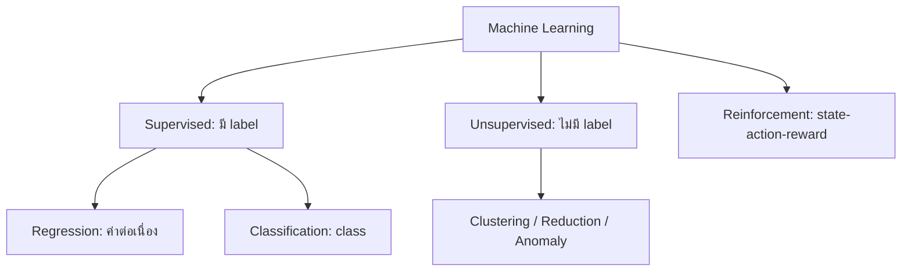

# DADS6003 Applied Machine Learning — Week 01: Introduction to Machine Learning

> **แหล่งเนื้อหาหลัก:** `dads6003_week1_introduction(1).pdf` จำนวน 24 หน้า  
> **ขอบเขต:** ความหมายและประเภทของ Machine Learning, กระบวนการพัฒนาโมเดล และองค์ประกอบของอัลกอริทึม  
> **รูปแบบโน้ต:** เนื้อหาจากเอกสารประกอบการสอน + คำอธิบายเพิ่มเติมเพื่อการเรียนและเตรียมสอบ

## 1. ภาพรวมบทเรียน

Machine Learning (ML) คือแนวทางสร้างระบบที่เรียนรู้รูปแบบจากข้อมูล แล้วนำสิ่งที่เรียนรู้ไปทำนาย ตัดสินใจ หรือค้นหาโครงสร้างในข้อมูลใหม่ จุดสำคัญคือเราไม่ได้เขียนกฎสำหรับทุกกรณีด้วยตนเอง แต่กำหนดข้อมูล เป้าหมาย วิธีวัดผล และพื้นที่ของแบบจำลอง เพื่อให้อัลกอริทึมค้นหากฎที่เหมาะสมจากประสบการณ์

บทเรียนสัปดาห์แรกวางรากฐาน 4 เรื่อง:

1. ความหมายของ Machine Learning และความแตกต่างจาก Traditional Programming
2. ประเภทของการเรียนรู้: Supervised, Unsupervised และ Reinforcement Learning
3. กระบวนการตั้งแต่ Business Requirement จนถึงการนำโมเดลไปทำนายข้อมูลใหม่
4. องค์ประกอบของอัลกอริทึม: Representation, Optimization และ Evaluation

ในภาพรวมรายวิชา หัวข้อนี้เป็นฐานสำหรับ Linear/Polynomial/Logistic Regression, Naive Bayes, Regularization, Model Evaluation, KNN, Decision Tree, Neural Network, SVM, Ensemble, Clustering, Dimensionality Reduction และ Autoencoder ที่จะเรียนต่อไป (หน้า 2–3)

## 2. Learning Objectives

หลังเรียนบทนี้ควรสามารถ:

- อธิบาย Machine Learning ด้วยกรอบ Task–Experience–Performance ได้
- แยก Regression, Classification, Clustering และ Reinforcement Learning จากโจทย์ธุรกิจได้
- ระบุได้ว่าข้อมูลมี label หรือไม่มี label และเหตุใดจึงสำคัญ
- อธิบายหน้าที่ของ training, validation และ test set โดยไม่ทำให้เกิด data leakage
- เชื่อมโยง Representation, Optimization และ Evaluation เข้ากับการสร้างโมเดลหนึ่งตัว
- เลือก metric เบื้องต้นให้เหมาะกับ regression, classification และข้อมูลที่ class ไม่สมดุล
- มองเห็นความเสี่ยงของโมเดล เช่น overfitting, leakage, concept drift และ metric ที่ไม่สอดคล้องกับธุรกิจ

## 3. Prerequisite Knowledge

### 3.1 Dataset, observation, feature และ target

- **Dataset** คือชุดข้อมูลทั้งหมดที่นำมาศึกษา
- **Observation / sample / instance** คือข้อมูลหนึ่งหน่วย เช่น ลูกค้า 1 คน หรือธุรกรรม 1 รายการ
- **Feature** คือคุณลักษณะที่ใช้เป็นข้อมูลเข้า เช่น อายุ รายได้ จำนวนครั้งที่ซื้อ
- **Target / label** คือค่าที่ต้องการให้โมเดลทำนาย เช่น ยอดขายในเดือนหน้า หรือสถานะทุจริต

มักเขียน observation ลำดับที่ \(i\) เป็นเวกเตอร์คุณลักษณะ

$$
\mathbf{x}_i = (x_{i1},x_{i2},\ldots,x_{ip}) \in \mathbb{R}^{p}
$$

โดย \(p\) คือจำนวน features และ target ของ observation นั้นคือ \(y_i\)

### 3.2 Model, parameter และ hyperparameter

- **Model** คือฟังก์ชันที่แปลง input เป็น prediction: \(\hat{y}=f(\mathbf{x})\)
- **Parameter** คือค่าที่โมเดลเรียนรู้จากข้อมูล เช่น coefficient ของ Linear Regression
- **Hyperparameter** คือค่าที่กำหนดก่อนหรือระหว่างการทดลอง เช่น จำนวนเพื่อนบ้าน \(k\) ของ KNN หรือความลึกสูงสุดของ Decision Tree

## 4. Machine Learning คืออะไร

### 4.1 Traditional Programming กับ Machine Learning

จากเอกสารหน้า 5:

| แนวทาง | สิ่งที่ป้อนเข้า | สิ่งที่ได้ออกมา |
|---|---|---|
| Traditional Programming | Data + Program/Rules | Output |
| Machine Learning Training | Data + Known Outputs/Labels | Learned Model/Program |
| Machine Learning Prediction | New Data + Learned Model | Predicted Output |

ตัวอย่าง Traditional Programming คือกำหนดว่า “ถ้ายอดซื้อเกิน 100,000 บาท ให้เป็นลูกค้า Gold” กฎถูกเขียนโดยมนุษย์โดยตรง ส่วน ML อาจเรียนรู้จากประวัติลูกค้าและผลลัพธ์ในอดีตว่า pattern แบบใดสัมพันธ์กับการซื้อซ้ำ โดยกฎอาจมีความซับซ้อนเกินกว่าจะเขียนเป็นเงื่อนไขง่าย ๆ

> **ข้อควรระวัง:** ML ไม่ได้หมายความว่าไม่มีการเขียนโปรแกรม เรายังต้องเขียน pipeline, เตรียมข้อมูล, เลือก representation, loss function, metric และควบคุมการใช้งาน เพียงแต่ค่าหรือกฎภายในโมเดลบางส่วนถูกเรียนรู้จากข้อมูล

### 4.2 นิยามของ Arthur Samuel

จากเอกสารหน้า 6 Arthur Samuel (1959) ให้นิยาม Machine Learning ว่าเป็นสาขาที่ทำให้คอมพิวเตอร์มีความสามารถในการเรียนรู้โดยไม่ต้องถูกโปรแกรมรายละเอียดไว้อย่างชัดเจนทุกกรณี

แก่นของนิยามนี้คือ **การเปลี่ยนจากการแจกแจงกฎทั้งหมด เป็นการให้ระบบอนุมานกฎจากประสบการณ์** แต่ไม่ได้แปลว่าระบบเรียนรู้ได้เองโดยไร้เป้าหมายหรือไร้การออกแบบ

### 4.3 นิยามแบบ Task–Experience–Performance ของ Tom Mitchell

จากเอกสารหน้า 7 โปรแกรมถือว่าเรียนรู้จาก **ประสบการณ์ \(E\)** ในงาน **\(T\)** และวัดด้วย **\(P\)** หากประสิทธิภาพในงาน \(T\) ตามมาตรวัด \(P\) ดีขึ้นเมื่อได้รับประสบการณ์ \(E\) มากขึ้น

- **Task (T):** งานที่ต้องทำ
- **Experience (E):** ข้อมูลหรือปฏิสัมพันธ์ที่ใช้เรียนรู้
- **Performance measure (P):** เกณฑ์ที่ใช้วัดว่าทำงานดีขึ้นหรือไม่

#### ตัวอย่างจากเอกสาร (หน้า 8–9)

| กรณี | Task (T) | Experience (E) | Performance (P) |
|---|---|---|---|
| จำแนกเลขเขียนมือ | ระบุว่าเป็นเลข 0–9 | ภาพเลขพร้อม label เช่น MNIST | ร้อยละที่จำแนกถูกต้อง |
| เล่นหมากฮอส | เลือกการเดินเพื่อชนะ | เกมฝึกซ้อมที่เล่นกับตนเอง | ร้อยละของเกมที่ชนะ |
| รถขับเคลื่อนอัตโนมัติ | ขับบนทางหลวงจากข้อมูล sensor | ภาพและคำสั่งบังคับเลี้ยวจากมนุษย์ | ระยะทางเฉลี่ยก่อนเกิดข้อผิดพลาด |
| Spam detection | แยก spam กับ legitimate email | อีเมลที่มนุษย์ติด label แล้ว | ร้อยละที่จำแนกถูกต้อง |

#### วิธีใช้กรอบ T–E–P กับโจทย์ธุรกิจ

โจทย์ “สร้าง AI ลดการขาดสต็อก” ยังไม่ชัดพอ ควรแปลงเป็น:

- \(T\): ทำนายจำนวนใช้ของแต่ละ SKU–สาขาใน 7 วันข้างหน้า
- \(E\): ยอดใช้ย้อนหลัง ราคา promotion วันหยุด และ lead time
- \(P\): Weighted Absolute Percentage Error และมูลค่าการขาดสต็อก

การระบุ \(P\) เป็นเรื่องสำคัญ เพราะโมเดลที่คะแนนทางสถิติดีที่สุดอาจไม่ใช่โมเดลที่สร้างคุณค่าทางธุรกิจสูงสุด

## 5. ประเภทของ Machine Learning

### 5.1 Supervised Learning

จากเอกสารหน้า 10 กำหนดชุดข้อมูลที่มี label:

$$
D=\{(\mathbf{x}_1,y_1),(\mathbf{x}_2,y_2),\ldots,(\mathbf{x}_n,y_n)\}
$$

เป้าหมายคือเรียนรู้ฟังก์ชัน \(f\) จากตัวอย่าง เพื่อทำนาย \(y\) ของข้อมูลใหม่ \(\mathbf{x}\)

#### Regression

หาก \(y_i\in\mathbb{R}\) หรือเป็นค่าตัวเลขต่อเนื่อง โจทย์มักเป็น **Regression** เช่น:

- ทำนายยอดขาย
- ทำนายระยะเวลาส่งสินค้า
- ทำนายค่าใช้จ่ายผู้ป่วย

ตัวอย่าง representation แบบ Linear Regression:

$$
\hat{y}=\theta_0+\theta_1x_1+\cdots+\theta_px_p
=\theta_0+\boldsymbol{\theta}^{T}\mathbf{x}
$$

#### Classification

หาก \(y_i\in\{c_1,c_2,\ldots,c_k\}\) ซึ่งเป็นกลุ่มที่กำหนดไว้ โจทย์เป็น **Classification** เช่น:

- fraud / not fraud
- ลูกค้าจะ churn / ไม่ churn
- จำแนกประเภทสินค้า

เอกสารหน้า 11 ยกตัวอย่างอัลกอริทึม Regression ได้แก่ Linear และ Polynomial Regression และ Classification ได้แก่ Naive Bayes, Decision Tree, SVM และ Neural Network

> **คำอธิบายเพิ่มเติม:** ชื่ออัลกอริทึมไม่ผูกกับงานแบบตายตัวเสมอไป เช่น Decision Tree มีทั้ง classifier และ regressor ส่วน Neural Network ใช้ได้กับทั้ง regression และ classification ต้องดูชนิดของ output, loss และ objective ร่วมกัน

### 5.2 Unsupervised Learning

จากเอกสารหน้า 12 ชุดข้อมูลไม่มี label:

$$
D=\{\mathbf{x}_1,\mathbf{x}_2,\ldots,\mathbf{x}_n\}
$$

เป้าหมายคือทำความเข้าใจและสกัด pattern, structure หรือ relationship ที่ซ่อนอยู่ในข้อมูล โดยไม่รู้คำตอบที่ถูกต้องล่วงหน้า

#### เป้าหมายหลักจากเอกสาร (หน้า 13)

- **Clustering:** จัด observation ที่คล้ายกันให้อยู่กลุ่มเดียวกัน
- **Dimensionality Reduction:** ลดจำนวนมิติแต่รักษาสารสนเทศสำคัญ
- **Anomaly Detection:** หา observation ที่ผิดไปจากรูปแบบส่วนใหญ่
- **Association Rule:** ค้นหาสิ่งที่มักเกิดร่วมกัน เช่น market basket analysis

อัลกอริทึมที่เอกสารระบุ ได้แก่ K-means, DBSCAN และ PCA (หน้า 14)

| วิธี | แนวคิด | เหมาะเมื่อ | ข้อจำกัดเด่น |
|---|---|---|---|
| K-means | แบ่งข้อมูลเป็น \(k\) กลุ่มโดยลดระยะจาก centroid | กลุ่มค่อนข้างกลมและกำหนด \(k\) ได้ | ไวต่อ scale, outlier และค่าเริ่มต้น |
| DBSCAN | กลุ่มคือบริเวณที่มีความหนาแน่นต่อเนื่อง | กลุ่มรูปร่างไม่ปกติและมี noise | เลือกพารามิเตอร์ยากเมื่อ density ต่างกันมาก |
| PCA | หาแกนใหม่ที่อธิบาย variance สูงสุด | ลดมิติ/ลดความสัมพันธ์เชิงเส้น | component ตีความยากและจับโครงสร้างไม่เชิงเส้นไม่ได้ดี |

> **ข้อสำคัญ:** กลุ่มที่โมเดลค้นพบไม่จำเป็นต้องเท่ากับ “กลุ่มจริงทางธุรกิจ” ต้องตรวจความเสถียร ความหมาย และประโยชน์ของกลุ่มร่วมกับผู้เชี่ยวชาญ

### 5.3 Reinforcement Learning

จากเอกสารหน้า 15 Reinforcement Learning (RL) เรียนรู้จากลำดับของ **state, action และ reward** เพื่อหา **optimal policy** หรือกฎที่บอกว่าควรทำ action ใดในแต่ละ state

- **Agent:** ผู้ตัดสินใจ
- **Environment:** สภาพแวดล้อมที่ agent ปฏิสัมพันธ์
- **State \(s_t\):** สถานการณ์ ณ เวลา \(t\)
- **Action \(a_t\):** การกระทำที่ agent เลือก
- **Reward \(r_t\):** ผลตอบแทนที่ได้รับ
- **Policy \(\pi(a\mid s)\):** กลยุทธ์การเลือก action จาก state

วงจรพื้นฐานคือ agent สังเกต state → เลือก action → environment เปลี่ยน state และส่ง reward → agent ปรับ policy เพื่อเพิ่มผลตอบแทนสะสมระยะยาว

เอกสารยกตัวอย่าง Robotics และ Game Playing ความแตกต่างจาก supervised learning คือ RL มักไม่ได้รับคำตอบที่ถูกต้องสำหรับทุก state โดยตรง และ action ปัจจุบันอาจส่งผลต่อ reward ในอนาคต

### 5.4 ตารางเลือกประเภทการเรียนรู้

| คำถาม | ถ้าคำตอบเป็น “ใช่” | ประเภทที่ควรพิจารณา |
|---|---|---|
| มี target ที่รู้คำตอบในข้อมูลย้อนหลังหรือไม่ | มี | Supervised Learning |
| target เป็นค่าตัวเลขต่อเนื่องหรือไม่ | ใช่ | Regression |
| target เป็นประเภท/สถานะหรือไม่ | ใช่ | Classification |
| ไม่มี target แต่ต้องการค้นหาโครงสร้างหรือกลุ่มหรือไม่ | ใช่ | Unsupervised Learning |
| ระบบต้องเลือกการกระทำต่อเนื่องและได้รับ reward หรือไม่ | ใช่ | Reinforcement Learning |

## 6. Machine Learning Applications

เอกสารหน้า 16 ยกตัวอย่าง Email spam detection, Face detection/recognition, Sport analytics, Zip-code recognition, Credit-card fraud detection, Stock prediction, Smart assistants เช่น ChatGPT, Recommendation และ Self-driving cars

สิ่งที่ควรฝึกคือไม่หยุดเพียงชื่อ application แต่ต้องระบุชนิดปัญหาและ target:

| Application | Formulation ที่เป็นไปได้ | หมายเหตุ |
|---|---|---|
| Spam detection | Binary classification | class มักไม่สมดุล จึงไม่ควรดู accuracy อย่างเดียว |
| Recommendation | Ranking / prediction / representation learning | ต้องวัดทั้ง relevance และ business outcome |
| Fraud detection | Classification หรือ anomaly detection | fraud label อาจล่าช้าและมีน้อย |
| Stock prediction | Regression / direction classification | มี noise สูงและเกิด temporal leakage ได้ง่าย |
| Face recognition | Multiclass classification / metric learning | ต้องพิจารณา privacy และ bias |
| Self-driving car | Supervised perception + planning/RL | เป็นหลายโมดูล ไม่ใช่อัลกอริทึมเดียว |

## 7. Machine Learning Process

### 7.1 เจ็ดคำถามก่อนสร้างโมเดล

จากเอกสารหน้า 17:

1. Desired outcome หรือ Business Requirement คืออะไร
2. Dataset ควรมีลักษณะอย่างไร — นี่คือ Experience \(E\)
3. เป็น supervised, unsupervised หรือ reinforcement problem
4. จะใช้อัลกอริทึมใด — solution/representation
5. จะวัดความสำเร็จอย่างไร — Performance \(P\)
6. จะดูแลโมเดลที่สร้างแล้วอย่างไร
7. มี challenge หรือ pitfall อะไรบ้าง

ลำดับที่ถูกต้องควรเริ่มจากผลลัพธ์ทางธุรกิจและวิธีวัด ไม่ควรเริ่มจาก “อยากใช้ algorithm X” แล้วค่อยหาโจทย์มารองรับ

### 7.2 Training pipeline และ Predicting pipeline

จากแผนภาพหน้า 18 กระบวนการฝึกโมเดลประกอบด้วย:

1. **Raw data & target:** รวบรวมข้อมูลและกำหนด target
2. **Feature engineering:** ทำความสะอาด แปลง และสร้าง features
3. **Training set:** ใช้เรียนรู้ model parameters
4. **Validation set:** เลือกโมเดลและปรับ hyperparameters
5. **Test set:** ประเมินผลครั้งสุดท้ายกับข้อมูลที่ไม่ใช้ตัดสินใจระหว่างพัฒนา
6. **Model:** แบบจำลองที่พร้อมนำไปใช้

เมื่อนำไปทำนาย ข้อมูลใหม่ต้องผ่าน feature engineering แบบเดียวกับตอนฝึก แล้วจึงส่งเข้าโมเดลเพื่อสร้าง prediction/target estimate

| ชุดข้อมูล | ใช้ทำอะไร | สิ่งที่ห้ามทำ |
|---|---|---|
| Training | เรียนรู้ parameters | ห้ามรายงานคะแนนบนชุดนี้เป็นผล generalization |
| Validation | เลือก model/hyperparameters/threshold | ห้ามปรับจนจำ validation set มากเกินไปโดยไม่ตรวจซ้ำ |
| Test | ประเมินผลสุดท้าย | ห้ามใช้ซ้ำเพื่อเลือกโมเดล เพราะจะกลายเป็น validation set |

### 7.3 Data Leakage

**Data leakage** เกิดเมื่อข้อมูลที่ไม่ควรรู้ในเวลาทำนายรั่วเข้าไปใน training หรือ preprocessing ทำให้คะแนนทดลองสูงเกินจริง เช่น:

- ใช้สถานะ “ชำระหนี้แล้ว” เพื่อทำนายการผิดนัด ณ วันอนุมัติสินเชื่อ
- คำนวณค่าเฉลี่ย/scale จากข้อมูลทั้งชุดก่อนแบ่ง train-test
- สุ่มแบ่งข้อมูล time series ทำให้ข้อมูลอนาคตอยู่ใน train
- มีข้อมูลคนไข้รายเดียวกันทั้ง train และ test

หลักปฏิบัติคือแบ่งข้อมูลให้สะท้อนสถานการณ์ใช้งานจริง และเรียนรู้ขั้นตอน preprocessing จาก training set เท่านั้น

### 7.4 การดูแลโมเดลหลัง Deployment

เอกสารถามเรื่อง model maintenance ไว้ตั้งแต่หน้า 17 เพราะโมเดลไม่จบเมื่อ deploy แล้ว ควรติดตาม:

- **Data drift:** การกระจายของ input เปลี่ยน
- **Concept drift:** ความสัมพันธ์ระหว่าง input กับ target เปลี่ยน
- **Performance drift:** metric ธุรกิจหรือโมเดลลดลง
- คุณภาพข้อมูล, missing values, schema change และ latency
- รอบ retraining, model version, approval และ rollback

## 8. องค์ประกอบของ Machine Learning Algorithm

เอกสารหน้า 19 สรุป 3 องค์ประกอบคือ **Representation, Optimization และ Evaluation**

### 8.1 Representation — โมเดลสามารถแทนฟังก์ชันแบบใด

Representation คือรูปแบบหรือ hypothesis space ที่อนุญาตให้โมเดลใช้ หากเลือก representation ง่ายเกินไปอาจเกิด underfitting แต่ถ้าซับซ้อนเกินไปอาจเกิด overfitting

จากเอกสารหน้า 20–21:

1. **Numerical functions**
   - Linear Regression: \(\hat{y}=\theta_0+\boldsymbol{\theta}^{T}\mathbf{x}\)
   - Logistic Regression: \(\hat{p}=\sigma(\theta_0+\boldsymbol{\theta}^{T}\mathbf{x})\)
   - โดย sigmoid คือ

$$
\sigma(z)=\frac{1}{1+e^{-z}}
$$

2. **Symbolic functions**
   - Decision Tree
   - Rule-based model เช่น If A = B then C
3. **Instance-based functions**
   - K-Nearest Neighbors: ทำนายจากตัวอย่างใกล้เคียง
4. **Probabilistic graphical models**
   - Naive Bayes: ใช้ความน่าจะเป็นและสมมติฐาน conditional independence

### 8.2 Optimization — จะหาค่าโมเดลที่เหมาะสมอย่างไร

Optimization คือกระบวนการค้นหา parameters ที่ทำให้ objective/loss ดีที่สุด เอกสารหน้า 22 ระบุ Gradient Descent, Stochastic Gradient Descent, RMSProp, AdaGrad, Newton's method, Hessian-free method และ Conjugate Gradient

ตัวอย่าง ถ้า loss function คือ \(J(\boldsymbol{\theta})\) Gradient Descent ปรับ parameter ตามทิศทางตรงข้าม gradient:

$$
\boldsymbol{\theta}_{t+1}=\boldsymbol{\theta}_t-\eta\nabla J(\boldsymbol{\theta}_t)
$$

โดย \(\eta\) คือ learning rate ถ้าสูงเกินไปอาจข้ามจุดต่ำสุดหรือไม่ converge ถ้าต่ำเกินไปจะเรียนรู้ช้า

| วิธี | ลักษณะย่อ | จุดเด่น/ข้อควรระวัง |
|---|---|---|
| Batch Gradient Descent | ใช้ข้อมูลทั้งชุดต่อหนึ่ง update | gradient เสถียรแต่ใช้ทรัพยากรมาก |
| Stochastic Gradient Descent | ใช้หนึ่งตัวอย่างหรือ mini-batch | เร็วและเหมาะข้อมูลใหญ่ แต่ update มี noise |
| AdaGrad | ปรับ learning rate แยกต่อ parameter | ดีต่อ sparse features แต่ learning rate อาจเล็กเร็วเกินไป |
| RMSProp | ใช้ moving average ของ squared gradients | ลดปัญหา learning rate หดเร็วของ AdaGrad |
| Newton's method | ใช้ curvature/อนุพันธ์อันดับสอง | converge เร็วใกล้ optimum แต่คำนวณ Hessian แพง |

### 8.3 Evaluation — จะตัดสินว่าโมเดลดีอย่างไร

เอกสารหน้า 23 ระบุ Accuracy, MSE, MAE, RMSE, Precision, Recall, F1-score, Kappa และ Matthews Correlation Coefficient (MCC)

#### Regression metrics

ให้ค่าจริงเป็น \(y_i\) และค่าทำนายเป็น \(\hat{y}_i\)

$$
\mathrm{MAE}=\frac{1}{n}\sum_{i=1}^{n}|y_i-\hat{y}_i|
$$

$$
\mathrm{MSE}=\frac{1}{n}\sum_{i=1}^{n}(y_i-\hat{y}_i)^2
$$

$$
\mathrm{RMSE}=\sqrt{\mathrm{MSE}}
$$

| Metric | ความหมาย | เมื่อเหมาะ |
|---|---|---|
| MAE | ความคลาดเคลื่อนสัมบูรณ์เฉลี่ย | ต้องการหน่วยเดียวกับ target และไม่ต้องการลงโทษ error ใหญ่มากเกินไป |
| MSE | ยกกำลังสอง error | ต้องการลงโทษ error ขนาดใหญ่แรง และใช้เป็น loss ที่หาอนุพันธ์ง่าย |
| RMSE | รากที่สองของ MSE | ต้องการตีความในหน่วยเดิม แต่ยังลงโทษ error ใหญ่แรง |

ตัวอย่าง ค่าจริง \([10,20,30]\) และค่าทำนาย \([12,18,35]\) มี errors \([2,-2,5]\)

$$
\mathrm{MAE}=\frac{2+2+5}{3}=3
$$

$$
\mathrm{MSE}=\frac{2^2+(-2)^2+5^2}{3}=11,
\quad \mathrm{RMSE}=\sqrt{11}\approx3.32
$$

#### Classification metrics

จาก Confusion Matrix:

- **TP:** ทำนาย positive และเป็น positive จริง
- **TN:** ทำนาย negative และเป็น negative จริง
- **FP:** ทำนาย positive แต่เป็น negative จริง
- **FN:** ทำนาย negative แต่เป็น positive จริง

$$
\mathrm{Accuracy}=\frac{TP+TN}{TP+TN+FP+FN}
$$

$$
\mathrm{Precision}=\frac{TP}{TP+FP},\qquad
\mathrm{Recall}=\frac{TP}{TP+FN}
$$

$$
F_1=2\times\frac{\mathrm{Precision}\times\mathrm{Recall}}
{\mathrm{Precision}+\mathrm{Recall}}
$$

- ใช้ **Precision** เมื่อ false positive มีต้นทุนสูง เช่น flag ธุรกรรมปกติเป็น fraud แล้วบล็อกลูกค้า
- ใช้ **Recall** เมื่อ false negative มีต้นทุนสูง เช่น พลาดผู้ป่วยที่มีความเสี่ยง
- ใช้ **F1-score** เมื่อต้องการสมดุล precision และ recall แต่ F1 ไม่ได้คำนึงถึง TN
- ใช้ **MCC** เมื่ออยากได้คะแนนสมดุลที่คำนึงถึง TP, TN, FP และ FN โดยเฉพาะ class imbalance
- ใช้ **Cohen's Kappa** เพื่อวัด agreement ที่ปรับผลจากความสอดคล้องโดยบังเอิญแล้ว

### 8.4 ความสัมพันธ์ของสามองค์ประกอบ

ลองมองโจทย์ spam detection:

- **Representation:** Logistic Regression กำหนดรูปแบบคะแนนจาก features ของอีเมล
- **Optimization:** หาค่า coefficients ที่ลด log loss บน training set
- **Evaluation:** ใช้ precision/recall/F1 บน validation และ test set

การเปลี่ยน metric อาจเปลี่ยน threshold ที่เหมาะสม แม้ตัว model parameters จะเหมือนเดิม จึงต้องแยก **loss ที่ใช้ train** ออกจาก **metric ที่ใช้ตัดสินความสำเร็จ**

## 9. Worked Scenario: ตรวจจับ PR/PO ที่มีความเสี่ยงผิดปกติ

สมมติองค์กรต้องการค้นหา PR/PO ที่ควรตรวจสอบก่อนอนุมัติ

### กรณี A: มีประวัติเคสผิดปกติที่ยืนยันแล้ว

- ประเภท: Supervised binary classification
- \(T\): ทำนายว่าเอกสารเสี่ยงหรือไม่
- \(E\): ราคา จำนวน รายการ vendor material group ผู้อนุมัติ และ label จากผล audit
- \(P\): Recall ที่ระดับ precision ขั้นต่ำ หรือมูลค่าความเสียหายที่ตรวจจับได้
- ข้อควรระวัง: label มีน้อย, class imbalance, การเปลี่ยนพฤติกรรม และ leakage จากข้อมูลหลังอนุมัติ

### กรณี B: ไม่มี label เคสผิดปกติ

- ประเภท: Unsupervised anomaly detection
- เป้าหมาย: จัดอันดับรายการที่ต่างจาก pattern ปกติเพื่อให้ auditor ตรวจ
- Evaluation: precision@k จากรายการ top-k ที่ผู้เชี่ยวชาญตรวจ หรือจำนวนความเสี่ยงจริงที่ค้นพบต่อชั่วโมงทำงาน

### กรณี C: ระบบต้องเลือกว่าจะตรวจเอกสารใดภายใต้กำลังคนจำกัด

อาจมองเป็น sequential decision problem หรือ contextual bandit/RL แต่ควรเริ่มจาก supervised ranking ที่เรียบง่ายก่อน หากยังไม่มี feedback loop, reward ที่ชัด และระบบควบคุมความเสี่ยง

## 10. Common Misconceptions

1. **“มีข้อมูลจำนวนมากจึงใช้ ML ได้แน่นอน”**  
   ปริมาณไม่ทดแทนความเกี่ยวข้อง คุณภาพ label และความเป็นตัวแทนของ population

2. **“ถ้าไม่มี label ก็สร้าง prediction ของผลลัพธ์ที่ต้องการได้”**  
   Unsupervised learning หาโครงสร้างได้ แต่ไม่มีคำตอบรับรองว่ากลุ่มนั้นตรงกับ business target

3. **“Accuracy 99% แปลว่าโมเดลดี”**  
   ถ้ามี fraud 1% โมเดลที่ทายว่าไม่ fraud ทุกครั้งก็ได้ accuracy 99% แต่ recall ของ fraud เท่ากับ 0

4. **“Validation set กับ test set ใช้แทนกันได้”**  
   Validation ใช้ตัดสินใจระหว่างพัฒนา ส่วน test ควรถูกกันไว้สำหรับการประเมินครั้งสุดท้าย

5. **“โมเดลซับซ้อนย่อมดีกว่า”**  
   โมเดลซับซ้อนอาจ overfit ใช้ทรัพยากรมาก อธิบายยาก และไม่เพิ่มคุณค่าธุรกิจ

6. **“Deployment คือจุดจบของโครงการ ML”**  
   สภาพข้อมูลเปลี่ยนได้ จึงต้อง monitor, retrain, version และมี rollback plan

7. **“Optimization metric กับ business KPI เป็นสิ่งเดียวกัน”**  
   loss ใช้ฝึกโมเดล ส่วน metric ใช้ประเมิน และ business KPI ใช้วัดผลกระทบ ทั้งสามควรเชื่อมโยงแต่ไม่จำเป็นต้องเหมือนกัน

## 11. Likely Exam Focus

> หัวข้อต่อไปนี้อนุมานจากนิยาม ตารางเปรียบเทียบ แผนภาพ และรายการ metric ที่เน้นในเอกสาร ไม่ใช่ข้อสอบจริง

### Definitions to remember

- นิยาม ML ของ Arthur Samuel
- กรอบ Task \(T\), Experience \(E\), Performance \(P\) ของ Tom Mitchell
- supervised, unsupervised และ reinforcement learning
- feature, target, model, parameter และ hyperparameter
- representation, optimization และ evaluation

### Processes to explain

- Raw data → feature engineering → train/validation/test → model → prediction
- บทบาทที่ต่างกันของ train, validation และ test set
- interaction loop ของ state, action และ reward ใน RL

### Concepts to compare

- Traditional Programming vs Machine Learning
- Regression vs Classification
- Supervised vs Unsupervised vs Reinforcement Learning
- MAE vs MSE vs RMSE
- Accuracy vs Precision vs Recall vs F1 vs MCC

### Calculations to perform

- คำนวณ MAE, MSE และ RMSE จากค่าจริงกับค่าทำนาย
- คำนวณ Accuracy, Precision, Recall และ F1 จาก Confusion Matrix
- เขียนสมการ Linear Regression, Logistic Regression และ sigmoid

### Scenario-based decisions

- ระบุชนิดการเรียนรู้จากโจทย์และลักษณะ label
- เลือก metric ตามต้นทุนของ false positive/false negative
- ตรวจจับ data leakage จากลำดับเวลาและขั้นตอน preprocessing
- แปลง business problem ให้เป็น T–E–P ที่วัดผลได้

## 12. Practice Questions

### ระดับ Recall

**1. Machine Learning ต่างจาก Traditional Programming อย่างไร?**

**2. องค์ประกอบสามส่วนของ Machine Learning Algorithm ตามเอกสารคืออะไร?**

**3. หาก target เป็นค่าต่อเนื่อง โจทย์ supervised learning จัดเป็นประเภทใด?**

### ระดับ Explain และ Compare

**4. อธิบาย Task–Experience–Performance โดยใช้ตัวอย่าง spam detection**

**5. เปรียบเทียบ supervised กับ unsupervised learning โดยเน้นข้อมูลเข้าและเป้าหมาย**

**6. เพราะเหตุใด test set จึงไม่ควรถูกใช้ปรับ hyperparameter?**

**7. เปรียบเทียบ MAE กับ RMSE เมื่อข้อมูลมี outlier ขนาดใหญ่**

### ระดับ Apply

**8. โรงพยาบาลต้องการทำนายจำนวนวันนอนจากข้อมูลผู้ป่วยย้อนหลัง เป็น ML ประเภทใด และควรเริ่มวัดด้วย metric ใด?**

**9. แบบจำลองทำนาย fraud ได้ TP=40, FP=10, FN=20, TN=930 จงคำนวณ Accuracy, Precision, Recall และ F1**

**10. ทีมทำ standardization จากข้อมูลทั้ง dataset ก่อนแบ่ง train/test สิ่งนี้มีความเสี่ยงอะไร และแก้อย่างไร?**

### ระดับ Analyze

**11. ระบบตรวจโรคร้ายแรงได้ accuracy 98% แต่ recall 45% คุณจะประเมินอย่างไร?**

**12. ฝ่ายการตลาดขอ “ใช้ K-means ทำนายว่าลูกค้าคนใดจะ churn” จงวิเคราะห์ความไม่สอดคล้องของโจทย์และเสนอ formulation ที่เหมาะกว่า**

## 13. Model Answers with Reasoning

**1.** Traditional Programming รับ data กับกฎที่มนุษย์เขียนแล้วให้ output ส่วน training ของ ML ใช้ data กับ known outputs/feedback เพื่อเรียนรู้ model แล้ว model จึงทำนาย output ของข้อมูลใหม่

**2.** Representation กำหนดรูปแบบฟังก์ชันที่โมเดลแทนได้, Optimization ใช้ค้นหา parameters และ Evaluation ใช้ตัดสินคุณภาพของโมเดล

**3.** Regression เพราะ target เป็นค่าตัวเลขต่อเนื่อง

**4.** \(T\) คือจำแนก spam/legitimate, \(E\) คืออีเมลย้อนหลังพร้อม label และ \(P\) อาจเป็น precision, recall หรือ F1 โดยต้องเลือกให้สอดคล้องกับต้นทุนของการบล็อกอีเมลดีและการปล่อย spam หลุด

**5.** Supervised learning ใช้คู่ \((\mathbf{x},y)\) เพื่อเรียนรู้การทำนาย target ส่วน unsupervised learning มีเพียง \(\mathbf{x}\) และมุ่งค้นหาโครงสร้าง กลุ่ม มิติ หรือ anomaly โดยไม่มีคำตอบกำกับ

**6.** เพราะเมื่อเลือก hyperparameter จาก test score ข้อมูล test ได้มีอิทธิพลต่อการสร้างโมเดลแล้ว คะแนนที่รายงานจะ optimistic และไม่ใช่การวัด generalization ที่เป็นอิสระ

**7.** MAE เพิ่มตามขนาด error แบบเส้นตรง ส่วน RMSE ยกกำลังสองก่อนเฉลี่ย จึงถูกครอบงำโดย error ใหญ่และลงโทษ outlier แรงกว่า หาก outlier เป็นเหตุการณ์สำคัญ RMSE อาจเหมาะ แต่ถ้าเป็น noise MAE มัก robust กว่า

**8.** เป็น supervised regression เพราะมีค่าจำนวนวันเป็น target ต่อเนื่อง เริ่มด้วย MAE เพื่อสื่อว่าโดยเฉลี่ยคลาดเคลื่อนกี่วัน และอาจดู RMSE เพิ่มเพื่อเน้นเคสที่ผิดมาก

**9.** จำนวนทั้งหมด = 1,000

$$
Accuracy=(40+930)/1000=0.97
$$

$$
Precision=40/(40+10)=0.80
$$

$$
Recall=40/(40+20)\approx0.667
$$

$$
F_1=2(0.80)(0.667)/(0.80+0.667)\approx0.727
$$

แม้ Accuracy สูงถึง 97% แต่ recall บอกว่าโมเดลพลาด fraud ประมาณหนึ่งในสาม จึงต้องประเมินตามต้นทุนจริงด้วย

**10.** เกิด preprocessing leakage เพราะค่า mean/standard deviation ได้เห็นข้อมูล test วิธีแก้คือแบ่งข้อมูลก่อน แล้ว fit scaler เฉพาะ training set จากนั้นใช้ค่าเดิม transform validation/test หรือใช้ pipeline ที่ควบคุมขั้นตอนนี้

**11.** Accuracy สูงอาจเกิดจากผู้ป่วยส่วนใหญ่ไม่มีโรค แต่ recall 45% หมายถึงพลาดผู้ป่วยจริง 55% ซึ่งอาจยอมรับไม่ได้ ควรดู prevalence, confusion matrix, precision, threshold และต้นทุน FN แล้วปรับ objective/threshold ตาม clinical requirement

**12.** K-means ไม่มี label และสร้าง cluster จึงไม่สามารถรับรองว่า cluster เท่ากับ churn ถ้ามีข้อมูล churn ย้อนหลังควรตั้งเป็น supervised classification และประเมินด้วย recall/precision/PR-AUC ตามเป้าหมาย หากยังไม่มี label ใช้ clustering เพื่อสำรวจ segment ได้ แต่ต้องไม่เรียกผลนั้นว่า churn prediction

## 14. Key Takeaways

- ML เรียนรู้ฟังก์ชันหรือ policy จากประสบการณ์ ไม่ใช่เวทมนตร์ที่ทำงานได้โดยไม่มีการกำหนดเป้าหมาย
- กรอบ T–E–P ช่วยเปลี่ยนคำขอทางธุรกิจที่กว้างให้เป็นปัญหาที่สร้างและวัดผลได้
- การมีหรือไม่มี label และชนิดของ target เป็นตัวชี้หลักในการเลือกประเภทการเรียนรู้
- กระบวนการ train/validation/test ต้องแยกบทบาทชัดเจนเพื่อประเมิน generalization อย่างซื่อสัตย์
- อัลกอริทึมหนึ่งตัวต้องมี representation, optimization และ evaluation
- metric ต้องเลือกจากลักษณะปัญหาและต้นทุนข้อผิดพลาด ไม่ใช่เลือก accuracy โดยอัตโนมัติ
- โมเดลต้องได้รับการ monitor และดูแลหลัง deployment เพราะข้อมูลและความสัมพันธ์เปลี่ยนได้

## 15. Glossary

| คำศัพท์ | ความหมาย |
|---|---|
| Algorithm | ขั้นตอนหรือวิธีที่ใช้เรียนรู้ model จากข้อมูล |
| Classification | การทำนาย target แบบหมวดหมู่ |
| Data leakage | การรั่วของข้อมูลที่ไม่ควรรู้เข้าสู่ขั้นตอนฝึก/เลือกโมเดล |
| Experience (E) | ข้อมูลหรือปฏิสัมพันธ์ที่ใช้เรียนรู้ |
| Feature | ตัวแปรข้อมูลเข้าที่ใช้ทำนาย |
| Hyperparameter | ค่าควบคุมการเรียนรู้ที่ไม่ได้เรียนเป็น parameter โดยตรง |
| Label / Target | คำตอบที่ต้องการทำนายใน supervised learning |
| Loss function | ฟังก์ชันที่ optimization พยายามลด |
| Model | ฟังก์ชันหรือโครงสร้างที่เรียนรู้จากข้อมูล |
| Optimization | การค้นหา parameter ที่ทำให้ objective ดีขึ้น |
| Parameter | ค่าภายในโมเดลที่เรียนรู้จาก training data |
| Performance (P) | เกณฑ์วัดความสำเร็จของ task |
| Policy | กฎการเลือก action จาก state ใน reinforcement learning |
| Regression | การทำนาย target เชิงปริมาณ/ต่อเนื่อง |
| Representation | รูปแบบฟังก์ชันหรือ hypothesis ที่โมเดลสามารถแทนได้ |
| Task (T) | งานที่ระบบต้องทำ |

## 16. References

### เอกสารประกอบการสอน

- `dads6003_week1_introduction(1).pdf`, DADS6003 Applied Machine Learning, Week 01, หน้า 1–24.

### คำอธิบายเพิ่มเติม

- Google Cloud, [What is Supervised Learning?](https://cloud.google.com/discover/what-is-supervised-learning)
- scikit-learn, [Metrics and scoring: quantifying the quality of predictions](https://scikit-learn.org/stable/modules/model_evaluation.html)
- scikit-learn, [Cross-validation evaluation with `cross_val_score`](https://scikit-learn.org/stable/modules/generated/sklearn.model_selection.cross_val_score.html)

