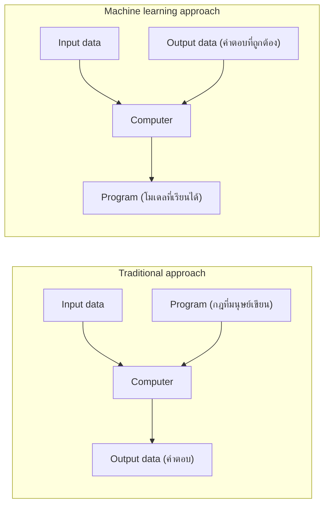
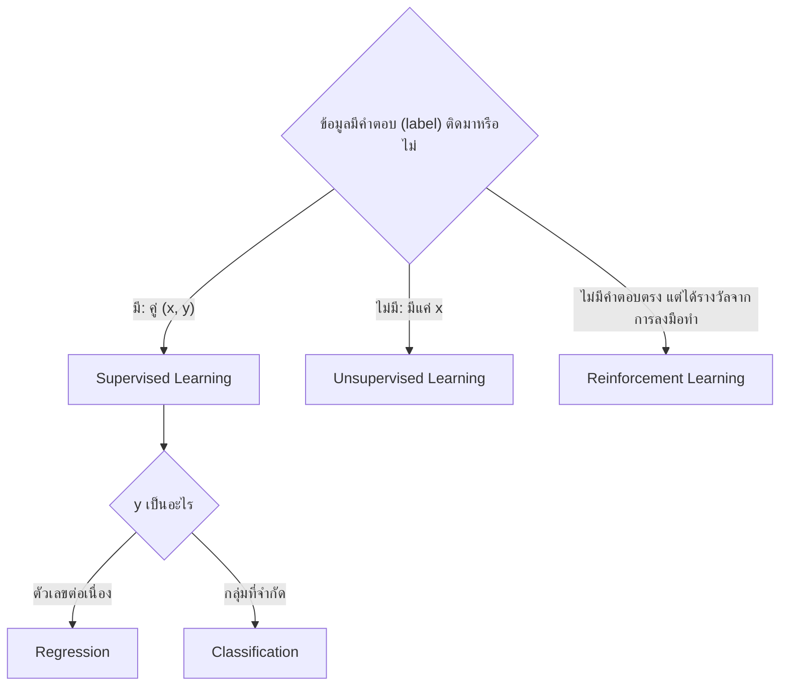
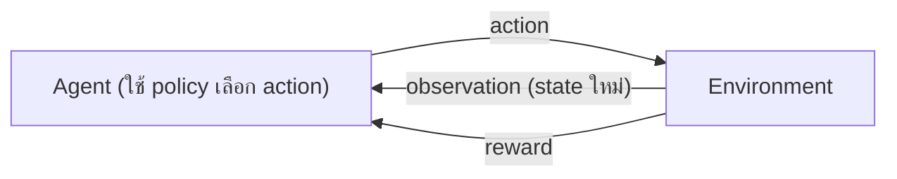
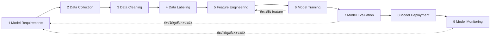

# บทที่ 1 บทนำสู่ Machine Learning

Machine Learning คือการให้คอมพิวเตอร์ "สร้างกฎเอง" จากตัวอย่างข้อมูล แทนที่มนุษย์จะเขียนกฎทุกข้อด้วยมือ และทุกระบบ ML สามารถอธิบายได้ด้วยกรอบเดียวกันว่า ทำงานอะไร (Task) เรียนจากอะไร (Experience) และวัดความเก่งอย่างไร (Performance)

**วิธีอ่าน:** อ่านตามลำดับครั้งแรก เพราะแต่ละส่วนใช้ศัพท์จากส่วนก่อนหน้า ส่วนที่ 1 ถึง 3 เป็นแนวคิดพื้นฐาน ส่วนที่ 4 ถึง 5 เป็นกระบวนการทำงานจริง ส่วนที่ 6 เป็นโครงสร้างภายในของอัลกอริทึมทุกตัวที่จะเรียนในสัปดาห์ต่อๆ ไป ท้ายบทมี cheat sheet และโจทย์ฝึกพร้อมแนวตอบ

---

## ส่วนที่ 0 ปูพื้นฐาน: ศัพท์ที่ต้องรู้ก่อน

บทนี้ใช้ศัพท์จำนวนหนึ่งซ้ำตลอดเรื่อง ตารางด้านล่างให้ความหมายสั้นๆ ก่อน แต่ละคำจะถูกอธิบายละเอียดอีกครั้งเมื่อถึงหัวข้อที่เกี่ยวข้อง

| ศัพท์ที่วิชาใช้ | ศัพท์ทางการ/คำพ้อง | ความหมายสั้น |
|---|---|---|
| Dataset, $D$ | ชุดข้อมูล | กลุ่มของตัวอย่างข้อมูลทั้งหมดที่ใช้เรียน |
| Instance, example, $x_i$ | ตัวอย่าง, ระเบียน (row) | ข้อมูลหนึ่งรายการ เช่น อีเมลหนึ่งฉบับ หรือรูปหนึ่งรูป |
| Attribute | Feature, ตัวแปรต้น, คุณลักษณะ | ค่าที่ใช้บรรยายตัวอย่าง เช่น จำนวนคำว่า "free" ในอีเมล |
| Vector of attributes, $x_i \in \mathbb{R}^d$ | Feature vector | การรวม feature ทั้ง $d$ ตัวของตัวอย่างหนึ่งเป็นรายการตัวเลข |
| Label, $y_i$ | Target, ตัวแปรตาม, คำตอบ | สิ่งที่อยากให้โมเดลทาย เช่น spam หรือไม่ spam |
| Model, $f$ | Hypothesis, ฟังก์ชันทำนาย | สูตรหรือโครงสร้างที่รับ $x$ แล้วให้คำทำนาย |
| Parameters, $\theta$ | Weights, ค่าสัมประสิทธิ์ | ตัวเลขภายในโมเดลที่ถูกปรับระหว่างเรียน |
| Loss function, $L$ | Cost, error function | ฟังก์ชันที่บอกว่าคำทำนายผิดจากคำตอบจริงมากแค่ไหน |
| Training | Learning, fitting | กระบวนการปรับ $\theta$ ให้ loss ต่ำลง |
| Regression | การถดถอย | งานทายค่าตัวเลขต่อเนื่อง |
| Classification | การจำแนกประเภท | งานทายกลุ่มหรือประเภทจากรายการที่จำกัด |
| Policy | นโยบาย | (ใน Reinforcement Learning) กฎว่าในแต่ละสถานการณ์ควรทำอะไร |

ข้อตกลงเรื่องสัญลักษณ์: ตัวห้อย $i$ หมายถึงตัวอย่างลำดับที่ $i$ ส่วน $n$ (หรือ $N$) คือจำนวนตัวอย่างทั้งหมด และ $d$ คือจำนวน feature ของแต่ละตัวอย่าง

---

## ส่วนที่ 1 ทำไมต้องมี Machine Learning

### 1.1 ปัญหาที่การเขียนโปรแกรมแบบเดิมแก้ไม่ไหว

ลองนึกถึงงานกรองอีเมล spam ถ้าใช้วิธีเขียนโปรแกรมแบบเดิม เราต้องนั่งคิดกฎเอง เช่น "ถ้ามีคำว่า free มากกว่า 3 ครั้ง และมีลิงก์มากกว่า 5 ลิงก์ ให้ถือว่าเป็น spam" ปัญหาคือ

1. กฎที่ดีจริงมีจำนวนมหาศาลและซับซ้อน มนุษย์คิดได้ไม่ครบ
2. ผู้ส่ง spam เปลี่ยนวิธีตลอด กฎที่เขียนไว้เดือนที่แล้วเริ่มใช้ไม่ได้ ต้องคอยแก้มือ
3. บางงานมนุษย์ทำได้แต่ "อธิบายกฎไม่ได้" เช่น การอ่านลายมือ เราอ่านเลข 7 ออกทันที แต่ถ้าให้เขียนกฎเป็นเงื่อนไขพิกเซลว่าแบบไหนคือ 7 แทบเป็นไปไม่ได้

ทั้งสามข้อมีลักษณะร่วมกันคือ **เรามีตัวอย่างคำตอบที่ถูกจำนวนมาก แต่ไม่มีกฎที่ชัดเจน** นี่คือสถานการณ์ที่ ML เข้ามาช่วย

### 1.2 Traditional approach กับ Machine Learning approach

ความต่างของสองแนวทางดูได้จากว่า "อะไรเป็นสิ่งที่ป้อนเข้า" และ "อะไรเป็นสิ่งที่ได้ออกมา"

วิธีอ่านแผนภาพ: ในแนวทางเดิม (กรอบบน) มนุษย์เป็นผู้ให้ **Program** คอมพิวเตอร์มีหน้าที่แค่นำกฎไปใช้กับข้อมูลเพื่อให้ได้คำตอบ ส่วนในแนวทาง ML (กรอบล่าง) มนุษย์ให้ทั้ง **ข้อมูลเข้า** และ **คำตอบที่ถูกต้อง** แล้วคอมพิวเตอร์เป็นผู้ "ผลิต Program" ออกมาเอง Program ที่ได้นี้ในภาษา ML เรียกว่า **โมเดล (model)** เมื่อได้โมเดลแล้ว เราจะนำไปใช้กับข้อมูลใหม่ในลักษณะเดียวกับโปรแกรมแบบเดิม

ตัวอย่างเทียบกับงานที่คุ้นเคย: ใน Excel ถ้าเราเขียนสูตร `=IF(A2>100,"สูง","ต่ำ")` เราเป็นผู้กำหนดเกณฑ์ 100 เอง นั่นคือ traditional approach แต่ถ้าเรามีตารางที่มีคอลัมน์ A และคอลัมน์คำตอบ "สูง/ต่ำ" ที่ผู้เชี่ยวชาญติดป้ายไว้ แล้วให้คอมพิวเตอร์หาเกณฑ์ที่แบ่งได้ถูกที่สุดเอง (อาจได้ 97.5) นั่นคือ ML approach

### สรุปหัวข้อ

- ML เหมาะเมื่อมีตัวอย่างคำตอบจำนวนมาก แต่กฎซับซ้อน เปลี่ยนบ่อย หรืออธิบายไม่ได้
- ความต่างหลัก: แนวทางเดิมให้ "ข้อมูล + กฎ ได้คำตอบ" ส่วน ML ให้ "ข้อมูล + คำตอบ ได้กฎ (โมเดล)"

---
## ส่วนที่ 2 นิยามของ Machine Learning

มีนิยามที่อ้างกันบ่อยสองแบบ แบบแรกเป็นนิยามเชิงแนวคิดกว้างๆ แบบที่สองเป็นนิยามเชิงปฏิบัติที่ใช้ "ตรวจ" ได้ว่าปัญหาหนึ่งเป็นปัญหา ML ที่นิยามไว้ชัดเจนหรือยัง

### 2.1 นิยามของ Arthur Samuel (1959)

Arthur Samuel เป็นนักวิจัยของ IBM ผู้สร้างโปรแกรมเล่นหมากฮอส (checkers) ที่เล่นเก่งขึ้นเรื่อยๆ จากการเล่นซ้ำ และเป็นผู้ใช้คำว่า "machine learning" ในบทความปี 1959 ([Samuel, 1959](https://doi.org/10.1147/rd.33.0210)) นิยามที่อ้างถึงเขาโดยทั่วไปคือ

> Machine Learning คือสาขาวิชาที่ทำให้คอมพิวเตอร์มีความสามารถในการเรียนรู้ได้ โดยไม่ต้องถูกเขียนโปรแกรมสั่งอย่างชัดแจ้ง (without being explicitly programmed)

คำสำคัญคือ **"ไม่ต้องเขียนโปรแกรมอย่างชัดแจ้ง"** ซึ่งไม่ได้แปลว่าไม่ต้องเขียนโค้ดเลย เรายังต้องเขียนโค้ดของอัลกอริทึมการเรียน แต่เราไม่ได้เขียน "กฎของงาน" เช่น ไม่ได้เขียนว่าเดินหมากแบบไหนดี โปรแกรมค้นพบเองจากประสบการณ์ ตัวอย่างของ Samuel ชัดเจนตรงที่โปรแกรมของเขาเล่นได้เก่งกว่าตัวผู้เขียนเอง ซึ่งเป็นไปไม่ได้ถ้าโปรแกรมทำได้แค่ตามกฎที่ผู้เขียนรู้

หมายเหตุ: ประโยคนิยามข้างต้นเป็นถ้อยคำที่ตำราและบทเรียนจำนวนมากอ้างถึง Samuel แต่ไม่พบเป็นประโยคตรงตัวในบทความปี 1959 จึงควรเข้าใจว่าเป็นการสรุปแนวคิดของเขา ([อภิปรายที่มาของคำพูด](https://www.sealdeal.ai/Blog/arthur-samuel-was-right-machine-learning-and-its-definition-in-1959)) ในการสอบ อ้างว่าเป็นนิยามของ Samuel (1959) ได้ตามที่วิชาใช้

### 2.2 นิยามของ Tom Mitchell: Well-posed learning problem

นิยามของ Samuel บอก "อะไร" แต่ไม่ได้บอกว่าจะตรวจได้อย่างไรว่าโปรแกรมเรียนรู้จริง Tom Mitchell จึงให้นิยามที่ใช้ตรวจได้ไว้ในตำรา *Machine Learning* (McGraw-Hill, 1997) ([Mitchell, 1997](http://www.cs.cmu.edu/~tom/mlbook.html)):

> โปรแกรมคอมพิวเตอร์ถูกกล่าวว่า **เรียนรู้** จากประสบการณ์ E เมื่อเทียบกับงาน T และตัววัดผล P ถ้าผลการทำงาน T ซึ่งวัดด้วย P ดีขึ้นเมื่อได้รับประสบการณ์ E เพิ่มขึ้น

ปัญหาที่ระบุ T, P และ E ได้ครบเรียกว่า **well-posed learning problem** (ปัญหาการเรียนรู้ที่ตั้งโจทย์ไว้ชัดเจน)

ข้อควรระวัง: บางเอกสารระบุปีของนิยามนี้เป็น 1998 แต่ตำราของ Mitchell พิมพ์ปี 1997 หากข้อสอบอ้างปีต่างจากนี้ ให้ยึดชื่อผู้นิยามและเนื้อหาของนิยามเป็นหลัก

#### องค์ประกอบสามตัวและบทบาท

| สัญลักษณ์ | ชื่อ | คำถามที่ต้องตอบ | สิ่งที่มักผิด |
|---|---|---|---|
| **T** | Task (งาน) | ระบบต้องทำอะไร รับอะไรเข้า ให้อะไรออก | เขียนกว้างเกินไป เช่น "ทำให้ธุรกิจดีขึ้น" ซึ่งไม่ใช่งานที่ระบบทำได้โดยตรง |
| **E** | Experience (ประสบการณ์) | ระบบเรียนจากข้อมูลอะไร ได้มาอย่างไร มีคำตอบติดมาหรือไม่ | ลืมว่าข้อมูลต้องเป็นตัวแทนของสถานการณ์ที่จะใช้งานจริง |
| **P** | Performance measure (ตัววัดผล) | วัดอย่างไรว่าทำ T ได้ดีแค่ไหน เป็นตัวเลข | เลือกตัววัดที่ไม่สะท้อนเป้าหมายจริง (ดูตัวอย่าง accuracy ในส่วนที่ 6) |

ทำไมต้องมีครบทั้งสาม: ถ้าไม่มี **T** เราไม่รู้ว่าจะสร้างอะไร ถ้าไม่มี **E** ไม่มีวัตถุดิบให้เรียน และถ้าไม่มี **P** เราจะไม่มีทางพิสูจน์ได้ว่าระบบ "ดีขึ้น" ซึ่งเป็นหัวใจของคำว่าเรียนรู้ตามนิยามนี้ กล่าวคือ การเรียนรู้ไม่ใช่สิ่งที่ประกาศเอาเอง แต่ต้องวัดได้

#### ตัวอย่างการแยก T, P, E

**ตัวอย่างที่ 1: จำแนกตัวเลขลายมือ**

- **T:** จำแนกรูปตัวเลขที่เขียนด้วยลายมือว่าเป็นเลขอะไร (0 ถึง 9)
- **E:** ชุดข้อมูลรูปตัวเลขที่มีป้ายกำกับคำตอบแล้ว เช่น MNIST ซึ่งเป็นรูปขาวดำขนาด 28 x 28 พิกเซล มีชุดฝึก 60,000 รูป และชุดทดสอบ 10,000 รูป ([Hardt and Recht, Patterns, Predictions, and Actions](https://arxiv.org/pdf/2102.05242))
- **P:** ร้อยละของรูปที่จำแนกถูก

ลองนึกภาพรูปหนึ่งรูปเป็นข้อมูล: รูป 28 x 28 พิกเซล มีพิกเซลทั้งหมด 784 จุด แต่ละจุดเป็นค่าความเข้มระหว่าง 0 ถึง 255 ดังนั้นรูปหนึ่งรูปคือ feature vector ที่มี $d = 784$ ค่า ส่วน label คือตัวเลข 0 ถึง 9 ที่รูปนั้นแทน

**ตัวอย่างที่ 2: เล่นหมากฮอส**

- **T:** เล่นหมากฮอส
- **P:** ร้อยละของเกมที่ชนะเมื่อเล่นกับคู่แข่งใดๆ
- **E:** การเล่นเกมฝึกซ้อมกับตัวเอง

จุดน่าสังเกต: ประสบการณ์ในกรณีนี้ไม่ได้มาจากตารางข้อมูลสำเร็จรูป แต่ระบบสร้างประสบการณ์เองจากการเล่น ซึ่งเป็นลักษณะของ Reinforcement Learning ที่จะเรียนในส่วนที่ 3

**ตัวอย่างที่ 3: ขับรถอัตโนมัติ**

- **T:** ขับรถบนทางหลวงสี่ช่องจราจรโดยใช้เซนเซอร์ภาพ
- **P:** ระยะทางเฉลี่ยที่ขับได้ก่อนเกิดความผิดพลาด (ตัดสินโดยมนุษย์)
- **E:** ลำดับภาพและคำสั่งการบังคับพวงมาลัยที่บันทึกขณะสังเกตคนขับจริง

จุดน่าสังเกต: P ในข้อนี้ไม่ใช่ร้อยละความถูกต้อง แต่เป็น "ระยะทางก่อนพลาด" แสดงว่าตัววัดผลต้องออกแบบให้เหมาะกับงาน และ E มาจากการเลียนแบบมนุษย์ (ภาพคู่กับคำสั่งพวงมาลัย) ซึ่งมีลักษณะเป็นคู่ input กับคำตอบ

**ตัวอย่างที่ 4: ตรวจจับ spam**

- **T:** จัดประเภทอีเมลว่าเป็น spam หรืออีเมลปกติ
- **P:** ร้อยละของอีเมลที่จัดประเภทถูก
- **E:** ฐานข้อมูลอีเมล ซึ่งบางส่วนมีป้ายกำกับโดยมนุษย์

#### Worked example: ตั้งโจทย์ T, P, E ให้ปัญหาใหม่

สถานการณ์: โรงพยาบาลต้องการรู้ล่วงหน้าว่าเดือนหน้าแต่ละรายการยาจะถูกใช้กี่หน่วย เพื่อสั่งซื้อไม่ให้ขาดหรือเกิน

1. **แปลงเป้าหมายธุรกิจเป็น T:** "ลดยาขาดคลัง" เป็นเป้าหมาย ไม่ใช่งานที่โมเดลทำ งานที่โมเดลทำได้คือ "ทำนายปริมาณการใช้ยาแต่ละรายการในเดือนถัดไป (หน่วย)" คำตอบเป็นตัวเลขต่อเนื่อง จึงเป็นงานแบบ regression
2. **กำหนด E:** ประวัติการใช้ยารายเดือนย้อนหลัง เช่น 36 เดือน แต่ละแถวคือ (รายการยา, เดือน) มี feature เช่น ปริมาณใช้ 1 2 3 เดือนก่อน เดือนของปี จำนวนผู้ป่วยนอก และ label คือปริมาณใช้จริงของเดือนนั้น
3. **กำหนด P:** ค่าความคลาดเคลื่อนเฉลี่ยของการทำนาย เช่น Mean Absolute Error (MAE) หน่วยเป็น "หน่วยยา" ทำให้ตีความง่ายว่าคลาดเคลื่อนเฉลี่ยกี่หน่วยต่อรายการต่อเดือน
4. **ตรวจว่า well-posed หรือไม่:** ถ้าเพิ่มข้อมูลย้อนหลังหรือข้อมูลที่เกี่ยวข้องแล้ว MAE ลดลง แสดงว่าระบบ "เรียนรู้" ตามนิยามของ Mitchell

### สรุปหัวข้อ

- Samuel (1959): ML ทำให้คอมพิวเตอร์เรียนรู้ได้โดยไม่ต้องเขียนกฎของงานอย่างชัดแจ้ง
- Mitchell (1997): ระบบเรียนรู้เมื่อผลงาน T ที่วัดด้วย P ดีขึ้นตามประสบการณ์ E
- ปัญหาที่ระบุ T, P, E ครบเรียกว่า well-posed learning problem และ P ต้องออกแบบให้ตรงกับงาน

---
## ส่วนที่ 3 ชนิดของ Machine Learning

วิธีแบ่งชนิดของ ML ที่ใช้กันมากที่สุดคือดูจาก **ลักษณะของประสบการณ์ E** ว่าข้อมูลที่ใช้เรียนมีคำตอบติดมาหรือไม่ และระบบได้ข้อมูลมาแบบไหน ได้สามชนิดหลัก

วิธีอ่านแผนภาพ: เริ่มจากคำถามบนสุดว่าข้อมูลมีคำตอบหรือไม่ ถ้ามีเป็นคู่ input กับคำตอบ คือ supervised แล้วถามต่อว่าคำตอบเป็นตัวเลขหรือเป็นกลุ่ม ถ้ามีแค่ input คือ unsupervised ส่วนถ้าระบบไม่ได้รับคำตอบที่ถูกโดยตรง แต่ได้ "คะแนน" หลังจากลงมือทำ คือ reinforcement learning

### 3.1 Supervised Learning (การเรียนแบบมีผู้สอน)

#### ปัญหาและภาพในหัว

Supervised learning เหมือนนักเรียนที่ฝึกทำแบบฝึกหัดที่มีเฉลย ทำแล้วเทียบกับเฉลย เห็นว่าผิดตรงไหนก็ปรับวิธีคิด จนเมื่อเจอโจทย์ใหม่ที่ไม่มีเฉลยก็ตอบได้ถูก คำว่า "ผู้สอน" (supervisor) หมายถึงคำตอบที่ถูกต้องในข้อมูลฝึก ไม่ได้หมายถึงคนที่คอยนั่งสอนระหว่างคอมพิวเตอร์เรียน อุปมานี้ไม่ตรงตรงที่นักเรียนเข้าใจ "เหตุผล" ของเฉลย แต่โมเดลเพียงหาความสัมพันธ์เชิงตัวเลขที่ทำให้ตอบใกล้เฉลยที่สุด

#### นิยามแบบเป็นทางการ

กำหนดชุดข้อมูล

$$D = \lbrace (x_1, y_1), (x_2, y_2), \ldots, (x_n, y_n) \rbrace$$

อ่านทีละส่วน:

- $D$ คือชุดข้อมูลทั้งหมด ประกอบด้วยคู่ข้อมูล $n$ คู่
- $x_i \in \mathbb{R}^d$ คือ feature vector ของตัวอย่างที่ $i$ อ่านว่า “$x_i$ เป็นสมาชิกของปริภูมิจำนวนจริง $d$ มิติ” แปลว่า $x_i$ คือรายการตัวเลขจริง $d$ ตัว เช่น ถ้าบรรยายบ้านด้วยพื้นที่ จำนวนห้องนอน และอายุบ้าน ก็มี $d = 3$
- $y_i$ คือ label หรือคำตอบของตัวอย่างที่ $i$

ชนิดของ $y_i$ เป็นตัวแบ่งงานย่อยสองแบบ:

- ถ้า $y_i \in \mathbb{R}$ (เป็นจำนวนจริงใดๆ) เป็น **ปัญหา regression** เช่น ทายราคาบ้าน ทายปริมาณการใช้ยา
- ถ้า $y_i \in \lbrace C_1, C_2, \ldots, C_K \rbrace$ (เป็นหนึ่งใน $K$ กลุ่ม) เป็น **ปัญหา classification** เช่น spam หรือไม่ spam ($K = 2$) หรือเลข 0 ถึง 9 ($K = 10$)

ข้อควรระวัง: การดูว่าเป็น regression หรือ classification ให้ดูที่ **ชนิดของ label** ไม่ใช่ชนิดของ feature รูปภาพที่มี feature เป็นตัวเลข 784 ค่า แต่ label เป็นเลข 0 ถึง 9 ในฐานะ "หมวดหมู่" ก็ยังเป็น classification

#### เป้าหมายของการเรียน

เป้าหมายคือหาค่าพารามิเตอร์ $\theta$ ที่ทำให้ loss ต่ำที่สุด โดยที่

- $f(x; \theta)$ คือโมเดล อ่านว่า "ฟังก์ชัน $f$ ของ $x$ ที่มีพารามิเตอร์ $\theta$" คือรับ $x$ แล้วให้คำทำนาย ซึ่งมักเขียนแทนด้วย $\hat{y}$ (y-hat)
- $L(y, f(x; \theta))$ คือ loss function รับคำตอบจริง $y$ กับคำทำนาย แล้วให้ตัวเลขที่บอกว่าผิดมากแค่ไหน ยิ่งน้อยยิ่งดี

คำว่า **expected loss** หมายถึงค่าเฉลี่ยของ loss บนข้อมูลทั้งหมดที่โมเดลจะเจอในอนาคต ซึ่งเราไม่มีวันเห็นครบ ในทางปฏิบัติจึงใช้ค่าเฉลี่ยของ loss บนข้อมูลฝึกเป็นตัวแทน เรียกว่า empirical risk ([Hastie, Tibshirani and Friedman, 2009](https://hastie.su.domains/ElemStatLearn/)):

$$J(\theta) = \frac{1}{n} \sum_{i=1}^{n} L(y_i, f(x_i; \theta))$$

อ่านว่า นำ loss ของตัวอย่างทุกตัวมารวมกัน ($\sum$ คือผลรวมตั้งแต่ $i = 1$ ถึง $n$) แล้วหารด้วยจำนวนตัวอย่าง $n$ ได้ค่าเฉลี่ย $J(\theta)$ ซึ่งขึ้นกับ $\theta$ เพราะเปลี่ยน $\theta$ คำทำนายก็เปลี่ยน loss ก็เปลี่ยน การเรียนรู้จึงกลายเป็นปัญหา "หา $\theta$ ที่ทำให้ $J(\theta)$ ต่ำสุด" แต่สิ่งที่เราอยากได้จริงคือโมเดลที่ทำนายข้อมูลใหม่ได้ดี (generalization) ไม่ใช่แค่จำข้อมูลฝึก จึงต้องมีชุดทดสอบแยกไว้ตรวจเสมอ (ดูส่วนที่ 6.3)

#### Worked example: คำนวณ loss ด้วยมือ

ข้อมูล 3 ตัวอย่าง มี feature เดียว ($d = 1$)

| $i$ | $x_i$ | $y_i$ |
|---|---|---|
| 1 | 1 | 3 |
| 2 | 2 | 5 |
| 3 | 3 | 7 |

เลือกโมเดลเส้นตรง $f(x; \theta) = \theta_0 + \theta_1 x$ และใช้ squared error เป็น loss คือ $L = (y - \hat{y})^2$ เมื่อเฉลี่ยทุกตัวอย่างจะได้ Mean Squared Error (MSE)

**ลองค่า $\theta_0 = 1, \theta_1 = 1$:** คำทำนายคือ $1 + 1 \cdot x$

| $x_i$ | $y_i$ | $\hat{y}_i$ | $y_i - \hat{y}_i$ | กำลังสอง |
|---|---|---|---|---|
| 1 | 3 | 2 | 1 | 1 |
| 2 | 5 | 3 | 2 | 4 |
| 3 | 7 | 4 | 3 | 9 |

MSE = (1 + 4 + 9) / 3 = 14/3 ประมาณ 4.67

**ลองค่า $\theta_0 = 1, \theta_1 = 2$:** คำทำนายคือ 3, 5, 7 ตรงกับ $y$ ทุกตัว ความคลาดเคลื่อนเป็น 0 ทั้งหมด MSE = 0

การตีความ: ชุดพารามิเตอร์ที่สองดีกว่าเพราะ loss ต่ำกว่า และในข้อมูลชุดนี้ loss เป็นศูนย์ได้เพราะข้อมูลอยู่บนเส้นตรง $y = 1 + 2x$ พอดี ข้อมูลจริงมักมีสัญญาณรบกวน (noise) loss จึงไม่ค่อยเป็นศูนย์ คำถามถัดไปคือ ถ้ามีพารามิเตอร์หลายพันตัว เราจะไม่ลองเดาแบบนี้ แต่ใช้ **optimization** ค้นหาให้ ซึ่งจะเห็นตัวอย่างในส่วนที่ 6.2

#### เมื่อไรใช้ เมื่อไรไม่ควรใช้

ใช้เมื่อมีข้อมูลที่มีคำตอบถูกต้องเพียงพอ และคำตอบนั้นคือสิ่งที่อยากทำนายจริง ปัญหาที่พบบ่อยคือการติดป้ายคำตอบ (labeling) มีต้นทุนสูง เช่น ต้องให้แพทย์อ่านภาพเอกซเรย์ทีละภาพ และถ้าป้ายผิดหรือไม่สม่ำเสมอ โมเดลก็จะเรียนสิ่งผิดไปด้วย

### 3.2 Unsupervised Learning (การเรียนแบบไม่มีผู้สอน)

#### ปัญหาและนิยาม

หลายครั้งเรามีข้อมูลมาก แต่ไม่มีคำตอบ เช่น ประวัติการซื้อของลูกค้าหนึ่งแสนราย ไม่มีใครบอกว่าลูกค้าแต่ละคนเป็น "กลุ่ม" ไหน หรือรายการเบิกจ่ายวัสดุทั้งปี ไม่มีใครติดป้ายว่ารายการไหนผิดปกติ

ชุดข้อมูลจึงมีแค่ feature:

$$D = \lbrace x_1, x_2, \ldots, x_N \rbrace, \quad x_i \in \mathbb{R}^d$$

**เป้าหมาย:** ทำความเข้าใจและดึงรูปแบบ (pattern) โครงสร้าง (structure) หรือความสัมพันธ์ (relationship) ที่ซ่อนอยู่ในข้อมูลที่ไม่มีป้ายกำกับ

ความต่างสำคัญจาก supervised คือ **ไม่มีคำตอบที่ถูกให้เทียบ** การประเมินผลจึงยากกว่า เพราะไม่มี "เฉลย" ต้องอาศัยตัววัดภายใน (เช่น กลุ่มที่ได้แน่นและแยกกันชัดแค่ไหน) ร่วมกับการตีความของผู้เชี่ยวชาญว่ากลุ่มที่ได้มีความหมายทางธุรกิจหรือไม่

#### งานหลักและอัลกอริทึมตัวอย่าง

| งาน (task) | ทำอะไร | ตัวอย่างการใช้ | อัลกอริทึมตัวอย่าง |
|---|---|---|---|
| Clustering | จัดตัวอย่างที่คล้ายกันไว้กลุ่มเดียวกัน | แบ่งกลุ่มลูกค้า, จัดกลุ่มรายการสินค้าตามรูปแบบการใช้ | K-means, DBSCAN |
| Dimensionality Reduction | ลดจำนวน feature โดยเก็บข้อมูลสำคัญไว้มากที่สุด | ย่อ feature หลายร้อยตัวเหลือไม่กี่ตัวเพื่อดูเป็นภาพหรือให้โมเดลเรียนเร็วขึ้น | PCA |
| Anomaly Detection | หาตัวอย่างที่ต่างจากส่วนใหญ่อย่างผิดสังเกต | ตรวจรายการเบิกจ่ายผิดปกติ, ตรวจการใช้บัตรเครดิตที่น่าสงสัย | (หลายวิธี เช่น DBSCAN ซึ่งระบุจุดที่ไม่อยู่ในกลุ่มใดเป็น noise) |

ให้แยกให้ออกว่าคอลัมน์ "งาน" คือ **ประเภทของปัญหา** ส่วนคอลัมน์ "อัลกอริทึม" คือ **วิธีแก้** อัลกอริทึมหนึ่งตัวแก้งานหนึ่งประเภทเป็นหลัก เช่น K-means และ DBSCAN เป็นอัลกอริทึม clustering ส่วน PCA เป็นอัลกอริทึม dimensionality reduction รายละเอียดของแต่ละตัวจะเรียนในบท Clustering และ Dimension Reduction

#### ตัวอย่างความคิดของ clustering

สมมติมีลูกค้า 6 ราย บรรยายด้วย 2 feature คือ (จำนวนครั้งที่ซื้อต่อเดือน, ยอดซื้อเฉลี่ยต่อครั้ง เป็นพันบาท): A(1, 0.5), B(2, 0.4), C(1, 0.6), D(10, 5), E(9, 6), F(11, 5.5) เมื่อวาดเป็นจุดบนกราฟจะเห็นสองก้อนชัดเจน คือ A B C ที่ซื้อน้อยครั้งยอดต่ำ และ D E F ที่ซื้อบ่อยยอดสูง อัลกอริทึม clustering จะหาการแบ่งนี้ได้เองโดยไม่มีใครบอกล่วงหน้าว่ามีกี่กลุ่มหรือกลุ่มชื่ออะไร การตั้งชื่อกลุ่ม เช่น "ลูกค้าประจำ" เป็นหน้าที่ของมนุษย์หลังจากเห็นผล

### 3.3 Reinforcement Learning (การเรียนแบบเสริมกำลัง)

#### ปัญหาและภาพในหัว

บางงานไม่มีใครบอกคำตอบที่ถูกของแต่ละขั้นได้ เช่น ในเกมหมากฮอส ไม่มีใครบอกได้ว่าการเดินตาที่ 12 นั้น "ถูก" หรือ "ผิด" รู้แค่ว่าสุดท้ายชนะหรือแพ้ Reinforcement Learning (RL) จึงให้ระบบลองลงมือทำ แล้วรับ "รางวัล" เป็นตัวเลข และค่อยๆ ปรับวิธีตัดสินใจให้ได้รางวัลรวมมากที่สุด ([Sutton and Barto, 2018](http://incompleteideas.net/book/the-book-2nd.html))

ภาพในหัว: เหมือนการฝึกสุนัขด้วยขนม สุนัขไม่ได้รับคำอธิบายว่าต้องทำอะไร แต่ทำแล้วได้ขนมก็มีแนวโน้มทำแบบนั้นซ้ำ อุปมานี้ไม่ตรงตรงที่รางวัลใน RL อาจมาช้ามาก (ชนะเกมตอนท้าย) ระบบต้องหาเองว่าการกระทำไหนในอดีตเป็นสาเหตุของรางวัล

#### ส่วนประกอบ

| ศัพท์ | ความหมาย | ตัวอย่างรถขับอัตโนมัติ |
|---|---|---|
| Agent | ผู้ตัดสินใจและเรียนรู้ | ระบบควบคุมรถ |
| Environment | ทุกอย่างภายนอกที่ agent มีปฏิสัมพันธ์ด้วย | ถนน รถคันอื่น สภาพอากาศ |
| State / Observation | สถานการณ์ปัจจุบันที่ agent รับรู้ | ภาพจากกล้อง ความเร็ว ตำแหน่งในเลน |
| Action | สิ่งที่ agent เลือกทำ | หักพวงมาลัยซ้าย ขวา เร่ง เบรก |
| Reward | ตัวเลขที่ environment ส่งกลับหลังการกระทำ บอกว่าดีหรือแย่ | อยู่กลางเลน ได้บวก ออกนอกเลนได้ลบ |
| Policy | กฎการเลือก action จาก state ซึ่งเป็นผลลัพธ์ของการเรียน | "ถ้ารถเบี่ยงซ้าย ให้หักขวาเล็กน้อย" |

#### วงจรการทำงาน

วิธีอ่านแผนภาพ: ในแต่ละช่วงเวลา agent สังเกตสภาพแวดล้อม เลือก action ตาม policy ปัจจุบัน environment เปลี่ยนไปเป็น state ใหม่และส่ง reward กลับมา agent ใช้ reward นั้นปรับ policy แล้ววนรอบถัดไป

**Input ของ RL:** ลำดับของ state, action และ reward ที่เกิดจากการมีปฏิสัมพันธ์ **Output ของ RL:** policy ที่ดีที่สุด (optimal policy) ซึ่งเป็นการจับคู่จาก state ไปยัง action ที่ทำให้ได้รางวัลรวมในระยะยาวสูงสุด

ความต่างจาก supervised: supervised มีคำตอบที่ถูกของแต่ละตัวอย่าง แต่ RL มีแค่คะแนนว่าดีหรือแย่ และการกระทำของ agent มีผลต่อข้อมูลที่จะได้เห็นต่อไป ความต่างจาก unsupervised: RL มีเป้าหมายชัดคือทำรางวัลให้สูงสุด ไม่ได้แค่หาโครงสร้างในข้อมูล

### 3.4 เทียบสามชนิด

| ประเด็น | Supervised | Unsupervised | Reinforcement |
|---|---|---|---|
| ข้อมูลที่ใช้เรียน | คู่ $(x, y)$ | มีแค่ $x$ | ลำดับ state, action, reward |
| มีคำตอบที่ถูกหรือไม่ | มี | ไม่มี | ไม่มีโดยตรง มีแค่รางวัล |
| เป้าหมาย | ทำนาย $y$ ของข้อมูลใหม่ | หาโครงสร้างหรือรูปแบบ | หา policy ที่ได้รางวัลรวมสูงสุด |
| ผลลัพธ์ | โมเดลทำนาย | กลุ่ม, ตัวแทนข้อมูลมิติต่ำ, จุดผิดปกติ | Policy |
| วัดผล | เทียบกับคำตอบจริง | ตัววัดภายใน + การตีความ | รางวัลรวมที่ได้ |
| ตัวอย่าง | spam, ตัวเลขลายมือ, ทำนายยอดใช้ยา | แบ่งกลุ่มลูกค้า, PCA | เล่นเกม, ควบคุมหุ่นยนต์ |

### 3.5 ตัวอย่างการประยุกต์ใช้ ML และชนิดที่มักใช้

| การประยุกต์ | ชนิดที่มักใช้ | เหตุผล |
|---|---|---|
| ตรวจจับ email spam | Supervised (classification) | มีอีเมลที่ติดป้าย spam หรือไม่ spam |
| ตรวจจับและจดจำใบหน้า | Supervised (classification) | มีรูปที่ระบุตัวบุคคล |
| จดจำรหัสไปรษณีย์ลายมือ | Supervised (classification) | เหมือนงานตัวเลขลายมือ |
| ตรวจจับการโกงบัตรเครดิต | Supervised หรือ Unsupervised (anomaly detection) | ถ้ามีประวัติรายการที่ยืนยันว่าโกง ใช้ supervised ถ้าไม่มี ใช้การหาความผิดปกติ |
| พยากรณ์ราคาหุ้น | Supervised (regression) | ทายค่าตัวเลขจากข้อมูลในอดีต (ทำได้ยากมากในทางปฏิบัติ) |
| ระบบแนะนำสินค้า (recommendation) | ผสม | ใช้ทั้งการหาความคล้ายของผู้ใช้และการทำนายว่าผู้ใช้จะชอบหรือไม่ |
| วิเคราะห์ข้อมูลกีฬา | ผสม | ทั้งทำนายผล จัดกลุ่มสไตล์การเล่น |
| ผู้ช่วยอัจฉริยะ เช่น แชตบอต | ผสม | โมเดลภาษาขนาดใหญ่ใช้หลายเทคนิคร่วมกัน รวมถึงการฝึกด้วย reinforcement learning จากความเห็นมนุษย์ |
| รถขับเคลื่อนอัตโนมัติ | ผสม | การรับรู้ภาพใช้ supervised การตัดสินใจอาจใช้ RL |

ข้อสังเกต: ระบบจริงหลายระบบใช้หลายชนิดร่วมกัน คำถามที่ควรถามเมื่อเจอการประยุกต์ใหม่คือ "ข้อมูลที่มีมีคำตอบหรือไม่" ซึ่งจะชี้ชนิดได้

### สรุปหัวข้อ

- แบ่งชนิดตามลักษณะประสบการณ์ E: มีคำตอบ (supervised), ไม่มีคำตอบ (unsupervised), ได้รางวัลจากการลงมือทำ (reinforcement)
- Supervised แบ่งต่อตามชนิดของ $y$: ตัวเลขต่อเนื่องคือ regression, กลุ่มจำกัดคือ classification
- เป้าหมายของ supervised คือหา $\theta$ ที่ทำให้ loss เฉลี่ยต่ำสุด แต่ต้องตรวจกับข้อมูลใหม่เสมอ
- Unsupervised มีงานหลัก clustering, dimensionality reduction, anomaly detection
- RL รับลำดับ state, action, reward แล้วให้ policy ที่ดีที่สุดเป็นผลลัพธ์

---
## ส่วนที่ 4 กระบวนการคิดเมื่อเริ่มโครงการ Machine Learning

### 4.1 ทำไมต้องมีกระบวนการ

ความผิดพลาดที่พบบ่อยของผู้เริ่มต้นคือเริ่มจากคำถาม "จะใช้อัลกอริทึมอะไรดี" ทั้งที่ยังไม่รู้ว่าธุรกิจต้องการอะไร หรือข้อมูลที่มีพอจะเรียนได้หรือไม่ ผลคือได้โมเดลที่ตัวเลขดูดีแต่ไม่มีใครใช้ กระบวนการเจ็ดคำถามด้านล่างบังคับให้คิดตามลำดับเหตุผล และสังเกตว่าคำถามที่ 2, 3 และ 5 คือ E, T และ P ของ Mitchell นั่นเอง

### 4.2 เจ็ดคำถามและเหตุผลของลำดับ

| ลำดับ | คำถาม | เชื่อมกับ | ทำไมต้องถามตรงนี้ |
|---|---|---|---|
| 1 | ผลลัพธ์ที่ต้องการคืออะไร | Business requirement | ทุกการตัดสินใจหลังจากนี้ต้องตอบเป้าหมายนี้ ถ้าเป้าหมายไม่ชัด จะเลือก T และ P ผิด |
| 2 | ชุดข้อมูลน่าจะมีหน้าตาอย่างไร | E | ข้อมูลกำหนดว่าทำอะไรได้บ้าง มีคำตอบหรือไม่ มีคอลัมน์อะไร ระดับรายละเอียด (grain) คืออะไร |
| 3 | เป็นปัญหา supervised, unsupervised หรือ reinforcement | T | ชนิดปัญหามาจากลักษณะข้อมูลในข้อ 2 และกำหนดกลุ่มอัลกอริทึมที่เลือกได้ |
| 4 | จะใช้อัลกอริทึมอะไร | Solutions | ตอบได้หลังรู้ชนิดปัญหาเท่านั้น และควรลองหลายตัวเทียบกัน |
| 5 | จะวัดความสำเร็จอย่างไร | P | ต้องมีตัวเลขที่สะท้อนเป้าหมายในข้อ 1 ไม่ใช่แค่ตัวเลขที่คำนวณง่าย |
| 6 | จะดูแลรักษาโมเดลที่สร้างอย่างไร | Maintenance | โลกเปลี่ยน โมเดลที่ดีวันนี้อาจแย่ลงในอีกหกเดือน ต้องวางแผนตรวจและฝึกใหม่ |
| 7 | มีความท้าทายหรือกับดักอะไรบ้าง | Risks | คิดล่วงหน้าเรื่องข้อมูลไม่พอ ข้อมูลลำเอียง การรั่วของคำตอบเข้า feature เป็นต้น |

### 4.3 Worked example: ไล่เจ็ดคำถามกับโจทย์พยากรณ์การใช้ยา

ใช้สถานการณ์เดียวกับส่วนที่ 2 คือโรงพยาบาลต้องการลดปัญหายาขาดคลังและยาค้างคลัง

1. **ผลลัพธ์ที่ต้องการ:** ลดจำนวนครั้งที่ยาขาดคลัง และลดมูลค่ายาค้างคลังเกินความจำเป็น ผู้ใช้ผลคือฝ่ายจัดซื้อ ซึ่งสั่งซื้อเดือนละครั้ง ดังนั้นต้องได้คำทำนายก่อนรอบสั่งซื้อ
2. **หน้าตาข้อมูล:** ตารางที่ grain คือหนึ่งแถวต่อหนึ่งรายการยาต่อหนึ่งเดือน มีคอลัมน์ปริมาณใช้จริงย้อนหลัง จำนวนผู้ป่วย เดือนของปี และปริมาณใช้จริงของเดือนนั้นเป็นคำตอบ ต้องตรวจว่าข้อมูลครบทุกเดือนไหม มีเดือนที่ยาขาดทำให้ยอดใช้ต่ำผิดธรรมชาติหรือไม่
3. **ชนิดปัญหา:** มีคำตอบเป็นตัวเลข (ปริมาณใช้) จึงเป็น supervised learning แบบ regression
4. **อัลกอริทึม:** เริ่มจากโมเดลง่าย เช่น linear regression เป็นเส้นฐาน แล้วค่อยเทียบกับโมเดลที่ซับซ้อนกว่า เช่น decision tree
5. **วัดความสำเร็จ:** ทางเทคนิคใช้ MAE บนข้อมูลเดือนที่โมเดลไม่เคยเห็น ทางธุรกิจวัดจำนวนครั้งยาขาดคลังก่อนและหลังใช้ ต้องมีทั้งสองแบบเพราะ MAE ต่ำไม่ได้รับประกันว่ายาจะไม่ขาด
6. **ดูแลรักษา:** ตรวจค่าความคลาดเคลื่อนทุกเดือน ถ้าแย่ลงเกินเกณฑ์ (เช่น มีการเปลี่ยนแนวทางการรักษาทำให้รูปแบบการใช้ยาเปลี่ยน) ให้ฝึกโมเดลใหม่ด้วยข้อมูลล่าสุด
7. **กับดัก:** รายการยาใหม่ไม่มีประวัติ (ข้อมูลไม่พอ); ยอดใช้ในเดือนที่ยาขาดไม่ใช่ความต้องการจริง (คำตอบในข้อมูลฝึกผิด); ห้ามใช้ข้อมูลที่รู้หลังสิ้นเดือนเป็น feature (การรั่วของคำตอบ ทำให้ผลทดสอบดีเกินจริง)

### สรุปหัวข้อ

- เริ่มจากเป้าหมายธุรกิจเสมอ แล้วค่อยไปข้อมูล ชนิดปัญหา อัลกอริทึม และตัววัด
- คำถามที่ 2, 3, 5 คือ E, T, P ของ Mitchell
- การดูแลโมเดลและกับดักเป็นส่วนหนึ่งของการวางแผนตั้งแต่ต้น ไม่ใช่เรื่องที่คิดทีหลัง

---

## ส่วนที่ 5 วงจรการทำงานของ ML ในงานจริง (Machine Learning Workflow และ MLOps)

### 5.1 จากกระบวนการคิดสู่ขั้นตอนลงมือทำ

เจ็ดคำถามในส่วนที่ 4 คือ "การคิด" ส่วนนี้คือ "การลงมือ" ทีมวิจัยของ Microsoft ศึกษาทีมพัฒนาซอฟต์แวร์จำนวนมากที่สร้างระบบ AI แล้วสรุปเป็น workflow เก้าขั้น และพบว่าระหว่างขั้นมีวงย้อนกลับ (feedback loop) จำนวนมาก ไม่ได้เดินเป็นเส้นตรง ([Amershi et al., 2019](https://www.microsoft.com/en-us/research/wp-content/uploads/2019/03/amershi-icse-2019_Software_Engineering_for_Machine_Learning.pdf))

คำว่า **MLOps** (Machine Learning Operations) หมายถึงแนวปฏิบัติในการนำโมเดลไปใช้งานจริงและดูแลอย่างต่อเนื่อง คล้ายกับ DevOps ในงานซอฟต์แวร์ workflow เก้าขั้นนี้คือภาพรวมของสิ่งที่ MLOps ต้องดูแล

### 5.2 เก้าขั้นตอน

วิธีอ่านแผนภาพ: ลูกศรเส้นทึบคือลำดับปกติ ลูกศรเส้นประคือวงย้อนกลับ ผลจากการประเมิน (ขั้น 7) และการเฝ้าติดตาม (ขั้น 9) อาจทำให้ต้องย้อนกลับไปขั้นใดก็ได้ก่อนหน้า เช่น พบว่าข้อมูลไม่พอต้องกลับไปเก็บเพิ่ม ส่วนวงเล็กระหว่างขั้น 6 กับ 5 คือการฝึกโมเดลแล้วพบว่าต้องปรับ feature

| ขั้น | ชื่อ | ทำอะไร | ประเภท |
|---|---|---|---|
| 1 | Model Requirements | ตัดสินว่าฟีเจอร์ของผลิตภัณฑ์ใดควรทำด้วย ML และเลือกชนิดโมเดลที่เหมาะ | Model |
| 2 | Data Collection | หาและรวบรวมข้อมูลจากแหล่งต่างๆ หรือใช้ชุดข้อมูลที่มีอยู่ | Data |
| 3 | Data Cleaning | ลบหรือแก้ระเบียนที่ผิด ไม่ครบ หรือซ้ำ | Data |
| 4 | Data Labeling | ติดป้ายคำตอบให้แต่ละระเบียน (จำเป็นสำหรับ supervised) | Data |
| 5 | Feature Engineering | สร้างและเลือก feature ที่มีข้อมูลเป็นประโยชน์ต่อการทำนาย | Model |
| 6 | Model Training | ฝึกโมเดลด้วย feature และป้ายคำตอบ | Model |
| 7 | Model Evaluation | วัดผลโมเดลด้วยตัววัดที่กำหนดบนข้อมูลที่ไม่ได้ใช้ฝึก | Model |
| 8 | Model Deployment | นำโมเดลเข้าระบบใช้งานจริง | Model |
| 9 | Model Monitoring | เฝ้าดูผลการทำงานของโมเดลในการใช้งานจริงอย่างต่อเนื่อง | Model |

ขั้น 2 ถึง 4 เน้นที่ข้อมูล (data-oriented) ส่วนที่เหลือเน้นที่โมเดล (model-oriented) งานวิจัยเดียวกันชี้ว่าการค้นหา จัดการ และกำหนดเวอร์ชันของข้อมูลสำหรับ ML ซับซ้อนกว่างานซอฟต์แวร์ทั่วไปมาก ([Amershi et al., 2019](https://doi.org/10.1109/ICSE-SEIP.2019.00042)) สำหรับคนที่ทำงานด้าน data engineering ขั้น 2 ถึง 4 และขั้น 8 ถึง 9 คือส่วนที่เกี่ยวข้องมากที่สุด

### 5.3 ทำไมขั้น Monitoring สำคัญ: โมเดลเสื่อมได้

โปรแกรมแบบเดิมถ้าไม่มีใครแก้โค้ดก็ทำงานเหมือนเดิมตลอด แต่โมเดล ML เรียนจาก "ข้อมูลในอดีต" ถ้าโลกจริงเปลี่ยนไป รูปแบบที่เรียนมาจะไม่ตรงอีกต่อไป เช่น โมเดลพยากรณ์การใช้ยาที่ฝึกก่อนการระบาดของโรคหนึ่ง จะทำนายพลาดเมื่อเกิดการระบาด เพราะความสัมพันธ์ระหว่าง feature กับปริมาณใช้เปลี่ยนไป ปรากฏการณ์นี้เรียกกว้างๆ ว่า data drift หรือ concept drift สิ่งที่ผู้ใช้จะสังเกตเห็นคือคำทำนายเริ่มผิดบ่อยขึ้นโดยไม่มีใครแก้โค้ด การแก้คือเฝ้าดูตัววัดผลบนข้อมูลจริงอย่างต่อเนื่อง และฝึกโมเดลใหม่ (retrain) เมื่อผลตกต่ำกว่าเกณฑ์ ซึ่งตรงกับคำถามที่ 6 ในส่วนที่ 4

### สรุปหัวข้อ

- Workflow เก้าขั้น: Requirements, Collection, Cleaning, Labeling, Feature Engineering, Training, Evaluation, Deployment, Monitoring
- ไม่ใช่เส้นตรง มีวงย้อนกลับ โดยเฉพาะจาก Evaluation และ Monitoring
- ขั้นข้อมูล (2 ถึง 4) มักใช้แรงมากและซับซ้อนกว่าที่คาด
- โมเดลเสื่อมได้เมื่อโลกเปลี่ยน จึงต้องมี monitoring และ retrain

---
## ส่วนที่ 6 องค์ประกอบของอัลกอริทึม Machine Learning

### 6.1 ภาพรวม: Learning = Representation + Evaluation + Optimization

อัลกอริทึม ML มีเป็นพันชนิดและเพิ่มขึ้นทุกปี ผู้เรียนจึงมักหลงทางว่าจะเข้าใจทั้งหมดได้อย่างไร Pedro Domingos เสนอว่าอัลกอริทึมการเรียนทุกตัวประกอบจากองค์ประกอบเพียงสามส่วน ([Domingos, 2012](https://homes.cs.washington.edu/~pedrod/papers/cacm12.pdf)) ถ้าเข้าใจว่าแต่ละอัลกอริทึมเลือกอะไรในสามส่วนนี้ ก็จะเข้าใจโครงของอัลกอริทึมนั้นทันที

| องค์ประกอบ | คำถามที่ตอบ | ตัวอย่างใน worked example ของส่วนที่ 3 |
|---|---|---|
| **Representation** (การแทนรูปแบบ) | โมเดลมีหน้าตาแบบไหน เรียนรูปแบบอะไรได้บ้าง | เส้นตรง $\theta_0 + \theta_1 x$ |
| **Evaluation** (การประเมิน) | ใช้อะไรตัดสินว่าโมเดลหนึ่งดีกว่าอีกโมเดลหนึ่ง | MSE |
| **Optimization** (การหาค่าที่ดีที่สุด) | ค้นหาโมเดลที่ดีที่สุดในบรรดาที่เป็นไปได้อย่างไร | Gradient descent |

ภาพในหัว: เหมือนการหาร้านอาหารที่ดีที่สุดในเมือง Representation คือ "รายชื่อร้านทั้งหมดที่อยู่ในเมือง" (ถ้าร้านไม่อยู่ในรายชื่อ ก็ไม่มีทางเลือกได้) Evaluation คือ "เกณฑ์ให้คะแนนร้าน" และ Optimization คือ "วิธีเดินหาร้าน" ว่าจะเดินทีละร้านทั้งเมือง หรือเดินตามทางที่คะแนนดีขึ้นเรื่อยๆ อุปมานี้ไม่ตรงตรงที่ใน ML รายชื่อนี้มักมีสมาชิกไม่จำกัด (ค่า $\theta$ เป็นจำนวนจริงได้ทุกค่า) จึงต้องใช้วิธีค้นแบบฉลาด ไม่ใช่ไล่ดูทุกตัว

### 6.2 Representation: โมเดลมีหน้าตาแบบไหน

การเลือก representation คือการเลือก **ชุดของโมเดลทั้งหมดที่อัลกอริทึมเรียนได้** เรียกว่า hypothesis space ถ้ารูปแบบจริงในข้อมูลไม่อยู่ในชุดนี้ ต่อให้มีข้อมูลมากแค่ไหนก็เรียนไม่ได้ เช่น ถ้าความสัมพันธ์จริงเป็นเส้นโค้ง แต่เลือกโมเดลเส้นตรง โมเดลจะผิดอย่างเป็นระบบเสมอ

แบ่งได้สี่กลุ่มใหญ่:

**1) Numerical functions (ฟังก์ชันเชิงตัวเลข)** โมเดลเป็นสูตรคณิตศาสตร์ที่มีพารามิเตอร์เป็นตัวเลข

- Linear regression: $y = \theta_0 + \theta_1 x$ เมื่อมีหลาย feature เขียนย่อเป็น $y = \theta^{T} x$ ซึ่งหมายถึงผลรวมของ $\theta_j x_j$ ทุกตัว (โดยกำหนด $x_0 = 1$ เพื่อให้ $\theta_0$ เป็นค่าคงที่) ให้ผลเป็นจำนวนจริงใดๆ จึงใช้กับ regression
- Logistic regression: $y = \sigma(\theta_0 + \theta_1 x)$ หรือ $\sigma(\theta^{T} x)$ โดยที่ $\sigma$ คือฟังก์ชัน sigmoid (logistic function)

$$\sigma(z) = \frac{1}{1 + e^{-z}}$$

ฟังก์ชันนี้รับจำนวนจริงใดๆ แล้วบีบให้อยู่ระหว่าง 0 ถึง 1 เช่น $\sigma(0) = 0.5$, $\sigma(4)$ ประมาณ 0.982, $\sigma(-4)$ ประมาณ 0.018 จึงตีความผลเป็นความน่าจะเป็นได้ และใช้กับ classification สองกลุ่ม เช่น ถ้าได้ 0.982 ตีความว่ามีโอกาสเป็น spam ประมาณ 98% ในบริบทของ neural network ฟังก์ชันลักษณะนี้เรียกว่า activation function

**2) Symbolic functions (ฟังก์ชันเชิงสัญลักษณ์)** โมเดลเป็นกฎที่มนุษย์อ่านเข้าใจได้

- Decision tree: ชุดคำถามแบบใช่หรือไม่ต่อกันเป็นต้นไม้ เช่น "อีเมลมีคำว่า free หรือไม่ ถ้ามี ส่งมาจากคนที่รู้จักหรือไม่"
- Rule-based systems: กฎแบบ "ถ้า A เท่ากับ B แล้ว C"

**3) Instance-based functions (ฟังก์ชันที่อิงตัวอย่าง)** ไม่สร้างสูตร แต่เก็บตัวอย่างฝึกไว้ แล้วตัดสินข้อมูลใหม่จากตัวอย่างที่คล้ายที่สุด

- k-Nearest Neighbors (k-NN): หาตัวอย่างฝึก $k$ ตัวที่ใกล้ข้อมูลใหม่ที่สุด แล้วตอบตามเสียงส่วนใหญ่ของตัวอย่างเหล่านั้น

**4) Probabilistic graphical models (โมเดลกราฟความน่าจะเป็น)** แทนความสัมพันธ์เชิงความน่าจะเป็นระหว่างตัวแปรด้วยกราฟ

- Bayesian networks: แต่ละโหนดเป็นตัวแปร ลูกศรแทนการขึ้นต่อกัน เช่น โรค ทำให้เกิด อาการ

Domingos ชี้ว่าเกณฑ์สำคัญในการเลือก representation คือ ความรู้ที่เรามีเกี่ยวกับโดเมนแสดงออกในรูปแบบนั้นได้ง่ายหรือไม่ เช่น ถ้ารู้ว่าตัวอย่างแบบไหนคล้ายกัน instance-based เหมาะ ถ้ารู้ความสัมพันธ์เชิงความน่าจะเป็น graphical model เหมาะ ([Domingos, 2012](https://homes.cs.washington.edu/~pedrod/papers/cacm12.pdf))

### 6.3 Evaluation: ตัดสินว่าโมเดลไหนดีกว่า

Evaluation function (เรียกอีกชื่อว่า objective function หรือ scoring function) ใช้แยกโมเดลที่ดีออกจากโมเดลที่แย่ ควรแยกการใช้งานเป็นสองบทบาท

1. **ตัววัดภายใน** ที่อัลกอริทึมใช้ระหว่างฝึก เช่น loss อย่าง MSE ต้องคำนวณและหาอนุพันธ์ได้สะดวก
2. **ตัววัดภายนอก** ที่ใช้รายงานผลว่าโมเดลดีแค่ไหนในงานจริง เช่น accuracy หรือ F1

สองตัวนี้อาจไม่ใช่ตัวเดียวกัน เช่น logistic regression ฝึกด้วย log loss แต่รายงานผลด้วย accuracy และต้องวัดบน **ข้อมูลทดสอบ (test set)** ที่ไม่ได้ใช้ฝึก เพราะเป้าหมายคือทำนายข้อมูลใหม่ได้ดี ไม่ใช่จำข้อมูลฝึกได้

#### ตัววัดสำหรับ regression

ให้ $e_i = y_i - \hat{y}_i$ คือความคลาดเคลื่อนของตัวอย่างที่ $i$

| ตัววัด | สูตร | ตีความ |
|---|---|---|
| Mean Squared Error (MSE) | $\frac{1}{n} \sum e_i^2$ | ลงโทษความผิดพลาดใหญ่หนักมากเพราะยกกำลังสอง หน่วยเป็นหน่วยกำลังสอง |
| Mean Absolute Error (MAE) | $\frac{1}{n} \sum \lvert e_i \rvert$ | คลาดเฉลี่ยกี่หน่วย ตีความง่าย ไม่ไวต่อค่าผิดปกติเท่า MSE |
| Root Mean Squared Error (RMSE) | $\sqrt{\mathrm{MSE}}$ | กลับมาเป็นหน่วยเดียวกับ $y$ แต่ยังลงโทษความผิดพลาดใหญ่หนัก |

ตัวอย่างการคำนวณ: ถ้าความคลาดเคลื่อนสามตัวอย่างเป็น 0.267, 0.533 และ 0.8

- MSE = (0.0711 + 0.2844 + 0.64) / 3 ประมาณ 0.332
- MAE = (0.267 + 0.533 + 0.8) / 3 ประมาณ 0.533
- RMSE = รากที่สองของ 0.332 ประมาณ 0.576

RMSE มากกว่า MAE เสมอหรือเท่ากัน และยิ่งต่างกันมากแปลว่ามีความผิดพลาดก้อนใหญ่ปนอยู่

#### ตัววัดสำหรับ classification

ตัววัดหลายตัวคำนวณจากตาราง **confusion matrix** ซึ่งนับว่าทายถูกและผิดแบบไหนกี่ครั้ง สำหรับงานสองกลุ่มที่เรียกกลุ่มที่สนใจว่า positive (เช่น spam):

| | ทายว่า positive | ทายว่า negative |
|---|---|---|
| **จริงเป็น positive** | TP (true positive) | FN (false negative) |
| **จริงเป็น negative** | FP (false positive) | TN (true negative) |

| ตัววัด | สูตร | ตอบคำถาม |
|---|---|---|
| Accuracy | $\frac{TP + TN}{TP + TN + FP + FN}$ | ทายถูกกี่ส่วนจากทั้งหมด |
| Precision | $\frac{TP}{TP + FP}$ | ที่ทายว่า positive ถูกจริงกี่ส่วน |
| Recall | $\frac{TP}{TP + FN}$ | positive จริงทั้งหมด จับได้กี่ส่วน |
| F1-Score | $\frac{2 \cdot P \cdot R}{P + R}$ | ค่าเฉลี่ยฮาร์มอนิกของ precision (P) และ recall (R) |
| ROC AUC | พื้นที่ใต้กราฟ ROC | ความสามารถในการเรียงลำดับ positive ไว้เหนือ negative ทุกเกณฑ์ตัดสิน (0.5 เท่ากับเดาสุ่ม, 1 คือสมบูรณ์) |
| Cohen's kappa | $\frac{p_o - p_e}{1 - p_e}$ | ถูกมากกว่าการบังเอิญแค่ไหน ($p_o$ คือ accuracy ที่ได้, $p_e$ คือ accuracy ที่คาดว่าจะได้โดยบังเอิญ) |
| Matthews Correlation Coefficient (MCC) | $\frac{TP \cdot TN - FP \cdot FN}{\sqrt{(TP+FP)(TP+FN)(TN+FP)(TN+FN)}}$ | สหสัมพันธ์ระหว่างค่าจริงกับค่าทาย อยู่ระหว่าง -1 ถึง 1 ใช้ได้ดีแม้กลุ่มไม่สมดุล |

รายละเอียดเชิงลึกของตัววัดเหล่านี้จะเรียนในบท Model Evaluation ในบทนี้สิ่งสำคัญคือเข้าใจว่า **การเลือกตัววัดผิด ทำให้ตัดสินใจผิด** ดังตัวอย่างต่อไปนี้

#### Worked example: ทำไม accuracy อย่างเดียวหลอกได้

มีอีเมล 100 ฉบับ เป็น spam 10 ฉบับ และอีเมลปกติ 90 ฉบับ

**โมเดล A:** ทายว่าทุกฉบับเป็นอีเมลปกติ (ไม่เคยทายว่า spam เลย)

- TP = 0, FN = 10, FP = 0, TN = 90
- Accuracy = (0 + 90) / 100 = 90%
- Recall = 0 / 10 = 0 คือจับ spam ไม่ได้เลยสักฉบับ
- Cohen's kappa: $p_o = 0.90$ และโมเดลทายว่าปกติ 100% ขณะที่อีเมลจริงเป็นปกติ 90% จึงได้ $p_e = 1.0 \times 0.9 + 0 \times 0.1 = 0.90$ ดังนั้น kappa = (0.90 - 0.90) / (1 - 0.90) = 0 แปลว่าไม่ได้ดีกว่าการบังเอิญเลย

**โมเดล B:** จับ spam ได้ 8 ฉบับ พลาด 2 ฉบับ และทายผิดว่าอีเมลปกติเป็น spam 4 ฉบับ

- TP = 8, FN = 2, FP = 4, TN = 86
- Accuracy = (8 + 86) / 100 = 94%
- Precision = 8 / 12 ประมาณ 0.667
- Recall = 8 / 10 = 0.8
- F1 = 2(0.667)(0.8) / (0.667 + 0.8) ประมาณ 0.727

การตีความ: accuracy ของสองโมเดลต่างกันแค่ 4 จุด (90% กับ 94%) ซึ่งทำให้ดูเหมือนโมเดล A ใช้ได้ แต่โมเดล A ไร้ประโยชน์โดยสิ้นเชิงสำหรับงานกรอง spam สิ่งที่เปิดโปงคือ recall และ kappa ที่เป็นศูนย์ บทเรียนคือเมื่อกลุ่มไม่สมดุล (class imbalance) accuracy อย่างเดียวไม่พอ ต้องดูตัววัดที่สนใจกลุ่ม positive ด้วย และต้องเลือกตามต้นทุนจริงของความผิดพลาด เช่น ในการคัดกรองผู้ป่วย การพลาดผู้ป่วยจริง (FN) มักแพงกว่าการเรียกตรวจเกิน (FP) จึงให้น้ำหนัก recall มากกว่า

### 6.4 Optimization: ค้นหาโมเดลที่ดีที่สุด

เมื่อกำหนด representation (ชุดโมเดลที่เป็นไปได้) และ evaluation (เกณฑ์ให้คะแนน) แล้ว optimization คือวิธีค้นหาโมเดลที่คะแนนดีที่สุดในชุดนั้น การเลือกวิธี optimization มีผลต่อความเร็วในการเรียน และบางครั้งต่อคุณภาพของโมเดลที่ได้

#### Gradient Descent: วิธีพื้นฐานที่สุด

**แนวคิด:** นึกภาพยืนอยู่บนภูเขาในหมอกหนา มองไม่เห็นหุบเขา แต่รู้สึกได้ว่าพื้นใต้เท้าลาดไปทางไหน วิธีลงไปจุดต่ำสุดคือก้าวไปทางที่ลาดลงชันที่สุดทีละก้าว ในที่นี้ "ความสูง" คือค่า loss $J(\theta)$ "ตำแหน่ง" คือค่า $\theta$ และ "ความลาด" คือ **gradient** ซึ่งเป็นอนุพันธ์ของ $J$ เทียบกับ $\theta$ แต่ละตัว อุปมานี้ไม่ตรงตรงที่ภูเขาจริงมีสองมิติ แต่ปัญหา ML อาจมีพารามิเตอร์นับล้านมิติ

**กฎการปรับค่า:** สำหรับพารามิเตอร์แต่ละตัว $\theta_j$

$$\theta_j \leftarrow \theta_j - \alpha \frac{\partial J}{\partial \theta_j}$$

- $\frac{\partial J}{\partial \theta_j}$ คืออนุพันธ์ย่อยของ loss เทียบกับ $\theta_j$ บอกว่าถ้าเพิ่ม $\theta_j$ นิดหนึ่ง loss จะเพิ่มหรือลดเท่าไร
- เครื่องหมายลบ คือเดินสวนทางกับทิศที่ loss เพิ่ม
- $\alpha$ คือ **learning rate** ขนาดของก้าว ถ้าเล็กไปเรียนช้า ถ้าใหญ่ไปอาจกระโดดข้ามจุดต่ำสุดจน loss เพิ่มขึ้นแทน

สำหรับโมเดลเส้นตรงกับ MSE อนุพันธ์คือ

$$\frac{\partial J}{\partial \theta_0} = \frac{2}{n} \sum_{i=1}^{n} (\hat{y}_i - y_i), \qquad \frac{\partial J}{\partial \theta_1} = \frac{2}{n} \sum_{i=1}^{n} (\hat{y}_i - y_i) x_i$$

**Worked example หนึ่งก้าว:** ใช้ข้อมูล (1, 3), (2, 5), (3, 7) เดิม เริ่มที่ $\theta_0 = 0, \theta_1 = 0$ และ $\alpha = 0.1$

1. คำทำนายเริ่มต้น: ทุกตัวเป็น 0 ความคลาดเคลื่อน $\hat{y}_i - y_i$ คือ -3, -5, -7 ได้ MSE = (9 + 25 + 49) / 3 ประมาณ 27.67
2. Gradient ของ $\theta_0$: (2/3)(-3 - 5 - 7) = (2/3)(-15) = -10
3. Gradient ของ $\theta_1$: (2/3)((-3)(1) + (-5)(2) + (-7)(3)) = (2/3)(-34) ประมาณ -22.67
4. ปรับค่า: $\theta_0 = 0 - 0.1(-10) = 1$ และ $\theta_1 = 0 - 0.1(-22.67)$ ประมาณ 2.267
5. คำทำนายใหม่: 1 + 2.267x ได้ 3.267, 5.533, 7.8 ความคลาดเคลื่อนเหลือ 0.267, 0.533, 0.8 ได้ MSE ประมาณ 0.332

การตีความ: ก้าวเดียว loss ลดจากประมาณ 27.67 เหลือประมาณ 0.332 และค่าพารามิเตอร์ (1, 2.267) เข้าใกล้คำตอบที่ดีที่สุด (1, 2) แล้ว เมื่อทำซ้ำหลายก้าว ค่าจะเข้าใกล้ (1, 2) มากขึ้นเรื่อยๆ ตัวเลขชุดนี้คือความคลาดเคลื่อนชุดเดียวกับที่ใช้คำนวณ MSE, MAE, RMSE ในหัวข้อ 6.3 การตรวจสอบ: gradient เป็นลบทั้งคู่แปลว่าการเพิ่ม $\theta$ ทำให้ loss ลด กฎการปรับจึงเพิ่ม $\theta$ ซึ่งสอดคล้องกับที่คำทำนายเริ่มต้นต่ำกว่าคำตอบจริงทุกตัว

#### วิธี optimization อื่นๆ

| วิธี | แนวคิดหลัก | ข้อดี / ข้อจำกัด |
|---|---|---|
| Gradient Descent (batch) | ใช้ข้อมูลทั้งหมดคำนวณ gradient ทุกก้าว | ทิศแม่นยำ แต่ช้าเมื่อข้อมูลใหญ่ |
| Stochastic Gradient Descent (SGD) | ใช้ตัวอย่างเดียวหรือกลุ่มเล็ก (mini-batch) ต่อก้าว | เร็วมากต่อก้าว ทิศแกว่งไปมาแต่โดยเฉลี่ยลงเขา ใช้กับข้อมูลใหญ่และ neural network |
| AdaGrad | ปรับ learning rate แยกรายพารามิเตอร์ ตามประวัติขนาด gradient สะสม | ดีกับข้อมูลที่ feature บางตัวปรากฏไม่บ่อย แต่ learning rate อาจเล็กลงเรื่อยๆ จนหยุดเรียน |
| Adam | รวมการจำทิศเดิม (momentum) กับการปรับ learning rate รายพารามิเตอร์ | เป็นค่าเริ่มต้นยอดนิยมสำหรับ neural network |
| Newton's Method | ใช้ทั้งความลาด (อนุพันธ์อันดับหนึ่ง) และความโค้ง (อนุพันธ์อันดับสอง หรือ Hessian) | ลู่เข้าเร็วในจำนวนก้าวน้อย แต่คำนวณ Hessian แพงมากเมื่อมีพารามิเตอร์มาก |
| Hessian-Free Method | ได้ประโยชน์จากข้อมูลความโค้งโดยไม่ต้องสร้าง Hessian ทั้งเมทริกซ์ | ใช้กับโมเดลใหญ่ได้มากกว่า Newton แต่ซับซ้อนในการทำ |
| Conjugate Gradient | เลือกทิศการก้าวให้แต่ละก้าวไม่ทำลายความคืบหน้าของก้าวก่อน | ลู่เข้าเร็วกว่า gradient descent ธรรมดาในหลายปัญหา โดยไม่ต้องเก็บ Hessian |

ข้อควรระวัง: บางโมเดลไม่ได้ใช้ gradient เลย เช่น decision tree สร้างต้นไม้ด้วยการเลือกการแบ่งที่ดีที่สุดทีละขั้นแบบ greedy ซึ่งเป็น combinatorial optimization เพราะ representation เป็นโครงสร้างไม่ต่อเนื่อง ([Domingos, 2012](https://homes.cs.washington.edu/~pedrod/papers/cacm12.pdf))

### 6.5 ใช้กรอบสามองค์ประกอบอ่านอัลกอริทึมในวิชา

| อัลกอริทึม | Representation | Evaluation (ระหว่างฝึก) | Optimization |
|---|---|---|---|
| Linear regression | ฟังก์ชันเส้นตรง $\theta^{T} x$ | MSE | Gradient descent หรือสูตรปิด (normal equation) |
| Logistic regression | $\sigma(\theta^{T} x)$ | Log loss (cross-entropy) | Gradient descent |
| Decision tree | ต้นไม้ของกฎ | Information gain หรือ Gini | Greedy search |
| k-NN | เก็บตัวอย่างฝึกทั้งหมด | (ไม่มีการฝึก วัดด้วยระยะทางตอนทำนาย) | (ไม่มีขั้นค้นหาพารามิเตอร์) |
| Neural network | ชั้นของฟังก์ชันเชิงตัวเลขต่อกัน | Loss ตามงาน | SGD, Adam |
| K-means | จุดศูนย์กลางกลุ่ม $k$ จุด | ผลรวมระยะทางกำลังสองถึงศูนย์กลาง | ทำซ้ำสลับระหว่างจัดกลุ่มกับย้ายศูนย์กลาง |

เมื่อเรียนอัลกอริทึมใหม่ในสัปดาห์ต่อไป ให้ถามสามคำถามนี้เสมอ จะเห็นว่าอัลกอริทึมที่ดูต่างกันมากมีโครงเดียวกัน

### สรุปหัวข้อ

- อัลกอริทึม ML ทุกตัว = Representation + Evaluation + Optimization
- Representation กำหนดว่าเรียนรูปแบบอะไรได้: เชิงตัวเลข, เชิงสัญลักษณ์, อิงตัวอย่าง, กราฟความน่าจะเป็น
- Evaluation ใช้ตัดสินความดี แยกตัววัดระหว่างฝึก (loss) กับตัววัดรายงานผล และต้องวัดบนข้อมูลทดสอบ
- Accuracy หลอกได้เมื่อกลุ่มไม่สมดุล ต้องดู precision, recall, F1, kappa, MCC ประกอบ
- Optimization คือวิธีค้นหา: gradient descent ก้าวสวนทิศ gradient ด้วยขนาด learning rate

---
## ส่วนที่ 7 แนวคิดที่มักเข้าใจผิด

| ความเข้าใจผิด | ความจริง |
|---|---|
| ML คือการเขียนโปรแกรมไม่ต้องใช้โค้ด | ยังต้องเขียนโค้ดของอัลกอริทึมและขั้นเตรียมข้อมูล สิ่งที่ไม่ต้องเขียนคือ "กฎของงาน" |
| โมเดลที่ loss บนข้อมูลฝึกต่ำมาก คือโมเดลที่ดี | อาจแค่จำข้อมูลฝึก (overfitting) ต้องดูผลบนข้อมูลทดสอบที่ไม่ได้ใช้ฝึก |
| Regression หรือ classification ดูจาก feature | ดูจากชนิดของ label: ตัวเลขต่อเนื่องคือ regression, กลุ่มจำกัดคือ classification |
| Unsupervised คือ supervised ที่ข้อมูลไม่ครบ | เป็นคนละเป้าหมาย unsupervised หาโครงสร้าง ไม่ได้ทายคำตอบ |
| Reinforcement learning คือ unsupervised เพราะไม่มีคำตอบ | RL มีสัญญาณรางวัลและมีเป้าหมายทำรางวัลรวมให้สูงสุด ไม่ได้หาโครงสร้างที่ซ่อนอยู่ |
| Accuracy สูงแปลว่าโมเดลใช้ได้ | ถ้ากลุ่มไม่สมดุล โมเดลที่ทายกลุ่มใหญ่ตลอดก็ได้ accuracy สูง ต้องดู recall, F1, kappa ประกอบ |
| เลือกอัลกอริทึมเป็นขั้นแรก | ขั้นแรกคือเป้าหมายธุรกิจ แล้วข้อมูล แล้วชนิดปัญหา อัลกอริทึมมาทีหลัง |
| Deploy แล้วงานจบ | โมเดลเสื่อมได้เมื่อข้อมูลจริงเปลี่ยน ต้อง monitor และ retrain |
| Workflow ML เดินเป็นเส้นตรง | มีวงย้อนกลับจาก evaluation และ monitoring ไปขั้นก่อนหน้าได้เสมอ |
| Learning rate ยิ่งใหญ่ยิ่งเรียนเร็ว | ถ้าใหญ่เกินไป จะก้าวข้ามจุดต่ำสุดและ loss อาจเพิ่มขึ้นจนไม่ลู่เข้า |

---

## ส่วนที่ 8 Cheat Sheet

**นิยาม**

- Samuel (1959): ให้คอมพิวเตอร์เรียนรู้ได้โดยไม่ต้องเขียนโปรแกรมอย่างชัดแจ้ง
- Mitchell (1997): เรียนรู้ = ผลงาน T ที่วัดด้วย P ดีขึ้นตามประสบการณ์ E (well-posed learning problem)
- Traditional: ข้อมูล + โปรแกรม ได้ผลลัพธ์ / ML: ข้อมูล + ผลลัพธ์ ได้โปรแกรม (โมเดล)

**ชนิดของ ML**

| ชนิด | ข้อมูล | เป้าหมาย | ผลลัพธ์ |
|---|---|---|---|
| Supervised | $(x_i, y_i)$ | หา $\theta$ ให้ loss ต่ำสุด | โมเดลทำนาย (regression ถ้า $y$ เป็นจำนวนจริง, classification ถ้า $y$ เป็นกลุ่ม) |
| Unsupervised | $x_i$ | หารูปแบบ โครงสร้าง ความสัมพันธ์ | กลุ่ม, มิติที่ลดลง, จุดผิดปกติ (K-means, DBSCAN, PCA) |
| Reinforcement | state, action, reward | ได้รางวัลรวมสูงสุด | Optimal policy (state ไปยัง action) |

**เจ็ดคำถามของกระบวนการ ML:** เป้าหมายธุรกิจ, ข้อมูล (E), ชนิดปัญหา (T), อัลกอริทึม, ตัววัด (P), การดูแลโมเดล, กับดัก

**Workflow เก้าขั้น:** Requirements, Collection, Cleaning, Labeling, Feature Engineering, Training, Evaluation, Deployment, Monitoring (มีวงย้อนกลับ)

**องค์ประกอบอัลกอริทึม:** Representation (หน้าตาโมเดล) + Evaluation (เกณฑ์ตัดสิน) + Optimization (วิธีค้นหา)

**สูตรสำคัญ**

- Empirical loss: $J(\theta) = \frac{1}{n} \sum L(y_i, f(x_i; \theta))$
- Sigmoid: $\sigma(z) = \frac{1}{1 + e^{-z}}$
- Gradient descent: $\theta_j \leftarrow \theta_j - \alpha \frac{\partial J}{\partial \theta_j}$
- MSE $= \frac{1}{n} \sum e_i^2$, MAE $= \frac{1}{n} \sum \lvert e_i \rvert$, RMSE $= \sqrt{\mathrm{MSE}}$
- Precision $= \frac{TP}{TP+FP}$, Recall $= \frac{TP}{TP+FN}$, F1 $= \frac{2PR}{P+R}$, Kappa $= \frac{p_o - p_e}{1 - p_e}$

---

## ส่วนที่ 9 โจทย์ฝึกพร้อมแนวตอบ

### โจทย์ปลายเปิด

**ข้อ 1 (อธิบาย):** อธิบายความแตกต่างระหว่าง traditional programming กับ machine learning โดยใช้ตัวอย่างการตรวจจับการโกงบัตรเครดิต และบอกว่าทำไม ML จึงเหมาะกับงานนี้

แนวตอบ: แนวทางเดิมต้องให้ผู้เชี่ยวชาญเขียนกฎ เช่น "รายการเกินหนึ่งแสนบาทในต่างประเทศให้ระงับ" แล้วคอมพิวเตอร์นำกฎไปใช้กับรายการใหม่ แนวทาง ML ป้อนรายการในอดีตพร้อมคำตอบว่ารายการใดเป็นการโกง ให้คอมพิวเตอร์สร้างกฎ (โมเดล) เอง ML เหมาะเพราะ (1) รูปแบบการโกงซับซ้อน เกิดจากหลายปัจจัยร่วมกัน (2) ผู้โกงเปลี่ยนวิธีตลอด การฝึกโมเดลใหม่จากข้อมูลล่าสุดทำได้เร็วกว่าการแก้กฎด้วยมือ (3) มีข้อมูลรายการจำนวนมาก

เกณฑ์ให้คะแนน: ระบุ input และ output ของสองแนวทางถูกต้อง (2 คะแนน) ใช้ตัวอย่างการโกงอย่างเป็นรูปธรรม (1 คะแนน) ให้เหตุผลว่าทำไมเหมาะอย่างน้อยสองข้อ (2 คะแนน)

**ข้อ 2 (ตั้งโจทย์ T, P, E):** ระบบแนะนำหนังของบริการสตรีมมิงต้องการแนะนำหนังที่ผู้ใช้จะดูจนจบ จงระบุ T, P, E และบอกว่าเป็น ML ชนิดใด

แนวตอบ: T คือทำนายว่าผู้ใช้คนหนึ่งจะดูหนังเรื่องหนึ่งจนจบหรือไม่ (classification สองกลุ่ม) E คือประวัติการดูของผู้ใช้ พร้อมข้อมูลหนังและผลว่าดูจบหรือไม่ P คือในบรรดาหนังที่แนะนำ มีสัดส่วนที่ผู้ใช้ดูจบกี่เปอร์เซ็นต์ (สอดคล้องกับ precision) เป็น supervised learning เพราะข้อมูลมีคำตอบ (ดูจบหรือไม่) ติดมา

ตัวเลือกที่ผิดพลาดง่าย: ตอบ P เป็น "ผู้ใช้พอใจ" ซึ่งวัดเป็นตัวเลขไม่ได้โดยตรง หรือตอบว่าเป็น unsupervised เพียงเพราะเป็นระบบแนะนำ ทั้งที่การตั้งโจทย์นี้มี label ชัดเจน

**ข้อ 3 (จำแนกชนิด):** ระบุชนิดของ ML และให้เหตุผล (ก) ทำนายราคาคอนโดจากพื้นที่และทำเล (ข) แบ่งผู้ขายสินค้าเป็นกลุ่มตามพฤติกรรมการส่งของ โดยไม่มีกลุ่มกำหนดไว้ก่อน (ค) สอนหุ่นยนต์เดินโดยให้คะแนนตามระยะทางที่เดินได้โดยไม่ล้ม

แนวตอบ: (ก) supervised regression เพราะมีราคาขายจริงเป็น label และ label เป็นจำนวนจริง (ข) unsupervised clustering เพราะไม่มี label และต้องการหาโครงสร้างกลุ่ม (ค) reinforcement learning เพราะไม่มีคำตอบที่ถูกของแต่ละท่า มีแค่รางวัลจากผลของการกระทำ และการกระทำของหุ่นยนต์เปลี่ยนสถานะที่จะเจอต่อไป

**ข้อ 4 (วินิจฉัยตัววัด):** ทีมรายงานว่าโมเดลคัดกรองผู้ป่วยโรคหายากได้ accuracy 99% ในข้อมูลที่ผู้ป่วยจริงมี 1% ผู้บริหารพอใจมาก คุณควรตั้งคำถามอะไร และควรขอดูตัววัดใดเพิ่ม

แนวตอบ: ถ้าผู้ป่วยมีเพียง 1% โมเดลที่ทายว่า "ไม่ป่วย" ทุกคนจะได้ accuracy 99% ทันทีโดยไม่จับผู้ป่วยได้เลย จึงต้องขอดู confusion matrix และ recall ของกลุ่มผู้ป่วย (จับผู้ป่วยจริงได้กี่ส่วน) ร่วมกับ precision และควรดู Cohen's kappa หรือ MCC ซึ่งบอกว่าดีกว่าการบังเอิญแค่ไหน ในงานคัดกรองการพลาดผู้ป่วยจริงมีต้นทุนสูง จึงควรให้น้ำหนัก recall

เกณฑ์ให้คะแนน: อธิบายได้ว่า baseline ทายกลุ่มใหญ่ได้ 99% (2 คะแนน) เสนอตัววัดที่เหมาะอย่างน้อยสองตัวพร้อมเหตุผล (2 คะแนน) เชื่อมกับต้นทุนความผิดพลาด (1 คะแนน)

**ข้อ 5 (คำนวณและ trace):** ข้อมูล (1, 2), (2, 4) โมเดล $\hat{y} = \theta_0 + \theta_1 x$ เริ่มที่ $\theta_0 = 0, \theta_1 = 0$ ใช้ MSE และ $\alpha = 0.1$ จงคำนวณค่าพารามิเตอร์หลังหนึ่งก้าวของ gradient descent และ MSE ก่อนกับหลัง

แนวตอบ:

1. ก่อน: คำทำนาย 0, 0 ความคลาดเคลื่อน $\hat{y} - y$ คือ -2, -4 ได้ MSE = (4 + 16) / 2 = 10
2. Gradient $\theta_0$ = (2/2)(-2 - 4) = -6
3. Gradient $\theta_1$ = (2/2)((-2)(1) + (-4)(2)) = -10
4. ปรับค่า: $\theta_0 = 0 - 0.1(-6) = 0.6$ และ $\theta_1 = 0 - 0.1(-10) = 1.0$
5. หลัง: คำทำนาย 0.6 + 1.0x ได้ 1.6 และ 2.6 ความคลาดเคลื่อน -0.4 และ -1.4 ได้ MSE = (0.16 + 1.96) / 2 = 1.06

ตีความ: loss ลดจาก 10 เหลือ 1.06 ในก้าวเดียว ทิศทางถูกต้องเพราะ gradient เป็นลบ การเพิ่ม $\theta$ จึงลด loss ค่าที่ดีที่สุดของข้อมูลนี้คือ $\theta_0 = 0, \theta_1 = 2$ (เส้น $y = 2x$) ซึ่งต้องทำอีกหลายก้าว

ตัวเลือกที่ผิดพลาดง่าย: ลืมเครื่องหมายลบในกฎการปรับ ทำให้ $\theta$ ติดลบและ loss เพิ่มขึ้น หรือลืมคูณ $x_i$ ใน gradient ของ $\theta_1$

**ข้อ 6 (ออกแบบ):** บริษัทค้าปลีกต้องการระบบทำนายว่าลูกค้าคนใดจะเลิกใช้บริการในสามเดือนข้างหน้า จงตอบเจ็ดคำถามของกระบวนการ ML อย่างสั้น และระบุสองขั้นใน workflow เก้าขั้นที่คาดว่าจะยากที่สุดพร้อมเหตุผล

แนวตอบ (ตัวอย่าง): เป้าหมายคือลดการสูญเสียลูกค้าด้วยการเสนอโปรโมชันล่วงหน้า; ข้อมูลคือประวัติการซื้อ การติดต่อบริการ และผลว่าลูกค้าเลิกใช้หรือไม่ภายในสามเดือน; เป็น supervised classification; อัลกอริทึมเริ่มที่ logistic regression แล้วเทียบกับ decision tree; วัดด้วย recall และ precision ของกลุ่มที่เลิกใช้ และวัดทางธุรกิจด้วยอัตราลูกค้าที่รักษาไว้ได้; ดูแลด้วยการติดตามผลทุกเดือนและ retrain เมื่อผลตก; กับดักคือนิยาม "เลิกใช้" ไม่ชัด ข้อมูลลูกค้าเลิกใช้มีน้อย (กลุ่มไม่สมดุล) และอาจใช้ feature ที่รู้หลังลูกค้าเลิกแล้วโดยไม่ตั้งใจ ขั้นที่ยาก: Data Labeling เพราะต้องนิยามวันที่เลิกใช้ให้ชัดและสม่ำเสมอ และ Model Monitoring เพราะพฤติกรรมลูกค้าเปลี่ยนตามฤดูกาลและโปรโมชันคู่แข่ง

### แบบฝึกเช็กตัวเอง (ตอบสั้น)

1. ใน $x_i \in \mathbb{R}^d$ ตัว $d$ หมายถึงอะไร
2. ถ้า $y_i \in \lbrace C_1, \ldots, C_K \rbrace$ เป็นปัญหาแบบใด
3. ผลลัพธ์ของ reinforcement learning เรียกว่าอะไร
4. K-means, DBSCAN และ PCA ใช้กับงานประเภทใด
5. Domingos แบ่งองค์ประกอบของอัลกอริทึมเป็นสามส่วนอะไรบ้าง
6. k-NN จัดเป็น representation แบบใด
7. ถ้า learning rate ใหญ่เกินไปจะเกิดอะไรขึ้น
8. ในตัวอย่างหมากฮอส E คืออะไร
9. RMSE ต่างจาก MSE อย่างไรในแง่หน่วย
10. ขั้นใดของ workflow เก้าขั้นที่อาจทำให้ย้อนกลับไปขั้นใดก็ได้

**เฉลย:** (1) จำนวน feature หรือมิติของข้อมูลแต่ละตัวอย่าง (2) classification (3) policy ที่ดีที่สุด คือการจับคู่ state ไปยัง action (4) K-means และ DBSCAN เป็น clustering, PCA เป็น dimensionality reduction (5) Representation, Evaluation, Optimization (6) instance-based (7) ก้าวข้ามจุดต่ำสุด loss แกว่งหรือเพิ่มขึ้น ไม่ลู่เข้า (8) การเล่นเกมฝึกซ้อมกับตัวเอง (9) RMSE มีหน่วยเดียวกับ $y$ ส่วน MSE เป็นหน่วยกำลังสอง (10) Model Evaluation และ Model Monitoring

---

## ส่วนที่ 10 โฟกัสที่น่าจะออกสอบ

ส่วนนี้อนุมานจากน้ำหนักของเนื้อหาในบท ไม่ได้มาจากข้อสอบจริง

1. **นิยาม T, P, E ของ Mitchell** มีตัวอย่างหลายชุด จึงน่าจะมีโจทย์ให้ระบุ T, P, E ของสถานการณ์ใหม่
2. **การจำแนกชนิด ML** supervised (regression หรือ classification), unsupervised, reinforcement จากคำอธิบายปัญหา
3. **นิยามเชิงคณิตศาสตร์** ของ supervised และ unsupervised ($D$, $x_i \in \mathbb{R}^d$, ชนิดของ $y_i$, objective)
4. **เจ็ดคำถามของกระบวนการ ML** โดยเฉพาะการประยุกต์กับโจทย์ธุรกิจ
5. **สามองค์ประกอบ** Representation, Optimization, Evaluation และการจัดอัลกอริทึมเข้ากลุ่ม representation ทั้งสี่

---

## ส่วนที่ 11 ข้อควรระวังและคำถามที่ควรถามอาจารย์

- รูปแบบข้อสอบ (ปรนัย อัตนัย หรือคำนวณ) และต้องจำสูตรตัววัดผลในบทนี้หรือรอบท Model Evaluation
- ปีของนิยาม Mitchell ที่วิชาใช้ (1997 ตามตำรา หรือ 1998) หากข้อสอบถามปี
- ระดับรายละเอียดของวิธี optimization ในตาราง (Adam, AdaGrad, Newton, Hessian-free, conjugate gradient) ที่คาดหวังในบทนี้ หรือเพียงรู้ชื่อ

---

## ส่วนที่ 12 อ่านเพิ่มเติม (Further Study)

- บทความของ Domingos ยังมีบทเรียนอื่นอีกสิบเอ็ดข้อ เช่น generalization สำคัญที่สุด, overfitting มีหลายรูปแบบ, feature engineering คือหัวใจ, ข้อมูลมากชนะอัลกอริทึมฉลาด ซึ่งจะเชื่อมกับบท Regularization และ Model Evaluation
- บทความของ Amershi และคณะ มีแบบจำลองระดับความพร้อมของกระบวนการ ML (process maturity model) สำหรับผู้สนใจด้าน MLOps และ data engineering

---

## References

- Samuel, A. L. (1959). Some Studies in Machine Learning Using the Game of Checkers. *IBM Journal of Research and Development*, 3(3), 210-229. https://doi.org/10.1147/rd.33.0210
- Mitchell, T. M. (1997). *Machine Learning*. McGraw-Hill. http://www.cs.cmu.edu/~tom/mlbook.html
- Hastie, T., Tibshirani, R., and Friedman, J. (2009). *The Elements of Statistical Learning: Data Mining, Inference, and Prediction* (2nd ed.). Springer. https://hastie.su.domains/ElemStatLearn/
- Domingos, P. (2012). A Few Useful Things to Know about Machine Learning. *Communications of the ACM*, 55(10), 78-87. https://homes.cs.washington.edu/~pedrod/papers/cacm12.pdf
- Amershi, S., Begel, A., Bird, C., DeLine, R., Gall, H., Kamar, E., Nagappan, N., Nushi, B., and Zimmermann, T. (2019). Software Engineering for Machine Learning: A Case Study. *ICSE-SEIP 2019*, 291-300. https://doi.org/10.1109/ICSE-SEIP.2019.00042
- Sutton, R. S., and Barto, A. G. (2018). *Reinforcement Learning: An Introduction* (2nd ed.). MIT Press. http://incompleteideas.net/book/the-book-2nd.html
- Hardt, M., and Recht, B. (2021). *Patterns, Predictions, and Actions* (ส่วนที่อธิบายชุดข้อมูล MNIST). https://arxiv.org/pdf/2102.05242

