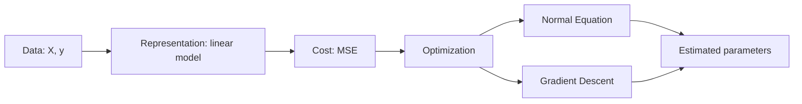

# DADS6003 Applied Machine Learning — Week 02: Single Variable Linear Regression

> **แหล่งเนื้อหาหลัก:** `dads6003_week2_regression.pdf` จำนวน 16 หน้า  
> **ผู้สอนในเอกสาร:** Ekarat Rattagan  
> **วันที่ในเอกสาร:** 18 สิงหาคม 2026  
> **ขอบเขต:** การแทนโมเดล Linear Regression ตัวแปรเดียว, Mean Squared Error, Normal Equation และ Batch Gradient Descent

## 1. ภาพรวมบทเรียน

Linear Regression คือแบบจำลองพื้นฐานสำหรับประมาณความสัมพันธ์ระหว่างตัวแปรอิสระกับตัวแปรตามที่เป็นค่าต่อเนื่อง ในกรณี **Single Variable Linear Regression** เรามี feature เพียงหนึ่งตัว และใช้เส้นตรง

$$
h_{\theta}(x)=\theta_0+\theta_1x
$$

เพื่อประมาณค่า \(y\) จาก \(x\) การสร้างโมเดลจึงหมายถึงการหาค่า intercept \(\theta_0\) และ slope \(\theta_1\) ที่ทำให้ค่าทำนายใกล้ค่าจริงที่สุดตาม cost function ที่กำหนด

บทนี้นำเสนอวิธีหาค่า parameters สองแนวทาง:

1. **Analytical approach:** คำนวณคำตอบโดยตรงด้วย Normal Equation
2. **Iterative approach:** เริ่มจากค่าตั้งต้น แล้วปรับ parameters ซ้ำด้วย Batch Gradient Descent

แก่นของบทนี้ไม่ใช่เพียงจำสูตร แต่ต้องเข้าใจความสัมพันธ์ต่อไปนี้:

## 2. Learning Objectives

หลังเรียนบทนี้ควรสามารถ:

- อธิบาย notation ของ dataset, feature, target, hypothesis และ parameter ได้
- ตีความ \(\theta_0\) และ \(\theta_1\) ในบริบทของข้อมูลจริงได้
- คำนวณ prediction, residual, Squared Error และ Mean Squared Error ได้
- อธิบายว่า \(\arg\min\) หมายถึงอะไร
- สร้าง design matrix ที่มีคอลัมน์ 1 สำหรับ intercept ได้
- คำนวณ Normal Equation สำหรับโจทย์ขนาดเล็กได้
- อธิบายเหตุที่ \(X^TX\) อาจผกผันไม่ได้ และแนวทางใช้ pseudo-inverse/SVD ได้
- derive และคำนวณ Batch Gradient Descent ทีละ iteration ได้
- อธิบายผลของ learning rate และ stopping criteria ได้
- เปรียบเทียบ Analytical กับ Iterative approach ตามขนาด \(N\), จำนวน features \(d\), scaling และ invertibility ได้

## 3. Notation และพื้นฐานที่ต้องรู้

### 3.1 Dataset

จากเอกสารหน้า 2 ให้ชุดข้อมูล

$$
D=\{(\mathbf{x}_1,y_1),(\mathbf{x}_2,y_2),\ldots,(\mathbf{x}_N,y_N)\}
$$

โดย:

- \(N\) คือจำนวน samples
- \(\mathbf{x}_i\in\mathbb{R}^{d}\) คือ feature vector ของ sample ที่ \(i\)
- \(d\) คือจำนวน features
- \(y_i\in\mathbb{R}\) คือ dependent variable หรือ target ที่เป็นค่าจริงต่อเนื่อง

สำหรับ Single Variable Linear Regression มี \(d=1\) ดังนั้น \(\mathbf{x}_i\) ลดรูปเป็น scalar \(x_i\)

### 3.2 Independent และ dependent variable

- **Independent variable / predictor / feature \(x\):** ตัวแปรที่ใช้เป็นข้อมูลเข้า
- **Dependent variable / response / target \(y\):** ตัวแปรผลลัพธ์ที่ต้องการอธิบายหรือทำนาย

ตัวอย่างในงานโรงพยาบาล:

- \(x\): จำนวนผู้ป่วยนอกต่อวัน
- \(y\): จำนวนยาที่จ่ายต่อวัน

Linear Regression ตรวจว่าการเปลี่ยนแปลงของ \(x\) สัมพันธ์เชิงเส้นกับค่าเฉลี่ยของ \(y\) อย่างไร แต่ **ความสัมพันธ์จาก regression เพียงอย่างเดียวไม่ยืนยันเหตุและผล**

### 3.3 Function approximation และ hypothesis

เอกสารหน้า 2 มอง ML เป็น function approximation จาก input space \(X\) ไป output space \(Y\)

สำหรับหนึ่ง observation เขียนได้ชัดเจนว่า

$$
h_{\theta}:\mathbb{R}^{d}\rightarrow\mathbb{R}
$$

เมื่อประมวลผลทั้ง dataset:

$$
X\in\mathbb{R}^{N\times d},\qquad
\mathbf{y}\in\mathbb{R}^{N\times1}
$$

และโมเดลสร้าง predictions \(\hat{\mathbf{y}}\in\mathbb{R}^{N\times1}\)

> **คำอธิบายเพิ่มเติม:** ตัวอักษร \(X\) อาจหมายถึง input space หรือ design matrix ตามบริบท ส่วน \(x_i\) หมายถึงข้อมูลของ sample หนึ่งรายการ ต้องดูตัวพิมพ์และมิติประกอบ

## 4. Model Representation

จากเอกสารหน้า 3 โมเดลสำหรับหนึ่ง feature คือ

$$
h_{\theta}(x)=\theta_0+\theta_1x
$$

- \(\theta_0\): **intercept** — ค่าทำนายเมื่อ \(x=0\)
- \(\theta_1\): **slope/coefficient** — ค่าทำนายเปลี่ยนเท่าใดเมื่อ \(x\) เพิ่ม 1 หน่วย
- จำนวน parameters เท่ากับ \(d+1\) เพราะมี coefficients สำหรับ \(d\) features และ intercept อีกหนึ่งค่า

### 4.1 การตีความ coefficient

หากโมเดลประมาณยอดขายเป็น

$$
\widehat{Sales}=50{,}000+2{,}500(Advertising)
$$

และ Advertising วัดเป็นหน่วยพันบาท:

- intercept 50,000 หมายถึงยอดขายที่โมเดลคาดเมื่อค่าโฆษณาเท่ากับ 0
- slope 2,500 หมายถึงเมื่อค่าโฆษณาเพิ่ม 1,000 บาท ยอดขายที่คาดเพิ่มเฉลี่ย 2,500 บาท

คำว่า “เพิ่มเฉลี่ย” สำคัญ เพราะข้อมูลจริงไม่จำเป็นต้องอยู่บนเส้นตรงทุกจุด

### 4.2 Intercept อาจไม่มีความหมายทางธุรกิจ

ถ้าข้อมูล \(x\) อยู่ระหว่าง 100–500 การตีความที่ \(x=0\) เป็น extrapolation ออกนอกช่วงข้อมูล แม้ intercept จำเป็นทางคณิตศาสตร์ แต่อาจไม่มีความหมายในโลกจริง

## 5. Residual, Loss และ Cost Function

### 5.1 Residual

ค่าทำนายของ sample ที่ \(i\) คือ

$$
\hat{y}_i=h_{\theta}(x_i)
$$

เอกสารใช้ความคลาดเคลื่อนในรูป

$$
e_i=h_{\theta}(x_i)-y_i=\hat{y}_i-y_i
$$

บางตำราอาจนิยาม residual เป็น \(y_i-\hat{y}_i\) ซึ่งมีเครื่องหมายตรงข้าม แต่เมื่อยกกำลังสองจะให้ค่าเดียวกัน ต้องตรวจ convention ก่อนคำนวณ gradient

### 5.2 Mean Squared Error

จากเอกสารหน้า 3:

$$
J(\theta_0,\theta_1)
=\frac{1}{N}\sum_{i=1}^{N}\left(h_{\theta}(x_i)-y_i\right)^2
$$

เหตุผลที่ใช้ squared error:

- error บวกและลบไม่หักล้างกัน
- ลงโทษความผิดพลาดขนาดใหญ่แรงกว่า error เล็ก
- เป็นฟังก์ชันเรียบและหาอนุพันธ์ได้
- สำหรับ Linear Regression ฟังก์ชัน cost เป็น convex จึงไม่มี local minimum หลอก

### 5.3 Objective และ arg min

เป้าหมายจากเอกสารคือ

$$
(\hat{\theta}_0,\hat{\theta}_1)
=\underset{\theta_0,\theta_1}{\arg\min}\;J(\theta_0,\theta_1)
$$

- \(\min J\) หมายถึงค่าต่ำสุดของ cost
- \(\arg\min J\) หมายถึง **ค่า arguments หรือ parameters** ที่ทำให้ cost ต่ำสุด

ดังนั้นคำตอบของการ train ไม่ใช่ MSE เพียงค่าเดียว แต่คือ \(\hat{\theta}_0,\hat{\theta}_1\) ที่ทำให้ MSE ต่ำสุด

## 6. Worked Example จากเอกสารหน้า 4

กำหนดข้อมูล:

| \(x\) | \(y\) |
|---:|---:|
| 0 | 1 |
| 2 | 1 |
| 3 | 4 |

พิจารณาสอง hypotheses:

$$
h_{\theta^{(1)}}(x)=3
$$

จึงมี \(\theta_0=3,\theta_1=0\)

และ

$$
h_{\theta^{(2)}}(x)=1+x
$$

จึงมี \(\theta_0=1,\theta_1=1\)

### 6.1 เติมตารางและคำนวณ MSE

| \(x\) | \(y\) | \(h_{\theta^{(1)}}(x)\) | Squared Error 1 | \(h_{\theta^{(2)}}(x)\) | Squared Error 2 |
|---:|---:|---:|---:|---:|---:|
| 0 | 1 | 3 | \((3-1)^2=4\) | 1 | \((1-1)^2=0\) |
| 2 | 1 | 3 | \((3-1)^2=4\) | 3 | \((3-1)^2=4\) |
| 3 | 4 | 3 | \((3-4)^2=1\) | 4 | \((4-4)^2=0\) |

$$
MSE_1=\frac{4+4+1}{3}=3
$$

$$
MSE_2=\frac{0+4+0}{3}=\frac{4}{3}\approx1.3333
$$

ดังนั้นจากสองตัวเลือก \(h_{\theta^{(2)}}(x)=1+x\) เหมาะกับข้อมูลมากกว่า เพราะมี MSE ต่ำกว่า แต่ยังไม่สรุปว่าเป็นคำตอบต่ำสุดทั่วโลกจนกว่าจะ optimize จริง

## 7. Analytical Approach: Normal Equation

จากเอกสารหน้า 5:

$$
\hat{\boldsymbol{\theta}}
=(X^TX)^{-1}X^T\mathbf{y}
$$

### 7.1 Design matrix และ intercept trick

สำหรับ Single Variable Linear Regression ให้เพิ่ม \(x_{i,0}=1\) ทุก sample:

$$
X=
\begin{bmatrix}
1 & x_1\\
1 & x_2\\
\vdots & \vdots\\
1 & x_N
\end{bmatrix},\qquad
\boldsymbol{\theta}=
\begin{bmatrix}
\theta_0\\
\theta_1
\end{bmatrix},\qquad
\mathbf{y}=
\begin{bmatrix}
y_1\\y_2\\\vdots\\y_N
\end{bmatrix}
$$

จะได้

$$
\hat{\mathbf{y}}=X\boldsymbol{\theta}
$$

### 7.2 ที่มาของ Normal Equation

เขียน sum of squared errors ในรูปเมทริกซ์:

$$
J(\boldsymbol{\theta})
=\frac{1}{N}(X\boldsymbol{\theta}-\mathbf{y})^T
(X\boldsymbol{\theta}-\mathbf{y})
$$

หา gradient และตั้งเท่ากับศูนย์:

$$
\nabla_{\boldsymbol{\theta}}J
=\frac{2}{N}X^T(X\boldsymbol{\theta}-\mathbf{y})=0
$$

จึงได้

$$
X^TX\boldsymbol{\theta}=X^T\mathbf{y}
$$

หาก \(X^TX\) invertible:

$$
\hat{\boldsymbol{\theta}}=(X^TX)^{-1}X^T\mathbf{y}
$$

## 8. ปัญหาของ Normal Equation

### 8.1 \(X^TX\) ไม่สามารถผกผันได้

เอกสารหน้า 6 ยกกรณี **redundant features** เช่น:

- feature หนึ่งเป็นสำเนาอีก feature
- feature หนึ่งเป็น linear combination ของ feature อื่น
- จำนวน features มากเมื่อเทียบกับ samples จน matrix ไม่มี full column rank

ในกรณีดังกล่าว parameters อาจไม่มีคำตอบที่ unique แม้ยังมี fitted values ที่ลด squared error ได้

แนวทางที่เอกสารระบุ:

- **Singular Value Decomposition (SVD)**
- **Moore–Penrose Pseudo-inverse**

เขียนคำตอบด้วย pseudo-inverse ได้ว่า

$$
\hat{\boldsymbol{\theta}}=X^{+}\mathbf{y}
$$

โดย \(X^+\) คือ Moore–Penrose pseudo-inverse วิธีนี้รองรับ matrix ที่ไม่เป็น square หรือไม่มี inverse ปกติ

> **คำอธิบายเพิ่มเติม:** ในงานคำนวณจริง ไม่ควรสร้าง inverse ตรง ๆ หากแก้ระบบสมการหรือใช้ least-squares solver/SVD ได้ เพราะเสถียรเชิงตัวเลขกว่า

### 8.2 Computational complexity

เอกสารหน้า 7 ระบุปัญหาความซับซ้อน \(O(n^3)\) เมื่อ feature set มีขนาดใหญ่ และเสนอ Gradient Descent เป็นทางเลือก

เพื่อไม่ให้สับสนกับ \(N\) ที่ใช้แทนจำนวน samples ในสไลด์ อธิบายให้ชัดว่า bottleneck สำคัญคือการแก้ระบบหรือ inverse เมทริกซ์ขนาดประมาณ \((d+1)\times(d+1)\) ซึ่งโดยแนวคิดดั้งเดิมเติบโตระดับ cubic ตามจำนวน features หรือประมาณ \(O(d^3)\) ขณะที่การสร้าง \(X^TX\) ยังมีต้นทุนที่ขึ้นกับทั้ง \(N\) และ \(d\)

ดังนั้น:

- \(d\) เล็ก แต่ \(N\) ใหญ่: analytical/least-squares solver ยังอาจเหมาะ
- \(d\) ใหญ่มาก หรือข้อมูลต้องเรียนรู้เป็น batch/stream: iterative methods มักเหมาะกว่า

## 9. Iterative Approach: Batch Gradient Descent

จากเอกสารหน้า 8 Gradient Descent ลด objective โดยปรับ \(\boldsymbol{\theta}\) ไปในทิศทางตรงข้าม gradient

### 9.1 Intuition ของ gradient

- gradient ชี้ทิศที่ cost เพิ่มเร็วที่สุด
- negative gradient จึงชี้ทิศลงเขาที่ชันที่สุดเฉพาะบริเวณนั้น
- learning rate กำหนดขนาดก้าว
- ทำซ้ำจน cost เปลี่ยนน้อยหรือครบจำนวน iterations

สำหรับ Linear Regression กับ MSE พื้นผิว cost เป็น bowl-shaped convex surface (หน้า 9–10) จึงมี global minimum หนึ่งบริเวณ หากข้อมูลมี rank ครบจะมี parameter solution ที่ unique

### 9.2 General update rule

จากเอกสารหน้า 11:

$$
\theta_j^{(t+1)}
:=\theta_j^{(t)}-eta
\frac{\partial}{\partial\theta_j}J(\boldsymbol{\theta}^{(t)})
$$

โดย:

- \(t\) คือ iteration
- \(j=0,1,\ldots,d\) คือ index ของ parameter
- \(\eta\) (eta) คือ learning rate เช่น 0.001

### 9.3 Derivation ของ gradient

จาก

$$
J(\boldsymbol{\theta})=
\frac{1}{N}\sum_{i=1}^{N}(h_{\theta}(x_i)-y_i)^2
$$

ใช้ chain rule:

$$
\frac{\partial J}{\partial\theta_j}
=\frac{2}{N}\sum_{i=1}^{N}
(h_{\theta}(x_i)-y_i)x_{i,j}
$$

เมื่อกำหนด \(x_{i,0}=1\)

$$
\frac{\partial J}{\partial\theta_0}
=\frac{2}{N}\sum_{i=1}^{N}(h_{\theta}(x_i)-y_i)
$$

$$
\frac{\partial J}{\partial\theta_1}
=\frac{2}{N}\sum_{i=1}^{N}(h_{\theta}(x_i)-y_i)x_i
$$

> **หมายเหตุสำคัญจากเอกสารหน้า 12:** สูตร update ในสไลด์เขียน \(\frac{1}{N}\sum e_ix_{i,j}\) โดยไม่มีตัวคูณ 2 ทั้งที่ cost หน้า 8 นิยามเป็น MSE \(\frac{1}{N}\sum e_i^2\) ตามตรง ทางปฏิบัติ factor 2 เป็นค่าคงที่ที่ดูดรวมเข้า learning rate ได้ หรือมักนิยาม cost เป็น \(\frac{1}{2N}\sum e_i^2\) เพื่อให้ 2 ตัดกัน โน้ตนี้ใช้ **สูตรตามสไลด์** ในการเฉลย Exercise เพื่อให้ตรงกับชั้นเรียน

### 9.4 Batch update ต้องทำพร้อมกัน

คำนวณ gradients ของ \(\theta_0\) และ \(\theta_1\) จาก parameter values ของ iteration เดียวกันก่อน แล้วจึง update ทั้งคู่:

$$
\boldsymbol{\theta}^{(t+1)}
=\boldsymbol{\theta}^{(t)}-
\eta\frac{1}{N}X^T(X\boldsymbol{\theta}^{(t)}-\mathbf{y})
$$

หาก update \(\theta_0\) แล้วนำค่าที่อัปเดตใหม่ไปคำนวณ gradient ของ \(\theta_1\) จะไม่ใช่ simultaneous Batch GD ตามสูตร

### 9.5 Stopping criteria

จากเอกสารหน้า 12:

- หยุดเมื่อครบ **maximum iterations**
- หรือเมื่อ

$$
|MSE_{t+1}-MSE_t|<\epsilon
$$

เช่น \(\epsilon=10^{-6}\)

ในทางปฏิบัติอาจติดตาม gradient norm, validation loss และ early stopping เพิ่มเติม

## 10. Learning Rate และ Feature Scaling

### 10.1 Learning rate

| ค่า \(\eta\) | พฤติกรรมที่อาจเกิดขึ้น |
|---|---|
| เล็กเกินไป | cost ลดช้า ต้องใช้ iterations มาก |
| เหมาะสม | cost ลดต่อเนื่องและ converge |
| ใหญ่เกินไป | กระโดดข้าม minimum, oscillate หรือ diverge |

สัญญาณว่า learning rate อาจใหญ่เกินไปคือ MSE เพิ่มขึ้นหรือกลายเป็นค่ามหาศาล/NaN

### 10.2 เหตุใด Gradient Descent ต้องการ feature scaling

ถ้า feature หนึ่งมีช่วง 0–1 แต่อีก feature มีช่วง 0–1,000,000 พื้นผิว cost จะยืดยาว ทำให้ gradient descent zigzag และ converge ช้า การ standardize ช่วยให้แต่ละแกนมี scale ใกล้กัน

สำหรับหนึ่ง feature scaling ไม่ได้เปลี่ยนความสามารถของเส้นตรง แต่เปลี่ยนความสะดวกในการ optimization และการตีความ coefficient ต้องแปลงกลับอย่างถูกต้อง

## 11. ข้อจำกัดของ Batch Gradient Descent

จากเอกสารหน้า 13:

- ต้องกำหนด learning rate และ hyperparameters อื่น
- ช้าเมื่อจำนวน samples \(N\) ใหญ่มาก เพราะหนึ่ง update ต้องอ่านข้อมูลทุก sample

คำอธิบายเพิ่มเติม:

- **Batch GD:** ใช้ข้อมูลทั้งหมดต่อหนึ่ง update — gradient เสถียรแต่แต่ละรอบแพง
- **Stochastic GD:** ใช้หนึ่ง sample ต่อ update — update เร็วแต่ noisy
- **Mini-batch GD:** ใช้ข้อมูลกลุ่มย่อย — เป็นจุดสมดุลและใช้ hardware แบบเวกเตอร์ได้ดี

## 12. Iterative vs Analytical Approach

ตารางหน้า 14 เปรียบเทียบสองแนวทาง โดยตีความและปรับ notation ให้ชัดเจนดังนี้:

| ประเด็น | Iterative: Gradient Descent | Analytical: Normal Equation / Least Squares |
|---|---|---|
| วิธีได้คำตอบ | ปรับ parameters ซ้ำ | แก้ระบบสมการโดยตรง |
| Hyperparameters | ต้องกำหนด learning rate, iterations ฯลฯ | ไม่ต้องมี learning rate |
| Feature dimension สูง | รองรับได้ดีกว่า | matrix operation แพงเมื่อ \(d\) ใหญ่ |
| จำนวน samples สูง | Batch GD แต่ละรอบอาจช้า; mini-batch ช่วยได้ | ยังใช้งานได้เมื่อ \(d\) ไม่ใหญ่ แต่ต้องอ่านข้อมูลเพื่อสร้างระบบ |
| Feature scaling | สำคัญต่อ convergence | ไม่จำเป็นต่อคำตอบเชิงทฤษฎี แต่ช่วย numerical conditioning ได้ |
| Invertibility | ไม่มีปัญหา inverse โดยตรง | สูตร inverse ปกติมีปัญหาเมื่อ rank ไม่เต็ม; solver/pseudo-inverse แก้ได้ |
| Exactness | ได้ค่าประมาณตาม convergence | ได้ least-squares solution ภายใต้ numerical precision |
| ความเหมาะสม | ข้อมูล/feature ใหญ่, online/mini-batch learning | ปัญหาขนาดเล็กถึงกลางและต้องการคำตอบตรง |

> **ข้อสังเกต:** ตารางในสไลด์ระบุ complexity \(O(n^2)\) กับ \(O(n^3)\) แบบย่อ แต่ complexity จริงขึ้นกับ algorithm, \(N\), \(d\), sparsity และจำนวน iterations จึงไม่ควรจำเพียงเลขโดยไม่ระบุว่าตัวแปรหมายถึงอะไร

## 13. Exercise 1 — เฉลยทั้งสองแนวทาง

จากเอกสารหน้า 15:

| \(x\) | \(y\) |
|---:|---:|
| 2 | 12 |
| 5 | 9 |
| 1 | 6 |

### 13.1 Analytical approach

สร้าง matrices:

$$
X=
\begin{bmatrix}
1&2\\
1&5\\
1&1
\end{bmatrix},\qquad
\mathbf{y}=
\begin{bmatrix}
12\\9\\6
\end{bmatrix}
$$

คำนวณ

$$
X^TX=
\begin{bmatrix}
3&8\\
8&30
\end{bmatrix}
$$

$$
X^T\mathbf{y}=
\begin{bmatrix}
27\\75
\end{bmatrix}
$$

inverse ของ \(X^TX\):

$$
(X^TX)^{-1}
=\frac{1}{3(30)-8(8)}
\begin{bmatrix}
30&-8\\
-8&3
\end{bmatrix}
=\frac{1}{26}
\begin{bmatrix}
30&-8\\
-8&3
\end{bmatrix}
$$

ดังนั้น

$$
\hat{\boldsymbol{\theta}}
=(X^TX)^{-1}X^T\mathbf{y}
=\frac{1}{26}
\begin{bmatrix}
30&-8\\
-8&3
\end{bmatrix}
\begin{bmatrix}
27\\75
\end{bmatrix}
=
\begin{bmatrix}
105/13\\9/26
\end{bmatrix}
$$

$$
\boxed{\hat{\theta}_0\approx8.076923,\qquad
\hat{\theta}_1\approx0.346154}
$$

สมการเส้นตรงที่ได้คือ

$$
\boxed{\hat{y}=8.076923+0.346154x}
$$

### 13.2 Iterative approach: Batch GD สองรอบ

กำหนดตามโจทย์:

$$
\theta_0^{(0)}=0.1,\quad
\theta_1^{(0)}=0.1,\quad
\eta=0.01,\quad N=3
$$

และใช้ update equation ตามหน้า 12:

$$
\theta_j^{(t+1)}=\theta_j^{(t)}-
0.01\left[\frac{1}{3}\sum_{i=1}^{3}
(h_{\theta}(x_i)-y_i)x_{i,j}\right]
$$

โดย \(x_{i,0}=1\)

#### Iteration 1: จาก \(t=0\) ไป \(t=1\)

โมเดลเริ่มต้น:

$$
h_{\theta^{(0)}}(x)=0.1+0.1x
$$

| \(x_i\) | \(y_i\) | \(\hat{y}_i\) | \(e_i=\hat{y}_i-y_i\) | \(e_ix_i\) |
|---:|---:|---:|---:|---:|
| 2 | 12 | 0.3 | -11.7 | -23.4 |
| 5 | 9 | 0.6 | -8.4 | -42.0 |
| 1 | 6 | 0.2 | -5.8 | -5.8 |

$$
g_0=\frac{-11.7-8.4-5.8}{3}=-8.633333
$$

$$
g_1=\frac{-23.4-42.0-5.8}{3}=-23.733333
$$

update พร้อมกัน:

$$
\theta_0^{(1)}=0.1-0.01(-8.633333)=0.186333
$$

$$
\theta_1^{(1)}=0.1-0.01(-23.733333)=0.337333
$$

MSE ก่อน update เท่ากับ

$$
MSE_0=\frac{(-11.7)^2+(-8.4)^2+(-5.8)^2}{3}
\approx80.363333
$$

#### Iteration 2: จาก \(t=1\) ไป \(t=2\)

$$
h_{\theta^{(1)}}(x)=0.186333+0.337333x
$$

| \(x_i\) | \(y_i\) | \(\hat{y}_i\) | \(e_i\) | \(e_ix_i\) |
|---:|---:|---:|---:|---:|
| 2 | 12 | 0.861000 | -11.139000 | -22.278000 |
| 5 | 9 | 1.873000 | -7.127000 | -35.635000 |
| 1 | 6 | 0.523667 | -5.476333 | -5.476333 |

$$
g_0=\frac{-11.139-7.127-5.476333}{3}
\approx-7.914111
$$

$$
g_1=\frac{-22.278-35.635-5.476333}{3}
\approx-21.129778
$$

$$
\theta_0^{(2)}=0.186333-0.01(-7.914111)
\approx0.265474
$$

$$
\theta_1^{(2)}=0.337333-0.01(-21.129778)
\approx0.548631
$$

ดังนั้นหลัง 2 iterations:

$$
\boxed{\theta_0^{(2)}\approx0.265474,\qquad
\theta_1^{(2)}\approx0.548631}
$$

MSE ลดจากประมาณ \(80.363333\) ก่อนรอบแรก เป็น \(68.287226\) ก่อน update รอบที่สอง และเมื่อใช้ parameters หลังสองรอบจะได้ MSE ประมาณ \(58.647129\) แสดงว่า algorithm กำลังเคลื่อนไปในทิศทางที่ลด cost แต่สองรอบยังน้อยมาก จึงยังห่างจากคำตอบ analytical

## 14. Assumptions ของ Linear Regression

> **คำอธิบายเพิ่มเติม:** สไลด์สัปดาห์นี้เน้น optimization และยังไม่ได้แจกแจง assumptions แต่ assumptions เหล่านี้สำคัญต่อการใช้ Linear Regression อย่างถูกต้อง

1. **Linearity:** ค่าเฉลี่ยของ \(y\) มีความสัมพันธ์เชิงเส้นกับ features ตามแบบจำลอง
2. **Independence:** errors ของ observations เป็นอิสระ โดยเฉพาะข้อมูลตามเวลาต้องระวัง autocorrelation
3. **Homoscedasticity:** variance ของ errors ค่อนข้างคงที่ตลอดช่วง fitted values
4. **Zero conditional mean:** \(E[\varepsilon\mid X]=0\); ไม่มีปัจจัยสำคัญที่สัมพันธ์กับ \(X\) ถูกละเลยจนทำให้ coefficient มี bias
5. **No perfect multicollinearity:** ไม่มี feature ที่เป็น linear combination สมบูรณ์ของ feature อื่น
6. **Normality of errors:** สำคัญต่อ inference ขนาดเล็ก เช่น confidence interval และ hypothesis test มากกว่าการได้ least-squares estimates เอง

การละเมิด assumptions ไม่ได้ทำให้โปรแกรมคำนวณไม่ได้เสมอไป แต่กระทบความน่าเชื่อถือของ coefficient, standard error, interval และ prediction

## 15. Model Diagnostics และ Evaluation

แม้ MSE ใช้เป็น training objective ได้ ควรตรวจเพิ่มเติม:

- scatter plot ของ \(x\) กับ \(y\): ดู linearity และ outlier
- residual vs fitted plot: ดู non-linearity และ heteroscedasticity
- residual distribution/Q–Q plot: ตรวจ normality สำหรับ inference
- residual vs time/order: ดู autocorrelation และ drift
- MAE/RMSE บน validation/test data: ประเมิน generalization
- เปรียบเทียบกับ baseline เช่น ทำนายด้วยค่าเฉลี่ยของ training target

### 15.1 Training error ไม่ใช่ Test error

Normal Equation และ Gradient Descent ต่างลด cost บน training data หากรายงาน MSE จากข้อมูลเดียวกันเพียงอย่างเดียว เรารู้เพียงว่า fit ข้อมูลที่เห็นดีเพียงใด ไม่รู้ว่าจะทำนายข้อมูลใหม่ได้ดีหรือไม่ จึงต้องแยก validation/test ตาม workflow ของ Week 01

## 16. การใช้ Linear Regression ในงานจริง

### เหมาะเมื่อ

- target เป็นค่าต่อเนื่อง
- ความสัมพันธ์เชิงเส้นเป็น approximation ที่สมเหตุสมผล
- ต้องการ baseline ที่เร็วและอธิบายง่าย
- ต้องการตีความทิศทางและขนาดของ coefficient ภายใต้ assumptions ที่เหมาะสม

### ไม่ควรใช้แบบตรงไปตรงมาเมื่อ

- target เป็น class หรือ probability โดยไม่มีการปรับแบบจำลอง
- ความสัมพันธ์ non-linear ชัดเจน
- มี outliers รุนแรงที่ครอบงำ squared loss
- observations มี dependency ที่ไม่ได้ model เช่น repeated measures/time series
- ต้อง extrapolate ไกลนอกช่วง training data

### ตัวอย่างด้าน Supply Chain

ต้องการทำนายเวลาจัดส่งจากระยะทาง:

$$
\widehat{LeadTime}=\theta_0+\theta_1Distance
$$

ควรพิจารณาว่า traffic, supplier, product type และวันหยุดเป็น omitted variables หรือไม่ หากผลต่างมาก Single Variable Regression อาจเป็น baseline แต่ Multiple Regression จะเหมาะกว่า

## 17. Common Misconceptions

1. **“เส้น regression ต้องผ่านทุกจุด”**  
   ไม่ใช่ โมเดลเลือกเส้นที่ลดผลรวม squared errors ข้อมูลจริงมี noise จึงมักไม่อยู่บนเส้นทั้งหมด

2. **“Slope เป็นบวกจึงพิสูจน์ว่า \(x\) ทำให้ \(y\) เพิ่ม”**  
   Regression แสดง association ภายใต้ข้อมูลและแบบจำลอง ไม่ยืนยัน causality โดยไม่มี design/assumptions เพิ่มเติม

3. **“Normal Equation ใช้ได้ก็ต่อเมื่อเขียน inverse ตรง ๆ”**  
   ในทางปฏิบัติใช้ linear solver, QR decomposition, SVD หรือ pseudo-inverse ที่เสถียรกว่า

4. **“Gradient Descent ได้คำตอบในหนึ่งรอบ”**  
   เป็น iterative method ต้องทำซ้ำจน convergence หรือถึง stopping criterion

5. **“Learning rate ยิ่งใหญ่ยิ่งเร็ว”**  
   ใหญ่เกินไปทำให้ oscillate/diverge ส่วนเล็กเกินไปทำให้ช้า

6. **“อัปเดต \(\theta_0\) แล้วใช้ค่าใหม่คำนวณ \(\theta_1\) ได้”**  
   Batch GD มาตรฐานต้องคำนวณ gradient ทุก parameter จาก parameter state เดียวกัน แล้ว update พร้อมกัน

7. **“Feature scaling เปลี่ยนเส้นที่ดีที่สุดเสมอ”**  
   ถ้าแปลงและแปลงกลับถูกต้อง scaling ไม่เปลี่ยน predictive family ของ linear model แต่ช่วย optimization และ numerical conditioning

8. **“MSE ต่ำบน training data แปลว่าโมเดลดี”**  
   ต้องประเมินกับ unseen data และตรวจ assumptions/diagnostics ด้วย

## 18. Likely Exam Focus

> หัวข้อต่อไปนี้อนุมานจากสูตร ตารางเปรียบเทียบ และ Exercise ในเอกสาร ไม่ใช่ข้อสอบจริง

### Definitions and notation

- \(D, N, d, x_i, y_i, h_{\theta}, \theta_0, \theta_1\)
- independent vs dependent variable
- parameter vs hyperparameter
- residual, MSE, objective และ \(\arg\min\)

### Equations to remember and derive

$$
h_{\theta}(x)=\theta_0+\theta_1x
$$

$$
J(\theta)=\frac{1}{N}\sum_{i=1}^{N}(h_{\theta}(x_i)-y_i)^2
$$

$$
\hat{\theta}=(X^TX)^{-1}X^Ty
$$

$$
\theta_j^{(t+1)}=\theta_j^{(t)}-eta\frac{1}{N}
\sum_{i=1}^{N}(h_{\theta}(x_i)-y_i)x_{i,j}
$$

### Calculations to perform

- เติม prediction และ MSE ในตาราง
- สร้าง design matrix และคำนวณ \(X^TX\), \(X^Ty\)
- หา parameters ด้วย Normal Equation
- ทำ Batch GD อย่างน้อย 1–2 iterations
- ตรวจว่า MSE ลดลงหลัง update หรือไม่

### Concepts to explain and compare

- Analytical vs Iterative approach
- inverse vs pseudo-inverse
- ผลของ learning rate
- เหตุผลของ feature scaling
- maximum iterations vs epsilon stopping
- ปัญหา redundant features และ computational complexity

## 19. Practice Questions

### Recall

**1.** ใน Single Variable Linear Regression จำนวน parameters เท่ากับเท่าใด และคือค่าใดบ้าง?

**2.** \(\arg\min_{\theta}J(\theta)\) คืนค่าอะไร?

**3.** เหตุใด design matrix จึงเพิ่มคอลัมน์ที่มีค่า 1?

### Explain and Compare

**4.** อธิบายความแตกต่างระหว่าง residual, loss และ cost function

**5.** เปรียบเทียบ Normal Equation กับ Batch Gradient Descent อย่างน้อย 4 ด้าน

**6.** เพราะเหตุใด \(X^TX\) จึงอาจ non-invertible และ pseudo-inverse ช่วยอย่างไร?

**7.** อธิบายเหตุผลที่ feature scaling ช่วย Gradient Descent

### Apply

**8.** ให้ \(h(x)=2+3x\) และจุดข้อมูล \((0,1),(1,6),(2,7)\) จงหาค่าทำนาย residual และ MSE

**9.** หาก gradient ของ \(\theta_0\) และ \(\theta_1\) เท่ากับ \(-4\) และ 10 ตามลำดับ, parameters ปัจจุบันคือ \((2,3)\), และ \(\eta=0.1\) จงหา parameters ใหม่

**10.** ระหว่าง train พบว่า MSE เป็น 100, 250, 700, 2,000 ตาม iteration ควรวิเคราะห์อย่างไร?

### Analyze

**11.** โมเดลทำนายค่าใช้จ่ายได้ training RMSE ต่ำมาก แต่ test RMSE สูง จงเสนอความเป็นไปได้และแนวทางตรวจสอบ

**12.** มี features “น้ำหนักกิโลกรัม” และ “น้ำหนักปอนด์” อยู่ในโมเดลเดียวกัน Normal Equation อาจมีปัญหาใด เพราะเหตุใด?

## 20. Model Answers with Reasoning

**1.** มี 2 parameters คือ intercept \(\theta_0\) และ slope \(\theta_1\) เพราะ \(d+1=1+1\)

**2.** คืนค่า parameter \(\theta\) ที่ทำให้ \(J\) ต่ำสุด ไม่ใช่ค่าต่ำสุดของ \(J\) เอง

**3.** เพื่อเขียน intercept เป็นส่วนหนึ่งของ matrix multiplication: \(\theta_0(1)+\theta_1x\)

**4.** Residual คือ error ของ sample หนึ่งรายการ, loss คือค่าปรับของ sample เช่น squared residual และ cost คือการรวม/เฉลี่ย loss ของหลาย samples เช่น MSE

**5.** Normal Equation ให้คำตอบโดยตรง ไม่ต้อง learning rate และไม่จำเป็นต้อง scale เพื่อ convergence แต่มีปัญหา matrix/มิติสูง; GD ต้องทำซ้ำและเลือก hyperparameters แต่รองรับ feature dimension ใหญ่และไม่ต้อง inverse

**6.** เกิดเมื่อ columns ของ \(X\) linearly dependent หรือ rank ไม่เต็ม ทำให้ inverse ปกติไม่มีอยู่ Pseudo-inverse ให้ least-squares solution ได้แม้ matrix singular และเลือก minimum-norm solution ในกรณีที่มีหลายคำตอบ

**7.** Scaling ทำให้ cost contours สมดุลขึ้น gradient ไม่ต้อง zigzag ระหว่างแกนที่มีสเกลต่างกันมาก จึง converge ได้เร็วและเลือก learning rate ง่ายขึ้น

**8.** Predictions คือ \([2,5,8]\); residuals ตาม convention \(\hat{y}-y\) คือ \([1,-1,1]\); ดังนั้น

$$
MSE=(1^2+(-1)^2+1^2)/3=1
$$

**9.** ใช้ \(\theta^{new}=\theta-\eta g\):

$$
\theta_0^{new}=2-0.1(-4)=2.4
$$

$$
\theta_1^{new}=3-0.1(10)=2.0
$$

**10.** MSE เพิ่มอย่างรวดเร็วแสดงว่า GD อาจ diverge สาเหตุหลักคือ learning rate สูงเกินไป หรือ features ไม่ได้ scaling ควรลด \(\eta\), scale features, ตรวจ gradient/sign และตรวจข้อมูลผิดปกติ

**11.** อาจเกิด overfitting, data distribution ต่างกัน, leakage ใน train, preprocessing ไม่สอดคล้อง หรือ split ไม่เหมาะ ควรตรวจ pipeline, learning curves, residuals, split strategy และ baseline บน unseen data

**12.** น้ำหนักปอนด์เป็นค่าคงที่คูณน้ำหนักกิโลกรัม จึงเกิด perfect multicollinearity ทำให้ columns linearly dependent และ \(X^TX\) singular ควรเก็บเพียงหน่วยเดียว หรือใช้ pseudo-inverse/regularization ตามวัตถุประสงค์

## 21. Key Takeaways

- Single Variable Linear Regression แทนความสัมพันธ์ด้วย \(h_{\theta}(x)=\theta_0+\theta_1x\)
- การ train คือการหา parameters ที่ลด MSE ไม่ใช่เพียงวาดเส้นผ่านข้อมูลด้วยสายตา
- Normal Equation แก้ least-squares โดยตรง แต่สูตร inverse มีข้อจำกัดเมื่อ matrix singular หรือ feature dimension ใหญ่
- SVD และ Moore–Penrose pseudo-inverse จัดการ rank deficiency ได้ดีกว่า inverse ตรง ๆ
- Gradient Descent ปรับ parameters ตรงข้าม gradient และต้องเลือก learning rate กับ stopping criterion
- Batch GD ต้องคำนวณ gradient จากทุก samples และ update parameters พร้อมกัน
- Analytical และ Iterative approaches มุ่งหา minimum เดียวกัน แต่มี trade-offs ต่างกัน
- ผลบน training data ต้องแยกจาก generalization และควรตรวจ residuals/assumptions ก่อนใช้โมเดลจริง

## 22. Glossary

| คำศัพท์ | ความหมาย |
|---|---|
| Analytical approach | การแก้คำตอบผ่านสมการ/linear algebra โดยตรง |
| Batch Gradient Descent | GD ที่ใช้ทุก samples ในการคำนวณหนึ่ง gradient |
| Convex function | ฟังก์ชันรูปแอ่งที่ local minimum เป็น global minimum |
| Cost function | ค่ารวมที่ใช้วัดความผิดพลาดของโมเดลบนชุดข้อมูล |
| Design matrix | เมทริกซ์ข้อมูล input ที่จัดเพื่อคำนวณโมเดล |
| Feature scaling | การปรับช่วงหรือการกระจายของ features ให้อยู่ใน scale ใกล้กัน |
| Gradient | เวกเตอร์อนุพันธ์ที่ชี้ทิศทางการเพิ่มเร็วที่สุดของฟังก์ชัน |
| Hypothesis | ฟังก์ชันโมเดลที่ใช้ประมาณ target |
| Intercept | ค่าทำนายเมื่อ features เท่ากับศูนย์ |
| Learning rate | ขนาดก้าวในการ update parameters |
| Mean Squared Error | ค่าเฉลี่ยของ squared errors |
| Normal Equation | สมการ closed-form สำหรับ Ordinary Least Squares |
| Parameter | ค่าที่โมเดลเรียนรู้จาก training data |
| Pseudo-inverse | inverse แบบทั่วไปสำหรับ matrix ที่ไม่ invertible ตามปกติ |
| Residual | ผลต่างระหว่างค่าทำนายกับค่าจริงตาม convention ที่ใช้ |
| Slope | การเปลี่ยนแปลงของค่าทำนายเมื่อ feature เพิ่มหนึ่งหน่วย |
| SVD | การแยกเมทริกซ์ที่ใช้วิเคราะห์ rank และคำนวณ pseudo-inverse |

## 23. References

### เอกสารประกอบการสอน

- Rattagan, E. (2026). `dads6003_week2_regression.pdf`: *Week 2: Single Variable Linear Regression*, หน้า 1–16.

### แหล่งที่อ้างในเอกสาร

- Marill, K. A. (2004). Advanced statistics: linear regression, part I: simple linear regression. *Academic Emergency Medicine, 11*(1), 87–93.
- Bei Wang, [Singular Value Decomposition lecture](https://www.sci.utah.edu/~beiwang/teaching/cs6210-fall-2016/lecture18.pdf)
- Tim Baumann, [SVD Image Compression Demo](https://timbaumann.info/svd-image-compression-demo/)

### คำอธิบายเพิ่มเติม

- scikit-learn, [Linear Models — Ordinary Least Squares](https://scikit-learn.org/stable/modules/linear_model.html#ordinary-least-squares)
- NumPy, [`numpy.linalg.lstsq`](https://numpy.org/doc/stable/reference/generated/numpy.linalg.lstsq.html)
