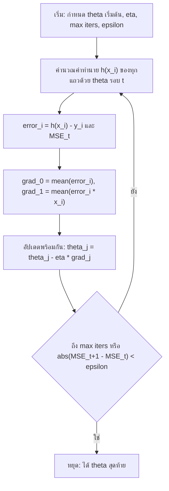

# บทที่ 2 Linear Regression ตัวแปรเดียว (Single Variable Linear Regression)

Linear regression ตัวแปรเดียวคือการหาเส้นตรง $h_\theta(x) = \theta_0 + \theta_1 x$ ที่ทำให้ค่าเฉลี่ยของความคลาดเคลื่อนกำลังสอง (MSE) ต่ำที่สุด ซึ่งหาได้สองทาง คือแก้สมการตรงๆ ด้วย normal equation หรือค่อยๆ ปรับค่าด้วย gradient descent

**วิธีอ่าน:** บทนี้ต่อยอดจากบทที่ 1 โดยตรง (supervised learning แบบ regression, loss, gradient descent) ส่วนที่ 1 ถึง 3 สร้างโจทย์ให้ชัดว่ากำลังหาอะไร ส่วนที่ 4 และ 5 คือวิธีแก้สองแบบ ส่วนที่ 6 เทียบสองวิธี ส่วนที่ 7 เป็นโค้ด Python ที่ทำทุกอย่างในบทซ้ำได้ ท้ายบทมี cheat sheet และโจทย์ฝึกพร้อมแนวตอบ แนะนำให้หยิบกระดาษกับเครื่องคิดเลขมาคำนวณตาม worked example ไปด้วย เพราะข้อสอบบทนี้มีแนวโน้มเป็นการคำนวณ

---

## ส่วนที่ 0 ปูพื้นฐาน: ศัพท์ที่ต้องรู้ก่อน

| ศัพท์ที่วิชาใช้ | ศัพท์ทางการ/คำพ้อง | ความหมายสั้น |
|---|---|---|
| Independent variable, $x$ | Feature, ตัวแปรต้น, ตัวแปรอิสระ | ค่าที่ใช้ทำนาย |
| Dependent variable, $y$ | Target, label, ตัวแปรตาม | ค่าที่ต้องการทำนาย เป็นจำนวนจริง |
| Hypothesis, $h_\theta(x)$ | Model, function approximation | สูตรที่รับ $x$ แล้วให้ค่าทำนาย $\hat{y}$ |
| Parameters, $\theta_0, \theta_1$ | Intercept (จุดตัดแกน), slope (ความชัน) | ตัวเลขที่ต้องหาเพื่อกำหนดเส้นตรงหนึ่งเส้น |
| $N$ (บางที่เขียน $n$) | Number of samples | จำนวนตัวอย่างในชุดข้อมูล |
| $d$ | Number of features, dimension | จำนวน feature ต่อหนึ่งตัวอย่าง บทนี้ $d = 1$ |
| Loss / Cost function, $J$ | Objective function | ฟังก์ชันที่วัดว่าเส้นตรงหนึ่งเส้นทำนายผิดมากแค่ไหน |
| MSE | Mean Squared Error | ค่าเฉลี่ยของ (ค่าทำนาย ลบ ค่าจริง) ยกกำลังสอง |
| arg min | Argument of the minimum | "ค่าของตัวแปรที่ทำให้ฟังก์ชันต่ำสุด" ไม่ใช่ค่าต่ำสุดเอง |
| Design matrix, $X$ | Feature matrix | ตารางข้อมูลในรูปเมทริกซ์ โดยเติมคอลัมน์เลข 1 ไว้หน้าสุด |
| Normal equation | Closed-form solution, analytical approach | สูตรที่ให้ $\theta$ ที่ดีที่สุดได้ในครั้งเดียว |
| (Batch) Gradient Descent | Iterative approach | วิธีปรับ $\theta$ ทีละก้าวไปทางที่ loss ลดลง |
| Learning rate, $\eta$ (eta) | Step size, บางตำราใช้ $\alpha$ | ขนาดก้าวในแต่ละรอบของ gradient descent |
| Hyperparameter | ค่าตั้งของอัลกอริทึม | ค่าที่มนุษย์ต้องกำหนดเอง ไม่ได้เรียนจากข้อมูล เช่น $\eta$ จำนวนรอบสูงสุด |
| Iteration, $t$ | รอบ, epoch (ใน batch GD หนึ่งรอบใช้ข้อมูลครบหนึ่งครั้ง) | ลำดับของการปรับค่าแต่ละครั้ง |
| Convergence | การลู่เข้า | สภาพที่ค่า $\theta$ หรือ loss แทบไม่เปลี่ยนแล้ว |

ข้อตกลงเรื่องสัญลักษณ์: $x_i$ คือ feature ของตัวอย่างที่ $i$ และ $y_i$ คือคำตอบจริงของตัวอย่างนั้น ส่วน $\theta^{t}$ (ตัวยก $t$) คือค่าพารามิเตอร์ในรอบที่ $t$ ไม่ใช่การยกกำลัง

พื้นฐานคณิตศาสตร์ที่ใช้ในบทนี้มีสามเรื่อง

1. **การคูณเมทริกซ์และ transpose:** $X^{T}$ คือการพลิกแถวเป็นคอลัมน์ ถ้า $X$ มีขนาด $N \times 2$ แล้ว $X^{T}$ มีขนาด $2 \times N$ และ $X^{T}X$ มีขนาด $2 \times 2$
2. **อินเวอร์สของเมทริกซ์ $2 \times 2$:** ถ้า $A = [(a, b); (c, d)]$ แล้ว $A^{-1} = \frac{1}{ad - bc} [(d, -b); (-c, a)]$ โดยต้องมี $ad - bc \neq 0$ ค่า $ad - bc$ เรียกว่า determinant ถ้าเป็นศูนย์ เมทริกซ์นั้นไม่มีอินเวอร์ส (non-invertible หรือ singular)
3. **อนุพันธ์ของกำลังสองด้วย chain rule:** อนุพันธ์ของ $(u)^2$ คือ $2u$ คูณอนุพันธ์ของ $u$ ใช้ตอนหา gradient ของ MSE

---

## ส่วนที่ 1 ทำไมต้องมี Linear Regression

ลองนึกถึงฝ่ายจัดซื้อของโรงพยาบาลที่อยากรู้ว่า ถ้าเดือนหน้ามีผู้ป่วยนอกประมาณ 5,000 คน จะใช้ถุงมือไปกี่กล่อง ข้อมูลย้อนหลังมีคู่ (จำนวนผู้ป่วย, ปริมาณที่ใช้จริง) ของแต่ละเดือน ถ้าวาดจุดเหล่านี้บนกราฟจะเห็นว่าจุดเรียงตัวขึ้นเป็นแนวโดยประมาณ แต่ไม่ได้อยู่บนเส้นเดียวกันพอดี เพราะมีปัจจัยอื่นปนอยู่

คำถามคือ "เส้นตรงเส้นไหนเป็นตัวแทนแนวโน้มนี้ได้ดีที่สุด" ถ้าตอบได้ เราจะใช้เส้นนั้นทำนายเดือนถัดไป และยังอ่านความหมายได้ด้วยว่าผู้ป่วยเพิ่มหนึ่งคน ปริมาณใช้เพิ่มเฉลี่ยเท่าไร

ใน Excel งานนี้ทำได้ด้วยการเพิ่ม trendline แบบ linear บนกราฟ scatter หรือใช้ฟังก์ชัน `SLOPE` กับ `INTERCEPT` บทนี้คือการเปิดดูว่าเบื้องหลังปุ่มนั้นคำนวณอะไร และทำไมจึงได้ค่านั้น ความเข้าใจนี้สำคัญเพราะเป็นโครงเดียวกับโมเดลที่ซับซ้อนกว่าในบทต่อๆ ไป (หลายตัวแปร logistic regression และ neural network) ซึ่งไม่มีปุ่ม trendline ให้กด

ถ้ามองด้วยกรอบสามองค์ประกอบจากบทที่ 1 linear regression คือ

| องค์ประกอบ | สิ่งที่เลือกในบทนี้ |
|---|---|
| Representation | เส้นตรง $h_\theta(x) = \theta_0 + \theta_1 x$ |
| Evaluation | Mean Squared Error, $J(\theta_0, \theta_1)$ |
| Optimization | Normal equation (analytical) หรือ batch gradient descent (iterative) |

### สรุปหัวข้อ

- Linear regression ตัวแปรเดียวใช้เมื่อต้องการทำนายค่าตัวเลข $y$ จาก feature เดียว $x$ ด้วยเส้นตรง
- งานทั้งหมดของบทคือ "นิยามว่าเส้นที่ดีคืออะไร" แล้ว "หาเส้นนั้นให้ได้"

---

## ส่วนที่ 2 สัญลักษณ์และการแทนโมเดล (Model Representation)

### 2.1 ชุดข้อมูล

ชุดข้อมูลเขียนเป็นเซตของคู่

$$D = \lbrace (x_1, y_1), (x_2, y_2), \ldots, (x_N, y_N) \rbrace$$

โดยที่ $x_i \in \mathbb{R}^d$ คือ feature vector ของตัวอย่างที่ $i$ และ $y_i \in \mathbb{R}$ คือค่าจริงที่เป็นจำนวนจริง (นี่คือเหตุผลที่งานนี้เป็น regression ไม่ใช่ classification) ในบทนี้ $d = 1$ ดังนั้น $x_i$ เป็นตัวเลขตัวเดียว

หมายเหตุ: บางที่เขียนจำนวนตัวอย่างเป็น $n$ บางที่เป็น $N$ ในบทนี้ใช้ $N$ ตลอด ถ้าเจอ $n$ ในสูตรของ regression ให้อ่านตามบริบท ส่วนมากหมายถึงจำนวนตัวอย่าง แต่ในหัวข้อความซับซ้อนของการคำนวณ (ส่วนที่ 4.5) ตำราบางเล่มใช้ $n$ หมายถึงจำนวน feature ต้องดูให้ดี

### 2.2 โมเดล (hypothesis)

สำหรับ linear regression ตัวแปรเดียว โมเดลคือ

$$h_\theta(x) = \theta_0 + \theta_1 x$$

- $\theta_0$ คือ **intercept** ค่าทำนายเมื่อ $x = 0$ หรือจุดที่เส้นตัดแกน $y$
- $\theta_1$ คือ **slope** เมื่อ $x$ เพิ่มขึ้นหนึ่งหน่วย ค่าทำนายเปลี่ยนไป $\theta_1$ หน่วย
- $\theta_j \in \mathbb{R}$ แปลว่าพารามิเตอร์แต่ละตัวเป็นจำนวนจริงอะไรก็ได้ และจำนวนพารามิเตอร์คือ $\lvert \theta \rvert = d + 1$ เพราะ feature แต่ละตัวมีค่าสัมประสิทธิ์หนึ่งตัว บวกกับ intercept อีกหนึ่งตัว บทนี้จึงมี 2 ตัว

เลือก $\theta_0, \theta_1$ หนึ่งคู่ก็ได้เส้นตรงหนึ่งเส้น การ "เรียน" คือการเลือกคู่ที่ดีที่สุดจากเส้นตรงที่เป็นไปได้ทั้งหมดซึ่งมีไม่จำกัด

ตัวอย่างการอ่านค่า: ถ้าโมเดลการใช้ถุงมือคือ $h_\theta(x) = 20 + 0.08x$ เมื่อ $x$ คือจำนวนผู้ป่วยนอก แปลว่าทุกผู้ป่วยหนึ่งคนเพิ่มการใช้เฉลี่ย 0.08 กล่อง และมีการใช้พื้นฐาน 20 กล่องที่ไม่ขึ้นกับจำนวนผู้ป่วย ถ้าเดือนหน้ามีผู้ป่วย 5,000 คน คาดว่าใช้ $20 + 0.08 \times 5000 = 420$ กล่อง ข้อควรระวัง: การตีความ $\theta_0$ ตรงตัวมีความหมายเฉพาะเมื่อ $x = 0$ อยู่ในช่วงที่สมเหตุสมผลของข้อมูล

### 2.3 มองทั้งชุดข้อมูลเป็นเมทริกซ์

เพื่อคำนวณทุกตัวอย่างพร้อมกัน เราเติม feature สมมติ $x_{i,0} = 1$ ให้ทุกแถว แล้วเรียก $x$ เดิมว่า $x_{i,1}$ ทำให้เขียนโมเดลใหม่ได้เป็น $h_\theta(x_i) = \theta_0 x_{i,0} + \theta_1 x_{i,1}$ ซึ่งมีค่าเท่าเดิมเพราะ $x_{i,0} = 1$ การเติมคอลัมน์ 1 นี้ทำให้ $\theta_0$ ถูกจัดการด้วยกฎเดียวกับพารามิเตอร์ตัวอื่น ไม่ต้องเขียนกรณีพิเศษ

$$X = [(1, x_1); (1, x_2); (\vdots, \vdots); (1, x_N)], \quad \theta = (\theta_0, \theta_1)^{T}, \quad y = (y_1, y_2, \vdots, y_N)^{T}$$

ค่าทำนายของทุกตัวอย่างคือ $\hat{y} = X\theta$ ซึ่งเป็นเวกเตอร์ขนาด $N \times 1$ ในมุมนี้โมเดลคือฟังก์ชันที่รับเมทริกซ์ข้อมูลขนาด $N \times d$ (ก่อนเติมคอลัมน์ 1) แล้วให้เวกเตอร์คำทำนายขนาด $N \times 1$ ซึ่งเขียนแบบย่อได้ว่า $f: \mathbb{R}^{N \times d} \to \mathbb{R}^{N \times 1}$ (หนึ่งค่าทำนายต่อหนึ่งแถว)

ข้อมูลจริงในรูปตารางที่คุ้นเคยก็คือ $X$ นั่นเอง: grain ของตารางคือหนึ่งแถวต่อหนึ่งตัวอย่าง คอลัมน์คือ feature และคอลัมน์ $y$ แยกไว้เป็นคำตอบ

### สรุปหัวข้อ

- โมเดล $h_\theta(x) = \theta_0 + \theta_1 x$ มีพารามิเตอร์ $d + 1 = 2$ ตัว: intercept และ slope
- เติมคอลัมน์ 1 หน้า $X$ เพื่อให้เขียนคำทำนายทุกแถวได้เป็น $X\theta$

---

## ส่วนที่ 3 Loss Function และเป้าหมายของการเรียน

### 3.1 วัดความผิดด้วย Mean Squared Error

เมื่อมีเส้นตรงหนึ่งเส้น แต่ละจุดข้อมูลจะมีความคลาดเคลื่อน (error หรือ residual) คือระยะในแนวตั้งระหว่างค่าทำนายกับค่าจริง $e_i = h_\theta(x_i) - y_i$ เราต้องรวมความคลาดเคลื่อนของทุกจุดเป็นตัวเลขเดียวเพื่อเทียบเส้นต่างๆ ได้ วิชานี้ใช้ Mean Squared Error

$$J(\theta_0, \theta_1) = \frac{1}{N} \sum_{i=1}^{N} (h_\theta(x_i) - y_i)^2$$

อ่านทีละส่วน: สำหรับแต่ละจุด หาค่าทำนายลบค่าจริง ยกกำลังสอง แล้วนำผลของทุกจุดมาบวกกัน หารด้วยจำนวนจุด $N$ ได้ค่าเฉลี่ย ค่านี้เขียนเป็นฟังก์ชันของ $\theta_0, \theta_1$ เพราะข้อมูล $x_i, y_i$ คงที่ สิ่งเดียวที่เปลี่ยนได้คือเส้นที่เราเลือก

**ทำไมยกกำลังสอง ไม่บวกความคลาดเคลื่อนตรงๆ** ถ้าบวกตรงๆ จุดที่เส้นทำนายเกิน (ค่าบวก) จะหักล้างกับจุดที่ทำนายขาด (ค่าลบ) เส้นที่ผิดมากอาจได้ผลรวมเป็นศูนย์ การยกกำลังสองทำให้ทุกค่าเป็นบวก ลงโทษความผิดพลาดใหญ่หนักกว่าความผิดพลาดเล็ก (ผิด 2 หน่วยเสีย 4 ผิด 4 หน่วยเสีย 16) และทำให้ $J$ เป็นฟังก์ชันเรียบที่หาอนุพันธ์ได้ทุกจุด ซึ่งจำเป็นต่อทั้งสองวิธีแก้ในส่วนที่ 4 และ 5 ข้อเสียคือไวต่อค่าผิดปกติ (outlier) จุดเดียวที่ผิดมากดึงเส้นได้มาก

ข้อควรระวังเรื่องลำดับการลบ: บางตำราเขียน $(y_i - h_\theta(x_i))^2$ ค่าเมื่อยกกำลังสองเท่ากัน แต่ในขั้น gradient descent ลำดับการลบมีผลต่อเครื่องหมาย บทนี้ใช้ "ทำนาย ลบ จริง" ตลอด

### 3.2 เป้าหมาย: arg min

$$\hat{\theta}_0, \hat{\theta}_1 = \mathrm{arg\,min}_{\theta_0, \theta_1} J(\theta_0, \theta_1)$$

อ่านว่า "$\hat{\theta}_0, \hat{\theta}_1$ คือคู่ค่าของ $\theta_0, \theta_1$ ที่ทำให้ $J$ ต่ำที่สุด" เครื่องหมายหมวก (hat) บอกว่าเป็นค่าที่ประมาณได้จากข้อมูล ข้อแตกต่างสำคัญ: min คือ "ค่าต่ำสุดของ $J$" (เช่น 0.857) ส่วน arg min คือ "ตำแหน่ง $\theta$ ที่ทำให้ต่ำสุด" (เช่น $\theta_0 = 0.571, \theta_1 = 0.857$) โจทย์การเรียนต้องการ arg min เพราะสิ่งที่นำไปใช้ทำนายคือพารามิเตอร์ ไม่ใช่ค่า loss

### 3.3 Worked example: เทียบสองเส้นด้วย MSE

ข้อมูล 3 จุด: $(0, 1), (2, 1), (3, 4)$ และมีโมเดลให้เลือกสองตัว

- $h^{1}_\theta(x) = 3$ คือเส้นแนวนอน ตรงกับ $\theta_0 = 3, \theta_1 = 0$
- $h^{2}_\theta(x) = 1 + x$ ตรงกับ $\theta_0 = 1, \theta_1 = 1$

ตัวยก 1 และ 2 ในที่นี้เป็นเลขลำดับของโมเดล ไม่ใช่ยกกำลัง สังเกตว่า $h^{1}$ ไม่สนใจ $x$ เลย เพราะ $\theta_1 = 0$

| $x$ | $y$ | $h^{1}_\theta(x)$ | $h^{2}_\theta(x)$ | $(h^{1} - y)^2$ | $(h^{2} - y)^2$ |
|---|---|---|---|---|---|
| 0 | 1 | 3 | 1 | $(3 - 1)^2 = 4$ | $(1 - 1)^2 = 0$ |
| 2 | 1 | 3 | 3 | $(3 - 1)^2 = 4$ | $(3 - 1)^2 = 4$ |
| 3 | 4 | 3 | 4 | $(3 - 4)^2 = 1$ | $(4 - 4)^2 = 0$ |
| **รวม** | | | | 9 | 4 |
| **MSE** | | | | $9 / 3 = 3$ | $4 / 3 \approx 1.333$ |

การตีความ: $h^{2}$ ดีกว่าเพราะ MSE ต่ำกว่า (1.333 เทียบกับ 3) แต่ยังไม่ใช่เส้นที่ดีที่สุด เพราะยังมี MSE มากกว่าศูนย์ และเราลองแค่สองเส้น คำถามถัดไปคือจะหาเส้นที่ดีที่สุดจากเส้นทั้งหมดได้อย่างไร (คำตอบในส่วนที่ 4.3 คือ $\theta_0 = 4/7, \theta_1 = 6/7$ ซึ่งได้ MSE $= 6/7 \approx 0.857$)

การตรวจสอบ: MSE เป็นค่าเฉลี่ยของกำลังสอง ต้องไม่ติดลบเสมอ และหน่วยของ MSE คือหน่วยของ $y$ ยกกำลังสอง

### 3.4 J เปลี่ยนอย่างไรเมื่อเปลี่ยน θ หนึ่งตัว

เพื่อเห็นรูปร่างของ $J$ ให้ง่ายที่สุด ลองตรึง $\theta_0 = 0$ แล้วดูเฉพาะ $\theta_1$ ใช้ข้อมูล $(1, 1), (2, 2), (3, 3)$ ซึ่งอยู่บนเส้น $y = x$ พอดี

เมื่อ $\theta_0 = 0$ ค่าทำนายคือ $\theta_1 x_i$ และความคลาดเคลื่อนคือ $\theta_1 x_i - x_i = (\theta_1 - 1) x_i$ ดังนั้น

$$J(\theta_1) = \frac{1}{3} \sum_{i=1}^{3} (\theta_1 - 1)^2 x_i^2 = \frac{(\theta_1 - 1)^2 (1 + 4 + 9)}{3} = \frac{14}{3} (\theta_1 - 1)^2$$

| $\theta_1$ | เส้นที่ได้ | $J(\theta_1)$ |
|---|---|---|
| 0 | $y = 0$ (แนวนอน) | $14/3 \approx 4.667$ |
| 0.5 | ชันน้อยกว่าข้อมูล | $(14/3)(0.25) \approx 1.167$ |
| 1 | ทับข้อมูลพอดี | 0 |
| 1.5 | ชันเกินข้อมูล | $\approx 1.167$ |
| 2 | ชันเกินมาก | $\approx 4.667$ |

ถ้านำ $\theta_1$ เป็นแกนนอนและ $J$ เป็นแกนตั้งแล้ววาดจุดเหล่านี้ จะได้ **พาราโบลาหงายรูปตัว U** ที่ต่ำสุดที่ $\theta_1 = 1$ ข้อสังเกตสามข้อที่ใช้ตลอดบท

1. กราฟซ้ายและขวาของจุดต่ำสุดมีความชันคนละเครื่องหมาย ทางซ้าย ($\theta_1 < 1$) กราฟลาดลง ความชันเป็นลบ ทางขวาความชันเป็นบวก ที่จุดต่ำสุดความชันเป็นศูนย์
2. ยิ่งไกลจุดต่ำสุด กราฟยิ่งชัน
3. มีจุดต่ำสุดเพียงจุดเดียว ไม่มีหลุมย่อยให้ติด

ข้อ 1 เป็นที่มาของ normal equation (หาจุดที่ความชันเป็นศูนย์) ข้อ 1 และ 2 เป็นที่มาของ gradient descent (เดินสวนทางความชัน ก้าวใหญ่เมื่อชัน) ข้อ 3 รับประกันว่าทั้งสองวิธีหาคำตอบเดียวกัน

### 3.5 J เปลี่ยนอย่างไรเมื่อเปลี่ยน θ สองตัว

เมื่อปล่อยทั้ง $\theta_0$ และ $\theta_1$ ให้เปลี่ยน $J$ กลายเป็นพื้นผิวสามมิติ: แกนพื้นสองแกนคือ $\theta_0, \theta_1$ และความสูงคือ $J$ สำหรับ MSE ของ linear regression พื้นผิวนี้เป็น **ชามหงาย** (convex bowl) ที่มีก้นชามจุดเดียว

อีกวิธีที่นิยมใช้ดูคือ **contour plot** ซึ่งเหมือนแผนที่ภูมิประเทศมองจากด้านบน วงรีแต่ละวงคือเซตของจุด $(\theta_0, \theta_1)$ ที่ให้ค่า $J$ เท่ากัน วงในสุดคือบริเวณที่ $J$ ต่ำที่สุด เส้นทางของ gradient descent บน contour plot จะเป็นลูกศรที่ตัดผ่านวงรีเข้าหาศูนย์กลาง โดยแต่ละก้าวตั้งฉากกับเส้น contour ณ จุดนั้น ภาพประกอบแนวคิดการเดินลงชามของ gradient descent ดูเพิ่มได้ที่ [Datamapu: Gradient Descent](https://datamapu.com/posts/ml_concepts/gradient_descent/)

ข้อควรระวัง: รูปชามที่มีก้นเดียวเป็นคุณสมบัติของ MSE กับโมเดลเชิงเส้น (เป็นฟังก์ชัน convex) โมเดลอย่าง neural network มี loss ที่เป็นภูเขาหลายลูก gradient descent อาจติดในหลุมย่อยได้ ซึ่งไม่ใช่ปัญหาของบทนี้

### สรุปหัวข้อ

- MSE $J(\theta_0, \theta_1) = \frac{1}{N} \sum (h_\theta(x_i) - y_i)^2$ วัดความผิดของเส้นหนึ่งเส้นเป็นตัวเลขเดียว
- เป้าหมายคือ arg min: หา $\theta$ ที่ทำให้ $J$ ต่ำสุด ไม่ใช่หาค่า $J$ ต่ำสุด
- $J$ ของ linear regression เป็นพาราโบลา (หนึ่งพารามิเตอร์) หรือชาม (สองพารามิเตอร์) ที่มีจุดต่ำสุดจุดเดียว ณ จุดนั้นความชันเป็นศูนย์

---
## ส่วนที่ 4 วิธีที่ 1: Analytical Approach (Normal Equation)

### 4.1 แนวคิด: หาจุดที่ความชันเป็นศูนย์

จากส่วนที่ 3.4 เรารู้ว่าที่ก้นชามของ $J$ ความชันในทุกทิศเป็นศูนย์ ถ้าเขียนความชันออกมาเป็นสมการแล้วตั้งให้เท่ากับศูนย์ เราจะแก้หา $\theta$ ได้ตรงๆ ในครั้งเดียว ไม่ต้องเดินหา นี่คือที่มาของคำว่า analytical หรือ closed-form คือมีสูตรสำเร็จให้แทนค่า

เทียบกับสิ่งที่คุ้นเคย: ฟังก์ชัน `SLOPE` และ `INTERCEPT` ใน Excel ก็คำนวณจากสูตรสำเร็จแบบนี้ ไม่ได้ลองผิดลองถูก

### 4.2 การหาสูตร

ความชันของ $J$ เทียบกับพารามิเตอร์แต่ละตัว (ใช้ chain rule กับกำลังสอง) คือ

$$\frac{\partial J}{\partial \theta_0} = \frac{2}{N} \sum_{i=1}^{N} (h_\theta(x_i) - y_i), \qquad \frac{\partial J}{\partial \theta_1} = \frac{2}{N} \sum_{i=1}^{N} (h_\theta(x_i) - y_i) x_i$$

ตั้งทั้งสองเท่ากับศูนย์ ตัวคูณ $\frac{2}{N}$ หายไป เหลือเงื่อนไขสองข้อ

1. $\sum (h_\theta(x_i) - y_i) = 0$ แปลว่า ผลรวมของความคลาดเคลื่อนต้องเป็นศูนย์ เส้นที่ดีที่สุดไม่ทำนายเกินหรือขาดโดยรวม
2. $\sum (h_\theta(x_i) - y_i) x_i = 0$ แปลว่า ความคลาดเคลื่อนต้องไม่มีความสัมพันธ์เชิงเส้นกับ $x$ ไม่อย่างนั้นการปรับความชันจะยังลด loss ได้อีก

แทน $h_\theta(x_i) = \theta_0 + \theta_1 x_i$ แล้วจัดรูป จะได้ระบบสมการสองตัวแปร

$$N\theta_0 + (\sum x_i) \theta_1 = \sum y_i$$

$$(\sum x_i) \theta_0 + (\sum x_i^2) \theta_1 = \sum x_i y_i$$

ระบบนี้เขียนในรูปเมทริกซ์ได้พอดีว่า $X^{T}X\theta = X^{T}y$ เพราะเมื่อคูณออกมาจริง

$$X^{T}X = [(N, \sum x_i); (\sum x_i, \sum x_i^2)], \qquad X^{T}y = (\sum y_i, \sum x_i y_i)^{T}$$

สมการ $X^{T}X\theta = X^{T}y$ เรียกว่า **normal equations** ถ้า $X^{T}X$ มีอินเวอร์ส คูณทั้งสองข้างด้วยอินเวอร์สจะได้

$$\theta = (X^{T}X)^{-1} X^{T} y$$

สูตรนี้ใช้ได้กับกี่ feature ก็ได้ (ใน linear regression หลายตัวแปร $X$ มีคอลัมน์มากขึ้น สูตรเหมือนเดิม) ([Ng, CS229 Lecture Notes](https://cs229.stanford.edu/main_notes.pdf))

ชื่อ "normal" มาจากเรขาคณิต: ที่คำตอบ เวกเตอร์ความคลาดเคลื่อน $X\theta - y$ ตั้งฉาก (normal) กับทุกคอลัมน์ของ $X$ ซึ่งก็คือเงื่อนไขข้อ 1 และ 2 ข้างบน (ตั้งฉากกับคอลัมน์ 1 และคอลัมน์ $x$)

สูตรเทียบเท่าสำหรับตัวแปรเดียวที่สะดวกในการคำนวณมือ (แก้ระบบสองสมการข้างบนด้วยค่าเฉลี่ย $\bar{x}, \bar{y}$)

$$\theta_1 = \frac{\sum (x_i - \bar{x})(y_i - \bar{y})}{\sum (x_i - \bar{x})^2}, \qquad \theta_0 = \bar{y} - \theta_1 \bar{x}$$

สูตรที่สองบอกว่าเส้นที่ดีที่สุดผ่านจุดเฉลี่ย $(\bar{x}, \bar{y})$ เสมอ

### 4.3 Worked example: normal equation ด้วยมือ

ใช้ข้อมูลเดิมจากส่วนที่ 3.3: $(0, 1), (2, 1), (3, 4)$

**ขั้น 1 สร้าง $X$ และ $y$**

$$X = [(1, 0); (1, 2); (1, 3)], \qquad y = (1, 1, 4)^{T}$$

**ขั้น 2 คำนวณผลรวมที่ต้องใช้:** $N = 3$, $\sum x_i = 0 + 2 + 3 = 5$, $\sum x_i^2 = 0 + 4 + 9 = 13$, $\sum y_i = 1 + 1 + 4 = 6$, $\sum x_i y_i = 0 + 2 + 12 = 14$

$$X^{T}X = [(3, 5); (5, 13)], \qquad X^{T}y = (6, 14)^{T}$$

**ขั้น 3 หาอินเวอร์ส:** determinant $= 3 \times 13 - 5 \times 5 = 39 - 25 = 14$ ไม่เป็นศูนย์ จึงมีอินเวอร์ส

$$(X^{T}X)^{-1} = \frac{1}{14} [(13, -5); (-5, 3)]$$

**ขั้น 4 คูณ:**

$$\theta = \frac{1}{14} (13(6) - 5(14), -5(6) + 3(14))^{T} = \frac{1}{14} (8, 12)^{T} = (4/7, 6/7)^{T} \approx (0.571, 0.857)^{T}$$

**ขั้น 5 ตีความ:** เส้นที่ดีที่สุดคือ $h_\theta(x) \approx 0.571 + 0.857x$ ค่าทำนายของสามจุดคือ 0.571, 2.286, 3.143 ความคลาดเคลื่อน (ทำนาย ลบ จริง) คือ -0.429, 1.286, -0.857 ได้ MSE $= (0.184 + 1.653 + 0.735)/3 \approx 0.857$ (ค่าแม่นยำคือ $6/7$) ต่ำกว่าทั้ง $h^{1}$ (3) และ $h^{2}$ (1.333) ในส่วนที่ 3.3

**ขั้น 6 ตรวจสอบ:** ผลรวมความคลาดเคลื่อน $-0.429 + 1.286 - 0.857 = 0$ และผลรวมความคลาดเคลื่อนคูณ $x$ คือ $0 + 2(1.286) + 3(-0.857) = 2.571 - 2.571 = 0$ ตรงตามเงื่อนไขทั้งสองในส่วนที่ 4.2 ตรวจด้วยสูตรค่าเฉลี่ยก็ได้: $\bar{x} = 5/3$, $\bar{y} = 2$, ตัวเศษ $= \sum x_i y_i - N\bar{x}\bar{y} = 14 - 10 = 4$, ตัวส่วน $= \sum x_i^2 - N\bar{x}^2 = 13 - 25/3 = 14/3$ ได้ $\theta_1 = 4/(14/3) = 6/7$ ตรงกัน

### 4.4 ปัญหาที่ 1: $X^{T}X$ ไม่มีอินเวอร์ส (non-invertible)

สูตร $(X^{T}X)^{-1}$ ใช้ได้เมื่อ determinant ไม่เป็นศูนย์ ถ้าเป็นศูนย์จะหารด้วยศูนย์ คำนวณไม่ได้ สาเหตุที่พบบ่อยมีสามแบบ

1. **Redundant features (feature ซ้ำซ้อน):** feature ตัวหนึ่งคำนวณได้จาก feature อื่นแบบเชิงเส้นพอดี เช่น มีทั้งราคาหน่วยเป็นบาทและเป็นดอลลาร์ที่แปลงด้วยอัตราคงที่ หรือมีคอลัมน์ "ยอดรวม" ที่เท่ากับผลรวมของคอลัมน์ย่อย คอลัมน์ของ $X$ จึงขึ้นต่อกันเชิงเส้น (linearly dependent) ปัญหาลักษณะนี้พบบ่อยในงานข้อมูลจริงเมื่อนำตารางจากหลายแหล่งมา join กัน
2. **จำนวนตัวอย่างน้อยกว่าจำนวนพารามิเตอร์** ($N < d + 1$) เช่น มีข้อมูลจุดเดียวแต่ต้องหาสองพารามิเตอร์ เส้นตรงที่ผ่านจุดเดียวมีได้ไม่จำกัด
3. **กรณีตัวแปรเดียว:** ถ้าทุกตัวอย่างมี $x$ เท่ากันหมด เช่น $x = 2$ ทุกแถว determinant $= N\sum x_i^2 - (\sum x_i)^2 = 0$ เพราะไม่มีความแปรปรวนของ $x$ ให้ใช้ประมาณความชัน

ทั้งสามกรณีมีความหมายเดียวกัน: **มีคำตอบที่ดีที่สุดได้หลายชุด** ข้อมูลไม่พอจะชี้ชุดเดียว

ตัวอย่าง redundant features: ข้อมูล $(x_1, y) = (1, 3), (2, 5), (3, 7)$ และเพิ่ม $x_2 = 2x_1$ เป็น feature ที่สอง โมเดลคือ $h = \theta_0 + \theta_1 x_1 + \theta_2 x_2$ ข้อมูลจริงคือ $y = 1 + 2x_1$ แต่ $\theta = (1, 2, 0)$, $(1, 0, 1)$ และ $(1, 0.4, 0.8)$ ให้ค่าทำนายเท่ากันทุกจุด เพราะ $\theta_1 x_1 + \theta_2 (2x_1) = (\theta_1 + 2\theta_2) x_1$ ขอเพียง $\theta_1 + 2\theta_2 = 2$ ก็ใช้ได้หมด เมทริกซ์ $X^{T}X$ ขนาด $3 \times 3$ ในกรณีนี้มี rank แค่ 2 จึงไม่มีอินเวอร์ส

**วิธีแก้**

- **ตัด feature ที่ซ้ำซ้อนออก** เป็นวิธีที่ควรทำก่อนเสมอ เพราะแก้ที่ต้นเหตุ และทำให้ตีความพารามิเตอร์ได้
- **Moore-Penrose pseudo-inverse** เขียนแทนด้วย $X^{+}$ แล้วใช้ $\theta = X^{+}y$ แทนสูตรเดิม pseudo-inverse นิยามได้แม้เมทริกซ์ไม่มีอินเวอร์ส ถ้า $X^{T}X$ มีอินเวอร์ส ผลจะเท่ากับ normal equation ทุกประการ ถ้าไม่มี มันเลือกคำตอบที่ดีที่สุดชุดที่มีขนาดของ $\theta$ เล็กที่สุด (minimum norm) จากตัวอย่างข้างบน pseudo-inverse ให้ $(1, 0.4, 0.8)$ ซึ่งมีผลรวมกำลังสอง $0.4^2 + 0.8^2 = 0.8$ น้อยกว่า $(1, 2, 0)$ ที่ได้ $4$ และ $(1, 0, 1)$ ที่ได้ $1$
- **SVD (Singular Value Decomposition)** คือวิธีคำนวณ pseudo-inverse ที่ใช้กันจริง SVD แยก $X = U\Sigma V^{T}$ โดย $\Sigma$ เป็นเมทริกซ์ทแยงที่เก็บค่า singular value ซึ่งบอกว่าข้อมูลมี "ทิศที่เป็นอิสระต่อกัน" กี่ทิศและแต่ละทิศแรงแค่ไหน feature ซ้ำซ้อนทำให้มี singular value เป็นศูนย์ (หรือเกือบศูนย์) pseudo-inverse คือ $X^{+} = V\Sigma^{+}U^{T}$ โดย $\Sigma^{+}$ เอาส่วนกลับของ singular value ที่ไม่เป็นศูนย์ และปล่อยตัวที่เป็นศูนย์ไว้เป็นศูนย์ แทนที่จะหารด้วยศูนย์ ฟังก์ชัน `numpy.linalg.pinv` ทำแบบนี้ โดยตัด singular value ที่เล็กกว่าเกณฑ์สัดส่วนหนึ่งของค่าที่ใหญ่สุดทิ้งเป็นศูนย์ ([NumPy: numpy.linalg.pinv](https://numpy.org/doc/stable/reference/generated/numpy.linalg.pinv.html)) และ `LinearRegression` ของ scikit-learn ก็แก้ least squares ผ่าน SVD เช่นกัน ([scikit-learn: Ordinary Least Squares](https://scikit-learn.org/stable/modules/linear_model.html))
- **Regularization** เช่น ridge regression เติมค่าบวกเข้าไปในแนวทแยงของ $X^{T}X$ ทำให้มีอินเวอร์สเสมอ เป็นหัวข้อของบทถัดๆ ไป

ข้อควรระวัง: ปัญหาที่อันตรายกว่า "ไม่มีอินเวอร์สเลย" คือ "เกือบไม่มีอินเวอร์ส" (multicollinearity) เมื่อ feature สัมพันธ์กันสูงแต่ไม่ถึงกับเท่ากันพอดี คอมพิวเตอร์ยังคำนวณได้ แต่พารามิเตอร์ที่ได้แกว่งแรงมากเมื่อข้อมูลเปลี่ยนเล็กน้อย ([scikit-learn: Ordinary Least Squares](https://scikit-learn.org/stable/modules/linear_model.html)) สิ่งที่ผู้ใช้สังเกตเห็นคือค่าสัมประสิทธิ์ใหญ่ผิดปกติหรือมีเครื่องหมายขัดกับสามัญสำนึก

### 4.5 ปัญหาที่ 2: ต้นทุนการคำนวณเมื่อมี feature มาก

ให้ $d$ คือจำนวน feature (เมทริกซ์ $X^{T}X$ มีขนาด $(d+1) \times (d+1)$) ต้นทุนของ normal equation มาจากสองส่วน

1. **สร้าง $X^{T}X$:** ทุกช่องของเมทริกซ์ $(d+1) \times (d+1)$ เป็นผลรวมของ $N$ ผลคูณ ต้นทุนประมาณ $O(N d^2)$
2. **หาอินเวอร์ส (หรือแก้ระบบสมการ):** วิธีมาตรฐานอย่าง Gaussian elimination ต้องใช้แต่ละแถวไปกำจัดแถวอื่น $d$ แถว แต่ละครั้งแก้ค่า $d$ ตัว และทำซ้ำ $d$ ครั้ง ได้ประมาณ $d \times d \times d$ คือ $O(d^3)$

ส่วนที่ 2 คือเหตุผลที่ normal equation ช้าเมื่อ feature มาก: ถ้า $d$ เพิ่มขึ้น 10 เท่า งานอินเวอร์สเพิ่มขึ้นประมาณ 1,000 เท่า สำหรับ $d = 1$ อย่างบทนี้ไม่มีปัญหาเลย แต่ถ้ามี feature หลายหมื่นตัว (เช่น ข้อความที่แปลงเป็นคำ) จะช้าและกินหน่วยความจำมาก สังเกตว่าต้นทุนโตแค่เชิงเส้นตาม $N$ normal equation จึงยังรับข้อมูลจำนวนแถวมากได้ ตราบที่ $d$ ไม่ใหญ่

หมายเหตุ: บางเอกสารเขียนต้นทุนนี้ว่า $O(n^3)$ โดยใช้ $n$ หมายถึงจำนวน feature ไม่ใช่จำนวนตัวอย่าง ความหมายคือเรื่องเดียวกับ $O(d^3)$ ข้างบน

วิธีแก้คือใช้ iterative approach (gradient descent) ซึ่งเป็นหัวข้อถัดไป

### สรุปหัวข้อ

- Normal equation $\theta = (X^{T}X)^{-1}X^{T}y$ มาจากการตั้งความชันของ $J$ ให้เป็นศูนย์ ได้คำตอบในครั้งเดียว ไม่มี hyperparameter
- ที่คำตอบ ผลรวมความคลาดเคลื่อนเป็นศูนย์ และผลรวมความคลาดเคลื่อนคูณ $x$ เป็นศูนย์ ใช้ตรวจคำตอบได้
- ปัญหาที่ 1: $X^{T}X$ ไม่มีอินเวอร์สเมื่อ feature ซ้ำซ้อนหรือข้อมูลไม่พอ แก้ด้วยการตัด feature หรือ pseudo-inverse ผ่าน SVD
- ปัญหาที่ 2: อินเวอร์สมีต้นทุน $O(d^3)$ ช้าเมื่อ feature มาก

---

## ส่วนที่ 5 วิธีที่ 2: Iterative Approach (Batch Gradient Descent)

### 5.1 แนวคิด

แทนที่จะแก้สมการทีเดียว gradient descent เริ่มจาก $\theta$ ค่าใดค่าหนึ่ง แล้วก้าวไปทางที่ $J$ ลดลงเร็วที่สุดซ้ำๆ จนแทบไม่ลดแล้ว ภาพในหัวคือการเดินลงเขาในหมอกตามที่เรียนในบทที่ 1: ความสูงคือ $J$ ตำแหน่งคือ $\theta$ และความลาดใต้เท้าคือ gradient $\nabla J(\theta)$ ซึ่งเป็นเวกเตอร์ของอนุพันธ์ย่อย $( \frac{\partial J}{\partial \theta_0}, \frac{\partial J}{\partial \theta_1} )$ gradient ชี้ไปทางที่ $J$ เพิ่มเร็วที่สุด เราจึงเดิน **สวนทาง** gradient

คำว่า **batch** หมายถึงทุกก้าวใช้ข้อมูลครบทั้ง $N$ ตัวอย่างในการคำนวณ gradient ต่างจาก stochastic gradient descent ที่ใช้ทีละตัวอย่างหรือทีละกลุ่มเล็ก

### 5.2 สมการปรับค่า

ทำซ้ำจนกว่าจะลู่เข้า:

$$\theta_j^{t+1} := \theta_j^{t} - \eta \frac{\partial}{\partial \theta_j} J(\theta_0^{t}, \theta_1^{t}), \quad j = 0, 1, \ldots, d, \quad t = 0, 1, 2, \ldots$$

- $\theta_j^{t}$ คือค่าของพารามิเตอร์ตัวที่ $j$ ในรอบที่ $t$
- $:=$ อ่านว่า "กำหนดค่าใหม่เป็น" (assignment) ไม่ใช่การบอกว่าสองข้างเท่ากัน
- $\eta$ (อ่านว่า eta) คือ learning rate เช่น 0.001 หรือ 0.01
- อนุพันธ์ย่อยคำนวณที่ค่าพารามิเตอร์ของรอบ $t$

เมื่อแทนอนุพันธ์ของ MSE ลงไป ใช้ข้อตกลง $x_{i,0} = 1$ และ $x_{i,1} = x_i$ จากส่วนที่ 2.3 สมการปรับค่าที่วิชานี้ใช้คือ

$$\theta_j^{t+1} := \theta_j^{t} - \eta \frac{1}{N} \sum_{i=1}^{N} (h_\theta(x_i) - y_i) x_{i,j}, \quad j = 0, 1$$

แยกเป็นสองบรรทัด

$$\theta_0^{t+1} := \theta_0^{t} - \eta \frac{1}{N} \sum_{i=1}^{N} (h_\theta(x_i) - y_i)$$

$$\theta_1^{t+1} := \theta_1^{t} - \eta \frac{1}{N} \sum_{i=1}^{N} (h_\theta(x_i) - y_i) x_i$$

บรรทัดแรกไม่มีตัวคูณ $x$ เพราะ $x_{i,0} = 1$ ความหมายเชิงสัญชาตญาณ: ถ้าโดยเฉลี่ยเส้นทำนายต่ำกว่าจริง (ความคลาดเคลื่อนติดลบ) $\theta_0$ จะถูกยกขึ้น ส่วน $\theta_1$ ถูกปรับตามความคลาดเคลื่อนที่ถ่วงด้วย $x$ จุดที่ $x$ ใหญ่จึงมีอิทธิพลต่อความชันมากกว่า

**เรื่องเลข 2 ที่หายไป** อนุพันธ์ที่ถูกต้องของ $J = \frac{1}{N}\sum(\cdot)^2$ คือ $\frac{2}{N}\sum(\cdot)x_{i,j}$ (ส่วนที่ 4.2) แต่สมการปรับค่าข้างบนใช้ $\frac{1}{N}$ ซึ่งเท่ากับการนิยาม loss เป็น $\frac{1}{2N}\sum(\cdot)^2$ แบบที่ตำราหลายเล่มใช้เพื่อให้เลข 2 ตัดกันพอดี ([Ng, CS229 Lecture Notes](https://cs229.stanford.edu/main_notes.pdf)) หรือมองว่าเลข 2 ถูกรวมเข้าไปใน $\eta$ แล้ว ทั้งสองแบบให้ **คำตอบสุดท้ายเดียวกัน** เพราะการคูณ loss ด้วยค่าคงที่บวกไม่เปลี่ยนตำแหน่งก้นชาม ต่างกันแค่ขนาดก้าวในแต่ละรอบ ข้อควรระวัง: ในการสอบ ให้ใช้สมการปรับค่าตามที่วิชากำหนด (ไม่มีเลข 2) เว้นแต่โจทย์บอกเป็นอย่างอื่น เพราะค่า $\theta$ หลังจำนวนรอบที่กำหนดจะต่างกัน

### 5.3 ต้องปรับพร้อมกัน (simultaneous update)

ทั้ง gradient ของ $\theta_0$ และ $\theta_1$ ต้องคำนวณจากค่า $\theta$ ของรอบเดียวกัน แล้วจึงอัปเดตทั้งคู่ ความผิดพลาดที่พบบ่อยคืออัปเดต $\theta_0$ ก่อน แล้วนำ $\theta_0$ ใหม่ไปคำนวณค่าทำนายเพื่อหา gradient ของ $\theta_1$ ซึ่งไม่ใช่ batch gradient descent ตามนิยาม และตัวเลขจะไม่ตรงกับเฉลย ลำดับที่ถูกในหนึ่งรอบคือ



วิธีอ่านแผนภาพ: วงวนจากกล่อง B ถึง F คือหนึ่ง iteration ข้อมูลที่ไหลในวงคือค่า $\theta$ ที่เปลี่ยนทุกรอบ ส่วน $x_i, y_i$ คงที่ จุดตัดสินใจเดียวคือเงื่อนไขหยุดในกล่อง F

### 5.4 เงื่อนไขหยุด (stopping criteria)

ใช้ข้อใดข้อหนึ่งที่เกิดก่อน

1. **ครบจำนวนรอบสูงสุด** (max iterations) ป้องกันไม่ให้วนไม่สิ้นสุดเมื่อ $\eta$ ไม่ดี
2. **MSE แทบไม่เปลี่ยน:** $\lvert MSE_{t+1} - MSE_t \rvert < \epsilon$ เช่น $\epsilon = 0.000001$ แปลว่าก้าวต่อไปแทบไม่ได้อะไรแล้ว

ข้อควรระวัง: เงื่อนไขข้อ 2 บอกว่า "ช้าลงแล้ว" ไม่ได้รับประกันว่า "ถึงก้นชามพอดี" ถ้าก้าวเล็กมาก loss อาจลดทีละนิดจนผ่านเกณฑ์ ทั้งที่ $\theta$ ยังห่างจากคำตอบที่ดีที่สุดพอสมควร (เห็นตัวอย่างจริงในส่วนที่ 5.7)

### 5.5 Learning rate: ใหญ่ไปหรือเล็กไปเกิดอะไรขึ้น

ใช้ $J(\theta_1)$ จากส่วนที่ 3.4 (ข้อมูล $(1,1), (2,2), (3,3)$, ตรึง $\theta_0 = 0$) กับสมการปรับค่าแบบวิชานี้ gradient คือ $\frac{1}{3}\sum(\theta_1 x_i - x_i)x_i = \frac{14}{3}(\theta_1 - 1)$ ดังนั้น

$$\theta_1^{t+1} - 1 = (1 - \frac{14}{3}\eta)(\theta_1^{t} - 1)$$

ระยะห่างจากคำตอบ ($\theta_1 = 1$) ถูกคูณด้วย $1 - \frac{14}{3}\eta$ ทุกรอบ เริ่มที่ $\theta_1 = 0$

| $\eta$ | ตัวคูณระยะห่าง | $\theta_1$ รอบ 1, 2, 3 | พฤติกรรม |
|---|---|---|---|
| 0.01 | 0.953 | 0.047, 0.091, 0.134 | ลู่เข้าแต่ช้ามาก |
| 0.1 | 0.533 | 0.467, 0.716, 0.848 | ลู่เข้าเร็ว ไม่แกว่ง |
| 0.3 | -0.4 | 1.4, 0.84, 1.064 | ข้ามไปมาแต่แคบลง ยังลู่เข้า |
| 0.5 | -1.333 | 2.333, -0.778, 3.370 | ข้ามไกลขึ้นทุกรอบ loss เพิ่มขึ้น ไม่ลู่เข้า (diverge) |

บทเรียน: $\eta$ เล็กไปเสียเวลา ใหญ่ไปทำให้ระเบิด อาการที่สังเกตได้ในทางปฏิบัติคือ ถ้า MSE เพิ่มขึ้นระหว่างรอบ แปลว่า $\eta$ ใหญ่เกิน ให้ลด $\eta$ ลง (เช่น ทีละ 3 ถึง 10 เท่า) ถ้า MSE ลดช้ามากต่อเนื่อง ให้ลองเพิ่ม

### 5.6 ทำไม gradient descent ต้องการ feature scaling

ถ้า feature มีหน่วยใหญ่ เช่น จำนวนผู้ป่วยหลักพัน ขณะที่คอลัมน์ของ intercept คือเลข 1 gradient ของ $\theta_1$ (ซึ่งคูณ $x$) จะใหญ่กว่าของ $\theta_0$ หลายพันเท่า ชามของ $J$ จะยืดเป็นร่องแคบยาว (contour เป็นวงรียาวมาก) learning rate ค่าเดียวใช้กับทุกทิศ: ถ้าตั้งให้เหมาะกับ $\theta_1$ ก้าวของ $\theta_0$ จะเล็กเกินจนแทบไม่ขยับ ถ้าตั้งให้เหมาะกับ $\theta_0$ ก้าวของ $\theta_1$ จะใหญ่เกินจนระเบิด ผลคือต้องใช้รอบจำนวนมาก

วิธีแก้คือปรับสเกลของ feature ก่อนเรียน เช่น standardization $x' = (x - \bar{x})/s$ เมื่อ $s$ คือส่วนเบี่ยงเบนมาตรฐาน ทำให้ feature มีค่าเฉลี่ย 0 และกระจายราวหนึ่งหน่วย ชามจะกลมขึ้นและลู่เข้าเร็วขึ้นมาก ข้อควรระวังสองข้อ: (1) ต้องใช้ $\bar{x}$ และ $s$ จากข้อมูลฝึกไปแปลงข้อมูลใหม่ด้วยค่าเดียวกัน (2) พารามิเตอร์ที่ได้อยู่ในหน่วยของ $x'$ ถ้าต้องการตีความในหน่วยเดิมต้องแปลงกลับ

normal equation ไม่ต้องการ feature scaling เพราะไม่ได้เดินด้วยก้าว คำตอบได้มาจากการแก้สมการโดยตรง

### 5.7 Worked example: batch gradient descent สองรอบ

ข้อมูล: $(2, 12), (5, 9), (1, 6)$ ตั้งค่า $\theta_0 = \theta_1 = 0.1$, $\eta = 0.01$, ทำ 2 รอบ ใช้สมการปรับค่าในส่วนที่ 5.2 ($N = 3$)

**รอบที่ 1** (ใช้ $\theta_0 = 0.1, \theta_1 = 0.1$)

| $x_i$ | $y_i$ | $h(x_i) = 0.1 + 0.1x_i$ | $e_i = h - y$ | $e_i x_i$ | $e_i^2$ |
|---|---|---|---|---|---|
| 2 | 12 | 0.3 | -11.7 | -23.4 | 136.89 |
| 5 | 9 | 0.6 | -8.4 | -42.0 | 70.56 |
| 1 | 6 | 0.2 | -5.8 | -5.8 | 33.64 |
| **รวม** | | | -25.9 | -71.2 | 241.09 |

- MSE ก่อนปรับ $= 241.09 / 3 \approx 80.363$
- gradient ของ $\theta_0 = -25.9 / 3 \approx -8.6333$
- gradient ของ $\theta_1 = -71.2 / 3 \approx -23.7333$
- $\theta_0 = 0.1 - 0.01(-8.6333) = 0.1 + 0.086333 = 0.186333$
- $\theta_1 = 0.1 - 0.01(-23.7333) = 0.1 + 0.237333 = 0.337333$

**รอบที่ 2** (ใช้ $\theta_0 = 0.186333, \theta_1 = 0.337333$)

| $x_i$ | $y_i$ | $h(x_i)$ | $e_i = h - y$ | $e_i x_i$ | $e_i^2$ |
|---|---|---|---|---|---|
| 2 | 12 | 0.861000 | -11.139000 | -22.278000 | 124.077 |
| 5 | 9 | 1.873000 | -7.127000 | -35.635000 | 50.794 |
| 1 | 6 | 0.523667 | -5.476333 | -5.476333 | 29.990 |
| **รวม** | | | -23.742333 | -63.389333 | 204.862 |

- MSE ก่อนปรับรอบนี้ $\approx 204.862 / 3 \approx 68.287$
- gradient ของ $\theta_0 = -23.742333 / 3 \approx -7.914111$
- gradient ของ $\theta_1 = -63.389333 / 3 \approx -21.129778$
- $\theta_0 = 0.186333 + 0.079141 = 0.265474$
- $\theta_1 = 0.337333 + 0.211298 = 0.548631$

**ผลหลัง 2 รอบ:** $\theta_0 \approx 0.2655, \theta_1 \approx 0.5486$ และ MSE ลดลงเป็น $\approx 58.647$ (จาก 80.363 และ 68.287)

**ตีความและตรวจสอบ**

1. ความคลาดเคลื่อนทุกตัวติดลบ (เส้นทำนายต่ำกว่าจริงทุกจุด) gradient จึงติดลบ และกฎการปรับเพิ่ม $\theta$ ทั้งคู่ ทิศถูกต้อง
2. MSE ลดลงทุกรอบ แสดงว่า $\eta = 0.01$ ไม่ใหญ่เกิน
3. คำตอบที่ดีที่สุดจาก normal equation ของข้อมูลชุดนี้คือ $\theta_0 = 105/13 \approx 8.0769, \theta_1 = 9/26 \approx 0.3462$ (MSE $\approx 5.654$ ดูวิธีคำนวณในโจทย์ข้อ 5 ท้ายบท) สองรอบยังห่างไกลมาก และสังเกตว่า $\theta_1$ วิ่งเกินคำตอบ (0.549 เทียบกับ 0.346) ขณะที่ $\theta_0$ ขยับช้ามาก (0.27 เทียบกับ 8.08) นี่คืออาการของปัญหาสเกลในส่วนที่ 5.6: gradient ของ $\theta_1$ ถูกคูณด้วย $x$ ที่ใหญ่กว่า 1 จึงขยับเร็วกว่า
4. เมื่อรันต่อด้วยเงื่อนไขหยุด $\epsilon = 0.000001$ การคำนวณด้วย Python หยุดที่รอบที่ 2,105 ได้ $\theta_0 \approx 8.052, \theta_1 \approx 0.353$ และ MSE $\approx 5.6540$ ใกล้คำตอบที่ดีที่สุดมากแต่ยังไม่ตรงพอดี ตรงกับข้อควรระวังในส่วนที่ 5.4

หากใช้อนุพันธ์แบบมีเลข 2 ($\frac{2}{N}$) ตัวเลขระหว่างทางจะต่างไป: หลังรอบที่ 1 ได้ $\theta \approx (0.2727, 0.5747)$ และหลังรอบที่ 2 ได้ $\theta \approx (0.4166, 0.9452)$ MSE $\approx 43.450$ แต่ถ้ารันจนลู่เข้าจะได้คำตอบเดียวกัน

### 5.8 ข้อจำกัดของ batch gradient descent

1. **ต้องกำหนด hyperparameter:** learning rate $\eta$, จำนวนรอบสูงสุด, $\epsilon$ และค่าเริ่มต้นของ $\theta$ ถ้าเลือกไม่ดี อาจช้าหรือไม่ลู่เข้า ต้องลองหลายค่า
2. **ช้าเมื่อข้อมูลมาก ($N$ ใหญ่):** ทุกก้าวต้องวนคำนวณค่าทำนายและความคลาดเคลื่อนของทุกแถว ถ้ามีสิบล้านแถว หนึ่งก้าวคือสิบล้านการคำนวณ และต้องทำหลายพันก้าว วิธีแก้คือ stochastic หรือ mini-batch gradient descent ที่ใช้ข้อมูลส่วนเล็กต่อก้าว (บทที่ 1 ส่วนที่ 6.4)
3. **ไวต่อสเกลของ feature** ดังส่วนที่ 5.6

ข้อดีคือแต่ละก้าวมีต้นทุนประมาณ $O(Nd)$ เท่านั้น ไม่ต้องสร้างหรืออินเวอร์สเมทริกซ์ $d \times d$ จึงใช้ได้แม้ feature มีมาก และไม่มีปัญหาเรื่องอินเวอร์ส

### สรุปหัวข้อ

- Batch GD ปรับ $\theta_j := \theta_j - \eta \frac{1}{N}\sum (h_\theta(x_i) - y_i)x_{i,j}$ ทุกตัวพร้อมกัน โดยใช้ข้อมูลครบทุกแถวต่อก้าว
- หยุดเมื่อครบรอบสูงสุด หรือ MSE เปลี่ยนน้อยกว่า $\epsilon$
- $\eta$ เล็กไปช้า ใหญ่ไป diverge, MSE ที่เพิ่มขึ้นคือสัญญาณว่า $\eta$ ใหญ่เกิน
- Feature ที่สเกลต่างกันทำให้ลู่เข้าช้า ควรทำ feature scaling ก่อน

---
## ส่วนที่ 6 เทียบ Iterative กับ Analytical

| ประเด็น | Iterative (Gradient Descent) | Analytical (Normal Equation) |
|---|---|---|
| Hyperparameter | ต้องกำหนด $\eta$, จำนวนรอบ, $\epsilon$ | ไม่ต้องมี |
| จำนวน feature $d$ มาก | ใช้ได้ดี ต้นทุนต่อก้าวโตเชิงเส้นตาม $d$ | ช้า เพราะอินเวอร์สมีต้นทุน $O(d^3)$ |
| จำนวนตัวอย่าง $N$ มาก | ทุกก้าวต้องวนข้อมูลครบ จึงช้า (แก้ด้วย SGD) | ใช้ได้ ต้นทุนโตเชิงเส้นตาม $N$ ($O(Nd^2)$) |
| Feature scaling | ต้องทำ ไม่อย่างนั้นลู่เข้าช้า | ไม่ต้องทำ |
| ปัญหาอินเวอร์ส | ไม่มี | มี เมื่อ feature ซ้ำซ้อนหรือข้อมูลไม่พอ |
| ความแม่นยำของคำตอบ | ใกล้คำตอบที่ดีที่สุด ขึ้นกับเงื่อนไขหยุด | ได้คำตอบที่ดีที่สุดตรงตัว (ภายในความละเอียดของการคำนวณ) |
| ต้นทุนการคำนวณ | ประมาณ $O(Nd)$ ต่อก้าว คูณจำนวนก้าว | $O(Nd^2 + d^3)$ ครั้งเดียว |
| ใช้กับโมเดลอื่น | ใช้ได้กับแทบทุกโมเดลที่หาอนุพันธ์ได้ เช่น logistic regression, neural network | ใช้ได้เฉพาะปัญหาที่มีสูตรปิด เช่น linear regression กับ MSE |

ข้อควรระวัง: ตารางเปรียบเทียบบางฉบับเขียนต้นทุนแบบย่อว่า iterative เป็น $O(n^2)$ และ analytical เป็น $O(n^3)$ โดย $n$ หมายถึงจำนวน feature สาระที่ต้องจำคือ normal equation โตเป็นกำลังสามตามจำนวน feature เพราะการอินเวอร์ส ส่วน gradient descent ไม่ต้องอินเวอร์ส ต้นทุนต่อก้าวจึงต่ำกว่ามากเมื่อ feature มาก ถ้าข้อสอบถามในรูป $O(n^2)$ กับ $O(n^3)$ ให้ตอบตามรูปที่วิชาใช้และอธิบายเหตุผลข้างต้นประกอบ

แนวทางเลือกในทางปฏิบัติ: ถ้า feature ไม่มาก (หลักร้อยถึงไม่กี่พัน) และ $X^{T}X$ ไม่มีปัญหา ใช้วิธี analytical (หรือ least squares solver ในไลบรารี) ได้คำตอบแม่นยำทันที ถ้า feature มากมาก ข้อมูลใหญ่จนใส่หน่วยความจำไม่ได้ หรือโมเดลไม่มีสูตรปิด ใช้ gradient descent หรือรุ่นย่อยของมัน

### สรุปหัวข้อ

- Analytical: แม่นยำ ไม่มี hyperparameter แต่ติดปัญหาอินเวอร์สและช้าเมื่อ feature มาก
- Iterative: ยืดหยุ่น ใช้กับ feature มากและโมเดลอื่นได้ แต่ต้องจูน $\eta$ และทำ feature scaling

---

## ส่วนที่ 7 ลงมือด้วย Python

โค้ดนี้ทำทุกอย่างในบทซ้ำบนข้อมูล $(2, 12), (5, 9), (1, 6)$ ต้องใช้ไลบรารี `numpy` และ `scikit-learn` (ติดตั้งด้วย `pip install numpy scikit-learn`)

```python
import numpy as np
from sklearn.linear_model import LinearRegression

x = np.array([2.0, 5.0, 1.0])
y = np.array([12.0, 9.0, 6.0])

# 1) Normal equation
X = np.column_stack([np.ones_like(x), x])          # design matrix (3, 2)
theta_ne = np.linalg.inv(X.T @ X) @ X.T @ y
print('normal equation :', theta_ne.round(4))

# 2) Pseudo-inverse (SVD-based)
theta_pinv = np.linalg.pinv(X) @ y
print('pinv            :', theta_pinv.round(4))

# 3) Batch gradient descent
def batch_gd(x, y, theta0=0.1, theta1=0.1, eta=0.01, max_iters=2, eps=1e-6):
    n = len(x)
    mse_old = np.mean((theta0 + theta1 * x - y) ** 2)
    for t in range(max_iters):
        error = theta0 + theta1 * x - y            # h(x_i) - y_i
        grad0 = np.sum(error) / n
        grad1 = np.sum(error * x) / n
        theta0, theta1 = theta0 - eta * grad0, theta1 - eta * grad1
        mse_new = np.mean((theta0 + theta1 * x - y) ** 2)
        print(f'iter {t + 1}: theta0={theta0:.6f} theta1={theta1:.6f} mse={mse_new:.4f}')
        if abs(mse_new - mse_old) < eps:
            break
        mse_old = mse_new
    return theta0, theta1

batch_gd(x, y)

# 4) Check with scikit-learn
model = LinearRegression().fit(x.reshape(-1, 1), y)
print('sklearn         :', round(model.intercept_, 4), model.coef_.round(4))
```

**อธิบายทีละส่วน**

- `np.column_stack([np.ones_like(x), x])` สร้าง design matrix โดยวางคอลัมน์เลข 1 (ขนาดเท่า `x`) ไว้หน้าคอลัมน์ `x` ได้รูปร่าง `(3, 2)` ตรงกับ $X$ ในส่วนที่ 2.3 ตัวดำเนินการ `@` คือการคูณเมทริกซ์ และ `X.T` คือ transpose
- `np.linalg.inv(X.T @ X) @ X.T @ y` คือสูตร normal equation ตรงตัว ใช้ได้เพื่อการเรียน แต่ในงานจริงนิยม `np.linalg.lstsq` หรือ `np.linalg.pinv` เพราะเสถียรกว่าเมื่อเมทริกซ์ใกล้ singular และไม่ล้มเมื่อไม่มีอินเวอร์ส (ถ้าใช้ `inv` กับเมทริกซ์ที่ไม่มีอินเวอร์ส จะเกิด error `LinAlgError: Singular matrix`)
- `np.linalg.pinv(X) @ y` คือ $X^{+}y$ ผ่าน SVD ให้ผลเท่ากับ normal equation เมื่อมีอินเวอร์ส
- ในฟังก์ชัน `batch_gd` ตัวแปร `error` เป็นเวกเตอร์ความคลาดเคลื่อนของทุกแถวพร้อมกัน (vectorized ไม่ต้องเขียน loop ทีละแถว) `grad0` และ `grad1` คำนวณจาก `error` ชุดเดียวกัน แล้วอัปเดตทั้งคู่ในบรรทัดเดียว `theta0, theta1 = ...` ซึ่ง Python คำนวณด้านขวาทั้งหมดก่อนกำหนดค่า จึงเป็น simultaneous update ตามส่วนที่ 5.3
- เงื่อนไขหยุดมีทั้ง `max_iters` และ `abs(mse_new - mse_old) < eps`
- `LinearRegression().fit(x.reshape(-1, 1), y)` ใช้ตรวจคำตอบ scikit-learn ต้องการ `X` เป็นสองมิติ (แถว x feature) จึงต้อง `reshape(-1, 1)` ถ้าส่งเวกเตอร์หนึ่งมิติจะได้ error ให้ reshape ส่วนคอลัมน์เลข 1 ไม่ต้องเติมเอง เพราะ `fit_intercept=True` เป็นค่าเริ่มต้น และ intercept อยู่ใน `model.intercept_` ความชันอยู่ใน `model.coef_`

**ผลที่ได้จากการรัน** (numpy 2.5, scikit-learn 1.9)

```text
normal equation : [8.0769 0.3462]
pinv            : [8.0769 0.3462]
iter 1: theta0=0.186333 theta1=0.337333 mse=68.2872
iter 2: theta0=0.265474 theta1=0.548631 mse=58.6471
sklearn         : 8.0769 [0.3462]
```

ตรงกับการคำนวณมือในส่วนที่ 5.7 และโจทย์ข้อ 5 ท้ายบท (MSE ที่พิมพ์ในแต่ละรอบคือ MSE หลังปรับค่ารอบนั้น)

**ลองปรับค่าเพื่อเข้าใจ**

1. เรียก `batch_gd(x, y, max_iters=100000)` (ฟังก์ชันจะพิมพ์ทุกรอบ) จะหยุดเองเมื่อ MSE เปลี่ยนน้อยกว่า `1e-6` เมื่อรันจริงหยุดที่รอบที่ 2,105 ได้ $\theta \approx (8.052, 0.353)$ ใกล้ (8.0769, 0.3462) แต่ยังไม่ตรงพอดี
2. เปลี่ยน `eta=0.2` เมื่อรันจริง MSE เป็น 97.2, 120.1, 150.7 เพิ่มขึ้นทุกรอบ ซึ่งเป็นอาการ diverge (ถ้าไม่ใส่เงื่อนไขหยุด ค่าจะโตจน numpy เตือน overflow และกลายเป็น `nan`)
3. ทำ standardization `x_s = (x - x.mean()) / x.std()` แล้วรัน `batch_gd(x_s, y, eta=0.1, max_iters=100000)` เมื่อรันจริงหยุดที่รอบที่ 80 เท่านั้น (เทียบกับ 2,105 รอบในข้อ 1) ได้ MSE $\approx 5.6538$ เท่ากับคำตอบที่ดีที่สุด สังเกตว่า $\theta \approx (8.998, 0.588)$ อยู่ในหน่วยของ $x$ ที่ถูก standardize แล้ว ไม่ใช่หน่วยเดิม (intercept กลายเป็นค่าเฉลี่ยของ $y$ คือ 9 เพราะ $x$ ใหม่มีค่าเฉลี่ยศูนย์)

---

## ส่วนที่ 8 แนวคิดที่มักเข้าใจผิด

| ความเข้าใจผิด | ความจริง |
|---|---|
| arg min คือค่า loss ที่ต่ำที่สุด | arg min คือค่าพารามิเตอร์ที่ทำให้ loss ต่ำที่สุด ค่า loss ต่ำสุดคือ min |
| Linear regression ต้องได้ MSE เป็นศูนย์ | MSE เป็นศูนย์เฉพาะเมื่อข้อมูลอยู่บนเส้นตรงพอดี ข้อมูลจริงมี noise เส้นที่ดีที่สุดยังมี MSE มากกว่าศูนย์ |
| $\theta_0$ ไม่ต้องคูณอะไร จึงไม่ต้องอยู่ในเมทริกซ์ | เติมคอลัมน์เลข 1 ใน $X$ เพื่อให้ $\theta_0$ อยู่ในสูตร $X\theta$ และสูตรปรับค่าเดียวกัน ถ้าลืมเติม โมเดลจะถูกบังคับให้ผ่านจุดกำเนิด |
| Normal equation กับ gradient descent ได้คำตอบต่างกัน | สำหรับ MSE ของ linear regression ทั้งคู่มุ่งสู่ก้นชามเดียวกัน ต่างกันที่ GD ได้คำตอบโดยประมาณตามเงื่อนไขหยุด |
| Gradient เป็นลบ ต้องลด $\theta$ | กฎคือลบด้วย $\eta$ คูณ gradient เมื่อ gradient ลบ $\theta$ จึงเพิ่มขึ้น |
| อัปเดต $\theta_0$ แล้วนำค่าใหม่ไปคำนวณ $\theta_1$ ได้ | ต้องคำนวณ gradient ทุกตัวจาก $\theta$ รอบเดียวกัน แล้วอัปเดตพร้อมกัน |
| Learning rate ยิ่งใหญ่ยิ่งดี | ใหญ่เกินจะข้ามก้นชามจน loss เพิ่มขึ้นและ diverge |
| MSE หยุดเปลี่ยนแปลว่าได้คำตอบที่ดีที่สุดแล้ว | เกณฑ์ $\epsilon$ บอกแค่ว่าลดช้าลงแล้ว $\theta$ อาจยังห่างคำตอบที่ดีที่สุดเล็กน้อย |
| Normal equation ช้าเพราะข้อมูลมีหลายแถว | ต้นทุนหลักมาจากจำนวน feature ($O(d^3)$) ต้นทุนตามจำนวนแถวโตแค่เชิงเส้น |
| $X^{T}X$ ไม่มีอินเวอร์สแปลว่าไม่มีคำตอบ | มีคำตอบที่ดีที่สุดได้ไม่จำกัดชุด pseudo-inverse เลือกชุดที่ขนาดเล็กที่สุดให้ |
| Normal equation ต้องทำ feature scaling | ไม่ต้อง scaling มีผลต่อความเร็วของ gradient descent เท่านั้น |

---

## ส่วนที่ 9 Cheat Sheet

**โมเดลและเป้าหมาย**

- $h_\theta(x) = \theta_0 + \theta_1 x$, จำนวนพารามิเตอร์ $\lvert \theta \rvert = d + 1$
- $J(\theta_0, \theta_1) = \frac{1}{N}\sum_{i=1}^{N}(h_\theta(x_i) - y_i)^2$
- เป้าหมาย: $\hat{\theta}_0, \hat{\theta}_1 = \mathrm{arg\,min}_{\theta_0, \theta_1} J(\theta_0, \theta_1)$
- $J$ เป็นชาม convex มีจุดต่ำสุดจุดเดียว

**Analytical (normal equation)**

- $\theta = (X^{T}X)^{-1}X^{T}y$, $X$ มีคอลัมน์แรกเป็นเลข 1
- ตัวแปรเดียว: $X^{T}X = [(N, \sum x); (\sum x, \sum x^2)]$, $X^{T}y = (\sum y, \sum xy)^{T}$
- อินเวอร์ส $2 \times 2$: $\frac{1}{ad - bc}[(d, -b); (-c, a)]$
- สูตรค่าเฉลี่ย: $\theta_1 = \frac{\sum(x - \bar{x})(y - \bar{y})}{\sum(x - \bar{x})^2}$, $\theta_0 = \bar{y} - \theta_1\bar{x}$
- ตรวจคำตอบ: $\sum e_i = 0$ และ $\sum e_i x_i = 0$
- ปัญหา: ไม่มีอินเวอร์ส (feature ซ้ำซ้อน, $N < d + 1$, $x$ เท่ากันหมด) แก้ด้วยตัด feature หรือ pseudo-inverse ผ่าน SVD, ต้นทุน $O(d^3)$

**Iterative (batch gradient descent)**

- $\theta_j^{t+1} := \theta_j^{t} - \eta\frac{1}{N}\sum_{i=1}^{N}(h_\theta(x_i) - y_i)x_{i,j}$, $x_{i,0} = 1$
- อัปเดตพร้อมกัน, หยุดเมื่อครบรอบ หรือ $\lvert MSE_{t+1} - MSE_t \rvert < \epsilon$
- $\eta$ ใหญ่เกิน: MSE เพิ่ม, เล็กเกิน: ช้า
- ข้อจำกัด: ต้องจูน hyperparameter, ช้าเมื่อ $N$ ใหญ่, ต้องทำ feature scaling

---

## ส่วนที่ 10 โจทย์ฝึกพร้อมแนวตอบ

### โจทย์ปลายเปิด

**ข้อ 1 (อธิบาย):** อธิบายว่าทำไม loss ของ linear regression จึงใช้ความคลาดเคลื่อน "ยกกำลังสอง" แทนผลรวมความคลาดเคลื่อนตรงๆ และอธิบายความต่างระหว่าง $\min J$ กับ $\mathrm{arg\,min} \, J$

แนวตอบ: ผลรวมตรงๆ ให้ความคลาดเคลื่อนบวกและลบหักล้างกัน เส้นที่ผิดมากอาจได้ผลรวมศูนย์ การยกกำลังสองทำให้ทุกพจน์เป็นบวก ลงโทษความผิดพลาดใหญ่มากกว่าเล็ก และทำให้ $J$ เรียบ หาอนุพันธ์ได้ ซึ่งจำเป็นต่อทั้ง normal equation และ gradient descent ส่วน $\min J$ คือค่า loss ที่ต่ำที่สุด แต่ $\mathrm{arg\,min} \, J$ คือค่า $\theta$ ที่ทำให้ได้ค่านั้น โจทย์การเรียนต้องการ arg min เพราะนำ $\theta$ ไปใช้ทำนาย

เกณฑ์ให้คะแนน: เหตุผลเรื่องการหักล้าง (1 คะแนน) ข้อดีอื่นของกำลังสองอย่างน้อยหนึ่งข้อ (1 คะแนน) แยก min กับ arg min ถูกต้อง (2 คะแนน)

**ข้อ 2 (คำนวณและเทียบ):** ข้อมูล $(1, 2), (2, 4), (3, 5)$ (ก) เทียบ MSE ของ $h^{1}(x) = 4$ และ $h^{2}(x) = 2x$ พร้อมระบุ $\theta_0, \theta_1$ ของแต่ละโมเดล (ข) หาเส้นที่ดีที่สุดด้วย normal equation และ MSE ของเส้นนั้น

แนวตอบ:

(ก) $h^{1}$: $\theta_0 = 4, \theta_1 = 0$ ค่าทำนาย 4, 4, 4 ความคลาดเคลื่อน 2, 0, -1 กำลังสอง 4, 0, 1 MSE $= 5/3 \approx 1.667$ ส่วน $h^{2}$: $\theta_0 = 0, \theta_1 = 2$ ค่าทำนาย 2, 4, 6 ความคลาดเคลื่อน 0, 0, 1 MSE $= 1/3 \approx 0.333$ ดังนั้น $h^{2}$ ดีกว่า

(ข) $N = 3$, $\sum x = 6$, $\sum x^2 = 14$, $\sum y = 11$, $\sum xy = 2 + 8 + 15 = 25$ ได้ $X^{T}X = [(3, 6); (6, 14)]$ determinant $= 42 - 36 = 6$ และ $X^{T}y = (11, 25)^{T}$

$$\theta = \frac{1}{6}[(14, -6); (-6, 3)](11, 25)^{T} = \frac{1}{6}(4, 9)^{T} = (2/3, 3/2)^{T}$$

เส้นที่ดีที่สุด $h(x) \approx 0.667 + 1.5x$ ค่าทำนาย 2.167, 3.667, 5.167 ความคลาดเคลื่อน 0.167, -0.333, 0.167 MSE $= (0.0278 + 0.1111 + 0.0278)/3 \approx 0.056$ ต่ำกว่าทั้งสองโมเดลใน (ก) ตรวจ: ผลรวมความคลาดเคลื่อน $= 0$ และ $\sum e_i x_i = 0.167 - 0.667 + 0.5 = 0$

ตัวเลือกที่ผิดพลาดง่าย: สลับตำแหน่ง $a$ กับ $d$ ผิด หรือลืมเปลี่ยนเครื่องหมาย $b$ และ $c$ ตอนหาอินเวอร์ส และลืมว่าแถวแรกของ $X^{T}X$ คือ $N$ ไม่ใช่ $\sum x$

**ข้อ 3 (วินิจฉัย):** ทีมรัน batch gradient descent แล้วพิมพ์ MSE สามรอบแรกได้ 120, 310, 905 จงวินิจฉัยสาเหตุและเสนอวิธีแก้อย่างน้อยสองวิธี

แนวตอบ: MSE ต้องลดลงทุกรอบถ้า $\eta$ เหมาะสม การที่ MSE เพิ่มขึ้นแบบทวีคูณแสดงว่าก้าวใหญ่เกิน $\theta$ ข้ามก้นชามไปไกลขึ้นทุกรอบ (diverge) วิธีแก้: (1) ลด $\eta$ ลง เช่น 10 เท่า แล้วตรวจว่า MSE ลดลง (2) ทำ feature scaling เพราะ feature ที่ค่าใหญ่ทำให้ gradient ของพารามิเตอร์ตัวนั้นใหญ่มากจนก้าวระเบิดแม้ $\eta$ ดูเล็ก (3) ตรวจโค้ดว่าเครื่องหมายในกฎการปรับเป็นลบ และใช้ค่าเฉลี่ย ($\frac{1}{N}$) ไม่ใช่ผลรวมเฉยๆ ซึ่งทำให้ก้าวโตตาม $N$

เกณฑ์ให้คะแนน: ระบุว่า diverge จาก $\eta$ ใหญ่เกิน (2 คะแนน) วิธีแก้ที่ถูกพร้อมเหตุผลข้อละ 1 คะแนน (สูงสุด 3)

**ข้อ 4 (วินิจฉัย normal equation):** ตารางสินค้ามีคอลัมน์ `price_thb` และ `price_usd` ที่คำนวณจาก `price_thb / 35` ทุกแถว เมื่อใช้ทั้งสองคอลัมน์เป็น feature แล้วคำนวณ $(X^{T}X)^{-1}$ เกิด error จงอธิบายสาเหตุ และเสนอวิธีแก้

แนวตอบ: คอลัมน์ `price_usd` เป็นผลคูณค่าคงที่ของ `price_thb` คอลัมน์ของ $X$ จึงขึ้นต่อกันเชิงเส้น $X^{T}X$ มี determinant เป็นศูนย์ ไม่มีอินเวอร์ส ความหมายเชิงโมเดลคือมีพารามิเตอร์ได้ไม่จำกัดชุดที่ให้ค่าทำนายเท่ากัน เพราะผลของสองคอลัมน์รวมเป็นค่าเดียว วิธีแก้ที่ดีที่สุดคือตัดคอลัมน์ใดคอลัมน์หนึ่งออก เพราะไม่ได้เพิ่มข้อมูลใหม่ หรือถ้าตัดไม่ได้ ใช้ pseudo-inverse (`np.linalg.pinv`) ซึ่งคำนวณผ่าน SVD และให้คำตอบชุดที่ขนาดเล็กที่สุด

ตัวเลือกที่ผิดพลาดง่าย: ตอบว่าข้อมูลน้อยเกินไป ทั้งที่ปัญหาเกิดได้แม้มีหลายล้านแถว เพราะต้นเหตุคือความสัมพันธ์ระหว่างคอลัมน์

**ข้อ 5 (คำนวณสองวิธี):** ข้อมูล $(2, 12), (5, 9), (1, 6)$ (ก) หา $\theta$ ด้วย $\theta = (X^{T}X)^{-1}X^{T}y$ (ข) ทำ batch gradient descent โดย $\theta_0 = \theta_1 = 0.1$, $\eta = 0.01$, 2 รอบ

แนวตอบ (ก):

1. $N = 3$, $\sum x = 8$, $\sum x^2 = 4 + 25 + 1 = 30$, $\sum y = 27$, $\sum xy = 24 + 45 + 6 = 75$
2. $X^{T}X = [(3, 8); (8, 30)]$ determinant $= 90 - 64 = 26$ และ $X^{T}y = (27, 75)^{T}$
3. $\theta = \frac{1}{26}[(30, -8); (-8, 3)](27, 75)^{T} = \frac{1}{26}(810 - 600, -216 + 225)^{T} = \frac{1}{26}(210, 9)^{T}$
4. $\theta_0 = 210/26 = 105/13 \approx 8.0769$, $\theta_1 = 9/26 \approx 0.3462$
5. ตรวจ: ค่าทำนาย 8.769, 9.808, 8.423 ความคลาดเคลื่อน -3.231, 0.808, 2.423 ผลรวม $= 0$ และ $\sum e_i x_i = -6.462 + 4.038 + 2.423 \approx 0$ MSE $\approx (10.438 + 0.652 + 5.871)/3 \approx 5.654$

การตีความ: ความชันบวกเล็กน้อย (0.346) แปลว่าแนวโน้มเพิ่มขึ้นตาม $x$ อ่อนมาก ข้อมูลสามจุดนี้ไม่ได้เรียงเป็นแนวตรง จึงมี MSE ค่อนข้างสูง

แนวตอบ (ข): ดูการคำนวณครบในส่วนที่ 5.7 ผลหลัง 2 รอบคือ $\theta_0 \approx 0.2655, \theta_1 \approx 0.5486$ และ MSE ลดจาก 80.363 เป็น 68.287 แล้ว 58.647

ตัวเลือกที่ผิดพลาดง่าย: ใช้ $\theta_0$ ที่อัปเดตแล้วไปคำนวณ gradient ของ $\theta_1$ ในรอบเดียวกัน, ลืมคูณ $x_i$ ใน gradient ของ $\theta_1$, ลืมเครื่องหมายลบทำให้ $\theta$ ลดลงแทนที่จะเพิ่ม

**ข้อ 6 (เลือกวิธีพร้อมเหตุผล):** เลือกวิธีหาพารามิเตอร์ของ linear regression ในสองกรณีและให้เหตุผล (ก) ข้อมูลการใช้วัสดุการแพทย์ 10 ล้านแถว 20 feature (ข) ข้อมูลข้อความ 5,000 เอกสาร แปลงเป็น 50,000 feature (คำ)

แนวตอบ: (ก) analytical (หรือ least squares solver) ทำได้ดี เพราะ $X^{T}X$ มีขนาดแค่ $21 \times 21$ อินเวอร์สเร็วมาก ต้นทุนส่วนใหญ่คือสร้าง $X^{T}X$ ซึ่งโตเชิงเส้นตาม $N$ ได้คำตอบแม่นยำโดยไม่ต้องจูน $\eta$ ถ้าข้อมูลใหญ่เกินหน่วยความจำ จึงพิจารณา mini-batch gradient descent (ข) gradient descent เหมาะกว่า เพราะ $X^{T}X$ มีขนาด $50001 \times 50001$ อินเวอร์สแพงมาก ($O(d^3)$) และเมื่อ feature มากกว่าจำนวนตัวอย่าง $X^{T}X$ ไม่มีอินเวอร์สแน่นอน ($N < d + 1$) ในทางปฏิบัติควรใช้ regularization ร่วมด้วย

เกณฑ์ให้คะแนน: เลือกถูกทั้งสองกรณี (2 คะแนน) เหตุผลเรื่องขนาดของ $X^{T}X$ และต้นทุน $O(d^3)$ (2 คะแนน) ระบุปัญหาอินเวอร์สเมื่อ $N < d + 1$ ในกรณี (ข) (1 คะแนน)

### แบบฝึกเช็กตัวเอง (ตอบสั้น)

1. Linear regression ที่มี 3 feature มีพารามิเตอร์กี่ตัว
2. โมเดล $h(x) = 5$ มี $\theta_0$ และ $\theta_1$ เท่าไร
3. ทำไมต้องเติมคอลัมน์เลข 1 ใน $X$
4. ที่คำตอบของ normal equation ผลรวมความคลาดเคลื่อนเป็นเท่าไร
5. สาเหตุสองข้อที่ทำให้ $X^{T}X$ ไม่มีอินเวอร์ส
6. Pseudo-inverse คำนวณผ่านการแยกเมทริกซ์แบบใด
7. คำว่า batch ใน batch gradient descent หมายถึงอะไร
8. เงื่อนไขหยุดของ gradient descent มีอะไรบ้าง
9. ถ้า MSE เพิ่มขึ้นทุกรอบ ควรปรับอะไร
10. วิธีใดต้องทำ feature scaling และเพราะอะไร

**เฉลย:** (1) 4 ตัว ($d + 1$) (2) $\theta_0 = 5, \theta_1 = 0$ (3) ให้ $\theta_0$ อยู่ในสูตร $X\theta$ และกฎการปรับเดียวกับพารามิเตอร์อื่น (4) ศูนย์ (5) feature ซ้ำซ้อนเชิงเส้น และจำนวนตัวอย่างน้อยกว่าจำนวนพารามิเตอร์ (หรือ $x$ เท่ากันทุกแถวในกรณีตัวแปรเดียว) (6) SVD (7) ใช้ข้อมูลครบทุกแถวคำนวณ gradient ในทุกก้าว (8) ครบจำนวนรอบสูงสุด หรือ MSE เปลี่ยนน้อยกว่า $\epsilon$ (9) ลด learning rate และตรวจสเกลของ feature (10) gradient descent เพราะใช้ $\eta$ ค่าเดียวกับทุกพารามิเตอร์ feature ที่สเกลต่างกันทำให้ชามยืดและลู่เข้าช้า

---

## ส่วนที่ 11 โฟกัสที่น่าจะออกสอบ

ส่วนนี้อนุมานจากน้ำหนักของเนื้อหาในบท ไม่ได้มาจากข้อสอบจริง

1. **คำนวณ normal equation ด้วยมือ** สำหรับข้อมูลสามถึงสี่จุด ($X^{T}X$, อินเวอร์ส $2 \times 2$, คูณได้ $\theta$)
2. **Trace batch gradient descent** หนึ่งถึงสองรอบด้วยค่าเริ่มต้นและ $\eta$ ที่กำหนด
3. **คำนวณ MSE เทียบโมเดลสองตัว** และระบุ $\theta_0, \theta_1$ จากสมการโมเดล
4. **เทียบ iterative กับ analytical** ตามประเด็น hyperparameter, ขนาด $d$ และ $N$, feature scaling, ปัญหาอินเวอร์ส, ความซับซ้อนการคำนวณ
5. **ปัญหาของ normal equation** สองข้อและวิธีแก้ (SVD, pseudo-inverse, gradient descent)

---

## ส่วนที่ 12 ข้อควรระวังและคำถามที่ควรถามอาจารย์

- สมการปรับค่าของ gradient descent ที่ต้องใช้ในข้อสอบเป็นแบบ $\frac{1}{N}$ (ไม่มีเลข 2) ใช่หรือไม่ เพราะค่า $\theta$ หลังจำนวนรอบที่กำหนดจะต่างจากแบบ $\frac{2}{N}$
- ในข้อสอบต้องหาอินเวอร์สด้วยมือหรือไม่ และถ้า feature มากกว่าหนึ่งตัว (เมทริกซ์ $3 \times 3$) ต้องทำมือด้วยหรือไม่
- สัญลักษณ์ความซับซ้อน $O(n^2)$ และ $O(n^3)$ ในตารางเปรียบเทียบ ใช้ $n$ หมายถึงจำนวน feature ใช่หรือไม่
- ต้องรู้รายละเอียดการคำนวณ SVD และ pseudo-inverse หรือเพียงรู้ว่าใช้แก้ปัญหาอินเวอร์ส

---

## ส่วนที่ 13 อ่านเพิ่มเติม (Further Study)

- บทความ Marill (2004) "Advanced Statistics: Linear Regression, Part I: Simple Linear Regression" ใน *Academic Emergency Medicine* 11(1), 87-93 อธิบาย simple linear regression จากมุมสถิติ เช่น สมมติฐานของโมเดล ช่วงความเชื่อมั่นของความชัน และการตีความในงานวิจัยทางการแพทย์ ซึ่งเสริมมุม machine learning ในบทนี้
- Linear regression หลายตัวแปรใช้สูตรเดียวกับบทนี้ทุกประการ เพียงเพิ่มคอลัมน์ใน $X$ และพารามิเตอร์ใน $\theta$ ([Hastie, Tibshirani and Friedman, 2009, บทที่ 3](https://hastie.su.domains/ElemStatLearn/))

---

## References

- Ng, A., and Ma, T. *CS229 Lecture Notes*. Stanford University. https://cs229.stanford.edu/main_notes.pdf
- Hastie, T., Tibshirani, R., and Friedman, J. (2009). *The Elements of Statistical Learning* (2nd ed.), Chapter 3: Linear Methods for Regression. Springer. https://hastie.su.domains/ElemStatLearn/
- scikit-learn developers. *Linear Models: Ordinary Least Squares*. scikit-learn documentation. https://scikit-learn.org/stable/modules/linear_model.html
- NumPy developers. *numpy.linalg.pinv*. NumPy documentation. https://numpy.org/doc/stable/reference/generated/numpy.linalg.pinv.html
- Datamapu. *Gradient Descent*. https://datamapu.com/posts/ml_concepts/gradient_descent/

