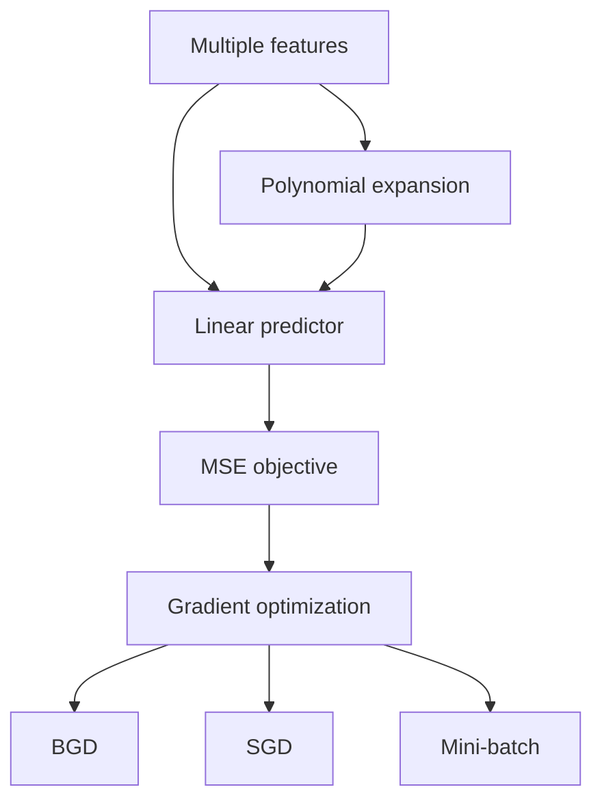

# DADS6003 Applied Machine Learning — Week 03: Multiple Linear Regression

> **แหล่งเนื้อหาหลัก:** `dads6003_week3_multiple_linear_regression.pdf` จำนวน 11 หน้า  
> **ผู้สอนในเอกสาร:** Ekarat Rattagan  
> **วันที่ในเอกสาร:** 21 มกราคม 2026  
> **ขอบเขต:** Multiple Linear Regression, matrix representation, feature scaling, BGD/SGD/Mini-batch GD, learning-rate scheduling และ Polynomial Regression

## 1. ภาพรวมบทเรียน

Week 02 ใช้ feature เพียงตัวเดียว:

$$
h_{\theta}(x)=\theta_0+\theta_1x
$$

Week 03 ขยายไปสู่ **Multiple Linear Regression** ซึ่งใช้ features หลายตัวพร้อมกัน:

$$
h_{\theta}(\mathbf{x})
=\theta_0+\theta_1x_1+\theta_2x_2+\cdots+\theta_dx_d
$$

การเพิ่ม features ช่วยให้โมเดลอธิบาย target จากหลายปัจจัย แต่ก็มาพร้อมประเด็นใหม่ ได้แก่ scale ที่ต่างกัน, coefficient ที่ต้องตีความแบบ “ควบคุมตัวแปรอื่นคงที่”, multicollinearity และต้นทุนการ optimize เมื่อข้อมูลมีขนาดใหญ่

ครึ่งหลังของบทเรียนเปรียบเทียบวิธีคำนวณ gradient สามแบบ:

- **Batch Gradient Descent (BGD):** ใช้ทุก samples ต่อหนึ่ง update
- **Stochastic Gradient Descent (SGD):** ใช้หนึ่ง sample ต่อหนึ่ง update
- **Mini-batch Gradient Descent:** ใช้ข้อมูลกลุ่มย่อยต่อหนึ่ง update

จากนั้นขยาย linear model ด้วย polynomial และ interaction terms เพื่อแทนความสัมพันธ์ที่โค้งหรือมีผลร่วมระหว่าง features

## 2. Learning Objectives

หลังเรียนบทนี้ควรสามารถ:

- ระบุมิติของ \(X\), \(\mathbf{x}_i\), \(\boldsymbol{\theta}\), \(\mathbf{y}\) และ \(\hat{\mathbf{y}}\) ได้
- เขียน Multiple Linear Regression ทั้งแบบ scalar, vector และ matrix ได้
- ตีความ coefficient แบบ holding other variables constant ได้
- เขียน MSE และ gradient ในรูปเมทริกซ์ได้
- อธิบายว่าทำไม features ต่าง scale ทำให้ Gradient Descent ช้าหรือไม่เสถียร
- คำนวณ Min-Max scaling และ Z-score standardization ได้
- เปรียบเทียบ BGD, SGD และ Mini-batch GD ตามต้นทุน ความเร็ว และ noise ได้
- อธิบายวิธีลด noise ของ SGD ได้
- คำนวณ learning rate ด้วย Inverse Time Decay ได้
- สร้าง polynomial และ interaction features และคำนวณจำนวน terms ได้
- อธิบายว่าทำไม Polynomial Regression จึง nonlinear ใน input แต่ยัง linear ใน parameters
- เชื่อมโยง Multiple Linear Regression กับ assumptions, multicollinearity และ model evaluation ได้

## 3. Dataset และ Matrix Notation

จากเอกสารหน้า 2 กำหนด dataset ที่มี \(N\) rows และ \(d\) features:

$$
X\in\mathbb{R}^{N\times d}
$$

notation \(x_{i,j}\) หมายถึงค่าที่ row หรือ sample \(i\), feature column \(j\)

### 3.1 Design matrix ที่รวม intercept

เพื่อเขียน intercept เป็น matrix multiplication เราเพิ่มคอลัมน์ \(x_{i,0}=1\):

$$
X=
\begin{bmatrix}
1&x_{1,1}&x_{1,2}&\cdots&x_{1,d}\\
1&x_{2,1}&x_{2,2}&\cdots&x_{2,d}\\
\vdots&\vdots&\vdots&\ddots&\vdots\\
1&x_{N,1}&x_{N,2}&\cdots&x_{N,d}
\end{bmatrix}
\in\mathbb{R}^{N\times(d+1)}
$$

> **คำอธิบายเพิ่มเติม:** สไลด์เรียกข้อมูลว่า \(X\in\mathbb{R}^{N\times d}\) แต่แผนภาพมีคอลัมน์ 1 สำหรับ intercept แล้ว ในโน้ตนี้จึงแยกให้ชัด: raw feature matrix มี \(d\) columns ส่วน design matrix หลังเพิ่ม intercept มี \(d+1\) columns

กำหนด parameter vector และ target vector:

$$
\boldsymbol{\theta}=
\begin{bmatrix}
\theta_0\\\theta_1\\\vdots\\\theta_d
\end{bmatrix}
\in\mathbb{R}^{(d+1)\times1},
\qquad
\mathbf{y}=
\begin{bmatrix}
y_1\\y_2\\\vdots\\y_N
\end{bmatrix}
\in\mathbb{R}^{N\times1}
$$

ดังนั้น prediction ทุก samples คือ

$$
\hat{\mathbf{y}}=X\boldsymbol{\theta}
\in\mathbb{R}^{N\times1}
$$

### 3.2 Dimension check

$$
\underbrace{X}_{N\times(d+1)}
\underbrace{\boldsymbol{\theta}}_{(d+1)\times1}
=
\underbrace{\hat{\mathbf{y}}}_{N\times1}
$$

การตรวจมิติก่อนคำนวณช่วยจับข้อผิดพลาด เช่น transpose ผิดหรือจำนวน coefficients ไม่ตรงกับ features

## 4. Model Representation

จากเอกสารหน้า 3:

$$
h_{\theta}(\mathbf{x})
=\theta_0+\theta_1x_1+\cdots+\theta_jx_j+\cdots+\theta_dx_d
=\boldsymbol{\theta}^T\mathbf{x}
$$

ในสมการสุดท้ายต้องนิยาม \(x_0=1\) และเขียน

$$
\mathbf{x}=
\begin{bmatrix}
x_0\\x_1\\\vdots\\x_d
\end{bmatrix},qquad
\boldsymbol{\theta}^T=
\begin{bmatrix}
\theta_0&\theta_1&\cdots&\theta_d
\end{bmatrix}
$$

### 4.1 การตีความ coefficient

สมมติแบบจำลองราคาบ้าน:

$$
\widehat{Price}
=500{,}000+30{,}000(Area)+120{,}000(Bedrooms)
$$

หาก Area วัดเป็น 10 ตารางเมตร:

- \(\theta_1=30{,}000\): เมื่อพื้นที่เพิ่ม 10 ตารางเมตร ราคาที่คาดเพิ่ม 30,000 บาท **เมื่อจำนวนห้องนอนคงที่**
- \(\theta_2=120{,}000\): เมื่อเพิ่ม 1 ห้องนอน ราคาที่คาดเพิ่ม 120,000 บาท **เมื่อพื้นที่คงที่**

คำว่า “เมื่อ features อื่นคงที่” คือหัวใจของ multiple regression coefficient และทำให้การตีความต่างจาก correlation แบบคู่

### 4.2 Intercept และ domain

\(\theta_0\) คือ prediction เมื่อ features ทุกตัวเป็นศูนย์ แต่ถ้าค่าศูนย์อยู่นอกช่วงข้อมูลหรือไม่มีความหมายจริง intercept อาจเป็นเพียงค่าที่ช่วยวาง hyperplane ไม่ควรฝืนตีความทางธุรกิจ

### 4.3 Geometry

- 1 feature: เส้นตรงในระนาบ 2 มิติ
- 2 features: ระนาบใน 3 มิติ
- มากกว่า 2 features: hyperplane ในมิติสูง

## 5. Cost Function และ Objective

จากเอกสารหน้า 4:

$$
J(\theta_0,\theta_1,\ldots,\theta_d)
=\frac{1}{N}\sum_{i=1}^{N}
\left(h_{\theta}(\mathbf{x}_i)-y_i\right)^2
$$

เป้าหมายคือ

$$
(\hat{\theta}_0,\hat{\theta}_1,\ldots,\hat{\theta}_d)
=\underset{\theta_0,\theta_1,\ldots,\theta_d}{\arg\min}
J(\theta_0,\theta_1,\ldots,\theta_d)
$$

ในรูปเมทริกซ์:

$$
J(\boldsymbol{\theta})
=\frac{1}{N}
(X\boldsymbol{\theta}-\mathbf{y})^T
(X\boldsymbol{\theta}-\mathbf{y})
$$

และ gradient เต็มตามนิยาม MSE คือ

$$
\nabla J(\boldsymbol{\theta})
=\frac{2}{N}X^T(X\boldsymbol{\theta}-\mathbf{y})
$$

> **ความสอดคล้องกับสไลด์:** สไลด์หน้า 5 ใช้ update term \(\frac{1}{N}\sum e_ix_{i,j}\) โดยไม่มี 2 เช่นเดียวกับ Week 02 ค่าคงที่ 2 สามารถดูดรวมใน learning rate ได้ หรือ cost อาจนิยามเป็น \(\frac{1}{2N}\sum e_i^2\) เพื่อให้อนุพันธ์ไม่มี 2

## 6. Batch Gradient Descent

จากเอกสารหน้า 4–5:

$$
\theta_j^{(t+1)}
=\theta_j^{(t)}-eta
\frac{\partial J(\boldsymbol{\theta}^{(t)})}{\partial\theta_j}
$$

โดยใช้สูตรตามสไลด์:

$$
\theta_j^{(t+1)}
:=\theta_j^{(t)}-eta\frac{1}{N}
\sum_{i=1}^{N}
\left(h_{\theta}(\mathbf{x}_i)-y_i\right)x_{i,j},
\qquad j=0,1,\ldots,d
$$

และ \(x_{i,0}=1\)

### 6.1 Matrix update

$$
\boldsymbol{\theta}^{(t+1)}
:=\boldsymbol{\theta}^{(t)}
-\eta\frac{1}{N}X^T
(X\boldsymbol{\theta}^{(t)}-\mathbf{y})
$$

### 6.2 ขั้นตอนหนึ่ง iteration

1. คำนวณ predictions: \(\hat{\mathbf{y}}=X\boldsymbol{\theta}^{(t)}\)
2. คำนวณ residual vector: \(\mathbf{e}=\hat{\mathbf{y}}-\mathbf{y}\)
3. คำนวณ gradient: \(\mathbf{g}=\frac{1}{N}X^T\mathbf{e}\)
4. update ทุก parameters พร้อมกัน: \(\boldsymbol{\theta}^{(t+1)}=\boldsymbol{\theta}^{(t)}-\eta\mathbf{g}\)
5. ตรวจ cost และ stopping criterion

คำว่า **Batch** หมายความว่า gradient หนึ่งครั้งใช้ training samples ทั้งหมด

## 7. Worked Example: Multiple Features หนึ่งรอบของ BGD

กำหนดข้อมูลสอง features:

| Sample | \(x_1\) | \(x_2\) | \(y\) |
|---:|---:|---:|---:|
| 1 | 1 | 2 | 8 |
| 2 | 2 | 1 | 9 |

กำหนด \(\boldsymbol{\theta}^{(0)}=[1,1,1]^T\), \(\eta=0.1\) และใช้สูตรตามสไลด์

$$
X=
\begin{bmatrix}
1&1&2\\
1&2&1
\end{bmatrix},qquad
\mathbf{y}=
\begin{bmatrix}8\\9\end{bmatrix}
$$

prediction:

$$
\hat{\mathbf{y}}
=X\boldsymbol{\theta}^{(0)}
=\begin{bmatrix}4\\4\end{bmatrix}
$$

residual:

$$
\mathbf{e}
=\hat{\mathbf{y}}-\mathbf{y}
=\begin{bmatrix}-4\\-5\end{bmatrix}
$$

gradient:

$$
\mathbf{g}
=\frac{1}{2}X^T\mathbf{e}
=\frac{1}{2}
\begin{bmatrix}
-9\\-14\\-13
\end{bmatrix}
=\begin{bmatrix}
-4.5\\-7\\-6.5
\end{bmatrix}
$$

update:

$$
\boldsymbol{\theta}^{(1)}
=\begin{bmatrix}1\\1\\1\end{bmatrix}
-0.1
\begin{bmatrix}-4.5\\-7\\-6.5\end{bmatrix}
=\boxed{
\begin{bmatrix}1.45\\1.70\\1.65\end{bmatrix}}
$$

ก่อน update, \(MSE=(16+25)/2=20.5\) หลัง update predictions เป็น \([6.45,6.50]\) และ MSE ลดเหลือประมาณ \(4.32625\) แสดงว่าก้าวนี้เคลื่อนลงตาม cost surface

## 8. Feature Scaling

จากเอกสารหน้า 6 หาก \(x_2\gg x_1\) Gradient Descent อาจช้าหรือไม่เสถียร เพราะ gradient แต่ละแกนมีขนาดต่างกันมาก cost contours จะยืดยาว ทำให้เส้นทาง update zigzag

### 8.1 Min-Max Scaling

$$
x'=\frac{x-x_{\min}}{x_{\max}-x_{\min}}
$$

ถ้ากำหนดช่วง 0–1 ค่าต่ำสุดจะเป็น 0 และค่าสูงสุดจะเป็น 1

ตัวอย่าง \(x=30,x_{\min}=10,x_{\max}=50\):

$$
x'=\frac{30-10}{50-10}=0.5
$$

**จุดเด่น:** ช่วงค่าชัดเจนและเข้าใจง่าย  
**ข้อจำกัด:** ไวต่อ outliers เพราะใช้ min และ max

### 8.2 Z-score Standardization

$$
x'=\frac{x-\mu}{\sigma}
$$

หลัง standardize ข้อมูล training จะมีค่าเฉลี่ยประมาณ 0 และส่วนเบี่ยงเบนมาตรฐานประมาณ 1

ตัวอย่าง \(x=70,\mu=50,\sigma=10\):

$$
x'=\frac{70-50}{10}=2
$$

หมายถึงค่าเดิมสูงกว่าค่าเฉลี่ย 2 standard deviations

### 8.3 Min-Max vs Z-score

| ประเด็น | Min-Max | Z-score |
|---|---|---|
| สูตร | \((x-x_{min})/(x_{max}-x_{min})\) | \((x-\mu)/\sigma\) |
| ช่วงผลลัพธ์ | มัก 0–1 สำหรับ training data | ไม่มีขอบเขตตายตัว |
| เหมาะเมื่อ | ต้องการ bounded range | ต้องการ center และ comparable variance |
| Outlier | กระทบ min/max มาก | กระทบ mean/SD เช่นกัน แต่ไม่บีบค่าปกติทั้งหมดลงช่วงเล็กเท่า Min-Max |
| ค่าใหม่เกินช่วง train | อาจน้อยกว่า 0 หรือมากกว่า 1 | ทำได้ตามปกติ |

### 8.4 ป้องกัน Data Leakage

ต้องคำนวณ \(x_{min},x_{max},\mu,\sigma\) จาก **training set เท่านั้น** แล้วใช้ค่าเดิม transform validation, test และ production data หากคำนวณจากทุกชุดก่อน split จะเกิด data leakage

### 8.5 Scaling กับ coefficient

เมื่อ scale features ค่า coefficient จะอยู่ในหน่วยของ scaled feature ไม่ใช่หน่วยเดิม จึงต้องระวังการตีความ แต่ prediction สามารถแปลงสัมพันธ์กับหน่วยจริงได้หาก pipeline เก็บ transformer ไว้ครบ

## 9. Batch GD vs Stochastic GD

จากเอกสารหน้า 7:

### 9.1 Batch Gradient Descent

$$
\theta_j^{(t+1)}
:=\theta_j^{(t)}-eta\frac{1}{N}
\sum_{i=1}^{N}
(h_{\theta}(\mathbf{x}_i)-y_i)x_{i,j}
$$

- ใช้ทุก \(N\) samples ต่อ update
- gradient มี variance ต่ำและเส้นทางค่อนข้างเสถียร
- แต่หนึ่ง update แพงเมื่อ dataset ใหญ่

### 9.2 Stochastic Gradient Descent

$$
\theta_j^{(t+1)}
:=\theta_j^{(t)}-eta
(h_{\theta}(\mathbf{x}_i)-y_i)x_{i,j}
$$

โดยสุ่ม sample \(\mathbf{x}_i\) ต่อ iteration

- update ได้เร็วและเริ่มเรียนรู้ก่อนอ่านครบทั้ง dataset
- เหมาะกับข้อมูลใหญ่หรือ online learning
- gradient มี noise สูง ทำให้เส้นทางแกว่งรอบ minimum

คำว่า “SGD converges faster” ในสไลด์ควรตีความว่า **ใช้ต้นทุนต่อ update ต่ำและมักเข้าบริเวณคำตอบดีได้เร็ว** ไม่ได้หมายความว่าเส้นทางเรียบหรือได้คำตอบ exact เร็วกว่าทุกกรณี

### 9.3 จะลด SGD noise อย่างไร

คำถามท้ายหน้า 7 มีแนวตอบหลัก:

- ใช้ **Mini-batch Gradient Descent** เพื่อเฉลี่ย gradient หลาย samples
- ลด learning rate ตามเวลา
- shuffle data ทุก epoch
- ใช้ momentum หรือ adaptive optimizers ในหัวข้อขั้นสูง
- เฉลี่ย parameters/gradients ในบางวิธี

## 10. Learning Rate Scheduling

จากเอกสารหน้า 8 Learning Rate Scheduling ลดขนาดก้าวระหว่าง training เพื่อให้ช่วงแรกเคลื่อนที่เร็ว และช่วงหลังแกว่งน้อยลงเมื่อเข้าใกล้ minimum

### 10.1 Inverse Time Decay

$$
\eta_{t+1}
=\frac{\eta_0}{1+\eta_0\lambda t}
$$

โดย:

- \(\eta_0\): initial learning rate
- \(\lambda\): decay rate
- \(t\): iteration/time step

ตัวอย่างจากเอกสาร ให้ \(\eta_0=0.01,\lambda=0.1,t=1\):

$$
\eta_2
=\frac{0.01}{1+(0.01)(0.1)(1)}
=\frac{0.01}{1.001}
\approx0.009990
$$

สไลด์ปัดเป็น 0.0099 ความหมายคือ learning rate ลดลงเล็กน้อยหลัง update แรก

### 10.2 Trade-off ของ decay

- decay ช้าเกินไป: SGD ยังแกว่งมากใกล้ minimum
- decay เร็วเกินไป: step size เล็กก่อนถึงบริเวณ optimum และเรียนรู้หยุดชะงัก
- schedule ต้องสัมพันธ์กับ initial rate, batch size, number of epochs และ scaling

## 11. BGD vs SGD vs Mini-batch GD

จากเอกสารหน้า 9 Mini-batch ใช้ \(b\) samples โดย \(1<b<N\) เช่น \(b=10\)

$$
\theta_j^{(t+1)}
:=\theta_j^{(t)}-eta\frac{1}{b}
\sum_{i\in B_t}
(h_{\theta}(\mathbf{x}_i)-y_i)x_{i,j}
$$

โดย \(B_t\) คือ mini-batch ใน iteration \(t\)

| ประเด็น | BGD | SGD | Mini-batch GD |
|---|---|---|---|
| Samples ต่อ update | \(N\) | 1 | \(b\), เมื่อ \(1<b<N\) |
| Gradient noise | ต่ำ | สูง | ปานกลาง |
| ต้นทุนต่อ update | สูง | ต่ำ | ปานกลาง |
| Hardware/vectorization | ใช้ได้แต่ batch อาจใหญ่เกิน memory | ใช้ vectorization ได้น้อย | เหมาะกับ GPU/CPU matrix operations |
| เส้นทางสู่ minimum | เรียบ/เสถียร | แกว่ง | สมดุล |
| เหมาะกับ | dataset เล็กถึงกลาง | online/streaming | งาน ML ขนาดใหญ่ทั่วไป |

### 11.1 Epoch, iteration และ batch size

- **Batch size \(b\):** จำนวน samples ต่อหนึ่ง parameter update
- **Iteration:** การ update parameters หนึ่งครั้ง
- **Epoch:** การที่โมเดลประมวลผล training samples ครบหนึ่งรอบ

ถ้า \(N=1{,}000\) และ \(b=100\) จะมีประมาณ 10 iterations ต่อ epoch

## 12. Polynomial Regression

จากเอกสารหน้า 10 Polynomial Regression เพิ่ม higher-degree terms และ interaction terms เพื่อให้ linear model แทนความสัมพันธ์ non-linear ใน input ได้

สำหรับสอง features และ degree 2:

$$
h_{\theta}(\mathbf{x})
=\theta_0+\theta_1x_1+\theta_2x_2
+\theta_3x_1x_2+\theta_4x_1^2+\theta_5x_2^2
$$

### 12.1 ทำไมเรียกว่า Polynomial แต่ยังเป็น Linear Regression

โมเดล nonlinear ใน original inputs เพราะมี \(x_1^2,x_2^2,x_1x_2\) แต่ยัง **linear in parameters** เพราะ parameters ปรากฏเป็นสัมประสิทธิ์กำลังหนึ่งและไม่ได้คูณกัน

กำหนด transformed features:

$$
z_1=x_1,\quad z_2=x_2,\quad
z_3=x_1x_2,\quad z_4=x_1^2,\quad z_5=x_2^2
$$

จะได้

$$
h_{\theta}=\theta_0+\theta_1z_1+\cdots+\theta_5z_5
$$

ซึ่งเป็น linear model บน feature space ใหม่

### 12.2 Interaction term

เทอม \(x_1x_2\) หมายความว่าผลของ \(x_1\) ต่อ prediction เปลี่ยนตามระดับของ \(x_2\)

สำหรับ

$$
h=\theta_0+\theta_1x_1+\theta_2x_2+\theta_3x_1x_2
$$

marginal effect ของ \(x_1\) คือ

$$
\frac{\partial h}{\partial x_1}
=\theta_1+\theta_3x_2
$$

ดังนั้นเมื่อมี interaction จะตีความ \(\theta_1\) เดี่ยว ๆ ว่าเป็นผลของ \(x_1\) ทุกระดับไม่ได้ แต่เป็นผลเมื่อ \(x_2=0\)

### 12.3 จำนวน Polynomial Terms

จำนวน monomials ที่ degree ไม่เกิน \(r\) จาก \(d\) features รวม intercept คือ

$$
\binom{d+r}{r}
=\frac{(d+r)!}{r!d!}
$$

เอกสารเขียน \(n=\#features+\#degree\) และ \(r=\#degree\) จึงเท่ากับ \(\binom{n}{r}\)

สำหรับ \(d=2,r=2\):

$$
\binom{2+2}{2}
=\binom{4}{2}
=\frac{4!}{2!(4-2)!}
=6
$$

หก terms คือ

$$
1,\;x_1,\;x_2,\;x_1^2,\;x_1x_2,\;x_2^2
$$

### 12.4 Curse of dimensionality ใน Polynomial Expansion

จำนวน terms โตเร็ว:

| Features \(d\) | Degree \(r\) | Terms รวม intercept \(\binom{d+r}{r}\) |
|---:|---:|---:|
| 2 | 2 | 6 |
| 3 | 2 | 10 |
| 10 | 2 | 66 |
| 10 | 3 | 286 |

การเพิ่ม degree จึงเพิ่มความยืดหยุ่น แต่เพิ่มเวลา memory multicollinearity และความเสี่ยง overfitting

## 13. Worked Example: Polynomial Feature Expansion

ให้ sample \((x_1,x_2)=(2,3)\) และ degree 2 feature vector คือ

$$
\boldsymbol{\phi}(\mathbf{x})
=\begin{bmatrix}
1&x_1&x_2&x_1x_2&x_1^2&x_2^2
\end{bmatrix}^T
=\begin{bmatrix}
1&2&3&6&4&9
\end{bmatrix}^T
$$

หาก

$$
\boldsymbol{\theta}
=\begin{bmatrix}1&2&-1&0.5&0.2&0.1\end{bmatrix}^T
$$

prediction คือ

$$
h_{\theta}
=1(1)+2(2)-1(3)+0.5(6)+0.2(4)+0.1(9)
=6.7
$$

## 14. Assumptions และความเสี่ยงของ Multiple Linear Regression

> **คำอธิบายเพิ่มเติม:** สไลด์เน้น optimization แต่การใช้โมเดลจริงควรตรวจ assumptions ต่อไปนี้

### 14.1 Linearity in parameters / correct specification

ค่าเฉลี่ยของ target ควรถูกแทนได้สมเหตุสมผลด้วย features ที่กำหนด หาก residual มี pattern โค้ง อาจเพิ่ม polynomial term หรือใช้แบบจำลองอื่น

### 14.2 Independence of errors

errors ไม่ควรสัมพันธ์กัน หากเป็น time series, repeated measures หรือข้อมูลหลายรายการจากคน/สาขาเดียวกัน อาจต้องใช้ split และ model structure ที่เหมาะสม

### 14.3 Homoscedasticity

variance ของ errors ควรค่อนข้างคงที่ หาก residual กระจายกว้างขึ้นตาม fitted value อาจพิจารณา transform target, weighted least squares หรือ robust inference

### 14.4 Zero conditional mean

$$
E[\varepsilon\mid X]=0
$$

หากละ feature สำคัญที่สัมพันธ์ทั้งกับ included features และ target อาจเกิด omitted-variable bias

### 14.5 No perfect multicollinearity

features ต้องไม่เป็น linear combination สมบูรณ์กัน หากเกือบสัมพันธ์กันมาก coefficients จะไม่เสถียรและ variance สูง แม้ prediction อาจยังใช้ได้

### 14.6 Normality of errors

มีความสำคัญต่อ inference เช่น confidence interval และ hypothesis testing ใน sample เล็ก ไม่ใช่เงื่อนไขบังคับในการคำนวณ OLS coefficients

## 15. Multicollinearity

Multiple Regression เพิ่มโอกาสที่ features จะสัมพันธ์กัน เช่น area กับจำนวนห้อง หรือราคาต่อหน่วยกับราคารวม

ผลกระทบ:

- coefficients เปลี่ยนมากเมื่อข้อมูลเปลี่ยนเล็กน้อย
- standard errors สูงและเครื่องหมาย coefficient อาจสวน intuition
- แยก “ผลเฉพาะ” ของแต่ละ feature ได้ยาก
- Gradient Descent อาจเดินบน cost surface ที่แคบยาวและช้า

แนวทาง:

- ตรวจ correlation และ domain redundancy
- ใช้ Variance Inflation Factor (VIF) เป็น diagnostic ประกอบ
- ตัด/รวม features ที่ซ้ำความหมาย
- เพิ่มข้อมูลที่แยก variation ของ features
- ใช้ Ridge/Lasso ในบท Regularization
- เน้น prediction มากกว่าตีความราย coefficient หากเหมาะกับเป้าหมาย

## 16. Model Evaluation

ควรประเมิน Multiple Linear Regression บน validation/test data ด้วย:

### 16.1 MAE

$$
MAE=\frac{1}{N}\sum_{i=1}^{N}|y_i-\hat{y}_i|
$$

อ่านง่ายในหน่วยของ target และไวต่อ outlier น้อยกว่า RMSE

### 16.2 MSE และ RMSE

$$
MSE=\frac{1}{N}\sum_{i=1}^{N}(y_i-\hat{y}_i)^2,
\qquad RMSE=\sqrt{MSE}
$$

RMSE ลงโทษ error ใหญ่แรงและอยู่ในหน่วยเดิมของ target

### 16.3 Coefficient of Determination

$$
R^2
=1-\frac{\sum_i(y_i-\hat{y}_i)^2}
{\sum_i(y_i-\bar{y})^2}
$$

- \(R^2=1\): fit สมบูรณ์บนชุดที่ประเมิน
- \(R^2=0\): ไม่ดีกว่าการทำนายด้วยค่าเฉลี่ยในนิยามทั่วไป
- \(R^2<0\): บน unseen data โมเดลอาจแย่กว่าค่าเฉลี่ย

### 16.4 Adjusted \(R^2\)

Training \(R^2\) ไม่ลดเมื่อเพิ่ม features แม้ feature ไม่มีประโยชน์ Adjusted \(R^2\) จึงปรับโทษจำนวน predictors:

$$
\bar{R}^2
=1-(1-R^2)\frac{N-1}{N-d-1}
$$

แต่การเลือกโมเดลเพื่อ prediction ควรใช้ validation/cross-validation ร่วมด้วย ไม่ควรพึ่ง Adjusted \(R^2\) อย่างเดียว

## 17. Practical Workflow

1. กำหนด target, prediction horizon และ business metric
2. แบ่ง train/validation/test ให้สะท้อนการใช้งานจริง
3. ระบุ numeric/categorical features และป้องกัน leakage
4. fit scaler และ feature transformer บน train เท่านั้น
5. สร้าง baseline linear model
6. ตรวจ residuals, multicollinearity และ outliers
7. ทดลอง interaction/polynomial terms ตาม domain hypothesis
8. tune degree, regularization, learning rate และ batch size ด้วย validation data
9. ประเมินครั้งสุดท้ายบน test data
10. เก็บ scaler, polynomial transformer และ model เป็น pipeline เดียวกัน
11. monitor data drift และ prediction error หลัง deployment

## 18. ตัวอย่างเชิงงาน Supply Chain

ต้องการทำนาย Spending Amount รายเดือน:

$$
\widehat{Spending}
=\theta_0
+\theta_1Quantity
+\theta_2UnitPrice
+\theta_3ExchangeRate
+\theta_4LeadTime
$$

ประเด็นที่ต้องพิจารณา:

- Quantity กับ Spending อาจมีความสัมพันธ์เชิงกลไกสูง
- UnitPrice และ ExchangeRate อาจมี interaction สำหรับรายการสกุลต่างประเทศ
- ข้อมูลตามเวลาต้อง split ตามเวลา ไม่สุ่มจนอนาคตรั่วเข้า train
- Vendor/material groups เป็น categorical features ต้อง encode อย่างเหมาะสม
- outlier อาจเป็นการซื้อครั้งใหญ่จริง ไม่ควรลบทิ้งอัตโนมัติ

interaction ที่สมเหตุสมผล:

$$
UnitPrice\times Quantity
$$

แต่ถ้า target คือ Spending ซึ่งนิยามจากผลคูณนี้โดยตรง การใส่ derived value อาจทำให้โจทย์เป็นการคำนวณเชิงกฎ ไม่จำเป็นต้องใช้ ML และอาจเป็น target leakage หากองค์ประกอบยังไม่ทราบในเวลาทำนาย

## 19. Common Misconceptions

1. **“Multiple Linear Regression หมายถึง target หลายตัว”**  
   คำว่า multiple หมายถึง predictors หลายตัว ส่วน target ในบทนี้ยังเป็นหนึ่งตัว

2. **“Coefficient คือ correlation ของ feature กับ target”**  
   Coefficient เป็น partial association เมื่อควบคุม included features อื่นคงที่ ไม่เท่ากับ pairwise correlation

3. **“Feature scale ต่างกันทำให้ OLS model family เปลี่ยน”**  
   การ scale แบบ invertible ไม่เปลี่ยน predictive family แต่เปลี่ยน coefficient units, conditioning และความเร็ว GD

4. **“Scaling ก่อนหรือหลัง split ให้ผลเหมือนกัน”**  
   Fit scaler ก่อน split ทำให้ validation/test statistics รั่วเข้า training pipeline

5. **“SGD เร็วกว่าเสมอและจึงดีกว่า BGD เสมอ”**  
   SGD update ถูกกว่าแต่ noisy คุณภาพและเวลาโดยรวมขึ้นกับข้อมูล hardware learning rate และ stopping rule

6. **“หนึ่ง epoch เท่ากับหนึ่ง iteration”**  
   เท่ากันเฉพาะ BGD; mini-batch มีหลาย iterations ต่อ epoch

7. **“Polynomial Regression เป็น nonlinear model ใน parameters”**  
   ยัง linear ใน parameters แม้ nonlinear ใน original inputs

8. **“Degree สูงขึ้นย่อมดีขึ้น”**  
   Training error อาจลด แต่จำนวน terms และ overfitting เพิ่ม ต้องใช้ validation และ regularization

9. **“Interaction term มีไว้เพิ่ม accuracy อย่างเดียว”**  
   interaction ควรมี domain rationale และเปลี่ยนวิธีตีความ main effects

10. **“\(R^2\) สูงแปลว่าโมเดลถูกต้อง”**  
   ยังอาจมี leakage, overfitting, biased residuals หรือไม่มี causal meaning

## 20. Likely Exam Focus

> หัวข้อต่อไปนี้อนุมานจากสูตร ตัวอย่าง และคำถามที่เน้นในเอกสาร ไม่ใช่ข้อสอบจริง

### Definitions and notation

- ความหมายและมิติของ \(N,d,x_{i,j},X,\boldsymbol{\theta},\mathbf{y}\)
- intercept column \(x_{i,0}=1\)
- BGD, SGD, Mini-batch GD, batch size, iteration และ epoch
- learning rate และ decay rate
- polynomial term และ interaction term

### Equations to remember

$$
h_{\theta}(\mathbf{x})=\theta_0+\sum_{j=1}^{d}\theta_jx_j
=\boldsymbol{\theta}^T\mathbf{x}
$$

$$
J(\boldsymbol{\theta})=\frac{1}{N}\sum_{i=1}^{N}
(h_{\theta}(\mathbf{x}_i)-y_i)^2
$$

$$
\boldsymbol{\theta}^{(t+1)}
=\boldsymbol{\theta}^{(t)}-eta\frac{1}{N}X^T
(X\boldsymbol{\theta}^{(t)}-\mathbf{y})
$$

$$
x'_{minmax}=\frac{x-x_{min}}{x_{max}-x_{min}},
\qquad
x'_{z}=\frac{x-\mu}{\sigma}
$$

$$
\eta_{t+1}=\frac{\eta_0}{1+\eta_0\lambda t}
$$

$$
\text{Polynomial terms}=\binom{d+r}{r}
$$

### Calculations to perform

- dimension check ของ matrix multiplication
- prediction จากหลาย features
- gradient/update หนึ่งรอบของ BGD หรือ SGD
- Min-Max และ Z-score
- Inverse Time Decay
- จำนวน polynomial terms และ expanded feature vector

### Concepts to compare

- Single vs Multiple Linear Regression
- Min-Max vs Z-score
- BGD vs SGD vs Mini-batch
- linear in input vs linear in parameters
- main effect vs interaction effect

## 21. Practice Questions

### Recall

**1.** ถ้ามี \(N=100\), \(d=4\) และรวม intercept แล้ว design matrix กับ parameter vector มีมิติเท่าใด?

**2.** BGD, SGD และ Mini-batch GD ใช้ samples ต่อ update ต่างกันอย่างไร?

**3.** เหตุใดต้องกำหนด \(x_{i,0}=1\)?

### Explain and Compare

**4.** อธิบายความหมายของ \(\theta_j\) ใน Multiple Linear Regression

**5.** เปรียบเทียบ Min-Max scaling กับ Z-score standardization

**6.** ตอบคำถามจากสไลด์: “How to reduce SGD noise?” อย่างน้อย 3 วิธี

**7.** อธิบายว่า Polynomial Regression เป็น nonlinear และ linear พร้อมกันได้อย่างไร

### Apply

**8.** ให้ \(h=10+2x_1-3x_2\), \(x_1=4,x_2=2\) จงหาค่าทำนายและตีความ coefficients

**9.** ค่า \(x=80,x_{min}=20,x_{max}=100,\mu=60,\sigma=10\) จงคำนวณ Min-Max และ Z-score

**10.** ให้ \(\eta_0=0.1,\lambda=0.5,t=4\) จงหา \(\eta_{t+1}\) ตามสูตรในสไลด์

**11.** มี 3 features และ degree 2 จะมี polynomial terms รวม intercept กี่ terms?

### Analyze

**12.** โมเดลมี training \(R^2=0.98\), test \(R^2=0.42\) หลังเพิ่ม polynomial degree จาก 2 เป็น 8 จงวิเคราะห์

**13.** Feature “ยอดขายบาท” และ “ยอดขายพันบาท” อยู่ในโมเดลเดียวกัน จะเกิดปัญหาอะไร?

**14.** ทีมคำนวณ mean และ SD จากข้อมูลทั้งหมดก่อนแบ่ง train/test เพราะ “ไม่ได้ใช้ target” วิธีนี้ถูกต้องหรือไม่?

## 22. Model Answers with Reasoning

**1.** Design matrix มีมิติ \(100\times5\) และ parameter vector มีมิติ \(5\times1\) เพราะเพิ่ม intercept อีกหนึ่ง column/parameter

**2.** BGD ใช้ \(N\), SGD ใช้ 1 และ Mini-batch ใช้ \(b\) โดย \(1<b<N\) samples ต่อ update

**3.** เพื่อรวม intercept ใน dot product: \(\theta_0x_0=\theta_0(1)\)

**4.** \(\theta_j\) คือการเปลี่ยนแปลงของ prediction เมื่อ \(x_j\) เพิ่มหนึ่งหน่วย โดยควบคุม included features อื่นคงที่ ภายใต้ model specification เดิม

**5.** Min-Max แปลงตามค่าต่ำสุด/สูงสุดและมักได้ช่วง 0–1 ส่วน Z-score ลบ mean แล้วหาร SD ทำให้ center ใกล้ 0 และ scale ใกล้ unit variance ทั้งคู่ไวต่อ outliers คนละรูปแบบ

**6.** ใช้ mini-batch เพื่อเฉลี่ย noise, ลด learning rate ตามเวลา, shuffle ข้อมูลทุก epoch และอาจใช้ momentum/parameter averaging

**7.** nonlinear ใน input เพราะมี \(x^2\) หรือ \(x_1x_2\) แต่ linear ใน parameters เพราะ prediction ยังเป็นผลรวม \(\theta_j\phi_j(x)\)

**8.**

$$
\hat{y}=10+2(4)-3(2)=12
$$

เมื่อคุม \(x_2\) คงที่ \(x_1\) เพิ่ม 1 ทำให้ prediction เพิ่ม 2; เมื่อคุม \(x_1\) คงที่ \(x_2\) เพิ่ม 1 ทำให้ prediction ลด 3

**9.**

$$
x'_{minmax}=\frac{80-20}{100-20}=0.75
$$

$$
x'_z=\frac{80-60}{10}=2
$$

**10.**

$$
\eta_{5}=\frac{0.1}{1+(0.1)(0.5)(4)}
=\frac{0.1}{1.2}\approx0.08333
$$

**11.**

$$
\binom{3+2}{2}=\binom{5}{2}=10
$$

ประกอบด้วย intercept, linear 3 terms, squared 3 terms และ pairwise interactions 3 terms รวม 10

**12.** ช่องว่าง train–test สูงชี้ว่า overfitting จาก degree 8 ซึ่งสร้าง features จำนวนมาก ควรลด degree, ใช้ cross-validation, regularization และตรวจ leakage/split strategy

**13.** สอง features เป็น linear transformation สมบูรณ์กัน ทำให้ perfect multicollinearity, design matrix rank ไม่เต็ม และ coefficients ไม่ unique ควรเก็บเพียงหน่วยเดียว

**14.** ไม่ถูกต้อง เพราะ feature distribution ของ test รั่วเข้า preprocessing แม้ไม่ใช้ target ต้อง split ก่อน fit scaler แล้วใช้ training statistics transform ชุดอื่น

## 23. Key Takeaways

- Multiple Linear Regression ใช้ features หลายตัว แต่ target ยังเป็นค่าต่อเนื่องหนึ่งตัวในบทนี้
- Matrix notation ทำให้เขียน prediction และ gradient ของทุก samples/features ได้กระชับ
- Coefficient ต้องตีความโดยควบคุม features อื่นคงที่ และไม่เท่ากับ causality
- Feature scaling ช่วยให้ Gradient Descent เคลื่อนที่สมดุลและ converge เร็วขึ้น
- BGD เสถียรแต่ update แพง, SGD เร็วแต่ noisy, Mini-batch เป็นทางสายกลางที่ใช้แพร่หลาย
- Learning-rate scheduling ลด step size เพื่อช่วยให้ SGD นิ่งขึ้นช่วงท้าย
- Polynomial expansion เพิ่มความยืดหยุ่นด้วย powers และ interactions แต่จำนวน terms โตแบบ combination
- Polynomial Regression ยัง linear ใน parameters จึงใช้เครื่องมือ Linear Regression ได้
- Degree สูงและ features สัมพันธ์กันเพิ่มความเสี่ยง overfitting/multicollinearity
- Preprocessing ทุกขั้นต้อง fit จาก training data เท่านั้น

## 24. Glossary

| คำศัพท์ | ความหมาย |
|---|---|
| Batch size | จำนวน samples ที่ใช้คำนวณหนึ่ง gradient update |
| BGD | Gradient Descent ที่ใช้ training data ทั้งหมดต่อ update |
| Decay rate | ค่าควบคุมความเร็วในการลด learning rate |
| Design matrix | เมทริกซ์ features ที่จัดสำหรับคำนวณโมเดล รวม intercept column เมื่อกำหนด |
| Epoch | การประมวลผล training data ครบหนึ่งรอบ |
| Feature scaling | การแปลง features ให้มี scale เหมาะกับ optimization |
| Interaction term | เทอมผลคูณที่ทำให้ผลของ feature หนึ่งขึ้นกับอีก feature |
| Iteration | การ update parameters หนึ่งครั้ง |
| Learning-rate schedule | กฎเปลี่ยน learning rate ตามเวลา |
| Mini-batch GD | GD ที่ใช้ข้อมูลกลุ่มย่อยต่อ update |
| Multicollinearity | ภาวะที่ predictors มีความสัมพันธ์เชิงเส้นสูง |
| Multiple Linear Regression | Linear Regression ที่มี predictors หลายตัว |
| Polynomial feature | feature ที่สร้างจากกำลังหรือผลคูณของ inputs |
| SGD | Gradient Descent ที่ใช้หนึ่ง sample ต่อ update |
| Standardization | การลบ mean และหารด้วย standard deviation |

## 25. References

### เอกสารประกอบการสอน

- Rattagan, E. (2026). `dads6003_week3_multiple_linear_regression.pdf`: *Week 3: Multiple Linear Regression*, หน้า 1–11.

### แหล่งที่อ้างในเอกสาร

- Uyanık, G. K., & Güler, N. (2013). A study on multiple linear regression analysis. *Procedia - Social and Behavioral Sciences, 106*, 234–240.
- Bottou, L. (2012). [Stochastic Gradient Descent Tricks](https://doi.org/10.1007/978-3-642-35289-8_25). In *Neural Networks: Tricks of the Trade*.

### คำอธิบายเพิ่มเติม

- scikit-learn, [Linear Models — Ordinary Least Squares](https://scikit-learn.org/stable/modules/linear_model.html#ordinary-least-squares)
- scikit-learn, [`StandardScaler`](https://scikit-learn.org/stable/modules/generated/sklearn.preprocessing.StandardScaler.html)
- scikit-learn, [`MinMaxScaler`](https://scikit-learn.org/stable/modules/generated/sklearn.preprocessing.MinMaxScaler.html)
