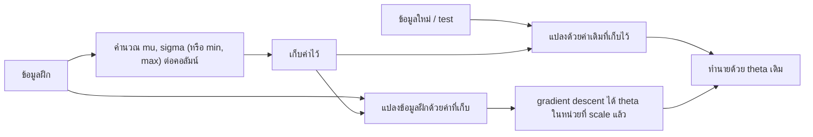
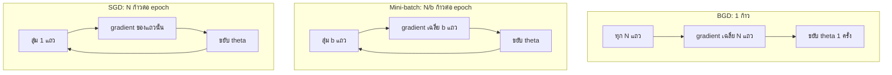

# บทที่ 3 Linear Regression หลายตัวแปร (Multiple Linear Regression)

Multiple linear regression คือการขยายเส้นตรงจากบทที่ 2 ให้รับ feature ได้หลายตัวพร้อมกัน $h_\theta(x) = \theta^{T}x$ แล้วหาพารามิเตอร์ด้วย gradient descent ซึ่งเมื่อมีหลายตัวแปรจะต้องดูแลอีกสามเรื่อง คือสเกลของ feature วิธีเลือกข้อมูลที่ใช้ในแต่ละก้าว (batch, stochastic, mini-batch) และการลดขนาดก้าวระหว่างเรียน ท้ายบทใช้โครงเดียวกันนี้สร้างเส้นโค้งด้วย polynomial regression

**วิธีอ่าน:** บทนี้ต่อจากบทที่ 2 โดยตรง ถ้ายังไม่คล่องเรื่อง MSE, arg min และ batch gradient descent ตัวแปรเดียว ให้ทบทวนบทที่ 2 ส่วนที่ 3 และ 5 ก่อน ส่วนที่ 1 ถึง 3 ของบทนี้ยกโมเดลขึ้นเป็นหลายตัวแปร ส่วนที่ 4 ถึง 8 เป็นเรื่องการทำให้ gradient descent ทำงานได้จริงกับข้อมูลหลายตัวแปร ส่วนที่ 9 คือ polynomial regression ส่วนที่ 10 เป็นสคริปต์ Python ที่สร้างตัวเลขทุกตัวในบทซ้ำได้ ตัวเลขในตัวอย่างคำนวณด้วยมือเป็นหลัก และตัวเลขของการทดลองมาจากการรันสคริปต์ในส่วนที่ 10 จริง

---

## ส่วนที่ 0 ปูพื้นฐาน: ศัพท์ที่ต้องรู้ก่อน

| ศัพท์ที่วิชาใช้ | ศัพท์ทางการ/คำพ้อง | ความหมายสั้น |
|---|---|---|
| $X \in \mathbb{R}^{N \times d}$ | Data set, design matrix, feature matrix | ตารางข้อมูลที่มี $N$ แถว (ตัวอย่าง) และ $d$ คอลัมน์ (feature) ที่เป็นจำนวนจริง |
| $x_{i,j}$ | Element ของเมทริกซ์ | ค่าของ feature ตัวที่ $j$ ในแถวที่ $i$ |
| $x_i$ | Feature vector ของตัวอย่างที่ $i$ | แถวที่ $i$ ทั้งแถว |
| $x_0 = 1$ | Bias feature, intercept column | feature สมมติที่มีค่า 1 ทุกแถว ใช้คู่กับ $\theta_0$ |
| $\theta^{T}x$ | Dot product, ผลคูณภายใน | ผลรวมของ $\theta_j x_j$ ทุกตัว |
| Multiple variables | Multiple (multivariate input) linear regression | regression ที่มี feature มากกว่าหนึ่งตัว แต่ยังมี $y$ ตัวเดียว |
| Feature scaling | Standardization, normalization | การแปลงสเกลของ feature ให้อยู่ในช่วงใกล้เคียงกัน |
| Min-Max scaling | Linear scaling, min-max normalization | แปลงค่าให้อยู่ในช่วง 0 ถึง 1 |
| Z-score | Standardization, z-score normalization | แปลงค่าให้มีค่าเฉลี่ย 0 และส่วนเบี่ยงเบนมาตรฐาน 1 |
| BGD | Batch Gradient Descent | ใช้ข้อมูลครบ $N$ แถวในการปรับค่าหนึ่งครั้ง |
| SGD | Stochastic Gradient Descent | ใช้ข้อมูลหนึ่งแถวที่สุ่มมาในการปรับค่าหนึ่งครั้ง |
| Mini-batch GD | Mini-batch Gradient Descent | ใช้ข้อมูล $b$ แถว ($1 < b < N$) ในการปรับค่าหนึ่งครั้ง |
| Iteration | Update, step | การปรับพารามิเตอร์หนึ่งครั้ง |
| Epoch | รอบข้อมูล | การใช้ข้อมูลครบทุกแถวหนึ่งรอบ ใน BGD หนึ่ง epoch เท่ากับหนึ่ง iteration แต่ใน SGD หนึ่ง epoch มี $N$ iteration |
| Noise (ของ gradient) | Gradient variance | ความแกว่งของทิศที่ก้าวไป เพราะใช้ข้อมูลเพียงบางส่วนประมาณ gradient |
| Learning rate scheduling | Learning rate decay, step size schedule | การเปลี่ยนค่า $\eta$ ระหว่างการเรียน ส่วนใหญ่คือค่อยๆ ลดลง |
| Decay rate, $\lambda$ | อัตราการลด | ค่าที่ควบคุมว่า $\eta$ ลดเร็วแค่ไหน |
| Polynomial regression | Polynomial features + linear regression | การเพิ่ม feature ที่เป็นกำลังและผลคูณของ feature เดิม แล้วใช้ linear regression ตามปกติ |
| Degree | ดีกรี | กำลังสูงสุดของพจน์ในโมเดล |
| Interaction term | พจน์ปฏิสัมพันธ์ | ผลคูณของ feature ต่างตัวกัน เช่น $x_1 x_2$ |

ข้อตกลงเรื่องสัญลักษณ์ที่ใช้ทั้งบท: ตัวห้อย $i$ คือแถว (ตัวอย่าง) ตัวห้อย $j$ คือคอลัมน์ (feature) ตัวยก $t$ เช่น $\theta^{t}$ หรือ $\eta^{t}$ คือรอบที่ $t$ ไม่ใช่การยกกำลัง ส่วนตัวยก $T$ คือ transpose

พื้นฐานคณิตศาสตร์ที่ต้องใช้มีสองเรื่อง

1. **Dot product:** ถ้า $a = (a_0, a_1, a_2)$ และ $b = (b_0, b_1, b_2)$ แล้ว $a^{T}b = a_0 b_0 + a_1 b_1 + a_2 b_2$ คือจับคู่ตำแหน่งเดียวกันคูณกัน แล้วบวกทั้งหมด ได้ตัวเลขตัวเดียว
2. **Combination:** $\binom{n}{r} = \frac{n!}{r!(n - r)!}$ คือจำนวนวิธีเลือกของ $r$ ชิ้นจาก $n$ ชิ้นโดยไม่สนลำดับ ใช้ในส่วนที่ 9

---

## ส่วนที่ 1 ทำไมต้องมีหลายตัวแปร

บทที่ 2 ทำนายปริมาณการใช้ถุงมือจากจำนวนผู้ป่วยนอกเพียงตัวเดียว แต่ในงานจริง ปริมาณการใช้ขึ้นกับหลายปัจจัยพร้อมกัน เช่น จำนวนผู้ป่วยนอก จำนวนการผ่าตัด และจำนวนเตียงที่เปิดใช้ ถ้าใช้ feature เดียว ผลของปัจจัยอื่นจะถูกนับรวมเป็นความคลาดเคลื่อนทั้งหมด โมเดลจึงทำนายได้ไม่ดี และที่แย่กว่านั้นคือความชันที่ได้อาจผิดความหมาย เพราะ feature ที่ใช้อยู่ไป "รับเครดิต" แทนปัจจัยที่สัมพันธ์กับมันแต่ไม่ได้ใส่ไว้

ตัวอย่างคลาสสิกคือราคาบ้าน บ้านที่ใหญ่มักมีห้องนอนมากด้วย ถ้าทำนายราคาจากขนาดบ้านอย่างเดียว ความชันของขนาดจะรวมผลของจำนวนห้องนอนเข้าไปด้วย การใส่ทั้งสองตัวในโมเดลเดียวกันทำให้แยกได้ว่าแต่ละปัจจัยมีผลเท่าไรเมื่อปัจจัยอื่นคงที่

ใน Excel งานนี้คือ Data Analysis แล้วเลือก Regression โดยเลือกช่วง X หลายคอลัมน์ หรือฟังก์ชัน `LINEST` ที่รับหลายคอลัมน์ บทนี้คือการเปิดดูว่าเกิดอะไรข้างใน โดยเฉพาะเมื่อใช้ gradient descent ซึ่งเป็นวิธีเดียวกับที่ใช้ฝึกโมเดลขนาดใหญ่

| องค์ประกอบ | บทที่ 2 (ตัวแปรเดียว) | บทที่ 3 (หลายตัวแปร) |
|---|---|---|
| Representation | $\theta_0 + \theta_1 x$ (เส้นตรง) | $\theta_0 + \theta_1 x_1 + \cdots + \theta_d x_d$ (ระนาบหรือไฮเปอร์เพลน) |
| Evaluation | MSE | MSE (สูตรเดิม) |
| Optimization | Normal equation หรือ BGD | BGD, SGD, Mini-batch GD พร้อม feature scaling และ learning rate scheduling |

### สรุปหัวข้อ

- ใช้หลายตัวแปรเมื่อ $y$ ขึ้นกับหลายปัจจัย เพื่อทำนายได้ดีขึ้นและแยกผลของแต่ละปัจจัย
- loss ยังเป็น MSE เหมือนเดิม สิ่งที่เพิ่มคือจำนวนพารามิเตอร์ และเทคนิคที่ทำให้ gradient descent ทำงานได้ดี

---

## ส่วนที่ 2 ชุดข้อมูลและสัญลักษณ์

### 2.1 ข้อมูลเป็นเมทริกซ์

ชุดข้อมูลที่มี $N$ ตัวอย่าง และแต่ละตัวอย่างมี $d$ feature เขียนเป็นเมทริกซ์ $X \in \mathbb{R}^{N \times d}$ อ่านว่า "$X$ เป็นเมทริกซ์ของจำนวนจริงขนาด $N$ แถว $d$ คอลัมน์" ค่าแต่ละช่องเขียนว่า $x_{i,j}$ คือแถวที่ $i$ คอลัมน์ที่ $j$

ตัวอย่างข้อมูลบ้าน (ขนาดเป็นตารางฟุต ราคาเป็นพันดอลลาร์)

| แถว $i$ | $x_{i,0}$ | ขนาด $x_{i,1}$ | ราคา $y_i$ |
|---|---|---|---|
| 0 | 1 | 2104 | 460 |
| 1 | 1 | 1416 | 232 |
| 2 | 1 | 1534 | 315 |

ในตารางนี้มี feature จริงหนึ่งตัวเพื่อให้อ่านง่าย ถ้าเพิ่มจำนวนห้องนอน ชั้น และอายุบ้าน ก็คือเพิ่มคอลัมน์ $x_{i,2}, x_{i,3}, x_{i,4}$ ไปทางขวา ทุกแถวยังคงเป็นบ้านหนึ่งหลัง (grain ของตารางคือหนึ่งแถวต่อหนึ่งตัวอย่าง) คอลัมน์ $y$ วางไว้ขวาสุดเพื่อดูคู่กันได้ แต่ในการคำนวณจะแยก $y$ ออกเป็นเวกเตอร์ต่างหาก เพราะเป็นคำตอบ ไม่ใช่ input

คอลัมน์ $x_{i,0} = 1$ คือคอลัมน์เลข 1 ที่เติมไว้หน้าสุดเหมือนบทที่ 2 เพื่อให้ $\theta_0$ อยู่ในสูตรเดียวกับพารามิเตอร์ตัวอื่น ดังนั้นหลังเติมคอลัมน์นี้ $X$ จะมี $d + 1$ คอลัมน์ (คอลัมน์ 0 ถึง $d$)

### 2.2 การนับแถวเริ่มจาก 0 หรือ 1

เอกสารบางแห่งนับแถวจาก 0 ถึง $N - 1$ (เหมือน index ของ Python) บางแห่งนับจาก 1 ถึง $N$ (เหมือนสูตร $\sum_{i=1}^{N}$) ทั้งสองแบบหมายถึงข้อมูล $N$ แถวเหมือนกัน ในบทนี้สูตรผลรวมเขียนแบบ $i = 1$ ถึง $N$ ส่วนการนับคอลัมน์เริ่มที่ $j = 0$ เสมอ เพราะคอลัมน์ 0 สงวนไว้ให้เลข 1 ของ intercept

### สรุปหัวข้อ

- $X \in \mathbb{R}^{N \times d}$: $N$ แถวคือตัวอย่าง $d$ คอลัมน์คือ feature, $x_{i,j}$ คือแถว $i$ คอลัมน์ $j$
- เติมคอลัมน์ $x_{i,0} = 1$ ไว้หน้าสุด ทำให้มี $d + 1$ คอลัมน์ และ $d + 1$ พารามิเตอร์

---

## ส่วนที่ 3 Model Representation

### 3.1 จากตัวแปรเดียวสู่หลายตัวแปร

ตัวแปรเดียว:

$$h_\theta(x) = \theta_0 + \theta_1 x$$

หลายตัวแปร:

$$h_\theta(x) = \theta_0 + \theta_1 x_1 + \cdots + \theta_j x_j + \cdots + \theta_d x_d$$

แต่ละ feature มีสัมประสิทธิ์ของตัวเอง โมเดลจึงมี $d + 1$ พารามิเตอร์ เมื่อ $d = 2$ ภาพของโมเดลเปลี่ยนจากเส้นตรงบนกราฟสองมิติ เป็นระนาบแบนเอียงในสามมิติ (แกน $x_1$, $x_2$ และความสูง $y$) เมื่อ $d$ มากกว่า 2 จะวาดไม่ได้แล้ว เรียกว่าไฮเปอร์เพลน (hyperplane) แต่ยังเป็น "แผ่นแบน" ไม่มีความโค้งเหมือนเดิม

### 3.2 เขียนเป็น dot product: $\theta^{T}x$

ใช้ $x_0 = 1$ แล้วรวบพารามิเตอร์และ feature เป็นเวกเตอร์คอลัมน์สองตัว

$$\theta = \begin{bmatrix} \theta_0 \cr \theta_1 \cr \vdots \cr \theta_d \end{bmatrix}, \qquad x = \begin{bmatrix} x_0 \cr x_1 \cr \vdots \cr x_d \end{bmatrix} = \begin{bmatrix} 1 \cr x_1 \cr \vdots \cr x_d \end{bmatrix}$$

$\theta^{T}$ คือการพลิก $\theta$ เป็นเวกเตอร์แถว $[\theta_0, \theta_1, \ldots, \theta_d]$ แล้วคูณกับเวกเตอร์คอลัมน์ $x$ ได้

$$\theta^{T}x = \theta_0 \cdot 1 + \theta_1 x_1 + \cdots + \theta_d x_d = h_\theta(x)$$

ข้อดีของการเขียนแบบนี้คือสูตรสั้นและไม่ขึ้นกับจำนวน feature มี 2 feature หรือ 2,000 feature ก็เขียน $\theta^{T}x$ เหมือนกัน และคอมพิวเตอร์คำนวณ dot product ได้เร็วมาก ข้อควรระวัง: ถ้าลืมเติม $x_0 = 1$ ขนาดเวกเตอร์จะไม่เท่ากัน (คูณไม่ได้) หรือถ้าตัด $\theta_0$ ทิ้งไปด้วย โมเดลจะถูกบังคับให้ผ่านจุดกำเนิด

**ทำนายทุกแถวพร้อมกัน:** ถ้าวาง $x_i^{T}$ ของทุกตัวอย่างซ้อนกันเป็นแถวของ $X$ (ขนาด $N \times (d+1)$) ค่าทำนายของทุกแถวคือ

$$\hat{y} = X\theta$$

ได้เวกเตอร์ขนาด $N \times 1$ ตรวจขนาดได้ด้วยกฎการคูณเมทริกซ์: $(N \times (d+1))$ คูณ $((d+1) \times 1)$ ได้ $(N \times 1)$ คือหนึ่งค่าทำนายต่อหนึ่งแถว

### 3.3 Worked example: ทำนายราคาบ้าน

สมมติได้โมเดลจากการเรียนแล้ว (ค่าเหล่านี้มาจากการทดลองในส่วนที่ 5 และส่วนที่ 10) เมื่อ $x_1$ คือขนาดบ้าน (ตารางฟุต) $x_2$ คือจำนวนห้องนอน และราคาเป็นพันดอลลาร์

$$\theta = (45.34, \ 0.1015, \ 20.86)$$

บ้านขนาด 2,104 ตารางฟุต 3 ห้องนอน มี $x = (1, 2104, 3)$

$$h_\theta(x) = 45.34(1) + 0.1015(2104) + 20.86(3) = 45.34 + 213.56 + 62.58 = 321.48$$

คาดว่าราคาประมาณ 321.5 พันดอลลาร์ (ถ้าใช้ทศนิยมเต็ม ได้ 321.53)

**การตีความสัมประสิทธิ์:** $\theta_2 = 20.86$ แปลว่า เมื่อเทียบบ้านสองหลังที่ขนาดเท่ากัน หลังที่มีห้องนอนเพิ่มหนึ่งห้องมีราคาทำนายสูงกว่าประมาณ 20.86 พันดอลลาร์ คำว่า "ขนาดเท่ากัน" (หรือ holding other features constant) สำคัญมาก เพราะสัมประสิทธิ์ในโมเดลหลายตัวแปรคือผลของ feature ตัวนั้น **หลังจากคุมตัวอื่นแล้ว** ไม่ใช่ผลรวมเหมือนการทำ regression ตัวแปรเดียว

ข้อควรระวัง: ขนาดของสัมประสิทธิ์เทียบกันตรงๆ ไม่ได้เมื่อ feature ต่างหน่วยกัน $\theta_1 = 0.1015$ ดูเล็กกว่า $\theta_2 = 20.86$ มาก แต่ขนาดบ้านเปลี่ยนได้เป็นพันตารางฟุต ส่วนห้องนอนเปลี่ยนได้ไม่กี่ห้อง ผลจริงของขนาดบ้าน (213.56) จึงใหญ่กว่าผลของห้องนอน (62.58) ในตัวอย่างนี้ และถ้า feature สองตัวสัมพันธ์กันสูง (multicollinearity ตามบทที่ 2 ส่วนที่ 4.4) สัมประสิทธิ์จะแกว่งและตีความยาก

### สรุปหัวข้อ

- $h_\theta(x) = \theta_0 + \theta_1 x_1 + \cdots + \theta_d x_d = \theta^{T}x$ โดยต้องมี $x_0 = 1$
- ทำนายทุกแถวพร้อมกันด้วย $\hat{y} = X\theta$
- สัมประสิทธิ์แต่ละตัวคือผลของ feature นั้นเมื่อ feature อื่นคงที่ และเทียบขนาดกันตรงๆ ไม่ได้ถ้าหน่วยต่างกัน

---

## ส่วนที่ 4 Cost Function และ Batch Gradient Descent

### 4.1 Cost function: สูตรเดิม แต่มีพารามิเตอร์มากขึ้น

$$J(\theta_0, \theta_1, \ldots, \theta_d) = \frac{1}{N} \sum_{i=1}^{N} (h_\theta(x_i) - y_i)^2$$

สูตรนี้คือ MSE เดียวกับบทที่ 2 ทุกประการ ต่างกันที่ $h_\theta(x_i)$ ตอนนี้คือ $\theta^{T}x_i$ และ $J$ กลายเป็นฟังก์ชันของ $d + 1$ ตัวแปร ภาพของ $J$ จึงเป็น "ชาม" ในมิติที่สูงขึ้น ซึ่งวาดไม่ได้เมื่อ $d \geq 2$ แต่คุณสมบัติสำคัญยังอยู่: สำหรับ linear regression กับ MSE ชามนี้เป็น convex ไม่มีหลุมย่อย มีก้นชามเดียว (หรือเป็นร่องราบที่มีคำตอบหลายชุดในกรณี feature ซ้ำซ้อน ตามบทที่ 2 ส่วนที่ 4.4)

เป้าหมายยังเป็น arg min:

$$\hat{\theta}_0, \hat{\theta}_1, \ldots, \hat{\theta}_d = \mathrm{arg\,min}_{\theta_0, \theta_1, \ldots, \theta_d} J(\theta_0, \theta_1, \ldots, \theta_d)$$

คือหาชุดพารามิเตอร์ที่ทำให้ MSE ต่ำที่สุด ไม่ใช่หาค่า MSE ต่ำสุด

### 4.2 กฎการปรับค่าของ BGD

$$\theta_j^{t+1} := \theta_j^{t} - \eta \frac{\partial J(\theta)}{\partial \theta_j}, \qquad j = 0, 1, \ldots, d, \quad t = 0, 1, \ldots, \text{max iteration}$$

อนุพันธ์ย่อยหาได้ด้วย chain rule เหมือนบทที่ 2 จุดสำคัญคือ เมื่อหาอนุพันธ์ของ $\theta^{T}x_i = \theta_0 x_{i,0} + \cdots + \theta_j x_{i,j} + \cdots$ เทียบกับ $\theta_j$ พจน์อื่นเป็นค่าคงที่หายไปหมด เหลือ $x_{i,j}$ ตัวเดียว ดังนั้น

$$\frac{\partial J}{\partial \theta_j} = \frac{2}{N} \sum_{i=1}^{N} (h_\theta(x_i) - y_i) x_{i,j}$$

วิชานี้ใช้กฎการปรับค่าที่ไม่มีเลข 2 (เทียบเท่ากับนิยาม loss เป็น $\frac{1}{2N}\sum(\cdot)^2$ หรือมองว่ารวมเลข 2 ไว้ใน $\eta$ แล้ว เหมือนบทที่ 2 ส่วนที่ 5.2):

$$\theta_j^{t+1} := \theta_j^{t} - \eta \cdot \frac{1}{N} \sum_{i=1}^{N} (h_\theta(x_i) - y_i) \cdot x_{i,j}$$

เขียนแยกทุกตัวได้เป็น

$$\theta_0^{t+1} := \theta_0^{t} - \eta \cdot \frac{1}{N} \sum_{i=1}^{N} (h_\theta(x_i) - y_i) \cdot x_{i,0}$$

$$\theta_1^{t+1} := \theta_1^{t} - \eta \cdot \frac{1}{N} \sum_{i=1}^{N} (h_\theta(x_i) - y_i) \cdot x_{i,1}$$

$$\vdots$$

$$\theta_d^{t+1} := \theta_d^{t} - \eta \cdot \frac{1}{N} \sum_{i=1}^{N} (h_\theta(x_i) - y_i) \cdot x_{i,d}$$

ทุกบรรทัดมีโครงเหมือนกัน ต่างกันแค่ตัวคูณท้าย $x_{i,j}$ ซึ่งคือคอลัมน์ของ feature ตัวที่พารามิเตอร์นั้นดูแล บรรทัดแรก $x_{i,0} = 1$ จึงเหมือนสูตรของ $\theta_0$ ในบทที่ 2

**ความหมายเชิงสัญชาตญาณ:** ค่า $(h_\theta(x_i) - y_i)$ คือ "ทำนายผิดไปเท่าไร" ของแถว $i$ การคูณด้วย $x_{i,j}$ คือการถามว่า feature ตัวที่ $j$ มีส่วนในความผิดนั้นแค่ไหน ถ้าแถวที่ทำนายต่ำกว่าจริง (error ติดลบ) มักมี $x_{i,j}$ สูง ผลรวมจะติดลบ และกฎการปรับจะเพิ่ม $\theta_j$ ขึ้น ซึ่งสมเหตุสมผล

**สามคำย้ำจากบทที่ 2 ที่ยังใช้ทั้งหมด**

1. **Batch** หมายถึงทุกก้าวใช้ข้อมูลครบ $N$ แถว (ผลรวม $\sum_{i=1}^{N}$)
2. **อัปเดตพร้อมกัน (simultaneous update):** คำนวณ gradient ของทุก $j$ จาก $\theta^{t}$ ชุดเดียวกันให้ครบก่อน แล้วจึงเปลี่ยนค่า ห้ามนำ $\theta_0$ ใหม่ไปคำนวณ gradient ของ $\theta_1$ ในรอบเดียวกัน
3. **Loop until converge:** วนจนครบจำนวนรอบสูงสุด หรือจน MSE เปลี่ยนน้อยกว่าเกณฑ์ $\epsilon$

### 4.3 เขียนแบบเมทริกซ์ (vectorized)

ผลรวมทุกบรรทัดในข้อ 4.2 รวมเป็นสูตรเดียวได้

$$\theta^{t+1} := \theta^{t} - \eta \cdot \frac{1}{N} X^{T}(X\theta^{t} - y)$$

อ่านจากขวาไปซ้ายตามการไหลของข้อมูล

1. $X\theta^{t}$ ได้ค่าทำนายทุกแถว ขนาด $N \times 1$
2. ลบ $y$ ได้เวกเตอร์ error $e$ ขนาด $N \times 1$
3. $X^{T}e$ ขนาด $(d+1) \times N$ คูณ $N \times 1$ ได้ $(d+1) \times 1$ ช่องที่ $j$ ของผลลัพธ์คือ $\sum_{i} x_{i,j} e_i$ ซึ่งคือผลรวมในสูตรของ $\theta_j$ พอดี
4. หาร $N$ คูณ $\eta$ แล้วลบออกจาก $\theta^{t}$ ทุกตัวพร้อมกัน

สูตรนี้เป็น simultaneous update โดยธรรมชาติ เพราะทุกช่องคำนวณจาก $\theta^{t}$ ชุดเดียว และเป็นวิธีที่โค้ดใช้จริง (`X.T @ (X @ theta - y) / N` ในส่วนที่ 10)

### 4.4 Worked example: BGD หนึ่งรอบกับ 2 feature

ข้อมูล 3 แถว 2 feature (เติมคอลัมน์ $x_0 = 1$ แล้ว)

| $i$ | $x_{i,0}$ | $x_{i,1}$ | $x_{i,2}$ | $y_i$ |
|---|---|---|---|---|
| 1 | 1 | 1 | 2 | 5 |
| 2 | 1 | 2 | 1 | 6 |
| 3 | 1 | 3 | 3 | 10 |

ตั้งค่า $\theta^{0} = (0, 0, 0)$, $\eta = 0.1$, $N = 3$

**ขั้น 1 ค่าทำนายและ error:** $\theta$ เป็นศูนย์ทั้งหมด ค่าทำนายทุกแถวเป็น 0 error $e_i = h - y$ คือ $(-5, -6, -10)$ และ MSE เริ่มต้น $= (25 + 36 + 100)/3 = 161/3 \approx 53.667$

**ขั้น 2 gradient ทีละพารามิเตอร์** (ผลรวมของ $e_i x_{i,j}$ หารด้วย 3)

| พารามิเตอร์ | ผลรวม $e_i x_{i,j}$ | gradient |
|---|---|---|
| $\theta_0$ (คูณ $x_{i,0} = 1$) | $-5 - 6 - 10 = -21$ | $-21/3 = -7$ |
| $\theta_1$ (คูณ $x_{i,1}$) | $-5(1) - 6(2) - 10(3) = -47$ | $-47/3 \approx -15.667$ |
| $\theta_2$ (คูณ $x_{i,2}$) | $-5(2) - 6(1) - 10(3) = -46$ | $-46/3 \approx -15.333$ |

**ขั้น 3 อัปเดตพร้อมกัน:** $\theta^{1} = \theta^{0} - 0.1 \times \text{gradient} = (0.7, \ 1.5667, \ 1.5333)$

**ขั้น 4 ตรวจว่า loss ลดลง:** ค่าทำนายใหม่คือ

- แถว 1: $0.7 + 1.5667(1) + 1.5333(2) = 5.3333$ error $0.3333$
- แถว 2: $0.7 + 1.5667(2) + 1.5333(1) = 5.3667$ error $-0.6333$
- แถว 3: $0.7 + 1.5667(3) + 1.5333(3) = 10.0000$ error $0$

MSE $= (0.1111 + 0.4011 + 0)/3 \approx 0.1707$ ลดจาก 53.667 อย่างมาก แปลว่า $\eta = 0.1$ ไม่ใหญ่เกินสำหรับข้อมูลชุดนี้

**ขั้น 5 รันต่อ (ผลจากการรันจริงในส่วนที่ 10)**

| รอบ $t$ | $\theta_0$ | $\theta_1$ | $\theta_2$ | MSE |
|---|---|---|---|---|
| 0 | 0 | 0 | 0 | 53.667 |
| 1 | 0.7000 | 1.5667 | 1.5333 | 0.170741 |
| 2 | 0.7100 | 1.5978 | 1.5322 | 0.154881 |
| 10 | 0.7327 | 1.7038 | 1.4163 | 0.092550 |
| 100 | 0.8928 | 2.0072 | 1.0409 | 0.001467 |
| 1000 | 1.0000 | 2.0000 | 1.0000 | ประมาณ 0 |

**การตีความ:** ข้อมูลชุดนี้สร้างจาก $y = 1 + 2x_1 + 1x_2$ พอดี ($5 = 1 + 2 + 2$, $6 = 1 + 4 + 1$, $10 = 1 + 6 + 3$) BGD จึงลู่เข้าสู่ $\theta = (1, 2, 1)$ และ MSE เข้าใกล้ศูนย์ ตรงกับคำตอบของ least squares (normal equation) สังเกตว่ารอบแรกลด loss ได้มาก แต่การไปให้ถึงคำตอบตรงตัวใช้หลายร้อยรอบ เพราะยิ่งใกล้ก้นชาม gradient ยิ่งเล็ก ก้าวก็ยิ่งเล็ก

### 4.5 ต้นทุนของ BGD เมื่อข้อมูลใหญ่

หนึ่งรอบของ BGD ต้องคำนวณค่าทำนายและ error ของ **ทุกแถว** ต้นทุนประมาณ $O(Nd)$ ต่อรอบ ถ้า $N$ เป็นสิบล้านแถว หนึ่งก้าวต้องอ่านข้อมูลทั้งหมดหนึ่งรอบ และอาจต้องใช้หลายพันก้าว นี่คือแรงจูงใจของ SGD และ mini-batch ในส่วนที่ 6 และ 8 อีกปัญหาคือถ้า feature มีสเกลต่างกันมาก ต้องใช้จำนวนรอบมหาศาล ซึ่งแก้ด้วย feature scaling ในส่วนถัดไป

### สรุปหัวข้อ

- $J$ ยังเป็น MSE, gradient ของ $\theta_j$ คือค่าเฉลี่ยของ error คูณ $x_{i,j}$
- กฎของวิชา: $\theta_j := \theta_j - \eta \frac{1}{N}\sum (h_\theta(x_i) - y_i)x_{i,j}$ ทุก $j$ พร้อมกัน หรือรูปเมทริกซ์ $\theta := \theta - \eta \frac{1}{N}X^{T}(X\theta - y)$
- ตรวจทุกรอบว่า MSE ลดลง

---

## ส่วนที่ 5 Feature Scaling

### 5.1 ปัญหา: feature ตัวหนึ่งใหญ่กว่าอีกตัวมาก

เมื่อ $x_2 \gg x_1$ (อ่านว่า $x_2$ ใหญ่กว่า $x_1$ มาก) เช่น ขนาดบ้านอยู่ในหลักพัน แต่จำนวนห้องนอนอยู่ระหว่าง 1 ถึง 5 gradient descent จะช้าหรือไม่เสถียร เหตุผลเป็นลำดับดังนี้

1. gradient ของ $\theta_j$ คือค่าเฉลี่ยของ error คูณ $x_{i,j}$ feature ที่ค่าใหญ่จึงให้ gradient ใหญ่ และการเปลี่ยน $\theta_j$ ของ feature นั้นเพียงนิดเดียวก็เปลี่ยนค่าทำนายมาก
2. ในภาพชามของ $J$ ทิศของพารามิเตอร์ที่คู่กับ feature ใหญ่จะ "ชันมาก" ส่วนทิศของ feature เล็ก "ลาดน้อย" ชามจึงยืดเป็นร่องแคบยาว ไม่ใช่ชามกลม
3. learning rate $\eta$ มีค่าเดียวใช้ทุกทิศ ถ้าตั้ง $\eta$ ใหญ่พอให้ทิศที่ลาดน้อยเดินเร็ว ทิศที่ชันมากจะก้าวข้ามก้นร่องไปมาจนระเบิด (diverge) ถ้าตั้ง $\eta$ เล็กพอให้ทิศชันปลอดภัย ทิศที่ลาดน้อยจะแทบไม่ขยับ
4. ผลคือเส้นทางของ gradient descent ซิกแซกในร่อง หรือคืบไปช้ามาก

**ตัวอย่างจากการทดลองจริง** (ข้อมูลบ้านจำลอง 50 หลัง ขนาด 806 ถึง 2,994 ตารางฟุต ห้องนอน 1 ถึง 5 ห้อง คำตอบที่ดีที่สุดมี MSE 89.70)

| ข้อมูล | $\eta$ | ผล |
|---|---|---|
| สเกลเดิม | $10^{-6}$ | MSE โตจนล้นเป็นอนันต์ที่รอบที่ 589 (diverge) |
| สเกลเดิม | $10^{-7}$ | ครบ 1,000 รอบ MSE ยังเป็น 1,812.78 ห่างคำตอบมาก |
| Z-score แล้ว | $0.1$ | 50 รอบ MSE 92.37 และ 100 รอบ MSE 89.70 เท่าคำตอบที่ดีที่สุด |

ทำไม $10^{-6}$ จึงระเบิด: จากการวิเคราะห์แบบเดียวกับบทที่ 2 ส่วนที่ 5.5 ในทิศของขนาดบ้าน ระยะห่างจากคำตอบถูกคูณด้วยประมาณ $1 - \eta c$ ทุกรอบ เมื่อ $c$ คือค่าเฉลี่ยของ $x^2$ ในทิศนั้น ซึ่งสำหรับขนาดบ้านราว $4.25 \times 10^{6}$ (เพราะ $1959^2 + 641^2 \approx 4.25 \times 10^{6}$) ถ้า $\eta c > 2$ ตัวคูณจะติดลบเกิน $-1$ และระยะห่างโตขึ้นทุกรอบ จึงต้องมี $\eta < 2/c \approx 4.7 \times 10^{-7}$ ส่วนทิศของห้องนอนมี $c$ ราว 12 เท่านั้น ด้วย $\eta = 10^{-7}$ ตัวคูณคือ $1 - 0.0000012$ แทบไม่ขยับเลย ปัญหาทั้งสองด้านนี้มาจากสเกลที่ต่างกันกว่าแสนเท่า (ค่านี้เป็นการประมาณเพื่อให้เห็นกลไก ไม่ใช่สูตรที่ต้องจำ)

### 5.2 วิธีแก้: ปรับสเกลก่อนเรียน

**Min-Max scaling** (linear scaling):

$$x' = \frac{x - x_{min}}{x_{max} - x_{min}}$$

นำค่าลบค่าต่ำสุด แล้วหารด้วยช่วงของข้อมูล ผลลัพธ์อยู่ในช่วง 0 ถึง 1 ค่าต่ำสุดกลายเป็น 0 ค่าสูงสุดกลายเป็น 1 Google แนะนำวิธีนี้เมื่อ feature กระจายค่อนข้างสม่ำเสมอทั่วช่วง และไม่มี outlier รุนแรง ([Google ML Crash Course: Normalization](https://developers.google.com/machine-learning/crash-course/numerical-data/normalization))

**Z-score** (standardization):

$$x' = \frac{x - \mu}{\sigma}$$

เมื่อ $\mu$ คือค่าเฉลี่ย และ $\sigma$ คือส่วนเบี่ยงเบนมาตรฐานของ feature นั้น ผลลัพธ์มีค่าเฉลี่ย 0 และส่วนเบี่ยงเบนมาตรฐาน 1 ค่า $x' = 1.5$ อ่านว่า "สูงกว่าค่าเฉลี่ย 1.5 เท่าของส่วนเบี่ยงเบนมาตรฐาน" ไม่มีขอบเขตบนล่างตายตัว แหล่งเดียวกันระบุว่า z-score มักเป็นตัวเลือกที่ดีกว่า linear scaling โดยเฉพาะเมื่อ feature กระจายใกล้เคียงการแจกแจงปกติ ([Google ML Crash Course: Normalization](https://developers.google.com/machine-learning/crash-course/numerical-data/normalization))

ทั้งสองวิธีแปลงทีละคอลัมน์ (ทีละ feature) แยกจากกัน และไม่แปลงคอลัมน์ $x_0 = 1$ เพราะค่าคงที่ไม่มีความแปรปรวน (ถ้าทำ z-score กับคอลัมน์ที่มีค่าเดียว จะหารด้วย $\sigma = 0$)

ผลของการ scale คือทุก feature อยู่ในสเกลใกล้เคียงกัน ชามของ $J$ จึงกลมขึ้น gradient ชี้เข้าหาก้นชามมากขึ้น และใช้ $\eta$ ค่าเดียวที่เหมาะกับทุกทิศได้ กล่าวคือ scaling ช่วยให้ gradient เคลื่อนที่ในทิศที่สมดุล

### 5.3 Worked example: แปลงค่าบ้านหนึ่งหลัง

ข้อมูลฝึกมี ขนาดบ้าน: ต่ำสุด 806.02 สูงสุด 2,993.86 ค่าเฉลี่ย 1,959.04 ส่วนเบี่ยงเบนมาตรฐาน 641.20 และห้องนอน: ต่ำสุด 1 สูงสุด 5 ค่าเฉลี่ย 3.16 ส่วนเบี่ยงเบนมาตรฐาน 1.4193 จะแปลงบ้าน 2,104 ตารางฟุต 3 ห้องนอน

| feature | Min-Max | Z-score |
|---|---|---|
| ขนาด 2,104 | $\frac{2104 - 806.02}{2993.86 - 806.02} = \frac{1297.98}{2187.84} \approx 0.593$ | $\frac{2104 - 1959.04}{641.20} = \frac{144.96}{641.20} \approx 0.226$ |
| ห้องนอน 3 | $\frac{3 - 1}{5 - 1} = 0.5$ | $\frac{3 - 3.16}{1.4193} \approx -0.113$ |

หลังแปลง ค่าทั้งสองคอลัมน์อยู่ในหลักหน่วยเหมือนกัน ไม่ต่างกันเป็นพันเท่าอีกแล้ว การตีความ z-score: บ้านหลังนี้ใหญ่กว่าค่าเฉลี่ยเล็กน้อย (0.226 ส่วนเบี่ยงเบนมาตรฐาน) และมีห้องนอนน้อยกว่าค่าเฉลี่ยเล็กน้อย

### 5.4 กลไกที่ต้องทำให้ถูก: fit กับข้อมูลฝึกเท่านั้น

ค่า $x_{min}, x_{max}, \mu, \sigma$ เรียกว่าพารามิเตอร์ของการ scale ต้องคำนวณจาก **ข้อมูลฝึก** เท่านั้น แล้วเก็บไว้ใช้แปลงข้อมูลใหม่ทุกครั้งด้วยค่าเดิม



วิธีอ่านแผนภาพ: ลูกศรจากกล่อง "เก็บค่าไว้" ไปทั้งฝั่งข้อมูลฝึกและฝั่งข้อมูลใหม่ แสดงว่าการแปลงทั้งสองฝั่งใช้ค่าชุดเดียวกัน ฝั่งข้อมูลใหม่ไม่มีลูกศรย้อนไปคำนวณ $\mu, \sigma$ ใหม่

ถ้าคำนวณ $\mu, \sigma$ ใหม่จากข้อมูล test จะเกิดสองปัญหา (1) ค่า 0.226 ของฝั่ง test จะหมายถึงขนาดบ้านคนละค่ากับตอนฝึก โมเดลจึงทำนายผิด (2) ข้อมูล test รั่วไหลเข้าไปในขั้นเตรียมข้อมูล (data leakage) ทำให้ผลประเมินดีเกินจริง และ Min-Max กับข้อมูลใหม่อาจได้ค่านอกช่วง 0 ถึง 1 ได้ถ้าค่าใหม่เกินช่วงของข้อมูลฝึก ซึ่งไม่ผิด เพียงต้องรู้ไว้

### 5.5 แปลงพารามิเตอร์กลับเป็นหน่วยเดิม

เมื่อเรียนบนข้อมูลที่ทำ z-score แล้ว ได้ $\theta' = (310.149, 65.101, 29.602)$ ซึ่งอ่านว่า "ราคาเฉลี่ย 310.15 และถ้าขนาดบ้านเพิ่มหนึ่งส่วนเบี่ยงเบนมาตรฐาน ราคาเพิ่ม 65.10" ถ้าต้องการหน่วยเดิม แทน $x' = (x - \mu)/\sigma$ ลงในโมเดลแล้วจัดรูป ได้

$$\theta_j = \frac{\theta'_j}{\sigma_j} \ (j \geq 1), \qquad \theta_0 = \theta'_0 - \sum_{j=1}^{d} \theta'_j \frac{\mu_j}{\sigma_j}$$

แทนค่า: $\theta_1 = 65.101/641.20 \approx 0.1015$, $\theta_2 = 29.602/1.4193 \approx 20.857$ และ $\theta_0 = 310.149 - 0.1015(1959.04) - 20.857(3.16) \approx 45.34$ ตรงกับคำตอบที่หาจากข้อมูลสเกลเดิมโดยตรง ยืนยันว่า scaling **ไม่เปลี่ยนโมเดล** เปลี่ยนแค่หน่วยของพารามิเตอร์และความง่ายในการเดินหา

ตรวจการทำนาย: บ้านในส่วนที่ 5.3 ด้วยพารามิเตอร์หน่วย scale คือ $310.149 + 65.101(0.226) + 29.602(-0.113) \approx 321.5$ เท่ากับที่คำนวณในส่วนที่ 3.3

### 5.6 เมื่อไรต้อง scale และข้อควรระวังเรื่องคำศัพท์

ต้อง scale เมื่อใช้ gradient descent กับ feature ที่สเกลต่างกัน และเป็นธรรมเนียมที่ปลอดภัยที่จะทำทุกครั้ง ส่วน normal equation ไม่ต้อง scale เพราะไม่ได้เดินด้วยก้าว (บทที่ 2 ส่วนที่ 5.6) ในส่วนที่ 9 จะเห็นว่า polynomial regression ยิ่งต้อง scale เพราะการยกกำลังทำให้ค่าห่างกันมากขึ้นอีก

ข้อควรระวัง: คำว่า normalization ถูกใช้หลายความหมาย บางแหล่งหมายถึง min-max โดยเฉพาะ บางแหล่งใช้เป็นคำรวมของการปรับสเกลทุกแบบ (รวม z-score) ([Raschka: About Feature Scaling and Normalization](https://sebastianraschka.com/Articles/2014_about_feature_scaling.html)) และใน scikit-learn คลาสชื่อ `Normalizer` ทำสิ่งที่ต่างออกไปคือปรับ **แต่ละแถว** ให้มีความยาวเวกเตอร์เป็น 1 ไม่ใช่ปรับแต่ละคอลัมน์ ถ้าโจทย์เขียนว่า standardize หมายถึง z-score แทบเสมอ ถ้าเขียนว่า normalize ให้ดูสูตรที่โจทย์ให้มาประกอบ

### สรุปหัวข้อ

- Feature ที่สเกลต่างกันมากทำให้ชามของ $J$ ยืด gradient descent ช้าหรือระเบิด
- Min-Max: $x' = (x - x_{min})/(x_{max} - x_{min})$ ได้ช่วง 0 ถึง 1, Z-score: $x' = (x - \mu)/\sigma$ ได้ค่าเฉลี่ย 0 ส่วนเบี่ยงเบนมาตรฐาน 1
- คำนวณค่าสถิติของการ scale จากข้อมูลฝึก แล้วใช้ค่าเดิมกับข้อมูลใหม่ และแปลงพารามิเตอร์กลับได้ถ้าต้องการตีความในหน่วยเดิม

---

## ส่วนที่ 6 Stochastic Gradient Descent (SGD)

### 6.1 ปัญหาที่ SGD แก้

BGD ต้องอ่านข้อมูลครบ $N$ แถวก่อนจะขยับหนึ่งก้าว ถ้ามีข้อมูลเบิกจ่ายสิบล้านรายการ ทุกก้าวคือการวนสิบล้านแถว ทั้งที่ก้าวแรกๆ ซึ่งยังอยู่ไกลก้นชาม ทิศที่ถูกต้องคร่าวๆ ก็พอแล้ว ไม่จำเป็นต้องแม่นยำถึงขนาดใช้ข้อมูลทุกแถว

SGD คือคำตอบแบบสุดทาง: ทุกก้าวใช้ข้อมูล **แถวเดียว** ที่สุ่มมา คำนวณ gradient จากแถวนั้น แล้วขยับทันที

### 6.2 กฎการปรับค่า

BGD (ใช้ข้อมูลทั้งหมดต่อก้าว):

$$\theta_j^{t+1} := \theta_j^{t} - \eta \cdot \frac{1}{N} \sum_{i=1}^{N} (h_\theta(x_i) - y_i) \cdot x_{i,j}$$

SGD (ใช้หนึ่งตัวอย่างต่อก้าว):

$$\theta_j^{t+1} := \theta_j^{t} - \eta (h_\theta(x_i) - y_i) \cdot x_{i,j}$$

โดย $x_i$ ถูกสุ่มเลือกใหม่ในทุก iteration สังเกตว่าเครื่องหมายผลรวมและ $\frac{1}{N}$ หายไป เพราะเหลือข้อมูลแถวเดียว ทุก $j$ ยังต้องอัปเดตพร้อมกันจาก $\theta^{t}$ ชุดเดียว

**ภาพในหัว:** BGD เหมือนสำรวจความเห็นทุกคนในบริษัทก่อนตัดสินใจแต่ละครั้ง แม่นแต่ช้า SGD เหมือนถามคนที่เดินผ่านมาคนเดียวแล้วตัดสินใจทันที เร็วแต่บางครั้งได้คำตอบที่เพี้ยน อุปมานี้ผิดตรงที่ SGD ไม่ได้ "ตัดสินใจครั้งเดียว" แต่ถามคนใหม่ทุกก้าวแล้วขยับทีละนิด ความเพี้ยนของแต่ละคนจึงเฉลี่ยหักล้างกันไปเมื่อเดินหลายก้าว

**ทำไมใช้แถวเดียวแล้วยังไปถูกทาง:** ถ้าสุ่มแถวแบบให้ทุกแถวมีโอกาสเท่ากัน ค่าคาดหมาย (ค่าเฉลี่ยระยะยาว) ของ gradient แถวเดียวเท่ากับ gradient แบบ batch พอดี SGD จึงเดินถูกทิศ "โดยเฉลี่ย" แต่แต่ละก้าวมีความคลาดเคลื่อนรอบทิศที่ถูก ความคลาดเคลื่อนนี้คือ **noise** ของ SGD

### 6.3 Worked example: SGD หนึ่งก้าว

ใช้ข้อมูลส่วนที่ 4.4 เริ่มจาก $\theta = (0, 0, 0)$, $\eta = 0.1$ สมมติสุ่มได้แถวที่ 2 คือ $x_2 = (1, 2, 1)$, $y_2 = 6$

1. ค่าทำนาย $h = 0$ error $= 0 - 6 = -6$
2. gradient ของแต่ละพารามิเตอร์ $= -6 \times (1, 2, 1) = (-6, -12, -6)$
3. อัปเดต $\theta = (0, 0, 0) - 0.1(-6, -12, -6) = (0.6, 1.2, 0.6)$
4. ตรวจ MSE บนข้อมูลทั้ง 3 แถว: ค่าทำนาย 3.0, 3.6, 6.0 error $-2, -2.4, -4$ MSE $= (4 + 5.76 + 16)/3 \approx 8.587$

เทียบกับ BGD หนึ่งก้าวในส่วนที่ 4.4 ซึ่งได้ MSE 0.171 SGD ก้าวนี้ลด loss ได้น้อยกว่า (จาก 53.667 เหลือ 8.587) เพราะดูข้อมูลแค่แถวเดียว แต่ต้นทุนของก้าวนี้คือหนึ่งแถว ขณะที่ BGD ใช้สามแถว เมื่อข้อมูลมีสิบล้านแถว BGD หนึ่งก้าวมีต้นทุนเท่า SGD สิบล้านก้าว

### 6.4 SGD มี noise มากกว่า แต่ลู่เข้าเร็วกว่า: หมายความว่าอะไร

ประโยคนี้ต้องอ่านอย่างระวัง เพราะ "เร็ว" ในที่นี้คือ **ความคืบหน้าต่อปริมาณการคำนวณ** ไม่ได้แปลว่าไปถึงคำตอบแม่นยำกว่า

การทดลองบนข้อมูลบ้านที่ scale แล้ว ($N = 50$, $\eta = 0.1$, คำตอบที่ดีที่สุด MSE 89.70) วัด MSE หลังจบแต่ละ epoch (ใช้ข้อมูลครบหนึ่งรอบ ต้นทุนการคำนวณเท่ากัน)

| Epoch | BGD (1 ก้าวต่อ epoch) | Mini-batch $b = 10$ (5 ก้าวต่อ epoch) | SGD (50 ก้าวต่อ epoch) |
|---|---|---|---|
| 1 | 82,553.8 | 34,852.0 | 94.6 |
| 2 | 66,769.1 | 12,084.6 | 91.7 |
| 3 | 54,010.2 | 4,194.9 | 112.0 |
| 5 | 35,357.8 | 582.9 | 106.6 |
| 10 | 12,308.2 | 92.3 | 97.6 |

ตีความทีละคอลัมน์

1. **SGD** ด้วยต้นทุนเพียงหนึ่ง epoch ลง MSE เหลือ 94.6 แล้ว เพราะได้ขยับ 50 ครั้ง ขณะที่ BGD ขยับได้ครั้งเดียว นี่คือความหมายของ "ลู่เข้าเร็วกว่า"
2. แต่หลังจากนั้น SGD **แกว่ง** อยู่ระหว่าง 91.7 ถึง 112.0 ไม่ลงไปนิ่งที่ 89.70 นี่คือ noise เหตุผล: ที่ก้นชาม gradient แบบ batch เป็นศูนย์ แต่ gradient ของแต่ละแถวไม่เป็นศูนย์ (แต่ละบ้านยังมี error ของตัวเอง) ด้วย $\eta$ คงที่ SGD จึงถูกผลักออกจากก้นชามทุกก้าว วนเวียนอยู่ในบริเวณใกล้ๆ
3. **BGD** ลดลงสม่ำเสมอทุกรอบ ไม่แกว่งเลย (เส้นทางเสถียร) แต่ต้องใช้ราว 100 epoch จึงถึง 89.70 (ส่วนที่ 5.1)
4. **Mini-batch** อยู่ตรงกลาง: เร็วกว่า BGD และเรียบกว่า SGD



วิธีอ่านแผนภาพ: ทั้งสามแบบใช้กฎเดียวกัน ต่างกันที่กล่องแรกว่านำข้อมูลกี่แถวเข้ามาคำนวณ gradient ก่อนขยับหนึ่งครั้ง ยิ่งใช้แถวน้อย ยิ่งขยับบ่อยต่อหนึ่ง epoch แต่แต่ละก้าวยิ่งมี noise มาก

### 6.5 รายละเอียดในทางปฏิบัติ

- **การสุ่ม:** สูตรเขียนว่าสุ่ม $x_i$ ทุกก้าว ในทางปฏิบัตินิยมสุ่มลำดับข้อมูลใหม่ (shuffle) ตอนต้นแต่ละ epoch แล้วไล่ไปทีละแถว ทำให้ทุกแถวถูกใช้ครั้งเดียวต่อ epoch และ Bottou แนะนำให้สุ่มสลับลำดับข้อมูลเสมอ เพราะถ้าข้อมูลเรียงตามบางอย่าง (เช่น เรียงตามวันที่หรือตามแผนก) SGD จะถูกดึงไปทางหนึ่งเป็นช่วงๆ ([Bottou, 2012](https://www.microsoft.com/en-us/research/wp-content/uploads/2012/01/tricks-2012.pdf))
- **เงื่อนไขหยุด:** MSE ของ SGD แกว่ง จึงไม่ควรหยุดเมื่อ MSE ระหว่างก้าวติดกันต่างกันน้อย ควรวัด MSE บนข้อมูลทั้งชุด (หรือชุด validation) ทุก epoch แล้วดูแนวโน้ม
- **ความเสี่ยง:** $\eta$ ที่ใช้ได้กับ BGD อาจใหญ่เกินสำหรับ SGD กับแถวที่มีค่าสุดโต่ง เพราะ gradient แถวเดียวไม่ได้ถูกเฉลี่ยลดทอน

### สรุปหัวข้อ

- SGD: $\theta_j := \theta_j - \eta(h_\theta(x_i) - y_i)x_{i,j}$ โดยสุ่ม $x_i$ ทุกก้าว
- ต้นทุนต่อก้าวต่ำมาก ความคืบหน้าต่อการคำนวณเร็วกว่า BGD มาก แต่เส้นทางมี noise และด้วย $\eta$ คงที่จะแกว่งอยู่รอบก้นชามไม่นิ่ง
- คำถามที่ตามมาคือจะลด noise ของ SGD ได้อย่างไร คำตอบหลักมีสองทาง คือลด $\eta$ ระหว่างเรียน (ส่วนที่ 7) และใช้หลายแถวต่อก้าว (ส่วนที่ 8)

---

## ส่วนที่ 7 Learning Rate Scheduling

### 7.1 แนวคิด

จากส่วนที่ 6.4 ขนาดการแกว่งของ SGD รอบก้นชามขึ้นกับ $\eta$ เพราะแต่ละก้าวคือ $\eta$ คูณ gradient ที่มี noise ถ้า $\eta$ เล็ก การแกว่งก็เล็ก แต่ถ้าใช้ $\eta$ เล็กตั้งแต่ต้น การเดินจากจุดเริ่มต้นที่ไกลก็ช้า

ทางออกคือ **ควบคุมขนาดก้าวระหว่างการเรียน**: เริ่มด้วย $\eta$ ใหญ่เพื่อเดินเร็วตอนอยู่ไกล แล้วค่อยๆ ลด $\eta$ ลงเมื่อเข้าใกล้ก้นชาม เพื่อให้การแกว่งแคบลงเรื่อยๆ จนนิ่ง เหมือนขับรถเข้าที่จอด ไกลๆ ขับเร็วได้ ใกล้ช่องจอดต้องค่อยๆ เบรก (อุปมานี้ผิดตรงที่คนขับรู้ว่าช่องจอดอยู่ไหน แต่ schedule ลด $\eta$ ตามจำนวนรอบที่ผ่านไป ไม่ได้รู้ว่าใกล้ก้นชามจริงหรือยัง)

### 7.2 Inverse time decay

$$\eta^{t+1} = \frac{\eta^{0}}{1 + \eta^{0}\lambda t}, \qquad t = 1, \ldots, T$$

- $\eta^{0}$ คือ learning rate เริ่มต้น
- $t$ คือจำนวนก้าว (iteration) ที่ผ่านไป
- $\lambda$ คือ decay rate ยิ่งมาก $\eta$ ยิ่งลดเร็ว
- $T$ คือจำนวนรอบสูงสุด

ชื่อ inverse time มาจากที่ $\eta$ แปรผกผันกับเวลาโดยประมาณ เมื่อ $t$ ใหญ่มาก ตัวส่วนเกือบเท่ากับ $\eta^{0}\lambda t$ ทำให้ $\eta^{t} \approx \frac{1}{\lambda t}$ คือลดลงตาม $1/t$

**จุดสังเกตที่ช่วยคิดเร็ว:** $\eta$ ลดเหลือครึ่งหนึ่งของ $\eta^{0}$ เมื่อ $\eta^{0}\lambda t = 1$ คือที่ $t = \frac{1}{\eta^{0}\lambda}$

ที่มาของสูตร: Bottou (2012) แนะนำ learning rate รูป $\eta^{0}/(1 + \eta^{0}\lambda t)$ สำหรับ SGD ของโมเดลเชิงเส้น ในงานนั้น $\lambda$ คือค่าคงที่ของ regularization ของโมเดล และ $\eta^{0}$ หาจากการลองบนข้อมูลส่วนย่อย ([Bottou, 2012](https://www.microsoft.com/en-us/research/wp-content/uploads/2012/01/tricks-2012.pdf); [Bottou: SGD project page](https://leon.bottou.org/projects/sgd)) ในวิชานี้ใช้ $\lambda$ เป็น decay rate ที่ตั้งเองได้ ซึ่งเป็นการนำรูปสูตรไปใช้เป็น schedule ทั่วไป

### 7.3 Worked example

ให้ $\eta^{0} = 0.01$, $\lambda = 0.1$, $t = 1$

$$\eta^{2} = \frac{0.01}{1 + 0.01 \cdot 0.1 \cdot 1} = \frac{0.01}{1.001} = 0.00999001\ldots$$

ค่าที่ถูกต้องคือประมาณ 0.00999 ถ้าปัดเป็นทศนิยมสี่ตำแหน่งจะได้ 0.0100 ส่วนค่า 0.0099 เกิดจากการตัดทศนิยมทิ้ง (ไม่ใช่การปัด) ในการสอบให้แสดงตัวหาร 1.001 และผลลัพธ์อย่างน้อยห้าตำแหน่ง เพื่อไม่ให้สับสน

สังเกตว่าตัวยกของ $\eta$ คือ $t + 1$ เมื่อ $t = 1$ จึงได้ $\eta^{2}$ ตัวยกเป็นลำดับรอบ ไม่ใช่กำลังสอง

ลด $\eta$ ต่อไปเรื่อยๆ (จากการรันจริง)

| $t$ | $1 + \eta^{0}\lambda t$ | $\eta$ |
|---|---|---|
| 1 | 1.001 | 0.009990 |
| 10 | 1.01 | 0.009901 |
| 100 | 1.1 | 0.009091 |
| 1,000 | 2 | 0.005000 |
| 10,000 | 11 | 0.000909 |

การตีความ: ด้วยค่าตั้งนี้ $\eta$ ลดช้ามากในช่วงแรก (100 รอบลดไปไม่ถึง 10%) และลดเหลือครึ่งที่ $t = 1/(0.01 \times 0.1) = 1000$ ตรงกับจุดสังเกตในข้อ 7.2 ถ้าข้อมูลมีหลายหมื่นแถวและใช้ SGD หนึ่ง epoch ก็เกินหนึ่งหมื่นก้าวแล้ว $\eta$ จะลดลงเป็นสิบเท่าภายใน epoch แรก ดังนั้นการเลือก $\lambda$ ต้องคิดคู่กับจำนวนก้าวทั้งหมด

### 7.4 ผลกับ SGD จริง

ทดลอง SGD บนข้อมูลบ้านที่ scale แล้ว 40 epoch ($\eta^{0} = 0.1$) เทียบ $\eta$ คงที่ กับ inverse time decay ($\lambda = 1$) ดู MSE ห้า epoch สุดท้าย (คำตอบที่ดีที่สุด 89.70)

| แบบ | MSE epoch 36 ถึง 40 |
|---|---|
| $\eta$ คงที่ 0.1 | 109.2, 114.4, 99.9, 96.2, 117.9 |
| Inverse time decay | 94.3, 94.1, 93.9, 93.7, 93.5 |

แบบ $\eta$ คงที่ยังแกว่งไปมา 96 ถึง 118 แม้ผ่านไป 40 epoch แบบ decay ลดลงอย่างเรียบและสม่ำเสมอ ไม่แกว่งแล้ว แต่สังเกตว่ายังไม่ถึง 89.70 เพราะ $\lambda = 1$ ทำให้ $\eta$ ลดเร็ว (หลัง 2,000 ก้าว $\eta$ เหลือราว 0.0005) ก้าวจึงเล็กจนเดินช้า นี่คือ trade-off ของการเลือก $\lambda$

| $\lambda$ | ผลดี | ผลเสีย |
|---|---|---|
| ใหญ่เกิน | นิ่งเร็ว | $\eta$ เล็กเร็วเกิน หยุดเดินก่อนถึงก้นชาม |
| เล็กเกิน | ยังเดินได้ไกล | ลด noise ได้น้อย ยังแกว่งเหมือน $\eta$ คงที่ |

### 7.5 Schedule แบบอื่นและข้อควรระวัง

inverse time decay เป็นหนึ่งในหลายแบบ แบบอื่นที่พบบ่อย เช่น step decay (ลด $\eta$ ครึ่งหนึ่งทุกจำนวน epoch ที่กำหนด) และ exponential decay (คูณด้วยค่าคงที่น้อยกว่า 1 ทุกก้าว) ทุกแบบมีหลักเดียวกันคือก้าวใหญ่ตอนต้น ก้าวเล็กตอนท้าย ข้อควรระวัง: schedule ไม่ได้แก้ปัญหา $\eta^{0}$ ที่ใหญ่เกินตั้งแต่ต้น ถ้าก้าวแรกๆ ระเบิดไปแล้ว การลดภายหลังอาจไม่ทัน ต้องเลือก $\eta^{0}$ ให้เหมาะก่อน

### สรุปหัวข้อ

- Learning rate scheduling คือการเปลี่ยน $\eta$ ระหว่างการเรียน ส่วนใหญ่เริ่มใหญ่แล้วลดลง เพื่อเดินเร็วตอนไกลและนิ่งตอนใกล้
- Inverse time decay: $\eta^{t+1} = \eta^{0}/(1 + \eta^{0}\lambda t)$ ลดเหลือครึ่งที่ $t = 1/(\eta^{0}\lambda)$
- ช่วยลด noise ของ SGD ได้ แต่ $\lambda$ ใหญ่เกินจะทำให้หยุดเดินก่อนถึงคำตอบ

---

## ส่วนที่ 8 Mini-batch Gradient Descent

### 8.1 แนวคิดและกฎการปรับค่า

Mini-batch คือทางสายกลาง: ทุกก้าวใช้ข้อมูล $b$ แถว โดย $1 < b < N$ เช่น $b = 10$ ให้ $B_t$ คือเซตของแถวที่สุ่มมาในก้าวที่ $t$ (มี $b$ แถว)

$$\theta_j^{t+1} := \theta_j^{t} - \eta \cdot \frac{1}{b} \sum_{i \in B_t} (h_\theta(x_i) - y_i) \cdot x_{i,j}$$

สูตรนี้รวมสองแบบก่อนหน้าไว้เป็นกรณีพิเศษ ถ้า $b = N$ คือ BGD ถ้า $b = 1$ คือ SGD

**ทำไมลด noise ได้:** gradient ที่ได้คือค่าเฉลี่ยของ $b$ แถว error ที่เพี้ยนไปคนละทางของแต่ละแถวจะหักล้างกันบางส่วน ทางสถิติ ค่าเฉลี่ยของตัวอย่าง $b$ ตัวที่สุ่มอย่างอิสระมีความแปรปรวนลดลงเป็น $1/b$ เท่าของตัวอย่างเดียว ทิศที่ได้จึงใกล้ทิศของ BGD มากขึ้น ขณะที่ต้นทุนต่อก้าวยังเป็นแค่ $b$ แถว ไม่ใช่ $N$ แถว นอกจากนี้การคำนวณ $b$ แถวพร้อมกันเป็นเมทริกซ์ทำได้เร็วบนฮาร์ดแวร์ปัจจุบัน ต้นทุนจริงของ 10 แถวพร้อมกันจึงน้อยกว่า 10 เท่าของหนึ่งแถว

### 8.2 Worked example: mini-batch หนึ่งก้าว

ข้อมูลส่วนที่ 4.4 เริ่ม $\theta = (0, 0, 0)$, $\eta = 0.1$, $b = 2$ สมมติสุ่มได้แถวที่ 1 และ 3

1. error ของสองแถว: แถว 1 $= 0 - 5 = -5$ แถว 3 $= 0 - 10 = -10$
2. ผลรวม error คูณ feature: $-5(1, 1, 2) + (-10)(1, 3, 3) = (-5, -5, -10) + (-10, -30, -30) = (-15, -35, -40)$
3. หารด้วย $b = 2$ ได้ gradient $(-7.5, -17.5, -20)$
4. อัปเดต $\theta = (0, 0, 0) - 0.1(-7.5, -17.5, -20) = (0.75, 1.75, 2.0)$
5. ตรวจบนข้อมูลทั้งชุด: ค่าทำนาย 6.5, 6.25, 12.0 error $1.5, 0.25, 2.0$ MSE $= (2.25 + 0.0625 + 4)/3 \approx 2.104$

เปรียบเทียบหนึ่งก้าวจากจุดเริ่มต้นเดียวกัน

| วิธี | แถวที่ใช้ | $\theta$ หลังหนึ่งก้าว | MSE บนข้อมูลทั้งชุด |
|---|---|---|---|
| BGD | 3 | (0.7, 1.5667, 1.5333) | 0.171 |
| Mini-batch $b = 2$ | 2 | (0.75, 1.75, 2.0) | 2.104 |
| SGD | 1 | (0.6, 1.2, 0.6) | 8.587 |

ยิ่งใช้ข้อมูลมาก ก้าวเดียวยิ่งแม่น แต่ต้นทุนต่อก้าวก็ยิ่งสูง (ตัวเลขชุดนี้ขึ้นกับแถวที่สุ่มได้ ถ้าสุ่มได้แถวอื่นผลจะต่างไป)

### 8.3 เปรียบเทียบสามแบบ

| ประเด็น | BGD | SGD | Mini-batch GD |
|---|---|---|---|
| ข้อมูลต่อก้าว | ทั้งหมด $N$ แถว | 1 แถว | $b$ แถว ($1 < b < N$) |
| ก้าวต่อ epoch | 1 | $N$ | $N/b$ |
| ต้นทุนต่อก้าว | สูง $O(Nd)$ | ต่ำมาก $O(d)$ | กลาง $O(bd)$ |
| เส้นทาง | เสถียร ลดลงสม่ำเสมอ | เร็วแต่ noisy แกว่ง | ประนีประนอมระหว่างความเสถียรกับความเร็ว |
| ใกล้ก้นชามด้วย $\eta$ คงที่ | ลู่เข้าได้ | แกว่งรอบก้นชาม | แกว่งน้อยกว่า SGD |
| เหมาะกับ | ข้อมูลเล็กถึงกลางที่ใส่หน่วยความจำได้ | ข้อมูลไหลเข้ามาเรื่อยๆ (online) | ข้อมูลใหญ่ เป็นตัวเลือกมาตรฐานในงานจริง |

**การเลือก $b$:** $b$ เป็น hyperparameter อีกตัว ค่าที่นิยมอยู่ในหลักสิบถึงหลักร้อย ถ้า $b$ เล็กไปจะ noisy ใกล้ SGD ถ้าใหญ่ไปจะช้าใกล้ BGD และควรใช้ร่วมกับ learning rate scheduling เมื่อต้องการให้นิ่งในช่วงท้าย

### สรุปหัวข้อ

- Mini-batch: $\theta_j := \theta_j - \eta \frac{1}{b}\sum_{i \in B_t}(h_\theta(x_i) - y_i)x_{i,j}$ โดย $1 < b < N$
- การเฉลี่ย $b$ แถวลดความแปรปรวนของ gradient ลงประมาณ $1/b$ เท่า จึงเป็นอีกวิธีลด noise ของ SGD
- BGD เสถียร, SGD เร็วแต่ noisy, mini-batch ประนีประนอมระหว่างสองแบบ

---

## ส่วนที่ 9 Polynomial Regression

### 9.1 ปัญหา: ข้อมูลไม่ได้เป็นเส้นตรง

โมเดลในส่วนที่ 3 เป็นระนาบแบนเสมอ แต่ความสัมพันธ์จริงหลายอย่างโค้ง เช่น ต้นทุนต่อหน่วยที่ลดลงเมื่อสั่งมากขึ้นแล้วเริ่มคงที่ หรือผลของปัจจัยสองตัวที่เสริมกัน (สั่งซื้อปริมาณมาก **และ** ในช่วงโปรโมชันพร้อมกัน ได้ส่วนลดมากกว่าผลรวมของแต่ละปัจจัย) เส้นตรงจับความโค้งและปฏิสัมพันธ์เหล่านี้ไม่ได้

### 9.2 แนวคิด: สร้าง feature ใหม่จากกำลังและผลคูณ

Polynomial regression ใช้พจน์ที่มีดีกรีสูงขึ้นของ feature เดิม เช่น สำหรับสอง feature $x_1, x_2$ ที่ดีกรี 2

$$h_\theta(x) = \theta_0 + \theta_1 x_1 + \theta_2 x_2 + \theta_3 x_1 x_2 + \theta_4 x_1^{2} + \theta_5 x_2^{2}$$

- $x_1^{2}, x_2^{2}$ ทำให้เกิดความโค้งตามแนวของแต่ละ feature
- $x_1 x_2$ คือ interaction term ทำให้ผลของ $x_1$ ขึ้นกับค่าของ $x_2$

**จุดที่ต้องเข้าใจให้ได้:** โมเดลนี้ไม่เป็นเชิงเส้นเมื่อมองเทียบกับ $x$ (กราฟโค้ง) จึงเรียกว่า non-linear แต่ยังเป็น **เชิงเส้นเทียบกับ $\theta$** เพราะ $\theta$ แต่ละตัวยังคูณกับค่าหนึ่งค่าแล้วบวกกันเหมือนเดิม ถ้าตั้งชื่อ $z_1 = x_1$, $z_2 = x_2$, $z_3 = x_1 x_2$, $z_4 = x_1^{2}$, $z_5 = x_2^{2}$ โมเดลกลายเป็น $\theta_0 + \theta_1 z_1 + \cdots + \theta_5 z_5$ ซึ่งคือ multiple linear regression ที่มี 5 feature ทุกอย่างในบทนี้ (MSE, BGD, SGD, mini-batch, feature scaling) และ normal equation ในบทที่ 2 จึงใช้ได้ทันทีโดยไม่ต้องเปลี่ยนสูตร สิ่งที่เปลี่ยนมีแค่ขั้นเตรียมข้อมูล คือการเพิ่มคอลัมน์

### 9.3 จำนวนพจน์ทั้งหมด

ให้ $d$ คือจำนวน feature และ $p$ คือดีกรี จำนวนพจน์ทั้งหมด (รวมพจน์ค่าคงที่ $\theta_0$) คือ

$$\binom{n}{r} = \frac{n!}{r!(n - r)!}, \qquad n = d + p, \quad r = p$$

ตัวอย่าง $d = 2$, $p = 2$:

$$\binom{4}{2} = \frac{4!}{2!(4 - 2)!} = \frac{4 \cdot 3 \cdot 2 \cdot 1}{2 \cdot 1 \cdot 2 \cdot 1} = \frac{24}{4} = 6$$

ตรงกับ 6 พจน์ ($\theta_0$ ถึง $\theta_5$) ในสมการข้อ 9.2

**ทำไมสูตรนี้ใช้ได้:** ลองคิดว่าแต่ละพจน์คือการหยิบของ $p$ ชิ้น (หยิบซ้ำได้) จากกล่องที่มี $d + 1$ อย่าง คือ $\lbrace 1, x_1, \ldots, x_d \rbrace$ แล้วคูณกัน สำหรับ $d = 2, p = 2$ กล่องมี $\lbrace 1, x_1, x_2 \rbrace$

| หยิบได้ | ผลคูณ | พจน์ |
|---|---|---|
| 1, 1 | 1 | ค่าคงที่ |
| 1, $x_1$ | $x_1$ | ดีกรี 1 |
| 1, $x_2$ | $x_2$ | ดีกรี 1 |
| $x_1$, $x_1$ | $x_1^{2}$ | ดีกรี 2 |
| $x_1$, $x_2$ | $x_1 x_2$ | ดีกรี 2 |
| $x_2$, $x_2$ | $x_2^{2}$ | ดีกรี 2 |

การหยิบเลข 1 คือการ "ไม่ใช้ช่องนั้น" จึงได้พจน์ที่ดีกรีต่ำกว่า $p$ มาด้วย จำนวนวิธีหยิบของ $p$ ชิ้นแบบซ้ำได้จาก $d + 1$ อย่างคือ $\binom{d + p}{p}$ ตามหลักการนับ

**จำนวนพจน์โตเร็วมาก** (คำนวณจริงด้วยสคริปต์ในส่วนที่ 10)

| $d$ | ดีกรี $p$ | จำนวนพจน์ $\binom{d+p}{p}$ |
|---|---|---|
| 2 | 2 | 6 |
| 2 | 3 | 10 |
| 3 | 2 | 10 |
| 10 | 2 | 66 |
| 10 | 3 | 286 |
| 100 | 2 | 5,151 |

เอกสารของ scikit-learn เตือนว่าจำนวน feature ที่ได้โตแบบพหุนามตามจำนวน feature เดิม และโตแบบเอ็กซ์โพเนนเชียลตามดีกรี และดีกรีสูงทำให้ overfit ได้ ([scikit-learn: PolynomialFeatures](https://scikit-learn.org/stable/modules/generated/sklearn.preprocessing.PolynomialFeatures.html))

ข้อควรระวังเรื่องการนับในข้อสอบ: สูตร $\binom{d+p}{p}$ **รวม** พจน์ค่าคงที่แล้ว ถ้าโจทย์ถามจำนวน feature ใหม่โดยไม่นับคอลัมน์ 1 ให้ลบออกหนึ่ง (กรณี $d = 2, p = 2$ คือ 5)

### 9.4 Worked example: แปลงหนึ่งแถว

แถวที่มี $x_1 = 2$, $x_2 = 3$ ดีกรี 2 กลายเป็น

| พจน์ | 1 | $x_1$ | $x_2$ | $x_1 x_2$ | $x_1^{2}$ | $x_2^{2}$ |
|---|---|---|---|---|---|---|
| ค่า | 1 | 2 | 3 | 6 | 4 | 9 |

`PolynomialFeatures(degree=2)` ของ scikit-learn ให้ค่าชุดเดียวกัน แต่เรียงลำดับเป็น `1, x1, x2, x1^2, x1 x2, x2^2` ลำดับคอลัมน์ไม่มีผลต่อโมเดล ขอเพียงให้ $\theta$ แต่ละตัวจับคู่กับคอลัมน์ที่ถูกต้อง ([scikit-learn: PolynomialFeatures](https://scikit-learn.org/stable/modules/generated/sklearn.preprocessing.PolynomialFeatures.html))

### 9.5 ผลจากการทดลอง

ข้อมูล 40 จุดสร้างจาก $y = 1 + 2x - 0.5x^{2}$ บวก noise เล็กน้อย ($x$ อยู่ระหว่าง -3 ถึง 3)

| โมเดล | MSE | สัมประสิทธิ์ที่ได้ |
|---|---|---|
| เส้นตรง $\theta_0 + \theta_1 x$ | 2.124 | (ไม่ได้แสดง) |
| ดีกรี 2 $\theta_0 + \theta_1 x + \theta_2 x^{2}$ | 0.057 | $0.936, \ 1.967, \ -0.510$ |

เส้นตรงจับความโค้งไม่ได้ MSE จึงสูง ส่วนโมเดลดีกรี 2 ได้สัมประสิทธิ์ใกล้ค่าจริง $(1, 2, -0.5)$ มาก ความต่างเล็กน้อยมาจาก noise

### 9.6 ข้อควรระวังเมื่อใช้ polynomial features

1. **ต้อง scale (หลังสร้างพจน์):** ถ้าขนาดบ้านเป็น 3,000 แล้ว $x^{2} = 9{,}000{,}000$ และ $x^{3} = 2.7 \times 10^{10}$ สเกลระหว่างคอลัมน์ต่างกันมหาศาล gradient descent จะมีปัญหาแบบส่วนที่ 5 รุนแรงกว่าเดิม ลำดับที่ปลอดภัยคือสร้างพจน์ แล้วทำ z-score กับทุกคอลัมน์ (ยกเว้นคอลัมน์ 1)
2. **Overfitting:** ดีกรีสูงมีพารามิเตอร์มาก โมเดลยืดหยุ่นจนไล่ตาม noise ของข้อมูลฝึก ได้ MSE บนข้อมูลฝึกต่ำมาก แต่ทำนายข้อมูลใหม่ได้แย่ ต้องประเมินบนข้อมูลที่ไม่ได้ใช้ฝึก และเลือกดีกรีจากผลบนข้อมูลชุดนั้น
3. **ต้นทุน:** จำนวนคอลัมน์ที่โตเร็วทำให้ทั้งการคำนวณและหน่วยความจำโตตาม และทำให้ normal equation ช้า (ต้นทุนอินเวอร์ส $O(d^3)$ ในบทที่ 2)
4. **การทำนายนอกช่วง (extrapolation):** พหุนามดีกรีสูงพุ่งขึ้นหรือดิ่งลงเร็วมากนอกช่วงข้อมูลฝึก

### สรุปหัวข้อ

- Polynomial regression = สร้างพจน์กำลังและผลคูณของ feature แล้วใช้ linear regression ตามปกติ โค้งเทียบกับ $x$ แต่เป็นเชิงเส้นเทียบกับ $\theta$
- จำนวนพจน์รวมค่าคงที่ $= \binom{d+p}{p}$ เช่น 2 feature ดีกรี 2 ได้ 6 พจน์
- ต้อง scale หลังสร้างพจน์ และระวัง overfitting เมื่อดีกรีสูง

---

## ส่วนที่ 10 ลงมือด้วย Python

สคริปต์เดียวนี้สร้างตัวเลขทุกตัวในบท ต้องใช้ `numpy` และ `scikit-learn` (ติดตั้งด้วย `pip install numpy scikit-learn`) ใช้ข้อมูลที่สร้างเองด้วย random seed คงที่ จึงรันซ้ำได้ผลเท่าเดิม

```python
import numpy as np
from math import comb
from sklearn.preprocessing import PolynomialFeatures, StandardScaler
from sklearn.linear_model import LinearRegression

np.set_printoptions(precision=4, suppress=True)


def mse(X, y, theta):
    return np.mean((X @ theta - y) ** 2)


def gradient(X, y, theta):
    # gradient แบบที่วิชาใช้ (1/N ไม่มีเลข 2)
    return X.T @ (X @ theta - y) / len(y)


# ---------------------------------------------------------------
# A) Batch GD บนข้อมูลเล็ก 3 แถว 2 feature
# ---------------------------------------------------------------
X_small = np.array([[1, 1, 2],
                    [1, 2, 1],
                    [1, 3, 3]], dtype=float)   # คอลัมน์แรกคือ x0 = 1
y_small = np.array([5, 6, 10], dtype=float)

theta = np.zeros(3)
eta = 0.1
print('A) Batch GD')
print('   t=0    theta =', theta, ' J =', round(mse(X_small, y_small, theta), 4))
for t in range(1, 1001):
    theta = theta - eta * gradient(X_small, y_small, theta)   # อัปเดตทุกตัวพร้อมกัน
    if t in (1, 2, 10, 100, 1000):
        print(f'   t={t:<5d}theta =', theta, ' J =', round(mse(X_small, y_small, theta), 6))
print('   lstsq answer   =', np.linalg.lstsq(X_small, y_small, rcond=None)[0])

# ---------------------------------------------------------------
# B) Feature scaling: ขนาดบ้าน (ตารางฟุต) กับจำนวนห้องนอน
# ---------------------------------------------------------------
rng = np.random.default_rng(0)
N = 50
size = rng.uniform(800, 3000, N)
bedrooms = rng.integers(1, 6, N).astype(float)
price = 50 + 0.1 * size + 20 * bedrooms + rng.normal(0, 10, N)   # หน่วย: พันดอลลาร์

X_raw = np.column_stack([np.ones(N), size, bedrooms])
best = np.linalg.lstsq(X_raw, price, rcond=None)[0]
print('\nB) Feature scaling')
print('   best theta (raw units) =', best, ' best J =', round(mse(X_raw, price, best), 2))


def batch_gd(X, y, eta, iters):
    theta = np.zeros(X.shape[1])
    for t in range(iters):
        theta = theta - eta * gradient(X, y, theta)
        if not np.all(np.isfinite(theta)):
            return theta, float('inf'), t + 1
    return theta, mse(X, y, theta), iters


with np.errstate(over='ignore', invalid='ignore'):
    for eta in (1e-7, 1e-6):
        _, J, stop = batch_gd(X_raw, price, eta, 1000)
        print(f'   raw    eta={eta:g}: J after run = {J:.2f} (stopped at iter {stop})')

mu = np.array([size.mean(), bedrooms.mean()])
sigma = np.array([size.std(), bedrooms.std()])
print('   mu =', mu, ' sigma =', sigma)
X_z = np.column_stack([np.ones(N), (np.column_stack([size, bedrooms]) - mu) / sigma])
for iters in (10, 50, 100):
    _, J, _ = batch_gd(X_z, price, 0.1, iters)
    print(f'   scaled eta=0.1, {iters:>3d} iters: J = {J:.2f}')
theta_z, _, _ = batch_gd(X_z, price, 0.1, 1000)
theta1 = theta_z[1] / sigma[0]
theta2 = theta_z[2] / sigma[1]
theta0 = theta_z[0] - theta1 * mu[0] - theta2 * mu[1]
print('   theta (scaled units) =', theta_z)
print('   converted back       =', np.array([theta0, theta1, theta2]))

# ---------------------------------------------------------------
# C) BGD vs SGD vs Mini-batch: MSE หลังจบแต่ละ epoch
# ---------------------------------------------------------------
def train(X, y, batch_size, epochs, eta0, decay=0.0, seed=1):
    r = np.random.default_rng(seed)
    theta = np.zeros(X.shape[1])
    step = 0
    history = []
    for epoch in range(epochs):
        order = r.permutation(len(y))                        # สุ่มลำดับใหม่ทุก epoch
        for start in range(0, len(y), batch_size):
            idx = order[start:start + batch_size]
            eta = eta0 / (1 + eta0 * decay * step)           # inverse time decay
            theta = theta - eta * gradient(X[idx], y[idx], theta)
            step += 1
        history.append(round(float(mse(X, y, theta)), 1))
    return history


print('\nC) MSE after each epoch (scaled data, eta=0.1)')
print('   BGD  (b=50):', train(X_z, price, 50, 10, 0.1))
print('   MB   (b=10):', train(X_z, price, 10, 10, 0.1))
print('   SGD  (b=1) :', train(X_z, price, 1, 10, 0.1))

# ---------------------------------------------------------------
# D) Learning rate scheduling
# ---------------------------------------------------------------
print('\nD) Inverse time decay, eta0=0.01, lambda=0.1')
for t in (1, 10, 100, 1000, 10000):
    print(f'   t={t:<6d} eta = {0.01 / (1 + 0.01 * 0.1 * t):.6f}')
const = train(X_z, price, 1, 40, 0.1, decay=0.0, seed=3)
decayed = train(X_z, price, 1, 40, 0.1, decay=1.0, seed=3)
print('   SGD constant eta, last 5 epochs:', const[-5:])
print('   SGD decayed eta,  last 5 epochs:', decayed[-5:])

# ---------------------------------------------------------------
# E) Polynomial features
# ---------------------------------------------------------------
print('\nE) Polynomial features')
for d, p in ((2, 2), (2, 3), (3, 2), (10, 2), (10, 3), (100, 2)):
    print(f'   d={d:<3d} degree={p}: terms = C({d + p},{p}) = {comb(d + p, p)}')
poly = PolynomialFeatures(degree=2)
X_two = np.array([[2.0, 3.0]])
print('   names :', poly.fit(X_two).get_feature_names_out(['x1', 'x2']))
print('   values:', poly.transform(X_two))

x = np.linspace(-3, 3, 40)
y_curve = 1 + 2 * x - 0.5 * x ** 2 + np.random.default_rng(5).normal(0, 0.3, 40)
X_line = x.reshape(-1, 1)
X_quad = PolynomialFeatures(degree=2, include_bias=False).fit_transform(X_line)
line = LinearRegression().fit(X_line, y_curve)
quad = LinearRegression().fit(X_quad, y_curve)
print('   straight line MSE =', round(np.mean((line.predict(X_line) - y_curve) ** 2), 3))
print('   degree-2      MSE =', round(np.mean((quad.predict(X_quad) - y_curve) ** 2), 3),
      ' coef =', quad.intercept_.round(3), quad.coef_.round(3))
```

**อธิบายทีละส่วน**

- **ฟังก์ชัน `gradient`:** `X.T @ (X @ theta - y) / len(y)` คือสูตร vectorized ในส่วนที่ 4.3 ตรงตัว รับ `X` ขนาด `(N, d+1)` ที่มีคอลัมน์ 1 แล้ว และ `theta` ขนาด `(d+1,)` คืนค่า gradient ขนาด `(d+1,)` ฟังก์ชันเดียวนี้ใช้ได้ทั้ง BGD (ส่งข้อมูลทั้งหมด) SGD (ส่ง 1 แถว) และ mini-batch (ส่ง $b$ แถว) เพราะหารด้วยจำนวนแถวที่ส่งเข้ามาเสมอ
- **ส่วน A:** `theta = theta - eta * gradient(...)` คำนวณด้านขวาจาก `theta` เดิมทั้งหมดก่อนกำหนดค่าใหม่ จึงเป็น simultaneous update และใช้ `np.linalg.lstsq` เป็นคำตอบอ้างอิง
- **ส่วน B:** `np.column_stack` ประกอบคอลัมน์ 1, ขนาด, ห้องนอน เป็น `X_raw` ส่วน `batch_gd` หยุดทันทีเมื่อพบค่าที่ไม่ใช่ตัวเลขจำกัด (`np.isfinite`) ซึ่งเป็นสัญญาณ diverge และ `np.errstate` ปิดคำเตือน overflow ที่ numpy จะพิมพ์ออกมาเมื่อค่าระเบิด จากนั้นทำ z-score ด้วย `(x - mu) / sigma` เฉพาะสองคอลัมน์ feature แล้วจึงเติมคอลัมน์ 1 กลับ ท้ายส่วนแปลง $\theta$ กลับเป็นหน่วยเดิมตามสูตรในส่วนที่ 5.5 ข้อสังเกต: `np.std` ค่าเริ่มต้นหารด้วย $N$ (ส่วนเบี่ยงเบนมาตรฐานของประชากร) เหมือน `StandardScaler` ของ scikit-learn ถ้าใช้ `ddof=1` จะหารด้วย $N - 1$ ได้ค่าต่างเล็กน้อย
- **ส่วน C:** ฟังก์ชัน `train` คือ mini-batch ทั่วไป ตัวแปร `batch_size` เลือกแบบ: เท่ากับ $N$ คือ BGD, 1 คือ SGD, 10 คือ mini-batch `r.permutation(len(y))` สุ่มลำดับใหม่ทุก epoch แล้วตัดเป็นช่วงละ `batch_size` แถว ตัวแปร `step` นับจำนวนก้าวทั้งหมด (ไม่ใช่ epoch) เพื่อใช้ใน schedule
- **ส่วน D:** บรรทัด `eta = eta0 / (1 + eta0 * decay * step)` คือ inverse time decay ตรงตัว ถ้า `decay=0.0` จะได้ $\eta$ คงที่
- **ส่วน E:** `math.comb(d + p, p)` คำนวณ $\binom{d+p}{p}$ ส่วน `PolynomialFeatures(degree=2)` สร้างพจน์ และ `get_feature_names_out` บอกชื่อพจน์แต่ละคอลัมน์ ในการ fit ใช้ `include_bias=False` เพราะ `LinearRegression` มี intercept ของตัวเองอยู่แล้ว (ถ้าเปิดทั้งสองจะได้คอลัมน์ 1 ซ้ำ ไม่ผิดแต่ซ้ำซ้อน)

**ผลที่ได้จากการรันจริง** (Python 3, numpy 2.5.3, scikit-learn 1.9.1)

```text
A) Batch GD
   t=0    theta = [0. 0. 0.]  J = 53.6667
   t=1    theta = [0.7    1.5667 1.5333]  J = 0.170741
   t=2    theta = [0.71   1.5978 1.5322]  J = 0.154881
   t=10   theta = [0.7327 1.7038 1.4163]  J = 0.09255
   t=100  theta = [0.8928 2.0072 1.0409]  J = 0.001467
   t=1000 theta = [1. 2. 1.]  J = 0.0
   lstsq answer   = [1. 2. 1.]

B) Feature scaling
   best theta (raw units) = [45.3397  0.1015 20.8567]  best J = 89.7
   raw    eta=1e-07: J after run = 1812.78 (stopped at iter 1000)
   raw    eta=1e-06: J after run = inf (stopped at iter 589)
   mu = [1959.0384    3.16  ]  sigma = [641.1986   1.4193]
   scaled eta=0.1,  10 iters: J = 12308.17
   scaled eta=0.1,  50 iters: J = 92.37
   scaled eta=0.1, 100 iters: J = 89.70
   theta (scaled units) = [310.149   65.1013  29.6018]
   converted back       = [45.3397  0.1015 20.8567]

C) MSE after each epoch (scaled data, eta=0.1)
   BGD  (b=50): [82553.8, 66769.1, 54010.2, 43696.2, 35357.8, 28616.1, 23164.8, 18756.5, 15191.5, 12308.2]
   MB   (b=10): [34852.0, 12084.6, 4194.9, 1506.2, 582.9, 256.3, 148.9, 110.1, 97.3, 92.3]
   SGD  (b=1) : [94.6, 91.7, 112.0, 97.5, 106.6, 95.3, 101.6, 99.7, 97.9, 97.6]

D) Inverse time decay, eta0=0.01, lambda=0.1
   t=1      eta = 0.009990
   t=10     eta = 0.009901
   t=100    eta = 0.009091
   t=1000   eta = 0.005000
   t=10000  eta = 0.000909
   SGD constant eta, last 5 epochs: [109.2, 114.4, 99.9, 96.2, 117.9]
   SGD decayed eta,  last 5 epochs: [94.3, 94.1, 93.9, 93.7, 93.5]

E) Polynomial features
   d=2   degree=2: terms = C(4,2) = 6
   d=2   degree=3: terms = C(5,3) = 10
   d=3   degree=2: terms = C(5,2) = 10
   d=10  degree=2: terms = C(12,2) = 66
   d=10  degree=3: terms = C(13,3) = 286
   d=100 degree=2: terms = C(102,2) = 5151
   names : ['1' 'x1' 'x2' 'x1^2' 'x1 x2' 'x2^2']
   values: [[1. 2. 3. 4. 6. 9.]]
   straight line MSE = 2.124
   degree-2      MSE = 0.057  coef = 0.936 [ 1.967 -0.51 ]
```

**Error ที่พบบ่อย**

- `ValueError: matmul: Input operand 1 has a mismatch in its core dimension` เกิดเมื่อลืมเติมคอลัมน์ 1 ใน `X` ขณะที่ `theta` มี $d + 1$ ตัว ตรวจด้วย `X.shape` และ `theta.shape`
- ค่ากลายเป็น `nan` หรือ `inf` พร้อมคำเตือน `overflow encountered` แปลว่า diverge ให้ลด `eta` หรือทำ feature scaling
- ทำ z-score กับคอลัมน์ 1 ด้วย ได้ `nan` เพราะ $\sigma = 0$ ของคอลัมน์นั้น ให้ scale เฉพาะคอลัมน์ feature

**ลองปรับค่าเพื่อเข้าใจ**

1. ในส่วน C เปลี่ยน `eta0` ของ SGD เป็น 0.01 จะเห็นว่าแกว่งน้อยลง แต่ epoch แรกลงช้ากว่าเดิม (ค่าที่ได้ขึ้นกับการรัน ไม่ได้แสดงไว้ในบท)
2. ในส่วน D ลอง `decay` เป็น 0.1 แล้วเทียบกับ 1.0 ว่าแบบไหนเข้าใกล้ 89.70 มากกว่าใน 40 epoch
3. ในส่วน E ลองดีกรี 10 กับข้อมูล 40 จุด แล้วแบ่งข้อมูลครึ่งหนึ่งไว้ทดสอบ เพื่อดู overfitting

---

## ส่วนที่ 11 แนวคิดที่มักเข้าใจผิด

| ความเข้าใจผิด | ความจริง |
|---|---|
| Multiple linear regression ใช้ loss คนละตัวกับตัวแปรเดียว | ใช้ MSE สูตรเดิม ต่างกันแค่ $h_\theta(x) = \theta^{T}x$ มีพารามิเตอร์มากขึ้น |
| $\theta^{T}x$ ไม่ต้องมี $x_0$ | ต้องมี $x_0 = 1$ เสมอ ไม่อย่างนั้นขนาดเวกเตอร์ไม่เท่ากัน หรือโมเดลไม่มี intercept |
| สัมประสิทธิ์ใหญ่แปลว่า feature สำคัญกว่า | เทียบกันตรงๆ ไม่ได้เมื่อหน่วยต่างกัน ต้องดูผลจริง (สัมประสิทธิ์คูณช่วงของค่า) หรือเทียบหลัง scale |
| สัมประสิทธิ์ในโมเดลหลายตัวแปรเท่ากับความชันของ regression ตัวแปรเดียว | เป็นผลของ feature นั้นเมื่อคุม feature อื่นให้คงที่ ค่ามักต่างกัน |
| Feature scaling ทำให้โมเดลแม่นขึ้น | สำหรับ linear regression scaling ไม่เปลี่ยนโมเดลที่ดีที่สุด แค่ทำให้ gradient descent ลู่เข้าเร็วและเสถียรขึ้น |
| คำนวณ $\mu, \sigma$ ใหม่จากข้อมูล test ได้ | ต้องใช้ค่าจากข้อมูลฝึกเท่านั้น ไม่อย่างนั้นสเกลไม่ตรงกันและเกิด data leakage |
| Normalize แปลว่า min-max เสมอ | คำนี้ใช้หลายความหมาย บางแหล่งรวม z-score และ `Normalizer` ของ scikit-learn ปรับทีละแถว |
| SGD ลู่เข้าเร็วกว่า จึงได้คำตอบแม่นกว่า BGD | SGD คืบหน้าเร็วกว่าต่อการคำนวณ แต่ด้วย $\eta$ คงที่จะแกว่งรอบก้นชาม ไม่นิ่งตรงคำตอบ |
| SGD ใช้แถวเดียวจึงเดินผิดทิศ | gradient แถวเดียวที่สุ่มอย่างเป็นธรรมมีค่าเฉลี่ยเท่ากับ gradient แบบ batch จึงถูกทิศโดยเฉลี่ย แค่มี noise |
| หนึ่ง iteration เท่ากับหนึ่ง epoch เสมอ | เท่ากันเฉพาะ BGD, SGD มี $N$ iteration ต่อ epoch และ mini-batch มี $N/b$ |
| $\eta^{2}$ ในสูตร decay คือ $\eta$ ยกกำลังสอง | ตัวยกคือลำดับรอบ $\eta^{2}$ คือ learning rate ของรอบที่ 2 |
| ยิ่ง decay เร็วยิ่งดี | decay เร็วเกินทำให้ $\eta$ เล็กจนหยุดเดินก่อนถึงก้นชาม |
| Polynomial regression ไม่ใช่ linear regression | โค้งเทียบกับ $x$ แต่เป็นเชิงเส้นเทียบกับ $\theta$ จึงใช้วิธีเดียวกับ linear regression ทุกอย่าง |
| จำนวนพจน์ $\binom{d+p}{p}$ ไม่นับค่าคงที่ | สูตรนี้นับพจน์ค่าคงที่รวมอยู่แล้ว |
| ดีกรียิ่งสูงยิ่งดีเพราะ MSE ฝึกต่ำลง | MSE บนข้อมูลฝึกต่ำลงได้เพราะ overfit ต้องดูผลบนข้อมูลที่ไม่ได้ใช้ฝึก |

---

## ส่วนที่ 12 Cheat Sheet

**ข้อมูลและโมเดล**

- $X \in \mathbb{R}^{N \times d}$, $x_{i,j}$ = แถว $i$ คอลัมน์ $j$, เติม $x_{i,0} = 1$
- $h_\theta(x) = \theta_0 + \theta_1 x_1 + \cdots + \theta_d x_d = \theta^{T}x$, ทุกแถว: $\hat{y} = X\theta$
- จำนวนพารามิเตอร์ $= d + 1$

**Cost และ BGD**

- $J(\theta) = \frac{1}{N}\sum_{i=1}^{N}(h_\theta(x_i) - y_i)^2$, เป้าหมาย arg min
- อนุพันธ์จริง $\frac{2}{N}\sum(h_\theta(x_i) - y_i)x_{i,j}$ วิชาใช้กฎ: $\theta_j := \theta_j - \eta\frac{1}{N}\sum_{i=1}^{N}(h_\theta(x_i) - y_i)x_{i,j}$
- รูปเมทริกซ์: $\theta := \theta - \eta\frac{1}{N}X^{T}(X\theta - y)$, อัปเดตทุก $j$ พร้อมกัน

**Feature scaling**

- Min-Max: $x' = \frac{x - x_{min}}{x_{max} - x_{min}}$ (ช่วง 0 ถึง 1)
- Z-score: $x' = \frac{x - \mu}{\sigma}$ (ค่าเฉลี่ย 0 ส่วนเบี่ยงเบนมาตรฐาน 1)
- คำนวณจากข้อมูลฝึก ใช้ค่าเดิมกับข้อมูลใหม่, ไม่ scale คอลัมน์ 1
- แปลงกลับ: $\theta_j = \theta'_j/\sigma_j$, $\theta_0 = \theta'_0 - \sum_j \theta'_j\mu_j/\sigma_j$

**BGD, SGD, Mini-batch**

| | ข้อมูลต่อก้าว | กฎ | ลักษณะ |
|---|---|---|---|
| BGD | $N$ | $\eta\frac{1}{N}\sum_{i=1}^{N}(\cdot)x_{i,j}$ | เสถียร ช้าเมื่อ $N$ ใหญ่ |
| SGD | 1 (สุ่ม) | $\eta(h_\theta(x_i) - y_i)x_{i,j}$ | เร็ว noisy |
| Mini-batch | $b$, $1 < b < N$ | $\eta\frac{1}{b}\sum_{i \in B_t}(\cdot)x_{i,j}$ | ประนีประนอม |

**ลด noise ของ SGD:** ลด $\eta$ ระหว่างเรียน (scheduling) หรือใช้ mini-batch

**Inverse time decay:** $\eta^{t+1} = \frac{\eta^{0}}{1 + \eta^{0}\lambda t}$, ลดเหลือครึ่งที่ $t = \frac{1}{\eta^{0}\lambda}$, ตัวอย่าง $\eta^{0} = 0.01, \lambda = 0.1, t = 1$: $0.01/1.001 \approx 0.00999$

**Polynomial regression**

- เพิ่มพจน์กำลังและผลคูณ แล้วทำ linear regression ตามปกติ
- จำนวนพจน์รวมค่าคงที่ $= \binom{d+p}{p}$, $d = 2, p = 2$: $\binom{4}{2} = 6$ คือ $1, x_1, x_2, x_1x_2, x_1^{2}, x_2^{2}$
- scale หลังสร้างพจน์, ระวัง overfitting

---

## ส่วนที่ 13 โจทย์ฝึกพร้อมแนวตอบ

### โจทย์ปลายเปิด

**ข้อ 1 (คำนวณ BGD หลายตัวแปร):** ข้อมูล 3 แถว: $(x_1, x_2, y) = (1, 0, 3), (0, 1, 2), (1, 1, 4)$ เริ่ม $\theta = (0, 0, 0)$, $\eta = 0.5$ จงทำ BGD หนึ่งรอบตามกฎของวิชา คำนวณ MSE ก่อนและหลัง และบอกว่าคำตอบที่ดีที่สุดคืออะไร

แนวตอบ:

1. เติม $x_0 = 1$ ได้แถว $(1, 1, 0), (1, 0, 1), (1, 1, 1)$ ค่าทำนายเป็น 0 ทุกแถว error $= (-3, -2, -4)$ MSE ก่อน $= (9 + 4 + 16)/3 = 29/3 \approx 9.667$
2. gradient $\theta_0$: $(-3 - 2 - 4)/3 = -3$
3. gradient $\theta_1$: $(-3 \cdot 1 + (-2) \cdot 0 + (-4) \cdot 1)/3 = -7/3 \approx -2.3333$
4. gradient $\theta_2$: $(-3 \cdot 0 + (-2) \cdot 1 + (-4) \cdot 1)/3 = -6/3 = -2$
5. อัปเดต: $\theta = 0 - 0.5(-3, -2.3333, -2) = (1.5, 1.1667, 1.0)$
6. ค่าทำนายใหม่ 2.6667, 2.5, 3.6667 error $-0.3333, 0.5, -0.3333$ MSE $= (0.1111 + 0.25 + 0.1111)/3 \approx 0.1574$
7. คำตอบที่ดีที่สุด: สามสมการ $\theta_0 + \theta_1 = 3$, $\theta_0 + \theta_2 = 2$, $\theta_0 + \theta_1 + \theta_2 = 4$ แก้ได้ $\theta_2 = 1, \theta_1 = 2, \theta_0 = 1$ (MSE เป็นศูนย์ เพราะข้อมูลอยู่บนระนาบพอดี)

ตัวเลือกที่ผิดพลาดง่าย: ลืมเติม $x_0$ ทำให้ไม่มี gradient ของ $\theta_0$, คูณ $x_{i,j}$ ผิดคอลัมน์, ใช้ $\frac{2}{N}$ ซึ่งได้ $\theta = (3, 2.3333, 2)$ ต่างจากกฎของวิชา

เกณฑ์ให้คะแนน: MSE ก่อน (1) gradient ครบสามตัว (3) อัปเดตถูก (1) MSE หลัง (1) คำตอบที่ดีที่สุดพร้อมวิธี (2)

**ข้อ 2 (Feature scaling):** อายุผู้ป่วยในข้อมูลฝึกคือ 20, 30, 40, 50, 60 (ก) แปลงอายุ 50 ด้วย min-max และ z-score (ใช้ส่วนเบี่ยงเบนมาตรฐานแบบหารด้วย $N$) (ข) ผู้ป่วยใหม่อายุ 70 ได้ค่าเท่าไรในแต่ละวิธี และค่านี้ผิดหรือไม่ (ค) ทำไมต้องใช้ค่าสถิติของข้อมูลฝึก

แนวตอบ:

(ก) min-max: $(50 - 20)/(60 - 20) = 30/40 = 0.75$ z-score: $\mu = 40$, $\sigma = \sqrt{(400 + 100 + 0 + 100 + 400)/5} = \sqrt{200} \approx 14.142$ ได้ $(50 - 40)/14.142 \approx 0.707$

(ข) min-max: $(70 - 20)/40 = 1.25$ เกินช่วง 0 ถึง 1 แต่ไม่ผิด เพราะใช้ค่าจากข้อมูลฝึกอย่างถูกต้อง แค่ค่าใหม่อยู่นอกช่วงที่เคยเห็น z-score: $(70 - 40)/14.142 \approx 2.121$

(ค) $\theta$ ที่เรียนได้ผูกกับสเกลของข้อมูลฝึก ถ้าแปลงข้อมูลใหม่ด้วยค่าสถิติชุดอื่น ค่า 0.75 จะหมายถึงอายุคนละค่า โมเดลทำนายผิด และการใช้ข้อมูล test คำนวณค่าสถิติคือ data leakage

เกณฑ์ให้คะแนน: คำนวณ (ก) ถูกทั้งสอง (2) (ข) ถูกพร้อมอธิบายว่าเกินช่วงไม่ผิด (2) (ค) เหตุผลทั้งความหมายของสเกลและ leakage (2)

**ข้อ 3 (เทียบและให้เหตุผล):** ทีมมีข้อมูลการเบิกวัสดุ 20 ล้านแถว ใช้ BGD แล้วหนึ่งก้าวใช้เวลานาน จึงเปลี่ยนเป็น SGD ด้วย $\eta$ คงที่ พบว่า loss ลดเร็วในช่วงแรก แต่หลังจากนั้นขึ้นลงไม่หยุด จงอธิบายสาเหตุของทั้งสองอาการ และเสนอแนวทางที่ดีกว่า

แนวตอบ: BGD ช้าเพราะทุกก้าวต้องวนข้อมูลครบ 20 ล้านแถว ($O(Nd)$ ต่อก้าว) SGD ขยับได้ทุกแถว จึงได้ 20 ล้านก้าวด้วยต้นทุนเท่า BGD หนึ่งก้าว loss จึงลดเร็วในช่วงแรก แต่ gradient แถวเดียวมี noise และที่ก้นชาม gradient ของแต่ละแถวไม่เป็นศูนย์ ด้วย $\eta$ คงที่ SGD จึงถูกผลักไปมารอบก้นชาม loss จึงขึ้นลง แนวทาง: (1) ใช้ mini-batch เช่น $b$ ในหลักสิบถึงร้อย ลดความแปรปรวนของ gradient และใช้การคำนวณแบบเมทริกซ์ได้ (2) ใช้ learning rate scheduling เช่น inverse time decay ให้ $\eta$ ลดลงตามเวลา (3) shuffle ข้อมูลทุก epoch และ scale feature (4) ดู loss บนข้อมูลทั้งชุดหรือ validation ทุก epoch แทนการดูทีละก้าว

ตัวเลือกที่ผิดพลาดง่าย: ตอบว่ากลับไปใช้ BGD ซึ่งแก้ noise ได้แต่กลับไปเจอปัญหาความช้า หรือตอบว่าเพิ่ม $\eta$ ซึ่งทำให้แกว่งมากขึ้น

**ข้อ 4 (Learning rate scheduling):** ให้ $\eta^{0} = 0.05$, $\lambda = 0.2$ (ก) หา $\eta$ เมื่อ $t = 1$ และ $t = 100$ (ข) $\eta$ ลดเหลือครึ่งที่ $t$ เท่าไร (ค) ถ้า SGD ยังแกว่งมากหลัง decay ควรปรับ $\lambda$ อย่างไร และมีความเสี่ยงอะไร

แนวตอบ: (ก) $t = 1$: $0.05/(1 + 0.05 \cdot 0.2 \cdot 1) = 0.05/1.01 \approx 0.049505$ และ $t = 100$: $0.05/(1 + 0.05 \cdot 0.2 \cdot 100) = 0.05/2 = 0.025$ (ข) $t = 1/(0.05 \times 0.2) = 100$ ตรงกับผล (ก) (ค) เพิ่ม $\lambda$ เพื่อให้ $\eta$ ลดเร็วขึ้น การแกว่งจะแคบลงเร็วขึ้น ความเสี่ยงคือ $\eta$ เล็กเร็วเกินจนก้าวหยุดก่อนถึงก้นชาม loss ลดเรียบแต่ค้างอยู่สูงกว่าคำตอบ ทางเลือกคือใช้ mini-batch ร่วมด้วยแทนการเพิ่ม $\lambda$ อย่างเดียว

เกณฑ์ให้คะแนน: (ก) ถูกทั้งสอง (2) (ข) (1) (ค) ทิศการปรับ (1) ความเสี่ยง (1)

**ข้อ 5 (Polynomial regression):** (ก) มี 3 feature ใช้ดีกรี 3 จะมีพจน์ทั้งหมดกี่พจน์ (รวมค่าคงที่) (ข) เขียนทุกพจน์ของ 2 feature ดีกรี 2 (ค) อธิบายว่าทำไมโมเดลนี้ยังเรียกว่า linear regression ได้ และยังใช้ gradient descent แบบเดิมได้ (ง) ถ้า $x_1$ คือขนาดบ้านหลักพัน จะเกิดปัญหาอะไร และแก้อย่างไร

แนวตอบ: (ก) $\binom{3+3}{3} = \binom{6}{3} = \frac{6 \cdot 5 \cdot 4}{3 \cdot 2 \cdot 1} = 20$ พจน์ (ข) $1, x_1, x_2, x_1x_2, x_1^{2}, x_2^{2}$ (ค) แม้กราฟโค้งเทียบกับ $x$ แต่ $h_\theta$ ยังเป็นผลรวมของ $\theta_j$ คูณค่าคงที่ของแต่ละแถว ถ้าตั้งพจน์ใหม่เป็น feature $z_j$ จะได้ $\theta^{T}z$ ซึ่งเป็นเชิงเส้นเทียบกับ $\theta$ MSE จึงยังเป็นชาม convex และ gradient ของ $\theta_j$ ยังเป็นค่าเฉลี่ยของ error คูณ $z_{i,j}$ (ง) $x_1^{2}$ และ $x_1^{3}$ จะมีค่าหลักล้านถึงหมื่นล้าน สเกลระหว่างคอลัมน์ต่างกันมาก gradient descent ลู่เข้าช้าหรือ diverge แก้ด้วยการสร้างพจน์ก่อนแล้วทำ z-score กับทุกคอลัมน์ (ยกเว้นคอลัมน์ 1) และระวัง overfitting เพราะพารามิเตอร์เพิ่มเป็น 20 ตัว

ตัวเลือกที่ผิดพลาดง่าย: ใช้ $\binom{3}{3}$ หรือ $\binom{6}{2}$, ลืมพจน์ $x_1x_2$ หรือลืมค่าคงที่

**ข้อ 6 (ตีความโมเดล):** โมเดลทำนายราคาบ้าน (พันดอลลาร์) $h = 45.34 + 0.1015x_1 + 20.86x_2$ เมื่อ $x_1$ คือขนาด (ตารางฟุต) และ $x_2$ คือจำนวนห้องนอน (ก) ทำนายบ้าน 1,500 ตารางฟุต 2 ห้องนอน (ข) ตีความ 20.86 (ค) มีคนสรุปว่า "ห้องนอนสำคัญกว่าขนาดบ้าน 200 เท่า เพราะ 20.86 หาร 0.1015 ได้ประมาณ 205" ข้อสรุปนี้ถูกหรือไม่

แนวตอบ: (ก) $45.34 + 0.1015(1500) + 20.86(2) = 45.34 + 152.25 + 41.72 = 239.31$ พันดอลลาร์ (ข) เมื่อเทียบบ้านขนาดเท่ากัน ห้องนอนเพิ่มหนึ่งห้อง ราคาทำนายเพิ่มประมาณ 20.86 พันดอลลาร์ (ค) ไม่ถูก สัมประสิทธิ์ขึ้นกับหน่วย ขนาดบ้านเปลี่ยนได้หลักพันตารางฟุต ผลของขนาดในข้อ (ก) คือ 152.25 มากกว่าผลของห้องนอน 41.72 ถ้าต้องการเทียบควรเทียบหลัง standardize ซึ่งในการทดลองของบทนี้ได้ 65.10 ต่อหนึ่งส่วนเบี่ยงเบนมาตรฐานของขนาด เทียบกับ 29.60 ของห้องนอน

### แบบฝึกเช็กตัวเอง (ตอบสั้น)

1. $X \in \mathbb{R}^{100 \times 4}$ หมายความว่าอะไร และโมเดลมีพารามิเตอร์กี่ตัว
2. $x_{3,2}$ คือค่าอะไร
3. ทำไม gradient ของ $\theta_0$ ไม่มีตัวคูณ $x$ ที่เห็นชัด
4. Feature scaling เปลี่ยนคำตอบที่ดีที่สุดของ linear regression หรือไม่
5. Min-max ของค่าที่เท่ากับค่าต่ำสุดได้เท่าไร
6. ข้อมูล 1,000 แถว SGD หนึ่ง epoch มีกี่ iteration และ mini-batch $b = 50$ มีกี่ iteration
7. ทำไม SGD ด้วย $\eta$ คงที่ไม่นิ่งที่ก้นชาม
8. ระบุสองวิธีลด noise ของ SGD
9. $\eta^{0} = 0.01, \lambda = 0.1$ แล้ว $\eta$ ลดเหลือ 0.005 ที่ $t$ เท่าไร
10. 2 feature ดีกรี 3 มีกี่พจน์ (รวมค่าคงที่)

**เฉลย:** (1) ข้อมูล 100 แถว 4 feature พารามิเตอร์ 5 ตัว (2) ค่าของ feature ตัวที่ 2 ในแถวที่ 3 (3) เพราะคู่กับ $x_{i,0} = 1$ (4) ไม่เปลี่ยน แค่เปลี่ยนหน่วยของพารามิเตอร์และความเร็วในการลู่เข้า (5) 0 (6) 1,000 และ 20 (7) gradient ของแต่ละแถวที่ก้นชามไม่เป็นศูนย์ จึงถูกผลักไปมา (8) learning rate scheduling และ mini-batch (9) $t = 1/(0.01 \times 0.1) = 1000$ (10) $\binom{5}{3} = 10$

---

## ส่วนที่ 14 โฟกัสที่น่าจะออกสอบ

ส่วนนี้อนุมานจากน้ำหนักของเนื้อหาในบท ไม่ได้มาจากข้อสอบจริง

1. **คำนวณ BGD หลายตัวแปรหนึ่งรอบ** ด้วยมือ (ค่าทำนาย error gradient ทุก $\theta_j$ และอัปเดตพร้อมกัน)
2. **คำนวณ inverse time decay** จากค่า $\eta^{0}, \lambda, t$ ที่กำหนด
3. **คำนวณจำนวนพจน์ของ polynomial** ด้วย combination และเขียนพจน์ของกรณีเล็ก
4. **อธิบายและเปรียบเทียบ BGD, SGD, mini-batch** ในแง่ข้อมูลต่อก้าว ความเร็ว ความเสถียร และวิธีลด noise ของ SGD
5. **อธิบายเหตุผลของ feature scaling** และคำนวณ min-max หรือ z-score

---

## ส่วนที่ 15 ข้อควรระวังและคำถามที่ควรถามอาจารย์

- กฎการปรับค่าในข้อสอบใช้ $\frac{1}{N}$ (ไม่มีเลข 2) เหมือนบทที่ 2 ใช่หรือไม่ เพราะค่า $\theta$ หลังจำนวนรอบที่กำหนดจะต่างจากแบบ $\frac{2}{N}$
- ในสูตร inverse time decay ตัวนับ $t$ เริ่มที่ 0 หรือ 1 และนับเป็นก้าว (iteration) หรือ epoch เพราะมีผลต่อค่า $\eta$ ที่คำนวณได้
- การตอบค่า $\eta$ ต้องปัดหรือตัดทศนิยมกี่ตำแหน่ง (ค่าตัวอย่าง $0.01/1.001$ ปัดสี่ตำแหน่งได้ 0.0100 แต่ตัดทิ้งได้ 0.0099)
- เมื่อถามจำนวนพจน์ของ polynomial ให้นับพจน์ค่าคงที่ด้วยหรือไม่
- SGD ในข้อสอบสุ่มแถวแบบหยิบซ้ำได้ทุกก้าว หรือ shuffle แล้วไล่ทีละแถว
- ถ้าโจทย์เขียนว่า normalize หมายถึง min-max หรือ z-score

---

## ส่วนที่ 16 อ่านเพิ่มเติม (Further Study)

- Uyanık, G. K., and Güler, N. (2013). A study on multiple linear regression analysis. *Procedia - Social and Behavioral Sciences*, 106, 234-240 มองเรื่องเดียวกันจากมุมสถิติ ซึ่งเสริมมุม machine learning ในบทนี้ (เช่น สมมติฐานของโมเดลและการตีความผล)
- Bottou (2012) ส่วนที่ว่าด้วย averaged SGD เป็นอีกวิธีลด noise โดยเฉลี่ยค่า $\theta$ ตลอดเส้นทางแทนการใช้ค่าสุดท้าย ([Bottou, 2012](https://www.microsoft.com/en-us/research/wp-content/uploads/2012/01/tricks-2012.pdf))
- Regularization (ridge, lasso) ใช้ควบคุม overfitting ของ polynomial regression ที่ดีกรีสูง เป็นหัวข้อต่อยอดโดยตรงจากส่วนที่ 9

---

## References

- Bottou, L. (2012). Stochastic Gradient Descent Tricks. In *Neural Networks: Tricks of the Trade* (2nd ed.), LNCS 7700, 421-436. Springer. https://www.microsoft.com/en-us/research/wp-content/uploads/2012/01/tricks-2012.pdf
- Bottou, L. *Stochastic Gradient Descent (v.2)* project page. https://leon.bottou.org/projects/sgd
- Google for Developers. *Machine Learning Crash Course: Numerical data, Normalization*. https://developers.google.com/machine-learning/crash-course/numerical-data/normalization
- Raschka, S. *About Feature Scaling and Normalization*. https://sebastianraschka.com/Articles/2014_about_feature_scaling.html
- scikit-learn developers. *sklearn.preprocessing.PolynomialFeatures* (version 1.9). https://scikit-learn.org/stable/modules/generated/sklearn.preprocessing.PolynomialFeatures.html

