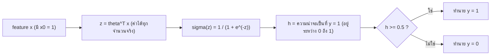
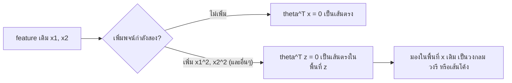
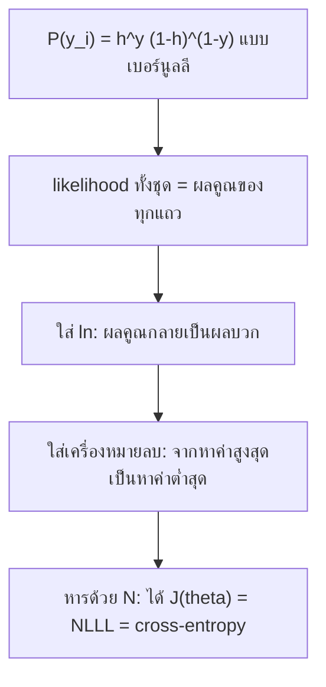

# บทที่ 4 Logistic Regression

Logistic regression คือการนำผลรวมเชิงเส้น $\theta^{T}x$ แบบเดียวกับบทที่ 2 และ 3 ไปผ่านฟังก์ชัน sigmoid เพื่อบีบให้เป็นความน่าจะเป็นระหว่าง 0 ถึง 1 แล้วใช้ความน่าจะเป็นนั้นตัดสินว่าข้อมูลอยู่กลุ่มไหน เพราะผลลัพธ์เป็นความน่าจะเป็น จึงต้องเปลี่ยน loss จาก MSE เป็น cross-entropy ซึ่งได้มาจากการแจกแจงเบอร์นูลลี และผลที่น่าแปลกใจคือ gradient ที่ได้มีหน้าตาเหมือนของ linear regression ทุกประการ

**วิธีอ่าน:** บทนี้ต่อยอดจากบทที่ 2 และ 3 โดยตรง ถ้ายังไม่คล่องเรื่อง $\theta^{T}x$, การเติม $x_0 = 1$, batch gradient descent และ polynomial features ให้ทบทวนบทที่ 3 ส่วนที่ 3, 4 และ 9 ก่อน ส่วนที่ 1 ถึง 3 ของบทนี้สร้างโมเดล ส่วนที่ 4 ว่าด้วย decision boundary ส่วนที่ 5 ถึง 7 ว่าด้วย loss ส่วนที่ 8 ถึง 9 คือการหา gradient และฝึกโมเดลจริง ส่วนที่ 10 คือการวัดผล ส่วนที่ 11 คือ odds และ logit ซึ่งเป็นอีกมุมหนึ่งของโมเดลเดียวกัน ส่วนที่ 12 เป็นสคริปต์ Python ที่สร้างตัวเลขทุกตัวในบทซ้ำได้ ตัวเลขในตัวอย่างคำนวณด้วยมือเป็นหลัก และตัวเลขของการทดลองมาจากการรันสคริปต์ในส่วนที่ 12 จริง

---

## ส่วนที่ 0 ปูพื้นฐาน: ศัพท์ที่ต้องรู้ก่อน

| ศัพท์ที่วิชาใช้ | ศัพท์ทางการ/คำพ้อง | ความหมายสั้น |
|---|---|---|
| Classification | การจำแนกประเภท | งานที่ $y$ เป็นกลุ่ม (class) ไม่ใช่ตัวเลขต่อเนื่อง |
| Binary classification | การจำแนกสองกลุ่ม | $y$ มีสองค่า เขียนเป็น 0 กับ 1 |
| Multi-class classification | การจำแนกหลายกลุ่ม | $y$ มีตั้งแต่สามกลุ่มขึ้นไป |
| Positive class, $y = 1$ | Class ที่สนใจ | กลุ่มที่เราต้องการตรวจจับ เช่น เป็นมะเร็ง ลูกค้ายกเลิก พนักงานลาออก |
| $z = \theta^{T}x$ | Linear predictor, score, logit | ผลรวมเชิงเส้นของ feature มีค่าได้ตั้งแต่ลบอนันต์ถึงบวกอนันต์ |
| $\sigma(z)$ | Sigmoid, logistic function | ฟังก์ชันที่บีบ $z$ ให้อยู่ระหว่าง 0 ถึง 1 |
| $h_\theta(x)$ | Hypothesis, predicted probability | ความน่าจะเป็นที่โมเดลให้ว่า $y = 1$ |
| Threshold | Classification threshold, cut-off | ค่าที่ใช้ตัด เช่น 0.5 ถ้าความน่าจะเป็นไม่น้อยกว่าค่านี้ทำนายเป็น 1 |
| Decision boundary | ขอบเขตการตัดสินใจ | เส้นหรือผิวที่แบ่งบริเวณที่ทำนายเป็น 0 กับ 1 |
| Convex | ฟังก์ชันนูน (รูปชาม) | ฟังก์ชันที่ไม่มีหลุมย่อย มีก้นชามเดียว |
| Cross-entropy loss | Log loss, binary cross-entropy | loss ของ logistic regression |
| NLLL | Negative log-likelihood loss | ชื่อเดียวกับ cross-entropy เมื่อมองจากมุมความน่าจะเป็น |
| Bernoulli distribution | การแจกแจงเบอร์นูลลี | การแจกแจงของผลลัพธ์ที่มีสองค่า 0 หรือ 1 |
| Likelihood | ภาวะน่าจะเป็น | ความน่าจะเป็นที่โมเดลให้กับข้อมูลที่เห็นจริง มองเป็นฟังก์ชันของ $\theta$ |
| Odds | อัตราต่อรอง | ความน่าจะเป็นที่เกิด หารด้วยความน่าจะเป็นที่ไม่เกิด |
| Logit | Log-odds | ค่า $\ln$ ของ odds |
| Confusion matrix | ตารางความสับสน | ตาราง TP, FP, FN, TN ที่นับผลทำนายเทียบกับค่าจริง |
| Accuracy, Precision, Recall, F1, AUC | ตัววัดผลของ classification | ใช้แทน MSE, $R^{2}$, MAE ของงาน regression |

ข้อตกลงเรื่องสัญลักษณ์ที่ใช้ทั้งบท (เหมือนบทที่ 3): ตัวห้อย $i$ คือแถว (ตัวอย่าง) ตัวห้อย $j$ คือคอลัมน์ (feature) ตัวยก $t$ ใน $\theta^{(t)}$ คือรอบที่ $t$ ตัวยก $T$ คือ transpose และ $x_{i,0} = 1$ ทุกแถว ในบทนี้ $\ln$ คือลอการิทึมฐาน $e$ ถ้าเห็นเอกสารเขียน $\log$ ในบริบทของ logistic regression แทบทุกครั้งหมายถึงฐาน $e$ เช่นกัน

พื้นฐานคณิตศาสตร์ที่ต้องใช้มีสามเรื่อง

1. **ฟังก์ชันเอ็กซ์โพเนนเชียล:** $e \approx 2.71828$ และ $e^{z}$ เป็นบวกเสมอ เมื่อ $z$ เป็นลบมาก $e^{z}$ เข้าใกล้ 0 เมื่อ $z$ เป็นบวกมาก $e^{z}$ โตเร็วมาก และ $e^{-z} = 1/e^{z}$
2. **ลอการิทึมธรรมชาติ:** $\ln$ เป็นฟังก์ชันผกผันของ $e^{z}$ คือ $\ln(e^{z}) = z$ คุณสมบัติที่ใช้บ่อยคือ $\ln(ab) = \ln a + \ln b$, $\ln(a^{k}) = k \ln a$, $\ln 1 = 0$ และ $\ln$ ของค่าระหว่าง 0 ถึง 1 เป็นลบเสมอ โดยยิ่งเข้าใกล้ 0 ยิ่งติดลบมาก
3. **Chain rule:** ถ้า $f$ ขึ้นกับ $g$ และ $g$ ขึ้นกับ $\theta$ แล้ว $\frac{\partial f}{\partial \theta} = \frac{\partial f}{\partial g} \cdot \frac{\partial g}{\partial \theta}$ ใช้มาแล้วในบทที่ 2 และใช้หนักในส่วนที่ 8

---

## ส่วนที่ 1 ทำไมต้องมี Logistic Regression

### 1.1 ปัญหา: คำตอบเป็นกลุ่ม ไม่ใช่ตัวเลข

บทที่ 2 และ 3 ทำนายค่าที่ต่อเนื่อง เช่น ปริมาณการใช้ถุงมือหรือราคาบ้าน แต่คำถามทางธุรกิจจำนวนมากมีคำตอบเพียงสองแบบ

- ก้อนเนื้อนี้เป็นมะเร็งหรือไม่ (cancer prediction)
- ลูกค้ารายนี้จะยกเลิกบริการหรือไม่ (churn prediction)
- พนักงานคนนี้จะลาออกหรือไม่ (attrition prediction)
- ใบสั่งซื้อนี้จะส่งของล่าช้าหรือไม่

งานแบบนี้เรียกว่า **binary classification** เขียนคำตอบเป็น $y = 1$ (เกิดสิ่งที่สนใจ) หรือ $y = 0$ (ไม่เกิด) และสิ่งที่ผู้ใช้ต้องการจริงมักไม่ใช่แค่ 0 หรือ 1 แต่เป็น **ความน่าจะเป็น** เช่น ลูกค้ารายนี้มีโอกาสยกเลิก 82% เพื่อนำไปจัดลำดับว่าควรโทรหาใครก่อน

Logistic regression คือโมเดลที่ให้ผลลัพธ์เป็นความน่าจะเป็นในช่วง $(0, 1)$ แล้วนำไปตัดสินเป็นกลุ่มได้ ใช้ได้ทั้งงานสองกลุ่มและขยายไปหลายกลุ่ม (ส่วนที่ 10.6) บทนี้เน้นสองกลุ่ม

ข้อควรระวังเรื่องชื่อ: แม้ชื่อมีคำว่า regression แต่ logistic regression ใช้ทำ **classification** ชื่อนี้มาจากที่มันเป็นการ regress (ถดถอย) ค่า log-odds ด้วยเส้นตรง ซึ่งจะเห็นชัดในส่วนที่ 11

### 1.2 ลองใช้ linear regression ตรงๆ แล้วเกิดอะไรขึ้น

สมมติเก็บข้อมูลนักศึกษา 6 คน $x$ คือจำนวนชั่วโมงทบทวน และ $y$ คือผลสอบ (1 = ผ่าน, 0 = ไม่ผ่าน) ข้อมูลชุดนี้จะใช้ตลอดบท

| คนที่ $i$ | ชั่วโมง $x_i$ | ผล $y_i$ |
|---|---|---|
| 1 | 1 | 0 |
| 2 | 2 | 0 |
| 3 | 3 | 1 |
| 4 | 4 | 0 |
| 5 | 5 | 1 |
| 6 | 6 | 1 |

ถ้าลากเส้นตรง $h_\theta(x) = \theta_0 + \theta_1 x$ ผ่านข้อมูลนี้ เส้นจะเอียงขึ้นตาม $x$ ซึ่งดูสมเหตุสมผล แต่มีปัญหาสามข้อ

1. **ผลลัพธ์ไม่มีขอบเขต:** เส้นตรงมีค่าได้ตั้งแต่ $-\infty$ ถึง $+\infty$ เมื่อ $x = 20$ ชั่วโมง เส้นอาจให้ค่า 3.2 และเมื่อ $x = -1$ อาจให้ค่า -0.4 ค่าเหล่านี้แปลเป็นความน่าจะเป็นไม่ได้ เพราะความน่าจะเป็นต้องอยู่ระหว่าง 0 ถึง 1
2. **ถูกดึงด้วยจุดที่อยู่ไกล:** ถ้าเพิ่มคนที่ทบทวน 30 ชั่วโมงและสอบผ่าน (ซึ่งไม่ได้ให้ข้อมูลใหม่อะไรเลย เพราะเราก็รู้อยู่แล้วว่าทบทวนมากมักผ่าน) MSE จะดึงเส้นให้ลาดลงเพื่อลดความคลาดเคลื่อนของจุดนั้น จุดที่ค่าทำนายข้าม 0.5 จะเลื่อนไป การจำแนกกลุ่มของคนอื่นเปลี่ยนตาม
3. **ความผิดพลาดที่วัดไม่ตรงกับเป้าหมาย:** ถ้าทำนาย 1.4 ให้คนที่ผ่าน MSE ถือว่าผิดไป $0.4^{2}$ ทั้งที่การจำแนกถูกแล้ว

### 1.3 ทางออก: เก็บ $\theta^{T}x$ ไว้ แล้วบีบผลลัพธ์

ความคิดหลักของบทนี้คือ ผลรวมเชิงเส้น $z = \theta^{T}x$ ยังมีประโยชน์ เพราะมันรวมผลของหลาย feature ด้วยน้ำหนักที่เรียนได้ เราแค่ต้องการฟังก์ชันอีกตัวมาครอบ เพื่อแปลง $z$ ที่ไม่มีขอบเขตให้กลายเป็นค่าระหว่าง 0 ถึง 1 ฟังก์ชันนั้นคือ sigmoid



วิธีอ่านแผนภาพ: ข้อมูลไหลจากซ้ายไปขวา กล่องที่สองคือสิ่งที่ linear regression ทำอยู่แล้ว กล่องที่สามคือสิ่งเดียวที่เพิ่มเข้ามา กล่องรูปข้าวหลามตัดคือการตัดสินใจด้วย threshold ซึ่งแยกออกจากตัวโมเดล ตัวโมเดลจริงจบที่ความน่าจะเป็น $h$

### สรุปหัวข้อ

- Logistic regression ใช้กับ classification โดยให้ผลเป็นความน่าจะเป็นในช่วง $(0, 1)$
- Linear regression ใช้ตรงๆ ไม่เหมาะ เพราะผลลัพธ์ไม่มีขอบเขต และถูกดึงด้วยจุดที่อยู่ไกล
- โครงของโมเดลคือ $z = \theta^{T}x$ แล้วผ่าน sigmoid จากนั้นใช้ threshold ตัดสินกลุ่ม

---

## ส่วนที่ 2 Sigmoid Function

### 2.1 นิยาม

$$\sigma(z) = \frac{1}{1 + e^{-z}}$$

เมื่อ $z = \theta^{T}x$ จะได้

$$\sigma(\theta^{T}x) = \frac{1}{1 + e^{-\theta^{T}x}}$$

### 2.2 ทำไมผลลัพธ์อยู่ระหว่าง 0 ถึง 1 เสมอ

ไล่เหตุผลทีละขั้น

1. $e^{-z}$ เป็นบวกเสมอ ไม่ว่า $z$ จะเป็นเท่าไร
2. ดังนั้นตัวส่วน $1 + e^{-z}$ มากกว่า 1 เสมอ
3. 1 หารด้วยค่าที่มากกว่า 1 ได้ผลน้อยกว่า 1 และยังเป็นบวก จึงอยู่ในช่วง $(0, 1)$

พฤติกรรมที่ปลายทั้งสองข้าง

- เมื่อ $z$ เป็นบวกมาก เช่น $z = 10$: $e^{-10} \approx 0.0000454$ ตัวส่วนเกือบเท่ากับ 1 ได้ $\sigma \approx 0.99995$ เข้าใกล้ 1 แต่ไม่ถึง
- เมื่อ $z$ เป็นลบมาก เช่น $z = -10$: $e^{10} \approx 22026$ ตัวส่วนใหญ่มาก ได้ $\sigma \approx 0.0000454$ เข้าใกล้ 0 แต่ไม่ถึง
- เมื่อ $z = 0$: $e^{0} = 1$ ได้ $\sigma(0) = \frac{1}{1 + 1} = 0.5$ พอดี

ช่วงที่เขียนว่า $(0, 1)$ เป็นวงเล็บเปิด หมายความว่าไม่รวม 0 และ 1 เอง sigmoid จึงไม่เคยให้ความน่าจะเป็น 0 หรือ 1 แบบเด็ดขาด ข้อนี้สำคัญในส่วนที่ 6 เพราะ $\ln 0$ ไม่มีค่า

### 2.3 รูปร่าง: เส้นโค้งตัว S ที่มีจุดศูนย์กลางที่ $z = 0$

| $z$ | -5 | -2 | -1 | 0 | 1 | 2 | 5 |
|---|---|---|---|---|---|---|---|
| $\sigma(z)$ | 0.0067 | 0.1192 | 0.2689 | 0.5000 | 0.7311 | 0.8808 | 0.9933 |

จากตารางเห็นสามอย่าง

1. **สมมาตรรอบจุด $(0, 0.5)$:** $\sigma(-z) = 1 - \sigma(z)$ เช่น $\sigma(-1) = 0.2689 = 1 - 0.7311$ ตรวจด้วยพีชคณิตได้: $1 - \frac{1}{1 + e^{-z}} = \frac{e^{-z}}{1 + e^{-z}}$ คูณบนล่างด้วย $e^{z}$ ได้ $\frac{1}{e^{z} + 1} = \sigma(-z)$
2. **ช่วงกลางชัน ช่วงปลายแบน:** จาก $z = -2$ ถึง $z = 2$ ค่าเปลี่ยนจาก 0.12 เป็น 0.88 แต่จาก $z = 2$ ถึง $z = 5$ เปลี่ยนเพียง 0.11 แปลว่าเมื่อโมเดลมั่นใจมากแล้ว (ปลายแบน) การเพิ่ม $z$ ต่อแทบไม่เปลี่ยนความน่าจะเป็น
3. **เครื่องหมายของ $z$ บอกฝั่ง:** $z > 0$ ให้ $\sigma > 0.5$ และ $z < 0$ ให้ $\sigma < 0.5$ ข้อนี้คือกุญแจของ decision boundary ในส่วนที่ 4

ถ้าวาดค่าในตารางเป็นกราฟ แกนนอนคือ $z$ แกนตั้งคือความน่าจะเป็น จะได้เส้นโค้งตัว S ที่เริ่มราบชิด 0 ทางซ้าย ผ่าน 0.5 ที่ $z = 0$ ซึ่งเป็นจุดที่ชันที่สุด แล้วราบชิด 1 ทางขวา

### 2.4 อนุพันธ์ของ sigmoid (ใช้ในส่วนที่ 8)

$$\frac{d\sigma(z)}{dz} = \sigma(z)(1 - \sigma(z))$$

ที่มา: เขียน $\sigma(z) = (1 + e^{-z})^{-1}$ แล้วใช้ chain rule

1. อนุพันธ์ของ $u^{-1}$ คือ $-u^{-2}$ โดย $u = 1 + e^{-z}$
2. อนุพันธ์ของ $u$ เทียบกับ $z$ คือ $-e^{-z}$
3. คูณกันได้ $\frac{e^{-z}}{(1 + e^{-z})^{2}} = \frac{1}{1 + e^{-z}} \cdot \frac{e^{-z}}{1 + e^{-z}}$
4. ตัวแรกคือ $\sigma(z)$ ตัวที่สองคือ $1 - \sigma(z)$ (จากข้อ 2.3 ข้อ 1)

ความหมาย: ความชันของ sigmoid สูงสุดที่ $z = 0$ เท่ากับ $0.5 \times 0.5 = 0.25$ และเข้าใกล้ 0 ที่ปลายทั้งสองข้าง เช่นที่ $z = 5$ ความชันคือ $0.9933 \times 0.0067 \approx 0.0066$ ความชันที่เล็กมากที่ปลายนี้คือต้นเหตุของปัญหา MSE ในส่วนที่ 5

### สรุปหัวข้อ

- $\sigma(z) = \frac{1}{1 + e^{-z}}$ ให้ค่าในช่วง $(0, 1)$ เสมอ เป็นรูปตัว S ผ่านจุด $(0, 0.5)$
- $z > 0$ ให้ $\sigma > 0.5$, $z < 0$ ให้ $\sigma < 0.5$ และ $\sigma(-z) = 1 - \sigma(z)$
- $\sigma'(z) = \sigma(z)(1 - \sigma(z))$ สูงสุด 0.25 ที่ $z = 0$ และเกือบเป็นศูนย์ที่ปลาย

---

## ส่วนที่ 3 Model Representation: Linear กับ Logistic

### 3.1 เทียบสองโมเดล

| | Linear regression | Logistic regression |
|---|---|---|
| โมเดล | $h_\theta(x) = \theta^{T}x$ | $h_\theta(x) = \sigma(\theta^{T}x)$ |
| ช่วงของผลลัพธ์ | $(-\infty, +\infty)$ | $(0, 1)$ |
| ความหมายของผลลัพธ์ | ค่าทำนายของ $y$ เอง | ความน่าจะเป็นที่ $y = 1$ |
| $y$ ในข้อมูล | จำนวนจริง | 0 หรือ 1 |

ต่างกันแค่ $\sigma$ ที่ครอบ $\theta^{T}x$ ไว้ ทุกอย่างที่เรียนเรื่อง $\theta^{T}x$ ในบทที่ 3 ใช้ได้ต่อ: ต้องเติม $x_0 = 1$, มีพารามิเตอร์ $d + 1$ ตัว, ทำนายทุกแถวพร้อมกันด้วย $\sigma(X\theta)$ (ใช้ $\sigma$ กับแต่ละช่องของเวกเตอร์)

### 3.2 ตีความ $h_\theta(x)$ ให้ถูก

$$h_\theta(x) = P(y = 1 \mid x; \theta)$$

อ่านว่า "ความน่าจะเป็นที่ $y = 1$ เมื่อรู้ $x$ และใช้พารามิเตอร์ $\theta$" ดังนั้นความน่าจะเป็นที่ $y = 0$ คือ $1 - h_\theta(x)$ เพราะมีแค่สองกลุ่มและความน่าจะเป็นรวมต้องเป็น 1

ข้อควรระวัง: $h_\theta(x)$ คือความน่าจะเป็นของ **class 1 เท่านั้น** ถ้า $h = 0.2$ ไม่ได้แปลว่าโมเดล "ไม่มั่นใจ" แต่แปลว่าโมเดลค่อนข้างมั่นใจว่าเป็น class 0 (ความน่าจะเป็น 0.8) ความไม่มั่นใจที่สุดคือ $h = 0.5$

### 3.3 Worked example: ทำนายหนึ่งคน

สมมติได้โมเดลจากการเรียนแล้ว (ค่านี้มาจากการฝึกจริงในส่วนที่ 9) $\theta = (-4.2491, \ 1.2140)$ สำหรับข้อมูลชั่วโมงทบทวน นักศึกษาที่ทบทวน 4 ชั่วโมง มี $x = (1, 4)$

1. $z = -4.2491 + 1.2140 \times 4 = -4.2491 + 4.8560 = 0.6069$
2. $e^{-0.6069} \approx 0.5451$
3. $h = \frac{1}{1 + 0.5451} = \frac{1}{1.5451} \approx 0.6473$

การตีความ: โมเดลให้ความน่าจะเป็นที่จะสอบผ่านประมาณ 64.7% ถ้าใช้ threshold 0.5 จะทำนายว่าผ่าน แต่ในข้อมูลจริง คนที่ 4 สอบไม่ผ่าน การทำนายครั้งนี้จึงผิด ซึ่งเป็นเรื่องปกติ เพราะข้อมูลชุดนี้แยกด้วยเส้นเดียวไม่ได้สมบูรณ์ (คนที่ 3 ทบทวน 3 ชั่วโมงแต่ผ่าน คนที่ 4 ทบทวน 4 ชั่วโมงแต่ไม่ผ่าน)

ตรวจผล: $z$ เป็นบวกเล็กน้อย ความน่าจะเป็นจึงควรมากกว่า 0.5 เล็กน้อย ซึ่งตรงกับ 0.6473 และตรงกับค่า $\sigma(0.6) \approx 0.646$ ที่ประมาณจากกราฟ

### สรุปหัวข้อ

- Linear: $h_\theta(x) = \theta^{T}x$ ส่วน Logistic: $h_\theta(x) = \sigma(\theta^{T}x)$
- $h_\theta(x) = P(y = 1 \mid x; \theta)$ และ $P(y = 0 \mid x; \theta) = 1 - h_\theta(x)$
- ขั้นตอนทำนาย: คำนวณ $z$ แล้วผ่าน sigmoid แล้วเทียบ threshold

---

## ส่วนที่ 4 Decision Boundary

### 4.1 จาก threshold สู่เส้นแบ่ง

กติกาตัดสินที่ใช้มาตรฐานคือ

- ทำนาย $y = 1$ ถ้า $h_\theta(x) \geq 0.5$
- ทำนาย $y = 0$ ถ้า $h_\theta(x) < 0.5$

จากส่วนที่ 2.3 เรารู้ว่า $\sigma(z) \geq 0.5$ ก็ต่อเมื่อ $z \geq 0$ ดังนั้นกติกาเดียวกันเขียนใหม่ได้ว่า

- ทำนาย $y = 1$ ถ้า $\theta^{T}x \geq 0$
- ทำนาย $y = 0$ ถ้า $\theta^{T}x < 0$

นี่คือข้อสรุปสำคัญที่สุดของส่วนนี้: **ไม่ต้องคำนวณ sigmoid เลยก็ตัดสินกลุ่มได้** ดูแค่เครื่องหมายของ $\theta^{T}x$ และจุดที่ $\theta^{T}x = 0$ พอดีคือ **decision boundary** ซึ่งเป็นเส้น (หรือผิว) ที่แบ่งพื้นที่ของ feature ออกเป็นสองฝั่ง

ข้อควรระวัง: decision boundary เป็นสมบัติของ **โมเดลและ $\theta$** ไม่ใช่ของข้อมูล ข้อมูลใช้หา $\theta$ แต่เมื่อได้ $\theta$ แล้ว เส้นแบ่งถูกกำหนดโดยสมการ $\theta^{T}x = 0$ เท่านั้น และถ้าเปลี่ยน threshold จาก 0.5 เป็นค่าอื่น เส้นแบ่งก็เลื่อนไปด้วย (ส่วนที่ 10.4)

### 4.2 กรณีที่ 1: feature เดียว ได้จุดตัด (เส้นตั้งฉาก)

$$h_\theta(x) = \sigma(\theta_0 + \theta_1 x_1)$$

เส้นแบ่งคือ $\theta_0 + \theta_1 x_1 = 0$ แก้ได้ $x_1 = -\theta_0 / \theta_1$ เป็นค่าเดียว ถ้าวาดบนระนาบ $(x_1, x_2)$ จะเป็นเส้นตั้งฉากกับแกน $x_1$ เพราะโมเดลไม่ได้ใช้ $x_2$ เลย ($x_2$ ไม่มีผลต่อการทำนาย)

**Worked example:** ด้วย $\theta = (-4.2491, 1.2140)$ จากส่วนที่ 3.3 เส้นแบ่งอยู่ที่ $x = 4.2491 / 1.2140 = 3.5$ ชั่วโมง คนที่ทบทวนตั้งแต่ 3.5 ชั่วโมงขึ้นไปถูกทำนายว่าผ่าน คนที่ทบทวนน้อยกว่าถูกทำนายว่าไม่ผ่าน ($\theta_1 > 0$ ฝั่งที่ $x$ มากจึงเป็น class 1 ถ้า $\theta_1 < 0$ ฝั่งจะกลับกัน)

### 4.3 กรณีที่ 2: สอง feature ได้เส้นตรงเอียง

$$h_\theta(x) = \sigma(\theta_0 + \theta_1 x_1 + \theta_2 x_2)$$

เส้นแบ่งคือ $\theta_0 + \theta_1 x_1 + \theta_2 x_2 = 0$ ซึ่งเป็นสมการเส้นตรงบนระนาบ $(x_1, x_2)$

**Worked example:** ให้ $\theta = (-3, 1, 1)$ เส้นแบ่งคือ $x_1 + x_2 = 3$

| จุด $(x_1, x_2)$ | $z = -3 + x_1 + x_2$ | $h = \sigma(z)$ | ทำนาย |
|---|---|---|---|
| (1, 1) | -1 | 0.2689 | 0 |
| (2, 1) | 0 | 0.5000 | 1 (อยู่บนเส้นพอดี ใช้กติกา $\geq$) |
| (2, 2) | 1 | 0.7311 | 1 |

จุดที่อยู่เหนือเส้น $x_1 + x_2 = 3$ (ผลรวมเกิน 3) ทำนายเป็น 1 จุดที่อยู่ใต้เส้นทำนายเป็น 0 เมื่อมี feature สามตัว เส้นแบ่งเป็นระนาบ และเมื่อมากกว่านั้นเป็นไฮเปอร์เพลน แต่หลักเดิมคือ $\theta^{T}x = 0$

### 4.4 กรณีที่ 3: ใช้ polynomial features ได้เส้นแบ่งโค้ง

$$h_\theta(x) = \sigma(-1 + x_1^{2} + x_2^{2})$$

ในที่นี้ $\theta = (-1, 1, 1)$ คู่กับ feature $(1, x_1^{2}, x_2^{2})$ เส้นแบ่งคือ $-1 + x_1^{2} + x_2^{2} = 0$ หรือ $x_1^{2} + x_2^{2} = 1$ ซึ่งคือ **วงกลมรัศมี 1 มีจุดศูนย์กลางที่จุดกำเนิด**

ต้องระวังเรื่องฝั่งให้ดี ไล่ด้วยตัวอย่าง

| จุด $(x_1, x_2)$ | อยู่ที่ไหน | $z = -1 + x_1^{2} + x_2^{2}$ | $h$ | ทำนาย |
|---|---|---|---|---|
| (0, 0) | จุดศูนย์กลาง | -1 | 0.2689 | 0 |
| (0.5, 0.5) | ในวงกลม | -0.5 | 0.3775 | 0 |
| (1, 0) | บนวงกลม | 0 | 0.5000 | 1 |
| (1, 1) | นอกวงกลม | 1 | 0.7311 | 1 |

ดังนั้นตามสูตรนี้ **ด้านในวงกลมเป็น class 0 และด้านนอกเป็น class 1** ถ้าต้องการให้ด้านในเป็น class 1 ต้องกลับเครื่องหมายทั้งหมด เป็น $\sigma(1 - x_1^{2} - x_2^{2})$ ข้อควรระวัง: หากพบกราฟหรือคำอธิบายที่ระบุฝั่งไม่ตรงกับสูตร ให้ยึดการแทนค่าในสูตร เพราะกราฟอาจสลับป้ายสีได้ ในข้อสอบให้แทนจุดหนึ่งจุด (เช่นจุดกำเนิด) เพื่อตรวจฝั่งทุกครั้ง

**ทำไมได้เส้นโค้งทั้งที่โมเดลเป็นเชิงเส้น:** เหตุผลเดียวกับ polynomial regression ในบทที่ 3 ส่วนที่ 9 ถ้าตั้งชื่อ feature ใหม่ $z_1 = x_1^{2}$, $z_2 = x_2^{2}$ โมเดลคือ $\sigma(-1 + z_1 + z_2)$ ซึ่งเชิงเส้นเทียบกับ $\theta$ และเส้นแบ่งเป็นเส้นตรงในพื้นที่ $(z_1, z_2)$ แต่เมื่อแปลงกลับมาดูในพื้นที่ $(x_1, x_2)$ เดิม เส้นตรงนั้นกลายเป็นวงกลม ดังนั้น logistic regression จะสร้างเส้นแบ่งโค้งได้ก็ต่อเมื่อเราป้อน feature ที่โค้งเข้าไปเอง ถ้าป้อนแค่ $x_1, x_2$ จะได้เส้นตรงเสมอ



วิธีอ่านแผนภาพ: รูปร่างของเส้นแบ่งถูกกำหนดที่ขั้นเลือก feature ไม่ใช่ที่ sigmoid sigmoid ไม่ทำให้เส้นแบ่งโค้ง

### สรุปหัวข้อ

- ที่ threshold 0.5: ทำนาย 1 เมื่อ $\theta^{T}x \geq 0$ และ decision boundary คือ $\theta^{T}x = 0$
- feature เดียวได้จุดตัด $x_1 = -\theta_0/\theta_1$, สอง feature ได้เส้นตรง, polynomial features ได้เส้นโค้ง เช่น $\sigma(-1 + x_1^{2} + x_2^{2})$ ให้วงกลมรัศมี 1 โดยด้านนอกเป็น class 1
- ตรวจฝั่งด้วยการแทนจุดเสมอ

---

## ส่วนที่ 5 ทำไม MSE ไม่เหมาะกับ Logistic Regression

### 5.1 ลองใช้ cost function เดิม

ใน linear regression เราใช้ MSE

$$J(\theta) = \frac{1}{N} \sum_{i=1}^{N} (h_\theta(x_i) - y_i)^{2}$$

ถ้านำมาใช้กับ logistic regression ตรงๆ โดยแค่เปลี่ยน $h_\theta(x_i)$ เป็น $\sigma(\theta^{T}x_i)$ สูตรก็คำนวณได้ แต่มีปัญหาสองข้อ คือ $J$ ไม่เป็นชามนูน (non-convex) และการลู่เข้าไม่ดี (poor convergence properties) สองข้อนี้มีต้นเหตุเดียวกัน คือ sigmoid ที่อยู่ข้างในกำลังสอง

### 5.2 ปัญหาที่ 1: ไม่เป็นชามนูน

ในบทที่ 2 และ 3 MSE ของ linear regression เป็นชามนูน เพราะ $\theta^{T}x$ เป็นเส้นตรงของ $\theta$ และกำลังสองของเส้นตรงเป็นพาราโบลาหงาย แต่เมื่อมี sigmoid คั่นกลาง $h$ ไม่ใช่เส้นตรงของ $\theta$ อีกต่อไป กำลังสองของเส้นโค้งตัว S จึงไม่จำเป็นต้องเป็นชาม

เพื่อให้เห็นภาพ ลองเดินไปตามเส้นตรงเส้นเดียวในพื้นที่ $\theta$ คือ $\theta = t \cdot (-3.5, \ 1)$ บนข้อมูลชั่วโมงทบทวน ($t$ เป็นตัวเลขตัวเดียว ทำให้วาดเป็นกราฟสองมิติได้) แล้วคำนวณ loss ทั้งสองแบบ (ผลจากการรันจริงในส่วนที่ 12)

| $t$ | -10 | -5 | 0 | 1 | 5 | 10 |
|---|---|---|---|---|---|---|
| MSE | 0.6667 | 0.6682 | 0.2500 | 0.1422 | 0.2847 | 0.3289 |
| Cross-entropy | 13.3356 | 6.6931 | 0.6931 | 0.4181 | 0.8598 | 1.6689 |

สังเกตฝั่ง $t$ ติดลบ (โมเดลกลับทิศ ทำนายผิดอย่างมั่นใจ) MSE ค้างอยู่ที่ประมาณ 0.667 แทบไม่เปลี่ยน คือเป็น **ที่ราบ** ขณะที่ cross-entropy ยังสูงขึ้นเรื่อยๆ เป็นเส้นชันชี้กลับไปหาคำตอบ ผิวที่มีทั้งช่วงโค้งหงายใกล้คำตอบและช่วงราบไกลออกไปแบบ MSE นี้ไม่ใช่ชามนูน (ส่วนที่ 12 ยังตรวจเพิ่มด้วยว่าความโค้งของ MSE ตามเส้นนี้มีทั้งค่าบวกและค่าลบ) ในโมเดลที่มีหลายพารามิเตอร์ ผิวแบบนี้อาจมีทั้งที่ราบและหลุมย่อย gradient descent ที่เริ่มผิดที่อาจติดอยู่และไม่ถึงคำตอบที่ดีที่สุด

### 5.3 ปัญหาที่ 2: ลู่เข้าช้าเมื่อทำนายผิดอย่างมั่นใจ

ดูข้อมูลหนึ่งแถวที่ $y = 1$ แล้วเปรียบเทียบอนุพันธ์ของ loss เทียบกับ $z$ (ค่านี้คูณกับ $x_{i,j}$ แล้วกลายเป็น gradient ของ $\theta_j$)

- MSE: $\frac{d}{dz}(h - y)^{2} = 2(h - y) \cdot h(1 - h)$ (มีตัวคูณ $h(1-h)$ จากอนุพันธ์ของ sigmoid)
- Cross-entropy: $\frac{d}{dz}[-\ln h] = h - 1 = h - y$ (ตัวคูณ $h(1-h)$ ตัดกันหายไป จะพิสูจน์ในส่วนที่ 8)

| $z$ | $h$ | สถานการณ์ | MSE | dMSE/dz | Cross-entropy | dCE/dz |
|---|---|---|---|---|---|---|
| -6 | 0.0025 | ผิดอย่างมั่นใจมาก | 0.9951 | -0.0049 | 6.0025 | -0.9975 |
| -3 | 0.0474 | ผิดอย่างมั่นใจ | 0.9074 | -0.0861 | 3.0486 | -0.9526 |
| 0 | 0.5000 | ไม่แน่ใจ | 0.2500 | -0.2500 | 0.6931 | -0.5000 |
| 3 | 0.9526 | ถูกอย่างมั่นใจ | 0.0022 | -0.0043 | 0.0486 | -0.0474 |

แถวแรกคือหัวใจของปัญหา เมื่อโมเดลผิดหนักที่สุด ($h = 0.0025$ ทั้งที่คำตอบคือ 1) MSE ให้ gradient เพียง -0.0049 แทบเป็นศูนย์ เพราะตัวคูณ $h(1 - h)$ เกือบเป็นศูนย์ที่ปลายของ sigmoid gradient descent จึงขยับน้อยมากทั้งที่ควรขยับมากที่สุด ส่วน cross-entropy ให้ gradient -0.9975 ซึ่งเกือบเท่ากับขนาดของความผิดพลาดเต็มๆ จึงแก้ตัวได้เร็ว พฤติกรรมที่ต้องการคือ ยิ่งผิดมาก ยิ่งต้องลงโทษมาก และยิ่งต้องขยับมาก cross-entropy ทำได้ ส่วน MSE ทำกลับกัน

Google Machine Learning Crash Course อธิบายเหตุผลเดียวกันว่า logistic regression ใช้ log loss แทน squared loss เพราะอัตราการเปลี่ยนของโมเดลไม่คงที่เหมือนเส้นตรง ([Google ML Crash Course: Loss and regularization](https://developers.google.com/machine-learning/crash-course/logistic-regression/loss-regularization))

### สรุปหัวข้อ

- MSE กับ sigmoid ให้ผิว loss ที่ไม่เป็นชามนูน มีที่ราบ และอาจมีหลุมย่อยในหลายมิติ
- เมื่อทำนายผิดอย่างมั่นใจ gradient ของ MSE เกือบเป็นศูนย์ เพราะตัวคูณ $h(1-h)$ จึงลู่เข้าช้า
- ต้องการ loss ที่ลงโทษหนักและให้ gradient ใหญ่เมื่อผิดมาก นั่นคือ cross-entropy

---

## ส่วนที่ 6 Cross-Entropy Loss

### 6.1 นิยามแบบแยกกรณี

สำหรับข้อมูลหนึ่งแถว loss ขึ้นกับว่าค่าจริงเป็นอะไร

- ถ้า $y = 1$: loss $= -\ln(h_\theta(x))$
- ถ้า $y = 0$: loss $= -\ln(1 - h_\theta(x))$

cost ของทั้งชุดคือค่าเฉลี่ยของ loss ทุกแถว

$$J(\theta) = \frac{1}{N} \sum_{i=1}^{N} \mathrm{loss}_i$$

เมื่อ $\mathrm{loss}_i$ เลือกสูตรตามค่า $y_i$ ของแถวนั้น

**วิธีจำ:** ทั้งสองกรณีคือ "ลบ $\ln$ ของความน่าจะเป็นที่โมเดลให้กับคำตอบที่ถูก" ถ้าคำตอบคือ 1 ความน่าจะเป็นที่โมเดลให้คำตอบนี้คือ $h$ ถ้าคำตอบคือ 0 ความน่าจะเป็นที่โมเดลให้คือ $1 - h$

### 6.2 ทำไมรูปร่างนี้ถูกต้อง

ดูกรณี $y = 1$ ซึ่ง loss $= -\ln h$

| $h$ (ความน่าจะเป็นที่ให้คำตอบถูก) | 0.99 | 0.9 | 0.5 | 0.1 | 0.01 |
|---|---|---|---|---|---|
| $-\ln h$ | 0.0101 | 0.1054 | 0.6931 | 2.3026 | 4.6052 |

- เมื่อ $h$ เข้าใกล้ 1 (ทำนายถูกอย่างมั่นใจ) loss เข้าใกล้ 0
- เมื่อ $h$ เข้าใกล้ 0 (ทำนายผิดอย่างมั่นใจ) loss พุ่งขึ้นไม่มีขอบเขต เพราะ $\ln h \to -\infty$
- ที่ $h = 0.5$ loss คือ $\ln 2 \approx 0.6931$

ถ้าวาดกราฟของ $-\ln(h)$ เทียบกับ $h$ จะเป็นเส้นโค้งที่ลดลงจากสูงมากที่ $h$ ใกล้ 0 ลงไปแตะ 0 ที่ $h = 1$ ส่วนกรณี $y = 0$ คือ $-\ln(1 - h)$ เป็นภาพสะท้อนในกระจก ต่ำที่ $h = 0$ และพุ่งขึ้นเมื่อ $h$ เข้าใกล้ 1 แกนตั้งของกราฟทั้งสองบางครั้งติดป้ายว่า NLLL ซึ่งเป็นชื่อเดียวกับ loss นี้ (ส่วนที่ 7)

ความไม่สมมาตรเป็นเจตนา การทำนายผิดเล็กน้อย (0.4 แทน 1) ถูกลงโทษ 0.9163 แต่การทำนายผิดอย่างมั่นใจ (0.01 แทน 1) ถูกลงโทษ 4.6052 มากกว่าห้าเท่า โมเดลจึงถูกผลักให้หลีกเลี่ยงความมั่นใจผิดๆ เป็นพิเศษ

### 6.3 ทำไมเรียกว่า cross-entropy

Cross-entropy วัดความต่างระหว่างการแจกแจงความน่าจะเป็นสองชุด สำหรับข้อมูลหนึ่งแถว มีการแจกแจงอยู่สองชุด

- **การแจกแจงจริง:** ถ้า $y = 1$ คือ (P(class 1), P(class 0)) $= (1, 0)$ ถ้า $y = 0$ คือ $(0, 1)$
- **การแจกแจงที่โมเดลทำนาย:** $(h, \ 1 - h)$

สูตรทั่วไปของ cross-entropy ระหว่างการแจกแจงจริง $p$ กับที่ทำนาย $q$ คือ $-\sum_k p_k \ln q_k$ แทนค่าสองกลุ่มได้ $-[y \ln h + (1 - y)\ln(1 - h)]$ ถ้าการแจกแจงทั้งสองเหมือนกัน (ทำนาย $h = 1$ ให้ $y = 1$) cross-entropy เป็น 0 ยิ่งต่างกันยิ่งมาก

### 6.4 Worked example: cost ของข้อมูลชั่วโมงทบทวน

**ที่จุดเริ่มต้น $\theta = (0, 0)$:** $z = 0$ ทุกแถว จึง $h = 0.5$ ทุกแถว loss ของทุกแถว ไม่ว่า $y$ เป็นอะไร คือ $-\ln 0.5 = 0.6931$ ได้ $J = 0.6931$ ค่านี้คือ cost ของโมเดลที่ "เดาสุ่มครึ่งต่อครึ่ง" ใช้เป็นเกณฑ์ขั้นต่ำได้ โมเดลที่ฝึกแล้วควรต่ำกว่านี้

**ที่ $\theta = (-4.2491, 1.2140)$ (หลังฝึก):**

| $i$ | $x_i$ | $y_i$ | $h_i$ | สูตรที่ใช้ | loss |
|---|---|---|---|---|---|
| 1 | 1 | 0 | 0.0459 | $-\ln(1 - 0.0459)$ | 0.0470 |
| 2 | 2 | 0 | 0.1393 | $-\ln(1 - 0.1393)$ | 0.1500 |
| 3 | 3 | 1 | 0.3527 | $-\ln(0.3527)$ | 1.0421 |
| 4 | 4 | 0 | 0.6473 | $-\ln(1 - 0.6473)$ | 1.0421 |
| 5 | 5 | 1 | 0.8607 | $-\ln(0.8607)$ | 0.1500 |
| 6 | 6 | 1 | 0.9541 | $-\ln(0.9541)$ | 0.0470 |

ผลรวม $= 2.4782$ หาร 6 ได้ $J \approx 0.4130$ ลดลงจาก 0.6931

การตีความ: loss ส่วนใหญ่มาจากคนที่ 3 และ 4 ซึ่งเป็นสองคนที่ "สวนกระแส" (ทบทวนน้อยแต่ผ่าน กับทบทวนมากแต่ไม่ผ่าน) อยู่ใกล้เส้นแบ่ง 3.5 ชั่วโมงทั้งคู่ คนที่อยู่ไกลเส้นแบ่งและอยู่ถูกฝั่งมี loss เล็กมาก ผลรวมของแถวที่ 3 และ 4 คิดเป็นราว 84% ของ cost ทั้งหมด

### สรุปหัวข้อ

- loss ของหนึ่งแถว: $-\ln h$ ถ้า $y = 1$, $-\ln(1 - h)$ ถ้า $y = 0$ คือลบ $\ln$ ของความน่าจะเป็นที่ให้กับคำตอบที่ถูก
- ทำนายถูกอย่างมั่นใจ loss ใกล้ 0, ทำนายผิดอย่างมั่นใจ loss พุ่งไม่มีขอบเขต
- โมเดลเดาครึ่งต่อครึ่งมี cost $= \ln 2 \approx 0.6931$

---

## ส่วนที่ 7 Negative Log-Likelihood: รวมสองบรรทัดเป็นบรรทัดเดียว

### 7.1 ปัญหาของสูตรแยกกรณี

สูตรในส่วนที่ 6.1 ใช้ได้ แต่หาอนุพันธ์ยาก เพราะต้องแยกกรณีทุกครั้ง ต้องการสูตรเดียวที่ใช้ได้กับทั้ง $y = 0$ และ $y = 1$ วิธีที่ทั้งกระชับและมีเหตุผลทางสถิติรองรับคือมองผ่านการแจกแจงเบอร์นูลลี

### 7.2 การแจกแจงเบอร์นูลลี

ผลลัพธ์ที่มีสองค่า (0 หรือ 1) โดยมีความน่าจะเป็นของค่า 1 เท่ากับ $h$ มีการแจกแจงแบบเบอร์นูลลี เขียนความน่าจะเป็นของทั้งสองกรณีรวมในสูตรเดียวได้ว่า

$$P(y_i \mid x_i; \theta) = (h_\theta(x_i))^{y_i} \cdot (1 - h_\theta(x_i))^{1 - y_i}$$

ตรวจว่าสูตรนี้ถูก โดยแทนค่าทั้งสองกรณี (ใช้ข้อเท็จจริงว่า $a^{0} = 1$ และ $a^{1} = a$)

- $y_i = 1$: $h^{1} \cdot (1 - h)^{0} = h \cdot 1 = h$ ตรงกับ $P(y = 1)$
- $y_i = 0$: $h^{0} \cdot (1 - h)^{1} = 1 \cdot (1 - h) = 1 - h$ ตรงกับ $P(y = 0)$

เลขยกกำลัง $y_i$ และ $1 - y_i$ ทำหน้าที่เป็นสวิตช์ เปิดตัวที่ต้องใช้และปิด (กลายเป็น 1) ตัวที่ไม่ใช้

### 7.3 ใส่ $\ln$ แล้วผลคูณกลายเป็นผลบวก

ใช้ $\ln(ab) = \ln a + \ln b$ และ $\ln(a^{k}) = k \ln a$

$$\ln P(y_i \mid x_i; \theta) = y_i \ln(h_\theta(x_i)) + (1 - y_i) \ln(1 - h_\theta(x_i))$$

ตอนนี้ $y_i$ กลายเป็นตัวคูณที่เปิดปิดพจน์ เมื่อ $y_i = 1$ เหลือพจน์แรก เมื่อ $y_i = 0$ เหลือพจน์หลัง ซึ่งตรงกับสูตรแยกกรณีเมื่อใส่เครื่องหมายลบ

### 7.4 จาก likelihood ของทั้งชุดสู่ cost function

ไล่เหตุผลทีละขั้น

1. **Likelihood ของทั้งชุด:** ถ้าถือว่าแต่ละแถวเป็นอิสระต่อกัน ความน่าจะเป็นที่โมเดลจะสร้างข้อมูลทั้งชุดที่เห็นจริงคือผลคูณของทุกแถว $L(\theta) = \prod_{i=1}^{N} P(y_i \mid x_i; \theta)$ ค่านี้คือ likelihood ถ้า $\theta$ ดี โมเดลให้ความน่าจะเป็นสูงกับคำตอบที่เกิดขึ้นจริง likelihood ก็สูง หลักการ maximum likelihood estimation คือเลือก $\theta$ ที่ทำให้ $L(\theta)$ สูงที่สุด
2. **ใส่ $\ln$:** ผลคูณของความน่าจะเป็นจำนวนมาก (ค่าน้อยกว่า 1 ทั้งหมด) เล็กลงจนคอมพิวเตอร์เก็บไม่ได้ (underflow) และหาอนุพันธ์ยาก $\ln$ เปลี่ยนผลคูณเป็นผลบวก และเพราะ $\ln$ เป็นฟังก์ชันเพิ่ม $\theta$ ที่ทำให้ $L$ สูงสุดก็คือ $\theta$ ตัวเดียวกับที่ทำให้ $\ln L$ สูงสุด
3. **ใส่เครื่องหมายลบ:** gradient descent ใช้ **หาค่าต่ำสุด** การหาค่าสูงสุดของ $\ln L$ เทียบเท่ากับหาค่าต่ำสุดของ $-\ln L$
4. **หารด้วย $N$:** ทำให้เป็นค่าเฉลี่ยต่อแถว ไม่ขึ้นกับขนาดข้อมูล ไม่เปลี่ยนตำแหน่งของคำตอบ

ผลลัพธ์คือ **negative log-likelihood loss (NLLL)**

$$J(\theta) = -\frac{1}{N} \sum_{i=1}^{N} [ y_i \ln h_\theta(x_i) + (1 - y_i) \ln(1 - h_\theta(x_i)) ]$$

ซึ่งคือสูตรเดียวกับ cross-entropy ในส่วนที่ 6 ทุกประการ ชื่อ cross-entropy, log loss, binary cross-entropy และ NLLL ในบริบทนี้จึงหมายถึงสิ่งเดียวกัน ต่างกันแค่มุมที่มอง (ทฤษฎีสารสนเทศกับสถิติ)



วิธีอ่านแผนภาพ: แต่ละกล่องคือการแปลงหนึ่งครั้ง ไม่มีขั้นไหนเปลี่ยนตำแหน่งของ $\theta$ ที่ดีที่สุด ($\ln$ เป็นฟังก์ชันเพิ่ม การคูณ $-1$ สลับสูงสุดเป็นต่ำสุด การหาร $N$ ไม่เปลี่ยนตำแหน่ง) จึงสรุปได้ว่าการหาค่าต่ำสุดของ cross-entropy เท่ากับการทำ maximum likelihood

**Worked example (ตรวจสูตรบรรทัดเดียว):** แถวที่ 4 ในส่วนที่ 6.4 มี $y = 0$, $h = 0.6473$ แทนสูตร: $-[0 \cdot \ln 0.6473 + (1 - 0) \ln(1 - 0.6473)] = -\ln 0.3527 = 1.0421$ ตรงกับตาราง แถวที่ 3 มี $y = 1$, $h = 0.3527$: $-[1 \cdot \ln 0.3527 + 0 \cdot \ln 0.6473] = 1.0421$ เช่นกัน

### 7.5 Cost function นี้เป็นชามนูน

Cross-entropy ของ logistic regression เป็นฟังก์ชันนูนของ $\theta$ (เหตุผลทางคณิตศาสตร์คือ เมทริกซ์อนุพันธ์อันดับสองคือ $\frac{1}{N} \sum_i h_i (1 - h_i) x_i x_i^{T}$ ซึ่งไม่เป็นลบเสมอ เพราะ $h_i(1 - h_i) > 0$) จึงไม่มีหลุมย่อย gradient descent ที่ใช้ learning rate เหมาะสมจะเดินลงไปหาก้นชามได้จากทุกจุดเริ่มต้น นี่คือการแก้ปัญหาที่ 1 ของ MSE

ข้อควรระวัง: ถ้าข้อมูลแยกได้สมบูรณ์ด้วยเส้นแบ่ง (ทุกคนที่ผ่านทบทวนมากกว่าทุกคนที่ไม่ผ่าน) cost จะลดลงเข้าหา 0 ได้เรื่อยๆ โดย $\theta$ โตขึ้นไม่สิ้นสุด ไม่มีก้นชามที่ค่าจำกัด วิธีแก้ในทางปฏิบัติคือ regularization (ลงโทษ $\theta$ ที่ใหญ่) หรือหยุดก่อน (early stopping) ซึ่ง Google ML Crash Course ระบุว่าสำคัญมากสำหรับ logistic regression ([Google ML Crash Course: Loss and regularization](https://developers.google.com/machine-learning/crash-course/logistic-regression/loss-regularization)) ข้อมูลชั่วโมงทบทวนในบทนี้แยกไม่ได้สมบูรณ์ (คนที่ 3 และ 4 สลับกัน) จึงมีคำตอบที่ค่าจำกัด

### สรุปหัวข้อ

- เบอร์นูลลี: $P(y_i \mid x_i; \theta) = h^{y_i}(1 - h)^{1 - y_i}$ เลขยกกำลังทำหน้าที่เป็นสวิตช์
- $J(\theta) = -\frac{1}{N}\sum [y_i \ln h_\theta(x_i) + (1 - y_i)\ln(1 - h_\theta(x_i))]$ ได้จาก likelihood, ใส่ $\ln$, ใส่ลบ, หาร $N$
- เป็นชามนูน แต่ถ้าข้อมูลแยกได้สมบูรณ์ $\theta$ จะโตไม่หยุด ต้องใช้ regularization

---

## ส่วนที่ 8 หา Gradient ของ Cross-Entropy

### 8.1 เป้าหมาย

เพื่อใช้ gradient descent ต้องรู้ $\frac{\partial J}{\partial \theta_j}$ สำหรับทุก $j = 0, 1, \ldots, d$ ส่วนนี้ไล่ที่มาทีละขั้นด้วยเครื่องมือสองตัว คืออนุพันธ์ของ $\ln$ และอนุพันธ์ของ sigmoid ผลลัพธ์สุดท้ายสั้นมาก และการเห็นว่าพจน์ไหนตัดกันหายไปช่วยให้เข้าใจว่าทำไม cross-entropy จึงดีกว่า MSE

เครื่องมือที่ใช้

1. **อนุพันธ์ของ $\ln$ ผ่าน chain rule:** $\frac{\partial \ln(f)}{\partial \theta} = \frac{1}{f} \cdot \frac{\partial f}{\partial \theta}$
2. **อนุพันธ์ของ sigmoid ผ่าน chain rule:** $\frac{\partial \sigma(f)}{\partial \theta} = \sigma(f)(1 - \sigma(f)) \cdot \frac{\partial f}{\partial \theta}$ (จากส่วนที่ 2.4)
3. **อนุพันธ์ของ $\theta^{T}x_i$ เทียบกับ $\theta_j$:** พจน์อื่นเป็นค่าคงที่ เหลือ $x_{i,j}$ ตัวเดียว (เหมือนบทที่ 3 ส่วนที่ 4.2)

เพื่อให้อ่านง่าย เขียนย่อ $h_i = h_\theta(x_i) = \sigma(\theta^{T}x_i)$

### 8.2 ขั้นที่ 1: หาอนุพันธ์ของแต่ละพจน์ใน $\ln$

$$J(\theta) = -\frac{1}{N} \sum_{i=1}^{N} [ y_i \ln(h_i) + (1 - y_i) \ln(1 - h_i) ]$$

$y_i$ เป็นค่าคงที่ (มาจากข้อมูล) ใช้เครื่องมือข้อ 1 กับทั้งสองพจน์

$$\frac{\partial J}{\partial \theta_j} = -\frac{1}{N} \sum_{i=1}^{N} [ y_i \cdot \frac{1}{h_i} \cdot \frac{\partial h_i}{\partial \theta_j} + (1 - y_i) \cdot \frac{1}{1 - h_i} \cdot \frac{\partial (1 - h_i)}{\partial \theta_j} ]$$

และเพราะเลข 1 เป็นค่าคงที่ $\frac{\partial (1 - h_i)}{\partial \theta_j} = (-1) \cdot \frac{\partial h_i}{\partial \theta_j}$

### 8.3 ขั้นที่ 2: แทนอนุพันธ์ของ sigmoid

ใช้เครื่องมือข้อ 2 และ 3

$$\frac{\partial h_i}{\partial \theta_j} = \frac{\partial \sigma(\theta^{T}x_i)}{\partial \theta_j} = \sigma(\theta^{T}x_i)(1 - \sigma(\theta^{T}x_i)) \cdot x_{i,j} = h_i (1 - h_i) x_{i,j}$$

แทนลงในขั้นที่ 1

$$\frac{\partial J}{\partial \theta_j} = -\frac{1}{N} \sum_{i=1}^{N} [ y_i \cdot \frac{1}{h_i} \cdot h_i(1 - h_i) x_{i,j} + (1 - y_i) \cdot \frac{-1}{1 - h_i} \cdot h_i(1 - h_i) x_{i,j} ]$$

### 8.4 ขั้นที่ 3: ตัดทอน

- พจน์แรก: $\frac{1}{h_i}$ ตัดกับ $h_i$ เหลือ $y_i(1 - h_i)x_{i,j}$
- พจน์ที่สอง: $\frac{1}{1 - h_i}$ ตัดกับ $(1 - h_i)$ เหลือ $(1 - y_i)(-1)h_i x_{i,j}$

$$\frac{\partial J}{\partial \theta_j} = -\frac{1}{N} \sum_{i=1}^{N} [ y_i(1 - h_i)x_{i,j} - (1 - y_i)h_i x_{i,j} ]$$

กระจายวงเล็บ

$$= -\frac{1}{N} \sum_{i=1}^{N} [ y_i x_{i,j} - y_i h_i x_{i,j} - h_i x_{i,j} + y_i h_i x_{i,j} ]$$

พจน์ $-y_i h_i x_{i,j}$ กับ $+y_i h_i x_{i,j}$ หักล้างกัน

$$= -\frac{1}{N} \sum_{i=1}^{N} (y_i - h_i) x_{i,j}$$

ย้ายเครื่องหมายลบเข้าไปในวงเล็บ ได้ผลสุดท้าย

$$\frac{\partial J}{\partial \theta_j} = \frac{1}{N} \sum_{i=1}^{N} (h_\theta(x_i) - y_i) x_{i,j}, \qquad j = 0, 1, \ldots, d$$

### 8.5 ความหมายของผลลัพธ์

**หน้าตาเหมือน linear regression:** สูตรนี้มีรูปเดียวกับกฎการปรับค่าของ linear regression ที่วิชาใช้ในบทที่ 2 และ 3 คือ "ค่าเฉลี่ยของ (ทำนาย ลบ จริง) คูณ feature" (บทที่ 3 ใช้รูปที่ไม่มีเลข 2 ซึ่งเทียบเท่ากับนิยาม MSE เป็น $\frac{1}{2N}$ หรือรวมเลข 2 ไว้ใน $\eta$) ความต่างอยู่ที่ $h_\theta(x_i)$ ซึ่งในบทนี้คือ $\sigma(\theta^{T}x_i)$ ดังนั้นแม้สูตรเหมือนกัน ตัวเลขที่ได้ไม่เหมือนกัน และโค้ดต้องเปลี่ยนเพียงบรรทัดเดียวคือใส่ sigmoid

**ตัวคูณ $h(1-h)$ หายไป:** ในขั้นที่ 3 อนุพันธ์ของ sigmoid $h_i(1 - h_i)$ ถูกตัดทิ้งด้วย $\frac{1}{h_i}$ และ $\frac{1}{1 - h_i}$ ที่มาจาก $\ln$ พอดี นี่คือเหตุผลทางคณิตศาสตร์ที่ cross-entropy ไม่มีปัญหา gradient หายเมื่อทำนายผิดอย่างมั่นใจ (ส่วนที่ 5.3) ส่วน MSE ไม่มี $\ln$ มาช่วยตัด ตัวคูณนี้จึงค้างอยู่

**รูปเมทริกซ์:** เหมือนบทที่ 3 ส่วนที่ 4.3

$$\nabla J(\theta) = \frac{1}{N} X^{T}(\sigma(X\theta) - y)$$

อ่านจากขวาไปซ้าย: $X\theta$ ได้ $z$ ทุกแถว (ขนาด $N \times 1$), $\sigma(\cdot)$ ทีละช่องได้ความน่าจะเป็น, ลบ $y$ ได้ error, $X^{T}$ คูณ error ได้ gradient ขนาด $(d + 1) \times 1$

### สรุปหัวข้อ

- $\frac{\partial J}{\partial \theta_j} = \frac{1}{N}\sum_{i=1}^{N}(h_\theta(x_i) - y_i)x_{i,j}$ รูปเดียวกับ linear regression แต่ $h = \sigma(\theta^{T}x)$
- ขั้นสำคัญ: อนุพันธ์ของ $\ln$ ให้ $\frac{1}{h}$, อนุพันธ์ของ sigmoid ให้ $h(1-h)x$, ตัดกันเหลือ $(y - h)x$
- รูปเมทริกซ์: $\frac{1}{N}X^{T}(\sigma(X\theta) - y)$

---

## ส่วนที่ 9 ฝึกโมเดลด้วย Gradient Descent

### 9.1 กฎการปรับค่า

$$\theta_j^{(t+1)} = \theta_j^{(t)} - \eta \cdot \frac{1}{N} \sum_{i=1}^{N} (h_\theta(x_i) - y_i) x_{i,j}, \qquad j = 0, 1, \ldots, d$$

ทุกเรื่องจากบทที่ 3 ยังใช้ได้: อัปเดตทุก $j$ พร้อมกันจาก $\theta^{(t)}$ ชุดเดียว, เลือกใช้ BGD, SGD หรือ mini-batch ได้, และควรทำ feature scaling เมื่อ feature มีสเกลต่างกัน

ข้อแตกต่างจาก linear regression ที่ต้องรู้: logistic regression **ไม่มี normal equation** เมื่อตั้ง gradient เท่ากับศูนย์ จะได้สมการที่มี sigmoid อยู่ข้างใน ซึ่งแก้ออกมาเป็นสูตรปิดไม่ได้ จึงต้องหาคำตอบแบบวนซ้ำเสมอ ไม่ว่าจะเป็น gradient descent หรือวิธีที่ซับซ้อนกว่า เช่น lbfgs ซึ่งเป็น solver ค่าเริ่มต้นของ scikit-learn ([scikit-learn: LogisticRegression](https://scikit-learn.org/stable/modules/generated/sklearn.linear_model.LogisticRegression.html))

### 9.2 Worked example: BGD หนึ่งรอบด้วยมือ

ข้อมูลชั่วโมงทบทวน 6 แถว เติม $x_{i,0} = 1$ เริ่ม $\theta^{(0)} = (0, 0)$, $\eta = 0.1$, $N = 6$

**ขั้น 1 ค่าทำนาย:** $z = 0$ ทุกแถว ได้ $h_i = 0.5$ ทุกแถว และ $J = 0.6931$ (ส่วนที่ 6.4)

**ขั้น 2 error $h_i - y_i$:**

| $i$ | $x_{i,0}$ | $x_{i,1}$ | $y_i$ | $h_i$ | $h_i - y_i$ | $(h_i - y_i)x_{i,0}$ | $(h_i - y_i)x_{i,1}$ |
|---|---|---|---|---|---|---|---|
| 1 | 1 | 1 | 0 | 0.5 | 0.5 | 0.5 | 0.5 |
| 2 | 1 | 2 | 0 | 0.5 | 0.5 | 0.5 | 1.0 |
| 3 | 1 | 3 | 1 | 0.5 | -0.5 | -0.5 | -1.5 |
| 4 | 1 | 4 | 0 | 0.5 | 0.5 | 0.5 | 2.0 |
| 5 | 1 | 5 | 1 | 0.5 | -0.5 | -0.5 | -2.5 |
| 6 | 1 | 6 | 1 | 0.5 | -0.5 | -0.5 | -3.0 |
| **รวม** | | | | | | **0** | **-3.5** |

**ขั้น 3 gradient:** $\frac{\partial J}{\partial \theta_0} = 0/6 = 0$ และ $\frac{\partial J}{\partial \theta_1} = -3.5/6 \approx -0.5833$

**ขั้น 4 อัปเดตพร้อมกัน:** $\theta^{(1)} = (0 - 0.1 \times 0, \ 0 - 0.1 \times (-0.5833)) = (0, \ 0.0583)$

**ขั้น 5 ตรวจว่า cost ลดลง:** ค่าทำนายใหม่ $h_i = \sigma(0.0583 x_i)$ คือ 0.5146, 0.5291, 0.5436, 0.5580, 0.5724, 0.5866 แทนลงสูตร cross-entropy ได้ $J \approx 0.6655$ ลดลงจาก 0.6931

**การตีความ:** gradient ของ $\theta_1$ ติดลบ แปลว่าการเพิ่ม $\theta_1$ ทำให้ cost ลด กฎการปรับจึงเพิ่ม $\theta_1$ ซึ่งสมเหตุสมผล เพราะคนที่ทบทวนมากมักผ่าน ส่วน $\theta_0$ ยังไม่ขยับในรอบแรก เพราะมีคนผ่านกับไม่ผ่านเท่ากัน (3 ต่อ 3) error รวมจึงเป็นศูนย์พอดี

### 9.3 รันต่อจนลู่เข้า

ใช้ $\eta = 0.5$ (ผลจากการรันจริงในส่วนที่ 12)

| รอบ $t$ | $\theta_0$ | $\theta_1$ | $J$ |
|---|---|---|---|
| 0 | 0 | 0 | 0.6931 |
| 1 | 0 | 0.2917 | 0.6720 |
| 10 | -0.5582 | 0.2833 | 0.5787 |
| 100 | -2.8833 | 0.8664 | 0.4294 |
| 1,000 | -4.2469 | 1.2135 | 0.4130 |
| 10,000 | -4.2491 | 1.2140 | 0.4130 |

`LogisticRegression` ของ scikit-learn เมื่อปิด regularization (`C=np.inf`) ได้ $(-4.2493, \ 1.2141)$ ตรงกันถึงทศนิยมที่สาม ยืนยันว่าเป็นคำตอบเดียวกัน

สังเกตสองอย่าง

1. ในรอบแรก $\eta = 0.5$ ได้ $J = 0.6720$ ซึ่งสูงกว่ากรณี $\eta = 0.1$ (0.6655) เพราะรอบแรกขยับ $\theta_1$ อย่างเดียวโดยที่ $\theta_0$ ยังเป็น 0 ก้าวที่ใหญ่จึงเลยจุดที่ดีที่สุดในทิศนั้นไป แต่ในระยะยาว $\eta = 0.5$ เดินถึงคำตอบเร็วกว่า ก้าวแรกที่ดีกว่าไม่ได้แปลว่า learning rate ดีกว่า
2. $J$ ต่ำสุดคือ 0.4130 ไม่ใช่ 0 เพราะข้อมูลแยกไม่ได้สมบูรณ์ (ส่วนที่ 7.5)

### 9.4 Linear กับ Logistic Regression ในภาพเดียว

| | Linear regression | Logistic regression |
|---|---|---|
| Model representation | $h_\theta(x) = \theta^{T}x$ | $h_\theta(x) = \sigma(\theta^{T}x)$ |
| Cost function | $J(\theta) = \frac{1}{N}\sum_{i=1}^{N}(h_\theta(x_i) - y_i)^{2}$ | $J(\theta) = -\frac{1}{N}\sum_{i=1}^{N}[y_i \ln h_\theta(x_i) + (1 - y_i)\ln(1 - h_\theta(x_i))]$ |
| Evaluation metrics | MSE, $R^{2}$, MAE | Accuracy, Precision, Recall, F1, AUC |
| Gradient descent update | $\theta_j^{(t+1)} = \theta_j^{(t)} - \eta \frac{1}{N}\sum_{i=1}^{N}(h_\theta(x_i) - y_i)x_{i,j}$ | $\theta_j^{(t+1)} = \theta_j^{(t)} - \eta \frac{1}{N}\sum_{i=1}^{N}(h_\theta(x_i) - y_i)x_{i,j}$ |
| สูตรปิด (normal equation) | มี | ไม่มี ต้องวนซ้ำ |
| ผิวของ cost | ชามนูน | ชามนูน (ถ้าใช้ MSE จะไม่นูน) |

แถว gradient descent update เขียนเหมือนกันทุกตัวอักษร ความต่างทั้งหมดซ่อนอยู่ในความหมายของ $h_\theta(x_i)$

### สรุปหัวข้อ

- กฎ: $\theta_j := \theta_j - \eta\frac{1}{N}\sum(h_\theta(x_i) - y_i)x_{i,j}$ ทุก $j$ พร้อมกัน โดย $h = \sigma(\theta^{T}x)$
- ไม่มี normal equation ต้องวนซ้ำเสมอ
- ตัวอย่างชั่วโมงทบทวนลู่เข้าสู่ $\theta \approx (-4.249, 1.214)$, $J \approx 0.413$

---

## ส่วนที่ 10 การวัดผล Classification

### 10.1 ทำไมใช้ MSE, $R^{2}$, MAE ไม่ได้

ตัววัดของ regression วัดระยะห่างระหว่างตัวเลขทำนายกับตัวเลขจริง แต่ใน classification สิ่งที่สนใจคือทำนายกลุ่มถูกหรือผิด และผิดแบบไหน ความผิดสองแบบมีต้นทุนไม่เท่ากัน เช่น ในการคัดกรองมะเร็ง การบอกว่าไม่เป็นทั้งที่เป็น (พลาดผู้ป่วย) ร้ายแรงกว่าการบอกว่าเป็นทั้งที่ไม่เป็น (ส่งตรวจซ้ำ) จึงต้องนับความผิดแยกประเภท

### 10.2 Confusion matrix

หลังตัดสินด้วย threshold แล้ว แต่ละแถวตกอยู่ในหนึ่งในสี่ช่อง

| | ทำนาย 1 | ทำนาย 0 |
|---|---|---|
| **จริง 1** | TP (true positive) ทายถูกว่าเป็น | FN (false negative) พลาด ทายว่าไม่เป็นทั้งที่เป็น |
| **จริง 0** | FP (false positive) เตือนผิด ทายว่าเป็นทั้งที่ไม่เป็น | TN (true negative) ทายถูกว่าไม่เป็น |

วิธีจำ: คำที่สอง (positive/negative) คือสิ่งที่ **ทำนาย** คำแรก (true/false) บอกว่าทำนายนั้น **ถูกหรือผิด**

### 10.3 ตัววัดสี่ตัวที่ต้องรู้

$$\mathrm{Accuracy} = \frac{TP + TN}{TP + TN + FP + FN}$$

สัดส่วนที่ทายถูกทั้งหมด ใช้ได้ดีเมื่อสองกลุ่มมีจำนวนใกล้กัน แต่หลอกตาเมื่อข้อมูลไม่สมดุล ถ้ามีผู้ป่วยเพียง 1% โมเดลที่ทายว่าทุกคนไม่ป่วยได้ accuracy 99% ทั้งที่ไร้ประโยชน์ ([Google ML Crash Course: Accuracy, recall, precision](https://developers.google.com/machine-learning/crash-course/classification/accuracy-precision-recall))

$$\mathrm{Precision} = \frac{TP}{TP + FP}$$

ในบรรดาที่ทายว่าเป็น 1 ถูกจริงกี่ส่วน สำคัญเมื่อการเตือนผิด (FP) มีต้นทุนสูง เช่น ระบบที่สั่งระงับบัญชีลูกค้าเมื่อทายว่าทุจริต

$$\mathrm{Recall} = \frac{TP}{TP + FN}$$

ในบรรดาที่เป็น 1 จริง จับได้กี่ส่วน (เรียกอีกชื่อว่า true positive rate หรือ sensitivity) สำคัญเมื่อการพลาด (FN) มีต้นทุนสูง เช่น การคัดกรองโรค

$$\mathrm{F1} = 2 \cdot \frac{\mathrm{Precision} \cdot \mathrm{Recall}}{\mathrm{Precision} + \mathrm{Recall}} = \frac{2TP}{2TP + FP + FN}$$

ค่าเฉลี่ยแบบฮาร์มอนิกของ precision และ recall ค่านี้จะสูงได้ก็ต่อเมื่อทั้งสองตัวสูง ถ้าตัวใดตัวหนึ่งต่ำ F1 จะใกล้ตัวที่ต่ำ เหมาะกับข้อมูลไม่สมดุลมากกว่า accuracy ([Google ML Crash Course: Accuracy, recall, precision](https://developers.google.com/machine-learning/crash-course/classification/accuracy-precision-recall))

### 10.4 Worked example: threshold 0.5 กับ 0.3

ความน่าจะเป็นจากโมเดลที่ฝึกแล้ว (ส่วนที่ 9.3)

| $i$ | $x_i$ | $y_i$ | $h_i$ | ทำนายที่ 0.5 | ช่อง | ทำนายที่ 0.3 | ช่อง |
|---|---|---|---|---|---|---|---|
| 1 | 1 | 0 | 0.0459 | 0 | TN | 0 | TN |
| 2 | 2 | 0 | 0.1393 | 0 | TN | 0 | TN |
| 3 | 3 | 1 | 0.3527 | 0 | FN | 1 | TP |
| 4 | 4 | 0 | 0.6473 | 1 | FP | 1 | FP |
| 5 | 5 | 1 | 0.8607 | 1 | TP | 1 | TP |
| 6 | 6 | 1 | 0.9541 | 1 | TP | 1 | TP |

| ตัววัด | threshold 0.5 (TP=2, FP=1, FN=1, TN=2) | threshold 0.3 (TP=3, FP=1, FN=0, TN=2) |
|---|---|---|
| Accuracy | $4/6 = 0.6667$ | $5/6 = 0.8333$ |
| Precision | $2/3 = 0.6667$ | $3/4 = 0.7500$ |
| Recall | $2/3 = 0.6667$ | $3/3 = 1.0000$ |
| F1 | $0.6667$ | $6/7 = 0.8571$ |

การตีความ: การลด threshold ทำให้ทายว่าเป็น 1 ง่ายขึ้น recall เพิ่ม (จับคนที่ผ่านได้ครบ) ในตัวอย่างนี้ precision ไม่ลดเพราะคนที่ถูกเพิ่มเข้ามา (คนที่ 3) บังเอิญเป็นคนผ่านจริง แต่โดยทั่วไป การลด threshold มักเพิ่ม FP และทำให้ precision ลด precision กับ recall จึงมักแลกกัน ([Google ML Crash Course: Accuracy, recall, precision](https://developers.google.com/machine-learning/crash-course/classification/accuracy-precision-recall))

ข้อควรระวัง: ตัวเลขเหล่านี้คำนวณบนข้อมูลที่ใช้ฝึก เพื่อสาธิตวิธีคำนวณเท่านั้น ในงานจริงต้องวัดบนข้อมูลที่โมเดลไม่เคยเห็น และควรเลือก threshold จากข้อมูล validation ไม่ใช่จากข้อมูล test

### 10.5 AUC: วัดโดยไม่ต้องเลือก threshold

ตัววัดในข้อ 10.3 ขึ้นกับ threshold ที่เลือก ถ้าไล่ threshold ตั้งแต่ 1 ลงไปถึง 0 แล้วจุดค่า (false positive rate, recall) ของทุก threshold จะได้เส้นโค้งชื่อ ROC curve โดย false positive rate $= \frac{FP}{FP + TN}$ พื้นที่ใต้เส้นนี้คือ **AUC** (area under the ROC curve) มีค่า 0 ถึง 1 โดย 0.5 คือเดาสุ่ม และ 1 คือแยกได้สมบูรณ์

ความหมายที่คำนวณด้วยมือได้: AUC เท่ากับความน่าจะเป็นที่ ถ้าสุ่มหยิบตัวอย่างบวกหนึ่งตัวและตัวอย่างลบหนึ่งตัว โมเดลจะให้ความน่าจะเป็นกับตัวบวกสูงกว่าตัวลบ

**Worked example:** ตัวบวก (สอบผ่าน) มี $h$ = 0.3527, 0.8607, 0.9541 ตัวลบมี $h$ = 0.0459, 0.1393, 0.6473 จับคู่ได้ $3 \times 3 = 9$ คู่

| ตัวบวก | ชนะตัวลบ 0.0459 | ชนะ 0.1393 | ชนะ 0.6473 | จำนวนที่ชนะ |
|---|---|---|---|---|
| 0.3527 | ใช่ | ใช่ | ไม่ | 2 |
| 0.8607 | ใช่ | ใช่ | ใช่ | 3 |
| 0.9541 | ใช่ | ใช่ | ใช่ | 3 |

AUC $= 8/9 \approx 0.8889$ ตรงกับ `roc_auc_score` ในส่วนที่ 12 คู่เดียวที่เรียงผิดคือคนที่ 3 กับคนที่ 4 ซึ่งเป็นสองคนที่สวนกระแสเหมือนเดิม AUC ไม่ขึ้นกับ threshold จึงเหมาะกับการเทียบโมเดลสองตัวว่าตัวไหน "จัดลำดับ" ได้ดีกว่า ก่อนจะตัดสินใจเรื่อง threshold

นอกจากนี้ cross-entropy เองก็ใช้เป็นตัววัดได้ (ในชื่อ log loss) ซึ่งวัดคุณภาพของความน่าจะเป็นโดยตรง ไม่ใช่แค่การจัดกลุ่ม

### 10.6 จากสองกลุ่มสู่หลายกลุ่ม

Logistic regression ในบทนี้ใช้กับสองกลุ่ม สำหรับสามกลุ่มขึ้นไปมีสองแนวทาง

1. **One-vs-Rest (OvR):** ฝึกโมเดลสองกลุ่มแยกกันทีละกลุ่ม (กลุ่ม A กับไม่ใช่ A, กลุ่ม B กับไม่ใช่ B, ...) แล้วเลือกกลุ่มที่ได้ความน่าจะเป็นสูงสุด
2. **Multinomial (softmax regression):** ฝึกโมเดลเดียวที่ให้ความน่าจะเป็นของทุกกลุ่มพร้อมกันและรวมกันได้ 1 โดยใช้ฟังก์ชัน softmax แทน sigmoid

ใน scikit-learn รุ่น 1.9 เมื่อมีตั้งแต่สามกลุ่ม solver ทุกตัวยกเว้น liblinear จะใช้ multinomial loss และ `predict_proba` ใช้ softmax ([scikit-learn: LogisticRegression](https://scikit-learn.org/stable/modules/generated/sklearn.linear_model.LogisticRegression.html))

### สรุปหัวข้อ

- Confusion matrix: TP, FP, FN, TN ทุกตัววัดคำนวณจากสี่ช่องนี้
- Accuracy หลอกตาเมื่อข้อมูลไม่สมดุล, Precision เน้นไม่เตือนผิด, Recall เน้นไม่พลาด, F1 สมดุลสองตัว
- ตัววัดขึ้นกับ threshold ส่วน AUC ไม่ขึ้น และแปลว่าโอกาสที่ตัวบวกได้คะแนนสูงกว่าตัวลบ

---

## ส่วนที่ 11 Odds และ Logit: อีกมุมหนึ่งของโมเดลเดียวกัน

### 11.1 Odds คืออะไร

$$\mathrm{Odds} = \frac{P(\mathrm{event})}{1 - P(\mathrm{event})}$$

คือความน่าจะเป็นที่เหตุการณ์เกิด หารด้วยความน่าจะเป็นที่ไม่เกิด เป็นวิธีพูดความน่าจะเป็นแบบที่ใช้ในการพนันและในงานระบาดวิทยา

| $P$ | คำนวณ | Odds | อ่านว่า |
|---|---|---|---|
| 0.8 | $0.8/0.2$ | 4 | เกิด 4 ครั้ง ต่อไม่เกิด 1 ครั้ง |
| 0.9 | $0.9/0.1$ | 9 | เกิด 9 ต่อ 1 |
| 0.5 | $0.5/0.5$ | 1 | เท่ากัน |
| 0.2 | $0.2/0.8$ | 0.25 | เกิด 1 ต่อไม่เกิด 4 |

ข้อควรระวัง: odds กับความน่าจะเป็นไม่ใช่สิ่งเดียวกัน odds 4 ไม่ได้แปลว่าโอกาส 4% หรือ 400% แต่แปลว่าความน่าจะเป็น 0.8 แปลงกลับได้ด้วย $P = \frac{\mathrm{Odds}}{1 + \mathrm{Odds}}$ เช่น $4/5 = 0.8$

**ช่วงของค่า:** เมื่อ $P$ อยู่ใน $(0, 1)$ odds อยู่ใน $(0, +\infty)$ ไม่ติดลบ แต่ไม่มีขอบบน

### 11.2 Logit: ทำให้ไม่มีขอบเขตทั้งสองข้าง

ใส่ $\ln$ ให้ odds

$$\mathrm{logit}(p) = \ln(\frac{p}{1 - p})$$

ช่วงของ logit คือ $(-\infty, +\infty)$ เพราะ $\ln$ ของค่าระหว่าง 0 ถึง 1 เป็นลบ (กรณี $p < 0.5$) และ $\ln$ ของค่ามากกว่า 1 เป็นบวก (กรณี $p > 0.5$) ที่ $p = 0.5$ ได้ $\ln 1 = 0$ ตัวอย่าง $\mathrm{logit}(0.8) = \ln 4 \approx 1.386$ และ $\mathrm{logit}(0.2) = \ln 0.25 \approx -1.386$ (สมมาตรกัน)

ช่วง $(-\infty, +\infty)$ ตรงกับช่วงของเส้นตรง $\theta^{T}x$ พอดี นี่คือแนวคิดดั้งเดิมของ logistic regression: **ใช้เส้นตรงทำนาย logit** ซึ่งไม่ขัดกับขอบเขตใดๆ

$$\mathrm{logit}(p) = \ln(\frac{p}{1 - p}) = \beta_0 + \beta_1 x_1 + \cdots + \beta_k x_k$$

สัญลักษณ์ $\beta$ ที่ใช้ในตำราสถิติคือ $\theta$ ตัวเดียวกับในบทนี้ และ $k$ คือจำนวน feature (ตรงกับ $d$)

### 11.3 ตัวอย่างการตีความ: อายุมารดากับ odds ของ gastroschisis

Gastroschisis คือความพิการแต่กำเนิดที่ผนังหน้าท้องของทารกปิดไม่สนิท ลำไส้จึงออกมาอยู่นอกช่องท้อง ตัวอย่างสาธิตที่ใช้บ่อยคือการพล็อต odds ของภาวะนี้เทียบกับอายุมารดา ซึ่งได้กราฟที่โตแบบเอ็กซ์โพเนนเชียล (ราบช่วงอายุน้อย แล้วพุ่งขึ้นในช่วงอายุมาก) เมื่อใส่ $\ln$ ให้แกนตั้ง กราฟเดียวกันกลายเป็นเส้นตรง

$$\ln(\mathrm{Odds\ of\ Gastroschisis}) = \theta_0 + \theta_1 \cdot \mathrm{Maternal\ Age}$$

แบบนี้เรียกว่า logit function และแสดงหลักการว่า **ความสัมพันธ์ที่โค้งแบบเอ็กซ์โพเนนเชียลบนสเกลของ odds กลายเป็นเส้นตรงบนสเกลของ log-odds** ซึ่งเส้นตรงจัดการได้

ข้อควรระวัง: ตัวอย่างนี้ใช้เพื่อแสดงรูปร่างของความสัมพันธ์เท่านั้น ไม่ควรนำทิศทางไปสรุปทางการแพทย์ ข้อมูลระบาดวิทยาจริงพบว่าอายุมารดาที่ **น้อย** เป็นปัจจัยเสี่ยงที่สอดคล้องกันมากที่สุดของ gastroschisis ([CDC: Public health priorities for gastroschisis](https://stacks.cdc.gov/view/cdc/153640/cdc_153640_DS1.pdf)) และความชุกลดลงเมื่ออายุมารดาสูงขึ้น ([CDC Stacks: prevalence by maternal age](https://stacks.cdc.gov/view/cdc/83051/cdc_83051_DS2.xml)) และในข้อมูลจริง odds ของภาวะที่พบได้ยากจะมีค่าน้อยกว่า 1 มาก ไม่ได้สูงถึงหลักสิบ

### 11.4 แก้สมการ logit ให้ได้ $p$ แล้วพบว่าคือ sigmoid

เขียนย่อ $z = \beta_0 + \beta_1 x_1 + \cdots + \beta_k x_k$ แล้วแก้ $\ln(\frac{p}{1 - p}) = z$ หา $p$ ทีละขั้น

1. **ยกกำลัง $e$ ทั้งสองข้าง** ($e^{\ln a} = a$): $\frac{p}{1 - p} = e^{z}$
2. **กลับเศษเป็นส่วน (multiplicative inverse) ทั้งสองข้าง:** $\frac{1 - p}{p} = \frac{1}{e^{z}}$
3. **แยกเศษส่วนด้านซ้าย** ($\frac{1 - p}{p} = \frac{1}{p} - 1$) **แล้วบวก 1 ทั้งสองข้าง:** $\frac{1}{p} = 1 + \frac{1}{e^{z}}$
4. **ทำ 1 ให้มีตัวส่วนร่วม:** $\frac{1}{p} = \frac{e^{z} + 1}{e^{z}}$
5. **กลับเศษเป็นส่วนอีกครั้ง:** $p = \frac{e^{z}}{1 + e^{z}}$

ผลลัพธ์นี้คือความน่าจะเป็น $P(Y = 1)$ และเมื่อหารทั้งเศษและส่วนด้วย $e^{z}$

$$p = \frac{e^{z}/e^{z}}{1/e^{z} + e^{z}/e^{z}} = \frac{1}{e^{-z} + 1} = \frac{1}{1 + e^{-z}} = \sigma(z)$$

ได้ sigmoid ในส่วนที่ 2 พอดี ดังนั้น sigmoid ไม่ใช่ฟังก์ชันที่ถูกเลือกมาเพียงเพราะรูปตัว S สวย แต่เป็นฟังก์ชันผกผันของ logit: **ถ้าเชื่อว่า log-odds เป็นเส้นตรงของ feature ความน่าจะเป็นต้องเป็น sigmoid ของเส้นตรงนั้น** และกลับกัน $z = \theta^{T}x$ ในโมเดลจึงมีชื่อเรียกว่า logit หรือ log-odds

### 11.5 ตีความสัมประสิทธิ์ผ่าน odds

จาก $\ln(\mathrm{Odds}) = \theta_0 + \theta_1 x$ ถ้า $x$ เพิ่มขึ้น 1 หน่วย log-odds เพิ่มขึ้น $\theta_1$ ดังนั้น odds ถูก **คูณ** ด้วย $e^{\theta_1}$ ค่านี้เรียกว่า odds ratio

**Worked example:** โมเดลชั่วโมงทบทวน $\theta = (-4.2491, 1.2140)$

| ชั่วโมง $x$ | $z$ (log-odds) | Odds $= e^{z}$ | $p = \mathrm{Odds}/(1 + \mathrm{Odds})$ |
|---|---|---|---|
| 4 | $-4.2491 + 4.8560 = 0.6069$ | 1.835 | 0.6473 |
| 5 | $-4.2491 + 6.0700 = 1.8209$ | 6.178 | 0.8607 |

odds ratio $= 6.178 / 1.835 \approx 3.367 = e^{1.2140}$ การตีความ: ทบทวนเพิ่มหนึ่งชั่วโมง odds ของการสอบผ่านเพิ่มเป็นประมาณ 3.37 เท่า

ข้อควรระวัง: ที่คูณกันคงที่คือ **odds** ไม่ใช่ความน่าจะเป็น จาก 4 เป็น 5 ชั่วโมง ความน่าจะเป็นเพิ่ม 0.2134 แต่จาก 5 เป็น 6 ชั่วโมง เพิ่มเพียง 0.0934 (จาก 0.8607 เป็น 0.9541) เพราะเข้าใกล้ปลายแบนของ sigmoid การพูดว่า "ทบทวนเพิ่มหนึ่งชั่วโมง โอกาสผ่านเพิ่ม 3.37 เท่า" จึงผิด ต้องพูดว่า odds เพิ่ม 3.37 เท่า และถ้า $\theta_1 < 0$ จะได้ $e^{\theta_1} < 1$ คือ odds ลดลง

### สรุปหัวข้อ

- Odds $= p/(1 - p)$ อยู่ในช่วง $(0, \infty)$, logit $= \ln(\mathrm{odds})$ อยู่ในช่วง $(-\infty, \infty)$
- Logistic regression คือการใช้เส้นตรงทำนาย logit แก้กลับได้ $p = \frac{e^{z}}{1 + e^{z}} = \sigma(z)$
- $e^{\theta_j}$ คือ odds ratio: เมื่อ feature เพิ่ม 1 หน่วย odds ถูกคูณด้วย $e^{\theta_j}$ (ไม่ใช่ความน่าจะเป็น)

---

## ส่วนที่ 12 ลงมือด้วย Python

สคริปต์เดียวนี้สร้างตัวเลขทุกตัวในบท ต้องใช้ `numpy` และ `scikit-learn` (ติดตั้งด้วย `pip install numpy scikit-learn`) ข้อมูลกำหนดไว้ในสคริปต์ ไม่มีการสุ่ม จึงรันซ้ำได้ผลเท่าเดิม

```python
import numpy as np
from sklearn.linear_model import LogisticRegression
from sklearn.metrics import (confusion_matrix, accuracy_score, precision_score,
                             recall_score, f1_score, roc_auc_score, log_loss)

np.set_printoptions(precision=4, suppress=True)


def sigmoid(z):
    return 1 / (1 + np.exp(-z))


def cross_entropy(X, y, theta):
    h = sigmoid(X @ theta)
    return -np.mean(y * np.log(h) + (1 - y) * np.log(1 - h))


def gradient(X, y, theta):
    # สูตรเดียวกับ linear regression: (1/N) X^T (h - y) แต่ h ผ่าน sigmoid
    return X.T @ (sigmoid(X @ theta) - y) / len(y)


# ---------------------------------------------------------------
# A) sigmoid ที่ค่า z ต่างๆ
# ---------------------------------------------------------------
print('A) sigmoid')
for z in (-5, -2, -1, 0, 1, 2, 5):
    print(f'   z={z:>2d}  sigma(z) = {sigmoid(z):.4f}')

# ---------------------------------------------------------------
# B) ข้อมูล: ชั่วโมงทบทวน (x) กับผลสอบผ่าน (y)
# ---------------------------------------------------------------
x = np.array([1, 2, 3, 4, 5, 6], dtype=float)
y = np.array([0, 0, 1, 0, 1, 1], dtype=float)
X = np.column_stack([np.ones_like(x), x])          # เติม x0 = 1

theta = np.zeros(2)
print('\nB) Gradient descent')
print('   t=0      theta =', theta, ' J =', round(cross_entropy(X, y, theta), 4),
      ' grad =', gradient(X, y, theta))
eta = 0.1
theta1 = theta - eta * gradient(X, y, theta)
print('   1 step (eta=0.1) theta =', theta1, ' J =', round(cross_entropy(X, y, theta1), 4))

theta = np.zeros(2)
eta = 0.5
for t in range(1, 10001):
    theta = theta - eta * gradient(X, y, theta)    # อัปเดตทุกตัวพร้อมกัน
    if t in (1, 10, 100, 1000, 10000):
        print(f'   t={t:<6d} theta =', theta, ' J =', round(cross_entropy(X, y, theta), 4))

p = sigmoid(X @ theta)
print('   probabilities  =', p)
print('   boundary x     =', round(-theta[0] / theta[1], 4))
print('   exp(theta1)    =', round(np.exp(theta[1]), 4))

# ---------------------------------------------------------------
# C) Evaluation ที่ threshold 0.5 และ 0.3
# ---------------------------------------------------------------
print('\nC) Evaluation')
for thr in (0.5, 0.3):
    pred = (p >= thr).astype(int)
    tn, fp, fn, tp = confusion_matrix(y, pred).ravel()
    print(f'   thr={thr}: pred={pred} TP={tp} FP={fp} FN={fn} TN={tn}',
          f'acc={accuracy_score(y, pred):.4f} prec={precision_score(y, pred):.4f}',
          f'rec={recall_score(y, pred):.4f} f1={f1_score(y, pred):.4f}')
print('   AUC     =', round(roc_auc_score(y, p), 4))
print('   logloss =', round(log_loss(y, p), 4))

# ---------------------------------------------------------------
# D) scikit-learn: ไม่มี regularization กับค่าเริ่มต้น C=1.0
# ---------------------------------------------------------------
print('\nD) scikit-learn')
clf_none = LogisticRegression(C=np.inf).fit(x.reshape(-1, 1), y)
clf_default = LogisticRegression().fit(x.reshape(-1, 1), y)
print('   C=inf : intercept', clf_none.intercept_.round(4), 'coef', clf_none.coef_.round(4))
print('   C=1.0 : intercept', clf_default.intercept_.round(4), 'coef', clf_default.coef_.round(4))
print('   predict_proba(x=4) C=inf :', clf_none.predict_proba([[4.0]]).round(4))

# ---------------------------------------------------------------
# E) MSE กับ cross-entropy เมื่อโมเดลทำนายผิดอย่างมั่นใจ
# ---------------------------------------------------------------
print('\nE) one example y=1, compare loss and gradient wrt z')
for z in (-6, -3, 0, 3):
    h = sigmoid(z)
    mse_grad = 2 * (h - 1) * h * (1 - h)
    ce_grad = h - 1
    print(f'   z={z:>2d} h={h:.4f} MSE={(h - 1) ** 2:.4f} dMSE/dz={mse_grad:.4f}',
          f'CE={-np.log(h):.4f} dCE/dz={ce_grad:.4f}')

# ---------------------------------------------------------------
# F) decision boundary วงกลม h = sigma(-1 + x1^2 + x2^2)
# ---------------------------------------------------------------
print('\nF) circle boundary')
for pt in ((0.5, 0.5), (1.0, 0.0), (1.0, 1.0)):
    z = -1 + pt[0] ** 2 + pt[1] ** 2
    print(f'   point {pt}: z={z:.2f} h={sigmoid(z):.4f} predict y={int(sigmoid(z) >= 0.5)}')

# ---------------------------------------------------------------
# G) MSE กับ cross-entropy ตามเส้น theta = t * (-3.5, 1)
# ---------------------------------------------------------------
print('\nG) loss along theta = t * (-3.5, 1)')
direction = np.array([-3.5, 1.0])


def mse_logistic(theta):
    return np.mean((sigmoid(X @ theta) - y) ** 2)


for t in (-10, -5, 0, 1, 5, 10):
    th = t * direction
    print(f'   t={t:>3d} MSE={mse_logistic(th):.4f} CE={cross_entropy(X, y, th):.4f}')
ts = np.linspace(-10, 10, 2001)
mse_values = np.array([mse_logistic(t * direction) for t in ts])
curvature = np.diff(mse_values, 2)
print('   MSE curvature min/max:', f'{curvature.min():.2e}', f'{curvature.max():.2e}')
```

**อธิบายทีละส่วน**

- **ฟังก์ชัน `sigmoid`:** `1 / (1 + np.exp(-z))` คือสูตรในส่วนที่ 2.1 ตรงตัว รับได้ทั้งตัวเลขเดียวและ array (numpy คำนวณทีละช่องให้เอง)
- **ฟังก์ชัน `cross_entropy`:** คำนวณ `h` ของทุกแถวด้วย `sigmoid(X @ theta)` แล้วใช้สูตรบรรทัดเดียวในส่วนที่ 7.4 `np.mean` คือการหาร $N$ และเครื่องหมายลบอยู่หน้าสุด
- **ฟังก์ชัน `gradient`:** `X.T @ (sigmoid(X @ theta) - y) / len(y)` คือรูปเมทริกซ์ในส่วนที่ 8.5 เทียบกับบทที่ 3 ต่างกันแค่คำว่า `sigmoid` ที่ครอบ `X @ theta` รับ `X` ขนาด `(N, d+1)` ที่มีคอลัมน์ 1 แล้ว และ `theta` ขนาด `(d+1,)` คืนค่าขนาด `(d+1,)`
- **ส่วน B:** `np.column_stack([np.ones_like(x), x])` เติมคอลัมน์ $x_0 = 1$ ได้ `X` ขนาด `(6, 2)` บรรทัด `theta = theta - eta * gradient(X, y, theta)` คำนวณด้านขวาจาก `theta` เดิมทั้งหมดก่อนกำหนดค่าใหม่ จึงเป็น simultaneous update ท้ายส่วนคำนวณจุดตัด `-theta[0] / theta[1]` (ส่วนที่ 4.2) และ odds ratio `np.exp(theta[1])` (ส่วนที่ 11.5)
- **ส่วน C:** `(p >= thr).astype(int)` คือการตัดสินด้วย threshold `confusion_matrix(y, pred).ravel()` คืนค่าตามลำดับ TN, FP, FN, TP (ลำดับนี้มาจากการที่แถวคือค่าจริง 0, 1 และคอลัมน์คือค่าทำนาย 0, 1 แล้วอ่านทีละแถว) `roc_auc_score` และ `log_loss` รับ **ความน่าจะเป็น** `p` ไม่ใช่ผลทำนาย 0/1
- **ส่วน D:** `LogisticRegression` ต้องการ `X` เป็นสองมิติ จึงใช้ `x.reshape(-1, 1)` และไม่ต้องเติมคอลัมน์ 1 เพราะมี intercept ของตัวเอง (`fit_intercept=True` เป็นค่าเริ่มต้น) `intercept_` คือ $\theta_0$ และ `coef_` คือ $\theta_1, \ldots, \theta_d$ ส่วน `predict_proba` คืนสองคอลัมน์ตามลำดับใน `classes_` คือ P(class 0) และ P(class 1)
- **ส่วน E, F, G:** ตรวจตัวเลขในส่วนที่ 5.3, 4.4 และ 5.2 ตามลำดับ `np.diff(mse_values, 2)` คือผลต่างอันดับสอง ซึ่งใช้ประมาณความโค้ง ถ้ามีทั้งค่าบวกและค่าลบแปลว่าเส้นนั้นมีทั้งช่วงโค้งหงายและช่วงโค้งคว่ำ ฟังก์ชันจึงไม่นูน

**ข้อควรระวังสำคัญเรื่อง scikit-learn:** `LogisticRegression` ใช้ regularization แบบ L2 ด้วย `C=1.0` เป็นค่าเริ่มต้น ([scikit-learn: LogisticRegression](https://scikit-learn.org/stable/modules/generated/sklearn.linear_model.LogisticRegression.html)) ค่า `C` คือส่วนกลับของความแรงของ regularization ยิ่ง `C` เล็กยิ่งลงโทษ $\theta$ ที่ใหญ่มาก ผลจากส่วน D แสดงว่าค่าเริ่มต้นให้ $\theta = (-2.6847, 0.7671)$ ต่างจากคำตอบของ gradient descent ด้วยมือ $(-4.2491, 1.2140)$ อย่างชัดเจน ถ้าต้องการเทียบกับการคำนวณตามสูตรในบทนี้ ต้องตั้ง `C=np.inf` (scikit-learn รุ่น 1.8 ขึ้นไปเลิกใช้พารามิเตอร์ `penalty` แล้ว ให้ใช้ `C` และ `l1_ratio` แทน รุ่นเก่ากว่าเขียน `penalty=None` ตรวจสอบตามรุ่นที่ใช้)

**ผลที่ได้จากการรันจริง** (Python 3, numpy 2.5.3, scikit-learn 1.9.1)

```text
A) sigmoid
   z=-5  sigma(z) = 0.0067
   z=-2  sigma(z) = 0.1192
   z=-1  sigma(z) = 0.2689
   z= 0  sigma(z) = 0.5000
   z= 1  sigma(z) = 0.7311
   z= 2  sigma(z) = 0.8808
   z= 5  sigma(z) = 0.9933

B) Gradient descent
   t=0      theta = [0. 0.]  J = 0.6931  grad = [ 0.     -0.5833]
   1 step (eta=0.1) theta = [0.     0.0583]  J = 0.6655
   t=1      theta = [0.     0.2917]  J = 0.672
   t=10     theta = [-0.5582  0.2833]  J = 0.5787
   t=100    theta = [-2.8833  0.8664]  J = 0.4294
   t=1000   theta = [-4.2469  1.2135]  J = 0.413
   t=10000  theta = [-4.2491  1.214 ]  J = 0.413
   probabilities  = [0.0459 0.1393 0.3527 0.6473 0.8607 0.9541]
   boundary x     = 3.5
   exp(theta1)    = 3.367

C) Evaluation
   thr=0.5: pred=[0 0 0 1 1 1] TP=2 FP=1 FN=1 TN=2 acc=0.6667 prec=0.6667 rec=0.6667 f1=0.6667
   thr=0.3: pred=[0 0 1 1 1 1] TP=3 FP=1 FN=0 TN=2 acc=0.8333 prec=0.7500 rec=1.0000 f1=0.8571
   AUC     = 0.8889
   logloss = 0.413

D) scikit-learn
   C=inf : intercept [-4.2493] coef [[1.2141]]
   C=1.0 : intercept [-2.6847] coef [[0.7671]]
   predict_proba(x=4) C=inf : [[0.3527 0.6473]]

E) one example y=1, compare loss and gradient wrt z
   z=-6 h=0.0025 MSE=0.9951 dMSE/dz=-0.0049 CE=6.0025 dCE/dz=-0.9975
   z=-3 h=0.0474 MSE=0.9074 dMSE/dz=-0.0861 CE=3.0486 dCE/dz=-0.9526
   z= 0 h=0.5000 MSE=0.2500 dMSE/dz=-0.2500 CE=0.6931 dCE/dz=-0.5000
   z= 3 h=0.9526 MSE=0.0022 dMSE/dz=-0.0043 CE=0.0486 dCE/dz=-0.0474

F) circle boundary
   point (0.5, 0.5): z=-0.50 h=0.3775 predict y=0
   point (1.0, 0.0): z=0.00 h=0.5000 predict y=1
   point (1.0, 1.0): z=1.00 h=0.7311 predict y=1

G) loss along theta = t * (-3.5, 1)
   t=-10 MSE=0.6667 CE=13.3356
   t= -5 MSE=0.6682 CE=6.6931
   t=  0 MSE=0.2500 CE=0.6931
   t=  1 MSE=0.1422 CE=0.4181
   t=  5 MSE=0.2847 CE=0.8598
   t= 10 MSE=0.3289 CE=1.6689
   MSE curvature min/max: -2.98e-05 4.43e-05
```

**Error และคำเตือนที่พบบ่อย**

- `RuntimeWarning: divide by zero encountered in log` แล้ว cost เป็น `inf` หรือ `nan` เกิดเมื่อ `h` ปัดเป็น 0 หรือ 1 พอดีในทางตัวเลข (เกิดได้เมื่อ $|z|$ ใหญ่มาก เช่นเกิน 36 sigmoid ในเลขทศนิยมแบบ float64 ให้ 1.0 พอดี) แก้ด้วยการบีบค่า `h = np.clip(h, 1e-15, 1 - 1e-15)` ก่อนใส่ `np.log` หรือใช้ `sklearn.metrics.log_loss` ซึ่งจัดการให้แล้ว
- `RuntimeWarning: overflow encountered in exp` เมื่อ $z$ ติดลบมาก `np.exp(-z)` จะล้น ผลลัพธ์ sigmoid ยังได้ 0 ซึ่งถูกต้อง แต่ถ้าต้องการโค้ดที่ไม่มีคำเตือน ใช้ `scipy.special.expit(z)` ซึ่งเป็น sigmoid ที่ปลอดภัยเชิงตัวเลข
- `ConvergenceWarning: lbfgs failed to converge` จาก scikit-learn แปลว่าครบ `max_iter` (ค่าเริ่มต้น 100) แล้วยังไม่ลู่เข้า ให้ทำ feature scaling ก่อน หรือเพิ่ม `max_iter`
- `y` ต้องเป็น 0 และ 1 สำหรับสูตรที่เขียนเอง ถ้าข้อมูลเป็น 1 กับ 2 หรือเป็นข้อความ เช่น 'Yes'/'No' ต้องแปลงก่อน (scikit-learn รับข้อความได้ แต่ต้องดู `classes_` ว่าค่าไหนเป็น class ที่สอง ซึ่งคือคอลัมน์ที่สองของ `predict_proba`)
- ส่ง `pred` (0/1) เข้า `roc_auc_score` แทน `p` จะได้ AUC ที่ผิด เพราะเสียข้อมูลการจัดลำดับ

**ลองปรับค่าเพื่อเข้าใจ**

1. ในส่วน B เปลี่ยน `y` ของคนที่ 3 จาก 1 เป็น 0 (ข้อมูลจะแยกได้สมบูรณ์ที่ 4.5 ชั่วโมง) แล้วรัน 10,000 รอบ สังเกตว่า $\theta_1$ โตขึ้นเรื่อยๆ และ $J$ ลดเข้าใกล้ 0 โดยไม่หยุด ตามที่อธิบายในส่วนที่ 7.5 (ค่าที่ได้ไม่ได้แสดงไว้ในบท)
2. ในส่วน C ลอง threshold 0.7 แล้วคำนวณ precision และ recall ด้วยมือก่อนรัน
3. ในส่วน D ลอง `C=0.1` และ `C=10` แล้วดูว่า `coef_` เปลี่ยนไปทางไหน

---

## ส่วนที่ 13 แนวคิดที่มักเข้าใจผิด

| ความเข้าใจผิด | ความจริง |
|---|---|
| Logistic regression เป็นงาน regression เพราะชื่อมีคำว่า regression | ใช้ทำ classification ชื่อมาจากการใช้เส้นตรงทำนาย log-odds |
| $h_\theta(x)$ คือกลุ่มที่ทำนาย | $h_\theta(x)$ คือความน่าจะเป็นที่ $y = 1$ กลุ่มได้จากการเทียบ threshold |
| $h = 0.2$ แปลว่าโมเดลไม่แน่ใจ | แปลว่าค่อนข้างมั่นใจว่าเป็น class 0 (ความน่าจะเป็น 0.8) ไม่แน่ใจที่สุดคือ 0.5 |
| sigmoid ทำให้ decision boundary โค้ง | เส้นแบ่งคือ $\theta^{T}x = 0$ เป็นเส้นตรงเสมอถ้า feature เป็นเส้นตรง จะโค้งได้ต้องเพิ่ม polynomial features |
| $\sigma(-1 + x_1^{2} + x_2^{2})$ ทำนายด้านในวงกลมเป็น class 1 | ด้านใน $z < 0$ จึงเป็น class 0 ด้านนอกเป็น class 1 |
| ใช้ MSE กับ logistic regression ได้ แค่ช้ากว่านิดหน่อย | ผิว loss ไม่นูน มีที่ราบ และ gradient เกือบเป็นศูนย์เมื่อทำนายผิดอย่างมั่นใจ |
| Cross-entropy กับ NLLL เป็น loss คนละตัว | สำหรับ binary classification เป็นสูตรเดียวกัน มองจากทฤษฎีสารสนเทศกับสถิติ |
| gradient ของ logistic เหมือน linear จึงได้ $\theta$ เท่ากัน | สูตรเหมือนกันแต่ $h$ ต่างกัน ($\sigma(\theta^{T}x)$ กับ $\theta^{T}x$) ค่าที่ได้จึงต่างกัน |
| Logistic regression มี normal equation เหมือน linear | ไม่มีสูตรปิด ต้องวนซ้ำเสมอ |
| cost ต่ำสุดของ cross-entropy คือ 0 เสมอ | เป็น 0 ได้เฉพาะเมื่อข้อมูลแยกได้สมบูรณ์ และ $\theta$ จะโตไม่หยุด ถ้าข้อมูลซ้อนกันจะมีค่าต่ำสุดมากกว่า 0 |
| Accuracy สูงแปลว่าโมเดลดี | กับข้อมูลไม่สมดุล โมเดลที่ทายกลุ่มใหญ่ตลอดได้ accuracy สูงแต่ไร้ประโยชน์ |
| Precision กับ Recall คือสิ่งเดียวกัน | Precision หารด้วยจำนวนที่ทายว่าเป็น 1, Recall หารด้วยจำนวนที่เป็น 1 จริง |
| Odds 4 แปลว่าโอกาส 4 เท่า หรือ 4% | Odds 4 คือความน่าจะเป็น 0.8 (เกิด 4 ต่อไม่เกิด 1) |
| $e^{\theta_1} = 3.37$ แปลว่าความน่าจะเป็นเพิ่ม 3.37 เท่าต่อหน่วย | odds เพิ่ม 3.37 เท่า ความน่าจะเป็นเพิ่มไม่คงที่และไม่เกิน 1 |
| `LogisticRegression()` ค่าเริ่มต้นให้คำตอบเดียวกับการคำนวณตามสูตร | ค่าเริ่มต้นมี L2 regularization ที่ `C=1.0` ต้องตั้ง `C=np.inf` จึงจะเทียบได้ |

---

## ส่วนที่ 14 Cheat Sheet

**โมเดล**

- $z = \theta^{T}x$ (เติม $x_0 = 1$), $h_\theta(x) = \sigma(z) = \frac{1}{1 + e^{-z}} = P(y = 1 \mid x; \theta)$
- $\sigma(0) = 0.5$, $\sigma(-z) = 1 - \sigma(z)$, $\sigma'(z) = \sigma(z)(1 - \sigma(z))$ สูงสุด 0.25
- ค่าที่ควรจำ: $\sigma(\pm 1) = 0.7311 / 0.2689$, $\sigma(\pm 2) = 0.8808 / 0.1192$

**Decision boundary (threshold 0.5)**

- ทำนาย 1 เมื่อ $\theta^{T}x \geq 0$, เส้นแบ่งคือ $\theta^{T}x = 0$
- feature เดียว: $x_1 = -\theta_0/\theta_1$, สอง feature: เส้นตรง, polynomial: เส้นโค้ง
- $\sigma(-1 + x_1^{2} + x_2^{2})$: วงกลมรัศมี 1 ด้านนอกเป็น 1 ด้านในเป็น 0

**Cost function**

- MSE ไม่เหมาะ: ไม่นูน, gradient เกือบศูนย์เมื่อผิดอย่างมั่นใจ
- แยกกรณี: $-\ln h$ ถ้า $y = 1$, $-\ln(1 - h)$ ถ้า $y = 0$
- เบอร์นูลลี: $P(y_i \mid x_i; \theta) = h^{y_i}(1 - h)^{1 - y_i}$
- NLLL: $J(\theta) = -\frac{1}{N}\sum_{i=1}^{N}[y_i \ln h_\theta(x_i) + (1 - y_i)\ln(1 - h_\theta(x_i))]$
- $h = 0.5$ ทุกแถว ได้ $J = \ln 2 \approx 0.6931$

**Gradient และการฝึก**

- $\frac{\partial J}{\partial \theta_j} = \frac{1}{N}\sum_{i=1}^{N}(h_\theta(x_i) - y_i)x_{i,j}$, รูปเมทริกซ์ $\frac{1}{N}X^{T}(\sigma(X\theta) - y)$
- $\theta_j := \theta_j - \eta\frac{1}{N}\sum(h_\theta(x_i) - y_i)x_{i,j}$ เหมือน linear regression แต่ $h = \sigma(\theta^{T}x)$
- ไม่มี normal equation

**การวัดผล**

- Accuracy $= \frac{TP + TN}{\mathrm{all}}$, Precision $= \frac{TP}{TP + FP}$, Recall $= \frac{TP}{TP + FN}$, F1 $= \frac{2TP}{2TP + FP + FN}$
- AUC = โอกาสที่ตัวบวกได้คะแนนสูงกว่าตัวลบ, ไม่ขึ้นกับ threshold

**Odds และ logit**

- Odds $= \frac{p}{1 - p}$, $p = \frac{\mathrm{Odds}}{1 + \mathrm{Odds}}$, logit $= \ln(\frac{p}{1 - p}) = \theta^{T}x$
- แก้ logit ได้ $p = \frac{e^{z}}{1 + e^{z}} = \frac{1}{1 + e^{-z}}$
- $e^{\theta_j}$ = odds ratio ต่อการเพิ่ม feature 1 หน่วย

---

## ส่วนที่ 15 โจทย์ฝึกพร้อมแนวตอบ

### โจทย์ปลายเปิด

**ข้อ 1 (ทำนายและ decision boundary):** โมเดลทำนายการยกเลิกบริการของลูกค้า $z = -3 + 0.5x_1 - 1.2x_2$ เมื่อ $x_1$ คือจำนวนครั้งที่ร้องเรียนในปีที่ผ่านมา และ $x_2$ คือ 1 ถ้าลูกค้าสมัครแพ็กเกจรายปี 0 ถ้าไม่ (ก) ลูกค้าร้องเรียน 8 ครั้งและสมัครรายปี มีความน่าจะเป็นที่จะยกเลิกเท่าไร ทำนายเป็นกลุ่มไหน (ข) ถ้าร้องเรียนเพิ่มเป็น 9 ครั้ง ผลเป็นอย่างไร (ค) สำหรับลูกค้ารายปี เส้นแบ่งอยู่ที่จำนวนร้องเรียนเท่าไร (ง) ตีความ $-1.2$

แนวตอบ:

(ก) $z = -3 + 0.5(8) - 1.2(1) = -3 + 4 - 1.2 = -0.2$ ได้ $h = \frac{1}{1 + e^{0.2}} = \frac{1}{1 + 1.2214} \approx 0.4502$ น้อยกว่า 0.5 ทำนายว่าไม่ยกเลิก

(ข) $z = -3 + 4.5 - 1.2 = 0.3$ ได้ $h = \frac{1}{1 + e^{-0.3}} = \frac{1}{1 + 0.7408} \approx 0.5744$ ทำนายว่ายกเลิก

(ค) ตั้ง $z = 0$ เมื่อ $x_2 = 1$: $-3 + 0.5x_1 - 1.2 = 0$ ได้ $x_1 = 8.4$ ลูกค้ารายปีที่ร้องเรียนตั้งแต่ 9 ครั้งขึ้นไปถูกทำนายว่ายกเลิก ตรงกับ (ก) และ (ข)

(ง) เมื่อเทียบลูกค้าที่ร้องเรียนเท่ากัน การสมัครรายปีทำให้ log-odds ของการยกเลิกลดลง 1.2 คือ odds ถูกคูณด้วย $e^{-1.2} \approx 0.30$ (ลดลงราว 70%) ส่วน $e^{0.5} \approx 1.65$ คือ odds เพิ่ม 1.65 เท่าต่อการร้องเรียนหนึ่งครั้ง

ตัวเลือกที่ผิดพลาดง่าย: ใช้ $e^{-z}$ ผิดเครื่องหมาย (ได้ 0.5498 ในข้อ ก ซึ่งกลับกลุ่ม), ตีความ 0.5 ว่าความน่าจะเป็นเพิ่ม 0.5 ต่อการร้องเรียน

เกณฑ์ให้คะแนน: (ก) 2 (ข) 1 (ค) 2 (ง) 2

**ข้อ 2 (คำนวณ cross-entropy):** โมเดลให้ผลกับข้อมูล 3 แถวดังนี้ $(y, h) = (1, 0.8), (0, 0.3), (1, 0.4)$ (ก) คำนวณ $J$ (ข) แถวไหนทำให้ cost สูงที่สุดและเพราะอะไร (ค) ถ้าใช้ MSE แทน แถวนั้นจะมีน้ำหนักต่อ cost มากหรือน้อยกว่าเดิม

แนวตอบ:

(ก) แถว 1 ($y = 1$): $-\ln 0.8 = 0.2231$ แถว 2 ($y = 0$): $-\ln(1 - 0.3) = -\ln 0.7 = 0.3567$ แถว 3 ($y = 1$): $-\ln 0.4 = 0.9163$ รวม $1.4961$ หาร 3 ได้ $J \approx 0.4987$

(ข) แถว 3 เพราะเป็นแถวเดียวที่ทำนายผิดฝั่ง (ให้ความน่าจะเป็นกับคำตอบที่ถูกเพียง 0.4) และ $-\ln$ ลงโทษหนักขึ้นอย่างรวดเร็วเมื่อความน่าจะเป็นของคำตอบที่ถูกลดลง

(ค) MSE ของสามแถวคือ $0.04, 0.09, 0.36$ แถว 3 ยังมากที่สุด แต่สัดส่วนต่อแถวที่ดีที่สุดคือ $0.36/0.04 = 9$ เท่า ส่วน cross-entropy คือ $0.9163/0.2231 \approx 4.1$ เท่า ในกรณีนี้ MSE ให้น้ำหนักสัมพัทธ์มากกว่า แต่ถ้าแถว 3 ผิดอย่างมั่นใจกว่านี้ เช่น $h = 0.01$ MSE ถูกจำกัดไว้ไม่เกิน 1 (ได้ 0.9801) ส่วน cross-entropy เป็น 4.6052 และเพิ่มต่อไม่จำกัด ประเด็นที่สำคัญกว่าคือ gradient: MSE ให้ gradient เล็กมากเมื่อผิดอย่างมั่นใจ (ส่วนที่ 5.3)

ตัวเลือกที่ผิดพลาดง่าย: ใช้ $-\ln 0.3$ ในแถว 2 (ลืมว่า $y = 0$ ต้องใช้ $1 - h$) ได้ 1.2040

**ข้อ 3 (gradient descent หนึ่งรอบ):** ข้อมูล $x = (0, 1, 2)$, $y = (0, 1, 1)$ เริ่ม $\theta = (0, 0)$, $\eta = 1$ จงทำ BGD หนึ่งรอบ และคำนวณ $J$ ก่อนและหลัง

แนวตอบ:

1. $h = 0.5$ ทุกแถว $J$ ก่อน $= \ln 2 \approx 0.6931$
2. error $h - y = (0.5, -0.5, -0.5)$
3. gradient $\theta_0$: $(0.5 - 0.5 - 0.5)/3 = -0.1667$
4. gradient $\theta_1$: $(0.5 \cdot 0 - 0.5 \cdot 1 - 0.5 \cdot 2)/3 = -1.5/3 = -0.5$
5. $\theta = (0, 0) - 1 \cdot (-0.1667, -0.5) = (0.1667, 0.5)$
6. $h$ ใหม่: $\sigma(0.1667) = 0.5416$, $\sigma(0.6667) = 0.6608$, $\sigma(1.1667) = 0.7625$
7. $J$ หลัง $= -\frac{1}{3}[\ln(1 - 0.5416) + \ln 0.6608 + \ln 0.7625] = -\frac{1}{3}[-0.7800 - 0.4143 - 0.2712] \approx 0.4885$

ตรวจผล: $J$ ลดลง และ $h$ ของแถวที่ $y = 1$ เพิ่มขึ้นทั้งสองแถว แต่ $h$ ของแถวแรก ($y = 0$) ก็เพิ่มขึ้นด้วย (จาก 0.5 เป็น 0.5416) เพราะ $\theta_0$ เพิ่ม ซึ่งเป็นผลข้างเคียงที่จะถูกแก้ในรอบถัดไป

เกณฑ์ให้คะแนน: $J$ ก่อน (1) gradient ทั้งสอง (2) อัปเดต (1) $h$ ใหม่ (1) $J$ หลัง (1)

**ข้อ 4 (อธิบายเชิงเหตุผล):** เพื่อนคนหนึ่งบอกว่า "logistic regression กับ linear regression ใช้กฎ gradient descent สูตรเดียวกัน ดังนั้นใช้ MSE ก็ได้ ไม่เห็นต้องเปลี่ยน loss" จงอธิบายว่าข้อความนี้ผิดตรงไหน โดยใช้ทั้งเหตุผลเรื่องความนูนและเรื่องขนาดของ gradient

แนวตอบ: สูตร gradient ที่เหมือนกันเป็น **ผลลัพธ์** ของการใช้ cross-entropy ไม่ใช่เหตุผลที่จะใช้ MSE ได้ ถ้าใช้ MSE กับ $h = \sigma(\theta^{T}x)$ gradient จะเป็น $\frac{2}{N}\sum(h_i - y_i)h_i(1 - h_i)x_{i,j}$ ซึ่งมีตัวคูณ $h(1 - h)$ เพิ่มมา (ไม่ใช่สูตรเดียวกัน) ผลคือ (1) ผิว loss ไม่นูน มีที่ราบเมื่อโมเดลกลับทิศ gradient descent อาจติดหรือคืบช้า (2) เมื่อทำนายผิดอย่างมั่นใจ เช่น $h = 0.0025$ ทั้งที่ $y = 1$ ตัวคูณ $h(1 - h)$ ทำให้ gradient ต่อ $z$ เหลือ -0.0049 เทียบกับ -0.9975 ของ cross-entropy การแก้ไขจึงช้ามาก ส่วน cross-entropy ได้ $\frac{1}{h}$ และ $\frac{1}{1 - h}$ จาก $\ln$ มาตัดตัวคูณนี้ทิ้งพอดี จึงได้ gradient ที่แปรผันตามความผิดพลาด และ cost เป็นชามนูน

เกณฑ์ให้คะแนน: ชี้ว่าสูตรเหมือนเป็นผลของ cross-entropy (2) ความนูน (2) gradient หายพร้อมตัวเลขหรือเหตุผล (2)

**ข้อ 5 (เลือกตัววัด):** โมเดลคัดกรองผู้ป่วยกลุ่มเสี่ยงจากข้อมูล 1,000 คน ได้ TP = 40, FN = 10, FP = 30, TN = 920 (ก) คำนวณ accuracy, precision, recall, F1 (ข) โมเดลที่ทายว่าไม่เสี่ยงทุกคนได้ accuracy เท่าไร ข้อนี้บอกอะไร (ค) ถ้าการพลาดผู้ป่วยมีต้นทุนสูงกว่าการเรียกตรวจซ้ำมาก ควรปรับ threshold ไปทางไหน และคาดว่าตัววัดใดจะเปลี่ยนอย่างไร

แนวตอบ:

(ก) accuracy $= (40 + 920)/1000 = 0.96$, precision $= 40/70 \approx 0.5714$, recall $= 40/50 = 0.8$, F1 $= \frac{2 \times 40}{2 \times 40 + 30 + 10} = 80/120 \approx 0.6667$

(ข) มีผู้เสี่ยงจริง 50 คน ทายว่าไม่เสี่ยงทุกคนได้ $950/1000 = 0.95$ ต่างจากโมเดลเพียง 0.01 ทั้งที่จับผู้เสี่ยงไม่ได้เลย (recall = 0) แสดงว่า accuracy ไม่เหมาะกับข้อมูลไม่สมดุล ต้องดู recall, precision, F1 หรือ AUC

(ค) ลด threshold ให้ต่ำกว่า 0.5 เพื่อทายว่าเสี่ยงง่ายขึ้น คาดว่า recall เพิ่ม (FN ลด) แต่ FP มักเพิ่ม precision จึงมักลด และควรเลือก threshold จากข้อมูล validation ตามต้นทุนจริงของ FN กับ FP

**ข้อ 6 (odds และ logit):** แบบจำลองหนึ่งให้ $\mathrm{logit}(p) = -10 + 0.3 \times \mathrm{age}$ (ก) หาความน่าจะเป็นที่อายุ 30 และ 35 (ข) หา odds ratio ต่ออายุ 1 ปี และต่อ 5 ปี และตรวจกับคำตอบใน (ก) (ค) ถ้า $p = 0.2$ odds และ logit เป็นเท่าไร

แนวตอบ:

(ก) อายุ 30: $z = -10 + 9 = -1$ ได้ $p = \sigma(-1) \approx 0.2689$ อายุ 35: $z = -10 + 10.5 = 0.5$ ได้ $p = \sigma(0.5) \approx 0.6225$

(ข) ต่อ 1 ปี: $e^{0.3} \approx 1.3499$ ต่อ 5 ปี: $e^{1.5} \approx 4.4817$ ตรวจ: odds ที่ 30 คือ $e^{-1} \approx 0.3679$ ที่ 35 คือ $e^{0.5} \approx 1.6487$ อัตราส่วน $1.6487/0.3679 \approx 4.48$ ตรงกัน แต่อัตราส่วนของความน่าจะเป็นคือ $0.6225/0.2689 \approx 2.31$ ไม่ใช่ 4.48 ยืนยันว่า odds ratio ไม่ใช่ ratio ของความน่าจะเป็น

(ค) odds $= 0.2/0.8 = 0.25$ logit $= \ln 0.25 \approx -1.3863$

### แบบฝึกเช็กตัวเอง (ตอบสั้น)

1. $\sigma(0)$ เท่ากับเท่าไร และ $\sigma(3) + \sigma(-3)$ เท่ากับเท่าไร
2. ถ้า $\theta^{T}x = -0.7$ ที่ threshold 0.5 ทำนายเป็นกลุ่มไหน (ไม่ต้องคำนวณ sigmoid)
3. $h_\theta(x) = \sigma(\theta_0 + \theta_1 x_1)$ โดย $\theta = (6, -2)$ เส้นแบ่งอยู่ที่ไหน และฝั่งไหนเป็น class 1
4. loss ของแถวที่ $y = 0$ และ $h = 0.9$ เท่ากับเท่าไร
5. ทำไมต้องใส่ $\ln$ ก่อนหาค่าที่ดีที่สุดของ likelihood
6. ในสูตร $P(y \mid x; \theta) = h^{y}(1 - h)^{1 - y}$ เมื่อ $y = 0$ เหลืออะไร
7. gradient ของ cross-entropy เทียบกับ $\theta_j$ เขียนว่าอะไร
8. ทำไม logistic regression ไม่มี normal equation
9. $p = 0.75$ odds เท่ากับเท่าไร
10. $\theta_1 = -0.693$ odds ratio ประมาณเท่าไร แปลว่าอะไร

**เฉลย:** (1) 0.5 และ 1 (เพราะ $\sigma(-z) = 1 - \sigma(z)$) (2) class 0 เพราะ $z < 0$ (3) $6 - 2x_1 = 0$ ได้ $x_1 = 3$ เพราะ $\theta_1 < 0$ ฝั่ง $x_1 \leq 3$ ($z \geq 0$) เป็น class 1 (4) $-\ln(1 - 0.9) = -\ln 0.1 \approx 2.3026$ (5) ผลคูณของค่าเล็กจำนวนมาก underflow และหาอนุพันธ์ยาก $\ln$ เปลี่ยนเป็นผลบวกโดยไม่เปลี่ยนตำแหน่งของค่าที่ดีที่สุด (6) $1 - h$ (7) $\frac{1}{N}\sum_{i=1}^{N}(h_\theta(x_i) - y_i)x_{i,j}$ (8) สมการ gradient เท่ากับศูนย์มี sigmoid อยู่ข้างใน แก้เป็นสูตรปิดไม่ได้ (9) $0.75/0.25 = 3$ (10) $e^{-0.693} \approx 0.5$ feature เพิ่ม 1 หน่วย odds ลดลงครึ่งหนึ่ง

---

## ส่วนที่ 16 โฟกัสที่น่าจะออกสอบ

ส่วนนี้อนุมานจากน้ำหนักของเนื้อหาในบท ไม่ได้มาจากข้อสอบจริง

1. **คำนวณ sigmoid และตัดสินกลุ่ม** จาก $\theta$ และ $x$ ที่กำหนด รวมถึงหาเส้นแบ่งจาก $\theta^{T}x = 0$ และระบุฝั่ง
2. **อธิบายว่าทำไมไม่ใช้ MSE** (ไม่นูน, ลู่เข้าไม่ดี) และอธิบายรูปร่างของ $-\ln h$ กับ $-\ln(1 - h)$
3. **ที่มาของ NLLL จากการแจกแจงเบอร์นูลลี** (รวมสองบรรทัดเป็นบรรทัดเดียว)
4. **การหา gradient** ทีละขั้นจนได้ $\frac{1}{N}\sum(h - y)x_{i,j}$ และการเปรียบเทียบกับ linear regression ในตารางเดียว
5. **odds, logit และการแก้สมการ logit กลับเป็น sigmoid**
6. **คำนวณตัววัดผลจาก confusion matrix** และเลือกตัววัดให้เหมาะกับสถานการณ์

---

## ส่วนที่ 17 ข้อควรระวังและคำถามที่ควรถามอาจารย์

- ในข้อสอบ $\log$ หมายถึง $\ln$ (ฐาน $e$) เสมอหรือไม่ เพราะถ้าใช้ฐาน 10 ตัวเลขของ cost จะต่างกัน (ตำแหน่งของคำตอบไม่เปลี่ยน)
- threshold ในการตัดสินกลุ่มเป็น 0.5 เสมอ และกรณีที่ $h = 0.5$ พอดีนับเป็น class 1 ($\geq$) ตามกติกาในบทนี้ใช่หรือไม่
- การหา gradient ต้องแสดงทุกขั้น (อนุพันธ์ของ $\ln$, อนุพันธ์ของ sigmoid, การตัดทอน) หรือเขียนผลสุดท้ายได้เลย
- ตัววัดผล (precision, recall, F1, AUC) จะออกเป็นการคำนวณด้วยมือหรือเป็นการเลือกและอธิบาย และนับ class ไหนเป็น positive
- กฎการปรับค่าใช้ $\frac{1}{N}$ (ไม่มีเลข 2) เหมือนบทก่อนหน้าใช่หรือไม่ ข้อนี้ไม่มีผลกับ logistic regression เพราะ cross-entropy ไม่มีเลข 2 มาตั้งแต่ต้น แต่มีผลถ้าโจทย์ให้เทียบกับ linear regression

---

## ส่วนที่ 18 อ่านเพิ่มเติม (Further Study)

- Sperandei, S. (2014). Understanding logistic regression analysis. *Biochemia Medica*, 24(1), 12-18 อธิบาย logistic regression จากมุมงานวิจัยทางการแพทย์ เน้นการตีความ odds ratio และการเลือกตัวแปร ซึ่งเสริมมุม machine learning ในบทนี้ ([Sperandei, 2014](https://doi.org/10.11613/BM.2014.003))
- Regularization (L1, L2) สำหรับ logistic regression คือเครื่องมือแก้ปัญหา $\theta$ โตไม่หยุดเมื่อข้อมูลแยกได้สมบูรณ์ และควบคุม overfitting เมื่อใช้ polynomial features ([Google ML Crash Course: Loss and regularization](https://developers.google.com/machine-learning/crash-course/logistic-regression/loss-regularization))
- ROC curve และการเลือก threshold ตามต้นทุน ([Google ML Crash Course: ROC and AUC](https://developers.google.com/machine-learning/crash-course/classification/roc-and-auc))
- Softmax regression สำหรับหลายกลุ่ม เป็นการขยายสูตรในบทนี้โดยตรง และเป็นชั้นสุดท้ายของ neural network สำหรับ classification

---

## References

- Centers for Disease Control and Prevention. *Public health priorities for gastroschisis: Summary of a meeting*. CDC Stacks. https://stacks.cdc.gov/view/cdc/153640/cdc_153640_DS1.pdf
- Centers for Disease Control and Prevention. *Gastroschisis and omphalocele prevalence by maternal characteristics* (CDC Stacks document 83051). https://stacks.cdc.gov/view/cdc/83051/cdc_83051_DS2.xml
- Google for Developers. *Machine Learning Crash Course: Logistic regression, Loss and regularization*. https://developers.google.com/machine-learning/crash-course/logistic-regression/loss-regularization
- Google for Developers. *Machine Learning Crash Course: Classification, Accuracy, recall, precision, and related metrics*. https://developers.google.com/machine-learning/crash-course/classification/accuracy-precision-recall
- scikit-learn developers. *sklearn.linear_model.LogisticRegression* (version 1.9). https://scikit-learn.org/stable/modules/generated/sklearn.linear_model.LogisticRegression.html
- Sperandei, S. (2014). Understanding logistic regression analysis. *Biochemia Medica*, 24(1), 12-18. https://doi.org/10.11613/BM.2014.003
