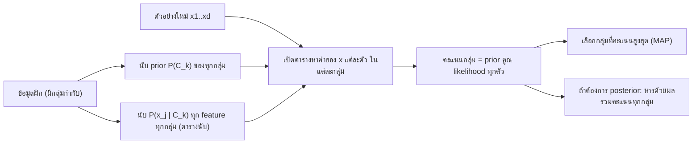

# บทที่ 5 Naive Bayes Classification

Naive Bayes คือการจำแนกประเภทด้วยกฎของเบย์ (Bayes' rule) โดยกลับคำถามจาก "เห็น feature แบบนี้ น่าจะเป็นกลุ่มไหน" ไปเป็น "ถ้าเป็นกลุ่มนี้ จะเห็น feature แบบนี้บ่อยแค่ไหน" แล้วสมมติอย่างกล้าหาญ (naive) ว่า feature แต่ละตัวเป็นอิสระต่อกันเมื่อรู้กลุ่มแล้ว ทำให้การคำนวณที่ปกติต้องใช้ข้อมูลมหาศาลเหลือแค่การนับและการคูณ

**วิธีอ่าน:** ส่วนที่ 0 ถึง 2 ปูพื้นความน่าจะเป็นและที่มาของกฎของเบย์ ส่วนที่ 3 ใช้กฎของเบย์กับ feature ตัวเดียว ส่วนที่ 4 และ 5 คือหัวใจของบท อธิบายว่าทำไมหลาย feature จึงยาก และสมมติฐาน naive แก้อย่างไร พร้อมตัวอย่างคำนวณครบทุกขั้น ส่วนที่ 6 ว่าด้วยข้อดีข้อเสีย ส่วนที่ 7 คือ feature ต่อเนื่อง (Gaussian) ส่วนที่ 8 คือปัญหาความน่าจะเป็นเป็นศูนย์และ Laplace correction ส่วนที่ 9 คือการคำนวณในสเกล log ที่ใช้จริงในโปรแกรม ส่วนที่ 10 เป็นสคริปต์ Python ที่สร้างตัวเลขทุกตัวในบทซ้ำได้ ตัวเลขในตัวอย่างคำนวณด้วยมือเป็นเศษส่วนก่อน แล้วตรวจด้วยการรันสคริปต์จริง บทนี้ต่อจากบทที่ 4 (logistic regression) ซึ่งเป็นตัวจำแนกอีกแบบที่จะใช้เปรียบเทียบตลอดบท

---

## ส่วนที่ 0 ปูพื้นฐาน: ศัพท์ที่ต้องรู้ก่อน

| ศัพท์ที่วิชาใช้ | ศัพท์ทางการ/คำพ้อง | ความหมายสั้น |
|---|---|---|
| Classification | การจำแนกประเภท | งานที่ $y$ เป็นกลุ่ม (class) เช่น M/F, spam/ไม่ spam |
| Class $C_k$ | กลุ่มที่ $k$ | ค่าที่เป็นไปได้ของ $y$ มีทั้งหมด $K$ กลุ่ม |
| Feature $x_j$ | Attribute, ตัวแปรต้น | คอลัมน์ข้อมูลที่ใช้ทำนาย มีทั้งหมด $d$ ตัว |
| $P(A)$ | Probability | ความน่าจะเป็นที่เหตุการณ์ $A$ เกิด อยู่ระหว่าง 0 ถึง 1 |
| $P(A \cap B)$ | Joint probability | ความน่าจะเป็นที่ $A$ และ $B$ เกิดพร้อมกัน |
| $P(A \mid B)$ | Conditional probability | ความน่าจะเป็นของ $A$ เมื่อรู้แล้วว่า $B$ เกิด อ่านว่า "$A$ given $B$" |
| Prior $P(Y)$ | ความน่าจะเป็นก่อน | ความเชื่อเรื่องกลุ่มก่อนเห็น feature ของตัวอย่างนี้ |
| Likelihood $P(X \mid Y)$ | ภาวะน่าจะเป็น | ถ้าเป็นกลุ่ม $Y$ จะเห็น feature $X$ แบบนี้บ่อยแค่ไหน |
| Evidence $P(X)$ | Marginal probability | ความน่าจะเป็นที่เห็น $X$ แบบนี้ในประชากรทั้งหมด ไม่สนกลุ่ม |
| Posterior $P(Y \mid X)$ | ความน่าจะเป็นหลัง | ความน่าจะเป็นของกลุ่มหลังเห็น feature แล้ว คือคำตอบที่ต้องการ |
| Independence | ความเป็นอิสระ | รู้ค่าตัวหนึ่งแล้วไม่ช่วยทายอีกตัว |
| Conditional independence | อิสระแบบมีเงื่อนไข | เป็นอิสระต่อกันเมื่อรู้กลุ่มแล้ว (สมมติฐาน naive) |
| Gaussian distribution | Normal distribution, การแจกแจงปกติ | รูประฆังคว่ำ กำหนดด้วยค่าเฉลี่ย $\mu$ และส่วนเบี่ยงเบนมาตรฐาน $\sigma$ |
| Laplacian correction | Laplace smoothing, add-one smoothing | บวก 1 ให้ทุกช่องที่นับ เพื่อไม่ให้มีความน่าจะเป็นเป็นศูนย์ |

ข้อตกลงเรื่องสัญลักษณ์: ข้อมูลเขียนเป็น $X \in \mathbb{R}^{N \times d}$ คือมี $N$ แถว (ตัวอย่าง) และ $d$ คอลัมน์ (feature) ค่าของแถวที่ $i$ คือ $y_i \in \{C_1, C_2, \ldots, C_K\}$ ตัวอักษร $Y$ ใช้แทนกลุ่ม ตัวอักษร $X$ หรือ $x_1, \ldots, x_d$ ใช้แทนค่า feature ของตัวอย่างที่กำลังทำนาย ตัวห้อย $k$ ใช้กับกลุ่ม ตัวห้อย $j$ ใช้กับ feature

พื้นฐานที่ต้องใช้มีสามเรื่อง

1. **ความน่าจะเป็นจากการนับ:** ถ้าข้อมูลมี 8 คน เป็นผู้หญิง 5 คน ประมาณ $P(F) = 5/8$ ทั้งบทนี้ประมาณความน่าจะเป็นด้วยสัดส่วนในข้อมูลฝึก
2. **การคูณเศษส่วน:** $\frac{a}{b} \cdot \frac{c}{d} = \frac{ac}{bd}$ และการตัดทอน เช่น $\frac{1}{3} \cdot \frac{3}{8} = \frac{1}{8}$
3. **ลอการิทึม:** $\ln(ab) = \ln a + \ln b$ ใช้ในส่วนที่ 9 (ทบทวนได้จากบทที่ 4 ส่วนที่ 0)

---

## ส่วนที่ 1 ทำไมต้องมี Naive Bayes

### 1.1 ทบทวนงาน classification

งาน classification คือ เมื่อมีข้อมูล $X$ ที่มี $N$ แถว $d$ feature และแต่ละแถวมีกลุ่ม $y_i$ กำกับไว้ ต้องสร้างกติกาที่รับ feature ของตัวอย่างใหม่แล้วบอกว่าเป็นกลุ่มไหน ตัวอย่างงานจริง

- **Churn prediction:** ลูกค้ารายนี้จะยกเลิกบริการหรือไม่ จากประวัติการใช้งานและการร้องเรียน
- **Stock prediction:** ราคาหุ้นพรุ่งนี้จะขึ้นหรือลง (เป็นการแปลงงานพยากรณ์ตัวเลขให้เป็นสองกลุ่ม)
- **Email classification:** อีเมลนี้เป็น spam หรือไม่ จากคำที่ปรากฏในอีเมล งานนี้เป็นงานคลาสสิกของ Naive Bayes ([scikit-learn: Naive Bayes](https://scikit-learn.org/stable/modules/naive_bayes.html))

### 1.2 สองวิธีคิดในการจำแนก

บทที่ 4 สร้างโมเดลที่ให้ $P(y = 1 \mid x)$ **โดยตรง** ด้วย $\sigma(\theta^{T}x)$ แล้วใช้ gradient descent หา $\theta$ วิธีนี้เรียกว่า discriminative คือเรียนเส้นแบ่งระหว่างกลุ่ม

Naive Bayes คิดอีกแบบ คือเรียนว่า **แต่ละกลุ่มมีหน้าตาอย่างไร** เช่น ผู้ชายในข้อมูลมีสัดส่วนผมสั้นเท่าไร สูงเกิน 170 เท่าไร แล้วเมื่อเจอตัวอย่างใหม่ ถามว่า "ตัวอย่างนี้หน้าตาคล้ายกลุ่มไหนมากกว่า เมื่อคิดรวมกับว่ากลุ่มนั้นพบบ่อยแค่ไหน" วิธีนี้เรียกว่า generative เพราะโมเดลอธิบายได้ว่าข้อมูลของแต่ละกลุ่มถูก "สร้าง" มาอย่างไร เครื่องมือที่ใช้กลับทิศคำถามจาก "กลุ่มเมื่อรู้ feature" ไปเป็น "feature เมื่อรู้กลุ่ม" คือกฎของเบย์

| | Logistic regression (บทที่ 4) | Naive Bayes (บทนี้) |
|---|---|---|
| สิ่งที่เรียน | $P(y \mid x)$ โดยตรง | $P(y)$ และ $P(x_j \mid y)$ ของแต่ละ feature |
| วิธีหาพารามิเตอร์ | วนซ้ำด้วย gradient descent | นับ (หรือหาค่าเฉลี่ยและความแปรปรวน) รอบเดียว |
| สมมติฐานหลัก | log-odds เป็นเส้นตรงของ feature | feature อิสระต่อกันเมื่อรู้กลุ่ม |
| ความเร็วในการฝึก | ต้องวนหลายรอบ | ผ่านข้อมูลรอบเดียว |

### สรุปหัวข้อ

- Classification คือการทำนายกลุ่ม $y_i \in \{C_1, \ldots, C_K\}$ จาก feature $d$ ตัว
- Naive Bayes เรียนว่าแต่ละกลุ่มมีหน้าตาอย่างไร แล้วใช้กฎของเบย์กลับทิศเป็นความน่าจะเป็นของกลุ่ม
- การฝึกคือการนับ จึงเร็วมาก

---

## ส่วนที่ 2 ความน่าจะเป็นแบบมีเงื่อนไขและที่มาของกฎของเบย์

### 2.1 ข้อมูลตัวอย่างที่ใช้ตลอดบท

ข้อมูล 8 คน แต่ละคนมีชื่อ ความสูงเกิน 170 cm หรือไม่ สีตา ความยาวผม และเพศ (คอลัมน์ความสูงเป็นเซนติเมตรจะเพิ่มเข้ามาในส่วนที่ 7)

| คนที่ | $x_1$ ชื่อ | $x_2$ สูงเกิน 170 | $x_3$ สีตา | $x_4$ ผม | $y$ เพศ |
|---|---|---|---|---|---|
| 1 | Drew | No | Blue | Short | M |
| 2 | Claudia | Yes | Brown | Long | F |
| 3 | Drew | No | Blue | Long | F |
| 4 | Drew | No | Blue | Long | F |
| 5 | Alberto | Yes | Brown | Short | M |
| 6 | Karin | No | Blue | Long | F |
| 7 | Nina | Yes | Brown | Short | F |
| 8 | Sergio | Yes | Blue | Long | M |

นับไว้ก่อน: ผู้ชาย (M) 3 คน คือคนที่ 1, 5, 8 ผู้หญิง (F) 5 คน คือคนที่ 2, 3, 4, 6, 7 ชื่อ Drew มี 3 คน เป็นชาย 1 หญิง 2

### 2.2 Conditional probability คือการย่อประชากร

$P(Y \mid X)$ คือความน่าจะเป็นของ $Y$ เมื่อรู้แล้วว่า $X$ เกิด วิธีคิดที่ง่ายที่สุดคือ **ตัดประชากรให้เหลือเฉพาะคนที่ $X$ เป็นจริง แล้วนับสัดส่วนของ $Y$ ในกลุ่มที่เหลือ** เช่น $P(F \mid \mathrm{Drew})$ คือ ในบรรดาคนชื่อ Drew 3 คน เป็นผู้หญิงกี่ส่วน คำตอบคือ $2/3$

เขียนเป็นสูตร

$$P(Y \mid X) = \frac{P(Y \cap X)}{P(X)} \qquad (1)$$

ตัวเศษคือความน่าจะเป็นที่ทั้งสองอย่างเกิดพร้อมกัน ตัวส่วนคือความน่าจะเป็นของเงื่อนไข การหารด้วย $P(X)$ คือการย่อประชากรให้เหลือเฉพาะส่วนที่ $X$ เกิด ตรวจกับตัวอย่าง: $P(F \cap \mathrm{Drew}) = 2/8$ (หญิงชื่อ Drew 2 คนจาก 8) และ $P(\mathrm{Drew}) = 3/8$ หารกันได้ $\frac{2/8}{3/8} = 2/3$ ตรงกับการนับตรง

ข้อควรระวัง: $P(Y \mid X)$ กับ $P(X \mid Y)$ **ไม่ใช่สิ่งเดียวกัน** $P(F \mid \mathrm{Drew}) = 2/3$ (คนชื่อ Drew เป็นหญิงสองในสาม) แต่ $P(\mathrm{Drew} \mid F) = 2/5$ (ผู้หญิงชื่อ Drew สองในห้า) ตัวส่วนต่างกัน เพราะประชากรที่ย่อต่างกัน

### 2.3 ที่มาของกฎของเบย์ทีละขั้น

เขียน conditional probability อีกทิศหนึ่ง

$$P(X \mid Y) = \frac{P(X \cap Y)}{P(Y)} \qquad (2)$$

คูณ $P(Y)$ ทั้งสองข้างของ (2)

$$P(X \mid Y)P(Y) = P(X \cap Y) \qquad (3)$$

"$X$ และ $Y$ เกิดพร้อมกัน" กับ "$Y$ และ $X$ เกิดพร้อมกัน" คือเหตุการณ์เดียวกัน ดังนั้น

$$P(X \mid Y)P(Y) = P(X \cap Y) = P(Y \cap X) \qquad (4)$$

แทน $P(Y \cap X)$ จาก (4) ลงในตัวเศษของ (1) ได้กฎของเบย์

$$P(Y \mid X) = \frac{P(X \mid Y)P(Y)}{P(X)} \qquad (5)$$

ความหมายของการพิสูจน์นี้: กฎของเบย์ไม่ใช่สมมติฐาน มันเป็นผลทางพีชคณิตของนิยาม conditional probability จึงถูกต้องเสมอ สิ่งที่ทำให้ Naive Bayes "naive" คือสมมติฐานที่เพิ่มเข้ามาในส่วนที่ 5 ไม่ใช่ตัวกฎนี้

### 2.4 ทำไมต้องกลับทิศ

ถ้า $P(Y \mid X)$ คือสิ่งที่ต้องการ ทำไมไม่นับตรงๆ เหมือนในข้อ 2.2 คำตอบคือ เมื่อมี feature หลายตัว ตัวอย่างใหม่มักมีค่า feature **ผสมกันแบบที่ไม่เคยเห็นในข้อมูล** เช่น ชื่อ Drew, ไม่สูงเกิน 170, ตาน้ำตาล, ผมสั้น ไม่มีใครในข้อมูล 8 คนที่ตรงทั้งสี่ค่า การนับตรงจึงได้ $0/0$ ส่วนการกลับทิศเป็น $P(X \mid Y)$ เปิดทางให้แยก $X$ ออกเป็นชิ้นตาม feature แล้วนับทีละชิ้น ซึ่งเป็นสิ่งที่ส่วนที่ 5 ทำ

### สรุปหัวข้อ

- $P(Y \mid X) = P(Y \cap X)/P(X)$ คือการย่อประชากรให้เหลือส่วนที่ $X$ เกิด
- $P(Y \mid X) \neq P(X \mid Y)$ เพราะตัวส่วนต่างกัน
- กฎของเบย์ $P(Y \mid X) = \frac{P(X \mid Y)P(Y)}{P(X)}$ พิสูจน์ได้จากนิยามใน 4 ขั้น

---

## ส่วนที่ 3 กฎของเบย์และส่วนประกอบสี่ตัว

### 3.1 ส่วนประกอบ

$$\underbrace{P(Y \mid X)}_{\mathrm{Posterior}} = \frac{\underbrace{P(X \mid Y)}_{\mathrm{Likelihood}} \cdot \underbrace{P(Y)}_{\mathrm{Prior}}}{\underbrace{P(X)}_{\mathrm{Marginal}}}$$

| ส่วน | สัญลักษณ์ | ความหมาย | ในตัวอย่างชื่อ Drew | ประมาณจากข้อมูลอย่างไร |
|---|---|---|---|---|
| Posterior | $P(Y \mid X)$ | ความน่าจะเป็นของกลุ่ม $Y$ หลังเห็น $X$ เป็นคำตอบที่ต้องการ | คนชื่อ Drew เป็นหญิงด้วยความน่าจะเป็นเท่าไร | คำนวณจากอีกสามตัว |
| Prior | $P(Y)$ | ความเชื่อเรื่องกลุ่มก่อนดู feature | ในข้อมูลมีหญิง $5/8$ | สัดส่วนของกลุ่มในข้อมูลฝึก |
| Likelihood | $P(X \mid Y)$ | ถ้าเป็นกลุ่ม $Y$ จะเห็น $X$ บ่อยแค่ไหน | ผู้หญิงชื่อ Drew $2/5$ | นับภายในกลุ่ม |
| Marginal หรือ Evidence | $P(X)$ | ความน่าจะเป็นที่เห็น $X$ ในประชากรทั้งหมด | ชื่อ Drew $3/8$ | นับทั้งข้อมูล หรือรวมจากทุกกลุ่ม (ข้อ 3.3) |

ภาพในหัว: prior คือ "ปกติเจอกลุ่มนี้บ่อยแค่ไหน" likelihood คือ "หลักฐานที่เห็นเข้ากับกลุ่มนี้แค่ไหน" posterior คือการชั่งทั้งสองอย่างรวมกัน เหมือนแพทย์ที่ต้องคิดทั้งว่าอาการเข้ากับโรคไหน (likelihood) และโรคนั้นพบบ่อยแค่ไหนในประชากร (prior) อาการที่เข้ากับโรคหายากมากอาจยังไม่ใช่โรคนั้น เพราะ prior ต่ำ จุดที่อุปมานี้ไม่ตรงคือ แพทย์ใช้วิจารณญาณ ส่วน Naive Bayes ใช้ตัวเลขจากการนับเท่านั้น และเชื่อข้อมูลฝึกทั้งหมดว่าเป็นตัวแทนประชากร

ข้อควรระวังเรื่องคำว่า likelihood: ในสถิติ likelihood มักหมายถึง "ความน่าจะเป็นของข้อมูลที่เห็น มองเป็นฟังก์ชันของพารามิเตอร์" (เหมือนบทที่ 4 ส่วนที่ 7) ในกฎของเบย์ของบทนี้ "พารามิเตอร์" คือกลุ่ม $Y$ จึงอ่าน $P(X \mid Y)$ ว่า โอกาสที่จะเห็นตัวอย่าง $X$ เมื่อกลุ่มเป็น $Y$

### 3.2 Worked example: ทายเพศของ Drew จาก feature ชื่ออย่างเดียว

โจทย์: มีคนใหม่ชื่อ Drew ใช้เฉพาะคอลัมน์ชื่อ (8 แถวแรกของตารางในข้อ 2.1) ทายว่าเป็นเพศอะไร

**ขั้น 1 prior:** $P(M) = 3/8$, $P(F) = 5/8$

**ขั้น 2 likelihood:** ผู้ชาย 3 คน ชื่อ Drew 1 คน ได้ $P(\mathrm{Drew} \mid M) = 1/3$ ผู้หญิง 5 คน ชื่อ Drew 2 คน ได้ $P(\mathrm{Drew} \mid F) = 2/5$

**ขั้น 3 evidence:** คนชื่อ Drew 3 คนจาก 8 ได้ $P(\mathrm{Drew}) = 3/8$

**ขั้น 4 posterior:**

$$P(M \mid \mathrm{Drew}) = \frac{P(\mathrm{Drew} \mid M) \cdot P(M)}{P(\mathrm{Drew})} = \frac{\frac{1}{3} \cdot \frac{3}{8}}{\frac{3}{8}} = \frac{1/8}{3/8} = \frac{1}{3}$$

$$P(F \mid \mathrm{Drew}) = \frac{P(\mathrm{Drew} \mid F) \cdot P(F)}{P(\mathrm{Drew})} = \frac{\frac{2}{5} \cdot \frac{5}{8}}{\frac{3}{8}} = \frac{2/8}{3/8} = \frac{2}{3}$$

**ขั้น 5 ตัดสิน:** $2/3 > 1/3$ ทายว่าเป็น **หญิง**

**ตรวจผล:** posterior สองกลุ่มรวมกันได้ $1/3 + 2/3 = 1$ ตามที่ควรเป็น และตรงกับการนับตรงในข้อ 2.2 (คนชื่อ Drew 3 คน เป็นหญิง 2) ซึ่งเป็นเรื่องที่คาดไว้ เพราะเมื่อมี feature เดียว กฎของเบย์ให้ผลเท่ากับการนับตรง ประโยชน์ของการกลับทิศจะเห็นชัดเมื่อมีหลาย feature

**การตีความ:** สังเกตว่า likelihood ของสองกลุ่มต่างกันไม่มาก ($1/3$ กับ $2/5$) ผลที่เอียงไปทางหญิงชัดเจนมาจาก prior ด้วย เพราะผู้หญิงมีมากกว่าในข้อมูล

### 3.3 Evidence คำนวณจากทุกกลุ่มรวมกัน

ไม่จำเป็นต้องนับ $P(X)$ แยก เพราะตัวอย่างที่มีค่า $X$ ต้องอยู่ในกลุ่มใดกลุ่มหนึ่ง จึงรวมจากทุกกลุ่มได้ (กฎความน่าจะเป็นรวม law of total probability)

$$P(X) = \sum_{k=1}^{K} P(X \mid C_k) \cdot P(C_k)$$

เมื่อ $K$ คือจำนวนกลุ่ม ตรวจกับตัวอย่าง: $\frac{1}{3} \cdot \frac{3}{8} + \frac{2}{5} \cdot \frac{5}{8} = \frac{1}{8} + \frac{2}{8} = \frac{3}{8}$ ตรงกับการนับ

ผลที่สำคัญมาก: ตัวส่วน $P(X)$ คือ **ผลรวมของตัวเศษของทุกกลุ่ม** ดังนั้น posterior คือ "ตัวเศษของกลุ่มนี้ หารด้วยผลรวมตัวเศษของทุกกลุ่ม" ทำให้ posterior รวมกันได้ 1 เสมอ

### 3.4 การตัดสินใจไม่ต้องใช้ evidence

เพราะ $P(X)$ เป็นตัวเลขเดียวกันสำหรับทุกกลุ่ม (ขึ้นกับ $X$ ไม่ขึ้นกับ $Y$) กลุ่มที่มีตัวเศษ $P(X \mid Y)P(Y)$ มากที่สุดก็คือกลุ่มที่มี posterior มากที่สุด กฎการตัดสินจึงเขียนได้ว่า

$$\hat{y} = \mathrm{argmax}_{k} \ P(X \mid C_k) \cdot P(C_k)$$

อ่านว่า เลือกกลุ่ม $C_k$ ที่ทำให้ likelihood คูณ prior มากที่สุด กฎนี้เรียกว่า maximum a posteriori (MAP) ([scikit-learn: Naive Bayes](https://scikit-learn.org/stable/modules/naive_bayes.html)) ในตัวอย่าง Drew เทียบแค่ $1/8$ กับ $2/8$ ก็รู้คำตอบแล้ว evidence จำเป็นเฉพาะเมื่อต้องการตัวเลข posterior ที่รวมกันได้ 1

### สรุปหัวข้อ

- Posterior $=$ Likelihood $\times$ Prior $/$ Evidence
- Prior และ likelihood ประมาณด้วยการนับ evidence $= \sum_k P(X \mid C_k)P(C_k)$
- ตัดสินกลุ่มด้วย $\mathrm{argmax}_k P(X \mid C_k)P(C_k)$ ไม่ต้องหารด้วย evidence
- ตัวอย่างชื่อ Drew: $P(M \mid \mathrm{Drew}) = 1/3$, $P(F \mid \mathrm{Drew}) = 2/3$ ทายว่าหญิง

---

## ส่วนที่ 4 หลาย feature: ปัญหาของ likelihood ร่วม

### 4.1 โจทย์

ใช้ทั้งสี่ feature ทายเพศของคนใหม่ที่มี $x_1 = \mathrm{Drew}$, $x_2 = \mathrm{No}$ (ไม่สูงเกิน 170), $x_3 = \mathrm{Brown}$, $x_4 = \mathrm{Short}$ กฎของเบย์ยังเหมือนเดิม เพียงแค่ $X$ กลายเป็นค่าสี่ตัวพร้อมกัน

$$P(Y \mid x_1, x_2, x_3, x_4) = \frac{P(x_1, x_2, x_3, x_4 \mid Y) \cdot P(Y)}{P(x_1, x_2, x_3, x_4)}$$

prior ยังหาได้ง่ายเหมือนเดิม ปัญหาอยู่ที่ likelihood $P(x_1, x_2, x_3, x_4 \mid Y)$ ซึ่งเป็นความน่าจะเป็น **ร่วม** ของสี่ค่า ถ้านับตรงๆ ในผู้ชาย 3 คน ไม่มีใครเป็น (Drew, No, Brown, Short) เลย ในผู้หญิง 5 คนก็ไม่มี ได้ likelihood เป็นศูนย์ทั้งสองกลุ่ม ตัดสินอะไรไม่ได้

### 4.2 Chain rule: เขียน likelihood ร่วมให้ถูกต้องโดยไม่สมมติอะไร

ใช้นิยาม conditional probability ซ้ำๆ (สมการ (3) ในส่วนที่ 2) แยกความน่าจะเป็นร่วมออกเป็นผลคูณของความน่าจะเป็นแบบมีเงื่อนไข

$$P(x_1, x_2, \ldots, x_d \mid Y) = P(x_1 \mid Y) \, P(x_2 \mid x_1, Y) \, P(x_3 \mid x_2, x_1, Y) \cdots P(x_d \mid x_{d-1}, \ldots, x_1, Y)$$

อ่านทีละตัว: ความน่าจะเป็นของ $x_1$ เมื่อรู้กลุ่ม คูณความน่าจะเป็นของ $x_2$ เมื่อรู้ทั้งกลุ่มและ $x_1$ คูณความน่าจะเป็นของ $x_3$ เมื่อรู้กลุ่ม $x_1$ และ $x_2$ ไปเรื่อยๆ สมการนี้ถูกต้องเสมอ ไม่มีสมมติฐาน feature ขึ้นต่อกันอย่างไรก็ได้

ตัวอย่างความหมาย: $P(x_2 = \mathrm{No} \mid x_1 = \mathrm{Drew}, Y = M)$ คือ ในบรรดาผู้ชายชื่อ Drew มีกี่ส่วนที่ไม่สูงเกิน 170 พจน์ท้ายๆ จะเป็นแบบ "ในบรรดาผู้ชายชื่อ Drew ที่ไม่สูงเกิน 170 และตาน้ำตาล มีกี่ส่วนที่ผมสั้น" ซึ่งเงื่อนไขซ้อนจนแทบไม่มีข้อมูลเหลือให้นับ

### 4.3 ต้องรู้กี่ตัวเลข

ถ้า feature ทั้ง $d$ ตัวเป็นแบบสองค่า (เช่น Yes/No) ค่าที่ผสมกันได้มี $2^{d}$ แบบ การรู้การแจกแจงร่วมให้ครบในหนึ่งกลุ่มต้องรู้ความน่าจะเป็นของทุกแบบ แต่ทุกแบบรวมกันต้องได้ 1 ตัวสุดท้ายจึงหาจากตัวอื่นได้ เหลือ **$2^{d} - 1$ ตัวเลขต่อกลุ่ม** ที่ต้องประมาณจากข้อมูล

| จำนวน feature $d$ | ต้องประมาณต่อกลุ่ม (แบบร่วม) $2^{d} - 1$ | ต้องประมาณต่อกลุ่ม (แบบ naive) $d$ |
|---|---|---|
| 4 | 15 | 4 |
| 10 | 1,023 | 10 |
| 30 | 1,073,741,823 | 30 |

(คอลัมน์ขวาอธิบายในส่วนที่ 5: แบบ naive ต้องการ $P(x_j = \mathrm{Yes} \mid Y)$ หนึ่งตัวต่อ feature เพราะ $P(x_j = \mathrm{No} \mid Y) = 1 - P(x_j = \mathrm{Yes} \mid Y)$)

ที่ 30 feature ต้องประมาณเกินพันล้านตัวเลขต่อกลุ่ม การจะประมาณแต่ละตัวได้น่าเชื่อถือต้องมีข้อมูลหลายตัวอย่างต่อแบบ ซึ่งไม่มีข้อมูลจริงชุดไหนมีพอ ปัญหานี้คือรูปหนึ่งของ curse of dimensionality (ยิ่งมิติมาก ข้อมูลยิ่งกระจายบางจนเรียนไม่ได้)

### สรุปหัวข้อ

- หลาย feature ทำให้ likelihood เป็นความน่าจะเป็นร่วม ซึ่งนับตรงๆ มักได้ศูนย์ เพราะค่าที่ผสมกันไม่เคยเห็น
- Chain rule เขียน likelihood ร่วมได้ถูกต้องเสมอ แต่ต้องประมาณ $2^{d} - 1$ ตัวเลขต่อกลุ่ม (feature สองค่า) โตแบบเอ็กซ์โพเนนเชียล
- ต้องมีสมมติฐานมาลดจำนวนตัวเลขที่ต้องประมาณ

---

## ส่วนที่ 5 สมมติฐาน Naive และการคำนวณครบวงจร

### 5.1 สมมติฐาน: อิสระต่อกันเมื่อรู้กลุ่ม

Naive Bayes สมมติว่า **feature ทุกตัวเป็นอิสระต่อกันแบบมีเงื่อนไขเมื่อรู้กลุ่ม** (conditionally independent given the class) แปลว่า เมื่อรู้แล้วว่าเป็นกลุ่ม $Y$ การรู้ค่า feature ตัวอื่นไม่ช่วยทาย feature ตัวนี้เพิ่มเลย เขียนเป็นสูตรคือ

$$P(x_j \mid x_1, \ldots, x_{j-1}, Y) = P(x_j \mid Y)$$

เมื่อแทนลงใน chain rule ของข้อ 4.2 เงื่อนไขที่ซ้อนกันทั้งหมดหายไป เหลือแค่กลุ่ม

$$P(x_1, x_2, \ldots, x_d \mid Y) = P(x_1 \mid Y) \cdot P(x_2 \mid Y) \cdots P(x_d \mid Y) = \prod_{j=1}^{d} P(x_j \mid Y)$$

และกฎการตัดสินในข้อ 3.4 กลายเป็น

$$\hat{y} = \mathrm{argmax}_{k} \ P(C_k) \prod_{j=1}^{d} P(x_j \mid C_k)$$

ทุกพจน์ $P(x_j \mid C_k)$ นับได้ทีละคอลัมน์ภายในกลุ่ม ไม่ต้องหาตัวอย่างที่ตรงทุกค่าพร้อมกัน จำนวนตัวเลขที่ต้องประมาณจึงลดจาก $2^{d} - 1$ เหลือ $d$ ต่อกลุ่ม (feature สองค่า) ตามตารางในข้อ 4.3

### 5.2 ความเป็นอิสระแบบมีเงื่อนไขไม่ใช่ความเป็นอิสระธรรมดา

นิยาม (สิ่งที่สมมติ): ภายในกลุ่มเดียวกัน feature ไม่เกี่ยวข้องกัน

สิ่งที่ **ไม่ได้** สมมติ: ไม่ได้สมมติว่า feature ไม่เกี่ยวข้องกันเลยในประชากรรวม ตัวอย่างเช่น ในประชากรทั้งหมด "สูงเกิน 170" กับ "ผมสั้น" อาจไปด้วยกัน เพราะทั้งสองอย่างพบในผู้ชายมากกว่า ความเกี่ยวข้องนี้มาจากเพศ ถ้ามองภายในผู้ชายด้วยกันแล้ว ความสูงกับความยาวผมอาจไม่เกี่ยวกันเลย กรณีแบบนี้สมมติฐาน naive เป็นจริง ทั้งที่ในประชากรรวมสอง feature สัมพันธ์กัน

กรณีที่สมมติฐานผิดชัดเจน คือ feature ที่ยังสัมพันธ์กันแม้อยู่ในกลุ่มเดียวกัน เช่น "สูงเกิน 170" กับ "ความสูงเป็นเซนติเมตร" (ตัวหนึ่งคำนวณจากอีกตัว) หรือคำว่า "free" กับ "money" ในอีเมล spam ที่มักมาคู่กัน ส่วนที่ 6 จะแสดงว่าเกิดอะไรขึ้นในกรณีนี้

### 5.3 Worked example: ทายเพศจากสี่ feature

ตัวอย่างใหม่: $x_1 = \mathrm{Drew}$, $x_2 = \mathrm{No}$, $x_3 = \mathrm{Brown}$, $x_4 = \mathrm{Short}$

**ขั้น 1 แยกข้อมูลตามกลุ่ม**

| กลุ่ม | คนที่ | ชื่อ | สูงเกิน 170 | สีตา | ผม |
|---|---|---|---|---|---|
| M (3 คน) | 1, 5, 8 | Drew, Alberto, Sergio | No, Yes, Yes | Blue, Brown, Blue | Short, Short, Long |
| F (5 คน) | 2, 3, 4, 6, 7 | Claudia, Drew, Drew, Karin, Nina | Yes, No, No, No, Yes | Brown, Blue, Blue, Blue, Brown | Long, Long, Long, Long, Short |

**ขั้น 2 นับ likelihood ทีละ feature ในกลุ่มชาย**

| พจน์ | นับ | ค่า |
|---|---|---|
| $P(x_1 = \mathrm{Drew} \mid M)$ | Drew 1 ใน 3 | $1/3$ |
| $P(x_2 = \mathrm{No} \mid M)$ | No 1 ใน 3 (คนที่ 1) | $1/3$ |
| $P(x_3 = \mathrm{Brown} \mid M)$ | Brown 1 ใน 3 (คนที่ 5) | $1/3$ |
| $P(x_4 = \mathrm{Short} \mid M)$ | Short 2 ใน 3 (คนที่ 1, 5) | $2/3$ |

ผลคูณ likelihood $= \frac{1}{3} \cdot \frac{1}{3} \cdot \frac{1}{3} \cdot \frac{2}{3} = \frac{2}{81}$ คูณ prior $P(M) = 3/8$ ได้

$$\frac{2}{81} \cdot \frac{3}{8} = \frac{6}{648} = \frac{1}{108} \approx 0.009259$$

**ขั้น 3 นับ likelihood ทีละ feature ในกลุ่มหญิง**

| พจน์ | นับ | ค่า |
|---|---|---|
| $P(x_1 = \mathrm{Drew} \mid F)$ | Drew 2 ใน 5 (คนที่ 3, 4) | $2/5$ |
| $P(x_2 = \mathrm{No} \mid F)$ | No 3 ใน 5 (คนที่ 3, 4, 6) | $3/5$ |
| $P(x_3 = \mathrm{Brown} \mid F)$ | Brown 2 ใน 5 (คนที่ 2, 7) | $2/5$ |
| $P(x_4 = \mathrm{Short} \mid F)$ | Short 1 ใน 5 (คนที่ 7) | $1/5$ |

ผลคูณ likelihood $= \frac{2}{5} \cdot \frac{3}{5} \cdot \frac{2}{5} \cdot \frac{1}{5} = \frac{12}{625}$ คูณ prior $P(F) = 5/8$ ได้

$$\frac{12}{625} \cdot \frac{5}{8} = \frac{60}{5000} = \frac{3}{250} = 0.012$$

**ขั้น 4 ตัดสินด้วย MAP:** $0.012 > 0.009259$ ทายว่าเป็น **หญิง (F)**

**ขั้น 5 คำนวณ posterior (normalize):** evidence คือผลรวมของสองตัวเลข $0.009259 + 0.012 = 0.021259$

$$P(M \mid x_1, x_2, x_3, x_4) = \frac{0.009259}{0.021259} \approx 0.4355$$

$$P(F \mid x_1, x_2, x_3, x_4) = \frac{0.012}{0.021259} \approx 0.5645$$

ถ้าคิดเป็นเศษส่วนตรงๆ: $\frac{1}{108} = \frac{125}{13500}$ และ $\frac{3}{250} = \frac{162}{13500}$ ผลรวม $\frac{287}{13500}$ จึงได้ $P(M \mid x) = 125/287$ และ $P(F \mid x) = 162/287$ ซึ่งตรงกับผลจากสคริปต์ในส่วนที่ 10 (0.4355 และ 0.5645)

ข้อควรระวังเรื่องการปัดเศษ: ถ้าปัด $1/108$ เป็น 0.0092 ก่อนหาร จะได้ $0.0092/0.0212 \approx 0.434$ และ $0.012/0.0212 \approx 0.566$ ต่างจากค่าจริงที่ทศนิยมตำแหน่งที่สาม ในข้อสอบควรเก็บเศษส่วนไว้จนขั้นสุดท้าย หรือใช้ทศนิยมอย่างน้อยสี่ตำแหน่ง และไม่ว่าจะปัดอย่างไร ข้อสรุปยังเป็น **หญิง** เพราะกลุ่มที่ตัวเศษมากกว่าคือกลุ่มที่ posterior มากกว่าเสมอ

**ขั้น 6 ตรวจผลและตีความ:** posterior รวมกันได้ 1 ตามที่ควรเป็น เพื่อดูว่า feature ไหนดันคำตอบไปทางไหน ให้หารค่าของกลุ่ม F ด้วยกลุ่ม M ทีละพจน์ (ค่ามากกว่า 1 แปลว่าพจน์นั้นเข้าข้าง F)

| พจน์ | F | M | อัตราส่วน F/M | เข้าข้าง |
|---|---|---|---|---|
| Prior | $5/8$ | $3/8$ | 1.667 | F |
| ชื่อ Drew | $2/5$ | $1/3$ | 1.2 | F เล็กน้อย |
| ไม่สูงเกิน 170 | $3/5$ | $1/3$ | 1.8 | F |
| ตาน้ำตาล | $2/5$ | $1/3$ | 1.2 | F เล็กน้อย |
| ผมสั้น | $1/5$ | $2/3$ | 0.3 | M ชัดเจน |
| **ผลคูณ** | | | **1.296** | **F** |

ผลคูณ 1.296 คือ $0.012 / 0.009259$ พอดี การตีความ: ผมสั้นเป็นหลักฐานเดียวที่เข้าข้างผู้ชาย และเข้าข้างแรง (ผู้ชายผมสั้นบ่อยกว่าผู้หญิงสามเท่ากว่า) แต่หลักฐานเล็กๆ อีกสี่ตัวที่เข้าข้างผู้หญิงคูณกันแล้วชนะ คำตอบจึงเป็นหญิงด้วยความน่าจะเป็นราว 56% ซึ่งไม่ได้มั่นใจมาก ตารางแบบนี้ใช้อธิบายผลของ Naive Bayes ได้ดี เพราะผลรวมคือผลคูณของแต่ละพจน์ที่แยกดูได้

### 5.4 ภาพรวมการทำงาน



วิธีอ่านแผนภาพ: ครึ่งบนซ้ายคือการฝึก ซึ่งมีแค่การนับ ผลลัพธ์ของการฝึกคือตารางนับ (ไม่มี $\theta$ ไม่มี gradient descent) ครึ่งล่างคือการทำนาย ซึ่งเป็นการเปิดตารางแล้วคูณ เส้นจากการนับไปยังการทำนายแสดงว่าโมเดลทั้งหมดคือตารางนี้ ถ้าตารางมีช่องที่เป็นศูนย์ คะแนนทั้งกลุ่มจะเป็นศูนย์ (ส่วนที่ 8)

### สรุปหัวข้อ

- สมมติฐาน naive: $P(x_1, \ldots, x_d \mid Y) = \prod_j P(x_j \mid Y)$ คือ feature อิสระต่อกันเมื่อรู้กลุ่ม
- ทำนาย: $\hat{y} = \mathrm{argmax}_k P(C_k)\prod_j P(x_j \mid C_k)$ normalize เมื่อต้องการ posterior
- ตัวอย่าง (Drew, No, Brown, Short): คะแนน M $= 1/108 \approx 0.0093$, F $= 3/250 = 0.012$, posterior M $\approx 0.4355$, F $\approx 0.5645$ ทายว่า **หญิง**

---

## ส่วนที่ 6 ข้อดี ข้อเสีย และเมื่อสมมติฐานไม่จริง

### 6.1 ข้อดี

**เร็วทั้งตอนฝึกและตอนทำนาย:** การฝึกคือการนับหนึ่งรอบผ่านข้อมูล ใช้เวลาโตตาม $N \times d$ ไม่มีการวนซ้ำแบบ gradient descent การทำนายคือการเปิดตารางแล้วคูณ $d$ ตัวต่อกลุ่ม เพราะแต่ละ feature ถูกประมาณแยกเป็นการแจกแจงหนึ่งมิติ จึงลดปัญหาจากมิติที่สูง (curse of dimensionality) ได้ด้วย ([scikit-learn: Naive Bayes](https://scikit-learn.org/stable/modules/naive_bayes.html))

**รับข้อมูลที่ไหลเข้ามาเรื่อยๆ (streaming) ได้:** เพราะโมเดลคือตารางนับ เมื่อมีอีเมลใหม่ที่ผู้ใช้กดว่าเป็น spam ก็แค่บวกตัวนับของคำในอีเมลนั้นเข้าไปในกลุ่ม spam ไม่ต้องฝึกใหม่จากข้อมูลทั้งหมด ใน scikit-learn ทำได้ด้วยเมธอด `partial_fit` ซึ่งรับข้อมูลทีละก้อน เหมาะกับข้อมูลที่ใหญ่เกินหน่วยความจำด้วย ([scikit-learn: Naive Bayes](https://scikit-learn.org/stable/modules/naive_bayes.html)) งานกรองอีเมล spam จึงเป็นงานคลาสสิกของวิธีนี้

**ใช้ข้อมูลฝึกน้อย:** ต้องประมาณแค่ $d$ ตัวเลขต่อกลุ่มต่อค่าของ feature ไม่ใช่ $2^{d} - 1$ ข้อมูลไม่มากก็ประมาณได้พอสมควร

**อธิบายได้:** ดูอัตราส่วนทีละ feature แบบตารางในข้อ 5.3 ได้ว่าหลักฐานไหนดันไปทางไหน

### 6.2 ข้อเสียหลัก: สมมติฐานความเป็นอิสระ

สมมติฐานนี้ไม่จริงกับข้อมูลส่วนใหญ่ เมื่อ feature สองตัวพูดเรื่องเดียวกัน Naive Bayes จะ **นับหลักฐานเดียวกันซ้ำ** และมั่นใจเกินจริง

**ตัวอย่างที่เห็นผลชัด:** สมมติว่าระบบเก็บข้อมูลเผลอเก็บคอลัมน์ความยาวผมไว้สองคอลัมน์ ($x_4$ และ $x_5$ มีค่าเหมือนกันทุกแถว) ข้อมูลไม่ได้มีหลักฐานใหม่เลย แต่สมมติฐาน naive ถือว่าสองคอลัมน์อิสระต่อกัน จึงคูณ $P(\mathrm{Short} \mid Y)$ เข้าไปสองครั้ง

| | คะแนน M | คะแนน F | posterior M | ทาย |
|---|---|---|---|---|
| ข้อมูลเดิม (4 feature) | $1/108 \approx 0.009259$ | $0.012$ | 0.4355 | F |
| ผมซ้ำสองคอลัมน์ | $0.009259 \times \frac{2}{3} \approx 0.006173$ | $0.012 \times \frac{1}{5} = 0.0024$ | $\approx 0.72$ | M |

คำตอบพลิกจากหญิงเป็นชาย ทั้งที่ข้อมูลจริงไม่ได้เปลี่ยน สาเหตุคืออัตราส่วน 0.3 ของผมสั้นถูกนับสองครั้ง ($1.296 \times 0.3 \approx 0.39 < 1$) ในงานจริงไม่มีใครเก็บคอลัมน์ซ้ำตรงๆ แต่ feature ที่สัมพันธ์กันสูง เช่น "สูงเกิน 170" กับ "ความสูงเป็นเซนติเมตร" หรือรายได้กับภาษีที่จ่าย ก่อผลแบบเดียวกันในระดับที่น้อยกว่า ข้อแนะนำในทางปฏิบัติคือ ตัดหรือรวม feature ที่ซ้ำซ้อนกันก่อนใช้ Naive Bayes

### 6.3 สมมติฐานใช้ได้กับทุกชุดข้อมูลหรือไม่

คำตอบสั้นคือ **ไม่** สมมติฐานความเป็นอิสระแบบมีเงื่อนไขแทบไม่เคยเป็นจริงทุกประการในข้อมูลจริง แต่สิ่งที่น่าสนใจคือ Naive Bayes ยังจำแนกได้ดีในงานจริงหลายงาน โดยเฉพาะงานจำแนกเอกสารและกรอง spam ([scikit-learn: Naive Bayes](https://scikit-learn.org/stable/modules/naive_bayes.html)) เหตุผลมีสองข้อ

1. **การจำแนกต้องการแค่ลำดับ ไม่ต้องการตัวเลขที่ถูก:** กฎ MAP ดูแค่ว่ากลุ่มไหนคะแนนสูงสุด ถึงตัวเลข posterior จะเพี้ยนมาก (เช่น บอก 0.99 ทั้งที่จริงควรเป็น 0.7) ถ้ากลุ่มที่ชนะยังเป็นกลุ่มเดิม การจำแนกก็ยังถูก Domingos และ Pazzani แสดงว่า Naive Bayes อาจเป็นตัวจำแนกที่ดีที่สุดได้แม้สมมติฐานไม่จริง ภายใต้เงื่อนไขที่กว้างกว่าที่คนทั่วไปคิด ([Domingos and Pazzani, 1997](https://doi.org/10.1023/A:1007413511361))
2. **ความสัมพันธ์ที่หักล้างกัน:** Zhang อธิบายว่าสิ่งที่สำคัญไม่ใช่ว่ามีความสัมพันธ์ระหว่าง feature หรือไม่ แต่เป็นว่าความสัมพันธ์นั้นกระจายตัวต่างกันระหว่างกลุ่มอย่างไร ถ้าความสัมพันธ์ส่งผลไปทางกลุ่มต่างๆ ใกล้เคียงกัน หรือหักล้างกันเอง ผลต่อการจำแนกก็น้อย ([Zhang, 2004](https://www.cs.unb.ca/~hzhang/publications/FLAIRS04ZhangH.pdf))

ผลข้างเคียงที่ต้องรู้: เพราะเหตุผลข้อ 1 Naive Bayes จึงเป็น **ตัวจำแนกที่ดีแต่เป็นตัวประมาณความน่าจะเป็นที่ไม่ดี** ค่าจาก `predict_proba` มักเอียงไปทาง 0 หรือ 1 มากเกินจริง ไม่ควรนำไปใช้ตรงๆ ([scikit-learn: Naive Bayes](https://scikit-learn.org/stable/modules/naive_bayes.html)) ถ้างานต้องใช้ตัวเลขความน่าจะเป็น (เช่น จัดลำดับความเสี่ยงหรือคำนวณต้นทุนคาดหวัง) ต้องปรับเทียบ (calibrate) ก่อน หรือเลือกโมเดลอย่าง logistic regression

### 6.4 เมื่อไรควรใช้ เมื่อไรไม่ควร

| สถานการณ์ | Naive Bayes | เหตุผล |
|---|---|---|
| ข้อความ จำนวนคำ (feature) มาก ข้อมูลไม่มาก | เหมาะ | ประมาณแยกทีละ feature ทนมิติสูง ฝึกเร็ว |
| ข้อมูลไหลเข้าต่อเนื่อง ต้องอัปเดตบ่อย | เหมาะ | อัปเดตตารางนับได้ทันที |
| ต้องการ baseline เร็วๆ ก่อนลองโมเดลซับซ้อน | เหมาะ | ไม่มี hyperparameter มาก ฝึกเสร็จทันที |
| feature สัมพันธ์กันมาก หรือมีคอลัมน์ซ้ำซ้อน | ระวัง | นับหลักฐานซ้ำ มั่นใจเกินจริง |
| ต้องการตัวเลขความน่าจะเป็นที่ถูกต้อง | ไม่เหมาะ | ความน่าจะเป็นมักเพี้ยน ต้อง calibrate |
| ข้อมูลมากพอและ feature มีปฏิสัมพันธ์ซับซ้อน | มักแพ้โมเดลอื่น | logistic regression, tree-based model เรียนความสัมพันธ์ได้ดีกว่า |

### สรุปหัวข้อ

- ข้อดี: ฝึกและทำนายเร็ว, อัปเดตทีละส่วนได้ (streaming เช่น spam), ใช้ข้อมูลน้อย, อธิบายได้
- ข้อเสีย: สมมติว่า feature อิสระต่อกันเมื่อรู้กลุ่ม feature ที่ซ้ำซ้อนทำให้นับหลักฐานซ้ำจนคำตอบพลิกได้
- สมมติฐานไม่จริงกับข้อมูลส่วนใหญ่ แต่การจำแนกมักยังถูก เพราะ MAP ต้องการแค่ลำดับ ส่วนตัวเลขความน่าจะเป็นมักเพี้ยน

---

## ส่วนที่ 7 Feature ที่เป็นค่าต่อเนื่อง: Gaussian Naive Bayes

### 7.1 ปัญหา: นับไม่ได้

ตัวอย่างก่อนหน้านี้ทุก feature เป็นกลุ่มค่า (category) จึงประมาณ $P(x_j \mid Y)$ ด้วยการนับ แต่ถ้า feature เป็นตัวเลขต่อเนื่อง เช่น ความสูง 100, 101, 99, 120, ..., 160 cm การนับใช้ไม่ได้ เพราะคนใหม่ที่สูง 169.3 cm แทบไม่มีทางมีค่าตรงกับใครในข้อมูลฝึก การนับจะได้ศูนย์เกือบทุกครั้ง

ทางออกคือ **สมมติรูปร่างของการแจกแจง** ภายในแต่ละกลุ่ม ค่าที่นิยมที่สุดคือการแจกแจงปกติ (Gaussian) แล้วประมาณพารามิเตอร์ของรูปร่างนั้นจากข้อมูล แทนการนับทีละค่า

### 7.2 สูตร Gaussian probability density function

$$f(x) = \frac{1}{\sqrt{2\pi\sigma_k^{2}}} \, e^{-\frac{(x - \mu_k)^{2}}{2\sigma_k^{2}}}$$

นิยามสัญลักษณ์

- $x$ คือค่า feature ของตัวอย่างที่กำลังทำนาย เช่น ความสูง 169
- $\mu_k$ คือค่าเฉลี่ยของ feature นี้ **ในกลุ่ม $k$**
- $\sigma_k^{2}$ คือความแปรปรวนของ feature นี้ในกลุ่ม $k$ และ $\sigma_k$ คือส่วนเบี่ยงเบนมาตรฐาน
- $e \approx 2.7183$ และ $\pi \approx 3.1416$

สัญชาตญาณของสูตร: ส่วนที่อยู่ในเลขชี้กำลัง $\frac{(x - \mu_k)^{2}}{2\sigma_k^{2}}$ วัดว่า $x$ อยู่ห่างจากค่าเฉลี่ยของกลุ่มกี่เท่าของความกว้างของกลุ่ม ยิ่งห่างยิ่งมาก และ $e$ ยกกำลังลบของค่านี้จึงยิ่งเล็ก แปลว่า "ค่าที่ไกลจากค่ากลางของกลุ่มพบได้ยากในกลุ่มนั้น" ส่วนตัวคูณหน้า $\frac{1}{\sqrt{2\pi\sigma_k^{2}}}$ ทำให้พื้นที่ใต้กราฟรวมเป็น 1 กลุ่มที่กว้าง ($\sigma_k$ ใหญ่) จะมียอดเตี้ยกว่า เพราะต้องกระจายพื้นที่เท่ากันออกไปกว้างกว่า

ใน Naive Bayes ค่า $f(x)$ ใช้แทน $P(x_j \mid C_k)$ ในผลคูณ ส่วน $\mu_k$ และ $\sigma_k^{2}$ ประมาณจากข้อมูลของกลุ่มนั้น ([scikit-learn: Naive Bayes](https://scikit-learn.org/stable/modules/naive_bayes.html))

ข้อควรระวัง: $f(x)$ คือ **ความหนาแน่น (density)** ไม่ใช่ความน่าจะเป็น ความน่าจะเป็นของค่าต่อเนื่องที่จุดใดจุดหนึ่งพอดีเป็นศูนย์ ความหนาแน่นบอกว่าบริเวณรอบ $x$ หนาแน่นแค่ไหน มีค่าเกิน 1 ได้ถ้า $\sigma_k$ เล็กมาก แต่ใช้แทนในผลคูณได้ เพราะการเทียบระหว่างกลุ่มที่จุด $x$ เดียวกันยังสมเหตุสมผล

### 7.3 ขั้นตอน

1. **ตอนฝึก:** สำหรับทุกกลุ่ม $k$ และทุก feature ต่อเนื่อง หาค่าเฉลี่ย $\mu_k$ และความแปรปรวน $\sigma_k^{2}$ จากแถวที่อยู่ในกลุ่มนั้นเท่านั้น
2. **ตอนทำนาย:** แทน $x$ ลงในสูตรด้วย $\mu_k, \sigma_k^{2}$ ของแต่ละกลุ่ม ได้ $f_k(x)$
3. **รวมกับส่วนอื่น:** คูณ $f_k(x)$ กับ prior และกับ likelihood ของ feature อื่น (ที่อาจเป็นแบบนับ) แล้วเลือกกลุ่มที่คะแนนสูงสุดเหมือนเดิม

### 7.4 Worked example: ทายเพศจากความสูง

เพื่อสาธิต ขอเพิ่มคอลัมน์ความสูงสมมติให้ข้อมูล 8 คน โดยเลือกค่าให้สอดคล้องกับคอลัมน์ "สูงเกิน 170" เดิม

| คนที่ | 1 | 2 | 3 | 4 | 5 | 6 | 7 | 8 |
|---|---|---|---|---|---|---|---|---|
| เพศ | M | F | F | F | M | F | F | M |
| ความสูง (cm) | 168 | 172 | 160 | 158 | 178 | 165 | 171 | 182 |

โจทย์: คนใหม่สูง 169 cm ใช้ความสูงอย่างเดียว ทายว่าเป็นเพศอะไร

**ขั้น 1 พารามิเตอร์ของกลุ่มชาย** (168, 178, 182)

- $\mu_M = (168 + 178 + 182)/3 = 528/3 = 176$
- ส่วนต่างจากค่าเฉลี่ย: $-8, 2, 6$ ยกกำลังสอง: $64, 4, 36$ รวม $104$
- $\sigma_M^{2} = 104/3 \approx 34.667$ ได้ $\sigma_M \approx 5.888$

**ขั้น 2 พารามิเตอร์ของกลุ่มหญิง** (172, 160, 158, 165, 171)

- $\mu_F = 826/5 = 165.2$
- ส่วนต่าง: $6.8, -5.2, -7.2, -0.2, 5.8$ ยกกำลังสอง: $46.24, 27.04, 51.84, 0.04, 33.64$ รวม $158.8$
- $\sigma_F^{2} = 158.8/5 = 31.76$ ได้ $\sigma_F \approx 5.636$

**ขั้น 3 ความหนาแน่นที่ $x = 169$**

กลุ่มชาย: เลขชี้กำลัง $\frac{(169 - 176)^{2}}{2 \times 34.667} = \frac{49}{69.333} \approx 0.7067$ ได้ $e^{-0.7067} \approx 0.4933$ ตัวคูณหน้า $\frac{1}{\sqrt{2\pi \times 34.667}} = \frac{1}{\sqrt{217.82}} \approx 0.06776$

$$f_M(169) \approx 0.06776 \times 0.4933 \approx 0.03342$$

กลุ่มหญิง: เลขชี้กำลัง $\frac{(169 - 165.2)^{2}}{2 \times 31.76} = \frac{14.44}{63.52} \approx 0.2273$ ได้ $e^{-0.2273} \approx 0.7967$ ตัวคูณหน้า $\frac{1}{\sqrt{2\pi \times 31.76}} = \frac{1}{\sqrt{199.55}} \approx 0.07079$

$$f_F(169) \approx 0.07079 \times 0.7967 \approx 0.05640$$

**ขั้น 4 คูณ prior:** คะแนน M $= 0.03342 \times 3/8 \approx 0.012533$ คะแนน F $= 0.05640 \times 5/8 \approx 0.035247$

**ขั้น 5 ตัดสินและ normalize:** F มากกว่า ทายว่า **หญิง** posterior $P(F \mid 169) = \frac{0.035247}{0.035247 + 0.012533} \approx 0.7377$ และ $P(M \mid 169) \approx 0.2623$ ตรงกับ `GaussianNB` ในส่วนที่ 10

**การตีความ:** 169 อยู่ห่างจากค่าเฉลี่ยผู้หญิง (165.2) ประมาณ $3.8/5.64 \approx 0.67$ เท่าของส่วนเบี่ยงเบนมาตรฐาน แต่ห่างจากค่าเฉลี่ยผู้ชาย (176) ประมาณ $7/5.89 \approx 1.19$ เท่า จึงเข้ากับกลุ่มหญิงมากกว่า และ prior ยังเข้าข้างหญิงอีก ทั้งที่ 169 สูงกว่าค่าเฉลี่ยของผู้หญิง

**ตรวจผล:** ถ้าคนใหม่สูง 176 พอดี (ค่าเฉลี่ยผู้ชาย) $f_M$ จะเป็นค่าสูงสุดของกลุ่มชาย คือแค่ตัวคูณหน้า 0.0678 ซึ่งเป็นการตรวจที่ใช้ได้เสมอ: ความหนาแน่นสูงสุดของ Gaussian อยู่ที่ค่าเฉลี่ย

### 7.5 ข้อควรระวังเรื่องความแปรปรวน

ตัวอย่างนี้หารด้วย $n$ (จำนวนในกลุ่ม) ซึ่งเป็นตัวประมาณแบบ maximum likelihood และเป็นสิ่งที่ `GaussianNB` ของ scikit-learn ใช้ (ส่วนที่ 10 แสดง `var_` เท่ากับ 34.6667 และ 31.76) ตำราสถิติบางเล่มหารด้วย $n - 1$ (sample variance) ซึ่งจะได้ $\sigma_M^{2} = 52$ และ $\sigma_F^{2} = 39.7$ ตัวเลขความหนาแน่นจะเปลี่ยน ถ้าโจทย์ไม่ระบุควรเขียนให้ชัดว่าใช้แบบไหน นอกจากนี้ `GaussianNB` ยังบวกค่าเล็กๆ (`var_smoothing`) เข้าไปในความแปรปรวนเพื่อกันการหารด้วยศูนย์ ซึ่งผลต่อตัวเลขในตัวอย่างนี้น้อยจนไม่เห็น

ข้อจำกัด: ถ้าข้อมูลจริงในกลุ่มไม่เป็นรูประฆัง เช่น เบ้มาก หรือมีสองยอด การสมมติ Gaussian จะประมาณความหนาแน่นผิด ทางเลือกคือแปลงข้อมูลก่อน (เช่น log) หรือแบ่งค่าต่อเนื่องเป็นช่วง (discretize) แล้วใช้วิธีนับ

### สรุปหัวข้อ

- feature ต่อเนื่องนับไม่ได้ จึงสมมติว่าในแต่ละกลุ่มเป็น Gaussian แล้วประมาณ $\mu_k, \sigma_k^{2}$ ต่อกลุ่ม
- $f(x) = \frac{1}{\sqrt{2\pi\sigma_k^{2}}}e^{-\frac{(x - \mu_k)^{2}}{2\sigma_k^{2}}}$ ใช้แทน $P(x \mid C_k)$ เป็น density ไม่ใช่ probability
- ตัวอย่างความสูง 169: $f_M \approx 0.0334$, $f_F \approx 0.0564$, posterior F $\approx 0.738$

---

## ส่วนที่ 8 ปัญหาความน่าจะเป็นเป็นศูนย์และ Laplacian Correction

### 8.1 ปัญหา: ศูนย์ตัวเดียวลบหลักฐานทั้งหมด

เพราะคะแนนของกลุ่มคือ **ผลคูณ** ถ้าพจน์ใดพจน์หนึ่งเป็นศูนย์ คะแนนทั้งกลุ่มเป็นศูนย์ทันที ไม่ว่าพจน์อื่นจะเข้าข้างกลุ่มนั้นแค่ไหน และศูนย์เกิดง่ายมาก แค่ค่าหนึ่งไม่เคยปรากฏในกลุ่มนั้นในข้อมูลฝึก ซึ่งไม่ได้แปลว่าเป็นไปไม่ได้จริง อาจแค่ข้อมูลน้อย

**ตัวอย่าง:** คนใหม่มี $x_1 = \mathrm{Claudia}$, $x_2 = \mathrm{No}$, $x_3 = \mathrm{Blue}$, $x_4 = \mathrm{Short}$

| พจน์ | M | F |
|---|---|---|
| ชื่อ Claudia | $0/3 = 0$ | $1/5$ |
| ไม่สูงเกิน 170 | $1/3$ | $3/5$ |
| ตาฟ้า | $2/3$ | $3/5$ |
| ผมสั้น | $2/3$ | $1/5$ |
| คะแนน (คูณ prior) | $0$ | $\frac{5}{8} \cdot \frac{1}{5} \cdot \frac{3}{5} \cdot \frac{3}{5} \cdot \frac{1}{5} = 0.009$ |
| posterior | 0 | 1 |

ผู้ชายในข้อมูลไม่มีใครชื่อ Claudia คะแนน M จึงเป็นศูนย์ และโมเดลมั่นใจ 100% ว่าเป็นหญิง ทั้งที่ตาฟ้าและผมสั้นเข้าข้างชายพอสมควร ความมั่นใจเต็มร้อยจากข้อมูล 3 คนเป็นสิ่งที่ไม่สมเหตุสมผล และถ้าทุกกลุ่มมีศูนย์พร้อมกัน posterior จะเป็น $0/0$ คำนวณไม่ได้เลย

### 8.2 Laplacian correction: บวกหนึ่งให้ทุกช่อง

แนวคิด: ทำเหมือนว่าเราเห็นทุกค่าที่เป็นไปได้มาแล้วอย่างน้อยหนึ่งครั้งในทุกกลุ่ม โดยบวก 1 ให้ตัวนับทุกช่อง แล้วบวกจำนวนช่องที่เติมเข้าไปในตัวส่วนด้วย เพื่อให้ความน่าจะเป็นยังรวมกันได้ 1

**ตัวอย่างพื้นฐาน:** ข้อมูลฝึก 1,000 ตัวอย่าง feature รายได้มีสามค่า low 0 ตัวอย่าง, medium 990, high 10

| ค่า | ไม่แก้ | Laplace |
|---|---|---|
| low | $0/1000 = 0$ | $(0 + 1)/(1000 + 3) = 1/1003 \approx 0.0010$ |
| medium | $990/1000 = 0.990$ | $(990 + 1)/1003 = 991/1003 \approx 0.9880$ |
| high | $10/1000 = 0.010$ | $(10 + 1)/1003 = 11/1003 \approx 0.0110$ |
| รวม | 1 | $1003/1003 = 1$ |

ตัวส่วนบวก 3 เพราะ feature รายได้มี 3 ค่า (บวก 1 ให้สามช่อง ตัวนับรวมจึงเพิ่ม 3) ผลคือ low ได้ความน่าจะเป็นเล็กๆ ที่ไม่ใช่ศูนย์ ส่วน medium และ high เปลี่ยนน้อยมาก เมื่อข้อมูลมาก การบวก 1 แทบไม่กระทบค่าที่นับได้อยู่แล้ว

**สูตรทั่วไปที่ใช้ใน Naive Bayes:** การแก้ต้องทำภายในแต่ละกลุ่ม เพราะ likelihood คือ $P(x_j \mid C_k)$

$$P(x_j = v \mid C_k) = \frac{N_{v,k} + \alpha}{N_k + \alpha V_j}$$

- $N_{v,k}$ คือจำนวนตัวอย่างในกลุ่ม $k$ ที่ feature $j$ มีค่า $v$
- $N_k$ คือจำนวนตัวอย่างในกลุ่ม $k$
- $V_j$ คือจำนวนค่าที่เป็นไปได้ของ feature $j$ (จำนวน category)
- $\alpha$ คือค่าที่บวก $\alpha = 1$ คือ Laplace smoothing ส่วน $\alpha$ ระหว่าง 0 ถึง 1 เรียกว่า Lidstone smoothing ([scikit-learn: Naive Bayes](https://scikit-learn.org/stable/modules/naive_bayes.html))

สูตรนี้ตรงกับที่ `CategoricalNB` ของ scikit-learn ใช้ ซึ่งมี `alpha=1.0` เป็นค่าเริ่มต้น ([scikit-learn: Naive Bayes](https://scikit-learn.org/stable/modules/naive_bayes.html))

### 8.3 Worked example: แก้ตัวอย่าง Claudia

จำนวนค่าที่เป็นไปได้: ชื่อ 6 ค่า (Drew, Claudia, Alberto, Karin, Nina, Sergio), สูงเกิน 170 มี 2 ค่า, สีตา 2 ค่า, ผม 2 ค่า ใช้ $\alpha = 1$

**กลุ่มชาย ($N_M = 3$)**

| พจน์ | นับเดิม | สูตร | ค่า |
|---|---|---|---|
| ชื่อ Claudia | 0 | $(0 + 1)/(3 + 6)$ | $1/9 \approx 0.1111$ |
| ไม่สูงเกิน 170 | 1 | $(1 + 1)/(3 + 2)$ | $2/5 = 0.4$ |
| ตาฟ้า | 2 | $(2 + 1)/(3 + 2)$ | $3/5 = 0.6$ |
| ผมสั้น | 2 | $(2 + 1)/(3 + 2)$ | $3/5 = 0.6$ |

คะแนน M $= \frac{3}{8} \cdot \frac{1}{9} \cdot \frac{2}{5} \cdot \frac{3}{5} \cdot \frac{3}{5} = \frac{3}{500} = 0.006$

**กลุ่มหญิง ($N_F = 5$)**

| พจน์ | นับเดิม | สูตร | ค่า |
|---|---|---|---|
| ชื่อ Claudia | 1 | $(1 + 1)/(5 + 6)$ | $2/11 \approx 0.1818$ |
| ไม่สูงเกิน 170 | 3 | $(3 + 1)/(5 + 2)$ | $4/7 \approx 0.5714$ |
| ตาฟ้า | 3 | $(3 + 1)/(5 + 2)$ | $4/7 \approx 0.5714$ |
| ผมสั้น | 1 | $(1 + 1)/(5 + 2)$ | $2/7 \approx 0.2857$ |

คะแนน F $= \frac{5}{8} \cdot \frac{2}{11} \cdot \frac{4}{7} \cdot \frac{4}{7} \cdot \frac{2}{7} = \frac{40}{3773} \approx 0.010602$

**posterior:** $P(F \mid x) = \frac{0.010602}{0.010602 + 0.006} \approx 0.6386$ และ $P(M \mid x) \approx 0.3614$

**การตีความ:** ยังทายว่าหญิงเหมือนเดิม แต่ความมั่นใจลดจาก 100% เหลือราว 64% ซึ่งสะท้อนหลักฐานจริงได้ดีกว่า (ชื่อ Claudia เข้าข้างหญิง แต่ตาฟ้าและผมสั้นเข้าข้างชาย) สิ่งที่ Laplace correction แก้คือ "ศูนย์ตัวเดียวลบหลักฐานทั้งหมด" ไม่ได้บังคับให้คำตอบเปลี่ยน

ข้อควรระวังสามข้อ

1. ตัวส่วนบวก $\alpha V_j$ ซึ่ง $V_j$ ต่างกันในแต่ละ feature (ชื่อบวก 6 แต่สีตาบวก 2) ลืมข้อนี้เป็นข้อผิดพลาดที่พบบ่อยที่สุด
2. ในตัวอย่างนี้ใช้ Laplace กับ likelihood เท่านั้น prior ยังเป็น $3/8$ และ $5/8$ ตามจำนวนจริง ซึ่งเป็นแนวปฏิบัติของ scikit-learn เช่นกัน (prior มาจากสัดส่วนกลุ่มในข้อมูลฝึก)
3. ค่าที่ไม่เคยเห็นเลยในข้อมูลฝึกทุกกลุ่ม (เช่น ชื่อใหม่ที่ไม่มีในข้อมูล) ไม่ได้อยู่ใน $V_j$ ตอนฝึก การจัดการขึ้นกับเครื่องมือ บางเครื่องมือข้ามพจน์นั้นไป บางเครื่องมือแจ้ง error ตรวจสอบตามเครื่องมือที่ใช้

### สรุปหัวข้อ

- ค่าที่ไม่เคยปรากฏในกลุ่มทำให้ likelihood เป็นศูนย์ และคะแนนทั้งกลุ่มเป็นศูนย์
- Laplace: $P(x_j = v \mid C_k) = \frac{N_{v,k} + 1}{N_k + V_j}$ ตัวส่วนบวกจำนวน category ของ feature นั้น
- ตัวอย่างรายได้: $P(\mathrm{low}) = \frac{0 + 1}{1000 + 3}$ ตัวอย่าง Claudia: posterior F เปลี่ยนจาก 1 เป็น 0.6386

---

## ส่วนที่ 9 คำนวณในสเกล log: สิ่งที่โปรแกรมทำจริง

### 9.1 ปัญหา: underflow

ในการจำแนกอีเมล feature คือคำหลายร้อยหรือหลายพันคำ แต่ละพจน์ $P(x_j \mid C_k)$ อาจเล็ก เช่น 0.001 ผลคูณของ 1,000 พจน์คือ $10^{-3000}$ แต่ตัวเลขทศนิยมแบบ float64 ที่คอมพิวเตอร์ใช้เก็บค่าบวกที่เล็กที่สุดได้ราว $10^{-308}$ ผลคูณจึงกลายเป็นศูนย์ในทุกกลุ่ม เรียกว่า underflow (ปัญหาเดียวกับที่บทที่ 4 ส่วนที่ 7.4 กล่าวถึงตอนใส่ $\ln$ ให้ likelihood)

### 9.2 วิธีแก้: บวก log แทนการคูณ

เพราะ $\ln$ เป็นฟังก์ชันเพิ่ม กลุ่มที่มีคะแนนสูงสุดก็คือกลุ่มที่มี $\ln$ ของคะแนนสูงสุด และ $\ln$ เปลี่ยนผลคูณเป็นผลบวก

$$\ln(P(C_k) \prod_{j=1}^{d} P(x_j \mid C_k)) = \ln P(C_k) + \sum_{j=1}^{d} \ln P(x_j \mid C_k)$$

ผลบวกของค่าติดลบหลายพันตัว เช่น $1000 \times \ln 0.001 \approx -6908$ เก็บได้สบาย

**Worked example:** ตัวอย่าง (Drew, No, Brown, Short) จากส่วนที่ 5

- กลุ่ม M: $\ln(3/8) + \ln(1/3) + \ln(1/3) + \ln(1/3) + \ln(2/3) = -0.9808 - 1.0986 - 1.0986 - 1.0986 - 0.4055 = -4.6821$
- กลุ่ม F: $\ln(5/8) + \ln(2/5) + \ln(3/5) + \ln(2/5) + \ln(1/5) = -0.4700 - 0.9163 - 0.5108 - 0.9163 - 1.6094 = -4.4228$

F มีค่ามากกว่า (ติดลบน้อยกว่า) ทายว่าหญิงเหมือนเดิม ตรวจ: $e^{-4.4228} \approx 0.0120$ และ $e^{-4.6821} \approx 0.00926$ ตรงกับคะแนนในส่วนที่ 5

### 9.3 แปลงกลับเป็น posterior โดยไม่ underflow

ถ้าต้องการ posterior ห้ามยกกำลัง $e$ ตรงๆ เพราะจะ underflow อีก ให้ลบค่าที่มากที่สุดออกก่อน (เทคนิค log-sum-exp) ผลไม่เปลี่ยน เพราะคูณทั้งเศษและส่วนด้วยค่าเดียวกัน

1. ค่ามากที่สุดคือ $-4.4228$ ลบออกจากทุกกลุ่ม ได้ F $= 0$, M $= -0.2593$
2. ยกกำลัง $e$: F $= 1$, M $= e^{-0.2593} \approx 0.7716$
3. normalize: $P(F \mid x) = 1/1.7716 \approx 0.5645$ ตรงกับส่วนที่ 5

scikit-learn คำนวณในสเกล log ทั้งหมดและมี `predict_log_proba` ให้ใช้ด้วย

### สรุปหัวข้อ

- ผลคูณของความน่าจะเป็นเล็กๆ จำนวนมาก underflow เป็นศูนย์
- ใช้ $\ln P(C_k) + \sum_j \ln P(x_j \mid C_k)$ แทน ตัดสินจากค่าที่มากที่สุดได้เลย
- แปลงกลับเป็น posterior ด้วยการลบค่าสูงสุดก่อนยกกำลัง $e$

---

## ส่วนที่ 10 ลงมือด้วย Python

สคริปต์เดียวนี้สร้างตัวเลขทุกตัวในบท ต้องใช้ `numpy`, `pandas` และ `scikit-learn` (ติดตั้งด้วย `pip install numpy pandas scikit-learn`) ข้อมูลกำหนดไว้ในสคริปต์ ไม่มีการสุ่ม จึงรันซ้ำได้ผลเท่าเดิม

```python
import numpy as np
import pandas as pd
from sklearn.naive_bayes import CategoricalNB, GaussianNB
from sklearn.preprocessing import OrdinalEncoder

df = pd.DataFrame({
    'name':   ['Drew', 'Claudia', 'Drew', 'Drew', 'Alberto', 'Karin', 'Nina', 'Sergio'],
    'over170': ['No', 'Yes', 'No', 'No', 'Yes', 'No', 'Yes', 'Yes'],
    'eye':    ['Blue', 'Brown', 'Blue', 'Blue', 'Brown', 'Blue', 'Brown', 'Blue'],
    'hair':   ['Short', 'Long', 'Long', 'Long', 'Short', 'Long', 'Short', 'Long'],
    'height': [168, 172, 160, 158, 178, 165, 171, 182],
    'sex':    ['M', 'F', 'F', 'F', 'M', 'F', 'F', 'M'],
})
features = ['name', 'over170', 'eye', 'hair']


def naive_bayes_scores(df, query, features, alpha=0.0):
    # คะแนนของแต่ละกลุ่ม = prior คูณ likelihood ของทุก feature (สมมติฐาน naive)
    scores = {}
    for c, part in df.groupby('sex'):
        prior = len(part) / len(df)
        likelihoods = []
        for col in features:
            n_cat = df[col].nunique()
            count = (part[col] == query[col]).sum()
            likelihoods.append((count + alpha) / (len(part) + alpha * n_cat))
        scores[c] = prior * np.prod(likelihoods)
        print(f'   {c}: prior={prior:.4f} likelihoods={np.round(likelihoods, 4)} score={scores[c]:.6f}')
    total = sum(scores.values())
    for c, s in scores.items():
        print(f'   P({c} | x) = {s / total:.4f}' if total > 0 else f'   P({c} | x) undefined')
    return scores


print('A) one feature: name = Drew')
for c, part in df.groupby('sex'):
    like = (part['name'] == 'Drew').mean()
    prior = len(part) / len(df)
    print(f'   {c}: P(Drew|{c})={like:.4f} P({c})={prior:.4f} product={like * prior:.4f}')
print('   evidence P(Drew) =', (df['name'] == 'Drew').mean())

q1 = {'name': 'Drew', 'over170': 'No', 'eye': 'Brown', 'hair': 'Short'}
print('\nB) four features, no smoothing, query =', q1)
naive_bayes_scores(df, q1, features)

q2 = {'name': 'Claudia', 'over170': 'No', 'eye': 'Blue', 'hair': 'Short'}
print('\nC) zero count, query =', q2)
print('   without Laplace'); naive_bayes_scores(df, q2, features, alpha=0.0)
print('   with Laplace (alpha=1)'); naive_bayes_scores(df, q2, features, alpha=1.0)

print('\nD) log-space for query B')
for c, part in df.groupby('sex'):
    logs = np.log(len(part) / len(df))
    for col in features:
        logs += np.log((part[col] == q1[col]).mean())
    print(f'   {c}: log score = {logs:.4f}')

print('\nE) scikit-learn CategoricalNB')
enc = OrdinalEncoder()
X = enc.fit_transform(df[features])
y = df['sex']
xq = enc.transform(pd.DataFrame([q1]))
xq2 = enc.transform(pd.DataFrame([q2]))
nb0 = CategoricalNB(alpha=1e-10, force_alpha=True).fit(X, y)
nb1 = CategoricalNB(alpha=1.0).fit(X, y)
print('   classes =', nb0.classes_)
print('   alpha~0 query B proba =', nb0.predict_proba(xq).round(4), 'pred =', nb0.predict(xq))
print('   alpha=1 query C proba =', nb1.predict_proba(xq2).round(4), 'pred =', nb1.predict(xq2))

print('\nF) Gaussian, height = 169')
for c, part in df.groupby('sex'):
    h = part['height'].to_numpy(dtype=float)
    mu, var = h.mean(), h.var()
    dens = np.exp(-(169 - mu) ** 2 / (2 * var)) / np.sqrt(2 * np.pi * var)
    print(f'   {c}: mean={mu:.4f} var={var:.4f} sd={np.sqrt(var):.4f} density={dens:.6f} x prior={dens * len(h) / len(df):.6f}')
g = GaussianNB().fit(df[['height']], y)
print('   GaussianNB theta_ =', g.theta_.ravel().round(4), 'var_ =', g.var_.ravel().round(4))
print('   GaussianNB proba(169) =', g.predict_proba(pd.DataFrame({'height': [169]})).round(4))

print('\nG) duplicated hair column (double counting)')
df['hair2'] = df['hair']
features_dup = features + ['hair2']
q3 = dict(q1, hair2='Short')
naive_bayes_scores(df, q3, features_dup)
```

**อธิบายทีละส่วน**

- **การสร้างข้อมูล:** `pd.DataFrame` เก็บข้อมูล 8 แถวในข้อ 2.1 พร้อมคอลัมน์ `height` จากข้อ 7.4 แต่ละ key คือชื่อคอลัมน์ แต่ละ list คือค่าของคอลัมน์นั้นเรียงตามคนที่ 1 ถึง 8 `features` คือรายชื่อคอลัมน์ที่ใช้ทำนาย
- **ฟังก์ชัน `naive_bayes_scores`:** รับข้อมูล ตัวอย่างใหม่ (`query` เป็น dict ชื่อคอลัมน์กับค่า) รายชื่อ feature และ `alpha` แล้วทำตามแผนภาพในข้อ 5.4 ตรงตัว `df.groupby('sex')` แบ่งข้อมูลเป็นกลุ่ม F และ M (เรียงตามตัวอักษร F จึงมาก่อน) ได้ `part` คือแถวของกลุ่มนั้น `prior = len(part) / len(df)` คือ $P(C_k)$ ในวงในนับ `count = (part[col] == query[col]).sum()` คือ $N_{v,k}$ (การเทียบได้ True/False ต่อแถว และ `.sum()` นับ True) `n_cat = df[col].nunique()` คือ $V_j$ นับจากข้อมูลทั้งหมด แล้วใช้สูตรในข้อ 8.2 เมื่อ `alpha=0` สูตรนี้คือการนับธรรมดา `np.prod` คูณ likelihood ทุกตัว ท้ายฟังก์ชันหารด้วยผลรวมคะแนนเพื่อให้ได้ posterior (ข้อ 3.3)
- **ส่วน A:** `(part['name'] == 'Drew').mean()` คือสัดส่วนของ True ในกลุ่ม ซึ่งเท่ากับ $P(\mathrm{Drew} \mid C_k)$ ผลตรงกับข้อ 3.2
- **ส่วน B และ C:** ตัวอย่างในข้อ 5.3 และ 8.3
- **ส่วน D:** บวก `np.log` แทนการคูณ ตามข้อ 9.2
- **ส่วน E:** `CategoricalNB` ต้องการ feature เป็นตัวเลข 0, 1, 2, ... ต่อ category จึงใช้ `OrdinalEncoder` แปลงก่อน (`fit_transform` เรียนว่ามี category อะไรบ้างแล้วแปลง `transform` แปลงตัวอย่างใหม่ด้วยรหัสเดิม) ค่าเริ่มต้นของ `CategoricalNB` คือ `alpha=1.0` (Laplace) ถ้าต้องการเทียบกับการนับที่ไม่แก้ศูนย์ ให้ตั้ง `alpha` เล็กมากคู่กับ `force_alpha=True` ซึ่งเป็นค่าเริ่มต้นตั้งแต่รุ่น 1.4 ถ้า `force_alpha=False` ระบบจะปรับ `alpha` ที่ต่ำกว่า `1e-10` ขึ้นเป็น `1e-10` ส่วนการตั้ง `alpha=0` พอดีอาจเกิดปัญหาเชิงตัวเลขเมื่อมีช่องที่เป็นศูนย์ ([scikit-learn: CategoricalNB](https://scikit-learn.org/stable/modules/generated/sklearn.naive_bayes.CategoricalNB.html)) `predict_proba` คืนคอลัมน์ตามลำดับใน `classes_` คือ F แล้ว M
- **ส่วน F:** `h.var()` ของ numpy หารด้วย $n$ เป็นค่าเริ่มต้น จึงตรงกับ `var_` ของ `GaussianNB` (ข้อ 7.5) `theta_` คือค่าเฉลี่ยของแต่ละกลุ่ม (ชื่อนี้ใน `GaussianNB` ไม่เกี่ยวกับ $\theta$ ของบทที่ 4)
- **ส่วน G:** เพิ่มคอลัมน์ผมซ้ำเพื่อดูการนับหลักฐานซ้ำในข้อ 6.2

**ผลที่ได้จากการรันจริง** (Python 3, numpy 2.5.3, pandas 3.0.5, scikit-learn 1.9.1)

```text
A) one feature: name = Drew
   F: P(Drew|F)=0.4000 P(F)=0.6250 product=0.2500
   M: P(Drew|M)=0.3333 P(M)=0.3750 product=0.1250
   evidence P(Drew) = 0.375

B) four features, no smoothing, query = {'name': 'Drew', 'over170': 'No', 'eye': 'Brown', 'hair': 'Short'}
   F: prior=0.6250 likelihoods=[0.4 0.6 0.4 0.2] score=0.012000
   M: prior=0.3750 likelihoods=[0.3333 0.3333 0.3333 0.6667] score=0.009259
   P(F | x) = 0.5645
   P(M | x) = 0.4355

C) zero count, query = {'name': 'Claudia', 'over170': 'No', 'eye': 'Blue', 'hair': 'Short'}
   without Laplace
   F: prior=0.6250 likelihoods=[0.2 0.6 0.6 0.2] score=0.009000
   M: prior=0.3750 likelihoods=[0.     0.3333 0.6667 0.6667] score=0.000000
   P(F | x) = 1.0000
   P(M | x) = 0.0000
   with Laplace (alpha=1)
   F: prior=0.6250 likelihoods=[0.1818 0.5714 0.5714 0.2857] score=0.010602
   M: prior=0.3750 likelihoods=[0.1111 0.4    0.6    0.6   ] score=0.006000
   P(F | x) = 0.6386
   P(M | x) = 0.3614

D) log-space for query B
   F: log score = -4.4228
   M: log score = -4.6821

E) scikit-learn CategoricalNB
   classes = ['F' 'M']
   alpha~0 query B proba = [[0.5645 0.4355]] pred = ['F']
   alpha=1 query C proba = [[0.6386 0.3614]] pred = ['F']

F) Gaussian, height = 169
   F: mean=165.2000 var=31.7600 sd=5.6356 density=0.056395 x prior=0.035247
   M: mean=176.0000 var=34.6667 sd=5.8878 density=0.033421 x prior=0.012533
   GaussianNB theta_ = [165.2 176. ] var_ = [31.76   34.6667]
   GaussianNB proba(169) = [[0.7377 0.2623]]

G) duplicated hair column (double counting)
   F: prior=0.6250 likelihoods=[0.4 0.6 0.4 0.2 0.2] score=0.002400
   M: prior=0.3750 likelihoods=[0.3333 0.3333 0.3333 0.6667 0.6667] score=0.006173
   P(F | x) = 0.2800
   P(M | x) = 0.7200
```

**Error และคำเตือนที่พบบ่อย**

- `ValueError: could not convert string to float` เมื่อส่งข้อความ เช่น 'Drew' เข้า `CategoricalNB` หรือ `GaussianNB` ตรงๆ ต้องแปลงด้วย `OrdinalEncoder` ก่อน
- ใช้ `GaussianNB` กับ feature ที่เป็นรหัส category (0, 1, 2) จะได้ผลผิดความหมาย เพราะรหัสไม่ใช่ค่าต่อเนื่องที่เป็นรูประฆัง ให้เลือกตัวจำแนกให้ตรงชนิดข้อมูล: `CategoricalNB` สำหรับ category, `GaussianNB` สำหรับค่าต่อเนื่อง, `MultinomialNB` สำหรับจำนวนนับ เช่น จำนวนคำ, `BernoulliNB` สำหรับมี/ไม่มี ([scikit-learn: Naive Bayes](https://scikit-learn.org/stable/modules/naive_bayes.html))
- `IndexError` ตอน `predict` ด้วย `CategoricalNB` เมื่อตัวอย่างใหม่มี category ที่ไม่เคยเห็นตอนฝึก (รหัสเกินจำนวนที่เรียนไว้) ต้องรวม category ทั้งหมดไว้ในตัวเข้ารหัส หรือกำหนด `min_categories` (ทดสอบกับรุ่น 1.9.1 ได้ข้อความ `index ... is out of bounds` ตรวจสอบตามรุ่นที่ใช้)
- `RuntimeWarning: divide by zero encountered in log` เมื่อทำส่วน D กับตัวอย่างที่มีศูนย์ (เช่น query C) เพราะ $\ln 0$ เป็นลบอนันต์ แก้ด้วย Laplace correction
- ลืมว่าลำดับคอลัมน์ของ `predict_proba` ตาม `classes_` ซึ่งเรียงตามตัวอักษร ไม่ใช่ตามลำดับที่พบในข้อมูล

**ลองปรับค่าเพื่อเข้าใจ**

1. ในส่วน C เปลี่ยน `alpha` เป็น 0.5 และ 10 แล้วดูว่า posterior เคลื่อนเข้าหา prior (0.625) อย่างไรเมื่อ `alpha` ใหญ่ขึ้น (ผลไม่ได้แสดงไว้ในบท คาดว่า `alpha` ใหญ่จะทำให้ likelihood ของทุกกลุ่มเข้าใกล้กันจนเหลือแต่ผลของ prior)
2. ในส่วน F เปลี่ยนความสูงที่ทำนายเป็น 180 และตรวจกับโจทย์ข้อ 4 ในส่วนที่ 13
3. ในส่วน G ลองเพิ่มคอลัมน์ซ้ำของ `over170` แทน แล้วทำนายว่าคำตอบจะเอียงไปทางไหนก่อนรัน

---

## ส่วนที่ 11 แนวคิดที่มักเข้าใจผิด

| ความเข้าใจผิด | ความจริง |
|---|---|
| $P(Y \mid X)$ กับ $P(X \mid Y)$ เท่ากัน | ต่างกัน เพราะย่อประชากรต่างกัน เช่น $P(F \mid \mathrm{Drew}) = 2/3$ แต่ $P(\mathrm{Drew} \mid F) = 2/5$ |
| กฎของเบย์เป็นสมมติฐานของ Naive Bayes | กฎของเบย์พิสูจน์ได้จากนิยามและถูกเสมอ สมมติฐานคือความเป็นอิสระแบบมีเงื่อนไข |
| ต้องคำนวณ evidence $P(X)$ ทุกครั้ง | การตัดสินกลุ่มเทียบแค่ prior คูณ likelihood evidence ใช้เฉพาะเมื่อต้องการตัวเลข posterior |
| สมมติฐาน naive แปลว่า feature ไม่สัมพันธ์กันเลย | สมมติว่าเป็นอิสระ **เมื่อรู้กลุ่มแล้ว** ในประชากรรวมสัมพันธ์กันได้ |
| สมมติฐานไม่จริง Naive Bayes จึงใช้ไม่ได้ | การจำแนกมักยังถูก เพราะ MAP ต้องการแค่ลำดับ แต่ตัวเลขความน่าจะเป็นมักเพี้ยน |
| ใส่ feature มากยิ่งดีเสมอ | feature ที่ซ้ำซ้อนทำให้นับหลักฐานซ้ำจนคำตอบพลิกได้ |
| ตัวอย่าง (Drew, No, Brown, Short) ทายว่าชาย | คะแนน F $= 0.012$ มากกว่า M $\approx 0.0093$ ทายว่าหญิง (posterior F $\approx 0.5645$) |
| ค่าจากสูตร Gaussian คือความน่าจะเป็น อยู่ระหว่าง 0 ถึง 1 | เป็นความหนาแน่น เกิน 1 ได้ ใช้เทียบระหว่างกลุ่มที่จุดเดียวกัน |
| ค่าเฉลี่ยและความแปรปรวนคิดจากข้อมูลทั้งหมด | คิดแยกต่อกลุ่ม $\mu_k, \sigma_k^{2}$ |
| Laplace บวก 1 ที่ตัวเศษอย่างเดียว | ต้องบวกจำนวน category $V_j$ ที่ตัวส่วนด้วย เช่น $\frac{0 + 1}{1000 + 3}$ |
| Laplace ใช้ $V_j$ เดียวกันทุก feature | $V_j$ คือจำนวน category ของ feature นั้น ชื่อ 6 สีตา 2 |
| ความน่าจะเป็นศูนย์แปลว่าเป็นไปไม่ได้จริง | มักแปลว่าข้อมูลฝึกไม่พอ จึงต้องแก้ด้วย smoothing |

---

## ส่วนที่ 12 Cheat Sheet

**กฎของเบย์**

- $P(Y \mid X) = \frac{P(Y \cap X)}{P(X)}$ และ $P(Y \mid X) = \frac{P(X \mid Y)P(Y)}{P(X)}$
- Posterior $=$ Likelihood $\times$ Prior $/$ Evidence, Evidence $= \sum_{k=1}^{K} P(X \mid C_k)P(C_k)$
- ตัดสิน: $\hat{y} = \mathrm{argmax}_k P(X \mid C_k)P(C_k)$ (MAP)

**หลาย feature**

- Chain rule (ถูกเสมอ): $P(x_1, \ldots, x_d \mid Y) = P(x_1 \mid Y)P(x_2 \mid x_1, Y) \cdots P(x_d \mid x_{d-1}, \ldots, x_1, Y)$
- แบบร่วม ต้องประมาณ $2^{d} - 1$ ตัวต่อกลุ่ม (feature สองค่า)
- Naive: $P(x_1, \ldots, x_d \mid Y) = \prod_{j=1}^{d} P(x_j \mid Y)$ และ $\hat{y} = \mathrm{argmax}_k P(C_k)\prod_j P(x_j \mid C_k)$

**ขั้นตอนคำนวณด้วยมือ**

1. นับ prior ของทุกกลุ่ม
2. นับ $P(x_j \mid C_k)$ ทีละ feature ภายในกลุ่ม (ถ้ามีศูนย์ ใช้ Laplace)
3. คูณได้คะแนนกลุ่ม เลือกกลุ่มที่สูงสุด
4. ถ้าต้องการ posterior หารด้วยผลรวมคะแนนทุกกลุ่ม

**ค่าที่ควรจำจากตัวอย่าง**

- Drew (feature เดียว): $P(M \mid \mathrm{Drew}) = 1/3$, $P(F \mid \mathrm{Drew}) = 2/3$
- (Drew, No, Brown, Short): M $= \frac{2}{81} \cdot \frac{3}{8} = \frac{1}{108}$, F $= \frac{12}{625} \cdot \frac{5}{8} = \frac{3}{250}$, posterior M $= 0.4355$, F $= 0.5645$, ทายว่าหญิง

**ค่าต่อเนื่อง**

- $f(x) = \frac{1}{\sqrt{2\pi\sigma_k^{2}}}e^{-\frac{(x - \mu_k)^{2}}{2\sigma_k^{2}}}$ ใช้ $\mu_k, \sigma_k^{2}$ ของแต่ละกลุ่ม เป็น density

**Laplace**

- $P(x_j = v \mid C_k) = \frac{N_{v,k} + \alpha}{N_k + \alpha V_j}$, $\alpha = 1$ คือ Laplace
- รายได้: $P(\mathrm{low}) = \frac{0 + 1}{1000 + 3}$

**ข้อดี ข้อเสีย**

- ข้อดี: เร็ว, อัปเดตทีละส่วนได้ (spam), ข้อมูลน้อยก็ใช้ได้
- ข้อเสีย: สมมติ feature อิสระเมื่อรู้กลุ่ม, นับหลักฐานซ้ำเมื่อ feature ซ้ำซ้อน, ความน่าจะเป็นเพี้ยน
- ในโปรแกรม: บวก log แทนการคูณเพื่อกัน underflow

---

## ส่วนที่ 13 โจทย์ฝึกพร้อมแนวตอบ

ทุกข้อใช้ข้อมูล 8 คนในข้อ 2.1 (และความสูงในข้อ 7.4)

### โจทย์ปลายเปิด

**ข้อ 1 (กฎของเบย์ feature เดียว):** ใช้เฉพาะ feature สูงเกิน 170 คนใหม่สูงเกิน 170 (Yes) (ก) คำนวณ posterior ทั้งสองกลุ่ม (ข) ตีความผล

แนวตอบ:

(ก) ผู้ชายสูงเกิน 170 สองในสาม (คนที่ 5, 8) $P(\mathrm{Yes} \mid M) = 2/3$ ผู้หญิงสองในห้า (คนที่ 2, 7) $P(\mathrm{Yes} \mid F) = 2/5$ คะแนน M $= \frac{2}{3} \cdot \frac{3}{8} = \frac{1}{4}$ คะแนน F $= \frac{2}{5} \cdot \frac{5}{8} = \frac{1}{4}$ evidence $= \frac{1}{2}$ (ตรวจ: คนสูงเกิน 170 มี 4 จาก 8) posterior ทั้งสองกลุ่มเท่ากับ $0.5$

(ข) เสมอกันพอดี likelihood เข้าข้างชาย ($2/3$ กับ $2/5$) แต่ prior เข้าข้างหญิง ($5/8$ กับ $3/8$) ในอัตราที่หักล้างกันพอดี เพราะทั้งสองกลุ่มมีคนสูงเกิน 170 สองคนเท่ากัน ข้อนี้แสดงว่าไม่ควรตัดสินจาก likelihood อย่างเดียว

ตัวเลือกที่ผิดพลาดง่าย: ตอบว่าชายเพราะดูแค่ $2/3 > 2/5$ ลืม prior

เกณฑ์ให้คะแนน: likelihood ถูก (2) คะแนนและ posterior (2) ตีความบทบาทของ prior (2)

**ข้อ 2 (Naive Bayes ครบวงจร):** ใช้สาม feature (ไม่ใช้ชื่อ) ทายเพศของคนที่ สูงเกิน 170 = Yes, ตา = Blue, ผม = Long แสดงทุกขั้นและหา posterior

แนวตอบ:

1. Prior: $P(M) = 3/8$, $P(F) = 5/8$
2. กลุ่มชาย: Yes $2/3$ (คนที่ 5, 8), Blue $2/3$ (คนที่ 1, 8), Long $1/3$ (คนที่ 8) ผลคูณ $\frac{4}{27}$ คะแนน $\frac{4}{27} \cdot \frac{3}{8} = \frac{1}{18} \approx 0.05556$
3. กลุ่มหญิง: Yes $2/5$, Blue $3/5$ (คนที่ 3, 4, 6), Long $4/5$ (คนที่ 2, 3, 4, 6) ผลคูณ $\frac{24}{125}$ คะแนน $\frac{24}{125} \cdot \frac{5}{8} = \frac{3}{25} = 0.12$
4. ทายว่าหญิง posterior $P(F \mid x) = \frac{0.12}{0.12 + 0.05556} \approx 0.6835$, $P(M \mid x) \approx 0.3165$

ตรวจ: ผมยาวเข้าข้างหญิงชัด ($4/5$ กับ $1/3$) ส่วนสูงเกิน 170 เข้าข้างชาย ผลรวมจึงเอียงหญิง ตัวเลือกที่ผิดพลาดง่าย: นับ Blue ของชายเป็น $1/3$ (ลืมคนที่ 8)

เกณฑ์ให้คะแนน: prior (1) likelihood หกตัว (3) คะแนนและตัดสิน (1) posterior (1)

**ข้อ 3 (Laplace correction เปลี่ยนคำตอบ):** ตัวอย่างใหม่ ชื่อ Sergio, ไม่สูงเกิน 170, ตาน้ำตาล, ผมยาว (ก) คำนวณโดยไม่แก้ศูนย์ (ข) คำนวณด้วย Laplace ($\alpha = 1$) (ค) อธิบายว่าทำไมคำตอบเปลี่ยน และแบบไหนน่าเชื่อกว่า

แนวตอบ:

(ก) กลุ่มชาย: Sergio $1/3$, No $1/3$, Brown $1/3$, Long $1/3$ คะแนน $\frac{1}{81} \cdot \frac{3}{8} = \frac{1}{216} \approx 0.00463$ กลุ่มหญิง: ไม่มีผู้หญิงชื่อ Sergio $P(\mathrm{Sergio} \mid F) = 0$ คะแนนเป็น 0 ทายว่าชายด้วย posterior 1

(ข) $V$ ของชื่อเท่ากับ 6 feature อื่นเท่ากับ 2 กลุ่มชาย: $\frac{1 + 1}{3 + 6} = \frac{2}{9}$, No $\frac{2}{5}$, Brown $\frac{2}{5}$, Long $\frac{2}{5}$ คะแนน $\frac{3}{8} \cdot \frac{2}{9} \cdot \frac{8}{125} \approx 0.005333$ กลุ่มหญิง: $\frac{0 + 1}{5 + 6} = \frac{1}{11}$, No $\frac{4}{7}$, Brown $\frac{3}{7}$, Long $\frac{5}{7}$ คะแนน $\frac{5}{8} \cdot \frac{1}{11} \cdot \frac{60}{343} \approx 0.009939$ ทายว่า **หญิง** posterior $P(F \mid x) \approx 0.6508$

(ค) โดยไม่แก้ ชื่อ Sergio ตัวเดียวลบหลักฐานอีกสามตัวที่เข้าข้างหญิง (ไม่สูงเกิน 170, ผมยาว) จนหมด เมื่อแก้แล้วชื่อยังเข้าข้างชาย แต่ไม่ใช่การตัดสิทธิ์ทั้งกลุ่ม หลักฐานอื่นจึงชนะ แบบ Laplace น่าเชื่อกว่า เพราะข้อมูลผู้หญิงมีเพียง 5 คน การไม่เคยเห็นผู้หญิงชื่อ Sergio ไม่พอจะสรุปว่าเป็นไปไม่ได้ ข้อนี้ยังแสดงว่า ในข้อมูลน้อย การเลือกใช้หรือไม่ใช้ smoothing เปลี่ยนคำตอบได้จริง

ตัวเลือกที่ผิดพลาดง่าย: บวก 2 แทน 6 ในตัวส่วนของชื่อ หรือบวก 1 ที่ตัวเศษอย่างเดียว

เกณฑ์ให้คะแนน: (ก) 2 (ข) 3 (ค) 2

**ข้อ 4 (Gaussian):** ใช้ความสูงในข้อ 7.4 คนใหม่สูง 180 cm คำนวณความหนาแน่นของแต่ละกลุ่ม คะแนน และ posterior (ใช้ $\mu_M = 176$, $\sigma_M^{2} = 34.667$, $\mu_F = 165.2$, $\sigma_F^{2} = 31.76$)

แนวตอบ:

- ชาย: $\frac{(180 - 176)^{2}}{2 \times 34.667} = \frac{16}{69.333} \approx 0.2308$, $e^{-0.2308} \approx 0.7939$, $f_M \approx 0.06776 \times 0.7939 \approx 0.05379$ คะแนน $\times 3/8 \approx 0.02017$
- หญิง: $\frac{(180 - 165.2)^{2}}{2 \times 31.76} = \frac{219.04}{63.52} \approx 3.4484$, $e^{-3.4484} \approx 0.0318$, $f_F \approx 0.07079 \times 0.0318 \approx 0.00225$ คะแนน $\times 5/8 \approx 0.00141$
- posterior $P(M \mid 180) = \frac{0.02017}{0.02017 + 0.00141} \approx 0.935$ ทายว่าชาย

ตีความ: 180 ห่างจากค่าเฉลี่ยผู้หญิงราว $14.8/5.64 \approx 2.6$ เท่าของส่วนเบี่ยงเบนมาตรฐาน ซึ่งพบได้ยากในกลุ่มนั้น จึงเอาชนะ prior ที่เข้าข้างหญิงได้ ตัวเลือกที่ผิดพลาดง่าย: ใช้ $\sigma$ แทน $\sigma^{2}$ ในตัวส่วนของเลขชี้กำลัง หรือใช้ค่าเฉลี่ยและความแปรปรวนของข้อมูลทั้งหมด

**ข้อ 5 (อธิบายเชิงเหตุผล):** เพื่อนเพิ่ม feature "ความสูงเป็นเซนติเมตร" (Gaussian) เข้าไปคู่กับ "สูงเกิน 170" ในโมเดลเดียวกัน แล้วพบว่าโมเดลมั่นใจมากขึ้นเรื่อยๆ จงอธิบายว่าเกิดอะไรขึ้น เกี่ยวกับสมมติฐานข้อไหน และควรแก้อย่างไร

แนวตอบ: สอง feature นี้วัดสิ่งเดียวกัน (ตัวหนึ่งคำนวณจากอีกตัว) แม้รู้เพศแล้ว รู้ความสูงเป็นเซนติเมตรก็รู้ทันทีว่าสูงเกิน 170 หรือไม่ จึงขัดกับสมมติฐานความเป็นอิสระแบบมีเงื่อนไข Naive Bayes จะคูณหลักฐานเรื่องความสูงสองครั้ง ทำให้ความน่าจะเป็นเอียงไปทางกลุ่มที่ความสูงชี้ไปเกินจริง และอาจพลิกคำตอบได้เหมือนตัวอย่างคอลัมน์ผมซ้ำในข้อ 6.2 (posterior M จาก 0.4355 เป็น 0.72) วิธีแก้คือเลือกใช้เพียงตัวเดียว (ตัวต่อเนื่องเก็บข้อมูลมากกว่า) หรือตรวจความสัมพันธ์ระหว่าง feature ก่อนเลือก

เกณฑ์ให้คะแนน: ระบุว่าซ้ำซ้อน (2) โยงกับสมมติฐาน conditional independence (2) ผลคือมั่นใจเกิน/คำตอบพลิก (1) วิธีแก้ (1)

**ข้อ 6 (ออกแบบ):** ออกแบบตัวกรอง spam ด้วย Naive Bayes ที่รับอีเมลใหม่วันละหลายแสนฉบับ และผู้ใช้กดรายงาน spam ได้ตลอด อธิบาย (ก) โมเดลเก็บอะไร (ข) อัปเดตอย่างไรเมื่อผู้ใช้กดรายงาน (ค) ปัญหาตัวเลขสองเรื่องที่ต้องรับมือ

แนวตอบ: (ก) เก็บจำนวนอีเมลของแต่ละกลุ่ม (สำหรับ prior) และตารางนับว่าแต่ละคำปรากฏในอีเมลกลุ่ม spam และไม่ใช่ spam กี่ครั้ง (สำหรับ likelihood) (ข) เมื่อผู้ใช้รายงาน บวกตัวนับของกลุ่ม spam และของทุกคำในอีเมลนั้นเข้าไป ไม่ต้องฝึกใหม่ทั้งหมด (ใน scikit-learn คือ `partial_fit`) นี่คือเหตุผลที่ Naive Bayes รับข้อมูลแบบ streaming ได้ (ค) คำที่ไม่เคยพบในกลุ่มใดกลุ่มหนึ่งทำให้ likelihood เป็นศูนย์ แก้ด้วย Laplace correction และผลคูณของคำนับพันคำ underflow แก้ด้วยการบวก log

### แบบฝึกเช็กตัวเอง (ตอบสั้น)

1. $P(\mathrm{Drew} \mid M)$ และ $P(M \mid \mathrm{Drew})$ ในข้อมูล 8 คนเท่ากับเท่าไร
2. ส่วนประกอบสี่ตัวของกฎของเบย์คืออะไร ตัวไหนไม่ต้องใช้ในการตัดสินกลุ่ม เพราะอะไร
3. evidence ของชื่อ Drew คำนวณจาก likelihood และ prior อย่างไร
4. feature สองค่า 5 ตัว ถ้าไม่สมมติ naive ต้องประมาณกี่ตัวเลขต่อกลุ่ม
5. สมมติฐานของ Naive Bayes เขียนเป็นสูตรว่าอะไร
6. ทำไมความน่าจะเป็นของตัวอย่าง (Drew, No, Brown, Short) ที่ได้จาก Naive Bayes ไม่ควรถือเป็นตัวเลขที่แม่นยำ
7. ค่าจากสูตร Gaussian เกิน 1 ได้หรือไม่
8. feature มี 4 category ในกลุ่มที่มี 20 ตัวอย่าง ค่าหนึ่งนับได้ 0 ด้วย Laplace ได้เท่าไร
9. ทำไมโปรแกรมจริงบวก log แทนการคูณ
10. ข้อดีที่ทำให้ Naive Bayes เหมาะกับการกรอง spam มีอะไรบ้าง

**เฉลย:** (1) $1/3$ และ $1/3$ (บังเอิญเท่ากัน: ผู้ชาย 3 คนชื่อ Drew 1 คน และคนชื่อ Drew 3 คนเป็นชาย 1 คน) (2) posterior, likelihood, prior, evidence ไม่ต้องใช้ evidence เพราะเป็นค่าเดียวกันทุกกลุ่ม (3) $\frac{1}{3} \cdot \frac{3}{8} + \frac{2}{5} \cdot \frac{5}{8} = \frac{3}{8}$ (4) $2^{5} - 1 = 31$ (5) $P(x_1, \ldots, x_d \mid Y) = \prod_j P(x_j \mid Y)$ (6) สมมติฐานความเป็นอิสระไม่จริงทุกประการ และ Naive Bayes เป็นตัวจำแนกที่ดีแต่ประมาณความน่าจะเป็นไม่ดี (7) ได้ เพราะเป็น density (8) $\frac{0 + 1}{20 + 4} = \frac{1}{24}$ (9) กัน underflow และผลบวกคำนวณง่ายกว่า (10) ฝึกเร็ว, อัปเดตตารางนับทีละอีเมลได้, ทนจำนวนคำ (feature) มาก

---

## ส่วนที่ 14 โฟกัสที่น่าจะออกสอบ

ส่วนนี้อนุมานจากน้ำหนักของเนื้อหาในบท ไม่ได้มาจากข้อสอบจริง

1. **คำนวณ Naive Bayes ครบวงจรจากตาราง category:** นับ prior, likelihood ทีละ feature, คูณ, ตัดสิน และ normalize เป็น posterior (ตัวอย่างหลักของบทใช้ตารางลักษณะนี้)
2. **ส่วนประกอบสี่ตัวของกฎของเบย์และการพิสูจน์จาก conditional probability**
3. **อธิบายสมมติฐาน naive** ทำไมต้องมี (จาก $2^{d} - 1$ เหลือ $d$) และผลเมื่อไม่จริง
4. **Laplace correction** โดยเฉพาะการบวกจำนวน category ที่ตัวส่วน
5. **Gaussian Naive Bayes** แทนค่าในสูตร density ด้วย $\mu_k, \sigma_k$ ของแต่ละกลุ่ม
6. **ข้อดีข้อเสีย** และคำถามว่าสมมติฐานใช้ได้กับทุกชุดข้อมูลหรือไม่

---

## ส่วนที่ 15 ข้อควรระวังและคำถามที่ควรถามอาจารย์

- ข้อสอบต้องการให้เขียน posterior เป็นเศษส่วน หรือทศนิยมกี่ตำแหน่ง เพราะการปัดก่อนหารทำให้ทศนิยมตำแหน่งที่สามต่างกัน (ข้อ 5.3)
- ตัวอย่าง (Drew, No, Brown, Short) ให้คะแนนหญิงสูงกว่าชาย คำตอบที่ถูกคือหญิง ถ้าพบเอกสารประกอบที่สรุปว่าชาย ควรยืนยันกับอาจารย์ว่าเป็นการพิมพ์ผิด
- การคำนวณความแปรปรวนใน Gaussian ให้หารด้วย $n$ หรือ $n - 1$
- เมื่อใช้ Laplace correction ต้องแก้ prior ด้วยหรือแก้เฉพาะ likelihood และกรณีที่ไม่มีศูนย์ต้องใช้ Laplace ทุกครั้งหรือไม่
- ถ้าเกิดคะแนนเสมอกัน (เช่น โจทย์ข้อ 1) ต้องตอบอย่างไร

---

## ส่วนที่ 16 อ่านเพิ่มเติม (Further Study)

- Olabenjo, B. (2016). Applying naive Bayes classification to Google Play apps categorization. ใช้ Naive Bayes จัดหมวดหมู่แอปจากคำอธิบายแอป เป็นตัวอย่างงานจำแนกข้อความที่ใช้ feature เป็นคำ ([arXiv:1608.08574](https://arxiv.org/abs/1608.08574))
- ตัวแปรอื่นของ Naive Bayes ใน scikit-learn: `MultinomialNB` และ `ComplementNB` สำหรับจำนวนคำในเอกสาร, `BernoulliNB` สำหรับ feature มี/ไม่มี และการฝึกแบบ out-of-core ด้วย `partial_fit` ([scikit-learn: Naive Bayes](https://scikit-learn.org/stable/modules/naive_bayes.html))
- ทำไม Naive Bayes จำแนกได้ดีแม้สมมติฐานไม่จริง ([Domingos and Pazzani, 1997](https://doi.org/10.1023/A:1007413511361); [Zhang, 2004](https://www.cs.unb.ca/~hzhang/publications/FLAIRS04ZhangH.pdf))
- การปรับเทียบความน่าจะเป็น (probability calibration) สำหรับโมเดลที่ให้ความน่าจะเป็นเพี้ยน ([scikit-learn: Probability calibration](https://scikit-learn.org/stable/modules/calibration.html))

---

## References

- Domingos, P., and Pazzani, M. (1997). On the optimality of the simple Bayesian classifier under zero-one loss. *Machine Learning*, 29, 103-130. https://doi.org/10.1023/A:1007413511361
- Olabenjo, B. (2016). Applying naive Bayes classification to Google Play apps categorization. arXiv:1608.08574. https://arxiv.org/abs/1608.08574
- scikit-learn developers. *1.9 Naive Bayes* (version 1.9.1). https://scikit-learn.org/stable/modules/naive_bayes.html
- scikit-learn developers. *sklearn.naive_bayes.CategoricalNB* (version 1.9). https://scikit-learn.org/stable/modules/generated/sklearn.naive_bayes.CategoricalNB.html
- scikit-learn developers. *1.16 Probability calibration* (version 1.9). https://scikit-learn.org/stable/modules/calibration.html
- Zhang, H. (2004). The optimality of naive Bayes. *Proceedings of FLAIRS 2004*. https://www.cs.unb.ca/~hzhang/publications/FLAIRS04ZhangH.pdf
